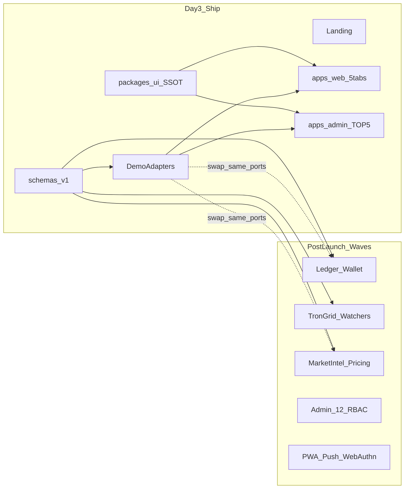

# AI Profit OS — 3일 UI/UX 우선 출시 수정안 (v7.7 델타)

> **전제(확정):** Day3 공개물 = 마케팅 랜딩 + 유저앱 5탭 풀 UI(데모 데이터) + Admin TOP5 UI 셸(mock). 실원장·TronGrid·거래 집행·Push/WebAuthn·CAPI는 **출시 후 Wave**로 동일 스키마에 부착.
> **원본 플랜:** [`ai_profit_os_launch_54c1261e.plan.md`](c:\Users\PC\.cursor\plans\ai_profit_os_launch_54c1261e.plan.md) — 헌법·IA·카드·토큰 SSOT는 **폐기하지 않고 잠금**. 실행 순서·게이트만 쪼갠다.

---

## 1. 판정: 왜 원본 그대로면 3일 불가

원본은 **제품 OS 전체**를 한 번에 잠근 문서다. Day3에 동시에 요구하는 것:

- Double-entry ledger + reconciliation (M1)
- TronGrid·유저별 TRC20·chain-watchers ≤0.1s (§41)
- Nest/Rust engine + NATS + §36 가격 동기
- Admin 12모듈 + RBAC + ops 분리 (§39~§40)
- PWA Push/WebAuthn/haptics + Store bridge
- Marketing CAPI + SEO + Growth G1~G4
- Zero-defect 게이트 40+ 항목 (§19)

이건 **수주~수개월** 로드맵이다. 3일 UI 출시와 충돌하는 지점은 “범위”이지 “IA/디자인 SSOT”가 아니다.

**수정 원칙 한 줄:**  
**잠글 것(SSOT)은 Day0에 전부 잠그고, 돌릴 것(런타임 기능)은 Adapter로 비워 출시한 뒤 Wave로 채운다.**



---

## 2. 원본에서 유지(잠금) vs Day3 제외(연기)

### 2.1 Day0에 **반드시 잠금** (나중에 바꾸면 UI 전면 재작업)

| SSOT | 원본 절 | Day3 역할 |
|------|---------|-----------|
| 5탭 IA + route | §5 | 실제 라우트 구현 |
| Opportunity Card 스키마·시선순서 | §4, §6.1 | 카드 UI + mock JSON |
| Lux-Fintech tokens·모션 규칙 | §6.2, §28 | CSS vars + 2~3 motion |
| ko copy glossary / 금지어 | §1.2, §25, §27 | `packages/ui/copy/ko` |
| Toast code catalog (문구만) | §8 | UI toast 컴포넌트 + demo 트리거 |
| Admin TOP5 정보구조 | §9.5 | 화면 셸만 |
| Trust 카피 톤 (§38) | §5.7, §38 | WhyUsdt·면책 **문구·접힘 UI** |
| “수익 확정” 금지 / Product Identity | §0.1, §1 | 카피·CTA 검증 |

### 2.2 Day3에 **구현하지 않음** (계약·자리만)

| 기능 | 원본 | Day3 처리 |
|------|------|-----------|
| Ledger / double-entry | §11, M1 | `MoneyPort` mock · 잔액은 seed JSON |
| TronGrid / chain-watchers | §41 | 입금 화면 QR·주소 **데모 문자열** + “자동확인” 카피만 |
| KRW Admin 승인 실플로우 | §41 | 상태 배지 UI만 (대기/완료/거절) |
| KYC 실심사 | §42 | `/me/kyc` 폼 UI + toast 라우팅만 |
| Rust engine / adapters | M2 | `OpportunityFeedPort` → fixture |
| §36 실시간 가격 SSE | §36 | 로컬 setInterval patch 또는 정적 |
| NATS / Temporal / OTel | §12, §15 | 없음 |
| Web Push / WebAuthn / Badge | M3.5 | manifest + install 가이드만 (선택) |
| CAPI / IndexNow / Store | M6, M8 | 랜딩 1종 + OG 기본만 |
| Growth G1~G4 | §35 | **전부 OFF** · UI 자리 없음 |
| Admin 12모듈·RBAC·ops IP | §9, §40 | TOP5 셸 + 같은 레포 `apps/admin` (도메인 분리는 Wave) |
| AI L1/L2 / Shadow Replay | §13 | 카드에 AI점수 **표시만** (고정/랜덤 fixture) |

### 2.3 원본 §18 선행순서 → **3일용으로 재배열**

원본: Constitution → schemas → ui → sim → **Money** → User → Admin → Marketing → Store  

**3일:** Constitution 요약(최소) → schemas(카드·toast·copy) → `packages/ui` → `apps/web` 풀 UI → 랜딩 → Admin TOP5 셸 → CF Pages 배포  
Money/sim/engine은 **Wave A부터**.

---

## 3. “기능이 똑같이 붙게” — 부착 계약 (필수 보완)

원본 monorepo는 맞지만, **포트가 없으면** UI를 다시 뜯게 된다. Day3에 아래를 **얇게** 넣는다.

### 3.1 Ports (인터페이스만, 구현은 Demo)

- `OpportunityFeedPort` — list/get/subscribe(patch)
- `WalletPort` — balances, depositAddress, depositRequest, withdrawIntent
- `TradePort` — participate mock state machine (15초 플로우 UI)
- `ToastPort` — code → ko copy → show (중복 방지 키만 클라이언트)
- `AdminOpsPort` — TOP5 queue counts + approve/reject **no-op + toast**
- `SessionPort` — 로컬/데모 로그인 (Passkey는 Wave)

### 3.2 Feature flags (`NEXT_PUBLIC_FF_*` 또는 remote later)

```
ff.demoMoney=true
ff.liveEngine=false
ff.onchainDeposit=false
ff.kycGate=true          // UI 게이트만
ff.growthG4=false
ff.push=false
```

실기능 붙일 때: **스키마 불변 + DemoAdapter → LiveAdapter 교체 + flag ON**. UI 컴포넌트는 그대로.

### 3.3 스키마 Day3 최소 세트 (원본 schemas 중)

필수: `opportunity-card.v1`, `toast-codes.v1`, `ui-copy-glossary.v1`, `kyc-status.v1`(UI용), `user-deposit-address.v1`(데모 shape), `krw-deposit-request.v1`(상태 enum)  
연기: ledger entries, admin-rbac, attribution, pricing full recalc 이벤트.

### 3.4 화면은 “완성”, 버튼은 “연결 대기” 금지 규칙

- Primary CTA는 **항상 동작** (데모 거래 플로우 / 데모 입금 완료 토스트).
- Live-only 액션은 숨기지 말고 **같은 UI + “준비 중”이 아닌 데모 성공 경로**로 통일 (출시 후 LiveAdapter만 교체).
- Admin [승인]도 mock ledger 반영처럼 **화면 숫자가 바뀌게** 해서 UX 검증 가능.

---

## 4. Day0~Day3 실행 컷 (UI/UX 최대치)

### Day 0 (반나절) — SSOT 고정만

- `CONSTITUTION` 최소 5파일 stub: IA(22), copy(25), lux(28), trust(38), identity(1) — 전문 28개 전부.
- `schemas/*` 최소 세트 + fixture JSON 20~30장 Opportunity.
- monorepo: `apps/web`, `apps/admin`, `packages/ui`, `packages/sdk` (ports만).

### Day 1 — Design system + 홈·수익

- Lux tokens, 타이포, fluid type, 5탭 셸, OpportunityCard, MotionCTA, CountUp(데모).
- `/` 홈 블록 A~G UI (ticker/counter는 **demo mode 고정**, G4 Admin UI 없음).
- `/profits` 필터 6개 + 가상 리스트(또는 단순 페이지네이션; Virtual은 여유 시).
- `verify:korean-ui` 수준의 하드코딩 영어 스캔(스크립트 간단판).

### Day 2 — 거래·지갑·내정보·온보딩

- `/trades` ReceiptCard + 데모 실행 플로우(`/trades/{id}/execute` 상태 UI).
- `/wallet` · deposit(USDT/KRW 탭) · withdraw + KYC toast→`/me/kyc` **라우팅**.
- `/me` + guide 3페이지(§38) + 온보딩 5 step.
- Toast catalog 핵심 8~12개 실제 트리거.
- 랜딩 1개 (`/` 마케팅 또는 `/l/meta` 단일) — 매체 3종·CAPI는 Wave.

### Day 3 — Admin 셸 · 폴리시 · 배포 · UX polish

- `apps/admin`: TOP1~5 화면 레이아웃 + mock 큐 + 긴급정지 토글(클라이언트 flag).
- 반응형 320 / 390 / 768 / 1280 스냅 확인.
- reduced-motion / tier B: blur·레이더 ping OFF.
- Cloudflare Pages(또는 단일 호스트)에 `web` (+ 가능하면 `admin` 서브경로 또는 별도 프로젝트).
- Day3 게이트만 통과하면 **공개**.

**의도적 미달(원본 §19에서 제외):** ledger recon, Tron E2E, SSE 500ms, Push/WebAuthn, CAPI, ops IP/MFA, Lighthouse PWA 90, Store assetlinks.

---

## 5. Day3 출시 게이트 (원본 §19의 **축소판**)

- [ ] 5탭 route mobile=PC drift 0
- [ ] OpportunityCard 시선순서 SSOT
- [ ] 화면 영어·금지용어 0 (스캔)
- [ ] “수익 확정” CTA 0 · “예상 수익”만
- [ ] 온보딩 → 홈/입금 진입 E2E
- [ ] 데모 거래 플로우 end-to-end
- [ ] 입금/출금/KYC **화면 플로우** E2E (체인·실승인 없음)
- [ ] Toast code → ko 문구 매핑 (demo)
- [ ] Admin TOP5 셸 로드 + mock 액션
- [ ] Ports 뒤에 Demo만 연결됨 (Live import 0)
- [ ] Growth G1~G4 UI 노출 0

---

## 6. 출시 후 Wave (원본 기능을 “같은 자리”에 붙이는 순서)

| Wave | 붙이는 것 | UI 변경 |
|------|-----------|---------|
| **A** | Auth + 최소 API + 실잔액 read-model(아직 double-entry 단순화 가능) | WalletPort Live |
| **B** | Ledger + KRW 입금신청 Admin 승인 | 숫자 SSOT화, 데모 제거 |
| **C** | §41 TronGrid + watchers | 입금 주소 실발급, DEPOSIT toast 실이벤트 |
| **D** | Engine + §36 pricing SSE | 홈/수익 실시간, fixture 제거 |
| **E** | Admin 12모듈 + §39 finance + §40 ops 분리 | TOP5에 실데이터 |
| **F** | PWA Push/WebAuthn/haptics | 셸에 능력 주입 |
| **G** | Marketing CAPI/SEO/매체별 랜딩 | 랜딩 확장 |
| **H** | AI L2 / strategies / Growth switches | 점수·필터 고도화 |

원본 Milestone M0.5~M8는 **삭제하지 말고** 위 Wave에 매핑해 문서에 “Post-Day3”로 옮긴다.

---

## 7. UX를 3일에 “최대”로 끌어올리는 집중 포인트

원본의 점수판에서 Day3에 실제로 올릴 수 있는 축만 공략:

1. **수익-first 카드** — 숫자 계층·여백·모션 완성도
2. **한글 copy 일관성** — 신뢰·면책·USDT 납득 접힘 UI
3. **15초 거래 연출** — 상태 전환·Receipt·CountUp
4. **지갑 이중 탭 UX** — USDT 추천 ⭐ / 원화 검수 대기 감각
5. **토스트 톤** — cute user / ops admin 분리
6. **반응형·터치** — 5탭+sticky CTA 겹침 0
7. **랜딩 1장** — 브랜드·한 문장·CTA (매체 3종 욕심 금지)

하지 말 것(시간 도둑): Rust engine, NATS, 어뷰징 매트릭스 100%, Store bridge, fake ticker Admin CRUD, visual regression 전수, Constitution 28개 전문 작성.

---

## 8. 원본 플랜 문서에 넣을 수정 패치 (메타)

원본 파일 상단 `todos` / §18 / §19 / §20에 아래 레이어를 **추가**하는 형태로 보완 (기존 절 삭제 최소화):

1. **`§0.2 Launch Layers`** — L0 UI Shell (Day3) / L1 Money / L2 Chain / L3 Engine / L4 Native / L5 Growth
2. **`§18.1 Fast Track (72h)`** — 위 Day0~3
3. **`§19.0 Day3 Gate`** — 축소 게이트; 기존 §19는 `Full Prod Gate`
4. **`§16.1 Adapter Ports`** — Demo/Live 교체 규칙
5. todos: `day3-ui-shell`, `day3-demo-adapters`, `day3-landing`, `day3-admin-top5-shell`를 **맨 위**로; money/chain/engine 등은 `status` 유지하되 의존성을 `after:day3`로 표기

---

## 9. 리스크·정직 고지 (출시 카피)

- Day3 빌드는 **데모/시연 가능 제품 UI**이지 실자금 OS가 아님.
- 대외 카피에 자동입금·즉시정산·원금보장 암시 금지 (원본 Identity 유지).
- “출시” = 도메인에 UI 공개 + 피드백 수집. 실입금 ON은 Wave B/C 게이트 후.
