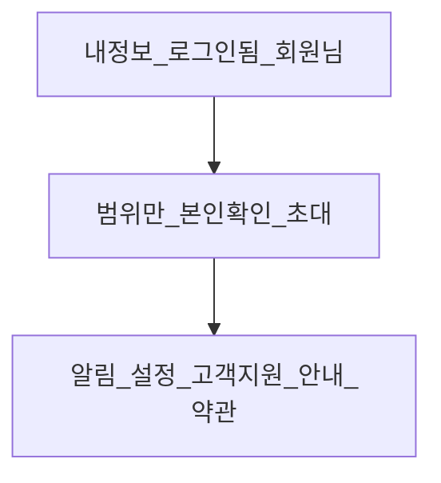

# ACCOUNT-HUB-FIGMA-001

Figma-first Visual Master. **프레임 2개만.** 구현·커밋·다음 태스크 자동 시작 없음.

## 권위 (충돌 시 위가 이김)

1. **현재 local repo navigation/route/owner**
2. Account Hub contract: [`governance/consumer-account-hub/account-hub.v1.json`](governance/consumer-account-hub/account-hub.v1.json) (`APPROVED_FIGMA_ACCOUNT_HUB = NONE`)
3. Founder Approved / Locked Home — **읽기만** ([`home-approval-freeze.v1.json`](governance/consumer-home-approval/home-approval-freeze.v1.json))
4. 현재 연결된 Figma의 Spark Dash 언어
5. 과거 reference는 최하위. **이전 GPT Account Hub 목업 이미지는 사용 금지**

`docs/product/consumer/CONSUMER_ACCOUNT_HUB_CONTRACT.md`는 verify가 가리키지만 이 폴더에 실파일이 없다. 이번 task에서 MD를 만들지 않는다. 디자인 권위는 governance JSON + 살아있는 라우트/카피.

## 확인된 Figma 작업 파일

연결된 계정: `퍼뜩` / 팀 `퍼뜩의 팀`.

현재 파일: `w7Yg8j2x9evuheOSSLqFw5` (페이지 2개만)

- `00_Readme` (`0:1`) — 모든 Founder Review 프레임이 가로로 배치
- `03_Components` (`2:68`) — PrimaryButton, StatusBadge, ExecutionMotionCore

기존 naming: `{Concept} / {Platform} / Spark Dash / Founder Review Candidate`

**클론 금지:** `Home / Desktop / Backup before Final Truth+Visual Overhaul` (`46:2`) — 구 sidebar `홈 / 지갑 / 내 정보`. 현재 nav와 다름.

**클론 허용 (safe duplicate):** 현재 8-item sidebar가 있는

- `Opportunity Room / Desktop / Spark Dash / Founder Review Candidate` (`96:2`)
- `Execution / Desktop / Running / Spark Dash / Founder Review Candidate` (`155:222`)

모바일 bottom nav 5개는 Room/Execution/Home Mobile과 repo가 일치. 클론 후 **더보기만 active**.

기존 Home / CUX-003 / CUX-004 / CUX-005 프레임·공유 컴포넌트는 **overwrite 0**. 공통 컴포넌트 변경이 기존 화면을 바꾸면 candidate-local duplicate만 쓴다.

배치: `00_Readme`에서 가장 오른쪽 Execution Mobile(`x≈15100`) **오른쪽 빈 칸**에 신규 프레임. 기존 프레임 위로 올리지 않음.

## Repo truth (디자인에 고정)

### Desktop sidebar — 그대로 8개, `/me` 탭 추가 0

[`visual-fixture.ts`](apps/web/components/spark-dash-home/visual-fixture.ts) / Room·Profits map-runtime과 동일:

1. 홈 `/`
2. 기회 탐색 `/profits`
3. 내 자산 `/wallet`
4. 참여 내역 `/trades`
5. 정산 내역 `/wallet/history`
6. 파트너 `/me/guide/partners`
7. 알림 `/me/inbox`
8. 설정 `/me/settings`

`/me`는 sidebar primary가 아니다. profile chip도 `/me` 링크가 아니다 ([`HomeDesktop.tsx`](apps/web/components/spark-dash-home/HomeDesktop.tsx) `<span className="sd-profile">`). **어느 sidebar item도 active로 켜지 않는다.**

사이드바 하단 `퍼뜩 AI` → `/me/peotteok`는 기존 chrome. Primary 8로 승격하지 않는다.

### Mobile bottom nav — 그대로 5개

[`HomeMobile.tsx`](apps/web/components/spark-dash-home/HomeMobile.tsx) `MOBILE_NAV`:

홈 `/` · 기회 탐색 `/profits` · 내 자산 `/wallet` · 알림 `/me/inbox` · **더보기 `/me` (only active)**

`ACTIVE_NAV_COUNT = 1`

### Primary 8 — 유저 라벨은 기존 한국어만

[`ProfileClient.tsx`](apps/web/app/me/ProfileClient.tsx) + PendingFigma title:

| 영역 | 라벨 | 라우트 | `/me`에서의 역할 |
|---|---|---|---|
| Profile | 내정보 | `/me` | 이 화면 자체 (자기 링크 카드 금지) |
| Referral | 초대 | `/me/invite` | destination |
| Notifications | 알림 | `/me/inbox` | destination |
| KYC | 본인 확인 | `/me/kyc` | destination |
| Settings | 설정 | `/me/settings` | destination |
| Support | 고객지원 | `/me/support` | destination |
| Guides | 안내 | `/me/guide/*` (진입 `/me/guide/usdt`) | destination |
| Legal | 약관 | `/me/legal` | destination |

호환 4 (`/me/membership` `/me/benefits` `/me/events` `/me/strategies`)와 `/me/peotteok`는 **카드/탭 승격 0**. 라우트 삭제 연출도 하지 않음. 화면에 안 넣는다.

### 표현 가능한 product truth만

- **세션:** `AuthSession`에 `displayName` 없음. 런타임 Home fallback = `회원님`, level = `—`. Figma에도 **Lv.1/2/3 금지**, 가입일/최근 로그인 발명 금지. 카피: `로그인되어 있어요.`
- **아바타:** 기존 Spark Dash 일러스트 chrome. 실사진/실명 주장 금지.
- **초대:** code / bind / share만. `%` · L1/L2/L3 · 가짜 인원/수익 금지. 코드 없으면 빈 상태 annotation (`없음`).
- **알림:** 배지 숫자 0. 메인에 가짜 unread 금지. empty 카피: `지금은 알림이 없어요.`
- **KYC:** withdrawal gate only. 기존 카피: `출금 전에 본인 확인이 필요해요. 참여·입금은 막지 않아요.` 상태 enum = `none | pending | approved | rejected` — annotation만, 별도 화면 0. gender / RRN / 새 단계 0.
- **설정:** 알림 설정 · 로그아웃 · 탈퇴(`탈퇴하겠습니다` 2-step). `/me`에서는 destination만. `/me/security` 0.
- **고객지원:** deposit-disputes. TRC20/네트워크 선택 UI 0.
- **약관:** 기존 링크만 — 이용약관 / 개인정보 / 라이선스 / 오픈소스. 조문 창작 0.
- **머니:** content 영역에 잔액/수익 발명 0. sidebar 금액은 기존 셸 구조만 유지하고 값은 runtime missing 패턴 `—` (fixture `2,450` 복사 금지).

로그아웃은 Profile 보조 CTA로 정직한 텍스트. 탈퇴 UI는 설정으로만.

## 디자인 구조 (상상해도 되는 것 = 레이아웃만)

같은 제품, 다른 IA. Home geometry에 종속시키지 않는다. Home 기회 스트립(`새로운 글로벌 기회가 업데이트됐어요`)을 Account Hub 뉴스로 재사용하지 않는다.



### Desktop 1440×1080

- 셸: 220px navy sidebar (8 nav, none active) + header(벨 배지 없음, profile `회원님` / `—`)
- content:
  1. **내정보** — 일러스트 아바타 + `회원님` + `로그인되어 있어요` + 로그아웃
  2. **계정에서 바로 확인할 것** — 2칸: 본인 확인 / 초대 (범위 카피만, 가짜 상태값 없음)
  3. **계정 관리** — 알림 · 설정 · 고객지원 · 안내 · 약관. 리스트+아이콘, 카드 과밀 금지
- 40~70대 가독: 작은 본문 금지, 영어 카테고리명 금지 (`Referral` 대신 `초대`)

### Mobile 390×693

- header: 퍼뜩 + 벨(배지 없음)
- first viewport에 반드시: 헤더 + 내정보 + 핵심 destination 일부 + bottom nav(더보기 active)
- 나머지는 스크롤. 터치 높이 ≥ 44px
- Home quick-action(기회/자산/참여/정산)을 `/me`에 복제하지 않음 — 그건 Home job

## Figma 품질 / 실행 방법

실행 시 스킬: `figma-use` 필수. **`generate_figma_design` + 신규 목업 스크린샷 = 안 함** (task: NEW MOCKUP IMAGE GENERATION = NO, Playwright/dev server = NO). `/me` 코드는 `PendingFigma`라 찍을 권위도 없음.

- 기존 변수/텍스트 스타일/아이콘 언어 재사용 (deep navy, warm dark, restrained `#ff2d6b`)
- Auto Layout, 실제 레이어 트리, 스크린샷 1장 붙여넣기 금지
- ExecutionMotionCore(강한 glow) 재사용 금지 — Account Hub는 거래 terminal이 아님
- candidate-local: `Hub / Identity`, `Hub / Scope Tile`, `Hub / Destination Row`
- 프레임 옆 annotation (요청 문구 그대로):

```text
TASK = ACCOUNT-HUB-FIGMA-001
STATUS = FOUNDER_REVIEW_CANDIDATE
PRODUCT_TRUTH = Primary 8 only · Compatibility 4 not promoted · KYC withdrawal only · Referral % absent · L1/L2/L3 absent · Fake notifications absent · New Security route absent
NAV_TRUTH = Desktop current 8 preserved · Mobile current 5 preserved · Mobile More → /me · ACTIVE_NAV_COUNT = 1
```

목표 프레임 이름:

- `Account Hub / Desktop / Spark Dash / Founder Review Candidate`
- `Account Hub / Mobile / Spark Dash / Founder Review Candidate`

## 절대 금지 (실행 중)

git commit/push/stash/reset/restore/clean/amend · `apps/web` · packages · services · shared CSS · Home/Profits/Room/CUX-005 · DB · C-ACC-004 착수 · CUX-006 착수

## 완료 보고

요청한 `ACCOUNT-HUB-FIGMA-001 REPORT` 형식만. `WAITING_FOR = FOUNDER_VISUAL_REVIEW`. STOP.
