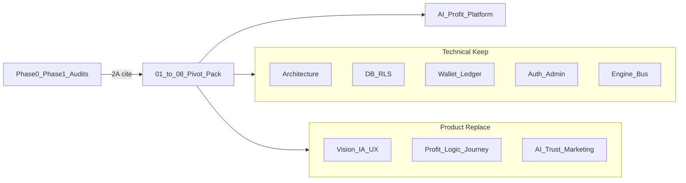

# AI Profit Platform — Product Pivot Synthesis Pack (1B+ · 2A)

## Project Override (applies to all 8 docs)

Every file opens with this banner (verbatim intent):

```text
PROJECT OVERRIDE — Product Pivot
This repository was originally built for CLIME Money OS / AI Asset & Income OS.
From this pack onward, the target product is: AI Profit Platform.
Prior product vision / funnel / IA / UX docs are historical reference only.
Do NOT force the new product to follow the previous business direction when it conflicts.
Technical foundation (architecture, DB, wallet, auth, admin, engines, CI, security) is preserved for reuse.
Product direction, IA, UX, feature hierarchy, and business flow may be redesigned completely.
```

**Mode**: Product Pivot — not greenfield, not maintenance.

- Architecture / infra → **Reuse**
- Business logic / UX / identity → **Redesign / Replace**

**Method (2A)**: Synthesis only. Cite existing inventories; do not re-Glob/re-derive counts unless a cited number is missing. Primary sources:

- [`CURRENT_UI_INVENTORY.md`](CURRENT_UI_INVENTORY.md) · [`CURRENT_STATE_MAP.md`](CURRENT_STATE_MAP.md)
- [`FEATURE_DELETION_PLAN.md`](FEATURE_DELETION_PLAN.md) · [`FEATURE_CREEP_REPORT.md`](FEATURE_CREEP_REPORT.md)
- [`CLAI_GAP_ANALYSIS.md`](CLAI_GAP_ANALYSIS.md) · [`CLAI_FULL_AUDIT.md`](CLAI_FULL_AUDIT.md)
- [`docs/engines/README.md`](docs/engines/README.md) · [`00_table_ownership.md`](docs/engines/00_table_ownership.md) · [`00_event_catalog.md`](docs/engines/00_event_catalog.md)
- [`CURRENT_DESIGN_SYSTEM_AUDIT.md`](CURRENT_DESIGN_SYSTEM_AUDIT.md)
- Phase1 seals under [`docs/ops/phase1-*.md`](docs/ops/) (technical status only; Wealth OS product intent = historical)

**Out of this pack**: no `src/**` / migration edits, no Wave YAML flips, no remote DB changes. Docs only.

**Working product definition** (used in 05–08 until PO revises):

> **AI Profit Platform** — AI recommends and orchestrates profit opportunities; user approves; wallet/ledger settles **USDT-first**; product identity is profit outcome, not earn-first side-hustle Money OS. Prior Sacred Funnel / Wealth Journey / Play Economy business framing is not binding.

---

## Deliverables (repo root)

| #   | File                                                               | Job                                                                 |
| --- | ------------------------------------------------------------------ | ------------------------------------------------------------------- |
| 01  | [`01_CURRENT_PLATFORM_DNA.md`](01_CURRENT_PLATFORM_DNA.md)         | What the **current** platform is (historical DNA) + pivot statement |
| 02  | [`02_TECH_ASSETS_TO_KEEP.md`](02_TECH_ASSETS_TO_KEEP.md)           | **Primary deliverable** — tech reuse register with %                |
| 03  | [`03_PRODUCT_ASSETS_TO_REMOVE.md`](03_PRODUCT_ASSETS_TO_REMOVE.md) | Product/IA/UX/flow to remove or replace                             |
| 04  | [`04_ENGINE_REUSE_PLAN.md`](04_ENGINE_REUSE_PLAN.md)               | Per-engine keep / adapt / retire-for-product                        |
| 05  | [`05_AI_PROFIT_REQUIREMENTS.md`](05_AI_PROFIT_REQUIREMENTS.md)     | New target requirements SSOT                                        |
| 06  | [`06_GAP_ANALYSIS.md`](06_GAP_ANALYSIS.md)                         | Current tech vs AI Profit requirements                              |
| 07  | [`07_REBUILD_STRATEGY.md`](07_REBUILD_STRATEGY.md)                 | Pivot strategy (tech preserve / product replace)                    |
| 08  | [`08_MASTER_REBUILD_TODO.md`](08_MASTER_REBUILD_TODO.md)           | Prioritized work list for the pivot                                 |

Index pointer: add a short “Product Pivot pack” section at the top of [`CURRENT_STATE_MAP.md`](CURRENT_STATE_MAP.md) **only if** needed for discoverability; prefer a one-line cross-link inside `01` instead of rewriting sealed audits.

---

## 1B+ Keep / Replace matrix (SSOT for the pack)

**KEEP (technical)** — Architecture, Database, Wallet, Auth, Admin, Deployment, Security, Code Quality, Testing, Infrastructure, CI/CD, Monitoring, Parser/API framework, Engine framework (15 engines + event bus + ledger rules), Design System primitives, Notification plumbing, Supabase/RLS patterns.

**REPLACE (product)** — Product Vision, IA, UX, Home, Navigation, Recommendation, Profit Logic, Business Flow, User Journey, Terminology, Reward Flow, Onboarding, Landing, Marketing, AI Strategy, Trust Strategy (display narrative; legal compliance mechanism still kept as tech/legal rail).

Compliance contracts, ledger integrity, RLS, admin-only balance mutate remain **technical/legal KEEP** even when marketing Trust Strategy is redesigned.

---

## Per-file outline

### 01 — Current Platform DNA

- Override banner + “this describes _as-built_, not the new target”
- One-liner historical identity (Money OS / AI Asset & Income OS)
- Sacred funnel (earn-first) as **historical**
- Five pillars / CLAI as growth-loop operator as **historical**
- Shipped capability spine: Auth → Wallet/Ledger → Invest/Yield → Income/Mission/Reward → Invite → Community/Trust display → Admin → CLAI (`/ai-coach`)
- Cite [`CURRENT_STATE_MAP.md`](CURRENT_STATE_MAP.md) for counts (92 routes, 15 engines, 173 migrations, etc.)
- Close with pivot sentence: DNA is inheritance inventory, not product mandate

### 02 — Tech Assets to Keep (most important)

For each asset class, a row:

| Asset | Reuse % | Keep reason | Required changes for AI Profit | Evidence cite |
| ----- | ------- | ----------- | ------------------------------ | ------------- |

Asset classes (minimum):

1. **Ledger engine** — ~95–100% (double-entry, kinds, no user mutate)
2. **Wallet engine** — ~90–95% (deposit/withdraw/history; change KRW-priority UX → USDT-first; profit settlement hooks)
3. **Auth / session / KYC plumbing** — ~90%+
4. **Admin engine + admin UI shell** — ~85% (queues/ops KEEP; growth/display tabs may be product-replaced)
5. **Investment / Yield engines** — ~70–85% (position/yield machinery reusable; product catalog/copy/IA redesign)
6. **Reward / Mission / Income / Referral / Level** — ~40–70% (plumbing KEEP; reward _product flow_ REPLACE — detail in 03/04)
7. **Notification / Risk / Analytics** — high plumbing reuse
8. **AI Coach engine** — ~50–70% (Decision()/scripts/event emit reusable as _recommendation kernel_; product strategy REPLACE)
9. **Event bus + `domain_events` + outbox** — ~100%
10. **Supabase schema / RLS / migrations** — high reuse; additive migrations for new profit entities only
11. **API `/api/v1/**` shape\*\* — high reuse; new profit routes additive
12. **Design System (`src/components/ui`, tokens)** — KEEP architecture ([`CURRENT_DESIGN_SYSTEM_AUDIT.md`](CURRENT_DESIGN_SYSTEM_AUDIT.md) KEEP verdict); visual brand of pages may redesign
13. **Behavior primitives** (`action-slot`, etc.) — KEEP as consolidation mechanism
14. **CI / test tier / verify scripts / monitoring** — KEEP
15. **PWA / i18n infra** — KEEP plumbing; copy REPLACE

Reuse % rules (document in §0 of 02):

- % = estimated fraction of **existing implementation** still valuable under AI Profit (not lines of code deleted)
- Banded estimates (e.g. 95, 85, 70, 50) with one-line reason — not false precision
- Example pattern (user-mandated):

```text
Wallet Engine
Reuse: 95%
Reason: Multi-balance + transaction history + deposit/withdraw rails.
Required changes:
- KRW priority → USDT priority
- Profit settlement flow update
```

### 03 — Product Assets to Remove

Synthesize from [`FEATURE_DELETION_PLAN.md`](FEATURE_DELETION_PLAN.md) + pivot REPLACE list. Sections:

- Product vision / Money OS / earn-first funnel (demote to history)
- IA/nav that centers Income/Invite/Play over profit desk
- Home / Journey / Play V2 _product intent_ (Phase1 flags) — tech may stay; business framing removed from target
- Reward-flow proliferation (mission costumes, parallel ladders) — cite creep report
- Marketing/Trust _strategy_ surfaces that sell Wealth Journey (mechanism KEEP where SEO/legal requires)
- Terminology (클라이 Money OS framing vs new AI Profit lexicon — new lexicon defined in 05)
- Verdict taxonomy for this pack: **REMOVE | REPLACE | PARK (tech freeze)** — do not silently reopen Compliance Core deletion; legal pages stay unless PO later overrides

### 04 — Engine Reuse Plan

One subsection per canonical engine (15) + note `settings/` / `settlement-chain/`:

| Engine | Reuse % | Role in AI Profit | Adaptations | Do not break |
| ------ | ------- | ----------------- | ----------- | ------------ |

Emphasize:

- Ledger/Wallet/Admin/Notification/Risk = backbone
- Investment/Yield = profit settlement candidates (adapt product meaning)
- Mission/Reward/Referral/Income/Level = optional growth modules — product-optional, tech-reusable
- AI Coach → **Profit Recommendation Engine** (rename is product; folder id may stay `ai-coach` until a later code wave)
- Automation/Analytics = ops KEEP; Growth OS tables remain DESIGN FREEZE unless PO opens them

### 05 — AI Profit Requirements (new SSOT)

Author the **new** product requirements (not a summary of Money OS):

1. Identity & one-liner
2. Core profit loop (recommend → approve → execute/settle → report)
3. Currency / rail policy (USDT-first default)
4. AI roles (recommend, explain, risk-plain, never ledger-mutate)
5. User journey (new; not earn-first unless PO opts in)
6. Home / Nav / IA requirements
7. Wallet & settlement requirements
8. Admin / ops requirements (reuse queues)
9. Trust & compliance minimum (legal rails KEEP; marketing strategy free)
10. Non-goals (explicitly drop Money OS sacred funnel as mandatory)
11. Success metrics for the pivot pack itself (docs ACK → later code waves)

### 06 — Gap Analysis

Matrix: Requirement (05) × Current capability (01/02/04) → **Have / Partial / Missing**.

Reuse CLAI gaps from [`CLAI_GAP_ANALYSIS.md`](CLAI_GAP_ANALYSIS.md) only where still relevant under Profit (e.g. duplicate NBA, no memory) — reframe target column to AI Profit, not Wealth OS locks.

### 07 — Rebuild Strategy

- Principles: Architecture > Reuse · Business > Redesign · UX > Redesign · Identity > Replace · Foundation > Preserve
- Sequencing: Freeze tech contracts → Write product SSOT (this pack) → Thin product surface → Wire profit loop on Wallet/Ledger → AI recommend cutover → Marketing/IA last
- Relation to sealed Phase1: **product Waves of Wealth OS are not the north star**; reusable code (Decision(), flags, consumers) may be harvested; do not continue implementing Money OS journey as the goal
- Risk: constitution/`.mdc` still describe Money OS — call out that **governance doc update is a later PO wave**; this pack is the product override for pivot planning

### 08 — Master Rebuild Todo

Prioritized backlog (P0–P3), each item: outcome, depends on, cites 02/04/05/06, tech vs product tag.

Suggested P0 themes:

1. PO ACK this pack + Override
2. Lock tech KEEP list from 02 (no accidental engine delete)
3. Define profit settlement ledger kinds / events (design-only until code wave)
4. USDT-first wallet UX requirements freeze
5. AI recommend → profit action contract
6. Strip or quarantine Money OS–only surfaces from target IA
7. Compliance/legal pass for new profit claims
8. Then implementation waves (explicitly **after** this doc pack)

---

## Execution constraints (when user approves plan)

- Write all 8 markdown files at repo root in one docs-only session
- Synthesis citations with section pointers; no fake new route/engine counts
- No commits unless user asks
- Do not edit constitution/Product OS sealed files in this pack (override lives _inside_ the 8 docs)
- Korean or bilingual section headers OK where existing root audits use English titles; keep filename English as specified


