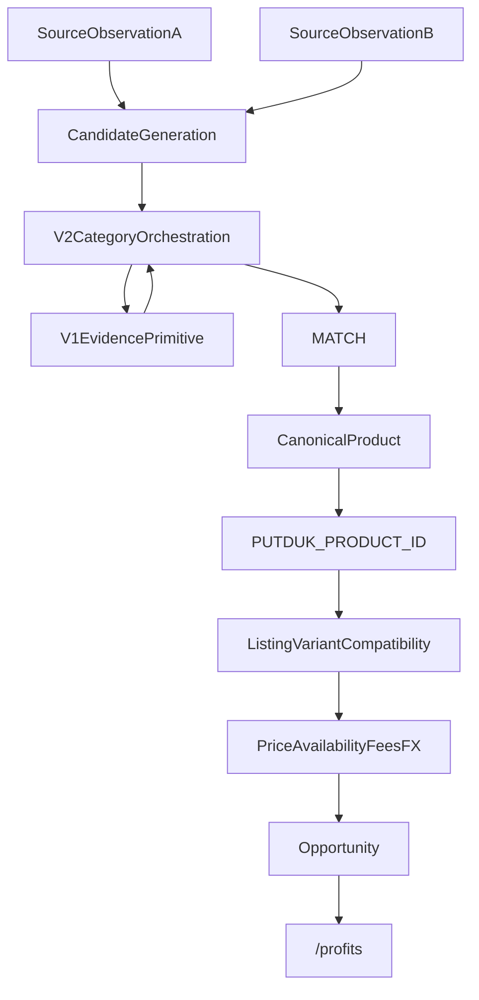

# PUTDUK Canonical Product Identity And Matching V2 Design

이번 작업은 **DESIGN + REPO AUDIT ONLY** 다. production matcher / parser / DB / Opportunity / Home / Money 변경 0. `PUTDUK_EBAY_TYPED_IDENTITY_COVERAGE_FORENSIC` 실행 0. commit / push / stash / restore 0. dirty tree(Spark Dash UI 포함) 미접촉.

Founder 승인 후 이 플랜의 실행은 **신규 governance 계약 파일만** 쓰는 것으로 닫는다. V1 런타임은 열지 않는다.

## Git safety (이미 확인)

- HEAD = `0345206ad2e7238658454db5d072c8fbf93dbb37`
- Working tree = DIRTY (예상). 보호 대상.
- `PUTDUK_EXTERNAL_PRODUCT_ID_USER_REQUIREMENT = NO` 가 이번 slice 최고 authority.

## 현재 V1 지도 (삭제 대상 아님)

[`governance/global-product/identity-matching.v1.json`](governance/global-product/identity-matching.v1.json) + [`matcher.cjs`](services/market-intelligence/src/identity-matching/matcher.cjs) + [`normalize.cjs`](services/market-intelligence/src/identity-matching/normalize.cjs)

```text
matchSourceObservations(left, right)
  → extractNormalized (typed IDs + brand/model/size/color)
  → matchingDecisionEligible = CONFIRMATION+SUCCESS only
  → compareTypedIdentifiers: GTIN | brand+MPN | brand+WATCH_REFERENCE
  → profileEngine(luxury_bag|fashion|watch|unknown)
  → decide() → MATCH | NO_MATCH | INSUFFICIENT_EVIDENCE | CONFLICT
```

V1이 실제로 비교하는 evidence:

- **STRONG typed:** GTIN exact; MPN exact + brand both present and equal; WATCH_REFERENCE exact + brand both present and equal
- **Source-specific emit:** eBay `item.gtin`→hints, eBay `item.mpn`→`meta.modelNumber` as MPN; Chrono24 `sku|reference`→`meta.modelNumber` as WATCH_REFERENCE; Fashionphile SKU는 typed ID가 아님
- **luxury_bag corroborating MATCH:** owner-backed categoryHint로 profile 결정 + brand exact + model exact + size/color 양쪽 있으면 불일치 시 NO_MATCH. **GTIN 없이도 MATCH 가능** (fixture P)
- **watch corroborating `ok`는 항상 false.** watch MATCH는 typed WATCH_REFERENCE path만
- **unknown:** typed strong만. title/image/price/source 이름 금지
- **명시적 금지 lock:** Fashionphile SKU ≠ eBay MPN (K); raw `modelNumber` cross-type equality 금지 (L); discovery pair MATCH 금지 (J); image-only INSUFFICIENT (I); title-only INSUFFICIENT (C)

기존 listing-leg matcher ([`watch-match.cjs`](services/market-intelligence/src/watch-match.cjs) / [`card-match.cjs`](services/market-intelligence/src/card-match.cjs) / [`bag-match.cjs`](services/market-intelligence/src/bag-match.cjs) → Asset Master)는 **다른 층**이다. V2가 대체하거나 삭제하지 않는다.

```text
Asset Master.assetId  !=  CanonicalProduct  !=  PUTDUK_PRODUCT_ID
SOURCE_OBSERVATION != LISTING_LEG != OPPORTUNITY
discoverCandidates = NOT_IMPLEMENTED (유지)
IDENTITY_MATCHING_DB_RUNTIME = NOT_IMPLEMENTED
PRODUCTION_OBSERVATION_PERSISTENCE = NOT_IMPLEMENTED
```

## Founder 의도와 V1의 관계

V1은 “잘못된 코드”가 아니라 **strict deterministic evidence primitive** 다.

V1의 한계는 PUTDUK 최종 제품 목표와 어긋나는 지점이다.

- 사용자에게 GTIN/MPN을 보여주거나, 그 값이 있어야만 동일 상품으로 보는 구조가 목표여서는 안 됨
- 현재 live forensic([PUTDUK_REAL_MATCH_PAIR_SOURCE_SELECTION_FORENSIC](9bcadcee-848e-4814-bd8c-8f555919f822)): eBay Confirmation 샘플에서 GTIN/MPN 공란, 카드번호/style code는 title-only. Fashionphile은 owner-backed이나 V1-usable typed ID 없음 (`BLOCKED_NO_V1_USABLE_OWNER`)
- V1에 `sneakers` / `trading_card` profile 없음. 카드 set+number는 Asset Master 쪽에만 있음
- CanonicalProduct / PUTDUK 상품번호 / candidate generation / variant compatibility 없음

따라서 V2는 V1을 약화시키지 않고 **그 위 category-aware orchestration** 이 된다.



`CANDIDATE`는 candidate-generation 전용이다. MATCH truth가 아니다.

## 제안 V2 architecture

```text
identity-matching.v1
  = typed identifier compare
  + evidence rows
  + fail-closed decide()
  + existing fixtures/verifier 동결

identity-matching.v2
  = Category Identity Profile
  + multi-signal assembly
  + conflict-first orchestration
  + MATCH 후에만 CanonicalProduct 연결
```

V1 `MATCHER_VERSION` / `verify:identity-matching-v1` / fixture A–P를 FAIL로 되돌리는 migration 금지.

V2 결과는 `matcherVersion = identity-matching.v2` 로 태그. V1 MATCH는 계속 유효.

LLM/Vision은 이후에도 candidate / attribute assist / image corroboration만. `"AI가 비슷해 보인다"` 는 MATCH owner 금지.

## CanonicalProduct / PUTDUK ID

MATCH가 충분히 증명된 뒤에만 생성/연결. ID 발급 ≠ identity proof.

제안 모델 (migration 0, 제안만):

```text
CanonicalProduct {
  canonicalProductId      // opaque PK, 예: cp_<ulid>
  putdukProductCode       // presentation, 예: PD-0001842
  categoryProfile
  canonicalAttributes
  variants[]
  identityEvidenceSummary
  createdAt, updatedAt
}

CanonicalProductSourceLink {
  canonicalProductId
  source, sourceItemId, sourceUrl, observationId, observedAt
  nativePrice + priceSemantics
  matchingDecision, matcherVersion, evidence[]
}
```

PUTDUK code 원칙: INTERNAL_STABLE / NON_SEMANTIC / SOURCE_INDEPENDENT / NO_EBAY_OR_STOCKX_EMBED / NO_CATEGORY_MEANING_REQUIRED.

정확한 `PD-` padding·allocator는 Founder 승인 전 production 확정 금지. DB PK와 presentation code는 분리하는 쪽을 권고.

사용자 화면은 퍼뜩 기준 정보만. 내부 provenance는 숨긴다고 삭제하지 않음. Trust/Details 여지는 남김.

## Category profiles — MVP만

Asset Master enum(`watch|trading_card|luxury_bag`)과 parser product-fit을 이번 slice에서 확장하지 않는다. V2 profile은 **matching contract** 로만 존재한다. electronics/general goods는 MVP 밖.

### sneakers

- CanonicalProduct = brand + model + colorway + manufacturer style (있을 때)
- **Size = Variant / listing unit. 별도 CanonicalProduct 아님**
  - `Nike Dunk Low Panda` 와 `Nike Dunk Low Panda US9` = 같은 상품 + size variant
  - Opportunity는 이후 `TRADABLE_EQUIVALENT`(사이즈 호환)에서 걸러짐
- Gender: style code가 갈리면 CONFLICT. 같은 style에 라벨만 다르면 variant
- STRONG 후보: owner-backed manufacturer style exact + brand
- eBay `localizedAspects.Style = "Sneaker"` 는 상품 종류이지 style code가 아님. MPN으로 승격 금지
- title 속 `DD1391-100` = PRESENTATION_ONLY. 자동 STRONG 금지

### trading_card

- CanonicalProduct = game + set + card number + character/name + language + finish/edition
- **Grade + grading company = tradable variant. 같은 CanonicalProduct의 raw identity 위에 얹음**
  - raw vs PSA 10 vs BGS 9.5 는 SAME_VARIANT 아님
  - MVP Opportunity는 기본 `TRADABLE_EQUIVALENT`에 grade 일치를 요구 (경제적으로 다른 상품)
- STRONG 후보: 양쪽 모두 **source-side owner-backed structured** set + card number (+ game when both present)
- title에서 `11/83` 추출 후 STRONG 승격 금지
- GTIN 없어도 이 geometry로 MATCH 가능. GTIN 있으면 AUTHORITATIVE_STRONG 추가

### watch

- CanonicalProduct = brand + manufacturer reference
- model / case size / dial / material = corroborating 또는 양쪽 있으면 critical variant
- condition / year-as-listing = identity 아님 (year가 reference를 가르면 corroborating)
- manufacturer reference exact + brand exact → STRONG. 유일한 길은 아님
- Chrono24 `WATCH_REFERENCE` ≠ eBay `MPN`. raw `modelNumber` 문자열 같음으로 MATCH 금지 (V1 fixture L 보존)
- Identity 가능성과 Chrono24 `AUTOMATED_ACQUISITION=BLOCKED_CURRENT_ENV` 를 섞지 않음

### luxury_bag

- CanonicalProduct = brand + model + size + color + material(있을 때)
- hardware / year-stamp = corroborating; 양쪽 있고 불일치면 fail-closed
- condition = listing, not identity
- 두 개의 Mini Kelly 20 Black = `SAME_CANONICAL_PRODUCT`, **절대 `SAME_PHYSICAL_ITEM` 아님**
- Fashionphile `sku` / `0000+sku+0` barcode = SOURCE_LOCAL_ONLY. cross-source manufacturer ID 금지
- title `Epsom Mini Kelly Sellier 20 Black` 를 model/size/color로 자동 승격 금지
- V1 fashion corroborating(brand+model, size/color critical)은 V2 luxury_bag primitive로 재사용

## Evidence / conflict / image

V1 strength(`STRONG|CORROBORATING|WEAK|CONFLICTING`) 위에 V2 tier를 **매핑**한다. 가짜 점수 하나로 덮지 않음.

- AUTHORITATIVE_STRONG → GTIN exact, 양쪽 owner-backed
- STRONG → brand+MPN / brand+watch ref / category-native structured identity (style, set+number)
- CORROBORATING → brand, model, color, image similarity, title similarity
- PRESENTATION_ONLY → title tokens, display names. MATCH owner 금지
- CONFLICTING → 평균 내지 않음
- NOT_COMPARABLE → 한쪽 없음 또는 type mismatch (Fashionphile SKU vs eBay MPN)

Conflict 우선:

- style `DD1391-100` vs `DD1503-101` → CONFLICT / NO_MATCH
- card `11/83` vs `12/83` → CONFLICT
- GTIN 일치 + MPN 불일치 → V1과 같이 CONFLICT
- image similar는 conflict를 덮지 않음

Image:

- candidate / corroboration / variant check / admin review
- `IMAGE_SIMILARITY = FINAL_MATCH_OWNER` 금지
- `OBSERVED_IMAGE != DISPLAY_AUTHORIZED` 유지. 표시 권한 구현 0

Confidence: deterministic evidence vector / profile rule / critical completeness만. 사용자에게 `AI 일치율 97%` 금지. 필요 시 `상품 확인 완료`. 기존 [`opportunity-card.v1`](schemas/opportunity-card.v1.json) `aiConfidenceScore`에 match confidence를 넣지 않음.

## Vocabulary (MVP 최소)

```text
SAME_CANONICAL_PRODUCT
SAME_VARIANT
TRADABLE_EQUIVALENT
SAME_PHYSICAL_ITEM   // 추론 금지. 관측하지 않음
```

Opportunity는 MATCH만으로 만들지 않는다.

```text
MATCH → CanonicalProduct → variant/tradable compatibility
  → current executable price → availability → fees/FX
  → Opportunity eligibility → Opportunity
```

Money / Ledger / FX owner 침범 0.

## Dry design evaluation (코드 변경 없이)

기존 forensic만 재사용. 새 live 조사 0.

- **TCG ↔ eBay card:** TCG set+number owner-backed. eBay brand/MPN/GTIN null, `11/83` title-only. **V2 = INSUFFICIENT_EVIDENCE.** CANDIDATE는 가능. MATCH 불가.
- **Sneaker:** eBay brand=Nike, model=Nike Dunks, MPN/GTIN null, `DD1391-100` title-only. StockX/GOAT/KREAM acquisition BLOCKED. **V2 = INSUFFICIENT_EVIDENCE.** 이후 counterpart가 owner-backed style을 내고 eBay도 owner-backed MPN/style을 내면 brand+style STRONG 검토. 지금은 불가.
- **Fashionphile Mini Kelly:** brand=Hermes, sku local, model/size/color/categoryHint 미emit, barcode SOURCE_LOCAL_ONLY. **V2 = INSUFFICIENT_EVIDENCE.** 이후 양쪽 owner-backed brand+model(+size/color)이면 GTIN 없이 luxury_bag MATCH 가능. SKU를 eBay MPN과 비교하지 않음.
- **Chrono24 watch:** repo geometry는 brand+WATCH_REFERENCE STRONG. Chrono24↔Chrono24는 V1 fixture M으로 이미 MATCH. Chrono24↔eBay는 현재 type 불일치 + 이번 환경 acquisition BLOCKED. Identity ≠ Acquisition.

## V1 migration / first real match

가장 안전한 방식: **V1 primitive 보존 + V2 orchestration 추가.** V1_PASS를 FAIL로 되돌리지 않음.

Source 선정은 `MATCHING_V2_CONTRACT_READY` 이후. 지금 TCGplayer/StockX/Chrono24를 고르지 않음.

`FIRST_REAL_CROSS_SOURCE_MATCH` 는 여전히 **현재 live observation 기준으로 BLOCKED**. V2가 푸는 것은 “GTIN 없으면 영원히 불가” 계약이지, 지금 당장 있는 title-only  evidenc로 MATCH를 여는 것이 아니다.

## 이 플랜 승인 후 쓰는 파일 (런타임 0)

다른 세션 dirty file 수정 금지. V1 matcher/normalize/fixtures/verifier 수정 금지.

- 신규 [`governance/global-product/identity-matching.v2.json`](governance/global-product/identity-matching.v2.json) — Founder locks, layers, profiles, evidence tiers, decisions, migration stance
- 신규 [`governance/global-product/canonical-product.v2.json`](governance/global-product/canonical-product.v2.json) — CanonicalProduct / SourceLink / PUTDUK code 제안, persistence NOT_IMPLEMENTED

commit / push 하지 않음.

## Implementation slices (설계 종료 후, 한 번에 구현 금지)

1. **Category Identity Profile Contract** — 이번 다음 작업. profile JSON + dry fixtures. V1 decide() 동결
2. Canonical Product Model Foundation — schema/proposal runtime 0
3. Matching V2 Pairwise Runtime — V1 primitive 호출, 새 profile additive
4. Candidate Generation — `discoverCandidates`를 MATCH로 승격 금지
5. One Real Category / One Real Pair Validation
6. Canonical Product Persistence
7. Listing / Variant Compatibility
8. Multi-source Opportunity Creation

`FIRST_IMPLEMENTATION_SLICE = CATEGORY_IDENTITY_PROFILE_CONTRACT`
`NEXT_CURSOR_TASK` = Slice 1. parser 추가 / eBay typed-coverage forensic / Opportunity / Home 0.

## 성공 판정 (이번 design)

```text
PUTDUK_CANONICAL_PRODUCT_IDENTITY_V2_DESIGN = PASS
FOUNDER_PRODUCT_INTENT_CAPTURED = PASS
V1_PRESERVATION_STRATEGY = PASS
CATEGORY_PROFILE_MODEL = PASS
CANONICAL_PRODUCT_BOUNDARY = PASS
PUTDUK_PRODUCT_ID_BOUNDARY = PASS
MATCH_VS_OPPORTUNITY_BOUNDARY = PASS
IMAGE_ROLE = PASS
PROVENANCE_RETENTION = PASS
FIRST_IMPLEMENTATION_SLICE = CATEGORY_IDENTITY_PROFILE_CONTRACT
```

STOP에 해당 없음: V1 삭제 불필요, Money 변경 불필요, title-only/image-only/price-identity/source-local-SKU 불필요, production migration 불필요.
