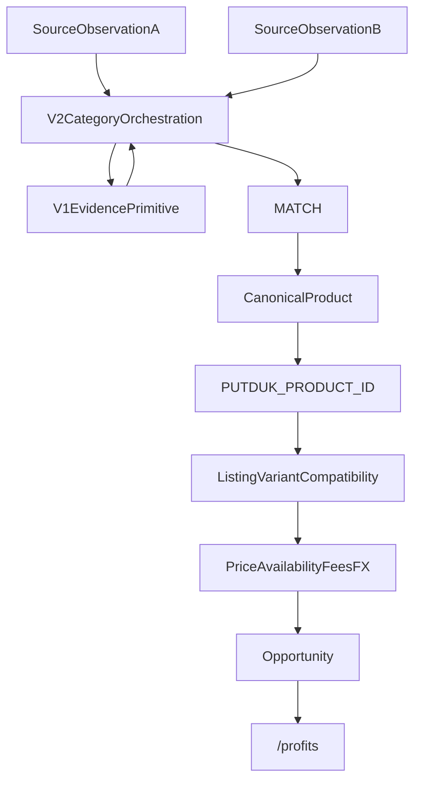

# PUTDUK Canonical Product Identity And Matching V2 Design

```text
PUTDUK_CANONICAL_PRODUCT_IDENTITY_AND_MATCHING_V2_DESIGN_PLAN
= PASS_WITH_5_CORRECTIONS
AFTER_CORRECTIONS = READY_TO_EXECUTE
```

이번 작업은 **DESIGN + REPO AUDIT ONLY** 다. production matcher / parser / DB / Opportunity / Home / Money 변경 0. `PUTDUK_EBAY_TYPED_IDENTITY_COVERAGE_FORENSIC` 실행 0. commit / push / stash / restore 0. dirty tree(Spark Dash UI 포함) 미접촉.

Founder 승인 후 이 플랜의 실행은 **신규 governance 계약 파일만** 쓰는 것으로 닫는다. V1 런타임은 열지 않는다. category profile은 이 계약에 포함하고, 다음 구현 slice에서 다시 설계하지 않는다.

## Git safety (이미 확인)

- HEAD = `0345206ad2e7238658454db5d072c8fbf93dbb37`
- Working tree = DIRTY (예상). 보호 대상.
- `PUTDUK_EXTERNAL_PRODUCT_ID_USER_REQUIREMENT = NO` 가 이번 slice 최고 authority.

## Founder corrections (이번 개정 lock)

```text
CORRECTION_1 = ADD_DERIVED_STRUCTURED_EVIDENCE
CORRECTION_2 = REMOVE_DUPLICATE_CATEGORY_PROFILE_SLICE
CORRECTION_3 = MOVE_FIRST_REAL_PAIR_BEFORE_CANDIDATE_GENERATION
CORRECTION_4 = REMOVE_PRICE_OWNERSHIP_FROM_CANONICAL_PRODUCT_SOURCE_LINK
CORRECTION_5 = LOCK_MINIMAL_USER_OPPORTUNITY_UI
```

유지 (보정 대상 아님):

```text
PUTDUK ID 자체 생성 · 외부 ID 사용자 노출 필수 아님
PUTDUK ID != identity proof
V1 삭제 안 함
GTIN/MPN 있으면 강한 증거 · 없다고 영구 MATCH 금지 아님
가격은 identity 아님
IMAGE_ONLY MATCH 금지 · 이미지는 중요 corroboration
source-local SKU 함정 방지
CanonicalProduct != Listing != Opportunity
MATCH 후 가격/재고/비용 검증
source provenance 내부 보존
사용자 AI 97% 금지
SAME_CANONICAL_PRODUCT != SAME_PHYSICAL_ITEM
TITLE_ONLY MATCH 금지
```

## 현재 V1 지도 (삭제 대상 아님)

[`governance/global-product/identity-matching.v1.json`](governance/global-product/identity-matching.v1.json) + [`matcher.cjs`](services/market-intelligence/src/identity-matching/matcher.cjs) + [`normalize.cjs`](services/market-intelligence/src/identity-matching/normalize.cjs)

```text
matchSourceObservations(left, right)
  → extractNormalized (typed IDs + brand/model/size/color)
  → matchingDecisionEligible = CONFIRMATION+SUCCESS only
  → compareTypedIdentifiers: GTIN | brand+MPN | brand+WATCH_REFERENCE
  → profileEngine(luxury_bag|fashion|watch|unknown)
  → decide() → MATCH | NO_MATCH | INSUFFICIENT_EVIDENCE | CONFLICT
```

V1이 실제로 비교하는 evidence:

- **STRONG typed:** GTIN exact; MPN exact + brand both present and equal; WATCH_REFERENCE exact + brand both present and equal
- **Source-specific emit:** eBay `item.gtin`→hints, eBay `item.mpn`→`meta.modelNumber` as MPN; Chrono24 `sku|reference`→`meta.modelNumber` as WATCH_REFERENCE; Fashionphile SKU는 typed ID가 아님
- **luxury_bag corroborating MATCH:** owner-backed categoryHint + brand exact + model exact + size/color 양쪽 있으면 불일치 시 NO_MATCH. GTIN 없이도 MATCH 가능 (fixture P)
- **watch corroborating `ok`는 항상 false.** watch MATCH는 typed WATCH_REFERENCE path만
- **unknown:** typed strong만. title/image/price/source 이름 금지
- **명시적 금지 lock:** Fashionphile SKU ≠ eBay MPN (K); raw `modelNumber` cross-type equality 금지 (L); discovery pair MATCH 금지 (J); image-only INSUFFICIENT (I); title-only INSUFFICIENT (C)

기존 listing-leg matcher ([`watch-match.cjs`](services/market-intelligence/src/watch-match.cjs) / [`card-match.cjs`](services/market-intelligence/src/card-match.cjs) / [`bag-match.cjs`](services/market-intelligence/src/bag-match.cjs) → Asset Master)는 **다른 층**이다. V2가 대체하거나 삭제하지 않는다.

```text
Asset Master.assetId  !=  CanonicalProduct  !=  PUTDUK_PRODUCT_ID
SOURCE_OBSERVATION != LISTING_LEG != OPPORTUNITY
discoverCandidates = NOT_IMPLEMENTED (첫 REAL MATCH까지 유지)
IDENTITY_MATCHING_DB_RUNTIME = NOT_IMPLEMENTED
PRODUCTION_OBSERVATION_PERSISTENCE = NOT_IMPLEMENTED
```

## Founder 의도와 V1의 관계

V1은 **strict deterministic evidence primitive** 로 보존한다.

V1만으로는 첫 REAL MATCH가 다시 `BLOCKED_NO_REAL_PAIR`가 된다. live forensic에서 eBay Confirmation은 GTIN/MPN이 비어 있고, 제조사 스타일코드·카드번호가 **제목에만** 있었다. 그 값을 OWNER_BACKED로 위조하면 안 되지만, PRESENTATION_ONLY로 버리면 V2도 같은 벽에 막힌다.

V2의 목적: 안전성을 버리지 않고, 실제 상품 세계의 여러 독립 증거를 합쳐 같은 상품을 판단한다.



첫 REAL MATCH는 자동 Candidate Generation 없이, 사람이 넣은 bounded pair 하나로 검증한다. `CANDIDATE`는 나중 자동화 단계 전용이며 MATCH truth가 아니다.

## 제안 V2 architecture

```text
identity-matching.v1
  = typed identifier compare
  + evidence rows
  + fail-closed decide()
  + existing fixtures/verifier 동결

identity-matching.v2
  = Category Identity Profile (이 계약에 포함, 다음 slice에서 재설계 금지)
  + evidenceOwner: OWNER_BACKED_STRUCTURED | DERIVED_STRUCTURED | PRESENTATION_ONLY
  + category-specific composite MATCH
  + conflict-first orchestration
  + MATCH 후에만 CanonicalProduct 연결
```

V1 `MATCHER_VERSION` / `verify:identity-matching-v1` / fixture A–P를 FAIL로 되돌리는 migration 금지.

V2 결과는 `matcherVersion = identity-matching.v2` 로 태그. V1 MATCH는 계속 유효.

LLM/Vision은 이후에도 candidate / attribute assist / image corroboration만. `"AI가 비슷해 보인다"` 는 MATCH owner 금지. DERIVED_STRUCTURED extractor도 **deterministic** 이어야 한다. LLM이 title에서 번호를 뽑아 OWNER_BACKED처럼 쓰면 금지.

## CORRECTION 1 — evidence owner + composite MATCH

세 계층을 분리한다. 값의 모양과 owner를 섞지 않는다.

```text
OWNER_BACKED_STRUCTURED
  source-side structured field
  예: eBay item.mpn, eBay item.gtin, TCG Product Details set/number,
      Chrono24 reference, Fashionphile vendor(brand)

DERIVED_STRUCTURED
  deterministic extractor가 title/caption에서
  category-native identifier를 뽑은 결과
  evidenceOwner = DERIVED_FROM_TITLE (위조 OWNER_BACKED 금지)
  예: DD1391-100, 11/83
  단독 MATCH 금지

PRESENTATION_ONLY
  자유 제목, display name, 비결정적 토큰
  MATCH owner 금지
```

Hard rules:

```text
TITLE_ONLY_MATCH = FORBIDDEN
DERIVED_STRUCTURED 단독 = MATCH 불가
양쪽 모두 DERIVED_STRUCTURED only = MATCH 불가
DERIVED_STRUCTURED를 OWNER_BACKED로 rewrite = FORBIDDEN
비결정적/LLM title parse = DERIVED_STRUCTURED 아님
eBay localizedAspects.Style = "Sneaker" = 상품 종류. style code 아님
Fashionphile sku / 0000+sku+0 barcode = SOURCE_LOCAL_ONLY. DERIVED도 아님
```

Composite MATCH (category-specific) 검토 조건 — 전부 충족:

```text
1. 한쪽 OWNER_BACKED_STRUCTURED exact value
2. 반대쪽 같은 값의 DERIVED_STRUCTURED exact
3. brand / model-or-character / category 일치
4. 독립 corroboration 1개 이상
   (image corroboration 또는 다른 owner-backed 속성)
5. critical conflict 없음
6. matchingDecisionEligible = CONFIRMATION+SUCCESS pair
```

예시:

```text
sneakers:
  counterpart style = DD1391-100 OWNER_BACKED
  eBay title extractor = DD1391-100 DERIVED_FROM_TITLE
  brand=Nike, model corroborating, image corroboration, conflict 없음
  → V2 composite MATCH 검토 가능

trading_card:
  TCG set=Generations OWNER_BACKED, number=11/83 OWNER_BACKED
  eBay title extractor set+number DERIVED_FROM_TITLE
  Pokemon / Charizard 일치, image corroboration, conflict 없음
  → V2 composite MATCH 검토 가능
```

이건 title-only MATCH가 아니다. title-derived evidence를 **다른 독립 증거와 함께** 쓰는 경로다.

luxury_bag 자유 제목(`Epsom Mini Kelly Sellier 20 Black`)은 스타일코드/카드번호처럼 deterministic identifier가 아니면 DERIVED_STRUCTURED로 승격하지 않는다. PRESENTATION_ONLY. bag MATCH는 계속 brand+model(+size/color) owner-backed 또는 V1 fashion corroborating primitive.

## CanonicalProduct / PUTDUK ID

MATCH가 충분히 증명된 뒤에만 생성/연결. ID 발급 ≠ identity proof.

제안 모델 (migration 0). **CORRECTION 4:** SourceLink에 가격/가용성/관측시각을 두지 않는다. 두 번째 가격 truth 금지.

```text
CanonicalProduct {
  canonicalProductId      // opaque PK, 예: cp_<ulid>
  putdukProductCode       // presentation, 예: PD-0001842
  categoryProfile
  canonicalAttributes
  variants[]
  identityEvidenceSummary
  createdAt, updatedAt
}

CanonicalProductSourceLink {
  canonicalProductId
  source
  sourceItemId
  sourceUrl
  latestObservationRef
  matchingDecision
  matcherVersion
  evidence[]
}

가격 / priceSemantics / observedAt / availability
= SourceObservation / Reprice owner
≠ CanonicalProductSourceLink
```

PUTDUK code 원칙: INTERNAL_STABLE / NON_SEMANTIC / SOURCE_INDEPENDENT / NO_EBAY_OR_STOCKX_EMBED / NO_CATEGORY_MEANING_REQUIRED.

정확한 `PD-` padding·allocator는 Founder 승인 전 production 확정 금지. DB PK와 presentation code는 분리하는 쪽을 권고.

내부 provenance는 사용자에게 숨긴다고 삭제하지 않는다.

## CORRECTION 5 — 사용자 Opportunity UI lock

기본 상품/수익 화면에 기술 설명을 넣지 않는다.

```text
PUTDUK_OPPORTUNITY_UI_COMPLEXITY = MINIMAL
DEFAULT_PRODUCT_MATCH_EXPLANATION = HIDDEN
DEFAULT_SOURCE_PROVENANCE = HIDDEN
DEFAULT_IDENTITY_EVIDENCE = HIDDEN
DEFAULT_MATCH_TECHNICAL_DETAIL = HIDDEN
DEFAULT_PUTDUK_PRODUCT_CODE_ON_CARD = HIDDEN
```

기본 사용자 화면:

```text
[상품 이미지]
상품명
매입 기준가
판매 기준가
필요 원금
예상 수익
예상 수익률
예상 기간
[참여하기]
```

넣지 않음: 왜 같은 상품인가 / GTIN / MPN / SourceObservation / parser provenance / matching evidence.

설명은 `퍼뜩 알아보기` / FAQ / 이용 안내. 법적·필수 고지는 짧게. 상품 화면을 기술 설명서로 만들지 않음.

이번 slice는 `/profits` / Home을 구현·수정하지 않는다. **계약 lock만**.

## Category profiles — 이 계약에 닫음 (다음 slice 재설계 금지)

Asset Master enum(`watch|trading_card|luxury_bag`)과 parser product-fit을 이번 slice에서 확장하지 않는다. electronics/general goods는 MVP 밖.

### sneakers

- CanonicalProduct = brand + model + colorway + manufacturer style (있을 때)
- **Size = Variant / listing unit. 별도 CanonicalProduct 아님**
  - `Nike Dunk Low Panda` 와 `Nike Dunk Low Panda US9` = 같은 상품 + size variant
  - Opportunity는 이후 `TRADABLE_EQUIVALENT`(사이즈 호환)에서 걸러짐
- Gender: style code가 갈리면 CONFLICT. 같은 style에 라벨만 다르면 variant
- STRONG: owner-backed manufacturer style exact + brand
- Composite: counterpart OWNER_BACKED style + eBay DERIVED_STRUCTURED exact + brand/model/category + image(또는 독립) corroboration + no conflict
- eBay `Style=Sneaker` 승격 금지
- title `DD1391-100` = DERIVED_STRUCTURED. 단독 MATCH 금지. OWNER_BACKED 위조 금지

### trading_card

- CanonicalProduct = game + set + card number + character/name + language + finish/edition
- **Grade + grading company = tradable variant**
  - raw vs PSA 10 vs BGS 9.5 = SAME_VARIANT 아님
  - MVP Opportunity는 grade 일치를 `TRADABLE_EQUIVALENT`에 요구
- STRONG: 양쪽 OWNER_BACKED structured set + card number
- Composite: 한쪽 OWNER_BACKED set+number + 반대쪽 DERIVED_STRUCTURED exact + game/character/category + image corroboration + no conflict
- title `11/83` 단독 또는 양쪽 derived only = MATCH 불가
- GTIN 있으면 AUTHORITATIVE_STRONG 추가. GTIN 없어도 composite 가능

### watch

- CanonicalProduct = brand + manufacturer reference
- model / case size / dial / material = corroborating 또는 양쪽 있으면 critical variant
- condition / year-as-listing = identity 아님
- manufacturer reference exact + brand exact → STRONG. 유일한 길은 아님
- title에서 reference DERIVED_STRUCTURED는 composite 규칙과 동일. 단독 금지
- Chrono24 `WATCH_REFERENCE` ≠ eBay `MPN`. raw `modelNumber` 문자열 같음으로 MATCH 금지 (V1 fixture L)
- Identity ≠ Chrono24 `AUTOMATED_ACQUISITION=BLOCKED_CURRENT_ENV`

### luxury_bag

- CanonicalProduct = brand + model + size + color + material(있을 때)
- hardware / year-stamp = corroborating; 양쪽 있고 불일치면 fail-closed
- condition = listing, not identity
- 두 Mini Kelly 20 Black = `SAME_CANONICAL_PRODUCT` ≠ `SAME_PHYSICAL_ITEM`
- Fashionphile `sku` / sku-derived barcode = SOURCE_LOCAL_ONLY
- 자유 제목 모델명 = PRESENTATION_ONLY. deterministic identifier가 아니면 DERIVED_STRUCTURED 아님
- V1 fashion corroborating(brand+model, size/color critical)은 V2 luxury_bag primitive로 재사용

## Evidence / conflict / image

V1 strength(`STRONG|CORROBORATING|WEAK|CONFLICTING`) 위에 V2 tier + **evidenceOwner** 를 매핑한다. 가짜 점수 하나로 덮지 않음.

- AUTHORITATIVE_STRONG → GTIN exact, 양쪽 OWNER_BACKED
- STRONG → brand+MPN / brand+watch ref / category-native OWNER_BACKED identity
- COMPOSITE_STRONG → CORRECTION 1 조건 전부
- CORROBORATING → brand, model, color, image similarity
- PRESENTATION_ONLY → 자유 제목. MATCH owner 금지
- CONFLICTING → 평균 내지 않음
- NOT_COMPARABLE → 한쪽 없음 또는 type mismatch (Fashionphile SKU vs eBay MPN)

Conflict 우선:

- style `DD1391-100` vs `DD1503-101` → CONFLICT / NO_MATCH
- card `11/83` vs `12/83` → CONFLICT
- GTIN 일치 + MPN 불일치 → V1과 같이 CONFLICT
- image similar는 conflict를 덮지 않음

Image:

- candidate / corroboration / variant check / admin review
- composite MATCH의 **독립 corroboration** 후보
- `IMAGE_SIMILARITY = FINAL_MATCH_OWNER` 금지
- `OBSERVED_IMAGE != DISPLAY_AUTHORIZED` 유지. 표시 권한 구현 0

Confidence: deterministic evidence vector / profile rule / owner + corroboration count. 사용자에게 `AI 일치율 97%` 금지. [`opportunity-card.v1`](schemas/opportunity-card.v1.json) `aiConfidenceScore`에 match confidence를 넣지 않음.

## Vocabulary (MVP 최소)

```text
SAME_CANONICAL_PRODUCT
SAME_VARIANT
TRADABLE_EQUIVALENT
SAME_PHYSICAL_ITEM   // 추론 금지. 관측하지 않음
```

Opportunity는 MATCH만으로 만들지 않는다.

```text
MATCH → CanonicalProduct → variant/tradable compatibility
  → current executable price (SourceObservation/Reprice)
  → availability → fees/FX
  → Opportunity eligibility → Opportunity
```

Money / Ledger / FX owner 침범 0.

## Dry design evaluation (코드 변경 없이)

기존 forensic만 재사용. 새 live 조사 0.

- **TCG ↔ eBay card:** TCG set+number OWNER_BACKED. eBay GTIN/MPN null, `11/83` + Generations는 title. **V1 = INSUFFICIENT.** **V2 composite path = 검토 가능** (DERIVED_STRUCTURED + character/category + image corroboration + conflict 없음). title-only 또는 derived 단독이면 여전히 INSUFFICIENT. **첫 REAL PAIR geometry 후보.**
- **Sneaker:** eBay brand=Nike, `DD1391-100` = DERIVED_STRUCTURED. StockX/GOAT/KREAM acquisition BLOCKED → counterpart OWNER_BACKED style 없음. **현재 live pair = INSUFFICIENT.** eBay derived를 버려서 막힌 것이 아니라 counterpart acquisition이 막힘.
- **Fashionphile Mini Kelly:** brand=Hermes OWNER_BACKED, sku local, model/size/color 미emit, 제목은 PRESENTATION_ONLY. **V2 = INSUFFICIENT.** SKU를 eBay MPN과 비교하지 않음. 이후 양쪽 owner-backed brand+model(+size/color)이면 GTIN 없이 MATCH 가능.
- **Chrono24 watch:** repo geometry는 brand+WATCH_REFERENCE STRONG. Chrono24↔Chrono24는 V1 fixture M MATCH. Chrono24↔eBay는 type 불일치 + 이번 환경 acquisition BLOCKED. Identity ≠ Acquisition.

## V1 migration / first real match

가장 안전한 방식: **V1 primitive 보존 + V2 orchestration 추가.**

이번 design 계약이 category profile + DERIVED_STRUCTURED + composite rule을 닫는다. 그 다음 구현은 또 contract가 아니라 **최소 pairwise runtime → bounded 1쌍 REAL MATCH**.

```text
FIRST_REAL_PAIR_GEOMETRY = trading_card composite
  TCG OWNER_BACKED set+number
  + eBay DERIVED_STRUCTURED
  + game/character/category
  + image corroboration
  + no conflict
```

지금 TCGplayer/StockX/Chrono24 전체 source를 고르거나 parser를 만들지 않는다. 자동 Candidate Generation도 하지 않는다. bounded pair 1개를 넣어 MATCH를 먼저 증명한다.

## 이 플랜 승인 후 쓰는 파일 (런타임 0)

다른 세션 dirty file 수정 금지. V1 matcher/normalize/fixtures/verifier 수정 금지.

- 신규 [`governance/global-product/identity-matching.v2.json`](governance/global-product/identity-matching.v2.json) — Founder locks, evidenceOwner, composite MATCH, category profiles, decisions, UI complexity lock, migration stance
- 신규 [`governance/global-product/canonical-product.v2.json`](governance/global-product/canonical-product.v2.json) — CanonicalProduct / **가격 없는** SourceLink / PUTDUK code 제안, persistence NOT_IMPLEMENTED

commit / push 하지 않음.

이 두 파일이 category profile 계약이다. 다음 slice에서 `Category Identity Profile Contract`를 다시 만들지 않는다.

## Implementation slices — CORRECTION 2 + 3

한 번에 구현 금지. **중복 design slice 금지.** 첫 REAL MATCH를 Candidate Generation / Persistence보다 앞당긴다.

```text
① V2 GOVERNANCE CONTRACT          ← 이 플랜 실행 (파일만)
② DERIVED_STRUCTURED evidence model
③ CATEGORY별 composite MATCH rule
     ①②③는 같은 계약 파일에 닫힘
④ MATCHING_V2_MINIMAL_PAIRWISE_RUNTIME
⑤ ONE REAL PAIR VALIDATION
⑥ CanonicalProduct + PD 상품번호
⑦ Candidate Generation 자동화
⑧ Persistence
⑨ Listing/Variant compatibility
⑩ 실제 가격·비용
⑪ Opportunity
⑫ /profits
```

```text
FIRST_IMPLEMENTATION_SLICE = MATCHING_V2_MINIMAL_PAIRWISE_RUNTIME
NEXT_CURSOR_TASK = V2 최소 pairwise runtime + dry fixtures/verifier
  (V1 decide 동결 · parser 추가 0 · eBay typed-coverage forensic 0
   · Opportunity/Home 0 · Candidate Generation 0)
```

## 성공 판정 (보정 후 design)

```text
PUTDUK_CANONICAL_PRODUCT_IDENTITY_V2_DESIGN = PASS_WITH_CORRECTIONS
FOUNDER_PRODUCT_INTENT_CAPTURED = PASS
V1_PRESERVATION_STRATEGY = PASS
CATEGORY_PROFILE_MODEL = PASS
CANONICAL_PRODUCT_BOUNDARY = PASS
PUTDUK_PRODUCT_ID_BOUNDARY = PASS
MATCH_VS_OPPORTUNITY_BOUNDARY = PASS
IMAGE_ROLE = PASS
PROVENANCE_RETENTION = PASS
DERIVED_STRUCTURED_PATH = PASS
PRICE_OWNER_SPLIT = PASS
USER_SIMPLICITY_DIRECTION = PASS
FIRST_REAL_MATCH_SPEED = PASS
FIRST_IMPLEMENTATION_SLICE = MATCHING_V2_MINIMAL_PAIRWISE_RUNTIME
```

STOP에 해당 없음: V1 삭제 불필요, Money 변경 불필요, title-only MATCH 불필요, image-only MATCH 불필요, price-as-identity 불필요, source-local-SKU 불필요, production migration 불필요.
