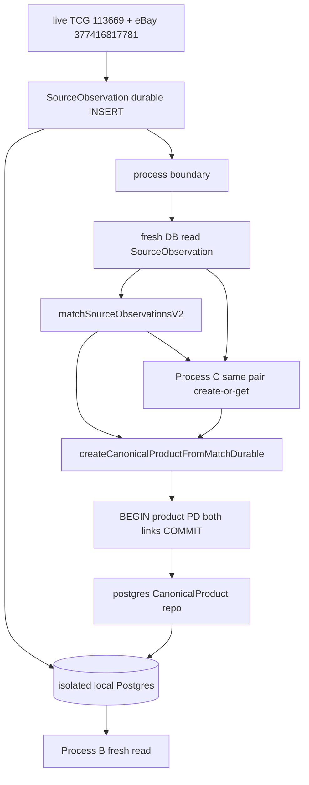

# CanonicalProduct / PD Durable Persistence

한 문장 목표: **DB에서 다시 읽은 TCG/eBay SourceObservation이 V2 MATCH된 뒤, CanonicalProduct와 PD가 PostgreSQL에 남고, 프로세스를 끊어도 같은 상품·같은 PD로 돌아온다.**

Founder 검토 판정: `PASS_WITH_CORRECTIONS` + 최종 3개 잠금. 아래는 실행 전 확정이다.

### FINAL PRE-EXECUTION CORRECTIONS

1. Transaction은 `pg.Pool.query` 연속 호출로 구현하지 않는다. BEGIN / 모든 write / COMMIT 또는 ROLLBACK은 동일 PostgreSQL connection에 pin된 transaction-bound querier/client에서만 수행한다. client release는 finally. verifier는 `pg_backend_pid()`가 transaction 전 구간 동일함을 증명한다.
2. `attachLink`는 retry-idempotent. 동일 observation + 동일 CanonicalProduct + 동일 source/sourceItem → existing link / no-op. 다른 product에 붙이려 할 때만 `OBSERVATION_CANONICAL_PRODUCT_CONFLICT`. Process C retry가 unique violation 없이 PASS.
3. `enrichAttributes`가 `canonical_attributes`를 바꾸면 같은 transaction에서 `payload` snapshot도 동일 값으로 갱신한다. enrichment 후 fresh read가 payload conflict 없이 통과한다.

## Git / production 안전

시작 시 read-only만: `git rev-parse HEAD` · `git status --short` · `git diff --name-only`. Known HEAD `0345206ad2e7238658454db5d072c8fbf93dbb37`. working tree는 DIRTY.

이번 슬라이스에서 **commit / push / stash / reset / restore / clean 금지**. 다른 세션 dirty 파일(UI, Home, Opportunity, Money, `/profits`, [`package.json`](package.json), [`tooling/verify/CATALOG.md`](tooling/verify/CATALOG.md), [`tooling/verify/domain-by-path.cjs`](tooling/verify/domain-by-path.cjs))을 persistence 이유로 덮거나 정리하지 않는다.

Production Supabase `mgsytcetsiecllmhcyox`: MCP `apply_migration` / write SQL / `db push` **0**. `PRODUCTION_DB_WRITE_ATTEMPTED = NO` 유지.

기존 Windows 서비스 `postgresql-x64-18` / `localhost:5432`: password reset, `pg_hba`, stop/restart, DB/role 생성 **0**.

## Execution Gate 0 — 기존 증명만 재확인

구현 전 bounded regression만 실행한다. matcher / source adapter / identity builder는 실패해도 **고치지 않고 STOP**.

실행:

- `node tooling/verify/source-observation-runtime.cjs`
- `node tooling/verify/identity-matching-v1.cjs`
- `node tooling/verify/identity-matching-v2.cjs`
- `node services/market-intelligence/src/identity-matching/v2/live-automated-cross-source-match.cjs`
- `node tooling/verify/canonical-product.cjs`
- `node tooling/verify/source-observation-durable-persistence.cjs`

[`tooling/verify/source-observation-db-runtime.cjs`](tooling/verify/source-observation-db-runtime.cjs)는 **isolated cluster auto-bootstrap이 없다**. env URL이 없으면 `BLOCKED_NO_SAFE_DB`로 끝나는 것이 정상이다. 이전 PASS 클러스터는 이미 stop된 상태이므로 이 이유로 SourceObservation proof를 reopen하지 않는다. 초기 `pg_ctl` killed exit `4294967295`도 실패 증거가 아니다.

Gate 0에서 matcher / memory CanonicalProduct가 실제로 FAIL이면:

```text
PREVIOUS_RUNTIME_VERIFICATION = FAIL
CANONICAL_PRODUCT_DURABLE_PERSISTENCE = BLOCKED
```

로 STOP.

## 보정 1 — 기존 sync create API 유지 (caller inventory)

`MANDATORY_CALLER_INVENTORY`는 플랜 시점에 전수 조사했다. 실행 직전 한 번 더 `rg createCanonicalProductFromMatch`로 재확인한다.

현재 call-site:

- 정의/export: [`create-from-match.cjs`](services/market-intelligence/src/canonical-product/create-from-match.cjs), [`index.cjs`](services/market-intelligence/src/canonical-product/index.cjs)
- sync 호출: [`tooling/verify/canonical-product.cjs`](tooling/verify/canonical-product.cjs) (다수), [`tooling/verify/source-observation-db-runtime.cjs`](tooling/verify/source-observation-db-runtime.cjs) 1곳
- 문자열 가드: matcher가 이 이름을 포함하면 안 됨 (호출 아님)
- production / Nest / SDK / apps caller: **0**

판정: Case A(bounded verifier뿐)라 async 전환은 가능하지만, **기존 memory PASS API를 persistence 때문에 Promise로 바꾸지 않는다.**

잠금:

```text
createCanonicalProductFromMatch          = 기존 sync 유지
attachUnlinkedObservationFromMatch       = 기존 sync 유지
createCanonicalProductFromMatchDurable   = 신규 async additive
```

- memory foundation / SO db-runtime은 기존 sync 호출 그대로
- durable verifier / Process A·C만 `createCanonicalProductFromMatchDurable` 사용
- 게이트·identity·PD evidence 금지는 durable entrypoint가 기존 함수와 같은 규칙을 재사용 (복사 남발 금지: shared gate helper는 sync 유지, durable wrapper만 transaction+await)
- [`canonical-product.cjs`](tooling/verify/canonical-product.cjs)와 [`source-observation-db-runtime.cjs`](tooling/verify/source-observation-db-runtime.cjs)의 create 호출을 `await`로 바꾸지 않는다

## 기존 owner — 재설계 금지

SSOT:

- [`governance/global-product/canonical-product.v2.json`](governance/global-product/canonical-product.v2.json)
- [`services/market-intelligence/src/canonical-product/`](services/market-intelligence/src/canonical-product/)

유지하는 semantic:

- CanonicalProduct ≠ SourceObservation ≠ Listing ≠ Opportunity
- PUTDUK_PRODUCT_ID ≠ MATCH_EVIDENCE
- SOURCE_LOCAL_ID ≠ CANONICAL_IDENTITY
- SAME_CANONICAL_PRODUCT ≠ SAME_PHYSICAL_ITEM
- trading_card identity key = `game + set + cardNumber + characterOrName` ([`identity.cjs`](services/market-intelligence/src/canonical-product/identity.cjs) `buildCanonicalIdentityKey` 재사용)
- optional `language` / `finishOrEdition`는 key를 바꾸지 않음
- PD 형식 `PD-` + 7 digit (`PD-0000001`) · `cp_<uuid>` · source id embed 금지 (`113669`, `377416817781`)
- create gate는 기존 [`create-from-match.cjs`](services/market-intelligence/src/canonical-product/create-from-match.cjs) 그대로: `MATCH` + 양쪽 `CONFIRMATION+SUCCESS` + observation id 일치. `NO_MATCH` / `INSUFFICIENT_EVIDENCE` / `CONFLICT` / `DISCOVERY` 자동 create 금지

Memory repository / in-process verifier / identity builder / PD formatter는 제거하거나 production DB 강제 의존으로 바꾸지 않는다. durable은 **additive seam**.

```text
CanonicalProduct repository
├─ memory   (기존 PASS 유지, sync)
└─ postgres (querier DI, async, 이번 slice)
```

## Architecture



Matcher는 호출만 한다. matcher `PIPELINE_STATUS.CANONICAL_PRODUCT_CREATION`는 계속 `NOT_IMPLEMENTED`. PD를 MATCH evidence로 되먹이지 않는다.

## Durable 저장 owner

저장:

- CanonicalProduct
- PUTDUK Product ID
- CanonicalProduct ↔ SourceObservation provenance links

저장하지 않음:

- full MatchResult history
- Opportunity / Listing / price / availability / wallet / ledger / feed / Admin

`identityEvidenceSummary` / link `evidence`는 기존과 동일하게 최소 provenance만:

```text
matcherVersion, decision, matchPath, evaluatedAt
```

계속 `MATCH_RESULT_DURABLE_PERSISTENCE = NOT_IMPLEMENTED`.

## 보정 2 — create는 한 트랜잭션 + 동일 connection pin

`createCanonicalProductFromMatchDurable`의 durable write는 반드시 한 트랜잭션이다.

`pg.Pool.query('BEGIN')` 연속 호출은 **금지**. Pool이면 쿼리마다 다른 backend connection이 잡혀 transaction이 아닌 척만 하게 된다.

잠금:

```text
DURABLE TRANSACTION
→ one dedicated pg Client
→ BEGIN
→ 모든 product / PD / link SQL
→ COMMIT or ROLLBACK
→ client.release() / client.end() in finally
```

권장 interface:

```js
withTransaction(async (txQuerier) => { ... })
```

`txQuerier`는 한 PostgreSQL connection에 pin된 client다. repository가 Pool을 직접 알 필요는 없다. verifier/connection layer가 transaction-bound querier를 공급해도 된다.

```text
BEGIN
  select pg_backend_pid()   -- first
  create-or-get CanonicalProduct
  PD allocate (신규일 때만 sequence)
  attach TCG link
  attach eBay link
  validate link invariants
  select pg_backend_pid()   -- last, same
COMMIT
```

중간 오류 / `OBSERVATION_CANONICAL_PRODUCT_CONFLICT` / payload conflict:

```text
ROLLBACK
```

operation boundary:

- **신규 identity create**: product+PD+두 link가 모두 성공해야 COMMIT. 한쪽 link 실패 시 신규 product가 고아로 남지 않음
- **이미 있던 CanonicalProduct에 attach**: 이번 operation의 uncommitted link만 rollback. 이전에 COMMIT된 product를 지우지 않음
- application `SELECT → INSERT`만으로 race를 막지 않음. unique constraint + transaction

도메인 blocked 결과도 throw가 아니면 명시적으로 ROLLBACK.

증명:

```text
DURABLE_CANONICAL_CREATE_TRANSACTIONAL = PASS
CANONICAL_PRODUCT_CREATION_ATOMICITY = PASS
PARTIAL_CANONICAL_CREATION_ON_LINK_FAILURE = BLOCKED
PARTIAL_PRODUCT_ON_SOURCE_LINK_FAILURE = BLOCKED
TRANSACTION_CONNECTION_PINNED = PASS
TRANSACTION_QUERIES_USE_ONE_BACKEND_PID = PASS
```

## Schema — governance 우선, 최소 2 테이블

[`canonical-product.v2.json`](governance/global-product/canonical-product.v2.json)는 proposed SQL이 없고 field list만 있다. 파일 전용 migration을 추가한다.

### 보정 5 — filename은 write-time repo MAX

고정 예 `20260819231100_canonical_products.sql`을 미리 잠그지 않는다. 파일 생성 직전:

1. `supabase/migrations` 전수 scan
2. numeric prefix MAX 확인 (현재 알려진 MAX 후보는 `20260819210000`)
3. `MIGRATION_PREFIX > MAX_EXISTING_MIGRATION_PREFIX_AT_WRITE_TIME` 인 unique prefix 생성

시계 기준 timestamp를 쓰지 않는다. 병렬 세션이 `20260819240000_...`를 만든 뒤여도 그 순간의 MAX를 따른다. 기존 SO 파일은 그대로 두고 편집하지 않는다.

**`canonical_products`**

- `canonical_product_id` PK
- `putduk_product_code` UNIQUE, immutable
- `CHECK (putduk_product_code ~ '^PD-[0-9]{7}$')`
- `CREATE SEQUENCE public.putduk_product_code_seq AS bigint START WITH 1 INCREMENT BY 1 MINVALUE 1 MAXVALUE 9999999 NO CYCLE`
- `category_profile`
- `canonical_identity_key` (lookup only, domain field 아님)
- `canonical_attributes` jsonb (profile-specific, 카드 전용 컬럼 금지)
- `status` default `active` (storage-only)
- `identity_evidence_summary` jsonb
- `payload` jsonb (domain snapshot)
- `created_at` / `updated_at`
- **UNIQUE (`category_profile`, `canonical_identity_key`)**
- price / profit / availability / HTML / wallet 컬럼 금지

**`canonical_product_source_links`**

- `canonical_product_id` FK → `canonical_products`
- `source`, `source_item_id`, `source_url`
- `latest_observation_ref` FK → `source_observations(id)` (의존 방향: Observation → Canonical만)
- `matching_decision`, `matcher_version`, `evidence` jsonb
- UNIQUE (`canonical_product_id`, `source`, `source_item_id`)
- UNIQUE (`latest_observation_ref`) → `ONE_SOURCE_OBSERVATION → MAX_ONE_CANONICAL_PRODUCT`
- link에 price / availability / observedAt 금지

이번 slice는 `latest_observation_ref` 교체 merge engine을 만들지 않는다. 향후 같은 eBay item의 다음 observation lifecycle은 별도 작업. 세 번째 owner 테이블은 만들지 않는다.

PD: gap 허용, duplicate / reassignment 금지. INSERT 시 sequence로 포맷. `ON CONFLICT (category_profile, canonical_identity_key) DO NOTHING` 후 기존 row SELECT.

Immutable trigger: `canonical_product_id` / `putduk_product_code` / `canonical_identity_key` / `category_profile` UPDATE 시 예외.

`enrichAttributes`는 optional field만 채운다. **같은 transaction에서** `canonical_attributes`와 `payload` domain snapshot을 동일 값으로 함께 UPDATE하고 `updated_at`만 갱신한다. attributes만 바꾸고 payload를 그대로 두면 다음 read가 `PERSISTED_CANONICAL_PRODUCT_PAYLOAD_CONFLICT`로 자살한다.

```text
CANONICAL_ENRICHMENT_PAYLOAD_CONSISTENCY = PASS
ENRICHMENT_IDENTITY_KEY_UNCHANGED = PASS
ENRICHMENT_CANONICAL_PRODUCT_ID_UNCHANGED = PASS
ENRICHMENT_PD_UNCHANGED = PASS
```

RLS: `source_observations`와 같은 convention.

- `ENABLE ROW LEVEL SECURITY`
- `REVOKE ALL` from `PUBLIC`, `anon`, `authenticated`
- `GRANT ALL` to `postgres`, `service_role`
- 정책 완화 금지
- isolated cluster에서만 `anon` / `authenticated` / `service_role` NOLOGIN stub (`LOCAL_SUPABASE_ROLE_STUBS = MIGRATION_COMPATIBILITY_ONLY`, `SUPABASE_ROLE_RUNTIME_PARITY = NOT_VERIFIED`)

이번 migration에 `match_results` / opportunities / listings / wallet / ledger 금지.

**Production fixture 위조 금지.** [`tooling/verify/fixtures/migrations-applied.v1.json`](tooling/verify/fixtures/migrations-applied.v1.json)는 원격 applied 스냅샷이다. 새 파일도 fixture에 넣지 않는다.

## 필수 관련 수정 — SourceObservation timestamp 검사

[`tooling/verify/source-observation-runtime.cjs`](tooling/verify/source-observation-runtime.cjs)와 [`tooling/verify/source-observation-durable-persistence.cjs`](tooling/verify/source-observation-durable-persistence.cjs)의 “SO가 forever latest” 검사는 verifier correctness fix다. scope expansion 아님.

바르게:

```text
SOURCE_OBSERVATION_MIGRATION exists
prefix valid / unique
prefix > required historical baseline (20260818010000)
```

`SOURCE_OBSERVATION_MIGRATION === latest migration forever` 금지.

## Repository / mapper — 보정 3 URL guard 책임 분리

신규:

- [`services/market-intelligence/src/canonical-product/repository.postgres.cjs`](services/market-intelligence/src/canonical-product/repository.postgres.cjs)
- [`services/market-intelligence/src/canonical-product/persistence-mapper.cjs`](services/market-intelligence/src/canonical-product/persistence-mapper.cjs)

SourceObservation convention 확인: [`repository.postgres.cjs`](services/market-intelligence/src/source-observation/repository.postgres.cjs)의 `classifyDurableDatabaseUrl`은 **sibling export**일 뿐, `createDurableSourceObservationRepository`는 URL을 보지 않고 `{ querier }`만 받는다. 실제 차단은 verifier가 연결 전에 한다.

CanonicalProduct도 그 책임을 따른다.

- repository = SQL / 도메인 persistence만. **URL을 알지 않음. production URL을 자체 reject하지 않음**
- production URL / isolated cluster 판정 = verifier + isolated bootstrap + connection factory
- 나중에 production wiring이 열려도 repository가 production URL을 거절하는 상태가 되지 않음
- market-intelligence 안에서 `pg` require 금지
- memory fallback 금지
- `toPersistenceRecord` / `fromPersistenceRecord`
- lookup ↔ payload 모순 시 fail-closed:

```text
canonical_product_id
putduk_product_code
category_profile
canonical_identity_key
payload
```

하나라도 모순이면 `PERSISTED_CANONICAL_PRODUCT_PAYLOAD_CONFLICT` / `BLOCKED`. 읽은 뒤 `buildCanonicalIdentityKey` 재계산.

postgres 인터페이스 (async):

- `createProduct` / `getByIdentityKey` / `getProduct` / `getIdentityKey`
- `getProductIdByObservationRef`
- `attachLink` — retry-idempotent. 동일 observation + 동일 product + 동일 source/sourceItem → existing link / `IDEMPOTENT_NOOP`. 동일 observation이 다른 product면 `OBSERVATION_CANONICAL_PRODUCT_CONFLICT`. 동일 product+source+item인데 observation/link payload가 모순이면 `LINK_PAYLOAD_CONFLICT`. duplicate retry ≠ conflict
- `withTransaction(fn)` — dedicated Client에 pin. Pool.query 연속 BEGIN/COMMIT 금지
- `enrichAttributes`
- `listLinks` / `listProducts`
- `withCreateTransaction` 또는 durable create가 BEGIN/COMMIT를 소유
- `end`
- `persistence()` — local durable PASS + production / MatchResult / GenericProfile은 `NOT_IMPLEMENTED`

[`index.cjs`](services/market-intelligence/src/canonical-product/index.cjs)는 durable factory + `createCanonicalProductFromMatchDurable`만 additive export.

계속:

```text
PRODUCTION_CANONICAL_PRODUCT_PG_CLIENT_WIRING = NOT_IMPLEMENTED
```

## Isolated Postgres — 이전 성공 방식 + 보정 4 finally cleanup

이전 PASS는 TEMP PowerShell bootstrap이었고 **repo에 helper가 없다**. 이번 verifier가 Node로 같은 규칙을 내장한다. 이전 Windows 함정:

- `pg_ctl start -w` 금지 (대기 hang / killed `4294967295`)
- `pg_ctl` stdout를 `2>&1`로 붙잡지 않음
- `initdb` data dir는 빈 디렉터리 (마커는 cluster root)

바이너리:

```text
C:\Program Files\PostgreSQL\18\bin\initdb.exe
C:\Program Files\PostgreSQL\18\bin\pg_ctl.exe
C:\Program Files\PostgreSQL\18\bin\psql.exe
C:\Program Files\PostgreSQL\18\bin\createdb.exe
C:\Program Files\PostgreSQL\18\bin\pg_isready.exe
```

절차:

1. `%TEMP%\putduk-canonical-pg-<unique>\` (repo 안 금지) + owned marker
2. random secret — 보고서/채팅/git에 출력 0
3. free high port (예: 55432–55999), **5432 금지**, `listen_addresses=localhost`
4. `initdb` → `pg_ctl start` (no wait) → `pg_isready` poll
5. dedicated DB 이름 (예: `putduk_canonical_proof`)
6. identity 확인:

```sql
select current_database(), current_user, inet_server_addr(), inet_server_port(), version();
show data_directory;
```

`data_directory`가 TEMP cluster일 때만 `SAFE_DB_KIND = CURSOR_CREATED_ISOLATED_LOCAL_POSTGRES`.

7. role stub → SO migration → 신규 CanonicalProduct migration
8. 전후 `postgresql-x64-18` Running 유지 → `EXISTING_PG_5432_TOUCHED = NO`

verifier 구조:

```js
try {
  bootstrap
  migrate
  verify
} finally {
  recheck data_directory + port + owned TEMP marker
  stop only owned test cluster
  cleanup only owned temp dir
}
```

```text
TEST_CLUSTER_CLEANUP_ON_PASS = PASS
TEST_CLUSTER_CLEANUP_ON_FAILURE = PASS
EXISTING_PG_5432_TOUCHED = NO
```

실패했다고 무작정 `pg_ctl stop`하거나 디렉터리를 지우지 않는다. ownership이 아니면 skip. UAC/OS가 `initdb`/`pg_ctl`을 막으면 기존 5432로 우회하지 않고 `BLOCKED`로 STOP.

`FOUNDER_PASSWORD_INPUT_REQUIRED = NO`.

## 단일 verifier — phase 분리

신규 하나만: [`tooling/verify/canonical-product-durable-persistence.cjs`](tooling/verify/canonical-product-durable-persistence.cjs)

`package.json` / CATALOG / domain-by-path **배선하지 않는다**. 실행은 `node tooling/verify/canonical-product-durable-persistence.cjs`. Playwright E2E / monorepo 광역 test / web+api 동시 기동 0.

`pg`는 verifier-only로 [`services/api-nest/node_modules/pg`](services/api-nest/node_modules/pg) resolve. connection factory가 URL safety를 담당.

### Phase 0 — implementation invariants (DB 불필요)

- durable repo가 memory로 fallback하지 않음
- repository가 URL/production reject를 하지 않음
- `pg`를 market-intelligence 패키지가 require하지 않음
- 기존 `createCanonicalProductFromMatch`가 여전히 sync
- migration에 price/opportunity/match_results 없음
- unique identity / unique PD / PD CHECK / unique observation ref / RLS / immutable trigger 존재
- identity key에 title/image/price/source/PD 없음

### Phase 1 — parent: cluster + SO write + process 경계

Parent가 isolated cluster를 띄우고 두 migration을 적용한 뒤, live observe → SourceObservation durable write 후 **그 프로세스는 write client를 닫는다.**

Pinned input: TCG `113669` · eBay `377416817781`. fixture/manual observation으로 final PASS 대체 금지.

### Phase 2 — Process A: DB-read → MATCH → durable create

완전 새 Node process + 새 `pg` client + 새 durable repo.

1. DB-read TCG / eBay SourceObservation
2. `matchSourceObservationsV2` → `trading_card` / `MATCH` / `COMPOSITE_STRONG`
3. `createCanonicalProductFromMatchDurable` (한 트랜잭션)
4. product + PD + TCG/eBay links
5. client end + process exit

### Phase 3 — Process B: fresh read only

Process A object 재사용 0. DB만 조회.

`canonicalProductId` / `putdukProductCode` / `categoryProfile` / identity key가 A와 동일해야 한다.

### Phase 4 — Process C: same pair retry

다시 DB-read → fresh V2 MATCH → create-or-get.

```text
SECOND_IDENTICAL_PAIR_RUN_CREATES_NEW_PRODUCT = NO
same canonicalProductId + same PD
CANONICAL_PRODUCT_COUNT_FOR_IDENTITY = 1
PUTDUK_PRODUCT_ID_DURABLE_STABILITY = PASS
```

### Phase 5 — concurrency

matcher를 바꾸거나 live observation을 변조하지 않는다. verifier-owned synthetic MATCH-safe identity(또는 `createProduct` 동일 identityKey)로 두 child가 동시에 create.

```text
CONCURRENT_CANONICAL_CREATE_REQUESTS = 2
CANONICAL_PRODUCTS_CREATED = 1
UNIQUE_PD_CODES_CREATED = 1
```

### Phase 6 — negatives (durable repo)

- A `NO_MATCH` → blocked
- B `INSUFFICIENT_EVIDENCE` → blocked
- C `CONFLICT` → blocked
- D DISCOVERY-only → blocked
- E observation이 Product A에 붙은 채 Product B attach → `OBSERVATION_CANONICAL_PRODUCT_CONFLICT` + 신규 product 고아 0
- F title-only merge/create blocked
- G PD same → matcher evidence 사용 blocked (`PD_ID_USED_AS_MATCH_EVIDENCE = NO`)
- H source-local IDs only → canonical merge evidence blocked
- optional language/finish enrichment → identity key / id / PD 불변
- PD unique + immutable
- `PD_CODE_CONTAINS_TCG_113669 = NO` / `PD_CODE_CONTAINS_EBAY_377416817781 = NO`
- 한쪽 link 실패 시 product row 0 (신규 create) → atomicity PASS

### Phase 7 — regressions

- SourceObservation runtime + durable contract
- V1 / V2 / live automated cross-source match
- CanonicalProduct **memory** foundation (`CANONICAL_PRODUCT_MEMORY_FOUNDATION_REGRESSION`)
- 새 cluster 위 SO write/read/round-trip으로 `SOURCE_OBSERVATION_DB_RUNTIME_REGRESSION`

Memory tests를 durable DB에 묶지 않는다.

### Phase 8 — cleanup

`finally`에서 owned cluster만 stop. 기존 5432 무변경. 보고서 후 STOP.

## Governance — 실제 PASS 후에만

[`governance/global-product/canonical-product.v2.json`](governance/global-product/canonical-product.v2.json) 기존 vocabulary를 갱신. 중복 필드 남발 금지.

갱신 예:

- `runtime` → 기존 단어가 있으면 그것, 없으면 `DURABLE_DB_RUNTIME_VERIFIED`에 가깝게
- `CANONICAL_PRODUCT_DB_RUNTIME` → `PASS`
- `CANONICAL_PRODUCT_SOURCE_LINK_DB_RUNTIME` → `PASS`
- `CANONICAL_PRODUCT_DB_RUNTIME_VERIFIED_ENVIRONMENT` → `CURSOR_CREATED_LOCAL_TEST_POSTGRES`
- `PUTDUK_PRODUCT_ID_DURABLE_STABILITY` → `PASS`
- 계속 `PRODUCTION_CANONICAL_PRODUCT_PERSISTENCE = NOT_IMPLEMENTED`
- 계속 `REMOTE_SUPABASE_CANONICAL_PRODUCT_RUNTIME_VERIFICATION = NOT_VERIFIED`
- 계속 `MATCH_RESULT_DURABLE_PERSISTENCE = NOT_IMPLEMENTED`
- `supabaseMigrationThisSlice`는 production apply가 아니므로 false 유지

그 다음 memory verifier 단언을 맞춘다: memory path의 durable flag는 계속 `NOT_IMPLEMENTED`, governance는 local PASS / production NOT_IMPLEMENTED. sync create API 단언은 유지.

## 건드리지 않는 것

matcher redesign, Generic Profile, Candidate Generation, Listing, Opportunity, `/profits`, wallet, Admin, Home/UI, 새 source, production deploy, [`migrations-applied.v1.json`](tooling/verify/fixtures/migrations-applied.v1.json).

PASS 후에도:

```text
PRODUCTION_OBSERVATION_PERSISTENCE = NOT_IMPLEMENTED
PRODUCTION_CANONICAL_PRODUCT_PERSISTENCE = NOT_IMPLEMENTED
PRODUCTION_CANONICAL_PRODUCT_PG_CLIENT_WIRING = NOT_IMPLEMENTED
MATCH_RESULT_DURABLE_PERSISTENCE = NOT_IMPLEMENTED
GENERIC_PRODUCT_PROFILE = NOT_IMPLEMENTED
CANDIDATE_GENERATION = NOT_IMPLEMENTED
```

`NEXT_RECOMMENDED_SLICE = PUTDUK_MATCH_RESULT_DURABLE_PERSISTENCE`는 보고서에 후보로만 적는다. Plan Reconciliation / Current Master 순서와 대조하기 전에 자동 시작·자동 확정 금지.

## 완료 보고

지시문 §54 형식 + 이번 보정 필드:

```text
CREATE_CANONICAL_PRODUCT_FROM_MATCH_API = SYNC_PRESERVED
CREATE_CANONICAL_PRODUCT_FROM_MATCH_DURABLE = ADDITIVE_ASYNC
DURABLE_CANONICAL_CREATE_TRANSACTIONAL =
CANONICAL_PRODUCT_CREATION_ATOMICITY =
PARTIAL_PRODUCT_ON_SOURCE_LINK_FAILURE = BLOCKED
TRANSACTION_CONNECTION_PINNED =
TRANSACTION_QUERIES_USE_ONE_BACKEND_PID =
CANONICAL_SOURCE_LINK_IDEMPOTENT_RETRY =
SECOND_IDENTICAL_PAIR_LINK_RETRY =
DUPLICATE_LINK_ROWS_CREATED = NO
CANONICAL_ENRICHMENT_PAYLOAD_CONSISTENCY =
ENRICHMENT_IDENTITY_KEY_UNCHANGED =
ENRICHMENT_CANONICAL_PRODUCT_ID_UNCHANGED =
ENRICHMENT_PD_UNCHANGED =
TEST_CLUSTER_CLEANUP_ON_PASS =
TEST_CLUSTER_CLEANUP_ON_FAILURE =
```

commit/push 없음. Founder에게 SQL 복붙, Dashboard 클릭, test DB 수동 생성, 비밀번호 입력을 요구하지 않는다.
