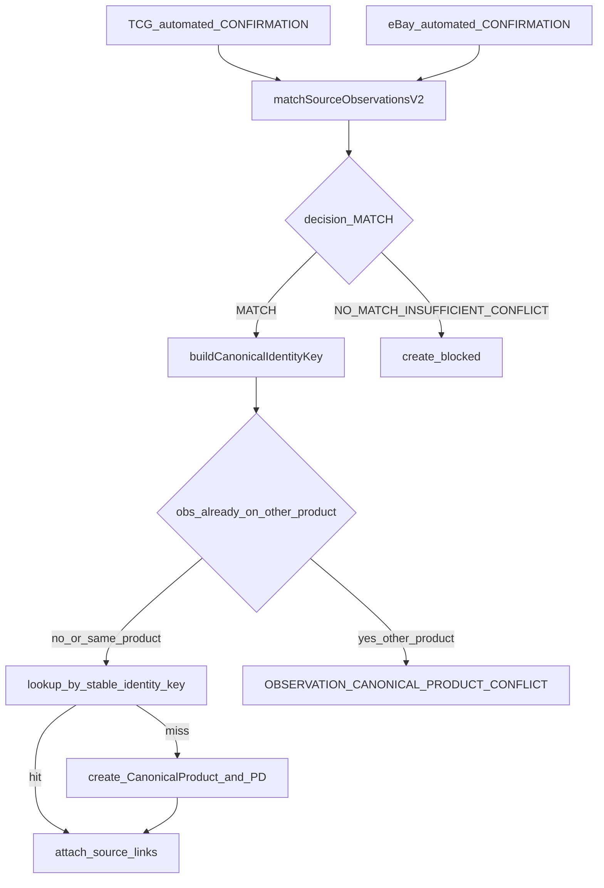

# CanonicalProduct Foundation + PD Product ID

Founder 승인 + 아래 3개 correction 반영. 그 외 scope 확장 금지.

## Founder corrections (구현 전 필수)

### CORRECTION 1 — identity key ≠ canonicalAttributes 전체

[canonical-product.v2.json](governance/global-product/canonical-product.v2.json)에는 `canonical identity key` / `required identity attributes` 정의가 **없다**. 새 truth를 governance에 쓰지 않는다.

[identity-matching.v2.json](governance/global-product/identity-matching.v2.json) `categoryProfiles.trading_card.canonicalProduct`는 **attribute 목록**이지 lookup key가 아니다.

```text
["game", "set", "cardNumber", "characterOrName", "language", "finishOrEdition"]
```

기존 MATCH semantic만 읽는다 (matcher/governance 수정 0):

- MATCH geometry (`strong` / `composite`): `set` + `cardNumber` 필수, `game` / `character` 합의 필수
- `language` / `finishOrEdition`: 양쪽 있으면 conflict 비교, MATCH 필수 조건 아님 → optional enrichment
- `grade`: `TRADABLE_VARIANT_NOT_SAME_VARIANT` → identity key 제외

runtime helper만 추가:

```text
buildCanonicalIdentityKey(categoryProfile, canonicalAttributes)
```

identity key = 해당 profile에서 동일 상품을 결정하는 안정적인 불변 structured fields만.

trading_card key (기존 MATCH semantic, 새 목록 창작 아님):

```text
game + set + cardNumber + characterOrName
```

`canonicalAttributes`에는 language / finishOrEdition 등 optional enrichment를 담을 수 있다. 나중에 이 값이 추가되어도 identity key는 바뀌지 않는다. 새 product 생성 금지.

금지 키: title, image, price, sourceItemId, observationRef, PD code, optional presentation enrichment.

Verifier:

```text
OPTIONAL_CANONICAL_ATTRIBUTE_ENRICHMENT_CHANGES_IDENTITY_KEY = NO
OPTIONAL_ENRICHMENT_CREATES_DUPLICATE_PRODUCT = NO
```

### CORRECTION 2 — PD / idempotency는 in-process only

memory repository lifetime 안에서만 안정. process restart 후 동일 PD를 보장한다고 보고하지 않는다.

```text
PUTDUK_PRODUCT_ID_STABLE = PASS_IN_PROCESS_ONLY
PUTDUK_PRODUCT_ID_STABLE_WITHIN_REPOSITORY_LIFETIME = PASS
PUTDUK_PRODUCT_ID_DURABLE_STABILITY = NOT_IMPLEMENTED
CANONICAL_PRODUCT_DURABLE_DB_PERSISTENCE = NOT_IMPLEMENTED
MATCH_RESULT_DURABLE_PERSISTENCE = NOT_IMPLEMENTED
```

### CORRECTION 3 — observation은 CanonicalProduct 1개만

```text
ONE_SOURCE_OBSERVATION → MAX_ONE_CANONICAL_PRODUCT
```

observation이 이미 product A에 있으면 product B로 자동 재연결 / merge / last-write-wins / link migration 금지. fail-closed:

```text
OBSERVATION_CANONICAL_PRODUCT_CONFLICT = BLOCKED
SOURCE_OBSERVATION_MULTI_CANONICAL_ATTACHMENT = BLOCKED
```

같은 pair 재실행이 **같은** product A에 다시 attach하는 것은 idempotent OK.

## 현재 상태 (read-only 확인됨)

- **HEAD** = `0345206ad2e7238658454db5d072c8fbf93dbb37` (요청 Known HEAD와 일치)
- **Worktree** = DIRTY. UI/Home/Opportunity/다른 세션 파일은 보호. `commit` / `push` / `stash` / `reset` / `restore` / `clean` 금지
- **기존 CanonicalProduct owner** = [governance/global-product/canonical-product.v2.json](governance/global-product/canonical-product.v2.json) 만 존재. `runtime: NOT_IMPLEMENTED`. `src/canonical-product/` 없음. Supabase `canonical_product` 테이블 없음
- **Asset Master ≠ CanonicalProduct** (`assetIdEqualsCanonicalProduct: false`). Asset Master에 얹지 않음
- **V2 MATCH owner** = [services/market-intelligence/src/identity-matching/v2/matcher.cjs](services/market-intelligence/src/identity-matching/v2/matcher.cjs). `decide()`는 MATCH만 생성하고 CanonicalProduct를 만들지 않음. `PIPELINE_STATUS.CANONICAL_PRODUCT_CREATION = NOT_IMPLEMENTED`는 **matcher가 제품을 만들지 않는다**는 뜻으로 유지 (V2 verifier가 이 값을 고정 검사함)
- **Proven pair verifier** = [services/market-intelligence/src/identity-matching/v2/live-automated-cross-source-match.cjs](services/market-intelligence/src/identity-matching/v2/live-automated-cross-source-match.cjs) — TCG `113669` + eBay `377416817781`
- **Memory repo 패턴** = [services/market-intelligence/src/source-observation/repository.memory.cjs](services/market-intelligence/src/source-observation/repository.memory.cjs) 를 참고만 하고 observation persistence는 재설계하지 않음
- **PD sequence owner** = 없음. 이번 slice에서 in-process allocator만 추가
- **V2 `NO_MATCH`**: decision enum에는 있으나 `decide()`는 현재 `NO_MATCH`를 반환하지 않음. create gate는 `decision === "MATCH"`만 허용하고, synthetic `NO_MATCH` 입력으로 negative를 증명

## 실행 게이트 0 — 이전 slice 재검증 (구현 전, STOP 가능)

기존 verifier만 재사용. matcher 수정 금지.

```text
node tooling/verify/source-observation-runtime.cjs
node tooling/verify/identity-matching-v1.cjs
node tooling/verify/identity-matching-v2.cjs
node services/market-intelligence/src/identity-matching/v2/live-automated-cross-source-match.cjs
```

live script가 다음을 재현하지 못하면 **구현 중단**:

```text
PREVIOUS_AUTOMATED_MATCH_VERIFICATION = FAIL
CANONICAL_PRODUCT_CREATION = BLOCKED
```

우회 matcher 수정 금지.

## 권위 / naming

[canonical-product.v2.json](governance/global-product/canonical-product.v2.json)을 계약 SSOT로 쓴다. 요청문의 `identityProfile` / `canonicalIdentity`는 쓰지 않고 기존 이름을 따른다.

- `categoryProfile`
- `canonicalAttributes`
- `canonicalProductId` (opaque, 제안형 `cp_<uuid>` — ulid 의존성 추가 금지)
- `putdukProductCode` (`PD-0000001`, 7자리 zero-pad, governance 예시 `PD-0001842`와 동일)
- source link: `source`, `sourceItemId`, `sourceUrl`, `latestObservationRef`, `matchingDecision`, `matcherVersion`, `evidence` summary

`identityEvidenceSummary`는 MATCH provenance reference만 (`matcherVersion`, `decision`, `matchPath`, `evaluatedAt`). durable match result store가 아니다.

governance 의미 완화 금지. 변경은 상태 정직 업데이트만:

- `runtime`: `NOT_IMPLEMENTED` → `IN_PROCESS_MEMORY`
- `CANONICAL_PRODUCT_DB_RUNTIME` / `CANONICAL_PRODUCT_SOURCE_LINK_DB_RUNTIME` = `NOT_IMPLEMENTED` 유지
- `CREATE_ONLY_AFTER_MATCH` / `PUTDUK_PRODUCT_ID_EQUALS_MATCH_EVIDENCE=NO` 유지

[identity-matching.v2.json](governance/global-product/identity-matching.v2.json)과 matcher/evidence/profiles/fixtures는 **수정하지 않는다**.

## 구현 위치 (신규만)

Dirty 파일(`package.json`, `CATALOG.md`, `domain-by-path.cjs`, `index.cjs`, UI, Opportunity)은 건드리지 않는다. verifier는 `node tooling/verify/canonical-product.cjs`로 직접 실행.

```text
services/market-intelligence/src/canonical-product/
  contract.cjs
  identity.cjs
  product-code.cjs
  repository.cjs
  create-from-match.cjs
  index.cjs
tooling/verify/canonical-product.cjs
```

기존 schema 파일은 만들지 않는다 (in-process foundation, interchange schema 불필요).



## Core 동작

**1. create gate**

`createCanonicalProductFromMatch({ left, right, matchResult, repository, now })` 만 자동 create/attach.

필수:

- `matchResult.decision === "MATCH"`
- 양쪽 `observationPurpose === "CONFIRMATION"` 그리고 `sourceStatus === "SUCCESS"`
- `matchResult.leftObservationId` / `rightObservationId`가 입력 observation과 일치
- DISCOVERY-only pair 거부
- `NO_MATCH` / `INSUFFICIENT_EVIDENCE` / `CONFLICT` 거부

**2. canonicalAttributes 승격 (새 MATCH evidence 생성 금지)**

V2 `matchResult.evidence` + `assemblePairEvidence`에서 이미 합의된 값만 승격. OWNER_BACKED를 DERIVED보다 우선. title 복사 금지.

`canonicalAttributes`는 표현/enrichment를 담을 수 있다. trading_card 예:

```text
game / set / cardNumber / characterOrName / language / finishOrEdition
```

core는 category-neutral:

```text
Universal CanonicalProduct + profile-specific canonicalAttributes
```

`if (trading_card) create else unsupported` 금지. Generic Product Profile은 seam만 (`GENERIC_PRODUCT_PROFILE = NOT_IMPLEMENTED`). identity key에 쓸 구조화 field가 0이면 fail-closed (title fallback 금지).

**3. identity key / idempotency (CORRECTION 1)**

```text
canonicalAttributes  !=  canonical identity key attributes
lookup key         !=  categoryProfile + canonicalAttributes 전체
```

`buildCanonicalIdentityKey(categoryProfile, canonicalAttributes)`만 사용.

trading_card key = 기존 MATCH geometry의 불변 structured identity (`game`, `set`, `cardNumber`, `characterOrName`). language / finishOrEdition은 attributes에 남아도 key에 넣지 않는다.

금지 키: title, image, price, sourceItemId, observationRef, PD code, TCG `113669`, eBay `377416817781`, optional enrichment.

순서 (CORRECTION 3과 함께):

1. MATCH에서 identity key 계산
2. 각 observation이 **다른** CanonicalProduct에 이미 붙어 있으면 `OBSERVATION_CANONICAL_PRODUCT_CONFLICT` — 재연결/merge 금지
3. identity key hit이면 기존 반환 + **미연결** observation만 attach
4. miss이고 observation conflict 없으면 create + 새 PD
5. 같은 pair를 **같은 repository 인스턴스**에서 재실행 → 새 product 0, 같은 PD

observation-first로 “이미 붙은 product가 무조건 이긴다”로 다른 identity를 merge하지 않는다.

**4. PD allocator (CORRECTION 2)**

repository가 in-process sequence를 소유. `PD-` + 7자리. source ID embed 검사: code에 `113669` / `377416817781` 포함 금지. **해당 repository 인스턴스 안에서** 생성 후 immutable.

`canonicalProductId` = `cp_` + `randomUUID()` (같은 repo에서 lookup-first이므로 재실행 시 재생성하지 않음). 분산 ID / Snowflake 금지. durable/restart stability 주장 금지.

**5. source links**

provenance only. price / availability / observedAt 금지 (governance `forbiddenOnLink`).

real pair 증명:

- TCG `113669` attach
- eBay `377416817781` attach
- source-local ID는 link에만 있고 canonicalAttributes 키가 아님

**6. attach seam (candidate engine 없음, CORRECTION 3)**

기존 product + 새 **미연결** observation + 대표 observation과의 V2 MATCH → attach. 이미 다른 product에 붙은 observation은 `BLOCKED_CONFLICT`. silent reassignment / last-write-wins / automatic merge / link migration 금지. candidate generation 금지.

**7. 고정 invariant**

- `SAME_CANONICAL_PRODUCT_EQUALS_SAME_PHYSICAL_ITEM = NO` (필드가 아니라 contract + verifier)
- PD / source-local ID를 matcher에 되먹이지 않음
- CanonicalProduct에 native price 없음
- `SOURCE_OBSERVATION_MULTI_CANONICAL_ATTACHMENT = BLOCKED`

**8. persistence 정직 (CORRECTION 2)**

memory repository. 파일/DB를 production persistence로 표현 금지. process restart 후 동일 PD 보장 주장 금지.

```text
PUTDUK_PRODUCT_ID_STABLE = PASS_IN_PROCESS_ONLY
PUTDUK_PRODUCT_ID_STABLE_WITHIN_REPOSITORY_LIFETIME = PASS
PUTDUK_PRODUCT_ID_DURABLE_STABILITY = NOT_IMPLEMENTED
CANONICAL_PRODUCT_DURABLE_DB_PERSISTENCE = NOT_IMPLEMENTED
MATCH_RESULT_DURABLE_PERSISTENCE = NOT_IMPLEMENTED
```

## Verifier ([tooling/verify/canonical-product.cjs](tooling/verify/canonical-product.cjs))

offline + 1회 live pair.

**Live (manual/fixture observation 금지)**

1. `observeProduct` TCG `113669` CONFIRMATION
2. `observeProduct` eBay `377416817781` CONFIRMATION
3. `matchSourceObservationsV2` → MATCH / COMPOSITE_STRONG
4. create → 두 link + `PD-` + `categoryProfile=trading_card`
5. 동일 pair를 **같은 repository**에서 재실행 → duplicate 0, 같은 PD (in-process only)
6. automated / non-fixture / non-manual 입력 확인
7. optional attribute enrichment 후 identity key 불변 + duplicate 0

**Negative (기존 V2 fixtures 재사용, matcher 수정 0)**

- A: synthetic `NO_MATCH` → create blocked
- B: fixture `B-title-derived-only` (`INSUFFICIENT_EVIDENCE`) → blocked
- C: fixture `D-card-number-conflict` (`CONFLICT`) → blocked
- D: 동일 pair 2회 → duplicate blocked
- E: 서로 다른 source-local ID만으로는 split/merge 결정 아님 (real pair가 한 product)
- F: same title only → merge 금지
- image-only (`C-image-only`) / price → identity key 사용 금지
- DISCOVERY pair (`I-discovery-plus-confirmation`) → create 금지
- optional enrichment가 identity key를 바꾸거나 새 product를 만들지 않음
- 같은 observationRef가 product A에 붙은 뒤 product B attach 시도 → `BLOCKED_CONFLICT`
- static: create 경로가 PD/source-local을 matcher evidence로 넣지 않음
- `SAME_PHYSICAL_ITEM` 추론 코드 없음

**Regression (bounded, Playwright 0, monorepo broad test 0)**

```text
node tooling/verify/source-observation-runtime.cjs
node tooling/verify/identity-matching-v1.cjs
node tooling/verify/identity-matching-v2.cjs
node services/market-intelligence/src/identity-matching/v2/live-automated-cross-source-match.cjs
node tooling/verify/canonical-product.cjs
```

## 건드리지 않는 범위

Opportunity / `/profits` / listing / fees / FX / wallet / Admin / UI / Home / matcher redesign / full DB / candidate generation / 새 source.

## Dirty-tree / git

- 신규 canonical-product 파일 + governance runtime 상태만
- 다른 세션 dirty 파일 편집 금지
- **COMMIT_PUSH_STASH_RESTORE = NO** (Founder 명시). 슬라이스 완료 후 보고서만 제출하고 STOP

## 성공해도 의미 한계

```text
MATCH → CanonicalProduct → PD
≠ durable DB
≠ candidate generation
≠ listing compatibility
≠ Opportunity
≠ /profits feed
```

다음 권장 slice (자동 착수 금지): durable SourceObservation + CanonicalProduct + match result persistence 중 가장 작은 하나.