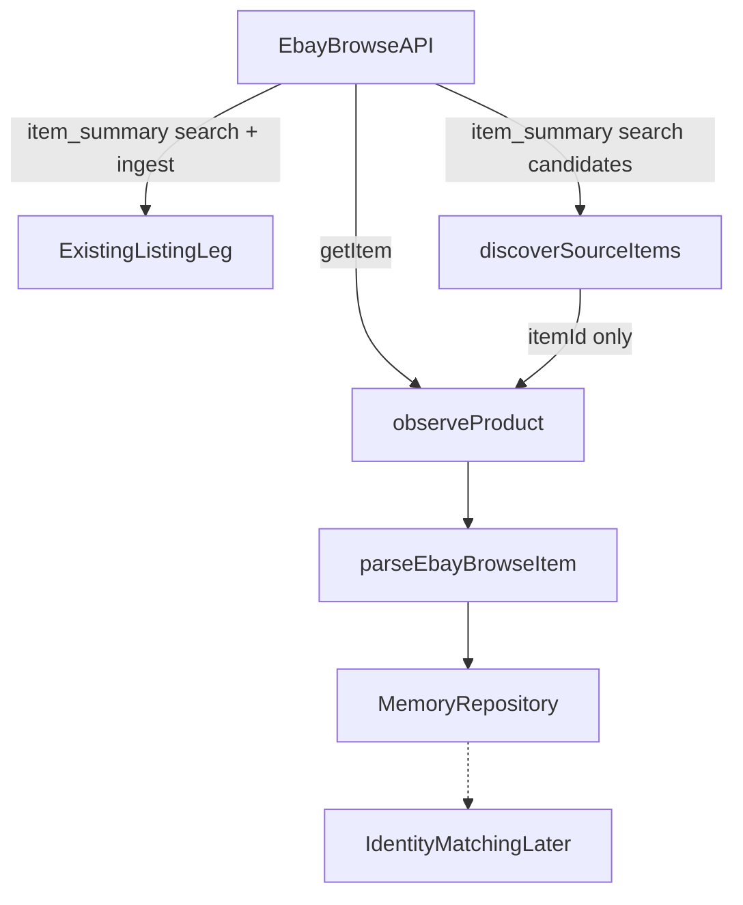

# eBay SourceObservation Bridge

기존 eBay Browse API를 SourceObservation foundation에 연결한다. **eBay는 HTML 스크래퍼가 아니다.** Chrono24/Fashionphile/Money/FX/Home/`/profits`는 동결한다. TCGplayer parser/API/selector는 이번 slice에서 구현하지 않고, **잘못된 source 계약만** 정정한다. working tree는 DIRTY이므로 **이번 slice 파일만** 수정하고 commit/push/stash/reset/restore는 하지 않는다.

## Local repo truth (prompt보다 우선)

- SourceObservation은 이미 `source: "ebay"`를 enum에 넣었지만 [`IMPLEMENTED_PARSERS`](services/market-intelligence/src/source-observation/contract.cjs)는 `fashionphile`, `chrono24`만 있다. `gateObserveSource("ebay")`는 현재 `SOURCE_PARSER_NOT_IMPLEMENTED`다.
- Browse API **search owner**는 [`workers/ebay-adapter/src/browse-api.ts`](workers/ebay-adapter/src/browse-api.ts)다. `GET /buy/browse/v1/item_summary/search` + `getAppToken`(client credentials). **`getItem`은 레포에 없다.**
- Token/env owner: `EBAY_CLIENT_ID` / `EBAY_CLIENT_SECRET` ([`.env.example`](.env.example) L167–168). Header owner: `X-EBAY-C-MARKETPLACE-ID`. Retry/classify owner: [`workers/ebay-adapter/src/retry-policy.cjs`](workers/ebay-adapter/src/retry-policy.cjs) (순수 CJS, 재사용 가능).
- listing-leg identity: `id = lst_ebay_${marketplaceId}_${item.itemId}`, `externalItemId = Browse itemId`. search 결과를 **바로 listing ingest**한다 ([`index.ts`](workers/ebay-adapter/src/index.ts) L244–278). 이 배열의 `observations`는 SourceObservation 스키마가 아니다 (`assetId: query:*`).
- [`discoverCandidates`](services/market-intelligence/src/source-observation/contract.cjs)는 Identity Matching용이며 **NOT_IMPLEMENTED 유지**. 새 이름은 `discoverSourceItems`.
- workspace [`.cursor/plans/`](.cursor/plans/)에는 레거시 9파일만 있다. runtime이 가리키는 `ai_profit_os_global_observation_chrono24.plan.md`는 **워크스페이스에 없음**. 없는 Chrono24 플랜을 추측 편집하지 않고, 새 eBay 플랜 + runtime pointer만 갱신한다.
- 현재 ebay matrix는 `persistToListingLeg: true` / `EXISTING_ADAPTER`다. 이는 **기존 listing-leg persist**이지 SourceObservation→listing promotion이 아니다. Observation path는 `persistToListingLeg: false`로 분리 기록한다. listing-leg 동작은 변경하지 않는다.

## Official Browse API contract (재확인)

Discovery: `GET https://api.ebay.com/buy/browse/v1/item_summary/search` (`q` / `category_ids` / `limit` / `offset`). **암묵적 기본 buying option에 의존하지 않는다.** Observation discovery는 가능한 요청에서 명시적으로 `filter=buyingOptions:{FIXED_PRICE}`를 쓴다. category/filter 공식 제약을 준수한다. listing-leg `searchOnce`에는 이 필터를 넣지 않는다.

Confirmation: `GET https://api.ebay.com/buy/browse/v1/item/{item_id}` (`itemId`의 `|`는 URL-encode). 응답 owner:

- identity: `itemId` (canonical), `legacyItemId` (공식 필드, URL 추측 금지)
- url: `itemWebUrl`
- image: **`item.image.imageUrl`만 listing 대표 이미지.** `Product.image`는 stock photo일 수 있어 우선하지 않는다. `additionalImages`는 스키마 배열이 없으므로 count hint만
- price: `item.price` = 상품 가격(배송비 제외). `ConvertedAmount`: 변환 시 `convertedFrom*` = 변환 전, `value`/`currency` = 변환 후
- 금지 승격: `currentBidPrice`, `marketingPrice.originalPrice`
- buying: `buyingOptions` = `FIXED_PRICE` | `AUCTION` | `BEST_OFFER` | `CLASSIFIED_AD`
- availability: `estimatedAvailabilities[].estimatedAvailabilityStatus`, `itemEndDate`
- identity 직접 필드: `brand`, `mpn`, `gtin`, `epid`, `condition`. `localizedAspects`는 보강. `inferredEpid`는 strong owner 아님

eBay observation path: HTML / Playwright / cookie / session = 0. TCGplayer는 API가 아니며, 아래 source contract의 public-page chain을 따른다 (이번 slice 구현 0).

## Architecture (두 path를 섞지 않음)

**워커 동결:** [`workers/ebay-adapter`](workers/ebay-adapter)의 `runTick` / `searchOnce` / listing ingest / `DEFAULT_SEARCH_QUERIES`는 **수정 0**. listing-leg search 필터(`itemId && price.value`)를 observation discovery에 재사용하지 않는다.

**재사용:** 동일 official URL, 동일 env, 동일 marketplace header, 동일 Browse `itemId`, `retry-policy.cjs` classify. CJS SourceObservation이 Worker TS `browse-api.ts`를 import하지 않는다 (런타임 경계). 새 getItem은 observation acquire에만 둔다.

## Additive contracts

1. [`discoverSourceItems({ source, query, categoryIds, cursor/offset, limit, marketplaceId, observedAt })`](services/market-intelligence/src/source-observation/observe.cjs) — ebay만 구현. 명시 `filter=buyingOptions:{FIXED_PRICE}`. production adapter에 Rolex/Hermès 등 상품 쿼리 hard-code 금지. live/fixture query는 스크립트/env만.
2. [`observeProduct`](services/market-intelligence/src/source-observation/observe.cjs) dispatch: `ebay` → API confirmation. `fashionphile`/`chrono24` 분기 불변. ebay는 `externalItemId` 또는 canonical item URL. URL만 있으면 ID를 문자열 추측하지 않고, 필요 시 official `getItemByLegacyId` 후 **응답 `itemId`**를 canonical로 쓴다.
3. `IMPLEMENTED_PARSERS`에 `ebay` 추가. `EBAY_PARSER_VERSION = "ebay.browse-api.1"`.
4. eBay extraction: schema/`contract.EXTRACTION_METHODS`에 **`EXISTING_API`만 additive** (runtime `acquisitionVocabulary`에 이미 있음). eBay를 HTML 메서드로 위장 금지. 보고용 `EBAY_ACQUISITION_MODE = API`. TCGplayer용 `PUBLIC_PRODUCT_PAGE_PARSER`는 extraction method가 아니라 acquisitionVocabulary source-mode이며, 아래 TCGplayer 절에서만 추가한다.
5. `discoverCandidates`는 계속 throw `NOT_IMPLEMENTED`.

## Parser / price / availability rules

순수 함수 `parseEbayBrowseItem({ item, purpose, observedAt, fetchedAt, requestContext })`를 acquire와 분리.

**V1 Confirmation SUCCESS — 이중 검증:**

Discovery에서 `buyingOptions:{FIXED_PRICE}`로 한 번 거른 뒤, Confirmation에서 `item.buyingOptions`를 다시 검사한다. 최종 truth: `FIXED_PRICE` present **and** `AUCTION` absent일 때만 V1 fixed-price candidate. `AUCTION` 포함(BIN 혼재 포함) → `AMBIGUOUS`. `CLASSIFIED_AD`만 / buyingOptions 없음 → fail-closed. BEST_OFFER는 `FIXED_PRICE` 있고 `AUCTION` 없을 때만 set price 후보.

- `currentBidPrice` / `marketingPrice.originalPrice` / strike-through → 현재 구매가 금지
- `item.price`는 상품가이며 배송/세금/수수료/FX/required capital을 이번 adapter에서 계산하지 않음
- ConvertedAmount:
  - `convertedFromValue` + `convertedFromCurrency` 둘 다 있으면: native = convertedFrom*, localized = `price.value`/`price.currency`, `priceSemantics = native_proven`
  - 없으면 `price.value`/`price.currency`는 **OBSERVED_API_PRICE**다. `NATIVE_CURRENCIES` 소속만으로 `native_proven` 금지
  - native_proven 승격은 다음을 **모두** 만족할 때만: `listingMarketplaceId` 존재, request marketplace context 존재, conversion evidence 없음, 해당 marketplace/currency semantics가 official contract와 일치, conflicting localization evidence 없음
  - 미충족 → native 미확정 → `AMBIGUOUS` / fail-closed (SUCCESS native 채우지 않음)
- CONFIRMATION SUCCESS는 기존처럼 `nativeAmount` + `nativeCurrency` + `meta.priceKind = listing_sale` 필수
- 이미지: **`item.image.imageUrl` 우선·필수**, `Product.image` fallback 금지, `displayAuthorized = false`. additionalImages는 count hint만
- ID: `externalItemId = item.itemId`. `identityHints.legacyItemId`는 API `legacyItemId`만. listing-leg `lst_ebay_*`는 hint로만 기록 가능, observation id로 쓰지 않음
- Identity owner priority: direct API field → `localizedAspects` corroboration → missing. `brand=item.brand`, `mpn=item.mpn`, `gtin=item.gtin`, `epid=item.epid`, `condition=item.condition`. `localizedAspects`는 Model/Size/Color/Style/Type 보강·교차검증만. `inferredEpid`는 strong identity owner로 쓰지 않음(저장하더라도 inferred 라벨, `epid`로 승격 금지). title parser로 brand/model 생성 금지. gender aspect 저장 0. raw aspects blob 금지
- availability: `OUT_OF_STOCK` → `OUT_OF_STOCK`; `itemEndDate` 과거 → `UNAVAILABLE`; `IN_STOCK`/`LIMITED_STOCK` + FIXED_PRICE → `available`; 불명 → fail-closed
- HTTP map: 404=`NOT_FOUND`; 401/403=`TEMPORARY_ERROR`(credential/config, Fashionphile HTML `ACCESS_BLOCKED`와 다름); 429/5xx=`TEMPORARY_ERROR`. 새 status enum 추가 금지

DISCOVERY 후보는 search summary이며 **confirmed market truth가 아니다**. Opportunity/matching truth는 이후 Confirmation만 사용.

## Persistence / live / fixtures

- [`repository.memory.cjs`](services/market-intelligence/src/source-observation/repository.memory.cjs) 재사용. Supabase migration/remote write 0. `OBSERVATION_DB_RUNTIME = BLOCKED_LOCAL_ENV` 유지.
- SourceObservation → listing-leg INSERT/promotion **NOT_IMPLEMENTED**.
- live script [`live-ebay.cjs`](services/market-intelligence/src/source-observation/live-ebay.cjs): credential **존재 여부만** 검사(값 출력 0). 있으면 discovery `limit` 5~20, confirmation 1~3. 없으면 exit 2 `BLOCKED_CREDENTIALS`. fixture PASS를 live PASS로 위조 금지.
- fixtures (민감정보 제거 subset): fixed-price available (`FIXED_PRICE` and not `AUCTION`), missing image, missing itemId, missing price, auction, unavailable/ended, malformed money, unsupported currency, convertedFrom native_proven, no-conversion without marketplace context → fail-closed, direct identity fields, `inferredEpid` not promoted, HTTP error mapping.

## Verifier / matrix

[`tooling/verify/source-observation-runtime.cjs`](tooling/verify/source-observation-runtime.cjs)를 확장 (새 verifier 파일 금지).

검사: ebay adapter 존재, `gateObserveSource("ebay").ok`, Fashionphile/Chrono24 fixture regression 불변, Chrono24 `PARSER_READY_ACQUISITION_BLOCKED`/`AUTOMATED_DISCOVERY=NOT_IMPLEMENTED` 불변, ebay fixture fail-closed(auction, native 미확정, `inferredEpid` 비승격, `item.image.imageUrl`), observation discover가 `buyingOptions:{FIXED_PRICE}`를 명시하고 listing-leg search는 미변경, listing-leg `ebay|admin`, Yahoo 0, `workers/chrono24-adapter` forbidden, freshness 3초, Money/FX 미터치, `discoverCandidates` NOT_IMPLEMENTED, ebay adapter에 Playwright/상품명 hard-code 0, worker listing-leg 파일 미변경. TCGplayer 잠금은 아래 source contract와 동일(중복 정의 없음).

실행: `pnpm verify:source-observation-runtime`, `pnpm verify:listing-legs-day1`. 기존 `verify:ebay-identity-ingest`는 listing-leg owner이므로 **회귀만** (코드 변경 0).

[`source-observation-runtime.v1.json`](governance/global-product/source-observation-runtime.v1.json) ebay row를 **실측 기준**으로 갱신:

- `ACQUISITION_MODE = API` (internal extraction = `EXISTING_API`)
- `EBAY_PRODUCT_NORMALIZER = IMPLEMENTED`
- `EBAY_DISCOVERY_RUNTIME` / `EBAY_CONFIRMATION_RUNTIME` = PASS | BLOCKED_CREDENTIALS | FAIL
- `persistToListingLeg = false`
- `EBAY_LIVE_PROVEN = true`는 live evidence가 있을 때만
- `currentActivePlan`을 새 eBay 플랜으로 교체
- Chrono24/Fashionphile/Yahoo row 불변
- TCGplayer: parser/adapter 파일 0. 아래 **TCGplayer source contract**만 matrix+verifier에 잠근다. `POLICY_BLOCKED_PENDING_PERMISSION`으로 보고하거나 API source로 기록하지 않는다.

## Plan file (실행 시)

생성: [`.cursor/plans/ai_profit_os_ebay_source_observation_bridge.plan.md`](.cursor/plans/ai_profit_os_ebay_source_observation_bridge.plan.md)

- `CURRENT_ACTIVE_PLAN = YES`
- todo 1개: `ebay-source-observation-bridge`
- 없는 Chrono24 플랜 파일은 만들지 않고, runtime pointer만 교체

`pnpm cursor:sync-plans`는 플랜 파일 생성 후 필요할 때만. verify:plans-ssot가 깨지지 않게 한다.

## TCGplayer source contract (이번 slice = 계약 정정만)

레포 현재 오차: matrix는 `ACQUISITION_MODE=PUBLIC_BROWSER_RENDERED_WEB`, `PARSER_CONTRACT_STATUS=READY`다. browser는 fallback의 마지막이지 source mode가 아니고, live forensic 없이 READY는 거짓이다. 이전 초안의 `POLICY_BLOCKED_PENDING_PERMISSION` / API source 취급은 **폐기**한다. 이 절이 TCGplayer SSOT다.

고정 계약:

- `TCGPLAYER_API_INTEGRATION = NO` — API client/token/endpoint 탐색·구현 0
- `TCGPLAYER_SOURCE_MODE = PUBLIC_PRODUCT_PAGE_PARSER` — 공개 상품 페이지 observation
- `IMPLEMENTED_PARSERS`에 tcgplayer 추가 금지
- `adapters/tcgplayer.cjs` / `workers/tcgplayer-adapter` 생성 금지 (listing-legs Day-1도 후자 FORBIDDEN)
- selector/parser 상상 작성 금지. 증거 없는 image/price owner 금지

목표 데이터 (최소). 카탈로그 복제 금지.

- business: actual product image, actual buyer-facing current price
- provenance: `source`, `externalItemId`(page owner가 있을 때만), `canonicalUrl`/`url`, `observedAt`, `fetchedAt`, `parserVersion`, `sourceStatus`
- 수집 금지: seller private, review, account/user, tracking, marketing payload, description bulk

가격:

- first-number / first-dollar / `marketPrice`·`lowPrice`·median 추측 금지
- live forensic으로 buyer-facing current price owner를 먼저 증명
- owner가 명확할 때만 `nativeAmount` / `nativeCurrency` / `priceSemantics`
- 불명하면 `sourceStatus = AMBIGUOUS`, Confirmation `SUCCESS` 금지

이미지:

- live document에서 대표 이미지 owner 확인. extraction 순서와 동일: `STRUCTURED_DATA` → `EMBEDDED_STATE` → `DOM`. 실측 없이 selector 추측 금지
- `imageUrl` observation은 허용, `displayAuthorized = false` (`OBSERVED_IMAGE != DISPLAY_AUTHORIZED`)

획득과 추출을 섞지 않는다. CAPTCHA bypass / stealth / proxy rotation / cookie·session reuse 금지.

- 획득(페이지를 어떻게 가져오는가): `HTTP_HTML` → fail/JS-shell이면 `BROWSER_RENDERED` → fail이면 `ACCESS_BLOCKED` / `UNAVAILABLE` (새 status `SOURCE_UNAVAILABLE` 추가 금지)
- 추출(가져온 페이지에서 어디서 읽는가): `STRUCTURED_DATA` → `EMBEDDED_STATE` → `DOM` → fail이면 `AMBIGUOUS` / `PARSE_FAILED`

구현 순서 (이번 eBay slice가 아님):

- `TCGPLAYER_PUBLIC_PAGE_FORENSIC = LIVE_REVALIDATION` 먼저
- `TCGPLAYER_IMAGE_PARSER` = evidence 후
- `TCGPLAYER_PRICE_PARSER` = price owner 후

이번 slice matrix 정정 (parser 없이 오차만 제거):

- `TCGPLAYER_SOURCE_MODE` / `ACQUISITION_MODE = PUBLIC_PRODUCT_PAGE_PARSER` (`PUBLIC_BROWSER_RENDERED_WEB` 교체)
- `TCGPLAYER_API_INTEGRATION = false`
- `acquisition = ["HTTP_HTML", "BROWSER_RENDERED"]` — 섞인 `fallback` 배열 금지
- `extraction = ["STRUCTURED_DATA", "EMBEDDED_STATE", "DOM"]` — `BROWSER_RENDERED`를 extraction에 넣지 않음
- `PARSER_CONTRACT_STATUS = PENDING_LIVE_FORENSIC` (`READY` 제거)
- `LIVE_RUNTIME_STATUS = NOT_VERIFIED` 유지
- `NEXT_ACTION = LIVE_REVALIDATION` 유지
- `persistToListingLeg = false` 유지
- `acquisitionVocabulary`에 `PUBLIC_PRODUCT_PAGE_PARSER`와 필요 시 `HTTP_HTML`만 additive. `EXTRACTION_METHODS`에 새 메서드 추가하지 않음 (`STRUCTURED_DATA`/`EMBEDDED_STATE`/`DOM` 재사용)

verifier 잠금 (tcgplayer만 분리, mercari 등 unverified 루프는 유지):

- adapter 파일 0
- API integration false
- `PARSER_CONTRACT_STATUS !== READY` 이고 `PENDING_LIVE_FORENSIC`
- sourceMode / `ACQUISITION_MODE === PUBLIC_PRODUCT_PAGE_PARSER`
- acquisition과 extraction 배열이 섞이지 않음 (`BROWSER_RENDERED` ∉ extraction, `STRUCTURED_DATA` ∉ acquisition)
- live 미검증 / `NEXT_ACTION === LIVE_REVALIDATION`
- 최종 보고에 `POLICY_BLOCKED_PENDING_PERMISSION` 또는 `TCGPLAYER_API_INTEGRATION=YES` 금지

## 금지 (이번 slice)

Chrono24 acquisition 우회, TCGplayer parser/API/selector 구현, Source #4 parser, Identity Matching 구현, Opportunity INSERT, `/profits`/Home/admin UI, Money/FX/reprice, image display authorization, Yahoo activation, worker listing-leg 행동 변경, commit/push/stash/reset/restore, 무관 cleanup.

## 완료 판정

eBay 구현 + fixture verifier PASS. live credentials 있으면 최소 호출로 Discovery/Confirmation/memory를 증명. 없으면 `IMPLEMENTATION=PASS` / `LIVE_RUNTIME=BLOCKED_CREDENTIALS`로 분리.

TCGplayer: `IMPLEMENTATION = NOT_IMPLEMENTED`, `TCGPLAYER_API_INTEGRATION = NO`, `TCGPLAYER_SOURCE_MODE = PUBLIC_PRODUCT_PAGE_PARSER`, `TCGPLAYER_PUBLIC_PAGE_FORENSIC = PENDING`, image/price parser = evidence 후. `POLICY_BLOCKED_PENDING_PERMISSION`으로 보고하지 않는다.

최종 보고 `# PUTDUK_EBAY_SOURCE_OBSERVATION_BRIDGE_IMPLEMENTATION` 후 STOP.

다음 추천 slice(이번 구현 0): eBay+Fashionphile live가 증명되면 `IDENTITY_MATCHING_V1`. TCGplayer live forensic은 Identity Matching 다음의 별도 slice이며, 이번 성공의 다음 우선순위가 아니다. eBay live가 막히면 blocker 해소.

`IMPLEMENTATION_READY = YES` — 위 4 corrections 흡수 후.