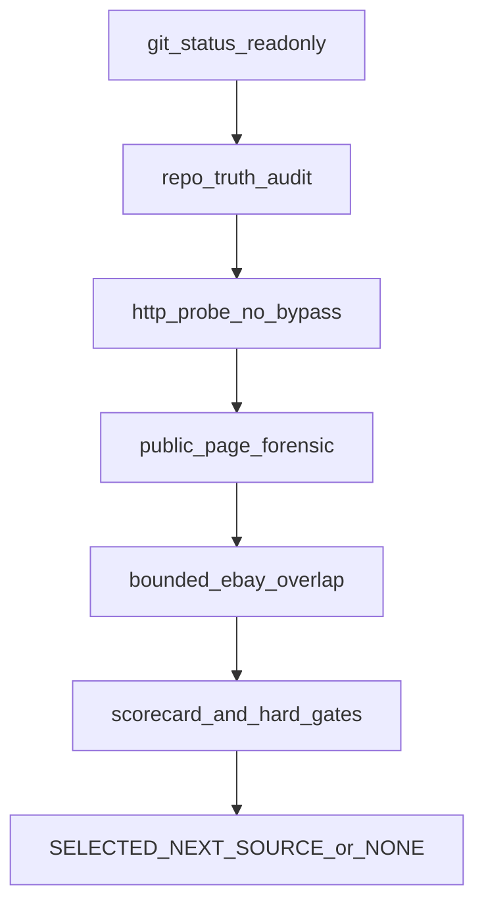

# PUTDUK_REAL_MATCH_PAIR_SOURCE_SELECTION_FORENSIC

읽기 전용 forensic. parser / matcher / adapter / DB / Opportunity / Home 변경 0. commit / push / stash / restore 0. 다른 세션 dirty tree(Spark Dash UI 포함) 미접촉.

## Git safety (시작 시만)

이미 확인됨:

- HEAD = `0345206ad2e7238658454db5d072c8fbf93dbb37` (요청과 일치)
- Working tree = DIRTY (UI + untracked `source-observation` / `identity-matching`)
- 이번 slice는 `git status --short` / `git rev-parse HEAD` / `git diff --name-only`만 재확인 후 즉시 조사로 이동

## 선정 축 — matcher에 source를 맞추지 않음

[identity-matching.v1.json](governance/global-product/identity-matching.v1.json) + [normalize.cjs](services/market-intelligence/src/identity-matching/normalize.cjs)가 **동결된 계약**이다.

V1이 오늘 비교하는 strong type는 셋뿐이다:

- `GTIN` — `identityHints.gtin` (어느 source든)
- `MPN` — **ebay만** `meta.modelNumber` ← Browse `item.mpn`
- `WATCH_REFERENCE` — **chrono24만** `meta.modelNumber` ← reference

추가로 luxury_bag corroborating: 양쪽 `categoryHint`가 bag/handbag이고 **owner-backed brand + model** (size/color는 양쪽 있으면 critical).

후보마다 identity를 **3층**으로 기록한다. “필드가 보인다”와 “지금 V1이 비교한다”를 섞지 않는다.

```text
RAW_IDENTITY_GEOMETRY
= 실제 source에 strong identifier가 존재 (GTIN / manufacturer MPN·style / watch reference)

V1_CURRENTLY_COMPATIBLE
= 지금 코드 그대로 matchSourceObservations에 넣어 비교 가능

V1_BRIDGE_REQUIRED
= matcher rule을 느슨하게 하지 않고
  기존 typed identity로 source-side semantic mapping만 추가하면 가능
```

예: StockX `style code = DD1391-100` 이고 eBay `MPN = DD1391-100` 이어도, 현재 normalizer가 StockX style을 `MPN`으로 emit하지 않으면:

```text
RAW_IDENTITY_GEOMETRY = PASS
V1_CURRENTLY_COMPATIBLE = FAIL
V1_BRIDGE_REQUIRED = POSSIBLE
```

이런 후보는 **선정 가능**하다. 선정 시 반드시:

```text
NEXT_SLICE_REQUIRES_IDENTITY_EMISSION_BRIDGE = YES
```

Chrono24 `WATCH_REFERENCE` vs eBay `MPN`도 raw identity는 좋아도 **현재 V1 runtime pair는 MATCH 불가**. acquisition이 풀린 경우에만 후보 유지하고 `V1_BRIDGE_REQUIRED = POSSIBLE` (eBay watch reference → 기존 `WATCH_REFERENCE` emit, 또는 동등 bounded mapping).

중요한 차이:

```text
새 deterministic typed mapping 추가  !=  matcher loosening

기존 GTIN/MPN/WATCH_REFERENCE 의미와 정확히 같은 값을
source adapter가 typed field로 emit
→ bounded semantic bridge
→ matcher loosening 아님

새 identifier type이 필요 (CARD_SET_NUMBER 등)
→ V1_CONTRACT_EXTENSION_REQUIRED
→ 이번 selection 목적에서는 감점/탈락 가능
```

TCGplayer: source quality와 V1 match compatibility를 분리한다. card identity가 좋아도 V1에 card type이 없으면 이번 목표(“V1 그대로 가장 빨리 MATCH”)에서는 낮은 순위.

금지 판정:

- title / image / price로 same product
- source-local SKU를 eBay MPN으로 가정 (Fashionphile CASE B2와 동일)
- `V1_CONTRACT_EXTENSION_REQUIRED`가 MATCH의 유일한 길 → 감점/탈락

Fashionphile / Yahoo Japan / Amazon = 후보 제외. mercari_jp·bunjang는 repo matrix에 있으나 사용자 지정 6개 밖 + used-goods identity 약함 + JPY/KRW persist blocker → 이번 audit에 넣지 않음. 6개 전부 hard gate면 확장하지 않고 `NONE`.

## 후보 6 (live 재검증 필수)

과거 문서는 가설일 뿐. `latest repo truth > old note`.

특히 [parser-contract-matrices.v1.json](governance/global-product/parser-contract-matrices.v1.json)의 StockX/GOAT/KREAM `categoryFit: watch/trading_card/luxury_bag`는 **stale** — overlap 증거로 쓰지 않음.

| 가설(재검증 전) | Repo 최신 |
|---|---|
| Chrono24 | parser READY · `AUTOMATED_ACQUISITION=BLOCKED_CURRENT_ENV` ([source-observation-runtime.v1.json](governance/global-product/source-observation-runtime.v1.json)) · Cloudflare 우회 금지 |
| TCGplayer | `TCGPLAYER_API_INTEGRATION=NO` · `PUBLIC_PRODUCT_PAGE_PARSER` · `PENDING_LIVE_FORENSIC` · V1에 card type 없음 |
| StockX / GOAT / KREAM | `PUBLIC_BROWSER_RENDERED_WEB` · `NOT_VERIFIED` · style code ≠ site product id 구분 필수 |
| Vestiaire | `PARSER_CONTRACT_STATUS=BLOCKED` · image gate · listing `Reference`는 source-local 가능성 |

## 실행 순서 (저사양 · live 최소)

프로세스 1개. 서브에이전트 0. 후보당 product 1~3. eBay discovery 5~10 · confirmation 최대 1~3. credential 출력 0.



### 1. Repo truth audit (외부 호출 전)

읽기만:

- [source-observation-runtime.v1.json](governance/global-product/source-observation-runtime.v1.json)
- [identity-matching.v1.json](governance/global-product/identity-matching.v1.json)
- [parser-implementation-contract.v1.md](governance/global-product/parser-implementation-contract.v1.md) §10
- adapters: [ebay.cjs](services/market-intelligence/src/source-observation/adapters/ebay.cjs), chrono24, fashionphile
- [normalize.cjs](services/market-intelligence/src/identity-matching/normalize.cjs) emission 표 확정
- 기존 live helper 재사용만: [live-ebay.cjs](services/market-intelligence/src/source-observation/live-ebay.cjs), [live-chrono24.cjs](services/market-intelligence/src/source-observation/live-chrono24.cjs), [access-block.cjs](services/market-intelligence/src/source-observation/extract/access-block.cjs)

새 production 파일 / verify / governance 수정 없음.

### 2. Official / primary docs (현재)

각 후보 공식 API·개발자 문서가 **지금** 공개 catalog를 주는지 확인. 기억·제3자 scraper 문서 제외.

- TCGplayer: API = NO 계약 유지. 공개 페이지 forensic만
- Chrono24: 공개 개발자 API 없음이 재확인되면 acquisition은 HTTP/browser public path만
- StockX/GOAT/KREAM/Vestiaire: 공개 product API가 없으면 `API` 후보에서 제외

### 3. Live revalidation — acquisition과 extraction 분리

후보마다 정상 공개 URL 1~3개만.

1. HTTP 문서 (WebFetch / fetch). 403·challenge·Turnstile → `ACCESS_BLOCKED`. solver / stealth / proxy / cookie reuse 즉시 STOP 그 source.
2. HTTP가 JS 셸이면 Playwright MCP로 **일반 공개 렌더만**. CAPTCHA면 `ACCESS_BLOCKED`.
3. 기록:

```text
ACQUISITION = API | PUBLIC_JSON | HTTP_HTML | BROWSER_RENDERED | BLOCKED
EXTRACTION  = STRUCTURED_API_FIELD | JSON_LD | EMBEDDED_STATE | DOM | UNKNOWN
```

JSON-LD를 acquisition으로 쓰지 않음.

필드마다 `OWNER_BACKED` / `CROSS_SOURCE_USEFUL` / `EBAY_COMPATIBLE` / `PROVENANCE`. 없으면 `NOT_PRESENT`.

가격: 라벨 이름(`marketPrice`, `lowPrice`, `즉시구매가`, `Lowest Ask`)만으로 owner 금지. buyer-facing **현재 구매가** 의미 증명. 미해결이면 `PARTIAL` (선정은 가능하나 다음 slice 전 필수).

이미지: 실제 product image URL 관측만. `OBSERVED_IMAGE != DISPLAY_AUTHORIZED`. display permission 판단 0.

### 4. eBay overlap — 3단계 (top 후보만)

title/search similarity만으로 `REAL_CATEGORY_OVERLAP = PASS` 금지 (Fashionphile Mini Kelly 교훈).

```text
SEARCH_OVERLAP
= eBay 검색에서 동일 계열 상품 후보 발견

TYPED_IDENTITY_OVERLAP
= 양쪽에 같은 semantic type의 identifier candidate 존재

CONFIRMED_TYPED_OVERLAP
= 양쪽 Confirmation 수준에서 같은 typed value가 실제 확인됨
```

점수: `TYPED_IDENTITY_OVERLAP` / `CONFIRMED_TYPED_OVERLAP`을 가장 강하게. 제품명 검색만이면 overlap 점수 낮음.

선정 각축 1~2 source만:

- typed identity로 Browse discovery limit 5~10
- Confirmation 최대 1~3
- 기존 [live-ebay.cjs](services/market-intelligence/src/source-observation/live-ebay.cjs) / `discoverSourceItems` 재사용
- 양쪽 Confirmation이 없으면 `REAL_MATCH = NOT_YET_PROVEN` · `CONFIRMED_TYPED_OVERLAP = NO`

### 5. Scorecard (100) + hard gates

점수 숫자 < evidence.

- IDENTITY_COMPATIBILITY_WITH_EBAY 35 — `RAW` + `V1_CURRENTLY_COMPATIBLE` / `V1_BRIDGE_REQUIRED` 분리 채점. 현재 emit 가능하면 최고, bounded bridge면 높음, `V1_CONTRACT_EXTENSION_REQUIRED`면 낮음
- REAL_CATEGORY_OVERLAP 20 — `CONFIRMED_TYPED_OVERLAP` > `TYPED_IDENTITY_OVERLAP` > `SEARCH_OVERLAP`. title-only search는 낮음
- AUTOMATED_ACQUISITION_FEASIBILITY 20 — 우회 없는 정상 path
- BUYER_PRICE_OWNER 10
- IMAGE_OWNER 5
- CURRENT_ACCESS_STABILITY 5 — 아래 3층 분리. 1~3 요청으로 장기 안정성 PASS 금지
- IMPLEMENTATION_COST 5

Access 3층:

```text
CURRENT_PUBLIC_ACCESS =
PASS / PARTIAL / BLOCKED

AUTOMATED_ACQUISITION_FEASIBILITY =
PASS / PARTIAL / BLOCKED

ACCESS_STABILITY =
PROVISIONAL / NOT_PROVEN / BLOCKED
```

Score 5점: 반복 bounded 요청 정상 → 최대 근처. 한 번만 성공 → provisional. 간헐 403/challenge → 낮음. CAPTCHA/Turnstile → hard gate.

Hard gate (하나라도 해당하면 SELECT 불가):

- `NO_REAL_CATEGORY_OVERLAP`
- `NO_IDENTITY_OWNER` / `TITLE_ONLY_IDENTITY` / `IMAGE_ONLY_IDENTITY`
- `ACQUISITION_BLOCKED_WITH_NO_NORMAL_PUBLIC_PATH`
- `PRICE_OWNER_UNRESOLVED`가 다음 slice에서도 닫을 수 없음
- `POLICY/PRODUCT CONTRACT_FORBIDS_SOURCE`
- `REQUIRES_SESSION_OR_BYPASS`
- `V1_CONTRACT_EXTENSION_REQUIRED`가 MATCH의 유일한 길

Chrono24는 identity geometry가 높아도 acquisition blocker를 점수에 그대로 반영. 우회 플랜 작성 금지.

### 6. 최종 선정 규칙

정확히 하나:

```text
SELECTED_NEXT_SOURCE = <source> | NONE
CONFIRMED_TYPED_OVERLAP = YES / NO
V1_CURRENTLY_COMPATIBLE = PASS / FAIL
V1_BRIDGE_REQUIRED = YES / POSSIBLE / NO
```

이유 순서 고정:

1. eBay same-category real product overlap
2. compatible typed identity (V1 기존 type / luxury_bag corroborating)
3. normal automated acquisition
4. buyer-facing price owner
5. implementation boundedness

유명세·파트너 이미지 0. 억지 1위 0.

선정 시 다음 slice 이름만 제안 (구현 0):

```text
PUTDUK_<SOURCE>_LIVE_FORENSIC_AND_SOURCE_OBSERVATION
```

목표: Discovery → Confirmation → typed observation → eBay same-product search → V1 → REAL MATCH. Opportunity 아직 아님.

## 산출물 / 동결

- 채팅에 요청 §37 보고서 원문 형식만. 이상적 `MODIFIED_FILES = NONE`
- helper가 꼭 필요하면 ephemeral read-only (`node -e` / 기존 live CLI). production wiring 0. commit 0
- `PUTDUK_REAL_AUTOMATED_SOURCE_COUNT = 2` 유지
- `REAL_CROSS_SOURCE_PAIR` / `REAL_IDENTITY_MATCH_RUNTIME` = 기존 `BLOCKED_NO_REAL_PAIR` 유지 (이번 slice에서 MATCH PASS를 성공조건으로 만들지 않음)

## STOP

CAPTCHA/bypass 필요, identity semantics 미증명, source-local을 manufacturer로 오인, title parsing이 strong MATCH에 필요, price semantic 불가, product contract 금지, dirty conflict를 고치려 함, credential 유출 위험, parser를 만들어야 선정 가능 → 해당 source `ACCESS_BLOCKED` / `PENDING_LIVE_FORENSIC` 후 보고서. 전체 불가 시 `NONE`.

## FINAL REVIEW CORRECTIONS

1. 후보의 identity 상태를 세 층으로 분리한다.

   RAW_IDENTITY_GEOMETRY
   V1_CURRENTLY_COMPATIBLE
   V1_BRIDGE_REQUIRED

   기존 GTIN/MPN/WATCH_REFERENCE와 동일한 semantics를
   source-side에서 typed field로 emit하는 bounded bridge는
   matcher loosening으로 취급하지 않는다.

   반대로 완전히 새로운 identifier type이 있어야만 MATCH 가능한 경우는
   V1_CONTRACT_EXTENSION_REQUIRED로 기록한다.

2. eBay overlap은 세 단계로 기록한다.

   SEARCH_OVERLAP
   TYPED_IDENTITY_OVERLAP
   CONFIRMED_TYPED_OVERLAP

   title/search-result similarity만으로 REAL_CATEGORY_OVERLAP 최고 점수를 주지 않는다.
   실제 typed identity overlap을 가장 강한 evidence로 사용한다.

3. CURRENT_PUBLIC_ACCESS와 ACCESS_STABILITY를 분리한다.

   bounded live forensic 성공은 현재 접근 가능성의 증거이지
   장기 안정성의 완전한 증거가 아니다.

   CURRENT_PUBLIC_ACCESS = PASS / PARTIAL / BLOCKED
   ACCESS_STABILITY = PROVISIONAL / NOT_PROVEN / BLOCKED

   CAPTCHA / Turnstile / session reuse 필요 시에는 기존대로 hard gate.
