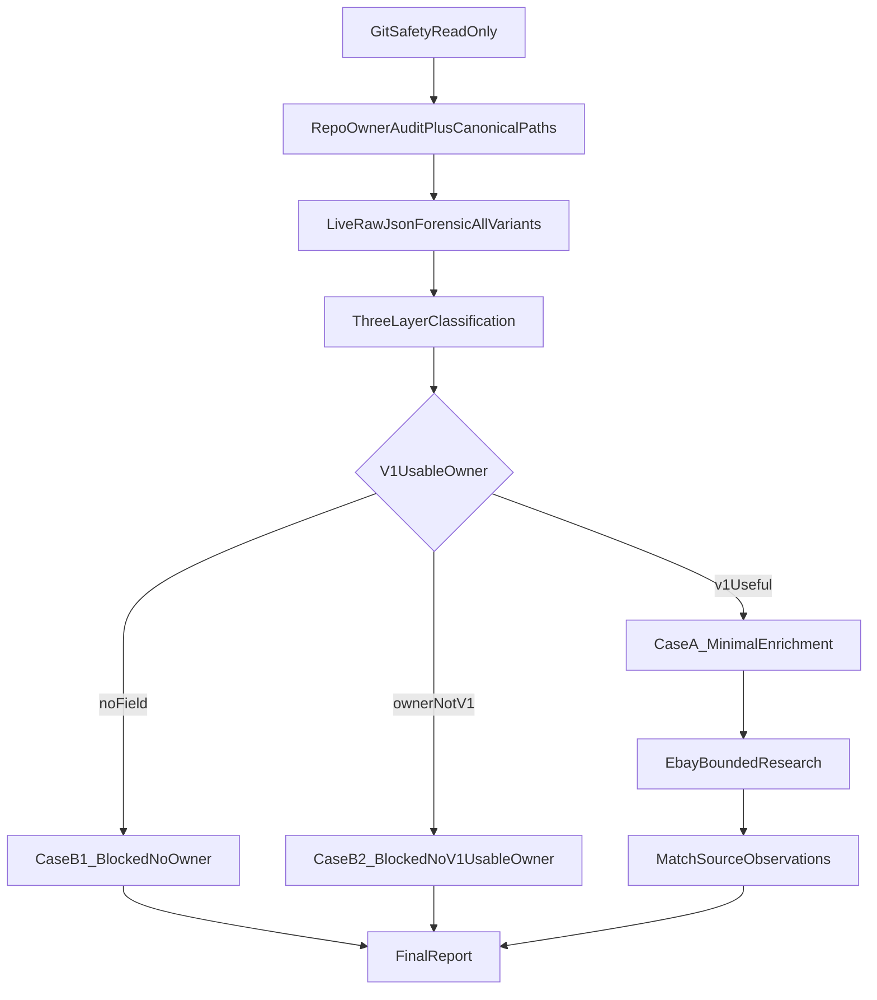

# PUTDUK Fashionphile Identity Forensic + Real Match Retry

CURRENT_ACTIVE_PLAN = YES

```text
PUTDUK_FASHIONPHILE_IDENTITY_FORENSIC_PLAN = PASS_WITH_4_CORRECTIONS
IMPLEMENTATION_READY = YES

목표 = owner forensic → (V1-usable owner일 때만) 최소 enrichment → eBay bounded re-search → matchSourceObservations
목표 != Opportunity / listing promotion / DB / /profits / TCGplayer / matcher 완화
GIT = commit 0 · push 0 · stash/reset/restore/clean 0
HEAD 확인 = 0345206ad2e7238658454db5d072c8fbf93dbb37
Working tree = DIRTY (Home/profits/다른 session 파일 보호 · 무관 reformat 0)
```

## 이미 확인된 repo truth (실행 전 재확인만)

Parser owner는 [`services/market-intelligence/src/source-observation/adapters/fashionphile.cjs`](services/market-intelligence/src/source-observation/adapters/fashionphile.cjs)다. Live path는 [`observe.cjs`](services/market-intelligence/src/source-observation/observe.cjs) `observeFashionphile` → confirmation `https://www.fashionphile.com/products/{handle}.json`.

현재 parser가 추출하는 identity는 이것뿐이다.

- `meta.brand` ← `product.vendor`
- `meta.sku` ← resolved variant `sku` (source-local)
- `title` ← `product.title`
- `externalItemId` ← Shopify product `id`

추출하지 않음: `product_type`, `tags`, `options`, `barcode`, `meta.model`, `meta.categoryHint`, `meta.identityHints.gtin`.

Sanitized fixture는 이미 다음을 보여준다. **live payload의 전체 key set이 아니다** (barcode/options 등이 잘렸을 수 있음).

- [`confirmation-product.json`](services/market-intelligence/src/source-observation/fixtures/fashionphile/confirmation-product.json): `product_type = "Bags"`, `tags = "Must-have Mini Bags, US"`, variant `sku = 1956054`, variant `title = Default Title`, **barcode 없음**
- Discovery fixture도 `product_type`/`tags`만 있고 barcode 없음

Matcher V1 ([`normalize.cjs`](services/market-intelligence/src/identity-matching/normalize.cjs) + [`fashion.cjs`](services/market-intelligence/src/identity-matching/profiles/fashion.cjs) + [`unknown.cjs`](services/market-intelligence/src/identity-matching/profiles/unknown.cjs)):

- Fashionphile `sku`는 source-local. eBay `modelNumber`(MPN)와 비교 금지. fixture `K-fashionphile-sku-not-ebay-mpn`가 잠금
- `validGtin()` 이미 존재: `/^\d{8}$|^\d{12,14}$/` · `Does Not Apply` 탈락
- `luxury_bag` profile은 `categoryHint`가 `bags` **그리고** `handbags`이거나 `luxury bag`일 때만
- `product_type = "Bags"`를 그대로 `meta.categoryHint`에 넣어도 profile은 **unknown**
- unknown profile은 typed strong identifier(GTIN 등) 없이 MATCH 불가
- fashion MATCH는 **brand + owner-backed model** 필수. title에서 Mini Kelly/Sellier/20/Black/Epsom 추론 금지

Schema ([`schemas/source-observation.v1.json`](schemas/source-observation.v1.json))는 이미 `meta.model` / `meta.modelNumber` / `meta.size` / `meta.categoryHint` / `meta.identityHints.*`를 허용한다. **새 schema field invent 금지.** 표현 불가면 STOP + report.

Parser version owner: [`FASHIONPHILE_PARSER_VERSION`](services/market-intelligence/src/source-observation/contract.cjs) = `fashionphile.public-json.1`. identity output이 materially 변하면 `.2`로 bump하고 아래 Correction D wiring만 연다. 의미 없는 bump 금지.

## CORRECTION A — canonical field path (실행 시작 시 재확인)

Fashionphile enrichment 전에 아래 셋을 보고 **observation write path 하나**만 고정한다. shorthand와 document path를 혼용하지 않는다.

- [`schemas/source-observation.v1.json`](schemas/source-observation.v1.json)
- [`identity-matching/normalize.cjs`](services/market-intelligence/src/identity-matching/normalize.cjs) (`metaOf` / `hintsOf`)
- 기존 eBay observation write ([`adapters/ebay.cjs`](services/market-intelligence/src/source-observation/adapters/ebay.cjs) `buildIdentity` + `observation.meta`)

현재 repo read 결과 (실행 시 재확인, shadow field 신설 금지):

- GTIN write = `observation.meta.identityHints.gtin` · matcher read = `hintsOf(obs).gtin` = 같은 object
- color write = `observation.meta.identityHints.color` · matcher read = `hintsOf(obs).color`
- size write = `observation.meta.size` · matcher read = `metaOf(obs).size`
- categoryHint write = `observation.meta.categoryHint` · matcher read = `metaOf(obs).categoryHint`
- model write = `observation.meta.model` · matcher read = `metaOf(obs).model`
- modelNumber write = `observation.meta.modelNumber` · matcher read = `metaOf(obs).modelNumber` (Fashionphile SKU를 여기로 옮기지 않음)
- sku write = `observation.meta.sku` · source-local only
- brand write = `observation.meta.brand`

금지:

- observation root `identityHints.gtin` (schema에 없음)
- `meta.identityHints.gtin`과 별도 `identityHints.gtin` duplicate owner
- matcher provenance 문자열(`${source}.identityHints.gtin`)을 write path로 착각

매핑은 **기존 matcher가 실제 읽는 canonical path에만**.

## 실행 순서



### 0. Git safety (read-only)

작업 시작 시만:

- `git status --short`
- `git rev-parse HEAD`
- `git diff --name-only`

허용 touch: Fashionphile parser/fixture, 최소 forensic/live script, 기존 source-observation/identity-matching verifier assertion, `package.json` script 1줄(필요 시). CASE A version bump가 필요할 때만 `contract.cjs`와 그 version을 직접 assert/record하는 최소 verifier/governance. Home / `/profits` / 다른 dirty 파일은 열어서 고치지 않는다.

### 1. Live raw forensic — 코드 수정 0

parser를 거치지 않고 confirmation JSON을 한 번 fetch한다. 기존 acquisition URL만 사용.

```text
https://www.fashionphile.com/products/hermes-epsom-mini-kelly-sellier-20-black-1956054.json
```

Discovery `/products.json`는 이미 증명됨. 추가 live call은 confirmation 1회(+ CASE A일 때만 eBay discovery 1 + confirmation max 3~5).

새 스크립트 위치 후보 (convention: [`live-fashionphile.cjs`](services/market-intelligence/src/source-observation/live-fashionphile.cjs) 옆):

- [`services/market-intelligence/src/source-observation/live-fashionphile-identity-forensic.cjs`](services/market-intelligence/src/source-observation/live-fashionphile-identity-forensic.cjs)

출력은 secret 없이:

- product root keys
- `options[]` name/values
- `product_type`, `vendor`, `handle`, `tags`
- images는 identity owner가 아니면 path만

## CORRECTION B — all-variant forensic

`variants[0]`은 구조 sample로만 허용한다. canonical identity owner 결정에 쓰지 않는다.

전체 `variants[]`를 bounded하게 검사:

- `variantCount`
- union of variant keys
- 모든 `barcode` 값 (empty/null/placeholder 포함)
- 모든 `sku` 값
- 모든 `option1` / `option2` / `option3` 값

multiple variants에서 identity value가 다르면, 그 차이가 실제 variant identity인지 검토하고 **무조건 product-level identity로 승격하지 않는다.** 기존 price parser의 multi-variant consistency (`exactly_one` / `identical_multi` / `AMBIGUOUS`)와 같은 철학.

Shopify라는 이유로 barcode가 있다고 가정하지 않는다. fixture에 없다고 live에도 없다고 단정하지 않는다.

값 출력은 sanitized example만. credential/cookie/Authorization 0.

### 2. Owner classification — 세 층 + A~E

각 field를 먼저 세 층으로 기록한다.

```text
FIELD_PRESENT
OWNER_BACKED
V1_MATCH_USEFUL
```

그 다음 A~E:

- A CROSS_SOURCE_STRONG_CANDIDATE — GTIN/UPC/EAN, manufacturer style/model. semantics 증명 시에만
- B CORROBORATING_IDENTITY — owner-backed category/type/model/size/color/material
- C SOURCE_LOCAL_ONLY — Shopify id, Fashionphile SKU, handle
- D PRESENTATION_ONLY — title, marketing text, image alt
- E AMBIGUOUS / DO_NOT_USE — 이름만 있고 semantics 불명

선행 분류(live로 뒤집힐 수 있음):

- `vendor` = 이미 brand owner
- `variants[].sku` / `1956054` = **C SOURCE_LOCAL_ONLY**. manufacturer style code 공식 증거 없으면 유지. `sku == eBay MPN` 금지
- `title` / variant `Default Title` = D
- `product_type: "Bags"` 예:
  - FIELD_PRESENT = YES
  - OWNER_BACKED = YES
  - CLASSIFICATION = CORROBORATING_IDENTITY
  - V1_MATCH_USEFUL = NO
  - PARSER_MAPPING = NO_CHANGE
  - reason = current profile contract does not accept this source vocabulary
  - `"Bags"` → `Women's Bags & Handbags` / `luxury_bag` rewrite 금지
- `tags` (`Must-have Mini Bags`, `US`) = D 또는 E. marketing/search. strong identifier 금지. US tag로 currency 추정 금지(기존 lock)
- `barcode` = 전체 variants에서 확인. empty/null/`Does Not Apply`/`0`/placeholder면 GTIN 승격 금지. `validGtin`과 동일 규칙만. variant마다 값이 다르면 product-level 승격 금지

### 3. CASE gate

```text
FIELD_PRESENT ≠ OWNER_BACKED ≠ V1_MATCH_USEFUL
```

**CASE A — V1_MATCH_USEFUL** (이 조건이 맞을 때만 enrichment + eBay retry):

- 전체 variants에서 consistent valid GTIN → canonical `meta.identityHints.gtin`, 또는
- owner-backed `meta.model` + **현재** `resolveSingleProfile`이 rewrite 없이 `luxury_bag`로 읽는 `meta.categoryHint`, 또는
- owner-backed size/color가 structured option/variant attribute로 존재하고, 위 model+profile과 함께 fashion corroborating set을 채움

`product_type = "Bags"`만으로는 CASE A가 아니다. matcher를 `Bags` → `luxury_bag`로 바꾸지 않는다. title parsing으로 model을 만들지 않는다. schema breaking change가 필요하면 STOP.

## CORRECTION C — CASE B를 둘로 분리

**CASE B1 — NO owner-backed identity field**

```text
FASHIONPHILE_IDENTITY_OWNER_FORENSIC = PASS
FASHIONPHILE_OWNER_BACKED_IDENTITY = BLOCKED_NO_OWNER
FASHIONPHILE_V1_USABLE_IDENTITY = BLOCKED_NO_OWNER
FASHIONPHILE_IDENTITY_ENRICHMENT = BLOCKED_NO_OWNER
```

**CASE B2 — owner는 있으나 current V1이 못 씀**

예: `product_type = "Bags"`만 있고 GTIN/model/resolver-compatible category가 없음.

```text
FASHIONPHILE_IDENTITY_OWNER_FORENSIC = PASS
FASHIONPHILE_OWNER_BACKED_IDENTITY = PARTIAL
FASHIONPHILE_V1_USABLE_IDENTITY = BLOCKED_NO_V1_USABLE_OWNER
FASHIONPHILE_IDENTITY_ENRICHMENT = NOT_REQUIRED
REAL_MATCH_RETRY = BLOCKED_NO_V1_USABLE_OWNER
```

B1/B2 공통: parser enrichment 0 (forensic script만 허용). matcher 0. eBay adapter 0. `Bags`를 `luxury_bag`로 rewrite하지 않는 결정은 PASS. matcher가 못 쓰는 merchant type을 `meta.categoryHint`에 넣는 것은 false category signal이므로 NO_CHANGE.

## CASE A only

대상 파일:

- [`adapters/fashionphile.cjs`](services/market-intelligence/src/source-observation/adapters/fashionphile.cjs) — 증명된 field만 canonical path에 매핑
- sanitized fixture 최소 subset 추가/갱신
- [`tooling/verify/source-observation-runtime.cjs`](tooling/verify/source-observation-runtime.cjs) assertion 최소 추가
- 필요 시 [`tooling/verify/fashionphile-identity-forensic.cjs`](tooling/verify/fashionphile-identity-forensic.cjs) + `package.json` script 1줄

매핑 규칙 (Correction A path만):

- consistent valid barcode → `meta.identityHints.gtin`. adapter가 matcher에 의존하지 않게 `validGtin`과 **동일 규칙**을 parser 쪽에 최소 복제
- structured Color option → `meta.identityHints.color`
- structured Size option → `meta.size`
- structured model field(실제 key semantics 증명 시) → `meta.model`
- `meta.categoryHint`는 resolver가 이미 인정하는 owner 문자열일 때만. `"Bags"` 승격 금지
- Fashionphile SKU는 `meta.sku` 유지. `meta.modelNumber`로 옮기지 않음

보존(regression 깨면 FAIL):

- `variants.price` current owner · `compare_at_price` fallback 0
- Discovery currency 추정 0 · Confirmation `price_currency` 유지
- multi-variant consistency 유지. `variants[0]` 무조건 owner 금지
- `displayAuthorized = false` 유지
- eBay adapter / listing-leg worker 수정 0 (실제 bug 발견 시에만 STOP하고 보고)

## CORRECTION D — parserVersion wiring (CASE A + material change만)

identity output이 materially 확대되어 bump가 필요할 때만:

- canonical owner [`services/market-intelligence/src/source-observation/contract.cjs`](services/market-intelligence/src/source-observation/contract.cjs) `FASHIONPHILE_PARSER_VERSION` → `fashionphile.public-json.2`
- 그 version을 **직접 assert**하는 verifier만 최소 수정
- 그 version을 기록하는 runtime/governance entry가 있으면 그 한 줄만

금지: source status / acquisition contract / `persistToListingLeg` / source semantics 변경. version bump 때문에 unrelated runtime matrix 재설계 금지. output이 안 바뀌면 `.1` 유지. identity-matching fixture의 `.1`은 synthetic이라 강제 변경하지 않음.

### eBay retry (CASE A)

기존 `discoverSourceItems` + `observeProduct CONFIRMATION`만. discovery limit 5~20, confirmation max 3~5.

GTIN이 있을 때:

- 기존 Browse acquisition이 structured GTIN lookup/filter를 **이미** 지원하면 그것을 우선
- 현재 [`searchEbayItemSummaries`](services/market-intelligence/src/source-observation/acquire/ebay-browse.cjs)는 `q` + `category_ids` + FIXED_PRICE filter만 있다. **이번 slice에서 Browse abstraction을 넓히지 않는다**
- 지원하지 않으면 GTIN을 `q`의 candidate discovery 보조값으로만 사용 → Confirmation에서 실제 GTIN 재검증

MATCH authority = Confirmation observation. 검색 query가 아니다. title은 discovery 보조. eBay adapter 변경 0.

matcher: 기존 `matchSourceObservations` 그대로. threshold 완화 0. brand+title MATCH 0. unknown + corroborating-only MATCH 0.

MATCH일 때만 `REAL_CROSS_SOURCE_PAIR = PASS`. 아니면 `BLOCKED_NO_REAL_PAIR` 유지.

CASE A 테스트 최소 9항: live-proven extraction, missing→null, placeholder barcode 거부, SKU source-local, title≠owner, category는 owner만, price regression, image auth regression, identity-matching-v1 regression.

## Next source 추천 규칙 (구현 0)

목표는 source 수 증가가 아니라 **이미 자동화된 eBay와 typed/corroborating owner가 겹치는 pair**다.

추천 우선순위 (evidence):

1. **eBay × typed-ID source** — eBay는 이미 GTIN/MPN/categoryPath를 뽑는다. Fashionphile bag은 typed owner가 없을 가능성이 커서, bag overlap만으로 pair를 만들 수 없다.
2. **Chrono24** — parser/WATCH_REFERENCE는 이미 MATCH geometry가 있다. acquisition = `BLOCKED_CURRENT_ENV`. CAPTCHA/stealth/proxy/session 우회 0. 이번 pair용으로 강제 사용 0. env가 열리기 전엔 next slice로 올리지 않음.
3. **TCGplayer** — cards라 Fashionphile bag과 overlap 0. eBay card pair 후보일 수는 있으나 `TCGPLAYER_API_INTEGRATION = NO`, parser = `PENDING_LIVE_FORENSIC`. 이번 slice 구현 0. 무조건 next로 확정하지 않음.
4. **Vestiaire** — luxury_bag overlap은 있으나 `contractReady: false`, image gate BLOCKED, BROWSER_RENDERED. 추천 보류.
5. StockX/GOAT/Kream — style code 가능성은 있으나 parser 0 + browser. 이번 slice 구현 0.

B1/B2 종료 시 `NEXT_RECOMMENDED_SLICE = REAL_MATCH_PAIR_SOURCE_ACQUISITION` + 위 evidence로 1개만 고른다.

동결: Yahoo Japan 전면 0. Chrono24 workaround 0. TCGplayer parser/API 0. persistence/listing/Opportunity 0. `PUTDUK_REAL_AUTOMATED_SOURCE_COUNT = 2` 유지. Home freeze 유지.

## Verify (로컬 full build 0)

필수:

- `pnpm verify:source-observation-runtime`
- `pnpm verify:identity-matching-v1`
- `pnpm verify:listing-legs-day1`
- `pnpm verify:ebay-identity-ingest`
- forensic verifier를 만들었으면 `pnpm verify:fashionphile-identity-forensic` 또는 해당 node script

## 완료 보고

유저 스펙 §41 형식 + Correction C status:

- `LIVE_DOCUMENT_OWNER_MAP`: field/path · sanitized value · FIELD_PRESENT · OWNER_BACKED · classification · V1_MATCH_USEFUL · parser mapping decision · reason
- `FASHIONPHILE_OWNER_BACKED_IDENTITY` = PASS / PARTIAL / BLOCKED_NO_OWNER
- `FASHIONPHILE_V1_USABLE_IDENTITY` = PASS / BLOCKED_NO_V1_USABLE_OWNER / BLOCKED_NO_OWNER
- `REAL_MATCH_RETRY` = PASS / BLOCKED_NO_USABLE_OWNER / BLOCKED_NO_V1_USABLE_OWNER / BLOCKED_NO_REAL_PAIR / NOT_RUN

STOP: V1-usable owner 없음(정상 종료), semantics 불명, title parsing 필요, schema invent 필요, matcher 완화 필요, eBay worker 수정 필요, dirty-tree 충돌, credential risk. Fashionphile에서 V1-usable owner를 못 찾는 것은 FAIL이 아니다. owner-backed field가 있는데 `BLOCKED_NO_OWNER`로 기록하는 것은 FAIL이다.

## FINAL EXECUTION CORRECTIONS

```text
1. Canonical identity field path를 schema + normalizer + eBay observation으로 재확인한다.
   identityHints.gtin / meta.identityHints.gtin 같은 duplicate path를 만들지 않는다.
   matcher가 읽는 observation.meta.* / observation.meta.identityHints.* 만 사용한다.

2. Live variant forensic은 variants[0]만 보지 않는다.
   all variants의 key/value consistency를 bounded하게 검사한다.
   variants[0]은 구조 sample일 뿐 canonical owner가 아니다.

3. NO_OWNER와 OWNER_EXISTS_BUT_NOT_V1_USABLE을 구분한다.
   product_type="Bags"처럼 실제 owner-backed field가 있어도
   current matcher가 사용할 수 없으면 BLOCKED_NO_V1_USABLE_OWNER다.
   matcher를 맞추기 위해 source value를 rewrite하지 않는다.

4. parserVersion이 .2로 bump되어야 한다면
   actual version owner(contract.cjs)와 그 값을 직접 assert/record하는
   최소 verifier/governance wiring만 CASE A scope에 허용한다.
   unrelated contract/runtime semantics는 변경하지 않는다.
```
