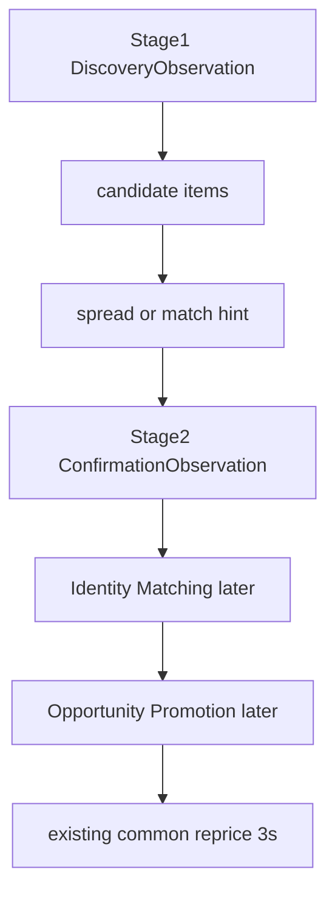

# Global Observation / API-Optional Parser Runtime

## 성공 기준

API가 없어도 공개 buyer-facing 관측에서 **real product id + (Confirmation이면) current native price + currency + primary image + identity hints + observedAt**을 fail-closed `SourceObservation`으로 만들고, 같은 인터페이스로 이후 source를 붙일 수 있게 한다.

이번 슬라이스는 **Foundation + Source Matrix + FASHIONPHILE 1개**만. 9개 parser 동시 구현 금지.

Git: dirty tree 보존. **commit / push / stash / reset 금지**. 이번 task 파일만 수정.

```text
CURRENT_ACTIVE_PLAN = YES
파일: .cursor/plans/ai_profit_os_global_observation_parser_runtime.plan.md
todo 1개: Global SourceObservation contract/runtime foundation + first real public-page source vertical slice
```

레거시 00~06 플랜은 실행 큐가 아니다.

---

## Global Data 불변 헌법 (7줄)

구현·verifier·최종 보고에 그대로 잠근다.

```text
PARTNER_LABEL != DATA_SOURCE
SOURCE_OBSERVATION != LISTING_LEG
SOURCE_OBSERVATION != OPPORTUNITY_TRUTH
SOURCE_ITEM != ASSET
DISCOVERY_OBSERVATION != CONFIRMED_MARKET_TRUTH
DISCOVERY_PRICE != OPPORTUNITY_PRICE
OBSERVED_IMAGE != DISPLAY_AUTHORIZED
```

파생:

```text
DISCOVERY PRICE != CONFIRMED PRICE
```

DISCOVERY 결과는 candidate다. DISCOVERY price/currency는 FX · Opportunity · Participation · Confirmed market truth 입력이 아니다.

---

## Forensic 결론 — 기존 owner를 재사용하지 않는 이유

**listings** ([schemas/listing.v1.json](schemas/listing.v1.json) · `public.listings`): `assetId` 필수, `marketId`/`adapterId`는 Day-1 `ebay_*|admin`만, `priceUsdt`/`staleAt` 필수.

**price_observations** ([schemas/price-observation.v1.json](schemas/price-observation.v1.json)): `assetId` 필수. source enum이 Global web source를 수용하지 못함. enum 확장은 `verify:listing-legs-day1`을 깨뜨림.

**Asset Master / Opportunity / FX / Reprice**: parser가 쓰지 않음. [OpportunityRepriceService](services/api-nest/src/opportunities/opportunity-reprice.service.ts) 재작성 금지. `DEFAULT_PRICE_STALE_MAX_SEC = 3` 불변. Observation freshness ≠ Opportunity participation freshness.

**Yahoo**: `workers/yahoo-jp-adapter` 수정 0.

**Listing-leg 함정**: [listing-legs-day1.cjs](tooling/verify/listing-legs-day1.cjs)는 `workers/chrono24-adapter` · `workers/tcgplayer-adapter` 존재를 FAIL. Observer는 `*-adapter`로 만들지 않는다. Observation source id는 ingest `adapterId`로 넣지 않는다.

**원격 DB**: local Postgres 없음. `supabase/migrations` 추가 시 migrations-applied-parity 붕괴. 원격 write 금지 → in-memory repository + SQL 계약 문서. **Memory PASS ≠ production DB PASS**.

2026-08-16 [parser-implementation-contract.v1.md](governance/global-product/parser-implementation-contract.v1.md)는 extraction 증거. `runtime = 0`만 이 CURRENT ACTIVE가 supersede. 다른 source 추출 계약을 재작성하지 않는다.

---

## 두 단계 실시간 구조

`DEFAULT_PRICE_STALE_MAX_SEC = 3`을 유지하면서 전 인터넷 3초 폴링을 하지 않는다.



- **DISCOVERY**: catalog/list 후보. 3초 truth가 아님. currency evidence가 없으면 `nativeCurrency`는 없음/null. 추정 금지.
- **CONFIRMATION**: 해당 product만 재관측. 이 as-of만 이후 Match/Opportunity의 실시간 입력.
- scheduler/큐 없음. `observeProduct({ source, url, purpose })`가 두 purpose를 받는 것이 foundation.
- FASHIONPHILE: Discovery = `/products.json`, Confirmation = `/products/{handle}.json`.

---

## 1. CRITICAL — purpose별 required contract

같은 `SourceObservation` family, **required truth level은 다르다**. 단일 required 목록에 `nativeAmount`+`nativeCurrency`를 넣으면 FASHIONPHILE Discovery가 schema FAIL이거나, USD 추정 위반이 된다.

JSON Schema는 repo가 쓰는 draft 2020-12. 기존 스키마에 `if`/`then` 선례는 없으나 2020-12 표준이다. `$defs` + `allOf` + `if`/`then`으로 purpose별 required를 잠근다. `nativeCurrency` 추정용 default는 두지 않는다.

**DISCOVERY 필수**

- `source` · `externalItemId` · `url` · `title` · `imageUrl`
- `observedAt` · `fetchedAt`
- `observationPurpose` = `DISCOVERY`
- `sourceStatus` · `parserVersion`

**DISCOVERY 선택**

- `nativeAmount` — source evidence가 있을 때만
- `nativeCurrency` — source evidence가 있을 때만. 없으면 없음/null. **US tag / fashionphile.com / store locale로 USD 생성 금지**

DISCOVERY `sourceStatus`는 currency가 없어도 candidate로 PASS할 수 있다. 그 가격은 Confirmed market truth가 아니다.

**CONFIRMATION SUCCESS 필수**

- `source` · `externalItemId` · `url` · `title` · `imageUrl`
- `nativeAmount` · `nativeCurrency`
- `observedAt` · `fetchedAt`
- `observationPurpose` = `CONFIRMATION`
- `sourceStatus` = `SUCCESS`
- `parserVersion` · `meta.priceKind`

CONFIRMATION에서 currency/price/image/id 중 하나라도 불확실하면 `SUCCESS`가 아니다 (`PARSE_FAILED` / `AMBIGUOUS` / `ACCESS_BLOCKED`).

선택 identity hints: `meta.brand` · `meta.model` · `meta.sku` · `meta.condition` · `availability`

상태 enum: `SUCCESS` | `NOT_FOUND` | `UNAVAILABLE` | `OUT_OF_STOCK` | `PARSE_FAILED` | `AMBIGUOUS` | `ACCESS_BLOCKED` | `TEMPORARY_ERROR`  
`UNSUPPORTED`(API 없음) 금지.

`discoverCandidates(identityQuery)`는 시그니처만. 구현 0.

`OBSERVED_IMAGE != DISPLAY_AUTHORIZED`. image-hosts / R2 / `/profits` 표시 권한 추론 금지.

---

## FASHIONPHILE live forensic (2026-08-19)

공개 Shopify **storefront JSON**이 살아 있다. HTML parser가 아니다. 소스 변경하지 않는다.

- Discovery: `https://www.fashionphile.com/products.json` — id, handle, title, vendor, sku, `variants[].price`, `images[position=1]`, `available`. **currency 필드 없음** → Discovery에서 USD 추정 금지.
- Confirmation: `https://www.fashionphile.com/products/{handle}.json` — 동일 + `variants[].price_currency = USD`.
- 예: handle `hermes-epsom-mini-kelly-sellier-20-black-1956054`, Shopify id `16132567925039`, SKU `1956054`, price `34995.00`, image `cdn.shopify.com` position 1.
- Playwright는 Fashionphile 기본값이 아님. HTTP ACCESS_BLOCKED면 우회 없이 보고.

### Variant ambiguity (Confirmation FAIL-CLOSED)

`variants[0].price` 자동 선택 금지.

- relevant available variant가 **정확히 1개** → 그 price/currency 사용
- 여러 개인데 **price + currency + sku/identity가 전부 동일** → 사용 + evidence 기록
- price / currency / SKU가 서로 다름 → `AMBIGUOUS` → Confirmation FAIL

`compare_at_price` / Est. Retail은 current native price fallback이 아니다. verifier에 고정.

---

## 2. Acquisition / extraction vocabulary

FASHIONPHILE `/products.json` · `/products/{handle}.json` = **PUBLIC_JSON** (storefront JSON observation).

`HTTP_HTML`로 분류하지 않는다. HTML parser 장애와 public JSON 구조 변경은 다른 장애다.

`extractionMethod` enum에 `PUBLIC_JSON`을 넣는다. fallback은 별도:

- `STRUCTURED_DATA`
- `EMBEDDED_STATE`
- `DOM`
- `URL_PATTERN`
- `BROWSER_RENDERED`

FASHIONPHILE 1차 path = `PUBLIC_JSON`. 나머지는 fallback.

---

## Contract 파일

- [schemas/source-observation.v1.json](schemas/source-observation.v1.json) — observation-only. listing 필드명 재사용 (`externalItemId`, `url`, `imageUrl`, `nativeAmount`, `nativeCurrency`). [manifest.day1.json](schemas/manifest.day1.json)에 넣지 않음.
- `nativeAmount`는 [money.cjs](services/market-intelligence/src/money.cjs) `assertAmount`. listing.v1 `nativeCurrency` enum은 확장하지 않음.
- [governance/global-product/source-observation-runtime.v1.json](governance/global-product/source-observation-runtime.v1.json) — matrix + SQL 계약 + 7 불변.

---

## Runtime layout

기존 `@aipo/market-intelligence`에 모듈을 넣는다. 새 CF worker / Kafka / BullMQ / `infra/workers.manifest.json` 추가 금지.

```text
services/market-intelligence/src/source-observation/
  contract.cjs
  validate.cjs              # purpose-split + 7 invariants
  extract/
  observe.cjs
  adapters/fashionphile.cjs # PUBLIC_JSON + variant rule
  repository.memory.cjs
  cli.cjs
  fixtures/fashionphile/    # discovery without currency, confirmation with USD, multi-variant AMBIGUOUS
```

Persistence:

- `sourceItem` unique = `source + externalItemId` · `assetId` assign 금지
- snapshots append-only · fingerprint idempotency
- SQL 계약은 governance에만. `supabase/migrations` 이번 0

---

## 3. Source Matrix — 선결론 금지

2026-08-16 parser contract ≠ 2026-08-19 live runtime. **FASHIONPHILE만** 이번 live forensic을 했다. live 증거 없이 `READY_FOR_IMPLEMENTATION` / `LIVE_READY` 확정 금지.

기록 필드:

- `PARSER_CONTRACT_STATUS`
- `LIVE_RUNTIME_STATUS`
- `NEXT_ACTION`
- `ACQUISITION_MODE`

이번 슬라이스:

- eBay: `KEEP_EXISTING_API` · 웹 파서 0 · live = existing adapter
- FASHIONPHILE: `ACQUISITION_MODE = PUBLIC_JSON` · `PARSER_CONTRACT_STATUS = READY` · live는 구현 후 실측 (`FIRST_SOURCE` 또는 `ACCESS_BLOCKED`)
- Chrono24 · TCGplayer · Mercari JP · KREAM · StockX · GOAT · Bunjang: `PARSER_CONTRACT_STATUS = READY` (2026-08-16) · `LIVE_RUNTIME_STATUS = NOT_VERIFIED` · `NEXT_ACTION = LIVE_REVALIDATION` · **parser 구현 0**
- Vestiaire: `PARSER_CONTRACT_STATUS = BLOCKED` (image gate) · live 구현 0
- Yahoo: `PERMANENTLY_FORBIDDEN`

---

## 5. Persistence verdict 분리

Memory PASS를 production DB PASS로 승격하지 않는다.

```text
OBSERVATION_REPOSITORY_CONTRACT = PASS | FAIL
OBSERVATION_MEMORY_RUNTIME = PASS | FAIL
OBSERVATION_SQL_CONTRACT = PASS | FAIL
OBSERVATION_DB_RUNTIME = BLOCKED_LOCAL_ENV
PRODUCTION_OBSERVATION_PERSISTENCE = NOT_IMPLEMENTED
```

최종 보고에서 `OBSERVATION_PERSISTENCE = PASS` 단독 사용 금지. 필요하면 위 4칸을 나열한다.

---

## Verifier

새 verifier 1개: [tooling/verify/source-observation-runtime.cjs](tooling/verify/source-observation-runtime.cjs)

잠글 것:

- purpose-split required (Discovery는 currency 없이 PASS 가능, Confirmation SUCCESS는 amount+currency 필수)
- FASHIONPHILE Discovery USD 추정 0
- `PUBLIC_JSON` acquisition/extraction
- variant ambiguity → AMBIGUOUS
- `compare_at_price` fallback 0
- 다른 source `LIVE_RUNTIME_STATUS = NOT_VERIFIED` (READY_FOR_IMPLEMENTATION 확정 0)
- 7 불변 문자열
- listing/price-observation/opportunity-pricing enum 무변경
- `PUBLISH_GUARDS.listingLegsOnly=["ebay","admin"]`
- Yahoo 0 · parser FX/profit/`requiredCapital` 0
- Confirmation SUCCESS: image+price+currency+id+parserVersion+observedAt+priceKind
- `DEFAULT_PRICE_STALE_MAX_SEC === 3`
- Opportunity INSERT 0
- persistence verdict 토큰 분리

배선: `package.json` · [CATALOG.md](tooling/verify/CATALOG.md) · [domain-by-path.cjs](tooling/verify/domain-by-path.cjs) · T1 [stubs/run-all.cjs](tooling/verify/stubs/run-all.cjs).

회귀: `pnpm verify:listing-legs-day1` · `pnpm verify:source-observation-runtime`.

---

## 하지 않음

Identity Matching · Opportunity INSERT/promotion · `/profits`·Home·Admin UI · Yahoo · FASHIONPHILE 외 source parser · listing-leg 확대 · Money/FX/profit 공식 · image mirroring · stealth/CAPTCHA/proxy bypass · remote/local Postgres apply.

---

## 완료 보고

프롬프트 §35 보고 + 아래 칸을 추가한 뒤 STOP.

- purpose-split contract 증명 (Discovery fixture는 currency 없이 PASS, Confirmation은 amount+currency)
- FASHIONPHILE `ACQUISITION_MODE = PUBLIC_JSON`
- 나머지 source `NOT_VERIFIED` / `LIVE_REVALIDATION`
- variant AMBIGUOUS fixture
- persistence 4칸 + `PRODUCTION_OBSERVATION_PERSISTENCE = NOT_IMPLEMENTED`

Founder freeze / commit / push 없음.
