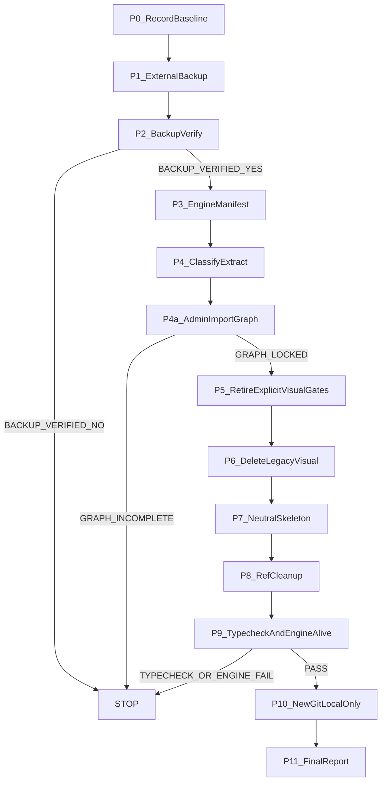

# PUTDUK Greenfield Frontend Reset

## Founder review delta (CONDITIONAL PASS → 이 수정본)

실행 전 반영한 7항. 실행은 Founder GO 전까지 시작하지 않는다.

1. `packages/ui` stub 축소 전 `apps/admin`의 `@aipo/ui` **direct + indirect** import graph를 HARD GATE로 확정. 삭제 후 Admin typecheck는 선택 아님, **필수 PASS**.
2. `brand.manifest.json`에는 현재 product name(`퍼뜩`)만. retired/legacy 브랜드명(`오늘수익`, `바로번다`)은 Active에 남기지 않음. backup에만 존재.
3. `00`~`06` 플랜 파일 blanket preserve 금지. 내용 기준 BUSINESS / MIXED / VISUAL 재분류.
4. `domain-by-path`의 `apps/web/**` · `packages/ui/**` path-wide verify 해제 금지. **explicit legacy visual gate 이름만** retire.
5. `/auth/login` · `/auth/signup`에 새 form/API 호출 UI를 만들지 않음. PENDING APPROVED FIGMA skeleton만.
6. `routes.ts`는 URL path compatibility만 유지. 5탭 순서·메뉴 분류·label·active nav 등 UX metadata 제거. route existence ≠ UX authority.
7. P9 HARD GATE: `packages/ui` typecheck + `apps/admin` typecheck + `apps/web` typecheck + `verify:gate:fast`. 전체 production `next build`는 강제하지 않음.

---

## 현재 runtime baseline (재확인됨)

- 경로: `C:\Users\PC\Desktop\AI_PROFIT_OS`
- 브랜치: `verify/homeclean-v1-hc6-09-current-tree`
- HEAD: `2d4a720d931d5f9523f9ffd6d63c6b7b2d082bcb`
- 패키지: pnpm@10.14 · Node 22
- dirty: status 약 186줄 · untracked 약 283개
- dirty 안에 **Business**(`packages/sdk` current-fx/wallet, `services/api-nest` wallet/FX)와 **Legacy UI**(HomeClean/H7/canon/evidence)가 섞여 있음

금지: `git reset --hard` · `git clean -fdx` · `rm -rf apps/web` · `rm -rf packages/ui` · GitHub push/force-push/remote 교체

Founder 선택:
- Git: Active Workspace는 `git init`으로 새 역사. 기존 `.git`은 backup에만 남김. 원격 교체는 **나중 Founder 명시** 때만.
- 범위: Consumer visual 0. Admin 화면 파일은 손대지 않음. `@aipo/ui`는 import graph keep-set만 남기는 Admin-compat stub.

File-Serial 예외: 이 작업은 03 UI todo 재실행이 아니다. 03 완료 todo를 재오픈하지 않는다. 실행 SSOT는 이 플랜 파일이다.

---

## 철학 (집행 판정)

`이 파일이 새 Frontend에 반드시 필요한 BUSINESS / DOMAIN / ENGINE 자산인가?`

- YES → PRESERVE
- NO 이고 UI/UX/VISUAL/BRAND → DELETE
- MIXED → Business만 extract 후 presentation 삭제
- UNKNOWN → 삭제하지 말고 최종 보고

`formatMoney` / locale 표시는 Business Truth가 아니다. 새로 짜면 된다.

Admin 호환으로 남는 lux 토큰·카피·컴포넌트는 **Consumer Visual Truth가 아니다.** 새 Figma 입력으로 쓰지 않는다.

번호·경로·파일명만으로 보존하지 않는다. `00`~`06`도 예외가 아니다.

---

## 실행 순서 (하드 게이트)

P2 실패, P4a 실패, 또는 P9 실패 시 추가 DELETE / MOVE / `git init` 금지.

---

## P1 — 외부 안전 백업 (삭제보다 먼저)

격리 규칙의 workspace-outside write 금지를 **이 sibling backup만** Founder 예외로 연다. `clime-gb` 등 외국 경로는 읽지도 않는다.

대상: `C:\Users\PC\Desktop\putduk-pre-greenfield-reset-backup\`

방법 (Windows robocopy, 저사양 I/O 1개만):
- 소스 전체 + `.git` 전체
- 제외: `node_modules` · `.next` · `target` · `dist` · `coverage` · `playwright-report` (lockfile으로 재설치 가능)
- **포함 필수:** dirty tracked · untracked · `_tmp_*` · `H7_CODE_HANDOFF.zip` · `.playwright-mcp` · 루트 `.env` (복원용만)
- 추가: `git bundle --all` → backup 안 `AI_PROFIT_OS.bundle`
- `BACKUP_METADATA.txt`: timestamp, source path, branch, HEAD, `git status --short`, 제외 목록, 파일 수, 크기

루트 `.env`는 backup에만 넣고 **새 git에 커밋하지 않는다.**

---

## P2 — 백업 검증 (하나라도 실패면 STOP)

- backup 디렉터리 존재
- backup `.git` 존재 + `git rev-parse HEAD` = `2d4a720d931d5f9523f9ffd6d63c6b7b2d082bcb`
- `services/api-nest` · `services/engine-rust` · `packages/sdk` · `supabase/migrations` 존재
- dirty 샘플(예: `packages/sdk/src/current-fx/fetch.ts`, `apps/web/app/HomePageClient.tsx`) 존재
- untracked 샘플(예: `_tmp_mockup_preview` PNG, `H7_CODE_HANDOFF.zip`) 존재
- 파일 수/크기가 비정상적으로 작지 않음 (node_modules 제외 기준으로 기록)
- backup에서 `git status`가 source와 모순되지 않음

`BACKUP_VERIFIED = YES` 전에 어떤 삭제도 하지 않는다.

---

## P3 — Engine Preservation Manifest

생성: [docs/GREENFIELD_ENGINE_PRESERVATION_MANIFEST.md](docs/GREENFIELD_ENGINE_PRESERVATION_MANIFEST.md)

README가 아니라 실제 import/controller/service를 읽고, 항목마다 `path / entry / callers / runtime use / why preserved`를 적는다.

우선 보호 (확인 후 삭제 금지):
- [services/api-nest](services/api-nest) — Auth JWT, session cookie `aipo_session`, wallet/deposit/withdraw, opportunities, FX snapshot, current-fx, ledger, risk, KYC, home-read
- [services/engine-rust](services/engine-rust)
- [supabase/migrations](supabase/migrations)
- [packages/sdk](packages/sdk) — 포함: dirty `current-fx/**`, `wallet/**`, `home-read-model`, `home-money-read`, `user-feed`
- [apps/web/lib/session-cookie.ts](apps/web/lib/session-cookie.ts)
- [apps/web/next.config.ts](apps/web/next.config.ts) 의 `/api/v1` rewrite · `/ads`→`/l` rewrite (API/infra contract)
- schemas · Money/Engine verify · workers adapters · infra/OpenNext
- Auth **engine/API** 자체. Auth **UI**는 보존 대상이 아님

dirty Business 변경은 backup + Active baseline에 **유지**한다. dirty HomeClean/H7 시각 변경은 backup에만 남기고 Active에서 폐기한다.

---

## P4 — 분류 + MIXED extract + 00~06 내용 재분류

내부 분류 후 [docs/GREENFIELD_RESET_CLASSIFICATION.md](docs/GREENFIELD_RESET_CLASSIFICATION.md)에 기록한다.

파일 번호·폴더명·“도메인 플랜”이라는 이유만으로 보존하지 않는다.

### 00~06 계획문서 (blanket preserve 금지)

각 `.cursor/plans/ai_profit_os_0*.plan.md`를 **내용**으로 재분류한다.

- BUSINESS-only (Money/Engine/Auth/API/DB/Security/Infra 불변) → PRESERVE
- MIXED → Business invariant만 engine-safe 문서로 extract한 뒤, 해당 플랜의 Visual/UX/Visual Master/옛 IA 부분은 삭제 또는 비권위화
- VISUAL (Visual Master, Home/H7/Canon visual, 옛 UX 구조, mockup authority) → DELETE
- `plans-ssot`가 특정 파일 존재를 요구하면, 파일을 억지로 살리기보다 SSOT 목록을 Business-only 산출물에 맞게 고친다. Visual 문서를 T0 이유로 남기지 않는다.

Index `00`도 예외가 아니다. Visual pointer가 있으면 제거하거나 BUSINESS pointer만 남긴다.

HomeClean 전용 플랜 [homecleanv1_clean-room_a7760b61.plan.md](.cursor/plans/homecleanv1_clean-room_a7760b61.plan.md)는 VISUAL로 보고 active 권위에서 제거한다.

### PRESERVE_ENGINE / KEEP_INFRA (내용이 Business일 때만)

- `services/**` · `supabase/**` · `packages/sdk/**` · `packages/schemas/**` · `workers/**` · `infra/**`
- Money/Engine/Auth Cursor rules (`money-ledger`, `settlement-rule`, `auth-boundary`, `stack-lock`, `pg-gateway-ban`, `supabase-db-only`, isolation, git-safety, phase0-ram)
- 법적/규제 카피: [packages/ui/copy/ko/legal.ts](packages/ui/copy/ko/legal.ts), Money bucket 라벨(`walletBuckets`), Admin 운영 카피(`T.admin`), tax disclaimer 문구. **단** Admin import graph keep-set에 실제로 묶인 것만 stub에 남김

### EXTRACT_BUSINESS (파일 전체 보존 금지)

- [packages/ui/components/home-clean-v1/home-clean-money.ts](packages/ui/components/home-clean-v1/home-clean-money.ts): display helper는 폐기. `canonicalUsdtInput` / FX request slot 규칙이 SDK에 없으면 [packages/sdk/src/current-fx](packages/sdk/src/current-fx)로만 옮긴다. HomeClean viewState 결합은 삭제
- [apps/web/lib/opportunity-card-map.ts](apps/web/lib/opportunity-card-map.ts): UI card 모델 매핑 → 삭제. Opportunity fact는 SDK `user-feed`에 이미 있음
- [apps/web/app/home-clean/mapHomeReadModelToCleanViewModel.ts](apps/web/app/home-clean/mapHomeReadModelToCleanViewModel.ts): visual ViewModel → 삭제. `home-read-model` SDK/API는 유지
- Wallet/auth 페이지에 서버 호출이 섞여 있어도 **이번 단계에서는 새 form/새 UX를 만들지 않는다.** Business 호출 코드가 UI에만 있으면 SDK/domain으로 extract하고, 페이지는 neutral skeleton으로 교체. client에서 Money/FX/Eligibility 재계산 금지

### P4a — Admin `@aipo/ui` import graph HARD GATE (삭제·export 축소보다 먼저)

direct import 몇 개만 보고 stub을 정하지 않는다. 그래프가 lock되기 전에 `packages/ui` 삭제/export 축소 금지.

절차:
1. `apps/admin/**`에서 `@aipo/ui` **직접 import** 전부 수집
2. 그 엔트리에서 재귀적으로 **간접 import** (상대경로, `@aipo/ui/*` re-export, copy/token/css) 전부 walk
3. 결과를 [docs/GREENFIELD_ADMIN_UI_IMPORT_GRAPH.md](docs/GREENFIELD_ADMIN_UI_IMPORT_GRAPH.md)에 고정: 파일 경로, export, 왜 Admin runtime에 필요한지
4. `ADMIN_UI_KEEP_SET` = 이 그래프의 파일만. 조사 당시 알려진 후보는 `SearchParamsBoundary`, `BucketBreakdown`, `TaxDisclaimerBlock`, slim `copy/ko`, `lux-theme.css`이지만 **그래프가 더 찾으면 그것도 keep**
5. `package.json` exports 축소는 keep-set 확정 **이후**에만

그래프 불완전 / 의심 경로 UNKNOWN이면 P4a FAIL → STOP. 추측으로 삭제하지 않는다.

Admin-compat로 남는 파일은 **현재 바이트를 유지**한다 (Admin 시각을 이번 작업에서 바꾸지 않음). 이들은 Consumer Visual Truth가 아니다.

### brand.manifest (legacy brand 0)

Active [packages/ui/brand/brand.manifest.json](packages/ui/brand/brand.manifest.json)에는 **현재 product name만** 남긴다.

- 허용: `consumer.name` / 필요 시 `short_name` = `퍼뜩`
- 금지: `retired_names`, `오늘수익`, `바로번다`, 옛 로고/에셋 필드, 이미지 경로
- 로고·워드마크·favicon·OG 이미지 파일은 삭제
- `verify:brand-consumer`는 “현재 이름이 퍼뜩인가”만 검사하도록 수정. manifest에 retired 목록을 **요구하지 않는다**. 과거 브랜드명은 backup에만 존재

### DELETE (Active에서 제거 · backup에서만 복구)

- Consumer pages visual: HomeExperience, HomeClean, H7, HomeVisualRebuild, AppShell, BottomNav, cards, landing `Landing3s`
- `apps/web/app/dev/**` 전부
- `apps/_tmp_home_visual_rebuild` · `_tmp_home_clean` · `_tmp_mockup_preview` · `H7_CODE_HANDOFF.zip` · `.playwright-mcp`
- `packages/ui/canon/**` 중 Consumer visual/evidence/screenshots/Visual Master/Visual Contract. Admin wire는 그래프/내용 분류 후 UNKNOWN이면 보류
- Consumer brand/product/robot/icon/illustration 자산
- Business/runtime이 아닌 이미지 전부
- 로컬 font가 레거시 visual용이면 삭제 (현재 woff/ttf 0)
- Visual Cursor rules: `ui-authority-governance.mdc` · `mockup-governance.mdc` · `visual-master-intake.mdc` · `canon-ui.mdc` · `peotteok-performance-target.mdc`
- `korean-ui.mdc`는 MIXED: IT용어 금지·퍼뜩 현재 이름·성별 금지만 남기고 copy/visual SSOT·레거시 브랜드 목록은 제거

### UNKNOWN (삭제 보류 · 최종 보고)

- `packages/ui/canon/surfaces/admin-*.wire.json` — Admin 기능 스펙일 수 있음
- 운영/법적 전용 font가 실제로 있으면
- P4a 그래프에서 판단 불가인 경로

---

## P5 — explicit legacy visual gate만 은퇴

`packages/ui/**` · `apps/web/**` **경로 전체**의 verify 매핑을 끊지 않는다.

[tooling/verify/domain-by-path.cjs](tooling/verify/domain-by-path.cjs)와 [tooling/verify/gate-tiers.cjs](tooling/verify/gate-tiers.cjs)에서 **이름이 확인된 legacy visual gate만** retire한다.

Retire 후보 (명시 이름만):
- `mockup-governance`
- `canon-surfaces`
- `brand-assets`
- `brand-asset-provenance`
- `lux-theme-sync`
- `dark-leak-guard`
- `ia-tabs` (5탭 UX/시각 lock)
- visual-lock / responsive screenshot / Visual Master evidence 게이트
- `home-product-contract`가 Visual Master 예시 리터럴 검사라면 retire. Money/product fact 검사라면 유지하고 최종 보고에 이유를 적음

절대 약화 금지 (경로 매핑 유지):
- `no-admin-in-web`
- `admin-routes` · `admin-boundary`
- `stack-lock` · `secrets`
- `pg-module-scan` · `api-nest-build`
- `cf-infra` · `opennext-workers-origin`
- Money/Engine/Auth/session/KYC/idempotency stubs
- route/business safety · security 게이트

T0 유지: `stack-lock` · `secrets` · `plans-ssot`(Visual 문서를 강제하지 않게 조정) · `brand-consumer`(현재 이름 `퍼뜩`만, retired 목록 요구 0)

`verify:ia-tabs`는 UX authority이므로 retire. 이는 `routes.ts`에서 path를 지우는 것과 다르다.

---

## P6 — Consumer presentation RESET

`apps/web`은 Next 앱으로 남긴다. 구현만 비운다. `packages/ui`에서 지우는 파일은 **P4a keep-set 밖**만.

남길 것:
- `next.config.ts` rewrite (`/api/v1`, `/ads`→`/l`) — `PRODUCT_IMAGE_REMOTE_PATTERNS` 의존 제거
- OpenNext/wrangler · `transpilePackages`
- `lib/session-cookie.ts` (Auth **presence** 판정. 로그인 UI 아님)
- `routes.ts`의 **path 문자열만** (아래 P7)

지울 것:
- `HomePageClient` · home-clean adapters · GuestChrome · DeviceTier · 옛 shell
- public favicon/PWA/OG/스플래시 브랜드 이미지
- fake UI fact. 숫자가 없으면 표시하지 않음. placeholder 성공 금지
- 기존 Auth 컴포넌트 visual (`AuthLogin` 등). 대체 form을 만들지 않음

---

## P7 — Neutral skeleton (새 UX 착수 금지)

승인 Figma가 없으므로 새 디자인 시스템·새 form·새 interaction을 만들지 않는다.

- [apps/web/app/layout.tsx](apps/web/app/layout.tsx): `html/body` + `{children}`만. AppShell/Toast/Brand icon/lux theme Consumer에서 제거. metadata 앱이름 `"퍼뜩"` 문자열은 유지
- `globals.css`: browser normalize + a11y 최소만. lux import 0
- 존재하는 Consumer route 페이지는 제목 + `PENDING APPROVED FIGMA` 한 줄. 가짜 잔액/수익 0. **API를 부르는 새 UI 없음**
- `/auth/login` · `/auth/signup` · `/auth/complete-profile`도 동일. Auth 엔진/API/session cookie는 보존. **로그인 form, signup form, Auth API 호출 UI 신설 금지**
- `/dev/*` 라우트 삭제
- Admin 앱 소스 파일은 수정하지 않음

### `routes.ts`: path compatibility ≠ UX authority

허용: 실제 URL 호환을 위한 path 문자열 목록 (예: `/`, `/wallet`, `/auth/login`).

제거:
- `USER_TABS` 순서 · icon · label · href를 탭 IA로 묶는 구조
- 5탭 메뉴 분류 · active nav metadata
- “Business navigation contract”라는 이름으로 옛 IA를 재권위화하는 주석/verify 연동

원칙: **route existence ≠ UX authority**. 새 Figma가 탭/흐름을 정한다. 옛 Home→modal 흐름을 유지하지 않는다.

---

## P8 — 참조 청소

삭제 자산 경로를 전부 검색해 끊는다: `import` · `<Image>` · `url()` · favicon · OG · PWA manifest · fixture/snapshot · README

깨진 import는 stub/skeleton으로 고친다. 옛 에셋을 다시 넣지 않는다. 깨진 Auth 페이지를 고친다고 form을 만들지 않는다.

---

## P9 — Engine + typecheck HARD GATE (실패 시 `git init` 금지)

전체 production `next build` / OpenNext는 저사양상 강제하지 않는다. 아래는 **필수 PASS**.

1. Engine manifest `Files That Must Survive`가 Active에 전부 존재
2. `packages/sdk` current-fx/wallet 엔트리 존재
3. `services/api-nest` · `engine-rust` · `supabase/migrations` 존재
4. **`packages/ui` typecheck PASS**
5. **`apps/admin` typecheck PASS** (P4a keep-set이 실제 Admin을 깨지 않는지)
6. **`apps/web` typecheck PASS**
7. **`pnpm verify:gate:fast` PASS**

하나라도 FAIL이면 STOP. stub를 되돌리거나 keep-set을 고친 뒤 재검증. `git init` 진입 금지.

---

## P10 — 새 Git history (로컬만)

순서:
1. P2 · P4a · P9 PASS
2. Active `.git` 삭제 (backup `.git`은 유지)
3. `git init`
4. `.gitignore`에 `.env` · `_tmp*` · backup 경로 유지
5. 첫 커밋 메시지: `NEW_GREENFIELD_BASELINE` — Business core + Admin-compat stub + Consumer skeleton. 왜: pre-reset UI history를 새 UI 입력으로 쓰지 않기 위함
6. `git remote` 추가 금지 · `git push` 금지

기존 GitHub `phonarawd/AI-Profit-OS`는 backup/old remote로 남는다. 역사 교체는 Founder가 나중에 명시할 때만.

---

## P11 — Cursor / AI context RESET

새 규칙 하나만 alwaysApply:

[.cursor/rules/greenfield-ui.mdc](.cursor/rules/greenfield-ui.mdc)

- `VISUAL_TRUTH = APPROVED_FIGMA_ONLY`
- `BUSINESS_TRUTH = PRESERVED_DOMAIN_ENGINE`
- LEGACY_UI/UX/VISUAL/BRAND/ASSET/GIT_UI_REFERENCE = FORBIDDEN
- Git history에서 pre-reset UI 복구 금지
- Figma vs 코드 시각 = FIGMA WINS
- Figma vs Engine 비즈니스 = ENGINE WINS
- 승인 Figma 없으면 레거시 복구 금지, 최소 placeholder만
- 새 Auth/Wallet UX form을 Figma 승인 전에 만들지 않음

[AGENTS.md](AGENTS.md)에서 Visual Master/Canon visual 권위 문장을 위 경계로 교체. Money/Engine/Auth/스택 lock은 유지.

---

## 새 Figma 전까지 하지 않는 것

- 새 디자인 시스템 · 새 로고 · 새 로봇 · 새 상품 이미지
- 새 login/signup form · 새 탭 IA · 새 interaction flow
- 옛 Home/CSS/토큰/목업/evidence를 “참고”로 재사용
- backend 기능 신설
- GitHub force-push / remote 교체
- Admin 화면 재디자인
- 과거 브랜드명을 Active manifest/copy/rule에 보관

---

## 최종 보고에 넣을 것

- backup 경로 · HEAD · `BACKUP_VERIFIED`
- `ADMIN_UI_KEEP_SET` 전체 경로 (direct + indirect)
- 00~06 각 파일의 BUSINESS / MIXED / VISUAL 판정
- 분류 건수 (PRESERVE / EXTRACT / DELETE / UNKNOWN)
- 삭제하지 않은 UNKNOWN 목록
- Admin-compat로 남은 `@aipo/ui` 파일 목록 (Consumer 권위 아님)
- retire한 **exact verify 이름** 목록 (path-wide 해제 없음)
- `packages/ui` · `apps/admin` · `apps/web` typecheck 결과
- Engine manifest vs 실제 파일 대조
- 새 로컬 `git log -1`
- 원격은 아직 연결하지 않았다는 한 줄
