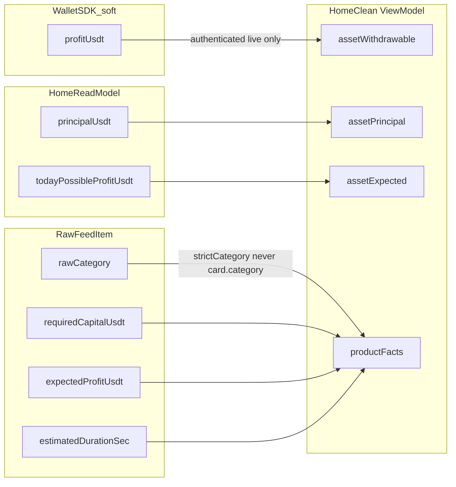

# HC6-08 Founder Decision Binding Pass 1

**판정: `GO_WITH_PATCH`** — 방향 승인. 아래 패치를 반영한 뒤 구현한다. 재감사/플랜 폐기는 하지 않는다.

실행 순서(고정):

```text
Founder Product Decisions
  → strict source parsing
  → Home Money (principalUsdt / profitUsdt / todayPossibleProfitUsdt)
  → Product facts
  → Category truth
  → Minimal client filter island
  → Category badge
  → family local misuse removal
  → targeted validation
  → evidence
STOP
```

이후 별도 단계에서만: Final Visual Reconciliation → Founder 승인 → HC6-09 → Phase 7.

가설 표기 유지: `USER_RESEARCH_VALIDATED = NO`.

## 이번 Pass가 닫는 것 / 닫지 않는 것

닫는다:

- Founder Product Decision 기록 (구현 성패와 분리)
- Home money 슬롯: 운용 원금 / 출금 가능 수익 / 예상 수익
- 상품 카드 실측 fact
- category SSOT + client-side filter + category badge
- `item.family` 오용 차단

닫지 않는다:

- HC6-08 전체 COMPLETE / PASS
- `PROGRESS_RUNTIME_BINDING` (DEFERRED)
- KRW deposit consumer 완성
- Final Visual Reconciliation / HC6-09 / Phase 7
- commit / push
- Stepper architecture / Deposit implementation

## 현재 체인에서 이미 증명된 결함

핵심 파일:

- 매퍼: [apps/web/app/home-clean/mapHomeReadModelToCleanViewModel.ts](apps/web/app/home-clean/mapHomeReadModelToCleanViewModel.ts)
- 어댑터: [apps/web/app/home-clean/HomeCleanDataAdapter.tsx](apps/web/app/home-clean/HomeCleanDataAdapter.tsx)
- ViewModel: [packages/ui/components/home-clean-v1/home-clean.types.ts](packages/ui/components/home-clean-v1/home-clean.types.ts)
- Asset DOM: [packages/ui/components/home-clean-v1/HomeCleanAsset.tsx](packages/ui/components/home-clean-v1/HomeCleanAsset.tsx)
- Chips: [packages/ui/components/home-clean-v1/HomeCleanCategoryChips.tsx](packages/ui/components/home-clean-v1/HomeCleanCategoryChips.tsx)

지금 상태:

- `HomeReadModel.money.principalUsdt`는 매퍼가 `asset.requiredPrincipal`에 넣지만 **Asset DOM이 렌더하지 않음**. 의미 이름도 틀림 (원금 잔액 ≠ 상품 필요 원금).
- `asset.expectedProfit`은 이미 `todayPossibleProfitUsdt`를 읽지만 **Asset DOM이 렌더하지 않음**.
- `HomeReadModel.money`에 `profitUsdt` 없음. `HomeMoneyRead`는 `profitUsdt` FORBIDDEN. HomeClean adapter는 `fetchWalletBuckets` 호출 0.
- Asset DOM은 KRW primary + USDT secondary를 보여 주지만 둘 다 `unavailable()` / fixture는 `확인 중`. 권위 KRW wallet balance = SOURCE_NOT_FOUND.
- `toOpportunityCardModel`은 `category` 부재 시 `"watch"`로 기본값. 새 filter/badge가 `card.category`를 읽으면 missing이 시계로 오염된다.
- `productFamily()`는 `trading_card`/`luxury_bag`을 `unknown`으로 떨어뜨림.
- chips는 `span` + 고정 `selected=all`. handler 0.
- 상품 duration 부재 시 `확인 중`으로 위장 (`null → checking`).
- `item.family`는 HomeClean 로컬 키. badge/filter consumer 0.
- Right rail은 이미 empty progress. fake Stepper 없음. 유지.



## 구현 원칙

- 허용 경로만: `packages/ui/components/home-clean-v1/**`, `apps/web/app/home-clean/**`, HomeClean copy, targeted test, `_tmp_home_clean/v1/phase6/` evidence.
- `packages/ui/copy/ko/home.ts` / `principal-profit.ts` overwrite 0. 새 Home 라벨은 [home-clean-copy.ts](packages/ui/components/home-clean-v1/home-clean-copy.ts)에만 추가.
- `apps/web/lib/opportunity-card-map.ts` 수정 0. legacy Home의 `category` 기본 `"watch"` / 금액 기본 `"0"`을 고치지 않는다. HomeClean은 이 기본값을 **소비하지 않는다**.
- Engine / Money / Ledger / FX / DB / Auth / production `/` 수정 0.
- 숫자 발명 0. `null → 0` 0. `unknown → watch/card/bag` 0. `availableUsdt` 0.
- wallet page의 실패 시 `"0"` 버킷 패턴을 HomeClean에 복사하지 않는다. fetch 실패/필드 부재 = `정보 없음`. 유효 문자열 `"0"`은 값으로 보존.
- pixel-perfect / Hero / Robot / Rail 재설계 0. layout 깨짐 방지용 최소 CSS만.

## HARD RULE — category는 raw item만, default watch 금지

`toOpportunityCardModel`의 `card.category`는 filter/badge/ViewModel truth가 **아니다**.

반드시:

```text
raw item.category
  → strictCategory()
  → watch | trading_card | luxury_bag | null
```

허용:

- `"watch"` → `watch`
- `"trading_card"` → `trading_card`
- `"luxury_bag"` → `luxury_bag`

`null`:

- missing / invalid / unknown / `"card"` / `"bag"` / `"handbag"` / 빈 문자열 / 그 외

**unknown을 watch로 떨어뜨리면 안 된다.** `card.category` 사용 금지.

`toOpportunityCardModel`은 id/라벨/이미지에만 사용한다.

## A. ViewModel 정리

[home-clean.types.ts](packages/ui/components/home-clean-v1/home-clean.types.ts) `asset`를 아래 의미로 맞춘다. display name ≠ domain 재해석. 각 필드에 source comment를 남긴다.

- `asset.principal` ← `HomeReadModel.money.principalUsdt` (운용 원금)
- `asset.withdrawableProfit` ← supplementary `WalletBuckets.profitUsdt` (출금 가능 수익). HomeReadModel 필드처럼 합치지 않음
- `asset.expectedProfit` ← `todayPossibleProfitUsdt` (예상 수익. "오늘" 금지)

폐기/비누출:

- `asset.balanceKrw` / `asset.balanceUsdt` / `asset.requiredPrincipal` / `asset.actualProfit`는 Home money 슬롯으로 쓰지 않는다. KRW 숫자는 만들지 않는다.
- 상품 카드의 `requiredPrincipal`은 **상품** `requiredCapitalUsdt` 전용. wallet principal과 합치지 않는다.

타입 분리 (한 유니온에 `all`과 상품 category를 섞지 않음):

```ts
type HomeCleanProductCategory =
  | "watch"
  | "trading_card"
  | "luxury_bag";

type HomeCleanCategoryFilterKey =
  | "all"
  | HomeCleanProductCategory;

product.category: HomeCleanProductCategory | null
selectedCategory: HomeCleanCategoryFilterKey
```

`item.category = "all"` 같은 상태를 타입이 허용하면 안 된다.

`family` 제거 (HomeClean local only, consumer 0이면 삭제).

## Money parser — `"0"` 보존

`optionalUsdt` 및 동일 파서는 falsy 검사로 돈을 버리지 않는다.

```text
null / undefined / "" / invalid decimal
  → unavailable (정보 없음)

"0"
"0.0"
valid positive / valid signed decimal
  → value
```

적용 필드:

- `principalUsdt`
- `profitUsdt`
- `todayPossibleProfitUsdt`
- `requiredCapitalUsdt`
- `expectedProfitUsdt`

`0`은 실제 금융 fact일 수 있다. `null → 0` 위조와 `"0" → 정보 없음` 둘 다 금지.

상태 구분:

```text
loading state        → 확인 중
ready + source 없음  → 정보 없음
ready + valid "0"    → 0 USDT
```

## B–D. Money binding

**principalUsdt:** Home chain에 이미 있다. `requiredPrincipalOf`를 `principalOf`로 옮기고 Asset DOM에 `운용 원금` + USDT로 렌더.

**profitUsdt — authenticated-only + soft dependency:**

HomeReadModel에는 없다. 새 Money endpoint를 만들지 않는다. 기존 SDK `fetchWalletBuckets`를 LiveAdapter에만 추가한다.

호출 조건:

```text
authenticated + live → wallet buckets 호출 가능
guest / unauthorized / expired / fixture → 호출하지 않음
```

실패 격리:

```text
Home fetch 성공 + Wallet buckets 실패
  → 출금 가능 수익 = 정보 없음
  → principal / expected profit / opportunities / feed는 계속 표시
  → Home 전체를 recoverable_error로 승격 금지
```

`Promise.all`로 Home과 wallet을 묶어 하나 실패 시 전체 실패로 만들지 않는다. `allSettled` 또는 독립 fetch.

매퍼 입력은 별도 supplementary로 유지한다. HomeReadModel에 `profitUsdt`를 심는 가장 금지.

```text
mapHomeReadModelToCleanViewModel(home, { walletBuckets })
```

가능. `home.money.profitUsdt` 합성 금지.

- `wallet.principalUsdt`로 Home principal을 대체/보강하지 않는다
- `lockedUsdt` / `practiceUsdt` / `liabilityUsdt` Home 노출 0
- 유효 `"0"`은 값. fetch 실패만 `정보 없음`

**todayPossibleProfitUsdt:** 매퍼 `expectedProfitOf` 유지. Asset에 `예상 수익`으로 렌더. `T.home.money.todayPossibleLabel` ("오늘 가능 수익") 사용 금지. `profitUsdt`와 섞지 않음.

[HomeCleanAsset.tsx](packages/ui/components/home-clean-v1/HomeCleanAsset.tsx) 재구성 (시각 재설계 아님):

1. 운용 원금 → USDT
2. 출금 가능 수익 → USDT
3. 예상 수익 → USDT
4. 기존 입금/출금/내역 CTA 유지. 입금 완료를 copy로 주장하지 않음
5. KRW/USDT 단위 칩과 KRW primary 숫자 제거
6. DOM attr은 의미 그대로만. 옛 애매 이름 유지 금지

```text
data-hc-principal
data-hc-withdrawable-profit
data-hc-expected-profit
```

`data-hc-actual-profit` 제거. HomeClean targeted test가 이 attr을 쓰면 해당 테스트만 같이 변경. Legacy/global selector 대규모 변경 금지. admin/debug 문구 Consumer 노출 0.

## E. Product card facts + display cap

매퍼는 fact를 **raw `item`**에서 읽는다.

- 필요 원금 ← `item.requiredCapitalUsdt` (`optionalUsdt`, `"0"` 보존)
- 예상 수익 ← `item.expectedProfitUsdt`
- 예상 시간 ← `item.estimatedDurationSec` (유효 숫자만 format, 그 외 `정보 없음`)
- Client money arithmetic 0. 기존 formatter 재사용

표시 파이프라인 (이 순서가 맞다):

```text
이미 로드된 feed 전체
  → category filter
  → 기존 HomeClean display cap
  → DOM
```

- **filter 전에 cap 금지.** 전체 로드분을 ViewModel에 넣는다.
- **filter 후 cap 유지.** Home은 Opportunity List가 아니다. 결과 전체를 쏟지 않는다.
- cap 숫자(예: 3)를 새로 발명하지 않는다. 현재 HomeClean 매퍼의 기존 표시 cap을 확인한 뒤 상수로 보존한다 (`mapped.length >= 3`이 현재 cap이면 그 값을 재사용).
- `/profits`와 Home 역할을 섞지 않는다.

## F–H. Category SSOT + 작은 client island + badge

단일 owner: `packages/ui/components/home-clean-v1/home-clean-category.ts`

- `strictCategory(raw)` → `HomeCleanProductCategory | null`
- label map: 시계 / 카드 / 가방 (`HOME_CLEAN_COPY`와 동일 어휘)
- chips / badge / filter가 이 맵만 사용
- `card` / `bag` / `handbag` / `family`를 domain key로 쓰지 않음

**HomeCleanView 전체를 client로 올리지 않는다.** 작은 island만:

```text
HomeCleanView
  ├ Hero / AI / Asset (현 경계 유지)
  └ HomeCleanOpportunityBoard  "use client"
        ├ CategoryChips
        └ Products
```

Filter:

- `selectedCategory: HomeCleanCategoryFilterKey`
- chips = `button`. `aria-pressed` + `data-selected`. 키보드/visible focus. 타깃 최소 ~44px
- `all` = 로드된 전체. 나머지 = `product.category === key` (`null` category는 특정 칩에 매칭되지 않음. `all`에는 포함)
- 결과 0이면 첫 상품 강제 표시 금지
- empty copy (Home 범위 명시): `현재 홈에 표시할 기회가 없어요`
- `카드 기회가 없습니다`처럼 플랫폼 전체 0으로 읽히는 문구 금지
- `T.home.opportunity.emptyStatus` ("찾는 중")와 혼동 금지

Badge:

- `product.category`만. `family` 0. `card.category` 0
- 라벨 = chip과 동일
- 금지: NEW / AI 추천 / 인기 / 신상품 / 추천 / BEST
- `null`이면 badge 생략

## Fixture 상태

vocabulary는 `watch` / `trading_card` / `luxury_bag`. live 숫자 주입 0.

```text
fixture loading     → 확인 중
fixture ready_*     → source 없으면 정보 없음
fixture ready + "0" → 해당 없으면 숫자 발명 금지이므로 정보 없음
```

ready fixture에 운용 원금/출금 가능 수익/예상 수익을 영원히 `확인 중`으로 두지 않는다.

## I. family

HomeClean `family` 필드/타입/`productFamily()`를 로컬에서 제거. `catalog.family`는 건드리지 않음.

제거 후 HomeClean `family` consumer = 0 확인. 불확실하면 삭제 대신 `DEPRECATED_PRESENTATION_FIELD`. 대규모 cleanup 금지.

## 유지 (이번 Pass에서 손대지 않음)

- Right rail `진행 중인 매칭` + empty. legacy 3-step / Soft60 `step_index` alias 금지
- 별표/북마크 신설 금지
- Deposit CTA route 보존. Wallet/Deposit 구현 0
- AI summary 평균 슬롯을 새로 채우지 않음
- `T.home.featured.title` 글로벌 수정 0. HomeClean 상품 섹션 제목만 HOME_CLEAN_COPY로 옮겨 "오늘/추천" 사실 주장 회피

## Validation

1. 필수 grep
   - HomeClean badge/filter가 `family` 읽기 = 0
   - HomeClean filter/badge가 `card.category` 읽기 = 0
   - `strictCategory` owner 1곳
   - category filter handler > 0
   - `todayPossibleProfitUsdt` → "예상 수익"
   - "오늘 가능한 예상 수익" 신규 0
   - fake NEW = 0, fake Stepper active = 0
   - `data-hc-actual-profit` HomeClean = 0
2. 순수 함수 단위 테스트: `strictCategory`, `optionalUsdt` (`"0"` 보존), filter 후 cap, wallet 실패가 Home을 죽이지 않음. monorepo 전체 `tsc` / Playwright 풀런 로컬 강행 금지
3. 가능하면 `/dev/home-clean-v1` fixture 1440×1080 / 390×693 sanity. screenshot ≠ Final Visual PASS. 서버 불가면 `BLOCKED_LOCAL_ENVIRONMENT`

## Evidence + 마커 분리

작성:

- [_tmp_home_clean/v1/phase6/HC6_08_FOUNDER_DECISION_BINDING_PASS1.md](_tmp_home_clean/v1/phase6/HC6_08_FOUNDER_DECISION_BINDING_PASS1.md)
- [_tmp_home_clean/v1/phase6/HC6_08_FOUNDER_DECISION_BINDING_PASS1.json](_tmp_home_clean/v1/phase6/HC6_08_FOUNDER_DECISION_BINDING_PASS1.json)

Product Decision은 구현 성패와 무관하게 이번 Founder 방향으로 기록한다.

```text
MONEY_PRODUCT_DECISION=APPROVED
EXPECTED_PROFIT_PRODUCT_DECISION=APPROVED
CATEGORY_PRODUCT_DECISION=APPROVED
CATEGORY_BADGE_PRODUCT_DECISION=APPROVED
BOOKMARK_PRODUCT_DECISION=EXCLUDE_V1
PROGRESS_PRODUCT_INTENT=APPROVED
PROGRESS_RUNTIME_BINDING_DECISION=DEFERRED
DEPOSIT_PRODUCT_DECISION=KEEP_AND_COMPLETE_FLOW
DEPOSIT_IMPLEMENTATION_COMPLETE=NO
```

구현 결과는 별도:

```text
BINDING_PASS1_RESULT=PASS | PARTIAL | BLOCKED
```

`HOME_CLEAN_HC6_08_FOUNDER_DECISION_BINDING_PASS1_COMPLETE`는 **`BINDING_PASS1_RESULT=PASS`일 때만** 찍는다. PARTIAL/BLOCKED에서 COMPLETE를 우기지 않는다. wallet SDK가 예상과 다르거나 local validation이 막혀도 Product Decision을 `NOT_MADE`로 되돌리지 않는다.

플랜 todo `HC6-08`는 pending 유지.

## Git / 보호

`COMMIT=0` `PUSH=0` `STASH=0`.

수정 금지: `services/engine-rust/**`, Money/Ledger/FX 의미, DB, Auth, FSM, production cutover, legacy Home 삭제.

완료 보고 순서: FINAL RESULT → PRODUCT DECISIONS → BINDING_PASS1_RESULT → WHAT CHANGED → LINEAGE → CATEGORY → UX → OPERATOR/SAFETY → TESTS → REMAINING BLOCKS → SAFETY → MARKER.

놓치면 안 되는 세 가지:

```text
1. category는 raw item.category strict parse — default watch 금지
2. profitUsdt fetch 실패가 Home 전체를 죽이면 안 됨
3. filter는 전체 dataset, Home DOM은 기존 표시 cap
```
