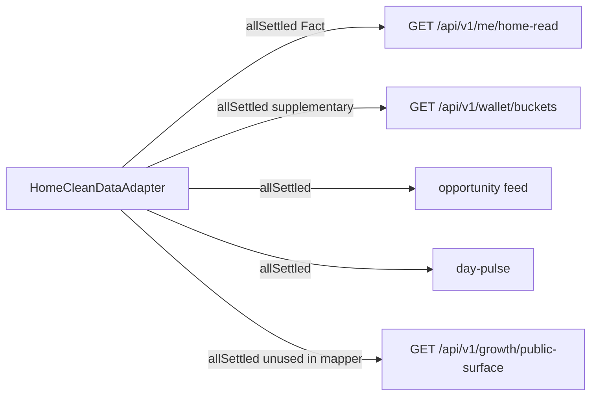

# HC6-08 Current FX Consumer Architecture Audit

```text
PLAN_STATUS=CLOSED
TODOS=completed
EVIDENCE_WRITTEN=YES
NEXT_SSOT=hc6-08_c_impl_plan_d235b8bd.plan.md
DO_NOT_IMPLEMENT_FROM_THIS_PLAN
```

감사 evidence:

- `_tmp_home_clean/v1/phase6/HC6_08_CURRENT_FX_CONSUMER_ARCHITECTURE_AUDIT.md`
- `_tmp_home_clean/v1/phase6/HC6_08_CURRENT_FX_CONSUMER_ARCHITECTURE_AUDIT.json`

READ-ONLY 감사 결과. 구현 0. evidence 2개는 기록됨.

```text
CONSUMER_TRANSPORT_REQUIRED=PROVEN
RECOMMENDED_CONSUMER_ARCHITECTURE=C
RECOMMENDATION_CONFIDENCE=MEDIUM
FOUNDER_ARCHITECTURE_DECISION=NOT_MADE
IMPLEMENTATION_DECISION=NOT_MADE
HC6_08_COMPLETE=NO
```

이후 Founder: `APPROVED_C`. 구현 착수는 이 플랜이 아니라 C implementation plan.

`C` = Shared Consumer Current FX Read Surface. raw rate를 UI가 곱하는 구조가 아니다.

---

## A. Executive Result

직전 증거(`HC6_08_KRW_APPROX_BINDING`)를 유지한다.

- 서버 FX truth / persist = PROVEN
- Consumer-facing current FX transport = 없음 (CHAIN_BREAK)
- `getLatestUsableSnapshot()`는 marketplace legs만 반환하고 `usdtKrw`를 뺀다
- user-facing FX GET controller = 0
- Binding Pass 1 = PASS, USDT primary 유지
- KRW approx는 제품 승인됐지만 Consumer chain이 없어 binding BLOCKED

이번 Pass가 답하는 것: **어느 Consumer layer가 맞는지**.

이번 Pass가 답하지 않는 것: Founder 승인, 구현, KRW UI, Deposit, HC6-09.

---

## B. Existing Read Architecture

현재 HomeClean live 조합은 이미 분리되어 있다.



| Surface | Path | Owner | HomeClean 사용 |
|---|---|---|---|
| HomeReadModel | `GET /api/v1/me/home-read` | Fact/State aggregate | `principalUsdt`, `todayPossibleProfitUsdt`, `viewState` |
| WalletBuckets | `GET /api/v1/wallet/buckets` | Ledger projection | supplementary `profitUsdt` only. viewState 승격 금지 |
| Growth public | `GET /api/v1/growth/public-surface` | 공유 read-only | 별도 fetch + HomeRead 내부 embed. mapper는 미사용 |
| HomeMoneyRead | `GET /api/v1/me/home-money-read` | Money Fact only | HomeClean 미호출. `profitUsdt` 등 FORBIDDEN |

핵심 패턴 3개:

1. **HomeRead = Fact orchestrator.** `HomeMoneyRead + OpportunitiesUser.listFeed + GrowthPublic`를 `Promise.all`로 묶는다. 하나 실패하면 HomeRead 전체 실패.
2. **HomeClean supplementary = `Promise.allSettled`.** Wallet 실패는 `출금 가능 수익 = 정보 없음`. Home `viewState`를 바꾸지 않는다.
3. **공유 Consumer read = Growth.** auth optional, 도메인 Fact가 아닌 공개 표면, SDK `fetchGrowthPublicSurface`, Home이 소프트로 붙는다.

스키마 잠금: [`schemas/home-read-model.v1.json`](schemas/home-read-model.v1.json) · [`schemas/wallet-buckets.v1.json`](schemas/wallet-buckets.v1.json) · [`schemas/home-money-read.v1.json`](schemas/home-money-read.v1.json) 모두 `additionalProperties: false`.

이미 있는 FX DTO 모양: [`schemas/fx-snapshot.v1.json`](schemas/fx-snapshot.v1.json) required = `fxSnapshotId`, `formulaId`, `sources`, `usdtKrw`, `capturedAt`. Consumer GET은 없다.

`apps/web`은 `@aipo/market-intelligence`를 의존하지 않는다. 클라이언트 `mulAmount` / `approxKrwFromSnapshot` import = 0.

---

## C. FX Owner and Boundary

- Formula owner: [`services/market-intelligence/src/fx-snapshot-formula.cjs`](services/market-intelligence/src/fx-snapshot-formula.cjs) `approxKrwFromSnapshot` = `mulAmount(amountUsdt, snapshot.usdtKrw)` · scale 18 · round-half-up
- Persist owner: [`services/api-nest/src/opportunities/fx-snapshot.service.ts`](services/api-nest/src/opportunities/fx-snapshot.service.ts) `recordFxIngest` → `public.fx_snapshots.usd_krw` = `usdtKrw`
- `loadLatest()`는 `id`, `usd_krw`, `formula_id`, `sources`, `captured_at`를 이미 읽는다
- `getLatestUsableSnapshot()`는 그 중 KRW display leg를 버린다. catalog persist / native→USDT 정규화 전용
- `FxSnapshotService`는 `OpportunitiesModule` export. HomeReadModule은 OpportunitiesModule을 이미 import. 브라우저/SDK는 이 서비스를 직접 호출할 수 없다
- Canon forbidden: `fx_recalc_in_ui` · `fake_krw_rate` ([`home-principal-slots.wire.json`](packages/ui/canon/surfaces/home-principal-slots.wire.json))
- Deposit historical: [`krw-deposit.service.ts`](services/api-nest/src/wallet/krw-deposit.service.ts) `krwToUsdt` + `fx_snapshots` id. Home current approx와 다른 축. 이번 추천의 근거로 승인/수정하지 않음

---

## D. Candidate A — HomeReadModel extension

가능하지만 추천하지 않는다.

맞는 점: `principalUsdt`와 `todayPossibleProfitUsdt`가 같은 응답에 있다. 구 H6 문구는 `HomeReadModel.money.principalKrwApprox`를 서버가 내려주라고 했다.

충돌:

- HomeRead 의미는 Fact/State이지 current market FX가 아니다
- `profitUsdt`는 Pass 1이 HomeRead에 심지 않기로 했다. HomeMoneyRead는 `profitUsdt`를 런타임 throw로 막는다
- 세 슬롯 KRW를 A만으로 끝내려면 Wallet profit을 HomeRead에 흡수해야 한다. semantic CONFLICT
- `additionalProperties: false` → schema/SDK/mapper/verify blast
- 내부가 `Promise.all`이라 FX를 그대로 넣으면 Home 전체 실패. soft dependency를 쓰려면 HomeRead 실패 모델을 바꿔야 한다
- Wallet 페이지 등 다른 Consumer 재사용 약함
- "HomeRead가 있으니 HomeRead가 답"은 금지된 추론

---

## E. Candidate B — Wallet DTO extension

탈락.

- `profitUsdt`와는 인접해 보이지만 FX는 ledger bucket이 아니다
- `todayPossibleProfitUsdt`는 Wallet owner가 아니다
- `WalletBucketsV1`은 Money §49 불변 DTO. FX를 넣으면 Money 의미 오염
- `asOfLedgerEntryId`와 FX `capturedAt`는 다른 시계
- 다른 surface 재사용은 Wallet 페이지에만 자연스럽다

---

## F. Candidate C — Shared current-FX Consumer surface

추천.

기존 패턴 대응:

- Growth `GET /api/v1/growth/public-surface` + SDK fetch + Home supplementary `allSettled`
- DTO 모양은 이미 `FxSnapshotV1`에 있다. 새 의미 발명이 아니라 Consumer GET이 없을 뿐
- Producer는 기존 `FxSnapshotService.loadLatest` 필드. `getLatestUsableSnapshot`를 Home용으로 재해석하지 않는다. 그 메서드는 marketplace 정규화 전용

왜 파일 수 최소안이 아니어도 맞는가:

- FX truth를 Home Fact / Wallet bucket에 섞지 않는다
- HomeClean이 이미 Wallet을 소프트 의존으로 붙이는 방식과 같다
- 한 번의 current-FX read identity를 세 USDT 슬롯이 공유할 수 있다
- Wallet/다른 Consumer surface가 같은 current FX를 재사용할 수 있다
- Deposit historical apply-rate owner가 되지 않는다

필수 제약 (C를 골라도 이것 없으면 C는 불완전):

```text
TRANSPORT  = current snapshot context
CALCULATION OWNER = existing server formula approxKrwFromSnapshot
UI         = 서버가 적용한 approx 문자열만 표시
금지       = client mulAmount / parseFloat / usdtKrw 직접 곱셈
```

즉 C는 "환율을 브라우저에 주고 UI가 계산"이 아니다.
C는 current FX context의 공유 read owner다.
Home `약 ₩` 문자열은 C를 **서버에서** consume한 presentation apply의 출력이다.
apply host의 정확한 클래스/route는 `IMPLEMENTATION_DECISION=NOT_MADE`.

과설계가 아닌 이유: 새 플랫폼이 아니라 Growth급 공유 read 1개 + 기존 formula 재사용. Home 전용 세 필드 DTO를 Money/Wallet에 심는 쪽이 더 큰 의미 오염이다.

---

## G. Candidate D — Server-precomputed Home KRW

계산 owner를 서버에 두는 점은 Canon `fx_recalc_in_ui`와 맞다.
세 값을 한 snapshot으로 계산하면 same-snapshot도 쉽다.

탈락 이유:

- `principalUsdt` / `profitUsdt` / `todayPossibleProfitUsdt` owner를 한 계산자가 모으면 Home-specific money mix
- HomeRead에 붙이면 A와 같은 Fact 오염 + profit 합성
- Wallet에 붙이면 B와 같은 bucket 오염
- 다른 화면 재사용 낮음
- "server compute is safe → precomputed KRW가 답"은 금지된 추론

D의 **payload 모양**(approx 문자열 + provenance)은 C의 서버 apply 출력으로 재사용한다. D 자체를 FX owner로 쓰지 않는다.

---

## H. Candidate E

없음. `NO_CANDIDATE_E`.

비슷해 보여서 올리지 않은 것:

- `principalKrwApprox` UI prop: sink만 있고 서버 producer 없음. 불완전 chain
- `user-financial-summary.depositKrwApprox`: Admin schema, runtime 0, number(float)
- opportunity `expectedProfitKrwApprox`: pricing-time, user strip, Home asset에 쓰면 CASE C
- Growth `amountKrwText`: 현재 `"—"`. FX chain 아님. C의 패턴 근거일 뿐
- HomeMoneyRead: profit/expected를 능동 금지. A보다 더 좁다

---

## I. Decision Matrix

판정: STRONG / ACCEPTABLE / WEAK / CONFLICT / NOT_PROVEN

- Existing pattern fit: A ACCEPTABLE · B WEAK · C STRONG · D WEAK · E NOT_PROVEN
- Server truth ownership: A ACCEPTABLE · B ACCEPTABLE · C STRONG · D STRONG · E NOT_PROVEN
- Single snapshot consistency: A WEAK · B WEAK · C STRONG · D STRONG · E NOT_PROVEN
- Home soft dependency: A WEAK · B ACCEPTABLE · C STRONG · D ACCEPTABLE · E NOT_PROVEN
- Money-domain semantic purity: A ACCEPTABLE · B CONFLICT · C STRONG · D CONFLICT · E NOT_PROVEN
- Home-domain semantic purity: A CONFLICT · B ACCEPTABLE · C STRONG · D CONFLICT · E NOT_PROVEN
- Wallet-domain semantic purity: A ACCEPTABLE · B CONFLICT · C STRONG · D CONFLICT · E NOT_PROVEN
- Reusability: A WEAK · B WEAK · C STRONG · D WEAK · E NOT_PROVEN
- Provenance / traceability: A ACCEPTABLE · B ACCEPTABLE · C STRONG · D ACCEPTABLE · E NOT_PROVEN
- Schema/API blast radius: A WEAK · B WEAK · C ACCEPTABLE · D WEAK · E NOT_PROVEN
- Client complexity: A ACCEPTABLE · B ACCEPTABLE · C ACCEPTABLE · D STRONG · E NOT_PROVEN
- Future maintenance: A WEAK · B WEAK · C STRONG · D WEAK · E NOT_PROVEN
- Deposit historical FX separation: A ACCEPTABLE · B WEAK · C STRONG · D ACCEPTABLE · E NOT_PROVEN
- Evidence strength: A STRONG · B STRONG · C STRONG · D STRONG · E STRONG (부재가 증명됨)

점수 합산으로 고르지 않았다. B/D의 semantic CONFLICT가 A의 파일 수 이점보다 우선한다.

---

## J. Recommended Architecture

```text
RECOMMENDED_CONSUMER_ARCHITECTURE=C
RECOMMENDATION_CONFIDENCE=MEDIUM
```

MEDIUM인 이유: C가 FX owner로는 가장 맞지만, Home `약 ₩`을 실제로 붙일 **서버 apply host**(새 supplementary read vs 다른 presentation 투영)는 아직 NOT_PROVEN. 그 host를 지금 확정하면 구현 결정을 훔친다.

근거:

- repository: Growth 공유 read + HomeClean `allSettled` + `FxSnapshotV1` + `loadLatest` 필드
- ownership: FX는 opportunities/market-intelligence. Home/Wallet이 아니다
- semantic fit: current FX는 supplementary reference. Fact/bucket이 아니다
- failure isolation: FX fail ≠ Home fail. 기존 Wallet supplementary와 동일
- future reuse: Wallet 페이지 등 current 참고환산이 필요한 Consumer가 같은 surface를 쓴다

---

## K. Minimum Contract Proposal (C only · 코드 0)

증명된 필드만. `?`로 추측하지 않음.

```text
Producer
  FxSnapshotService 소비자-안전 current snapshot read
  (loadLatest 필드. getLatestUsableSnapshot를 재사용하지 않음 — usdtKrw 생략)

Consumer
  Nest 서버 presentation apply
  SDK current-FX fetch
  HomeClean supplementary allSettled
  이후 다른 Consumer surface

Transport DTO (FxSnapshotV1 ∩ loadLatest)
  fxSnapshotId   ← fx_snapshots.id
  capturedAt     ← captured_at
  usdtKrw        ← usd_krw
  formulaId      ← formula_id
  sources        ← sources

넣지 않음
  gbpUsd/eurUsd/audUsd/usdtPerUsd (marketplace 정규화 legs)
  rate_provenance (DB에는 있으나 fx-snapshot.v1.json 없음)
  principalApproxKrw 등 Home-only 필드를 FX DTO에 심지 않음

Failure behavior
  FX unavailable → DTO null / available=false
  HomeRead/Wallet 성공은 유지
  USDT 표시 유지
  KRW secondary unavailable
  viewState 승격 금지
  fabricate rate 금지

Snapshot consistency
  Home 한 load에서 current-FX read 1회
  서버 apply가 그 snapshot으로 세 USDT에 적용
  슬롯별 다른 snapshot fetch 금지

Calculation owner
  services/market-intelligence/src/fx-snapshot-formula.cjs
  approxKrwFromSnapshot
  client Number/parseFloat/mul 금지

Presentation owner
  HomeClean ViewModel/Asset
  서버가 준 approx 문자열 format/hide only
  usdtKrw를 UI 곱셈 입력으로 쓰지 않음
```

`usdtKrw`가 DTO에 있는 이유: 서버 apply와 운영 추적용. UI 계산 입력이 아니다.

---

## L. Same-Snapshot Analysis

```text
SAME_SNAPSHOT_GUARANTEE=PARTIAL
```

- 한 서버 apply 응답 안의 세 KRW가 같은 `fxSnapshotId`를 쓰는 것은 설계상 보장 가능
- 지금 구조(HomeRead HTTP + Wallet HTTP + 미래 FX HTTP)를 그대로 세 번 호출하면 atomic snapshot은 NOT_PROVEN. ingest가 그 사이에 새 row를 넣을 수 있다
- 가짜 보장 금지. 완전한 분산 트랜잭션은 현재 architecture에 없다

`profitUsdt`가 Wallet supplementary인 한, USDT 금액 자체의 atomic snapshot도 원래 없다. KRW만 더 강한 atomic을 주장하지 않는다.

---

## M. Failure Isolation

| HomeRead | Wallet | FX | 결과 |
|---|---|---|---|
| 성공 | 성공 | 성공 | 세 USDT + 세 KRW approx 가능 |
| 성공 | 실패 | 성공 | principal / expected USDT+KRW 가능. 출금 가능 수익 = 정보 없음 |
| 성공 | 성공 | 실패 | 세 USDT 유지. 모든 KRW secondary unavailable. viewState 유지 |
| 실패 | * | * | 기존 Home 실패 모델. FX가 추가로 Home을 실패시키면 안 됨 |

Home 전체 실패를 FX가 만들면 안 된다.

---

## N. Future Deposit Separation

```text
KRW_DEPOSIT_FX_PRODUCT_REQUIREMENT=RECORDED
FUTURE_DEPOSIT_FX_RISK=RECORDED
```

Home current approx ≠ Deposit historical applied rate.
C를 Deposit `krwToUsdt` / `USDT ≈ USD` 계약으로 재사용한다고 결론내지 않는다.

---

## O. Rejected Alternatives

- A: Home Fact 오염, profit 합성 압력, schema blast, soft-fail 약함
- B: Wallet bucket 오염, expected profit owner 침범
- D: 계산은 안전해 보여도 owner mix + Home-only hack
- C를 raw-rate-to-UI로 읽는 해석: `fx_recalc_in_ui` CONFLICT. 이 해석은 추천에 포함하지 않음
- opportunity `expectedProfitKrwApprox` 재사용: pricing-time. CASE C

---

## P. Remaining NOT_PROVEN

- 서버 apply host의 정확한 Nest class / route / SDK 모듈명
- Consumer GET의 auth(Growth처럼 optional vs JWT)
- HomeClean이 apply 결과를 어떤 필드로 ViewModel에 받을지
- same-snapshot을 응답 1개로 묶을지, snapshot id equality로 맞출지
- Founder 승인

---

## Q. Safety / Stop

```text
PRODUCTION_SOURCE_CHANGE=0
HOMECLEAN_CHANGE=0
HOME_READ_CHANGE=0
SDK_CHANGE=0
API_CHANGE=0
WALLET_CHANGE=0
FX_CHANGE=0
MONEY_CHANGE=0
LEDGER_CHANGE=0
DEPOSIT_CHANGE=0
DB_CHANGE=0
SCHEMA_CHANGE=0
AUTH_CHANGE=0
PLAN_CHANGE=0
CANON_CHANGE=0
COMMIT=0
PUSH=0
STASH=0
HC6_08_COMPLETE=NO
HC6_09_NOT_STARTED
PHASE_7_NOT_STARTED
FOUNDER_ARCHITECTURE_DECISION=NOT_MADE
IMPLEMENTATION_DECISION=NOT_MADE
```

승인 후 유일한 write:

- [`_tmp_home_clean/v1/phase6/HC6_08_CURRENT_FX_CONSUMER_ARCHITECTURE_AUDIT.md`](_tmp_home_clean/v1/phase6/HC6_08_CURRENT_FX_CONSUMER_ARCHITECTURE_AUDIT.md)
- [`_tmp_home_clean/v1/phase6/HC6_08_CURRENT_FX_CONSUMER_ARCHITECTURE_AUDIT.json`](_tmp_home_clean/v1/phase6/HC6_08_CURRENT_FX_CONSUMER_ARCHITECTURE_AUDIT.json)

marker: `HOME_CLEAN_HC6_08_CURRENT_FX_CONSUMER_ARCHITECTURE_AUDIT_COMPLETE` = architecture audit complete only.

구현 · HomeRead/SDK/endpoint · KRW UI · Deposit · HC6-09 · Phase 7 진입 금지.
