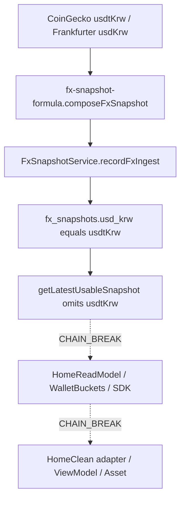

# HC6-08 KRW Approximation Binding — CASE B BLOCKED

## 사전 판정 (구현 전 소스 실측)

Primary question 답. 이번 보강으로 바꾸지 않는다.

```text
FX_CHAIN_NOT_AVAILABLE_TO_HOMECLEAN
KRW_APPROX_BINDING_RESULT=BLOCKED
BLOCKED_BY_CONSUMER_CHAIN
```

`PASS` / `PARTIAL` / COMPLETE marker는 쓰지 않는다. 가짜 `₩` 렌더로 PASS 만들지 않는다.

근거:

- 서버 authoritative FX source = **존재 (PROVEN)**: [`services/market-intelligence/src/fx-snapshot-formula.cjs`](services/market-intelligence/src/fx-snapshot-formula.cjs) `approxKrwFromSnapshot` = `mulAmount(usdt, snapshot.usdtKrw)` (scale 18, round-half-up). `1 USD = 1 USDT` 가정 없음.
- stored `usdtKrw` = **존재 (PROVEN)**: [`services/api-nest/src/opportunities/fx-snapshot.service.ts`](services/api-nest/src/opportunities/fx-snapshot.service.ts) `recordFxIngest` → `public.fx_snapshots.usd_krw` (legacy column = `usdtKrw`, [`governance/global-product/jpy-krw-additive-fx-contract.v1.md`](governance/global-product/jpy-krw-additive-fx-contract.v1.md) §1.1).
- HomeClean Consumer current `usdtKrw` 전달 경로 = **없음 (CHAIN_BREAK)**: [`packages/sdk/src/home-read-model/types.ts`](packages/sdk/src/home-read-model/types.ts), wallet DTO, HomeClean adapter/mapper/ViewModel에 `usdtKrw` / `approxKrw` / FX 필드 0. user-facing FX GET controller 0.
- `FxSnapshotService.getLatestUsableSnapshot()`는 marketplace legs(`gbpUsd`/`usdtPerUsd`…)만 반환하고 **`usdtKrw`를 빼먹는다**. HomeRead가 이 메서드를 호출해도 현재 KRW rate를 얻지 못한다.
- Opportunity `expectedProfitKrwApprox`는 pricing-time 상품 KRW이며, user surface strip 대상도 아니다. 그러나 **현재 wallet USDT × current `usdtKrw`가 아니다**. 이걸 Home 자산 슬롯에 쓰면 CASE C(의미 불명/새 formula). 사용 금지.
- Legacy [`HomePrincipalRail`](packages/ui/components/opportunity/HomePrincipalRail.tsx)은 `principalKrwApprox` optional display prop만 있다. [`HomePageClient.tsx`](apps/web/app/HomePageClient.tsx)는 이 prop을 넘기지 않는다. HomeClean Binding Pass 1은 Asset에서 KRW를 제거했다 (`binding-pass1-grep.mjs` `Asset KRW 칩/숫자 제거`).



## CASE 규칙 (이번 Pass 집행)

CASE A 재사용 경로 없음 → 새 endpoint / 새 FX service / HomeReadModel 필드 추가 / client `mulAmount` / browser CoinGecko **전부 금지**.

CASE B만 집행:

- `LAST_PROVEN_SOURCE` = `FxSnapshotService.recordFxIngest` + `fx_snapshots.usd_krw` + `approxKrwFromSnapshot`
- `CHAIN_BREAK` = HomeReadModel / SDK / HomeClean (current `usdtKrw` 미전달)
- `MINIMUM_REQUIRED_LAYER` = **NOT_PROVEN** (아래 두 판정으로 의미를 분리한다)

### Consumer transport 판정 분리

```text
MINIMUM_REQUIRED_LAYER=NOT_PROVEN
CONSUMER_TRANSPORT_REQUIRED=PROVEN
EXACT_CONSUMER_LAYER=NOT_PROVEN
```

`CONSUMER_TRANSPORT_REQUIRED=PROVEN`

- Home에 truthful current KRW approximation을 표시하려면 `authoritative server FX truth → Consumer-facing transport → HomeClean` 전달 경로가 필요하다는 사실 자체는 PROVEN.
- 이유: Consumer에 current `usdtKrw` 또는 server-precomputed KRW approximation이 없다.

`EXACT_CONSUMER_LAYER=NOT_PROVEN`

- 그 전달 경로를 어디에 둘지는 이번 Pass에서 결정/증명하지 않는다.
- 임의 선택 금지: HomeReadModel extension, Wallet DTO extension, new current-FX endpoint, shared consumer FX read surface, server-precomputed approx-KRW DTO, 기타 새 transport.

```text
transport 필요 = PROVEN
어느 architecture가 맞는지 = NOT_PROVEN
```

`CONSUMER_TRANSPORT_REQUIRED=PROVEN`을 다음으로 승격하지 않는다.

- HomeReadModel에 넣자
- 새 FX API를 만들자
- Wallet DTO가 적합하다
- server-precomputed KRW가 최선이다

다음 별도 architecture decision pass에서 existing user-facing read patterns를 비교한 뒤에만 결정한다.

허용 수정 범위 (실행 시):

- [`_tmp_home_clean/v1/phase6/HC6_08_KRW_APPROX_BINDING.md`](_tmp_home_clean/v1/phase6/HC6_08_KRW_APPROX_BINDING.md)
- [`_tmp_home_clean/v1/phase6/HC6_08_KRW_APPROX_BINDING.json`](_tmp_home_clean/v1/phase6/HC6_08_KRW_APPROX_BINDING.json)
- Binding Pass 1 regression 재실행만 (코드 변경 0 기대)

HomeClean / SDK / Nest / Deposit / Engine / `T.home` / production `/` / `opportunity-card-map.ts` 수정 0.

## 제품 의미 (구현하지 않아도 evidence에 고정)

- Home `약 ₩…` = 현재 FX 참고 환산. KRW wallet balance / 입금 당시 KRW / historical deposit FX **아님**.
- USDT가 primary. KRW를 primary로 올리지 않음. Binding Pass 1 USDT 바인딩 유지.
- `KRW_APPROX_PRODUCT_DECISION=APPROVED` 와 `KRW_APPROX_BINDING_RESULT=BLOCKED` 는 분리. 제품 승인이 가짜 FX를 허용하지 않음.
- 구 플랜 문구 `KRW PRIMARY / USDT SECONDARY`는 이번 Founder 결정으로 HomeClean 자산 슬롯에 적용하지 않음.

### Home current FX vs Deposit historical FX

이 구분은 유지한다.

```text
Home current approx KRW
!=
Deposit historical KRW valuation
```

Home:

```text
현재 보유/운용 USDT
+
현재 authoritative FX
→ 약 ₩...
```

한국 사용자 이해를 돕는 현재 시점 참고 환산.

Deposit:

```text
실제 입금 KRW
+
해당 거래에서 적용된 historical authoritative FX snapshot
→ 실제 credited USDT
```

거래 당시의 financial fact.

Home 화면의 현재 환율로 과거 입금액/과거 credited USDT를 재계산하지 않는다.

## Evidence에 남길 lineage

각 노드 `PROVEN` / `CHAIN_BREAK` / `NOT_PROVEN`:

- provider inputs → `PROVEN` (CoinGecko worker `usdtKrw`, Frankfurter `usdKrw`, compose fallback)
- FxSnapshotService / snapshot owner → `PROVEN`
- stored snapshot → `PROVEN` (`usd_krw`)
- existing API / read model / SDK → `CHAIN_BREAK`
- HomeClean adapter → `CHAIN_BREAK`
- ViewModel / HomeCleanAsset `약 ₩…` → `CHAIN_BREAK` (슬롯 없음; Pass 1이 KRW 제거)

Money slot map (desired, **unbound**):

- `principalUsdt` → approx KRW = unbound
- `profitUsdt` → approx KRW = unbound
- `todayPossibleProfitUsdt` → approx KRW = unbound

Failure behavior (현재 유지, 변경 0):

- FX unavailable = 해당 없음(경로 없음). USDT는 Pass 1대로 표시
- wallet 실패 = 출금 가능 수익 `정보 없음`, Home viewState 승격 금지
- fixture = 가짜 환율 넣지 않음. money = `정보 없음` 유지
- guest/expired = 기존 session 보존

## Future Deposit — 기록만

이번 Pass:

```text
Deposit code 수정 = 0
Deposit semantics 변경 = 0
Deposit Product Decision 추가 = 0
```

### Target product requirement (기록)

`KRW_DEPOSIT_FX_PRODUCT_REQUIREMENT=RECORDED`

```text
TARGET PRODUCT REQUIREMENT:

requested KRW
→ authoritative applicable FX snapshot
→ applied rate
→ credited USDT
→ ledger principal credit
→ historical transaction record
```

동일 입금액이라도 applied snapshot에 따라 credited USDT가 달라질 수 있음. 거래별 저장 대상(미래): requested KRW, applied FX snapshot/reference, applied rate, credited USDT, confirmed timestamp. 수수료는 환율에 숨기지 않고 별도 표시(정책 발명 0).

```text
TARGET PRODUCT REQUIREMENT
!= 현재 krw-deposit.service semantics가 이미 이를 만족한다는 증거
```

이 둘을 동일시하지 않는다.

### Future deposit FX risk (기록)

`FUTURE_DEPOSIT_FX_RISK=RECORDED`

[`services/api-nest/src/wallet/krw-deposit.service.ts`](services/api-nest/src/wallet/krw-deposit.service.ts)의 `krwToUsdt` 및 `USDT ≈ USD` 관련 semantics는 향후 KRW Deposit Consumer/credit flow 구현 전에 반드시 별도 semantic verification이 필요하다.

이번 Pass에서는:

- 해당 코드 수정 0
- 해당 주석 수정 0
- 해당 계산이 잘못됐다고 판정하지 않음
- 해당 계산이 최종 계약이라고 승인하지 않음
- `NOT_PROVEN` 상태로 risk만 기록

`krwToUsdt`는 ledger credit 경로이며 Home display와 공유하지 않는다.

## Validation (코드 변경 없이, 실행 시)

1. Targeted grep (HomeClean + adapter/mapper만): hardcoded KRW rate 0, browser FX fetch 0, `1 USDT = 1 USD` 가정 0, client money multiply 0, KRW wallet balance alias 0.
2. Binding Pass 1 regression 재실행:
   - `node apps/web/app/home-clean/binding-pass1-grep.mjs`
   - `node --experimental-strip-types --import ./packages/ui/components/home-clean-v1/binding-pass1-register.mjs --test ./packages/ui/components/home-clean-v1/home-clean-binding-pass1.test.ts`
3. `/dev/home-clean-v1` Playwright는 로컬 Next가 없으면 `BLOCKED_LOCAL_ENVIRONMENT`. 켜져 있어도 KRW secondary는 **없어야** 한다 (이번 Pass 성공 조건). screenshot ≠ Final Visual PASS.
4. 새 helper / 새 unit test 없음 (계산 owner를 만들지 않음).

## 하지 않을 것

KRW Deposit 구현, HomeReadModel/SDK FX 필드 추가, Stepper, Progress runtime, Hero/Robot, Final Visual Reconciliation, HC6-09, Phase 7, 03 YAML `HC6-08` completed, commit/push/stash, consumer transport architecture 선택.

## Evidence 최종 result block (실행 시 필수)

```text
KRW_APPROX_PRODUCT_DECISION=APPROVED
KRW_APPROX_REQUIRED_FOR_FINAL_HOME=YES

FX_CHAIN_NOT_AVAILABLE_TO_HOMECLEAN
KRW_APPROX_BINDING_RESULT=BLOCKED
BLOCKED_BY_CONSUMER_CHAIN

CONSUMER_TRANSPORT_REQUIRED=PROVEN
EXACT_CONSUMER_LAYER=NOT_PROVEN
MINIMUM_REQUIRED_LAYER=NOT_PROVEN

KRW_DEPOSIT_FX_PRODUCT_REQUIREMENT=RECORDED
FUTURE_DEPOSIT_FX_RISK=RECORDED

HC6_08_COMPLETE=NO
HC6_09_NOT_STARTED
PHASE_7_NOT_STARTED
```

## 보고 순서 (실행 후)

1. FINAL RESULT
2. FX SOURCE
3. LINEAGE
4. CONSUMER TRANSPORT 분리 (`REQUIRED=PROVEN` / `EXACT_LAYER=NOT_PROVEN`)
5. WHAT CHANGED
6. MONEY / KRW DISPLAY
7. FAILURE
8. TESTS
9. FUTURE DEPOSIT REQUIREMENT + `FUTURE_DEPOSIT_FX_RISK`
10. REMAINING BLOCKS
11. SAFETY
12. MARKER 없음

Safety footer 필수: `ENGINE_CHANGE=0` … `DEPOSIT_IMPLEMENTATION_CHANGE=0` … `COMMIT=0` `PUSH=0` `STASH=0` `HC6_08_COMPLETE=NO` `HOME_CLEAN_HC6_08_KRW_APPROX_BINDING_COMPLETE` 미사용.
