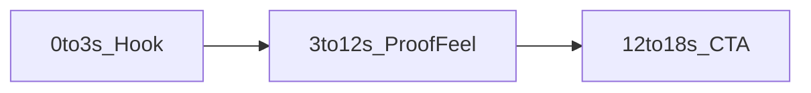

# HeyGen 퍼뜩 숏폼 홍보 테스트 1편

## 잠금 결정 (테스트용)

- **목적:** Meta / TikTok / Instagram / YouTube **Shorts·릴스 홍보** 1편. 목표는 “가입하고 싶다” 감정. 입금·지갑·USDT 가이드 **아님**.
- **타깃:** 한국인 **20~70대 남·여 공통** — 세대·성별 슬랭 배제, 쉬운 말, 이익이 한눈에.
- **훅 법칙:** **0~3초**에 욕망 고정. 3초 안에 브랜드·혜택·Curiosity 중 최소 2개.
- **런타임:** 전체 **15~21초** (숏폼 완주율). 테스트 1편만.
- **화자:** 스톡 프레젠터 (아바타 신규 생성 생략).
- **언어:** 대본·나레이션·화면 글자 **전부 한국어**. IT 용어·영문 CTA 금지. 브랜드 **퍼뜩**만.
- **음성:** `list_voices(type=public, language=ko, gender=female)` → 미리듣기 확정. `voice_settings.locale = ko-KR`.
- **포맷:** 세로 **9:16**, 텍스트 크게(릴스 세이프존), 초반 자막 필수.
- **전송:** MCP only — 서버 id `project-0-AI_PROFIT_OS-heygen` (플랜 크레딧).
- **기술 지시문:** STYLE/모션/프레임만 영어.

## 크리에이티브 구조 (전연령 공통)

| 구간 | 시간 | 역할 | 잠금 카피 방향 |
|------|------|------|----------------|
| Hook | 0~3초 | 스크롤 정지 | 예: “오늘 번 돈, 내일 안 기다려도 됩니다.” / 화면 큰 글씨 **퍼뜩** |
| Proof/Feel | 3~12초 | 욕망 증폭 | 어려운 투자 공부 X → “기회 보면 바로 수익” 감각. 숫자 자랑·사기성 보장 문구 금지. |
| CTA | 12~18초 | 가입 충동 | “지금 퍼뜩에서 시작” 한 줄. 링크/앱명은 화면 하단 세이프. |

**금지 (신뢰·컴플라이언스):** “무조건 돈 번다”, “원금 보장”, “수익률 XX% 확정”, 입금 압박, 영문 밈 과다.

**허용 톤:** 친근·또렷·자신감. 20대 슬랭·70대 훈계 톤 둘 다 피함 → **표준 구어체**.

## 한국어 완벽 게이트

1. MCP `list_voices` (`language=ko`, `gender=female`) — 영어 보이스 후보 배제.
2. `preview_audio_url` 공유; 없으면 `create_speech`로 훅 문장 TTS 샘플.
3. 대본 채팅 제시 → 사용자 `OK` 후에만 생성.
4. `create_video_agent`: 한국어 스크립트 + 확정 `voice_id` + 세로. 프롬프트에 “All spoken words and on-screen text in Korean. First 3 seconds must show large Korean hook text.”
5. DONE 후 링크 전달. 음성 영어/깨짐이면 `voice_id`만 교체 **1회 재생성**.

## 실행 순서 (승인 후)

1. MCP 연결 확인 → 한국어 보이스 1개 + 미리듣기 → `OK`.
2. 훅 1줄 + 전체 대본(15~21초) 제시 → `OK`.
3. 생성 → share URL + 1줄 요약.
4. 앱 임베드·다국어 더빙·아바타 제작·커밋 **이번엔 안 함**.

## 승인 후 첫 액션

Agent 모드에서 `project-0-AI_PROFIT_OS-heygen`의 `list_voices`로 한국어 후보·미리듣기를 먼저 보여 준 뒤, 3초 훅 대본 → 생성.
