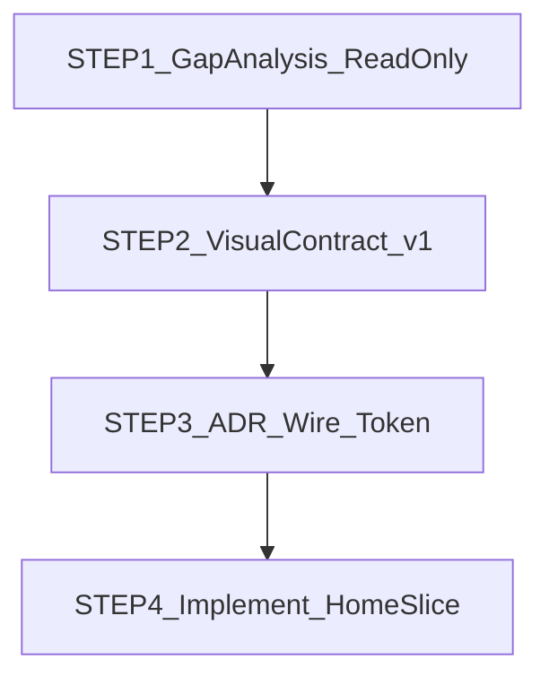

# Peotteok Home Visual Upgrade (별도 트랙)

## 트랙 정의 (PART9와 분리)

| | PART9 Live Wiring | **본 트랙** |
|---|---|---|
| 상태 | **CLOSED** (9-pre~9i) | **신규** |
| 성격 | API · SDK · 세션 · stub 배선 | 출시 UI Visual Upgrade / Home Experience Layer |
| File-Serial | 03 UI PART9 완료 | **03 안 억지 삽입 금지** · Index에 **예외 트랙**으로만 표기 |
| 다음 UI 잔여(기존) | `trust-age-spotcheck` | 본 트랙 **완료 후**로 재배치 |

```
기존 File-Serial: 00 → 01 → 02 → 03(PART9 CLOSED) → 04 → 05 → 06

본 트랙(병렬 아님·Founder 우선):
  Visual Upgrade / Home Experience
    → Gap Analysis (read-only)
    → Visual Contract v1
    → ADR + Wire + Token
    → Home 구현
    → 그다음 trust-age-spotcheck → 04 Admin …
```

**금지:** PART9 재오픈 · part9c 실행 · API/SDK부터 손대기 · “사진 그대로 똑같이 코드 생성” · 기존 홈 컴포넌트 전량 삭제 · 디자인 시스템 전면 재창작부터.

---

## Founder Lock

- **Q1=A:** Lux Dark → Archive/Legacy · 출시 SSOT = Light + Purple + Fintech/AI
- **Q2=A:** 홈(+셸)만 · 5탭 동시 금지
- **PNG:** Visual Reference only (의도 추출 허용) · SSOT 아님 · 픽셀복제·수치/카피 Truth 금지
- **SSOT 사다리:** Visual Contract → Canon Wire → Design Token → React Component
- **성공 정의:** Visual Contract 항목 100% 유지 (Layout hierarchy · Information priority · Nav · Card · Color · Type · Illustration · CTA · Interaction) — “PNG 1000% 픽셀 동일” 금지 표현

---

## 올바른 순서 (갱신)



### STEP 1 — Home Gap Analysis only (지금 할 일 · **코드 수정 금지**)

첨부 Reference 이미지 기준. **결과만 출력.** 수정·커밋·wire/token/ADR 작성 **금지**.

분석 항목:

1. **현재 Home 컴포넌트 구조** — [`apps/web/app/HomePageClient.tsx`](apps/web/app/HomePageClient.tsx) · [`apps/web/app/layout.tsx`](apps/web/app/layout.tsx) · `HomePrincipalRail` · BalanceAware/feed · shell `BottomNav5` · ticker/DayPulse 등
2. **이미지 Layout 구조** — Desktop sidebar ~240 · header ~64 · main 3-column · Hero / Dashboard / Right rail
3. **필요한 신규 컴포넌트** vs **기존 재사용**
4. **SSOT 충돌** — Lux Dark tokens · 목업 KRW/% · “투자/거래/판매/구매” 톤 · `success_rate_percent` · Brand 일러스트

산출물 형태(채팅 또는 임시 분석 MD · **앱 코드 0**):

- Current tree
- Target tree (from image intent)
- Gap matrix (Keep / Adapt / New / Forbidden)
- Truth conflicts (표현 유지 · 카피 수정 필요 목록)

### STEP 2 — Peotteok Home Visual Contract v1

STEP1 승인 후 **계약 문서만** 작성 (구현·ADR·Token·CSS 금지).  
SSOT 파일: [`packages/ui/canon/contracts/peotteok-home-visual-contract.v1.md`](packages/ui/canon/contracts/peotteok-home-visual-contract.v1.md)

**STEP2 보정 잠금 (필수)**

1. **Desktop IA:** Sidebar 240 · Main flexible · Right Rail 320~360 (3열 계약)
2. **Hero 우선순위:** 3초 이해 = AI가 기회 탐색 · 사용자는 참여 확인 (Title→Subtitle→Timeline→Robot/Globe→CTA)
3. **Right Rail = 정보 보조만:** 누적/Top3/진행 허용 · 성공률%·확정수익 오인·실시간거래감 금지

PART9 Keep: `HomePageClient` 확장 · `HomePageV2` 신설 금지.

### STEP 3 — ADR + Canon Wire + Token 잠금

계약 PASS 후에만:

- ADR-013/015·mockup-governance: Reference 허용 · PNG SSOT 금지 · Light 출시 SSOT
- Canon `home` wire v2 + manifest
- Design token Light/Purple + theme CSS 미러
- Draft palette는 STEP1에 스케치 가능 · **정식 hex 잠금은 여기**

### STEP 4 — 구현 (계약·wire·token PASS 후)

순서 고정:

1. App Shell  
2. Sidebar / Header  
3. Hero  
4. Balance / Profit surface  
5. Opportunity cards  
6. Right dashboard  
7. Animation polish  
8. Responsive (mobile-first breakpoints는 wire에 선행 잠금)

원칙: **기존 컴포넌트·PART9 live fetch 재사용** · 평행 홈 신설 금지 · 신규는 Gap에서 New로 표시된 것만.

---

## Truth 가드 (이미지 ≠ 원장)

| 이미지 | 퍼뜩 Truth | UI 처리 |
|---|---|---|
| ₩15,320,000 히어로 | Wallet buckets · USDT | ≈₩ 표시 전용 · 재계산 UI 0 |
| +1,245 USDT 등 목업 숫자 | feed/settlement Fact | 런타임만 |
| 매칭 정확도 % | Rule 난수/성공률 금지 | 폐기·대체 카피 |
| 투자/매매 톤 | Capital participant · 참여 · 정산 | 카피 교정 |

---

## 지금 하지 말 것

- PART9 다시 열기 / part9c
- API 연결·SDK부터
- 사진 넣고 “똑같이 만들어” 코딩
- 기존 컴포넌트 전체 삭제
- 새 디자인 시스템부터 전면 재작성
- `docs/mockups` 등 PNG 레포 재반입
- 04 Admin 착수 / 8d를 테마 전에 닫기

---

## 다음 액션 (이 플랜 승인 시)

**즉시 실행 가능한 유일한 세션:** STEP1 Gap Analysis (read-only · 코드 0).  
STEP2~4는 Gap 결과 Founder 확인 후.
