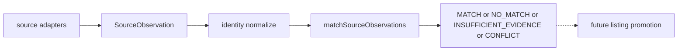

# PUTDUK Identity Matching V1

CURRENT_ACTIVE_PLAN = YES

```text
HEAD = 0345206ad2e7238658454db5d072c8fbf93dbb37
Working tree = DIRTY (Home /profits / opportunity / source-observation 등 타 세션)
commit / push / stash / reset / restore / clean = 0
```

이번 slice owner는 **같은 상품 여부 + 근거**다. MATCH ≠ Opportunity truth.

## Repo truth (이미 확인)

Canonical observation은 [`schemas/source-observation.v1.json`](schemas/source-observation.v1.json) + [`services/market-intelligence/src/source-observation/`](services/market-intelligence/src/source-observation/) 이다.

| source | parser가 실제로 넣는 identity | 비고 |
|---|---|---|
| Fashionphile | `meta.brand`=vendor, `meta.sku`=variant SKU, `title` | Shopify `id`는 source-local. model/size/color/GTIN **미추출**. fixture 예: Hermes Mini Kelly, sku `1956054` |
| eBay | `meta.brand`, `meta.modelNumber`=mpn, `meta.model`/`size`=localizedAspects, `identityHints.gtin`/`epid` | `inferredEpid`는 strong 금지. 기존 live 예: `v1\|820005472487\|0`, USD 30.99 |
| Chrono24 | `meta.brand`/`model`/`modelNumber`(sku\|reference), year/dial/case hints | parser PASS · acquisition `BLOCKED_CURRENT_ENV` · 보통 `sourceStatus=AMBIGUOUS` |

기존 matcher는 **다른 owner**다. 재사용/확장하지 않는다.

- [`ebay-identity-match.cjs`](services/market-intelligence/src/ebay-identity-match.cjs) + watch/bag/card-match = **listing → Asset Master** (Engine §0.10)
- [`match-strictness.cjs`](services/market-intelligence/src/match-strictness.cjs) = execution policy
- [`discoverCandidates`](services/market-intelligence/src/source-observation/contract.cjs) = Identity Matching용 stub이며 [`source-observation-runtime.cjs`](tooling/verify/source-observation-runtime.cjs)가 **NOT_IMPLEMENTED 유지**를 assert한다

따라서 새 pairwise owner를 만든다. `discoverCandidates`는 구현하지 않는다 (N×M scan 금지).



## Dirty-tree 보호

이미 dirty인 파일은 **한 줄 단위로만 추가**한다. revert/restore/재포맷 금지.

이미 dirty라서 wiring 시 조심할 파일:

- [`package.json`](package.json)
- [`tooling/verify/CATALOG.md`](tooling/verify/CATALOG.md)
- [`tooling/verify/domain-by-path.cjs`](tooling/verify/domain-by-path.cjs)
- [`tooling/verify/stubs/run-all.cjs`](tooling/verify/stubs/run-all.cjs)
- [`services/market-intelligence/src/index.cjs`](services/market-intelligence/src/index.cjs) / [`index.d.ts`](services/market-intelligence/src/index.d.ts) — **가능하면 안 건드림**. verifier가 모듈을 경로 require

**금지 터치:** Home, `/profits`, Money/FX/Ledger, `workers/ebay-adapter`, eBay/Fashionphile/Chrono24 adapters, `schemas/source-observation.v1.json`, opportunity reprice, TCGplayer, Yahoo.

## Step 1 — Real overlap audit (코드 작성 전)

matcher를 쓰기 전에 bounded live audit만 한다.

1. Fashionphile CONFIRMATION: 기존 live URL `hermes-epsom-mini-kelly-sellier-20-black-1956054`
2. eBay Discovery: 기존 [`discoverSourceItems`](services/market-intelligence/src/source-observation/observe.cjs)만 사용. query는 Fashionphile brand+title 기반, **limit 5~20**. `workers/ebay-adapter` `DEFAULT_SEARCH_QUERIES` 변경 0
3. 성공 candidate 중 최대 3개만 CONFIRMATION
4. 비교: category / brand / model / GTIN·MPN·SKU semantics / evidence quality
5. credential 값 출력 금지. sanitized evidence만

정적 예측 (live가 뒤집을 수 있음):

```text
Fashionphile identity = vendor + source-local SKU + title
eBay live default query = "watch"
기존 eBay proof = $30.99 · luxury bag 아님
Fashionphile SKU ≠ cross-source GTIN/MPN
title/brand만으로는 MATCH 금지
→ REAL_CROSS_SOURCE_PAIR 는 CASE B 가 유력
```

CASE A면 그 CONFIRMATION pair를 runtime proof의 primary로 쓴다.
CASE B면 가짜 pair를 만들지 않고 foundation + fixture verifier만 PASS로 닫는다. 이는 구현 실패가 아니다.

## Step 2 — 새 owner 모듈

경로 (adapter와 분리):

```text
services/market-intelligence/src/identity-matching/
  contract.cjs
  normalize.cjs
  matcher.cjs
  profiles/fashion.cjs
  profiles/watch.cjs
  profiles/unknown.cjs
  index.cjs
  fixtures/*.json
```

공개 함수:

```text
matchSourceObservations(leftObservation, rightObservation, opts?)
```

- `opts.now`로 `evaluatedAt` 주입 → deterministic
- `matcherVersion = "identity-matching.v1"`
- LLM / random / fake confidence 0. confidence가 있으면 explanation metadata만

### Evidence model

기존 enum이 없으므로 V1 vocabulary:

```text
decision: MATCH | NO_MATCH | INSUFFICIENT_EVIDENCE | CONFLICT
strength: STRONG | CORROBORATING | WEAK | CONFLICTING
```

Normalize는 owner를 만들지 않는다: trim / case / Unicode / whitespace / 안전한 identifier format만.

Identifier namespace — **semantic type + namespace를 보존**한다. source-specific extraction이 raw field 비교보다 앞선다.

```text
CORRECTION 1
raw meta.modelNumber equality alone != strong identity match
```

- **typed GTIN exact** = STRONG (양쪽 모두 type=GTIN)
- **typed MPN exact** = STRONG only as `brand + typed MPN` (제조사 namespace)
- **typed WATCH_REFERENCE exact** = STRONG only as `brand + typed reference`
- eBay `meta.modelNumber` ≈ MPN. Chrono24 `meta.modelNumber` ≈ sku/reference. 같은 필드명이라도 type이 다르면 비교 금지
- **source-local (cross-source 비교 금지):** `externalItemId`, Fashionphile `meta.sku`, eBay `epid`, Chrono24 `productID`
- **never strong:** `inferredEpid`, title token, image, price

Fashionphile `sku`와 eBay `mpn` 문자열 일치만으로 MATCH 하지 않는다. cross-source SKU semantics가 증명되지 않았다.

### Confirmation gate

```text
MATCH 허용 조건:
  양쪽 observationPurpose = CONFIRMATION
  양쪽 sourceStatus = SUCCESS
  그 외는 final MATCH 승격 금지 → INSUFFICIENT_EVIDENCE
```

Discovery는 audit/candidate search에만 쓴다.

### Decision (fail closed) — CORRECTION 2

```text
MATCH = 충분한 positive identity evidence + critical negative evidence 없음
NO_MATCH = 충분한 authoritative negative evidence로 서로 다른 상품임이 판정됨
CONFLICT = strong positive와 strong negative가 공존하거나 owner evidence가 모순됨
INSUFFICIENT_EVIDENCE = MATCH도 NO_MATCH도 증명할 수 없음
```

예:

- brand 동일, typed MPN A vs MPN B, 다른 strong positive 없음 → **NO_MATCH**
- GTIN exact + authoritative MPN mismatch → **CONFLICT**
- Rolex + ref 1680 exact + 다른 authoritative field가 16610 → **CONFLICT**

단순 identifier mismatch는 기본 NO_MATCH. competing strong evidence가 있을 때만 CONFLICT. score로 override 금지.

WEAK alone (title / image / brand-only) → MATCH 금지.

Price는 비교하지 않는다. 같은 가격 = same product 금지.

### Category profiles — CORRECTION 4 (fail-closed resolver)

```text
authoritative category / productType / source-owned category → known profile
explicit typed identity evidence clearly selects profile → known profile (semantics proven일 때만)
otherwise → UNKNOWN
```

금지: `source == fashionphile` → luxury_bag, title에 "bag" → luxury_bag. source 이름과 title은 identity owner가 아니다.

- **fashion / luxury_bag:** owner-backed category/type이 있을 때만. brand + model + (size/color when present)
- **watch:** owner-backed category 또는 typed WATCH_REFERENCE + brand가 있을 때만
- **UNKNOWN:** typed strong identifier path만 MATCH 허용. 없으면 INSUFFICIENT
- Fashionphile live에 category owner가 없으면 `profile = UNKNOWN`이 **정상**이다. luxury_bag으로 승격 금지
- shoes / card: 필드 모델만 열어 두고 V1 완전 구현 0 (TCGplayer 금지)

기존 bag/watch/card-match의 **키 의미만 정렬**하고 함수를 호출하지 않는다. 그쪽은 Asset Master auto-publish 가드다.

### Result contract

```text
leftObservationId, rightObservationId
leftSource, rightSource
decision
identityProfile
matchedEvidence[], conflictingEvidence[], missingEvidence[]
evaluatedAt, matcherVersion
matchingDecisionEligible
```

`matchingDecisionEligible` = 양쪽 CONFIRMATION AND `sourceStatus == SUCCESS`.

CORRECTION 3: `finalTruthEligible` 사용 금지. 이 플래그는 MATCH도 아니고 Opportunity truth도 아니다.
```

각 evidence: field, leftValue, rightValue, strength, provenance, comparison.

이미지 similarity 구현 0. image-only fixture는 WEAK → INSUFFICIENT.

## Step 3 — Fixtures (sanitized, credential 0)

최소 matrix:

- A strong identifier MATCH (typed GTIN, 또는 brand+typed MPN / brand+typed reference)
- B identifier mismatch (brand 같고 typed MPN/reference 다름, 다른 strong positive 없음) → **NO_MATCH**
- C title-only → INSUFFICIENT
- D brand-only → INSUFFICIENT
- E critical variant mismatch → **NO_MATCH**
- F 서로 다른 `externalItemId` + typed strong global id MATCH (namespace 분리)
- G 한쪽 identity 결여 → INSUFFICIENT
- **추가:** strong positive + strong negative 공존 → **CONFLICT**
- image-only → INSUFFICIENT
- Discovery-only pair → MATCH 금지 (`matchingDecisionEligible=false`)
- Fashionphile sku == eBay mpn 이어도 MATCH 금지 (semantics 미증명)
- raw `meta.modelNumber` equality alone (type 불일치 MPN vs WATCH_REFERENCE) → MATCH 금지

실 pair는 fixture와 보고를 분리한다.

## Step 4 — Verifier wiring (최소)

새 파일: [`tooling/verify/identity-matching-v1.cjs`](tooling/verify/identity-matching-v1.cjs)

- fixture A–G + 금지 규칙
- `discoverCandidates`가 여전히 throw NOT_IMPLEMENTED인지 확인
- persistToListingLeg / Opportunity INSERT / FX 계산 0
- CATALOG + package script self-check

이미 dirty인 파일에 **추가만**:

- root `package.json`: `"verify:identity-matching-v1"`
- `CATALOG.md` path 표 + domain row
- `domain-by-path.cjs`: identity-matching 규칙을 market-intelligence catch-all **앞**에 추가. scripts = `identity-matching-v1.cjs` + regression으로 `source-observation-runtime.cjs` · `listing-legs-day1.cjs`
- `stubs/run-all.cjs`: 한 줄 추가 (T1)

optional: [`governance/global-product/identity-matching.v1.json`](governance/global-product/identity-matching.v1.json) — observation schema / ebay NEXT_ACTION은 바꾸지 않는다 (`verify:source-observation-runtime` freeze 보호).

## Step 5 — Bounded verify

실행:

```text
pnpm verify:identity-matching-v1
pnpm verify:source-observation-runtime
pnpm verify:listing-legs-day1
pnpm verify:ebay-identity-ingest
```

full monorepo / next-build 금지. live Fashionphile/eBay는 기존 verifier가 credentials 없으면 BLOCKED로 처리하는 계약을 유지.

## Persistence / counts

```text
IDENTITY_MATCHING_DB_RUNTIME = NOT_IMPLEMENTED
PRODUCTION_OBSERVATION_PERSISTENCE = NOT_IMPLEMENTED 유지
LISTING_PROMOTION = NOT_IMPLEMENTED
MULTI_SOURCE_OPPORTUNITY_CREATION = NOT_IMPLEMENTED
PUTDUK_REAL_AUTOMATED_SOURCE_COUNT = 2 유지
```

match result memory repo는 만들지 않는다. in-process pairwise 호출이 runtime이다.

## Next-slice (증거로만)

- CASE A + MATCH: persistence가 아직 NOT_IMPLEMENTED이므로 **Production SourceObservation persistence가 listing promotion보다 선행**. Opportunity INSERT는 그 다음
- CASE B: `REAL_MATCH_PAIR_SOURCE_ACQUISITION`. Fashionphile은 현재 vendor+local SKU+title만이라 eBay와 strong MATCH가 구조적으로 어렵다. 다음 후보를 구현하지 않고 추천만: (1) Fashionphile PUBLIC_JSON에 실제 owner-backed model/size/barcode가 있는지 forensic (추측 추출 금지) (2) GTIN을 양쪽이 주는 source (3) Founder roadmap의 TCGplayer live forensic — 이번 slice에서 parser/API 0

## Stop conditions

실 pair 없음 · identity owner 불명 · adapter/schema breaking이 필요해 보임 · promotion/Opportunity가 있어야 matcher가 동작 · dirty 충돌 · credential 위험 → 확장 중단하고 지정 형식으로 보고.

완료 보고는 요청한 `PUTDUK_IDENTITY_MATCHING_V1_IMPLEMENTATION` 포맷만 사용한다.
