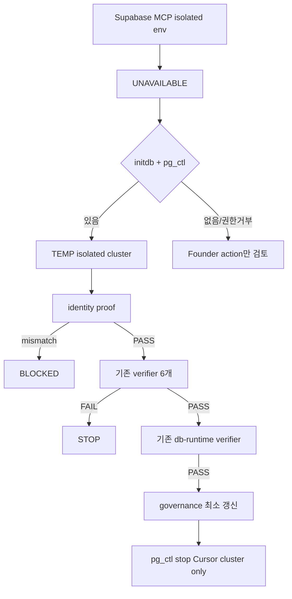

# PUTDUK isolated local Postgres cluster + SourceObservation DB runtime proof

기존 플랜 승인 + FINAL CORRECTION.

```text
FOUNDER_PASSWORD_INPUT_REQUIRED = NO   # first choice
EXISTING_PG_5432_SERVICE = DO_NOT_TOUCH
SECRET_STORED_IN_REPO = NO
SECRET_PRINTED_IN_REPORT = NO
```

## 이미 확인한 사실 (plan-mode, read-only)

**Git**

- HEAD = `0345206ad2e7238658454db5d072c8fbf93dbb37`
- worktree DIRTY
- commit / push / stash / reset / restore / clean 금지

**Production Supabase (MCP, write 0)**

- 연결 대상 = `https://mgsytcetsiecllmhcyox.supabase.co`
- isolated preview 생성 불가 (`confirm_cost` 없음, `apply_migration`은 production 고정)
- production에 `source_observations` 없음 → 유지
- classifier를 풀어 `supabase.co`를 받는 변경 금지

```text
SUPABASE_MCP_SAFE_ENV_CREATION = UNAVAILABLE
```

**기존 verifier safety gate — 유지**

[`tooling/verify/source-observation-db-runtime.cjs`](tooling/verify/source-observation-db-runtime.cjs) `classifySafeTarget` + [`repository.postgres.cjs`](services/market-intelligence/src/source-observation/repository.postgres.cjs) `classifyDurableDatabaseUrl` 은 다음을 거부한다.

- `mgsytcetsiecllmhcyox` / `supabase.co`
- localhost가 아닌 host
- DB 이름 `postgres` / `template0` / `template1`

Cursor-created cluster는 `localhost` + `putduk_sourceobs_test` + 비-5432 URL이면 이 gate를 통과한다. URL의 port는 기존 verifier가 파싱한다. classifier 수정 불필요.

**PostgreSQL 18 binaries (확인됨)**

- `C:\Program Files\PostgreSQL\18\bin\initdb.exe` = 있음
- `pg_ctl.exe` / `createdb.exe` / `psql.exe` / `createuser.exe` / `pg_isready.exe` = 있음
- 기존 service `postgresql-x64-18` = Running on `:5432` → **사용하지 않음, 변경하지 않음**

기존 `:5432`에 대해 금지:

```text
password reset
pg_hba modification
service restart / stop
database / role creation
config modification
```



## 실행 우선순위

1. Cursor-created isolated local PostgreSQL cluster (`initdb` + `pg_ctl`)
2. 이미 존재하고 **안전하게 credential resolve 가능한** dedicated test cluster (이번 세션에서는 해당 없음)
3. 둘 다 불가할 때만 Founder action 검토

기존 `localhost:5432` superuser 비밀번호를 Founder에게 묻는 것은 first choice가 아니다.

Founder 질문은 다음만:

```text
initdb/pg_ctl 없음
OS permission으로 isolated cluster 생성 불가
UAC/Windows 보안처럼 Founder 본인 조작이 실제 필수
```

## 실행 경로

새 matcher / repository / migration / CanonicalProduct DB를 만들지 않는다. cluster bootstrap은 **세션 PowerShell + 기존 18 binaries**로 한다. repo 안 새 스크립트/새 verifier는 만들지 않는다.

### 1. Git safety

```bash
git rev-parse HEAD
git status --short
git diff --name-only
```

worktree를 정리하지 않는다. production MCP write 0.

### 2. Isolated disposable cluster

`%TEMP%\putduk-sourceobs-pg-<unique-id>\` 에만 data directory 생성.

- repo / git tracked path 금지
- 기존 `C:\Program Files\PostgreSQL\18\data` 재사용 금지

강한 random password는 Cursor가 runtime에서 생성한다.

- `--pwfile`은 TEMP cluster dir 안의 임시 파일만 사용하고 initdb 후 삭제
- 채팅 / 최종 보고서 / git에 password·URL 출력 금지
- `.env` 수정 금지

localhost의 **free high port**를 먼저 확인한 뒤 사용한다. `55432`는 예시일 뿐, 충돌하면 다른 high port.

시작은 새 data dir만:

```text
pg_ctl start -D <TEMP cluster> -o "-p <dedicated-port> -c listen_addresses=localhost"
```

```text
listen_addresses = localhost only
remote listening = NO
```

기존 Windows service는 start/stop/reload 하지 않는다.

### 3. Safe target + identity

새 cluster에서만:

```sql
CREATE DATABASE putduk_sourceobs_test;
```

권장: 전용 LOGIN role을 이 cluster 안에 만들고 DB owner로 둔다. cluster superuser를 기존 `:5432`의 `postgres`와 공유하지 않는다.

migration SQL이 `anon` / `authenticated` / `service_role`을 참조하면 **이 isolated cluster 안에서만** NOLOGIN stub 생성.

```text
LOCAL_SUPABASE_ROLE_STUBS = MIGRATION_COMPATIBILITY_ONLY
SUPABASE_ROLE_RUNTIME_PARITY = NOT_VERIFIED
```

process-scoped:

```text
SOURCE_OBSERVATION_SAFE_DATABASE_URL=postgresql://<user>:<password>@localhost:<dedicated-port>/putduk_sourceobs_test
```

production `DATABASE_URL` fallback 금지.

write 전 identity:

```sql
select current_database();
select current_user;
select inet_server_addr();
select inet_server_port();
select version();
show data_directory;
```

모두 맞을 때만 진행:

```text
current_database = putduk_sourceobs_test
host = localhost
port = Cursor-created dedicated port
data_directory = Cursor-created PUTDUK TEMP directory
PostgreSQL = 18

SAFE_DB_ENVIRONMENT = FOUND
SAFE_DB_KIND = CURSOR_CREATED_ISOLATED_LOCAL_POSTGRES
DEDICATED_CLUSTER_IDENTITY = PASS
DB_IS_PRODUCTION = NO
```

불일치면 STOP. 기존 `:5432`로 fallback 금지.

### 4. Previous runtime gate

write 전, 모두 PASS. FAIL 시 core 수정 없이 STOP.

```bash
node tooling/verify/source-observation-runtime.cjs
node tooling/verify/identity-matching-v1.cjs
node tooling/verify/identity-matching-v2.cjs
node services/market-intelligence/src/identity-matching/v2/live-automated-cross-source-match.cjs
node tooling/verify/canonical-product.cjs
node tooling/verify/source-observation-durable-persistence.cjs
```

이 시점 governance는 아직 `OBSERVATION_DB_RUNTIME = BLOCKED_NO_SAFE_DB`.

### 5. 기존 DB runtime verifier

```bash
node tooling/verify/source-observation-db-runtime.cjs
```

이미 수행하는 것:

- Process A: live TCG `113669` + eBay `377416817781` → durable write → idempotent / conflict / history → `repository.end()` + process exit
- Process B: fresh Node / pg / repository → DB-read only → V2 `MATCH` / `COMPOSITE_STRONG` / `trading_card` → in-memory CanonicalProduct
- 기존 migration 파일 그대로 apply (내용 완화 금지)
- UPDATE / DELETE / TRUNCATE = 0
- pg = `services/api-nest/node_modules/pg` resolve only
- RLS: schema enabled + application enforcement `NOT_VERIFIED` (정책 완화 금지)

### 6. Governance — proof PASS 후만

`OBSERVATION_DB_RUNTIME`은 environment-neutral runtime 의미(`BLOCKED_NO_SAFE_DB`와 `PRODUCTION_OBSERVATION_PERSISTENCE`가 분리됨).

[`governance/global-product/source-observation-runtime.v1.json`](governance/global-product/source-observation-runtime.v1.json)

- `OBSERVATION_DB_RUNTIME` = `PASS`
- `DURABLE_DB_RUNTIME_VERIFIED_ENVIRONMENT` = `CURSOR_CREATED_LOCAL_TEST_POSTGRES`
- `PRODUCTION_OBSERVATION_PERSISTENCE` = `NOT_IMPLEMENTED`
- `remoteWrite` = false
- `supabaseMigrationApplied` = false
- `REMOTE_SUPABASE_RUNTIME_VERIFICATION` = `NOT_VERIFIED`

[`services/market-intelligence/src/source-observation/contract.cjs`](services/market-intelligence/src/source-observation/contract.cjs) `PERSISTENCE_VERDICT.OBSERVATION_DB_RUNTIME` = `PASS`

고정 assertion만:

- [`tooling/verify/source-observation-runtime.cjs`](tooling/verify/source-observation-runtime.cjs)
- [`tooling/verify/source-observation-durable-persistence.cjs`](tooling/verify/source-observation-durable-persistence.cjs)

**금지:** [`tooling/verify/fixtures/migrations-applied.v1.json`](tooling/verify/fixtures/migrations-applied.v1.json)

### 7. Cluster lifecycle

proof + bounded regression 완료 후 **Cursor-created cluster만**:

```text
pg_ctl stop -D <TEMP cluster>
```

기존 `postgresql-x64-18`는 그대로 둔다.

data dir ownership이 `%TEMP%\putduk-sourceobs-pg-*` 로 명확하면 삭제 가능. 불명확하면 삭제하지 않고 STOP 상태로 남긴다. unrelated PG/사용자 데이터 삭제 금지.

### 8. Bounded regression 후 STOP

```bash
node tooling/verify/source-observation-runtime.cjs
node tooling/verify/identity-matching-v1.cjs
node tooling/verify/identity-matching-v2.cjs
node services/market-intelligence/src/identity-matching/v2/live-automated-cross-source-match.cjs
node tooling/verify/canonical-product.cjs
node tooling/verify/source-observation-durable-persistence.cjs
node tooling/verify/source-observation-db-runtime.cjs
```

Playwright E2E / monorepo full test / 서버 다중 기동 = 0.

다음 slice 자동 착수 금지.

## 허용 파일 변경 (proof PASS 후만)

- [`governance/global-product/source-observation-runtime.v1.json`](governance/global-product/source-observation-runtime.v1.json)
- [`services/market-intelligence/src/source-observation/contract.cjs`](services/market-intelligence/src/source-observation/contract.cjs)
- [`tooling/verify/source-observation-runtime.cjs`](tooling/verify/source-observation-runtime.cjs)
- [`tooling/verify/source-observation-durable-persistence.cjs`](tooling/verify/source-observation-durable-persistence.cjs)

그 외 application source / migration / `.env` / 기존 PG service config 변경 없음.

## 최종 invariant

```text
SAFE_DB_KIND = CURSOR_CREATED_ISOLATED_LOCAL_POSTGRES
DURABLE_DB_RUNTIME_VERIFIED_ENVIRONMENT = CURSOR_CREATED_LOCAL_TEST_POSTGRES
EXISTING_PG_5432_TOUCHED = NO
FOUNDER_PASSWORD_INPUT_REQUIRED = NO
PRODUCTION_DB_WRITE_ATTEMPTED = NO
PRODUCTION_MIGRATION_APPLIED = NO
PRODUCTION_SCHEMA_CHANGED = NO
SECRET_EXPOSED_IN_REPORT = NO
COMMIT_PUSH_STASH_RESTORE = NO
PRODUCTION_OBSERVATION_PERSISTENCE = NOT_IMPLEMENTED
```
