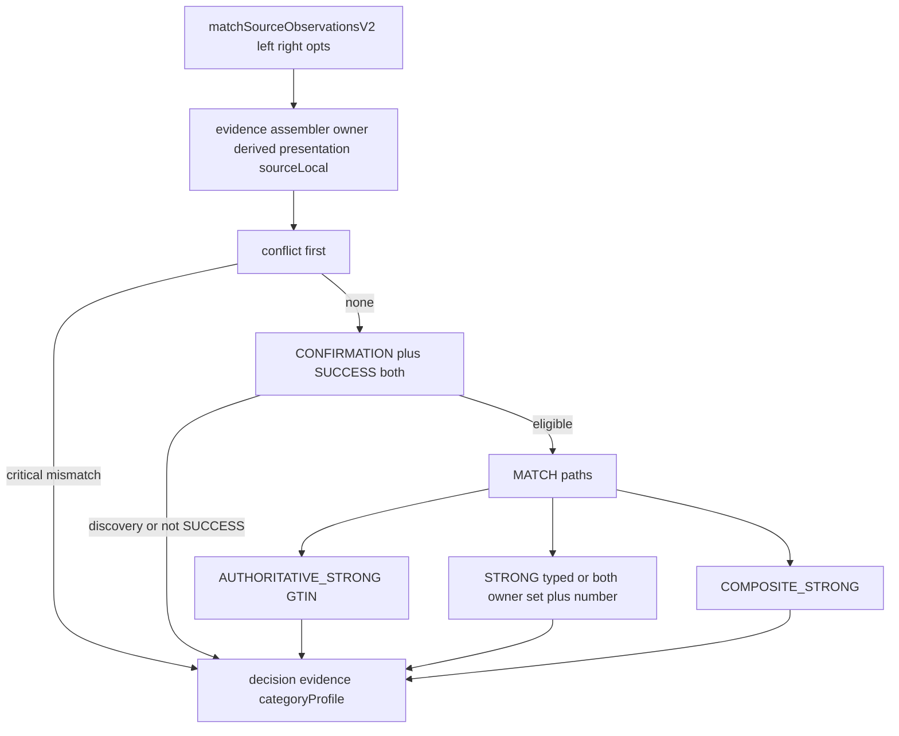

# PUTDUK Matching V2 Minimal Pairwise Runtime

## 현재 상태 (read-only 확인 완료)

- HEAD = `0345206ad2e7238658454db5d072c8fbf93dbb37` — 지정 커밋과 일치
- Worktree = DIRTY (정상). Spark Dash UI, SourceObservation, V1 identity-matching(untracked), `package.json` / `CATALOG.md` / `domain-by-path.cjs` / `stubs/run-all.cjs` 등 타 세션 변경이 이미 있음
- 이번 slice는 **신규 additive 파일만**. dirty 글로벌 verifier 훅 4파일은 DEFER. 타 dirty 파일 정리·복원·커밋 금지

Founder 실행 보정 4개 (설계 재개 없음):

- CORRECTION_1 — `opts.imageCorroboration`는 `allowSyntheticImageEvidence === true`일 때만 증거. 실제 runtime boolean MATCH 금지. Fixture A는 양쪽 owner-backed category/game으로 독립 증거
- CORRECTION_2 — set 닫힌 사전(`generations`) 금지. owner-backed 값을 앵커로 반대쪽 title에서 exact normalized phrase 탐색
- CORRECTION_3 — 다음 slice `V2_REAL_PAIR_IDENTITY_MATCH` ≠ `REAL_AUTOMATED_CROSS_SOURCE_MATCH`. TCG automated observation은 여전히 NOT_IMPLEMENTED
- CORRECTION_4 — `package.json` / `CATALOG.md` / `domain-by-path.cjs` / `stubs/run-all.cjs` 훅 배선 DEFER. 검증은 `node tooling/verify/identity-matching-v2.cjs` + `pnpm verify:identity-matching-v1`

최고 authority:

- [governance/global-product/identity-matching.v2.json](governance/global-product/identity-matching.v2.json)
- [governance/global-product/canonical-product.v2.json](governance/global-product/canonical-product.v2.json) — 설계 계약만. persistence/allocator 구현 0

V1 동결:

- [services/market-intelligence/src/identity-matching/matcher.cjs](services/market-intelligence/src/identity-matching/matcher.cjs)
- [services/market-intelligence/src/identity-matching/normalize.cjs](services/market-intelligence/src/identity-matching/normalize.cjs)
- [services/market-intelligence/src/identity-matching/index.cjs](services/market-intelligence/src/identity-matching/index.cjs)
- [services/market-intelligence/src/identity-matching/fixtures/cases.cjs](services/market-intelligence/src/identity-matching/fixtures/cases.cjs)
- [tooling/verify/identity-matching-v1.cjs](tooling/verify/identity-matching-v1.cjs)

V1은 `require`만 한다. `decide()` / `matchSourceObservations`를 V2 결정 파이프에 넣지 않는다 (V1 fashion `brand+model+size+color` MATCH가 V2로 새지 않게).

읽기 전용 재사용 (수정 0):

- `matchingDecisionEligible`
- `extractTypedIdentifiers` / `validGtin` / `normalizeText` / `normalizeIdentifierValue` / `asString`

`finalTruthEligible` 문자열은 V1 파일에 넣으면 V1 verifier가 FAIL한다. **V2 디렉터리에만** `finalTruthEligible: false`를 둔다.

## 아키텍처



이 결과는 `matchingDecisionEligible`까지만. CanonicalProduct / Listing / Opportunity 연결 0.

## 파일 계획 (최소)

신규만:

- [services/market-intelligence/src/identity-matching/v2/index.cjs](services/market-intelligence/src/identity-matching/v2/index.cjs) — `matchSourceObservationsV2` export
- [services/market-intelligence/src/identity-matching/v2/matcher.cjs](services/market-intelligence/src/identity-matching/v2/matcher.cjs) — entry + conflict-first `decide` + constants
- [services/market-intelligence/src/identity-matching/v2/evidence.cjs](services/market-intelligence/src/identity-matching/v2/evidence.cjs) — owner/derived/provenanceFamily assembler + deterministic extractors
- [services/market-intelligence/src/identity-matching/v2/profiles.cjs](services/market-intelligence/src/identity-matching/v2/profiles.cjs) — category profiles
- [services/market-intelligence/src/identity-matching/v2/fixtures.cjs](services/market-intelligence/src/identity-matching/v2/fixtures.cjs) — A–K
- [tooling/verify/identity-matching-v2.cjs](tooling/verify/identity-matching-v2.cjs)

건드리지 않음:

- V1 matcher/normalize/contract/index/profiles/fixtures/verifier
- [services/market-intelligence/src/index.cjs](services/market-intelligence/src/index.cjs) (이미 dirty, V1도 여기 export 안 함)
- [services/market-intelligence/package.json](services/market-intelligence/package.json)
- parsers, Opportunity, Home, `/profits`, DB, `card-match.cjs` / `ebay-identity-match.cjs` (Asset Master 레이어 — V2 owner 아님)

VERIFY_HOOK_WIRING = DEFER_IF_TARGET_FILE_ALREADY_DIRTY.

이번 slice에서 수정하지 않음:

- [package.json](package.json)
- [tooling/verify/CATALOG.md](tooling/verify/CATALOG.md)
- [tooling/verify/domain-by-path.cjs](tooling/verify/domain-by-path.cjs)
- [tooling/verify/stubs/run-all.cjs](tooling/verify/stubs/run-all.cjs)

거버넌스 상태만 갱신 ([identity-matching.v2.json](governance/global-product/identity-matching.v2.json), untracked):

- `runtime`: `IN_PROCESS_PAIRWISE`
- `persistence.IDENTITY_MATCHING_V2_MEMORY_RUNTIME`: `IN_PROCESS_PAIRWISE`
- `IDENTITY_MATCHING_V2_DB_RUNTIME` / listingPromotion / opportunity는 `NOT_IMPLEMENTED` 유지
- [canonical-product.v2.json](governance/global-product/canonical-product.v2.json) 수정 0

## Entrypoint / 반환

```js
matchSourceObservationsV2(leftObservation, rightObservation, opts?)
```

`opts.now` — 없으면 평가 시각은 넣되 결정에는 미사용.

이미지:

- 실제 runtime — `opts.imageCorroboration`를 MATCH 근거로 사용 금지
- fixture/verifier만 — `opts.allowSyntheticImageEvidence === true`일 때 synthetic image를 독립 증거 후보로 허용. image-only는 그래도 MATCH 금지
- Vision API 0. 첫 REAL PAIR는 양쪽 owner-backed category/game으로 독립 증거

최소 반환:

- `decision`: MATCH | NO_MATCH | INSUFFICIENT_EVIDENCE | CONFLICT
- `matcherVersion`: `identity-matching.v2`
- `categoryProfile`
- `evidence[]`
- `matchingDecisionEligible`
- `finalTruthEligible`: 항상 `false`
- 내부 설명용: `conflicts[]`, `matchPath` (`AUTHORITATIVE_STRONG` | `STRONG` | `COMPOSITE_STRONG` | null), `evaluatedAt`

## Evidence / provenance

아이템은 V1 pairwise row를 확장한 최소 shape:

- `field`, `left`/`right` `{ value, normalizedValue, evidenceOwner, derivedFrom, extractor, provenanceFamily, source, observationId }`
- `comparison`, `strength`

owner vocabulary (런타임 상수):

- `OWNER_BACKED_STRUCTURED` — source structured / `identityHints` 명시 필드. title에서 승격 금지
- `DERIVED_STRUCTURED` — deterministic extractor. `derivedFrom = title`. 단독 MATCH 금지. 양쪽 모두 derived-only MATCH 금지
- `PRESENTATION_ONLY` — 자유 title 토큰. MATCH owner 금지

provenanceFamily (독립 증거 카운트 단위):

- title에서 뽑은 game / character / set / cardNumber → 전부 `title` (관측 1개당 가족 1개)
- owner structured field → `structured:<field>` (예: `structured.set`)
- image mock → `image` (fixture-only, `allowSyntheticImageEvidence`)
- Fashionphile sku / epid / externalItemId / sku-derived barcode → `source_local` — manufacturer id로 비교 금지

`INDEPENDENT_EVIDENCE_REQUIRED = YES`. 같은 title family 4속성을 독립 4개로 세지 않음 (Fixture H).

strength (스칼라 confidence 0):

- `AUTHORITATIVE_STRONG` — GTIN exact, 양쪽 OWNER_BACKED
- `STRONG` — brand+MPN / brand+WATCH_REFERENCE / 양쪽 OWNER_BACKED set+cardNumber
- `COMPOSITE_STRONG` — 아래 composite 전항
- `CORROBORATING` / `CONFLICTING` / `NOT_COMPARABLE` / `PRESENTATION_ONLY`

## Extractors (owner-anchored, 닫힌 set 사전 0)

한쪽 OWNER_BACKED `set` / `cardNumber` / `game` / `character` / `manufacturerStyleCode`를 앵커로,
반대쪽 title에서 exact normalized phrase를 찾으면 `DERIVED_STRUCTURED` (`derivedFrom = title`, `extractor = owner_anchored_exact_phrase`).

- set 사전 하드코딩 금지 (`Generations` / `Lost Origin` 목록 없음)
- cardNumber 슬래시 패턴은 앵커 없을 때 conflict 탐지용 generic DERIVED만 허용
- character/game title 히트는 agree 체크. 독립 증거는 양쪽 OWNER_BACKED category 또는 game

sneakers style code: `/\b[A-Z]{2}\d{4}-\d{3}\b/i` (예 `DD1391-100`). `identityHints.style === "Sneaker"` 는 style code가 아님.

watch: title에서 reference 추출 0. Chrono24 `WATCH_REFERENCE` ≠ eBay `MPN` (타입 교차 equality 금지). raw `modelNumber` 문자열 MATCH 금지.

luxury_bag: 자유 title = PRESENTATION_ONLY. Fashionphile sku / sku-derived barcode = SOURCE_LOCAL_ONLY.

price (`nativeAmount` 등)는 assemble/decide에 넣지 않음.

## Category profile 범위

- **trading_card = 완전**: identity 키 = set + cardNumber. game/character/category는 agree. language/finish는 양쪽 있고 다르면 CONFLICT. grade는 variant로 무시. size 해당 없음
- **sneakers = fixture 통과 skeleton**: manufacturerStyleCode mismatch = CONFLICT. size는 canonical split 아님 (US9 vs 없음 → CONFLICT 아님). Style=Sneaker → MPN 금지
- **watch = skeleton**: 공유 typed path만 (brand + WATCH_REFERENCE). 획득(acquisition) 문제 미해결
- **luxury_bag = skeleton**: V1 fashion corroborating을 MATCH owner로 승격하지 않음. Fixture F만 보장

profile은 owner-backed `categoryHint` / `identityHints.categoryProfile`만. title로 profile 추론 금지. 양쪽 profile이 명시되고 다르면 category conflict.

## Decide 순서 (conflict first)

1. 양쪽 evidence assemble
2. critical conflict → `CONFLICT` (이미지/title이 override 못 함)
   - cardNumber `11/83` vs `12/83`
   - styleCode `DD1391-100` vs `DD1503-101`
   - GTIN exact + MPN mismatch
   - 명시 brand/category 충돌 + 동일 derived identifier (Fixture G)
3. `matchingDecisionEligible` false (DISCOVERY 포함) → MATCH 금지, 보통 `INSUFFICIENT_EVIDENCE`
4. MATCH path (eligible일 때만)
   - AUTHORITATIVE_STRONG
   - STRONG (typed 또는 양쪽 OWNER_BACKED set+cardNumber) — Fixture J
   - COMPOSITE_STRONG 전항: 한쪽 OWNER_BACKED exact + 다른 쪽 같은 값 DERIVED exact + brand/character/category agree + 독립 증거 1개(양쪽 OWNER_BACKED category 또는 game. synthetic image는 fixture 플래그일 때만) + no conflict + eligible
5. title-only / image-only / derived-only / source-local only → `INSUFFICIENT_EVIDENCE`
6. source-local vs typed manufacturer id → `NOT_COMPARABLE`, MATCH 아님 (Fixture F)

`discoverCandidates`는 source-observation contract에 `NOT_IMPLEMENTED`로 유지. V2에 candidate generation 추가 금지.

## Fixture A–K

V1 `obs()` 패턴을 v2 fixtures에서 복제 (V1 `cases.cjs` 수정 0).

- **A** MATCH — TCG OWNER_BACKED set+number vs eBay title-derived(owner-anchored) 동일값 + 양쪽 OWNER_BACKED category/game + CONFIRMATION/SUCCESS. image 플래그 없음
- **B** INSUFFICIENT — title-derived only
- **C** INSUFFICIENT — image only (URL 동일 또는 `imageCorroboration: true`만)
- **D** CONFLICT — trading_card 11/83 vs 12/83
- **E** CONFLICT — sneakers DD1391-100 vs DD1503-101
- **F** INSUFFICIENT — Fashionphile sku vs 같은 문자열 eBay MPN, evidence `NOT_COMPARABLE`
- **G** CONFLICT 또는 non-MATCH — derived identifier exact + brand/category conflict
- **H** INSUFFICIENT — 한 title에서 4속성 추출, independent count ≠ 4. verifier가 provenanceFamily 중복 계산을 직접 assert
- **I** INSUFFICIENT — DISCOVERY + CONFIRMATION, 강한 structured여도 MATCH 금지, `matchingDecisionEligible === false`
- **J** MATCH — 양쪽 OWNER_BACKED set+cardNumber
- **K** CONFLICT — GTIN exact + typed MPN mismatch

## Verifier

[tooling/verify/identity-matching-v2.cjs](tooling/verify/identity-matching-v2.cjs)가 판정:

- V2_RUNTIME_FOUNDATION — entry, version, `finalTruthEligible === false`, `opts.now` 결정 비의존, 동일 입력 JSON 동일
- DERIVED_STRUCTURED / PROVENANCE_FAMILY / COMPOSITE_MATCH / CONFLICT_FIRST
- TITLE_ONLY_BLOCK / IMAGE_ONLY_BLOCK / SOURCE_LOCAL_ID_BLOCK / DISCOVERY_MATCH_BLOCK
- PRICE_IDENTITY_BLOCK — V2 소스에 decide용 `nativeAmount` / FX / profit 계산 없음
- V1_REGRESSION — `spawnSync`로 `identity-matching-v1.cjs` PASS (fixture A–P 결정 불변)
- static: `Math.random` / llm / openai 0, `discoverCandidates` 여전히 NOT_IMPLEMENTED, V2가 `card-match` / `ebay-identity-match`를 MATCH owner로 require하지 않음
- 글로벌 verify 훅 배선 요구 없음 (dirty 파일 DEFER)

검증 명령 (full suite 금지):

```bash
pnpm verify:identity-matching-v1
node tooling/verify/identity-matching-v2.cjs
```

다음 단계 명칭:

- `V2_REAL_PAIR_IDENTITY_MATCH` — 다음 slice
- `TCGPLAYER_AUTOMATED_SOURCE_OBSERVATION` — NOT_IMPLEMENTED
- `REAL_AUTOMATED_CROSS_SOURCE_MATCH` — BLOCKED_UNTIL_SOURCE_RUNTIME

## Git / stop

금지: commit, push, stash, restore, reset, clean, checkout overwrite, force, unrelated cleanup.

STOP 후 보고: V1 수정 없이 불가능, title/image-only MATCH 필요, price identity 필요, source-local을 manufacturer id로 써야 함, dirty 파일의 무관 hunk 수정 필요, DB/parser/Opportunity 필요.

성공 시 보고 형식은 사용자 섹션 32 그대로. `READY_FOR_ONE_REAL_PAIR_VALIDATION = YES`는 trading_card composite + owner-anchored derivation이 TCG OWNER_BACKED ↔ eBay title DERIVED geometry를 fixture로 통과할 때. 이것은 automated source pipeline PASS가 아니다.

다음 slice: `PUTDUK_IDENTITY_MATCHING_V2_ONE_REAL_PAIR_VALIDATION` (bounded pair 1쌍 · TCG parser 구현 0).
