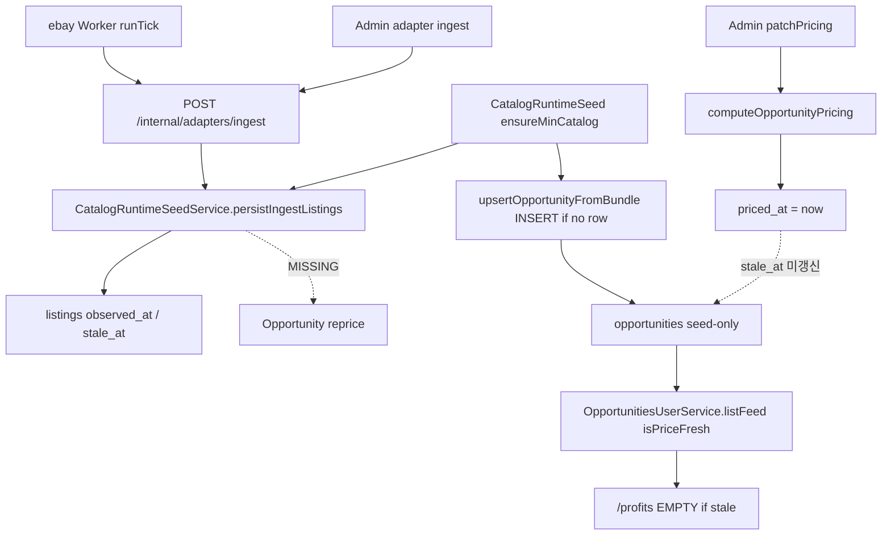

# PUTDUK Opportunity Reprice / Freshness Lifecycle

## 0. Git Safety (read-only 확인됨)

- Branch: `main`
- HEAD: `0345206ad2e7238658454db5d072c8fbf93dbb37`
- Dirty tree: **YES** (이전 `/profits` · Home freeze 작업 잔여)
- 이번 작업: **commit / push / stash / reset / restore 금지**. 관련 파일만 수정.

레거시 `00`~`06` plan은 실행 큐가 아니다. `CURRENT_ACTIVE_PLAN = YES` 플랜이 아직 없으므로, 구현 시작 시 워크스페이스에만 새 플랜을 만든다.

- [`.cursor/plans/ai_profit_os_opportunity_reprice_freshness.plan.md`](.cursor/plans/ai_profit_os_opportunity_reprice_freshness.plan.md)
- `CURRENT_ACTIVE_PLAN = YES`
- todo 1개: listing update → Opportunity reprice/freshness canonical lifecycle 완성

Founder 판정: `PLAN_DIRECTION = PASS` · `IMPLEMENTATION_READY = YES` (아래 보정 흡수 후).

## 1. Forensic Decision

**B + D + E** (주판정 **B**). 구현 게이트 통과 → **MINIMAL LIFECYCLE REPAIR**.

| Code | Evidence |
|------|----------|
| **B** | [`computeOpportunityPricing`](services/market-intelligence/src/pricing-formula.cjs) 존재. eBay/Admin ingest는 [`persistIngestListings`](services/api-nest/src/opportunities/catalog-runtime-seed.service.ts)까지 도달하나 Opportunity UPDATE 없음. |
| **D** | Writer(seed/listing)는 `staleAt = observedAt + 300` (EXPIRY/CACHE_HINT). Reader(Engine/feed)는 `age = now - staleAt <= 3` (AS-OF). **opportunity writer는 전부 AS-OF로 통일한다.** listing writer 300s는 유지. |
| **E** | `public.opportunities` INSERT는 [`upsertOpportunityFromBundle`](services/api-nest/src/opportunities/catalog-runtime-seed.service.ts)뿐. 기존 row면 skip. |

A(잡만 안 돎) 아님 — reprice 심볼/잡 없음. C(compute 자체 없음) 아님. G 아님.

이전 `/profits` forensic([`_tmp_spark_dash_refs/profits-freshness-forensic.json`](_tmp_spark_dash_refs/profits-freshness-forensic.json))도 **B**였고, 그 task는 wiring 신설을 architecture로 막아 두었다. 이번 task가 그 wiring을 완성한다.

## 2. Canonical Lifecycle (현재)



끊긴 곳: **listing persist 성공 → Opportunity compute/persist**. 추가 결함: **seed가 opportunity.stale_at에 listing expiry(+300s)를 복사**해 Engine 3초 계약을 우회함.

### A1. Opportunity 생성 owner

[`CatalogRuntimeSeedService.upsertOpportunityFromBundle`](services/api-nest/src/opportunities/catalog-runtime-seed.service.ts) only. provider-driven create 없음. DB: `w_rolex_sub_126610ln` listing 3건(2026-08-11) / opportunity 0.

이번 task는 **기존 Opportunity reprice**만 완성. 새 INSERT/promotion rule은 만들지 않음 (`MULTI_SOURCE_OPPORTUNITY_CREATION = NOT_IMPLEMENTED`).

### A2. Pricing owner

[`computeOpportunityPricing`](services/market-intelligence/src/pricing-formula.cjs) — expectedProfit, requiredCapital(입력 또는 buy), margin, fees, compareReady. FX KRW = 기존 [`approxKrwFromSnapshot`](services/market-intelligence/src/fx-snapshot-formula.cjs). duration = seed 상수 12, 재계산 없음. Frontend 재계산 없음.

### A3. Listing → Opportunity dependency

FK 없음. 관계 = `opportunity.asset_id` + `pricing.buyMarketId` / `sellMarketId`. 6개 seed opp 전부 `ebay_us` → `ebay_gb`. listing id 저장 없음.

### A4. Recompute trigger

ingest hook / queue / cron / DB trigger **없음**. Admin [`patchPricing`](services/api-nest/src/opportunities/opportunities.admin.service.ts)만 on-demand compute. In-process bus `opportunity.price.updated`는 emit만.

### A5. Timestamp semantics (이름 말고 사용처)

| Field | 현재 | 수리 후 |
|-------|------|---------|
| `listing.observed_at` | AS_OF | **유지** |
| `listing.stale_at` | EXPIRY / CACHE_HINT (`+300s`) | **유지** |
| `opportunity.priced_at` | AS_OF | **유지** (실제 compute timestamp) |
| `opportunity.stale_at` | seed writer=EXPIRY, reader=AS_OF | **모든 legitimate writer = AS_OF** (`=== priced_at`) |

### A6 / A7. Participate / publish

- Participate + user feed: [`settlement_rule.isPriceFresh`](services/engine-rust/settlement_rule.cjs) · `DEFAULT_PRICE_STALE_MAX_SEC = 3` **변경 금지**
- Feed SQL: `status=available` ∧ `compareReady` ∧ image ∧ arbitrageTypeKo, 그 다음 `isRowFresh`
- listing-leg: ebay \| admin 유지. Yahoo/parser 0

## 3. 구현하지 않는 것 (STOP 회피)

- 새 profit/FX/Money/Ledger formula 없음
- listing-leg 확장 없음
- seed를 freshness worker로 바꾸지 않음 (`ensureMinCatalog` skip 유지, 기존 row refresh 0)
- 새 Opportunity INSERT/promotion rule 없음 (Rolex 같은 listing-only asset은 no-op)
- 새 Kafka/Redis/Bull/cron 없음
- Home / `/profits` visual 0
- 원격 DB에 검증용 임의 write 금지. proof는 mock/selftest. Next+Nest 동시 기동 불가면 `REAL_RUNTIME_E2E = BLOCKED_LOCAL_RESOURCE`

## 4. Freshness write — opportunity writer 전부 AS-OF 통일

Engine/feed가 **named canonical consumer**. opportunity.stale_at에 expiry(`pricedAt + 300s`)를 쓰면 Engine이 약 5분간 fresh로 읽음 = **3→300 우회 = 금지**.

같은 컬럼에 writer별 의미를 남기지 않는다.

| Writer | listing.stale_at | opportunity.priced_at | opportunity.stale_at |
|--------|------------------|----------------------|----------------------|
| eBay/Admin listing persist | `observedAt + 300s` 유지 | (해당 없음) | (해당 없음) |
| Canonical reprice 성공 | 유지 | compute as-of | **같은 as-of** |
| Admin compute 성공 | 유지 | compute as-of | **같은 as-of** |
| Seed **신규** Opportunity INSERT | listing은 +300s 유지 | compute/observed as-of | **같은 as-of** (`=== priced_at`) |

- 단독 `UPDATE stale_at = now()` 금지
- 실패/모호/admin-override skip → freshness 갱신 0
- seed 반복 실행 · 기존 row overwrite · skip contract 제거 **금지**
- 이 변경은 freshness 확대가 아니라 **신규 row의 semantic bug fix**

대상: [`catalog-runtime-seed.cjs`](services/market-intelligence/src/catalog-runtime-seed.cjs) `buildRuntimeSeedBundleForAsset`가 지금 `staleAt: buyListing.staleAt`으로 expiry를 복사함 → `staleAt: pricedAt` (observedAt / compute as-of).

## 5. Reprice rule (새 선택 공식 없음)

기존 pair만 재사용. “가장 싼 listing” 같은 신규 규칙 금지.

[`pipeline.cjs`](services/market-intelligence/src/pipeline.cjs)에 순수 resolver 추가:

`resolveStoredLegListingPrices({ listings, buyMarketId, sellMarketId })`

- 해당 market listing이 **정확히 1건씩**일 때만 `{ ok, buyPriceUsdt, sellPriceUsdt }`
- 0건 또는 2건+ → `{ ok: false }` fail-closed

DB 근거: seed 6 asset는 market당 listing 1건. Rolex ingest는 같은 `ebay_us`에 $160 / $14995 / $15785 3건 — 임의 last-write-wins는 business truth를 깨므로 **실패로 둔다**.

`useAdminOverride === true`면 listing-driven reprice skip.

requiredCapital / duration / fx_snapshot_id는 기존 row 유지 (`patchPricing`과 동일).

## 6. Canonical Reprice Owner

`OpportunitiesAdminService`는 Admin HTTP/use-case 서비스다 (`patchPricing`, list, seed helpers, image queue). listing ingest runtime이 여기에 영구 의존하면 미래 multi-source의 중앙 owner가 Admin이 된다. **새 Pricing Engine은 만들지 않는다.**

구현 시작 시 한 번 더 확인한 뒤:

- AdminService가 이미 전 domain persist owner라는 증거가 있으면 분리하지 않음
- 아니면 최소 orchestration owner를 분리: `OpportunityRepriceService`

역할은 오직:

```
current listings resolve
→ computeOpportunityPricing
→ existing FX/pricing persist rules
→ opportunity persist (priced_at = stale_at = as-of)
```

Admin `patchPricing`과 listing ingest가 **같은 owner**를 호출한다.

Trigger (최소, batch 완료 후):

```
persistIngestListings
→ 모든 listing persist 완료
→ unique assetIds
→ canonicalRepriceOwner.repriceFromCurrentListings(assetIds)
```

- seed 최초: persist 시점엔 opp 없음 → no-op, 이후 INSERT (AS-OF stale_at). seed가 worker가 되지 않음
- ingest 파일에 formula 복제 금지
- listing 1건마다 reprice 금지 (다른 leg가 아직 없을 수 있음)

실패: listing은 이미 진실. reprice 실패 시 opportunity는 이전 stale 유지. fake success 0.

Idempotency: listing upsert key = `asset_id + market_id + external_item_id` (기존). opportunity는 UPDATE only, `pricing_version++`, `FOR UPDATE`. replay = 재계산이지 중복 INSERT 아님.

## 7. 파일 (예상)

- [`services/market-intelligence/src/pipeline.cjs`](services/market-intelligence/src/pipeline.cjs) — resolver
- [`services/market-intelligence/src/catalog-runtime-seed.cjs`](services/market-intelligence/src/catalog-runtime-seed.cjs) — 신규 opp `staleAt = pricedAt`
- [`services/market-intelligence/src/index.d.ts`](services/market-intelligence/src/index.d.ts) + [`opportunities.mi.ts`](services/api-nest/src/opportunities/opportunities.mi.ts) — re-export
- `OpportunityRepriceService` (AdminService가 domain owner가 아닐 때) 또는 AdminService 재사용
- [`services/api-nest/src/opportunities/opportunities.admin.service.ts`](services/api-nest/src/opportunities/opportunities.admin.service.ts) — patchPricing이 같은 persist/as-of 규칙 사용
- [`services/api-nest/src/opportunities/catalog-runtime-seed.service.ts`](services/api-nest/src/opportunities/catalog-runtime-seed.service.ts) — post-persist 호출
- [`services/api-nest/src/opportunities/opportunities.module.ts`](services/api-nest/src/opportunities/opportunities.module.ts) — provider 등록 (분리 시)
- [`tooling/verify/catalog-runtime-seed.cjs`](tooling/verify/catalog-runtime-seed.cjs) — persist → reprice owner + seed `stale_at === priced_at`
- [`tooling/verify/user-opportunity-feed.cjs`](tooling/verify/user-opportunity-feed.cjs) — lock 08: listing 300s 유지, opportunity expiry 복사 금지, ingest formula 금지
- 워크스페이스 플랜 파일

금지: Home/CSS/Figma, profits UI, yahoo adapter, ebay rewrite, seed overwrite, Money/FX.

## 8. Tests (기존 convention만 확장)

새 verifier 남발 금지.

- CONTRACT: `DEFAULT_PRICE_STALE_MAX_SEC === 3`, LISTING_STALE_SEC/CACHE_HINT 300, listing-leg ebay\|admin, Money/FX 파일 무변경
- RESOLVER fixture: unique pair → prices; extra listing → fail; missing leg → fail
- SOURCE: persist 후 canonical reprice 호출; ingest 서비스에 compute 복제 없음; seed skip 조건 유지
- FAILURE: resolve fail → stale_at 미변경
- ADMIN: compute 성공 시 `stale_at === priced_at`
- SEED 신규 bundle: `opportunity.staleAt === opportunity.pricedAt` (listing.staleAt는 +300s 유지). 3초 threshold를 300초로 우회하지 않음
- SEED skip: 기존 catalog 있으면 refresh 0

도메인 verify: `catalog-runtime-seed`, `pricing-formula`, `user-opportunity-feed`, `listing-legs-day1` (변경 경로에 걸리는 것만).

## 9. Runtime proof / Home

- 이 PC: Nest 단독 selftest/source verify. Next+Nest+DB 동시 생존 불가면 **REAL_RUNTIME_E2E = BLOCKED_LOCAL_RESOURCE**. intercepted Playwright를 E2E로 합산하지 않음.
- 원격 Supabase write proof 금지. mock/selftest만.
- Home 파일 0. Home screenshot campaign 0. feed는 같은 `fetchOpportunityFeed`를 쓰므로 3초 창에서만 아이템이 보일 수 있음 — 그게 기존 contract. EMPTY는 정상.

## 10. 완료 보고

구현 후 `PUTDUK_OPPORTUNITY_REPRICE_FRESHNESS_IMPLEMENTATION` 포맷으로 보고하고 STOP. Founder freeze / commit / push 없음.

Verdict를 분리한다:

- `COMMON_REPRICE_COMPATIBILITY` = PASS / BLOCKED / FAIL
- `MULTI_SOURCE_OPPORTUNITY_CREATION` = **NOT_IMPLEMENTED**
- `GLOBAL_SOURCE_COMPATIBILITY`는 “future normalized listings can reuse this reprice lifecycle” 의미로만 제한. creation/promotion은 다음 Global Observation / Identity Matching task.

---

# FOUNDER / GPT FINAL PLAN CORRECTIONS (흡수됨)

구현은 이 보정 이후 기존 순서대로 진행한다.

## 1. opportunity.stale_at semantic을 writer별로 혼용하지 않는다

listing.stale_at = EXPIRY / CACHE_HINT (300s 유지).

opportunity.stale_at = Engine/feed reader 기준 AS_OF.

모든 legitimate writer (reprice 성공, admin compute 성공, seed **신규** INSERT)는 `priced_at = stale_at = pricing as-of`.

금지: seed를 freshness worker로 만들기, 기존 row refresh, skip 제거, `stale_at = now()` 단독 patch, `DEFAULT_PRICE_STALE_MAX_SEC` 변경.

테스트: seed-created opportunity에서 `stale_at === priced_at`. 300초 우회 없음.

## 2. Canonical Reprice Owner 책임 확인

Admin HTTP/use-case이면 ingest가 AdminService에 영구 의존하지 않음. 최소 `OpportunityRepriceService` orchestration 허용 (새 pricing engine 아님). Admin과 listing ingest가 동일 owner 사용. 기존 AdminService가 실제 domain owner면 불필요 분리 없음.

## 3. Reprice compatibility와 Opportunity creation을 구분

이번 task = existing Opportunity + listing change → canonical reprice.

새 Opportunity INSERT/promotion 없음. Rolex listing-only = no-op.

최종 보고: `COMMON_REPRICE_COMPATIBILITY`와 `MULTI_SOURCE_OPPORTUNITY_CREATION = NOT_IMPLEMENTED`를 분리. `GLOBAL_SOURCE_COMPATIBILITY`는 reprice reuse만.
