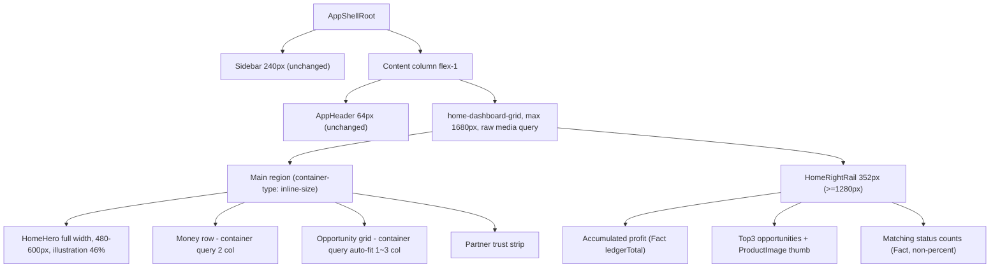

# PC Home 데스크톱 대시보드 Grid 전면 재설계 (Contract v1.3)

## 배경 (채팅에서 이미 진단 완료, 요약만)

`packages/ui/components/home/HomeExperience.tsx:115`의 조건 없는 `max-w-[1440px]` 중복 캡, `HomeRightRail`이 Tailwind `lg:`(실제 1024px, SSOT `breakpoints.ts`는 1280px 선언)에서 너무 일찍 320px 고정폭을 물어버리는 구조, main 영역에 실제 grid가 전혀 없이 `space-y-6` 세로 스택뿐이라는 점이 "1920px PC인데 430px 좁은 컬럼" 현상의 근본 원인. 여기에 기존 Canon Contract가 Hero illustration을 ≤35%·480-560px로 잠가둔 것도 목업과 정면 충돌. 사용자가 이 부분 전체를 위임했으므로(founder 승인) 아래 구체 수치로 확정한다.

## 핵심 설계 원칙 (불변으로 유지할 것)

- Fact 데이터만 표시 — "이번 달 수익" 등 SDK에 없는 필드는 만들지 않는다 (4번 참고)
- **성능 타깃 재정의 — 기준은 "이 개발 PC"가 아니라 전 세계 평균 모바일·PC·모니터 사양이다.** Phase0 저사양 규칙(Celeron G6900/8GB)은 "이 워크스테이션에서 Cursor가 개발 세션을 운영하는 방식"에만 적용되며, 배포되는 제품 자체의 비주얼 퀄리티를 낮추는 근거가 아니다. 고화질 정적 이미지(WebP)는 저가형 기기에서도 디코딩 비용이 사실상 0이므로 퀄리티를 낮출 이유가 없다.
- 성능 예산은 여전히 불변 — WebGL/Three.js/Canvas **런타임** 금지, 정적 이미지+CSS transition만, count-up/파티클/도파민 패턴 금지. 비싼 것은 무거운 JS/WebGL 연산이지 고화질 정적 이미지가 아니므로 "지존급 비주얼"과 "저사양에서도 렉 없음"은 배치되지 않는다.
- **애니메이션은 GPU 합성 속성(`transform`/`opacity`)만 사용, `top`/`left`/`width`/`margin` 등 레이아웃을 유발하는 속성은 절대 애니메이션하지 않는다** (Linear 등 실사례 근거 — 아래 리서치 참고). Hero의 은은한 float 모션도 `transform: translateY()`만 사용.
- **반응형 범위 = 모바일 전기종(320~480px) + 태블릿(768~1024px) + 노트북/데스크톱(1280~1920px) + 40인치급 울트라와이드(2560~3840px)까지 전부.** 뷰포트 하드코딩 대신 container query + fluid clamp로 대응해 특정 기종에서만 검증된 "찍어맞춘" 반응형이 아니게 한다.
- **다크 테마는 어떤 경로로도 노출 0.** 아래 "사전 감사 결과" 참고 — 이미 클린하지만 회귀 방지 가드를 신설한다.
- **오차0·결함0·중복0·오류0** — 새 컴포넌트를 만들기 전 기존 코드에 중복/병렬 경로가 있는지 먼저 grep으로 확인하고 제거한다. Contract·wire·token 3문서의 수치는 항상 정확히 일치시킨다(드리프트 금지).
- **잠긴 문서(Contract/ADR/토큰/verify 하드코딩 수치)가 목업 퀄리티 구현을 막으면, 조금씩 우회하지 않고 버전을 정식으로 개정한다** (v1.2→v1.3처럼 개정 이력을 남기며 진행). 단, 이것은 "게이트를 약화시켜 통과시키는 것"과 다르다 — 관련된 모든 SSOT 파일을 정합적으로 동시에 올리는 것이며, 검증 자체를 느슨하게 만들지 않는다.
- CTA 카피 잠금 불변 — `기회 확인` / `수익 벌기`
- PART9 live fetch/SDK/Auth/Wallet 코드는 100% 보존 (변경 대상은 오직 시각적 비중·grid 구조·에셋 퀄리티)

## 리서치 근거 (추측이 아니라 실제 조사, 2026년 기준)

사용자 요청에 따라 실제 웹 리서치로 검증한 내용 (예측/추측 배제):

- **이미지 배송**: `<picture>`로 AVIF(1순위, JPEG 대비 30~50% 작음) → WebP(폴백) 순서 서빙, LCP 이미지(=Hero)는 `fetchpriority="high"` + `loading="eager"` 필수·lazy 절대 금지, `width`/`height` 항상 명시(CLS 방지) — [web.dev](https://web.dev/articles/serve-images-webp), sitepoint "Image Optimization for Core Web Vitals 2026"
- **Next.js 16 이미지 API**: `next/image`의 `priority`는 deprecated → `preload`로 대체됐지만, **뷰포트별로 LCP 이미지가 달라지는 경우(이번처럼 desktop/mobile 구도가 다른 경우) 공식 문서가 `preload` 대신 `fetchPriority="high"`를 명시적으로 권장** — 두 이미지를 동시에 프리로드하는 낭비를 막기 위함. 이 코드베이스는 `AppHeader` 아바타 등에서 이미 `next/image`가 아니라 순수 ``를 관례로 써왔으므로(Next 16의 `images.qualities` 신규 설정 불필요), 히어로 일러스트도 `<picture>`+순수 ``로 통일
- **Grid 아키텍처**: "CSS Grid = 페이지 골격, Container Query = 컴포넌트 내부 적응"이 2026년 프로덕션 표준(컨테이너 쿼리는 Baseline 2023부터 전 브라우저 90%+ 지원) — 이 플랜의 기존 접근이 실제 업계 표준과 일치함을 재확인. `container-type: inline-size`만 사용(순환참조 유발하는 `size` 금지), media query는 "사이드바→하단네비" 같은 큰 구조 전환에만 예약. Tailwind v4는 `@container`/`@sm:`류 컨테이너 쿼리 variant를 네이티브 지원하므로 raw CSS보다 이 유틸리티 우선 사용해 기존 코드 스타일과 일관성 유지 — [sitepoint Container Queries+Subgrid 2026](https://www.sitepoint.com/css-container-queries-subgrid-component-layouts-2026/)
- **대시보드 정보 밀도**: 2026년 SaaS 대시보드는 크게 두 갈래 — Linear류의 "미니멀/progressive disclosure"와 Mercury·Ramp·Brex류의 "fintech trust 밀도형". 이 프로젝트 목업(잔액·수익·기회카드·매칭현황을 한 화면에 촘촘히)은 후자에 해당 — 둘 다 2026년 정석으로 인정되는 스타일이므로 목업의 정보 밀도를 그대로 따르는 것이 "구식"이 아니라 이 제품 카테고리(금융 신뢰)에 맞는 정석 선택 — [saasframe.io](https://www.saasframe.io/blog/the-anatomy-of-high-performance-saas-dashboard-design-2026-trends-patterns)
- **차트 가이드**: "도넛 차트는 변수 3개 이하일 때만" 유효 — 매칭현황(스캔/확인/진행/정산 = 4개)을 도넛으로 억지로 만들지 않고 기존 4-스탯 그리드 유지 (Contract §11의 "성공률% 도넛 금지"와도 자연스럽게 일치)
- **애니메이션 성능**: Linear 사례 분석 — "layout을 유발하는 속성은 절대 애니메이션하지 않고 `transform`/`opacity`만 GPU 합성으로 처리, 인터랙션 피드백은 100ms 안팎"이 저사양 기기에서도 렉 없는 핵심 원칙 — [performance.dev Linear 테크 브레이크다운](https://performance.dev/how-is-linear-so-fast-a-technical-breakdown)

## 사전 감사 결과 — 다크 테마 노출 리스크 (완료)

실제로 grep 감사한 결과, 현재 코드베이스는 이미 클린합니다:

- CSS 파일 전체(`**/*.css`)에 `prefers-color-scheme` **0건** — OS가 다크모드여도 자동 전환되는 경로 없음
- [apps/web/app/layout.tsx](apps/web/app/layout.tsx)가 `<html className="theme-peotteok-light">`를 **서버에서 하드코딩** — 클라이언트 감지/전환 JS 없음 → FOUC(깜빡임) 리스크 없음
- `luxFintechLegacyDark`/`luxDarkArchive`([packages/ui/tokens/lux-fintech.ts](packages/ui/tokens/lux-fintech.ts))는 "역사적 참고용" 명시된 **미사용 export** — `packages/ui`·`apps/**` 어디서도 import 0건
- 다크모드 토글 UI 없음 — `SettingsPanel.tsx`는 "고정(다크 아님)"이라는 안내 카피만 존재

즉 지금 당장 다크 화면이 나올 경로는 없습니다. 다만 사용자가 "절대 금지"를 명시했으므로, **앞으로도 실수로 재도입되지 않도록 영구 가드(`dark-leak-guard` todo)** 를 verify 스크립트로 추가합니다 (CSS에 `prefers-color-scheme` 재도입 금지 + 두 legacy export의 활성 import 금지를 CI에서 상시 검사).

## 1. Governance — Contract v1.3 개정안

`packages/ui/canon/contracts/peotteok-home-visual-contract.v1.md` 개정:

- §3.3 Hero illustration 비중: `~35%` → `~46%` (텍스트/CTA는 흰색 CTA 버튼의 최고 contrast로 시각적 1순위 유지 — 면적이 아니라 z-order/명도 대비로 "dominance 금지" 원칙 재정의)
- §3.3 Desktop Hero height: `480–560px` → `480–600px` (모바일 320–420px는 불변)
- §3.5 Robot/Globe: "placeholder"를 "brand-approved high-fidelity static illustration (AI 생성 → 육안 검수 → Brand Kit 등재, WebP, static/priority-load)"로 승격 — 파일은 정적 이미지이므로 WebGL/3D 런타임 비용 0, "친근함·신뢰감, human face·anime mascot·casino gold 금지" 톤 유지
- `packages/ui/brand/brand.manifest.json`의 `ai.visual.style: "abstract_insight_mark"`는 아바타/네비 등 **작은 아이콘 전용**으로 범위 명확화, Home Hero 전용 `ai.visual.heroStyle: "friendly_static_illustration"` 신설 + `assets.heroIllustration`(desktop/mobile 2 variant) 등재(status: ready)
- 신규 §2.1a "Main Content Internal Grid" 추가 (기존 "Main: Flexible"엔 내부 규정이 없었음 — 신규 조항, 기존 잠금 변경 아님): Hero(100%) → Money row(2열) → Opportunity grid(컨테이너 폭 기준 1~3열, auto-fit) → Partner strip(100%) 순서 고정, 열 수는 뷰포트가 아니라 main 컨테이너 실제 렌더 폭 기준
- **content-rail-max: `1440px` → `1680px`** — 사이드바(240)+본문(1680)=1920으로 표준 데스크톱 기준 죽는 공간 0. 이 수치는 아래 7개 파일에 전부 동기화 완료(실행 중 `canon-structure.cjs` 픽스처 내 하드코딩 1건 추가 발견):
  - [packages/ui/responsive/visual-regression/viewports.json](packages/ui/responsive/visual-regression/viewports.json) `contentRailMaxPx` ✅
  - [tooling/verify/responsive.cjs](tooling/verify/responsive.cjs) 하드코딩 `!== 1440` 체크 ✅
  - [tooling/verify/responsive/tests/canon-structure.spec.cjs](tooling/verify/responsive/tests/canon-structure.spec.cjs) 하드코딩 `toBe("1440px")` 단언 ✅
  - [packages/ui/responsive/container.css](packages/ui/responsive/container.css) `.lux-app-main` 미디어쿼리 ✅
  - [packages/ui/tokens/breakpoints.ts](packages/ui/tokens/breakpoints.ts) `CONTENT_RAIL.maxWidthPx` ✅
  - [packages/ui/tokens/component.css](packages/ui/tokens/component.css) `--content-rail-max` 기본값 ✅
  - [packages/ui/responsive/visual-regression/canon-structure.cjs](packages/ui/responsive/visual-regression/canon-structure.cjs) 픽스처 인라인 CSS 하드코딩(신규 발견) ✅
  - 2560/3440/3840(40인치급)에서는 여전히 1680에서 캡되고 배경색으로 여백 처리 — 이건 버그가 아니라 Stripe/Linear/Notion 등 업계 표준 패턴(무한 스트레치는 카드가 비정상적으로 커지고 가독성이 깨짐). "완벽한 반응형" = 안 깨지고 비율 유지, "화면을 꽉 채움"이 아님을 명확히 함
- Right Rail 폭은 기존 잠금 범위(320–360px) 안에서 352px 기본값 채택 (Contract 수정 불필요)
- `home-visual-v2.wire.json`의 `layout.desktop.heroHeightPx`를 `[480,600]`으로 동기화, `blocks[].hero.note`에 46%/생성 이미지 승격 반영
- `peotteok-light.specification.md`의 `layout.heroDesktop` 값 동기화
- ADR-017는 pointer 유지, Contract만 v1.2→v1.3 개정 이력 추가

## 2. 아키텍처 — 신규 Grid 구조

핵심 기술 결정:

1. **브레이크포인트는 raw CSS `@media`로 SSOT(`breakpoints.ts`: md 768 / lg 1280 / xl 1920) 값을 직접 사용** — 새 grid·rail 표시 조건을 Tailwind `lg:`(실제 1024px) 대신 `@media (min-width:1280px)`로 작성. 부수적으로 `--breakpoint-lg:1280px`도 `@theme`에 등록(블라스트 반경 3파일 확인 완료).
2. **Main 내부 grid는 viewport가 아니라 container query로 열 수를 결정** (`container-type: inline-size`, 기존 `.opportunity-card` 패턴과 일관). sidebar/rail 유무로 main 실제 폭이 복잡하게 변하므로 "실제 렌더 폭 기준 auto-fit"이 견고함 — 1024~1440px 구간이 항상 좁아 보였던 근본 해결책.
3. **반응형 티어 전체(뷰포트 기준, `VIEWPORT_TEST_POINTS` SSOT)**:
   - 모바일 320~480px: 1열 스택, Hero는 세로형 일러스트 구도로 전환, fluid clamp로 320↔480 사이 매끄럽게 스케일(단계별 점프 없음)
   - 태블릿 600~1024px: rail은 하단 보조 섹션으로 이동(Contract §8 기존 규정 확장 적용), money/opportunity 2열
   - 노트북 1280~1440px: 3-컬럼 셸 등장(sidebar+main+rail), main은 컨테이너 쿼리로 2~3열
   - 데스크톱 1536~1920px: 풀 밀도, opportunity 3열
   - 울트라와이드 2560~3840px(40인치급): content 1680px에서 캡, 나머지는 배경으로 자연스럽게 여백 처리 — sidebar/rail 비율 깨짐 없이 중앙 정렬 유지
4. `HomeExperience.tsx`의 **중복·무조건 `max-w-[1440px]`는 제거**하고 신규 content-rail-max(1680)로 단일화.

## 3. 컴포넌트별 변경

- [packages/ui/components/home/HomeExperience.tsx](packages/ui/components/home/HomeExperience.tsx): L115의 `mx-auto flex w-full max-w-[1440px] ... lg:flex-row` 제거 → `home-dashboard-grid` 클래스 기반 구조로 교체
- **사전 작업**: 신규 컴포넌트 작성 전 `HomeHero`/`HomeRightRail`/dark 관련 기존 코드에 병렬·중복 정의가 없는지 grep 전수 확인 (오차0·중복0 원칙 — dedup-audit todo)
- [packages/ui/components/home/HomeHero.tsx](packages/ui/components/home/HomeHero.tsx): 텍스트 54%/일러스트 46% 비율 재조정, `min-height`/`max-height` 480–600px, 로봇+글로브 placeholder를 신규 `HomeHeroIllustration`으로 교체, 모바일(<768px)은 별도 구도 이미지로 전환
- **신규 브랜드 에셋** (`GenerateImage`, 첨부 목업을 스타일/구도 레퍼런스로 전달): 로봇+지구본 합성 일러스트를 **데스크톱용(가로형 구도)** 과 **모바일용(세로/정방형 구도)** 2장으로 생성 — 투명 배경, 목업과 동일한 3D 라이팅/구도 목표, human face·anime mascot·casino gold·purple 네온(브랜드 금지 항목) 회피, 각각 고해상도 단일 파일(레티나 겸용) → AVIF+WebP 두 포맷으로 변환(리서치 근거: AVIF 1순위, WebP 폴백) → `packages/ui/brand/assets/ai/hero-illustration-{desktop,mobile}.{avif,webp}` → `brand.manifest.json`에 `heroIllustration` 등재(status: ready)
- **신규** `packages/ui/components/home/HomeHeroIllustration.tsx`: 뷰포트에 따라 `<picture>`(AVIF source → WebP fallback)로 두 구도 중 하나를 렌더링, explicit width/height(CLS 방지), **`fetchPriority="high"`** 사용 — Next.js 16 공식 가이드상 뷰포트별로 LCP 이미지가 바뀌는 경우 `preload`가 아니라 `fetchPriority`를 쓰는 게 맞음(두 이미지 동시 프리로드 방지), lazy 금지(항상 above-the-fold). 배경은 기존 `.home-hero__glow` CSS radial-gradient 유지
- [packages/ui/components/opportunity/HomePrincipalRail.tsx](packages/ui/components/opportunity/HomePrincipalRail.tsx): 전용 `.home-money-grid`(컨테이너 쿼리 2열)로 분리, 숫자 크기 확대, Profit sparkline은 시계열 Fact 필드가 있을 때만
- [packages/ui/components/opportunity/BalanceAwareHome.tsx](packages/ui/components/opportunity/BalanceAwareHome.tsx) / [OpportunityCard.tsx](packages/ui/components/opportunity/OpportunityCard.tsx): 전용 `.home-opportunity-grid`(컨테이너 쿼리 auto-fit 1~3열)로 분리, 카드 이미지 prominent 재정렬 (데이터 모델 변경 없음)
- [packages/ui/components/home/HomeRightRail.tsx](packages/ui/components/home/HomeRightRail.tsx): 누적 수익 anchor 확대, "오늘 가능한 수익" 보조 라인(기존 Fact 재사용), Top3에 `ProductImage variant="thumb"`, 매칭 현황(스캔/확인/진행/정산 4개)은 **기존 4-스탯 그리드 유지** — 변수 4개는 도넛/링 시각화에 적합하지 않다는 차트 리서치 근거 + Contract §11의 "성공률% 도넛 금지"와도 일치, 억지로 도넛화하지 않음
- [packages/ui/tokens/component.css](packages/ui/tokens/component.css): 신규 grid 클래스 + content-rail-max 1680 반영
- [packages/ui/components/shell/AppHeader.tsx](packages/ui/components/shell/AppHeader.tsx): 스캔 chip 중앙 정렬 폴리싱 (선택)
- **신규** `tooling/verify/dark-leak-guard.cjs`(가칭): CSS `prefers-color-scheme` 금지 + `luxFintechLegacyDark`/`luxDarkArchive` 활성 import 금지를 CI에 상시 검사로 등록

## 4. 데이터 정직성 경계 (이번 슬라이스에서 못 하는 것)

- `GrowthPublicSurfaceResponse`(`packages/sdk/src/growth/types.ts`)에는 `ledgerTotal`(누적)만 있고 "오늘 수익"·"이번 달 수익" 분리 필드가 없음 → 목업처럼 3분할 숫자를 만들면 가짜 데이터. **누적 수익 + 오늘 가능한 수익(기존 Fact)** 조합으로 대체, "이번 달 수익"은 생략(필요 시 02 Engine/API에 pointer만 남김 — UI 플랜 경계 밖)

## 5. 검증 + 임시 API 기동 절차

1. `GenerateImage` 생성 직후 육안 검수 — 브랜드 금지 항목(human face/anime/casino gold/성별 표식) 미포함 확인, 목업 대비 라이팅·구도 유사도 확인, 부적합 시 재생성
2. `pnpm dev:api`를 `pnpm dev:web`과 **임시로만** 동시 기동(승인된 예외) → 실제 feed로 Hero/Balance/Opportunity 3장/RightRail 밀도 육안 확인 → 즉시 `dev:api` 종료 → `pnpm cleanup:lowspec`
3. `verify:lux-theme-sync`, `verify:canon-surfaces`, `verify:home-principal-slots`, `verify:home-live-wire`, `verify:opportunity-scan-surface`, `verify:ux-design-system`, `verify:responsive`(신규 1680 반영), 신규 `dark-leak-guard`, 최종 `verify:gate:fast`
4. RAM 여유 확인(`pnpm lowspec:status`)을 임시 API 기동 전후 각 1회 (개발 세션 관리이지 제품 성능 기준 아님)

## 6. 반응형 QA 매트릭스 (VIEWPORT_TEST_POINTS SSOT 전체)

- 모바일: 320 / 360 / 375 / 390 / 393 / 412 / 430 / 480
- 태블릿: 600 / 768 / 820 / 834 / 1024
- 데스크톱: 1280 / 1366 / 1440 / 1536 / 1600 / 1920 / 2560
- 울트라와이드: 3440 / 3840

로컬은 RAM 여유가 없을 때 Playwright 실행을 보류하고 코드 리뷰 기준으로만 확인, 실제 전 구간 자동 검증은 `verify:responsive`를 `RESPONSIVE_PW=1`로 CI(`gate.yml`)에서 수행 (Phase0 "E2E는 CI" 원칙과 일치).

## 7. 실행 순서 (todo 1개 = 1 커밋)

각 슬라이스 완료 시 해당 domain verify PASS 확인 후 T0 커밋, 전체 완료 후 세션 stop 시 push. 잠긴 문서 개정이 필요한 슬라이스(`contract-v1-3`, `content-rail-sync`)는 관련 SSOT 파일 전부를 같은 커밋에서 함께 올려 드리프트가 생기지 않게 한다.

## 8. 플랫폼 전체 확장 로드맵 (Phase 2+, 이번 플랜의 실행 범위 밖)

사용자가 Home 외 전체 화면(입금·출금·랜딩·회원가입·로그인 등)도 동일 퀄리티로 요청함에 따라 현황을 실사 확인:

### 현재 상태 (실사 결과)

- **Contract(Visual SSOT) + 목업이 있는 화면 = Home 1개뿐.** ADR-017 STEP1~4 전체 프로세스(Gap Analysis→Contract→Wire→Token→Mapping→구현)를 거친 유일한 화면.
- 나머지는 **구조적 Canon wire(`blocks[]` 순서 정의)만 54개 존재** — `auth-login.wire.json` · `auth-signup.wire.json` · `wallet-deposit.wire.json` · `wallet-home.wire.json` · `withdraw-mode.wire.json` · `landing-3s.wire.json` 등. 이들은 아직 peotteok-light "비주얼 퀄리티" 계약이 없고, **목업 이미지도 없음** (사용자가 지금까지 첨부한 건 Home 목업 1장뿐).
- 실제 페이지 파일은 `apps/web/app/**/page.tsx` 기준 **59개** 존재.

### 리서치 결과 (2026년 실사례 기준, 추측 아님)

- **로그인/회원가입**: Wise·Stripe·Klarna 등이 검증한 패턴 = 최초 가입은 이메일+비밀번호(또는 OAuth/패스키)만, KYC·전화번호 등은 "지금 왜 필요한지" 설명과 함께 실제 필요한 시점(입금/출금 직전)까지 지연 — 5분 이내 가입 완료가 벤치마크, 초과 시 68% 이탈(Signicat 2023). 진행률 바는 "몇 단계"가 아니라 "예상 소요시간"으로 표기. — [wsa.design](https://wsa.design/news/crypto-exchange-ux-best-practices), [Stripe Crypto Onboarding](https://stripe.com/en-gi/resources/more/crypto-onboarding-best-practices)
- **입금/출금**: "신뢰의 순간"으로 취급 — 자산+네트워크 선택은 모호함 0(수수료·소요시간·추천 네트워크 명시), 주소는 QR+복사 버튼(수기 입력 최소화), 진행 상태는 정적 스피너가 아니라 "확인 2/6건" 같은 동적 실시간 표시, 출금은 주소 검증+2FA로 "의도된 마찰"을 신뢰 신호로 사용, 수수료/실수령액은 확정 전 명확히 표시. — [codono.com Crypto Exchange UX 2026](https://codono.com/blog/crypto-exchange-ux-design-conversion)
- **랜딩페이지**: 신뢰 판단은 방문 후 약 50ms 안에 시각적으로 결정 — 컴플라이언스/보안 배지를 CTA 바로 옆에 배치, 글로벌 nav·사이드바 등 경쟁 요소 제거, 단일 CTA를 히어로+핵심섹션 뒤+하단에 반복 배치, LCP 2.5초 이내가 신뢰도에 직결(로딩 1초 지연=전환 7% 손실). — [utsubo.com 12 Fintech Trust Patterns](https://www.utsubo.com/blog/fintech-website-trust-design-patterns), [urbangekodesign 9-Point Framework](https://www.urbangekodesign.com/industries/fintech/landing-page-design-optimization/)

### 제안 순서 (한 번에 전부 X — File-Serial 원칙)

1. **Phase 1 — Home** (이번 플랜, 실행 준비 완료)
2. **Phase 2 — Auth(로그인·회원가입) + Landing** — 첫인상·전환이 걸린 진입점, 위 리서치 그대로 적용 가능
3. **Phase 3 — Wallet(입금·출금·지갑홈)** — "돈이 실제로 움직이는" 최고 신뢰 임계 화면
4. **Phase 4 — 나머지(내정보/기회상세/실행화면 등)**

각 Phase는 Home과 동일한 절차를 밟는다: (a) 목업이 있으면 그것을 기준으로, 없으면 위 리서치 + 기존 Canon wire를 근거로 Contract 신설 → (b) Wire/Token 동기화 → (c) 구현 → (d) verify. Home에서 이번에 만드는 grid/이미지 파이프라인/컨테이너 쿼리 패턴은 Phase 2~4에서 그대로 재사용되어 매 화면 처음부터 설계하지 않아도 됨.

### 확인이 필요한 것

- 로그인/회원가입/랜딩/입금/출금 등에 대해 Home처럼 **참고할 목업 이미지가 추가로 있는지** — 있다면 그 화면부터는 목업을 Visual 기준으로 쓰고, 없다면 위 리서치 패턴 + Contract 신설로 진행
- Phase 2/3/4 순서에 동의하는지, 아니면 우선순위를 다르게 하고 싶은지
