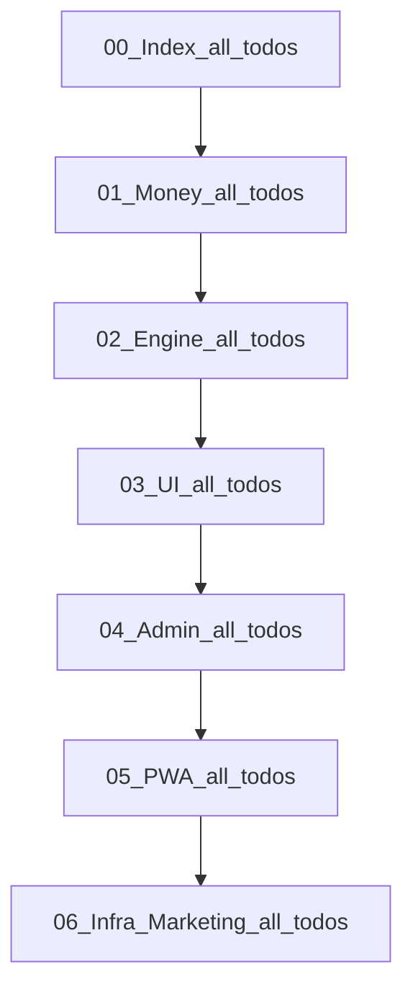

# 플랜 직렬 완료 순서 (v7.22.34 · File-Serial)

## 유저 작업 규칙 (절대)

1. **한 파일**의 frontmatter `todos`를 **위 → 아래**로만 실행
2. 그 파일의 **모든 todo가 `completed`** 되기 전, **다음 번호 파일 착수 금지**
3. 한 채팅 = 한 todo (기존 유지)
4. §18 Milestone 표기는 **이 직렬 파일 순서의 설명용**으로 종속 (교차 병행 착수 폐기)

## 이미 00을 진행 중인 경우 (지금 상태 · 재실행 금지)

**문제 없음.** 직렬 규칙은 “처음부터 다시”가 아니라 **남은 pending만** 위에서 아래로 이어서 끝내는 것.

| 상태 | 조치 |
|------|------|
| `status: completed` | **손대지 않음 · 재실행 금지** (헌법/스키마/마이그레이션/브랜드 잠금 등) |
| `status: pending` | **위→아래 첫 pending부터** 이어서 실행 |
| 이번 정렬로 Index에 **새로 붙는** todo (`auth-ssot`, `phase0-bootstrap-hosts`) | pending 맨 아래(또는 monorepo/copy 다음)에 **추가만** · 기존 completed 위 삽입으로 순서 꼬지 않음 |

**00 Index 현재 스냅샷 (재개 큐):**
1. `monorepo-skeleton` ← **다음 할 일**
2. `copy-canon-cta-sla-lock`
3. *(정렬 적용 후)* `auth-ssot`
4. *(정렬 적용 후)* `phase0-bootstrap-hosts`
5. → pending 0 확인 후 **01 Money** 첫 pending

다른 도메인 파일(01~06)에 이미 `completed`가 있어도 동일: **그 파일 차례가 왔을 때** 남은 pending만 위→아래. 앞 파일(00)이 pending>0이면 뒤 파일 착수 금지.

## 직렬 파일 순서 (먼저 끝낼 파일 → 마지막)

| # | 파일 | 끝내고 넘어가는 조건 |
|---|------|----------------------|
| **00** | `ai_profit_os_00_index_a1b2c3d4.plan.md` | Index pending 0 (골격·카피잠금·**Auth SSOT·Phase0 Bootstrap** 포함) |
| **01** | `ai_profit_os_01_money_c3d4e5f6.plan.md` *(구 02_money)* | Money pending 0 (원장→지갑→체인→출금→초대) |
| **02** | `ai_profit_os_02_engine_b2c3d4e5.plan.md` *(구 01_engine)* | Engine pending 0 (시세→Rule→시뮬→AI 런타임까지) |
| **03** | `ai_profit_os_03_ui_ux_d4e5f6a7.plan.md` | UI pending 0 (카피/Lux→5탭→실행실→신뢰면) |
| **04** | `ai_profit_os_04_admin_e5f6a7b8.plan.md` | Admin pending 0 (분리배포→12모듈→유저360→CS) |
| **05** | `ai_profit_os_05_pwa_f6a7b8c9.plan.md` | PWA pending 0 (Shell→Push→WebAuthn→Store stub) |
| **06** | `ai_profit_os_06_infra_a7b8c9d0.plan.md` | Infra pending 0 (**Marketing/CAPI + 후반 관측만**) |

## 직렬이 깨지지 않게 옮기는 todo

현재 Infra에 있으면 **Money/UI보다 늦게** 끝나서 Auth·호스팅이 막힘 → **00 Index로 이동**.

| todo | 구 위치 | 신 위치 (Index 하단, monorepo 다음) |
|------|---------|-------------------------------------|
| `auth-ssot` | 06 Infra | **00 Index** (Nest JWT · §51.9) |
| `infra-observability-launch` 중 Phase0 Bootstrap($0 CF+Supabase+Upstash) | 06 Infra | **00 Index** `phase0-bootstrap-hosts` 로 분리·추가 |
| `marketing-seo-engine` | 06 Infra | **06 유지** (마지막 파일) |
| `stack-lock-sync` | 06 Infra | completed 유지 · 재실행 금지 |
| 후반 OTel/EKS | 06 Infra | **06 유지** (`infra-observability-late`) |

Owns 본문(§51.9 Auth 절)은 Infra 파일에 두고, Index todo는 **실행 큐만** 가져가도 됨(pointer: Owns=Infra §51.9).

## 파일 내부 todo 재배열 (위=먼저)

### 00 Index (pending 구간만 · completed는 상단 유지)
1. `monorepo-skeleton`
2. `copy-canon-cta-sla-lock`
3. **`auth-ssot`** *(이동)*
4. **`phase0-bootstrap-hosts`** *(이동/신설)*
5. → 이후 파일 01 착수

### 01 Money (구 02 · 대체로 이미 정합, 문구만 고정)
원장 → 지갑/KYC → 체인 → sweeper → 출금 → 남용방어 → suggest/네트워크카피 → 초대 → practice

### 02 Engine (구 01 · 재배열)
1. projection 잠금 (`capital-provider` · `opportunity-scan`)
2. `market-intel-engine` → `signup-ready-adapters`
3. catalog/image/verticals (`capital-tier` · `asset-image` · card/bag/watch)
4. `balance-aware-feed`
5. **`match-success-rule-engine` → `match-strictness-policy` → `user-membership-engine`**
6. `simulation-engine-m05` → `adapter-matching-kpi`
7. AI 묶음 마지막 (`ai-feature-platform` → twin → coach → llm-adapter)

### 03 UI
1. 카피/거버넌스/디자인시스템 (`korean-first` · mockup · `ux-design-system`)
2. 온보딩/auth/landing
3. 홈·마진·잔액·실행실·퍼뜩 UI
4. 5탭/설정/토스트/KYC/신뢰/초대/멤버십/루프/반응형/spot-check

### 04 Admin
격리배포 → 12모듈 → 가격동기 → 유저360 → 실행정책 → override/자격/차단 → abuse → CS → analytics

### 05 PWA
Shell → Push → auto-fanout → WebAuthn/haptics → Store bridge (이미 정합)

### 06 Infra (축소 후)
`marketing-seo-engine` → `infra-observability-late`

## 레포 수정 범위

1. **git mv** Engine↔Money 번호 스왑 (해시 suffix 유지)
2. **Index** — 직렬 규칙 절 + 분리 맵을 위 표로 교체 + changelog v7.22.34 + todo 이동/추가
3. **Infra** — `auth-ssot`/early bootstrap todo 제거(또는 completed+이동완료 표기) · Marketing만 pending
4. **Engine/UI/Money/Admin** — frontmatter todo 순서만 재배열 (본문 Owns 이동안 함)
5. **BOOTSTRAP · AGENTS** — “한 파일 전부 완료 후 다음” + 새 번호
6. **CONSTITUTION / launch / 감사 MD** — `01_engine`↔`02_engine`, `02_money`↔`01_money` 문자열 치환

## 검증

- Index에 직렬 규칙 문구 존재
- `rg "01_engine|02_money"` → 0
- Infra frontmatter에 `auth-ssot` pending **0** (Index로 이동됨)
- `pnpm cleanup:lowspec`
- 커밋/푸시 = 유저 요청 시에만

## 범위 밖

- 앱/엔진 구현 코드 착수 없음
- Owns 절 본문을 파일 간 이사하지 않음 (실행 todo 큐만 직렬화)
- Store Bridge는 05 파일 맨 아래 유지 (파일 직렬상 PWA 끝에서 처리)
