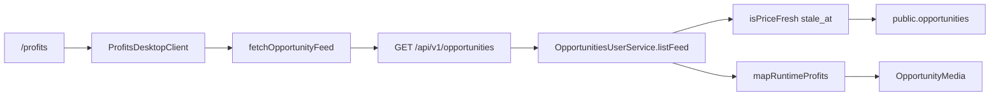

# PUTDUK Profits Desktop Real Integration

## Git Safety (read-only 확인됨)

- Branch: `main`
- HEAD: `0345206ad2e7238658454db5d072c8fbf93dbb37`
- Dirty tree: 기존 Home/Spark Dash 작업 잔여 **유지**. 이번 task와 무관한 restore/stash/commit/push **금지**.
- 구현 중 수정은 이 플랜이 지정한 파일만.

## 목표

`/profits`를 새로 만들지 않는다. 기존 Opportunity 파이프라인의 **거짓 fallback과 contract drift**를 제거한다.

```text
REAL TRUTH → REAL CONTRACT → REAL RUNTIME → REAL UI
```

## 이미 확정된 런타임 사실 (재추측 금지)

아래는 audit된 연결이다. Phase 8 freshness **원인 판정**은 여기 포함하지 않는다.



- DEV에서 API 실패/미인증/empty → Nike fixture: [apps/web/app/ProfitsDesktopClient.tsx](apps/web/app/ProfitsDesktopClient.tsx) `DEV_VISUAL`
- `official: true` 하드코드 + `partner ?? "공식 파트너"` + title/label guess: [apps/web/components/spark-dash-profits/map-runtime.ts](apps/web/components/spark-dash-profits/map-runtime.ts)
- `OpportunityFeedItem = Record & { id }`: [packages/sdk/src/user-feed/types.ts](packages/sdk/src/user-feed/types.ts)
- listFeed는 `includePricing: false`라 `buyMarketLabelKo`가 user card에 없음: [services/api-nest/src/opportunities/opportunities.user.service.ts](services/api-nest/src/opportunities/opportunities.user.service.ts)
- pricing owner에는 이미 `buyMarketId` / `buyMarketLabelKo`: [schemas/opportunity-pricing.v1.json](schemas/opportunity-pricing.v1.json), `marketLabelKo()` in [services/market-intelligence/src/markets.cjs](services/market-intelligence/src/markets.cjs)
- `assetImageUrl`은 DTO drop이 아님. freshness에서 row가 먼저 탈락할 수 있음
- 유저 feed 권위 = `settlement_rule.isPriceFresh` + `DEFAULT_PRICE_STALE_MAX_SEC = 3`: [services/engine-rust/settlement_rule.cjs](services/engine-rust/settlement_rule.cjs) — **완화 금지**
- `/dev/spark-dash-profits`만 명시 fixture: [apps/web/app/dev/spark-dash-profits/page.tsx](apps/web/app/dev/spark-dash-profits/page.tsx)
- Home visual = LOCKED: [governance/consumer-home-approval/home-approval-freeze.v1.json](governance/consumer-home-approval/home-approval-freeze.v1.json)

## 잠금 (범위 밖)

- Yahoo API / parser / scraping / source. `workers/yahoo-jp-adapter` 복구·수정·활성화 금지
- FASHIONPHILE / Chrono24 / TCGplayer / Mercari / KREAM / StockX / GOAT / Bunjang / Vestiaire parser
- listing-leg 확장. Day-1 = `ebay | admin`
- `SOURCE_OBSERVATION != LISTING_LEG`. observation → Opportunity publish 금지
- Home layout / CSS / geometry / Figma / redesign
- Mobile profits, Detail page
- 새 MediaService / ImageProxy / Policy Engine / 외부 이미지 검색 / eBay R2 mirror
- `DEFAULT_PRICE_STALE_MAX_SEC` 완화, `UPDATE opportunities SET stale_at = now()`
- Money / Ledger / FX / Engine formula 변경
- commit / push / Founder freeze

## 실행 순서 (건너뛰지 않음)

```text
01 Fixture Isolation
        ↓
02 Exact Typed Contract
        ↓
03 Market Label Projection
        ↓
04 Unsupported Official Claims 제거
        ↓
05 Loading / Ready / Empty / Error / Unauthorized
        ↓
06 Media State
        ↓
07 Media Policy Gate
        ↓
08 Freshness Forensic
        ↓
     안전 repair?  YES → repair
                   NO  → FRESHNESS_ARCHITECTURE_BLOCKED
        ↓
09 Search / Filter Truth
        ↓
10 API Runtime Evidence
        ↓
11 Next + Nest short E2E
        ↓
12 Contract / Verify
        ↓
13 Playwright Real Runtime  (NO INTERCEPT)
        ↓
14 Playwright State Simulation  (INTERCEPT ALLOWED)
        ↓
15 Home Zero-Visual Regression
        ↓
GPT QA
```

---

## 01 — Fixture Isolation

`/profits` = real runtime only. development에서도 fixture 자동 치환 금지.

[ProfitsDesktopClient.tsx](apps/web/app/ProfitsDesktopClient.tsx):

- `DEV_VISUAL` / `PROFITS_DESKTOP_VISUAL_FIXTURE` import·치환 **삭제**
- 초기 state = LOADING (Nike 선표시 금지)
- fixture import는 [apps/web/app/dev/spark-dash-profits/page.tsx](apps/web/app/dev/spark-dash-profits/page.tsx)만

[map-runtime.ts](apps/web/components/spark-dash-profits/map-runtime.ts)가 `SPARK_DASH_DESKTOP_VISUAL_FIXTURE.nav`를 끌어오면 `/profits` bundle이 fixture에 묶인다. Home 파일을 건드리지 않고 **nav 배열을 profits runtime 상수로 인라인**한다. 값은 동일. 새 nav 프레임워크 없음.

`verify:profits-live-wire` 확장:

- `ProfitsDesktopClient.tsx`를 읽는다
- `/profits` 경로에서 `PROFITS_DESKTOP_VISUAL_FIXTURE` / `DEV_VISUAL` 금지
- `/dev/spark-dash-profits`는 fixture 허용

[domain-by-path.cjs](tooling/verify/domain-by-path.cjs)에 `ProfitsDesktopClient.tsx` + `spark-dash-profits/**`를 profits 도메인으로 추가한다.

---

## 02 — Exact Typed Contract

Backend를 상상하지 않는다. 실제 `toUserCard` + [opportunity-card.v1.json](schemas/opportunity-card.v1.json) 필드만 SDK로 올린다.

`OpportunityFeedItem`을 명시 타입으로 교체. **ghost field 금지.**

SDK에 넣지 않는다:

- `partnerLabel`
- `partner`
- `officialPartner`
- `official`
- 기타 현재 user response에 없는 legacy 키

Money는 **기존 계약 유지**:

- `expectedProfitUsdt` / `requiredCapitalUsdt` / `marginPct` = **string**
- `expectedProfitKrwApprox` = schema대로 **number** (string으로 재정의 금지)
- Frontend에서 USDT를 `Number`로 재계산 금지

최소 필드: `id`, `assetId`, `assetLabel`, `assetImageUrl`, `assetImageSource`, `assetImageAltKo`, `arbitrageType`, `arbitrageTypeKo`, `expectedProfitUsdt`, `expectedProfitKrwApprox`, `requiredCapitalUsdt`, `estimatedDurationSec`, `staleAt`, `status`, `bucket`, `marginPct`, 그리고 03에서 올리는 `buyMarketId` / `buyMarketLabelKo`.

### Home adapter boundary (SDK 오염 금지)

Home visual component / CSS / geometry = **0 change**.

Home [map-runtime.ts](apps/web/components/spark-dash-home/map-runtime.ts)가 느슨한 `Record`에 의존해 `partnerLabel` / `partner` / `officialPartner`를 읽는다. SDK를 강하게 만든 뒤 tsc가 깨지면:

- SDK에 ghost를 넣지 않는다
- Home **data adapter**에만 최소 호환을 허용한다
- 조건: **VISUAL ZERO CHANGE** 증거 (before/after `/dev/spark-dash-desktop` 1440 + `/dev/spark-dash-mobile` 390, 의미 있는 geometry/CSS/카피 변화 없음)
- 금지: Home popular/hero partner를 `buyMarketLabelKo`로 바꿔 "공식 파트너" → "이베이(미국)"이 되는 매핑. 그건 visual change다
- 허용: 이미 존재하는 typed 필드(`assetLabel`, `assetImageUrl`, money strings)만 읽고, 없는 값은 지금과 같은 fallback 경로를 유지

Home visual lock이 우선이다. adapter 수정이 visual-zero를 증명하지 못하면 Home 파일은 그대로 두고 Profits 쪽만 완료한다.

---

## 03 — Market Label Projection

`toUserCard`에서 **pricing 객체 전체 노출 없이** top-level만 lift:

```ts
buyMarketId: pricing.buyMarketId        // Day-1: ebay_* | admin
buyMarketLabelKo: pricing.buyMarketLabelKo
```

`listFeed`는 계속 `includePricing: false`. `getById`의 기존 pricing 포함은 Detail 범위 밖이므로 건드리지 않는다.

Profits mapper:

- `partner` = `buyMarketLabelKo` only
- `partnerKind` = `buyMarketId` prefix만 (`ebay_*` → ebay, 그 외 plain)
- `title.includes` / amazon guess / yahoo guess / official guess **삭제**
- 라벨 없으면 `"공식 파트너"` fallback **금지** (빈/plain)
- Yahoo 문자열을 data source로 만들지 않음. Day-1 enum에 `yahoo_jp` 없음

[opportunity-card.v1.json](schemas/opportunity-card.v1.json)에 두 필드를 optional property로 문서화 (`additionalProperties: false` 유지).

`verify:user-opportunity-feed` 확장: list item에 `buyMarketLabelKo` 존재, `pricing` 키 없음.

---

## 04 — Unsupported Official Claims

`UNKNOWN != false`.

user card에 `official` owner가 없다. [schemas/market-partner.registry.json](schemas/market-partner.registry.json)의 `officialPartner: true`는 Trust strip / display-relationship이다. Yahoo도 true. Opportunity truth owner가 아니다. registry로 official을 파생하지 않는다.

삭제:

- `official: true` 하드코드
- runtime에서 `official = false`를 **만들지 않는다** (`false` = "공식 관계가 아니다"라는 새 주장)

런타임 모델:

- SDK에 `official` 필드 없음
- Profits view-model의 `official`은 **optional / absent**. 있으면 `true`만 의미 있다 (`official?: true`)
- mapper는 official을 할당하지 않는다
- badge는 `item.official === true`일 때만 render
- owner가 없으면 필드 자체 없음 = UNKNOWN / NOT_PROVIDED = badge 없음

`/dev` visual fixture는 `visual_fixture` owner이므로 preview용 `official: true`를 가질 수 있다. 그 주장은 real `/profits`로 새지 않는다.

`"공식 파트너"` 문자열을 fallback으로 생성하지 않는다.

---

## 05 — Loading / Ready / Empty / Error / Unauthorized

`catch(() => null)`로 error / empty / auth를 섞지 않는다.

SDK `fetchOpportunityFeed`는 지금 `opportunity_feed_${status}`를 throw한다. status를 가진 작은 error 타입만 추가한다. 새 client 프레임워크 금지.

`ProfitsDesktopModel.viewState`:

- LOADING: 최초 fetch 전. 고정 geometry skeleton. Nike 금지
- READY: 2xx + fresh items ≥ 1. 실제 카드
- EMPTY: 2xx + items.length === 0. 정직한 empty 카피
- ERROR: network / 5xx / malformed. fake success 금지
- UNAUTHORIZED: 401 `AUTH_REQUIRED`. fixture 금지

Wallet/FX 실패는 feed와 분리한다. sidebar는 null, viewState owner는 feed다.

검색 0건은 EMPTY가 아니다. client-side filter 결과 문구만 구분한다.

Figma는 수정하지 않는다. loading / empty / error / missing / broken / policy-unknown을 **필요 목록만** 최종 보고한다.

---

## 06 — Media State

새 provider call / title→image map / Nike special-case 금지.

[OpportunityMedia.tsx](apps/web/components/spark-dash-profits/OpportunityMedia.tsx) 상태:

- LOADING: 같은 슬롯 skeleton
- AVAILABLE: **표시 허가된** URL만 (07 gate 통과 후)
- MISSING: branded `is-mark` fallback. 가짜 상품 사진 0
- BROKEN: `onError` 후 동일 fallback
- POLICY_UNKNOWN: 07에서 MISSING/FALLBACK과 동일 UI. 별도 정책 engine 없음

[spark-dash-profits.css](apps/web/components/spark-dash-profits/spark-dash-profits.css)의 고정 height / featured 44%를 유지해 layout shift를 막는다. Home CSS 수정 금지.

---

## 07 — Media Policy Gate

```text
URL EXISTS  ≠  DISPLAY AUTHORIZED
assetImageUrl 전달  ≠  user surface 
```

`assetImageUrl != null` → 무조건 외부 이미지 render **금지**.

구현 전에 기존 repo의 source별 **user-surface display authorization**을 조사한다. 새 permission을 만들지 않는다.

이미 있는 조각 (오해 금지 — 이것들이 곧 표시 허가는 아님):

- enum: `ebay | pokemontcg | ygoprodeck | admin_r2` — [asset-master.cjs](services/market-intelligence/src/asset-master.cjs)
- hydrate rank: Asset Master `admin_r2` → catalog → ebay listing — [asset-image.cjs](services/market-intelligence/src/asset-image.cjs)
- `PRODUCT_IMAGE_REMOTE_PATTERNS`: next/image **host allowlist** — [image-hosts.ts](packages/ui/components/product/image-hosts.ts). 기술 핫링크 허용이지 법적/제품 표시 허가가 아니다
- `IMAGE_RIGHTS_NOTE_KO = "시세 참고용"`: 카피이지 permission grant가 아니다
- `applyEbayImageProvenance` (`i.ebayimg.com`): ingest host lock이지 user-surface display license가 아니다

규칙:

- 기존 user-surface display allowlist가 있으면 **그것만** 사용
- 없으면 임의 허가를 만들지 않는다
- 권리가 명확하지 않은 external source = `POLICY_UNKNOWN` → MISSING/FALLBACK
- `admin_r2`는 PUTDUK가 통제하는 source다. 기존 소유 증거([asset-image-r2.service.ts](services/api-nest/src/opportunities/asset-image-r2.service.ts), Asset Master) 범위에서만 표시
- 새 Policy Engine / mirror / provider download / YGOPRODeck 신규 hotlink **금지**

최종 보고 한 줄: `MEDIA_DISPLAY_POLICY = PASS | PARTIAL | BLOCKED`

- PASS: 표시하는 source마다 user-surface 허가 증거가 있음
- PARTIAL: 허가된 source만 표시, 나머지 POLICY_UNKNOWN fallback
- BLOCKED: 허가 증거가 없어 실제 외부 이미지를 표시하지 못함 (fallback만)

---

## 08 — Freshness Forensic Gate

이 Phase에 들어갈 때 B/C/BLOCKED를 **선결론으로 두지 않는다**.

`DEFAULT_PRICE_STALE_MAX_SEC = 3`은 유지한다. UI를 보이게 하려고 완화하지 않는다. `stale_at = now()` 가짜 stamp 금지. seed를 production freshness worker로 바꾸지 않는다.

`isPriceFresh`는 `Math.max(0, now - staleAt)`이라 미래 `staleAt`도 age=0으로 허용한다. 이름만 보고 "expiry를 as-of로 오독한다"고 단정하지 않는다.

### 선결론이 아닌 조사 메모 (확인/반증 대상)

구현 전 읽기에서 본 단서다. Phase 8 증거가 이를 뒤집으면 증거가 이긴다.

- seed builder: `staleAt = observedAt + LISTING_STALE_SEC(300)` — [catalog-runtime-seed.cjs](services/market-intelligence/src/catalog-runtime-seed.cjs)
- `CatalogRuntimeSeedService` skip: `available>=1 ∧ assets>=1 ∧ listings>=1`. freshness 여부는 skip 조건에 없음
- ebay ingest: listing persist + image provenance. `reprice` / `fromListings` 심볼은 당시 grep 0
- Admin price update: `priced_at = now()`, `stale_at` 컬럼은 그 UPDATE에 없음
- DB: `opportunities.stale_at timestamptz NOT NULL`, `listings.stale_at timestamptz NOT NULL`. migration 코멘트에 observed/expiry/deadline 정의 **없음**
- listing schema `staleAt`은 date-time만. 의미 문장 없음

### 필수 조사 7항

1. DB schema / migration에서 `stale_at` 정의
2. seed builder가 `stale_at`을 어떻게 계산하는지
3. ebay ingest가 listing `stale_at`을 어떻게 계산하는지
4. opportunity publish/reprice가 `stale_at`을 어떻게 설정하는지
5. `guardParticipate`가 `stale_at`을 어떤 의미로 소비하는지
6. verifier/test가 기대하는 경계
7. 정상 provider tick에서 opportunity가 refresh되는 **실제 hook** 존재 여부

### 그 뒤 정확히 하나

- A. runtime job not running
- B. listing → opportunity reprice wiring missing
- C. `stale_at` semantic mismatch
- D. seed lifecycle only issue
- E. already correct, environment stale only
- F. UNKNOWN

수정이 **기존 contract 안 lifecycle repair**이면 구현한다.

`stale_at` 의미 또는 Engine contract를 재정의해야 하면 `FRESHNESS_ARCHITECTURE_BLOCKED`.

stale-only DB의 정직한 UI는 EMPTY다. 그것을 fixture로 가리지 않는다.

---

## 09 — Search / Filter Truth

loaded items에 대한 **client-side** search를 유지한다. 없는 server search를 있는 것처럼 만들지 않는다.

- sort는 `recommended` 하나. 가짜 옵션 추가 금지. 비활성 chevron은 라벨만 남긴다
- official owner가 없으므로 **공식 파트너 필터 칩 제거** (거짓 capability). `/dev` fixture badge는 fixture 데이터가 `official: true`일 때만 render

---

## 10 — API Runtime Evidence

`pnpm dev:api` (Nest `:4000`). secret 출력 금지.

여기서 증명하는 것은 **API chain만**이다.

- `GET /api/v1/opportunities` 실제 발생
- auth 401 / AUTH_REQUIRED
- 2xx + items 0 또는 실제 item
- typed contract 필드 (`buyMarketLabelKo`, `assetImageUrl`, money strings)
- list `pricing` leak 0
- canonical freshness filter 유지

이 단계 PASS를 `REAL_RUNTIME_E2E` PASS로 쓰지 않는다.

---

## 11 — Next + Nest short E2E

`/profits` 실제 증거는 한 번은 동시 기동이 필요하다.

```text
Browser → Next → rewrite /api/v1 → Nest → DB
```

스크립트: `pnpm dev:web` rewrite → `localhost:4000`. 이 PC는 동시 1프로세스가 원칙이다.

짧게 Next + Nest를 올린다. OOM이면 억지로 돌리지 않고:

```text
REAL_RUNTIME_E2E = BLOCKED_LOCAL_RESOURCE
```

금지:

- API curl PASS + intercepted Playwright PASS를 합쳐 `REAL_RUNTIME_E2E = PASS`
- API 종료 후 Web 단독을 E2E PASS로 기록

동시 기동이 되면 증명:

- `/profits`가 fixture가 아님
- 실제 API 요청
- auth 상태
- fresh item이 있으면 실제 data (07 policy 통과 시에만 실이미지)
- stale-only면 정직한 EMPTY
- duration owner 없으면 `—`
- Money 재계산 없음

---

## 12 — Contract / Verify

새 verifier 남발 금지. 기존 확장:

- `verify:sdk-user-feed` — typed fields, money strings, `buyMarketLabelKo`, ghost field 0
- `verify:user-opportunity-feed` — lift, list `pricing` leak 0, `DEFAULT_PRICE_STALE_MAX_SEC` 그대로
- `verify:profits-live-wire` — real route fixture 0, dev route fixture 1
- mapper 단위: authorized media, null media, POLICY_UNKNOWN fallback, market label, null duration, official absent
- `pnpm verify:no-it-jargon` (web 변경 시)

슬라이스 커밋은 Founder가 금지했다. verify는 실행만 하고 commit/push 하지 않는다.

---

## 13 — Playwright Real Runtime (NO INTERCEPT)

대상 URL = **`/profits`**. 1440×1080.

네트워크를 intercept하지 않는다. Next + Nest + DB가 살아 있을 때만 이 단계를 PASS로 쓸 수 있다.

증명:

- fixture 없음
- 실제 `/api/v1/opportunities`
- 실제 auth
- 실제 EMPTY 또는 실제 opportunity
- 실제 contract
- layout: no horizontal scroll, sidebar 220, header 72, featured+grid, first viewport

저장: `_tmp_spark_dash_refs/profits-desktop-runtime-1440.png`. Home/승인 baseline overwrite 금지.

11이 `BLOCKED_LOCAL_RESOURCE`이면 이 단계도 `BLOCKED`이고, 14로 대체 PASS를 만들지 않는다.

---

## 14 — Playwright State Simulation (INTERCEPT ALLOWED)

UI 상태만 증명한다. `REAL_RUNTIME_E2E` 증거로 쓰지 않는다.

intercept 허용:

- ERROR
- EMPTY
- UNAUTHORIZED
- BROKEN IMAGE
- LONG TITLE
- NULL DURATION
- POLICY_UNKNOWN / MISSING media
- layout shift / media aspect

success intercept JSON은 typed contract를 따른다. Nike 상품 사진 맵 금지. 이미지는 07에서 허가된 URL이거나 로컬 `/public` 자산만.

기존 [capture-spark-dash-profits.mjs](apps/web/scripts/capture-spark-dash-profits.mjs)를 확장하거나 runtime/state 스크립트를 나눈다. 파일명으로 real과 simulation을 분리한다.

---

## 15 — Home Zero-Visual Regression

금지: [HomeDesktop.tsx](apps/web/components/spark-dash-home/HomeDesktop.tsx), HomeMobile, Home CSS, Home geometry, Home Figma.

허용: 02의 Home **data adapter** 최소 수정. VISUAL ZERO 증거가 있을 때만.

비교: `/dev/spark-dash-desktop` 1440, `/dev/spark-dash-mobile` 390 vs 승인 baseline. pixel-diff 단독 FAIL 금지. geometry / CSS / 카피 의미 변화만 FAIL. baseline overwrite 금지.

---

## 예상 변경 파일

- [apps/web/app/ProfitsDesktopClient.tsx](apps/web/app/ProfitsDesktopClient.tsx)
- [apps/web/components/spark-dash-profits/map-runtime.ts](apps/web/components/spark-dash-profits/map-runtime.ts)
- [apps/web/components/spark-dash-profits/types.ts](apps/web/components/spark-dash-profits/types.ts)
- [apps/web/components/spark-dash-profits/ProfitsDesktop.tsx](apps/web/components/spark-dash-profits/ProfitsDesktop.tsx)
- [apps/web/components/spark-dash-profits/OpportunityToolbar.tsx](apps/web/components/spark-dash-profits/OpportunityToolbar.tsx)
- [apps/web/components/spark-dash-profits/OpportunityMedia.tsx](apps/web/components/spark-dash-profits/OpportunityMedia.tsx)
- [apps/web/components/spark-dash-profits/OpportunityGrid.tsx](apps/web/components/spark-dash-profits/OpportunityGrid.tsx)
- [apps/web/components/spark-dash-profits/spark-dash-profits.css](apps/web/components/spark-dash-profits/spark-dash-profits.css) (state/skeleton만)
- [packages/sdk/src/user-feed/types.ts](packages/sdk/src/user-feed/types.ts), [fetch.ts](packages/sdk/src/user-feed/fetch.ts)
- [services/api-nest/src/opportunities/opportunities.user.service.ts](services/api-nest/src/opportunities/opportunities.user.service.ts)
- [schemas/opportunity-card.v1.json](schemas/opportunity-card.v1.json)
- `tooling/verify/{sdk-user-feed,user-opportunity-feed,profits-live-wire,domain-by-path}.cjs`
- Playwright capture (real vs state 분리) + `_tmp_spark_dash_refs/profits-desktop-runtime-*`
- Home [map-runtime.ts](apps/web/components/spark-dash-home/map-runtime.ts): tsc가 깨지고 visual-zero를 증명할 수 있을 때만

## 의도적으로 안 바꾸는 파일

HomeDesktop / HomeMobile / Home CSS / Home Figma / Home freeze baselines, `settlement_rule.cjs`, catalog-runtime-seed(forensic 전 수정 금지), yahoo-jp-adapter, observation schemas, `/profits/[id]`, Figma, Money / Ledger / FX / Engine formula.

---

## 완료 보고

요청 형식 `PUTDUK_PROFITS_REAL_INTEGRATION_IMPLEMENTATION` 17섹션 + 아래 verdict.

선결론 금지. 각 항목은 구현 증거 후에만 PASS/BLOCKED/FAIL.

```text
FIXTURE_TRUTH_ISOLATED
TYPED_OPPORTUNITY_CONTRACT
MARKET_LABEL_TRUTH
OFFICIAL_CLAIM_TRUTH          # UNKNOWN/absent. false 생성 0
MEDIA_STATE
MEDIA_DISPLAY_POLICY          # PASS | PARTIAL | BLOCKED
FRESHNESS_PIPELINE            # PASS | BLOCKED | FAIL  (forensic 후)
REAL_RUNTIME_E2E              # PASS | BLOCKED | FAIL  (Next+Nest, no intercept)
PLAYWRIGHT_STATE_SIMULATION   # PASS | BLOCKED | FAIL
HOME_VISUAL_REGRESSION
GLOBAL_DATA_SCOPE_PRESERVED

PROFITS_DESKTOP_REAL_INTEGRATION_READY_FOR_GPT_QA
  = PASS | BLOCKED | FAIL
  # FRESHNESS_PIPELINE=BLOCKED여도 나머지 진실 계약이 서 있으면 PASS 가능

PROFITS_DESKTOP_PRODUCT_COMPLETE
  = YES | NO
  # FRESHNESS_PIPELINE=BLOCKED 또는 REAL_RUNTIME_E2E≠PASS 이면 NO
```

Founder 승인 / Freeze / commit / push 없음.
