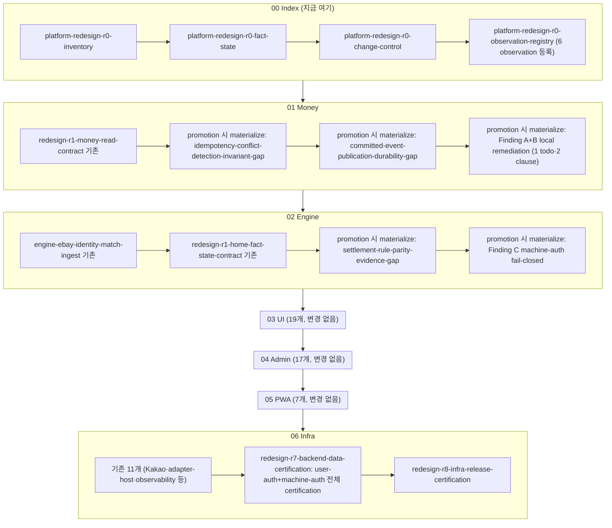

# R0 흡수 반영 플랜

## 핵심 결정 (예측·추측 없음 — 방금 재확인한 실측 기준)

**흡수한다. 별도 폴더·별도 플랜·별도 선행 트랙을 만들지 않는다.**

근거는 이번 대화에서 코드/문서로 직접 검증한 3가지뿐이다:

1. `.cursor/plans/ai_profit_os_00_index_a1b2c3d4.plan.md`에 이미 `platform-redesign-r0-observation-registry`(R0-4)가 **pending** 상태로 존재하고, 정확히 "외부 감사 결과를 observed→promoted로 흡수하는" 기능을 위해 설계돼 있다(`governance-observations.v1.json`, `observed|deferred|promoted|rejected`, `reviewTrigger`).
2. File-Serial 절대규칙(같은 파일에 재확인): "파일 N의 todos가 전부 completed 되기 전 파일 N+1 착수 금지." 00 Index는 지금 R0 4개 전부 pending이므로, **이 규칙은 우리 발견과 무관하게 이미 01~06 착수를 막고 있다** — 즉 "별도로 먼저 다 끝내야 하는 것"이 있다면 그건 새 트랙이 아니라 **이미 존재하는 00 Index R0 4개**다.
3. `redesign-r7-backend-data-certification`(06 Infra)이 이미 "semantic conflict면 owner 가산 todo+version bump"를 명시하고 있어, 새 governance 없이도 "발견→도메인 owner에게 todo 추가"라는 우리 모델과 100% 일치한다.

새 플랜 파일이나 새 폴더를 만들면 오히려 이 레포가 이미 가진 자기치유 장치와 **중복되는 두 번째 트랙**이 생겨, 이번 대화 전체가 지켜온 "중복0" 원칙을 스스로 어기게 된다.

## 전체 흐름 (File-Serial 그대로, 새 게이트 추가 0)



## 왜 "따로 먼저 전부"가 아닌가 — 질문에 대한 직접 답

**질문: `.cursor/plans/` 안의 플랜들을 이 발견 기반으로 작업 들어가기 전에 전부 먼저 작업해야 하는가?**

**답: 아니다.** 이유는 두 가지로 분리된다.

- 00 Index R0 4개만은 **원래부터** 01 착수 전 전부 끝나야 한다(우리 발견과 무관한 기존 절대규칙). 이건 "따로 만든 선행 트랙"이 아니라 이미 있던 게이트다.
- R0 종료 후에는 01→02→...→06 **순서대로**, 각 파일에 원래 있던 pending을 위→아래로 먼저 끝낸다. 그 다음 **promotion된 것만** 그 파일 맨 끝에 실제 todo로 materialize한다. 03 UI·04 Admin·05 PWA는 이번 감사에서 발견된 게 없으므로 **아무것도 추가되지 않고 기존 순서 그대로** 간다.

즉 "별도 작업"은 없고, "이미 정해진 순서의 정확한 위치에, promotion된 것만 끼워 넣는 것"만 있다.

## 숫자·용어 정정 (혼동 방지)

| 표현 | 정확한 수 | 비고 |
|---|---|---|
| R0 observation | **6건** | A/B/C(auth) + parity-evidence/idempotency-conflict/committed-event-durability(correctness) |
| 신규 remediation todo 후보 | **5개** | Money 3(idempotency·outbox·A+B묶음) + Engine 2(parity·C) |
| 기존 todo 보강 | **1건** | 06 Infra `redesign-r7-backend-data-certification` — 신규 todo 아님, 실행 범위 명시만 추가 |

"신규 todo 6개"라는 표현은 쓰지 않는다 — 미래 에이전트가 "6번째 신규 todo를 어디에 만들지" 잘못 찾게 만든다.

## 실행 원칙 — observation 등록과 todo materialize는 다른 시점이다

> **R0에서 발견을 먼저 governance 객체(observation)로 만들고, promotion된 것만 owner의 기존 File-Serial 끝에 실제 작업으로 materialize한다.**

즉 R0-4가 끝나는 순간 01 Money·02 Engine 플랜 파일에 5개 remediation 후보를 바로 다 써넣지 않는다. 순서는:

```
R0 observation 등록(R0-4) → reviewTrigger 도달 → promotion 판단(R0-3 change-control 절차 따름) → 해당 owner plan에 실제 todo materialize → 실행
```

**R0-3(`platform-redesign-r0-change-control`)이 실제로 정하는 L1/L2/L3 promotion 절차가, 이 플랜이 가정한 "owner 파일 끝에 추가"라는 배치보다 우선한다.** 이 플랜은 "어디에 들어갈 것인가(owner·순서)"만 확정했고, "언제·어떤 승인 절차로 실제 todo가 되는가"는 R0-3/R0-4 실행 결과가 정한다.

## 정확한 배치 지도 (promotion 후 기준)

| 파일 | 기존 pending(순서 유지) | promotion 시 끝에 materialize할 후보 | 근거 |
|---|---|---|---|
| [00 Index](.cursor/plans/ai_profit_os_00_index_a1b2c3d4.plan.md) | R0-1~R0-4 (4개) | 없음(대신 R0-4에서 6 observation **등록**) | R0-4 자신의 content가 "observed 흡수"를 명시 |
| [01 Money](.cursor/plans/ai_profit_os_01_money_c3d4e5f6.plan.md) | `redesign-r1-money-read-contract`(1개) | ① idempotency-conflict-detection-invariant-gap ② committed-event-publication-durability-gap ③ Finding A+B local remediation(1 todo·2 clause) | §43 Owns(outbox), read-contract가 "mutation 재작성0"이라 idempotency는 별도 |
| [02 Engine](.cursor/plans/ai_profit_os_02_engine_b2c3d4e5.plan.md) | `engine-ebay-identity-match-ingest`, `redesign-r1-home-fact-state-contract`(2개) | ① settlement-rule-parity-evidence-gap ② Finding C(adapters-ingest fail-open) | engine-rust·adapters 도메인 owner |
| 03 UI / 04 Admin / 05 PWA | 기존 19/17/7개, 변경 없음 | 없음 | 이번 감사 범위에서 UI/Admin/PWA 고유 신규 발견 0건 |
| [06 Infra](.cursor/plans/ai_profit_os_06_infra_a7b8c9d0.plan.md) | 기존 11개 | 없음(신규 todo 아님) — **기존** `redesign-r7-backend-data-certification`의 실행 범위에 "user-auth(Finding A) + machine-auth(Finding B/C) 전체 backend certification" 명시적으로 포함 | R7이 이미 "auth permission 1:1" 언급 중 |

## Remediation 후보 5개 — invariant draft (지금 쓰지 않음, promotion 시 참고)

각 항목은 [R0-4 Handoff Packet 캔버스](file:///C:/Users/PC/.cursor/projects/c-Users-PC-Desktop-AI-PROFIT-OS/canvases/peotteok-r0-handoff-packet.canvas.tsx)에 invariant/evidence/owner/severity/gate/remediation/verify/certification 9칸으로 이미 확정돼 있다. 이 플랜은 그 캔버스를 **입력**으로 참조하며 내용을 재작성하지 않는다. 아래는 이번 라운드에서 정정된 표현만 반영한다(HTTP status code·전송계층 등 solution-level 디테일은 invariant에서 제외).

1. `idempotency-conflict-detection-invariant-gap` — 01 Money — invariant: **same key + semantically different request MUST NOT silently reuse the prior result**(409 등 실제 응답 코드는 API contract 선택, 해시 방식도 구현 선택)
2. `committed-event-publication-durability-gap` — 01 Money — invariant: commit atomicity/delivery/acknowledgement 3-semantics. **Phase0에서도 닫을 수 있으며 NATS 도입은 필요조건이 아니다. Postgres transactional outbox가 유력한 remediation direction이나 아직 유일한 확정 solution은 아니다.**
3. Finding A+B 묶음(1 todo·2 clause) — 01 Money — A: subject는 principal에서 derive(`sessionUserId(req)` 재사용) / B: internal trigger는 fail-closed machine-auth(status code는 solution-level)
4. `settlement-rule-parity-evidence-gap` — 02 Engine — invariant: Rust↔JS 동일 golden fixture 실행 대조(신규 프레임워크 불필요, 기존 verify 패턴 확장)
5. Finding C(adapters-ingest fail-open) — 02 Engine — Finding B와 동일 invariant, 다른 owner라 별도 remediation

**기존 todo 보강 1건**: R7 certification 범위에 user-auth+machine-auth 명시(신규 todo 아님).

## 이 플랜이 하지 않는 것

- 지금 `.cursor/plans/*.plan.md` 파일을 수정하지 않는다(승인 후 Agent 모드+각 해당 turn에서, "한 채팅=한 todo" 규칙에 따라 R0-4부터 순서대로 실행).
- 5개 remediation 후보를 R0-4 종료 즉시 01 Money/02 Engine 플랜 파일에 미리 다 써넣지 않는다 — promotion 시점에만 materialize.
- 5개 remediation의 실제 코드를 지금 구현하지 않는다.
- CONSTITUTION/`tooling/verify/CATALOG.md`도 지금 건드리지 않는다 — 각 remediation todo가 실행되는 그 채팅에서 "verify 신설+CATALOG"까지 같은 커밋으로 처리(기존 관례와 동일).

## 승인 시 다음 행동(참고용 — 실행은 각각 별도 세션)

1. Agent 모드로 전환 후 `platform-redesign-r0-inventory`부터 순서대로 R0 4개 진행.
2. R0-3(`change-control`) 실행 시 실제 promotion 절차(L1/L2/L3)가 확정됨 — 이후 단계는 그 절차를 우선 따른다.
3. R0-4(`observation-registry`) 실행 시 위 캔버스의 6 observation을 `governance-observations.v1.json`으로 normalize(등록만, materialize 아님).
4. R0 pending 0 확인 후 01 Money `redesign-r1-money-read-contract`부터 순서대로 진행. 끝난 뒤, 관련 observation이 reviewTrigger 도달+promotion 판정을 통과하면 그때 3개 후보를 순서대로 materialize·실행.
5. 01 Money pending 0 확인 후 02 Engine 기존 2건 순서대로 진행. 끝난 뒤 promotion된 2개 후보 materialize·실행.
6. 03→04→05는 변경 없이 기존 순서 그대로.
7. 06 Infra `redesign-r7-backend-data-certification` 실행 시 user-auth+machine-auth 전체 재확인을 그 실행 범위에 포함.
