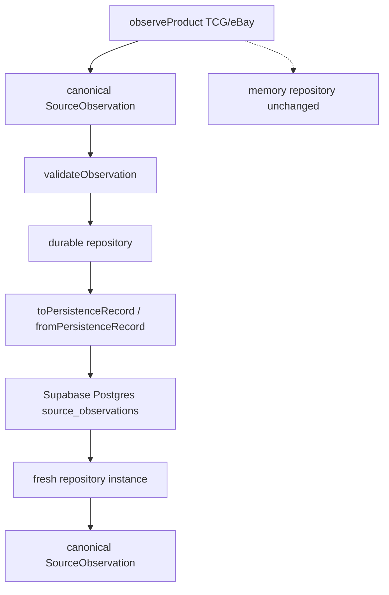

# SourceObservation Durable Persistence (impl-only)

## 조사로 확정된 사실

- HEAD = `0345206ad2e7238658454db5d072c8fbf93dbb37` (요청 Known HEAD와 일치)
- Working tree는 DIRTY. UI/Home/Opportunity/Money와 `package.json`, [tooling/verify/CATALOG.md](tooling/verify/CATALOG.md), [tooling/verify/domain-by-path.cjs](tooling/verify/domain-by-path.cjs), [services/market-intelligence/package.json](services/market-intelligence/package.json), [services/market-intelligence/src/index.cjs](services/market-intelligence/src/index.cjs) 는 **다른 세션 tracked dirty**. 이번 slice는 이 파일들을 열지 않는다.
- SourceObservation / identity-matching / canonical-product 트리와 [tooling/verify/source-observation-runtime.cjs](tooling/verify/source-observation-runtime.cjs) 는 **untracked**(이전 slice 완료물, 미커밋). 이번 slice owner로 취급하고 persistence 상태만 최소 수정한다.
- Production DB owner = **Supabase-managed PostgreSQL** (`mgsytcetsiecllmhcyox`, Seoul). 기존 클라이언트 패턴 = Nest [`services/api-nest/src/db/postgres.ts`](services/api-nest/src/db/postgres.ts) (`pg` Pool + `DATABASE_URL`).
- `source_observations` 테이블 **없음**. `listings` / `price_observations` 는 listing-leg(`asset_id` FK) — **재사용 금지**.
- Supabase preview branch = 0. 이 PC Docker = OFF. 격리 test/dev DB convention = 0.
- Founder 선택: **코드 + migration file만. production apply/write 금지. runtime = BLOCKED_NO_SAFE_DB.**

이번 실행에서 오른쪽 DB write/read는 **수행하지 않는다**. repository와 migration file만 남긴다.

## Git safety

시작 시 재확인: `git rev-parse HEAD` / `git status --short` / `git diff --name-only`.

금지: commit, push, stash, reset, restore, clean, force push, checkout overwrite, unrelated cleanup.

tracked dirty owner를 이번 persistence 때문에 병합하지 않는다. 필요해지면 `SOURCE_OBSERVATION_DURABLE_PERSISTENCE = BLOCKED_DIRTY_OWNER_CONFLICT` 로 STOP.

## Gate 0 — 기존 runtime만 재검증

구현 전, persist 없이 아래만 순서대로 실행한다. Playwright 신규 harness 0. 서버 동시 기동 0.

- `node tooling/verify/source-observation-runtime.cjs`
- `node tooling/verify/identity-matching-v1.cjs`
- `node tooling/verify/identity-matching-v2.cjs`
- `node services/market-intelligence/src/identity-matching/v2/live-automated-cross-source-match.cjs`
- `node tooling/verify/canonical-product.cjs`

재현 실패 시 matcher/parser를 고치지 않고 `PREVIOUS_RUNTIME_VERIFICATION = FAIL` 로 STOP.

참고: [tooling/verify/identity-matching-v2.cjs](tooling/verify/identity-matching-v2.cjs) 의 `PIPELINE_STATUS.TCGPLAYER_AUTOMATED_SOURCE_OBSERVATION = NOT_IMPLEMENTED` 는 **governance fixture 상태**다. live MATCH 증명은 `live-automated-cross-source-match.cjs` 가 owner다. 이 값을 이번 slice에서 바꾸지 않는다.

## Contract SSOT — 바꾸지 않는 것

Owner:

- [services/market-intelligence/src/source-observation/contract.cjs](services/market-intelligence/src/source-observation/contract.cjs)
- [services/market-intelligence/src/source-observation/validate.cjs](services/market-intelligence/src/source-observation/validate.cjs)
- [schemas/source-observation.v1.json](schemas/source-observation.v1.json)

이미 있는 identity 규칙:

- observation PK owner = contract 필드 `id` (`obs_${Date.now()}_${random}`). UUID로 바꾸지 않는다.
- source-local id = `externalItemId` (TCG `113669`, eBay `377416817781`).
- memory repo의 `sourceItemId` (`sit_…`) 는 in-process item row다. observation PK가 아니다. durable schema에 올리지 않는다.
- CanonicalProduct link의 `sourceItemId` 는 `obs.externalItemId` 다 ([create-from-match.cjs](services/market-intelligence/src/canonical-product/create-from-match.cjs)). 이번 table에 FK 금지.

[observe.cjs](services/market-intelligence/src/source-observation/observe.cjs) / adapter / matcher / canonical-product core 는 수정하지 않는다. persist는 observe 바깥의 explicit repository 호출이다.

[repository.memory.cjs](services/market-intelligence/src/source-observation/repository.memory.cjs) 는 유지. 기존 verifier의 in-process persist seam을 DB 의존으로 바꾸지 않는다.

## Durable architecture

신규만:

- [services/market-intelligence/src/source-observation/persistence-mapper.cjs](services/market-intelligence/src/source-observation/persistence-mapper.cjs)
- [services/market-intelligence/src/source-observation/repository.postgres.cjs](services/market-intelligence/src/source-observation/repository.postgres.cjs)

mapper:

- `toPersistenceRecord(observation)` → lookup columns + canonical `payload` jsonb + mapper가 계산한 `content_fingerprint`
- `fromPersistenceRecord(record)` → payload를 다시 observation으로. `validateObservation` fail-closed
- lookup column ↔ payload 불일치면 `PERSISTED_RECORD_PAYLOAD_CONFLICT` (id/source/externalItemId/purpose/status/url/observedAt)
- memory 전용 필드(`sit_` sourceItemId, 저장용 fingerprint) 는 payload에서 제거
- DB naming 때문에 contract 필드명을 바꾸지 않는다
- fingerprint: validated observation → storage-only 제거 → key-sort + undefined omit → stable JSON → SHA-256. caller 제공 fingerprint 사용 금지. `JSON.stringify(raw)` 단독 금지

repository:

- 생성자 DI: `{ querier }` (`query(text, params)` + `end()`). `pg`를 market-intelligence `package.json`에 추가하지 않는다 (해당 파일 tracked dirty).
- `appendObservation(obs)`: insert 전 `validateObservation`. SQL에 `UPDATE` 없음.
- race-safe: `INSERT ... ON CONFLICT (id) DO NOTHING RETURNING *`. row가 없으면 기존 row SELECT 후 fingerprint 비교
- 같은 `id` + 같은 fingerprint → `IDEMPOTENT_SUCCESS` (기존 row 반환)
- 같은 `id` + 다른 payload → `BLOCKED_CONFLICT` (덮어쓰기 0)
- 같은 `source` + 같은 `externalItemId` + 다른 `id` → 두 번째 INSERT (history)
- DB 실패 시 memory repo로 조용히 넘기지 않는다. persistence status만 FAIL
- `getByObservationId(id)` / `listBySourceItem(source, externalItemId)`

[source-observation/index.cjs](services/market-intelligence/src/source-observation/index.cjs) 에 durable factory + mapper만 export. tracked dirty인 [services/market-intelligence/src/index.cjs](services/market-intelligence/src/index.cjs) 는 이미 `sourceObservation` namespace를 내보내므로 손대지 않는다.

## Schema — 최소 additive, apply 0

`MIGRATION_FILENAME_HARDCODE = NO`. 구현 시 `supabase/migrations` 최신 `YYYYMMDDHHMMSS`를 읽고, 그보다 큰 충돌 없는 monotonic timestamp로 `*_source_observations.sql` 를 만든다. 조사 시점 latest = `20260818010000_krw_deposit_fx_facts.sql`. `20260819020000` 고정 금지.

개념 컬럼:

- `id text PRIMARY KEY` = contract `id`
- `source`, `external_item_id`, `observation_purpose`, `source_status`, `url`, `observed_at`
- `payload jsonb` = canonical SourceObservation 전체
- `content_fingerprint text`
- `created_at timestamptz`

제약/인덱스:

- `yahoo_jp` CHECK 금지
- `(source, external_item_id)` UNIQUE **금지**
- index: PK, `(source, external_item_id, observed_at DESC)`, `observed_at DESC`
- RLS ON, anon policy 0 (기존 listings와 같이 service_role bypass)
- `BEFORE UPDATE OR DELETE` forbid trigger (ledger 테이블 재사용 아님. observation 전용 함수)
- FK 금지: assets, listings, opportunities, CanonicalProduct, match result

기존 governance `sqlProposal.source_items` 는 이번 slice에서 **만들지 않는다**. 정규화 확대 금지. 전체 payload jsonb가 round-trip owner다.

금지:

- [tooling/verify/fixtures/migrations-applied.v1.json](tooling/verify/fixtures/migrations-applied.v1.json) 를 apply 없이 갱신 (위조)
- Supabase MCP `apply_migration` / production `execute_sql` write
- `verify:migrations-applied-parity` 를 이번 slice PASS 조건으로 실행. 로컬-only migration이면 이 checker는 **의도적으로 FAIL**한다. 다음 slice에서 apply 후 fixture 갱신.

## 이전 slice verifier 게이트 — 최소 해제

현재 [tooling/verify/source-observation-runtime.cjs](tooling/verify/source-observation-runtime.cjs) 는 이번 작업을 금지한다.

- `source_observation` migration 존재 시 FAIL
- `OBSERVATION_DB_RUNTIME` 가 `BLOCKED_LOCAL_ENV` 가 아니면 FAIL
- `supabaseMigrationThisSlice !== false` 면 FAIL

이 파일과 governance/contract persistence 상태만 정직하게 맞춘다. SourceObservation 의미/invariant는 그대로.

[governance/global-product/source-observation-runtime.v1.json](governance/global-product/source-observation-runtime.v1.json) + [contract.cjs](services/market-intelligence/src/source-observation/contract.cjs) `PERSISTENCE_VERDICT`:

- `OBSERVATION_REPOSITORY_CONTRACT` / `OBSERVATION_MEMORY_RUNTIME` / `OBSERVATION_SQL_CONTRACT` 유지
- `OBSERVATION_DB_RUNTIME` = `BLOCKED_NO_SAFE_DB`
- `PRODUCTION_OBSERVATION_PERSISTENCE` = `NOT_IMPLEMENTED` (write 증거 없음)
- `remoteWrite` = false
- `supabaseMigrationFileCreated` = true
- `supabaseMigrationApplied` = false

[tooling/verify/identity-matching-v1.cjs](tooling/verify/identity-matching-v1.cjs) 는 `PRODUCTION_OBSERVATION_PERSISTENCE === NOT_IMPLEMENTED` 를 요구한다. 이 값을 유지하므로 **해당 파일은 수정하지 않는다**.

## Verifier

신규: [tooling/verify/source-observation-durable-persistence.cjs](tooling/verify/source-observation-durable-persistence.cjs)

`package.json` / `CATALOG.md` / `domain-by-path.cjs` 에 스크립트를 등록하지 않는다. 실행은 `node tooling/verify/source-observation-durable-persistence.cjs` 만.

검증 범위 (이번 Founder 선택 기준):

- production/Supabase host detect → write 거부
- memory fallback masquerade 거부
- invalid observation → insert 전 `validateObservation` BLOCKED
- mapper semantic equality (in-process, DB 아님)
- repository SQL에 `UPDATE`/`DELETE` 없음 (소스 검사)
- append-only / observationId ≠ externalItemId (소스+스키마 검사)
- querier double로 idempotent / payload conflict / concurrent duplicate INSERT 분기. `CONCURRENT_DUPLICATE_INSERT_SEMANTICS = IDEMPOTENT`. **durable runtime PASS로 보고하지 않음**
- lookup column ↔ payload consistency fail-closed
- deterministic fingerprint: 같은 semantic observation → 같은 SHA-256

하지 않는 것:

- live TCG/eBay observation을 DB에 insert
- fresh repository read를 PASS로 주장
- cross-process를 PASS로 주장
- CanonicalProduct / MatchResult DB

구현 후 bounded 재실행은 Gate 0과 동일한 기존 verifier + 신규 durable verifier. `migrations-applied-parity` 는 호출하지 않는다.

## 이번 slice가 주장할 수 있는 결과

PASS 가능:

- `PREVIOUS_RUNTIME_VERIFICATION` (Gate 0가 실제로 통과할 때)
- `PRODUCTION_DB_OWNER = FOUND`
- `PRODUCTION_DB_TECHNOLOGY = supabase_postgres`
- `SOURCE_OBSERVATION_DURABLE_REPOSITORY_IMPLEMENTATION = PASS`
- `SOURCE_OBSERVATION_DB_RUNTIME_VERIFICATION = BLOCKED_NO_SAFE_DB`
- memory repo 유지, listing-leg persist 0
- `CANONICAL_PRODUCT_DURABLE_DB_PERSISTENCE = NOT_IMPLEMENTED`
- `MATCH_RESULT_DURABLE_PERSISTENCE = NOT_IMPLEMENTED`

이번 B 슬라이스 성공 판정 (실패가 아님):

- `SOURCE_OBSERVATION_MIGRATION_FILE = PASS`
- `APPEND_ONLY_SQL_CONTRACT = PASS`
- `IDEMPOTENT_RETRY_LOGIC = PASS`
- `PAYLOAD_CONFLICT_BLOCK = PASS`
- `CANONICAL_FINGERPRINT = PASS`
- `PERSISTED_RECORD_PAYLOAD_CONSISTENCY = PASS`
- `MIGRATION_APPLIED = NO`
- `TCG_DURABLE_WRITE` / `EBAY_DURABLE_WRITE` = `NOT_VERIFIED`
- `SOURCE_OBSERVATION_FRESH_REPOSITORY_DURABILITY` = `NOT_VERIFIED`
- `SOURCE_OBSERVATION_CROSS_PROCESS_DURABILITY` = `NOT_VERIFIED`
- `DB_RLS_RUNTIME_ROLE_VERIFICATION = NOT_VERIFIED`
- `DURABLE_OBSERVATION_MATCH_REGRESSION` = `NOT_VERIFIED` (in-process V2는 기존 live script owner)

최종 보고는 요청된 `# PUTDUK_PRODUCTION_SOURCE_OBSERVATION_DURABLE_PERSISTENCE` 형식을 그대로 사용하고 STOP. 다음 slice 자동 착수 금지.

권장 다음: Founder가 안전한 DB URL을 주거나 production schema apply를 승인한 뒤 `PUTDUK_CANONICAL_PRODUCT_AND_PD_DURABLE_PERSISTENCE` 가 아니라, **먼저 SourceObservation DB runtime 증명**을 닫는다. CanonicalProduct/PD DB는 그 다음이다.
