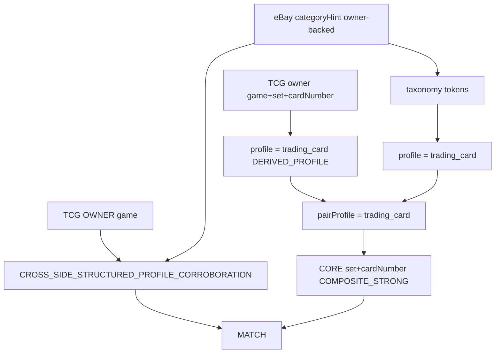

# PUTDUK_MISSING_INDEPENDENT_STRUCTURED_CORROBORATION_FIX_AND_REAL_PAIR_RETRY

## Git safety (read-only 확인 완료)

- HEAD = `0345206ad2e7238658454db5d072c8fbf93dbb37` (요청값과 동일)
- Worktree DIRTY는 정상. Spark Dash / UI / 다른 세션 파일은 미접촉
- 이 slice에서 **commit / push / stash / restore / reset / clean 금지**

## 왜 taxonomy만 고치면 PASS가 아닌가

현재 owner는 [`evidence.cjs`](services/market-intelligence/src/identity-matching/v2/evidence.cjs)의 `resolveSingleProfileV2`다.

```130:151:services/market-intelligence/src/identity-matching/v2/evidence.cjs
function resolveSingleProfileV2(obs) {
  // ...
  const hint = normalizeText(metaOf(obs).categoryHint);
  if (!hint) return "unknown";
  if (hint === "trading_card" || /\btrading cards?\b/.test(hint)) {
    return "trading_card";
  }
  // ...
  return "unknown";
}
```

`normalizeText`는 `|` `&` 를 공백으로 바꾼다. 그래서 live hint

`Toys & Hobbies|Collectible Card Games|CCG Individual Cards`

→ `toys hobbies collectible card games ccg individual cards`

는 `\btrading cards?\b`에 안 걸린다. 그래서 eBay `singleProfile = unknown`, pairProfile = unknown, composite path 미개방.

하지만 eBay만 `trading_card`가 되어도 **독립 corroboration은 여전히 실패**한다.

- TCG live obs([`buildTcgObservation`](services/market-intelligence/src/identity-matching/v2/live-real-pair-validation.cjs))에는 `categoryHint`가 없다
- 기존 `independentStructuredCorroboration` category path는 **양쪽 owner.category + 양쪽 resolved profile이 unknown이 아님**을 요구한다
- eBay Game aspect는 parser가 안 넣는다 → `bothOwnerExact(game)`도 불가
- title에서 나온 Pokemon / Charizard / Generations / 11/83는 `provenanceFamily = title` 1개

그래서 필요한 최소 수정은 3줄이 아니라 **같은 파일 안의 3개 구멍**이다. matcher redesign은 하지 않는다. [`profiles.cjs`](services/market-intelligence/src/identity-matching/v2/profiles.cjs) composite 조건과 [`matcher.cjs`](services/market-intelligence/src/identity-matching/v2/matcher.cjs) decide()는 그대로 둔다.



## Fix 1 — eBay structured category taxonomy

파일: [`evidence.cjs`](services/market-intelligence/src/identity-matching/v2/evidence.cjs) `resolveSingleProfileV2`만.

범용 token만 (`Pokemon` / `Charizard` / `Generations` / `11/83` / productId / itemId hardcode 금지).

인식:

- `trading card` / `trading cards` (기존 유지 → fixture A의 `Trading Card Games` 회귀 없음)
- `collectible card game` / `collectible card games`
- `ccg individual card` / `ccg individual cards`
- `sports trading card` / `sports trading cards`
- `non sport trading card` / `non sport trading cards` (hyphen은 normalize 후 공백)

명시적으로 **오인 금지**: `collectible` / `collectibles` / `card` / `cards` 단독.

목표: live hint → `categoryProfile = trading_card`. V1 [`normalize.cjs`](services/market-intelligence/src/identity-matching/normalize.cjs) `resolveSingleProfile`는 수정하지 않는다.

## Fix 2 — TCG profile routing (selection only)

같은 `resolveSingleProfileV2` 마지막 fallback:

- `identityHints.game` + `set` + (`cardNumber` 또는 `number`)가 모두 있으면 `trading_card`
- 이건 **profile selection**이다. `owner.category`에 `trading_card`를 쓰지 않는다
- `DERIVED_PROFILE` → `OWNER_BACKED_STRUCTURED` 승격 금지
- set / cardNumber / game evidenceOwner는 기존 `OWNER_BACKED_STRUCTURED` 유지

우선순위:

1. explicit `identityHints.categoryProfile` (MVP)
2. owner-backed `categoryHint` taxonomy
3. owner-backed game+set+cardNumber geometry

geometry는 category가 없을 때만 쓴다. sneakers hint가 있으면 sneakers가 이긴다.

## Fix 3 — independent structured corroboration (보정)

파일: 같은 `independentStructuredCorroboration`.

`set + cardNumber`는 CORE IDENTITY에서만 쓴다. independent로 다시 세지 않는다.

```text
CORE IDENTITY:
TCG OWNER set ↔ eBay DERIVED set
TCG OWNER cardNumber ↔ eBay DERIVED cardNumber

INDEPENDENT = CROSS_SIDE_STRUCTURED_PROFILE_CORROBORATION:
한쪽 OWNER_BACKED game 존재
반대쪽 OWNER_BACKED categoryHint → trading_card taxonomy
AND pairProfile = trading_card
AND critical conflict = 0
```

예: TCG `game=Pokémon` (OWNER) + eBay `Collectible Card Games|CCG Individual Cards` (OWNER → trading_card).

금지:

- set/cardNumber core evidence 재사용
- title family 재사용
- derived-only corroboration
- image synthetic corroboration을 이 경로에 넣기

기존 경로(both-owner game / both-owner category / character / language)는 유지.

[`evaluateTradingCard`](services/market-intelligence/src/identity-matching/v2/profiles.cjs)는 이미 `hasIndependentCorroboration`을 요구한다. brand/character 필수화는 하지 않는다.

governance [`identity-matching.v2.json`](governance/global-product/identity-matching.v2.json)는 derived profile routing을 명시 금지하지 않는다 (`rewriteAsOwnerBacked`만 금지). governance 수정 없음.

## Same real pair retry

새 상품 검색 금지. live script [`live-real-pair-validation.cjs`](services/market-intelligence/src/identity-matching/v2/live-real-pair-validation.cjs) 재사용.

입력값 pin만 허용 (production matcher special-case 아님):

- TCG: 기존 `buildTcgObservation()` product `113669`
- eBay: discovery query 대신 `observeProduct({ source: "ebay", externalItemId: "377416817781", purpose: "CONFIRMATION" })`

이 item CONFIRMATION이 UNAVAILABLE/실패하면 matcher를 느슨하게 하지 않고 remaining blocker만 보고한다. 그때만 backup 1~2.

목표:

```text
pairProfile = trading_card
set exact + cardNumber exact
independent structured corroboration = PASS
conflicts = []
decision = MATCH
matchPath = COMPOSITE_STRONG
matcherVersion = identity-matching.v2
```

성공해도 pipeline 과장은 금지:

```text
TCG_OBSERVATION_MODE = MANUAL_LIVE_VALIDATION
TCGPLAYER_AUTOMATED_SOURCE_OBSERVATION = NOT_IMPLEMENTED
TCG_AUTOMATED_CONFIRMATION = NOT_IMPLEMENTED
REAL_AUTOMATED_CROSS_SOURCE_MATCH = BLOCKED_UNTIL_SOURCE_RUNTIME
```

## Fixtures L / M

파일: [`fixtures.cjs`](services/market-intelligence/src/identity-matching/v2/fixtures.cjs), assert는 [`identity-matching-v2.cjs`](tooling/verify/identity-matching-v2.cjs).

A–K 기대값 불변.

- **L** — live pair와 같은 모양, 상품값 hardcode 없음: CORE는 set+cardNumber exact. INDEPENDENT는 TCG owner game + eBay owner categoryHint→trading_card. `expect = MATCH`, `expectPath = COMPOSITE_STRONG`. TCG `owner.category`는 null. set/cardNumber는 independent field가 아님.
- **M** — `Collectibles|Decorative Collectibles` (또는 collectible이지만 card-game이 아닌 path). `resolveSingleProfileV2`가 `trading_card`가 되면 FAIL. 전체 pair는 MATCH가 되면 안 됨.

verify에 `Charizard` / `113669` / `377416817781` production 분기는 넣지 않는다.

## Verification (이 3개만)

```text
pnpm verify:identity-matching-v1
node tooling/verify/identity-matching-v2.cjs
node services/market-intelligence/src/identity-matching/v2/live-real-pair-validation.cjs
```

full suite / `verify:gate` / UI / V1 코드 수정 금지. `identity-matching-v2.cjs`가 내부에서 V1을 한 번 더 돌리는 것은 기존 동작.

## File scope

수정:

- [`services/market-intelligence/src/identity-matching/v2/evidence.cjs`](services/market-intelligence/src/identity-matching/v2/evidence.cjs)
- [`services/market-intelligence/src/identity-matching/v2/fixtures.cjs`](services/market-intelligence/src/identity-matching/v2/fixtures.cjs)
- [`tooling/verify/identity-matching-v2.cjs`](tooling/verify/identity-matching-v2.cjs)
- [`services/market-intelligence/src/identity-matching/v2/live-real-pair-validation.cjs`](services/market-intelligence/src/identity-matching/v2/live-real-pair-validation.cjs) — item pin + 결과 필드만

수정하지 않음: V1, ebay adapter, `profiles.cjs`/`matcher.cjs`(필요 시 최소), governance, Spark Dash, package.json, CATALOG.

## Failure rule

같은 pair가 또 실패하면 matcher를 풀지 않는다. remaining blocker 하나만 보고 다음으로 간다. 예: `PAIR_PROFILE = trading_card`인데 corroboration이 여전히 missing이면 그 이유만.

## PASS 후

설계로 돌아가지 않는다. 다음 slice:

`PUTDUK_TCGPLAYER_MINIMAL_AUTOMATED_SOURCE_OBSERVATION`

## 최종 보고

요청한 `# PUTDUK_MISSING_INDEPENDENT_STRUCTURED_CORROBORATION_FIX_AND_REAL_PAIR_RETRY` 포맷 그대로. `COMMIT_PUSH_STASH_RESTORE = NO`.
