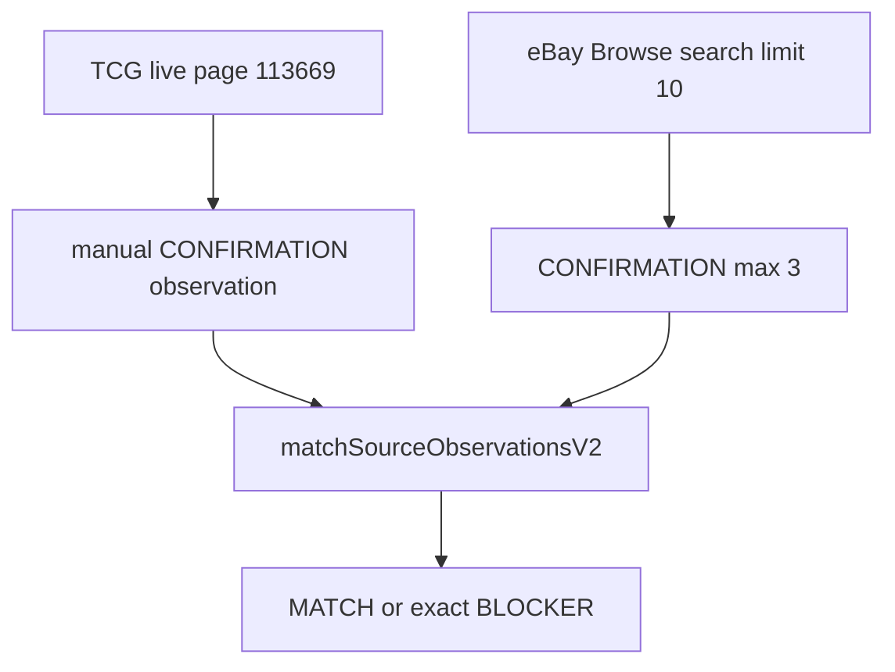

# PUTDUK_IDENTITY_MATCHING_V2_ONE_REAL_PAIR_VALIDATION

## 목표 / 비목표

성공은 오직 이것:

- `matchSourceObservationsV2(left, right)` = `MATCH`
- `matchPath` = `COMPOSITE_STRONG` 또는 valid `STRONG`
- `V2_REAL_PAIR_IDENTITY_MATCH = PASS`

아직 아닌 것: automated TCGplayer source runtime, CanonicalProduct, Opportunity, `/profits`, Vision, price.

HEAD는 확인됨: `0345206ad2e7238658454db5d072c8fbf93dbb37`. Working tree DIRTY는 정상. Spark Dash/다른 세션 파일 미접촉. `commit` / `push` / `stash` / `restore` / `reset` / `clean` 금지.

## 이미 있는 것 — 재사용만

V2 runtime은 fixture A로 같은 geometry를 이미 PASS한다.

- 계약: [governance/global-product/identity-matching.v2.json](governance/global-product/identity-matching.v2.json)
- matcher: [services/market-intelligence/src/identity-matching/v2/matcher.cjs](services/market-intelligence/src/identity-matching/v2/matcher.cjs)
- owner-anchored derive: [services/market-intelligence/src/identity-matching/v2/evidence.cjs](services/market-intelligence/src/identity-matching/v2/evidence.cjs) (`titleHasExactValue` + `owner_anchored_exact_phrase`)
- trading_card composite: [services/market-intelligence/src/identity-matching/v2/profiles.cjs](services/market-intelligence/src/identity-matching/v2/profiles.cjs)
- eBay live: `discoverSourceItems` + `observeProduct({ source: "ebay", purpose: "CONFIRMATION" })` in [services/market-intelligence/src/source-observation/observe.cjs](services/market-intelligence/src/source-observation/observe.cjs)
- 패턴: [services/market-intelligence/src/identity-matching/live-overlap-audit.cjs](services/market-intelligence/src/identity-matching/live-overlap-audit.cjs)

수정 금지:

- `services/market-intelligence/src/identity-matching/**` 중 V1
- `v2/matcher.cjs` · `v2/evidence.cjs` · `v2/profiles.cjs` · `v2/fixtures.cjs`
- eBay adapter/parser (`ASPECT_ALLOW` 포함)
- Home / Profits / Wallet / DB



## 예상 MATCH geometry (matcher 변경 없이)

현재 composite는 다음이 전부 필요하다.

1. 한쪽 `OWNER_BACKED` set + cardNumber
2. 반대쪽 같은 값 `DERIVED_STRUCTURED` exact (`derivedFrom=title`, `provenanceFamily=title`)
3. `brandAndCategoryAgree`
4. independent corroboration 1개
5. critical conflict 0
6. 양쪽 `CONFIRMATION` + `SUCCESS`

Independent는 **같은 title에서 Pokemon/Charizard/Generations/11/83을 4개 뽑아도 1 family**다.

### CORRECTION_1 — categoryProfile을 owner-backed로 꾸미지 않음

- 페이지에 실제 structured taxonomy/category(`Pokemon` / `Trading Card` 등)가 있으면 `TCG_CATEGORY_PROFILE_OWNER = OWNER_BACKED`
- Set+Number만 있고 category가 없으면 `DERIVED_PROFILE`. `identityHints.categoryProfile = trading_card`를 OWNER로 넣지 않음
- MATCH를 만들려고 categoryProfile을 위조 금지

### CORRECTION_2 — trading_card composite는 brand/character 필수 아님

현재 `brandAndCategoryAgree`는 brand가 **양쪽 다 있고 다를 때만** fail한다. 없는 brand/character로 MATCH를 실패시키면 안 된다.

잠금:

- `TRADING_CARD_BRAND_REQUIRED = NO`
- `TRADING_CARD_CHARACTER_REQUIRED = NO`
- `CATEGORY_PROFILE_COMPATIBILITY = REQUIRED`
- `SET_NUMBER_IDENTITY = REQUIRED`
- `INDEPENDENT_CORROBORATION = REQUIRED`

있으면 corroborating, 없으면 자동 실패 아님. TCG Game을 brand로 복사 금지.

### CORRECTION_3 — TCG observation 라벨

`observationPurpose=CONFIRMATION` / `sourceStatus=SUCCESS`는 identity validation에만 허용. 보고 필수:

- `TCG_OBSERVATION_MODE = MANUAL_LIVE_VALIDATION`
- `TCG_AUTOMATED_CONFIRMATION = NOT_IMPLEMENTED`

금지:

- `opts.imageCorroboration = true`를 live MATCH evidence로 사용
- eBay title 파싱 값을 `OWNER_BACKED`로 승격
- `if Charizard / Generations / 11/83` matcher hardcode
- TCG Game을 brand로 복사

## Step 0 — git read-only

실행 시작 시 다시:

- `git rev-parse HEAD`
- `git status --short`
- `git diff --name-only`

## Step 1 — TCG left observation (parser 아님)

Primary URL (과거 forensic 재사용, live 재확인):

- `https://www.tcgplayer.com/product/113669/pokemon-generations-charizard-ex`

Playwright로 이 1페이지만 연다. 라벨이 있는 structured 값만 기록:

- Product Details `Card Number / Rarity` → `cardNumber = 11/83` (rarity는 finish 후보, number와 분리)
- Set = `Generations` (페이지 표기 그대로)
- Game = `Pokemon` / `Pokémon` (structured일 때만)
- name/character = 별도 name 필드가 있을 때만. 없으면 생략 (필수 아님)
- category/taxonomy = 페이지에 실제 라벨이 있을 때만 owner-backed. Set+Number만으로 `trading_card` OWNER 승격 금지
- source URL, product id `113669`, `observedAt`
- image URL은 있으면 `IMAGE_OBSERVED` reference only

`observationPurpose=CONFIRMATION`, `sourceStatus=SUCCESS`, `parserVersion=validation.tcgplayer.live-manual.1`.
`TCG_OBSERVATION_MODE = MANUAL_LIVE_VALIDATION`.

title에서 뽑은 값을 owner로 올리지 않는다. Market Price / listing 0은 무시 (identity only).

페이지 불가 → pair 1 `TCG_CURRENT_LISTING_UNAVAILABLE`로 기록하고 backup 규칙으로만 이동.

## Step 2 — eBay right observation (기존 runtime)

새 adapter 없음. [live-overlap-audit.cjs](services/market-intelligence/src/identity-matching/live-overlap-audit.cjs)와 동일:

- `credentialsFromEnv()` — 없으면 `BLOCKED_CREDENTIALS`로 종료 (matcher 수정 없음)
- `discoverSourceItems({ source: "ebay", query, limit: 10, marketplaceId: "EBAY_US" })`
- query는 TCG owner 값으로만: `Charizard EX Generations 11/83` (필요 시 `Pokemon` 접두)
- search는 이미 `buyingOptions:{FIXED_PRICE}`

후보 선택 (pair 1 안에서):

- title이 TCG owner set/number를 exact normalized phrase로 포함
- 그 중 CONFIRMATION SUCCESS 1건. 실패 시 같은 상품 후보만 포함해 전체 confirm ≤ 3

eBay observation은 parser 출력 그대로:

- owner: brand, `categoryHint=categoryPath`, aspects 중 이미 통과하는 것만
- set/cardNumber는 title에만 있으면 matcher가 DERIVED로 만듦
- Game aspect가 API에 있어도 이번 slice에서 parser allowlist를 열지 않음

## Step 3 — ephemeral validation script only

새 파일 1개:

- [services/market-intelligence/src/identity-matching/v2/live-real-pair-validation.cjs](services/market-intelligence/src/identity-matching/v2/live-real-pair-validation.cjs)

역할:

- TCG live-manual observation + eBay live observation을 `matchSourceObservationsV2`에 넣음
- `opts.imageCorroboration` 사용 안 함
- Founder 보고서 형식을 stdout에 출력
- credential 값 출력 금지
- `package.json` / CATALOG / `domain-by-path` 배선 안 함 (live network ≠ gate)

## Step 4 — bounded pair loop

`PAIRS_CHECKED_TOTAL <= 3`.

- Pair 1 = Charizard EX / Generations / 11/83
- Pair 1이 `MATCH`면 즉시 종료
- Pair 1이 `INSUFFICIENT_EVIDENCE` / `CONFLICT` / observation 불가면 matcher를 풀지 않고 부족한 evidence를 그대로 기록
- 그 다음에만 같은 category에서 backup 최대 2쌍. 조건: TCG public page + owner set/number + eBay search overlap + confirmation 가능. 4번째 없음
- 같은 pair의 eBay listing을 수십 개 조사 금지

## PASS / BLOCKED

PAIR PASS (잠금):

1. TCG 실제 live page
2. eBay 실제 Browse Confirmation
3. 양쪽 CONFIRMATION-valid validation state
4. TCG owner-backed set + cardNumber
5. eBay same set/number DERIVED exact
6. trading_card profile/category compatibility (brand/character 필수 아님)
7. title family와 독립된 structured corroboration >= 1
8. critical conflict = 0
9. `matchSourceObservationsV2()` = MATCH
10. `matchPath` = COMPOSITE_STRONG | valid STRONG

성공해도 보고는 고정:

- `TCG_OBSERVATION_MODE = MANUAL_LIVE_VALIDATION`
- `TCG_AUTOMATED_CONFIRMATION = NOT_IMPLEMENTED`
- `TCGPLAYER_AUTOMATED_SOURCE_OBSERVATION = NOT_IMPLEMENTED`
- `REAL_AUTOMATED_CROSS_SOURCE_MATCH = BLOCKED_UNTIL_SOURCE_RUNTIME`

3쌍 전부 실패면 `REAL_PAIR_VALIDATION = BLOCKED` + 가장 작은 다음 slice 1개만. 예상 후보:

- `MISSING_EBAY_INDEPENDENT_STRUCTURED_CORROBORATION` — categoryPath가 `trading card(s)` regex에 안 걸림 (eBay Game aspect는 관측되지만 parser가 drop)
- `EBAY_CONFIRMATION_INVALID`
- `TCG_CURRENT_LISTING_UNAVAILABLE`
- `BLOCKED_CREDENTIALS`

## Verification

게이트 전체 / Next 빌드 금지.

```text
pnpm verify:identity-matching-v1
node tooling/verify/identity-matching-v2.cjs
node services/market-intelligence/src/identity-matching/v2/live-real-pair-validation.cjs
```

V1/V2 fixture PASS 유지. 성공 후 다음 추천은 `PUTDUK_TCGPLAYER_MINIMAL_AUTOMATED_SOURCE_OBSERVATION` (이번 slice에서 구현하지 않음).
