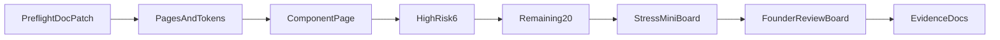

# HC6-08 Wallet 26장 — 실제 Figma Visual Master

이번 작업의 성공은 문서가 아니라 **Figma에 26장이 실제로 존재하는 것**이다. Founder 승인·제품 구현·HC6-08 complete는 하지 않는다.

```text
SPEC → ACTUAL FIGMA → FOUNDER EYE REVIEW
CURSOR_SELF_APPROVAL=FORBIDDEN
FOUNDER_VISUAL_APPROVAL=PENDING
IMPLEMENTATION_EXECUTED=NO
```

---

## 사전 조사 결과

### Figma write

- MCP `plugin-figma-figma` 인증됨: 계정 `퍼뜩` / `globalgoldkr@gmail.com` / 팀 `퍼뜩의 팀` / seat Full
- Write 도구: `use_figma` (Plugin API). `generate_figma_design`(라이브 웹 캡처)는 **사용하지 않음** — Wallet 제품 UI를 구현·기동해서 캡처하는 경로가 되고, 이번 pass의 `PRODUCT_UI_SOURCE_CHANGE=0`과 충돌한다
- 기존 제품 파일 식별됨: [`c1KKkUBo0Pud6xs51SY7Kd`](https://www.figma.com/design/c1KKkUBo0Pud6xs51SY7Kd) (Home Production V4 evidence의 `fileKey`)
- 현재 페이지는 `Page 1`만. Home draft/reference가 들어 있고 **sidebar=220** (Home 전용)
- 이 파일은 **디자인 시스템 / 브랜드 자산 컨테이너**로만 사용한다. 새 Wallet page를 여기에 추가한다. 새 파일을 중복 생성하지 않는다

### HARD LOCK — 기존 Figma tree는 Visual Authority가 아님

```text
EXISTING_FIGMA_FILE_ROLE=BRAND_AND_TOKEN_CONTAINER_ONLY
EXISTING_WALLET_OR_HOME_FRAME=NOT_VISUAL_AUTHORITY
CLONE_EXISTING_WALLET_FRAME=FORBIDDEN
OVERLAY_ON_EXISTING_FRAME=FORBIDDEN
PATCH_BASE_FROM_EXISTING_TREE=FORBIDDEN
AUTHORITATIVE_FRAMES=CLEAN_BUILD_ON_NEW_PAGES
```

허용 재사용 (파일 안에서 꺼내 쓰는 것):

- Brand Kit 로고/워드마크 자산
- 이미 파일에 있는 색/폰트 variable 중 Visual Master와 **값이 일치하는 것**만 (없으면 Wallet page에 새로 만듦)
- Pretendard / Noto Sans KR 폰트 패밀리

금지:

- `Page 1` Home frame (`REFERENCE / Home`, `DRAFT / Home`, sidebar 220, 3열, 로봇 히어로)을 duplicate / overlay / 좌표 패치
- 기존 Wallet frame·layout·component tree가 파일 안에 있어도 **복제·인스턴스·patch base 금지**
- Home draft `Button`(36px) · `NavItem` · `StatBlock` · `CategoryCard` · `BottomNavItem`을 Wallet 컴포넌트 베이스로 인스턴스
- Home chrome을 240으로 늘려 “Wallet처럼” 보이게 고치기
- 기존 화면 위에 annotation만 얹어 authoritative로 승격

26장 + Wallet chrome + Wallet COMPONENTS는 전부 **새 page / 새 frame / 새 component**로 Visual Master 숫자에서 그린다.

### Pre-flight 4항목 — `PRE_FLIGHT_PATCH_REQUIRED=YES`

이미 맞는 것: 프레임 맵 26장, chrome 1440/390, History empty 카피 존재, Fee “값 없으면 숨김” 방향.

아직 문서에 남은 결함 (세 Visual Master 문서만 최소 수정, architecture 재설계 없음):

**A. Desktop pair cards** — [`HC6_08_WALLET_VISUAL_MASTER.md`](_tmp_home_clean/v1/phase6/HC6_08_WALLET_VISUAL_MASTER.md) §5 L239에 잘못된 식이 남아 있음:

```text
(760 − 32×2 − 16) / 2 = 356   ← 삭제
```

단일 권위:

```text
16 + 356 + 16 + 356 + 16 = 760
outer pair gutter = 16
card = 356
gap = 16
```

Transaction full-width CTA `340 + 16 + 340 = 696` (inner padding 32)과 **혼동하지 않음**. Overview JSON geometry는 이미 CTA를 340으로 분리해 두었음.

**B. Mobile Method Card** — 같은 표 L240에 `326 × min 96`이 첫 값으로 남아 있음. 권위는 `358 × min 96`. JSON `exactDecisions`에는 `wallet.methodCard.mobile` 키가 없음 → 추가하고 `326` 제거.

**C. History** — JSON `WalletHistoryList.emptyUntilOwner`가 empty 카피를 owner 부재 fallback처럼 묶음. 패치:

```text
BACKEND_OWNER_MISSING != AUTHORITATIVE_EMPTY_LIST
DESIGN_EMPTY_STATE + BINDING_OWNER_REQUIRED + NOT_RUNTIME_FALLBACK
```

`아직 입출금 내역이 없어요.`는 owner/API가 있고 결과가 빈 리스트일 때의 runtime copy. Figma 13번 프레임은 디자인 empty만.

**D. Fee quote** — JSON `FeeQuoteSlot.layoutReserved=true` + `hideValueWhenMissing`는 라벨/플레이스홀더가 남을 수 있음. 런타임 권위:

```text
quote missing → row entire render NO · label NO · placeholder NO · client calc NO · height 0
```

Figma에는 `FeeQuoteSlot` component capability + `quoted` / `missing(height=0)` variant만. 사용자-visible “수수료 —” 금지.

패치 대상만:

- [`HC6_08_WALLET_VISUAL_MASTER.md`](_tmp_home_clean/v1/phase6/HC6_08_WALLET_VISUAL_MASTER.md)
- [`HC6_08_WALLET_VISUAL_MASTER.json`](_tmp_home_clean/v1/phase6/HC6_08_WALLET_VISUAL_MASTER.json)
- [`HC6_08_WALLET_VISUAL_MASTER_FIGMA_HANDOFF.md`](_tmp_home_clean/v1/phase6/HC6_08_WALLET_VISUAL_MASTER_FIGMA_HANDOFF.md) (pair 식·326·History/Fee annotation이 남아 있으면)

Master Contract / Global Responsive / Architecture C / KRW backend 문서는 열지 않음.

---

## Safety (전 구간)

```text
APP/API/SDK/SCHEMA/DB/LEDGER/MONEY/FX/ROUTE/PRODUCT_UI/CSS = 0
COMMIT=0  PUSH=0  STASH=0
git reset/restore/checkout --  금지
REPO_PNG_STORAGE=FORBIDDEN
```

허용 쓰기: 위 3 Visual Master 문서의 pre-flight 패치 + evidence 2파일 + Figma artifact.

---

## Figma page 구조 (이 pass 권위 = 이번 brief)

기존 `Page 1`(Home)은 **읽기·미수정**. 그 안의 어떤 frame도 Wallet authority의 부모가 되지 않는다. 아래 page를 **새로 생성**:

1. `WALLET / DESKTOP / 1440×1080` — authoritative 13
2. `WALLET / MOBILE / 390×693` — authoritative 13
3. `WALLET / COMPONENTS`
4. `WALLET / RESPONSIVE STRESS` — non-authoritative
5. `WALLET / FOUNDER REVIEW` — thumbnail/link만. 26장 복제본을 새 authority로 만들지 않음

Handoff의 `COMPONENTS` / `WALLET / STRESS / RESPONSIVE` 이름은 이 pass에서 위 명칭으로 통일.

---

## 제작 순서 (use_figma, 저사양 직렬)

`use_figma` code 한 호출 50KB 제한이 있으므로 **컴포넌트 → 고위험 6장 → 나머지 20장 → appendix**로 나눈다.

모든 단계는 `createPage` / `createFrame` / `createComponent` clean-build다. `clone()` / `duplicate` / 기존 Wallet·Home node를 현재 페이지로 옮긴 뒤 고치는 경로를 쓰지 않는다. Home draft Button(36px)·sidebar 220·로봇 히어로는 **재사용 금지**. Wallet chrome/component는 Visual Master에서 새로 만든다.



### 1) Tokens + chrome shells

Variables: bg `#F6F4FC`, surface `#FFFFFF`, border `#E4E0F0`, text `#14121F`, muted `#6B6680`, accent `#6B3CFF`, accentMuted `#8B6CFF`, danger `#F04438`, warning `#F79009`, profit `#12B76A`.  
Font: Pretendard Variable / Pretendard, 없으면 Noto Sans KR. Money는 Figma numeric `tnum`.

Desktop chrome (absolute 허용): sidebar 240×1080, header 240,0 1200×64, content 460,96 760. Right rail 없음. 5탭(홈/기회/수익/지갑/마이), 지갑 활성 `#6B3CFF` + `#EDE7FF`.  
Mobile chrome: header 390×64, content 16,80 358, bottom nav 0,629 390×64.

Auto Layout first. 장식 absolute 금지. 카드 hug + minHeight. 고정 높이 clip 금지.

### 2) `WALLET / COMPONENTS`

필수: WalletTransferShell, TransferMethodSelector/Card, AssetFactCard, TransferFactList, TransferStatusCard(`waiting|processing|success|error|expired`, fake progress 없음), TransferNotice(`helper|important|critical`), TransferReviewCard, AddressDisplay, NetworkDisplay, CopyAction(`idle|copied|retry`), QrAction, BankInstructionSlot, FeeQuoteSlot(`quoted|missing=h0`), HistoryRow, HistoryFilter(3), ResultMark(`success|processing|error|rejected|expired`), Button, Input(`default|focus|filled|disabled|error`).

Loading: skeleton / `확인 중` — `0 USDT`/`₩0` 금지.  
Null: `정보 없음` 또는 row omit.  
Error: 아이콘 + 쉬운 이유 + `다시 시도`. 기술 코드 금지.

Long-value stress는 여기 + Stress page에서 증명: `₩9,999,999,999` / `₩999,999,999,999` / `9,999,999.123456 USDT` / `999,999,999.123456 USDT` / 긴 TRON 주소. ellipsis·clip 없음. unit wrap / font step-down / card grow. hero 최소 24.

History fixture rows는 **이 페이지에만**. 각 레이어 `DESIGN_FIXTURE` / `NOT_RUNTIME_TRUTH`.

QR sample: Desktop modal 280, Mobile sheet 240. `binding=qrPayload` `truth=address_only` `DESIGN_FIXTURE` `NOT_RUNTIME_QR`. 주소 텍스트 + CopyAction 유지.

### 3) 26 authoritative frames — 이름·크기 고정

Desktop 전부 `1440×1080`, Mobile 전부 `390×693`. 새 authoritative frame 추가 금지.

고위험 6장을 먼저 완성하고, 이 6장의 위계가 틀리면 나머지 20장을 PASS 처리하지 않는다.

| 우선 | Frame | 3초 FACT |
|---|---|---|
| 1 | `WALLET/DESKTOP/OVERVIEW` | 운용 원금 + 출금 가능 수익 |
| 2 | `WALLET/MOBILE/OVERVIEW` | 같은 4키 첫 viewport |
| 3 | `DEPOSIT_KRW/DESKTOP/INSTRUCTION` | `₩1,000,037` payable |
| 4 | `DEPOSIT_KRW/MOBILE/INSTRUCTION` | 같은 히어로 |
| 5 | `DEPOSIT_USDT/MOBILE/ADDRESS_READY` | 트론 + 전체 주소 |
| 6 | `WITHDRAW_USDT/MOBILE/REVIEW` | 보낼 금액 + 받는 주소 + CTA |

나머지 Desktop/Mobile은 brief §22–34 카피·binding 그대로. 화면 밖 annotation panel:

```text
FRAME_ID / STATE / PRIMARY_QUESTION / PRIMARY_FACT / PRIMARY_ACTION
BINDINGS / FIXTURE_FIELDS / MISSING_BACKEND_BINDINGS / RUNTIME_TRUTH_NOT_PROVEN
```

Mobile sticky CTA만: KRW Entry, KRW/USDT Withdraw Entry+Review. `y`는 bottom nav 64 + 16 (390 fixture safe-area 0). overlap 0. Overview/Method/Instruction/Address/Approved/Result/History는 sticky 강제 아님.

금지 한 줄: Home 3열·그라데이션 히어로·로봇, `#1B1430`/`#FCFBFE`/`#6E6784`, TRC20 primary, network dropdown, money/address ellipsis, fake fee/bank/history를 runtime처럼, fake progress, fake zero, 13/19/27 spacing, WebGL/3D/blur/video.

### 4) Responsive stress (26에 포함하지 않음)

대표 4화면 × 필요 width만: 280 / 320 / 480 / 768 / 1024 / 1920 / 3440 / 3840.  
각 프레임 annotation: `NOT_AUTHORITATIVE_PRODUCT_FRAME` `RESPONSIVE_STRESS_ONLY`.  
390 밖 358 고정 금지. tablet/desktop `min(760, available main − gutters)`. 4K/ultrawide도 760 max, 중앙, right rail/차트/프로모 발명 금지.

### 5) Founder Review board

Desktop 13 + Mobile 13 preview reference(복제 authority 아님). High-risk 4 강조. Decision panel은 `FOUNDER_VISUAL_APPROVAL=PENDING`만. Cursor가 APPROVED로 쓰지 않음.

---

## Evidence (repo PNG 없음)

제품 코드 없이:

- [`_tmp_home_clean/v1/phase6/HC6_08_WALLET_FOUNDER_VISUAL_REVIEW.md`](_tmp_home_clean/v1/phase6/HC6_08_WALLET_FOUNDER_VISUAL_REVIEW.md)
- [`_tmp_home_clean/v1/phase6/HC6_08_WALLET_FOUNDER_VISUAL_REVIEW.json`](_tmp_home_clean/v1/phase6/HC6_08_WALLET_FOUNDER_VISUAL_REVIEW.json)

내용: file reference, 26장 existence(이름·size 실측), component/stress, blockers, checklist, `FOUNDER_VISUAL_APPROVAL=PENDING`.  
존재 확인은 `get_metadata`로 프레임 이름·1440×1080·390×693을 센다. 문서에 이름만 적고 완료 처리 금지.

최대 상태:

```text
FIGMA_VISUAL_MASTER_PRODUCTION_RESULT=READY_FOR_FOUNDER_REVIEW
FOUNDER_VISUAL_APPROVAL=PENDING
NEXT_ACTION=FOUNDER_EYE_REVIEW
```

write가 중간에 막히면 거짓 `FIGMA_CREATED=YES` 없이 `BLOCKED` + 정확한 blocker + paste-ready Figma AI prompt를 evidence에 남긴다.

---

## 완료 판정

`get_metadata`로 Desktop 13 + Mobile 13 = 26, 이름 일치, 크기 일치, pair 356/16/356, mobile method 358, KRW payable/credited 위계, 트론+전체주소, Review 존재, fake financial truth 없음, sticky/nav overlap 0, 제품 소스 diff 0.

추가 판정: 26장의 parent page가 `WALLET / DESKTOP` 또는 `WALLET / MOBILE`인지 확인. `Page 1` Home/Wallet 기존 tree의 child이거나 clone 흔적이 있으면 `CLEAN_BUILD=FAIL`.

READY일 때만 marker `HOME_CLEAN_HC6_08_WALLET_FIGMA_VISUAL_MASTER_READY_FOR_FOUNDER_REVIEW`.
