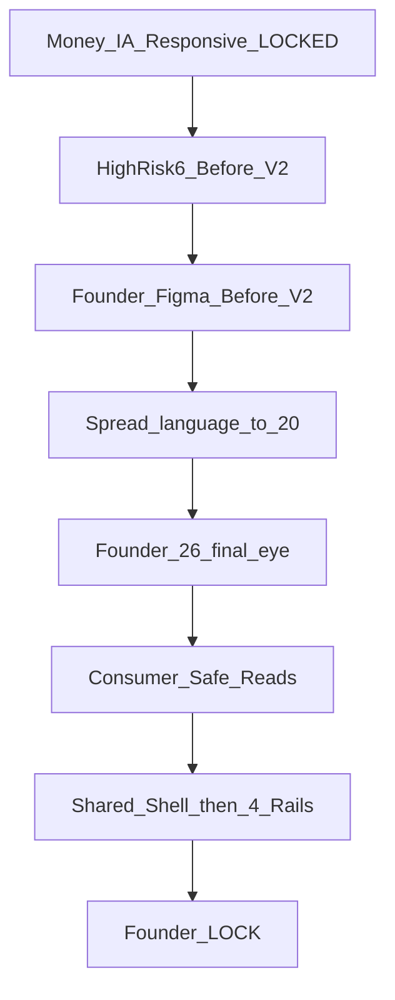

# 퍼뜩 지갑 — 세계 1티어 작업 아이디어 (구현 0 · CRITICAL PATCH)

```text
PLAN_DIRECTION=GOOD
PLAN_EXECUTION_READY=NO
CRITICAL_PATCH_REQUIRED=APPLIED_IN_THIS_DOC
MONEY/IA/RESPONSIVE_CORE=KEEP
HIGH_RISK_6_VISUAL_QUALITY_GATE=REQUIRED
HIGH_RISK_6_TARGET_SET=CORRECTED
FOUNDER_REVIEW_SEQUENCE=HIGH_RISK_6_V2_THEN_SPREAD_THEN_26
PRODUCT_IMPLEMENTATION=FORBIDDEN_UNTIL_26_FINAL_EYE
PLAN_EXECUTION_READY=YES_AFTER_THIS_LIST_CORRECTION
```

이 문서는 **아이디어·작업 방식만**이다. 제품 코드·CSS·API·SDK·schema·DB·ledger·Money·FX·route는 **수정하지 않는다**.

**닫힌 권위와 아직 닫히지 않은 시각을 한 문장으로 섞지 않는다.**

- `FOUNDER_VISUAL_APPROVAL=PENDING` 이므로 Visual Master 전체가 LOCK이 아니다.
- 구조 계약을 “이미 닫혔다”고 써서 Figma V2 교정을 막으면 안 된다.
- 반대로 고위험 6장 polish를 이유로 Money/IA/route/760·390을 재설계하면 안 된다.

---

## 권위 분리 (패치 1)

```text
FINANCIAL_AUTHORITY=LOCKED
IA_AUTHORITY=LOCKED
RESPONSIVE_AUTHORITY=LOCKED
HIGH_RISK_6_VISUAL_POLISH=CANDIDATE_ALLOWED
REMAINING_20=LOCKED
```

| 층 | 상태 | 해도 되는 것 | 하면 안 되는 것 |
|---|---|---|---|
| Constitution · Money §49 · buckets · ledger | LOCKED | 표시 포맷만 | `availableUsdt` 발명 · 잔액 UPDATE · PG사 |
| Route / 4 rail / 13 structural screens | LOCKED | 기존 deep link 유지 | `/wallet/deposit/krw` 신설 · `/withdraw/krw` 단축 |
| 390×693 · 1440×1080 · content 760 · fluid 280→4096 | LOCKED | stress 검수 | 기종/인치 named BP · 4K 카드 확대 |
| 고위험 6장 시각 품질 | **CANDIDATE V2** | surface/버튼/toast/ActionRow/annotation 교정 | Money 의미 변경 · notice level 의미 변경 |
| 나머지 20장 | LOCKED | 6장 승인 언어를 **그대로 확산**만 | 6장 승인 전 독자 polish · 26장 일괄 승인 |

권위 입력 (재설계 아님):

- 기능/돈: Constitution · Money §49 · Canon [`wallet-home.wire.json`](packages/ui/canon/surfaces/wallet-home.wire.json)
- IA/데이터: [`HC6_08_WALLET_FUNDING_WITHDRAWAL_MASTER_CONTRACT.md`](_tmp_home_clean/v1/phase6/HC6_08_WALLET_FUNDING_WITHDRAWAL_MASTER_CONTRACT.md)
- 시각 계약(구조): [`HC6_08_WALLET_VISUAL_MASTER.md`](_tmp_home_clean/v1/phase6/HC6_08_WALLET_VISUAL_MASTER.md) §5–§8 · §15 위계
- 전 세계 화면: [`HC6_08_GLOBAL_RESPONSIVE_PERFORMANCE_CONTRACT.md`](_tmp_home_clean/v1/phase6/HC6_08_GLOBAL_RESPONSIVE_PERFORMANCE_CONTRACT.md)
- 홈 시각 가족: [`peotteok-home-visual-contract.v3.md`](packages/ui/canon/contracts/peotteok-home-visual-contract.v3.md) — **같은 제품, 레이아웃 복제 금지**
- 현재 구현은 권위가 아니다. [`apps/web/app/wallet/page.tsx`](apps/web/app/wallet/page.tsx)는 wire다.

고위험 6장에서 Figma가 발견한 surface 결함은 **Visual Master 수정 금지**가 아니다. `HIGH_RISK_6_VISUAL_POLISH=CANDIDATE_ALLOWED`다. notice의 helper/important/critical **의미**는 유지하고, 실제 surface 품질만 올린다.



---

## 다음 실행 순서 (패치 2) — 26장 일괄 리뷰 금지

지금 허접한 부분을 이미 발견했는데 26장을 한꺼번에 승인 대상으로 올리면 안 된다.

```text
1. 고위험 6장 V2 완성 (Before ↔ V2)
2. Founder가 실제 Figma에서 6장 Before/V2 확인
3. 승인된 visual language만 나머지 20장에 확산
4. 26장 전체 최종 육안검수
5. 그 다음 consumer-safe reads
6. 그 다음 제품 구현
```

Master Contract §25의 “Visual Master → Founder review → reads → UI”는 **최종 게이트**로 유지한다. 지금 당장의 다음 한 걸음은 §25를 26장 일괄로 실행하는 것이 아니라 **6장 V2**다.

한 채팅 = 한 슬라이스. Money/Engine/Auth/API 의미를 프레젠테이션 핑계로 열지 않음.

---

## 0. 조사로 확인한 사실 (추측 아님) — KEEP

### 0.1 레포 실측

- `/wallet`은 `fetchWalletBuckets` + `BucketBreakdown` + CTA 링크만. Home v3와 시각 가족이 끊겨 있다.
- 로드 실패 시 `EMPTY_BUCKETS` 0 주입 = 가짜 0원.
- `/wallet/deposit` 계속 버튼 무동작. KRW consumer 계좌 instruction API 없음 = CHAIN_BREAK.
- 주소 `font-mono` — Visual Master는 Pretendard Medium + `break-all`.
- `/wallet/history` 페이지는 empty copy만. **이 사실이 runtime empty truth가 아니다** (패치 6).
- Admin [`/admin/wallet`](apps/admin/app/admin/wallet/page.tsx)와 유저 지갑을 섞지 않는다.

### 0.2 웹 조사 1티어 패턴 — KEEP

토스(한 화면 한 선택 · 해요체 · 기기별 논리해상도 금지) · 카카오뱅크(한 과업 · 금액 크게) · Wise(수수료 선공개·Review) · Coinbase/Binance(네트워크+주소+QR 같은 화면 · 복사) · Kraken(Review · 붙여넣기) · Circle(확인수는 내부) · WCAG 2.2 · Apple HIG · Material window size class · GOV.UK error · NN/g trust.

시각 복제 금지. 원칙만.

유지할 금융 UX (이미 Visual Master와 정합):

- 트론 1개면 dropdown 없음
- full address · copy는 canonical 전체
- fake fee / fake progress / raw `1/19` 금지
- 출금 Entry → Review → step-up
- fake zero 금지 · null≠0

---

## 1. 세 관점 완성 정의 (패치 3·4·6 반영)

성별 UI 분기 영구 금지. 20~70대 = `toneBand` + `fontScale` md/lg/xl + 터치 48 + 해요체.

### 1.1 한국 유저 — Overview 3초 질문 (패치 3)

Visual Master §15.1 authoritative primary fact = **`principalUsdt` + `profitUsdt`**.

1. 운용 원금이 얼마인가 / 출금 가능 수익이 얼마인가 (`principalUsdt` · `profitUsdt`. 클라 합산 금지)
2. 묶인 돈 / 연습돈이 뭔가 (`진행 중 잠금` · `연습 잔액` — secondary. practice는 0이면 숨김)
3. 넣으려면 / 빼려면 어디를 누르나 (입금하기 · 출금하기 · 원금 출금하기 숨김 0)
4. 잘 됐는지 어디서 보나 (입출금 내역 — owner 있을 때만 preview)

**총액 hero를 새로 만들지 않는다.** `liabilityUsdt` / `총 잔액` / `available balance`는 히어로 금지. 첫 viewport에 두지 않음. 필요 시 최하단 13 muted만 (Visual Master §15.1).

연령대 검수(별도 UI 아님):

- 20~30: 네트워크 드롭다운을 찾다 오송금 → 선택 UI를 안 만듦
- 40~50: 원화 감각 → 방법 카드 “은행에서 보내요 / 거래소·지갑에서 보내요”
- 60~70: hero 최소 24 · 복사에 글자 · 주소 전체 · `fontScale.xl` · ActionRow(패치 7)

Overview KRW 보조 (패치 4):

```text
USDT primary
약 ₩… secondary
DESIGN_FIXTURE
WALLET_SAFE_OWNER_REQUIRED
homeCurrentFxBind=FORBIDDEN
omitWhenMissing=true
```

Figma V2는 `1,250.00 USDT` 아래 `약 ₩...`을 **반드시 설계**한다. owner 없으면 런타임 행 생략. Home `POST /api/v1/me/current-fx/approx`를 Wallet에 붙이지 않는다. 구현 전 owner 미확정이면 fixture annotation만.

### 1.2 운영자

유저 화면에 운영 큐(입금설정·출금검토·분쟁·1/19)를 넣지 않음.

- KRW Instruction hero = `payableAmountKrw` + 아래 §5 전체 납득 카피 → 오송금 티켓 감소
- 수수료/계좌/주소 하드코딩 금지
- History는 owner 있는 조회만 유저 self-serve. API 부재를 empty 성공으로 위장하면 운영이 “내역이 없다”고 오판함 (패치 6)

### 1.3 디자인팀

실수 불가능한 돈 이동 + **지금 발견된 surface 품질**. 6장 V2에서 버튼/notice/toast/ActionRow/annotation을 고치지 않으면 26장 승인은 허접한 언어를 고정한다.

완성 ≠ Canon PASS. 시각 완료 = 390/1440 **clean** 캡처(annotation 밖) · overlay/diff · bbox · Founder 확인.

---

## 2. 스택 · 코드 · 네이밍 (패치 8)

### 2.1 스택 — KEEP

Next 16 · Tailwind v4 · `@aipo/ui` · `@aipo/sdk/wallet` · Nest · ledger · PG사 0 · AppShell KEEP · peotteok-light only · money count-up 금지.

### 2.2 컴포넌트 이름 — Visual Master SSOT

이중 이름 금지. 플랜/구현 모두 아래만:

- `WalletTransferShell` · `TransferMethodSelector` · `TransferFactList` · `TransferNotice` · `TransferStatusCard` · `AddressDisplay`
- **`CopyAction`** (idle/copied/retry) — `CopyButton` 신설 금지
- `QrAction`
- rail: `KrwDepositFlow` · `UsdtDepositFlow` · `KrwWithdrawalFlow` · `UsdtWithdrawalFlow`
- Overview V2 후보: `ActionRow` (원금 출금하기 · 입출금 내역). text-only muted 링크를 권위로 고정하지 않음
- 유지: `BucketBreakdown` · `NetworkPlainWarning` · `PrincipalConfirmSheet` · `WithdrawStepUpPanel`
- `UniversalTransferForm` 금지
- 카피 JSX 하드코딩 0. `T.walletBuckets` / `T.wallet` / `T.withdrawMode`. Visual Master 네트워크 카피는 `COPY_ALIGNMENT_REQUIRED` (지금 copy 파일 수정 0)

### 2.3 Route — production deep link만

- `/wallet`
- `/wallet/deposit?tab=`
- `/wallet/withdraw?mode=`
- **`/wallet/withdraw/krw`**
- **`/wallet/withdraw/usdt`**
- `/wallet/history`

`/withdraw/krw|usdt` 단축 표기는 오타다. 신설 0.

Buckets: `principalUsdt` `profitUsdt` `lockedUsdt` `practiceUsdt` `liabilityUsdt`. `availableUsdt` 발명 금지.

---

## 3. HIGH_RISK_6 VISUAL QUALITY GATE (패치 7)

### 3.1 고위험 6장 (26 중 6 · 나머지 20 LOCKED)

Desktop/Mobile pair를 전부 넣는 구성이 **아니다**. 서로 다른 **금융 위험 유형**을 대표한다.

1. `WALLET/DESKTOP/OVERVIEW` — 자산 이해
2. `WALLET/MOBILE/OVERVIEW` — 자산 이해
3. `DEPOSIT_KRW/DESKTOP/INSTRUCTION` — 은행 송금액 + +37 이해
4. `DEPOSIT_KRW/MOBILE/INSTRUCTION` — 은행 송금액 + +37 이해
5. `DEPOSIT_USDT/MOBILE/ADDRESS_READY` — 네트워크/주소 오송금 방지
6. `WITHDRAW_USDT/MOBILE/REVIEW` — 외부 전송 직전 최종 검토 · 비가역 · fee truth

`DEPOSIT_USDT/DESKTOP/ADDRESS_READY`는 6장에 **넣지 않는다**. Address Desktop/Mobile은 같은 핵심 계약(트론 + full address + copy/QR)을 공유하므로 Mobile 1장이 대표한다. Global Responsive Contract의 고위험 stress에도 `WITHDRAW_USDT/REVIEW`가 명시된다.

이 6장만 Before ↔ V2. 승인 전 20장 독자 재디자인 금지.

### 3.2 반드시 V2에 넣는 시각 결함

의미(helper/important/critical · 버킷 · rail)는 바꾸지 않는다. **surface 품질**만.

1. **Desktop Overview CTA** — 입금/출금이 parent colored background 안의 자식이 아님. **독립 sibling 버튼** (primary 340×48 · secondary 340×48 · gap 16).
2. **Tron warning** — white child surface 제거. **one cohesive warning surface** (IMPORTANT: `#FFF8ED` / `#F5D0A0`). 카드 안 또 흰 박스 금지.
3. **Meaningless nested surface 전수검사** — 의미 없는 겹겹이 fill/radius/border 제거. 6장 전부.
4. **Toast V2** — success / info / warning / error premium candidate. 기존 toast 이모지 1~2 규칙은 유지. 허접한 기본 토스트를 권위로 고정 금지.
5. **ActionRow** — `원금 출금하기` · `입출금 내역`을 작은 text-only muted에서 **명확한 ActionRow**로 (터치 48 · 라벨 읽힘 · 숨김 금지).
6. **Annotation 분리** — binding/owner/fixture 주석은 authoritative frame **밖 sibling**. clean screenshot이 정확히 `1440×1080` / `390×693`이 되게 한다. annotation이 프레임에 들어가면 visual PASS 증거가 오염된다.

### 3.3 6장 V2에 같이 닫을 내용

- Overview: 운용 원금 + 출금 가능 수익. USDT primary + 약 KRW secondary (`WALLET_SAFE_OWNER_REQUIRED`). 총액 hero 없음.
- KRW Instruction: 100만원 → 1,000,037원 전체 납득 UX (아래 §5).
- USDT Address (Mobile): 트론 + full address + `CopyAction` + QR. one cohesive IMPORTANT notice.
- USDT Withdrawal Review (Mobile): 보낼 USDT · full destination · 트론 · fee는 server quote 있을 때만 · irreversible warning · edit/correction path · sticky CTA. Review 없이 irreversible submit 금지. WHERE / WHAT / HOW MUCH / NETWORK / COST를 한눈에.

---

## 4. 반응형 — KEEP (실행 가능 부분)

기종별 디자인 금지. viewport-class + fluid + stress.

```text
CANONICAL 390x693 + 1440x1080
+ fluid min(760, availableMain - gutters)
+ mobile readable max 430
+ fail-safe from 280
+ stress to 4096
+ zoom 100~200
+ safe-area
+ fontScale md/lg/xl
FOUR_K_WALLET_CONTENT_MAX_WIDTH=760px
ULTRAWIDE_CONTENT_STRETCH=FORBIDDEN
PHYSICAL_INCH_CSS=FORBIDDEN
```

저사양: 무거운 효과 요구 0. 핵심 입출금은 평균 기기에서 완전. 로컬 OOM ≠ 시각 삭감.
40인치+/4K: 760 중앙. 빈 여백은 결함 아님. Home 레일 발명 금지.
모바일: 280 fail-safe · 390 canonical 358 · 480–767 cap 430. 고위험 대표 화면 중심으로만 추가 stress.

“전 기종 실측 PASS” 문장 금지.

---

## 5. 화면별 아이디어 (패치 3·4·5·6)

Home 느낌 = Pretendard · light · `#6B3CFF` · CTA 48 · 정직한 숫자. 3열/로봇/그라데이션 자산 복제 금지.

1. **Overview** — 주인공은 `운용 원금` + `출금 가능 수익` 두 카드. 총액 hero 없음. USDT 아래 `약 ₩...` (owner 없으면 omit). locked/practice secondary. CTA sibling 버튼. 원금 출금·내역은 ActionRow. 로딩 skeleton. 에러는 0원 아님.
2. **Deposit method** — 두 카드. 비교표/WhyUsdt는 선택 뒤 또는 접기.
3. **KRW Entry** — 신청 원화 + 입금자명만. payable/suffix/estimate를 클라가 미리 보여주기 금지.
4. **KRW Instruction** — 이 rail 최중요. hero=`payableAmountKrw` (`₩1,000,037`)가 신청액보다 항상 큼.

   한 화면에서 반드시 납득:

   - `이 금액 그대로 보내주세요`
   - 왜 +₩37인가 = 입금 확인용 식별 금액
   - **수수료 아님**
   - 실제 송금 **전체**가 원금 반영 기준
   - 다른 금액이면 확인이 늦어질 수 있음
   - 예상 USDT(`quote.estimatedUsdt`)는 **최종 확정값 아님** (`확정`/`최종` 금지)
   - helper: `추가된 금액은 입금 확인을 위한 식별 금액이에요. 수수료가 아니며 실제 송금한 전체 금액이 반영돼요.`
   - estimate helper: `실제 반영 수량은 입금 처리 시점 환율에 따라 달라질 수 있어요.`

   Secondary: 신청 `₩1,000,000` · 식별 `+₩37` · 예상 · 참고 환율 · 만료. 계좌 slot은 owner 전 chrome만.

5. **KRW Approved** — hero=`final.creditedUsdt`. estimate가 final보다 커 보이면 FAIL.
6. **USDT Address** — 트론 + 주소 + `CopyAction`/`QrAction`. cohesive IMPORTANT. GET 없으면 status height 0.
7. **Withdraw method** — 동일 geometry, 카피만.
8–11. **출금 Entry/Review** — 즉시 전송 금지. fee는 quote 있을 때만. `WITHDRAW_USDT/MOBILE/REVIEW`는 HIGH_RISK_6. WHERE/WHAT/HOW MUCH/NETWORK/COST + sticky CTA + 수정 경로.
12. **Result** — 내부 코드 없이 결과+다음 행동.
13. **History** (패치 6):

```text
BACKEND_OWNER_MISSING != AUTHORITATIVE_EMPTY_LIST
DESIGN_EMPTY_STATE + BINDING_OWNER_REQUIRED + NOT_RUNTIME_FALLBACK
```

- Figma: design-empty fixture + annotation만. product runtime truth 선언 금지.
- Runtime `아직 입출금 내역이 없어요.` = **History API가 존재하고 조회 결과가 0건일 때만**.
- API 부재 = empty 성공으로 그리지 않음. slot + `BINDING_OWNER_REQUIRED`.
- fake rows 금지. filter 3만: 전체/입금/출금.

---

## 6. 일부러 하지 않을 것

- 토스/카뱅/Wise 픽셀 카피 · crypto neon · 차트 · 스왑 · 주소록 · 네트워크 선택 · Home 복제
- 기종·인치 BP · 4K 카드 확대 · 빈 공간을 위젯으로 채움
- 성별/연령 별도 테마 · 원금 출금 숨김 · 가짜 진행/내역/0
- Deposit만으로 public release ready
- 현재 wire를 Visual Master보다 위
- **고위험 6장 결함을 “Visual Master 수정 금지”로 방치**
- **26장 일괄 Founder 승인**
- **총액/`liabilityUsdt` hero**
- Home FX를 Wallet 보조 KRW에 임의 바인딩
- API 없는 History를 runtime empty로 선언
- `CopyButton` 신설 · `/withdraw/krw` 단축 route

---

## 7. 지금 사람이 할 일 / 하지 말 일

**한다:** 고위험 6장 Figma V2 (Before 유지) → Founder Before/V2 확인.

**하지 않는다:** 제품 구현 · consumer-safe API 착수 · 20장 독자 재디자인 · 26장 일괄 승인 요청.

V2 승인 후에만 20장 확산 → 26장 최종 육안 → 그 다음 reads → 그 다음 코드.
