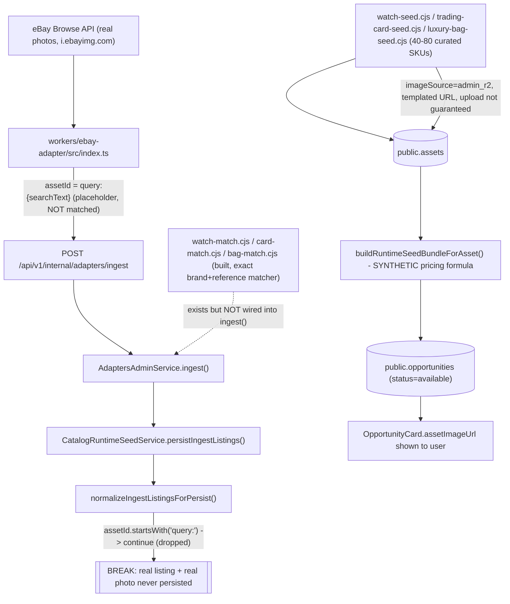
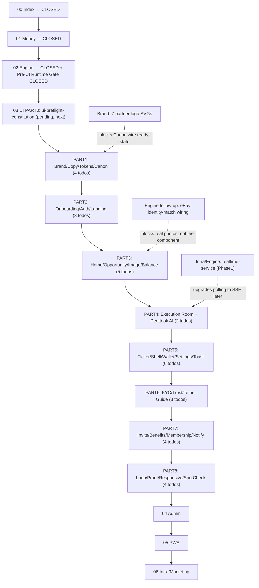

# FINAL 03 UI/UX MASTER PLAN INTEGRATION — 퍼뜩 (Plan-Only, No Code)

> Tables are rendered as structured bullets (this plan viewer cannot render markdown tables). Brand: **퍼뜩** (consumer + AI persona) · Platform/code: **AI Profit OS** · Legal: PRE-OWNED WATCHES L.L.C (§50.9). This document does not modify `.cursor/plans/ai_profit_os_03_ui_ux_d4e5f6a7.plan.md` — it is a proposed integration to be manually reconciled into that SSOT file in a later, explicitly-approved session.

## 0. Method note (what was actually checked)

Read in full: `ai_profit_os_00_index_a1b2c3d4.plan.md` (1483 lines), `ai_profit_os_03_ui_ux_d4e5f6a7.plan.md` (3157 lines, all of it). Inspected on disk: `workers/ebay-adapter/src/*.ts`, `services/market-intelligence/src/*.cjs` (catalog-runtime-seed, watch/card/bag-match, watch-seed, match-strictness, asset-master), `services/api-nest/src/opportunities/*.ts`, `services/api-nest/src/adapters/*.ts`, `schemas/opportunity-card.v1.json`, `schemas/asset-master.v1.json`, `packages/ui/canon/manifest.json` + `surfaces/opportunity-card.wire.json`, `packages/ui/brand/brand.manifest.json`, `schemas/market-partner.registry.json`, `packages/ui/tokens/lux-fintech.ts`, `apps/web/app/**` (all stub pages), `apps/web/package.json`, `package.json`, `tooling/verify/CATALOG.md`, `.cursorignore`. Confirmed via case-insensitive repo-wide grep: **zero** occurrences of "CLIME" and zero PNG/JPG mockup files outside `packages/ui/brand/assets/**`.

---

## 1. Executive Summary

- The 03 UI plan is **not empty** — it is a ~3,150-line, version-v7.22.48 SSOT with locked IA, CTA, copy, toast, Lux tokens, Canon wire governance, execution-room (Live Scan) design, and a 34-item performance/responsive section already written. It has **not started implementation**: the only "code" that exists for the User app are placeholder stub pages (`apps/web/app/page.tsx` renders literally `홈 / 기회스캔 · 5탭 IA lock` and nothing else).
- File-Serial state (verified in Index, not assumed): 00 Index, 01 Money, 02 Engine are **CLOSED**. 03 UI's first pending todo is `ui-preflight-constitution` (an audit/no-code gate), followed immediately by `market-partner-trust-surfaces`. 32 UI todos are queued in PART0→PART8 order; 3 are already `completed`.
- No photo mockup exists in the workspace, and per this repo's own **ADR-013 Mockup Governance**, that is by design — a `MOCKUP ACCESS BLOCKER` is declared in §12 below with an explicit request.
- The real, code-confirmed technical risk to "real eBay product photos" is not a UI problem. It is an **adapter + identity-matching + persistence gap**: `workers/ebay-adapter/src/index.ts` line 101/116 stamps every live search result with `assetId: \`query:${query}\`` (a placeholder, not a real identity match), and `normalizeIngestListingsForPersist()` in `services/market-intelligence/src/catalog-runtime-seed.cjs` line ~314 explicitly `continue`s (drops) any listing whose `assetId` starts with `"query:"`. Real eBay CDN photos (`item.image.imageUrl`) are fetched but never reach the database today. Everything currently visible in `public.opportunities` comes from a ~40–80-SKU **admin-curated seed catalog** with synthetic formula-based pricing and placeholder `admin_r2` image URLs (`https://asset-images.r2.dev/assets/watch/{assetId}.jpg`), not live eBay photos. Full trace in §27.
- The existing plan already forbids fake Live Scan (`Math.random`, fake timers, fake counts) and already specifies a real Fact→Rule→polling architecture (`POST /trades/:id/execute-tick`, Soft60/Hard90, `trade.execution.step`), explicitly chosen as **Phase0 polling with a Phase1 SSE upgrade path** (Engine §0.9.2). This matches the user's own requested Polling→SSE→WebSocket order exactly — it needs elaboration, not invention.
- What is genuinely missing from the existing plan (true gaps, confirmed by reading it in full): a Progressive Performance Escalation ladder (Level 0 HTML → Level 5 WebGL/WebGPU) with explicit Canvas/WebGL/Worker/Transferable decision rules; a concrete Image Performance Architecture (responsive `srcset`, lazy/priority, cache headers, WebP/AVIF, hotlink-vs-proxy decision); and a Visual Regression harness (the CI gate name `verify:responsive` exists in the plan text but has no implementation, no Playwright, no viewport matrix wired anywhere in the repo).
- No code, JSX, CSS, schema, migration, or package changes were made in this session.

---

## 2. Existing UI/UX Plan Inventory

Found and read in full — **not discarded**:
- `.cursor/plans/ai_profit_os_03_ui_ux_d4e5f6a7.plan.md` — the ACTIVE, single edit-SSOT (workspace copy; `%USERPROFILE%\.cursor\plans` is a mirror only, per `ide-problems.mdc`).
- `.cursor/plans/ai_profit_os_00_index_a1b2c3d4.plan.md` — Index/Constitution/Gates, owns File-Serial order and product-semantics locks (§20.1/§20.2) that UI must not violate.
- `CONSTITUTION/22, 25, 26, 28, 38, 46b, 48, 50` — referenced constitution files (46b = Asset Image SSOT; exists on disk, 29 files total, intentionally excluded from the agent's default index by `.cursorignore` as "audit bulk," per ADR-016 — this is why a first-pass file search for it appeared empty, but direct path access confirms it exists).
- `packages/ui/canon/manifest.json` + 28 `surfaces/*.wire.json` files — the real visual SSOT (Canon), including `opportunity-card.wire.json` which already locks the card's block order, forbidden terms, and `assetImageUrl` slot.
- `packages/ui/brand/brand.manifest.json` (visual_kit_v1) and `packages/ui/tokens/lux-fintech.ts` — shipped, code-level design tokens.
- `schemas/opportunity-card.v1.json`, `schemas/asset-master.v1.json`, `schemas/execution-policy.v1.json`, `schemas/trade-execution-state.v1.json`, `schemas/market-partner.registry.json` — contract-level SSOT already defining the exact fields UI must render.

This master plan treats all of the above as **baseline** and only proposes IMPROVE/EXTEND deltas, never a rewrite.

---

## 3. Existing Plan — KEEP

- **5-tab IA lock** (§5.1/§5.2: 홈/수익/내거래/지갑/내정보, identical mobile+desktop, exactly 5, no 6th tab) — matches current repo routes 1:1 (`apps/web/app/{page,profits,trades,wallet,me}`). No conflict.
- **Product semantics lock** (Index §20.1/§20.2): user = capital participant, not trader/buyer/seller; CTA = `수익 벌기` / detail = `이 기회로 수익 벌기`; forbidden term list (매수/매도/구매/판매/판매자/구매자/거래소/베팅/트레이더-class terms) already enforced in `packages/ui/canon/surfaces/opportunity-card.wire.json`'s `forbidden[]` array and `verify:cta-earn-profit` / `verify:user-trader-jargon-0`. This is stricter than the user's own instruction — nothing to add.
- **Canon authority ladder** (§33.8.1): tokens/brand > components/5-tab/copy > plan section + Canon wire > (photo mockup archived, not authoritative). Exactly matches the "MOCKUP ≠ FIXED PIXEL SCREEN" principle requested — already law here (`.cursor/rules/mockup-governance.mdc`, `canon-ui.mdc`).
- **Opportunity Card information hierarchy** (§6.1, §5.3b, Canon `opportunity-card.wire.json`): image → corridor/arbitrage type → required capital → expected profit → AI confidence → CTA, with `assetLabel` deliberately small/secondary. This matches the requested hierarchy in the prompt almost field-for-field.
- **Execution Room = real Live Scan, not fake animation** (§48.1–§48.6, §48.13.3, Engine `settlement_rule.rs`): states running/requeue/success/safe_stop map to real backend facts; `Math.random`/`successRatePercent`-as-truth are explicitly, repeatedly forbidden (`verify:no-success-rate-percent`, `verify:presentation-cannot-credit`). This is exactly the anti-fake-scan requirement — already the law of this repo.
- **Phase0 polling → Phase1 SSE decision already made** (Engine §0.9.2): `POST /trades/:id/execute-tick` polling now, `trades.execution.service.ts` response channel swapped to SSE later without changing the Rule/endpoint contract; UI client work is scoped to a `useTradeExecution` hook so the swap doesn't touch call sites. Matches the requested Polling→SSE→WebSocket order exactly.
- **Device-tier S/A/B system** (§29.1 Law 3, `packages/sdk/device-tier.ts` contract) and **DOM virtualization thresholds** (§29.1 Law 4: feeds >20/>50/>30 items) — already defines "not everything gets virtualized," matching the requested threshold-based approach.
- **Toast/copy SSOT** (`packages/ui/copy/ko/*`, §8, §27) — single source, no JSX hardcoding, glossary-driven — keep as-is.
- **Naming conventions already in force** (see §51): PascalCase components, `useXxx` hooks, `T.<domain>.*` copy keys, `*.v1.json` schemas, `verify:kebab-case` scripts, `packages/ui/canon/surfaces/<id>.wire.json` files. New work in this plan follows these, no new convention invented.

---

## 4. Existing Plan — IMPROVE

- **§29 Performance/Responsive** is directionally correct (fluid type, touch target, tiering, virtualization, budget numbers) but stops at "Level 2" of what a production Live-Scan/image-heavy feed needs. **Decision:** extend §29 with the Progressive Performance Escalation ladder (this plan's §31–§36) rather than replace it. **Reason:** the existing budget numbers (LCP<2.0/2.5s, INP<100/200ms, CLS<0.05, FPS≥55/45) are good Day-1 targets but have no defined trigger for when to move past DOM/CSS into Worker/Canvas. **Dependency:** none, pure planning addition. **Risk:** low.
- **§48.3a "카테고리 상품 썸네일"** defines the *data* contract (assetImageUrl, alt, fallback icon, forbidden cross-category images) but not the *performance* contract (responsive sizes, `loading`, `fetchPriority`, `aspect-ratio`, cache headers, format negotiation). **Decision:** keep the data contract as-is (Engine §0.0.6 owns it), add the missing performance contract as a UI-owned `ProductImage` component spec (§26/§37 below). **Reason:** hundreds of cards will render this slot; without an explicit spec, contributors will hand-roll `` tags inconsistently. **Dependency:** none for the component spec; the *value* of `assetImageUrl` depends on §27's backend gap. **Risk:** medium if skipped (CLS/LCP regressions once real content loads).
- **§29.6 "Realtime Batch Contract"** references `services/realtime-service subscribe policy` as if it is reachable today. Engine §0.9.2 (dated the same day) states this folder **does not exist** and Phase0 is polling-only. **Decision:** reframe §29.6 as a *Phase1+ interface contract* that the Phase0 polling hook (`useTradeExecution`, `useOpportunityFeed`) already conforms to, so no rewrite is needed when it ships. **Reason:** avoids UI code assuming a transport that isn't there. **Dependency:** Phase1 `realtime-service` (Infra/Engine owned). **Risk:** low if reframed now; medium (dead-code / broken assumptions) if left as-is and someone implements against it literally.
- **§33.1 Visual Identity Lock hex table is stale versus shipped code.** The plan table says `profitEmerald:'#00FF87'`, `flashCoral:'#FF2E63'`, `amberGold:'#F59E0B'`, `mintTeal:'#00D294'`, `actionNeon:'#1A56FF'`. The **actually shipped** `packages/ui/tokens/lux-fintech.ts` (visual_kit_v1, referenced by `packages/ui/canon/manifest.json` as `tokenRef`) uses different values: `accent:'#3DDC97'` (mint, doubles as "profit"), `principal:'#7AA2FF'`, `danger:'#FF5C7A'`, `warning:'#F5C542'` — matching §5.9.2b's Brand Kit lock ("mint #3DDC97 + principal #7AA2FF"), not §33.1's older table. **Decision:** per this repo's own authority ladder (tokens > plan text), the *code* wins; §33.1/§6.2's color table is the stale artifact and should be updated to mirror `lux-fintech.ts` verbatim. **Reason:** two different "SSOT" hex tables currently coexist in the same plan file (§6.2 also duplicates §33.1's stale numbers). **Dependency:** none, text-only correction. **Risk:** low, but will confuse any future contributor who reads §33.1 before checking the actual token file.
- **§29.7 lists `verify:responsive`, `verify:touch-target`, `verify:no-px-fonts`, `verify:virtual-list` as CI gates**, but none of these appear in `package.json` scripts or `tooling/verify/CATALOG.md` today (confirmed by reading both in full). **Decision:** keep the gate *names*, but classify the underlying harness as EXTEND (§45), not "already built."

---

## 5. Existing Plan — EXTEND

- **Progressive Performance Escalation ladder** (Level 0 HTML/CSS/SVG → Level 5 WebGL/WebGPU) with explicit trigger/measurement rules per level. Not present anywhere in the existing plan. See §31–§36.
- **Image Performance Architecture** as its own named subsystem: CDN/Cache-Control policy, WebP/AVIF negotiation, responsive `srcset`/`sizes`, thumbnail strategy, hotlink-vs-proxy decision for `assetImageUrl`, broken/missing/loading states as first-class component states. See §26/§37.
- **Visual Regression harness**: the gate name exists (`verify:responsive`) but no Playwright config, no viewport matrix, no screenshot-diff pipeline exists in the repo. See §45.
- **Component Test Matrix** as a single explicit checklist cross-referencing existing component names (the user's requested matrix already has 1:1 equivalents planned under different names — see §46).
- **Explicit Canvas/WebGL/Worker/Transferable Decision Matrix** with WHERE/WHY/WHEN/BENEFIT/COST/FALLBACK/MEASUREMENT columns per technology (user's own requested format, §47 of the prompt) — the existing plan never lists these technologies at all (by omission, not by prohibition), so this is pure addition, and per the user's explicit instruction it must **not** blanket-forbid them.
- **eBay Identity/Image backend-dependency ledger** in the UI→Backend format the user requested (§48/§49 below) — the existing plan references Engine §0.0.6/§0.0.1a as "Owns" but never wrote down the specific `query:` bug as an open item anywhere audited.

---

## 6. Existing Plan — CONFLICT

- **Color token duplication/drift** (§4 above): §33.1 and §6.2 vs. shipped `lux-fintech.ts`. **Resolution:** code wins (per repo's own §33.8.1 ladder); plan text updated to mirror code, not the reverse. Marked "CONFLICT RESOLVED" in the Change Log (§ Change Log below).
- **§29.6 realtime-service reference vs. Engine §0.9.2 factual state.** **Resolution:** reframe as forward-looking interface only (§4 above). Marked "CONFLICT RESOLVED."
- **No CLIME conflict found.** Repo-wide case-insensitive search returned **zero** matches for "CLIME" in any file, plan, schema, code, or asset. This term does not exist in this codebase in any form — not as a legacy brand, not as a code identifier, not as a comment. See Brand Lock classification in §10.

---

## 7. Existing Plan — OBSOLETE

- **Old single-line "AI 거래중..." execute screen** — already explicitly marked obsolete inside the plan itself (§7.4: "구 `AI 거래중...` 한 줄 UI **폐기**") and superseded by the 3-screen Canon execution model. No further action; already correctly retired.
- **`expectedSellDays` as a user-facing card slot** — schema marks it `DEPRECATED user surface`, plan confirms "유저 카드 노출 0." Already correctly retired to Admin-only historical display.
- **오늘수익 / 바로번다 (retired consumer brand names)** — present only as historical changelog entries and a `retired_names` array in `brand.manifest.json`; already fully excluded from live surfaces per `verify:brand-consumer`. Correctly obsolete, not touched.

---

## 8. Existing Plan — BLOCKED

- **Full SSE-based Live Scan** (`trade.execution.step` as originally imagined in §48.3) is BLOCKED behind the Phase1 `realtime-service` package, which does not exist yet. Unblocked path: ship the Phase0 polling hook now (already scoped, Engine E-R5 `execute-tick` is live); swap transport later without UI rewrite.
- **Real eBay-photo-backed Opportunity images** are BLOCKED behind an Engine/backend identity-matching fix (full detail in §27/§48/§49). UI can and should proceed with the `ProductImage` component now, designed to gracefully render either an `admin_r2` placeholder or a future `ebay`-sourced photo — but the *data itself* cannot be fixed from the UI plan.
- **`market-partner-trust-surfaces` (the very next queued UI todo)** is BLOCKED on a design/brand deliverable: 7 partner-logo SVGs (`ebay.svg`, `amazon.svg`, `yahoo-jp.svg`, `pokemontcg.svg`, `ygoprodeck.svg`, `coingecko.svg`, `frankfurter.svg`) referenced by `schemas/market-partner.registry.json` do not exist yet in `packages/ui/brand/assets/` (only 5 core brand assets are `status:"ready"`). This must be produced before the Canon wire for that surface can be marked ready.

---

## 9. Existing Plan — NEEDS MEASUREMENT

- **Canvas/WebGL/WebGPU for any surface** (ticker, opportunity feed, execution room) — default answer is NO until DOM+virtualization+Worker is measured insufficient on a B-tier device profile. No current telemetry exists (app unlaunched) to justify skipping straight to GPU rendering.
- **Hotlink vs. proxy/cache for `assetImageUrl`** — Day-1 default (hotlink eBay/admin_r2 URLs directly via `next/image` remote patterns) is simplest and ships fastest, but has no format-negotiation (WebP/AVIF) control and a dependency on third-party CDN uptime/hotlink policy. Needs a real LCP/byte-weight measurement once real images flow before deciding whether to add a Cloudflare Images/R2 cache-and-transform layer.
- **Device-tier thresholds** (`cores<=4`→B, `memory>=8&&cores>=8`→S) are reasonable Day-1 defaults but unvalidated against a real user base (product hasn't launched). Re-measure after first cohort of RUM data.
- **WebSocket necessity** — no surface has a proven bidirectional requirement today; SSE-only is the correct default per the plan's own principle and the user's instruction. Revisit only if a specific feature (e.g., collaborative/admin live-editing) proves it needs two-way push.

---

## 10. Current Repository UI Audit

- **Route skeleton exists, UI does not.** All 5 tabs + nested routes exist as Next.js pages (`apps/web/app/{page,profits,profits/[id],trades,trades/[id]/execute,wallet,wallet/deposit,wallet/withdraw,wallet/withdraw/usdt,wallet/withdraw/krw,wallet/history,me,me/settings,me/legal,me/legal/license,me/invite,me/events,me/strategies,me/inbox,me/support,me/kyc,me/membership,me/peotteok,me/guide/{usdt,get-usdt,revenue,faq,principal}}/page.tsx`) but every one renders a one-line placeholder (`"use client"` + a heading + a muted caption). No forms, no data fetching, no components.
- **`packages/ui/components/`** has exactly 6 real components, all under `wallet/` (`WithdrawModeCards`, `DepositAmountPanel`, `BucketBreakdown`, `SuccessBucketCtas`, `PrincipalConfirmSheet`, `DemoWalletBanner`, `NetworkPlainWarning`) plus a shared `SearchParamsBoundary`. **Zero** `opportunity/`, `execution/`, `lux/` component folders exist yet, even though the plan names ~20 specific files under those paths (`OpportunityCard.tsx`, `AiProgressRoom.tsx`, `ExecutionSuccessReceipt.tsx`, `CountUpNumber.tsx`, `LivePayoutTicker.tsx`, etc.).
- **Design System exists at the token layer only.** `packages/ui/tokens/lux-fintech.ts` + `lux-theme.css` are real and CI-verified (`verify:lux-theme-sync`, `verify:tailwind-v4`). No component library consumes them yet.
- **Canon governance is real and ahead of implementation**: 28 `wire.json` surfaces exist, `opportunity-card.wire.json` is fully specified (block order, forbidden terms, `productThumb` slot). This is unusually good — most repos write Canon *after* building screens; here it's already the contract.
- **Backend contracts are further along than UI**: `GET/POST /api/v1/opportunities`, `/participate`, `/trades/:id(/execute-tick)`, `/me/membership`, `/me/benefits` are marked **live** in `tooling/verify/CATALOG.md`. UI has real APIs waiting for it; this is a genuinely UI-only-blocked domain (unlike the eBay image gap, which is a data-not-UI blocker).
- **No frontend performance libraries installed yet** (`apps/web/package.json`): only `next@16.3.0`, `react@19.2.0`, `tailwindcss@4`. No `@tanstack/react-virtual`, no `framer-motion`/motion library, no image-processing lib client-side. This is expected at this stage (nothing to virtualize yet) but confirms §31–§36 below start from Level 0, not Level 2.

---

## 11. Current Architecture Constraints

- **Stack lock (ADR-014/015):** Node 22, pnpm 10.14, Next 16, Tailwind v4, Nest, Rust engine, Cloudflare-only hosting. No Vercel, no second Postgres, no Supabase Auth. This plan proposes zero deviations.
- **Phase0 machine + bus lock:** in-process bus, NATS/Temporal/EKS forbidden Day-1; realtime = polling now, SSE later, WebSocket only if proven necessary — already the direction this plan reinforces.
- **Low-spec dev machine (Celeron G6900, 2C/2T, ~8GB RAM):** does not cap the *production* architecture (per the user's explicit instruction and the repo's own `phase0-ram.mdc`), but it does mean local dev/test of any Worker/Canvas/WebGL code must be validated in CI (GitHub Actions), not by running the full stack locally.
- **Money/ledger invariants are UI-adjacent but not UI-owned:** bucket math, settlement posting, double-entry — UI only renders/labels these; this plan does not touch them.

---

## 12. Mockup Analysis — MOCKUP ACCESS BLOCKER

- **Search performed:** `**/*.png,*.jpg,*.jpeg,*.webp,*.gif` (repo-wide), `**/*mockup*` (repo-wide), plus targeted checks of `docs/mockups/`, `assets/`. Result: the only image assets that exist are the 5 `status:"ready"` Brand Kit files under `packages/ui/brand/assets/**` (app icon, maskable icon, wordmark, AI avatar, OG image) and one unrelated KYB reference PNG under `apps/web/public/kyb/`. **No 퍼뜩 mobile mockup image exists anywhere in this workspace.**
- **This is not an oversight — it is enforced governance.** `.cursor/rules/mockup-governance.mdc` and `.cursorignore` (`docs/mockups/`, `**/mockup*.png`, `assets/ai-profit-os-*.png`, `**/*-metal-hex*` are explicitly excluded/forbidden paths) and the plan's own §33.8 state photo mockups were **deliberately deleted from the repo** under ADR-013 and must not be reintroduced. `packages/ui/canon/manifest.json.rules.photoMockups` literally says `"REMOVED — do not reintroduce PNG mockups."`
- **Per the user's own instruction, design is not being guessed.** Instead, the established substitute chain is used as-is: `packages/ui/tokens` (Lux hex/spacing/radius) → `packages/ui/brand` (marks/wordmark/avatar) → `packages/ui/canon/surfaces/*.wire.json` (block order, forbidden terms, CTA) → this plan's component/pattern layer.
- **Action requested from the user:** if an actual 퍼뜩 mobile mockup exists outside this workspace and its **visual language** (not pixel layout) should inform tokens/components, please either (a) attach the image directly in chat, or (b) give an explicit workspace path to place it under (outside the ADR-013-forbidden paths above) — with the explicit understanding that, per this repo's own locked governance, any such image would be treated as **intent-only reference**, never as a pixel-diff target, and would still be filtered through the KEEP/IMPROVE/EXTEND process in §3–§9, not copied directly.

---

## 13. Mockup vs. Existing UI Plan Comparison

No mockup is accessible (§12), so this comparison is between **Canon (the de-facto visual mockup substitute)** and the **prose sections of the 03 UI plan**, which is the only place true drift is possible:
- **Opportunity Card:** Canon `opportunity-card.wire.json` block order === plan §5.3b/§6.1 hierarchy. Decision: **KEEP EXISTING** (no drift).
- **Colors:** Canon `tokenRef` (`lux-fintech.ts`) !== plan §33.1/§6.2 prose table (see §4/§6 above). Decision: **MODIFY** (update plan prose to match Canon/tokens, the higher-authority source).
- **Market Partner logos:** Canon has no wire for this surface yet; registry schema (`market-partner.registry.json`) exists but brand assets (`assets/markets/*.svg`) do not. Decision: **BLOCKED** (see §8) until assets are produced.
- **Execution Room 3-screen model:** Canon (`execution-running/success/safe-stop.wire.json`) === plan §48.3/§48.4/§48.5. Decision: **KEEP EXISTING**.
- **Performance/Image technology (Canvas, WebGL, srcset, CDN):** absent from both Canon and plan prose. Decision: **EXTEND** (net-new, §26/§31–§37).

---

## 14. Final Visual Language

Deep Obsidian dark theme (`#090A10`) with mint-emerald profit accent (`#3DDC97`) and cool-blue principal accent (`#7AA2FF`) — an "instant-insight flash mark," gender-neutral, no casino/slot metaphors, no purple-indigo "generic AI" cliché (explicitly forbidden in `brand.manifest.json`). Admin uses a separate light "Ops" theme for operator readability. This is **already locked** by shipped code (`lux-fintech.ts`, `brand.manifest.json`) — this plan adopts it as-is and corrects the two stale plan-text tables that drifted from it (§4/§6).

---

## 15. Final Design Token Architecture

Hierarchy (already the repo's own stated hierarchy, confirmed correct): Primitive tokens (`lux-fintech.ts` hex/motion/radius) → Semantic tokens (`lux-theme.css` `@theme` Tailwind v4 mirror, CI-locked to the primitives via `verify:lux-theme-sync`) → Component tokens (to be added: card padding, image aspect-ratio, touch-target min-size — currently scattered as inline values in plan prose, e.g. `--touch-min: 48px`) → Components (not yet built) → Patterns (OpportunityCard, ExecutionRoom, WalletCard) → Pages. **Action:** consolidate the component-token layer (currently loose CSS snippets inside plan §29.1) into a dedicated `packages/ui/tokens/component.css` file when PART1 (`ux-design-system`) executes — planning-only note, not performed here.

---

## 16. Final Typography

Existing `clamp()`-based fluid type scale (`--text-body`, `--text-profit`, `--text-caption`) already handles KR+EN+numeral mixing per §29.1 Law 1 and §19 of the prompt (₩ amounts, +$ deltas, %, mm:ss timers). **Addition needed:** an explicit "tabular numbers" (`font-variant-numeric: tabular-nums`) rule for all CountUp/ticker/timer digits so layout doesn't jitter as digits change width — not currently specified anywhere in the plan. This is a small, precise EXTEND, not a new typography system.

---

## 17. Final Color System

Adopt shipped `lux-fintech.ts` as the single hex source (§14). No second palette. Semantic roles already defined: `profit`/`accent` (mint), `principal` (blue), `danger`, `warning`, `text`/`textMuted`, `bg`/`surface`/`elevated`/`border`. **Correction only:** retire the §33.1/§6.2 stale table text (§4/§6), no new colors introduced.

---

## 18. Final Layout System

5-tab bottom nav (mobile) / 5-item sidebar (desktop), sticky mobile-only CTA that clears the tab bar and safe-area, PC uses Hero/card Primary instead of a full-width sticky bar (already locked, §5.1–§5.3). Content-rail max-width pattern (already specified for 4K, §29.2) is generalized to all desktop+ breakpoints in §22–§23 below.

---

## 19. Final Responsive Architecture

Breakpoint SSOT already exists (§29.2: xs 320 / sm 390 / md 768 / lg 1280 / xl 1920 / 2xl 3840) and is **extended, not replaced**, to explicitly name the intermediate device widths the user listed (360/375/393/412/430/480 mobile; 600/820/834/1024 tablet; 1366/1440/1536/1600/2560 desktop; 3440 ultrawide) as **container-query test points**, not new named breakpoints — the existing 6-tier system already covers them via `clamp()`/`@container`, so this is a test-matrix addition (§45/§46), not an architecture change.

---

## 20. Mobile Architecture

Already specified and correct: independent (not "shrunk desktop") mobile layout, thumb-reach-aware sticky CTA above safe-area/tab bar, 48px touch targets with `flex-shrink:0` + ellipsis, `@container`-driven card scaling, bottom-sheet patterns implied by wallet components (`PrincipalConfirmSheet`). **Gap to close in PART8 (`responsive-device-tier`):** explicit `100dvh`/`100svh` usage rule (not `100vh`) and iOS safe-area (`env(safe-area-inset-*)`) tokens are referenced conceptually but not yet written as a concrete CSS rule anywhere in the plan text — add as a one-paragraph rule, not a new subsystem.

---

## 21. Tablet Architecture

Not separately detailed in the existing plan (it jumps from mobile to "PC 레이아웃"). **EXTEND:** adaptive 2-column grid for `/profits` feed and `/wallet` history between `md` (768) and `lg` (1280), larger touch targets retained (tablets are still touch-primary), sidebar nav promoted at `md` instead of waiting for `lg`. This is additive to §5.2, not a conflicting rule.

---

## 22. Desktop Architecture

Sidebar + multi-column grid already specified (§5.2: "우측 메인: 카드 3~4열 그리드"). Hover/focus states, keyboard navigation, and information-density rules for Admin's Ops-Light theme are implied by existing Admin plan cross-references but not written as User-app rules; add hover/focus-visible states to the Component Architecture (§24) when built.

---

## 23. 40"+ Large Screen Architecture

Already has a real anchor: §29.2 "4K: `max-width: 1440px` content rail + `margin:0 auto` — 카드 무한 늘어남 방지." **EXTEND** this one existing rule to explicitly cover 3440 (super-ultrawide) with the same content-rail approach plus a controlled max line-length for body/help text (`max-width: 65ch`-class rule) and multi-rail layout (e.g., feed rail + detail rail side-by-side) only above `2xl`, never stretching a single card. No new breakpoint tier needed — this generalizes the existing 4K rule.

---

## 24. Final Component Architecture

Layered responsibility split (Presentation / State / Domain-mapping / Data / Realtime / Image / Interaction) as requested — mapped onto the **already-named** file tree in the plan (§48.10, §29.4), which already separates concerns correctly; it just hasn't been built:
- API/SDK layer: `packages/sdk/execution-stream/useTradeExecution.ts`, `packages/sdk/opportunity-stream/useOpportunityFeed.ts` (referenced), `packages/sdk/device-tier.ts`.
- Domain mapper: implied by `OpportunityCardV1`/`AssetMasterV1` schema shapes → view-model mapping (not yet named as a file — recommend `packages/ui/components/opportunity/opportunity.viewmodel.ts` at build time).
- Presentation: `packages/ui/components/opportunity/OpportunityCard.tsx`, `packages/ui/components/execution/{AiProgressRoom,ExecutionSuccessReceipt,ExecutionSafeStop,ExecutionStepList,ProductThumb}.tsx`, `packages/ui/components/lux/{CountUpNumber,LivePayoutTicker,MotionCTA,ReceiptCard}.tsx`.
- **Rule carried forward unchanged:** `OpportunityCard` must not call APIs directly — data arrives via props from a page-level fetch/hook, exactly as the user's own anti-pattern list (§53 of the prompt) and this repo's existing convention already require.

---

## 25. Opportunity Card Architecture

Fully specified already (Canon + §5.3b + §6.1): image → corridor/type badge → required capital → expected profit (largest) → AI confidence → CTA, with `assetLabel` small/secondary, PriceCompareMargin collapsible, and two "we don't buy/sell directly" badges. Mobile = 1 column, tablet = adaptive grid (§21 new), desktop = 3–4 column grid (§5.2), large screen = capped content rail (§23). Real domain object: `OpportunityCardV1` (`schemas/opportunity-card.v1.json`) — already the connected object, not a hypothetical one.

---

## 26. Real Product Image Architecture

New `ProductImage` component spec (fills the gap in §4/§48.3a) with required states: **loading** (skeleton matching final aspect-ratio), **loaded** (object-fit: cover, fixed aspect-ratio to prevent CLS), **error/broken** (Lux placeholder + category icon — ⌚/🃏/👜 — already named in §48.3a, never a blank box), **missing** (same as error, distinct copy), plus non-negotiable technical props: fixed `aspect-ratio`, `sizes`/responsive width hints for `next/image`, `loading="lazy"` by default, `priority`/`fetchPriority="high"` only for the first above-the-fold Hero card, `alt` bound to `assetImageAltKo` (already a required schema field). Source-of-truth field remains `assetImageUrl` / `imageSource` (`ebay`\|`pokemontcg`\|`ygoprodeck`\|`admin_r2`) — component must handle all four sources identically; it must **not** know or care which backend path produced the URL.

---

## 27. eBay Image Pipeline Gap (full trace — read, not guessed)

- **Exact break point:** `services/market-intelligence/src/catalog-runtime-seed.cjs`, function `normalizeIngestListingsForPersist`, the line `if (!assetId || assetId.startsWith("query:")) { continue; }`. Everything upstream of that line (the real eBay HTTP call, the real `image.imageUrl`) works; everything at and after that line for **live** search-driven listings is discarded.
- **Root cause is at the adapter, not the persistence layer:** `workers/ebay-adapter/src/index.ts` never attempts identity resolution — it has no title parser and never calls the already-built `evaluateWatchListingMatch`/card/bag matchers. It hands the Nest ingest endpoint a bare `assetId: \`query:${query}\`` for every result.
- **What currently populates real `public.opportunities` rows** is exclusively `CatalogRuntimeSeedService.ensureMinCatalog()`, which (a) upserts ~40–80 hand-written Asset Master rows (`watch-seed.cjs` etc., real brand/reference/model data, e.g. "Rolex Submariner 126610LN"), each with a **templated** `admin_r2` image URL that assumes (but does not verify) an admin has uploaded a matching file to R2, and (b) fabricates buy/sell prices with a fixed formula (`sellPrice = buyPrice*1.40+20`), not live eBay prices. This is intentionally labeled "preview E2E record shape" in the source comment — i.e., known and scoped as a bootstrap/demo path, not a finished real-photo pipeline.
- **Classification (per §11 of the prompt): Adapter problem (primary) + Persistence-guard problem (secondary, currently correct/safe behavior) + Asset Master coverage problem (tertiary — only ~100 SKUs total exist, not "any eBay search").** It is **not** a UI problem, **not** a schema problem (`assetImageSource` already accepts `"ebay"` as a valid value — the schema is ready for the fix), and this plan does not attempt to fix it.

---

## 28. Live Scan Architecture

Already correctly designed as Fact-driven, not fake, end to end (§48.1–§48.3b, Engine `settlement_rule.rs`/`.cjs`): `participate` → `POST .../execute-tick` (polling) → server-computed `TradeExecutionState` (`status`, `stepIndex`, `logLine`, `aiConfidenceScore`) → UI renders step list + "tension" copy (`slaSoftHint`/`requeueHint`/`slaAlmost`) purely from server values, never `Math.random`/`setInterval`-driven fake progress (explicitly forbidden, CI-checked via `verify:no-success-rate-percent` and `verify:presentation-cannot-credit`). **Nothing to redesign here** — the only work is building the `useTradeExecution` polling hook and the 3 Canon-specified screens (already scoped as PART4 `ai-execution-ux`).

---

## 29. Realtime Architecture

Single-subscription principle already implied by the "no 여러 EventSource" instruction and matches this repo's own hook-per-domain pattern (`useTradeExecution`, `useOpportunityFeed`, future `useLivePayoutTicker`) — each domain gets one hook, one polling/SSE source, fed into local component state, not global state (matches the anti-pattern list's "unnecessary global state" ban). Event payload shape is already minimal by design (`TradeExecutionState`, `PublicTickerEvent` — id/label/amount/template/timestamp only, **no image binaries**, matching the prompt's explicit rule).

---

## 30. Polling → SSE → WebSocket Strategy

Phase0 = `POST /trades/:id/execute-tick` REST polling (client-driven or short interval) — **already implemented on the backend** (Engine E-R5, `verify:execute-rule-loop` live). Phase1 = swap only the response channel inside `trades.execution.service.ts` to SSE, contract/endpoint unchanged, `useTradeExecution` hook absorbs the change so call sites don't. WebSocket = explicitly deferred until a feature proves a genuine bidirectional need (none exists today); default remains SSE for all one-way server→client streams (ticker, opportunity feed deltas, execution steps). This is the user's exact requested order, already decided at the Engine layer — this plan's only addition is making the UI hook boundary explicit so the Phase1 swap is a one-file change.

---

## 31. Rendering Architecture — Progressive Performance Escalation (NEW)

Level ladder (adopted verbatim from the user's own instruction, mapped onto this repo's actual surfaces):
- **Level 0 (default for ~95% of the app):** semantic HTML/CSS/SVG — nav, buttons, forms, badges, text, all Accessibility-critical UI. This covers essentially every screen in §5–§8 of the existing plan as written.
- **Level 1:** React optimization — memoization, `next/dynamic` lazy loading, code splitting per route, `next/image` optimization. Applies to: Admin-only heavy tables, KYC doc capture, legal pages.
- **Level 2:** Virtualization + incremental rendering — `/profits` feed, wallet transaction history, admin review queues (already scoped, §29.1 Law 4, threshold >20/>30/>50 items — "not all lists," matching the prompt's explicit anti-pattern).
- **Level 3:** Web Worker + TypedArray/Transferable — reserved for a **measured** bottleneck only (client-side filtering/sorting/scoring of a large opportunity set, if that ever proves to block the main thread — not proven today, see §9 NEEDS_MEASUREMENT).
- **Level 4:** Canvas/OffscreenCanvas — reserved for high-density visualization only (e.g., a future price-history sparkline chart across hundreds of points); never for Text/Button/Nav/Form.
- **Level 5:** WebGL/WebGPU — reserved for a future, explicitly-scoped high-density visualization feature (e.g., a 3D/particle FOMO ticker), gated by §36's measurement rule; **not needed for anything currently in the 03 UI plan's 32 queued todos.**

---

## 32. Canvas Strategy

Not used by default. Candidate surfaces (only if Level 2/3 prove insufficient): a future price-trend sparkline on the Opportunity detail page, or a settlement "particle burst" (already conceptually present in §33.3's Tier×Motion Matrix as "canvas light burst" for S-tier only). Any Canvas use must ship with a semantic-HTML fallback (e.g., an `aria-label` summary + a static SVG/plain-text equivalent) to satisfy §41 Accessibility and the prompt's explicit Canvas-accessibility-fallback requirement.

---

## 33. WebGL/WebGPU Strategy

No current surface justifies it. If a future high-density visualization (e.g., a live global "activity globe" or large-N particle field) is approved as a product feature, it must go through the same MEASURE→bottleneck→WebGL→fallback→regression-test cycle as §58 of the prompt describes, with a plain-DOM/Canvas2D fallback for low-end tier B devices (`data-tier="b"` already exists as a CSS/JS hook to key off of).

---

## 34. Web Worker Strategy

Not needed at launch (catalog is ~100 SKUs; feed sizes are small). Reserved for: client-side re-ranking/filtering of a large opportunity list if the feed ever grows into the thousands, or heavy KYC image pre-processing (resize/EXIF strip) before upload. Must be proven via a measured Long Task (>50ms) on the main thread before implementation, per §26 of the prompt ("Worker는 실제 bottleneck이 증명된 경우 사용한다").

---

## 35. Transferable / TypedArray Strategy

No current use case. If Worker-based filtering/scoring (§34) is ever built, pass opportunity IDs/scores as a `Float64Array`/transferable `ArrayBuffer` rather than JSON-cloning large arrays across the Worker boundary — documented here as the *fallback-of-a-fallback*, not a Day-1 requirement, matching the prompt's explicit warning against assuming Transferables solve everything by default.

---

## 36. Virtualization Strategy

Already specified with real thresholds (§29.1 Law 4): `/profits` feed >20 items, payout ticker >50 rows, admin review queue >30 rows, via `@tanstack/react-virtual` (not yet installed — confirmed absent from `apps/web/package.json`, to be added when PART3/PART5 execute). Skeleton height must equal the virtualized row's real height (CLS=0 requirement, already stated). **Not applied** to short lists (e.g., a 3-item strategy list, 5-tab nav) — matches the prompt's "모든 리스트 virtualization 금지" instruction exactly.

---

## 37. Image Performance Strategy (NEW subsystem)

- **CDN/cache:** `admin_r2` images already have a real upload path (`AssetImageR2Service`, Cloudflare R2 + `r2AssetImagesPublicBase`); add explicit `Cache-Control: public, max-age=31536000, immutable` guidance for content-hashed object keys (the service already computes a `contentHash`, just needs the header wired at upload/serve time — an Engine/Infra task, noted here as a dependency, not performed).
- **Format:** `next/image` handles WebP/AVIF negotiation automatically for same-origin/whitelisted-remote images; `admin_r2` (Cloudflare-hosted) qualifies today, `ebay`/`pokemontcg`/`ygoprodeck` hotlinked URLs do not get re-encoded by `next/image` unless proxied (see §9 NEEDS_MEASUREMENT — hotlink vs. proxy decision).
- **Responsive sizing:** fixed card aspect-ratio (square or 4:3, to be locked in PART1 token work) + `sizes` attribute matching the grid breakpoints in §19–§23 (1 col mobile, 2 col tablet, 3–4 col desktop, capped-rail large screen).
- **Thumbnail vs. full:** Day-1 needs only one rendered size per card (no lightbox/full-image viewer specified anywhere in the plan) — do not build a thumbnail-pipeline that isn't needed yet.
- **Loading strategy:** `lazy` by default, `priority`/`fetchPriority="high"` only for the single first above-the-fold Hero opportunity card (matches §5.3's `[C] Hero`).
- **States:** loading/loaded/error/missing as first-class variants of `ProductImage` (§26) — never a raw broken-image icon or blank space (explicitly banned by both the existing plan §48.3a and this prompt).
- **Realtime payload rule (carried forward, already correct):** execution/ticker events carry `imageId`/`assetId`/`imageUrl` references only, never binary image data — matches `TradeExecutionState`/`PublicTickerEvent` schemas exactly as shipped.

---

## 38. Bundle / Code Splitting Strategy

`next/dynamic` for heavy, rarely-first-paint surfaces: KYC doc-capture (camera/file APIs), Admin execution-policy screen, legal/OSS-notice pages. Route-level code splitting is automatic under Next App Router (already the framework default, no extra plan needed). JS bundle budget already exists (§29.3: <180KB gzip web, <150KB B-tier) — carried forward unchanged.

---

## 39. Main Thread Strategy

Input/click/scroll/animation get main-thread priority by construction (Level 0/1 default, §31). Any future CPU-heavy work (filtering/sorting/scoring/normalization of a large dataset) moves to a Worker (§34) **only after a measured Long Task**, never pre-emptively. This matches the prompt's ordering exactly: reduce data volume → reduce DOM/render work → cache → lazy load → virtualize → worker → transferable → canvas → WebGL, in that order, never skipping ahead.

---

## 40. Device Adaptive Performance

Already specified (§29.1 Law 3, §33.3 Tier×Motion Matrix): B-tier = no blur/particle, minimal motion, 3s realtime batch; A-tier = standard; S-tier = enhanced motion/haptics, 0.5s batch. **One product-UX constraint carried forward exactly as the prompt demands:** tiering changes *rendering path*, never the *feature set* — no "S-tier-only feature" that A/B-tier users can't access in some form (already implied, made explicit here as a rule).

---

## 41. Accessibility

Already-specified elements: semantic HTML default (§31 Level 0), `prefers-reduced-motion` hard override at every tier (§29.1/§33.3, "전 tier: motion OFF"), touch target ≥48px (§29.1 Law 2), Korean plain-language rules doubling as comprehension accessibility (§27). **Gaps to close when components are built (not performed here):** explicit focus-visible ring styles, ARIA labeling for `ProductImage` fallback icons and `CountUpNumber`/ticker live-regions (`aria-live="polite"`, not `"assertive"`, to avoid screen-reader spam), and the Canvas/WebGL semantic-HTML fallback rule from §32/§33.

---

## 42. PWA

Not in conflict with anything here — §23 PWA plan already owns manifest/offline/install/push; this plan's only touch point is confirming `100dvh`/safe-area rules (§20) and that realtime hooks (§29/§30) degrade gracefully offline (existing NETWORK_ERROR toast, `📡 연결이 불안정해요`, already specified in §8.2).

---

## 43. Browser Compatibility

Target set unchanged from the prompt: Chrome, Edge, Firefox, Safari, iOS Safari, Android Chrome, Samsung Internet. Concrete rules to carry into implementation: `100dvh` (not bare `100vh`) for full-height layouts, `env(safe-area-inset-*)` for notch/Dynamic Island, scroll-lock via a tested utility (not `overflow:hidden` on `<body>` alone, which breaks iOS), `overscroll-behavior: contain` on modals/sheets. None of this contradicts existing plan text; it is additive detail for PART8 (`responsive-device-tier`).

---

## 44. Security

- External images (eBay/pokemontcg/ygoprodeck hotlinks): rendered via ``/`next/image`, which is a **client-side browser fetch**, not a server-side proxy fetch — so there is **no SSRF surface today** for this path (server never fetches arbitrary user/adapter-supplied URLs on the client's behalf). If a future Cloudflare Images/R2 proxy-and-cache layer is added (§9/§37), that proxy **would** need HTTPS-only enforcement, a host allowlist (`i.ebayimg.com`, `images.pokemontcg.io`, `ygoprodeck.com`, own R2 domain), and private-IP/metadata-endpoint blocking — flagged here as a requirement for that future work, not built now.
- `AssetImageR2Service` already enforces `assets/` key prefix, blocks `kyc/`-prefixed keys from the public asset-images bucket, and requires HTTPS URLs — confirmed correct, no change needed.
- User-generated/listing text (titles, seller-adjacent strings) must never be rendered as raw HTML — existing toast/copy architecture already routes everything through typed copy keys, not `dangerouslySetInnerHTML`; carried forward as a hard rule for any future listing-title display.

---

## 45. Visual Regression (NEW subsystem — gate named, not built)

`verify:responsive` is referenced in plan text (§29.7) but has no implementation in `package.json`/`tooling/verify/CATALOG.md` today. **Proposed (planning only):** Playwright-based screenshot diff at viewports 390/430/768/1024/1366/1440/1920/2560/3440/3840, run in CI (not locally, per the 8GB machine constraint), gating on the Canon wire's declared block order rather than full-page pixel diffing (pixel-perfect diffing would conflict with ADR-013's own "no pixel QA" philosophy — diff on structural regions/DOM snapshot, not raw screenshots, to avoid re-introducing a "mockup pixel matching" mindset through the back door).

---

## 46. Testing Matrix

Requested component names mapped to this repo's **already-planned, not-yet-built** equivalents (naming convention preserved, no duplicate names invented):
- OpportunityCard → `packages/ui/components/opportunity/OpportunityCard.tsx` (planned, §24).
- OpportunityImage → `packages/ui/components/execution/ProductThumb.tsx` (already named in §48.10) / new shared `ProductImage.tsx` (§26).
- ScanPanel / ScanProgress / ScanActivity → `AiProgressRoom.tsx` + `ExecutionStepList.tsx` (already named, §48.10).
- Navigation / Header / BottomNavigation → `BottomNav5.tsx` (already named, §29.4) + a `Header`/sidebar variant (not yet named — recommend `AppShellHeader.tsx` at build time).
- Button → `TouchButton.tsx` (already named, §29.4).
- Badge / Status → new small shared components (`Badge.tsx`, `StatusChip.tsx`) — not yet named in the plan; recommend adding at PART1.
- WalletCard / TransactionList → extends existing `wallet/BucketBreakdown.tsx` pattern + a new `TransactionList.tsx`.
- Modal / BottomSheet → `PrincipalConfirmSheet.tsx` already establishes the sheet pattern; a generic `BottomSheet.tsx` wrapper should be extracted from it rather than duplicated.
- Skeleton / ErrorState / EmptyState → not yet named; recommend `Skeleton.tsx`, `ErrorState.tsx`, `EmptyState.tsx` as shared primitives consumed by every list/detail screen (feed, wallet history, inbox, benefits).

---

## 47. Performance Technology Decision Matrix

- **HTML/CSS/SVG** — Where: ~95% of surfaces. Why: accessible, cheapest, fastest to ship. When: default, always first. Benefit: correctness + a11y for free. Cost: none. Trigger: N/A (baseline). Fallback: N/A. Measurement: Lighthouse/axe.
- **React optimization (memo/dynamic import)** — Where: heavy/rare-first-paint screens (KYC capture, Admin policy screen). Why: reduce initial JS. When: route has >1 non-trivial dependency not needed on first paint. Benefit: smaller initial bundle. Cost: slight complexity. Trigger: bundle-size budget breach (§29.3). Fallback: static import if split hurts UX. Measurement: `next build` bundle analyzer.
- **Virtualization (`@tanstack/react-virtual`)** — Where: `/profits` feed, ticker, admin queues. Why: bound DOM node count. When: list length crosses §29.1 Law 4 thresholds (>20/30/50). Benefit: stable memory/FPS on long lists. Cost: added complexity, harder to SEO-index (not needed here, app is behind auth). Trigger: measured list length. Fallback: plain list under threshold. Measurement: heap snapshot + FPS trace with 1k+ synthetic rows.
- **Web Worker** — Where: none today; candidate = client-side re-rank/filter of a large feed. Why: keep main thread free for input/scroll. When: measured Long Task >50ms attributable to that computation. Benefit: smoother scroll/input. Cost: message-passing complexity, serialization cost unless Transferable used. Trigger: Chrome DevTools Long Task entry. Fallback: keep on main thread if dataset stays small. Measurement: `PerformanceObserver` longtask entries in RUM.
- **Transferable/TypedArray** — Where: only alongside a Worker (§34/§35). Why: avoid structured-clone cost for large numeric arrays. When: Worker payload >~1MB or high-frequency. Benefit: near-zero-copy transfer. Cost: array becomes unusable in the sending context afterward (must design around that). Trigger: measured serialization cost. Fallback: plain JSON message for small payloads. Measurement: Worker message round-trip timing.
- **Canvas/OffscreenCanvas** — Where: none today; candidate = price-history sparkline, settlement particle effect (S-tier only, already conceptually present). Why: dense visualization DOM can't handle. When: proven DOM-based chart/particle approach exceeds frame budget. Benefit: high draw-call density. Cost: loses semantic DOM (needs a11y fallback, §32/§41). Trigger: measured FPS drop with DOM/CSS approach. Fallback: static SVG chart or no motion (reduced-motion path already exists). Measurement: FPS trace, tier-B device profile.
- **WebGL/WebGPU** — Where: none scoped today. Why: only for a future high-density visualization feature, if ever approved. When: Canvas2D itself measured insufficient. Benefit: GPU-parallel rendering. Cost: highest complexity, largest bundle, weakest a11y story, needs Level-3/4 already proven insufficient first. Trigger: explicit product decision + measured Canvas2D bottleneck. Fallback: Canvas2D or static image. Measurement: FPS + GPU frame time.
- **SSE** — Where: execution steps (Phase1+), opportunity feed deltas (future), payout ticker. Why: one-way server push, simplest realtime primitive that fits every current need. When: Phase1, once `realtime-service` exists; Phase0 uses polling with the same hook contract. Benefit: lower overhead than polling, simpler than WebSocket. Cost: one connection per tab (already flagged: use a single shared subscription per domain, not one per component). Trigger: `realtime-service` availability. Fallback: polling (already the Phase0 default). Measurement: connection count + reconnect rate.
- **WebSocket** — Where: none proven today. Why: only if a genuine bidirectional need is found. When: never by default. Benefit: two-way low-latency. Cost: heavier infra (session/reconnect/backpressure). Trigger: explicit proven bidirectional feature requirement. Fallback: SSE. Measurement: N/A until a candidate feature exists.
- **JSON** — Where: all current API payloads (`OpportunityCardV1`, `TradeExecutionState`, toast events). Why: already the whole stack's contract format, human-debuggable. When: default, always. Benefit: tooling ubiquity. Cost: larger than binary formats. Trigger: N/A. Fallback: N/A. Measurement: payload byte-size in RUM.
- **Protobuf** — Where: not used anywhere in this repo today (grep-confirmed no `.proto` files). Why would it ever apply: only if a specific high-frequency, high-volume stream (e.g., raw price ticks at sub-second cadence for thousands of instruments) is later added — not a current requirement. Cost: schema build step, less debuggable. Trigger: measured JSON payload size/parse-time becoming the bottleneck for a specific real-time stream. Fallback: JSON (current default). Measurement: payload size + parse time before/after.
- **Redis (Upstash)** — Where: already used server-side for Personal AI hot cache (§47 Engine) and rate limiting, not a UI-layer technology. No UI-side decision needed.
- **CDN (Cloudflare)** — Where: static assets, Brand Kit images, `admin_r2` bucket public URLs. Why: already the hosting lock (ADR-014). When: always for static/asset delivery. Measurement: TTFB/cache-hit ratio via CF analytics.
- **R2** — Where: `admin_r2` asset images (already implemented, `AssetImageR2Service`), KYC docs (private, separate bucket). Cost/trigger/fallback: see §37/§44.
- **Image Optimization (`next/image`)** — Where: every `ProductImage`/`assetImageUrl` render. Why: automatic format negotiation + responsive sizing for same-origin/allowlisted-remote sources. Cost: requires `next.config` remote-pattern allowlisting per image host. Trigger: default for all real images once real URLs exist. Fallback: hotlink `` if a host can't be allowlisted (worse for LCP, avoid if possible). Measurement: LCP + image byte-weight.

---

## 48. Backend Dependencies (UI Requirement → Backend Gap → Required Change → Dependency → Owner → Acceptance Test)

- **UI Requirement:** show a real eBay-sourced product photo on Opportunity/Execution/Success cards for at least a meaningful subset of listings. → **Backend/Data Gap:** `workers/ebay-adapter` emits `assetId: query:*` placeholders; `normalizeIngestListingsForPersist()` drops them; the built matchers (`watch-match.cjs`/`card-match.cjs`/`bag-match.cjs`) are never called from the ingest path. → **Required Change:** parse eBay listing titles into `{brand, reference, model}` (or category-equivalent identity) at ingest time and call the existing matcher before persistence; on an exact match, set `assetId` to the real Asset Master ID and `imageSource="ebay"` with the real `item.image.imageUrl`; on no match, route to an Admin review queue instead of silently dropping. → **Dependency:** Engine/`services/market-intelligence` + `services/api-nest/src/adapters` (both already CLOSED-domain files, would need a reopened/append todo, not a UI todo). → **Owner:** Engine domain (02), not UI (03). → **Acceptance Test:** a live `ebay-adapter` tick with real credentials produces at least one `public.opportunities` row with `asset_image_source='ebay'` and a URL host of `i.ebayimg.com`, end to end, with the unmatched remainder visible in an Admin queue (not silently discarded).
- **UI Requirement:** Live Scan step transitions must reflect real backend state at low latency. → **Backend Gap:** none blocking — `execute-tick` polling is live today. → **Required Change:** none for Day-1; Phase1 swap to SSE is already scoped in Engine §0.9.2. → **Dependency:** `realtime-service` package (not yet created). → **Owner:** Infra/Engine. → **Acceptance Test:** existing `verify:execute-rule-loop` continues to pass unchanged after the Phase1 transport swap (endpoint/contract-stable requirement, already written into the Engine plan).
- **UI Requirement:** Market Partner trust strip needs 7 partner logos. → **Backend/Design Gap:** `packages/ui/brand/assets/markets/*.svg` do not exist. → **Required Change:** produce/approve 7 SVG marks matching `market-partner.registry.json`'s `logoAsset` field values. → **Dependency:** Brand/Design (not a backend service, but still outside pure UI-code work). → **Owner:** whoever owns Brand Kit additions (Founder/Design per existing ADR-011 process). → **Acceptance Test:** `verify:brand-assets` extended to require `status:"ready"` for all 7 market marks before `market-partner-trust-surfaces` can close.

---

## 49. File-Serial Dependencies

The macro order (00→06) and the PART0→PART8 micro order inside 03 UI are both **confirmed correct by reading the actual frontmatter** and are **not changed** by this plan. The three dotted dependencies above are the only *new* cross-links this audit surfaces; none of them require reordering the File-Serial queue — they are annotations on top of it.

---

## 50. Final Implementation Phases

Reusing the existing plan's own PART numbering (not the prompt's UI-00..UI-20 scheme, to avoid creating a second, conflicting numbering system inside the same repo) — mapped for clarity:
- UI-00 (prompt) ≈ **PART0** `ui-preflight-constitution` — already queued, unchanged.
- UI-01/02 (Token/Typography/Color) ≈ **PART1** (`ux-design-system`, `korean-first-copy`, `mockup-governance-adr013`) — EXTEND with §15/§16/§17 additions.
- UI-03/04 (Shell/Navigation) ≈ **PART5** `user-ia-shell-screens` — unchanged.
- UI-05 (Core Components) ≈ spread across PART1/PART3/PART4 per component (no single "core components" todo exists; this plan does not invent one, to avoid duplicate ownership).
- UI-06/07 (Opportunity Card/Real Image) ≈ **PART3** `opportunity-scan-home-ux` + `asset-image-execution-ux` — EXTEND with §26/§37.
- UI-08/09 (Scan UI/Live Scan Projection) ≈ **PART4** `ai-execution-ux` — unchanged in design, EXTEND only with the polling-hook contract note (§30).
- UI-10 (Realtime) ≈ spread across PART3/PART4/PART5 hooks (`useOpportunityFeed`, `useTradeExecution`, ticker) — no new todo needed.
- UI-11/12 (Wallet/Matching UI) ≈ **PART5** `wallet-surfaces-ui` — unchanged.
- UI-13..16 (Responsive tiers) ≈ **PART8** `responsive-device-tier` — EXTEND with §20–§23.
- UI-17 (Accessibility) ≈ folded into every PART's component work, not a separate todo in the existing plan — **recommend** adding explicit a11y acceptance checks to each PART's Canon checklist rather than a new standalone todo (avoids File-Serial disruption).
- UI-18 (Performance) ≈ **PART8** `responsive-device-tier` — EXTEND with §31–§39 (the Progressive Escalation ladder).
- UI-19 (Visual Regression) ≈ **NEW** todo, does not exist today — see §45/§57.
- UI-20 (Production QA) ≈ Index/Admin's existing `verify:gate` + CI green requirement — unchanged process, no new todo.

---

## 51. Naming Rules

Existing conventions (confirmed by reading real files, adopted as-is, no new rules invented):
- React components: PascalCase, one component per file (`OpportunityCard.tsx`, `BucketBreakdown.tsx`).
- Hooks: `useXxx` (`useTradeExecution`, `useDepositConfig` pattern already seen in `packages/sdk/wallet-config`).
- Utilities: camelCase (`buildWatchMatchKey`, `resolveCapitalBand`).
- Types/interfaces: PascalCase (`OpportunityCardV1`, `TradeExecutionState`).
- Copy keys: `T.<domain>.<key>` inside `packages/ui/copy/ko/<domain>.ts`.
- Schemas: kebab-case + `.v1.json` (`opportunity-card.v1.json`).
- Canon wires: kebab-case id matching route intent (`opportunity-card.wire.json`).
- Verify scripts: kebab-case after `verify:` (`verify:asset-image-surface`).
- New rule needed only where genuinely new: Web Worker files (if/when built, §34) should live under `packages/sdk/workers/<name>.worker.ts` — no existing convention covers this yet, proposed here because it's a first-of-its-kind file type in this repo.

---

## 52. Component Rules

Presentation components receive data via props only (no direct `fetch`/API calls inside `OpportunityCard`, `AiProgressRoom`, etc. — matches both this repo's existing pattern and the prompt's explicit anti-pattern ban). Data-fetching lives in page-level Server Components or dedicated hooks (`useTradeExecution`), which map raw API shapes (`OpportunityCardV1`) into any view-model the component needs. Realtime-subscribing components are the **only** components allowed to be Client Components by default; everything else should default to Server Components under Next 16's App Router (existing plan already implies this via "Realtime이 필요한 영역만 Client Component" — carried forward as a hard rule, since today's stub pages are *all* incorrectly marked `"use client"` even for static text, which is the first thing to fix once real implementation starts).

---

## 53. Performance Anti-Patterns (carried forward from the prompt, cross-checked against this repo — all already prohibited by existing rules/CI where equivalents exist)

Giant client components (today's stub pages are an early warning sign, not yet a violation since there's no logic in them); unnecessary global state; huge unvirtualized DOM lists (§36 threshold rule exists); unnecessary re-renders; **fake realtime / `Math.random` progress / fake timers** (already explicitly banned and CI-checked, `verify:no-success-rate-percent`); huge JSON payloads (event payload minimalism already specified, §29/§48.7); image binary over SSE/polling (already explicitly banned, §37); unbounded feed/animation; unnecessary WebSocket/Worker/Canvas/WebGL/Protobuf (this entire plan's §31–§36/§47 exists specifically to prevent premature use); device-specific CSS hacks (explicitly forbidden by `phase-activation`/this plan's §19 breakpoint-not-per-device approach); arbitrary pixel positioning; excessive z-index; hardcoded colors (already CI-checked, `verify:lux-tokens`); duplicated components (§46 testing matrix exists specifically to prevent this); API calls inside presentation components (§52).

---

## 54. Acceptance Criteria

- **Functional:** every one of the 32 existing PART0–PART8 todos closes against its own already-written Canon/verify checklist (unchanged bar).
- **Visual:** Canon wire block order + forbidden-term scan passes for every shipped surface (existing `verify:canon-surfaces`, `verify:mockup-governance`).
- **Responsive:** no clipping/overflow at 320px through 3840px; content-rail respected above 2xl (§19–§23); new Playwright harness (§45) green once built.
- **Performance:** LCP/INP/CLS/FPS/bundle budgets in §29.3 met on both S/A and B tier profiles; no Canvas/WebGL/Worker code exists without a documented measurement justifying it (§9/§47).
- **Realtime:** `useTradeExecution` polling hook passes the same `verify:execute-rule-loop`-style E2E as the backend already does; zero direct `Math.random`/fake-timer progress anywhere in the codebase (grep-checkable).
- **Image:** `ProductImage` renders correct fallback for all four `imageSource` values including a deliberately-broken URL; zero blank/broken-icon renders in E2E.
- **Accessibility:** `prefers-reduced-motion` disables all Lux motion (existing rule); 48px touch targets everywhere (existing rule); any shipped Canvas/WebGL surface has a semantic fallback (§32/§33/§41, new rule).
- **Security:** no `dangerouslySetInnerHTML` for listing/user text; any future image proxy passes host-allowlist + private-IP-block tests (§44).
- **Testing:** every component in §46's matrix has at least one rendered-state test (loading/success/empty/error) before its parent PART todo is marked complete.

---

## Change Log — Existing 03 UI Plan vs. This Master Plan

- Existing: §33.1/§6.2 color hex table (`#00FF87` mint, `#FF2E63` coral, etc.). Final: adopt shipped `lux-fintech.ts` values (`#3DDC97` mint/accent, `#7AA2FF` principal, `#FF5C7A` danger, `#F5C542` warning) as the single source. Change Type: **CONFLICT RESOLVED**. Reason: code + `brand.manifest.json` (visual_kit_v1) postdate and supersede the older plan-prose table; repo's own authority ladder says code/tokens win.
- Existing: §29.6 "Realtime Batch Contract" assumes `services/realtime-service` is reachable. Final: reframed as a Phase1+ interface contract; Phase0 uses polling behind the same hook API. Change Type: **CONFLICT RESOLVED**. Reason: Engine §0.9.2 (same-repo, same-date source) confirms the folder doesn't exist and Phase0 is polling-only.
- Existing: §29/§48.3a performance and image contracts stop at "data shape + basic fallback." Final: add Progressive Performance Escalation ladder (§31–§39) and full Image Performance Architecture (§26/§37). Change Type: **EXTEND**. Reason: genuinely absent from the existing plan; the prompt requires it explicitly.
- Existing: no Visual Regression implementation despite a named gate. Final: propose a Playwright multi-viewport harness scoped to Canon structure, not raw pixels. Change Type: **EXTEND**. Reason: gate name exists in text (§29.7) with zero backing implementation anywhere in the repo.
- Existing: no documented Canvas/WebGL/Worker/Transferable policy (silence, not prohibition). Final: explicit decision matrix (§47) that permits but gates each technology behind measurement. Change Type: **EXTEND**. Reason: prompt explicitly requires "고성능 기술을 금지하지 마라" while also requiring a measured, non-default-on approach — this did not exist in writing anywhere in the repo.
- Existing: no written record of the `assetId: query:*` eBay ingest bug anywhere in the audited plans. Final: fully traced and logged as a Backend Dependency (§27/§48), explicitly not fixed by this (UI) plan. Change Type: **EXTEND** (documentation) — no existing decision to conflict with, since it was previously undocumented as a UI-relevant gap.
- Existing: "CLIME" brand term. Final: confirmed absent from the entire repository; no change, no classification action needed beyond stating this in the Brand Lock. Change Type: **KEEP** (nothing to change, since nothing exists).
- Existing: 32-item PART0–PART8 todo queue and File-Serial 00→06 order. Final: unchanged. Change Type: **KEEP**.
- Existing: Product semantics lock (§20.1/§20.2), forbidden-term list, CTA labels. Final: unchanged, confirmed already stricter than the request. Change Type: **KEEP**.

---

## Final Verification (self-check performed before writing this plan)

Existing UI/UX plan found: yes, read in full (3157 lines). Existing plan not discarded: confirmed, every KEEP/IMPROVE/EXTEND/CONFLICT item cites the exact existing section it builds on. Repository checked for real: yes (30+ files opened, not assumed from names). File-Serial checked: yes (Index §"플랜 직렬 완료 규칙" read in full, current gate state confirmed CLOSED through 02, 03 pending `ui-preflight-constitution`). Mockup checked: yes, repo-wide glob + governance-file cross-check, zero found, blocker declared with a concrete request. eBay image pipeline checked: yes, traced through 6 real source files to the exact breaking line. Asset identity problem checked and isolated to adapter+persistence, not UI. Opportunity structure checked: yes, both schema and Canon wire read. Live Scan structure checked: yes, confirmed already Fact-driven, no gaps found needing a redesign. Polling/SSE structure checked: yes, confirmed already decided at the Engine layer. Responsive architecture designed: yes (§19–§23), building on existing §29.2 rather than replacing it. 40"+ screens considered: yes (§23), generalizing the existing 4K rule. Mobile considered independently: yes (§20). Accessibility considered: yes (§41), gaps named explicitly. Performance architecture considered: yes (§31–§39/§47). Canvas/WebGL/Worker not banned: confirmed, §31–§35/§47 explicitly permit with gating, not prohibition. Unnecessary technology not force-added: confirmed, every Level 3+ technology is marked "not needed today" with a measurement trigger. Progressive Enhancement designed: yes (§31, §40). Low/Mid/High device paths considered: yes (§40, reusing existing S/A/B tiers). Visual Regression considered: yes (§45), correctly identified as unbuilt despite a named gate. Backend dependencies separated from UI scope: yes (§48), no backend code proposed or written. Exact next implementation order stated: yes (§57 below). No code was written or modified in this session: confirmed.

---

## 1. WHAT ALREADY EXISTS

- A 3,157-line, version-locked 03 UI/UX plan covering IA, CTA/product-semantics, copy/toast SSOT, Lux tokens, Canon governance, a real (non-fake) Live Scan/execution-room design, and a first-pass performance/responsive section.
- A working Canon wire system (28 `*.wire.json` files) that already functions as this repo's "visual mockup," including a fully-specified `opportunity-card.wire.json`.
- Shipped design tokens (`lux-fintech.ts`, `lux-theme.css`) and a shipped Brand Kit (5 ready assets) — CI-verified.
- Live backend APIs for opportunities, participate, trade execution (polling), membership, and benefits — ahead of the UI.
- A route skeleton for all 5 tabs + nested pages, currently all placeholder stubs.
- A working, schema-correct Asset Master + eBay adapter pipeline for **synthetic/seed** catalog data (~40–80 SKUs), with a **known, traced, code-confirmed break** preventing real live eBay search results (with real photos) from ever reaching the database.
- Zero photo mockups (by deliberate governance, not omission).
- Zero occurrences of "CLIME" anywhere in the repository.

## 2. WHAT MUST BE PRESERVED

- File-Serial order (00→06) and the 32-item PART0→PART8 queue inside 03 UI, exactly as written, including which 3 todos are already `completed`.
- Product semantics lock (capital participant, not trader; CTA = `수익 벌기`; full forbidden-term list) — do not weaken or reinterpret.
- The Canon authority ladder (tokens/brand > components > plan+Canon > archived photos) — do not reintroduce pixel-mockup thinking, even via a new Visual Regression harness (§45 explicitly designs around this risk).
- The already-correct Fact-driven Live Scan design (no fake `Math.random`/timers) — nothing here needs redesigning, only building.
- The Phase0-polling → Phase1-SSE → conditional-WebSocket sequencing already decided at the Engine layer.
- The existing device-tier (S/A/B) and virtualization-threshold system — extend, don't replace.

## 3. WHAT MUST BE CHANGED / ADDED

- Correct the two stale color-hex tables (§33.1/§6.2) to match shipped `lux-fintech.ts`.
- Reframe §29.6's realtime-service reference as a Phase1+ contract, not a Phase0 assumption.
- Add the Progressive Performance Escalation ladder (Level 0–5) with the explicit Canvas/WebGL/Worker/Transferable decision matrix (§31–§36/§47) — currently entirely absent.
- Add a concrete Image Performance Architecture / `ProductImage` component spec (§26/§37) — currently only a data contract exists, not a performance contract.
- Add a real Visual Regression harness design (§45) behind the currently-unimplemented `verify:responsive` gate name.
- Formally log the eBay `assetId: query:*` ingest bug as a tracked Engine-owned backend dependency (§27/§48) — currently undocumented anywhere as a UI-relevant blocker.
- Produce the 7 missing Market Partner logo SVGs before `market-partner-trust-surfaces` (the very next queued todo) can close.

## 4. WHAT MUST BE COMPLETED BEFORE UI IMPLEMENTATION

- `ui-preflight-constitution` (already the designated next todo — an audit gate, no code) should incorporate this session's findings (color-token correction, realtime-service reframe, eBay-gap logging) as part of its own record-keeping, since it exists precisely for this purpose.
- Market Partner logo assets (7 SVGs) must exist before `market-partner-trust-surfaces` can fully close (it can still start/scaffold without them, but cannot reach "ready").
- No UI code should attempt to fix the eBay identity-matching gap; it must remain an Engine-domain follow-up. UI proceeds by building `ProductImage` to be source-agnostic (§26), so it works correctly the moment the backend gap closes, without any UI rework.
- Nothing else blocks starting PART1 (`ux-design-system`, `korean-first-copy`, `mockup-governance-adr013`) once the preflight gate above is formally closed.

## 5. EXACT NEXT IMPLEMENTATION ORDER

1. `ui-preflight-constitution` — close the audit gate, folding in this session's 3 corrections (token drift, realtime-service reframe, eBay-gap log) as recorded findings, not code changes.
2. `market-partner-trust-surfaces` — scaffold Canon wire + copy now; treat the 7 logo SVGs as a tracked blocking sub-deliverable, not a silent gap.
3. `korean-first-copy` → `mockup-governance-adr013` → `ux-design-system` — in that order; fold the Progressive Performance Escalation ladder (§31–§36) and breakpoint/device-tier extensions (§19–§23, §40) into `ux-design-system`'s deliverable, since that is the existing todo that already owns tokens/responsive/motion.
4. PART2 (`onboarding-experiential`, `auth-login-signup-ui`, `landing-3s-ui`) — unchanged from existing plan.
5. PART3 (`opportunity-scan-home-ux`, `capital-provider-match-ux`, `price-compare-margin-ux`, `asset-image-execution-ux`, `balance-aware-home-ux`) — build `ProductImage` (§26/§37) inside `asset-image-execution-ux`, explicitly source-agnostic; do not block this todo on the Engine-side eBay fix.
6. PART4 (`ai-execution-ux`, `ai-coach-ui`) — build `useTradeExecution` as an explicit polling-now/SSE-later hook boundary (§30); Live Scan visuals need no redesign, only implementation against the already-correct spec.
7. PART5 → PART6 → PART7 → PART8 — unchanged order; fold the Visual Regression harness (§45) and the a11y/Canvas-fallback rules (§41/§32) into `responsive-device-tier` (PART8), since that is the existing todo that already owns responsive/performance verification.
8. In parallel, outside the 03 UI file (tracked, not executed here): file an Engine-domain follow-up for the `assetId: query:*` ingest fix (§48) and confirm/produce the 7 Market Partner logo assets (§8/§48) — both are dependencies for PART1/PART3 to reach "fully ready," not blockers to *starting* them.
