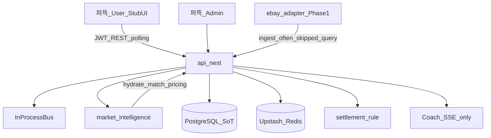
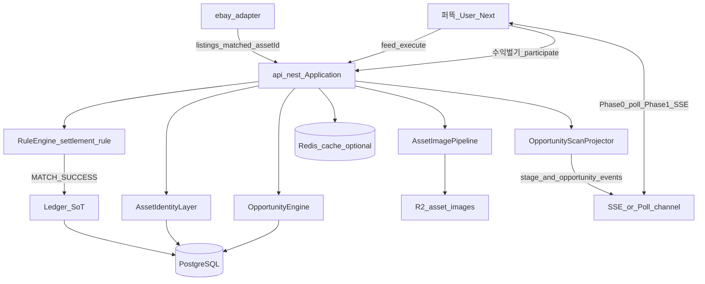
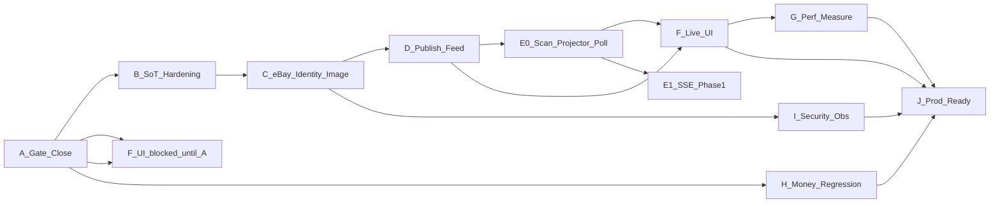

# 퍼뜩 Master Architecture Audit & Implementation Plan

**Mode:** analysis only (this document). No code/config/migration changes in this step.  
**Brand:** Consumer/AI = **퍼뜩** · Platform = AI Profit OS · **CLIME = 0 hits** in repo (rename migration N/A).  
**Governance lock:** ACTIVE File-Serial + ADR-014/015/016 supersede any greenfield rewrite. This Master Plan is an **audit overlay**; execution stays in [`.cursor/plans/ai_profit_os_*.plan.md`](.cursor/plans/ai_profit_os_00_index_a1b2c3d4.plan.md) todos — do not spawn a parallel todo queue.

---

## 1. Executive verdict

퍼뜩 is a **capital-participant / orchestrate** platform (CTA = `수익 벌기` → `participate`), not a marketplace. Backend money + opportunity **runtime APIs are largely present**; user web surfaces are still **route skeletons**. eBay Browse OAuth/search **code exists**, but Day-1 ingest **drops** `assetId=query:*` listings before PG — so live eBay thumbnails rarely become Opportunity cards. There is **no** `scans` / `scan_events` / `realtime-service`. Phase0 realtime for trades is **polling** (`execute-tick`); the only production SSE pattern today is **퍼뜩 Coach** chat.

**Immediate File-Serial tip:** Engine `engine-pre-ui-close` (`in_progress`) + Money `money-user-benefits-read` (`pending`) → then 03 UI (홈 기회스캔 · 실사진 · 진행실).

---

## 2. CURRENT STATE (evidence)

### 2.1 Monorepo topology (real)

| Area | Path | Status |
|------|------|--------|
| User PWA | [`apps/web`](apps/web) Next **16.3.0** · React **19.2.0** · TW4 | Route shells only (홈/수익 stub) |
| Admin | [`apps/admin`](apps/admin) | Opportunities/adapters pages richer than user |
| API | [`services/api-nest`](services/api-nest) Nest **11.1.x** · JWT · in-process bus | Opportunities/participate/trades/adapters/ledger live modules |
| Market intel | [`services/market-intelligence`](services/market-intelligence) | Pipeline stages, image hydrate, match identity |
| Engine | [`services/engine-rust`](services/engine-rust) | `settlement_rule` SSOT · Nest calls `.cjs` (no new FFI) |
| eBay worker | [`workers/ebay-adapter`](workers/ebay-adapter) | Browse + OAuth · Phase1 deploy |
| Other adapters | amazon/yahoo/pokemontcg/ygoprodeck/coingecko/frankfurter | Scaffold / Phase1+ · yahoo_jp Day-1 FORBIDDEN |
| UI kit | [`packages/ui`](packages/ui) Lux · Brand · Canon wires · `copy/ko` | Components sparse (wallet-heavy) |
| Schemas | [`schemas/`](schemas) + [`packages/schemas`](packages/schemas) | Day-1 contracts |
| DB | [`supabase/migrations`](supabase/migrations) (~28 local files) | PG Seoul SoT · RLS deny-by-default |
| Infra | CF Pages/Workers · Upstash Redis · R2 | Phase0 bootstrap locked |
| Realtime svc | — | **folder 0** |

### 2.2 Stack inventory (versions from package.json — not guessed)

| Layer | Tech | Version / note | Keep? |
|-------|------|----------------|-------|
| Runtime | Node | `>=22.14 <23` | Keep |
| PM | pnpm | `10.14.0` | Keep |
| Web | Next + React | `16.3.0` / `19.2.0` | Keep |
| CSS | Tailwind | `^4.1.11` + Lux `@theme` | Keep |
| API | NestJS | `^11.1.5` | Keep |
| Cache client | ioredis | `^5.11.1` (Upstash) | Keep; no new Redis product until measured |
| DB | PostgreSQL via `pg` | Supabase Seoul PG17 | Keep · single SoT |
| Edge | Cloudflare + OpenNext | wrangler `^4.120` | Keep · Vercel forbidden |
| Engine | Rust + Nest `.cjs` bridge | Phase0 | Keep |
| State libs | React local only | **no** Zustand/RQ/SWR in sdk | Prefer keep until UI scale |
| Animation/Charts/PWA | Serwist etc. | PWA owns=`05` plan · not fully shipped in web | Defer |
| Events Phase0 | In-process bus | NATS/Temporal **0** | Keep until Phase1 |
| Testing | `tooling/verify/*` + husky gate | Primary quality bar | Keep · expand contracts |

### 2.3 Domain SoT map (actual names ≠ user’s Product/Listing/Image labels)

| User concept | Repo SoT | Authoritative store |
|--------------|----------|---------------------|
| Product | `assets` (Asset Master) | `public.assets` |
| Listing | `listings` | `public.listings` (+ ingest normalize) |
| ProductImage | `assetImageUrl` fields + hydrate | assets/opportunities columns · R2 `admin_r2` |
| Opportunity | `opportunities` | `public.opportunities` + pricing jsonb |
| Market/Source | `market_id` / `adapter_id` | CHECK enums · ebay\|admin Day-1 |
| Scan session | **absent** | UX language “기회스캔” only |
| Matching / settle | Rule Engine + `trade_executions` | Rust rule · Nest tick · ledger journals |
| Wallet | 4 buckets | `ledger_*` · no balance UPDATE |

**Do not create** parallel `products` / `product_images` / `scans` tables in Day-1 — extend Asset/Listing/Opportunity.

### 2.4 eBay API (real)

[`workers/ebay-adapter/src/browse-api.ts`](workers/ebay-adapter/src/browse-api.ts) + [`index.ts`](workers/ebay-adapter/src/index.ts):

- OAuth **client_credentials** · scope Browse · in-memory token cache + 60s skew  
- Browse `item_summary/search` · `X-EBAY-C-MARKETPLACE-ID` · marketplaces US/GB/DE/AU  
- Maps: `itemId`, `title`, `price.value/currency`, `image.imageUrl`, `itemWebUrl`  
- Dry-run when creds missing  
- Ingest POST → Nest `/api/v1/internal/adapters/ingest` (token header)

**Gaps (confirmed):**

- No Item API · no `additionalImages`  
- `limit` default 10 · no offset/pagination loop  
- No structured retry / rate-limit / timeout policy constants  
- **`assetId: query:${query}`** → [`normalizeIngestListingsForPersist`](services/market-intelligence/src/catalog-runtime-seed.cjs) **skips** PG persist  
- Worker Phase1; not Phase0 in-process crawl on user click

### 2.5 Image pipeline (real)

Priority in [`asset-image.cjs`](services/market-intelligence/src/asset-image.cjs):

1. Asset Master / R2 `admin_r2`  
2. Catalog (pokemontcg / ygoprodeck) for cards  
3. Listing thumbnail `ebay`  
4. missing → block `available` auto-publish  

[`AssetImageR2Service`](services/api-nest/src/opportunities/asset-image-r2.service.ts): public URL builder · **SigV4 PUT = placeholder** (not production-grade signed upload).  
No image proxy, resize, WebP/AVIF transform, or SSRF-safe fetch-to-R2 path yet. Cards may hotlink external eBay/CDN URLs.

### 2.6 Money / ledger (real · strong)

- `numeric(36,18)` · double-entry · `idempotency_key` UNIQUE  
- Posting-only balance mutation · RLS/triggers  
- Participate / trade / settlement fanout pointers exist  
- AI must not decide ledger amounts (already locked via coach/fact tools verifies)

### 2.7 Realtime / SSE (real)

| Channel | Status |
|---------|--------|
| Coach `POST /me/peotteok/chat` | SSE (`text/event-stream`) implemented |
| Trade execution | Phase0 **`POST /trades/:id/execute-tick` polling** (Engine §0.9.2 lock) |
| Opportunity price/status events | In-process event **names** only ([`opportunities.events.ts`](services/api-nest/src/opportunities/opportunities.events.ts)) · no user SSE stream |
| `services/realtime-service` | **0** |
| Web `EventSource` client | **0** in apps |

### 2.8 User UX (real)

- [`apps/web/app/page.tsx`](apps/web/app/page.tsx) / [`profits/page.tsx`](apps/web/app/profits/page.tsx): stubs  
- Execute page: success CTA shell · no live tick wiring  
- Copy/Canon already lock CTA=`수익 벌기`, scan expression, Soft/Hard tension, assetImage slots  
- **Fake % progress UI not shipped yet** — risk is future UI inventing timers; backend `progress_pct` must stay Rule-driven

### 2.9 Identity (real · partial)

- Watch/card/bag match modules: exact > fuzzy ([`watch-match.cjs`](services/market-intelligence/src/watch-match.cjs) etc.)  
- eBay ingest identity broken by `query:` placeholder  
- No AI-first identity for money/eligibility

### 2.10 Adapter dual-state smell

[`AdaptersAdminService`](services/api-nest/src/adapters/adapters.admin.service.ts) keeps **in-memory** listings/attempts/catalog caps alongside PG — KPI/health can diverge from DB SoT.

### 2.11 File-Serial tip (2026-08-09)

```text
00 Index CLOSED
01 Money · money-user-benefits-read PENDING (depends Engine execute-rule-loop — done)
02 Engine · E-R1…E-R7 completed · engine-pre-ui-close IN_PROGRESS
03 UI · blocked until Gate close
```

---

## 3. GAP ANALYSIS → ROOT CAUSE

| Gap | Root cause |
|-----|------------|
| Live eBay photos not on cards | Ingest skips `query:*`; Asset Master match not wired end-to-end on worker tick |
| No Live Scan session API | Product never modeled `scans` table; “기회스캔” is UX projection of catalog/pipeline |
| No Opportunity SSE | Phase0 bus in-process; realtime-service deferred; UI not started |
| User app feels empty | Pre-UI Gate + File-Serial correctly blocked UI; stubs remain |
| Dual adapter memory vs PG | Phase0 convenience store never cut over to PG-only KPI |
| Image CDN/perf incomplete | R2 path Admin-first; external URL hotlink; no transform |
| Risk of fake scan progress | UI §48.3 historically assumed SSE; must bind to Fact stages / Rule ticks only |
| Marketplace vocabulary drift | `/trades` paths + legacy words vs 퍼뜩 capital-participant copy (surface jargon gated) |

---

## 4. TARGET ARCHITECTURE

### 4.1 CURRENT (as built)



### 4.2 TARGET (퍼뜩 production · modular monolith)



**Locked product semantics**

- Home **기회스캔** = projector over **published Opportunities + pipeline stage Facts** (not per-click marketplace crawl).  
- **수익 벌기** = `POST .../participate` → `trade_executions` orchestration.  
- AI = normalize/rank/enrich only · **never** ledger amounts.  
- Phase0 transport = REST + trade polling · Coach SSE pattern reusable for Phase1 Opportunity/Scan streams.

---

## 5. TECHNOLOGY DECISIONS (ADR-ready · no premature upgrades)

| Decision | Choice | Reconsider when |
|----------|--------|-----------------|
| Product SoT name | Keep `assets` (no `products` table) | Never for Day-1 |
| Live Scan model | **Projector + event taxonomy** over existing pipeline/opportunities; no `scans` table in Phase0 | Persistent multi-minute user scan sessions needed after UX measure |
| Trade realtime | Phase0 **polling** `execute-tick` | Phase1+ swap channel only → SSE |
| Discovery realtime | Phase0: feed GET + optional short poll; Phase1: SSE reuse Coach framing | Bidirectional needed → WS |
| Images | Prefer listing/catalog/R2 URLs; optional later **fetch-to-R2** with SSRF allowlist | Hotlink breakage / CLS / legal |
| Workers/Canvas/WebGL/Protobuf | **Off** until measured bottleneck | Long tasks / FPS evidence |
| Redis | Cache/presence only · not financial SoT | Proven PG latency need |
| Microservices | Stay modular monolith | Team/scale trigger in Infra plan |
| State | React server/client state + thin sdk hooks | Feed complexity forces RQ/Zustand |

Proposed ADR numbers below are **퍼뜩 Master ADRs** (document-only until Infra/Engine todos absorb) — do not collide blindly with existing ADR-001..016 stack locks; name them `PADR-Sxx` in docs when authored.

---

## 6. EVENT TAXONOMY (Target · URL refs only, no image bytes)

Minimal envelope: `eventId`, `scanProjectionId` (or `feedEpoch`), `timestamp`, `sequence`, `type`, `source`, `region?`, `payload`.

| type | Meaning | Phase |
|------|---------|-------|
| `scan.stage_changed` | Map to `PIPELINE_STAGES` / UX stage copy | 0 projector · 1 SSE |
| `listing.matched` | Listing bound to `assetId` (not `query:`) | 1 after identity fix |
| `opportunity.found` / `.validated` | Publish guard passed | 0/1 |
| `trade.execution.step` | Rule tick Fact | 0 poll · 1 SSE |
| `scan.completed` / `.failed` | Projection cycle end | 0/1 |

Idempotency: `(scanProjectionId, sequence)` or `eventId` UUID · client dedupe · ignore stale `sequence`.

---

## 7. SCAN STATE MACHINE (UX ↔ backend Facts)

Map UI states to **existing** facts (no fake timers):

| UI state | Backend Fact |
|----------|--------------|
| IDLE | No active participate / idle home |
| STARTING | Feed refresh / projector start |
| SCANNING | Pipeline stages `listing_observe`… or feed loading Facts |
| ANALYZING | `spread_compute` / compareReady evaluation |
| VALIDATING | Publish guards + image guard |
| REVEALING | `opportunity.found` cards (real rows) |
| COMPLETED | Stable feed · CTA ready |
| FAILED | Adapter/ingest/circuit errors surfaced in KO copy |
| CANCELLED | User left · server cleanup TTL |

**수익 벌기** after card bind enters **trade** state machine (`running/requeue/success/...`) — separate from scan projector.

---

## 8. IMAGE SYSTEM (Target)

- Sources: Asset Master R2 → catalog → **matched** eBay `imageUrl`  
- Lifecycle: observe → validate https → optional copy to R2 → set `asset_image_*` → card/detail sizes  
- Card = thumb · Detail = larger · lazy + priority for hero  
- Fallback: category icon **only** after load-fail (not AI-generated Rolex/Pokémon)  
- Broken/missing: `image_missing` · block available  
- SSRF: if server fetches remote images, allowlist hosts (eBay image CDN) · block private IPs  
- Perf: aspect-ratio slots in Canon · no layout shift · CDN cache headers on R2

---

## 9. PRODUCT IDENTITY (Target priority)

1. Authoritative `asset_id` (Asset Master)  
2. Vertical keys (watch ref · card set/number · bag brand/model) via existing match modules  
3. Brand+model / normalized title  
4. AI similarity **assist only** → `needs_validation`  
5. Never persist ebay listing under `query:*` as FK

---

## 10. MASTER IMPLEMENTATION ORDER

Map user Phases → **repo ownership** (File-Serial safe).

### Phase A — Close Pre-UI Gate (NOW)

Owns: Engine `engine-pre-ui-close` · Money `money-user-benefits-read`  
Acceptance: MCP counts · verify suite · Index next = 03 UI.

### Phase B — Domain / SoT hardening (docs + small Engine follow-ons)

- Document Asset/Listing/Image/Opportunity SoT (this plan)  
- Kill dual-memory as SoT: KPI/listings authoritative from PG  
- ADR notes: scan projector vs scans table

### Phase C — eBay → Listing → Asset → Image (Engine + workers)

**TASK-C1 eBay listing identity bind**

- CURRENT: `query:` skipped  
- TARGET: worker/Nest resolve listing → Asset Master via watch/card/bag match before persist  
- FILES: `workers/ebay-adapter/src/index.ts`, `catalog-runtime-seed.cjs`, adapters ingest, match `*-match.cjs`  
- DB: reuse `listings`/`assets` · no new product table  
- TESTS: ingest with real assetId · image hydrate rank 3 · verify listing-legs + asset-image  
- ROLLBACK: keep skip unknown; dead-letter raw jsonb

**TASK-C2 Browse hardening**

- Pagination, timeout/retry/rate constants, richer fields when Item API justified  
- No secrets in logs

**TASK-C3 R2 upload real SigV4 / CF Worker upload**

- Replace placeholder signature · Admin assets tab E2E

### Phase D — Opportunity publish & feed integrity

- Publish guards already coded — ensure runtime seed + live ingest produce `available` with images  
- Stale FX/price thresholds enforced in Rule + feed filters  
- Idempotent opportunity upsert keys

### Phase E — Scan projector + realtime channel

**Phase0:** Nest projector emits stage Facts; UI polls feed/projection endpoint (thin).  
**Phase1:** SSE endpoint patterned on Coach · Last-Event-ID · heartbeat · auth JWT · sequence dedupe.  
**Do not** put image binaries on the wire.

### Phase F — 퍼뜩 Live UI (03 UI File-Serial)

Todos already named: `opportunity-scan-home-ux`, CTA, assetImage surfaces, execution room with **`useTradeExecution` poll→SSE swappable**.  
- Real cards from API · preload images · window recent N · virtualize only when N large  
- **Forbidden:** Math.random progress · marketplace buy/sell copy

### Phase G — Performance constitution (measure-first)

Budgets set after first Lighthouse/DevTools on real Canon screens (no invented FPS numbers now). Escalation ladder: JSON/SSE/HTML → Worker/Canvas/Redis/WS only with evidence.

### Phase H — Money/Match integrity regression

- Keep Rule vs AI split  
- Duplicate participate/settlement tests already sketched in verify catalog — expand failure cases  
- bucket-invariant + pg-module-scan mandatory on money touches

### Phase I — Security / observability

- Secrets · adapter token · JWT audiences · SSRF on image fetch · RLS unchanged deny-by-default for anon  
- Trace: `requestId`, `userId`, `opportunityId`, `tradeId`, `adapterId`  
- Metrics: ebay latency, ingest success, image missing rate, tick latency, SSE connections (Phase1)

### Phase J — Testing pyramid & production readiness

Contract tests: ebay schema drift · missing/broken image · SSE disconnect/reorder · duplicate settle · partial adapter failure · load smoke in CI (not on 8GB laptop).

---

## 11. TASK DEPENDENCY GRAPH (compressed)



Parallelism on this PC: **1 agent / 1 process** (ADR-016). CI owns heavy builds.

---

## 12. PERFORMANCE / SECURITY / IDEMPOTENCY (summary)

- **Perf:** Canon slots + lazy images + recent-N feed; virtualize later; no Canvas/Worker default.  
- **Idempotency:** participate / ledger / ingest batch keys / opportunity upsert.  
- **Concurrency:** UNIQUE keys · row locks in posting · client event sequence.  
- **Security:** Nest JWT · no Supabase Auth · ingest token · https-only images · no `.env` commit.  
- **Money:** numeric · immutable journals · AI out of ledger path.

---

## 13. ZERO-REGRESSION GATE (each phase)

`pnpm verify:gate` + domain verifies from [`tooling/verify/CATALOG.md`](tooling/verify/CATALOG.md) · money → `bucket-invariant` + `pg-module-scan` · UI → `no-it-jargon` + Canon · stop → `cleanup:lowspec` · if push → `gh run watch` green.

---

## 14. CLIME migration

**Not required** — zero references. Brand drift risk is retired names `오늘수익`/`바로번다` (already verify-gated), not CLIME.

---

## 15. What this plan deliberately does NOT do

- Replace File-Serial with a 12-file greenfield rewrite  
- Add Day-1 NATS/Temporal/EKS/WebSocket/WebGL  
- Create `products`/`scans` tables without measured product need  
- Treat eBay worker as “already live in production” without creds + identity bind  
- Allow AI-generated product photos as Opportunity truth

---

## 16. Final quality checklist (audit)

- [x] Repo structure/stack versions from package.json  
- [x] eBay OAuth/Browse/ingest path confirmed + gaps  
- [x] Image hydrate + R2 placeholder confirmed  
- [x] Asset/Listing/Opportunity SoT confirmed · no scans tables  
- [x] Identity modules exist · ebay `query:` hole documented  
- [x] SSE = Coach only · trades = polling lock  
- [x] Money ledger integrity strong  
- [x] UI stubs · Canon/copy ahead of implementation  
- [x] CLIME absent · 퍼똑 naming used  
- [x] Fake progress forbidden · Fact stages defined  
- [x] Dependency order respects File-Serial + Phase0 RAM  
- [x] Over-engineering deferred to measure triggers
