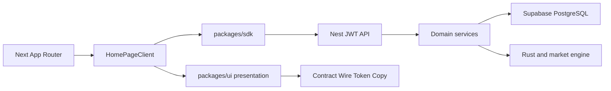
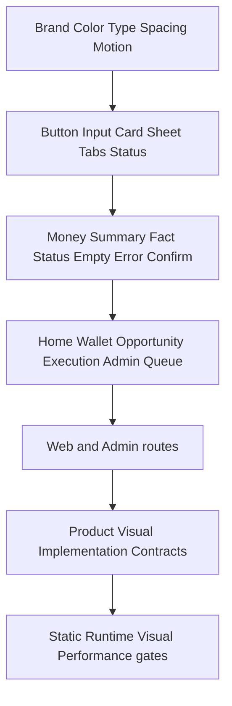

# AI Profit OS 전체 플랫폼 세계 최상위 재설계 마스터 로드맵

> **REFERENCE ONLY · 실행 금지 (v7.23).**  
> 본 파일 frontmatter todo 18개는 전부 `cancelled`다. 작업·status 재오픈·완료 처리 금지.  
> **실행 SSOT** = 워크스페이스 `.cursor/plans/ai_profit_os_00~06_*.plan.md` (File-Serial · 다음=`platform-redesign-r0-inventory`).  
> 아래 본문은 Phase/품질/명세 **참고**만. 구칭 “실행 SSOT” 문장은 supersede됨.

> **Architecture Change Control은 변경 금지(immutability)를 의미하지 않는다.** Change Control 이후에도 변경은 가능하며, 변경 수준에 따라 필요한 검증과 승인만 증가한다. 기존 결정을 조용히 덮어쓰지 못하게 하는 것이 목적이다. (구칭 “Architecture Freeze”는 폐기)

## 0. 이 문서의 역할

이 문서는 기존 Web-only Phase 1~5 로드맵과 Home 분석 결과를 병합한 **참고 로드맵**이다. **실행 SSOT는 워크스페이스 `ai_profit_os_00~06` 해시 플랜**이며, 본 frontmatter todo는 전부 cancelled다.

- 지금 확정하는 것: 전체 아키텍처, 품질 기준(Development/Release 분리), 명명 규칙, 단계 순서, Phase 0 Forensic+Governance, Phase 1 Preflight·Home 상세 명세
- Phase 착수 시 확정하는 것: 해당 도메인의 화면별 Product/Visual/Implementation Contract와 파일 단위 구현 목록
- 작업 방식: 한 도메인씩 File-Serial 실행. Fact↔State 상호 검증 후 Contract → Dependency Spike 판정 → Wire/Token/Mapping → Implement → Verify
- 품질 목표: “오류0·결함0·오차0·중복0”은 **Release Definition**(Phase 인증) 조건이다, Phase 내 일상 진행은 **Development Definition**으로 판정한다

### 전체 Phase 구조 (Governance 보강 후)

```text
PHASE 0 — Forensic + Governance
  ├─ Route inventory
  ├─ Fact ↔ State discovery
  ├─ Semantic conflict boundary
  ├─ Change Control 대상 확정
  └─ Observation Registry 설치
        ↓
PHASE 1 PREFLIGHT
  ├─ Home Truth 수정
  ├─ Brand Assets 수정
  └─ Money Read Contract
        ↓
PHASE 1 HOME
  ├─ Product Contract
  ├─ Visual Contract
  ├─ Implementation Contract
  ├─ Wire/Token/Mapping
  ├─ Implement
  └─ Verify
        ↓
Certification (+ Observation snapshot)
```

**Phase 0는 수정 구현 Phase가 아니다.** Phase 0에서는 발견·분류·Fact provenance 확인·Change Control 대상 확정까지만 수행하며, Home Truth 수정과 Brand Asset 생성/교체는 Phase 1 착수 직전(Phase 1 Preflight) 작업으로 이월한다. Phase 0 진행 중 코드 수정이 필요해 보이는 항목을 발견하면, 즉시 고치지 말고 분류(`defect` / `intentional` / `deferred` / `missing Fact`)만 남긴다.

## 1. 2026-08-10 실물 기준선

기존 문서의 “Web 59개 화면”은 물리 `page.tsx` 수와 맞지 않는다. 앞으로 다음 실측치를 기준으로 한다.

- Consumer Web: [`apps/web/app`](apps/web/app) 물리 route **41개**
- Canon user/admin surface: [`packages/ui/canon/surfaces`](packages/ui/canon/surfaces) wire **54개**
- Consumer IA: `홈·기회·수익·지갑·내정보` 5탭 + nested routes 36개
- Admin: [`apps/admin/routes.ts`](apps/admin/routes.ts) 12 top-level modules + child/deep routes
- API: [`services/api-nest/src/app.module.ts`](services/api-nest/src/app.module.ts) Nest modules 17개
- Engine: Rust settlement rule + market/AI/simulation/memory supporting services
- DB: [`supabase/migrations`](supabase/migrations) migration 30개
- Home Visual Contract: Home만 6개 문서 보유, 나머지 route는 대부분 wire only
- Gate: T0 fast, T1 push, T2 CI + 80개 이상 domain verify

### 현재 사용자 데이터 흐름



### 유지할 기술 스택

현재 스택은 목표 달성에 충분하며 근거 없는 재플랫폼은 하지 않는다.

- Node 22 + pnpm 10.14 monorepo
- Next.js 16 App Router + React 19.2
- Tailwind CSS v4 + `peotteok-light` semantic tokens
- NestJS JWT Auth + `aipo_session`
- Rust settlement engine
- Supabase-managed PostgreSQL Seoul + Upstash Redis
- Cloudflare Workers + OpenNext + R2
- Phase0 in-process bus

`Vercel`, 두 번째 DB, Supabase Auth, Day-1 NATS/Temporal/EKS는 추가하지 않는다. 새로운 dependency는 기존 primitives로 해결할 수 없는 것이 측정으로 확인된 경우에만 ADR과 함께 도입한다.

## 2. 외부 벤치마크에서 채택할 패턴

### 한국형 단순 금융 UX — Toss

근거:

- [Toss Design System](https://toss.tech/article/toss-design-system)
- [Toss 모바일 접근성](https://toss.im/tossfeed/article/tinyquestions-disability-5)
- [TDS Typography](https://tossmini-docs.toss.im/tds-mobile/foundation/typography/)

채택:

- 접근성을 화면별 옵션이 아니라 공통 컴포넌트 기본값으로 내장
- VoiceOver/TalkBack, 큰 글씨, 명확한 role/aria 상태를 primitive에서 해결
- 한 화면 한 primary action, 쉬운 한국어, 시선 순서가 명확한 금액 위계
- 나이·성별 분기가 아니라 `fontScale md/lg/xl`, motion preference, device tier로 적응

### 금융 신뢰와 동적 요구사항 — Wise

근거:

- [Wise Transfer Requirements](https://docs.wise.com/guides/product/send-money/transfer-requirements)

채택:

- 입금·출금·KYC form 요구사항을 화면에 하드코딩하지 않고 서버 계약에서 동적으로 제공
- 네트워크·통화·금액에 따라 필요한 필드만 단계적으로 노출
- 수수료, 실제 수령액, 예상 시간, 오류 복구 방법을 최종 확인 전에 고정 표시

### 일관된 운영자 UX — Stripe와 Shopify

근거:

- [Stripe Apps Design](https://docs.stripe.com/stripe-apps/design)
- [Stripe Style Tokens](https://docs.stripe.com/stripe-apps/style)
- [Shopify App Design](https://shopify.dev/docs/apps/design)
- [Polaris Density](https://polaris.shopify.com/design/layout/density)

채택:

- 자의적인 화면별 CSS 대신 제한된 semantic token과 검증된 pattern 조합
- 목록/테이블은 high density, 수정·승인·출금 같은 집중 작업은 low density
- Context view→Focus view 구조로 복잡한 업무의 집중도를 높임
- 운영자 화면은 기능명보다 “오늘 해야 할 일”과 예외 queue 중심

### 공유 Design System — Revolut와 Coinbase

근거:

- [Revolut engineering fundamentals](https://medium.com/revolut/the-fundamentals-of-ios-at-revolut-f75acb765ac8)
- [Coinbase Design System](https://cds.coinbase.com/getting-started/introduction)
- [Coinbase accessibility](https://www.coinbase.com/nl/blog/how-accessibility-drives-product-quality-at-coinbase)

채택:

- primitives→patterns→surfaces 계층으로 중복 UI 제거
- screen reader, high contrast, reduced motion을 Design System과 자동 lint에서 보장
- 사용자 Web과 Admin은 브랜드 token을 공유하되 정보 밀도와 shell은 분리

### 상품 시세 발견 — StockX

근거:

- [StockX app listing](https://play.google.com/store/apps/details?id=com.stockx.stockx)

**Adopt** (시각·발견 UX만):

- visual discovery
- comparison density
- fact freshness
- progressive disclosure
- 상품·필요 금액·예상 결과·상태를 한 카드에서 빠르게 비교
- CTA는 현재 상태에 따라 참여/추가입금/진행확인으로 문맥화
- 가격/시세는 source·asOf·freshness가 있는 Fact만 표시

**Reject** (trading semantic drift 재유입 방지):

- buyer / seller / bid / ask / trade / marketplace / resale semantics
- 거래형 jargon과 과도한 데이터 밀도를 beginner surface에 노출하는 패턴
- StockX의 마켓플레이스·호가 모델을 제품 의미로 이식하는 것

## 3. 목표 경험 원칙

### Consumer Web

1. 3초 안에 “내 상태·가능한 다음 행동·예상 결과”를 이해한다.
2. 화면마다 primary CTA는 하나다.
3. 수치에는 단위, 시점, 출처, 상태 중 필요한 정보를 함께 제공한다.
4. loading·empty·error·stale·ready를 구분하고 같은 문구로 뭉개지 않는다.
5. 실제 변화가 있을 때만 badge·motion·알림을 사용한다.
6. 모바일은 PC 축소판이 아니라 별도 정보 우선순위를 갖는다.
7. 모든 중요 작업은 실패 후 복구 방법을 바로 제공한다.

### 비개발 운영자 Admin

1. 첫 화면은 시스템 구조가 아니라 `오늘 처리할 일`, `막힌 일`, `위험`, `최근 변경`이다.
2. 모든 변경은 preview→confirm→apply→result→rollback 순서다.
3. 내부 field name 대신 쉬운 한국어와 영향 범위를 표시한다.
4. destructive action은 dry-run, 영향 건수, step-up, audit reason을 요구한다.
5. 설정 화면마다 기본값·추천값·현재 적용값·마지막 변경자를 보여준다.
6. 실패한 작업은 재시도 버튼보다 먼저 실패 원인과 안전한 다음 행동을 보여준다.
7. policy 변경, bulk mutation, execution rule, wallet operation, risk threshold에는 **LIVE / DRY_RUN / SIMULATION** 3모드를 적용한다.

## 4. Design System 아키텍처

### Fact ↔ State Discovery Loop (선형 아님)

기존 `Contract→Wire→Token→Code→Verify` 단일 선형 순서는 **폐기**하고, 다음 반복 루프를 SSOT로 한다.

```text
Observe → Classify
    ↓
┌─────────────┐
│    Fact     │
└──────┬──────┘
       ↕ (상호 검증, 반복)
┌─────────────┐
│    State    │
└──────┬──────┘
       ↓
   Contract
       ↓
Dependency Spike (§10 판정 적용)
       ↓
   Contract Freeze / Change Control 대상 확정
       ↓
Wire/Token/Mapping → Implement → Verify
```

Fact inventory와 State model은 상호 검증되는 반복 단계이며, Contract 작성 중 신규 Fact 요구가 발견될 수 있다. 신규 Fact는 provenance와 owner를 확정한 후 inventory에 편입한다. **“Fact를 먼저 100% 확정하고 State로 넘어간다”는 표현은 쓰지 않는다.**



### 계층별 SSOT

- Foundation: [`packages/ui/tokens`](packages/ui/tokens), [`packages/ui/brand`](packages/ui/brand)
- Primitive: `packages/ui/components/lux`, `shell`, 접근성 wrapper
- Pattern: Money summary, async state, empty/error, confirmation, fact freshness
- Surface: Home, Wallet, Opportunity, Execution, Account, Admin
- Copy: [`packages/ui/copy/ko`](packages/ui/copy/ko)만 사용, JSX 하드코딩 금지
- Canon: route별 **Product / Visual / Implementation** Contract 3계층 + wire + mapping
- Gate: [`tooling/verify`](tooling/verify) 경로 기반 자동 검증

### Home Contract 3계층 분리

| 계층 | 역할 |
|---|---|
| **Product Contract** | What must exist / Facts / states / actions |
| **Visual Contract** | hierarchy / responsive / layout / typography / motion |
| **Implementation Contract** | component mapping / files / hooks / tokens / verification |

세 계층을 한 문서에 뭉개지 않는다. Visual만 잠그고 Product Fact를 느슨하게 두지 않으며, Implementation만 바꾸고 Product/Visual 의미를 조용히 바꾸지 않는다.

### 공통 상태 모델

모든 비동기 화면은 다음 상태를 명시적으로 가진다.

```text
idle
loading
ready_empty
ready_data
stale
recoverable_error
blocked
unauthorized
```

- `loading`: 실제 Promise가 진행 중일 때만 spinner/skeleton
- `ready_empty`: 실패가 아니라 현재 결과 없음 + 다음 행동
- `stale`: 마지막 성공 데이터 + asOf + 새로고침
- `recoverable_error`: 원인과 재시도
- `blocked`: 정책/잔액/KYC 등 실제 reason
- `unauthorized`: login continuation

정적인 “AI가 살펴보는 중” 문구로 여러 상태를 대체하지 않는다.

#### reason_code — schema만 Phase 0에서 고정

vocabulary(실제 코드 목록)는 domain Phase로 지연한다.

- Phase 0 schema:

```ts
type BlockedState = { state: "blocked"; reasonCode: string };
// reasonCode 형식: domain.resource.reason
```

- 실제 목록(`blocked_policy`, `blocked_balance` 등)은 Phase 3(Money), Phase 4(Execution)에서 각 domain registry로 확정한다.
- engine state transition은 UI에서 뭉개지 않는다. 예: `engine.running→success`와 `engine.running→safe_stop`을 동일 `blocked`로 합치면 안 된다 — recovery path가 다르다.

### Architecture Change Control (구 Architecture Freeze)

변경은 금지되지 않는다. 수준에 따라 검증·승인만 증가한다. **애매하면 상위 등급으로 분류한다.**

```text
Architecture Change Control
│
├─ L1 Local — component 내부, CSS, copy, local hook, implementation detail
│    └─ 일반 domain review
│
├─ L2 Contract+ — Contract, Wire, Token, API boundary, State model, shared component
│    └─ reviewer 1명 + 관련 gate
│
└─ L3 Critical — money, security, auth, SoT, DB schema,
     engine settlement/state transition, protected boundary
     └─ 2인 승인 + evidence + regression + rollback plan
```

Phase 0 종료 시 Change Control 대상 확정 항목:

- route inventory
- Fact inventory
- API boundary
- state model
- token hierarchy
- asset pipeline
- auth boundary
- money invariant
- event schema
- naming convention

Contract 재검토(의미 충돌 시) 필수 순서: change reason → affected assumptions → before/after diff → version bump → affected wire/gate 재검증. **조용한 수정 금지.**

## 5. 성능 아키텍처

### 공개 품질 기준

공식 [Web Vitals](https://web.dev/articles/vitals) p75 mobile/desktop 기준:

- LCP ≤ 2.5s
- INP ≤ 200ms
- CLS ≤ 0.1

내부 목표:

- initial route는 Server Component 우선, Client Component는 상호작용 island만
- layout을 유발하는 속성 animation 금지, `transform`/`opacity`만
- above-fold LCP asset은 explicit size + `fetchPriority=high`
- below-fold image는 lazy + 정확한 `sizes`
- route별 JS baseline을 먼저 기록하고 각 slice 증가량을 CI에서 비교
- 320px 저사양 device tier B에서도 기능 손실 없이 motion·blur만 축소

### Next 16 / OpenNext 전략

- `cacheComponents`/PPR은 전역 즉시 활성화하지 않는다.
- 별도 compatibility spike에서 OpenNext T2 build, cookies/Suspense, cache invalidation을 검증한다.
- guest landing/guide처럼 공용 콘텐츠는 static shell/cache 후보
- 잔액·기회·정산·Admin은 user-specific dynamic hole 또는 no-store
- OpenNext는 [공식 cache guidance](https://opennext.js.org/cloudflare/caching)에 따라 static asset/R2/regional cache를 route 성격별로 선택
- 실시간성 높은 가격·잔액에는 stale cache 우회 금지
- Cloudflare CPU profile과 field Web Vitals로 최적화 전후를 측정

### 이미지 파이프라인

- 원본 master는 Brand Kit에 보존
- 자체 브랜드 illustration만 AI 생성 허용
- third-party logo는 AI로 재현하지 않고 provenance가 확인된 원본만 사용
- hero/empty/onboarding asset은 transparent master→mobile/desktop crop→AVIF/WebP fallback
- alpha edge, 배경 halo, 1x/2x, 320/430/768/1920 육안 검수
- `width`, `height`, `srcset`, `sizes`, `fetchPriority/loading`을 manifest에 기록
- Cloudflare Images/R2 도입 시 `format=auto`와 responsive width를 사용하되 origin master와 hash를 유지
- asset lifecycle: `draft → review → ready → blocked → archived`

## 6. 접근성·폭넓은 연령 사용성

공식 기준: [WCAG 2.2](https://www.w3.org/TR/WCAG22/Overview.html)

- release target: WCAG 2.2 AA
- 중요 touch target: 내부 기준 48×48px 이상
- focus indicator: 최소 2px, 인접 상태 대비 3:1 목표
- body 기본 16px 이상, 작은 법무/보조 텍스트도 확대 모드에서 reflow
- `fontScale md/lg/xl`에서 clipping·ellipsis로 핵심 의미 손실 0
- color alone으로 상태를 전달하지 않고 icon+label 병행
- BottomNav/Tab은 `role`, `aria-selected`, 현재 위치를 제공
- sheet/dialog open 시 focus 이동, close 후 trigger 복귀
- motion은 reduced-motion에서 기능 손실 없이 제거
- 성별·숫자 나이 기반 UI 분기 없이 중성 존댓말과 capability-based adaptation 사용

## 7. 데이터·보안·Money Truth

### 원칙

- UI 숫자는 API/Engine/DB Fact 또는 문서화된 derived aggregate만
- mock filler, random progression, fake realtime, zero fallback으로 상태 슬롯 채우기 금지
- 금액 field는 unit suffix를 이름에 포함: `principalUsdt`, `feeKrw`
- count와 amount를 혼용하지 않음: `ledgerTotalCount`, `settlementCompletedToday`
- 모든 mutation은 idempotency key, actor, reason, before/after audit
- balance는 ledger projection이며 임의 UPDATE 금지
- sensitive action은 re-auth/step-up과 명시적 confirmation

### Phase 1 Preflight — Money Read Contract (Wallet 전체가 아님)

Home의 핵심 Fact(balance, principal, affordable opportunity, settlement)를 검증하려면 Wallet mutation이 아니라 **읽기 전용 Contract만** Phase 1 Preflight로 필요하다.

```text
Phase 1 Preflight (Money Read Contract):
principalUsdt / availableUsdt / settlementCount / todayPossible / asOf·source·state

Phase 3에서 만드는 것 (Wallet Mutation):
deposit / withdraw / ledger history / KYC / reconciliation
```

Money Read Contract가 없으면 Home Product Contract의 Fact allowlist를 인증할 수 없다. 반대로 deposit/withdraw UI를 Phase 1에 끌어오지 않는다.

### DB 품질 트랙

- migration 30개 schema/table/function/index/RLS 인벤토리
- user/tenant predicate와 sort/filter column index 확인
- production-shaped fixture에서 `EXPLAIN (ANALYZE, BUFFERS)` 측정
- RLS가 실제 사용되는 role 경계와 Nest JWT 경계를 혼동하지 않음
- security-definer function은 explicit search_path, 권한 revoke, actor 검증
- money mutation은 concurrent/idempotent/retry/rollback test 필수

### 보안 기준

- OWASP ASVS 5.0 L2를 기본 verification target
- 출금·credential·MFA·민감 설정은 L3 성격의 secondary verification 적용
- session rotation, inactivity/absolute expiry, logout invalidation, CSRF/CORS 검증
- secrets와 PII는 Git/telemetry/log에 저장하지 않음

## 8. 관측성과 운영 복구

### 이벤트 명명

```text
ui.home.hero_cta.clicked.v1
ui.bottom_nav.profit.opened.v1
feed.opportunity.loaded.v1
wallet.withdraw.submitted.v1
execution.trade.safe_stopped.v1
admin.policy.updated.v1
```

규칙:

- `domain.entity.action.vN`
- PII·금액 원문·token 포함 금지
- `result`, `reason_code`, `duration_ms`, `route`, `device_tier`만 allowlist

### 관측 대상

- browser navigation, unhandled errors, resource timing
- LCP/INP/CLS field metrics
- API latency/error by route and reason code
- DB slow query and lock wait
- Engine state transition and safe-stop
- Admin mutation audit and rollback

OpenTelemetry browser convention은 아직 development 상태이므로 adapter를 두어 내부 event schema와 분리한다.

### 배포와 rollback

- T0: path-trigger domain verify
- T1: infra + stubs + build prerequisites
- T2: Next + OpenNext + responsive browser suite
- Cloudflare gradual deployment는 compatibility 검증 후 도입
- DB migration은 expand→backfill→switch→contract 단계
- feature flag는 UI 숨김이 아니라 server enforcement와 함께 사용
- release artifact마다 previous known-good version과 rollback runbook 기록

## 9. 명명·코딩 규칙

### TypeScript/React

- Component: `PascalCase`, 예: `HomeHero`, `WalletAmountPanel`
- Props: `<Component>Props`
- View model: `<Domain><Surface>Model`
- Hook: `use<Domain><Action>`
- 상태 union: `HomeFeedViewState`, 문자열 literal 명시
- boolean: `is/has/can/should` 접두사
- amount/count/time 필드는 단위 포함
- `data-testid`: kebab-case
- event name: dot-separated versioned schema

### API

- REST route는 복수 resource, action은 필요한 경우에만 하위 endpoint
- DTO: `<Action><Entity>Request/Response`
- Controller는 auth/userId 경계, Service는 business rule
- exception은 stable `reason_code` + 쉬운 user copy mapping
- API response에는 `asOf`, `source`, `state`가 필요한 surface에서 누락되지 않게 함

### PostgreSQL

- table/column/function: `snake_case`
- primary key: `id`, foreign key: `<entity>_id`
- timestamp: `<event>_at`, timezone-aware
- amount: numeric + 명시적 unit column/name
- enum/check constraint는 application union과 schema gate로 동기화
- migration: timestamp + one intent + forward/rollback note

### CSS/Token

- ad-hoc hex 금지
- semantic token→component token→surface class 순서
- route마다 새 spacing/radius를 만들지 않음
- media query는 shell 전환, container query는 component 적응
- motion duration/easing은 token 사용

### Copy

- 사용자 문구는 `packages/ui/copy/ko`
- Admin 문구도 별도 SSOT로 통합
- IT/DB/worker jargon은 reason-code mapping 후 쉬운 말로 변환
- 숫자·시간·금액 format helper 중복 구현 금지

## 10. 작업 방식

### Phase 순서 원칙 — 제품 구현 vs dependency spike

기존 원칙을 유지한다: **Phase N 인증 전 Phase N+1 제품 화면 코드 착수 금지.**

예외: 다음 Phase의 **제품 화면 구현은 금지**하되, 현재 Phase 검증에 필요한 **하위 dependency spike는 병렬 허용**한다.

- spike 대상: API contracts, SDK types, DB facts, Engine states
- spike는 제품 UI·route 구현이 아니며, 검증용 계약/타입/사실 확인에 한정한다

Spike 종료 시 판정:

```text
Spike 결과
  ↓
Contract와 충돌하는가?
  ↓
┌───────────────┬──────────────────────────┐
│ No conflict   │ 계속 진행                │
│ Local/구조 차이│ Adapter 허용             │
│ Semantic conflict │ Contract/Fact 재검토  │
└───────────────┴──────────────────────────┘
```

**Semantic conflict 보호 목록** (adapter로 은폐 절대 금지, 반드시 Contract/Fact 버전 갱신 필요):

1. provenance
2. source
3. freshness
4. asOf
5. state
6. money meaning
7. auth/security boundary
8. **engine state transition** (예: `engine.running→success` vs `engine.running→safe_stop`을 UI에서 동일 `blocked`로 뭉개는 것 금지 — 안전 중단과 사용자 조건 미충족은 recovery path가 다르므로 구분 유지)

Contract 재검토 시: change reason → affected assumptions → before/after diff → version bump → affected wire/gate 재검증. 조용한 수정 금지.

### Development Definition / Release Definition

**Development Definition** (Phase 내 작업 진행 기준):

- No known P0/P1
- No protected-boundary violation
- No fake Fact
- No regression against baseline

**Release Definition** (Phase 인증 기준):

- P0 = 0, P1 = 0
- Money invariant 100%, Security gate 100%
- Required accessibility/responsive gate 100%
- Performance budget PASS
- P2/P3는 backlog 허용

“오류0·결함0·오차0·중복0”은 Release 조건의, Development Definition을 대체하지 않는다.

### Severity와 Impact Domain 분리

Severity 기준 문장에 도메인명(money/security 등)을 넣지 않는다 — **영향 서술로만** 정의한다. “이 도메인이면 무조건 이 등급” 고정 매핑 금지.

| Severity | 기준 (영향 서술, 도메인 무관) |
|---|---|
| P0 | 비가역적 손실·손상 또는 안전하지 않은 핵심 실행 |
| P1 | 핵심 기능/사용자 흐름 차단, 안전한 우회 없음 |
| P2 | 기능은 가능하나 중요한 품질/정확성/UX 저하 |
| P3 | 비핵심 품질·polish |

**Impact Domain** (별도 축): money / security / auth / data / accessibility / performance / UX / visual / copy / infra

예:

- fake zero status가 핵심 의사결정에 잘못된 Fact를 제공하면 P1, 단순 장식 영역이면 P2
- accessibility blocker도 핵심 흐름을 막으면 P0급, 아니면 낮은 등급

**Release Blocker = P0 + P1.**

### Slice 실행 순서

각 slice는 다음 순서를 지킨다.

1. **Observe**: route, DOM, data source, network, screenshot, current gate 실측
2. **Classify**: defect / intentional / deferred / missing Fact
3. **Fact ↔ State**: inventory와 state model 상호 검증 (반복 가능)
4. **Contract**: Product / Visual / Implementation (authority, state, copy, responsive, a11y, perf)
5. **Dependency Spike** (필요 시): §10 판정 적용
6. **Wire**: blocks, allowed Fact, forbidden, empty/error/loading
7. **Token/Asset**: 공통 값과 provenance
8. **Mapping**: reuse/adapt/new/keep
9. **Implement**: 한 의도만 변경 · Change Control 등급(L1/L2/L3) 준수
10. **Verify**: domain + static + runtime + responsive
11. **Diff audit**: protected boundary, duplicate path, secret, stale file
12. **Release**: Development Definition 충족 후 Phase 인증 시 Release Definition + T0→T1→T2

새 화면을 만들기 전에 같은 역할의 component/hook/copy/wire가 이미 있는지 반드시 검색한다.

## 11. Phase 0 — Forensic + Governance

**Phase 0 완료 기준**: 인벤토리·분류·Fact forensic·semantic conflict boundary·Change Control 대상 확정·Observation Registry 설치. **코드/에셋 수정 구현 0.**

### 0A. 인벤토리·드리프트·분류

- Web 41 route와 Canon 54 surface의 route/state mapping 생성
- 누락 Contract, 중복 state wire, dead route, redirect, stub action 분류
- Admin 12모듈, API 17모듈, migration 30개의 owner와 gate 연결
- plan/index/catalog의 59/41 등 수치 드리프트 정정
- 발견 항목은 `defect` / `intentional` / `deferred` / `missing Fact`로만 기록하고 **즉시 수정하지 않음**

### 0B. Home Truth — 분류만 (수정은 Phase 1 Preflight)

대상(관찰·분류):

- [`HomeExperience.tsx`](packages/ui/components/home/HomeExperience.tsx)
- [`HomeRightRail.tsx`](packages/ui/components/home/HomeRightRail.tsx)
- [`BalanceAwareHome.tsx`](packages/ui/components/opportunity/BalanceAwareHome.tsx)
- [`HomePageClient.tsx`](apps/web/app/HomePageClient.tsx)
- [`HomeChromeContext.tsx`](packages/ui/components/shell/HomeChromeContext.tsx)

Phase 0에서 할 일:

- guest/null pulse “AI가 살펴보는 중” 고정 claim → 분류
- fetch lifecycle ↔ state 연결 부재 → 분류
- RightRail fake zero rows → 분류
- near-miss / balance 문맥 오류 → 분류
- BottomNav 결과 강조 부재 → 분류

Phase 0에서 하지 않을 일: 위 항목의 코드 수정. 수정 작업은 **Phase 1 Preflight (`phase1-preflight-home-truth`)**로 이월.

### 0C. Brand Asset — 분류만 (재생성은 Phase 1 Preflight)

대상(관찰·분류):

- [`packages/ui/brand/assets`](packages/ui/brand/assets)
- [`apps/web/public/brand`](apps/web/public/brand)
- [`brand.manifest.json`](packages/ui/brand/brand.manifest.json)
- [`assets/markets/manifest.json`](packages/ui/brand/assets/markets/manifest.json)

Phase 0에서 할 일: mark/label 불일치, provenance 부재, purple square/halo, avatar 불일치, package/public mirror drift를 분류하고 missing Fact/owner를 기록.

Phase 0에서 하지 않을 일: artwork 재생성·mirror 동기화·manifest ready 승격. 이는 **Phase 1 Preflight (`phase1-preflight-brand-assets`)**로 이월.

### 0D. Fact ↔ State discovery

- Fact inventory 초안과 State model을 상호 검증 루프로 수립
- provenance / source / freshness / asOf / state / money meaning / auth boundary / engine transition을 semantic conflict 보호 목록으로 잠금
- `reason_code` **schema만** 고정 (`domain.resource.reason`), vocabulary는 domain Phase로 지연
- Contract 작성 중 신규 Fact가 나오면 provenance·owner 확정 후 inventory 편입

### 0E. Architecture Change Control 대상 확정

§4 Change Control 대상 10항목을 Phase 0 산출물로 freeze(의미: 변경 시 L2/L3 절차 적용 시작). immutability가 아님.

### 0F. Governance Observation Registry 설치

Phase 1 Home 진행 중 발견되지만 **즉시 규칙화하지 않는** 경계 사례용 registry. 일반 backlog와 분리. **지금(Phase 0)은 registry 규칙·스키마만 설치하고, 가상 예외로 governance 규칙을 미리 추가하지 않는다.**

**필드**:

- 발견 Phase
- 발견 Surface
- 관찰된 사실
- 예상되는 영향
- 관련 Contract·Fact·State
- **현재 발생 여부** (사실 관찰)
- 예상 recurrence
- defer 사유
- **review trigger** (예: “동일 패턴이 두 번째 domain에서 발견되면 promote”, “Phase 4 Execution Contract 시작 시 재검토”)

**상태값**: `observed` / `deferred` / `promoted` / `rejected`

**용어 구분 (중요)**:

- `현재 발생 여부` 필드 = 실제 결함/충돌이 지금 코드/데이터에서 확인되었는가 (사실 관찰)
- `상태 = observed` = 이 사례가 Governance Observation Registry에 **등록**되었는가 (등록 절차)

이 둘은 독립적이다. `상태=observed`라고 해서 `현재 발생 여부=Yes`를 의미하지 않는다 — 아직 발생하지 않았지만 예견되는 패턴도 `observed`로 등록될 수 있다. registry 항목 작성 시 두 필드를 반드시 별도로 기입한다.

**즉시 규칙 승격 판정**:

```text
Observed in Phase 1?
  → Yes
    ↓
이미 확정된 semantic conflict 보호 목록(§10)을
직접 위반하는가?
  │              │
 Yes            No
  ↓              ↓
즉시 Rule/Gate   Governance Observation
              → Deferred (review trigger 필수)
```

주의: “money/security 관련이면 즉시 검토”처럼 넓게 잡지 않는다. 반드시 semantic conflict 목록 **8개 항목 중 하나를 직접 위반**하는 경우로만 즉시 승격 범위를 좁힌다. 그 외는 recurrence 또는 contract impact 근거로만 사후 승격.

**금지 원칙**: Phase 1에서 실제로 발생하지 않은 가상 예외를 이유로 governance 규칙을 추가하지 않는다.

## 12. Phase 1 — Preflight + Home 상세 실행 명세

### 1P. Phase 1 Preflight (Home 제품 구현 직전)

Phase 0에서 분류된 차단급 항목과 Money Read를 Home 착수 전에 처리한다.

#### 1P-1. Home Truth 수정

수정:

- guest/null pulse에 “AI가 살펴보는 중” 고정 claim 제거
- 실제 fetch lifecycle을 `loading/ready_empty/ready_data/error/unauthorized`로 연결
- header status는 실제 상태와 count만 표시
- `지금 잔액으로 0건 · +0USDT면 0건 더`는 actionable near-miss Fact가 있을 때만 표시
- balance line은 Partner 아래가 아니라 near-miss 문맥에 배치
- RightRail의 scan/confirm/progress fake zero rows 제거
- settle count와 today-possible처럼 허용된 Fact만 표시

#### 1P-2. Brand Asset 수정

수정:

- 실제 mark와 label이 불일치하는 market SVG는 `ready`에서 제외
- provenance가 확인되기 전 text fallback 사용
- 자체 Hero artwork는 transparent background mobile/desktop master로 재생성
- 현재 baked purple square/halo 제거
- header avatar는 Hero robot family와 일치하는 transparent avatar로 생성
- package/public mirror는 hash gate로 1:1 동기화
- AI 생성 prompt, source image, 모델, 생성일, review status를 manifest에 기록

#### 1P-3. Money Read Contract

- `principalUsdt` / `availableUsdt` / `settlementCount` / `todayPossible`
- 각 Fact에 `asOf` · `source` · `state`
- deposit/withdraw/ledger/KYC/reconciliation는 Phase 3로 명시적 제외

### 1A. Contract vNext (3계층)

업데이트:

- Product Contract: Facts / states / actions / allowlist·forbidden
- [`peotteok-home-visual-contract.v1.md`](packages/ui/canon/contracts/peotteok-home-visual-contract.v1.md) — Visual
- [`peotteok-home-visual-implementation-contract.v1.md`](packages/ui/canon/contracts/peotteok-home-visual-implementation-contract.v1.md) — Implementation
- [`home-visual-v2.wire.json`](packages/ui/canon/surfaces/home-visual-v2.wire.json)
- [`peotteok-light.specification.md`](packages/ui/tokens/peotteok-light.specification.md)
- [`home-visual-implementation-mapping.v1.md`](packages/ui/canon/contracts/home-visual-implementation-mapping.v1.md)

잠금:

- Mobile 320/360/375/390/414/430, tablet 768/1024, desktop 1280/1440/1920, ultrawide 2560+
- Hero copy 4-step, CTA target, Fact-only Money
- BottomNav 5탭
- state truth table
- RightRail Fact allowlist
- partner/text fallback rule
- motion/reduced-motion rule
- StockX Adopt/Reject 경계 (§2)를 Opportunity progressive disclosure에 반영

### 1B. Shell/Header/BottomNav

- [`AppHeader.tsx`](packages/ui/components/shell/AppHeader.tsx): robot avatar, factual status component, loading spinner only during real fetch
- [`BottomNav5.tsx`](packages/ui/components/shell/BottomNav5.tsx): semantic `tablist/tab/aria-selected`
- `수익` 탭: 평상시 명확한 static affordance, 새 settlement Fact가 있을 때 count badge + bounded one-shot attention; 무한 loop 없음
- BottomNav safe-area, 48px target, fontScale xl reflow
- Sidebar placeholder `✦`를 Brand Kit mark로 교체

### 1C. Hero

- transparent Robot/Globe artwork를 Hero gradient 위에 직접 합성
- 모바일 제목 keep-all 2줄, timeline 2×2, CTA full-width
- desktop artwork ≤46%, text/CTA hierarchy 유지
- static asset only, no Canvas/WebGL/Lottie
- LCP explicit dimensions, AVIF/WebP, CLS 0

### 1D. Money

- `principalUsdt`와 today-possible derived sum만 표시
- balance는 본문색, profit은 positive token
- deposit CTA 위치와 touch target 정리
- 사용가능/참여중, growth%, chart, cumulative mock 금지
- zero와 absent를 구분하고 count-up 금지

### 1E. Opportunity

- section title/count→filter→first card 순서
- empty면 filter 숨김
- card primary: image, asset label, required capital, expected result, CTA
- secondary trust/compare는 progressive disclosure (StockX Adopt)
- 상태별 CTA: participate / suggest deposit / locked reason / progress
- sticky CTA는 실제 affordable card가 있을 때만
- buyer/seller/bid/ask/trade/marketplace/resale 카피·의미 금지 (StockX Reject)

### 1F. RightRail

- desktop secondary, mobile에서는 필요한 block만 본문 아래
- settlement count, today-possible, actual Top3만
- Fact 없는 block은 hide
- fake donut, fake progress, fake zero status 금지

### 1G. Partner/Footer

- headline emoji 제거, 15–16px semibold, subcopy 13–14px
- verified mark가 없으면 provider text list
- footer와 strip이 같은 정보를 중복 노출하지 않음
- partner strip 뒤에 unrelated balance sentence를 두지 않음

### 1H. Home 인증 (Release Definition + governance 측정)

정적:

- `verify:home-live-wire`
- `verify:home-principal-slots`
- `verify:canon-surfaces`
- `verify:no-it-jargon`
- `verify:cta-earn-profit`
- `verify:brand-consumer`
- `verify:brand-assets`
- `verify:market-partner-trust`
- `verify:ia-tabs`
- `verify:lux-theme-sync`
- `verify:responsive`

추가 gate:

- `verify:home-state-truth`: guest/loading/empty/data/error 상태와 claim 검증
- `verify:no-fake-zero-status`: absent Fact의 zero placeholder 금지
- `verify:brand-asset-provenance`: manifest/source/hash/public mirror
- `verify:bottom-nav-result-indicator`: settlement Fact 기반 badge
- `verify:home-horizontal-overflow`: 320–430

실측:

- screen reader order
- 200% text zoom
- keyboard/focus
- reduced motion
- 3G/slow CPU LCP
- actual guest/auth/empty/nearMiss/affordable/settled states
- T0/T1/T2와 CI responsive browser matrix

**Release Definition 적용**: P0=0, P1=0, money invariant/security/required a11y·responsive 100%, performance budget PASS. P2/P3 backlog 허용.

**Governance 측정 항목** (Phase 1 인증에 포함, 별도 게이트로 만들지 않음):

- Contract reopen 횟수
- Fact 추가 횟수
- State 변경 횟수
- Adapter 사용 횟수
- L1·L2·L3 변경 비율
- gate가 실제로 막은 defect 수
- **Governance Observations**: total discovered / deferred / promoted / rejected / carried forward
- Observation registry **상태 스냅샷** 1건

**Deferred → 재발률 확인은 Phase 2 착수의 선행 조건으로 만들지 않는다.** 재발률 측정은 Phase 2 종료 후 회고 지표로 남긴다.

## 13. Phase 2 — Acquisition & Trust Entry

범위:

- `/l/[variant]`, `/ads`, `/ads/[variant]`
- `/auth/login`, `/auth/signup`, `/auth/complete-profile`
- `/onboarding`

핵심:

- Landing shell과 authenticated app shell 분리
- 첫 화면 단일 utility CTA
- OAuth/Passkey/password 경로의 상태·오류·복구 일관성
- 가입 요구정보 최소화, KYC는 필요 시점으로 이동
- password manager/paste 허용, accessible authentication
- onboarding은 3초 가치 설명→짧은 demo→계정 연결
- marketing copy gate와 field Web Vitals 적용
- Phase 1 Observation registry carried-forward 항목의 review trigger만 확인(재발률 선행 조건 아님)

## 14. Phase 3 — Money Trust Core

범위:

- `/wallet`
- `/wallet/deposit`
- `/wallet/withdraw`, `/withdraw/usdt`, `/withdraw/krw`
- `/wallet/history`
- `/me/kyc`, `/me/guide/get-usdt`

핵심:

- Phase 1 Money Read Contract 위에 deposit / withdraw / ledger history / KYC / reconciliation (Wallet Mutation) 구축
- money domain `reason_code` vocabulary registry 확정
- network/fee/arrival/received amount를 confirm 전에 표시
- address QR/copy/validation, wrong-chain recovery
- deposit/withdraw state machine과 idempotency
- step-up, principal confirmation, KYC reason
- ledger projection과 history reconciliation
- 모든 실패 상태에 안전한 recovery path

## 15. Phase 4 — Core Product Loop

범위:

- `/profits`, `/profits/[id]`
- opportunity confirm/preflight
- `/trades`, `/trades/[id]/execute`
- running/success/safe-stop

핵심:

- 발견→비교→확인→참여→진행→정산 결과를 동일한 object identity로 연결
- expected/result/state를 색만이 아니라 label로 구분
- polling은 hook 내부에 격리, Phase1+ transport 교체 가능
- stale price/preflight/timeout/safe-stop을 사용자 언어로 제공
- success receipt는 Fact와 proof만 표시
- execution domain `reason_code` vocabulary registry 확정
- engine transition(`success` vs `safe_stop`)을 UI state에서 구분 유지

## 16. Phase 5 — Identity & Account Hub

범위:

- `/me`, settings, membership, invite, inbox, benefits, events, strategies
- support, Peotteok AI, guide, legal

핵심:

- account hub를 profile/security/money/help 4그룹으로 단순화
- 중요한 알림과 action queue 우선
- Personal AI는 Fact 출처·freshness·lane을 표시
- membership/reward는 조건과 progress를 실제 Fact로만
- guide/search/support를 하나의 도움말 architecture로 통합

## 17. Phase 6 — Admin Operations

범위: Admin 12모듈 + child routes.

공통 template:

```text
Page title
Today queue
Risk/blocked summary
Search/filter
Resource list/table
Context drawer
Focused action
Audit/rollback
```

우선순위:

1. system-control, wallet, ledger, risk, compliance
2. opportunities, execution-policy, adapters
3. users, growth, AI logs, audit

필수:

- 쉬운 한국어 operator glossary
- preset과 recommended default
- preview/dry-run/impact count
- bulk action guard
- mutation audit reason
- undo/rollback 가능한 작업 구분
- 운영자에게 코드·SQL·환경변수 입력 요구 0
- **LIVE / DRY_RUN / SIMULATION** 3모드를 다음 작업에 적용:
  - policy 변경
  - bulk mutation
  - execution rule
  - wallet operation
  - risk threshold

## 18. Phase 7 — API·SDK·Engine·DB 정렬

- UI state와 API reason code 1:1 mapping
- SDK response schema와 JSON schema 동기화
- Controller auth boundary/Service rule/Repository query 분리
- Engine transition graph와 UI progress state 정합
- amount/count/asOf/source/freshness 명시
- N+1, unindexed filter, RLS, lock contention 실측
- retry/idempotency/concurrency test
- admin/user route permission matrix
- DB function/table/index owner와 migration rollback 문서화

## 19. Phase 8 — Infra·관측·배포

- OpenNext static/dynamic route inventory
- R2/Regional cache compatibility spike
- static asset cache headers
- field Web Vitals endpoint
- browser/API/DB/engine event correlation
- source map과 PII redaction
- Cloudflare CPU/cold-start profiling
- canary/gradual deployment
- migration playbook와 disaster recovery drill
- low-spec local은 한 프로세스, heavy build/E2E는 CI

## 20. Release Definition

Phase/제품 **인증**에만 “완료(Release)”를 사용한다. Phase 내 일상 진행은 §10 Development Definition을 따른다.

Release는 다음을 모두 만족할 때만 사용한다.

- P0 = 0, P1 = 0 (Release Blocker)
- 모든 route가 Product/Visual/Implementation Contract·Wire·Token·Copy owner를 가짐
- loading/empty/error/stale/data 상태 누락 0
- protected boundary violation 0
- duplicate component/copy/format/data path 0 (Release 관점의 중복0)
- mock/random/fake realtime 0
- Money invariant 100%, Security gate 100%
- Required accessibility/responsive gate 100%
- keyboard/screen reader/200% zoom/reduced motion PASS
- 320–3840 responsive structure PASS
- Performance budget PASS (p75 LCP/INP/CLS 또는 lab budget)
- brand asset provenance/hash/mirror PASS
- T0/T1/T2 green
- rollback runbook과 known-good artifact 존재
- P2/P3는 backlog 허용 (Release를 막지 않음)

## 21. 바로 다음 실행 (supersede · 본 파일 todo 사용 금지)

본 절의 구 todo id 목록은 **이력**이다. 실행하지 않는다.

**실제 다음:** 워크스페이스 `.cursor/plans/ai_profit_os_00_index_a1b2c3d4.plan.md` → `platform-redesign-r0-inventory` (File-Serial · 00 R0 → 01 → … → 06).

Phase/명세 참고만 본 문서에서 읽고, status·구현 큐는 00~06만 따른다.

변경 이력: [`플랫폼_전체_재설계_로드맵_d903eef7.changelog.md`](플랫폼_전체_재설계_로드맵_d903eef7.changelog.md)
