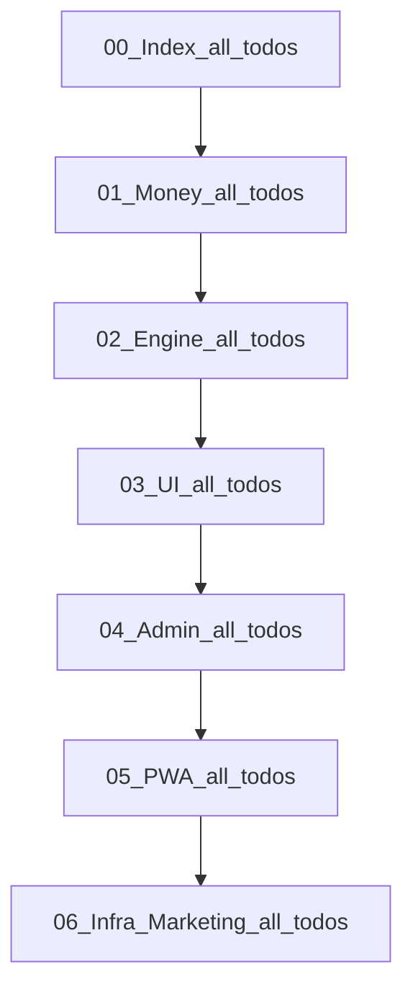

# AI Profit OS — Index · Constitution · Gates (v7.22.36 · CLOSED)

> **제로 목표:** 오류0 · 결함0 · 오차0 · 중복0  
> **착수 전 SSOT:** [`docs/CONSTITUTION_BOOTSTRAP.md`](file:///c:/Users/PC/Desktop/AI_PROFIT_OS/docs/CONSTITUTION_BOOTSTRAP.md) — 헌법·스키마·마이그레이션·실물상태 기록  
> **시세 SSOT:** §0.0 → Engine 플랜  
> **정산 SSOT:** §48.13+§51.2 → Engine 플랜  
> **잔액·출금 SSOT:** §49 → Money 플랜  
> **화면 언어 SSOT:** §50+§27 → UI/UX 플랜  
> **KR 유저 20~70:** UI §38.9 toneBand · §50.1 fontScale 3단 · §38.8 테더가이드 · **성별 UI 분기 금지**  
> **온보딩·인증·광고·KYC (v7.22.11):** UI §6.4~6.4d · Infra §31.2a/b·§51.9.1 · Money §42 · Canon wires  
> **운영사 DET:** §50.9 → UI/UX 플랜  
> **브랜드 3층:** Platform=AI Profit OS · Consumer=**퍼뜩** · AI=**퍼뜩** · Legal=§50.9 · retired=`오늘수익`·`바로번다`  
> **AI 이름:** **퍼뜩** = §47 Personal AI · **P=플랫폼 Fact** · **G=일상 LLM** · **S=실행거절** · Adapter 무료→OpenAI · 자율집행 0  
> **결제 SSOT:** **PG사(결제대행) 0** — USDT TRC20 + 원화 **Admin 승인/거절 Day-1**(§41.3) · CSV 비필수 · 유저 화면 네트워크명=**트론**(§41.6)  
> **에이전트 SSOT:** **ADR-014** Cursor=플랜 집행기 · Infra §15.0b  
> **툴체인 SSOT:** **ADR-015** Node22 · pnpm@10.14 · **next@16** · **Tailwind v4** · Rust · Compose=**옵션** · `TOOLCHAIN.md`  
> **자동화 SSOT:** **ADR-016** Docker-less 기본(Supabase Seoul+Upstash) · `verify:gate` · cleanup  
> **모델 배정:** todo 접두사 `[grok-4.5|256K]`=헌법·스키마·크로스 SSOT · `[composer-2.5|200K]`=확정 SSOT 후 단일 슬라이스 구현  
> **File-Serial (절대):** 파일 N pending=0 전 파일 N+1 착수 금지 · 파일 내 todos 위→아래 · §18 Milestone=설명용 종속 · 아래「플랜 직렬 완료 규칙」Owns


---

## 플랜 분리 맵 (읽기 순서 · 실파일명)

| # | 플랜 | 범위 | **실파일** |
|---|------|------|------------|
| 00 | Index · Constitution · Roadmap · Gates | §0·§1·§17~22(+§20.1·§20.2)·§51.1/22/23 · **v7.22.36 CLOSED** | `ai_profit_os_00_index_a1b2c3d4.plan.md` |
| 01 | Money & Chain *(구 02)* | §11·§41~43·§49(+withdrawApplyBlocked)·§51.5~8/11 · **v7.22.35** pointer | `ai_profit_os_01_money_c3d4e5f6.plan.md` |
| 02 | Engine *(구 01)* | §0.0(+§0.0.1a)·§2~4(+§4.2a·§4.2b)·§12~13·§47·§48.13 · **v7.22.32** (+Index .35 pointer · todo의존순) | `ai_profit_os_02_engine_b2c3d4e5.plan.md` |
| 03 | UI & UX | §0.1·§5~8(+§5.3b)·§27~30·§33~34·§38(+38.8~9)·§48(+§48.3b)·§50(+50.1n)·§51.14/16~19/21/**24** · **v7.22.32** (+.35 pointer) | `ai_profit_os_03_ui_ux_d4e5f6a7.plan.md` |
| 04 | Admin & Ops | §9~10(+**§9.1.1**)·§14·§35~37·§39~40·§51.6/10 · §9.8.4a/8d/8e · **v7.22.35** | `ai_profit_os_04_admin_e5f6a7b8.plan.md` |
| 05 | PWA & Native | §23~26 (+§23.5a 자동Push) · **v7.22.35** pointer | `ai_profit_os_05_pwa_f6a7b8c9.plan.md` |
| 06 | Infra & Marketing | §15~16·§31~32·§51.9/13 Owns · **실행큐=Marketing/후반관측만** · Auth/Phase0=Index · **v7.22.35** | `ai_profit_os_06_infra_a7b8c9d0.plan.md` |

> **원본 아카이브:** `ai_profit_os_launch_54c1261e.plan.md` (전체 통합본 — **편집 시 분리 플랜 우선**)  
> **착수 전 기록:** `docs/CONSTITUTION_BOOTSTRAP.md`

---

## 플랜 직렬 완료 규칙 (File-Serial · 절대 · 삭제 금지)

> **Owns:** 본 절. 실행 큐 = 각 ACTIVE 해시 플랜 frontmatter `todos` only.  
> **§18 종속:** §18 선행·Milestone 표기는 **본 직렬의 설명용**이다. Milestone 교차·병행·건너뛰기 착수 **폐기**.

### 절대 규칙

1. **한 파일**의 frontmatter `todos`를 **위 → 아래**로만 실행한다.
2. **파일 N**의 todos가 전부 `completed`(pending=0) 되기 전 **파일 N+1 착수 금지**.
3. **한 채팅 = 한 todo** (기존 유지 · 접두사 `[grok-4.5|256K]` / `[composer-2.5|200K]`).
4. `status: completed` todo는 **손대지 않음 · 재실행 금지**. 재개는 해당 파일의 **첫 pending**부터 위→아래.

### 직렬 파일 순서 (먼저 끝낼 파일 → 마지막)

| # | 파일 | 끝내고 넘어가는 조건 |
|---|------|----------------------|
| **00** | Index | pending **0**(골격·카피잠금·**auth-ssot**·**phase0-bootstrap-hosts**) 후만 01 착수 |
| **01** | Money *(구 02)* | Money pending **0**(원장→지갑→체인→출금→초대) 후만 02 착수 |
| **02** | Engine *(구 01)* | Engine pending **0**(시세→Rule→시뮬→AI) 후만 03 착수 |
| **03** | UI & UX | UI pending **0** 후만 04 착수 |
| **04** | Admin & Ops | Admin pending **0** 후만 05 착수 |
| **05** | PWA & Native | PWA pending **0** 후만 06 착수 |
| **06** | Infra & Marketing | pending **0**(Marketing/CAPI + 후반 관측만 · Auth/Phase0 실행큐≠여기) = 전 플랜 직렬 완료 |

**00 Index pending 큐:** **pending 0 · CLOSED (v7.22.36)**. 다음 파일=**01 Money** 첫 pending (`money-double-entry`). *(Index completed: monorepo-skeleton · copy-canon-cta-sla-lock · auth-ssot · phase0-bootstrap-hosts)*



**금지:** 앞 파일 pending>0인데 뒤 파일 todo 착수 · §18 Milestone만 보고 도메인 교차 병행 · completed 재실행 · launch ARCHIVE를 실행 큐로 사용.

---

# AI Profit OS — 통합 플랜 (v7.22 · + §51 Rule Engine·Simulation·Ops Completeness)

> **제로 목표:** 오류0 · 결함0 · 오차0 · 중복0  
> **시세 SSOT:** §0.0 = ebay(멀티)·카드·FX·admin · `yahoo_jp`=**영구 FORBIDDEN** (v7.22.32)  
> **인지 UX SSOT:** §0.0.4 가격비교→마진 · §0.0.5 소액~웨일 · §38.7 Objection4  
> **정산 SSOT:** **§48.13 + §51.2** MATCH_SUCCESS Rule Engine (난수·연출타이머 금지)  
> **잔액·출금 SSOT:** **§49** 원금 유지 · 수익 출금 기본 · 버킷 원장  
> **화면 언어 SSOT:** **§50 + §27** — 유저·어드민 **쉬운 한글만** · 테스트/개발/IT/문서 용어 **화면 노출 0** · 유저 토스트 **한글+이모지**  
> **설정·약관 SSOT:** **§50** Lux다크 고정 · 글자크기 · 약관/개인정보/오픈소스/라이선스 대본  
> **운영사·사업자 SSOT:** **§50.9** PRE-OWNED WATCHES L.L.C · DET **1135431** · 푸터·약관·JSON-LD 단일 schema  
> **브랜드 3층 SSOT:** **§51.1 ADR-002** Platform=AI Profit OS · Consumer app=**퍼뜩** · Legal=§50.9 · retired=`오늘수익`·`바로번다`  
> **DB SSOT:** **§51.1 ADR-001** PostgreSQL **단일 인스턴스**(Supabase Seoul `mgsytcetsiecllmhcyox`) · 이중 Postgres SoT **금지**  
> **결제 SSOT:** **PG사(결제대행) 0** — Toss/Nice/Inicis/PortOne/iamport/Stripe Checkout 등 wallet path **영구 배제** · §41  
> **용어 잠금:** **PostgreSQL(ADR-001)** ≠ **PG사/결제대행(§41 PG 0)** — 혼용 금지  
> **에이전트 SSOT:** **ADR-014** — Cursor rules로 스택·Phase·PG사0 잠금 · “더 좋은 스택” 재제안 금지  
> **툴체인 SSOT:** **ADR-015** — Node22 · **pnpm only** · **next@16** · **Tailwind v4**+Lux `@theme` · Rust · Compose=옵션 · npm/bun install 금지  
> **자동화 SSOT:** **ADR-016** — Docker-less 기본 · Vercel 금지 · 8GB Phase0 · `verify:gate`  
> **Personal AI / 퍼뜩(AI) SSOT:** **§47 + §47.12~14** · P/G/S · Adapter · 유저 AI 이름=**퍼뜩**(앱명과 동일 · 타프로젝트 코치명 금지) · GitHub=코드만  
> **PWA SSOT:** **§23~26** (`05` **v7.22.25**) · next@16·Serwist · Phase0 Push in-process · §23.5a 자동Push · Lux theme · WebAuthn 정책=Money §43 · Store=v2  

> **수직:** 하이엔드 시계 + 트레이딩 카드 + **명품 가방(`luxury_bag`)** · 카테고리별 `assetImageUrl` 썸네일(§0.0.6) · KR 마켓 0 · v1 미션= **자본참여자·수익 벌기**(§20.2 · domain=`participate` · orchestrate · 유저 직접 매매 0 · 부업 vertical Day-1 숨김)

---

## 0. 총평 및 아키텍트 판정

### 이번 개정에서 흡수한 것 (전부)

| 영역 | 흡수 내용 |
|------|-----------|
| 제품 UX | 수익-first UI, 5탭 고정, USDT+≈원화, 거래 15초형 플로우, 전략 필터 |
| IA | 홈/수익/내거래/지갑/내정보 — 모바일·PC 동일 |
| 기회 모델 | Agnostic Opportunity Card (모든 vertical 동일 카드) |
| 실행 점수 | 판매기간·성공률·자본·위험·AI신뢰도 = moat |
| 어드민 | 12모듈 + **TOP5 원클릭 대시보드** (§9.5) |
| 토스트 | user cute / admin ops / financial surface 3축 SSOT |
| 방어 | 어뷰징·악성유저·오류 대응 매트릭스 100% |
| PWA | standalone·SW·Push·Badge·WebAuthn·햅틱·3초 설치 |
| Store Bridge | TWA(Play) + Capacitor(iOS) — v1 코드 재작성 0 |
| 무료 Bootstrap | Cloudflare Pages/Workers + Upstash — $0 착수 |
| **한글 UI** | 유저·어드민 화면 영어 노출 0% + ko copy SSOT |
| **반응형·성능** | 320px~4K fluid CSS + Device S/A/B tier + 60fps **목표** |
| **어드민 TOP5** | 원클릭 검수·마진·사기방지·돈줄·긴급정지 |
| **마케팅·SEO** | 매체별 랜딩·Server CAPI·UTM→입금·IndexNow |
| **Lux-Fintech** | Deep Obsidian · Tier Motion · G4 ticker/counter |
| **신뢰 교육** | **§38** — USDT 입금 납득 · 원화 비교 · **플랫폼 수익 투명** · 20~70대 ko |
| **어드민 Ops** | **§40** 분리 배포 · RBAC · **§39** 유저별 금융 전수 |
| **USDT 온체인** | **§41+§43** 유저별 TRC20 · **이벤트 스트림** · 1conf UI/19conf ledger · sweeper · **폴링 폐지** |
| **원화 입금** | **§41.3+§43.3** Day-1=Admin **승인/거절** → USDT credit · CSV=L2+ · **PG사 0** |
| **KYC/출금인증** | **§42** 출금 1회 + **§43** WebAuthn·Email OTP·PIN fallback |
| **가격/원장** | **§43** minProfitUsdt + staleAt≤3s · FOR UPDATE ASC · idempotency_key |
| **시세 소스** | **§0.0** Day-1 adapter **5종**(ebay·pokemontcg·ygoprodeck·coingecko·frankfurter) + admin legs · `yahoo_jp` 영구0 · **가격비교→마진 UX** · capitalBand |
| **마진 인지** | `PriceCompareMargin` 홈/상세/확인/영수증 4면 필수 · compareReady 가드 |
| **Personal AI** | **§47.9** 단일PG SoT · Redis hot · pgvector→Qdrant later · 학습OFF+Eval · GH코드만 |
| **AI 진행 UX** | **§48** 진행실·성공영수증·안전중단 + Admin 진행정책 — **Canon 4면** (사진목업≠픽셀SSOT · ADR-013) |
| **원금·수익 출금** | **§49** 버킷(원금/수익/잠금/연습) · 기본 수익출금 · 원금확인시트 · P/E 전수방어 |
| **설정·약관·쉬운한글·운영사** | **§50+§50.9** 설정IA · 약관4종 · DET 푸터 · 토스트이모지 · 어드민 왕초보 한글 · IT용어0 |
| **v7.22 완성도** | **§51** MATCH_SUCCESS Rule · M0.5 Simulation · Referral · CS/Dispute · Auth · Analytics · Trust Surfaces · Phase0 Bootstrap |
| **v7.22.1 drift 흡수** | **ADR-006/007** — 원화 `payableAmountKrw` · PRICE_STALE=§43 soft match · CTA · 온보딩≤15초 · tier/WS · manifest · Auth · orchestrate≠실체결 |
| **v7.22.2 스펙 완성 흡수** | **ADR-008~010** — 수수료·FX·platform_reserve · v1 orchestrate-only · ROOT_DOMAIN · 출금수수료·minHolding · Resend·R2 KYC · TRX stake · KRW CSV Day-1 · 승률정의 · 내정보3면 · Phase0 in-process · next@15 · DET verifiedAt-only · 2인Confirm필수 · §21 라벨교정 |
| **v7.22.3 성장·공지·브랜드 흡수** | **ADR-011/012** — notice≠campaign · Viral Ladder L1/L2/L3 · clawback·시즌·공유카드 · Brand Kit `packages/ui/brand` · Admin growth 자식탭(보류큐) · R*/N*/B* 전수 · toast REFERRAL_*/CAMPAIGN_* · deep link/CAPI · verify:* 전수 |
| **v7.22.4 목업 거버넌스 흡수** | **ADR-013** — 사진목업=intent archive only · 시각복제 금지 · Canon=Lux+Brand+컴포넌트+구조와이어 · 충돌시 코드/토큰>플랜>Canon>사진 · `verify:mockup-governance` · Cursor rule alwaysApply |
| **v7.22.5 Cursor·PG사0 흡수** | **ADR-014** — Cursor=집행기·스택 재설계 금지 · Phase0=NATS0 · Nest/Rust/단일Postgres/CF only · **PG사(결제대행)0 확정**(유저 확인) · 용어 Postgres≠PG사 · `stack-lock.mdc`+`AGENTS.md` · `verify:pg-module-scan`·`verify:stack-lock` |
| **v7.22.6 그린필드 툴체인 흡수** | **ADR-015** — **next@16**(15 pin 폐기) · **Tailwind v4**+Lux `@theme` · **pnpm@10.14** only · Node22 · rust-toolchain · Compose PG17/Redis · `TOOLCHAIN.md` · `verify:stack-lock` 작업전 PASS · npm/bun install 금지 |
| **v7.22.7 소비자 브랜드 개정** | **ADR-002** Consumer=**바로번다** (당시) · 구 `오늘수익` 폐기 — **→ v7.22.9에서 퍼뜩으로 승계** |
| **v7.22.8 에이전트 자동화 흡수** | **ADR-016** — rules(always≤7+globs) · hooks(git deny·stop cleanup) · Husky+`verify:gate` · GH Actions · Docker-less=Supabase+Upstash · Vercel 금지 · 8GB Phase0 · `docs/ADR-016-AGENT-AUTOMATION.md` |
| **v7.22.9 실물감사·퍼뜩(AI)·모델분할** | 레포/DB/브랜드/어드민 **실측** · Consumer=**퍼뜩** · `docs/CONSTITUTION_BOOTSTRAP.md` · 퍼뜩(AI)=§47.12 · Admin 자식route 잠금 · Phase0 bus=in-process · todo=`[grok-4.5\|256K]`/`[composer-2.5\|200K]` · 플랜 실파일명 교정 |
| **v7.22.10 KR 20~70 유저 완성** | toneBand 배선 · fontScale 3단 · `/me/guide/get-usdt` · 입금 네트워크 한글경고 · depositPref · landing→tone 시드 · 본인진행 카피 · spot-check todo · **성별 UI 분기 금지** · verify:* 추가 |
| **v7.22.11 온보딩·인증·광고·KYC 흡수** | UI §6.4 체험형+Canon · Infra §31.2a `/ads` alias · §31.2b 3초 예산 · §51.9.1 Stage A/B 필드 · Money §42 Lux 3면+`kyc-submission.v1` · **주민번호 타이핑 0** · 소유권 SSOT 1곳+pointer |
| **v7.22.12 원화 Day-1 운영 단순화** | CSV 필수 폐기 · Admin 통장확인 후 **[승인]=잔액반영 / [거절]=내역+토스트** · Money §41.3·§43.3 · Admin TOP1 · UI 카피 |
| **v7.22.13 Admin 유저360** | §9.8.7 **순유입**=입금−출금 · finance 탭+버킷+추천보상 · §9.8.8 추천/유입/CS/prefs/등급/운영알림 · schema `netInflowUsdt` · `verify:admin-user-360` · **중복0 pointer** |
| **v7.22.14 Engine 결함 0화** | Engine 단일본 동기화 · §2.0 Phase0 in-process · ADR-009 `orchestrate` only · §48.13.1 participate↔Rule · §48.13.2 golden 6건 · §0.0.4 Owns · §47.12 KRW상태·실체결금지 · UI pointer 해시파일 |
| **v7.22.15 UI 유령§51.24·퍼뜩·StageB** | UI에 **§51.24 Loop/DayPulse/PreCTA/L1~L24** Owns 복원 · §8.2 KRW_REJECTED · Canon peotteok-chat+complete-profile · `/me` 진입 · PriceCompare pointer · verify:loop-psychology* |
| **v7.22.16 퍼뜩 P/G/S·LLM Adapter** | Engine §47 P/G/S · Day-1=`gemini_free`+쿼터 degrade · Fact tools · Help RAG · `verify:ai-general-no-money-tools`/`ai-lane-router`/`llm-quota-degrade` · UI stream+`PEOTTEOK_LLM_BUSY` · Canon peotteok 1.3 |
| **v7.22.17 PWA 결함 0화** | PWA `05` next@16 · Push Phase0 in-process · Lux theme · WebAuthn Owns=Money §43 · §24 Infra pointer · Admin push kill · CATALOG `verify:pwa-*` · 이중본 sync · Canon install/offline |
| **v7.22.18 로드맵·KR 표기 정렬** | §18 선행=Milestone 쪼개기 일치 · Rule을 Money/Engine 직후 · §21 NATS/Temporal=Phase1+ 명시 · spot-check 20·40·**60~70** · Canon gender forbid 전면 |
| **v7.22.19 Brand Visual Kit v1** | 퍼뜩 플래시 마크·워드마크·AI아바타·OG · `brand.manifest` assets · `verify:brand-assets` · 메탈헥스 archive · UI §5.9.2b |
| **v7.22.20 카테고리 상품 이미지·가방** | Engine §0.0.6 `assetImageUrl` hydrate·공개가드 · `luxury_bag` · 필터 `가방` · UI §48.3a 썸네일 · 스텝 active **`시세 불러오는 중...`** · Canon productThumb · `verify:asset-image-surface` |
| **v7.22.21 잔액피드·유저매치·목업삭제** | Engine §0.0.5.1 affordable/nearMiss/suggestDeposit · Money §49.2a 딥링크 · UI §5.3a · Admin **§9.8.9** 유저별 숨김/핀/마진/수익 · SKU 1:1 실사진 · 사진 PNG 목업 **레포 0** · `verify:balance-aware-feed` · `verify:admin-user-opportunity-override` |
| **v7.22.22 친구초대 ∞ · KR설명 · Pool** | Money §51.5 초대**횟수∞** · %/캡·Pool FIFO·0원`rewardsEnabled` · R13/R14 · UI **§5.9.1a** 20~70 설명 · Canon `invite-home` · Admin 인원캡 UI 0 · `verify:referral-unlimited-invites` · `verify:invite-explain-surfaces` |
| **v7.22.23 매칭 성공 조절** | Engine **§48.13.3** `matchStrictness`→Rule 맵 · Admin/UI §48.6 「매칭 성공 조절」 · 관측 성공% 읽기전용 · **`successRatePercent` 난수 0** · `verify:match-strictness` |
| **v7.22.24 멤버십·Admin 유저 Ops** | Engine **§0.0.7** membership·AI해금·일일캡·fulfillRate · UI **§5.9.2c·§51.18a** · Admin **§9.8.10** 등급·성향메모·밴·로그인비번·출금PIN·프로필전수·유저별엄격도(=%) · Money **§43.6a** · Canon `membership-home` · `verify:membership-*` · `verify:admin-user-credentials` |
| **v7.22.25 차단·쪽지·자동Push·배지** | Admin **§9.8.4a** 매칭/출금신청 개별차단 · **§9.8.8d/e** 1인쪽지·플랫폼 fanout · UI **§50.1n** 가입알림전부ON · **§5.9.4** 인박스 · PWA **§23.5a** · 등급배지 **Brand SVG(B안)** · 사진목업 0 |
| **v7.22.26 기회스캔 표현계층** | **아키텍처 불변** · **§20.1** absorb/exclude·4층연결 · Engine **§4.2a** · UI **§5.3b** 홈3초·카드위계 · (CTA는 **v7.22.27**이 승계) |
| **v7.22.27 자본참여자 모델** | **§20.2** Opportunity=자금배정 기회 · INTERNAL≠USER · 유저=capital provider · 구매/판매/마켓선택 **0** · Engine **§4.2b** · UI §5.3b/§48 · ADR-007 |
| **v7.22.28 CTA·1분·시간축** | 유저 Primary **`수익 벌기`** · domain=`participate`/matching/`MATCH_SUCCESS` · `이 기회로 수익 벌기` 상세 허용 · `이 상품으로…` **금지** · `expectedSellDays` 유저 **0** · **CTA 후 ≈1분** 결과(입금 체인 별도) · 실금액 정산 · `platform_reserve`=Ops(제품 P0 아님) · `내거래` KEEP(이력) · `verify:cta-earn-profit`·`user-trader-jargon-0` |
| **v7.22.29 Soft/Hard·REQUEUE** | Soft **60s** · Hard **90s**(T0=`participateAcceptedAt`) · REQUEUE=`maxRematch`∧`now+retryWait<hard` · terminal **`MATCH_TIMEOUT`**→safe_stop·잔액불변 · 유저 카피3줄(보통1분/다시맞추는중/시간지나안전정지) · presentation≠SLA · Audit A4 · Engine §48.13 · UI §48 |
| **v7.22.30 매칭 긴장감·등급대기** | Soft/Hard **전 등급 동일** · 긴장감=시세·스텝 Fact·적합도 수렴·Soft중반/성공직전 정적(연출 only) · 등급 차별=일일캡·기회·지위카피(**≠대기특권·≠성공구매**) · 가짜 대기인원/난수성공/보장 0 · UI **§48.3b** · `verify:match-tension-surface` · Audit A6 |
| **v7.22.31 Listing legs (JP번호 없음)** | Day-1 = **ebay 멀티 marketplace**(US×GB 등) **또는 ebay×admin** · (당시 `yahoo_jp`=Phase1+) · KR/Chrono24 대체 금지 · Engine §0.0.1a · `verify:listing-legs-day1` |
| **v7.22.32 Yahoo 영구 배제** | `yahoo_jp` / Yahoo! JAPAN Auction / yahoo-jp-adapter / YAHOO_* ENV = **영구 FORBIDDEN** · Phase1+ **철회** · stub·재제안 **0** · listing = ebay 멀티\|admin **only** · 유저 「야후」문자열 **0** · ADR-003 adapter **5종** · `verify:listing-legs-day1` |
| **v7.22.33 실물재감사·Admin IA·M0큐** | FS+Supabase MCP 재스캔 · `public`테이블0·migrations0·pgvector미설치·apps/services0 · Admin **§9.1.1** 자식 route 전수 · 카드위계=`기회→투입→수익→AI→[수익 벌기]` · Signup-Ready6 문구 폐기 · BOOTSTRAP §6 전수 · Index todo `copy-canon-cta-sla-lock` · Audit A9 |
| **v7.22.35 실물재감사·BOOTSTRAP동기·todo의존순** | FS+Supabase MCP 재스캔 · public **38** · migrations **9** · pgvector **ON** · CONSTITUTION **29** · schemas **38** · apps/services **0** · BOOTSTRAP §0/§9 · Admin todo=`ops→기능→isolated-deploy` · Engine=`market→adapters→projection` · RLS deny-by-default 의도 기록 · `.cursorignore` BOOTSTRAP 예외 |
| **v7.22.36 Index CLOSE·실물재동기** | Index todos pending **0** · MCP 재실측 public **41**(+auth oauth/passkey/magic) · migrations **10**(로컬파일버전=`20260808224856`=원격) · apps `web`+`admin` · services `api-nest`/`engine-rust` · Phase0 hosts PASS · BOOTSTRAP §0 동기 · 다음=**01 Money** · Audit A11 |
| **v7.22.34 File-Serial** | 실행 순서=**파일 N pending=0 전 N+1 금지** · git mv Engine↔Money 번호 스왑(해시 유지) → **01 Money · 02 Engine** · Infra `auth-ssot`/`phase0-bootstrap-hosts`→Index 실행큐 · Owns 본문=Infra 유지 · 파일 내 todos 의존순 재배열 · §18=설명용 종속 · 구번호 파일명 문자열 **0** |

### 점수판 (목표)

| 영역 | 목표 |
|------|------|
| Domain 분리 | 9.7 |
| Money/Ledger | 10 (Double-Entry) |
| UX 일관성 | 9.5 (5탭·카드·버튼 SSOT) |
| Admin Ops | 9.3 |
| Toast/Notification | 9.5 (중복0) |
| Abuse Defense | 9.0 |
| PWA Native Feel | 9.0 (플랫폼 한계 내 max) |
| Store Bridge Readiness | 9.0 |
| Korean-First UI | 9.5 |
| Performance / Responsive | 9.0 (tier degrade 포함) |
| Admin 원클릭 TOP5 | 9.3 |
| Marketing Attribution | 9.0 (consent-first CAPI) |
| SEO / Organic | 8.5 |
| Lux-Fintech Motion | 9.0 (tier + reduced-motion) |
| 초기 실행 가능성 | 8.5+ ($0 bootstrap) |
| 규제/금융 리스크 | 8.5+ |

### 최종 원칙
- **10년 경계는 지금 잠근다.** 처음부터 모든 서비스·카테고리·Growth 스위치를 켜지 않는다.
- **메뉴는 5개만.** 하단/사이드바 추가 탭 금지 (이벤트·친구초대는 내정보 하위).
- **모든 화면 시선 순서 고정:** 예상수익 → 완료시간 → AI신뢰도 → 난이도 → 버튼 → 상품(작게).
- **화면 노출 텍스트 = 쉬운 한국어만.** 코드·로그·API는 영어 가능, **유저·어드민 UI는 ko copy SSOT만** (§27·§50). 테스트/개발/IT/문서 용어 **화면 0**.

---

## 1. Product Identity (이중 레이어 잠금)

### 1.1 대외·헌법 Identity (변경 없음, 강화)
- **정식:** AI 기반 글로벌 가격 발견 및 거래 기회 Data + Settlement OS
- **제공:** 검증된 시장 기회 + 실행 경로 + 정산 인프라
- **미제공/미주장:** AI가 돈을 벌어준다 / 원금·수익 보장 / 투자상품 확정
- **§35 예외:** G1~G4 **표현 surface** — ledger 정산·reconciliation **불변**

### 1.2 앱 UX Identity (신규 잠금)
- **앱 포지션:** "돈 버는 AI 차익 앱" — 사용자는 **얼마 벌 수 있는지**만 본다
- **슬로건 (앱):** "버튼 한 번으로 수익 시작!" (약관에 "예상·리스크" 병기)
- **한글 UI:** 화면 노출 = `packages/ui/copy/ko/*` SSOT만 — **§27 + CONSTITUTION/25**
- **금지 UI 노출:** Spread, Wallet, Deposit, Pending, Ledger, Opportunity 등 **영어·IT·크립토 전문용어 전부**
- **허용 UI 노출:** 예상수익, **수익 벌기**, 입금하기/충전하기, 출금하기, AI추천, 지급 대기 중 · **금지 Primary:** 거래하기·구매하기·판매하기

> **22 vs 25 분리 (중복0):** `22` = 레이아웃·5탭·버튼·색상 · `25` = **모든 표시 문자열·번역·금지어·CI**

### 1.3 표현 매핑 (앱 — G4 Admin override)

| UX 표면 | 기본 (live) | G4 Admin |
|---------|-------------|----------|
| 카드/홈 수익 | 예상 +12.45 USDT + ≈원화 | copy §35 G2 |
| 거래 완료 CountUp | settlement amount | ledger only |
| AI 점수 | AI 추천도 | label editable |
| 오늘 지급 [F] | ledger aggregate | `counter_mode` demo/blended |
| LiveTicker [A] | ledger SSE | `ticker_mode` demo/hybrid |

### 1.4 헌법 확장 (22~28)
- `22` — 레이아웃·5탭·시선 순서
- `25` — ko copy·금지어
- `26` — performance·device tier 수치
- `27` — marketing·SEO
- `28` — Lux-Fintech visual·motion (**G4 ticker/counter · §35**)

---

## 17. Constitution (BOOTSTRAP §2 전수 · 번호순 · 중복0)

> **생성 SSOT:** `docs/CONSTITUTION_BOOTSTRAP.md` §2 · todo=`constitution-28-core` + `constitution-28-ai-money-ops`  
> **Owns:** 각 파일 1주제 · 교차는 pointer만 · 구현코드 0

```
14_EVENT_CONTRACTS.md              ← Phase0 in-process · Phase1 NATS
17_FINANCIAL_LEDGER_STANDARD.md    ← Double-Entry · idempotency
20_SECURITY_THREAT_MODEL.md        ← A1~ abuse
22_UX_AND_COPY_SSOT.md             ← 5탭·레이아웃·버튼 (문자열→25)
23_PWA_AND_NATIVE_EXPERIENCE.md    ← PWA
24_FREE_TIER_AND_STORE_BRIDGE.md   ← $0 · TWA
25_KOREAN_FIRST_UX_POLICY.md       ← ko copy·금지어·CI
26_PERFORMANCE_AND_RESPONSIVE_UX.md
27_MARKETING_AND_SEO_ENGINE.md
28_LUX_FINTECH_DESIGN_AND_MOTION.md  ← palette, motion, G4 ticker/counter
35_GROWTH_CONVERSION_PRESENTATION.md ← G1~G4 (§35)
36_ADMIN_PRICE_AND_PROFIT_SYNC.md
37_WALLET_AND_USER_ADMIN_OPS.md
38_TRUST_EDUCATION_AND_REVENUE_TRANSPARENCY.md
39_USER_FINANCIAL_LEDGER.md
40_ADMIN_ISOLATED_OPS_PLATFORM.md
41_ONCHAIN_USDT_AND_KRW_DEPOSIT.md ← TRC20·KRW Admin승인/거절 · PG사0
42_KYC_WITHDRAW_ONE_TIME_GATE.md
43_CHAIN_SETTLEMENT_HARDENING.md
44_SIGNUP_READY_MARKET_SOURCES.md
45_PRICE_COMPARE_MARGIN_UX.md
46_CAPITAL_TIER_CATALOG.md
46b_ASSET_IMAGE_SSOT.md
47_PERSONAL_AI_USER_TWIN.md        ← Personal AI + 퍼뜩 P/G/S (§47.12~14)
48_AI_EXECUTION_ROOM_AND_POLICY.md
49_PRINCIPAL_RETENTION_AND_PROFIT_WITHDRAW.md
50_SETTINGS_LEGAL_AND_PLAIN_KOREAN.md ← §50+§50.9
51_PLATFORM_COMPLETENESS_AND_RULE_ENGINE.md
51_REFERRAL_VIRAL_LADDER.md        ← §51.5 (파일명 51r)
```

---

## 18. 로드맵 (UX 통합)

> **File-Serial 종속 (절대):** 본 절의 선행·Milestone은 **설명·검수용**이다.  
> **실행 권위 = Index「플랜 직렬 완료 규칙」** — 파일 N pending=0 전 파일 N+1 착수 금지 · 파일 내부 todos 위→아래 · 한 채팅=한 todo.  
> Milestone 표기로 Engine∥Money∥UI 교차 병행·건너뛰기 **금지**.

### 선행 순서 (오류0 · **= 아래 Milestone과 1:1** · 한 줄에 MS 여러 개 묶기 금지 · **실행은 File-Serial**)

0. **ADR-014/015/016 툴체인 PASS** — `pnpm verify:stack-lock` · `verify:brand-consumer` · `TOOLCHAIN.md` · next@16 · TW4 · pnpm10 · **원격 Supabase+Upstash** · PG사0 (Compose=옵션)  
0b. **`docs/CONSTITUTION_BOOTSTRAP.md` PASS**  
0c. **M0 todo 순서 잠금 (Audit A5/A9 · BOOTSTRAP §9.1 · File-Serial · 건너뛰기 금지 · Grok 위→아래):**  
   `constitution-28-core` → `constitution-28-ai-money-ops` → `schemas-contracts-core` → `schemas-migrations-supabase` → `monorepo-skeleton`(Admin=§9.1.1) → `copy-canon-cta-sla-lock`*(done)* → `auth-ssot`*(done)* → `phase0-bootstrap-hosts`*(done)* → **Index CLOSED** → **01 Money**
1. **M0** — CONSTITUTION 22~28·35~51 (+§47.12~14 · §50.9) + schemas + **supabase/migrations**(+vector) + brand + Lux `@theme` + monorepo-skeleton  
2. **M0+UI 기초** — `copy-canon-cta-sla-lock` + packages/ui (lux · responsive · **copy/ko** · toneBand/fontScale) + Canon wires  
3. **M0.5** — simulation (**§51.4** · Growth ON 전 필수) + Admin `growth?tab=simulation`  
4. **M1** — Money Core (**PG사 0** · ledger/buckets · USDT · KRW Admin 승인/거절 · withdraw) + Nest Auth JWT (§51.9)  
5. **M1↔M2 정산 핵** — **§48.13 MATCH_SUCCESS Rule** + golden traces (participate/settlement와 동시 · Admin 뒤로 미루지 **않음**)  
6. **M2** — Engine adapters + **§36 pricing** + 홈/수익 피드 + User **5탭 IA** (카피·toast)  
7. **M3** — §48 진행실·성공·안전중단 + Admin 진행정책 + CountUp/MotionCTA + **Serwist/App Shell** + TronScan  
8. **M3.5** — Install Prompt · **Web Push+Badge** · **WebAuthn UX**(정책=Money §43) · haptics/audio · device tier  
9. **M4** — Admin 12모듈+TOP5 + §37·§39 유저360 + §40 ops + §51.6 CS + practice/referral 자식 + shadow-replay 운영면  
10. **M5** — 퍼뜩(AI) P/G/S runtime + AI PICK + saved strategies + Admin `ai-logs?tab=coach`  
11. **M6** — Growth switches + Marketing Funnel + CAPI + SEO · JSON-LD=**퍼뜩**  
12. **M7** — Stage→Prod + Lighthouse PWA + 320px~4K visual regression  
13. **M8 / M8a~c** — Expansion adapters · Store Bridge (TWA/Capacitor · **optional · Day-1 게이트 제외**)

### Milestone (설명용 · 선행 순서와 1:1 · **착수 권위≠본 표 · File-Serial 승**)

| MS | 내용 |
|----|------|
| M0 | Constitution + schemas/migrations + Lux + monorepo |
| M0.5 | Simulation pass (Growth 전) |
| M1 | Ledger + wallet + §41/§43 + Auth JWT + **§48.13 Rule 핵**(golden) |
| M2 | Engine + adapters + §36 + 5탭 피드 |
| M3 | §48 UX 3면 + Admin 진행정책 + toast/motion + **Serwist** |
| M3.5 | Install · VAPID Push/Badge · WebAuthn UX · haptics |
| M4 | Admin TOP5+12 · §37·§39·§40 · CS · shadow 운영 |
| M5 | 퍼뜩 AI runtime + AI PICK + strategies |
| M6 | Growth + Marketing Funnel + CAPI + SEO |
| M7 | Stage→Prod + PWA Lighthouse + visual regression |
| M8 | Expansion adapters |
| M8a/b/c | TWA / Capacitor / Store (**optional**) |

---

## 19. 출시 게이트 (Zero-Defect)

### 오류0 · 결함0
- [ ] 5탭 route drift 0 (mobile=PC)
- [ ] 버튼 inventory 100% 구현
- [ ] error path → toast/inline 100%
- [ ] Admin↔User 필드 mismatch 0

### 오차0
- [ ] ledger reconciliation pass
- [ ] shadow replay 0.000% gate
- [ ] USDT/KRW fx_snapshot trace 100%
- [ ] ledger mode: "오늘 지급" = ledger aggregate 일치
- [ ] demo/blended mode: Admin seed + audit log (ledger reconciliation **별도**)

### 중복0
- [ ] notification UNIQUE constraint live
- [ ] toast single-flight verified
- [ ] schema 단일 SSOT (no copy drift)

### UX · Trust
- [ ] 온보딩 ≤15초 완료 E2E (§6.4)
- [ ] TRC20 deposit→participate→payout→withdraw E2E
- [ ] Circuit breaker drill pass
- [ ] Compliance min flow pass
- [ ] AI autonomous money 0
- [ ] Growth OFF unless budget+sim pass
- [ ] **§36:** Admin 가격 변경 → 유저 홈/수익/상세 **≤500ms** E2E
- [ ] **§37:** Admin 원화 계좌 → user 원화 탭 **≤300ms** SSE E2E
- [ ] **§37:** Admin 잔액 조정 ledger trace + user display 일치
- [ ] **§38:** verify:trust-copy PASS · 면책 블록 입금/온보딩/guide 전 surface
- [ ] **§39:** 유저 finance summary = deposit+withdraw+settlement 집계 일치
- [ ] **§39:** CSV export row count = DB · audit `admin.user.finance.exported`
- [ ] **§39:** tx_hash / user_id 검색 → `/admin/users/:id/finance` jump E2E
- [ ] **§40:** `ops.*` 배포 · `app.*/admin` route **0** · verify:no-admin-in-web PASS
- [ ] **§40:** Admin JWT ≠ User JWT · IP allowlist · MFA · RBAC matrix E2E
- [ ] **§40:** ops robots/noindex · 유저앱 ops URL 노출 **0**
- [ ] **§41/§43:** event_stream watcher · **per-address poll 0** · rate-limit budgeter
- [ ] **§43:** 1conf → DEPOSIT_DETECTED only (ledger 0) · 19conf → DEPOSIT_CONFIRMED
- [ ] **§43:** chain-sweeper Energy delegate + Treasury sweep E2E (testnet)
- [ ] **§41/§43:** KRW pending → Admin approve credit / reject toast · expiry · CSV 비필수
- [ ] **§43:** participate with stale pricingVersion but minProfitUsdt OK → **200**
- [ ] **§43:** staleAt>3s → engine reject · minProfit 미달 → PRICE_STALE
- [ ] **§43:** ledger FOR UPDATE account_id ASC · idempotency_key UNIQUE · deadlock drill
- [ ] **§43:** WebAuthn fail → Email OTP/PIN fallback withdraw E2E
- [ ] **§41:** 유저별 TRC20 unique · PG import wallet path **0**
- [ ] **§42:** 출금 KYC toast → `/me/kyc` auto · 승인 후 재요청 **0**
- [ ] **§42:** participate without KYC **200**
- [ ] **§37:** freeze/ban → login·거래·출금 block E2E
- [ ] 전역 마진 저장 → bulk recalc + SSE fanout
- [ ] **verify:lux-tokens + verify:ticker-mode-audit PASS**
- [ ] verify:marketing-compliance PASS
- [ ] **UTM→first_deposit attribution E2E**
- [ ] **CAPI consent-before-send 100%**
- [ ] **verify:seo-schema (no fake ratings)**
- [ ] verify:responsive PASS
- [ ] **Device tier B degrade E2E (blur OFF, WS batch)**
- [ ] verify:korean-ui PASS
- [ ] **API problem.code → ko toast 100% (raw enum 노출 0)**
- [ ] 금지 UI 용어 scan pass
- [ ] **Lighthouse PWA ≥ 90**
- [ ] **Install E2E iOS guide + Android A2HS**
- [ ] **Push dedup + WebAuthn withdraw E2E**
- [ ] **assetlinks.json valid (TWA ready)**
- [ ] **§48:** AI 진행실 5단계 + progress% + 로그라인 E2E (손댈 것 없음)
- [ ] **§48:** success → CountUp only after settlement.completed · `확정 지급` 배지
- [ ] **§48:** safe_stop → 잔액 불변 · `(지급 안 됨)` · 추천 카드 E2E
- [ ] **§48:** Admin 실조건 저장 → participate/execute 가드 반영 · audit
- [ ] **§48:** 연출 duration이 ledger credit 성공/실패를 **변경 0** (CI)
- [ ] **§48:** `successRatePercent` / 난수 성공률 컨트롤 UI·API **0**
- [ ] **§48:** verify:execution-surfaces PASS (진행/성공/안전중단/Admin정책 = **Canon 4면** · 사진목업 픽셀일치 금지)
- [ ] **§48 / §20.2:** Primary CTA `수익 벌기` + 면책 + 배지 `직접 사지 않아요`/`직접 팔지 않아요` · `구매하기`·`판매하기`·`이 상품으로 수익 벌기` **0**
- [ ] **v7.22.26~28:** 홈 기회스캔 · `arbitrageTypeKo` · 카드위계(기회→투입→수익→AI→수익 벌기) · `expectedSellDays` 유저0 · CTA 후≈1분 · `verify:opportunity-scan-surface`·`arbitrage-type-label`·`cta-earn-profit`·`user-trader-jargon-0`
- [ ] **§49:** 지갑 4버킷 표시 100% · `principal+profit+locked+practice=liability` recon PASS
- [ ] **§49:** 출금 기본 mode=profit E2E · principal/combined는 확인 시트 없이 제출 **0**
- [ ] **§49:** 원금 출금 메뉴 숨김/제거 scan PASS (항상 도달 가능)
- [ ] **§49:** practice 버킷 withdraw/participate **403** 100%
- [ ] **§49:** settlement → profit만 + · requiredCapital → principal 복귀 오차0
- [ ] **§49:** merge profit→principal atomic · idempotency
- [ ] **§49:** verify:bucket-invariant + verify:withdraw-mode-default PASS
- [ ] **§49:** P1~P24 abuse rules wired · E1~E12 toast/inline 100%
- [ ] **§49:** 성공 영수증 3CTA (수익만 출금 / 원금에 합치기 / 나중에) E2E
- [ ] **§50:** `/me/settings` IA 100% · 테마 3단 토글 **0**
- [ ] **§50:** 약관·개인정보·오픈소스·라이선스 4면 `T.legal.*` 대본 노출
- [ ] **§50.9:** SiteFooter + legal 운영주체 + operator-entity.v1 · DET **1135431** 일치
- [ ] **§50.9:** DET Trade License PDF on file · Invest in Dubai 수동 확인 기록
- [ ] **§50:** verify:no-it-jargon · verify:toast-emoji · verify:legal-plain-ko · verify:operator-footer PASS
- [ ] **§50.9:** verify:operator-footer PASS · DET 1135431 3면 일치
- [ ] **§51.2/§48.13:** `verify:match-success-rule` — golden trace 100% · random/timer 경로 **0**
- [ ] **§51.4:** M0.5 simulation PASS · Growth ON blocked until pass
- [ ] **§51.5:** Viral Ladder L2/L3 ledger · clawback · cap/day · A1 · notice≠campaign E2E
- [ ] **§51.6:** support ticket create→Admin queue→resolve E2E · SYSTEM_FAILED → CS link
- [ ] **§51.7:** practice 1회 지급 · participate/withdraw **403** · 만료 E2E
- [ ] **§51.9:** OAuth/Passkey signup→session→logout→탈퇴 E2E
- [ ] **§51.10:** D1/D7 cohort dashboard · first_deposit→2nd participate funnel
- [ ] **§51.11:** wrong-chain·오입금·duplicate deposit dispute playbook wired
- [ ] **§51.13:** Phase0 bootstrap (Nest+PG+Redis) M1 E2E before NATS/Temporal
- [ ] **§51.14:** USDT 1conf→19conf 중간 상태 카피·toast·participate guard E2E
- [ ] **§51.15:** adapter SKU match failure rate Admin alert · compareReady=false audit
- [ ] **§51.16:** participate-proof hash stored · success/safe_stop 대조 UI
- [ ] **§51.17:** SafeStop trust metric (ledger 집계) 유저 표면
- [ ] **§51.18:** capitalBand journey unlock after N settlements (not deposit-only)
- [ ] **§51.19:** AdapterHealthChip on cards · stale CTA lock reason ko
- [ ] **§51.20:** weekly market briefing from simulation (투자권유 금지 copy CI)
- [ ] **§51.21:** DepositWhyGate + §47 template path first deposit E2E
- [ ] **§5.7:** KRW payableAmount 가산 copy ↔ §37 schema 일치 scan PASS
- [ ] **v7.22.2:** `verify:pricing-formula` · `verify:fx-snapshot-formula` · platform_reserve 설정 전 Growth ON **0**
- [ ] **v7.22.2:** `verify:withdraw-fee-ledger` · `verify:min-holding-scope` (profit-only 제외)
- [ ] **v7.22.2:** `verify:kyc-r2-only` · `verify:email-provider-resend` · `verify:sweeper-trx-guard`
- [ ] **v7.22.2:** `verify:root-domain-env` · `verify:next-major-pin` · Phase0 NATS 의존 **0**
- [ ] **v7.22.2:** v1 `executionMode=orchestrate` only · info/limited 코드경로 **0**
- [ ] **v7.22.2:** Admin 거래 성공 비율 ≠ sellSuccessRate · >1000 USDT 2인 Confirm E2E
- [ ] **v7.22.2:** `/me/invite`·`/me/events`·`/me/strategies` surface · orchestrateTruth 약관 일치
- [ ] **v7.22.3:** Viral Ladder L1→L2→L3 · clawback · `verify:referral-ladder` · idempotency
- [ ] **v7.22.3:** notice≠campaign · `verify:notice-campaign-split` · notice 보상문구 **0**
- [ ] **v7.22.3:** Admin growth tabs(notices/campaigns/referral/share) · 보류 큐 · accrual halt · sidebar **12**
- [ ] **v7.22.3:** `/r/{code}` · share 카드4 · CAPI Referral* · `verify:brand-assets`
- [ ] **v7.22.3:** toast `REFERRAL_*`·`CAMPAIGN_*` §8.2 등록 · R1~R12/N1~N5/B1~B5 방어 매핑
- [ ] **v7.22.4:** ADR-013 — 사진목업 시각복제 **0** · Canon surfaces · Brand Kit 단일 로고 · `verify:mockup-governance` PASS
- [ ] **v7.22.4:** 에이전트 rule `mockup-governance.mdc` alwaysApply · 충돌시 토큰/플랜 승 · 화면간 로고·탭·여백 drift **0**
- [ ] **v7.22.5:** ADR-014 — `stack-lock.mdc`·`phase-activation.mdc` alwaysApply · `AGENTS.md` 읽기순서 · 스택 재제안 **0**
- [ ] **v7.22.5:** 용어 Postgres≠PG사 · wallet path **결제대행 SDK 0** · `verify:pg-module-scan` · `verify:stack-lock` PASS
- [x] **v7.22.6:** ADR-015 — next@16 · Tailwind v4 · pnpm@10.14 · Node22 · rust-toolchain · Compose=옵션 · `TOOLCHAIN.md` 잠금
- [ ] **v7.22.6:** 로컬 `pnpm verify:stack-lock` PASS · (옵션) `pnpm docker:up` · wrangler/dev 가능 · **기본=원격 DB/Redis**
- [x] **v7.22.7→9:** ADR-002 Consumer=**퍼뜩** · retired `오늘수익`·`바로번다` · `brand.manifest.json` + `verify:brand-consumer` 잠금
- [ ] **v7.22.9:** 유저 surface/카피/manifest/JSON-LD에 retired 표기 **0** · Legal 법인명 제외
- [x] **v7.22.8:** ADR-016 rules·hooks·Husky·`verify:gate`·GH Actions·Docker-less·cleanup 흡수
- [ ] **v7.22.8:** GitHub branch protection = gate required · Upstash `REDIS_URL` · `DATABASE_URL` 채움
- [x] **v7.22.9:** `docs/CONSTITUTION_BOOTSTRAP.md` · 실물감사(당시 헌법0·migrations0) · 퍼뜩(AI)·Admin자식·모델분할 흡수
- [x] **v7.22.35:** `CONSTITUTION/`29 + `schemas/`38 + migrations9/DB38/pgvector ON PASS · 다음=`monorepo-skeleton`
- [x] **v7.22.36 Index CLOSE:** pending **0** · 실측 DB**41**·mig**10**(버전=원격1:1)·pgvectorON·apps `web`+`admin`·`api-nest` Auth·Phase0 hosts · 다음=**01 Money**

---

## 20. v1 Scope Lock (확장 vs 출시)

### v1 사용자에게 보이는 것
- arbitrageType: **`price` + `fx` only** · 유저 표기 **시세차익 / 환율차익** (Engine §4.2a · 카드 필수) · `limited`/`benefit`/`resale` = v2+ 또는 영구제외
- executionMode: **`orchestrate` only** (watch · trading_card · luxury_bag · fx) · `info`/`full` = **v2+ 숨김** · KR 중고/resale **영구 제외**
- 5탭, Hero, 필터(행동칩+자본대+category) · **홈=기회스캔 3초 인지** (UI §5.3b) · 지갑 USDT-first
- **§48 AI 진행실 · 성공 영수증 · 안전 중단** (Canon 3면 · ADR-013) + Admin **진행 정책**
- Primary CTA: **수익 벌기** (sticky 동일 · 상세=`이 기회로 수익 벌기`) · domain=`participate` · 흐름=`투입확인→AI자동매칭→처리→수익확정→정산·실금액지급` · **목표: CTA 후 ≈1분** (§20.2) · `expectedSellDays` 유저0
- **§49** 지갑 버킷 · 출금 기본 **수익만** · 원금 출금 항상 가능 · 성공 후 3CTA
- **§50** 설정(글자크기·다크고정) · 약관4종 · **§50.9 운영사 DET 푸터** · 전면 쉬운한글 · 토스트 이모지
- **§51** Proof-at-Participate · SafeStop Trust · Adapter Health · Capital Journey · CS 티켓 · Referral
- **Admin Ops:** `ops.{domain}` only — **유저앱 admin UI/route 0** · **화면=왕초보 한글만**

### v1 숨김 (adapter ready 후 ON)
- benefit (카드·상품권) — **P2** `arbitrageType=benefit` 활성화 · **새 IA/탭 금지**
- limited (Nike 등) — **P2+** · executionMode `info`/`full` 숨김 유지
- 상품 SKU 확대(아이폰·맥북·GPU 등) — **category + Asset Master + adapter** 확장만 · **새 탐색 IA 금지**
- AI 부업 vertical — Day-1 **추가 금지** (포지셔닝 충돌 · §20.1 제외)
- Growth 3종 (Admin switch)

### 20.1 기회스캔 표현계층 · absorb / exclude (v7.22.26 · 삭제 금지 · 중복0)

> **판정:** 아키텍처·ledger·Rule·adapter 집합 **불변**. 흡수 대상 = **표현·발견성·카피·카드위계**만.  
> **Owns:** 본 절 = 제품 잠금·우선순위·제외표 · **스키마/태그/타입라벨 = Engine §4.2a·§51.3** · **홈/카드/필터/CTA 화면 = UI §5.3b·§6.1·§48**  
> **ARCHIVE** `launch` 본문의 구 CTA(`이 상품으로…`)·카테고리탐색 암시 = **본 절+UI가 승** (ARCHIVE 전면 재편집 금지).

#### 4층 연결 (유저 인식 SSOT · 오차0)

| 층 | 필드/면 | 유저 의미 | 금지 |
|----|---------|-----------|------|
| 1 | `arbitrageType` (+ `arbitrageTypeKo`) | **돈 버는 방식** (시세차익·환율차익…) | 방식 없이 상품명만 Hero |
| 2 | `category` | **무엇을 통해** 버는지 (시계·카드·가방…) | category를 1급 탐색 트리로 승격 |
| 3 | Opportunity Card | **플랫폼이 처리하는 수익 기회**(자금 배정 대상) · §20.2 | 사용자가 사고팔 상품 카드 |
| 4 | Home `/` | AI가 스캔한 기회를 **수익순·실행가능성순**으로 보여 줌 | 카테고리 홈·부업 마켓 홈·트레이더 터미널 |

**3초 질문 (제품 리스크 #1):** 앱을 열었을 때 **"이 기회에 얼마를 넣고, 예상 결과는?"** 가 보여야 한다.  
실패 = 표현 결함 (기능 부족으로 해석·스택 재설계 금지).  
**역할 잠금:** 유저 = **참여자(capital provider)** ≠ 거래자(trader) → **§20.2**.

#### 우선순위 갭 (흡수 · 처리)

| P | 갭 | 판정 | 처리 Owns |
|---|-----|------|-----------|
| **P0** | 홈 “오늘/지금 가능한 기회” 강조 | UX | UI §5.3b 섹션·히어로 카피 강화 |
| **P0** | `arbitrageType` 유저 비가시 | 발견성 | Engine §4.2a 라벨 · 카드/상세 뱃지 필수 |
| **P0** | “왜 지금 돈이 되는지” + 참여 모델 | 설명 | 카드 위계 **기회→투입→수익→AI→[수익 벌기]** · §20.2 · `expectedSellDays`/기간슬롯 유저0 · PriceCompare=**기회 근거**(직접거래 암시 0) |
| **P1** | “오늘만 / 마감 임박” 필터 | 필터 | Engine tag `time_sensitive` · UI 칩 **검토 후** Day-1 노출(강제 ON 아님) |
| **P1** | `sellSuccessRate` 신뢰 설명 | 신뢰 | Engine §51.3 meta · 유저 라벨 **「과거 유사 매칭」**(「판매 성공률」금지) |
| **P1** | FX 기회 시각 | UX | **동일 OpportunityCard + PriceCompareMargin** · FX 전용 이질 레이아웃 금지 |
| **P2** | `benefit` | 확장 | v2 `arbitrageType=benefit` ON · 탭/IA 추가 금지 |
| **P2** | `limited` | 확장 | v2+ · adapter ready 전 코드경로 0 |
| **P2** | 상품 카테고리 확대 | 데이터 | `category` enum + adapter/Asset Master만 · **새 IA 금지** |

#### 절대 흡수 금지 (제외 · 재제안 금지)

| 제외 | 이유 | 잠금 |
|------|------|------|
| KR 중고 리셀 (당근·번개·중고나라·크림 등) | 사업모델·정책 충돌 | `resale` KR **영구 제외** · adapter FORBIDDEN |
| CTA `구매하기` / `판매하기` / `마켓 둘러보기` / `거래하기` / `이 상품으로 수익 벌기` | 유저=거래 당사자 암시 | Primary=`수익 벌기` · domain=`participate` · §20.2 |
| **투자 기회** vertical (금·ETF·배당 권유) | 제품·컴플라이언스 | opportunity type **추가 금지** · §51.20 투자권유 금지 유지 |
| **AI 부업 마켓** (콘텐츠·번역·쇼츠 상품화) | 포지셔닝 충돌 | Day-1 vertical **0** · 퍼뜩=안내 AI만 |
| 이벤트·지원금·체험단을 Opportunity화 | 도메인 분리 | `/me/events` (notice\|campaign) **유지** · 피드 합치기 금지 |

#### CTA · 유저 여정 (§20.2가 승 · 오차0)

```
수익 벌기 → 투입 금액 확인 → AI 자동 매칭 → 처리 → 수익 확정 → 정산(실금액) → 지갑 지급
(목표: CTA 탭 후 ≈1분 · 입금 체인 확정 시간은 별도)
```

**검증:** `verify:opportunity-scan-surface` · `verify:arbitrage-type-label` · `verify:cta-earn-profit` · `verify:user-trader-jargon-0` · `verify:margin-compare-surface` · `verify:balance-aware-feed`

### 20.2 자본참여자 모델 · INTERNAL / USER 분리 (v7.22.27 + **v7.22.28 CTA** · 삭제 금지 · 중복0)

> **제품 정의 (오차0):** Opportunity = **「사용자가 거래할 상품」이 아니라**  
> **「플랫폼이 처리하는 수익 기회에 사용자가 자금을 배정·매칭받는 것」**.  
> **Owns:** 본 절 = 역할·레이어·금지행위·**유저 CTA 라벨** · **내부 필드/투영 = Engine §4.2b** · **카드/진행실 = UI §5.3b·§48** · Money ledger 불변.  
> **Audit A1/A2 흡수:** 실금액 정산 · Ops재원≠제품P0 · `내거래`=이력 KEEP · 유저 CTA=`수익 벌기` · domain=`participate`.

#### 유저 역할

| 유저 | 아님 |
|------|------|
| **참여자 (capital provider)** | 거래자(trader)로 **행동**하는 사람 · 리셀러 · 호가 조작자 |
| 하는 일: **입금 · 수익 벌기 · 진행 확인 · 정산 수령 · 출금 · 내거래(이력)** | 상품 구매·판매·입찰·판매처/구매처 선택·가격 협상·외부 플랫폼 이동 |

> **「거래」어휘:** 탭명 `내거래`·`거래내역` = **이력 조회 OK**. 금지=직접거래 **행동 CTA**.

#### CTA 층 분리 (v7.22.28 · 오차0 · 중복0)

| 층 | 값 | 유저 노출 |
|----|-----|-----------|
| UI Primary (홈/카드) | **`수익 벌기`** | ✅ |
| UI sticky | **`수익 벌기`** (단축 추가 금지 · 동일 문구) | ✅ |
| UI 상세 | **`이 기회로 수익 벌기`** | ✅ (기회≠상품) |
| UI 잔액부족 | **`입금하고 수익 벌기`** | ✅ |
| UI Hero (선택) | **`오늘 수익 벌기`** | ✅ + 면책·예상 톤(보장 금지) |
| Domain API | `participate` / `participateInOpportunity` | ❌ |
| Engine | matching · Rule R1~R10 | ❌ |
| Settlement | `MATCH_SUCCESS` → **실제** ledger credit | ❌ 코드 |
| 구 유저 메인 `매칭 참여` | **메인 CTA 금지** · 도움말 부용어만 | 메인 ❌ |

**카드 필수 병기 (보장 오인 0):** 예상 수익(실금액) · AI 매칭 적합도 · 면책 1줄(`예상 결과는 시장 상황에 따라 달라질 수 있습니다`) · 배지 `직접 사지 않아요`·`직접 팔지 않아요`.

**retired CTA (재등장 금지):** `구매하기` · `판매하기` · `입찰하기` · `마켓 둘러보기` · `거래하기`(Primary) · `이 상품으로 수익 벌기` · 유저 메인으로서의 `매칭 참여` · `참여하기`(sticky)

#### 두 레이어 (혼용 금지)

```
[INTERNAL — 유저 UI에 거래 행위로 노출 금지]
Market A → AI Opportunity Detection → Platform Execution/Fulfillment → Market B
        → Profit Calculation → Settlement (ledger · 실금액)
        → Ops: 지급 재원/platform_reserve 확보 (제품 P0 아님 · 엔진이 재원 생성 안 함)

[USER — 유저가 보는·하는 전부]
Deposit → [수익 벌기] → AI Matching → Process → Settlement credit → Withdraw
```

| 내부 개념 (코드·Admin·엔진 OK) | 유저 surface |
|-------------------------------|--------------|
| `executionMode=orchestrate` | “AI가 조건을 맞춰 처리” · **실체결/직접입찰 암시 0** |
| `buyPriceUsdt` / `sellPriceUsdt` | **기회 근거 시세** · “당신이 사고팔 가격” **금지** |
| `executionPlatforms` | **유저 선택 UI 0** |
| `sellSuccessRate` | **과거 유사 매칭** · 「판매 성공률」금지 |
| `expectedSellDays` | **유저 surface 0** (스키마 deprecated · Admin historical only 가능) |
| `estimatedDurationSec` | 진행 연출·**목표 ≤60s** 가드(정산 시점 불변) |
| `participate` | 버튼 라벨=**수익 벌기** |
| `execution` / `/trades` | 카피= AI 매칭·처리 · “내가 판매 중” 금지 |

#### 유저 여정 · 1분 SLA (단일 · v7.22.28)

```
입금(체인/원화 확정=별도 SLA)
 → [수익 벌기] → 투입 확인 → AI 자동 매칭 → 플랫폼 자동 처리
 → 수익 확정 → 실제 금액 정산 → 지갑 → 출금
상태 카피: 매칭 중 → 처리 중 → 수익 확정 → 지급 완료
목표: CTA 후 ≈1분 내 수익 확정/결과 확인 (presentation 연출 ≠ settlement 시각)
```

#### Soft / Hard · REQUEUE (v7.22.29 · Audit A4 · Owns 본 절)

| 층 | 잠금 | 비고 |
|----|------|------|
| T0 | `participateAcceptedAt` (투입 확인 후 엔진 accept) | 입금 확정 시각 **합산 금지** |
| Soft 목표 | **T0 + 60s** | `estimatedDurationSec`≤60 · **보장 카피 금지** |
| Hard wall | **T0 + 90s** | 강제 terminal · credit **0** |
| REQUEUE | `rematchCount < maxRematchCount`(기본2) **AND** `now + retryWaitSec < hard` | 기본 `retryWaitSec=4` |
| Hard 초과 코드 | **`MATCH_TIMEOUT`** | → safe_stop · SYSTEM_FAILED와 분리 · CS 자동 0 |
| Presentation | 8~15s (고등급 연출 하한 6s **허용·only**) | SLA **아님** · Soft/Hard·정산 **불변** |

**유저 카피 3줄 (고정 · UI §48 · IT용어 0):**

1. Soft 안내: **보통 1분 안에 결과가 나와요**  
2. REQUEUE: **조건을 다시 맞추는 중이에요 · 손댈 것 없음**  
3. Hard: **시간이 지나 안전하게 멈췄어요 · 잔액은 그대로예요**

#### 매칭 긴장감 · 등급 대기 (v7.22.30 · Owns 원칙 · UX 상세=UI §48.3b)

| 잠금 | 값 |
|------|-----|
| Soft60 / Hard90 | **전 멤버십 등급 동일** (등급별 wall 금지) |
| 긴장감 소스 | **살아 있는 시세·조건 맞춤 과정** · 난수·가짜 대기·당첨 게이지 **금지** |
| 등급 차별 허용 | 일일 참여캡·기회 노출·AI 해금·지위 카피 (Engine §0.0.7 · UI §5.9.2c) |
| 등급 차별 금지 | Soft/Hard 단축·성공률 구매·대기 특권으로 읽히는 카피 |
| 연출 vs 정산 | presentation·로그 박자·적합도 **표시** 수렴 = UI only · `MATCH_SUCCESS`/ledger **불변** |
| Fact | `matchWaitersCount` 등 소스 없으면 **숨김** (§51.24 · 대기실 Fact와 동일) |

**검증:** `verify:match-tension-surface` · (`verify:cta-earn-profit` · `user-trader-jargon-0` pointer)

#### 카드 인지 위계 (유저)

`기회(방식·회랑) → 투입금 → 예상 수익(실금액) → AI 매칭 적합도 → [수익 벌기]`  
(**예상 처리기간 N일 / expectedSellDays 슬롯 삭제**)

질문 잠금: “롤렉스를 어떻게 사고팔지?” ❌ → “이 기회에 얼마를 넣고 예상 결과는?” ✅

#### 대기실 Fact (가짜 숫자 금지)

진행 중 표시 `matchWaitersCount` · `matchableOpportunityCount` = **Engine/Admin Fact만**.  
소스 없으면 슬롯 **숨김** · G4 demo 수치를 대기실에 merge **금지** (§51.24).

**검증:** `verify:cta-earn-profit` · `verify:user-trader-jargon-0` · `verify:opportunity-scan-surface`

---

## 21. 유지 / 추가 / 폐기

### 유지 (Phase 표기 · Day-1 오해 금지)
| 항목 | Phase |
|------|--------|
| Rust Engine · NestJS · PostgreSQL Ledger · Cloudflare · AI L1/L2(자금집행 L3=0) | **Phase0 Day-1** |
| 단계 활성화 (phase-activation) | 전 Phase |
| **NATS JetStream** | **Phase1+ only** (Day-1 필수 0) |
| **Temporal** | **Phase2+ only** |
| OTel full | **Phase3 / Prod scale** (Phase0 최소 로그 OK) |

### 추가 (히스토리 — **이미 v1 SSOT에 흡수**, 별도 v3 대기열 아님)
- Serwist SW + App Shell offline
- manifest.webmanifest SSOT
- Install Prompt (iOS/Android 분기)
- Web Push VAPID + CF Worker
- App Badge (server-driven)
- WebAuthn 출금
- packages/sdk feedback (haptics+audio)
- TWA + Capacitor scaffold
- CONSTITUTION 23/24
- Bootstrap $0 path (CF Pages)
- **CONSTITUTION 25 + ko copy**
- **CONSTITUTION 26 + fluid CSS + device tier + TanStack Virtual**
- **Admin TOP5 + TOP6 광고 성과 위젯**
- **CONSTITUTION 28 + Lux components + tier motion**
- **CONSTITUTION 48 + AI 진행실/성공/안전중단/Admin 진행정책 (§48)**
- **CONSTITUTION 49 + 원금유지·수익출금·버킷원장·P/E방어 (§49)**
- **CONSTITUTION 50 + 설정·약관대본·쉬운한글·토스트이모지 (§50)**

### 폐기/금지
- 6번째 하단 탭
- **잔액 column 직접 UPDATE** (ledger bypass) — §37 ledger 조정만 허용
- AI 자금 자율 집행
- Spread/Arbitrage/ROI UI 노출
- toast 중복 stack
- Admin enum toast
- **카지노 UI 톤** (설치 버튼·사운드 — "돈 버는 앱" 톤만)
- **난수 successRatePercent로 실잔액 지급/실패 분기** (§48 절대금지)
- **구 execute UI** (`AI 거래중...` 한 줄만) — §48 3면으로 대체
- 유저 화면 **직접 입찰/판매/경매 참여 CTA**
- **원금 출금 숨김·불가·고객센터-only** (§49 결함=치명)
- **연습/연출/demo 잔액을 profit·출금 가능으로 승격**
- **단일 balance 필드만으로 출금 분기** (버킷 무시)
- **원금 출금 시 수익 몰수**
- 유저·어드민 화면 **테스트/개발/IT/문서 용어** (API, Staging, DLQ, JSON, Mock, Beta…)
- v1 **다크/밝은/시스템 테마 토글** (Lux 다크 고정 · §50.1)
- 유저 토스트 **이모지 0개** 또는 **3개 이상** / 영어 문장
- 약관·안내에 **투자 원금 보장·확정 수익** 허위 문구
- **전역 user-select:none** (입금주소·거래ID 복사 불가 = 결함)
- **Vercel+Cloudflare 이중 호스팅 SSOT** (호스트 1곳만)
- **두 번째 Postgres/Supabase 인스턴스를 Ledger SoT로 추가** (§47.9·§51.1 ADR-001 — **단일 PostgreSQL**만 허용)
- **PG사(결제대행) 연동** — Toss·Nice·Inicis·PortOne·iamport·Stripe Checkout·PayPal 등 wallet/deposit path **영구 금지** (§41 · ADR-014)
- **에이전트가 스택 재설계** — Vercel병행·Supabase Auth·Day-1 NATS/Temporal/EKS·Next 17 무단 등 ADR 잠금 이탈 (ADR-014/015)
- **next@15 / Tailwind v3 신규 착수** · **npm·bun install SSOT** (ADR-015)
- **JSX/TSX UI 문자열 하드코딩** (ko copy SSOT 위반)
- **어드민 화면에 DLQ/NATS/Temporal 등 IT 용어 노출**
- **API error code·stack trace 유저/어드민 노출**
- **전역 white-space:nowrap** (320px 버튼 깨짐 유발)
- **px 고정 font-size만 사용** (fluid clamp 필수)
- **B-tier에서 Virtual List 생략** (10k feed = OOM)
- **애드블록·iOS ATT 우회** (불법/정책 위반)
- **매체 심사 회피·미끼 랜딩** (bait-and-switch)
- **카지노 사운드·게임형 위장** (헌법 22/25 톤 충돌)
- **가짜 JSON-LD 별점** (aggregateRating without real reviews)
- **FinancialProduct 허위 스키마** (투자상품 오인 유발)
- **IndexNow = 상위노출 보장** 주장 (크롤 알림만)
- **"3초 차익 수령" / 수익 확정 CTA** (앱 카드·정산 UI)
- **User App white background default** (Lux Dark SSOT)

**§35 Admin (기본 OFF):** G1~G4 — fake ticker · demo counter · 연혁 · 입금 FOMO · whale

---

## 22. SSOT 교차 참조 (중복0)

| 문서 | owns |
|------|------|
| `22_UX_AND_COPY_SSOT.md` | 5탭, 카드, 버튼, 색상 (copy→25) |
| `28_LUX_FINTECH_DESIGN_AND_MOTION.md` | palette, motion, G4 ticker/counter |
| `35_GROWTH_CONVERSION_PRESENTATION.md` | G1~G4 · ticker_mode · counter_mode (§35) |
| `36_ADMIN_PRICE_AND_PROFIT_SYNC.md` | Admin 가격 · 유저 실시간 수익 (§36) |
| `37_WALLET_AND_USER_ADMIN_OPS.md` | 입금설정 · 회원운영 · 잔액·차단·IP (§37) |
| `38_TRUST_EDUCATION_AND_REVENUE_TRANSPARENCY.md` | USDT 납득 · 플랫폼 수익 투명 · 면책 (§38) |
| `39_USER_FINANCIAL_LEDGER.md` | **유저별 입금·출금·시세차익·마진** 전수 (§39) |
| `40_ADMIN_ISOLATED_OPS_PLATFORM.md` | **ops 분리배포** · RBAC · IP · MFA (§40) |
| `41_ONCHAIN_USDT_AND_KRW_DEPOSIT.md` | TronGrid · 유저별 TRC20 · chain-watchers · KRW PG-free (§41) |
| `42_KYC_WITHDRAW_ONE_TIME_GATE.md` | 출금 1회 KYC · toast · /me/kyc (§42) |
| `workers/chain-watchers/` | §43 USDT Transfer event stream · 1/19 conf |
| `workers/chain-sweeper/` | §43 Energy delegate + Treasury sweep |
| `schemas/user-deposit-address.v1.json` | §41 per-user TRC20 |
| `schemas/krw-deposit-request.v1.json` | §41 원화 입금신청 |
| `schemas/kyc-status.v1.json` | §42 kycStatus enum |
| `packages/ui/copy/ko/kyc.ts` | T.kyc.* toast + page copy |
| `apps/web/app/me/kyc/page.tsx` | §42 본인 확인 |
| `schemas/user-financial-summary.v1.json` | §39 KPI · **netInflowUsdt** · buckets (§9.8.7) |
| `schemas/admin-rbac.v1.json` | §40 역할×endpoint matrix |
| `packages/ui/components/admin/finance/` | UserFinanceKpi · tables · CSV |
| `apps/admin/app/admin/users/[id]/finance/` | §39 화면 |
| `apps/admin/app/admin/reports/financial/` | 일/월 금융 리포트 |
| `infra/ops/` | CF Pages ops · access-policy · robots |
| `verify:no-admin-in-web` | §40 apps/web admin route 0 |
| `packages/ui/copy/ko/trust.ts` | T.trust.* SSOT |
| `packages/ui/components/trust/` | WhyUsdt · RevenueExplainer · FAQ |
| `schemas/deposit-config.v1.json` | 원화 대표계좌 + TronGrid/onchain 설정 (§37·§41) |
| `packages/sdk/wallet-config/` | useDepositConfig SSE |
| `packages/ui/tokens/lux-fintech.ts` | color SSOT |
| `packages/ui/components/lux/` | CountUp, Ticker, MotionCTA, Receipt |
| `27_MARKETING_AND_SEO_ENGINE.md` | Ad Funnel, CAPI, UTM, SEO |
| `packages/sdk/marketing/` | utm, consent, capi client hooks |
| `workers/marketing-capi-dispatcher/` | Meta/TikTok/Google server events |
| `services/marketing-attribution/` | user_attribution, ROAS |
| `schemas/user-attribution.v1.json` | attribution contract |
| `apps/web/app/(landing)/` | tt/meta/google landings |
| `26_PERFORMANCE_AND_RESPONSIVE_UX.md` | fluid, tier, virtual, perf budget |
| `packages/ui/responsive/` | fluid-type, touch-target, container |
| `packages/sdk/device-tier.ts` | S/A/B detection |
| `packages/ui/components/AdminTop5Widgets.tsx` | §9.5 |
| `25_KOREAN_FIRST_UX_POLICY.md` | **모든 화면 문자열·금지어·CI** |
| `packages/ui/copy/ko/` | user/admin/toast/glossary |
| `schemas/ui-copy-glossary.v1.json` | enum→한글 API contract |
| `23_PWA_AND_NATIVE_EXPERIENCE.md` | manifest, SW, install, push, WebAuthn |
| `24_FREE_TIER_AND_STORE_BRIDGE.md` | $0 bootstrap, TWA, Capacitor |
| `apps/web/public/manifest.webmanifest` | PWA manifest only |
| `packages/sdk/` | install, push, haptics, native-bridge |
| `workers/push-dispatcher/` | VAPID push |
| `schemas/opportunity-card.v1.json` | Opportunity 필드 + pricingVersion |
| `schemas/opportunity-pricing.v1.json` | **§36 Admin 가격 SSOT** |
| `CONSTITUTION/36_ADMIN_PRICE_AND_PROFIT_SYNC.md` | Admin↔유저 실시간 수익 |
| `packages/sdk/opportunity-stream/` | SSE patch · useOpportunityFeed |
| `packages/ui/components/ProfitAmount.tsx` | pricingVersion CountUp |
| `schemas/toast-codes.v1.json` | toast code catalog |
| `packages/ui` | tokens, components |
| `apps/web/routes.ts` | user routes lock |
| `apps/admin/routes.ts` | admin 12 modules + 2b execution-policy route lock |
| `CONSTITUTION/48_AI_EXECUTION_ROOM_AND_POLICY.md` | **§48** AI 진행실·성공·안전중단·Admin 진행정책 |
| `schemas/execution-policy.v1.json` | §48 실조건·연출 (successRate 필드 **금지**) |
| `schemas/trade-execution-state.v1.json` | §48 step/result enum |
| `packages/ui/copy/ko/execution.ts` | T.execution.* Canon 카피 SSOT |
| `packages/ui/canon/` | ADR-013 Canon wire SSOT |
| `packages/ui/components/execution/` | AiProgressRoom · SuccessReceipt · SafeStop |
| `apps/admin/app/admin/execution-policy/` | §48 Admin 진행 정책 화면 |
| `apps/web/app/trades/[id]/execute/` | §48 유저 3면 |
| `verify:execution-surfaces` | Canon 4면 100% (사진 픽셀 금지) |
| `verify:mockup-governance` | ADR-013 · archive import 0 · 권위 사다리 |
| `CONSTITUTION/49_PRINCIPAL_RETENTION_AND_PROFIT_WITHDRAW.md` | **§49** 원금유지·수익출금·버킷·방어 |
| `schemas/wallet-buckets.v1.json` | principal/profit/locked/practice |
| `schemas/withdraw-intent.v1.json` | mode profit\|principal\|combined |
| `packages/ui/copy/ko/principal-profit.ts` | T.walletBuckets.* · T.withdrawMode.* |
| `packages/ui/components/wallet/` | BucketBreakdown · ProfitWithdrawDefault · PrincipalConfirmSheet |
| `verify:bucket-invariant` | 버킷 합=부채 · practice 출금0 |
| `verify:withdraw-mode-default` | 기본 mode=profit · 원금숨김0 |
| `CONSTITUTION/50_SETTINGS_LEGAL_AND_PLAIN_KOREAN.md` | **§50+§50.9** 설정·약관·운영사DET·쉬운한글·토스트이모지 |
| `schemas/operator-entity.v1.json` | §50.9 PRE-OWNED WATCHES L.L.C · DET 1135431 |
| `packages/ui/copy/ko/operator.ts` | T.operator.* · T.legal.operator |
| `packages/ui/components/SiteFooter.tsx` | §50.9 유저앱·랜딩 푸터 |
| `packages/ui/copy/ko/settings.ts` · `legal.ts` | §50 설정·약관4종 |
| `apps/web/app/me/settings/` · `me/legal/` | §50 라우트 |
| `verify:no-it-jargon` · `verify:toast-emoji` · `verify:legal-plain-ko` · `verify:operator-footer` | §50 CI |
| `CONSTITUTION/14_EVENT_CONTRACTS.md` | events |
| `CONSTITUTION/17_FINANCIAL_LEDGER_STANDARD.md` | money |
| `CONSTITUTION/20_SECURITY_THREAT_MODEL.md` | abuse A1~A12 |
| `CONSTITUTION/43_CHAIN_SETTLEMENT_HARDENING.md` | §43 온체인·원화·슬리피지·원장락·Auth fallback |
| `workers/chain-watchers/` | event stream (poll 금지) |
| `workers/chain-sweeper/` | Energy delegate + sweep |
| `schemas/participate-request.v1.json` | pricingVersion + minProfitUsdt |
| `schemas/krw-deposit-request.v1.json` | unique payableAmount + TTL |
| `CONSTITUTION/51_PLATFORM_COMPLETENESS_AND_RULE_ENGINE.md` | **§51** Rule·Simulation·Referral·CS·Trust |
| `services/engine-rust/settlement_rule.rs` | §48.13 MATCH_SUCCESS |
| `schemas/simulation-report.v1.json` | §51.4 M0.5 |
| `schemas/participate-proof.v1.json` | §51.16 |
| `schemas/referral-program.v1.json` | §51.5 |
| `schemas/support-ticket.v1.json` | §51.6 |
| `verify:match-success-rule` · `verify:simulation-gate` | §51 CI |

**규칙:** 동일 정의 2곳 작성 시 **Fail**. 반드시 SSOT 1곳 + pointer만.

---

## 51. Platform Completeness · Rule Engine · Ops SSOT (v7.22)

> **SSOT:** `CONSTITUTION/51_PLATFORM_COMPLETENESS_AND_RULE_ENGINE.md`  
> **흡수 범위:** v7.21 검토 보완안 **전부** 흡수 완료 (§51 = 제품·엔진·Ops 완성도 SSOT).  
> **영구 배제 (잔여과제 0 · 에이전트 언급·제안·게이트 추가 금지):** 규제·법무 추가 절 / Legal Sign-off / KR 규제 전용 절 / Growth 법무 2단 검토 / Whale AML EDD 전용 스펙 — 제품 플랜·로드맵·§19·리뷰에 **미등재·미논의**.  
> **중복0:** 정산 규칙=§48.13 · 시뮬=§51.4 · referral=§51.5 · notice/campaign=§51.5b · CS=§51.6 · Auth=§51.9 · brand=ADR-011

### 51.1 ADR · 문서 drift 교정 (오차0)

| ADR | 결정 | 금지 |
|-----|------|------|
| **ADR-001 Single PG** | Ledger+AI = **PostgreSQL 단일 인스턴스**(Supabase-managed 권장) · §47.9 | **두 번째** Postgres/Supabase SoT |
| **ADR-002 Brand 3-layer** | Platform/code=**AI Profit OS** · Consumer PWA/SEO=**퍼뜩** (구 `오늘수익`·`바로번다` 폐기) · Legal=§50.9 · `packages/ui/brand` | retired 표기 유저 surface 재등장 · 코드명 유저노출 · Brand Kit 밖 로고 |
| **ADR-003 Workers** | §3 adapter **5종**(ebay·pokemontcg·ygoprodeck·coingecko·frankfurter) = §16 monorepo **동일 명칭** · yahoo-jp **0** | `rolex-adapter` · `yahoo-jp-adapter` 등 drift |
| **ADR-004 Section order** | 본문 21→31 비순차 = appendix 의도 · 교차=§22 | 전면 재번호 v1 금지 |
| **ADR-005 Legal out of plan** | 규제·법무 추가 절·게이트·보완안 = **영구 배제** · 잔여과제 취급 금지 | 에이전트가 “법무 보완” 등으로 **재제안·리뷰 지적 금지** |
| **ADR-006 User Auth** | User Auth = **api-nest JWT + OAuth(Google/Kakao) + Passkey** · Money/Admin과 동일 Nest 경계 | **Supabase Auth 병행 금지** (PG는 Supabase-managed 가능 · Auth SoT≠Supabase Auth) |
| **ADR-007 Drift lock** | CTA=`수익 벌기` · domain=`participate` · capital provider · Soft60/Hard90전등급동일 · 긴장감§48.3b · listing=**ebay멀티\|admin only** · yahoo_jp=**영구FORBIDDEN** · `expectedSellDays`유저0 · orchestrate≠실체결 | `이 상품으로 수익 벌기` · 유저메인 `매칭 참여` · yahoo_jp/Phase1+ yahoo/야후카피 · KR/Chrono24대체 · 등급별대기특권·가짜대기·당첨게이지 · 유저「판매 성공률」 **재등장 금지** · (`이 기회로 수익 벌기`=상세 허용) |
| **ADR-008 Pricing+FX** | Engine §0.0.4.1~4.3 수수료·버퍼·마진·FX·platform_reserve | 하드코딩 수수료 · snapshot 없는 ≈원화 |
| **ADR-009 v1 modes** | `executionMode=orchestrate` only · info/full/limited v1 경로 0 | 중고 info · Nike limited partial |
| **ADR-010 Domain+Pin** | `ROOT_DOMAIN` 필수 · hosts app/ops/api · Phase0=in-process · **next major → ADR-015가 승계** | prod `{domain}` 잔존 · Phase0 NATS 필수화 |
| **ADR-011 Brand Kit** | 에셋 SSOT=`packages/ui/brand` + manifest · AI 산출은 리뷰 후 등록만 · `verify:brand-assets` | 런타임 AI 아이콘 · 미등록 CDN · 타사 로고 |
| **ADR-012 Notice≠Campaign** | notice=운영사실(보상문구0) · campaign=예산 프로모 · G1 FOMO와 스키마/탭 분리 · Viral Ladder=Money §51.5 | notice에 reward · L1만 티어 가산 · sidebar 13번째 |
| **ADR-013 Mockup Governance** | 사진/PNG 목업 = **intent archive only** · 구현 시각 SSOT = Lux tokens + Brand Kit + `packages/ui` + Canon wire · 충돌 시 **코드/토큰 > 플랜 > Canon > 사진목업** · UI §33.8 | 사진 픽셀 복제 · 목업별 로고/색/탭 drift · “목업이랑 똑같이” 픽셀 QA |
| **ADR-014 Cursor Stack Lock** | Cursor=**플랜 집행기** · rules=`stack-lock`·`phase-activation`·`mockup-governance` · `AGENTS.md` · Infra §15.0b · **구체 버전 핀=ADR-015** | ADR 없는 스택 재제안 · Vercel+CF · Supabase Auth · PG사 SDK · Phase0 NATS 필수화 · Postgres↔PG사 혼동 |
| **ADR-015 Greenfield Toolchain** | **Node22** · **pnpm@10.14.0 only** · **next@16** · **Tailwind v4**+Lux `@theme` · Rust · OpenNext/CF · `TOOLCHAIN.md` · Compose=옵션 | next@15·TW3 · npm/bun SSOT |
| **ADR-016 Agent Automation** | Rules+hooks+Husky+`verify:gate`+GH Actions · **Docker-less 기본**(Supabase Seoul+Upstash) · Vercel 금지 · 8GB Phase0 · commit=`verify:gate` · stop=cleanup · `docs/ADR-016-AGENT-AUTOMATION.md` | always 규칙 과다 · `--no-verify` · Vercel 연동 · Docker 필수화 · 훅만 믿고 Husky/CI 생략 |

### 51.22 CI · 출시 게이트 (pointer §19)

- `verify:match-success-rule` · `verify:simulation-gate` · `verify:referral-ledger`  
- `verify:support-surfaces` · `verify:participate-proof` · `verify:deposit-ai-template-path`  
- `verify:market-briefing-no-investment-advice` · `verify:krw-payable-copy`  
- `verify:referral-ladder` · `verify:referral-idempotency` · `verify:referral-deeplink` · `verify:share-copy`  
- `verify:notice-no-reward-copy` · `verify:campaign-claim-idempotent` · `verify:notice-campaign-split`  
- `verify:admin-growth-tabs` · `verify:referral-hold-queue` · `verify:brand-assets`  
- `verify:mockup-governance` · `verify:canon-surfaces` · `verify:brand-logo-single`  
- `verify:pg-module-scan` · `verify:stack-lock` · `verify:gate` · `verify:secrets` · `verify:brand-consumer`  
- `verify:age-tone-surfaces` · `verify:font-scale-three` · `verify:deposit-network-plain-ko` · `verify:ai-coach-fact-only` (v7.22.10)
- `verify:ai-general-no-money-tools` · `verify:ai-lane-router` · `verify:llm-adapter-contract` · `verify:llm-quota-degrade` (v7.22.16)
- `verify:pwa-manifest` · `verify:pwa-serwist-single` · `verify:pwa-brand-icons` · `verify:push-dedup` · `verify:pwa-phase0-bus` · `verify:webauthn-fallback-pointer` (v7.22.17)
- `verify:onboarding-experiential` · `verify:auth-surfaces` · `verify:landing-3s` · `verify:kyc-surfaces` (v7.22.11)

### 51.23 교차 참조 (중복0)

| 주제 | SSOT |
|------|------|
| MATCH_SUCCESS | §48.13 · 본 절 §51.2 |
| Simulation | 본 절 §51.4 · M0.5 · Growth §9.3 |
| Referral · Viral | Money §51.5 · UI `/me/invite` · Admin growth/referral · Marketing `/r/{code}` |
| Notice · Campaign | Money §51.5b · UI `/me/events` · Admin notices/campaigns · ADR-012 |
| Brand Kit | UI §5.9.2b · Marketing brand CI · ADR-011 · PWA icons pointer |
| Mockup · Canon | UI §33.8 · §48 Canon 4면 · ADR-013 · `.cursor/rules/mockup-governance.mdc` |
| Cursor Stack Lock | §51.1 ADR-014 · Infra §15.0b · `.cursor/rules/stack-lock.mdc` · `AGENTS.md` |
| Greenfield Toolchain | §51.1 ADR-015 · `TOOLCHAIN.md` · root `package.json` engines/packageManager |
| Agent Automation | §51.1 ADR-016 · `.cursor/hooks.json` · Husky · `.github/workflows/gate.yml` · `tooling/verify/CATALOG.md` |
| PG사(결제대행) 0 | Money §41 · `verify:pg-module-scan` · ADR-014 |
| CS/Dispute | 본 절 §51.6 · §51.11 · A14 §10.1 |
| Practice | 본 절 §51.7 · §49 · §38.7 |
| Auth | 본 절 §51.9 · §42 · §43 |
| Trust surfaces | §51.16~21 · §38 · §47 |
| Bootstrap | §51.13 · §15 · §24 |
| KRW copy | §51.8 · §5.7 · §37 |
| Brand | §51.1 ADR-002 · Consumer=**퍼뜩** · §31 JSON-LD · manifest · `verify:brand-consumer` |
| DB | §51.1 ADR-001 · §47.9 · §21 폐기 목록 · **≠ PG사** |
| 퍼뜩(AI) | Engine §47.12~14 · UI `/me/peotteok` · Admin `/admin/ai-logs?tab=coach` |
| KR toneBand·글자3단 | UI §38.9 · §50.1 · Infra §31.2 시드 |
| 체험형 온보딩·auth/landing/kyc Canon | UI §6.4~6.4d |
| Auth Stage A/B 필드 · `/ads` · 3초 예산 | Infra §51.9.1 · §31.2a/b |
| KYC 상태·제출 schema | Money §42 |
| 테더가이드·네트워크 한글 | UI §38.8 · Money §41.6 |
| 성별 UI | **분기 금지** · 중성 존댓말 (UI §27.3 · §38.1) |
| 착수 전 기록 | `docs/CONSTITUTION_BOOTSTRAP.md` |
| 에이전트 모델 | todo `[grok-4.5\|256K]` / `[composer-2.5\|200K]` · 한 채팅=한 todo |
| **File-Serial** | Index「플랜 직렬 완료 규칙」· 파일N pending=0 전 N+1 금지 · §18=설명용 종속 |

---

## v7.22.9 실물감사 결과 · 모순 해소 (예측 금지 · 스캔 기준)

### A. 확인된 모순 → 흡수 조치

| # | 모순 (실측) | 해소 |
|---|-------------|------|
| 1 | 플랜 Consumer=`바로번다` vs `brand.manifest`/`AGENTS`/`verify:brand-consumer`=`퍼뜩` | **퍼뜩** 승 · retired에 바로번다 |
| 2 | Index pointer `*_ssot.plan.md` 등 ≠ 실파일 해시명 | 분리 맵을 **실파일명**으로 교정 |
| 3 | `CONSTITUTION/`·`schemas/`·`supabase/migrations/`·apps 코드 **0** | BOOTSTRAP + constitution/schemas todos 선행 · skeleton 후순위 |
| 4 | ADR-015 Compose 필수처럼 읽힘 vs ADR-016 Docker-less 기본 | Compose=**옵션** · 기본=원격 Supabase+Upstash |
| 5 | Admin 문서 `NATS *.updated` vs Phase0 NATS0 | Phase0=in-process 동등 이벤트 · NATS=Phase1+ · UI 노출 0 |
| 6 | Personal AI만 있고 **퍼뜩(AI)** 유저명/제안루프 없음 | §47.12 퍼뜩(AI) 흡수 |
| 7 | CS/simulation/퍼뜩(AI) Admin이 본문만 있고 §9.1 자식 잠금 약함 | → **v7.22.33** Admin §9.1.1 전수표 + simulation 탭 잠금 |
| 8 | launch ARCHIVE todos에 모델·파트 분할 없음 | 전 플랜 todo에 모델 접두사 · 256K/200K 기준 분할 |
| 9 | `supabase/config.toml` 주석에 바로번다 | **퍼뜩**으로 교정 |
| 10 | v7.22.2 히스토리에 next@15 잔존 문구 | 히스토리로 유지 · 실행핀=ADR-015 next@16 (재착수 금지) |
| 11 | 논리명 플랜(`*_ssot`·`*_ops` 등)과 해시 ACTIVE 이중 존재 | 논리명 파일=**STALE ALIAS stub** · ACTIVE=해시 파일만 편집 |

### B. 다관점 판정 (요약)

| 관점 | 판정 |
|------|------|
| 투자플랫폼 개발팀 | 머니 불변식·Rule Engine·단일 PG는 유지. 착수 순서만 실물에 맞게 교정. |
| 운영자 | Admin 12+자식(CS·시뮬·퍼뜩(AI)·버킷) 없으면 무인 운영 불가 → §9.1.1 필수. |
| KR 유저 20~70 | 쉬운 한글·퍼뜩(앱+AI)가 입금→미션→초대→이벤트→출금을 말로 안내. IT용어 0. |
| 감사관 | brand/CI/ledger/PG사0/Auth Nest only 잠금 유지. 플랜≠코드 drift는 게이트로 차단. |
| 분석관 | 퍼뜩=§47 P Fact+G LLM+S refuse · Adapter 교체 · 환각·자율집행 금지로 리스크 캡. |

### C. 퍼뜩(AI) 제안 루프 (유저 언어 · v1 · P/G/S)

```
가입/복귀 → toneBand 시드/선택 (§38.9) → /me/peotteok
  ├─ [P칩] 입금 필요? → depositPref · USDT §41.6 · get-usdt/원화
  ├─ [P칩] 연습 → practice (§51.7)
  ├─ [P칩] 미션 → 홈/수익 · §48 진행실
  ├─ [P칩] 출금 안내 → §49 기본=수익만 · 실행은 지갑 UI만
  ├─ [P칩] 초대/이벤트 → /me/invite · /me/events
  ├─ [G입력] 일상·일반 질문 → LLM Adapter (money tools 0)
  ├─ [S] 출금해줘 등 → refuse 템플릿 + 지갑 deep-link
  └─ 막힘 → /me/support
```

**금지:** 미구현 vertical 환각 · 출금/지급 AI 승인 · Twin 캐시로 잔액/호가 · G레인 잔액 추정 · **성별 맞춤 멘트** · “모든 질문 완벽” 카피

### D. v7.22.10 흡수 체크 (KR 20~70)

- [x] toneBand SSOT + 온보딩 step0 + landing 시드  
- [x] fontScale md/lg/xl · Light 테마 금지 유지  
- [x] `/me/guide/get-usdt` + 네트워크 한글 경고  
- [x] depositPref 표시 · 퍼뜩(AI) Fact  
- [x] 본인진행 카피 · spot-check todo · 성별 분기 금지  
- [x] **v7.22.18:** spot-check 표본 = 20·40·**60~70** (UI §38.6b) · 대상문구 20~70과 정렬  
- [ ] 구현 시 `verify:age-tone-surfaces` · `verify:font-scale-three` · `verify:deposit-network-plain-ko` PASS  
- [ ] §38.6b spot-check **실시** (남녀 혼합·중성 과제)

### E-BRAND. v7.22.19 흡수 체크 (Visual Kit v1 · 중복0)

| 항목 | 상태 |
|------|------|
| 플래시 마크 app-icon-1024 · maskable source | [x] |
| wordmark-dark · AI avatar · og-default | [x] |
| metal-hex·사진목업 PNG = **삭제** (재추가 금지) | [x] |
| `verify:brand-assets` + gate | [x] |
| UI §5.9.2b pointer = `brand.manifest.json` | [x] |
| PWA public/icons 리사이즈 export | [ ] apps/web 후 |

### E-ASSET. v7.22.20 흡수 체크 (카테고리 이미지 · 중복0)

| 항목 | Owns | 상태 |
|------|------|------|
| `assetImageUrl` · hydrate 우선순위 · available 가드 | Engine §0.0.6 | [x] |
| `category` = watch \| trading_card \| **luxury_bag** | Engine §4 · §0.0 | [x] |
| 필터 `전체\|시계\|카드\|가방` | Engine §0.0.5 · UI §48.3a | [x] |
| 진행 스텝 active **`시세 불러오는 중...`** | UI §48.3 · T.execution.steps | [x] |
| Canon `productThumb` running+success · manifest 1.3.2 | UI Canon | [x] |
| `verify:asset-image-surface` CATALOG | tooling | [x] stub |
| schemas `opportunity-card`+`asset-master` 필드 | schemas-contracts | [x] 파일 |

### E-FEED. v7.22.21 흡수 체크 (잔액 인식 · 유저 매치 · 목업 0)

| 항목 | Owns | 상태 |
|------|------|------|
| affordable / nearMiss / suggestDeposit | Engine §0.0.5.1 | [x] |
| deposit `?suggest=&oppId=` · principal Fact | Money §49.2a | [x] |
| 홈 섹션·카피 `T.feed.*` | UI §5.3a | [x] |
| 유저별 숨김/핀/마진/수익 override | Admin §9.8.9 | [x] |
| SKU 1:1 실사진 강조 | Engine §0.0.6 | [x] |
| 사진 PNG 목업 레포 삭제 · Brand ready만 · cursorignore | ADR-013 | [x] |
| `verify:balance-aware-feed` · `verify:admin-user-opportunity-override` | CATALOG | [x] stub |
| schema `user-opportunity-override.v1` | schemas-contracts | [x] 파일 |

### E-MATCH. v7.22.23 흡수 체크 (매칭 성공 조절 · 중복0)

| 항목 | Owns | 상태 |
|------|------|------|
| matchStrictness → minProfit/stale/rematch/slots 맵 | Engine §48.13.3 | [x] |
| Admin 「매칭 성공 조절」세그먼트·직접설정 | UI §48.6 | [x] |
| 관측 성공% KPI 읽기전용 · 자동목표맞춤 Day-1 0 | UI §48.6 · Engine | [x] |
| `successRatePercent` 스키마/컨트롤 금지 | CI | [x] |
| Canon admin-execution-policy matchStrictness | Canon | [x] |
| `verify:match-strictness` | CATALOG | [x] stub |
| execution-policy.v1 필드 | schemas-contracts | [x] 파일 |

### E-SCAN. v7.22.26 흡수 체크 (기회스캔 표현계층 · 중복0)

| 항목 | Owns | 상태 |
|------|------|------|
| 아키텍처 불변 · 표현계층만 흡수 | Index §20.1 | [x] |
| 4층: arbitrageType / category / Card / Home | Index §20.1 | [x] |
| absorb P0~P2 · exclude(KR리셀·구매CTA·투자·AI부업·이벤트Opportunity) | Index §20.1 | [x] |
| `arbitrageTypeKo` · v1 시세차익/환율차익 · 카드 필수 | Engine §4.2a | [x] |
| tag `time_sensitive` · sellSuccess window/asOf | Engine §4.1·§51.3 | [x] |
| FX = 동일 OpportunityCard + PriceCompareMargin | Engine §4.2a · UI §5.3b | [x] |
| CTA·역할 모델 | **§20.2 / E-CAPITAL이 승계** | → |
| `verify:opportunity-scan-surface` · `arbitrage-type-label` | CATALOG | [x] stub |

### E-LISTING. v7.22.32 흡수 체크 (listing legs · yahoo 영구배제 · 중복0)

| 항목 | Owns | 상태 |
|------|------|------|
| legs = ebay 멀티 marketplace 또는 ebay×admin **only** | Engine §0.0.1a | [x] |
| `yahoo_jp` = **영구 FORBIDDEN** · Phase1+ 철회 · stub 0 | Engine §0.0.2 | [x] |
| marketId enum에 yahoo_jp **없음** + ko 라벨 맵 | Engine §0.0.1a | [x] |
| 유저 「야후」·Yahoo 문자열 0 · LabelKo 동적 | UI §48 | [x] |
| yahoo-jp-adapter / YAHOO_* ENV 0 | Infra §16 · `.env.example` | [x] |
| KR/Chrono24/스크래핑으로 대체 금지 | Engine §0.0.2 | [x] |
| `verify:listing-legs-day1` | CATALOG | [x] stub |

### E-TENSION. v7.22.30 흡수 체크 (매칭 긴장감 · 등급대기 · 중복0)

| 항목 | Owns | 상태 |
|------|------|------|
| Soft/Hard 전 등급 동일 | Index §20.2 | [x] |
| 긴장감=과정 Fact · 난수/가짜대기/당첨게이지 0 | UI §48.3b | [x] |
| 등급=캡·기회·지위 · ≠대기특권 | §20.2 · Engine §0.0.7 · §5.9.2c | [x] |
| Soft중반·성공직전 정적·아깝게실패 카피 | UI §48.3b | [x] |
| 연출≠정산 · CountUp=`settlement.completed` only | UI §0.1·§48 | [x] |
| `verify:match-tension-surface` | CATALOG | [x] live (copy/Canon) |
| Canon/copy 실물 | UI 구현 | [x] `copy-canon-cta-sla-lock` |

### E-SLA. v7.22.29 흡수 체크 (Soft60/Hard90 · REQUEUE · 중복0)

| 항목 | Owns | 상태 |
|------|------|------|
| Soft=60s · Hard=90s · T0=participateAcceptedAt | Index §20.2 | [x] |
| REQUEUE 가드=`maxRematch`∧`now+retryWait<hard` | Engine §48.13 | [x] |
| `MATCH_TIMEOUT` → safe_stop · 잔액불변 | Engine · UI §48 | [x] |
| 유저 카피 3줄 (보통1분/다시맞추는중/시간지나안전정지) | UI §48 | [x] |
| presentation≠SLA · 입금 체인 합산 0 | Index · UI | [x] |
| Soft/Hard 전등급동일 · 긴장감 UX | **E-TENSION / v7.22.30** | → |
| Audit A4 Freeze | Audit | [x] |
| Canon/copy 실물 keys | UI 구현 | [x] `copy-canon-cta-sla-lock` · `verify:soft-hard-requeue-sla` |

### E-CTA. v7.22.28 흡수 체크 (수익 벌기 · 1분 · 시간축 · 중복0)

| 항목 | Owns | 상태 |
|------|------|------|
| 유저 Primary=`수익 벌기` · sticky 동일 | Index §20.2 · UI | [x] |
| 상세=`이 기회로 수익 벌기` · `이 상품으로…` 0 | Index §20.2 | [x] |
| domain=`participate` / MATCH_SUCCESS | Engine · Money | [x] |
| 면책+배지+예상수익(실금액) 병기 | UI §5.3b | [x] |
| `expectedSellDays` 유저 0 | Engine §4.2b · UI | [x] |
| CTA 후 ≈1분 · 입금 체인 별도 | Index §20.2 | [x] |
| Soft/Hard·REQUEUE | **E-SLA / v7.22.29** | → |
| `내거래` KEEP(이력) · 직접거래 CTA 0 | UI | [x] |
| `platform_reserve`=Ops · 제품 P0 아님 | Index · Engine sim | [x] |
| `verify:cta-earn-profit` (구 cta-match-participate 별칭 허용) | CATALOG | [x] live (copy/Canon) |

### E-CAPITAL. v7.22.27 흡수 체크 (자본참여자 · INTERNAL/USER · 중복0)

| 항목 | Owns | 상태 |
|------|------|------|
| Opportunity = 자금배정 기회 ≠ 유저거래상품 | Index §20.2 | [x] |
| INTERNAL vs USER 레이어 분리 | Index §20.2 | [x] |
| 유저 금지행위(구매/판매/처선택/협상/외부이동) | Index §20.2 · UI | [x] |
| CTA `수익 벌기` · retired 직접거래/`이 상품으로…` | Index ADR-007 · UI §48 · **E-CTA** | [x] |
| 내부필드↔유저표기 맵 · executionPlatforms 유저0 | Engine §4.2b | [x] |
| 카드위계 기회→투입→수익→AI→[수익 벌기] (`기간`/`expectedSellDays` 유저0) | UI §5.3b · §6.1 · §20.2 | [x] |
| 진행실=매칭대기·처리 · 대기 Fact 가짜0 | UI §48 · Engine Fact | [x] |
| `verify:cta-earn-profit` · `user-trader-jargon-0` | CATALOG | [x] cta live · jargon stub |
| 구현 시 copy/ko · Canon | UI 구현 todo | [x] `copy-canon-cta-sla-lock` |

### E-NOTIFY. v7.22.25 흡수 체크 (차단 · 쪽지 · 자동Push · 배지 · 중복0)

| 항목 | Owns | 상태 |
|------|------|------|
| matchBlocked / withdrawApplyBlocked 독립 토글 | Admin §9.8.4a | [x] |
| participate P0b · withdraw create 가드 | Engine · Money | [x] |
| 1인 쪽지 → `/me/inbox` + optional Push | Admin §9.8.8d · UI §5.9.4 | [x] |
| notice/campaign/opp available 자동 Push | PWA §23.5a · Admin §9.8.8e | [x] |
| 가입 시 notificationPrefs 전부 true · OFF=Push스킵 | UI §50.1n | [x] |
| 등급 배지 Brand SVG B안 · 사진목업 0 | UI §5.9.2c | [x] |
| `verify:admin-user-capability-block` · `ops-inbox` · `notification-prefs-default-on` · `push-channel-prefs` · `membership-badge-assets` | CATALOG | [x] stub |

### E-MEMBER. v7.22.24 흡수 체크 (멤버십 · Admin 유저 Ops · 중복0)

| 항목 | Owns | 상태 |
|------|------|------|
| membership enum·승급·일일캡·aiPerkFlags·effectivePolicy merge | Engine §0.0.7 | [x] |
| fulfillRate = 참고율 · Rule 입력 금지 | Engine §0.0.7 | [x] |
| `/me/membership` 등급표·100%아님·고액희소 | UI §5.9.2c · §51.18a | [x] |
| Canon `membership-home` · manifest 1.3.5 | UI Canon | [x] |
| Admin 등급·성향메모·밴·로그인비번·출금PIN·프로필·유저별엄격도 | Admin §9.8.10 | [x] |
| % 조절 = matchStrictnessOverride · successRatePercent 0 | Admin §9.8.10G · Engine | [x] |
| Admin PIN wipe 정책 pointer | Money §43.6a | [x] |
| `verify:membership-*` · `admin-user-credentials` · `admin-user-ban` · `admin-user-match-override` | CATALOG | [x] stub |
| schemas user-membership · tendency-memo · user-match-policy-override | schemas-contracts | [x] 파일 |

### E-REF. v7.22.22 흡수 체크 (친구초대 ∞ · KR 설명 · 중복0)

| 항목 | Owns | 상태 |
|------|------|------|
| 초대 횟수 ∞ · `capPerReferrerMonth` 폐기 | Money §51.5.0 | [x] |
| L2 %·캡 · Pool FIFO · rewardsEnabled 0원 | Money §51.5.1a | [x] |
| 적격입금 = USDT19conf **또는** KRW승인 | Money §51.5.1 | [x] |
| R13/R14 · queued_pool · RE7 | Money §51.5.2 | [x] |
| KR 20~70 설명 블록 · FAQ · toneBand | UI §5.9.1a | [x] |
| Canon `invite-home` · manifest 1.3.3 | UI Canon | [x] |
| Admin 인원캡 UI 0 · Pool widgets | Admin §35.6 | [x] |
| `verify:referral-unlimited-invites` · `invite-explain-surfaces` · `referral-pool-fifo` | CATALOG | [x] stub |
| schemas referral-program/edge | schemas-contracts | [x] 파일 |

### E-ROAD. v7.22.18 흡수 체크 (로드맵 정렬 · 중복0)

| 항목 | 상태 |
|------|------|
| §18 선행 ⇄ Milestone 1:1 (한 줄 다중 MS 묶기 0) | [x] |
| **File-Serial 잠금** · 파일N pending=0 전 N+1 착수 금지 · §18=직렬 종속(설명용) | [x] |
| §48.13 Rule = M1 핵 · Admin(M4) 뒤로 미루지 않음 | [x] |
| M3.5 Push/WebAuthn · M5 퍼뜩 AI 분리 | [x] |
| §21 NATS/Temporal = Phase1+/2+ 명시 | [x] |
| Canon gender forbid 전 surface · korean-ui.mdc | [x] |
### E. v7.22.15 흡수 체크 (UI · 중복0)

| 항목 | 상태 |
|------|------|
| UI §51.24 Owns (더 이상 유령 아님) | [x] |
| §8.2 `KRW_DEPOSIT_REJECTED`/`EXPIRED` | [x] |
| Canon `peotteok-chat` · `auth-complete-profile` | [x] |
| `/me` 퍼뜩·프로필완성 진입 | [x] |
| PriceCompare 공식=Engine pointer | [x] |
| 구현 시 loop-psychology · copy/ko · brand assets | [ ] |

### E-PWA. v7.22.17 흡수 체크 (PWA · 중복0)

| 항목 | Owns | 상태 |
|------|------|------|
| next@16 · Serwist (next@15 폐기) | PWA §23.0 | [x] |
| Push Phase0 in-process · Phase1 NATS | PWA §23.5 · Infra | [x] |
| theme/bg = Lux (`#7AA2FF`/`#090A10`) · `#1A56FF` 0 | PWA §23.1 | [x] |
| §24 Store only · Infra pointer · Compose 비필수 | PWA §24 | [x] |
| WebAuthn 정책=Money §43.6 · UX=PWA §23.6 | Money/PWA | [x] |
| Admin `pushEnabled` kill | Admin system-control | [x] |
| Day-1 vs v2(TWA/FCM) 표 | PWA Non-goal | [x] |
| SW update · apple-title · reduced-motion · Canon | PWA §23.3·7 · UI §27.8 | [x] |
| CATALOG verify:pwa-* | tooling/verify | [x] |
| 플랜 이중본 해시 sync | `.cursor/plans` ↔ home · `pnpm cursor:sync-plans` · `verify:plans-ssot` · stale quarantine | [x] |
| 구현 시 Lighthouse/CI · 실파일 | — | [ ] |

### E-AI. v7.22.16 흡수 체크 (퍼뜩 P/G/S · 중복0)

| 항목 | Owns | 상태 |
|------|------|------|
| Intent → P/G/S 파이프라인 | Engine §47.2·47.14 | [x] |
| Fact tools 카탈로그 + Help RAG | Engine §47.6·47.12 | [x] |
| LLMAdapter Day-1=`gemini_free`→openai | Engine §47.13 | [x] |
| 쿼터/429 → none degrade + soft RPM/RPD | Engine §47.13 | [x] |
| ENV `GEMINI_*` + secrets 스캔(AIza) | `.env.example` · `verify:secrets` | [x] |
| CI: fact-only=P · general-no-money · lane-router · quota-degrade | Engine §47.8·47.12~13 | [x] |
| UI stream + 면책 + `PEOTTEOK_LLM_BUSY` + Canon 1.3 | UI §6.4e·§8.2 | [x] |
| Admin coach Eval P/G/S 세트 pointer | Admin ai-logs?tab=coach | [x] |
| 과장 “완벽답변” 카피 금지 | Index/UI/Engine | [x] |
| **사람:** AI Studio 키 → 로컬 `.env`만 | BOOTSTRAP §5f-ops | [ ] |
| 구현 시 Adapter+router+verify PASS | — | [ ] |

### E-1. v7.22.14 흡수 체크 (Engine · 중복0)

| 항목 | 상태 |
|------|------|
| Engine 플랜 워크스페이스 = `.cursor/plans` 동기 | [x] |
| §2.0 Phase0 in-process · NATS Phase1+ | [x] |
| `executionMode: 'orchestrate'` only | [x] |
| §48.13.1 participate Soft/Hard | [x] |
| §48.13.2 golden 6 ids | [x] |
| §47.12 KRW status + 실체결 금지 | [x] |
| UI §48.13 pointer → `…b2c3d4e5…` | [x] |
| 구현 시 golden 파일·`verify:match-success-rule` | [ ] |

### E0. v7.22.13 흡수 체크 (Admin 유저360 · 중복0)

| 항목 | Owns | Pointer |
|------|------|---------|
| 순유입·finance KPI | Admin §9.8.7 | Money ledger |
| 추천 탭/보상 이력 | Admin §9.8.8 표시 | Money §51.5 |
| 유입 UTM | Admin §9.8.8 표시 | Infra §31 |
| CS·분쟁 링크 | Admin §9.8.8 | §51.6 / §51.11 |
| prefs·Stage B·등급 | Admin §9.8.2 표시 | UI / Infra / Growth |
| 운영 1인 알림 | Admin §9.8.8d | toast catalog |

- [x] Admin §9.8.7/§9.8.8 흡수  
- [ ] 구현 시 `verify:admin-user-360` PASS

### E2. v7.22.12 흡수 체크 (원화 Admin 승인 · 중복0)

- [x] Day-1 KRW = Admin [승인]/[거절] (Money §41.3·§43.3)  
- [x] CSV = L2+ 옵션 · Day-1 필수 아님  
- [x] 유저: 내역 상태 + `KRW_DEPOSIT_APPROVED|REJECTED` 토스트 (UI §5.7)  
- [x] Admin TOP1/krw-pending 정렬 (Admin §9.5.1)  
- [ ] 구현 시 `verify:krw-admin-decide` PASS

### F. v7.22.11 흡수 체크 (온보딩·인증·광고·KYC · 중복0)

| 주제 | Owns (SSOT) | Pointer |
|------|-------------|---------|
| 체험형 온보딩 steps | UI §6.4 | Money §51.7 practice · Infra tone 시드 |
| 로그인/가입 surface | UI §6.4b Canon | Infra §51.9 필드 |
| Stage A/B 필드·게이트 | Infra §51.9.1 | UI forms · Money withdraw |
| `/ads` = `/l/*` | Infra §31.2a | UI landing-3s aliases |
| 3초 first viewport | Infra §31.2b + UI Canon | Marketing CAPI |
| KYC 상태·서류·schema | Money §42 | UI §6.4d Canon wires |

- [x] Canon wires: onboarding·auth·landing-3s·kyc-* + manifest  
- [x] RRN 타이핑 0 · 성별 필드 0 · `/ads` 이중 페이지 금지  
- [ ] 구현 시 `verify:onboarding-experiential` · `verify:auth-surfaces` · `verify:landing-3s` · `verify:kyc-surfaces` PASS

---

## v7.22.33 실물재감사 · 모순 해소 (Audit A9 · 예측 금지)

> **방법:** 레포 FS + Supabase MCP + 도메인 플랜 frontmatter/본문 대조 · 2026-08-09.  
> **기록 SSOT:** `docs/CONSTITUTION_BOOTSTRAP.md` (이력=v7.22.33 · **현재=v7.22.35**) · Admin **§9.1.1**.

### A9. 확인된 모순 → 흡수 조치

| # | 실측 모순 | 해소 |
|---|-----------|------|
| 1 | Index/BOOTSTRAP가 Admin **§9.1.1**을 잠금으로 인용했으나 Admin 파일에 절 **부재** | Admin에 **§9.1.1** 전수표 신설 · BOOTSTRAP §6 동기 |
| 2 | §20.1 P0 카드위계=`…→기간→AI→매칭` vs §20.2/`expectedSellDays`유저0 | 전수 **기회→투입→수익→AI→[수익 벌기]** |
| 3 | 흡수표 “Signup-Ready **6**” vs ADR-003 adapter **5** + yahoo 영구0 | Day-1=**5종** 문구로 교정 |
| 4 | Index 맵 Admin/Money/PWA/Infra=`v7.22.32` vs 파일 overview `v7.22.27/28` | pointer **v7.22.33** sync |
| 5 | Growth `simulation` 탭이 Index M0.5 필수인데 Admin §35.6 표에 **누락** | §35.6에 `simulation` 행 추가 |
| 6 | Admin §9.2 `feature-platform` 유령 모듈 암시 | **ai-logs** + Engine pointer만 (sidebar 추가 0) |
| 7 | M0 step6 copy/Canon이 BOOTSTRAP에만 있고 Index YAML todo **없음** | todo `copy-canon-cta-sla-lock` 추가 |
| 8 | Supabase `auth` 스키마 23 relations 존재 → Auth SoT 오해 가능 | BOOTSTRAP: 시스템스키마≠앱 Auth · Nest JWT only |
| 9 | `vector` extension available·**미설치** · public 테이블0 · migrations0 | migrations todo에 pgvector+Seoul apply 명시 |
| 10 | `apps`/`services`/`CONSTITUTION`/`schemas`/`engine-rust` **0** | 착수 순서 유지 · 구현 착수=constitution-28-core |

### A9. 다관점 판정

| 관점 | 판정 |
|------|------|
| 앱테크·핀테크 개발팀 | 머니/Rule/단일PG 잠금 유지. 착수 전 빈 DB·빈 apps는 **정상**(M0 미실행). 순서 이탈만 치명. |
| 운영자 | Admin 12+자식(KRW승인·CS·시뮬·퍼뜩·유저360·엄격도) 없으면 런칭 운영 불가 → §9.1.1=골격 필수. |
| KR 유저 20~70 | CTA=`수익 벌기`·쉬운한글·퍼뜩 안내·Soft60 카피 유지. 카드에「기간 N일」재등장 금지. |
| 감사관 | brand/PG사0/Auth Nest/yahoo0/ledger 불변식 유지. 플랜≠코드 drift는 M0 게이트로 차단. |
| 분석관 | 문서 drift(§9.1.1부재·위계·adapter수)가 구현 전 최대 리스크였음 → v7.22.33로 흡수 완료. |

### A9. 다음 실행 (운영자 · Grok-4.5 · 위→아래)

1. `constitution-28-core` *(completed)*  
2. `constitution-28-ai-money-ops` *(completed)*  
3. `schemas-contracts-core` *(completed)*  
4. `schemas-migrations-supabase` *(completed)*  
5. `monorepo-skeleton` *(completed)*  
6. `copy-canon-cta-sla-lock` *(completed)*  
7. `auth-ssot` *(completed · Nest JWT · Stage A/B · verify:auth-flows · Owns=Infra §51.9)*  
8. `phase0-bootstrap-hosts` *(completed · Owns=Infra §51.13)*  
9. **Index CLOSED** → **01 Money** (한 채팅=1 · File-Serial)

## v7.22.35 실물재감사 · 모순 해소 (Audit A10 · 예측 금지)

> **방법:** 레포 FS + Supabase MCP(`list_tables`/`list_migrations`/`list_extensions`/`execute_sql`/`get_advisors`) + 도메인 frontmatter 대조 · 2026-08-09.  
> **기록 SSOT:** `docs/CONSTITUTION_BOOTSTRAP.md` (**v7.22.35**) · Admin **§9.1.1**.

### A10. 확인된 모순 → 흡수 조치

| # | 실측 모순 | 해소 |
|---|-----------|------|
| 1 | BOOTSTRAP/A9가 `public`0·migrations0·pgvector미설치·CONSTITUTION0·schemas0을 **현재상태처럼** 유지 | BOOTSTRAP §0 전면 재기록 · A9=이력 · 본 절=현재 |
| 2 | Index 체크리스트가 schemas Day-1을 `[ ] 구현`으로 잔존 | 파일 존재=[x] · 앱 코드 구현은 도메인 todo |
| 3 | Admin todo `admin-isolated-deploy`가 `admin-ops` **앞** → 빈 앱 배포 위험 | Admin 순서=`ops 골격 → 유저360/가격/정책/override… → isolated-deploy 마지막` |
| 4 | Admin `admin-ops`가 유저360 deep까지 포함 → 후속 todo와 **중복** | `admin-ops`=12모듈+§9.1.1 shell/TOP5/wallet·growth·reports 골격 · deep=전용 todo |
| 5 | Engine pending 첫줄이 projection → market-intel보다 앞 | Engine=`market-intel → adapters → tier/image/vertical → projection → rule/AI` |
| 6 | Advisor `rls_enabled_no_policy` INFO 전수 | Day-1 **의도**(deny-by-default · Nest service_role) · BOOTSTRAP §0 기록 · 클라 policy 무단 추가 금지 |
| 7 | `.cursorignore`가 `docs/` 전부 차단 → BOOTSTRAP 에이전트 불가독 | `!docs/CONSTITUTION_BOOTSTRAP.md` 예외 |
| 8 | `packages/ui/copy/ko` 본문 0 | **해소** · `execution.ts`/`opportunity.ts` + Canon primaryCta · `copy-canon-cta-sla-lock` completed |

### A10. 다관점 판정

| 관점 | 판정 |
|------|------|
| 앱테크·핀테크 개발팀 | DDL/헌법/스키마 PASS. 다음 위험은 apps 골격·원장 구현 순서 이탈뿐. |
| 운영자 | Admin §9.1.1 자식(KRW승인·CS·시뮬·퍼뜩·유저360·엄격도·쪽지) 없으면 런칭 불가 → skeleton routes lock 필수. |
| KR 유저 20~70 | CTA=`수익 벌기`·쉬운한글·퍼뜩·Soft60 카피 유지. copy stub는 skeleton 직후 채움. |
| 감사관 | brand/PG사0/Auth Nest/yahoo0/ledger 불변식·RLS deny-by-default 유지. BOOTSTRAP≠DB drift 해소. |
| 분석관 | 문서 stale(BOOTSTRAP DB0)가 최대 리스크였음 → v7.22.35로 흡수. |

### A10. 다음 실행 (운영자 · 위→아래 · completed 재실행 금지)

1. `monorepo-skeleton` *(completed)*  
2. `copy-canon-cta-sla-lock` *(completed · copy/Canon · verify:cta-earn-profit/soft-hard/match-tension)*  
3. `auth-ssot` *(completed · Nest JWT · Stage A/B · verify:auth-flows)*  
4. `phase0-bootstrap-hosts` *(completed)*  
5. **해소됨 → A11 / Index CLOSED → 01 Money**

## v7.22.36 Index CLOSE · 실물 재검증 (Audit A11 · 예측 금지)

> **방법:** 레포 FS + Supabase MCP(`list_tables`/`list_migrations`/`list_extensions`/`execute_sql`) + Index YAML todos + Nest/infra/apps 대조 · 2026-08-09.  
> **기록 SSOT:** `docs/CONSTITUTION_BOOTSTRAP.md` (**v7.22.36**) · Index pending **0**.

### A11. 확인된 모순 → 흡수 조치

| # | 실측 모순 | 해소 |
|---|-----------|------|
| 1 | overview/BOOTSTRAP가 v7.22.35 스냅샷(DB38·mig9·apps0)을 **현재**처럼 유지 | overview+BOOTSTRAP §0 → **DB41·mig10·apps web+admin** |
| 2 | A9/A10「다음=`phase0-bootstrap-hosts`」잔존 | phase0 **completed** · Index **CLOSED** · 다음=**01 Money** |
| 3 | auth 마이그레이션 로컬파일 `…24740…` ≠ 원격 applied `…24856…` | 로컬 rename=`20260808224856_auth_oauth_passkey_stage_a_b.sql` · `verify:auth-flows` 경로 동기 |
| 4 | auth-ssot 후 테이블+3·함수+1 미반영 | public **41** · 함수 **4**(`users_stage_a_identity_ok` 포함) BOOTSTRAP 동기 |

### A11. 실측 PASS (오류0)

| 대상 | 실측 |
|------|------|
| Index todos | **20/20 completed · pending 0** |
| CONSTITUTION/ | **29** MD |
| schemas/ | **38** JSON(계약37+`manifest.day1.json`) |
| supabase/migrations | **10** = 원격 applied **1:1**(버전 포함) |
| public 테이블 | **41** · RLS ON 전수 |
| pgvector | **0.8.2 installed** |
| public 함수 | `ledger_forbid_mutation` · `ledger_require_posting_flag` · `provision_user_bucket_accounts` · `users_stage_a_identity_ok` |
| apps/ | `web`+`admin` · next@**16.3.0** · TW4 |
| services/ | `api-nest`(Nest JWT) · `engine-rust` · `marketing-attribution` |
| Phase0 | `infra/hosts.manifest.json` bus=in-process · Seoul ref `mgsytcetsiecllmhcyox` · NATS/Temporal/EKS/Vercel **0** |
| Auth | Nest only · `@supabase/auth*` **0** · 시스템 `auth` 스키마 ≠ SoT |

### A11. 판정

**Index = CLOSED.** File-Serial 다음 실행 파일 = **01 Money** (`money-double-entry`). completed Index todo 재실행 **금지**.
