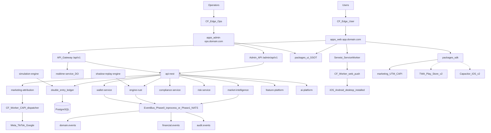
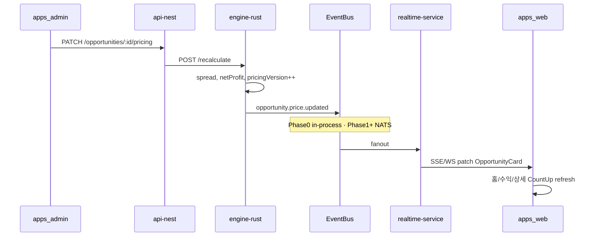

# AI Profit OS — Engine (v7.22.32)

> 분리 플랜 — Index: `ai_profit_os_00_index_a1b2c3d4.plan.md` · ARCHIVE: `ai_profit_os_launch_54c1261e.plan.md` · 착수전: `docs/CONSTITUTION_BOOTSTRAP.md`
> **단일 편집본:** 워크스페이스 `.cursor/plans` 해시 파일만 (에이전트 편집 SSOT)

> **제로 목표:** 오류0 · 결함0 · 오차0 · 중복0  
> **AI 이름:** **퍼뜩** (§47.12) · **P레인=플랫폼 Fact** · **G레인=일상 LLM** · **S=실행 금지**  
> **Phase0 버스:** **in-process** (NATS=Phase1+) · Infra/Index pointer  
> **todo 순서:** 시세/어댑터 → 자본대/이미지/버티컬 → 잔액피드 → **§4.2a 스캔투영** → **Rule(P0b)** → 엄격도 → 멤버십 → 시뮬/KPI → AI (Index §18 정렬)  
> **v7.22.20:** §0.0.6 `assetImageUrl` · `luxury_bag`  
> **v7.22.21:** §0.0.5.1 잔액 인식 피드 · SKU 1:1 · Admin §9.8.9  
> **v7.22.23:** §48.13.3 **매칭 엄격도** · 난수 `successRatePercent` **0**  
> **v7.22.24:** §0.0.7 **유저 멤버십 등급** · AI 해금 · 일일 횟수↓/건당수익↑ · 유저별 strictness · UI 설명 Owns  
> **v7.22.25:** §48.13.1 **P0b** `matchBlocked` (Admin §9.8.4a) · todo 의존 순서 잠금  
> **v7.22.26:** **§4.2a** `arbitrageTypeKo`·`time_sensitive`·sellSuccess meta · FX=동일 카드 스키마 · Index §20.1 pointer · **홈 레이아웃 Owns=UI**  
> **v7.22.27:** **§4.2b** INTERNAL≠USER 표기 · 유저=capital provider · `executionPlatforms` 유저0 · Index §20.2 pointer
> **v7.22.28:** 유저 CTA 라벨 Owns=UI/`수익 벌기` · domain=`participate` · `expectedSellDays` **유저 투영 0** · `estimatedDurationSec` 목표≤60 · Index §20.2  
> **v7.22.29:** Soft **60s** / Hard **90s** · REQUEUE 가드 · **`MATCH_TIMEOUT`** · Index §20.2 · Audit A4  
> **v7.22.30:** Soft/Hard **전 등급 동일** · 진행실 시세틱=pricing **Fact only**(난수 틱 0) · 긴장감 UX Owns=UI §48.3b · 등급 차별=§0.0.7 캡·기회(**≠대기 wall**)  
> **v7.22.31:** Day-1 listing = **ebay 멀티 marketplaceId** 또는 **ebay×admin** · (yahoo는 당시 Phase1+)  
> **v7.22.32:** `yahoo_jp` / Yahoo! JAPAN Auction **영구 배제**(FORBIDDEN) · Phase1+ 철회 · 코드·스키마·워커·카피·ENV **0** · listing = ebay 멀티\|admin only  
> **v1 executionMode:** **`orchestrate` only** (ADR-009)  
> **모델:** `[grok-4.5|256K]` 엔진/AI SSOT · `[composer-2.5|200K]` 워커·시뮬·Adapter 슬라이스

## 0.0 시세 소스 잠금 (v7.13) — Signup-Ready + Margin UX + Capital Tiers

**선별 기준 (전부 충족해야 Active):**
1. 공식/문서화된 HTTP API 또는 공개 bulk JSON  
2. **가입만 하면** 또는 **가입 없이** 즉시 키/호출 가능  
3. 신규 키 발급이 막혀 있지 않음  
4. 무료 티어가 **상업 플랫폼 표시를 명시 금지**하지 않음  
5. 한국 마켓플레이스가 아님  

### 0.0.1 ACTIVE — Day-1 수집 허용 (일본 휴대폰 **불필요**)

| adapter_id | 가입 | 역할 | 수직 | 문서/엔드포인트 | 한도·캐시 규칙 |
|------------|------|------|------|-----------------|----------------|
| `ebay` | developer.ebay.com 무료 | **실호가 Listing** (멀티 `marketplaceId` leg) | watch + trading_card + luxury_bag | Browse API `item_summary/search` (+ image) · marketplaceId=`EBAY_US`/`EBAY_GB`/`EBAY_DE`/`EBAY_AU` | ~5k calls/day · Redis cache · 유저요청 시 외부호출 금지 |
| `pokemontcg` | dev.pokemontcg.io 무료 키 | 포켓몬 **카탈로그+참고가** | trading_card (pokemon) | `api.pokemontcg.io/v2` | 키 시 ~20k/day · 메타 캐시 24h · 가격 캐시 ≥1h |
| `ygoprodeck` | **가입 불필요** | 유희왕 **카탈로그+참고가** | trading_card (yugioh) | `db.ygoprodeck.com/api/v7` | IP rate limit · bulk/local cache 권장 |
| `coingecko` | Demo 키 권장(무료) | USDT↔KRW/USD | fx | `api.coingecko.com/api/v3/simple/price` | Demo 월 한도 · **최소 60s~5m 캐시** |
| `frankfurter` | **가입 불필요** | 법정화폐 FX | fx | `api.frankfurter.dev` | 일 단위 고시 · 1h 캐시 |
| `admin` | Ops | **수동 기준가 leg** (출처=`admin`) | 전 category | Admin `/admin/opportunities` override | 이미지 R2 필수(기본) |

#### 0.0.1a Day-1 Listing legs (일본 번호 게이트 우회 · 오류0)

> **배경 (v7.22.32):** Yahoo! JAPAN은 일본 휴대폰 게이트로 **영구 미사용** → Phase1+도 **철회** · FORBIDDEN.  
> **제품 서사:** “일본 야후” ❌ → **“두 시장 시세차”**(ebay 국가 간 또는 ebay×admin) · 라벨=`buyMarketLabelKo`/`sellMarketLabelKo` 동적.

| 우선 | buy leg | sell leg | 비고 |
|------|---------|----------|------|
| **P0 자동** | `ebay` @ `EBAY_US` | `ebay` @ `EBAY_GB` (또는 `EBAY_DE`/`EBAY_AU`) | **키 1개** · marketplaceId만 다름 |
| **P0 반자동** | `ebay` @ 임의 | `admin` | 2nd 마켓 희소·시드 초기 |
| **P0 반자동** | `admin` | `ebay` @ 임의 | 동일 |

**시장 ID enum (pricing · 유저 라벨 맵) — `yahoo_jp` 없음:**

| marketId | ko 라벨 (고정) |
|----------|----------------|
| `ebay_us` | 이베이(미국) |
| `ebay_gb` | 이베이(영국) |
| `ebay_de` | 이베이(독일) |
| `ebay_au` | 이베이(호주) |
| `admin` | 운영자 기준가 |

**역할 분리 (중복0·오차0):**
- **Listing leg:** `ebay`(≥1 marketplaceId) ± `admin` **만** · 동일 ebay 키로 두 marketplace 스프레드 허용  
- **Card catalog / reference price hint:** `pokemontcg` + `ygoprodeck` **만** (자동 Opportunity 단독 근거 금지)  
- **FX:** `coingecko` + `frankfurter` **만**  
- `PriceObservation.source` = `ebay` \| `admin` \| `pokemontcg` \| `ygoprodeck` \| `coingecko` \| `frankfurter` · ebay행은 `marketplaceId` 필수  
- **`yahoo_jp` / Yahoo Auction / yahoo-jp-adapter = 타입·워커·ENV·카피 재등장 금지**

### 0.0.2 FORBIDDEN — v1 코드경로 0 (중복·결함 방지)

| 소스 | 제외 이유 |
|------|-----------|
| 번개/중고나라/당근/크림/필웨이 등 KR | 정책 제외 |
| **`yahoo_jp` / Yahoo! JAPAN Auction** | **영구 배제 (v7.22.32)** · JP SMS 게이트 · Phase1+ 철회 · stub도 **금지** |
| **TCGPlayer API** | 공식 문서: **신규 API 키 발급 중단** |
| **JustTCG Free** | Terms: free = **non-commercial** |
| **PriceCharting API** | 3자 공개/재배포 제한 안내 |
| **Chrono24** | 공식 무료 개발자 API 없음 |
| **Cardmarket 3rd-party** | commercial + 심사 필요 → Day-1 제외 |
| **Scryfall** | Fan Policy: 페이월·단순 재배포 제한 → 유료 Money OS와 충돌 위험 |
| **PSA** | 시세 없음(cert 검증만) → 시세 adapter 아님 (출시 후 옵션) |
| HTML 전수 스크래핑 Day-1 | 안정·약관·쿼터 결함 |

### 0.0.3 파이프라인 (오류0 · v7.22.32)

```
Asset Master (수동 시드 · imageUrl 포함)
  → pokemontcg / ygoprodeck 로 메타+카탈로그 이미지 hydrate (카드만)
  → ebay(Browse · marketplaceId×N) ± admin override 로 Listing/PriceObservation
  → §0.0.6 assetImageUrl resolve (우선순위 고정)
  → frankfurter + coingecko 로 FX snapshot
  → engine-rust spread (ebay×ebay marketplace | ebay×admin)
  → Opportunity (출처 수·staleAt·marketId·assetImageUrl 표시)
  → Redis → DO/SSE → 유저 UI
```

**가드:**
- 유저 클릭 경로에서 외부 API 호출 **금지** (캐시 miss 시 stale 표시 또는 백그라운드 refresh 큐)  
- Opportunity 자동 공개: **pricing leg 유효 쌍 ≥1** (권장: ebay_us×ebay_gb 또는 ebay×admin) + fresh + 이상치 필터 + **§0.0.6 이미지 가드**  
- `pokemontcg`/`ygoprodeck` 가격만으로 자동 공개 **금지**  
- Admin override = 정식 leg (`marketId=admin`) · 이미지 없으면 Admin R2 업로드 필수(기본)  
- 유저 카피: 「야후」·Yahoo·yahoo_jp **문자열 0** · `*MarketLabelKo`만 사용 (UI) · `verify:listing-legs-day1`

### 0.0.4 가격비교 → 마진=내수익 인지 UX (삭제 금지 · SSOT)

> **중복0 Owns:** **공식·필드·compareReady 가드 = Engine 본 절** · **화면/카피/Canon = UI** (`PriceCompareMargin` 컴포넌트 · `packages/ui/copy/ko/margin-compare.ts`)  
> UI는 공식을 재정의하지 않음 · Engine은 픽셀/레이아웃을 Owns하지 않음.

**헌법:** 유저는 반드시 **「시장 A 가격 vs 시장 B 가격 → 차이(마진) = 내 예상 수익」** 을 한눈에 이해해야 한다.  
숫자만 크게 보여 주고 비교 근거를 숨기는 UI는 **결함**이다.

#### 필수 비교 블록 `PriceCompareMargin` (모든 Opportunity 표면)

홈 카드·상세·참여확인·완료영수증에 **동일 공식** (중복 정의 금지, 컴포넌트 1개).  
**역할:** 유저에게 **「기회 근거(시세 차이)」** 를 보여 줌 — **「당신이 사고팔 호가」가 아님** (Index §20.2).

```
┌─ 기회 근거 · 시세 비교 ─────────────────┐
│ 저가 시세  이베이(미국)  12,400 USDT     │  ← buyPriceUsdt · LabelKo 동적
│ 고가 시세  이베이(영국)  12,980 USDT     │  ← sellPriceUsdt · Day-1 예 (또는 admin)
│ ─────────────────────────────────────── │
│ 시세 차이                   +580 USDT   │
│ 수수료·버퍼 차감             −80 USDT   │
│ ✅ 예상 수익(내 몫)         +500 USDT   │
│ ≈ ₩○○○  · 갱신 방금 전 · 출처 2        │
│ 배지: 직접 사지 않아요 · 직접 팔지 않아요 │
└─────────────────────────────────────────┘
한줄 카피: "두 시장 시세 차이가 이 기회의 근거예요. 직접 사고팔지 않아요."
```

| 규칙 | 잠금 |
|------|------|
| 시장명 | `adapter_id` → ko 라벨 **필수** · 유저 카피 **저가 시세 / 고가 시세** (「매수하세요/매도하세요」금지) |
| 가격 | listing 실호가 (USDT) · Admin override 시 배지 `운영자 기준가` |
| 마진 | `expectedProfitUsdt` = sell − buy − fees − riskBuffer − platformMargin |
| 플랫폼 몫 | 상세에만 `플랫폼 수수료/마진` 한 줄 (§38) |
| 예상 vs 확정 | 참여 전=`예상 수익` / 정산 후=`확정 지급` **혼용 금지** |
| 비교 불가 시 | 카드 **자동 공개 금지** 또는 `비교 준비중` + **수익 벌기** 비활성 |
| 소스 1개뿐 | 반대 레그 Admin override 또는 비공개 · 가짜 반대가 **금지** |
| FOMO/티커 | 비교 블록 가림/대체 **금지** |
| 유저 행위 | 블록에서 구매/판매/플랫폼 선택 CTA **0** |

**스키마 필수 필드** (`OpportunityCard` / `OpportunityPricing`):
- `buyMarketId`, `buyMarketLabelKo`, `buyPriceUsdt`
- `sellMarketId`, `sellMarketLabelKo`, `sellPriceUsdt`
- `grossSpreadUsdt`, `costBufferUsdt`, `platformMarginUsdt`, `expectedProfitUsdt` (유저 마진)
- `compareReady: boolean` — false면 CTA 잠금

**카피 SSOT:** `packages/ui/copy/ko/margin-compare.ts`  
**검증:** `verify:margin-compare-surface` — 홈/상세/확인/영수증 4면 비교블록 100%

#### 0.0.4.1 수수료·버퍼·플랫폼마진 산출 (오차0 · Engine SSOT)

```
grossSpreadUsdt     = sellPriceUsdt − buyPriceUsdt
buyLegFeeUsdt       = buyPriceUsdt  × feePct(buyMarketId)     // default 표
sellLegFeeUsdt      = sellPriceUsdt × feePct(sellMarketId)
feesUsdt            = buyLegFeeUsdt + sellLegFeeUsdt
riskBufferUsdt      = max(grossSpreadUsdt × riskBufferPct, minRiskBufferUsdt)
costBufferUsdt      = feesUsdt + riskBufferUsdt               // UI "수수료·버퍼 차감"
platformMarginUsdt  = max(0, (grossSpreadUsdt − costBufferUsdt) × effectiveMarginPct)
expectedProfitUsdt  = grossSpreadUsdt − costBufferUsdt − platformMarginUsdt
```

| 파라미터 | Day-1 기본 | 편집 |
|----------|------------|------|
| `feePct.ebay` | **0.135** | 모든 `ebay_*` marketplace 공통 · Admin fee 표 |
| `feePct.admin` | **0** | admin 레그 |
| ~~`feePct.yahoo_jp`~~ | — | **삭제** · yahoo 영구 배제 (v7.22.32) |
| `riskBufferPct` | **0.05** | Admin |
| `minRiskBufferUsdt` | **1** | Admin |
| `effectiveMarginPct` | 개별 `adminMarginPct` **우선**, 없으면 전역 `platform_margin_pct` | §36 · TOP2 |

**금지:** UI에 하드코딩 수수료 · adapter별 공식 분기 복제(엔진 함수 1곳) · expectedProfit < 0 인 기회 자동 공개  
**CI:** `verify:pricing-formula` — fixture listing → 위 식 ±0.000001 USDT

#### 0.0.4.2 FX Snapshot 합성 (오차0)

| 목적 | Primary | Fallback |
|------|---------|----------|
| USDT→KRW 표시 | CoinGecko `tether`/`krw` | CoinGecko USDT/USD × Frankfurter USD/KRW |
| 법정화폐 교차 | Frankfurter | — |
| USDT/USD | CoinGecko | — |

**규칙:** 매 snapshot에 `fx_snapshot_id` · `sources[]` · `formulaId`(`cg_usdt_krw` \| `cg_usdt_usd__frank_usd_krw`) 저장.  
표시 ≈원화는 **항상 동일 snapshot**. 혼합 시점 환율 금지.  
**CI:** `verify:fx-snapshot-formula`

#### 0.0.4.3 platform_reserve (시뮬 S2 입력 · **Ops/재무 · 제품 P0 Freeze 아님**)

| 필드 | SSOT |
|------|------|
| 계정 | ledger `ops.platform_reserve_usdt` (USDT) |
| Admin | `/admin/system-control?tab=reserve` · 목표 잔액 설정 · audit |
| Day-1 | **미설정 시 Growth ON 차단** · 시뮬 S2 Fail |
| S2 | `worstCasePlatformDrain ≤ platform_reserve × 0.10` |

### 0.0.5 자본대(소액~웨일) 상품·카테고리 구성

**헌법:** 웨일(≥100k USDT)과 **소액 부업 유저**를 동시에 받는다.  
초고가 시계만 있으면 소액 유저 유입 실패 = 제품 결함.

#### capitalBand (기회·필터·시드 공통 enum)

| capitalBand | 필요 자본 (USDT) | 타깃 | v1 주력 상품 |
|-------------|------------------|------|----------------|
| `micro` | **10 ~ 99** | 첫 입금·연습 | 저가 TCG 싱글, 소액 카드 묶음급 SKU |
| `small` | **100 ~ 999** | 소액 부업 | 중급 포켓몬/유희왕, 소형 Omega 등 저~중가 시계(시드 제한) |
| `mid` | **1,000 ~ 9,999** | 본격 참여 | Rolex 엔트리·중가 레퍼런스, 고등급 카드 |
| `high` | **10,000 ~ 99,999** | 고액 | Rolex/Cartier 핵심, 일부 AP |
| `whale` | **≥ 100,000** | 초고액 | Patek/AP Ultra, 초고가 레퍼런스 |

#### 카탈로그 시드 비율 (v1 잠금 · 오차0)

| 밴드 | 전체 Opportunity 시드 비중 | 비고 |
|------|---------------------------|------|
| micro + small | **≥ 40%** | 소액 유저 필수 물량 |
| mid | **≥ 25%** | |
| high + whale | **≤ 35%** | 하이엔드·웨일 유지하되 독식 금지 |

#### 마켓 UI

필터 칩 (한글):
`전체` `시계` `카드` `가방` · `소액(10~)` `입문(100~)` `중급(1천~)` `고액(1만~)` `웨일(10만~)` · `초고가`

홈 기본 정렬 → **§0.0.5.1** (잔액 인식 · 삭제 금지)

입금 UX:
- 소액 퀵버튼: `10` `50` `100` `500` USDT  
- 웨일 퀵버튼: `1만` `5만` `10만` `25만` `50만` USDT  
- 두 그룹 모두 노출 (소액 유저 배제 금지)  
- **부족분 제안:** Money §49.2a `suggestDepositUsdt` (본 절 계산)

온보딩 한 줄:
`시세가 다른 두 시장의 차이만큼 수익이 나요. 소액부터 시작할 수 있어요.`

#### 0.0.5.1 잔액 인식 피드 · 추가입금 유도 (오류0 · 삭제 금지)

> **중복0 Owns:** **분류·정렬·suggestDeposit 계산 = Engine 본 절** · **ledger principal 읽기 = Money §49** · **카드/CTA 카피·레이아웃 = UI §5.3a** · **유저별 강제 노출/숨김/마진 = Admin §9.8.9**  
> LLM/퍼뜩 G레인으로 잔액·추천 **금지** · P레인 Fact만 허용.

**입력 (서버만):**
- `principalUsdt` = Money 버킷 (참여 재원) · 입금 confirmed 후 즉시 반영
- Opportunity: `requiredCapitalUsdt` · `compareReady` · `status=available` · `assetImageUrl` · Admin override 적용 후 카드

**분류 (오차0):**

| 버킷 | 조건 | 유저 의미 |
|------|------|-----------|
| `affordable` | `requiredCapitalUsdt ≤ principalUsdt` | **지금 참여 가능** |
| `nearMiss` | `principalUsdt < requiredCapitalUsdt ≤ principalUsdt + nearMissCap` | **조금 더 넣으면 가능** |
| `lockedHigh` | `requiredCapitalUsdt > principalUsdt + nearMissCap` | 목록 하단·접힘 (숨김 아님) |

`nearMissCap` Day-1 기본 = **max(50, principalUsdt × 0.25)** · Admin `/admin/execution-policy` 또는 growth 아님 · **adapters/settings** `feed.nearMissCapUsdt` (전역)

**suggestDepositUsdt (기회 단위):**
```
suggestDepositUsdt = ceil_to_tick(requiredCapitalUsdt − principalUsdt)
// tick Day-1 = 1 USDT · 최소 표시 1 · principal≥required 이면 0 (CTA 숨김)
```

**홈/수익 정렬 잠금:**
1. Admin §9.8.9 `pinOrder` (유저별) 있으면 최상단  
2. `affordable` · `compareReady` · AI pick / 마진율  
3. `nearMiss` (부족 CTA 노출)  
4. `lockedHigh`  
5. 잔액 0 → micro/small `affordable` 시드 우선 (데모·입금 유도)

**유저별 override merge (Admin §9.8.9 → 카드 투영):**
```
baseCard = OpportunityCard (전역 §36)
userOv = user_opportunity_override[userId, opportunityId] | null
if userOv.hidden → 피드 제외
if userOv.forceShow → 가드 통과 시 affordable/nearMiss에 재분류 가능(자본 부족이면 nearMiss+suggest)
if userOv.expectedProfitUsdtOverride → 표시·participate 가드에 사용 (ledger 잔액 변경 아님)
if userOv.marginPctOverride → engine recalc expectedProfit (유저 세션만)
```
**금지:** override로 ledger credit/debit · 난수 성공 · compareReady 위조(false→true 강제 공개 금지; true→false 숨김은 허용)

**퍼뜩 P Fact (예):** `지금 잔액으로 N건 · +{suggest}USDT면 M건 더`  
**검증:** `verify:balance-aware-feed` — 분류 공식·CTA 쿼리·override 숨김 100%

### 0.0.7 유저 멤버십 등급 · AI 해금 · 매칭 체감 (삭제 금지 · v7.22.24)

> **중복0 Owns:** **등급 enum·승급·일일캡·strictness 오버레이·관측 fulfillRate = Engine 본 절**  
> **유저 설명·카피·등급표 UI = UI §5.9.2c · §51.18a** · **Admin 조회/강제/자격증명/유저별엄격도 = Admin §9.8.10**  
> **≠** 초대 티어(seed…whale_maker · Money §51.5) · **≠** `userTier` vip_desk(컴플라이언스) — 필드 분리.

#### 멤버십 enum (`schemas/user-membership.v1.json`)

| id | 유저 표기(ko) | 누적입금 USDT **또는** | MATCH_SUCCESS 누적 | maxCapitalBand | Day-1 `dailyUserMatchCap` | 기본 `matchStrictness` |
|----|---------------|------------------------|--------------------|----------------|---------------------------|-------------------------|
| `sprout` | 새싹 | 0~99 | — | micro | **8** | lenient |
| `entry` | 입문 | ≥100 | **또는 ≥2** | small | **6** | lenient |
| `core` | 본격 | ≥1,000 | **또는 ≥5** | mid | **5** | standard |
| `high` | 고액 | ≥10,000 | — | high | **3** | tight→성공은 슬롯·마진으로 보상* |
| `vip` | VIP | ≥100,000 **또는** Admin 강제 | — | whale | **2** | **lenient** (조건 여유) |

\* high: 엄격도는 standard~tight 가능하나 **건당 예상수익·방 크기↑** · VIP는 **조건 여유(성공 잘 나는 편)+하루 횟수 최소+건당 최대**.  
**승급:** `membership = max(입금단계, 성공단계, adminForce)` · **자동 강등 0** (Admin 강등만·audit).  
**금지:** 등급만으로 MATCH_SUCCESS 100% 보장 · 일일 캡=성공 보장 횟수로 해석.

#### AI 해금 (제품 기능 · 환각 금지)

| membership | 해금 (엔진/피드 실기능) |
|------------|-------------------------|
| sprout | 기본 피드 · safe_stop · 퍼뜩 P Fact 기본 |
| entry | nearMiss 우선도↑ · 추천 가중 |
| core | AI pick 가중 · 멤버십×밴드 정렬 부스트 |
| high | high 방 · 슬롯 우선(소수) · 정밀 stale 감시 |
| vip | whale/Ultra 우선 · VIP Desk 딥링크 · **effectiveStrictness 여유** · 일일 캡 최소 |

유저 카피 Owns=UI — 엔진은 **해금 플래그**만 (`aiPerkFlags[]`).

#### 관측 참고율 (유저/Admin 표시용 · Rule 입력 금지)

```
fulfillRate7d(membership, capitalBand) =
  MATCH_SUCCESS / attempts   // attempts = SUCCESS+PRICE_MOVED+BELOW_MIN (+선택 REQUEUE terminal)
```
- 라벨(ko SSOT=UI): **「요즘 조건이 맞은 비율」** · **≠ 당첨 성공률**  
- Rule·participate 입력 **금지** (`verify:no-fulfill-rate-as-rule`)

#### effectivePolicy 병합 순서 (오차0)

```
1) global execution-policy (matchStrictness 프리셋)
2) membership×capitalBand overlay (전역 격자)
3) user.matchStrictnessOverride (Admin 유저별 · §9.8.10)
4) evaluateMatchSuccess(effectivePolicy)  // 난수 0
```

**참여 가드 추가:** `opportunity.capitalBand ≤ user.maxCapitalBand` · `user.dailyMatchesUsed < dailyUserMatchCap` · `opp.slotsLeft > 0`

**검증:** `verify:membership-ladder` · `verify:membership-daily-cap` · `verify:no-fulfill-rate-as-rule`

### 시계 브랜드 (v1 watch)

| tier | 브랜드 | v1 |
|------|--------|-----|
| Ultra | Patek Philippe, Audemars Piguet, Richard Mille(선택) | ✅ |
| Core | Rolex, Cartier, Vacheron(선택) | ✅ |
| Strong | Omega, Tudor(선택) | ✅ partial |

시드 40~80 refs · 호가 소스 = **ebay 멀티 marketplace ± admin** · yahoo **0**

### 카테고리 / Asset Master

| category | 시드 | 메타 | 호가 (Day-1) | 기본 아이콘 |
|----------|------|------|--------------|-------------|
| `watch` | 40~80 | 수동 시드 | ebay_us×ebay_gb\|admin | ⌚ |
| `trading_card` | 20~40 | pokemontcg(포켓몬), ygoprodeck(유희왕), 기타 게임은 수동+ebay | ebay 멀티\|admin | 🃏 |
| `luxury_bag` | **10~25** | 수동 시드 (Hermès/Chanel/Louis Vuitton 등 레퍼런스) | ebay 멀티\|admin | 👜 |

**카드 매칭:** set+number+lang+finish(+grade) · 퍼지 단독 자동공개 금지.  
**등급/PSA (§51.12):** PSA=시세 adapter 아님 · listing title/caption에서 grade 추출 · **등급 불일치 → compareReady=false** · Admin `/admin/opportunities`에 `gradeMismatch` 배지 · 매칭 실패율 KPI → §51.15  
**가방 매칭:** brand+model(+size/color) 수동 시드 · 퍼지 단독 자동공개 금지 · 이미지=§0.0.6  
**스키마:** `category` enum = `watch \| trading_card \| luxury_bag` (추가 vertical = ADR 후 enum 확장만)

### 0.0.6 카테고리별 상품 이미지 (Asset Image · 오류0 · 삭제 금지)

> **중복0 Owns:** **필드·hydrate·공개 가드 = Engine 본 절** · **썸네일 레이아웃·캡션·진행실 슬롯 = UI §48.3/§48.3a**  
> 유저는 시계·포켓몬카드·가방 등 **매칭된 그 SKU 실물 사진**이 진행/카드에 보여야 한다. 이모지 단독·스톡 플레이스홀더만 = **결함**.  
> **SKU 1:1:** `assetId` ↔ `assetImageUrl` 불변 · Rolex 기회에 타 레퍼런스/타 카테고리 사진 **금지** (`verify:asset-image-surface`).

#### Asset Master 이미지 필드 (`schemas/asset-master.v1.json`)

```typescript
interface AssetMasterImage {
  imageUrl: string;                 // HTTPS · R2 public 또는 adapter CDN
  imageSource: 'ebay' | 'pokemontcg' | 'ygoprodeck' | 'admin_r2';
  imageAltKo: string;               // assetLabel과 동일 계열 · 접근성
  imageRightsNoteKo: '시세 참고용'; // 유저 surface 고정 문구 (UI §50.9 근처와 동일 슬롯)
  imageFetchedAt?: ISO8601;
}
```

#### OpportunityCard 필수 투영 (`schemas/opportunity-card.v1.json`)

| 필드 | 필수 | 설명 |
|------|------|------|
| `assetImageUrl` | **공개 시 필수** | 카테고리·SKU에 맞는 상품 사진 URL |
| `assetImageSource` | ✅ | hydrate 출처 |
| `assetImageAltKo` | ✅ | 스크린리더 · 기본=`assetLabel` |
| `assetIcon` | fallback | 이미지 로드 실패 시 Lux 플레이스홀더 중앙 아이콘 (⌚/🃏/👜) |

#### hydrate 우선순위 (오차0 · 코드 1곳)

```
1) Asset Master.imageUrl (Admin 시드 / R2 업로드)     → source=admin_r2
2) 카탈로그 API 이미지
   - trading_card pokemon → pokemontcg images.small|large
   - trading_card yugioh  → ygoprodeck card_images[0].image_url_small
3) 주 listing 썸네일 (ebay Browse image)
4) (불가) → status=available 자동 공개 금지 · Admin 큐 `image_missing`
```

**가드:**
- `status=available` 자동 공개: `compareReady === true` **AND** `assetImageUrl` non-empty  
- Admin `useAdminOverride` + `imageOptional=true` 일 때만 아이콘 fallback 공개 허용 (기본 **false**)  
- 유저 클릭 경로에서 이미지 URL 실시간 fetch **금지** (백그라운드 워커·캐시만)  
- 브랜드/상품 사진 = **시세 참고용** · 소유권·재판매 암시 카피 **금지** (UI Owns)  
- 교차 카테고리 이미지 금지 (시계 기회에 카드 사진 등) = `verify:asset-image-surface` FAIL

#### Admin

`/admin/opportunities` · `/admin/assets`: 이미지 URL·R2 업로드·`image_missing` 필터 · 미리보기는 유저 카드와 동일 `assetImageUrl`

**검증:** `verify:asset-image-surface` — available 기회 100% `assetImageUrl` · category↔icon 맵 · 홈/상세/진행/성공 4면 썸네일 슬롯

### 웨일 / 초고액 입금 (≥100,000 USDT)

| 항목 | 잠금 |
|------|------|
| 입금 | 저액 강제 캡 금지 · 퀵버튼 1만~50만 USDT |
| tier | standard / premium / **whale** |
| 컴플라이언스 | 출금 KYC + whale 강화 AML |
| Ultra 기회 | requiredCapitalUsdt ≥ 100000 노출 가능 |

**유저 UI 필터:** §0.0.5 자본대 칩 + `전체|시계|카드|가방`

**헌법 파일:**
- `CONSTITUTION/44_SIGNUP_READY_MARKET_SOURCES.md`
- `CONSTITUTION/45_PRICE_COMPARE_MARGIN_UX.md` (= §0.0.4)
- `CONSTITUTION/46_CAPITAL_TIER_CATALOG.md` (= §0.0.5)
- `CONSTITUTION/46b_ASSET_IMAGE_SSOT.md` (= §0.0.6)

---

## 2. 전체 아키텍처

### 2.0 Event bus Phase 잠금 (v7.22.14 · 오차0)

| Phase | 버스 | Engine 해석 |
|-------|------|-------------|
| **0 (Day-1)** | **in-process** (Nest/같은 프로세스 이벤트) | `opportunity.price.updated` · `settlement.*` · `simulation.completed` = **동등 이벤트** · **NATS 프로세스 0** |
| **1+** | NATS JetStream | 다이어그램 `Bus` = NATS로 교체 가능 · 스키마/토픽명 불변 |
| **2+** | + Temporal | shadow-replay·sweeper 오케스트레이션 |

**금지:** Phase0 필수 스택에 NATS/Temporal을 기동 조건으로 걸기 · UI에 `NATS` 문자열 노출



---

## 3. 서비스 경계 (최종)

### Domain / Money
- `services/api-nest` — auth, users, opportunity API, settlement, saved-strategies, admin API, **attribution ingest**
- `services/marketing-attribution` — UTM/gclid/fbclid/ttclid 귀속, CAPI orchestration, ROAS projection, consent log
- `services/engine-rust` — spread, ranking, execution-score, HOT/AI_PICK, anomaly, **§48.13 settlement_rule**
- `services/wallet-service` — **§41** 유저별 TRC20 주소 발급 · TronGrid ingest · KRW 입금신청 · withdraw · ledger credit
- `services/risk-service` — abuse score, rate limit, circuit breaker, device fingerprint hook
- `services/compliance-service` — **§42** KYC 출금 1회 게이트 · AML · sanctions · jurisdiction

### Data / AI
- `services/market-intelligence` — Asset, Listing, PriceObservation, HistoricalSpread
- `services/feature-platform` — user/market/opportunity features
- `services/ai-platform` — L1/L2 only, AI PICK score, AI_LOG
- `services/realtime-service` — WS/SSE, ticker, **opportunity.price.updated feed** §36
- `services/simulation-engine` — **§51.4** M0.5 gate · payoutFeasibility · weekly briefing
- `services/shadow-replay-engine` — 24h replay, 오차 0.000% gate

### Apps (분리 배포 §40)
- `apps/web` — 유저 PWA · **`app.{domain}`** · 5탭 only · **admin route 0**
- `apps/admin` — 운영 Ops · **`ops.{domain}`** · 12모듈 · **유저 UI 0**

### Workers (Agnostic Market Adapter + Marketing)
```
workers/
├── marketing-capi-dispatcher   # Meta/TikTok/Google CAPI (CF Worker)
├── ebay-adapter            # §0.0 ACTIVE · Browse · marketplaceId×N · watch|card|bag (+image)
├── pokemontcg-adapter      # §0.0 ACTIVE · catalog+ref price (pokemon only)
├── ygoprodeck-adapter      # §0.0 ACTIVE · catalog+ref price (yugioh only)
├── coingecko-adapter       # §0.0 ACTIVE · USDT FX
├── frankfurter-adapter     # §0.0 ACTIVE · fiat FX
├── chain-watchers          # §43 USDT Transfer stream
├── chain-sweeper           # §43 Energy delegate + Treasury sweep
# ❌ yahoo-jp-adapter · KR · tcgplayer · chrono24 · scryfall-paywall · cardmarket-3rd — FORBIDDEN (yahoo 영구)
└── temporal-workers
```

---

## 4. Opportunity Card — 단일 SSOT (중복0)

모든 vertical(명품·환율·상품권·중고)은 **동일 스키마·동일 UI 카드**.

### 4.1 스키마 (`schemas/opportunity-card.v1.json`)

```typescript
interface OpportunityCard {
  id: string;
  pricingVersion: number;           // §36 — Admin 저장마다 +1 · participate guard
  pricedAt: ISO8601;
  // 수익-first (UI 1순위) — engine가 §36 pricing에서 계산
  expectedProfitUsdt: Decimal;      // 표시: +12.45 USDT
  expectedProfitKrwApprox: number;    // fx_snapshot_id 기반 ≈ ₩
  fxSnapshotId: string;
  estimatedDurationSec: number;       // Day-1 available 목표 ≤60 (CTA후≈1분) · 연출≠settlement
  aiConfidenceScore: number;          // 0-100 → UI ★ 또는 99%
  difficulty: 'beginner' | 'normal' | 'premium' | 'hot';
  tags: ('instant' | 'high_profit' | 'ai_pick' | 'beginner' | 'time_sensitive')[];
  requiredCapitalUsdt: Decimal;
  // §36 가격 (상세·어드민 미리보기)
  pricing?: OpportunityPricing;
  // 실행 가능성 (상세 moat)
  /** @deprecated v7.22.28 유저 surface 금지 · Admin historical only */
  expectedSellDays?: number;
  sellSuccessRate?: number;           // §51.3 — HistoricalSpread 30d **표시 전용** · §48 실행 입력 **금지**
  sellSuccessWindowDays?: number;     // §51.3 · Day-1=30 · UI "최근 N일" (오차0)
  sellSuccessAsOf?: ISO8601;          // §51.3 · feature 산출 시각 · UI 갱신 시각
  riskScore?: number;                 // 1-5 stars
  executionMode: 'orchestrate';  // ADR-009 · v1 스키마/코드 **이 값만** · info|full|limited = FORBIDDEN_v1 (타입·분기·시드 0)
  executionPlatforms?: string[];      // INTERNAL · ebay_*|admin only · yahoo_jp FORBIDDEN · 유저 UI 0
  // orchestrate SSOT (오차0): 유저=capital provider · 외부 입찰/구매/판매 없음 · §48.13 MATCH_SUCCESS → ledger
  // = listing 신선도·compareReady·policy·simulation 기반 **가격조건 정산** (marketplace fill ≠ 유저 성공조건)
  // full = Phase later · ADR 없이 코드경로 금지
  // 상품 (보조, 작게) — 썸네일은 §0.0.6
  category: 'watch' | 'trading_card' | 'luxury_bag';  // v1 수직 · 마켓 탭 필터 · **탐색 IA 아님** (Index §20.1)
  assetId: string;                    // Asset Master FK
  assetLabel: string;                 // "Rolex Submariner" | "PSA10 Charizard Base #4" | "Hermès Birkin 30"
  assetImageUrl: string;              // §0.0.6 · available 공개 시 필수
  assetImageSource: 'ebay' | 'pokemontcg' | 'ygoprodeck' | 'admin_r2';
  assetImageAltKo: string;            // 기본 = assetLabel
  assetIcon?: string;                 // ⌚ / 🃏 / 👜 · 이미지 로드 실패 fallback only
  arbitrageType: 'price' | 'fx' | 'benefit' | 'limited' | 'resale';
  arbitrageTypeKo: string;            // §4.2a 투영 · available 공개 시 필수 · UI 하드코딩 맵 금지
  staleAt: ISO8601;
  status: 'available' | 'paused' | 'expired' | 'circuit_open';
}

interface OpportunityPricing {
  // §0.0.4 PriceCompareMargin SSOT (유저 인지 — 삭제 금지)
  buyMarketId: 'ebay_us' | 'ebay_gb' | 'ebay_de' | 'ebay_au' | 'admin'; // yahoo_jp 영구 배제
  buyMarketLabelKo: string;           // §0.0.1a 맵 · UI 하드코딩 금지
  buyPriceUsdt: Decimal;              // 매수 시장가
  sellMarketId: 'ebay_us' | 'ebay_gb' | 'ebay_de' | 'ebay_au' | 'admin';
  sellMarketLabelKo: string;
  sellPriceUsdt: Decimal;             // 매도 시장가
  grossSpreadUsdt: Decimal;           // sell − buy
  costBufferUsdt: Decimal;
  platformMarginUsdt: Decimal;        // 플랫폼 몫 (상세 투명 표시)
  expectedProfitUsdt: Decimal;        // 유저 마진 = 내 수익
  compareReady: boolean;              // false → CTA lock
  capitalBand: 'micro' | 'small' | 'mid' | 'high' | 'whale';
  // Admin / engine
  adminBuyUsdt?: Decimal;
  adminSellUsdt?: Decimal;
  adminMarginPct?: Decimal;
  useAdminOverride: boolean;
  pricingSource: 'adapter' | 'admin' | 'blended';
  lastAdapterSyncAt?: ISO8601;
  lastAdminEditBy?: string;
  // legacy aliases — 코드에서 buyPriceUsdt/sellPriceUsdt/expectedProfitUsdt만 사용 (중복 기입 금지)
}
```

### 4.2 arbitrageType (확장 단위 = 돈 버는 방식)

| Type | v1 | 예 |
|------|-----|-----|
| price | ✅ | Patek/AP/Rolex 등 하이엔드 시계, PSA·TCG 카드, 명품 가방 · iPhone/LEGO = **v2+** (`category`+adapter 확장 · **새 IA 금지**) |
| fx | ✅ | USD/JPY/EUR — **동일 OpportunityCard + OpportunityPricing** (FX 전용 카드 스키마 금지) |
| benefit | v2 | 카드·상품권·쿠폰 — Index §20 P2 · 탭 추가 금지 |
| limited | ❌ v1 | Nike 등 — **v2+** (adapter 준비 전 코드경로 0) |
| resale | ❌ KR 제외 | 한국 C2C 비교 **영구 제외** · 해외 리세일만 별도 type로 재정의 시 ADR 필요 |

**v1 홈/수익 피드:** `status=available` + adapter live + `executionMode==='orchestrate'` + `compareReady` + `arbitrageTypeKo` 비어있지 않음 만 노출.

**sellSuccessRate (§51.3):** HistoricalSpread 30d **표시 전용** · 상세 `"과거 유사 조건"` footnote · §48 Rule·AI PICK 입력 **금지** · `verify:no-success-rate-as-rule`

### 4.2a 기회스캔 투영 · 타입라벨 · time_sensitive (v7.22.26 · 삭제 금지 · 중복0)

> **중복0 Owns:** **enum·라벨맵·태그 산출·공개 가드 = Engine 본 절** · **제품 absorb/exclude = Index §20.1** · **홈/카드 위계·필터칩·CTA = UI §5.3b**  
> **목적:** 유저가 “상품 앱”이 아니라 **“AI가 발견한 돈 되는 상황”** 으로 읽게 하는 **데이터 투영** (레이아웃 재정의 ❌).

#### arbitrageTypeKo (필수 투영 · 오차0)

| `arbitrageType` | `arbitrageTypeKo` (유저 노출 고정) | v1 피드 |
|-----------------|-------------------------------------|---------|
| `price` | **시세차익** | ✅ |
| `fx` | **환율차익** | ✅ |
| `benefit` | **혜택차익** | v2 숨김 |
| `limited` | **한정차익** | v2+ 숨김 |
| `resale` | **리셀차익** | KR 영구 제외 · 시드 0 |

**규칙:**
- `available` 공개 시 `arbitrageTypeKo` **필수** · UI에서 type→한글 맵 **재구현 금지** (서버/스키마 투영만)
- 카드·상세·확인 시트 **뱃지 1곳 이상** 표시 (UI Owns) · 누락 = `verify:arbitrage-type-label` FAIL
- `category` 라벨(시계/카드/가방)은 **보조** — 타입 뱃지보다 크거나 위에 올리면 결함

#### tags.`time_sensitive` (P1)

| 조건 (Day-1 기본 · Admin 조정 가능) | 태그 |
|--------------------------------------|------|
| `staleAt − now ≤ timeSensitiveHorizonSec` (기본 **7200s**) | `time_sensitive` |
| 또는 Admin `forceTimeSensitive=true` | 동일 |

- 필터 칩 노출 여부·카피 = **UI §5.3b** (강제 ON 아님 · 칩 없으면 태그 산출만)
- Rule/정산 입력 **금지** (표시·필터 전용)

#### 카드 투영 필드 (필드 Owns · 위계 배치=UI §5.3b · Index §20.2)

엔진이 available 카드에 **반드시 채울 값** (공식=§0.0.4 · UI 재계산 금지):

| 순서(유저) | 필드 | 유저 라벨(UI) |
|------------|------|----------------|
| 1 기회 | `arbitrageTypeKo` + corridor(`buyMarketLabelKo`→`sellMarketLabelKo`) + optional `assetLabel` | 시세차익 기회 등 |
| 2 투입 | `requiredCapitalUsdt` | **필요 자본** / 투입 금액 |
| 3 수익 | `expectedProfitUsdt` (+ ≈₩) · `grossSpreadUsdt`는 근거 블록 | **예상 수익**(실금액) |
| 4 AI | `aiConfidenceScore` | **AI 매칭 적합도** |
| — | `expectedSellDays` | **유저 투영 0** (deprecated) |
| — | `estimatedDurationSec` | 목표 **≤60** (CTA후≈1분 · 정산≠연출) |
| 보조 | `sellSuccessRate`+window/asOf | **과거 유사 매칭** (「판매 성공률」금지) |

**FX:** 동일 필드·동일 PriceCompareMargin · 별도 FX 카드 스키마 **금지**.

#### P2 확장 잠금 (데이터 only)

- `benefit` / `limited` ON = enum 시드 + adapter ready 후 Index 게이트  
- 아이폰·맥북·GPU 등 = **`category` enum 확장 + Asset Master + listing adapter`** 만  
- **금지:** 새 하단탭 · 카테고리 트리 IA · KR C2C adapter · 투자형 opportunity type

**검증:** `verify:arbitrage-type-label` — available 100% `arbitrageTypeKo` · 맵 표와 일치 · UI 하드코딩 맵 0

### 4.2b INTERNAL 필드 ↔ USER 표기 (v7.22.27 · 삭제 금지 · 중복0)

> **중복0 Owns:** **필드 의미·공개 범위 = 본 절** · **제품 역할 = Index §20.2** · **화면 카피·CTA = UI**  
> **원칙:** 코드/스키마 영문 필드명은 유지 가능 · **유저 surface 해석만 분리**.

| 내부 필드 | INTERNAL 용도 | USER 노출 | 금지 |
|-----------|---------------|-----------|------|
| `buyPriceUsdt` / `sellPriceUsdt` | 기회 산출·Admin | PriceCompare **저가/고가 시세** | “매입가/판매가·사세요/파세요” |
| `buyMarketId` / `sellMarketId` | adapter 레그 | 회랑 라벨·근거 블록 | 유저가 마켓 **선택** |
| `executionPlatforms` | 엔진/Admin fulfillment | **표면 0** (목록·라디오·딥링크 금지) | Chrono24/KR C2C |
| `executionMode` | `orchestrate` only | 카피 “AI 자동 처리” | 실체결·직접입찰 UX |
| `expectedSellDays` | Admin/historical only | **유저 0** | 일 단위 유저 ETA |
| `sellSuccessRate` | HistoricalSpread 표시 | **과거 유사 매칭** | 「판매 성공률」·Rule 입력 |
| `aiConfidenceScore` | AI score | **AI 매칭 적합도** | 「당첨률」「판매 확률」 |
| `matchWaitersCount` / `matchableOpportunityCount` | optional Fact | 대기실 숫자 | 소스 없는 가짜 숫자 |

**공개 가드:** `executionPlatforms` 가 유저 JSON/SSR props에 포함되면 `verify:user-trader-jargon-0` FAIL (Admin API는 허용).

### 4.3 Admin 가격·수익 연동 (§36 SSOT)

**원칙:** 모든 상품(기회) = **Admin 편집 가능 가격** + **유저 UI 즉시 동기화** (홈·수익·상세·거래).

#### 가격 우선순위 (오차0)

```
1) adapter market (자동 수집)
2) admin override (개별 상품) — useAdminOverride=true
3) platform_margin_pct (전역, §9.5.2) — 개별 adminMarginPct 없을 때
→ engine-rust spread/netProfit 재계산 → OpportunityCard.projection
```

#### Admin UI (`/admin/opportunities`)

| 컬럼 (ko) | 편집 | 유저 반영 |
|-----------|------|-----------|
| 상품명 | read | assetLabel |
| 상품 이미지 | ✅ URL/R2 | assetImageUrl (§0.0.6) |
| 매입가 (USDT) | ✅ | requiredCapital 근사 |
| 판매가 (USDT) | ✅ | — |
| 마진 % | ✅ | platformFee |
| **예상 수익** | preview (engine) | 카드 1순위 숫자 |
| ≈원화 | auto fx | expectedProfitKrwApprox |
| 수집기 시세 | read + [시세 다시 받기] | marketBuy/Sell |
| 상태 | pause/resume | 피드 노출 |

**원클릭:** [가격 적용] · [선택 N건 일괄 적용] · [전역 마진 % 연동] (§9.5.2)

#### 실시간 유저 반영 (<500ms 목표, tier batch §29)



**구독 채널:** `opportunity:{id}` · `feed:home` · `feed:profits` · `feed:ai_pick`

**유저 surface (전부 동일 payload):**
- 홈 [C] Hero · [D] 오늘 가능 수익 합계 · [E] AI 추천
- `/profits` VirtualList 카드 · Radar ping on profit↑
- `/profits/[id]` 상세 · participate modal
- 진행 중 `/trades/{id}/execute` — pricingVersion mismatch → toast 갱신

**Participate guard (§43):** `POST /participate` body에 `pricingVersion` + `minProfitUsdt` — 버전 불일치여도 **예상수익 ≥ minProfitUsdt**면 성공; 미만만 `PRICE_STALE`. `staleAt > 3s` 시세는 엔진 진입 차단.

#### 스키마·서비스

- `schemas/opportunity-pricing.v1.json` — pricing 필드 SSOT
- `services/api-nest` — admin pricing API + audit
- `services/engine-rust` — `/recalculate` · `/recalculate/bulk`
- `packages/sdk/opportunity-stream/` — `useOpportunityPatch()` SSE client
- `packages/ui/components/ProfitAmount.tsx` — pricingVersion key → CountUp re-animate

---

## 12. Event Architecture (3 NS, 중복0)

> **전송:** §2.0 Phase 표 · 토픽/스키마는 Phase와 무관하게 동일

```
domain.events    — opportunity.*, opportunity.price.updated, market.*, ai.analysis.*
financial.events — ledger.*, wallet.*, wallet.deposit_config.updated, settlement.*, wallet.bucket.*, wallet.withdraw_intent.*, wallet.profit_merged
audit.events     — admin.user.*, admin.wallet.deposit_config.*, admin.opportunity.pricing.*, policy.changed, admin.bucket.adjust.*
```

스키마 단일 소스: `schemas/` → `packages/types` → `data-contracts/` (복사 금지)

---

## 13. AI Layer (L1/L2, 자금집행 금지)

| Level | UI 노출 | 금지 |
|-------|---------|------|
| L1 | 설명, FAQ, 검색 | money |
| L2 | AI PICK score, ranking | auto approve |
| L3 | simulation only | auto payout |

**Sensitive Decision = Rule Engine + Compliance only**

---

## 47. Personal AI Layer (v7.17→v7.22.16) — 비파괴 부착 · P/G/S 레인

> **성격:** 머니·시세·원장·상품 엔진을 **수정·대체하지 않음**. Personal AI 레이어만 **이 구조로 확장**.  
> **SSOT:** `CONSTITUTION/47_PERSONAL_AI_USER_TWIN.md`  
> **확정 정의:**  
> Personal AI(퍼뜩)는 **단일 PostgreSQL SoT** + **Redis Twin** + **검증 Fact/Memory**로 답하며, LLM은 **Provider Adapter**로만 붙인다.  
> **한 줄 (v7.22.16):** **P레인**=플랫폼 숫자는 Fact tools로 오류0 · **G레인**=일상은 LLM(무료→OpenAI) · **S레인**=출금/지급 **실행 0** · 저장≠학습.  
> **과장 금지:** “어떠한 질문도 오류0·완벽” 유저/마케팅 카피 **0** — 플랫폼=SoT 검증 · 일상=모델 한계+면책.

### 47.1 핵심 원칙 (유지+레인)

- **P(Platform):** 잔액·기회·입출금·KYC·약관·이용법 — **Fact/Template/RAG 우선** · LLM은 문장화만 · 숫자 추정 금지.  
- **G(General):** 일상·잡담·일반지식 — LLM Adapter · **money tools 0** · 플랫폼 숫자 언급 시 P로 재라우트.  
- **S(Sensitive):** 출금·지급·한도·circuit **실행** — AI 경로 **0** · Rule/Compliance only · 안내용 템플릿만.  
- OpenAI / Groq / Gemini / Ollama = **Answer Brain Adapter** (교체 가능 · 데이터층 불변).

### 47.2 파이프라인 (고정 순서 · v7.22.16)

```
User
 ↓
Intent Classifier → lane ∈ {P, G, S}
 ↓
User Twin          ← 성향·행동·이력 (느린 사실)
 ↓
Memory             ← 대화·요약 기억
 ↓
Fact Card          ← P레인만 필수 로드 (신선도 가드)
 ↓
Answer Router
 ├─ S → refuse_execute_template (실행 버튼/ tool 호출 0)
 ├─ P → Template | Fact tools | Help RAG | LLM(문장화·tools 강제)
 └─ G → LLM General (stream) · tools=[] 
 ↓
Answer Guard       ← 금지어 + freshness(P) + no-money-tools(G) + lane 일치
 ↓
User (+ stream partial UI)
```

### 47.3 User Twin ≠ Fact Card (분리 필수)

| | User Twin | Fact Card |
|--|-----------|-----------|
| 정의 | 유저에 대한 사실·행동·성향 | **현재 시점** 실제 숫자·상태 |
| 예 | capitalBand 선호, Q2 반복, 카드 관심, 톤 | balance, compareReady 기회 호가, KYC, staleAt |
| 갱신 | 행동 이벤트 누적 | 답변 직전·만료 시 **재조회** |
| 위험 | Twin만으로 잔액/기회 말하면 **오답** | Twin 없이 숫자만 말하면 **개인화 실패** |

**금지:** Twin 캐시로 `balanceUsdt` / `expectedProfitUsdt` / 기회 가격을 답변에 사용.

### 47.4 Fact Card freshness (Answer Guard)

모든 Fact:

```
Fact
├─ source          # ledger | opportunity | kyc | fx | ...
├─ captured_at
├─ expires_at
└─ confidence      # 0~1
```

Guard 규칙:
1. `now > expires_at` 또는 `confidence < threshold` → **답변 전 자동 재조회**
2. 재조회 실패/여전히 stale → “시세 갱신 중” 템플릿 · **추정 숫자 금지**
3. 가격·기회·잔액은 opportunity/ledger SSOT만 허용

### 47.5 Explainability trace (답변마다 저장)

```
AI_ANSWER_TRACE
├─ intent
├─ lane                   # P | G | S
├─ twin_snapshot_id
├─ memory_ids[]
├─ facts_used[]          # source, captured_at, expires_at, confidence
├─ tools_called[]        # P only
├─ provider_id           # ollama|groq|gemini_free|openai|none
├─ answer_path           # template | fact | rag | llm_p | llm_g | refuse_s
└─ guard_result          # pass | refresh | block | reroute_p + reason
```

Admin: “왜 이 유저에게 이 답변?” 1클릭 추적.  
기존 `AI_LOG`와 스키마 정렬 · 중복 테이블 금지(확장 필드 또는 1:1 trace).

### 47.6 모듈 (부착)

```
services/
├── user-twin-service      # Twin 실시간 patch (Redis hot + PG)
├── memory-service         # 세션/장기 요약 (+ pgvector 검색)
└── (ai-platform 내부)
    ├── assistant-router   # Intent → P|G|S + Template/Fact/RAG/LLM
    ├── fact-card-loader   # freshness-aware · ledger/opportunity 재조회
    ├── fact-tools         # getBalance|getBuckets|getOpportunity|getKyc|getKrwDeposit|searchHelp
    ├── help-rag           # guide/legal/glossary chunks (pgvector) · 숫자 Fact와 분리
    ├── llm-adapter        # §47.13 Provider Independent
    └── answer-guard       # 금지어 + freshness(P) + no-money-tools(G)
```

### 47.7 기존 플랜과의 관계 (중복0)

| 기존 | Personal AI |
|------|-------------|
| §38.7 Objection4 copy | Router `SSOT Template` 경로의 뼈대 |
| §0.0.4 PriceCompareMargin | Fact Card의 기회 비교 숫자 출처 |
| §0.0.5 capitalBand | Twin 필드 + 추천 톤 |
| ai-platform L1/L2 | Answer Brain 위치 · L3 자금집행 여전히 금지 |
| Provider Independent | LLM Adapter만 교체 |
| Ledger SSOT = 단일 PostgreSQL | **AI 테이블도 같은 PG** (DB 이중화 금지) |

### 47.8 CI

- `verify:twin-fact-separation` — Twin 필드로 balance/price 응답 경로 0
- `verify:fact-freshness` — expired Fact로 답변 나가면 Fail
- `verify:answer-trace` — 모든 assistant 응답에 `lane`+trace 100%
- `verify:objection-template-path` — Q1~Q4는 template path 우선
- `verify:no-ai-data-in-git` — 대화/PII/학습셋 GitHub 경로 0
- `verify:single-postgres` — ledger + AI ops 스키마 동일 PG connection
- `verify:ai-lane-router` — Intent→P|G|S 분류기 + S면 tools/execute 0 (§47.14)
- `verify:ai-general-no-money-tools` — G레인 tools=[] · balance/opportunity tool 호출 0
- `verify:llm-adapter-contract` — LLMAdapter.chat 시그니처·provider_id 교체 시 데이터층 불변
- `verify:llm-quota-degrade` — 429/쿼터 시 G=busy 템플릿 · P=Fact 유지 · 자동 이중 provider 0 (§47.13)
### 47.9 저장/학습 아키텍처 확정 (머니·시세 비파괴)

**잠금 결정 3개 (오류0):**
1. **PostgreSQL 하나 = SoT** — `ledger_*` + `ai_*` 동일 인스턴스(Supabase-managed). AI용/Ledger용 DB 이중화 **금지**.
2. **pgvector → Qdrant는 나중 교체** — Day-1 = Postgres + pgvector만. 규모/성능 필요 시 Qdrant로 이전. **동시 이중 운영 금지**.
3. **자동 학습 OFF + Eval Gate** — 대화 유입만으로 Production 모델이 학습·배포되지 않음. PASS만 Registry→Prod.

**런타임 (확정):**

```
GitHub = Code / Prompt / Rule 만
        ↓ (배포)
USER → AI Runtime → Redis (hot twin/session/recent_memory/hot_intents)
                         ↓
                   Single PostgreSQL (Supabase)
                   ├─ ledger_*
                   ├─ ai_user_profile
                   ├─ ai_memory
                   ├─ ai_events
                   ├─ ai_logs            # + answer trace
                   ├─ ai_feedback
                   └─ memory_embeddings  # pgvector L1
                         ↓
                   Hot Context → Answer Engine → USER
```

| 저장소 | 역할 | 금지 |
|--------|------|------|
| **Single PG (Supabase)** | Ledger + AI ops SoT | 두 번째 Postgres/Supabase를 SoT로 추가 |
| **Redis** | 최신 Twin/세션 Hot Context | Twin에 balance/호가 Fact 대체 캐시 |
| **pgvector (L1)** | 기억 Embedding 검색 | Day-1 Qdrant 병행 |
| **Qdrant (L2 later)** | pgvector 대체 이전 | 이전 완료 전 이중 쓰기 |
| **GitHub** | 코드·prompts·rules | PII·대화원문·AI_LOG·학습셋 **0** |
| **Object Storage + Model Registry** | Dataset·모델 artifact·Prod 버전 | 핫패스에서 학습파일 직접 조회 |

**User Auth (ADR-006 잠금):** api-nest JWT + OAuth/Passkey/Email magic link **만**. Supabase Auth **병행 금지** (저장 SoT와 무관 · PG는 Supabase-managed 가능).

### 47.10 AI Learning Plane — 저장 ≠ 학습 · Eval Gate 필수

**원칙:** 운영 DB 적재 ≠ 모델 학습. Day-1 **자동 학습/자동 Prod 배포 OFF**.

```
Single PG (ai_logs / ai_events / ai_feedback)
        ↓
Clean / Label / PII scrub / consent filter
        ↓
Training Dataset → Object Storage
        ↓
Model Training
        ↓
Evaluation Gate
   ├─ PASS → Model Registry → Production Model
   └─ FAIL → 폐기 (Prod 미반영)
```

| 데이터 계층 | AI 계층 |
|-------------|---------|
| PG + Redis + (pgvector) 고정 | 자체 ML 또는 OpenAI 등 — **Provider Adapter만 교체** |

**가드:**
- 학습 후보 ≠ 즉시 Train · 정제/라벨 후만 Dataset
- Eval FAIL 모델은 Registry/Prod 경로 **진입 금지**
- 학습셋에 출금키·과도 PII 금지(스크럽)
- “데이터가 쌓이면 알아서 똑똑” 유저향 카피 **금지**

### 47.11 Bootstrap (중복0)

```
Day-1:  Single PG(Supabase) + Redis + pgvector  → Personal AI 운영
Later:  Learning Plane (Clean→Dataset→Train→Eval→Registry→Prod)
Scale:  pgvector → Qdrant 교체 (병행 0)
Model:  자체 ML 및/또는 LLM Adapter — 데이터 계층 불변
```

### 47.12 퍼뜩 (AI) — 유저 surface · Cursor 집행 아키텍처 (v7.22.16)

> **유저 AI 이름:** **퍼뜩** (카피 SSOT) — **타프로젝트 코치 브랜드명 사용 금지**  
> **엔진 본체:** §47.1~47.11 + §47.13~47.14 (교체·우회 금지)  
> **제품 목표:**  
> 1) **P레인** — 구현된 플랫폼 Fact로 미션→입금→출금안내→초대→이벤트→CS를 쉬운 한글로 제안.  
> 2) **G레인** — 일상·일반 질문도 같은 `/me/peotteok`에서 LLM으로 대화 (무료 Adapter → OpenAI 교체).  
> 3) **S레인** — 출금/지급/한도 **실행 0** · 안내 템플릿만.  
> **톤:** UI §38.9 `toneBand` · §50.1 `fontScale`/`depositPref` · **성별 분기 금지**  
> **정직 카피:** “플랫폼 숫자는 원장 기준 · 일상 답은 참고” — GPT급 무오류 보장 카피 **0**.

#### Fact 흡수 목록 (P레인 · 구현된 것만 · 환각 0)

| Fact 도메인 | 소스 | tool / path | 퍼뜩 제안 예 (ko) |
|-------------|------|-------------|---------------------|
| 잔액·버킷 | ledger buckets §49 | `getBalance` · `getBuckets` | “지금 출금 가능한 수익은 …” |
| 입금 USDT | deposit-config · 유저주소 | `getDepositUsdt` | “충전하면 바로 미션을 시작할 수 있어요” |
| 입금 원화 | KRW `pending\|approved\|rejected` (§41.3) | `getKrwDeposit` | pending=확인 중 · approved=잔액 · rejected=내역 |
| 입금 선호 탭 | prefs.depositPref | Fact Card | 원화 선호 시 원화 탭 안내(표시만) |
| UX 톤·글자 | prefs.toneBand · fontScale | Twin(비숫자) | senior→한 문장+다음 |
| 미션/참여 | opportunity · compareReady · orchestrate | `getOpportunity` | “지금 이 상품 예상수익 …” |
| 진행/중단 | §48 execution state | `getExecution` | “진행 중 / 안전하게 멈췄어요” · **실체결 암시 0** |
| 출금 **안내** | mode 기본=profit (§49) | Template · **execute tool 0** | “수익만 출금이 기본이에요” |
| 친구초대 | §51.5 referral | `getReferral` | “친구 초대 혜택 조건을 알려드릴게요” |
| 공지·이벤트 | notice≠campaign | `getCampaigns` | 보상 없는 공지 ≠ 캠페인 혼동 금지 |
| 연습 | §51.7 practice | `getPractice` | 출금·실참여 승격 안내 금지 |
| KYC | §42 | `getKyc` | 출금 전 1회 확인 안내 |
| 테더 준비 | §38.8 guide flag | `getUsdtGuide` | “테더 준비 안내를 열어드릴까요?” |
| 이용법·약관 | Help corpus | `searchHelp` (RAG) | 숫자 대신 절차/용어 설명 |
| 고객센터 | §51.6 | deep-link | 막히면 문의 연결 |
| FAQ/광고 | Objection4 · §38.7 | Template path | Q1~Q4 template 우선 |

#### Fact tools 계약 (P only · Nest)

```
getBalance / getBuckets / getDepositUsdt / getKrwDeposit
getOpportunity / getExecution / getKyc / getReferral
getCampaigns / getPractice / getUsdtGuide / searchHelp
```

- tools는 **읽기 전용** · 출금/지급/한도/circuit **mutation tool 이름 자체가 카탈로그에 없음**  
- P레인 LLM은 tool 결과 **밖 숫자 생성 금지** (Guard)  
- G레인: `tools=[]` 강제 (`verify:ai-general-no-money-tools`)

#### 제안 우선순위 (신규·복귀 · P레인 칩)

1. 필수 입금/KYC 게이트 · (USDT 미보유) get-usdt 또는 원화  
2. practice 또는 첫 compareReady 미션  
3. §48 진행·성공·안전중단 설명  
4. 수익 출금 **안내**(기본 mode=profit) — 실행 CTA는 UI 출금 화면만  
5. `/me/invite` · `/me/events`  
6. 설정·글자크기·toneBand  
7. (칩 외) 자유 입력 → Intent → P|G|S

#### 답변 형태 (toneBand · 중복0)

| toneBand | 답변 형태 |
|----------|-----------|
| young | 짧은 bullet · 이모지 1 |
| mid | 2~3문장 · 필요 시 비교 한 줄 |
| senior | **한 문장 + [다음/자세히]** · 전문용어 0 |

#### 금지

- AI가 출금·지급·한도·circuit을 **승인/실행**  
- Twin 캐시로 잔액·호가 답변  
- G레인에서 잔액/기회 **추정 숫자** (언급 시 P로 재라우트)  
- v1 숨김 vertical을 **있는 것처럼** 안내  
- 투자 원금 보장·확정 수익 · “모든 질문 완벽/오류0” 마케팅  
- **실체결·외부 입찰 암시** (§48.13 orchestrateTruth)  
- 성별 추론·성별 맞춤 멘트  
- GitHub에 대화/PII/학습셋  
- 순유입(입금−출금)을 **수익**으로 말함  

#### Admin

- `/admin/ai-logs?tab=coach` — 제안 카탈로그 · toneBand 템플릿 · Eval(P/G 분리 세트) · answer-trace(`lane`) · provider_id  
- 톱레벨 13번째 모듈 **금지**

#### CI (P레인 스코프 명시)

- `verify:ai-coach-fact-only` — **P레인만** · 미등록 Fact/tool로 숫자·상태 응답 0  
- `verify:ai-coach-no-autonomy` — 전 레인 출금/지급 mutate 경로 0  
- `verify:ai-general-no-money-tools` — G레인 money tools 0  
- `verify:ai-lane-router` — S/P/G 분류 + 재라우트  
- `verify:age-tone-surfaces` — toneBand 템플릿 (UI pointer)  
- `verify:twin-fact-separation` · `verify:answer-trace` · `verify:objection-template-path`

### 47.13 LLM Adapter — Provider Independent (Day-1=`gemini_free` → OpenAI)

> **Owns:** Engine · Nest `llm-adapter`  
> **목적:** 데이터층(PG/Redis/pgvector/Fact tools) **불변** · Brain만 교체.  
> **Day-1 클라우드 기본 (잠금):** **`gemini_free` 1개만** — Groq/Ollama는 대체·로컬 옵션 · **동시 기본 2개 금지**.

#### 인터페이스 (잠금)

```
LLMAdapter.chat({
  messages,           // system+history+user
  tools?,             // P only · G면 생략/빈배열
  stream: boolean,
  maxTokens,
  temperature?,
}): AsyncIterable<Chunk> | ChatResult
```

| provider_id | Day-1 | 용도 | 비고 |
|-------------|-------|------|------|
| `gemini_free` | ✅ **클라우드 기본** | G + P문장화 | Google AI Studio 무료 키 · 공식 SDK 또는 OpenAI-compat |
| `ollama` | ✅ 로컬/무쿼터 개발 | G + P문장화 | 8GB면 소형 모델만 · Docker 기본 OFF와 충돌 시 비권장 |
| `groq` | ✅ 대체 무료/저가 | G 속도 | `gemini_free` 장애 시 **수동** 스위치(자동 이중호출 0) |
| `openai` | 🔜 키·예산 후 | G + P문장화 품질 | **동일 인터페이스 교체만** |
| `none` | degrade / 키 없음 | Template+Fact | P 유지 · G=대기 템플릿 |

#### ENV / secrets (커밋 0 · Nest only)

| 변수 | 필수(Day-1 클라우드) | 설명 |
|------|----------------------|------|
| `LLM_PROVIDER` | ✅ | `gemini_free` \| `ollama` \| `groq` \| `openai` \| `none` |
| `GEMINI_API_KEY` | `gemini_free`일 때 ✅ | AI Studio 키 · **GitHub/`.env.example` 실키 0** |
| `GEMINI_MODEL` | 권장 | Day-1 권장=`gemini-flash-lite-latest` (`gemini-2.0-flash`는 무료 쿼터 429 잦음) |
| `LLM_BASE_URL` | ollama/compat 시 | 기본 비움 · Gemini 공식 SDK면 불필요 |
| `LLM_API_KEY` | groq/openai 시 | provider 공용 슬롯 · Gemini는 `GEMINI_API_KEY` 우선 |
| `LLM_QUOTA_SOFT_RPM` | 권장 | 소프트 한도(분당) · 초과 시 degrade 선제 |
| `LLM_QUOTA_SOFT_RPD` | 권장 | 소프트 한도(일) · Redis 카운터 |

**금지:** 웹/`NEXT_PUBLIC_*`에 키 · Provider별 비즈니스 로직 복제(어댑터 내부만) · 무료 한도=무제한 가정.

#### 쿼터·장애 degrade (완벽 운영 잠금 · 오류0)

```
G/P-문장화 호출
 ↓
Redis: rpm/rpd 카운터 (+ LLM_QUOTA_SOFT_*)
 ↓
Adapter 호출 (gemini_free)
 ├─ 200 OK → stream · trace.provider_id=gemini_free
 ├─ 429 / RESOURCE_EXHAUSTED / quota → degrade
 ├─ 5xx / timeout → retry 1회 → 실패 시 degrade
 └─ 키 없음·LLM_PROVIDER=none → 즉시 degrade
 ↓
degrade (provider_id 실효=none)
 ├─ P레인: Template + Fact tools만 (숫자 유지 · 문장화 LLM 0)
 └─ G레인: 고정 템플릿 + UI toast `PEOTTEOK_LLM_BUSY` (UI §8.2)
```

- **자동 multi-provider failover(Gemini→Groq 동시) Day-1 금지** — 한도·비용·디버그 난이도↑ · 운영자가 `LLM_PROVIDER`만 교체  
- Admin coach: 429/degrade 카운트 · `provider_id` trace 필수  
- CI: `verify:llm-quota-degrade` — 429 시뮬 시 G가 money/Fact 추정 없이 busy 템플릿만  
- CI: `verify:llm-adapter-contract` · `verify:no-ai-data-in-git`

#### 운영자 키 준비 (코드 밖 · 체크리스트)

1. [Google AI Studio](https://aistudio.google.com/apikey)에서 API key 발급  
2. 로컬 **`.env`에만** `GEMINI_API_KEY` · `LLM_PROVIDER=gemini_free` (커밋 전 `pnpm verify:secrets`)  
3. Adapter 미구현 동안에도 키 보관 가능 · runtime은 `none`과 동일하게 no-op 허용  
4. 무료 한도 소진 = 장애가 아니라 **예상 경로** → degrade가 PASS 조건

#### 전환 순서 (중복0)

1. Phase0 클라우드: **`LLM_PROVIDER=gemini_free`** (+ soft quota)  
2. 로컬 무쿼터 개발 옵션: `ollama` **또는** 키 없으면 `none`(P Fact만)  
3. Eval Gate PASS · 트래픽/품질 필요 시 `openai`로 스위치  
4. Learning Plane(§47.10)과 무관 — Adapter 교체 ≠ 자동 학습

### 47.14 Intent → P / G / S 레인 라우터

| lane | 트리거 예 | 허용 | 금지 |
|------|-----------|------|------|
| **P** | 잔액·입금·출금안내·미션·KYC·초대·이벤트·이용법 | Fact tools · Help RAG · LLM문장화 | mutate · Twin숫자 |
| **G** | 날씨·상식·잡담·일반 설명(플랫폼 숫자 없음) | LLM stream · Memory | money tools · 플랫폼 잔액 추정 |
| **S** | “출금해줘”·“한도 올려”·지급 실행 요청 | refuse_execute 템플릿 · UI deep-link | 모든 tool execute |

**재라우트:** G 답변 중 잔액/기회 질문 감지 → 즉시 P로 전환 · 직전 G 숫자 폐기.  
**Eval 세트:** `eval/p_fact.jsonl` · `eval/g_no_money.jsonl` · `eval/s_refuse.jsonl` (Admin coach 큐).

---

## 48.13 MATCH_SUCCESS Rule Engine (from §48)

> UI 진행실·영수증·안전중단 화면은 UI/UX 플랜 §48.0~48.12 참조.

### 48.13 MATCH_SUCCESS Rule Engine (v7.22 · deterministic · SSOT)

> **성격:** §48.2 enum의 `MATCH_SUCCESS`를 **난수·연출·sellSuccessRate 없이** 결정하는 단일 Rule Engine.  
> **SSOT:** `services/engine-rust/settlement_rule.rs` · `CONSTITUTION/51` §51.2 · shadow-replay golden traces  
> **금지:** `Math.random()` · `successRatePercent` · `presentation.duration` 만료 = 입금 · `sellSuccessRate` 입력

#### 평가 순서 (고정 · 단일 함수)

```
evaluateExecution(trade, opportunity, policy, user, sim) → ExecutionResultCode
```

| # | 조건 (전부 AND) | 실패 시 코드 |
|---|-----------------|-------------|
| R1 | `circuit.status === 'closed'` | `CIRCUIT_OPEN` |
| R2 | `user.status ∉ {frozen, banned}` | `SYSTEM_FAILED` → CS |
| R3 | `opportunity.status === 'available'` | `PRICE_MOVED` |
| R4 | `pricing.compareReady === true` | participate 차단 (진입 전) |
| R5 | `age(now, pricing.staleAt) ≤ policy.staleAllowanceSec` | `PRICE_MOVED` |
| R6 | `pricing.expectedProfitUsdt ≥ policy.minProfitUsdt` | `BELOW_MIN_PROFIT` |
| R7 | `trade.pricingVersion === opportunity.pricingVersion` **OR** (§43) `expectedProfit ≥ minProfitUsdt` at participate | `PRICE_MOVED` |
| R8 | `simulation.payoutFeasible(opportunityId) === true` (§51.4) | `BELOW_MIN_PROFIT` |
| R9 | listing leg fresh: compareReady sources within adapter TTL (§0.0) | `PRICE_MOVED` |
| R10 | `trade.rematchCount ≤ policy.maxRematchCount` | `BELOW_MIN_PROFIT` (상한) |

**성공 경로:** R1~R10 **전부 true** → `MATCH_SUCCESS` → **즉시** `settlement.completed` ledger 분개 (연출 progress% **무관**)  
**재매칭:** R1~R9 true · rematch < max · terminal 아님 · **`now + policy.retryWaitSec < hardDeadline`(T0+90s)** → `REQUEUE` (retryWaitSec 후 R1~R10 재평가)  
**Hard wall (v7.22.29):** T0=`participateAcceptedAt` · Soft 목표=T0+**60s** · Hard=T0+**90s**. Hard 도달 시 running/requeue → **`MATCH_TIMEOUT`** (safe_stop · lock 해제 · credit 0 · ≠`SYSTEM_FAILED`)  
**등급 (v7.22.30):** Soft/Hard·REQUEUE wall = **멤버십과 무관(전 등급 동일)**. 등급 효과는 §0.0.7 일일캡·기회·strictness 오버레이만 · **대기 특권으로 wall 단축 금지**.  
**진행실 시세 틱:** SSE/캐시 **Fact 갱신만** 유저 투영 · UI 난수 틱 **금지** · 긴장감 박자 Owns=UI §48.3b  
**REQUEUE 차단:** 다음 대기가 hard를 넘기면 REQUEUE 금지 → Rule 실패코드 또는 **`MATCH_TIMEOUT`**  
**연출:** `presentation.durationSecMin~Max`는 **UI progress만** · settlement·Soft/Hard **변경 0**  
**orchestrate 경계 (오차0·결함0):** v1 성공 = **Rule Engine 가격조건 충족**이지 eBay/Yahoo **호가 실체결·재고 확보 확인이 아님**. 유저 CTA에 외부 입찰/구매 **0**. `executionMode=full` 코드경로 **v1 금지**(ADR-009).

**유저·약관 고정 문장 (UI/UX §50.3·`T.execution.orchestrateTruth` 동일 · 중복0):**  
> "직접 사지 않아요. AI가 두 시장 시세 조건이 맞을 때만 수익을 정산해요. 외부 경매장에 들어가 입찰·구매하지 않습니다."  
성공 화면 시스템 상태 문구는 **「시세 반영 완료」** 계열만 · **「이베이 판매 완료」= 유저가 판매함 오해** 유발 시 결함(§48.0 교정 유지).

```typescript
// services/engine-rust — settlement_rule (pseudo)
function evaluateMatchSuccess(ctx: RuleContext): ExecutionResultCode {
  if (ctx.circuitOpen) return 'CIRCUIT_OPEN';
  if (ctx.userFrozen || ctx.userBanned) return 'SYSTEM_FAILED';
  if (!ctx.compareReady) throw ParticipateGuardError; // pre-trade
  if (ctx.staleSec > ctx.policy.staleAllowanceSec) return 'PRICE_MOVED';
  if (ctx.expectedProfitUsdt.lt(ctx.policy.minProfitUsdt)) return 'BELOW_MIN_PROFIT';
  if (!ctx.simulationPayoutFeasible) return 'BELOW_MIN_PROFIT';
  if (!ctx.listingLegsFresh) return 'PRICE_MOVED';
  if (ctx.rematchCount > ctx.policy.maxRematchCount) return 'BELOW_MIN_PROFIT';
  return 'MATCH_SUCCESS'; // → settlement service (idempotency_key)
}
```

#### 48.13.1 participate ↔ Rule 교차 SSOT (오차0 · Money §43 pointer)

> **Owns:** 진입 가드·Rule 평가 순서 = **Engine 본 절** · 원장 분개·버킷 = Money · 화면 = UI §48  
> **API:** `POST /api/v1/opportunities/:id/participate` (`schemas/participate-request.v1.json`)

| 단계 | 조건 | 성공 | 실패 코드 |
|------|------|------|-----------|
| P0 | Preflight(UI §51.24) 완료 | 계속 | `412 PREFLIGHT_REQUIRED` (Nest) |
| P0b | `user.matchBlocked !== true` (Admin §9.8.4a) | 계속 | `403 MATCH_BLOCKED` · trade 미생성 |
| P1 | R4 `compareReady` | 계속 | participate **차단** (trade 미생성) |
| P2 | balance·circuit·user status | trade 생성 | `INSUFFICIENT_BALANCE` / `CIRCUIT_OPEN` / … |
| P3 | body: `pricingVersion` + `minProfitUsdt` + `idempotency_key` | 계속 | `400` validation |
| P4 Soft (§43) | `pricingVersion` 불일치여도 **재계산 expected ≥ minProfitUsdt** 이고 slippage bound 내 | trade OK · **R7 OR 분기** | `PRICE_STALE` / `PRICE_MOVED` |
| P5 Hard | `staleAt` age > `priceStaleMaxSec`(기본 3s) | — | 엔진 진입 차단 `PRICE_STALE_DATA` |
| P6 | execute loop | R1~R10 | §48.13 표 |
| P7 | `MATCH_SUCCESS` | `settlement.completed` **즉시** | 연출 타이머와 **무관** |

**금지:** soft-accept와 hard-stale를 섞어 UI에 다른 환율/마진 표시 · participate 경로에서 외부 API 호출

#### 48.13.2 Day-1 golden traces (파일 잠금)

| id | 기대 결과 | fixture 경로 (구현 시 생성) |
|----|-----------|------------------------------|
| `g_match_success` | `MATCH_SUCCESS` | `services/engine-rust/testdata/golden/match_success.json` |
| `g_price_moved_stale` | `PRICE_MOVED` | `…/price_moved_stale.json` |
| `g_below_min_profit` | `BELOW_MIN_PROFIT` | `…/below_min_profit.json` |
| `g_circuit_open` | `CIRCUIT_OPEN` | `…/circuit_open.json` |
| `g_requeue_then_success` | `REQUEUE`→`MATCH_SUCCESS` | `…/requeue_then_success.json` |
| `g_soft_version_ok` | participate soft OK → 이후 MATCH | `…/soft_version_ok.json` |

**CI:** `verify:match-success-rule` — 위 6건 100% · random/timer 경로 **0** · `verify:presentation-cannot-credit` · shadow-replay drift **0.000%**

#### 48.13.3 운영자 매칭 성공 조절 · Match Strictness (삭제 금지 · v7.22.23)

> **제품 요구:** 운영자가 **성공이 잘 나게/안 나게** 조절할 수 있어야 한다.  
> **구현 헌법:** 조절 = **`matchStrictness` → Rule 임계값 맵** · **난수·`successRatePercent`로 ledger 결정 = FORBIDDEN** (기존 금지 유지·강화).  
> **중복0:** 화면 슬라이더·한글 라벨 = UI §48.6 · 평가 함수 = 본 절 · 저장 API = Admin execution-policy.

**용어 잠금 (어드민 한글):**
- 운영자 UI: **「매칭 성공 조절」** / **「매칭 엄격도」**  
- 내부 enum: `matchStrictness: 'lenient'|'standard'|'tight'|'scarce'`  
- **금지 라벨(스키마·API):** `successRatePercent` · `winRate` · `rngSuccess` · “당첨률”

**프리셋 → policy 맵 (오차0 · Day-1 기본값 · Admin 저장 시 필드에 펼쳐 씀):**

| matchStrictness | 운영 의미 | minProfitUsdt | staleAllowanceSec | maxRematchCount | slippageBoundBps* | dailyUserMatchCap* | dailyOppSlotsDefault* |
|-----------------|-----------|---------------|-------------------|-----------------|------------------|--------------------|-------------------------|
| `lenient` | 성공 잘 남 (초보) | **2** | **5** | **4** | 80 | 8 | 20 |
| `standard` | 기본 | **5** | **3** | **2** | 50 | 5 | 12 |
| `tight` | 성공 덜 남 | **8** | **2** | **1** | 30 | 3 | 6 |
| `scarce` | 희소·실패 잦음 | **12** | **1** | **0** | 15 | 2 | 3 |

\* `slippageBoundBps` · 일일 캡/슬롯 = policy 확장 필드 (participate/Rule 가드) · UI §48.6 표와 동일 SSOT  
**수동 오버라이드:** 프리셋 적용 후 개별 필드 수정 가능 · 저장 시 `matchStrictness`는 마지막 프리셋 또는 `custom`  
`custom`: 맵 무시 · 필드 값 그대로 Rule 입력

**멤버십×자본대·유저 오버레이 (§0.0.7 병합 순서):**
```
effectivePolicy = merge(basePolicy, overlay[membership][capitalBand], user.matchStrictnessOverride?)
```
평가 시 `evaluateMatchSuccess`는 **effectivePolicy만** 본다 (난수 분기 0).

**관측 성공률 (읽기 전용 KPI):**
```
observedSuccessRate = MATCH_SUCCESS / (MATCH_SUCCESS+PRICE_MOVED+BELOW_MIN_PROFIT+…)  // 오늘·필터
```
- Admin 대시보드에 **결과 %** 표시 = 조절 **효과 확인**  
- **입력 슬라이더로 observed를 강제하는 피드백 루프 Day-1 금지** (자동으로 minProfit을 난수처럼 맞추기 금지)  
- Phase later(옵션): Admin이 “목표 관측대” 설정 시 **추천 프리셋만 제안**(자동 적용 0 · 운영자 저장 필수)

**금지 (CI `verify:match-strictness` + `verify:no-success-rate-percent`):**
- `successRatePercent` 스키마/API/Admin 컨트롤  
- `Math.random()` · weighted coin flip → `MATCH_SUCCESS`  
- presentation duration ↔ 성공  
- 유저 surface에 “성공률 92%” 난수 당첨 카피 (`aiConfidenceScore`≠성공률 · UI §48.0)

**Golden 추가 (구현 시):** `g_strictness_tight_below_min` · `g_strictness_lenient_ok`  
**CI:** 프리셋 맵 스냅샷 해시 · random 경로 0 · observed KPI는 write path 0

---

## 51. Platform Completeness · Rule Engine · Ops SSOT (v7.22)

> **SSOT:** `CONSTITUTION/51_PLATFORM_COMPLETENESS_AND_RULE_ENGINE.md`  
> **흡수 범위:** v7.21 검토 보완안 **전부** 흡수 완료 (§51 = 제품·엔진·Ops 완성도 SSOT).  
> **영구 배제 (잔여과제 0 · 에이전트 언급·제안·게이트 추가 금지):** 규제·법무 추가 절 / Legal Sign-off / KR 규제 전용 절 / Growth 법무 2단 검토 / Whale AML EDD 전용 스펙 — 제품 플랜·로드맵·§19·리뷰에 **미등재·미논의**.  
> **중복0:** 정산 규칙=§48.13 · 시뮬=§51.4 · referral ledger=§51.5 · CS=§51.6 · Auth=§51.9

### 51.1 ADR · 문서 drift 교정 (오차0)

| ADR | 결정 | 금지 |
|-----|------|------|
| **ADR-001 Single PG** | Ledger+AI = **PostgreSQL 단일 인스턴스**(Supabase-managed 권장) · §47.9 | **두 번째** Postgres/Supabase SoT |
| **ADR-002 Brand 3-layer** | Platform/code=**AI Profit OS** · Consumer PWA/SEO=**퍼뜩** · Legal=§50.9 | manifest·JSON-LD·푸터 drift |
| **ADR-003 Workers** | §3 adapter **5종**(ebay·pokemontcg·ygoprodeck·coingecko·frankfurter) = §16 **동일 명칭** · yahoo-jp **0** | `rolex-adapter` · `yahoo-jp-adapter` |
| **ADR-004 Section order** | 본문 21→31 비순차 = appendix 의도 · 교차=§22 | 전면 재번호 v1 금지 |
| **ADR-005 Legal out of plan** | 규제·법무 추가 절·게이트·보완안 = **영구 배제** · 잔여과제 취급 금지 | 에이전트가 “법무 보완” 등으로 **재제안·리뷰 지적 금지** |
| **ADR-006 User Auth** | User Auth = **api-nest JWT + OAuth(Google/Kakao) + Passkey** · Money/Admin과 동일 Nest 경계 | **Supabase Auth 병행 금지** (PG는 Supabase-managed 가능 · Auth SoT≠Supabase Auth) |
| **ADR-007 Drift lock** | CTA 유저=`수익 벌기` · domain=`participate` · Index §20.2·§51.1 · `expectedSellDays`유저0 · CTA후≈1분 · 온보딩/게이트 ≤15초 · B-tier WS=3s · cores≤4→tier B · manifest bg=`#090A10` · toast 본문=§8.2 · KRW=`payableAmountKrw` · whale=≥100k USDT · orchestrate≠실체결·≠유저직접거래 | `이 상품으로 수익 벌기` · 유저메인 `매칭 참여` · `구매하기`/`판매하기`/`마켓 둘러보기`/`거래하기` · 유저「판매 성공률」 · 거래 시작/동일 송금/PRICE_STALE 100%/1억+/§47.17/이중 m05 todo **재등장 금지** · (`이 기회로 수익 벌기`=UI 상세 허용) |
| **ADR-008 Pricing+FX** | §0.0.4.1~4.3 수수료·버퍼·마진·FX formula·platform_reserve | 하드코딩 수수료 · snapshot 없는 ≈원화 |
| **ADR-009 v1 modes** | v1 `executionMode=orchestrate` only · `info`/`full`/`limited` 코드경로 0 | 중고 비교 info · Nike limited partial |

### 51.2 MATCH_SUCCESS (pointer)

**전문:** §48.13 · `settlement_rule.rs` · golden traces · `verify:match-success-rule`

### 51.3 sellSuccessRate — Historical Display Only (오차0 · v7.22.26 meta)

| 필드 | 소스 | UI | 금지 |
|------|------|-----|------|
| `sellSuccessRate` | `HistoricalSpread` rolling · engine feature | 상세 보조 **「과거 유사 매칭」** % · **작게** | §48 Rule 입력 · 유저「판매 성공률」 · 난수 당첨 연상 · AI 적합도와 혼용 |
| `sellSuccessWindowDays` | Day-1 **30** · Admin feature config | `"최근 {N}일 기준"` | 창 길이 숨김(신뢰 갭) |
| `sellSuccessAsOf` | feature 산출 `asOf` | `"업데이트 {상대시각}"` (UI §5.3b) | 가짜 실시간·난수 갱신 |

**라벨 SSOT:** `T.opportunity.historicalMatchHint` = **과거 유사 매칭** — **AI 매칭 적합도**(`aiConfidenceScore`)와 혼용 금지 (§48.0)  
**검증:** `verify:no-success-rate-as-rule` · `verify:user-trader-jargon-0` · `verify:opportunity-scan-surface` footnote 슬롯

### 51.4 M0.5 simulation-engine (전체 스펙)

> **서비스:** `services/simulation-engine` · **Gate:** Growth ON · Admin bulk margin · global 0% event  
> **스키마:** `schemas/simulation-report.v1.json`

```typescript
interface SimulationReport {
  runId: string;
  asOf: ISO8601;
  horizonHours: 24;
  opportunityPublishRate: number;       // published / candidate
  spreadDistribution: { p50: Decimal; p10: Decimal; p90: Decimal };
  payoutFeasibilityScore: number;       // 0~1 · Rule R8 입력
  worstCasePlatformDrainUsdt: Decimal;  // margin typo · 0% event stress
  uxDisplayAccuracy: Array<{ field: string; sample: number; mismatch: number }>;
  adapterMatchFailureRate: number;      // §51.15
}

interface SimulationFeasibility {
  opportunityId: string;
  payoutFeasible: boolean;              // R8 per-opportunity
  reasonKo?: string;
}
```

**Pass/Fail (M0.5 milestone):**

| # | 기준 | Fail 시 |
|---|------|---------|
| S1 | `uxDisplayAccuracy` mismatch = **0** | block publish |
| S2 | `worstCasePlatformDrain ≤ platform_reserve × 10%` | Admin alert |
| S3 | published opp `payoutFeasibilityScore ≥ 0.85` | hide feed |
| S4 | `adapterMatchFailureRate ≤ 15%` (v1 seed) | adapter alert |

**API:** `POST /admin/simulation/run` · `GET /admin/simulation/latest` · 이벤트 `simulation.completed` (**Phase0 in-process** · Phase1+ NATS 동등)  
**CI:** `verify:simulation-gate` · Growth `admin.growth.enabled` requires latest PASS ≤24h

### 51.12 Card Grade · PSA Pipeline (extends §0.0)

```
listing title/caption → grade extractor (PSA10, BGS9.5, raw)
  → compare asset.gradeDeclared
  → mismatch → compareReady=false · gradeMismatch badge Admin
  → KPI → §51.15
```

### 51.15 Adapter Matching Failure KPI

| KPI | Threshold | Action |
|-----|-----------|--------|
| SKU match fail rate | >15% / 24h | Admin adapter alert · reduce auto-publish |
| compareReady=false ratio | >40% catalog | seed review queue |
| stale listing >TTL | any adapter 🔴 | TOP2 🔴 · hide stale opps |

**Admin:** `/admin/adapters` KPI row · SSE `adapter.health.changed`

### 51.20 Weekly Market Briefing (Simulation Output)

- **주 1회 push/in-app:** M0.5 `spreadDistribution` → **교육용** "이번 주 시세 차이 분포" (투자 권유 **금지** · §38 CI)  
- **Route:** `/me/guide/market-weekly` · opt-out in `/me/settings` 알림  
- **CI:** `verify:market-briefing-no-investment-advice`
