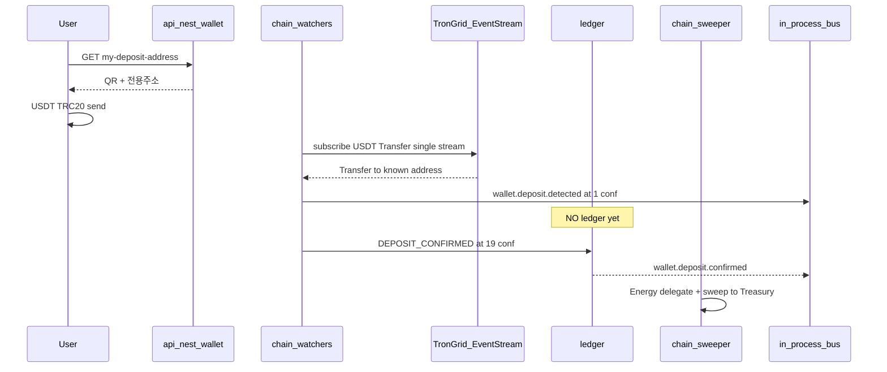

# AI Profit OS — Money & Chain (v7.22.37 · Owns 본문 + 실측감사 흡수)

> 분리 플랜 — Index: `ai_profit_os_00_index_a1b2c3d4.plan.md` · ARCHIVE: `ai_profit_os_launch_54c1261e.plan.md` · 착수전: `docs/CONSTITUTION_BOOTSTRAP.md`

> **제로 목표:** 오류0 · 결함0 · 오차0 · 중복0  
> **퍼뜩(AI) Fact:** 버킷·입금·출금·레퍼럴·practice + depositPref · **principalUsdt** (§49.2a) · §47.12~15 FactTool loaders (머니 엔진 비파괴 · Coach=read-only)  
> **유저 네트워크 카피:** §41.6 · 가이드 UI=§38.8 pointer  
> **KRW Day-1:** Admin **승인/거절** · CSV Auto-Recon=**L2+만** (ARCHIVE/구문구·규칙 drift 무시)  
> **todo 순서 (Grok-4.5|256K · 위→아래 · 한 채팅=한 todo):** preflight(완료) → 원장 → fee/holding → USDT+KRW지갑 → KYC → 출금auth/intent → watchers → sweeper → 출금UI → 남용방어 → suggest → 네트워크카피 → 초대 → practice  
> **모델 잠금 (본 파일):** 전 todo = **`[grok-4.5|256K]`만** (256K 한도 안 파트 분할 · composer 슬라이스 접두사 **금지**)  
> **구현 경로 잠금:** `services/api-nest` 모듈(`ledger`/`wallet`/`compliance`) · `workers/chain-*` · **`services/wallet-service` 폴더 생성 금지**  
> **버스 잠금:** Phase0 = **in-process** · NATS 문자열=Phase1+ 동등 이벤트 · Day-1 NATS 필수 **0**  
> **체인 Phase:** 코드 Owns=Money · **deploy/활성=Phase1+** (Phase0 workers = `push-dispatcher` only · BOOTSTRAP §0)  
> **v7.22.21~28:** pointer 유지 (CTA/표현 Owns≠Money)  
> **v7.22.37:** 실측감사( DB41·mig10·함수4·Admin routes·스키마·헌법) · Admin 계약 전수 · todo 재분할 · 모순 흡수  
> **v7.22.38 CLOSE(불변):** todos 1~15 **completed 유지 · 재실행 금지**.  
> **v7.22.39 (Pre-UI Runtime Gate 가산 · pointer=Engine §0.9):** `money-user-benefits-read` 1건 REOPEN · §51.8a 컨트롤러 공백(providers만·controllers 0)만 채움 · accrual/ledger 로직 **불변** · 선행=Engine `engine-execute-rule-loop` · **File-Serial 예외 1건**(Index「플랜 직렬 완료 규칙」참조 · 이 재오픈이 02 Engine 착수를 재차단하지 않음) · 새 병렬 플랜 파일 생성 금지(중복0 · 흡수원=구 `pre-ui_engine_gate_8f59a783.plan.md` 홈 미러 단독본)

---

## 0. 착수 전 실물 대조 기록 (v7.22.37 · 예측 0 · MCP+FS)

> **Owns:** 본 절 = Money 착수 게이트 기록. 구현 todo는 `money-double-entry`부터.  
> **검증일:** 2026-08-09 · Supabase MCP `list_tables`/`list_migrations`/`execute_sql` + 레포 FS.

### 0.1 읽기 순서 (한 채팅 시작 시 · 이 표만)

| 순 | 문서/경로 | 목적 |
|----|-----------|------|
| 1 | `docs/CONSTITUTION_BOOTSTRAP.md` §0·§1·§6·§7·§9 | 실물·Admin IA·모델·다음 todo |
| 2 | `CONSTITUTION/17` · `41` · `42` · `43` · `49` · `51_REFERRAL_*` · `37` · `39` | Money Owns/Forbidden |
| 3 | **본 플랜** 해당 todo 절만 | 구현 SSOT |
| 4 | `schemas/*.v1.json` (해당) + `supabase/migrations/*` | 계약·DDL |
| 5 | `apps/admin/routes.ts` + Admin §9.1.1 | Admin 화면 Owns≠Money · **API 계약은 Money** |
| 6 | `.cursor/rules/money-ledger.mdc` · `pg-gateway-ban.mdc` | 에이전트 가드 |

**금지:** launch ARCHIVE를 착수 SSOT · Engine/UI 플랜 전문 대량 로드 · 사진 목업.

### 0.2 실측 스냅샷 (오차0)

| 대상 | 실측 | Money 함의 |
|------|------|------------|
| Supabase ref | `mgsytcetsiecllmhcyox` · Seoul · PG17.6 | 원격 only (Docker OFF) |
| `public` 테이블 | **41** · RLS ON | ledger/wallet/kyc/referral 표 존재 · Nest service_role |
| migrations applied | **10** · 끝=`20260808224856_auth_oauth_passkey_stage_a_b` | 로컬 파일명 1:1 · Dashboard DDL 0 |
| public 함수 | `ledger_require_posting_flag` · `ledger_forbid_mutation` · `provision_user_bucket_accounts` · `users_stage_a_identity_ok` | **posting RPC 아직 0** → `money-double-entry`가 Nest TX+flag로 구현 |
| ledger seed | system accounts **7** rows | 유저 버킷은 signup 시 provision |
| `services/` | `api-nest` · `engine-rust` · `marketing-attribution` | **wallet-service 디렉터리 없음** → Nest 모듈 |
| `workers/chain-*` | Phase1+ **stub** (`phase=1`) | Money가 구현 · Phase1 deploy |
| `apps/admin/**` | 12모듈 shell only (탭 UI deep 미구현) | Money=Admin **API·분개·이벤트 계약** · UI deep=Admin todos |
| Auth | Nest JWT · Supabase Auth **0** | KYC/출금 step-up도 Nest |
| Engine | `settlement_rule.rs` skeleton SafeStop | settlement 금액 Owns=Engine Rule · Money=분개만 |
| PG사 | 코드경로 0 · Day-1 KRW=Admin 승인/거절 | `pg-gateway-ban` Auto-Recon 문구 **교정됨**(구 drift) |

### 0.3 v7.22.37에서 흡수한 모순·보완 (완료)

| # | 발견(실측) | 흡수 |
|---|------------|------|
| M1 | 플랜/시퀀스 `wallet-service` · FS에 폴더 0 | → `services/api-nest` 모듈 잠금 · §49.12 트리 수정 |
| M2 | §43.2 `NATS financial` · Phase0=in-process | → Phase0 in-process emit · NATS=Phase1+ 표기 |
| M3 | `.cursor/rules/pg-gateway-ban.mdc` “원화 Auto-Recon only” | → Day-1=Admin 승인/거절 · CSV=L2+ (헌법§41과 일치) |
| M4 | Money §42.3 `compliance?tab=kyc` · `ADMIN_CHILD_ROUTES` 누락 | → Admin routes + verify:admin-routes + Admin §9.1.1 흡수 |
| M5 | §11.1/11.2 키 중 `krwWithdrawFeeKrw`·`minHoldingHours` 스키마 공백 | → `schemas/deposit-config.v1.json` 필드 잠금 |
| M6 | todo에 `composer-2.5` 혼재 · 거대 슬라이스 | → 전 todo `grok-4.5\|256K` · 의존 파트 분할 |
| M7 | §43.4 participate pricing가 Money 실행 본문에 혼재 | → **Engine Owns pointer** (Money 구현 todo 범위 0) |
| M8 | Admin shell만 있고 Money Admin 계약 표 부재 | → **§0.4 Money→Admin 계약 전수** |

### 0.4 Money→Admin 계약 전수 (UI Owns=Admin · API/원장 Owns=Money)

> 실물: `apps/admin/routes.ts` + Admin 플랜 §9.1/§9.1.1/§37/§39.  
> Money todo는 아래 **API·분개·이벤트·스키마**를 제공해야 Admin deep이 막히지 않음.

| Admin surface (실route) | Money 제공 계약 | Money todo |
|-------------------------|-----------------|------------|
| `/admin/wallet?tab=deposit-settings` | `deposit-config.v1` CRUD · fee/minHolding/TRX stake/sweeper pause · audit | `money-fee-min-holding` · `chain-sweeper` |
| `/admin/wallet?tab=review` | 고액출금·USDT예외 큐 read + decide hooks | `money-withdraw-auth-intent` · `principal-profit-withdraw` |
| `/admin/wallet?tab=krw-pending` | `POST .../krw-deposits/:id/approve\|reject` · ledger credit 1회 · toast keys | `money-wallet-usdt-krw` |
| `/admin/wallet?tab=disputes` | wrong-chain/오입금 티켓 링크·결정 audit · §51.11 | `deposit-network-plain-ko` (+ Admin CS UI) |
| `/admin/ledger` · `?userId=` | journals/entries 조회 · recon mismatch | `money-double-entry` |
| `/admin/reports/financial` | 일/월 집계 소스=ledger only | `money-double-entry` |
| `/admin/users/:id/finance` · `?tab=buckets` | buckets + 입출금 mode 이력 + 순유입 KPI 소스 | `principal-profit-withdraw` · `practice-bucket-onboarding` |
| `/admin/users/:id` (§9.8.3 조정) | admin_adjust 분개 · 버킷 지정 필수 · reason≥10 | `money-double-entry` |
| `/admin/users/:id` (§9.8.4a) | `withdrawApplyBlocked` 가드#1 | `money-withdraw-auth-intent` |
| `/admin/users/:id` (§9.8.10E PIN/WebAuthn) | verifier wipe · credential revoke (평문 0) | `money-withdraw-auth-intent` |
| `/admin/compliance?tab=kyc` | KYC approve/reject · R2 signed URL ≤5m · push | `kyc-withdraw-gate` |
| `/admin/risk?tab=queue` | §49.9 P* 룰 신호 · freeze 연동 | `principal-profit-abuse-defense` |
| `/admin/growth?tab=referral` | Pool top-up · rewardsEnabled · clawback · **인원캡 UI 0** | `referral-program-ssot` |
| `/admin/support?tab=queue` | deposit/withdraw category · ledger 직접조정 **0** | pointer §51.6 (UI=Admin) |

**Admin sidebar 13번째 모듈 추가 금지.** 신규는 **자식 tab만**.

### 0.5 CLOSE 재검증 (v7.22.38 · 2026-08-09 · 예측0)

> **Owns:** Money 플랜 종료 게이트. todos **15/15 completed · pending 0**.  
> **실측:** Supabase MCP `list_tables`/`list_migrations`/`execute_sql` + FS + `pnpm verify:*` 전수.

| 대상 | 종료 실측 | 판정 |
|------|-----------|------|
| Supabase ref | `mgsytcetsiecllmhcyox` · Seoul | ✅ |
| `public` 테이블 | **58** · RLS ON | ✅ (+deposit_disputes·referral_payout_queue·risk·practice·stepup 등) |
| migrations applied | **18** · 로컬 파일명 **버전 1:1** · 끝=`20260809010858_referral_pool_fifo_clawback` | ✅ (누락 2건 `deposit_disputes`·`referral_pool_fifo_clawback` 본 턴 apply) |
| public 함수 | 동일 4 · posting RPC **0** (Nest TX + `app.ledger_posting`) | ✅ |
| system ledger accounts | **7** | ✅ |
| `services/` | `api-nest`{ledger,wallet,compliance,risk,referral} · **wallet-service 0** | ✅ |
| `workers/chain-*` | 구현 · Phase0 Nest in-process · Phase1 deploy | ✅ |
| Admin routes | §0.4 계약 surface 전수 `ADMIN_CHILD_ROUTES` | ✅ |
| PG사 | `verify:pg-module-scan` PASS · Day-1≠Auto-Recon | ✅ |
| Money verify | bucket/fee/holding/krw/kyc×3/webauthn/deposit×2/sweeper/withdraw×2/abuse/suggest/plain-ko/referral×6/practice/email/admin-routes **전수 PASS** | ✅ |

**CLOSE 판정:** Money = **CLOSED** · File-Serial 다음 = **02 Engine**. completed Money todo 재실행 **금지**.

## 11. Money / Double-Entry (금융급, 오차0)

### 절대 금지
- `user.balance += 100` (DB column 직접 UPDATE)

### Admin 잔액 조정 (§37 — 허용)
- **반드시** double-entry ledger 분개 + `ledger_entry_id` trace
- Ops Pool ↔ User · audit + reason≥10

### USDT + KRW 표시
- **Ledger truth:** USDT only
- **KRW:** `fx_snapshot_id` projection for display (오차0: snapshot at render time)
- 모든 UI 금액은 `ledger_entry_id` 또는 `opportunity_id`로 trace 가능

### 분개 (동일)
- Participate: Debit User USDT / Credit Opportunity Pool Liability
- Payout: Debit Pool / Credit User Reward
- Promo: Debit Promo Pool / Credit User (Growth only)
- **Admin adjust:** Debit/Credit Ops Adjustment Pool ↔ User (§37)

### 버킷 분개 (§49 — 오차0 · 중복 정의 금지)

| 이벤트 | principal | profit | locked | practice |
|--------|-----------|--------|--------|----------|
| 입금 confirmed | **+** | — | — | — |
| participate lock | **−** | — | **+** | — |
| safe_stop / cancel unlock | **+** | — | **−** | — |
| settlement.completed (유저 몫) | — | **+** | **−**(원금복귀+) | — |
| 수익 출금 | — | **−** | — | — |
| 원금 출금 | **−** | — | — | — |
| 수익→원금 merge | **+** | **−** | — | — |
| 체험 지급 | — | — | — | **+** |
| 연습 출금/참여 | **금지** | **금지** | — | 소멸/만료만 |

**불변식 (CI `verify:bucket-invariant`):**  
`principal + profit + locked + practice = user_usdt_liability`  
`profit ≤ Σsettlement_user − Σprofit_withdraw − Σmerge_to_principal`  
`practice`는 withdraw/participate 경로 **진입 금지**

**settlement 시 원금:** locked에서 `requiredCapital`은 principal로 복귀, 유저 마진만 profit 증가 (플랫폼 마진은 Ops 수익 계정 — 유저 profit 금지)

### 11.1 USDT 출금 네트워크 수수료 (오차0)

| 항목 | 잠금 |
|------|------|
| 설정 키 | `deposit-config.usdtOnchain.usdtWithdrawNetworkFeeUsdt` (Admin §37 deposit-settings) |
| Day-1 기본 | **1 USDT** (고정 견적 · 실가스 변동은 Ops가 흡수하거나 Admin 갱신) |
| 차감 버킷 | 출금 `mode`와 동일 (profit → profit, principal → principal, combined → 명세 분리) |
| 분개 | Debit User (해당 버킷) / Credit `SYS:FEE_REVENUE` · `withdrawFeeUsdt` 필드 |
| UX | 출금 확인 전 **「이체 수수료 {n} USDT」** 필수 표시 · 숨김 금지 |
| 원화 출금 | `deposit-config.krw.krwWithdrawFeeKrw` (기본 **0**) · Admin 설정 |

**CI:** `verify:withdraw-fee-ledger` — fee 미표시·미분개 Fail

### 11.2 min holding (A2 wash · 오차0)

| 항목 | 잠금 |
|------|------|
| 설정 키 | `deposit-config.withdrawGuards.minHoldingHours` · Day-1 **24** · Admin deposit-settings 변경+audit |
| 적용 | **원금**이 포함된 출금 (`principal` \| `combined`의 principal 분) |
| 기산 | 해당 principal을 만든 **입금 confirmedAt** 기준 (FIFO) |
| **미적용** | `mode=profit` 순수 수익 출금 · merge |
| UX | 미충족 시 toast `MIN_HOLDING` · 남은 시간 ko · 원금 출금만 차단 |
| 별칭 금지 | 구호칭 `compliance.minHoldingHours` 문자열 = **본 키로 승계** (이중 설정 테이블 0) |

**CI:** `verify:min-holding-scope` — profit-only 출금은 24h 내에도 200

---

## 41. USDT 온체인 자동입금 + 원화 PG-free (v7.8 · §43 결함 수정 반영)

> **SSOT:** `CONSTITUTION/41_ONCHAIN_USDT_AND_KRW_DEPOSIT.md` + `43_CHAIN_SETTLEMENT_HARDENING.md`  
> **원칙:** **PG사(결제대행) 0** · 유저별 TRC20 · **이벤트 스트림** · **1conf UI / 19conf ledger** · **per-address 폴링 금지**  
> **유저 확정 (v7.22.5):** 결제대행 연동 **없이** 구현 · ADR-014와 동일 잠금

### 41.0 용어 잠금 (오차0 · Postgres ≠ PG사)

| 표기 | 의미 | 상태 |
|------|------|------|
| **PostgreSQL / Postgres / ADR-001 PG** | Ledger+AI **단일 DB** | ✅ **필수** |
| **PG 0 / PG-free / PG사 0** | **결제대행(Payment Gateway) 연동 0** | ✅ **필수(금지=연동)** |
| Toss · Nice · KG Inicis · PortOne · iamport · Stripe Checkout · PayPal · 국내카드 PG | wallet/deposit/withdraw path SDK·webhook·모듈 | ❌ **영구 배제** |

**입금 SSOT (이 둘만):**
1. **USDT TRC20** — 유저별 주소 · chain-watchers · 1conf UI / 19conf ledger  
2. **원화** — 입금신청 → 운영자 **통장 확인 후 [승인]/[거절]** → 승인 시 USDT credit (**Day-1**) · **PG사 0** · **CSV 업로드 Day-1 필수 아님**

**CI:** `verify:pg-module-scan` = **결제대행** import/SDK **0** (PostgreSQL 드라이버 금지 아님)

### 41.1 아키텍처 (v7.8)



| 금지 (v7.7 결함) | 필수 (v7.8) |
|------------------|------------|
| 주소별 100ms 폴링 | USDT 컨트랙트 Transfer **단일 스트림** + 로컬 address Set 매칭 |
| 1conf 즉시 ledger | **1conf = UI만**, **19conf = Double-Entry** |
| 집금 미설계 | `workers/chain-sweeper` Energy delegation |
| 원화 CSV 필수 / 전량 자동매칭 Day-1 | **Admin [승인]/[거절]** Day-1 · CSV는 선택(L2+) |

상세 규격·무료 범위·반대의견 → **§43**

### 41.2 유저별 TRC20 주소 발급

- HD path `m/44'/195'/0'/0/{index}` · xprv secrets only
- 유저당 1주소 · `tx_hash` UNIQUE · dust filter
- 재발급 Admin + audit · 구주소 grace sweep

### 41.3 원화 PG-free · Admin 승인/거절 (Day-1 SSOT · §43.3)

> **유저 결정 흡수 (v7.22.12):** CSV 일괄 업로드보다 **운영자가 통장 확인 후 승인/거절**이 Day-1.  
> CSV Auto-Recon = **나중 옵션(L2+)** · Day-1 필수·기본 경로 **아님**.

```
유저 신청(금액·입금자명) → payableAmountKrw(+고유 끝자리) · status=pending
 → 유저가 대표계좌로 송금
 → Admin `/admin/wallet?tab=krw-pending` (또는 TOP1 검수함)
      · 은행 앱/통장에서 입금 실수령 확인
      · [승인] → FX snapshot으로 USDT credit · toast/push KRW_DEPOSIT_APPROVED · 내역 approved
      · [거절] reason≥10 → toast/push KRW_DEPOSIT_REJECTED · 내역 rejected · 잔액 변동 0
 → TTL 만료 → expired (재신청)
```

| 버튼 | 원장 | 유저 |
|------|------|------|
| **승인** | Debit Ops KRW Pool / Credit User USDT (신청 반영액·snapshot) · audit `admin.krw_deposit.approved` | 잔액+ · 내역 ✅ · 토스트 |
| **거절** | 분개 **0** · audit `admin.krw_deposit.rejected` | 내역 ❌ · 토스트/알림 · 재신청 가능 |

**고유 금액(`payableAmountKrw`):** 운영자가 통장에서 **어느 신청인지** 찾기 쉽게 유지 (자동매칭 엔진 Day-1 필수 아님).  
**금지:** 카드/간편결제/PG 결제창 · virtual account PG API · “PG 붙이면 편하다” 재제안 · Day-1 CSV 필수화

### 41.4 Ledger 분개 (오차0)

| 이벤트 | 분개 |
|--------|------|
| USDT `DEPOSIT_CONFIRMED` (19conf) | Debit Treasury On-chain / Credit User |
| USDT `DEPOSIT_DETECTED` (1conf) | **분개 없음** (pending observation only) |
| KRW Admin **승인** | Debit Ops KRW Pool / Credit User |
| KRW Admin **거절** | 분개 없음 |
| Sweep to Treasury | internal treasury move (user credit 불변) |

### 41.5 CI

- `verify:no-per-address-poll` — poller 코드경로 0
- `verify:deposit-confirm-stages` — 1conf no ledger / 19conf credit
- `verify:tron-deposit-idempotent` — tx_hash 2x → 1 credit
- `verify:krw-unique-amount` — collision 0 + expiry
- `verify:pg-module-scan` — wallet path **결제대행(PG사)** import/SDK **0** (Postgres 허용)
- `verify:deposit-network-plain-ko` — §41.6 경고 문구 입금 USDT 탭 100% · `TRC20` 렌더 0

### 41.6 입금 네트워크 한글 경고 (유저 surface · v7.22.10)

> **owns:** 경고 문장·ledger 네트워크 코드 매핑 · **가이드 장문=UI §38.8**  
> **코드/워처:** TRC20(Tron) only · **화면 노출 문자열에 TRC20 금지** (§27.4)

**고정 카피 (`T.wallet.networkWarning` — 입금 USDT 탭·주소 QR 위 필수):**
> ⚠️ 이 주소는 **테더(USDT) · 트론 네트워크** 로만 보내 주세요.  
> 다른 네트워크로 보내면 찾을 수 없을 수 있어요.  
> [자세히] → `/me/guide/get-usdt` · [잘못 보냈어요] → `/me/support` (§51.11)

**출금 확인에도 동일 네트워크 이름(트론) 표기.**  
**Admin/로그:** `network=TRC20` 코드 허용 · 유저 UI 금지.

---

## 42. 출금 KYC 1회 게이트 — Lux 금융 UX + 자동 이동 (v7.22.11)

> **SSOT:** `CONSTITUTION/42_KYC_WITHDRAW_ONE_TIME_GATE.md` · §5.8 · §8.2 · `/me/kyc`  
> **원칙:** **출금할 때만** 1회 · 거래/입금 **KYC 불필요** · toast 이모지 → **자동 /me/kyc**  
> **중복0:** 화면 wire=UI §6.4d Canon `kyc-*` · 프로필 Stage B=Infra §51.9.1 · 본 절=상태·서류·스키마·게이트

### 42.1 상태 머신

```typescript
type KycStatus = 'none' | 'pending' | 'approved' | 'rejected';

// compliance-service
function assertWithdrawKyc(user: User) {
  if (user.kycStatus !== 'approved') throw problem('KYC_WITHDRAW_REQUIRED');
}
// participate — NO kyc check
```

| 액션 | KYC 필요 |
|------|----------|
| 입금 (USDT/원화) | ❌ |
| 거래 participate | ❌ |
| practice / 온보딩 데모 | ❌ |
| **출금 (USDT/원화)** | ✅ **1회 approved** (+ Infra Stage B 완료) |

### 42.2 유저 UX 플로우

```
/wallet/withdraw/* 진입 또는 [출금하기] 탭
  → profile Stage B incomplete → /auth/complete-profile?return=… (Infra §51.9.1)
  → kycStatus === 'none' | 'rejected'
      toast(KYC_WITHDRAW_REQUIRED)  // 🔐 ... 1번만 ... 😊
      setTimeout(() => router.push('/me/kyc?return=/wallet/withdraw'), 800)
  → kycStatus === 'pending'
      toast(KYC_PENDING) + inline "검토 중" (출금 폼 hide)
  → kycStatus === 'approved'
      출금 폼 정상 · **다시 KYC 요청 없음**
```

### 42.2.0 `/me/kyc` Lux 3-step IA (규칙 SSOT · wire=UI Canon)

| Step | Canon | 내용 |
|------|-------|------|
| 1 guide | `kyc-guide` | 왜 1번만 · 보관 안내 · 진행 3칸 |
| 2 doc | `kyc-doc-capture` | `idDocType` ∈ {`kr_id`,`driver`,`passport`} · 프레임 촬영/업로드 · 재촬영 |
| 3 confirm | `kyc-confirm` | legalName · phone(prefill) · birthDate · selfie optional(tier-2) · 제출 |

**금지:** 주민등록번호 **타이핑 필드** · 주소 Day-1 필수 · 공개 R2 URL · 성별 필드 · 이모지 스팸(토스트 이모지 1~2는 §8.2 허용)

### 42.2.1 KYC 서류 저장 SoT (결함0)

| 항목 | 잠금 |
|------|------|
| 스토리지 | **Cloudflare R2** 버킷 `kyc-docs` (서버 사이드만 · 유저 직접 URL 0) |
| 객체 키 | `kyc/{userId}/{submissionId}/{hash}.enc` · at-rest encryption |
| 메타 | PG `kyc_submissions` (status · r2_key · created_at) — 바이너리 PG 금지 |
| 열람 | Admin **준법(compliance)·최고** RBAC only · signed URL TTL ≤5m |
| 보존 | 계정 활성 중 + 탈퇴 후 **법정 최소(기본 5년 설정 키)** · 만료 cron+audit |
| 금지 | 로컬 디스크 영구 저장 · Git · 공개 버킷 · CS 역할 원본 다운로드 |

**CI:** `verify:kyc-r2-only` — apps/web에 R2 public URL 하드코딩 0

### 42.2.2 `schemas/kyc-submission.v1.json` (필드 잠금)

```typescript
interface KycSubmissionV1 {
  submissionId: string;
  userId: string;
  legalName: string;
  phoneE164: string;
  birthDate: string; // YYYY-MM-DD · 만19+
  idDocType: 'kr_id' | 'driver' | 'passport';
  idDocR2Key: string;
  selfieR2Key?: string; // tier-2
  status: KycStatus;
  rejectReason?: string; // ≥10 on reject
  createdAt: string;
  decidedAt?: string;
}
// NEVER: rrnFull · gender · publicUrl
```

### 42.3 Admin (`/admin/compliance?tab=kyc` · §9.1.1 자식 · sidebar 13 금지)

| 컬럼 | 액션 |
|------|------|
| 유저 · 신청일 · 서류 썸네일 | [승인] [거절] reason≥10 |
| 승인 | `kycStatus=approved` · push `KYC_APPROVED` · audit |
| 거절 | `rejected` · 유저 재신청 가능 |

**계약:** Money=`kyc-withdraw-gate`가 approve/reject API+R2 signed URL · Admin=`admin-ops`/compliance deep이 탭 UI.  
**routes:** `apps/admin/routes.ts` `ADMIN_CHILD_ROUTES`에 `/admin/compliance?tab=kyc` **필수** (`verify:admin-routes`).

### 42.4 Copy (`packages/ui/copy/ko/kyc.ts`)

```typescript
export const kyc = {
  withdrawRequired: '🔐 출금하려면 본인 확인이 필요해요! 1번만 하면 돼요 😊',
  pending: '⏳ 본인 확인을 검토 중이에요. 잠시만 기다려 주세요 🙏',
  approved: '✅ 본인 확인 완료! 이제 출금할 수 있어요 🎉',
  rejected: '😔 확인이 어려워요. 다시 신청해 주세요',
  pageTitle: '🪪 본인 확인',
  pageSubtitle: '출금할 때 한 번만 하면 돼요',
  whyOnce: '출금 안전을 위해 한 번만 확인해요',
  storagePlain: '서류는 안전하게 보관되며 외부에 공개되지 않아요',
};
```

### 42.5 API

```typescript
GET  /api/v1/compliance/kyc/status
POST /api/v1/compliance/kyc/submit        // multipart · KycSubmissionV1
POST /admin/compliance/kyc/:userId/approve
POST /admin/compliance/kyc/:userId/reject
```

### 42.6 CI · 출시

- `verify:kyc-withdraw-only` — participate **without** kyc 200 · withdraw **403** KYC_WITHDRAW_REQUIRED
- `verify:kyc-redirect` — withdraw tap → toast → `/me/kyc` within 1s
- `verify:kyc-surfaces` — Canon 3면 + RRN 필드 0 (UI)
- `verify:kyc-r2-only`
- [ ] approved user — second withdraw **no kyc prompt**
- [ ] rejected — resubmit flow E2E

---

## 43. Chain / Settlement / Auth Hardening (v7.8) — 무료 범위 우선

> **SSOT:** `CONSTITUTION/43_CHAIN_SETTLEMENT_HARDENING.md`  
> **목표:** v7.7의 온체인·원화·가격·원장·WebAuthn 결함을 **무료 구현 가능 범위**에서 제거  
> **유료 RPC(Chainstack/QuickNode)는 Optional Upgrade** — Day-1 필수 아님

### 43.0 아키텍트 의견 (동의 / 반대 / 보강)

| 피드백 | 판정 | 메모 |
|--------|------|------|
| TronGrid 15QPS + 주소별 100ms 폴링 마비 | **전면 동의** | 기존 플랜의 `chainWatcherPollMs=100`은 **폐기**. 치명적 결함 |
| gRPC/WS 단일 Transfer 스트림 / Block Indexer | **동의 (무료 경로)** | Day-1 = TronGrid **USDT 컨트랙트 이벤트 스트림** + 로컬 address Set 매칭 + rate-limit budgeter |
| Chainstack/QuickNode 필수화 | **반대 (무료 범위)** | L2 paid upgrade로만 문서화. 무료 티어로도 단일 스트림이면 수백~수천 주소 가능 |
| 1conf UI / 19conf ledger | **전면 동의** | “≤0.1s ledger credit” SLA **폐기**. UI 알림은 빠를 수 있으나 원장은 ~1분 확정 |
| Energy Delegation sweeper | **동의** | SaaS 비용 0으로 구현 가능. 단 **Treasury에 스테이킹용 TRX 자본** 필요(수수료 SaaS≠0원 자본). “가스비 완전 무료” 과장 금지 |
| 원화 Day-1 = Admin 승인/거절 | **동의 (v7.22.12)** | CSV 필수화 폐기. 고유금액은 운영 식별용. CSV matcher=L2+ 옵션 |
| minProfitUsdt + version soft match | **동의** | 추가로 **platform maxSlippageUsdt** 가드(유저·플랫폼 양방향) |
| staleAt > 3s 차단 | **동의** | Admin configurable, default 3s |
| FOR UPDATE account_id ASC | **전면 동의** | 전 분개 경로 강제 |
| idempotency_key UNIQUE | **전면 동의** | participate/settle/deposit/withdraw 전 경로 |
| WebAuthn only 락아웃 | **동의** | **무료 fallback = Email OTP + encrypted PIN + recovery codes**. SMS는 유료라 Day-1 비필수 |

### 43.1 온체인 입금 — Event Stream (무료)

**금지:** `for (addr of users) poll every 100ms`

**필수 구현 (Free):**
```
workers/chain-watchers
  ├── usdt-trc20-event-stream.ts   # TronGrid WS/gRPC or events API on USDT contract
  ├── address-index.ts             # Redis/Postgres Set: depositAddress → userId
  ├── confirmation-tracker.ts      # 1 → DETECTED, 19 → CONFIRMED
  └── rate-limit-budgeter.ts       # QPS/일일 쿼터 보호 · backoff · circuit
```

**확정 단계:**
1. `DEPOSIT_DETECTED` (1 conf) — pending observation · **ledger 분개 없음** · UI toast만
2. `DEPOSIT_CONFIRMED` (19 conf ≈ 19*3s) — Double-Entry credit · spendable balance
3. Re-org로 DETECTED 무효화 가능 · CONFIRMED만 출금/거래 가능 잔액

**Optional L2 (유료, 나중에):** Chainstack/QuickNode 전용 indexer · multi-region failover

### 43.2 chain-sweeper + Energy Delegation (무료 API + TRX 자본)

```
workers/chain-sweeper
  1) CONFIRMED deposit after grace
  2) Treasury DelegateResource(Energy) → userDepositAddress
  3) USDT Transfer → treasuryHotWallet
  4) Undelegate / recycle energy
  5) Phase0 in-process emit: wallet.sweep.completed (user balance unchanged)
     Phase1+ 동등: NATS financial subject (Day-1 필수 0)
```

**가드:** DETECTED 단계 sweep 금지 · min sweep amount · sweeper keys HSM/secrets · Admin pause (`deposit-settings`)

#### 43.2.1 Treasury TRX stake 모니터링 (오류0)

| 항목 | 잠금 |
|------|------|
| 설정 | `usdtOnchain.minTrxStakeForSweeper` · Day-1 기본 **5000 TRX** |
| 헬스 | sweeper cron이 Treasury TRX 잔액 조회 · `< min` → **sweeper PAUSE** + Admin 🔴 알림 |
| 유저 | 입금 credit(19conf)는 **유지** · 집금만 지연 (잔액 사용 가능) |
| 복구 | TRX 충전 후 Admin [집금 재개] · audit |
| 과장 금지 | “가스비 완전 무료” UI/카피 **0** |

**CI:** `verify:sweeper-trx-guard` — min 미달 시 sweep 호출 0

### 43.3 원화 입금 운영 (무료) — **Day-1 = Admin 승인/거절 (v7.22.12)**

**Day-1 (잠금):**
1. 신청 시 `payableAmountKrw = requested + uniqueSuffix` **active UNIQUE** (통장 대조 편의)
2. TTL **120분** → `expired`
3. Admin **은행 앱/통장으로 실입금 확인** 후 `/admin/wallet?tab=krw-pending`에서 **[승인]** 또는 **[거절] reason≥10**
4. 승인 → ledger USDT credit + 유저 toast/push + `/wallet`·내역 상태 `approved`
5. 거절 → 잔액 0변화 + 유저 toast/push + 내역 `rejected` (재신청 OK)
6. API: `POST /admin/wallet/krw-deposits/:id/approve` · `.../reject` · idempotency_key

**L2+ 옵션 (비필수):** CSV/`krw-csv` matcher · 은행 OpenAPI — Day-1 게이트·온보딩·카피에 **등장 금지**

**오차0:** Day-1 “자동” = **승인 버튼 한 번에 잔액 반영**(재계산·이중 credit 0). CSV 없음을 결함으로 보지 않음.  
**CI:** `verify:krw-admin-decide` — approve→credit 1회 · reject→credit 0 · 유저 상태/토스트 키 존재

### 43.4 Pricing / Slippage (**pointer · Engine Owns**)

> **중복0:** `minProfitUsdt` · staleAt · slippage · participate 가드 = **Engine** (`ai_profit_os_02_engine_*.plan.md` · §0.0.4/§48) + Admin §36.  
> Money 본 파일은 `deposit-config.pricingGuards` 키 **저장만** 허용 · Money todo에서 participate Rule **구현 금지**.

### 43.5 PostgreSQL Ledger Concurrency

모든 분개 트랜잭션:
1. 관련 `account_id` 목록 수집
2. `ORDER BY account_id ASC` 후 `SELECT ... FOR UPDATE`
3. journal insert (immutable)
4. projection update
5. 요청 헤더/바디 `idempotency_key` **UNIQUE** — 재시도 시 동일 결과 반환 (dup silent success)

Deadlock drill CI: 교차 참여/정산 동시 부하 → `40P01` **0**

### 43.6 WebAuthn Fallback (무료) — **정책 Owns=Money**

> **중복0:** step-up **우선순위·OTP·PIN·recovery·Resend·challenge TTL** = **본 절 Owns**.  
> PWA §23.6 = 브라우저/RP ID/`@simplewebauthn` UX only · OTP 정책 재정의 **금지**.

출금 step-up 인증 우선순위:
1. WebAuthn / Passkey (primary)
2. Email OTP — **Day-1 SMTP SSOT = Resend free tier** (`RESEND_API_KEY` · CF/Nest secrets) · from 도메인 검증 필수
3. Encrypted PIN (서버는 verifier만, rate-limited)
4. Recovery codes (1회용)

**가입 magic link:** 동일 Resend 경로 (`/auth/magic-link`) · ADR-006  
**SMS OTP:** 유료 → Optional L2. Day-1 필수 아님.  
기기 분실: Email+PIN+recovery로 락아웃 해제 · KYC 재확인 옵션  
**스키마:** `webauthn-challenge.v1` (및 관련) · Nest challenge TTL 60s · origin allowlist=`APP_HOST`  
**CI:** `verify:email-provider-resend` · `verify:webauthn-fallback-pointer` (PWA Owns 침범 0)

#### 43.6a Admin 출금 PIN · WebAuthn 초기화 (pointer · v7.22.24)

> **중복0:** **UI·RBAC·audit 버튼 = Admin §9.8.10E** · **PIN/WebAuthn 저장·검증·rate limit = 본 절(§43.6)**  
> Admin은 **verifier wipe / 재등록 유도 / credential revoke**만 · **평문 PIN 조회·전달 금지** · 잔액·ledger 불변.

| Admin 액션 | Money 효과 |
|------------|------------|
| 출금 PIN 초기화 | PIN verifier 삭제 · 다음 withdraw step-up에서 PIN 재설정 강제 |
| 패스키 해제 | 해당 user WebAuthn credentials revoke · OTP/PIN fallback 유지 |
| 금지 | Admin이 새 PIN을 알고 로그인 대행 · recovery codes 일괄 노출(최고만·audit·1회 표시) |

**CI:** `verify:admin-user-credentials` (Money fixture: wipe 후 withdraw→PIN_REQUIRED)

### 43.7 헌법 / 이벤트 추가

`CONSTITUTION/43_CHAIN_SETTLEMENT_HARDENING.md` 잠금 조항:
1. Per-address high-frequency polling **금지**
2. Ledger credit before N confirmations **금지**
3. Sweep before CONFIRMED **금지**
4. Participate must accept `minProfitUsdt`
5. All money TX require `idempotency_key` + ordered locks
6. Withdraw step-up must have non-WebAuthn fallback
7. Paid RPC는 upgrade이지 dependency 아님

Financial events 추가:
- `wallet.deposit.detected`
- `wallet.deposit.confirmed`
- `wallet.deposit.reorg_voided`
- `wallet.sweep.completed`
- `wallet.krw_deposit.pending`
- `wallet.krw_deposit.approved`
- `wallet.krw_deposit.rejected`
- `wallet.krw_deposit.expired`
- *(L2+)* `wallet.krw_deposit.matched` — CSV 경로 전용

### 43.8 무료 범위 요약

| 항목 | $0 구현 | 필요 자본/옵션 |
|------|---------|----------------|
| Event stream watcher | ✅ TronGrid free | optional API key |
| 19conf ledger | ✅ | — |
| Sweeper + Energy delegate | ✅ 코드 | Treasury **TRX stake** |
| KRW Admin 승인/거절 | ✅ | 은행 앱 육안 확인 |
| KRW unique amount | ✅ | 운영 대조 편의 |
| KRW CSV matcher | ❌ Day-1 | L2+ 옵션 |
| minProfit / staleAt | ✅ | — |
| Lock order + idempotency | ✅ | — |
| Email OTP + PIN fallback | ✅ | SMTP/free mail |
| Chainstack/QuickNode | ❌ Day-1 제외 | L2 paid |
| SMS OTP | ❌ Day-1 제외 | L2 paid |

---

## 49. 원금 유지 · 수익 출금 · 버킷 원장 (v7.19) — 오류0·오차0·결함0

> **SSOT:** `CONSTITUTION/49_PRINCIPAL_RETENTION_AND_PROFIT_WITHDRAW.md`  
> **목표:** 유저가 **원금은 플랫폼에 두고 수익만 출금해도 괜찮다**고 납득 · 운영 유동성 유지  
> **헌법:** 원금 출금 **항상 가능**(숨김=치명 결함) · 유도는 혜택·기회비용 · 강압·몰수 금지  
> **원장:** §11 버킷 분개 + 본 절 · `user.balance +=` 금지 유지

### 49.1 제품 원칙 (잠금)

1. **출금 기본값 = 수익만** (`mode=profit`)  
2. **원금 = 근무 중 자본** (participate 재원) · UI 라벨 `근무 중 원금`  
3. **원금 출금은 언제든** — 접힘/확인 시트 OK · 경로 삭제 금지  
4. **연습·연출·G4 demo ≠ 출금 가능 수익**  
5. **남겨두면 이득** = 다음 기회·필요자본·우선권 비교 (횟수 갈증 협박 금지)  
6. **운영 이익 ≠ 유저 원금 보관** · 유저 수익은 settlement 유저몫만 profit 버킷

### 49.2 버킷 모델 (오차0)

```typescript
// schemas/wallet-buckets.v1.json
interface WalletBuckets {
  userId: string;
  principalUsdt: Decimal;   // 근무 중 원금
  profitUsdt: Decimal;      // 출금 가능 수익
  lockedUsdt: Decimal;      // 진행 중 잠금
  practiceUsdt: Decimal;    // 출금·참여 불가
  // invariant: sum == liabilityUsdt
  liabilityUsdt: Decimal;
  asOfLedgerEntryId: string;
}
```

**참여 재원 규칙:** `requiredCapital`은 **principal만** (부족 시 입금 CTA).  
profit으로 참여하려면 유저가 **`원금에 합치기`(merge)** 명시 실행 후에만.

### 49.2a 잔액 인식 · 추가입금 유도 (Money Owns · 중복0)

> **분류·suggestDeposit 공식 = Engine §0.0.5.1** · **본 절 = principal SoT + 입금 딥링크 + Fact 필드**  
> Admin 유저별 기회 조정 = Admin §9.8.9 (원장 변경 아님)

| 항목 | 잠금 |
|------|------|
| SoT | `WalletBuckets.principalUsdt` (입금 confirmed / merge / settlement 복귀 후) |
| API | `GET /wallet/buckets` · participate preflight에 `principalUsdt` 포함 |
| Fact (퍼뜩 P) | `principalUsdt` · `affordableCount` · `nearMissCount` · (선택) `topSuggestDepositUsdt` — Engine 계산값 pass-through |
| 입금 딥링크 | `/wallet/deposit?tab=usdt&suggest={suggestDepositUsdt}&oppId={id}` |
| 입금 UI | suggest>0이면 금액 입력 **사전채움** · 퀵버튼에 suggest 칩 1개 추가 · 강제 입금 **금지** |
| 원화 탭 | suggest는 USDT 환산 안내만 (KRW 신청액은 별도) |
| 금지 | LLM이 잔액 추정 · 잔액 UPDATE로 맞추기 · “오늘만” 협박 CTA |

**이벤트:** `wallet.deposit.confirmed` → in-process → feed cache invalidate (Engine §0.0.5.1 재분류)  
**검증:** `verify:balance-aware-feed` (Money 경로: suggest 쿼리·principal Fact · ledger 불변)

### 49.3 출금 Intent (중복0)

```typescript
// schemas/withdraw-intent.v1.json
interface WithdrawIntent {
  mode: 'profit' | 'principal' | 'combined';
  amountUsdt: Decimal;
  asset: 'USDT' | 'KRW';
  // server computes:
  debitProfitUsdt: Decimal;
  debitPrincipalUsdt: Decimal;
  requirePrincipalConfirm: boolean; // principal|combined => true
  idempotencyKey: string;
}
```

**서버 가드 (순서 고정):**
1. `user.withdrawApplyBlocked !== true` (Admin §9.8.4a) → 아니면 `403 WITHDRAW_APPLY_BLOCKED` · **ledger 불변**  
2. KYC approved (§42)  
3. WebAuthn/OTP/PIN (§43)  
4. circuit not open  
5. bucket lock `SELECT … FOR UPDATE` account_id ASC  
6. mode별 상한 검증 (profit 초과·practice 포함·locked 포함 → reject)  
7. principal|combined → `principalConfirmToken` (클라이언트 확인 시트 완료 JWT/nonce) 필수  
8. ledger 분개 + withdraw request  
9. audit `wallet.withdraw_intent.created`

### 49.4 UX SSOT (유저 납득)

#### 지갑 홈
- 총액 + 4버킷 브레이크다운 (practice=0이면 행 숨김 허용)  
- 카피: `원금은 다음 수익에 쓰이고, 수익만 가져갈 수 있어요`  
- 신뢰: `원금은 언제든 출금할 수 있어요`

#### 출금 화면
- 진입 `?mode=profit`  
- 세그먼트/카드: **수익만(기본)** | 원금 포함(고급)  
- 수익만: 상한=profit · Primary `수익 출금하기`  
- 원금 포함: PrincipalConfirmSheet 필수

#### PrincipalConfirmSheet (원금/combined)
```
원금을 빼면
 · 참여 가능 상품이 줄어들 수 있어요
 · 지금 잔액으로 못 여는 기회: N건 (있으면)
본인만 진행해 주세요. 다른 분 폰·계정에서는 출금하지 마세요.  ← UI §50.1b
[수익만 출금] [그래도 원금 출금]
```
협박·몰수·타이머 압박 금지.

#### 성공 영수증 (§48.4 연동)
- `수익만 출금` · `원금에 합치기` · `나중에`  
- 기본 시각 강조: **수익만 출금** 또는 **원금에 합치기**(A/B는 Admin Growth 아님 · UX flag `success_cta_emphasis`: profit_withdraw | merge · default profit_withdraw)

#### 가이드
- `/me/guide/principal` + FAQ 항목 §38.7 톤으로 “왜 원금을 두나요?”

### 49.5 유지 유도 레버 (허용 / 금지)

| 허용 | 금지 |
|------|------|
| 기본 출금=수익 · 원금 확인 시트 | 원금 출금 숨김·불가 |
| merge로 수익→원금 | 자동으로 수익을 원금 강제 잠금 |
| 잔액 부족 시 잠금 상품 안내 | “하루 일을 사세요” 횟수 협박 |
| 실비 네트워크 수수료 투명 | 원금 출금 위약금·수익 몰수 |
| 유지 N일 수수료↓ (실측·audit) | 출금 막고 보너스만 |

### 49.6 Admin

| 화면 | 내용 |
|------|------|
| `/admin/users/:id/finance` | 버킷 4종 + 출금 mode 이력 + **순유입 KPI** (Admin §9.8.7 owns 표시 · ledger 집계) |
| `/admin/users/:id` 추천 탭 | L2/L3·hold·clawback **표시** (규칙 SSOT=§51.5 · Admin §9.8.8) |
| 잔액 조정 | **버킷 지정 필수** (principal/profit/practice) + reason≥10 + audit |
| risk | §49.9 룰 큐 · bucket drift alert |
| reports | 수익출금율 · 원금잔류율 · merge율 (ledger only) |

**금지:** Admin UI에 난수·demo로 profit 버킷 증가 (G4 ticker ≠ profit)

### 49.7 API

| Method | Path | |
|--------|------|--|
| GET | `/api/v1/wallet/buckets` | WalletBuckets |
| POST | `/api/v1/wallet/profit/merge` | profit→principal |
| POST | `/api/v1/wallet/withdraw` | body WithdrawIntent |
| GET | `/admin/api/v1/users/:id/buckets` | ops |

### 49.8 카피 SSOT (`T.walletBuckets` / `T.withdrawMode`)

`packages/ui/copy/ko/principal-profit.ts` — JSX 하드코딩 금지  
필수 키: `workingPrincipal`, `withdrawableProfit`, `locked`, `practice`, `defaultProfitHint`, `principalAlways`, `confirmTitle`, `confirmBody`, `ctaProfitOnly`, `ctaStillPrincipal`, `ctaMerge`, `ctaLater`

### 49.9 어뷰징 · 악성유저 · 오류 · 결함 — 전수 방어

#### A. 어뷰징 / 악성 (P1~P24)

| # | 공격·악용 | 방어 | 감지/대응 |
|---|-----------|------|-----------|
| P1 | practice→profit 승격 시도 | practice 출금/merge/participate **코드경로 0** · CI | 403 PRACTICE_NOT_WITHDRAWABLE |
| P2 | G4 demo/ticker 금액을 profit로 인출 | demo≠ledger · CountUp/profit credit는 settlement only | recon + audit |
| P3 | 연출 완료만으로 profit + | §48 presentation 타이머≠credit | verify:presentation-cannot-credit |
| P4 | profit 상한 초과 출금 | 서버 bucket FOR UPDATE 상한 | INSUFFICIENT_PROFIT |
| P5 | locked 포함 출금 | locked 제외 가용만 | reject |
| P6 | 확인 시트 우회 principal 출금 | `principalConfirmToken` 필수 | 403 |
| P7 | 원금 출금 후 즉시 고액 기회 슬롯 점유 | participate는 **현재 principal** 기준 | 기회 잠금 |
| P8 | 입금→즉시 전액 원금출금 wash | **§11.2** minHoldingHours(기본24) · profit-only 제외 · AML | risk |
| P9 | 수익출금 스팸 | rate limit + idempotency_key | 429 |
| P10 | 다계정 유지보너스 파밍 | device graph · 보너스 per-KYC | §42+risk |
| P11 | 추천인 연습잔액 현금화 | practice non-withdrawable | P1 |
| P12 | Admin 조정으로 버킷 조작 은닉 | 버킷 지정+reason+RBAC+audit | §37 |
| P13 | 이중 출금 레이스 | idempotency UNIQUE + row lock | 409 silent dup |
| P14 | settlement와 출금 레이스 | 동일 계정 ASC FOR UPDATE · 순서 settle→withdraw | ledger |
| P15 | merge와 출금 레이스 | 동일 락 · merge idempotency | ledger |
| P16 | 환율로 KRW 수익 부풀려 출금 | USDT ledger truth · KRW는 snapshot | §11 |
| P17 | 원화 입금 미확정 상태 profit 취급 | credit after confirm only | §41 |
| P18 | chargeback 후 수익만 빼기 | KRW 출금 Admin · freeze path · USDT risk score | A14 |
| P19 | 제재 주소로 수익 출금 | sanctions screen | A7 |
| P20 | UI만 버킷 조작 (클라 변조) | 서버 재계산 · 클라 금액 trust 0 | api |
| P21 | “원금 잠금” 사칭 고객센터 유도 | 인앱 원금출금 경로 E2E 게이트 | verify |
| P22 | 수익 몰수 위협 카피 | copy CI 금지어 | verify:korean-ui |
| P23 | Sybil로 소액 수익 반복 출금 | KYC·velocity·device | risk |
| P24 | bucket drift 고의 유발 | recon job · mismatch=CIRCUIT | P0 |

#### B. 오류 / 결함 (E1~E12)

| # | 결함·오류 | 유저 | 시스템 |
|---|-----------|------|--------|
| E1 | 버킷 합 ≠ liability | money ops halt toast | CIRCUIT + P0 |
| E2 | 출금 기본이 principal로 열림 | — | verify:withdraw-mode-default **FAIL build** |
| E3 | 원금 출금 CTA 없음/숨김 | — | verify:principal-withdraw-reachable FAIL |
| E4 | 성공 화면 3CTA 누락 | — | verify:execution-surfaces FAIL |
| E5 | settlement가 principal에 유저수익 기입 | 오표시 | recon fail · shadow |
| E6 | safe_stop 후 locked 미해제 | 잔액 묶임 | auto unlock job + alert |
| E7 | merge 부분 실패 | toast 재시도 | 트랜잭션 atomic |
| E8 | 출금 중 앱 종료 | 상태 pending 복구 | intent status machine |
| E9 | FX 표시 오차 | ≈표기+snapshot | 출금 계산 USDT only |
| E10 | 토스트 중복 | single-flight | UNIQUE source_event |
| E11 | 오프라인 출금 큐잉 | NETWORK_ERROR · 큐 금지 | §23 money ops |
| E12 | Admin 버킷 미지정 조정 | — | API 400 · UI block |

#### C. 악성유저 상태 연동

| 상태 | §49 효과 |
|------|----------|
| flagged | 정상 · velocity 모니터 |
| restricted | 원금 출금·고액 출금 일일 캡↓ · 수익 출금은 소액 허용(정책) |
| frozen | 전 출금·participate·merge block |
| banned | login block |

### 49.10 상태 머신 — WithdrawIntent

```
draft → confirmed(mode) → auth_ok → ledger_posted → broadcasting/queued
                      ↘ rejected
ledger_posted → completed | failed_refund_buckets
```

실패 시 버킷 **반드시 롤백** (오차0).

### 49.11 CI · 출시 게이트

- `verify:bucket-invariant`  
- `verify:withdraw-mode-default`  
- `verify:principal-withdraw-reachable`  
- `verify:practice-non-withdrawable`  
- `verify:settlement-profit-only`  
- E2E: 입금→participate→success→profit withdraw / merge / principal confirm  
- E2E: practice 유저 출금 403  
- Abuse drill: P4·P6·P13·P14  
- copy: 몰수·원금잠금영구 금지어 0  

### 49.12 파일 트리

```
CONSTITUTION/49_PRINCIPAL_RETENTION_AND_PROFIT_WITHDRAW.md
schemas/wallet-buckets.v1.json
schemas/withdraw-intent.v1.json
packages/ui/copy/ko/principal-profit.ts
packages/ui/components/wallet/BucketBreakdown.tsx
packages/ui/components/wallet/PrincipalConfirmSheet.tsx
packages/ui/components/wallet/WithdrawModeCards.tsx
apps/web/app/wallet/page.tsx          # 버킷
apps/web/app/wallet/withdraw/         # mode=profit default
apps/web/app/me/guide/principal/
services/api-nest/src/ledger/         # double-entry posting (SoT)
services/api-nest/src/wallet/         # buckets · withdraw · deposit
services/api-nest/src/compliance/     # KYC gate
services/api-nest/src/risk/rules/p49_*.ts  # §49.9 (Nest 모듈 · 별도 risk-service 폴더 금지)
workers/chain-watchers/
workers/chain-sweeper/
```

### 49.13 교차 참조 (중복0)

| 주제 | SSOT |
|------|------|
| 더블엔트리·락 | §11 · §43 |
| 출금 KYC/WebAuthn | §42 · §43 |
| 성공 화면 CTA | §48.4 → 본 절 |
| 지갑 IA | §5.6 · §5.8 |
| 어뷰징 표 | §10.1 P\* → **본 절 49.9** |
| Objection “왜 입금” | §38.7 + `/me/guide/principal` |
| 설정·약관·쉬운한글 | **§50** |
| 운영사·DET·푸터 | **§50.9** |

---

### 51.5 Referral · Viral Ladder SSOT (v7.22.22 · 성장 엔진)

> **IA:** `/me/invite` · 딥링크 `/r/{code}` · `go.{ROOT_DOMAIN}/r/{code}` · Admin `/admin/growth?tab=referral` (sidebar 12 유지)  
> **유저 설명·카피 Owns:** UI **§5.9.1a** (20~70 · toneBand) — Money는 금액·분개·가드만  
> **헌법 (삭제 금지):**  
> 1) **초대 횟수 ∞** — 유저당 “몇 명까지” 초대 캡 **코드경로 0** (`capPerReferrerMonth` 폐기)  
> 2) 실보상 = **L2/L3만** · L1 파밍 무력화 · **다단계(손자 %) 0** (1:1 edge만)  
> 3) Promo Pool ≠ principal · practice 현금화 0 · **번 마진으로만 Pool 충전**  
> 4) 제한은 **예산·품질·타이밍**만 (횟수 아님)

#### 51.5.0 초대 ∞ · 적자0 운영 모델 (오차0)

| 층 | 유저 체감 | 시스템 잠금 |
|----|-----------|-------------|
| 코드·링크·가입 바인딩 | **횟수 제한 없음** | bound 1회/피초대 · 소급 금지 |
| 공유 API (카카오/OG) | 마음껏 초대 | `sharePerUserPerDay` = **스팸 API만** (유효초대 캡 ≠) |
| L1 practice | 피초대 welcome 연습금 (§51.7) | 출금 0 · 초대자 L1 현금/practice **0** |
| L2/L3 현금 | 친구 입금·첫수익 후 | Pool FIFO · %·캡 · hold · clawback |

**0원 출시 시퀀스 (잠금):**
1. `rewardsEnabled=false` 또는 L2/L3 보너스 **0** — 초대·바인딩·설명 UI는 ON  
2. 주간 `promoPoolTopUpUsdt = f(지난주 확정 platform margin)` — 마진 0이면 top-up 0  
3. Pool=0 → 신규 accrual **대기/중지** · 초대 자체는 계속 · 유저 카피=UI §5.9.1a  
4. Admin **accrual halt** / pool circuit = 즉시 현금 유출 0

**Pool 지급:** 적립 이벤트 → `pending_payout` 큐 → Pool 잔액 있을 때 FIFO `released` · 부족 시 `queued_pool` (초대 실패 아님)

#### 51.5.1 Viral Ladder (오차0)

| Level | 트리거 | 초대자 (referrer) | 피초대 (referee) | 티어 가산 |
|-------|--------|-------------------|------------------|-----------|
| **L1** | 가입 + code 바인딩 | **0** USDT (practice 지급 금지 Day-1) | welcome **practice** (§51.7)만 | **❌** |
| **L2** | 피초대 **첫 적격 입금 credit** | Promo→**profit** · hold→release | practice 또는 수수료쿠폰 (현금 최소) | **✅ 유효** |
| **L3** | 피초대 첫 **`MATCH_SUCCESS`** | 추가 Promo→profit (소액) + 티어 | 수수료 할인 1회 (현금 0 허용) | **✅** |

**적격 입금 (L2 트리거 · 중복0):** 아래 **최초 1회**만 (idempotent):
- USDT `DEPOSIT_CONFIRMED` (19conf) **또는**
- 원화 Admin **승인**으로 User USDT credit (§41.3)  
금액 ≥ `minRefereeDepositUsdt` · rejected/expired/연습 credit **제외**

**상태머신 (edge):**  
`bound → l1_done → l2_pending_hold → l2_released|clawed_back|queued_pool → l3_done` · 위험 `held_risk`

#### 51.5.1a 보너스 공식 · Day-1 기본값 (오차0 · Admin 편집)

```
// 초대자 L2 (USDT, 소수점 정책=ceil to 0.01)
l2ReferrerPay = min(
  l2ReferrerHardCapUsdt,                           // Day-1 = 3
  max(0, qualifyingDepositUsdt) * l2ReferrerPct    // Day-1 = 0.05
)
// Pool·halt·hold 미통과 시 0 지급(대기)

l2RefereePayPractice = min(l2RefereePracticeCapUsdt, …)  // Day-1 = 1 practice · 또는 0+fee_coupon
l3ReferrerPay = min(l3ReferrerHardCapUsdt, flat)         // Day-1 flat = 1
// 피초대 L3 = fee_coupon only (Cash 0) Day-1
```

| 파라미터 | Day-1 기본 | 비고 |
|----------|------------|------|
| `rewardsEnabled` | **false** (0원 런칭) → 트래픽 후 true | Admin referral 탭 |
| `minRefereeDepositUsdt` | **20** | 미만 L2 진행 0 |
| `l2ReferrerPct` | **0.05** | |
| `l2ReferrerHardCapUsdt` | **3** | |
| `l3ReferrerHardCapUsdt` | **1** | flat≤캡 |
| `clawbackHoursL2` | **72** | wash |
| `sharePerUserPerDay` | **30** | 공유 API만 · 초대 인원 캡 아님 |
| `systemPayoutCapPerDayUsdt` | Pool 일일 유출 상한 (선택) | **유저별 초대 횟수 아님** |
| `capPerReferrerMonth` | **FORBIDDEN** | 스키마 필드 제거 · 레거시 읽기시 ignore |

```typescript
// schemas/referral-program.v1.json
interface ReferralProgramConfig {
  enabled: boolean;                     // 초대 IA on/off
  rewardsEnabled: boolean;              // 현금/프로모 적립 on — false여도 초대∞
  l1RefereeExtraPracticeUsdt: Decimal;   // Day-1=0 · welcome만 (§51.7)
  l2ReferrerPct: Decimal;
  l2ReferrerHardCapUsdt: Decimal;
  l2RefereePracticeCapUsdt: Decimal;
  l3ReferrerFlatUsdt: Decimal;
  l3ReferrerHardCapUsdt: Decimal;
  l3RefereeRewardKind: 'fee_coupon' | 'practice' | 'none';
  clawbackHoursL2: number;
  minRefereeDepositUsdt: Decimal;
  sharePerUserPerDay: number;           // spam only
  systemPayoutCapPerDayUsdt?: Decimal;  // optional global
  promoPoolTopUpPolicy: 'manual' | 'pct_of_prior_week_margin';
  promoPoolTopUpPct?: Decimal;          // e.g. 0.15
  tiers: { id: 'seed'|'flame'|'rocket'|'whale_maker'; minValidInvites: number; perks: string[] }[];
}

// schemas/referral-edge.v1.json
interface ReferralEdge {
  id: string;
  referrerUserId: string;
  refereeUserId: string;
  code: string;
  boundAt: ISO8601;
  levelsAchieved: ('L1'|'L2'|'L3')[];
  status:
    | 'bound' | 'l1_done' | 'l2_pending_hold' | 'l2_released'
    | 'l3_done' | 'held_risk' | 'clawed_back' | 'queued_pool';
  qualifyingDepositUsdt?: Decimal;
  computedL2ReferrerUsdt?: Decimal;
  idempotencyKeys: string[];            // referral:{edgeId}:{level}
}
```

**Ledger (중복0):**  
- L2/L3 초대자: `Debit Promo Pool / Credit User profit` (Pool 부족=`queued_pool`)  
- 피초대 L1: practice only (§51.7)  
- clawback: 역분개 + `referral.clawback`  
- **금지:** principal 적립 · practice→profit · demo/G4 적립 · **초대 횟수 거절로 분개 스킵**(횟수 사유 코드 0)

**Attribution:** signup `referral_code` · sticky 90d · 수동 코드 1회 · CAPI `referral_edge_id`  
**KYC:** 초대자 profit **출금** 전 §42 · L2 트리거=적격 credit (위)

#### 51.5.2 어뷰징·악성·오류 (R1~R14 · RE1~RE7) — 전수

| # | 시나리오 | 방어 | Admin |
|---|---------|------|-------|
| R1 | 다계정 셀프초대 | device · IP/ASN · install id · 출금주소/KRW명의 클러스터 | `held_risk` |
| R2 | L1만 무한 파밍 | 현금=L2/L3만 · 티어=유효만 · **초대 횟수 제한으로 막지 않음** | velocity 알림 |
| R3 | 입금 후 즉시 출금 wash | clawbackHoursL2 + principal holding | 자동 회수 |
| R4 | practice 현금화 | §49 403 | — |
| R5 | 보너스→principal 위장 | profit only + CI | recon Fail |
| R6 | 코드 탈취/재바인딩 | bound 1회 | Admin+audit |
| R7 | 공유 API 스팸 | sharePerUserPerDay | 429 · restrict |
| R8 | 가짜 영수증 사기 | 서버 OG · watermark | freeze |
| R9 | 리더보드 봇 | 유효 L2+KYC | 시즌 제외 |
| R10 | Promo 고갈 러시 | pool circuit · accrual halt · queued_pool | 긴급 정지 |
| R11 | 협박·강요 카피 | copy CI | 배포 Fail |
| R12 | 주소/계좌 그래프 | withdraw/KRW graph | 보류 |
| R13 | 소액 반복 입금 파밍 | minRefereeDeposit · 첫 적격 1회만 | — |
| R14 | 횟수캡 우회/혼동 | 스키마에 월간 초대캡 **0** · verify | — |
| RE1 | 더블 적립 | idempotency UNIQUE | — |
| RE2 | 소급 코드 | 기본 금지 | Admin only |
| RE3 | 딥링크 유실 | 90d + 수동 1회 | — |
| RE4 | 시즌 종료 claim | seasonId | 403 |
| RE5 | CTA 가림 | 성공화면 초대=Secondary | verify UI |
| RE6 | OG 깨짐 | 템플릿 CI | — |
| RE7 | Pool=0을 초대 실패로 표시 | UI=`보너스 준비 중` · edge 유지 | — |

**악성 상태:** frozen/banned → 적립·claim **0** (공유 링크 생성은 정책: banned=0 · frozen=0) · restricted → share↓ · L2/L3 기본 보류

#### 51.5.3 시즌 · 공유 무기

- `schemas/referral-season.v1.json` — 주간 시즌 · Promo 상금(Pool 내) · 리더보드(마스킹) · on/off  
- 공유 카드 4종 (서버 렌더): 성공영수증 · 시세비교 · 안전중단신뢰 · 초대도전장  
- 성공 영수증 Secondary: **「친구에게 자랑하고 보너스」** → share · Primary 출금/지갑 유지(§7.7)  
- 티어 perks = 뱃지·공유 한도↑·쿠폰 위주 · **현금 대량 가산 금지**

#### 51.5.4 CI · 헌법 파일

**CI:** `verify:referral-ledger` · `verify:referral-ladder` · `verify:referral-idempotency` · `verify:referral-unlimited-invites` (월간/인원 캡 코드경로 0) · `verify:referral-pool-fifo` · `verify:share-copy` · promo ≠ principal  
**헌법:** `CONSTITUTION/51_REFERRAL_VIRAL_LADDER.md` (=본 절)

### 51.5b Notice · Campaign Ops SSOT (공지≠이벤트 · 중복0)

> **분리 헌법:** `notice` = 운영 사실(보상 문구 금지) · `campaign` = 예산 있는 프로모. G1 FOMO와 **스키마·탭·카피 분리**.

```typescript
// schemas/notice.v1.json
interface Notice {
  id: string;
  titleKo: string;
  bodyKo: string;
  status: 'draft'|'scheduled'|'live'|'archived';
  publishAt?: ISO8601;
  audience: 'all'|'tier'|string;
  pushEnabled: boolean;
  // ❌ rewardUsdt · CTA 수익 확정 문구 FORBIDDEN
}

// schemas/campaign.v1.json
interface Campaign {
  id: string;
  titleKo: string;
  bodyKo: string;
  status: 'draft'|'scheduled'|'live'|'ended'|'budget_exhausted';
  startsAt: ISO8601;
  endsAt: ISO8601;
  reward: { kind: 'practice'|'promo_profit'|'fee_coupon'; amountUsdt: Decimal };
  budgetUsdt: Decimal;
  capPerUser: number;
  ctaRoute: string;                     // allowlist app routes only
  growthRequired: boolean;              // default true
}
```

**Claim:** `UNIQUE(user_id, campaign_id, reward_key)` · Promo/practice만 · ended/budget_exhausted → 403  
**어뷰징 N1~N5 / 오류 NE1~NE4:** notice에 보상 금지어 CI · 종료 후 claim 거부 · Growth OFF면 campaign API 빈 목록 · 딥링크 allowlist · 읽음 `notice_reads` 서버 카운트  
**유저 toast:** 종료/예산마감/보류/회수 — §8.2 코드 `CAMPAIGN_*` · `REFERRAL_*`  
**CI:** `verify:notice-no-reward-copy` · `verify:campaign-claim-idempotent`

### 51.6 Customer Support · Dispute Ops

```
/me/support                    # 유저: FAQ + [문의하기] + 티켓 목록
/me/support/[ticketId]         # 대화 스레드 (ko only)
/admin/support?tab=queue       # Admin: 미처리 N건 · TOP5 하위 링크 (sidebar 13 금지)
```

```typescript
// schemas/support-ticket.v1.json
interface SupportTicket {
  id: string;
  userId: string;
  category: 'deposit' | 'withdraw' | 'trade' | 'account' | 'other';
  subjectKo: string;
  bodyKo: string;
  status: 'open' | 'pending_user' | 'resolved' | 'escalated';
  linkedTradeId?: string;
  linkedTxHash?: string;
  slaDueAt: ISO8601;                    // default created+24h
}
```

**트리거:** §48 `SYSTEM_FAILED` · §10 wallet fail · 유저 `/me/support`  
**Admin RBAC:** CS=조회+reply · finance=escalated · **잔액 조정은 ticket에서 직접 불가** (§9.8.3)  
**CI:** `verify:support-surfaces` · SYSTEM_FAILED → CS link 100%

### 51.7 Practice Bucket Onboarding

| 이벤트 | practice | 규칙 |
|--------|----------|------|
| 가입 welcome | +10 USDT **1회** | `practice_grant_welcome` · expire 7d |
| Referee bonus | §51.5 refereeBonus | practice only |
| Demo onboarding | §38.7 DemoWalletBanner | "연습" 배지 · 실출금 0 |
| 만료 | 소멸 | cron · toast `연습 잔액이 만료됐어요` |
| participate/withdraw | **403** | §49 · `PRACTICE_NOT_WITHDRAWABLE` |

**금지:** practice → profit 승격 · practice로 real settlement

### 51.8 원화 입금 copy (pointer · 오차0)

**SSOT:** UI/UX §5.7 + 본 절 §41/§43  
- 신청 후 화면 필수: **`payableAmountKrw` 숫자** (requested + uniqueSuffix)  
- 카피: 「위 금액 그대로 송금 (끝자리 가산 포함)」  
- **금지:** 「신청액과 동일」단독 · payable 미표시  
- CI: `verify:krw-payable-copy`

### 51.8a Mission Auto-Accrual · Benefit Hub Ledger (v7.22.42 · 삭제 금지 · 중복0)

> **IA:** 유저 `/me/benefits` · Admin `/admin/growth?tab=missions` · **≠** `/me/invite`(§51.5) · **≠** `/me/events`(§51.5b)  
> **UI Owns:** 카피·카드·Hero·Canon = UI **§5.9.5** · **Engine Owns:** `settlement.completed` 등 **도메인 이벤트 발생만** · **본 절 Owns:** accrual·idempotency·Pool·ledger·clawback  
> **Rule 경계:** §48.13 `MATCH_SUCCESS`→`settlement.completed` **이후** Nest `MissionRewardEvaluator` **비동기** · Rule/R1~R10·분개 순서 **변경 0** (Engine §48.13.4)  
> **제로 목표:** 오지급 0 · 중복지급 0 · 미지급 silent 0 · Pool=0이면 **queued_pool**(실패 아님) · manual per-user grant **코드경로 0**

#### 51.8a.0 헌법 (삭제 금지)

| # | 잠금 |
|---|------|
| B0 | 가상 **Credits** 화폐·잔액 테이블 **0** — 표시=USDT/`≈₩` 보너스 only |
| B1 | **`autoClaim: true` only** — Admin·Ops **유저별 「지급」버튼 0** (§37 adjust는 분쟁 예외만) |
| B2 | Promo Pool ≠ principal · practice→profit **0** · G4/demo→ledger **0** |
| B3 | 금전 미션 트리거 = **서버 domain event only** (guide=dwell token · settlement=ledger posted) |
| B4 | `rewardsEnabled=false` → **금전 accrual 생성 0** · 교육 미션(reward none)만 |
| B5 | `accrualHalt=true` → 신규 release **0** · 큐 유지 · OFF 후 batch FIFO |
| B6 | amount = **`amountUsdtSnap` at accrual insert** — release 시 config 재조회로 증액 **0** |

#### 51.8a.1 Idempotency (오지급·중복 0)

| section | key pattern | PG |
|---------|-------------|-----|
| one_time | `mission:{userId}:{missionId}` | `UNIQUE(idempotency_key)` |
| daily | `mission:{userId}:{missionId}:{yyyy-mm-dd}` | KST 00:00 boundary |
| weekly | `mission:{userId}:{missionId}:{yyyy-'W'ww}` | KST ISO week |
| streak milestone | `mission:{userId}:{streakId}:d{n}` | milestone day n |
| campaign_inline | `mission:{userId}:campaign:{campaignId}` | + §51.5b claim key |

**Insert:** `INSERT … ON CONFLICT (idempotency_key) DO NOTHING RETURNING id` — no row → **skip silently** (23505 race OK)  
**source_event_id:** `UNIQUE(user_id, source_event_id) WHERE source_event_id IS NOT NULL` (§8.4 동일)

#### 51.8a.2 상태머신 (accrual)

```
evaluate → pending | pending_hold → (Pool OK) posting → released
                    ↘ queued_pool → FIFO release when Pool≥amount
                    ↘ halted (accrualHalt)
                    ↘ skipped (frozen/banned/growth off/budget 0)
posting fail → retry outbox · max → dead_letter + alert · **released without journal 0**
clawback → clawed_back + reverse journal
```

| status | ledger | 유저 UI |
|--------|--------|---------|
| `pending` | 0 | 진행 중 |
| `pending_hold` | 0 | 확인 중 (wash window) |
| `queued_pool` | 0 | 보너스 준비 중 |
| `posting` | in-flight | 확인 중 |
| `released` | **posted** | 받았어요 |
| `clawed_back` | reversed | 회수 toast |
| `halted` | 0 | 준비 중 (halt) |
| `skipped` | 0 | (교육만 표시 or 숨김) |

#### 51.8a.3 지급 파이프라인 (단일 트랜잭션 경계)

```
1. DomainEvent (Nest in-process · Phase0)
2. MissionRewardEvaluator.match(definitions live + user predicates)
3. Guards: user.status · rewardsEnabled · growthRequired · budget remaining · device/velocity (M-A*)
4. INSERT accrual (idempotency) + amountUsdtSnap + rewardKindSnap
5. if reward.kind=none → status=released · journal 0 · done
6. if money + releaseHoldHours>0 → pending_hold · holdUntil=now+hours
7. else → PayoutScheduler.enqueue
8. On release: Promo Pool balance ≥ amountUsdtSnap ?
     YES → ledger.post (practice|promo_profit|fee_coupon) · journal id → accrual.released
     NO  → queued_pool (§51.5 Pool FIFO 동일 서비스 재사용)
9. SSE benefits.updated + toast MISSION_* (§8.2)
```

**Ledger (중복0):**
- `promo_profit`: `Debit Promo Pool / Credit User profit` (Pool 부족=`queued_pool`)
- `practice`: `Debit Promo Pool / Credit User practice` · §51.7 expire 적용
- `fee_coupon`: coupon ledger · 출금 시 차감
- **금지:** principal · demo/G4 · practice→profit · **이중 journal**(accrual 1건 = journal 1건)

#### 51.8a.4 Day-1 기본 카탈로그 (Admin missions · pointer UI §5.9.5)

| id | section | trigger | reward | growthRequired |
|----|---------|---------|--------|----------------|
| D01~D02,D04~D08 | daily | session/guide/inbox/… | none | false |
| D03 | daily | participate.confirmed | promo_profit (cap) | **true** |
| M01~M04,M06,M08~M14 | one_time | profile/guide/… | none | false |
| M05 | one_time | deposit.confirmed (first, ≥min) | promo_profit/practice | **true** |
| M07 | one_time | settlement.completed (first) | promo_profit | **true** |
| W01~W05 | weekly | counters server-side | configurable | **true** |
| S03,S07,S14 | streak | D01 consecutive | none/coupon | mixed |

**M07 트리거 잠금:** `journal_type=settlement` + `is_first_settlement=true` · Rule 연출·G4 **0**

#### 51.8a.5 Day-1 금액 · hold · cap (Admin 편집 · 스키마 기본)

| 파라미터 | Day-1 기본 | 비고 |
|----------|------------|------|
| `missionsRewardsEnabled` | `rewardsEnabled`와 **동일 스위치** | 분리 스위치 0 |
| `m05MinDepositUsdt` | **20** | §51.5 min과 align |
| `m07FirstSettlementUsdt` | **2** | promo_profit |
| `d03DailyParticipateUsdt` | **0** (OFF) → Growth ON 후 Admin | system cap 별도 |
| `releaseHoldHoursM05` | **48** | wash |
| `releaseHoldHoursM07` | **24** | |
| `systemMissionPayoutCapPerDayUsdt` | optional | Sybil D03 · **유저별 횟수 캡 ≠** |
| `clawbackHoursMission` | **72** | deposit→bonus→withdraw wash |

#### 51.8a.6 방어 M-A1~M-A18 · 보강 H1~H6 · 오류 ME1~ME8

**M-A (어뷰징):**

| id | 공격 | 방어 |
|----|------|------|
| M-A1 | One-Time 중복 | idempotency UNIQUE |
| M-A2 | Daily 00:00 연타 | KST key + rate limit |
| M-A3 | 다계정 M07 파밍 | device graph · velocity · KYC before profit withdraw (§42) |
| M-A4 | 입금→보너스→즉시 출금 | min holding §11.2 + hold window |
| M-A5 | practice 출금 | 403 §51.7 |
| M-A6 | 소액 반복 M05 | first_deposit + min only |
| M-A7 | 가짜 정산 | settlement journal only |
| M-A8 | 가짜 guide | server dwell + route token |
| M-A9 | 예산 털기 | budgetUsdt · exhausted→skipped |
| M-A10 | Sybil Daily D03 | systemMissionPayoutCapPerDayUsdt |
| M-A11 | G4/demo ledger | CI path 0 |
| M-A12 | Admin 수동 지급 | grant API scan 0 |
| M-A13 | frozen/banned | evaluate+release both 0 |
| M-A14 | posting fail dup | outbox · posting OK 후 released only |
| M-A15 | rewardsEnabled false | money accrual 0 |
| M-A16 | ledger ≠ accrual | recon Fail → circuit halt missions |
| M-A17 | campaign ended | 403 · ended status |
| M-A18 | streak timezone cheat | KST server counters only |

**H (hold/운영):** H1 releaseHoldHours · H2 KYC gate profit withdraw · H3 KST-only streak · H4 `POST /benefits/sync` rate limit · H5 campaign capPerUser+budget · H6 weekly counters server-only

**ME (오류):**

| id | 상황 | 대응 |
|----|------|------|
| ME1 | Pool=0 | queued_pool · top-up FIFO |
| ME2 | posting fail | retry · dead letter |
| ME3 | duplicate webhook | idempotency skip |
| ME4 | campaign ended | 403 CAMPAIGN_ENDED |
| ME5 | accrualHalt | queue only |
| ME6 | budget exhausted | skipped + Admin alert |
| ME7 | evaluator crash | outbox replay · **at-least-once safe via idempotency** |
| ME8 | SSE fail | UI poll `/me/benefits` · ledger SoT unchanged |

#### 51.8a.7 API (Nest · api-nest)

```
GET  /api/v1/me/benefits
GET  /api/v1/me/benefits/summary
POST /api/v1/me/benefits/sync          # rate limited · idempotent refresh
SSE  benefits.updated
```

> **실측 갭(v7.22.39 · Pre-UI Runtime Gate · 해소 v7.22.49):** `MissionModule`에 `controllers` 공백이었음 → `BenefitsUserController` + `BENEFITS_USER_ROUTES` + `BenefitsUserService`로 **GET 2종** 채움 · accrual/ledger/idempotency **불변**. `POST /benefits/sync`·SSE는 gate 범위 밖(추후 todo). `verify:benefit-hub-surfaces`(+credits/g4) PASS.

**Admin:**
```
GET/PATCH /admin/growth/missions
GET       /admin/growth/missions/accruals?status=queued_pool|pending_hold
POST      /admin/growth/missions/accrual-halt   # audit reason≥10
```

**FORBIDDEN routes:** `POST /admin/users/:id/mission-grant` · `PATCH …/manual-bonus` · any balance adjust disguised as mission

#### 51.8a.8 CI · 스키마

- `schemas/mission-definition.v1.json` · `schemas/mission-accrual.v1.json`
- **CI:** `verify:mission-auto-payout` · `verify:mission-idempotency` · `verify:mission-no-manual-grant` · `verify:benefit-no-credits-currency` · `verify:benefit-g4-ledger-separation` · `verify:benefit-hub-surfaces` (UI pointer)

### 51.11 Dispute · Refund Playbook

| 시나리오 | 유저 | Admin | Ledger |
|----------|------|-------|--------|
| Wrong chain deposit | CS ticket + tx proof · §41.6/§38.8 링크 | `/admin/wallet?tab=disputes` | credit after verify / reject |
| KRW wrong amount / 미입금 | Admin 거절 | §43.3 reject + 유저 토스트 | 재신청 or 환불 운영 |
| Duplicate USDT tx | idempotency silent | wallet queue | single credit |
| Chargeback social (A14) | freeze toast | compliance + ticket | **no manual balance** |

**SSOT:** `/admin/wallet?tab=disputes` · audit every decision · 유저 진입=`/me/support` category=`deposit`
