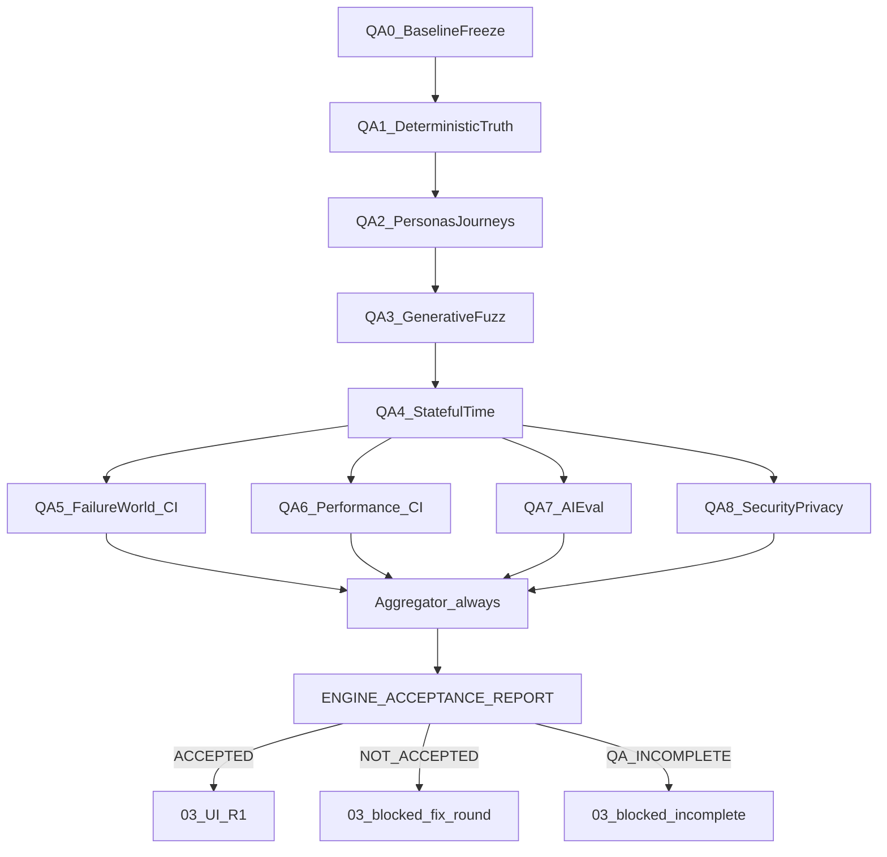

# 02.5 PRE-UI Engine Acceptance QA

> **PO 판정:** `APPROVE_WITH_REQUIRED_LOCKS` → 설계 **`READY_TO_EXECUTE`** (2026-08-12)  
> **착수 단위:** 실행 요청 시 **`qa0-baseline-freeze` 한 todo만**. QA-1+ 범위 확대 금지.  
> **철학:** 고치기 위한 단계가 아니라 **현재 엔진의 진실을 밝히는** 단계. 전수 조사 종료 전 제품 수정 0.

```text
02.5 PRE-UI ENGINE ACCEPTANCE QA
DESIGN: READY_TO_EXECUTE
CURRENT TODO: qa9-acceptance-report
QA0: COMPLETE · CONTRACT LOCKED · BASELINE FROZEN · HARNESS SAFE
QA1: COMPLETE · schemas+routes · DB consistency · idempotency split · Functional/Contract
QA2: COMPLETE · personas×journeys×coverage · Dirty>Happy · isolation faces · seed evidence
QA3: COMPLETE · fast-check properties · CI fail-fast:false
QA4: COMPLETE · BLOCKED_NO_CLOCK_HOOK (critical)
QA5: COMPLETE · BLOCKED_NO_FAULT_HOOK (critical)
QA6: COMPLETE · UNSPECIFIED_PERF_BUDGET/BLOCKED_MISSING_ORACLE (critical)
QA7: COMPLETE · formal Actions 24/24 PASS
QA8: COMPLETE · ASVS 5.0.0 subset · P0(admin-boundary)+P2(privacy-retention) 발견·미수정 · critical_invariant.blocked=6
VERDICT: ENGINE_NOT_ACCEPTED (defects.P0>0) · ENGINE_ACCEPTED_FOR_UI = NOT_ISSUED
PRODUCT MUTATION: 0
03 UI: BLOCKED
```

## QA-0 `qa0-baseline-freeze` — DoD / 금지 / 순서 (잠금)

### 완료조건 (6)

1. Acceptance Contract **L1~L6**가 `governance/engine-acceptance/**` 문서·스키마로 실재
2. **severity**가 테스트 결과를 보기 **전**에 `severity-policy.v1.md`로 고정
3. **protected scope** 경로 + hash 산출 규칙이 deterministic하게 고정
4. **production kill-switch**가 tiny smoke보다 **먼저** 작동함이 검증됨
5. baseline의 **dirty 처리 규칙**이 명확함 (아래 Dual Dirty 기록)
6. 생성된 baseline에 대해 `verify:engine-acceptance`의 **QA-0 범위 검증만 PASS**

### Dual Dirty 기록 (WIP 강제 clean 금지)

- `working_tree_clean` = **repository 전체** dirty 여부 (사실 기록만)
- `protected_scope_clean` = **acceptance 대상 경로만** 오염 여부 (별도 필드)
- **금지:** 전체 tree가 dirty라는 이유로 임의 `stash` / WIP commit / 무관 파일 정리로 “깨끗하게” 만들기
- 정당한 WIP(예: 무관 UI/plan 잔여)는 건드리지 않음 — 철학=`제품 수정 0 / 현재 진실 보존`
- scope가 dirty면 baseline에 오염 경로를 명시하고 QA-0 verifier 규칙에 따라 FAIL 또는 `baseline.valid=false` (세탁 PASS 금지)

### QA-0 금지

```text
persona full run · fuzz full run · fault injection · k6 · AI full eval
defect 수정 · engine 코드 수정 · 03 UI 작업 · 최종 ENGINE_ACCEPTED_FOR_UI 발급
```

### QA-0 성공 결과 (여기까지)

```text
ACCEPTANCE CONTRACT = LOCKED
BASELINE = FROZEN
QA HARNESS TARGET = SAFE
NEXT = QA1_DETERMINISTIC_TRUTH
```

### 실행 순서 (착수 시 한정)

`02.5 plan/Index/BOOTSTRAP 직렬화 → Acceptance Contract materialize → kill-switch → protected manifest/baseline 생성 → QA-0 verifier → 증거 기록 → qa0 완료 판정`

## 현재 위치 (확정)

- [docs/CONSTITUTION_BOOTSTRAP.md](docs/CONSTITUTION_BOOTSTRAP.md): **01/02 pending=0**, 다음 포인터를 02.5로 전환(착수 시)
- 기존 Pre-UI Runtime Gate([02 Engine §0.9](.cursor/plans/ai_profit_os_02_engine_b2c3d4e5.plan.md)) = **CLOSED** — “배선/런타임 존재” 게이트
- 본 02.5 = “상태·시간·장애·동시성 아래 **진실 보존**” acceptance gate — **역할 중복 0**

## Acceptance Contract (착수 전 잠금 · 필수)

### L1 — 3-state Verdict

| Verdict | 의미 | 03 UI |
|---|---|---|
| `ENGINE_ACCEPTED_FOR_UI` | 필수 suite COMPLETE + critical coverage 충족 + P0/P1=0 | 착수 허용 |
| `ENGINE_NOT_ACCEPTED` | P0 또는 P1 > 0 | **차단** |
| `ENGINE_QA_INCOMPLETE` | P0/P1=0 이어도 critical `BLOCKED`/`SKIPPED`/`UNCOVERED` 존재, 또는 mandatory suite 미완료, 또는 evidence 무결성 실패 | **차단** |

**금지:** “결함을 못 찾았다”만으로 ACCEPTED. **검증 완료**와 **결함 없음**을 분리한다.

#### Acceptance 식 (최종)

```text
ENGINE_ACCEPTED_FOR_UI iff
  baseline.valid == true
  AND acceptance_scope.unchanged == true   // protected_scope_manifest 일치
  AND mandatory_suite.QA1..QA8.status == COMPLETE  // 각 suite
  AND critical_invariant.blocked == 0
  AND critical_invariant.skipped == 0
  AND critical_invariant.uncovered == 0
  AND defects.P0 == 0
  AND defects.P1 == 0
  AND report.baseline_id == baseline.id
  AND report.evidence_integrity == VALID
```

#### 상태 전이

```text
P0/P1 > 0
  → ENGINE_NOT_ACCEPTED

P0/P1 == 0
  AND (critical BLOCKED|SKIPPED|UNCOVERED > 0
       OR mandatory suite ≠ COMPLETE
       OR evidence_integrity ≠ VALID
       OR baseline/scope invalid)
  → ENGINE_QA_INCOMPLETE

P0/P1 == 0 AND mandatory evidence complete AND critical clean
  → ENGINE_ACCEPTED_FOR_UI
```

### L2 — Protected-scope Baseline (SHA 단독 금지)

`governance/engine-acceptance/baseline.v1.json` 필수 필드:

- `id` · `commit_sha` · `tree_sha`
- `working_tree_clean` — **repo 전체** dirty 사실 (강제 clean 금지 · Dual Dirty 절)
- `protected_scope_clean` — **protected 경로만** 오염 여부
- `lockfile_hash` · `schema_migration_hash` · `prompt_hash` · `eval_dataset_hash`
- `acceptance_workflow_hash` · `node_version` · `package_manager_version` (`pnpm@10.14`)
- **`protected_scope_manifest`** — acceptance 대상 엔진 경로 목록 + 각 path content hash · hash 산출 규칙 SSOT

**03 진입 검사:** `HEAD == accepted commit`가 아니라  
`acceptance_scope.unchanged == (현재 protected_scope_manifest == accepted baseline manifest)`.  
02.5 보고서/플랜 커밋으로 HEAD가 바뀌어도 엔진 scope가 동일하면 scope OK. 반대로 UI-only 변경은 scope 밖.

### L3 — BLOCKED_* 정식 결과 타입

공통 vocabulary (defect 아님):

| Code | 의미 |
|---|---|
| `BLOCKED_NO_CLOCK_HOOK` | 시간 가상화 훅 없음 |
| `BLOCKED_NO_FAULT_HOOK` | fault injection 훅 없음 |
| `BLOCKED_ENV_CAPABILITY` | 환경 능력 부족(로컬 RAM/Docker OFF 등) |
| `BLOCKED_MISSING_ORACLE` | 판정 oracle/SLO/계약 부재 |

- BLOCKED ≠ defect
- **critical invariant의 BLOCKED/SKIPPED/UNCOVERED → ACCEPTED 불가** (`ENGINE_QA_INCOMPLETE`)
- 제품 코드 수정 없이 hook이 불가능하면 mock으로 PASS 조작 금지 → BLOCKED 기록

### L4 — Severity Policy (QA 실행 전 고정)

`governance/engine-acceptance/severity-policy.v1.md` (또는 invariants 내 동봉). **결과 본 뒤 severity 재조정 금지.**

| Sev | 사전 정의 (요지) |
|---|---|
| **P0** | cross-user data leak · money corruption · unrecoverable loss 등 catastrophic integrity/security |
| **P1** | core lifecycle / idempotency / authorization / fail-safe 위반 — UI 진입 차단급 |
| **P2** | 중요 정확성 저하 · 비치명 계약 위반 |
| **P3** | 비핵심 polish / 관측 구멍(critical 아니면) |

`defects.v1.json` 필수 링크 필드:  
`severity` · `invariant_id` · `suite_id` · `persona_id` · `journey_id` · `seed` · `trace_id` · `baseline_id` · `first_observed_at` · `repro_status`

### L5 — CI Matrix / Concurrency / Workflow 존재

`.github/workflows/engine-acceptance.yml`:

1. **`strategy.fail-fast: false`** 필수 — 전수 조사 철학과 충돌하는 조기 취소 금지
2. **`concurrency` group** — 동일 QA 환경 동시 파괴 방지(직렬화)
3. **`workflow_dispatch` 함정:** default branch에 workflow 파일이 있어야 수동 실행 가능.  
   - QA-0에서 **workflow scaffold를 먼저 default branch에 존재**시키거나  
   - 02.5 개발 중에는 `pull_request`/허용 trigger로 돌리고  
   - **최종 acceptance run은 default-branch workflow**로 실행  
   이 전략을 플랜·BOOTSTRAP에 명시
4. Heavy jobs: 선행 job 실패 후에도 **evidence/report aggregator는 `if: always()`**로 실행 → 최종 verdict는 aggregator만
5. Raw trace/log = Actions **artifact** (retention 정책 명시, 예: acceptance evidence ≥ 90일). Repo에는 비민감 summary + `evidence-manifest.v1.json` checksum만

### L6 — Production Kill-switch (harness only)

destructive QA(delete-account · abuse · concurrency · fault) 전:

- `target_env` · **hostname allowlist** · **synthetic account namespace** 전부 검사
- 하나라도 production-like면 **즉시 abort**
- 제품 코드 변경 없음 — QA harness 안전장치만

---

## 기타 잠금

| 축 | 잠금 |
|---|---|
| File-Serial | **`02 → 02.5 → 03`**. 03 착수 = verdict `ENGINE_ACCEPTED_FOR_UI` only |
| 플랜 홈 | ACTIVE [`ai_profit_os_02_5_engine_acceptance_qa_*.plan.md`](.cursor/plans/) + Index 직렬표/분리맵/BOOTSTRAP |
| 제품 코드 | `services/**` · `apps/**` mutation **0**. 허용=`tooling/engine-acceptance/**` · `governance/engine-acceptance/**` · verify/CI/플랜/CATALOG |
| 결함 처리 | 전수 조사 종료 전 수정 라운드 **금지** |
| 로컬 vs CI | Docker OFF · heavy=CI only · 로컬=QA-0/1 + tiny smoke |
| OpenAPI | Schemathesis 직접 의존 금지 · `schemas/*.v1.json` + Nest routes |
| AI Eval | 기존 `eval/*.jsonl` + code grader 1차 · quality grader 보조 · OpenAI Evals UI 종속 금지 |
| Perf 수치 | 기존 SLO/contract 없으면 **`UNSPECIFIED_PERF_BUDGET`** — QA가 p95/error_rate 숫자 창작 금지. threshold **메커니즘**만 잠금 |
| Legal | ADR-005 · 새 법무 절 금지 |
| ASVS | **OWASP ASVS 5.0.0** versioned requirement ID (`v5.0.0-x.y.z`)로 subset 항목 연결 · 전수 인증 주장 0 |



## 산출물 레이아웃

```text
governance/engine-acceptance/
  baseline.v1.json              # protected_scope_manifest 포함
  severity-policy.v1.md         # QA 전 severity 고정
  invariants.v1.md              # (+ machine JSON 가능)
  personas.v1.json              # 상태·목적 (KR-01..12)
  journeys.v1.json              # 행동열 (분리)
  coverage.v1.json              # persona×journey×invariant 매핑
  defects.v1.json
  evidence-manifest.v1.json     # suite run_id/baseline_id/checksum/status
  ENGINE_ACCEPTANCE_REPORT.md
tooling/engine-acceptance/      # runner · kill-switch · clock/fault hooks · aggregator
tooling/verify/engine-acceptance.cjs
.github/workflows/engine-acceptance.yml
```

`evidence-manifest.v1.json`: artifact 본문 대신 suite별 `run_id` · `baseline_id` · `checksum` · `completion_status` 묶음.

## Engine Invariants (정답표 초안 · QA-0 문서화)

HTTP 200이 아니라 **상태 진실**. critical 여부는 `coverage.v1.json` / invariants에 표기.

- ledger/bucket · money corruption 0
- **Idempotency 분리**
  - same key + same payload → 동일 결과 · 중복 side-effect 0
  - same key + conflicting payload → 계약대로 명시적 거부 (`verify:idempotency-conflict-detection` 연결)
- **User isolation (순차 A/B만 금지)**  
  A/B request interleave · token 교차 · object id 교체 · concurrent — QA-2와 QA-8이 동일 invariant를 다른 공격면에서 검사 (`coverage` 매핑)
- participate/execute lifecycle · Rule 전이 모순 0
- feed/home · AI 실패가 ledger를 깨뜨림 0
- time (KST 경계) · privacy delete-account · AI grounding/autonomy0/fail-safe

## Persona / Journey / Coverage (분리)

| 파일 | 역할 |
|---|---|
| `personas.v1.json` | 누가·어떤 상태 (KR-01…KR-12) |
| `journeys.v1.json` | 무슨 행동열 |
| `coverage.v1.json` | 어떤 invariant를 검증 (예: `KR-09 × retry-after-timeout × INV-IDEMPOTENCY-03`) |

케이스 개수(6,000 등) = **KPI 아님**. Dirty Path 비중 > Happy Path.

실행: UI 없이 Nest HTTP lifecycle  
`가입 → 프로필 → 피드 → participate → execute-tick* → peotteok → 저장 → 재접속 → 변경 → delete-account`

## Failure Evidence (seed 단독 금지)

최소 필드:

- `seed` · `rng_version` · `clock_as_of` · `request_sequence`
- sanitized request/response · `baseline_id` · `model_identifier`
- relevant `configuration_fingerprint`
- AI: `dataset_hash` · `grader_version` · end-to-end **trace** (최종 출력만 평가 금지)

## QA-4 시간

Clock 주입 가능 시 KST 경계·월말·연말·+30d·+365d.  
불가 시 `BLOCKED_NO_CLOCK_HOOK` — critical이면 `ENGINE_QA_INCOMPLETE`.

## QA-5 Failure World (두 축)

1. **fault introduced → expected degradation/fallback** (예: AI 429 시 HTTP/응답 계약)
2. **recovery → post-recovery invariant scan** (ledger/idempotency/user state)

hook 없으면 `BLOCKED_NO_FAULT_HOOK` — mock PASS 금지.

## QA-6 Performance

- scenario mix + k6 threshold **메커니즘** 잠금 (tag별 workload threshold 가능)
- 수치: 기존 제품 SLO/contract/측정 baseline에서만. 없으면 suite status에 `UNSPECIFIED_PERF_BUDGET` 기록 → 해당 critical 여부에 따라 INCOMPLETE 가능(창작 PASS 금지)

## QA-7 AI Eval

`dataset → trace → code grader → (optional) quality grader → regression`  
Quality grader는 **최종 verdict의 유일 oracle 금지**.

## QA-8 Security & Privacy

ASVS **5.0.0** versioned IDs subset · IDOR/authz/PII/delete-account · isolation coverage 공유.

## Index / 게이트 연동

1. Index 분리맵·직렬표에 **02.5** + mermaid `f02 → f025 → f03`
2. BOOTSTRAP 다음=`02.5` 첫 todo; 완료 후 ACCEPTED일 때만 `03 redesign-r1-home-truth-preflight`
3. 03 overview 선행: `VERDICT == ENGINE_ACCEPTED_FOR_UI` **and** `acceptance_scope.unchanged`
4. `verify:engine-acceptance` — 3-state · baseline/scope · evidence-manifest · report schema
5. `verify:gate` T2에 heavy suite 전체 편입 금지 — heavy는 전용 workflow

## 비범위

- 엔진/머니 버그 수정 · UI redesign · Playwright UI E2E — 03 이후 또는 post-QA fix round
- Testcontainers 로컬 강제 · OpenAPI 전면 도입 · OpenAI Evals UI
- k6 숫자 SLO 창작 · BLOCKED를 PASS로 세탁
- 새 Legal/규제 절 · Pre-UI E-R1~E-R8 재실행
