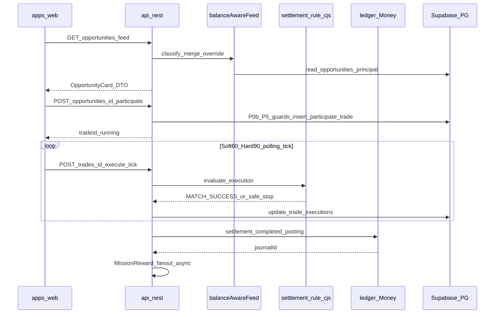
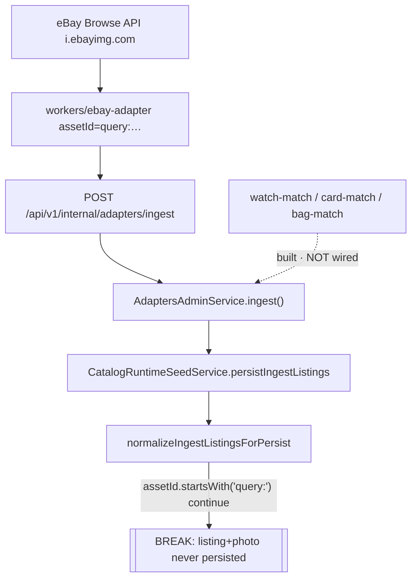
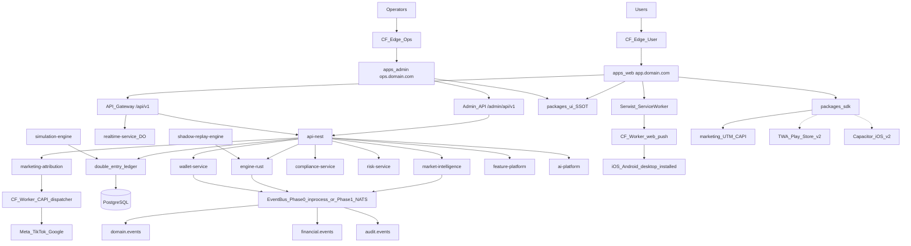
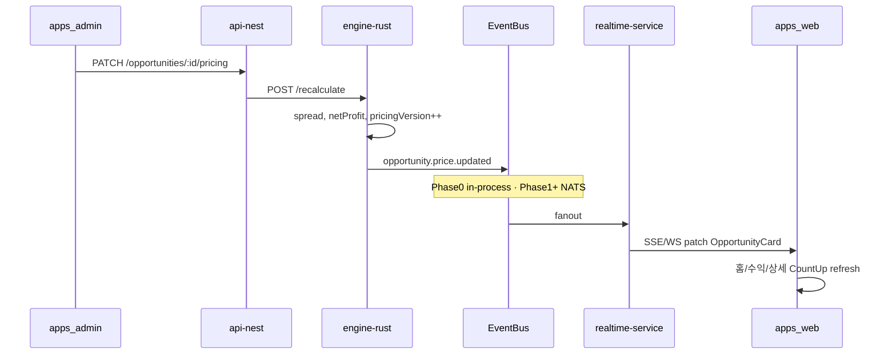
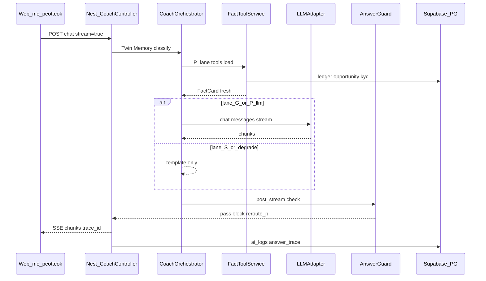

# AI Profit OS — Engine (v7.23.0 · R1 Home Fact/State additive)

> 분리 플랜 — Index: `ai_profit_os_00_index_a1b2c3d4.plan.md` · ARCHIVE: `ai_profit_os_launch_54c1261e.plan.md` · 착수전: `docs/CONSTITUTION_BOOTSTRAP.md`
> **단일 편집본:** 워크스페이스 `.cursor/plans` 해시 파일만 (에이전트 편집 SSOT)

> **제로 목표:** 오류0 · 결함0 · 오차0 · 중복0  
> **File-Serial:** 01 Money **CLOSED** 후만 본 파일 · 파일 내 todos **위→아래  strictly** · 한 채팅=한 todo · 건너뛰기 금지  
> **v7.22.44 CLOSE(불변):** todos 1~26 **completed 유지 · 재실행 금지**. 아래 todo 순서는 그 26개 안에서의 **이력**이다.  
> **v7.22.48 REOPEN(가산 27~34 · §0.9):** `engine-runtime-preflight-gap` → `engine-execution-policy-bootstrap` → `engine-user-opportunity-feed` → `engine-participate-http` → `engine-execute-rule-loop` → `engine-catalog-runtime-seed` → `engine-user-membership-read` → `engine-pre-ui-close` · **완료 후만 File-Serial 다음=03 UI**  
> **v7.22.51 이력:** `engine-ebay-identity-match-ingest` pending을 UI 비차단 예외로 추적했다. **v7.23:** 예외 종료 · 02 R1 blocking 선행으로 승격.
> **todo 순서 (v7.22.39b · 1~26 이력):** preflight·잠금(완료) → **market** → **overrideDDL** → adapters → tier/image → vertical → projection → balance-aware → Rule→strictness→membership → **KPI→simulation** → AI(**feature→twin→llm→coach**)  
> **AI 이름:** **퍼뜩** (§47.12 · Brand Kit) · **타프로젝트 코치명(클라이 등) 유저 surface 금지** · P=플랫폼 Fact · G=일상 LLM · S=실행 금지  
> **Phase0 버스:** **in-process** (NATS=Phase1+) · adapter 워커 **코드 Owns=본 파일 · deploy=Phase1+**  
> **모델 잠금:** `[grok-4.5|256K]`=SSOT·Rule·AI·스키마/DDL · `[composer-2.5|200K]`=워커·시드 vertical·시뮬·KPI·LLM adapter · 각 todo content의 `A/B/C` = 256K/200K 한도 안 파트(한 채팅=한 todo·파트는 체크리스트)  

> **v7.22.20:** §0.0.6 `assetImageUrl` · `luxury_bag`  
> **v7.22.21:** §0.0.5.1 잔액 인식 피드 · SKU 1:1 · Admin §9.8.9  
> **v7.22.23:** §48.13.3 **매칭 엄격도** · 난수 `successRatePercent` **0**  
> **v7.22.24:** §0.0.7 **유저 멤버십 등급** · AI 해금 · 일일 횟수↓/건당수익↑ · 유저별 strictness · UI 설명 Owns  
> **v7.22.25:** §48.13.1 **P0b** `matchBlocked` (Admin §9.8.4a) · todo 의존 순서 잠금  
> **v7.22.26:** **§4.2a** `arbitrageTypeKo`·`time_sensitive`·sellSuccess meta · FX=동일 카드 스키마 · Index §20.1 pointer · **홈 레이아웃 Owns=UI**  
> **v7.22.27:** **§4.2b** INTERNAL≠USER 표기 · 유저=capital provider · `executionPlatforms` 유저0 · Index §20.2 pointer
> **v7.22.28:** 유저 CTA 라벨 Owns=UI/`수익 벌기` · domain=`participate` · `expectedSellDays` **유저 투영 0** · `estimatedDurationSec` 목표≤60 · Index §20.2  
> **v7.22.29:** Soft **60s** / Hard **90s** · REQUEUE 가드 · **`MATCH_TIMEOUT`** · Index §20.2 · Audit A4  
> **v7.22.30:** Soft/Hard **전 등급 동일** · 진행실 시세틱=pricing **Fact only**(난수 틱 0) · 긴장감 UX Owns=UI §48.3b · 등급 차별=§0.0.7 캡·기회(**≠대기 wall**)  
> **v7.22.31:** Day-1 listing = **ebay 멀티 marketplaceId** 또는 **ebay×admin** · (yahoo는 당시 Phase1+)  
> **v7.22.32:** `yahoo_jp` / Yahoo! JAPAN Auction **영구 배제**(FORBIDDEN) · Phase1+ 철회 · 코드·스키마·워커·카피·ENV **0** · listing = ebay 멀티\|admin only  
> **v7.22.39:** 실측감사(DB58·mig18·함수4·override DDL↔schema·Admin 자식누락·nearMissCap·`/admin/assets`유령) · preflight·Admin계약·todo 재분할 흡수  
> **v7.22.40:** §48.13 **G4 ticker fanout 경계** — `settlement.completed` 후 Nest 비동기 투영 · Rule/분개 불변 · ticker Owns=Admin §35.4 · `match-success-rule-engine` 범위 **0**  
> **v7.22.41 (Founder lock):** **§0.0.1c Market Partner Registry** — eBay·Amazon·Yahoo! JAPAN Auction **공식 협력사** · UI §38.10 로고 표기 · v7.22.32 yahoo **adapter/표기** → Phase1+ **복원 todo** · Day-1 listing=ebay멀티\|admin **유지** · Amazon/Yahoo leg=adapter todo 후  
> **v7.22.42:** **§48.13.4 Mission reward fanout 경계** — `settlement.completed`/`deposit.confirmed` 등 **이후** Nest `MissionRewardEvaluator` 비동기 · Rule/R1~R10·분개·Soft/Hard **불변** · accrual/ledger Owns=**Money §51.8a** · UI §5.9.5 · `match-success-rule-engine` 범위 **0**
> **v7.22.48 (REOPEN · Pre-UI Runtime Gate · §0.9):** CLOSE(v7.22.44) 후 실측 재점검에서 **participate/execute HTTP 실행계층 + 유저 기회 피드 API가 코드 0**임을 확인 · `POST /opportunities/:id/participate` · `GET /trades/:id` · `GET /opportunities(+/:id)` · `GET /me/membership` · `execution_policies`/`opportunities` 활성 행 0 · 26개 completed todo는 **재실행 금지·SSOT 잠금 유지**(룰 로직·골든테스트·정책은 정확) · **가산 8 todo(E-R1~E-R8)**로만 REOPEN · 새 병렬 플랜 파일 생성 금지(중복0) · 흡수 SSOT=본 절
> **v7.22.51 (POST-UI follow-up · §0.10 · U15):** 실 eBay 사진 DB 미도달 — `workers/ebay-adapter`가 `assetId:\`query:${query}\`` placeholder · `normalizeIngestListingsForPersist`가 `query:` **drop** · matchers 미배선 · Pre-UI/E-R·1~26 불변 · 당시 File-Serial 예외로 추적, v7.23 R1 정식 선행으로 승격.
> **v1 executionMode:** **`orchestrate` only** (ADR-009)  

## v7.23.0 Redesign R1 — Engine dependency 승계

> **선행:** 00 R0 pending 0 → 01 `redesign-r1-money-read-contract` completed.
> **승계:** v7.22의 eBay 예외2는 R0 채택으로 종료한다. 이 todo를 과거 완료 작업 재개가 아닌 **확인된 미해결 U15**로 R1 Home asset 인증의 정식 선행에 편입한다.

### 실행 순서

1. `engine-ebay-identity-match-ingest`: exact identity match 후 실제 eBay image provenance를 저장하고 unmatched를 운영 큐에 남긴다.
2. `redesign-r1-home-fact-state-contract`: 기존 read API를 한 mapper로 결합해 UI가 상태나 금액을 추정하지 않게 한다.
3. 두 todo pending 0 후만 03 UI R1 Home 착수.

### HomeReadModelV1 경계

- Money 입력: `principalUsdt`, `settlementCompletedTodayCount`, per-field `asOf`/`source`, `state`.
- Opportunity 입력: affordable/nearMiss/lockedHigh, `status`, compareReady, `expectedProfitUsdt`, `assetImageUrl`, source freshness. `bucket=affordable && status=available && compareReady=true` 행의 `expectedProfitUsdt` 합으로 `todayPossibleProfitUsdt`를 서버 산출한다.
- Growth 입력: ticker/counter는 서버 mode와 실제 payload만; Home truth/DayPulse와 합산하지 않는다.
- Session 입력: guest/authenticated/expired를 명시하며 unauthorized를 0값 데이터로 변환하지 않는다.
- 공통 view state는 `loading|ready_empty|ready_data|stale|recoverable_error|blocked|unauthorized`이고 Engine의 `running|requeue|success|safe_stop` FSM은 별도 필드로 보존한다.
- `reasonCode` 형식은 `domain.resource.reason`; underscore 별칭을 새로 만들지 않는다.
- `ledgerTotal`은 오늘 완료 정산 **COUNT**다. currency formatter·profit color·USDT suffix 사용을 금지한다.

### Done

- schema/SDK/Nest mapper 한 경로, source/asOf/freshness 테스트, zero/absent fixture를 갖춘다.
- `verify:home-state-truth`와 `verify:no-fake-zero-status`를 스크립트+package script+CATALOG에 동시 등록한다.
- Engine 기존 verify + `asset-image-surface` + `listing-legs-day1` + `adapter-matching-kpi` 회귀 PASS.
- 앱/React/CSS 변경 0.

## 0. 착수 전 실물 대조 기록 (v7.22.39 · 예측 0 · MCP+FS)

> **Owns:** 본 절 = Engine 착수 게이트. 구현 todo는 `market-intel-engine`부터.  
> **검증일:** 2026-08-09 · Supabase MCP `list_tables`/`list_migrations`/`execute_sql` + 레포 FS.  
> **선행:** 01 Money **CLOSED** (todos 15/15 · Index v7.22.38).

### 0.1 읽기 순서 (한 채팅 시작 시 · 이 표만)

| 순 | 문서/경로 | 목적 |
|----|-----------|------|
| 1 | `docs/CONSTITUTION_BOOTSTRAP.md` §0·§0.4·§1·§6·§9 | 실물·Admin IA·다음 todo |
| 2 | `CONSTITUTION/44` · `45` · `46` · `46b` · `47` · `48` · `51` | Engine Owns |
| 3 | **본 플랜** 해당 todo 절만 (+ §0.4 Admin 계약) | 구현 SSOT |
| 4 | `schemas/*` (opportunity·asset·execution·override·membership·ai-*) + `supabase/migrations/20260808205850*` · `20260808205853*` | 계약·DDL |
| 5 | `apps/admin/routes.ts` + Admin §9.1.1 | Admin 화면 Owns≠Engine · **API/Rule 계약은 Engine** |
| 6 | `services/engine-rust` · `workers/*-adapter` · `TOOLCHAIN.md` | 스택 잠금 |

**금지:** launch ARCHIVE를 착수 SSOT · Money/UI 플랜 전문 대량 로드 · 사진 목업 · 타프로젝트 AI명 · yahoo_jp 재제안.

### 0.2 실측 스냅샷 (오차0 · 2026-08-09)

| 대상 | 실측 | Engine 함의 |
|------|------|-------------|
| Supabase ref | `mgsytcetsiecllmhcyox` · Seoul · PG **17.6** · ACTIVE_HEALTHY | 원격 only · Docker OFF |
| `public` 테이블 | **58** · RLS ON | assets/opportunities/execution_policies/trade_executions/ai_* /user_membership 존재 |
| migrations applied | **18** · 끝=`20260809010858_referral_pool_fifo_clawback` · 로컬 버전 **1:1** | Dashboard DDL 0 |
| public 함수 | **4** (`ledger_*`3 + `users_stage_a_identity_ok`) | Rule/엔진 RPC **0** → Nest+`engine-rust` |
| `vector` | **0.8.2** · `memory_embeddings` | §47 pgvector L1 |
| `user_opportunity_overrides` 컬럼 | `hidden`·`pinned`·`margin_override_usdt` | **≠** schema `forceShow`/`pinOrder`/`marginPctOverride`/`expectedProfitUsdtOverride` → todo `engine-override-ddl-align` |
| `services/engine-rust` | `settlement_rule.rs` = **SafeStop skeleton** | Soft60/Hard90 SSOT 잠금≠구현완료 · 구현=`match-success-rule-engine` |
| `workers/*-adapter` | ebay·pokemontcg·ygoprodeck·coingecko·frankfurter 폴더 존재 · yahoo-jp **0** | 코드 Owns=Engine · **Phase1 deploy** |
| `apps/admin/routes.ts` | TOP12 · Money 자식 전수 | Engine 자식 **누락분** §0.4로 흡수(본 턴 routes sync) |
| Auth | Nest JWT · Supabase Auth **0** | AI/participate도 Nest |
| PG사 | 코드경로 0 | Money 잠금 유지 |
| Brand/AI | Consumer/AI=**퍼뜩** | 클라이 등 타명 **0** |

### 0.3 v7.22.39에서 흡수한 모순·보완 (완료 · 구현코드 최소=routes/verify/BOOTSTRAP만)

| # | 발견(실측) | 흡수 |
|---|------------|------|
| E1 | BOOTSTRAP/Index가 「다음=01 Money」잔존 | → BOOTSTRAP §0.4 Engine · 다음=`market-intel-engine` |
| E2 | schema override ≠ DDL (`pinned` vs `pinOrder` 등) | → todo `engine-override-ddl-align` · merge 식은 schema SSOT |
| E3 | `/admin/assets` 유령 path · routes **0** | → **`/admin/opportunities?tab=assets`** (sidebar 13 금지) |
| E4 | `/admin/system-control?tab=reserve` routes **0** | → §0.0.4.3 + Admin §9.1.1 + routes 자식 추가 |
| E5 | `nearMissCap` 위치가 execution-policy **또는** adapters/settings로 이중 표기 | → **전역 SSOT=`/admin/execution-policy` `feed.nearMissCapUsdt`만** · adapters=health/KPI |
| E6 | Soft60 wall vs participate **P4 Soft**(가격 soft-accept) 용어 충돌 | → P4 라벨=`priceSoftAccept` (§48.13.1) · wall=Soft60/Hard90만 Soft/Hard |
| E7 | Soft/Hard todo completed vs `settlement_rule` skeleton | → completed=**SSOT 잠금** · 코드 구현=`match-success-rule-engine` |
| E8 | Admin Engine 계약 표 부재 | → **§0.4 Engine→Admin 계약 전수** |
| E9 | 퍼뜩 Fact 흡수·제안 우선순위는 있으나 운영/감사 관점 체크 약함 | → §47.12 운영자·유저·감사 체크 + Admin coach |
| E10 | todo 거대 슬라이스 · 모델 파트 불명 | → YAML `A/B/C` 파트 + 모델 접두사 재분할 |

### 0.4 Engine→Admin 계약 전수 (UI Owns=Admin · Rule/시세/AI Owns=Engine)

> 실물: `apps/admin/routes.ts` + Admin 플랜 §9.1/§9.1.1.  
> Engine todo는 아래 **API·스키마·이벤트·KPI**를 제공해야 Admin deep이 막히지 않음.  
> **sidebar 13번째 모듈 추가 금지** — 전부 기존 모듈의 **자식 tab**.

| Admin surface (실route) | Engine 제공 계약 | Engine todo |
|-------------------------|------------------|-------------|
| `/admin/opportunities` | §36 pricing PATCH · compareReady · gradeMismatch · image_missing · capitalBand 필터 | `market-intel-engine` · verticals · `opportunity-scan-projection` |
| `/admin/opportunities?tab=assets` | Asset Master CRUD · R2 이미지 · `imageSource` · SKU1:1 | `asset-image-pipeline` · `capital-tier-catalog` |
| `/admin/execution-policy` | matchStrictness 프리셋맵 · Soft60/Hard90 표시 · **`feed.nearMissCapUsdt`** · 난수성공률 UI **0** · audit | `match-strictness-policy` · `balance-aware-feed` |
| `/admin/adapters` | 5 adapter health · listing legs · SKU실패율 · yahoo **0** | `signup-ready-adapters` · `adapter-matching-kpi` |
| `/admin/growth?tab=simulation` | M0.5 run/latest · S1~S4 · Growth ON 게이트 | `simulation-engine-m05` |
| `/admin/system-control?tab=reserve` | `platform_reserve` 목표·audit · S2 입력 | `simulation-engine-m05` (§0.0.4.3) |
| `/admin/ai-logs` · `?tab=coach` | answer-trace · P/G/S Eval · provider_id · degrade 카운트 | `ai-coach-runtime` · `llm-adapter-providers` · §47.15 |
| `/admin/users/:id` §9.8.9 | override CRUD (schema 필드) · ledger 불변 | `engine-override-ddl-align` · `balance-aware-feed` |
| `/admin/users/:id` §9.8.10 | membership force · matchStrictnessOverride | `user-membership-engine` |
| `/admin/users/:id` §9.8.4a | `matchBlocked` → participate P0b | `match-success-rule-engine` |

### 0.5 모델·파트 집행 규칙 (오류0 · 256K/200K)

| 모델 | 담당 todo | 한 채팅 규칙 |
|------|-----------|--------------|
| **grok-4.5\|256K** | preflight(완료)·SSOT·pricing·override DDL·projection·Rule·membership·AI층 | content의 A→B→C 체크리스트 순서 · 파일 대량 로드 금지(§0.1만) |
| **composer-2.5\|200K** | adapters·vertical 시드·simulation·KPI·llm-adapter | 워커/시드 슬라이스만 · 헌법/Money 재설계 금지 |

**완료 정의:** 해당 todo `verify:*` PASS + (money면 해당 없음) + 세션 `pnpm cleanup:lowspec` PASS.

### 0.6 completed todo 재검증 기록 (v7.22.39a · 2026-08-09 · 예측0)

| todo | 범위 | 증거 | 판정 |
|------|------|------|------|
| `engine-preflight-constitution` | 착수 게이트·기록 only | BOOTSTRAP §0.4 · CONST 44/45/46/46b/47/48/51 존재 · Admin `assets`/`reserve` 자식 · DB58/mig18 | ✅ completed 유지 |
| `yahoo-jp-permanent-ban` | SSOT+금지경로 잠금 | schema enum·mig CHECK·workers yahoo-jp **0**·copy 야후0 · **`verify:listing-legs-day1` live PASS** | ✅ (게이트 부재 결함→본 턴 신설) |
| `listing-legs-no-jp-phone` | Day-1 legs=ebay멀티\|admin | marketId enum 5종 · ebay-adapter 폴더 · 동일 verify PASS | ✅ completed 유지 |
| `soft-hard-requeue-timeout` | **SSOT 잠금** ≠ Rule 구현 | Canon softSec60/hardSec90 · copy 3줄 · schema/DDL `MATCH_TIMEOUT` · `verify:soft-hard-requeue-sla` PASS · `settlement_rule.rs` skeleton=의도(구현 todo 별도) | ✅ completed 유지 |

**금지:** Soft/Hard completed를 Rule 구현 완료로 해석 · listing-legs verify 없는 채 completed 유지.

### 0.7 YAML todo 위→아래 의존표 (v7.22.39b · 실행 SSOT · 건너뛰기 금지)

| # | todo | 선행(바로 위까지) | 왜 이 자리 |
|---|------|-------------------|------------|
| 1~4 | preflight · yahoo · listing · soft-hard | — | ✅ completed · SSOT 잠금 |
| 5 | `market-intel-engine` | 1~4 | Asset Master·pricing·Admin opportunities 계약 |
| 6 | `engine-override-ddl-align` | 5 | schema↔DDL 먼저 · feed/Admin §9.8.9 깨짐 방지 |
| 7 | `signup-ready-adapters` | 6 | 시세 수집 워커 (market 계약 후) |
| 8 | `capital-tier-catalog` | 7 | 시드 밴드·비율 |
| 9 | `asset-image-pipeline` | 8 | 이미지 가드 (시드 전 hydrate) |
| 10~12 | trading_card → luxury_bag → ultra_watch | 9 | vertical 시드 (카드→가방→웨일시계) |
| 13 | `opportunity-scan-projection` | 12 | §4.2a 카드 투영 |
| 14 | `capital-provider-projection` | 13 | §4.2b 유저 표기 |
| 15 | `balance-aware-feed` | 14 (+6) | override merge·nearMiss · **6 필수** |
| 16 | `match-success-rule-engine` | 15 | Rule R1~R10 + Soft/Hard 구현 |
| 17 | `mission-reward-fanout-boundary` | 16 | §48.13.4 Nest async · Rule/ledger 불변 |
| 18 | `market-partner-adapters-phase1` | 17 | amazon+yahoo_jp Phase1+ · registry §0.0.1c |
| 19 | `match-strictness-policy` | 18 | 프리셋→policy 맵 (Rule 입력) |
| 20 | `user-membership-engine` | 19 | membership 오버레이 (strictness 후) |
| 21 | `adapter-matching-kpi` | 20 | SKU실패율 KPI (**sim S4 입력**) |
| 22 | `simulation-engine-m05` | 21 | M0.5 · S4=KPI |
| 23 | `ai-feature-platform` | 22 | feature/AI_LOG/PICK |
| 24 | `personal-ai-layer` | 23 | Twin·Fact·P/G/S |
| 25 | `llm-adapter-providers` | 24 | gemini_free (**coach G 선행**) |
| 26 | `ai-coach-runtime` | 25 | 퍼뜩 런타임 · **마지막** |

**v7.22.39b에서 고친 어긋남:**  
(1) `overrideDDL`을 adapters **앞**으로 · (2) `adapter-matching-kpi` → `simulation` · (3) `llm-adapter` → `ai-coach`.  
**v7.22.44 CLOSE:** YAML 전수 completed · §0.8 재검증 PASS · 본 파일 실행큐 **CLOSED**.

### 0.8 CLOSE 재검증 (v7.22.44 · 2026-08-09 · 예측0)

> **Owns:** Engine 플랜 종료 게이트. todos **26/26 completed · pending 0**.  
> **실측:** Supabase MCP `list_tables`/`list_migrations`/`execute_sql`/`get_project` + FS + `pnpm verify:*` Engine 전수.

| 대상 | 종료 실측 | 판정 |
|------|-----------|------|
| Supabase ref | `mgsytcetsiecllmhcyox` · `ap-northeast-2` Seoul · PG **17.6** · ACTIVE_HEALTHY | ✅ |
| `public` 테이블 | **76** · RLS ON | ✅ (Engine+Money+AI 전수) |
| migrations applied | **25** · 로컬 파일명 **버전 1:1** · 끝=`20260809103208_ai_feature_platform_pick_eval_shadow` | ✅ (본 턴 MCP apply 타임스탬프 drift rename 정렬) |
| public 함수 | **5** (`ledger_forbid_mutation`·`ledger_require_posting_flag`·`provision_user_bucket_accounts`·`users_stage_a_identity_ok`·`user_opportunity_overrides_pin_cap`) · Rule RPC **0** | ✅ |
| `vector` | **0.8.2** · `memory_embeddings` | ✅ |
| `user_opportunity_overrides` | `force_show`·`pin_order`·`margin_pct_override`·`expected_profit_usdt_override`·`capital_band_force` (+`hidden`) · 구 `pinned`/`margin_override_usdt` **0** | ✅ schema 1:1 |
| `services/engine-rust` | `settlement_rule.rs` R1~R10 · Soft60/Hard90 · REQUEUE/MATCH_TIMEOUT · golden **6+strictness2** | ✅ |
| `services/market-intelligence` · `services/ai-platform` | live 패키지 | ✅ |
| `workers/*-adapter` | Day-1: ebay·pokemontcg·ygoprodeck·coingecko·frankfurter · Phase1+: amazon·yahoo-jp · deploy=Phase1 | ✅ |
| Admin routes §0.4 | opportunities(+assets)·execution-policy·adapters·growth?simulation·system-control?reserve·ai-logs(+coach/pick/eval)·users override/membership | ✅ |
| PG사 | `verify:pg-module-scan` PASS | ✅ |
| Brand/AI | Consumer/AI=**퍼뜩** · 클라이 등 타명 **0** | ✅ |
| Engine verify | listing/soft-hard/pricing/fx/market-intel/adapters/tier/image/vertical×3/arbitrage/jargon/balance/override/match-rule/mission×3/g4/partner/strictness/membership×3/KPI/sim/ai-feature/shadow/twin/llm×2/coach×5/admin-routes **전수 PASS** | ✅ |

**CLOSE 판정:** Engine = **CLOSED** · UI PART0~9 CLOSED · File-Serial 다음 = **03 UI** (`trust-age-spotcheck`). completed Engine todo 재실행 **금지**.

### 0.8.1 Founder local ops pointer (v7.22.45 · **Engine todo 재실행·상태변경 금지**)

> **범위:** founder 로컬/프리뷰 검증만 기록 · **signup-ready-adapters 등 completed todo = 그대로** · 본 절은 Phase1 preview ingest 호스트·Kakao runtime **pending** 흡수용 pointer.

| 항목 | 실측 (2026-08-09) | SSOT / pending |
|------|-------------------|----------------|
| eBay Production OAuth | PRD App/Cert · Browse API OK · Account Deletion exemption 적용 | `.env` · Worker secrets |
| Day-1 leg | `EBAY_US` buy · `EBAY_GB` sell | §0.0.1a P0 (completed) |
| `ebay-adapter` preview | `https://ebay-adapter-preview.ebay-adapter.workers.dev` · `/tick`→ingest batch **40** · `/health.ingestConfigured` | Infra `phase1-adapter-ingest-host-binding` |
| Nest ingest | `POST /api/v1/internal/adapters/ingest` · header `x-adapter-token`=`ADAPTER_INGEST_TOKEN` · body ≤10MB | `adapters.ingest.controller.ts` · `.env.example` |
| Dev reachability | `cloudflared tunnel --url http://127.0.0.1:4000` → wrangler `NEST_ADAPTER_INGEST_URL` (임시) | prod=`API_HOST` 고정 시 secret 재등록 |
| E2E 1회 | tick `forwarded:1` · ~320 listings · Admin adapter health green | 재검증=Infra todo · Engine verify 재실행 **금지** |

## 0.9 Pre-UI Runtime Gate (v7.22.48 · REOPEN · UI 03 착수 잠금 · 예측0)

> **Owns:** 본 절 = Engine REOPEN 게이트. 1~26 completed todo **불변·재실행 금지** · 가산 27~34(`engine-runtime-preflight-gap`~`engine-pre-ui-close`)만 신규 실행 큐.  
> **발단:** 홈 `@pre-ui_engine_gate_8f59a783.plan.md`(Cursor 홈 미러 단독 생성 · 워크스페이스 SSOT 부재) 실측 + 독립 재검증(레포 FS·`app.module.ts` 전수·DB migration grep) 교차 대조 · 새 병렬 플랜 파일 **생성 금지** 원칙에 따라 본 절로 전량 흡수·해당 mirror 파일 삭제.  
> **검증일:** 2026-08-09 · Supabase MCP `list_tables`/`list_migrations`/`execute_sql` **재실측 완료**(BOOTSTRAP §0.5.1) + 레포 FS.

### 0.9.1 판정 (실측 · 추측 0)

| 층 | 상태 | 증거 |
|----|------|------|
| DB76·mig25 1:1·함수5·override 스키마·stack-lock·Engine verify 정적 게이트 | PASS | MCP public **76** · migrations **25**(로컬=원격 1:1 · 끝=`20260809103208_…`) · 함수 **5** · §0.8 CLOSE + BOOTSTRAP §0.5.1 |
| `services/engine-rust` — `settlement_rule.rs` R1~R10/Soft60/Hard90/REQUEUE/MATCH_TIMEOUT | **로직 PASS · 배선 0** | `[lib]`-only crate(`Cargo.toml`) · bin/서버 **0** · 호출부=verify 스크립트뿐(`settlement_rule.cjs` JS mirror도 동일) — **어떤 실행 서비스도 이 룰을 호출하지 않음** |
| `POST /api/v1/opportunities/:id/participate` · `GET /api/v1/opportunities(+/:id)` 유저 피드 · `GET/POST /api/v1/trades/:id(/execute-tick)` | **코드 0** | `services/api-nest/src/app.module.ts` 전수: `OpportunitiesModule`은 `OpportunitiesAdminController`+`UserOpportunityOverrideAdminController`만 export · **TradesModule/ExecutionModule/ParticipateModule 미등록** · 레포 전체 `@Controller("opportunities")`/`@Controller("trades")`(admin 제외) grep 0건 |
| `execution_policies` / `opportunities`(available) | **행 0(MCP 실측)** | MCP `execute_sql` 2026-08-09: `execution_policies` total=0·active=0 · `opportunities` total=0·available=0 · `assets`/`listings`=0 · migrations INSERT seed **없음** → ensure/seed 경로 코드 0 |
| `settlement.completed` 이벤트 | **리스너만 존재 · 발행부 0** | `SettlementCompletedFanout`은 `LEDGER_EVENTS.journalPosted`(journalType='settlement') 구독뿐 · 그 journal을 만드는 코드(참여→체결→정산 posting)가 없어 **평상시 발화 자체가 불가능** |
| `GET /api/v1/me/benefits` · `GET /api/v1/me/membership` | **코드 0** | `missions/mission.module.ts`는 `controllers` 선언 자체가 없음(providers만 · MCP/FS 2026-08-09 재확인) · membership 유저 라우트 grep 0건 — Money §51.8a.7·Engine §0.0.7이 문서화한 API 계약이 컨트롤러로 미구현 |
| UI 홈·퍼뜩·기회목록/상세·실행실 페이지 | 골격 stub | `apps/web/app/page.tsx` 등 다수가 `<h1>{제목}</h1><p>골격 · 본구현은 도메인 todo</p>` 리터럴 · `/me/benefits`·`/me/guide/partners` routes 미등록(`apps/web/routes.ts` `USER_NESTED_ROUTES`에 없음) |

**모순:** [02 Engine](.cursor/plans/ai_profit_os_02_engine_b2c3d4e5.plan.md) §48.13.1이 Owns한 participate API·§48.13 execute 루프가 코드 0인데 todos 26/26 CLOSED로 표기되었고, Index가 다음=03 UI로 잠겨 있었음.  
**해소 원칙:** completed todo(1~26) **재실행 금지**(Index File-Serial) · **가산 pending todo(27~34)**로만 REOPEN · 새 병렬 플랜 파일 생성 금지(중복0) · 본 절이 유일한 SSOT.

### 0.9.2 §48.3 SSE 가정과의 정합 (오차0 · 결함 아님)

> UI §48.3은 `trade.execution.step` **SSE/WS** 스트림을 전제로 진행실을 설계했다. 본 게이트 `engine-execute-rule-loop`(E-R5)는 Phase0 원칙(§2.0 in-process·NATS 0)에 맞춰 **`POST /trades/:id/execute-tick` polling**으로 Day-1을 구현한다.  
> **잠금:** Phase0 = polling(클라 tick 또는 짧은 interval) · **Phase1+ realtime-service 도입 시 `trades.execution.service.ts`의 응답 채널만 SSE로 교체**(Rule 판정 로직·엔드포인트 계약 불변) · UI는 이 세션에서 polling 클라이언트로 구현(SSE 클라 재작성 방지를 위해 `useTradeExecution` 훅 내부만 교체 가능하게 스켈레톤).

### 0.9.3 잠금 (세계 1위팀 = 이 레포 ADR 집행 · 스택 재설계 0)

| 축 | 적용 |
|----|------|
| 스택 | Node22 · pnpm@10.14 · next@16 · Nest · Rust `settlement_rule` SSOT · CJS mirror([settlement_rule.cjs](services/engine-rust/settlement_rule.cjs)) Phase0 Nest 직접 `require` 호출 · Cloudflare only · Supabase Seoul DB · Nest JWT · PG사 0 · Docker OFF |
| File-Serial | 한 채팅=한 todo · 위→아래 · 1~26 completed 손대지 않음 · 27~34만 실행 |
| 모델 | `[grok-4.5|256K]`=SSOT·Nest 계약·Rule 배선 · `[composer-2.5|200K]`=E-R6 시드/ingest 슬라이스만 |
| 네이밍 | Wallet 패턴 복제: `OPPORTUNITY_USER_ROUTES` · `ParticipateService` · `TradeExecutionService` · path=`opportunities` / `opportunities/:id` / `opportunities/:id/participate` / `trades/:id` / `trades/:id/execute-tick` · domain=`participate` · 유저 CTA 문자열 Owns=UI |
| 보안(신규 하드닝) | 신규 유저 컨트롤러는 **JWT 세션에서 userId 도출만** · `WalletController`가 body/query `userId`를 그대로 신뢰하는 기존 패턴 **반복 금지**(Auth 가드는 Infra `auth-ssot` 산출물 재사용) |
| 돈 | decimal **string** · float 금지 · ledger posting Owns=Money · Rule은 credit 결정만 |
| 완료 | 도메인 `verify:*` PASS + `pnpm cleanup:lowspec` · push 시 `gh run watch` |
| RAM | 프로세스 1 · 서브에이전트 병렬 0 · `NODE_OPTIONS=1536` |

### 0.9.4 목표 아키텍처 (유저 클릭 1경로)



### 0.9.5 가산 todo 상세 (위→아래 · 건너뛰기 금지 · YAML `engine-*` id와 1:1)

#### E-R1 `engine-runtime-preflight-gap`
- **모델:** grok-4.5 · **범위:** 구현 0 · 본 절 §0.9.1 재기록 확정 · Index/UI/BOOTSTRAP(§5h2 stale yahoo 문구 등) pointer만
- **완료:** 본 절 존재 + overview REOPEN 표기 · verify 없음(문서 게이트)

#### E-R2 `engine-execution-policy-bootstrap`
- **모델:** grok-4.5 · **범위:** active `execution_policies` 1행 보장(migration seed 또는 Nest `ensure()` on boot · `matchStrictness=standard` · Soft60/Hard90 presentation · `feed.nearMissCapUsdt`) · Admin PUT 경로와 충돌 0
- **근거:** §0.9.1 · unique partial index `is_active`
- **verify:** `verify:match-strictness` 회귀 + 신규 active-row assert(CATALOG 등록)

#### E-R3 `engine-user-opportunity-feed`
- **모델:** grok-4.5 · **범위:** Nest 유저 컨트롤러
  - `GET /api/v1/opportunities`(feed) · `GET /api/v1/opportunities/:id`
  - DTO=`schemas/opportunity-card.v1.json` · `buildBalanceAwareFeedWithOverrides` 연결 · `executionPlatforms` 유저 0 · `arbitrageTypeKo` pass-through
- **파일:** `services/api-nest/src/opportunities/opportunities.user.controller.ts`(신설) · `OPPORTUNITY_USER_ROUTES` · **admin 컨트롤러와 분리**
- **verify:** `verify:user-opportunity-feed`(신설·live)

#### E-R4 `engine-participate-http`
- **모델:** grok-4.5 · **범위:** `POST /api/v1/opportunities/:id/participate`
  - body=`schemas/participate-request.v1.json` · P0b~P5(§48.13.1) · KYC 불필요 · practice/circuit/principal 기존 가드(Money/Risk) 재사용 · `participate_requests`+`trade_executions` insert · idempotency
  - **외부 API 호출 0** · userId=JWT 세션(§0.9.3 보안 하드닝)
- **verify:** `verify:participate-http`(신설) + 기존 jargon/cta 게이트 회귀

#### E-R5 `engine-execute-rule-loop`
- **모델:** grok-4.5 · **범위:** Nest가 `settlement_rule.cjs` 호출(Rust SSOT 유지 · 신규 FFI 금지)
  - `GET /api/v1/trades/:id` · Phase0 tick: `POST /api/v1/trades/:id/execute-tick`(in-process · §0.9.2 polling)
  - Soft60/Hard90/REQUEUE/MATCH_TIMEOUT · MATCH_SUCCESS → Money settlement posting pointer → 이후 기존 `settlement.completed` fanout(`SettlementCompletedFanout`) 그대로 소비(수정 금지)
- **금지:** Rule에 ticker/mission/demo 입력
- **verify:** `verify:execute-rule-loop`(신설) + `verify:match-success-rule` 회귀

#### E-R6 `engine-catalog-runtime-seed` (composer)
- **모델:** composer-2.5 · **범위:** 원격 DB에 UI 배선 가능한 최소 카탈로그
  - 기존 Admin seed: trading_card / luxury_bag / watch
  - ebay ingest 경로(§0.8.1 preview E2E 기록 재사용)로 listings→opportunities `available`≥N · `compareReady` 일부 true · `assetImageUrl` 가드
  - Day-1 listing CHECK(ebay|admin) 불변 · amazon/yahoo INSERT 시도 0
- **완료 실측:** MCP count `opportunities_available`≥1 · `assets`≥1 · `listings`≥1
- **verify:** `verify:capital-tier-catalog`/`asset-image-surface`/`listing-legs-day1` 회귀

#### E-R7 `engine-user-membership-read`
- **모델:** grok-4.5 · **범위:** `GET /api/v1/me/membership`(표시용 ladder·aiPerkFlags·fulfillRate 표시전용 · Rule 입력 0)
- **verify:** `verify:membership-ladder` 회귀 + 유저 라우트 존재 assert

#### E-R8 `engine-pre-ui-close`
- **모델:** grok-4.5 · **범위:** 구현 최소 · MCP 재실측 + Engine 관련 verify 전수 + 신규 3게이트 PASS · **Money `money-user-benefits-read` completed 확인**(§0.9.6 예외 참조) · overview 다시 CLOSED(가산분) · Index 다음=`ui-preflight-constitution`
- **완료:** UI §0.6 체크리스트에 증거 행 기입 가능 상태

### 0.9.6 Money 가산 todo (pointer · Owns=01 Money · Engine 구현 금지)

> **1개·`money-user-benefits-read`** — Money §51.8a `GET /api/v1/me/benefits(+summary)` 유저 읽기 컨트롤러 신설. **선행=본 절 E-R5 completed**(정산 파이프라인이 있어야 표시할 accrual이 생김). accrual/ledger/idempotency 로직 **수정 금지**(이미 §51.8a에 구현됨 · 컨트롤러만 공백).  
> **File-Serial 예외(1건 · 문서화 · Index §참조):** 01 Money가 이 1개 가산 todo로 재오픈되어도 **02 Engine(본 파일) 착수를 재차단하지 않음** — Engine이 이미 File-Serial 다음 파일로 진행 중이던 게이트 연속성을 보존하기 위함. 본 예외는 Engine `engine-pre-ui-close`(E-R8) + Money `money-user-benefits-read` 둘 다 completed 시 자동 소멸(Index §"플랜 직렬 완료 규칙" 참조).  
> **구현 위치:** `01 Money` 플랜 YAML + 본문만. 본 파일(Engine)은 pointer만 유지(중복0).

### 0.9.7 UI 03에 남기는 것 (이 게이트에서 구현 금지)

- Canon/Brand/Lux/copy · `assets/markets` SVG · `market-partner-trust.wire`
- 홈/실행실/퍼뜩 **화면** · routes에 `/me/benefits`·`/me/guide/partners` 잠금
- 이미 존재하는 stub 페이지의 미배선 버튼(예: `/wallet/deposit` 주소복사·계속, `/me/kyc` 시작하기, `/wallet/withdraw` 제출, `/me/support` wrong-chain 제출이 로컬 state만 바꾸고 실제 POST 미호출) — **버그로 확인됨 · 본 게이트 범위 밖** · UI PART별 todo가 실제 배선 시 재검증 필수(UI §0.6에 pointer 기록)
- `ui-preflight-constitution` — **E-R8 + `money-user-benefits-read` 완료 후** 첫 채팅만

### 0.9.8 네이밍·코드 규칙 (신규 파일 강제)

```
services/api-nest/src/opportunities/
  opportunities.user.routes.ts      # OPPORTUNITY_USER_ROUTES
  opportunities.user.controller.ts
  opportunities.user.service.ts      # feed + getById
  participate.service.ts             # P0b~P5
services/api-nest/src/trades/
  trades.user.routes.ts
  trades.user.controller.ts
  trades.execution.service.ts        # require(settlement_rule.cjs)
services/api-nest/src/membership/
  membership.user.controller.ts      # GET /me/membership
tooling/verify/
  user-opportunity-feed.cjs
  participate-http.cjs
  execute-rule-loop.cjs
```

- 라우트 상수 = `as const` · Admin path와 문자열 공유 금지
- 에러 코드 = 플랜 toast 키와 1:1(`INSUFFICIENT_BALANCE` · `MATCH_BLOCKED` · `PRICE_STALE` …)
- 유저 DTO 필드 camelCase · DB snake_case 매퍼 한곳

### 0.9.9 작업 방식 (매 todo 동일)

1. BOOTSTRAP §해당 + 02 본 절(§0.9) + schema만 로드(launch/헌법 전문 대량 로드 금지)
2. 구현 → 해당 `verify:*` → 회귀 최소 세트
3. `pnpm cleanup:lowspec`
4. 워크스페이스 플랜 YAML `status: completed` → `pnpm cursor:sync-plans`
5. commit/push = `git-auto-commit-push.mdc` (todo·슬라이스·stop 자동) · push 시 CI watch

### 0.9.10 Done = UI 착수 허용 조건

- Engine 가산 pending **0**(E-R1~E-R8) · Money `money-user-benefits-read` **completed**
- MCP: `execution_policies` active≥1 · `opportunities` available≥1
- `verify:user-opportunity-feed` · `participate-http` · `execute-rule-loop` PASS
- 기존 Engine/Money/UI-pointer 게이트 회귀 PASS
- Index overview: 다음=`03 UI` `ui-preflight-constitution` only

**그 전까지 03 UI todo 착수 = File-Serial 위반.**

### 0.9.11 CLOSE 재검증 (v7.22.49 · `engine-pre-ui-close` · 예측0)

> **Owns:** Pre-UI Runtime Gate 종료. 가산 E-R1~E-R8 **pending 0** · 1~26 completed **불변**.  
> **실측:** Supabase MCP `execute_sql`/`list_migrations` + FS + Engine `verify:*` 전수 + Money benefits 게이트.

| 대상 | 종료 실측 | 판정 |
|------|-----------|------|
| `execution_policies` active | **1** · `matchStrictness=standard` | ✅ |
| `opportunities` available | **3** · assets **94** · listings **12** | ✅ |
| public 테이블 / 함수 | **76** / **5** | ✅ |
| migrations applied | **28** · 끝=`20260809144814_catalog_runtime_day1_fx_bootstrap` (로컬 버전 1:1) | ✅ |
| 신규 3게이트 | `user-opportunity-feed` · `participate-http` · `execute-rule-loop` | ✅ PASS |
| Engine verify 전수 | listing/soft-hard/pricing/fx/market-intel/adapters/tier/image/vertical×3/arbitrage/jargon/balance/strictness/membership×2/KPI/sim/ai*/llm*/coach*/shadow/twin/cta/admin-routes/pg-module/stack-lock/catalog-runtime + mission×3 | ✅ PASS |
| Money `money-user-benefits-read` | `GET /api/v1/me/benefits(+summary)` · `BenefitsUserController` · `MissionModule.controllers` · `verify:benefit-hub-surfaces`(+credits/g4) | ✅ completed |
| File-Serial 예외 | Engine E-R8 + Money benefits 둘 다 completed → 예외 **소멸** | ✅ |

**CLOSE 판정:** Engine Pre-UI Gate = **CLOSED** · UI PART0~9 CLOSED · File-Serial 다음 = **03 UI** (`trust-age-spotcheck`). completed Engine/Money(가산 포함) todo 재실행 **금지**.

### 0.10 POST-UI follow-up — eBay identity-match ingest (v7.22.51 · U15 · 예측0 · 구현 대기)

> **Owns:** 본 절 = Engine 가산 todo `engine-ebay-identity-match-ingest` SSOT.  
> **발단:** UI preflight U15 / 마스터감사 — 실 eBay CDN 사진은 adapter가 fetch하나 DB 미도달.  
> **Pre-UI Gate:** **CLOSED 유지**(E-R1~E-R8 재실행·재오픈 **금지**).  
> **File-Serial:** v7.22에서는 UI 비차단 예외였으나 v7.23에서는 01 Money R1 뒤 실행하며 완료 전 03 R1 착수 금지. UI `ProductImage`는 source-agnostic을 유지한다.
> **새 병렬 플랜 파일 생성 금지**(중복0).

#### 0.10.1 실측 break (코드 경로 · 추측0)



| 층 | 경로 | 사실 |
|----|------|------|
| Adapter | `workers/ebay-adapter/src/index.ts` ~L101/L116 | 매 결과에 `assetId: \`query:${query}\`` · title→identity parse **0** · matcher 호출 **0** |
| Ingest | `services/api-nest/src/adapters/adapters.admin.service.ts` `ingest()` | listings → `persistIngestListings`만 · match resolve **0** |
| Persist guard | `services/market-intelligence/src/catalog-runtime-seed.cjs` `normalizeIngestListingsForPersist` | `assetId.startsWith("query:")` → `continue` (FK 안전 drop · 의도된 preview 가드) |
| Matchers (미배선) | `watch-match.cjs` / `card-match.cjs` / `bag-match.cjs` | exact brand+reference(+model/grade) · Admin evaluate·KPI 경로만 사용 |
| 현재 opportunities | seed/`ensureMinCatalog` | `imageSource=admin_r2` 템플릿 · 합성 pricing · 실 eBay URL **0** |

#### 0.10.2 가산 todo 상세 — `engine-ebay-identity-match-ingest`

- **모델:** `[grok-4.5|256K]`
- **범위(구현 채팅에서):**
  1. ingest 직전(또는 persist 직전) listing title(+category) → `{brand, reference, model|grade…}` parse
  2. category별 `evaluateWatchListingMatch` / `evaluateCardListingMatch` / `evaluateBagListingMatch` 호출
  3. **exact match** → `assetId`=Asset Master id · `imageSource="ebay"` · `imageUrl`/`assetImageUrl`=실 `item.image.imageUrl`(host `i.ebayimg.com`)
  4. **no match** → Admin review queue(또는 동등 Ops 표면) · **silent drop 금지**(query: placeholder를 그대로 persist하는 것도 금지)
  5. `normalizeIngestListingsForPersist`의 `query:` skip은 **미해결 placeholder 잔존 시에만** 유지(가드 삭제≠본 todo 목표)
  6. Day-1 listing CHECK(`ebay`\|`admin`) 불변 · amazon/yahoo INSERT 시도 0
- **금지:** 1~26·E-R1~E-R8 completed 재실행 · UI에서 identity-match 우회 · Fuzzy-alone auto-publish · Math.random 매칭
- **회귀 verify:** `asset-image-surface` · `listing-legs-day1` · `adapter-matching-kpi` · `catalog-runtime-seed` + **신설** ebay identity ingest assert(CATALOG 등록)
- **Acceptance:** live `ebay-adapter` tick(실 credentials) → `public.opportunities`(또는 listings→opportunity hydrate) ≥1행 · `asset_image_source='ebay'` · URL host `i.ebayimg.com` · unmatched는 Admin queue에 가시

#### 0.10.3 실행 시점

- **문서/트래킹:** 본 절 + YAML `pending` = **완료(본 채팅 Owns=file/track only · 구현코드 0)**
- **구현 채팅:** founder 스케줄 또는 UI가 실사진 필요 시 · **한 채팅=본 todo only** · 03 UI PART 순서 **재정렬 0**

## 0.0 시세 소스 잠금 (v7.13) — Signup-Ready + Margin UX + Capital Tiers

**선별 기준 (전부 충족해야 Active):**
1. 공식/문서화된 HTTP API 또는 공개 bulk JSON  
2. **가입만 하면** 또는 **가입 없이** 즉시 키/호출 가능  
3. 신규 키 발급이 막혀 있지 않음  
4. 무료 티어가 **상업 플랫폼 표시를 명시 금지**하지 않음  
5. 한국 마켓플레이스가 아님  

### 0.0.1 ACTIVE — Day-1 수집 허용 (일본 휴대폰 **불필요**)

| adapter_id | 가입 | 역할 | 수직 | 문서/엔드포인트 | 한도·캐시 규칙 |
|------------|------|------|------|-----------------|----------------|
| `ebay` | developer.ebay.com 무료 | **실호가 Listing** (멀티 `marketplaceId` leg) | watch + trading_card + luxury_bag | Browse API `item_summary/search` (+ image) · marketplaceId=`EBAY_US`/`EBAY_GB`/`EBAY_DE`/`EBAY_AU` | ~5k calls/day · Redis cache · 유저요청 시 외부호출 금지 |
| `pokemontcg` | dev.pokemontcg.io 무료 키 | 포켓몬 **카탈로그+참고가** | trading_card (pokemon) | `api.pokemontcg.io/v2` | 키 시 ~20k/day · 메타 캐시 24h · 가격 캐시 ≥1h |
| `ygoprodeck` | **가입 불필요** | 유희왕 **카탈로그+참고가** | trading_card (yugioh) | `db.ygoprodeck.com/api/v7` | IP rate limit · bulk/local cache 권장 |
| `coingecko` | Demo 키 권장(무료) | USDT↔KRW/USD | fx | `api.coingecko.com/api/v3/simple/price` | Demo 월 한도 · **최소 60s~5m 캐시** |
| `frankfurter` | **가입 불필요** | 법정화폐 FX | fx | `api.frankfurter.dev` | 일 단위 고시 · 1h 캐시 |
| `admin` | Ops | **수동 기준가 leg** (출처=`admin`) | 전 category | Admin `/admin/opportunities` override | 이미지 R2 필수(기본) |

#### 0.0.1a Day-1 Listing legs (v7.22.41 · 오류0)

> **Founder lock (v7.22.41):** eBay·Amazon·Yahoo! JAPAN Auction = **공식 협력사** · 유저 표기=UI **§38.10** (로고+LabelKo).  
> **Day-1 pricing leg (코드):** 아래 P0 표 **유지** · Amazon/Yahoo **leg 데이터** = todo `market-partner-adapters-phase1` (Phase1+).  
> **v7.22.32 이력:** JP SMS 게이트로 yahoo **adapter 일시 배제** → v7.22.41 **협력사 확정·adapter 복원 todo**.

| 우선 | buy leg | sell leg | 비고 |
|------|---------|----------|------|
| **P0 자동** | `ebay` @ `EBAY_US` | `ebay` @ `EBAY_GB` (또는 `EBAY_DE`/`EBAY_AU`) | **키 1개** · marketplaceId만 다름 |
| **P0 반자동** | `ebay` @ 임의 | `admin` | 2nd 마켓 희소·시드 초기 |
| **P0 반자동** | `admin` | `ebay` @ 임의 | 동일 |
| **P1 협력** | `amazon_*` \| `yahoo_jp` | `ebay_*` \| `amazon_*` \| `admin` | adapter live 후 · registry §0.0.1c |

**시장 ID enum (pricing · 유저 라벨 맵):**

| marketId | ko 라벨 (고정) | partner tier |
|----------|----------------|--------------|
| `ebay_us` | 이베이(미국) | A |
| `ebay_gb` | 이베이(영국) | A |
| `ebay_de` | 이베이(독일) | A |
| `ebay_au` | 이베이(호주) | A |
| `amazon_us` | 아마존(미국) | A · Phase1+ leg |
| `amazon_jp` | 아마존(일본) | A · Phase1+ leg |
| `amazon_de` | 아마존(독일) | A · Phase1+ leg |
| `yahoo_jp` | Yahoo! JAPAN オークション | A · Phase1+ leg |
| `admin` | 운영자 기준가 | — |

#### 0.0.1c Market Partner Registry (v7.22.41 · Owns=Engine 계약 · UI §38.10 표기)

> **schema (todo):** `schemas/market-partner.v1.json` · `packages/ui/brand/assets/markets/manifest.json` mirror  
> **원칙:** `officialPartner=true` · UI Trust strip은 Tier-A **전원 표기** · opportunity leg 로고는 **해당 leg만**

| partner_id | adapter_id | officialPartner | uiTrustStrip | listingLegPhase |
|------------|------------|-----------------|--------------|-----------------|
| ebay_* | `ebay` | true | always | Day-1 |
| amazon_* | `amazon` | true | always | Phase1+ |
| yahoo_jp | `yahoo_jp` | true | always | Phase1+ |
| pokemontcg | `pokemontcg` | true | edu | catalog |
| ygoprodeck | `ygoprodeck` | true | edu | catalog |

**CI:** `verify:market-partner-adapters` · `verify:market-partner-trust`(UI pointer)

**역할 분리 (중복0·오차0):**
- **Listing leg:** `ebay`(≥1 marketplaceId) ± `admin` **만** · 동일 ebay 키로 두 marketplace 스프레드 허용  
- **Card catalog / reference price hint:** `pokemontcg` + `ygoprodeck` **만** (자동 Opportunity 단독 근거 금지)  
- **FX:** `coingecko` + `frankfurter` **만**  
- `PriceObservation.source` = `ebay` \| `admin` \| `pokemontcg` \| `ygoprodeck` \| `coingecko` \| `frankfurter` · ebay행은 `marketplaceId` 필수  
- **`yahoo_jp` / `amazon_*`:** v7.22.41 **공식 협력사** · UI §38.10 **항상 표기** · listing leg=Phase1+ adapter todo · **stub without partner registry = 결함**
- Admin override = 정식 leg (`marketId=admin`) · 이미지 없으면 Admin R2 업로드 필수(기본)  
- 유저 카피: `*MarketLabelKo` + **§38.10 partner 로고** · `verify:listing-legs-day1` · `verify:market-partner-trust`

### 0.0.2 FORBIDDEN — v1 코드경로 0 (중복·결함 방지)

| 소스 | 제외 이유 |
|------|-----------|
| 번개/중고나라/당근/크림/필웨이 등 KR | 정책 제외 |
| **TCGPlayer API** | 공식 문서: **신규 API 키 발급 중단** |
| **JustTCG Free** | Terms: free = **non-commercial** |
| **PriceCharting API** | 3자 공개/재배포 제한 안내 |
| **Chrono24** | 공식 무료 개발자 API 없음 |
| **Cardmarket 3rd-party** | commercial + 심사 필요 → Day-1 제외 |
| **Scryfall** | Fan Policy: 페이월·단순 재배포 제한 → 유료 Money OS와 충돌 위험 |
| **PSA** | 시세 없음(cert 검증만) → 시세 adapter 아님 (출시 후 옵션) |
| HTML 전수 스크래핑 Day-1 | 안정·약관·쿼터 결함 |

### 0.0.3 파이프라인 (오류0 · v7.22.32)

```
Asset Master (수동 시드 · imageUrl 포함)
  → pokemontcg / ygoprodeck 로 메타+카탈로그 이미지 hydrate (카드만)
  → ebay(Browse · marketplaceId×N) ± admin override 로 Listing/PriceObservation
  → §0.0.6 assetImageUrl resolve (우선순위 고정)
  → frankfurter + coingecko 로 FX snapshot
  → engine-rust spread (ebay×ebay marketplace | ebay×admin)
  → Opportunity (출처 수·staleAt·marketId·assetImageUrl 표시)
  → Redis → DO/SSE → 유저 UI
```

**가드:**
- 유저 클릭 경로에서 외부 API 호출 **금지** (캐시 miss 시 stale 표시 또는 백그라운드 refresh 큐)  
- Opportunity 자동 공개: **pricing leg 유효 쌍 ≥1** (권장: ebay_us×ebay_gb 또는 ebay×admin) + fresh + 이상치 필터 + **§0.0.6 이미지 가드**  
- `pokemontcg`/`ygoprodeck` 가격만으로 자동 공개 **금지**  
- Admin override = 정식 leg (`marketId=admin`) · 이미지 없으면 Admin R2 업로드 필수(기본)  
- 유저 카피: `*MarketLabelKo` + **§38.10 공식 협력 로고** · Yahoo/Amazon **표기 필수** · `verify:market-partner-trust`

### 0.0.4 가격비교 → 마진=내수익 인지 UX (삭제 금지 · SSOT)

> **중복0 Owns:** **공식·필드·compareReady 가드 = Engine 본 절** · **화면/카피/Canon = UI** (`PriceCompareMargin` 컴포넌트 · `packages/ui/copy/ko/margin-compare.ts`)  
> UI는 공식을 재정의하지 않음 · Engine은 픽셀/레이아웃을 Owns하지 않음.

**헌법:** 유저는 반드시 **「시장 A 가격 vs 시장 B 가격 → 차이(마진) = 내 예상 수익」** 을 한눈에 이해해야 한다.  
숫자만 크게 보여 주고 비교 근거를 숨기는 UI는 **결함**이다.

#### 필수 비교 블록 `PriceCompareMargin` (모든 Opportunity 표면)

홈 카드·상세·참여확인·완료영수증에 **동일 공식** (중복 정의 금지, 컴포넌트 1개).  
**역할:** 유저에게 **「기회 근거(시세 차이)」** 를 보여 줌 — **「당신이 사고팔 호가」가 아님** (Index §20.2).

```
┌─ 기회 근거 · 시세 비교 ─────────────────┐
│ 저가 시세  이베이(미국)  12,400 USDT     │  ← buyPriceUsdt · LabelKo 동적
│ 고가 시세  이베이(영국)  12,980 USDT     │  ← sellPriceUsdt · Day-1 예 (또는 admin)
│ ─────────────────────────────────────── │
│ 시세 차이                   +580 USDT   │
│ 수수료·버퍼 차감             −80 USDT   │
│ ✅ 예상 수익(내 몫)         +500 USDT   │
│ ≈ ₩○○○  · 갱신 방금 전 · 출처 2        │
│ 배지: 직접 사지 않아요 · 직접 팔지 않아요 │
└─────────────────────────────────────────┘
한줄 카피: "두 시장 시세 차이가 이 기회의 근거예요. 직접 사고팔지 않아요."
```

| 규칙 | 잠금 |
|------|------|
| 시장명 | `adapter_id` → ko 라벨 **필수** · 유저 카피 **저가 시세 / 고가 시세** (「매수하세요/매도하세요」금지) |
| 가격 | listing 실호가 (USDT) · Admin override 시 배지 `운영자 기준가` |
| 마진 | `expectedProfitUsdt` = sell − buy − fees − riskBuffer − platformMargin |
| 플랫폼 몫 | 상세에만 `플랫폼 수수료/마진` 한 줄 (§38) |
| 예상 vs 확정 | 참여 전=`예상 수익` / 정산 후=`확정 지급` **혼용 금지** |
| 비교 불가 시 | 카드 **자동 공개 금지** 또는 `비교 준비중` + **수익 벌기** 비활성 |
| 소스 1개뿐 | 반대 레그 Admin override 또는 비공개 · 가짜 반대가 **금지** |
| FOMO/티커 | 비교 블록 가림/대체 **금지** |
| 유저 행위 | 블록에서 구매/판매/플랫폼 선택 CTA **0** |

**스키마 필수 필드** (`OpportunityCard` / `OpportunityPricing`):
- `buyMarketId`, `buyMarketLabelKo`, `buyPriceUsdt`
- `sellMarketId`, `sellMarketLabelKo`, `sellPriceUsdt`
- `grossSpreadUsdt`, `costBufferUsdt`, `platformMarginUsdt`, `expectedProfitUsdt` (유저 마진)
- `compareReady: boolean` — false면 CTA 잠금

**카피 SSOT:** `packages/ui/copy/ko/margin-compare.ts`  
**검증:** `verify:margin-compare-surface` — 홈/상세/확인/영수증 4면 비교블록 100%

#### 0.0.4.1 수수료·버퍼·플랫폼마진 산출 (오차0 · Engine SSOT)

```
grossSpreadUsdt     = sellPriceUsdt − buyPriceUsdt
buyLegFeeUsdt       = buyPriceUsdt  × feePct(buyMarketId)     // default 표
sellLegFeeUsdt      = sellPriceUsdt × feePct(sellMarketId)
feesUsdt            = buyLegFeeUsdt + sellLegFeeUsdt
riskBufferUsdt      = max(grossSpreadUsdt × riskBufferPct, minRiskBufferUsdt)
costBufferUsdt      = feesUsdt + riskBufferUsdt               // UI "수수료·버퍼 차감"
platformMarginUsdt  = max(0, (grossSpreadUsdt − costBufferUsdt) × effectiveMarginPct)
expectedProfitUsdt  = grossSpreadUsdt − costBufferUsdt − platformMarginUsdt
```

| 파라미터 | Day-1 기본 | 편집 |
|----------|------------|------|
| `feePct.ebay` | **0.135** | 모든 `ebay_*` marketplace 공통 · Admin fee 표 |
| `feePct.admin` | **0** | admin 레그 |
| ~~`feePct.yahoo_jp`~~ | — | **삭제** · yahoo 영구 배제 (v7.22.32) |
| `riskBufferPct` | **0.05** | Admin |
| `minRiskBufferUsdt` | **1** | Admin |
| `effectiveMarginPct` | 개별 `adminMarginPct` **우선**, 없으면 전역 `platform_margin_pct` | §36 · TOP2 |

**금지:** UI에 하드코딩 수수료 · adapter별 공식 분기 복제(엔진 함수 1곳) · expectedProfit < 0 인 기회 자동 공개  
**CI:** `verify:pricing-formula` — fixture listing → 위 식 ±0.000001 USDT

#### 0.0.4.2 FX Snapshot 합성 (오차0)

| 목적 | Primary | Fallback |
|------|---------|----------|
| USDT→KRW 표시 | CoinGecko `tether`/`krw` | CoinGecko USDT/USD × Frankfurter USD/KRW |
| 법정화폐 교차 | Frankfurter | — |
| USDT/USD | CoinGecko | — |

**규칙:** 매 snapshot에 `fx_snapshot_id` · `sources[]` · `formulaId`(`cg_usdt_krw` \| `cg_usdt_usd__frank_usd_krw`) 저장.  
표시 ≈원화는 **항상 동일 snapshot**. 혼합 시점 환율 금지.  
**CI:** `verify:fx-snapshot-formula`

#### 0.0.4.3 platform_reserve (시뮬 S2 입력 · **Ops/재무 · 제품 P0 Freeze 아님**)

| 필드 | SSOT |
|------|------|
| 계정 | ledger `ops.platform_reserve_usdt` (USDT) |
| Admin | `/admin/system-control?tab=reserve` · 목표 잔액 설정 · audit |
| Day-1 | **미설정 시 Growth ON 차단** · 시뮬 S2 Fail |
| S2 | `worstCasePlatformDrain ≤ platform_reserve × 0.10` |

### 0.0.5 자본대(소액~웨일) 상품·카테고리 구성

**헌법:** 웨일(≥100k USDT)과 **소액 부업 유저**를 동시에 받는다.  
초고가 시계만 있으면 소액 유저 유입 실패 = 제품 결함.

#### capitalBand (기회·필터·시드 공통 enum)

| capitalBand | 필요 자본 (USDT) | 타깃 | v1 주력 상품 |
|-------------|------------------|------|----------------|
| `micro` | **10 ~ 99** | 첫 입금·연습 | 저가 TCG 싱글, 소액 카드 묶음급 SKU |
| `small` | **100 ~ 999** | 소액 부업 | 중급 포켓몬/유희왕, 소형 Omega 등 저~중가 시계(시드 제한) |
| `mid` | **1,000 ~ 9,999** | 본격 참여 | Rolex 엔트리·중가 레퍼런스, 고등급 카드 |
| `high` | **10,000 ~ 99,999** | 고액 | Rolex/Cartier 핵심, 일부 AP |
| `whale` | **≥ 100,000** | 초고액 | Patek/AP Ultra, 초고가 레퍼런스 |

#### 카탈로그 시드 비율 (v1 잠금 · 오차0)

| 밴드 | 전체 Opportunity 시드 비중 | 비고 |
|------|---------------------------|------|
| micro + small | **≥ 40%** | 소액 유저 필수 물량 |
| mid | **≥ 25%** | |
| high + whale | **≤ 35%** | 하이엔드·웨일 유지하되 독식 금지 |

#### 마켓 UI

필터 칩 (한글):
`전체` `시계` `카드` `가방` · `소액(10~)` `입문(100~)` `중급(1천~)` `고액(1만~)` `웨일(10만~)` · `초고가`

홈 기본 정렬 → **§0.0.5.1** (잔액 인식 · 삭제 금지)

입금 UX:
- 소액 퀵버튼: `10` `50` `100` `500` USDT  
- 웨일 퀵버튼: `1만` `5만` `10만` `25만` `50만` USDT  
- 두 그룹 모두 노출 (소액 유저 배제 금지)  
- **부족분 제안:** Money §49.2a `suggestDepositUsdt` (본 절 계산)

온보딩 한 줄:
`시세가 다른 두 시장의 차이만큼 수익이 나요. 소액부터 시작할 수 있어요.`

#### 0.0.5.1 잔액 인식 피드 · 추가입금 유도 (오류0 · 삭제 금지)

> **중복0 Owns:** **분류·정렬·suggestDeposit 계산 = Engine 본 절** · **ledger principal 읽기 = Money §49** · **카드/CTA 카피·레이아웃 = UI §5.3a** · **유저별 강제 노출/숨김/마진 = Admin §9.8.9**  
> LLM/퍼뜩 G레인으로 잔액·추천 **금지** · P레인 Fact만 허용.

**입력 (서버만):**
- `principalUsdt` = Money 버킷 (참여 재원) · 입금 confirmed 후 즉시 반영
- Opportunity: `requiredCapitalUsdt` · `compareReady` · `status=available` · `assetImageUrl` · Admin override 적용 후 카드

**분류 (오차0):**

| 버킷 | 조건 | 유저 의미 |
|------|------|-----------|
| `affordable` | `requiredCapitalUsdt ≤ principalUsdt` | **지금 참여 가능** |
| `nearMiss` | `principalUsdt < requiredCapitalUsdt ≤ principalUsdt + nearMissCap` | **조금 더 넣으면 가능** |
| `lockedHigh` | `requiredCapitalUsdt > principalUsdt + nearMissCap` | 목록 하단·접힘 (숨김 아님) |

`nearMissCap` Day-1 기본 = **max(50, principalUsdt × 0.25)** · 전역 SSOT = Admin **`/admin/execution-policy`** 필드 `feed.nearMissCapUsdt` only · **`/admin/adapters`에 설정 UI 금지**(adapters=health/KPI) · growth 탭 아님

**suggestDepositUsdt (기회 단위):**
```
suggestDepositUsdt = ceil_to_tick(requiredCapitalUsdt − principalUsdt)
// tick Day-1 = 1 USDT · 최소 표시 1 · principal≥required 이면 0 (CTA 숨김)
```

**홈/수익 정렬 잠금:**
1. Admin §9.8.9 `pinOrder` (유저별) 있으면 최상단  
2. `affordable` · `compareReady` · AI pick / 마진율  
3. `nearMiss` (부족 CTA 노출)  
4. `lockedHigh`  
5. 잔액 0 → micro/small `affordable` 시드 우선 (데모·입금 유도)

**유저별 override merge (Admin §9.8.9 → 카드 투영):**
```
baseCard = OpportunityCard (전역 §36)
userOv = user_opportunity_override[userId, opportunityId] | null  // schemas/user-opportunity-override.v1
if userOv.hidden → 피드 제외
if userOv.forceShow → 가드 통과 시 affordable/nearMiss에 재분류 가능(자본 부족이면 nearMiss+suggest)
if userOv.pinOrder != null → 홈 정렬 최상단 (작을수록 앞 · 유저당 Day-1 max 10)
if userOv.expectedProfitUsdtOverride → 표시·participate 가드에 사용 (ledger 잔액 변경 아님)
if userOv.marginPctOverride → engine recalc expectedProfit (유저 세션만)
```
> **DDL 잠금:** `public.user_opportunity_overrides`는 schema와 **1:1** (`force_show`·`pin_order`·`margin_pct_override`·`expected_profit_usdt_override`) · 구컬럼 `pinned`/`margin_override_usdt` = **마이그레이션으로 교체** (`engine-override-ddl-align`).  
**금지:** override로 ledger credit/debit · 난수 성공 · compareReady 위조(false→true 강제 공개 금지; true→false 숨김은 허용)

**퍼뜩 P Fact (예):** `지금 잔액으로 N건 · +{suggest}USDT면 M건 더`  
**검증:** `verify:balance-aware-feed` — 분류 공식·CTA 쿼리·override 숨김 100%

### 0.0.7 유저 멤버십 등급 · AI 해금 · 매칭 체감 (삭제 금지 · v7.22.24)

> **중복0 Owns:** **등급 enum·승급·일일캡·strictness 오버레이·관측 fulfillRate = Engine 본 절**  
> **유저 설명·카피·등급표 UI = UI §5.9.2c · §51.18a** · **Admin 조회/강제/자격증명/유저별엄격도 = Admin §9.8.10**  
> **≠** 초대 티어(seed…whale_maker · Money §51.5) · **≠** `userTier` vip_desk(컴플라이언스) — 필드 분리.

#### 멤버십 enum (`schemas/user-membership.v1.json`)

| id | 유저 표기(ko) | 누적입금 USDT **또는** | MATCH_SUCCESS 누적 | maxCapitalBand | Day-1 `dailyUserMatchCap` | 기본 `matchStrictness` |
|----|---------------|------------------------|--------------------|----------------|---------------------------|-------------------------|
| `sprout` | 새싹 | 0~99 | — | micro | **8** | lenient |
| `entry` | 입문 | ≥100 | **또는 ≥2** | small | **6** | lenient |
| `core` | 본격 | ≥1,000 | **또는 ≥5** | mid | **5** | standard |
| `high` | 고액 | ≥10,000 | — | high | **3** | tight→성공은 슬롯·마진으로 보상* |
| `vip` | VIP | ≥100,000 **또는** Admin 강제 | — | whale | **2** | **lenient** (조건 여유) |

\* high: 엄격도는 standard~tight 가능하나 **건당 예상수익·방 크기↑** · VIP는 **조건 여유(성공 잘 나는 편)+하루 횟수 최소+건당 최대**.  
**승급:** `membership = max(입금단계, 성공단계, adminForce)` · **자동 강등 0** (Admin 강등만·audit).  
**금지:** 등급만으로 MATCH_SUCCESS 100% 보장 · 일일 캡=성공 보장 횟수로 해석.

#### AI 해금 (제품 기능 · 환각 금지)

| membership | 해금 (엔진/피드 실기능) |
|------------|-------------------------|
| sprout | 기본 피드 · safe_stop · 퍼뜩 P Fact 기본 |
| entry | nearMiss 우선도↑ · 추천 가중 |
| core | AI pick 가중 · 멤버십×밴드 정렬 부스트 |
| high | high 방 · 슬롯 우선(소수) · 정밀 stale 감시 |
| vip | whale/Ultra 우선 · VIP Desk 딥링크 · **effectiveStrictness 여유** · 일일 캡 최소 |

유저 카피 Owns=UI — 엔진은 **해금 플래그**만 (`aiPerkFlags[]`).

#### 관측 참고율 (유저/Admin 표시용 · Rule 입력 금지)

```
fulfillRate7d(membership, capitalBand) =
  MATCH_SUCCESS / attempts   // attempts = SUCCESS+PRICE_MOVED+BELOW_MIN (+선택 REQUEUE terminal)
```
- 라벨(ko SSOT=UI): **「요즘 조건이 맞은 비율」** · **≠ 당첨 성공률**  
- Rule·participate 입력 **금지** (`verify:no-fulfill-rate-as-rule`)

#### effectivePolicy 병합 순서 (오차0)

```
1) global execution-policy (matchStrictness 프리셋)
2) membership×capitalBand overlay (전역 격자)
3) user.matchStrictnessOverride (Admin 유저별 · §9.8.10)
4) evaluateMatchSuccess(effectivePolicy)  // 난수 0
```

**참여 가드 추가:** `opportunity.capitalBand ≤ user.maxCapitalBand` · `user.dailyMatchesUsed < dailyUserMatchCap` · `opp.slotsLeft > 0`

**검증:** `verify:membership-ladder` · `verify:membership-daily-cap` · `verify:no-fulfill-rate-as-rule`

### 시계 브랜드 (v1 watch)

| tier | 브랜드 | v1 |
|------|--------|-----|
| Ultra | Patek Philippe, Audemars Piguet, Richard Mille(선택) | ✅ |
| Core | Rolex, Cartier, Vacheron(선택) | ✅ |
| Strong | Omega, Tudor(선택) | ✅ partial |

시드 40~80 refs · 호가 소스 = **ebay 멀티 marketplace ± admin** · yahoo **0**

### 카테고리 / Asset Master

| category | 시드 | 메타 | 호가 (Day-1) | 기본 아이콘 |
|----------|------|------|--------------|-------------|
| `watch` | 40~80 | 수동 시드 | ebay_us×ebay_gb\|admin | ⌚ |
| `trading_card` | 20~40 | pokemontcg(포켓몬), ygoprodeck(유희왕), 기타 게임은 수동+ebay | ebay 멀티\|admin | 🃏 |
| `luxury_bag` | **10~25** | 수동 시드 (Hermès/Chanel/Louis Vuitton 등 레퍼런스) | ebay 멀티\|admin | 👜 |

**카드 매칭:** set+number+lang+finish(+grade) · 퍼지 단독 자동공개 금지.  
**등급/PSA (§51.12):** PSA=시세 adapter 아님 · listing title/caption에서 grade 추출 · **등급 불일치 → compareReady=false** · Admin `/admin/opportunities`에 `gradeMismatch` 배지 · 매칭 실패율 KPI → §51.15  
**가방 매칭:** brand+model(+size/color) 수동 시드 · 퍼지 단독 자동공개 금지 · 이미지=§0.0.6  
**스키마:** `category` enum = `watch \| trading_card \| luxury_bag` (추가 vertical = ADR 후 enum 확장만)

### 0.0.6 카테고리별 상품 이미지 (Asset Image · 오류0 · 삭제 금지)

> **중복0 Owns:** **필드·hydrate·공개 가드 = Engine 본 절** · **썸네일 레이아웃·캡션·진행실 슬롯 = UI §48.3/§48.3a**  
> 유저는 시계·포켓몬카드·가방 등 **매칭된 그 SKU 실물 사진**이 진행/카드에 보여야 한다. 이모지 단독·스톡 플레이스홀더만 = **결함**.  
> **SKU 1:1:** `assetId` ↔ `assetImageUrl` 불변 · Rolex 기회에 타 레퍼런스/타 카테고리 사진 **금지** (`verify:asset-image-surface`).

#### Asset Master 이미지 필드 (`schemas/asset-master.v1.json`)

```typescript
interface AssetMasterImage {
  imageUrl: string;                 // HTTPS · R2 public 또는 adapter CDN
  imageSource: 'ebay' | 'pokemontcg' | 'ygoprodeck' | 'admin_r2';
  imageAltKo: string;               // assetLabel과 동일 계열 · 접근성
  imageRightsNoteKo: '시세 참고용'; // 유저 surface 고정 문구 (UI §50.9 근처와 동일 슬롯)
  imageFetchedAt?: ISO8601;
}
```

#### OpportunityCard 필수 투영 (`schemas/opportunity-card.v1.json`)

| 필드 | 필수 | 설명 |
|------|------|------|
| `assetImageUrl` | **공개 시 필수** | 카테고리·SKU에 맞는 상품 사진 URL |
| `assetImageSource` | ✅ | hydrate 출처 |
| `assetImageAltKo` | ✅ | 스크린리더 · 기본=`assetLabel` |
| `assetIcon` | fallback | 이미지 로드 실패 시 Lux 플레이스홀더 중앙 아이콘 (⌚/🃏/👜) |

#### hydrate 우선순위 (오차0 · 코드 1곳)

```
1) Asset Master.imageUrl (Admin 시드 / R2 업로드)     → source=admin_r2
2) 카탈로그 API 이미지
   - trading_card pokemon → pokemontcg images.small|large
   - trading_card yugioh  → ygoprodeck card_images[0].image_url_small
3) 주 listing 썸네일 (ebay Browse image)
4) (불가) → status=available 자동 공개 금지 · Admin 큐 `image_missing`
```

**가드:**
- `status=available` 자동 공개: `compareReady === true` **AND** `assetImageUrl` non-empty  
- Admin `useAdminOverride` + `imageOptional=true` 일 때만 아이콘 fallback 공개 허용 (기본 **false**)  
- 유저 클릭 경로에서 이미지 URL 실시간 fetch **금지** (백그라운드 워커·캐시만)  
- 브랜드/상품 사진 = **시세 참고용** · 소유권·재판매 암시 카피 **금지** (UI Owns)  
- 교차 카테고리 이미지 금지 (시계 기회에 카드 사진 등) = `verify:asset-image-surface` FAIL

#### Admin

`/admin/opportunities` · **`/admin/opportunities?tab=assets`**: 이미지 URL·R2 업로드·`image_missing` 필터 · 미리보기는 유저 카드와 동일 `assetImageUrl` · **독립 `/admin/assets` route 금지**(sidebar 13 유발)

**검증:** `verify:asset-image-surface` — available 기회 100% `assetImageUrl` · category↔icon 맵 · 홈/상세/진행/성공 4면 썸네일 슬롯

### 웨일 / 초고액 입금 (≥100,000 USDT)

| 항목 | 잠금 |
|------|------|
| 입금 | 저액 강제 캡 금지 · 퀵버튼 1만~50만 USDT |
| tier | standard / premium / **whale** |
| 컴플라이언스 | 출금 KYC + whale 강화 AML |
| Ultra 기회 | requiredCapitalUsdt ≥ 100000 노출 가능 |

**유저 UI 필터:** §0.0.5 자본대 칩 + `전체|시계|카드|가방`

**헌법 파일:**
- `CONSTITUTION/44_SIGNUP_READY_MARKET_SOURCES.md`
- `CONSTITUTION/45_PRICE_COMPARE_MARGIN_UX.md` (= §0.0.4)
- `CONSTITUTION/46_CAPITAL_TIER_CATALOG.md` (= §0.0.5)
- `CONSTITUTION/46b_ASSET_IMAGE_SSOT.md` (= §0.0.6)

---

## 2. 전체 아키텍처

### 2.0 Event bus Phase 잠금 (v7.22.14 · 오차0)

| Phase | 버스 | Engine 해석 |
|-------|------|-------------|
| **0 (Day-1)** | **in-process** (Nest/같은 프로세스 이벤트) | `opportunity.price.updated` · `settlement.*` · `simulation.completed` = **동등 이벤트** · **NATS 프로세스 0** |
| **1+** | NATS JetStream | 다이어그램 `Bus` = NATS로 교체 가능 · 스키마/토픽명 불변 |
| **2+** | + Temporal | shadow-replay·sweeper 오케스트레이션 |

**금지:** Phase0 필수 스택에 NATS/Temporal을 기동 조건으로 걸기 · UI에 `NATS` 문자열 노출



---

## 3. 서비스 경계 (최종)

### Domain / Money
- `services/api-nest` — auth, users, opportunity API, settlement, saved-strategies, admin API, **attribution ingest**
- `services/marketing-attribution` — UTM/gclid/fbclid/ttclid 귀속, CAPI orchestration, ROAS projection, consent log
- `services/engine-rust` — spread, ranking, execution-score, HOT/AI_PICK, anomaly, **§48.13 settlement_rule**
- `services/wallet-service` — **§41** 유저별 TRC20 주소 발급 · TronGrid ingest · KRW 입금신청 · withdraw · ledger credit
- `services/risk-service` — abuse score, rate limit, circuit breaker, device fingerprint hook
- `services/compliance-service` — **§42** KYC 출금 1회 게이트 · AML · sanctions · jurisdiction

### Data / AI
- `services/market-intelligence` — Asset, Listing, PriceObservation, HistoricalSpread
- `services/feature-platform` — user/market/opportunity features
- `services/ai-platform` — L1/L2 only, AI PICK score, AI_LOG
- `services/realtime-service` — WS/SSE, ticker, **opportunity.price.updated feed** §36
- `services/simulation-engine` — **§51.4** M0.5 gate · payoutFeasibility · weekly briefing
- `services/shadow-replay-engine` — 24h replay, 오차 0.000% gate

### Apps (분리 배포 §40)
- `apps/web` — 유저 PWA · **`app.{domain}`** · 5탭 only · **admin route 0**
- `apps/admin` — 운영 Ops · **`ops.{domain}`** · 12모듈 · **유저 UI 0**

### Workers (Agnostic Market Adapter + Marketing)
```
workers/
├── marketing-capi-dispatcher   # Meta/TikTok/Google CAPI (CF Worker)
├── ebay-adapter            # §0.0 ACTIVE · Browse · marketplaceId×N · watch|card|bag (+image)
├── pokemontcg-adapter      # §0.0 ACTIVE · catalog+ref price (pokemon only)
├── ygoprodeck-adapter      # §0.0 ACTIVE · catalog+ref price (yugioh only)
├── coingecko-adapter       # §0.0 ACTIVE · USDT FX
├── frankfurter-adapter     # §0.0 ACTIVE · fiat FX
├── chain-watchers          # §43 USDT Transfer stream
├── chain-sweeper           # §43 Energy delegate + Treasury sweep
# ❌ yahoo-jp-adapter · KR · tcgplayer · chrono24 · scryfall-paywall · cardmarket-3rd — FORBIDDEN (yahoo 영구)
└── temporal-workers
```

---

## 4. Opportunity Card — 단일 SSOT (중복0)

모든 vertical(명품·환율·상품권·중고)은 **동일 스키마·동일 UI 카드**.

### 4.1 스키마 (`schemas/opportunity-card.v1.json`)

```typescript
interface OpportunityCard {
  id: string;
  pricingVersion: number;           // §36 — Admin 저장마다 +1 · participate guard
  pricedAt: ISO8601;
  // 수익-first (UI 1순위) — engine가 §36 pricing에서 계산
  expectedProfitUsdt: Decimal;      // 표시: +12.45 USDT
  expectedProfitKrwApprox: number;    // fx_snapshot_id 기반 ≈ ₩
  fxSnapshotId: string;
  estimatedDurationSec: number;       // Day-1 available 목표 ≤60 (CTA후≈1분) · 연출≠settlement
  aiConfidenceScore: number;          // 0-100 → UI ★ 또는 99%
  difficulty: 'beginner' | 'normal' | 'premium' | 'hot';
  tags: ('instant' | 'high_profit' | 'ai_pick' | 'beginner' | 'time_sensitive')[];
  requiredCapitalUsdt: Decimal;
  // §36 가격 (상세·어드민 미리보기)
  pricing?: OpportunityPricing;
  // 실행 가능성 (상세 moat)
  /** @deprecated v7.22.28 유저 surface 금지 · Admin historical only */
  expectedSellDays?: number;
  sellSuccessRate?: number;           // §51.3 — HistoricalSpread 30d **표시 전용** · §48 실행 입력 **금지**
  sellSuccessWindowDays?: number;     // §51.3 · Day-1=30 · UI "최근 N일" (오차0)
  sellSuccessAsOf?: ISO8601;          // §51.3 · feature 산출 시각 · UI 갱신 시각
  riskScore?: number;                 // 1-5 stars
  executionMode: 'orchestrate';  // ADR-009 · v1 스키마/코드 **이 값만** · info|full|limited = FORBIDDEN_v1 (타입·분기·시드 0)
  executionPlatforms?: string[];      // INTERNAL · ebay_*|admin only · yahoo_jp FORBIDDEN · 유저 UI 0
  // orchestrate SSOT (오차0): 유저=capital provider · 외부 입찰/구매/판매 없음 · §48.13 MATCH_SUCCESS → ledger
  // = listing 신선도·compareReady·policy·simulation 기반 **가격조건 정산** (marketplace fill ≠ 유저 성공조건)
  // full = Phase later · ADR 없이 코드경로 금지
  // 상품 (보조, 작게) — 썸네일은 §0.0.6
  category: 'watch' | 'trading_card' | 'luxury_bag';  // v1 수직 · 마켓 탭 필터 · **탐색 IA 아님** (Index §20.1)
  assetId: string;                    // Asset Master FK
  assetLabel: string;                 // "Rolex Submariner" | "PSA10 Charizard Base #4" | "Hermès Birkin 30"
  assetImageUrl: string;              // §0.0.6 · available 공개 시 필수
  assetImageSource: 'ebay' | 'pokemontcg' | 'ygoprodeck' | 'admin_r2';
  assetImageAltKo: string;            // 기본 = assetLabel
  assetIcon?: string;                 // ⌚ / 🃏 / 👜 · 이미지 로드 실패 fallback only
  arbitrageType: 'price' | 'fx' | 'benefit' | 'limited' | 'resale';
  arbitrageTypeKo: string;            // §4.2a 투영 · available 공개 시 필수 · UI 하드코딩 맵 금지
  staleAt: ISO8601;
  status: 'available' | 'paused' | 'expired' | 'circuit_open';
}

interface OpportunityPricing {
  // §0.0.4 PriceCompareMargin SSOT (유저 인지 — 삭제 금지)
  buyMarketId: 'ebay_us' | 'ebay_gb' | 'ebay_de' | 'ebay_au' | 'admin'; // yahoo_jp 영구 배제
  buyMarketLabelKo: string;           // §0.0.1a 맵 · UI 하드코딩 금지
  buyPriceUsdt: Decimal;              // 매수 시장가
  sellMarketId: 'ebay_us' | 'ebay_gb' | 'ebay_de' | 'ebay_au' | 'admin';
  sellMarketLabelKo: string;
  sellPriceUsdt: Decimal;             // 매도 시장가
  grossSpreadUsdt: Decimal;           // sell − buy
  costBufferUsdt: Decimal;
  platformMarginUsdt: Decimal;        // 플랫폼 몫 (상세 투명 표시)
  expectedProfitUsdt: Decimal;        // 유저 마진 = 내 수익
  compareReady: boolean;              // false → CTA lock
  capitalBand: 'micro' | 'small' | 'mid' | 'high' | 'whale';
  // Admin / engine
  adminBuyUsdt?: Decimal;
  adminSellUsdt?: Decimal;
  adminMarginPct?: Decimal;
  useAdminOverride: boolean;
  pricingSource: 'adapter' | 'admin' | 'blended';
  lastAdapterSyncAt?: ISO8601;
  lastAdminEditBy?: string;
  // legacy aliases — 코드에서 buyPriceUsdt/sellPriceUsdt/expectedProfitUsdt만 사용 (중복 기입 금지)
}
```

### 4.2 arbitrageType (확장 단위 = 돈 버는 방식)

| Type | v1 | 예 |
|------|-----|-----|
| price | ✅ | Patek/AP/Rolex 등 하이엔드 시계, PSA·TCG 카드, 명품 가방 · iPhone/LEGO = **v2+** (`category`+adapter 확장 · **새 IA 금지**) |
| fx | ✅ | USD/JPY/EUR — **동일 OpportunityCard + OpportunityPricing** (FX 전용 카드 스키마 금지) |
| benefit | v2 | 카드·상품권·쿠폰 — Index §20 P2 · 탭 추가 금지 |
| limited | ❌ v1 | Nike 등 — **v2+** (adapter 준비 전 코드경로 0) |
| resale | ❌ KR 제외 | 한국 C2C 비교 **영구 제외** · 해외 리세일만 별도 type로 재정의 시 ADR 필요 |

**v1 홈/수익 피드:** `status=available` + adapter live + `executionMode==='orchestrate'` + `compareReady` + `arbitrageTypeKo` 비어있지 않음 만 노출.

**sellSuccessRate (§51.3):** HistoricalSpread 30d **표시 전용** · 상세 `"과거 유사 조건"` footnote · §48 Rule·AI PICK 입력 **금지** · `verify:no-success-rate-as-rule`

### 4.2a 기회스캔 투영 · 타입라벨 · time_sensitive (v7.22.26 · 삭제 금지 · 중복0)

> **중복0 Owns:** **enum·라벨맵·태그 산출·공개 가드 = Engine 본 절** · **제품 absorb/exclude = Index §20.1** · **홈/카드 위계·필터칩·CTA = UI §5.3b**  
> **목적:** 유저가 “상품 앱”이 아니라 **“AI가 발견한 돈 되는 상황”** 으로 읽게 하는 **데이터 투영** (레이아웃 재정의 ❌).

#### arbitrageTypeKo (필수 투영 · 오차0)

| `arbitrageType` | `arbitrageTypeKo` (유저 노출 고정) | v1 피드 |
|-----------------|-------------------------------------|---------|
| `price` | **시세차익** | ✅ |
| `fx` | **환율차익** | ✅ |
| `benefit` | **혜택차익** | v2 숨김 |
| `limited` | **한정차익** | v2+ 숨김 |
| `resale` | **리셀차익** | KR 영구 제외 · 시드 0 |

**규칙:**
- `available` 공개 시 `arbitrageTypeKo` **필수** · UI에서 type→한글 맵 **재구현 금지** (서버/스키마 투영만)
- 카드·상세·확인 시트 **뱃지 1곳 이상** 표시 (UI Owns) · 누락 = `verify:arbitrage-type-label` FAIL
- `category` 라벨(시계/카드/가방)은 **보조** — 타입 뱃지보다 크거나 위에 올리면 결함

#### tags.`time_sensitive` (P1)

| 조건 (Day-1 기본 · Admin 조정 가능) | 태그 |
|--------------------------------------|------|
| `staleAt − now ≤ timeSensitiveHorizonSec` (기본 **7200s**) | `time_sensitive` |
| 또는 Admin `forceTimeSensitive=true` | 동일 |

- 필터 칩 노출 여부·카피 = **UI §5.3b** (강제 ON 아님 · 칩 없으면 태그 산출만)
- Rule/정산 입력 **금지** (표시·필터 전용)

#### 카드 투영 필드 (필드 Owns · 위계 배치=UI §5.3b · Index §20.2)

엔진이 available 카드에 **반드시 채울 값** (공식=§0.0.4 · UI 재계산 금지):

| 순서(유저) | 필드 | 유저 라벨(UI) |
|------------|------|----------------|
| 1 기회 | `arbitrageTypeKo` + corridor(`buyMarketLabelKo`→`sellMarketLabelKo`) + optional `assetLabel` | 시세차익 기회 등 |
| 2 투입 | `requiredCapitalUsdt` | **필요 자본** / 투입 금액 |
| 3 수익 | `expectedProfitUsdt` (+ ≈₩) · `grossSpreadUsdt`는 근거 블록 | **예상 수익**(실금액) |
| 4 AI | `aiConfidenceScore` | **AI 매칭 적합도** |
| — | `expectedSellDays` | **유저 투영 0** (deprecated) |
| — | `estimatedDurationSec` | 목표 **≤60** (CTA후≈1분 · 정산≠연출) |
| 보조 | `sellSuccessRate`+window/asOf | **과거 유사 매칭** (「판매 성공률」금지) |

**FX:** 동일 필드·동일 PriceCompareMargin · 별도 FX 카드 스키마 **금지**.

#### P2 확장 잠금 (데이터 only)

- `benefit` / `limited` ON = enum 시드 + adapter ready 후 Index 게이트  
- 아이폰·맥북·GPU 등 = **`category` enum 확장 + Asset Master + listing adapter`** 만  
- **금지:** 새 하단탭 · 카테고리 트리 IA · KR C2C adapter · 투자형 opportunity type

**검증:** `verify:arbitrage-type-label` — available 100% `arbitrageTypeKo` · 맵 표와 일치 · UI 하드코딩 맵 0

### 4.2b INTERNAL 필드 ↔ USER 표기 (v7.22.27 · 삭제 금지 · 중복0)

> **중복0 Owns:** **필드 의미·공개 범위 = 본 절** · **제품 역할 = Index §20.2** · **화면 카피·CTA = UI**  
> **원칙:** 코드/스키마 영문 필드명은 유지 가능 · **유저 surface 해석만 분리**.

| 내부 필드 | INTERNAL 용도 | USER 노출 | 금지 |
|-----------|---------------|-----------|------|
| `buyPriceUsdt` / `sellPriceUsdt` | 기회 산출·Admin | PriceCompare **저가/고가 시세** | “매입가/판매가·사세요/파세요” |
| `buyMarketId` / `sellMarketId` | adapter 레그 | 회랑 라벨·근거 블록 | 유저가 마켓 **선택** |
| `executionPlatforms` | 엔진/Admin fulfillment | **표면 0** (목록·라디오·딥링크 금지) | Chrono24/KR C2C |
| `executionMode` | `orchestrate` only | 카피 “AI 자동 처리” | 실체결·직접입찰 UX |
| `expectedSellDays` | Admin/historical only | **유저 0** | 일 단위 유저 ETA |
| `sellSuccessRate` | HistoricalSpread 표시 | **과거 유사 매칭** | 「판매 성공률」·Rule 입력 |
| `aiConfidenceScore` | AI score | **AI 매칭 적합도** | 「당첨률」「판매 확률」 |
| `matchWaitersCount` / `matchableOpportunityCount` | optional Fact | 대기실 숫자 | 소스 없는 가짜 숫자 |

**공개 가드:** `executionPlatforms` 가 유저 JSON/SSR props에 포함되면 `verify:user-trader-jargon-0` FAIL (Admin API는 허용).

### 4.3 Admin 가격·수익 연동 (§36 SSOT)

**원칙:** 모든 상품(기회) = **Admin 편집 가능 가격** + **유저 UI 즉시 동기화** (홈·수익·상세·거래).

#### 가격 우선순위 (오차0)

```
1) adapter market (자동 수집)
2) admin override (개별 상품) — useAdminOverride=true
3) platform_margin_pct (전역, §9.5.2) — 개별 adminMarginPct 없을 때
→ engine-rust spread/netProfit 재계산 → OpportunityCard.projection
```

#### Admin UI (`/admin/opportunities`)

| 컬럼 (ko) | 편집 | 유저 반영 |
|-----------|------|-----------|
| 상품명 | read | assetLabel |
| 상품 이미지 | ✅ URL/R2 | assetImageUrl (§0.0.6) |
| 매입가 (USDT) | ✅ | requiredCapital 근사 |
| 판매가 (USDT) | ✅ | — |
| 마진 % | ✅ | platformFee |
| **예상 수익** | preview (engine) | 카드 1순위 숫자 |
| ≈원화 | auto fx | expectedProfitKrwApprox |
| 수집기 시세 | read + [시세 다시 받기] | marketBuy/Sell |
| 상태 | pause/resume | 피드 노출 |

**원클릭:** [가격 적용] · [선택 N건 일괄 적용] · [전역 마진 % 연동] (§9.5.2)

#### 실시간 유저 반영 (<500ms 목표, tier batch §29)



**구독 채널:** `opportunity:{id}` · `feed:home` · `feed:profits` · `feed:ai_pick`

**유저 surface (전부 동일 payload):**
- 홈 [C] Hero · [D] 오늘 가능 수익 합계 · [E] AI 추천
- `/profits` VirtualList 카드 · Radar ping on profit↑
- `/profits/[id]` 상세 · participate modal
- 진행 중 `/trades/{id}/execute` — pricingVersion mismatch → toast 갱신

**Participate guard (§43):** `POST /participate` body에 `pricingVersion` + `minProfitUsdt` — 버전 불일치여도 **예상수익 ≥ minProfitUsdt**면 성공; 미만만 `PRICE_STALE`. `staleAt > 3s` 시세는 엔진 진입 차단.

#### 스키마·서비스

- `schemas/opportunity-pricing.v1.json` — pricing 필드 SSOT
- `services/api-nest` — admin pricing API + audit
- `services/engine-rust` — `/recalculate` · `/recalculate/bulk`
- `packages/sdk/opportunity-stream/` — `useOpportunityPatch()` SSE client
- `packages/ui/components/ProfitAmount.tsx` — pricingVersion key → CountUp re-animate

---

## 12. Event Architecture (3 NS, 중복0)

> **전송:** §2.0 Phase 표 · 토픽/스키마는 Phase와 무관하게 동일

```
domain.events    — opportunity.*, opportunity.price.updated, market.*, ai.analysis.*
financial.events — ledger.*, wallet.*, wallet.deposit_config.updated, settlement.*, wallet.bucket.*, wallet.withdraw_intent.*, wallet.profit_merged
audit.events     — admin.user.*, admin.wallet.deposit_config.*, admin.opportunity.pricing.*, policy.changed, admin.bucket.adjust.*
```

스키마 단일 소스: `schemas/` → `packages/types` → `data-contracts/` (복사 금지)

---

## 13. AI Layer (L1/L2, 자금집행 금지)

| Level | UI 노출 | 금지 |
|-------|---------|------|
| L1 | 설명, FAQ, 검색 | money |
| L2 | AI PICK score, ranking | auto approve |
| L3 | simulation only | auto payout |

**Sensitive Decision = Rule Engine + Compliance only**

---

## 47. Personal AI Layer (v7.17→v7.22.16) — 비파괴 부착 · P/G/S 레인

> **성격:** 머니·시세·원장·상품 엔진을 **수정·대체하지 않음**. Personal AI 레이어만 **이 구조로 확장**.  
> **SSOT:** `CONSTITUTION/47_PERSONAL_AI_USER_TWIN.md`  
> **확정 정의:**  
> Personal AI(퍼뜩)는 **단일 PostgreSQL SoT** + **Redis Twin** + **검증 Fact/Memory**로 답하며, LLM은 **Provider Adapter**로만 붙인다.  
> **한 줄 (v7.22.16):** **P레인**=플랫폼 숫자는 Fact tools로 오류0 · **G레인**=일상은 LLM(무료→OpenAI) · **S레인**=출금/지급 **실행 0** · 저장≠학습.  
> **과장 금지:** “어떠한 질문도 오류0·완벽” 유저/마케팅 카피 **0** — 플랫폼=SoT 검증 · 일상=모델 한계+면책.

### 47.1 핵심 원칙 (유지+레인)

- **P(Platform):** 잔액·기회·입출금·KYC·약관·이용법 — **Fact/Template/RAG 우선** · LLM은 문장화만 · 숫자 추정 금지.  
- **G(General):** 일상·잡담·일반지식 — LLM Adapter · **money tools 0** · 플랫폼 숫자 언급 시 P로 재라우트.  
- **S(Sensitive):** 출금·지급·한도·circuit **실행** — AI 경로 **0** · Rule/Compliance only · 안내용 템플릿만.  
- OpenAI / Groq / Gemini / Ollama = **Answer Brain Adapter** (교체 가능 · 데이터층 불변).

### 47.2 파이프라인 (고정 순서 · v7.22.16)

```
User
 ↓
Intent Classifier → lane ∈ {P, G, S}
 ↓
User Twin          ← 성향·행동·이력 (느린 사실)
 ↓
Memory             ← 대화·요약 기억
 ↓
Fact Card          ← P레인만 필수 로드 (신선도 가드)
 ↓
Answer Router
 ├─ S → refuse_execute_template (실행 버튼/ tool 호출 0)
 ├─ P → Template | Fact tools | Help RAG | LLM(문장화·tools 강제)
 └─ G → LLM General (stream) · tools=[] 
 ↓
Answer Guard       ← 금지어 + freshness(P) + no-money-tools(G) + lane 일치
 ↓
User (+ stream partial UI)
```

### 47.3 User Twin ≠ Fact Card (분리 필수)

| | User Twin | Fact Card |
|--|-----------|-----------|
| 정의 | 유저에 대한 사실·행동·성향 | **현재 시점** 실제 숫자·상태 |
| 예 | capitalBand 선호, Q2 반복, 카드 관심, 톤 | balance, compareReady 기회 호가, KYC, staleAt |
| 갱신 | 행동 이벤트 누적 | 답변 직전·만료 시 **재조회** |
| 위험 | Twin만으로 잔액/기회 말하면 **오답** | Twin 없이 숫자만 말하면 **개인화 실패** |

**금지:** Twin 캐시로 `balanceUsdt` / `expectedProfitUsdt` / 기회 가격을 답변에 사용.

### 47.4 Fact Card freshness (Answer Guard)

모든 Fact:

```
Fact
├─ source          # ledger | opportunity | kyc | fx | ...
├─ captured_at
├─ expires_at
└─ confidence      # 0~1
```

Guard 규칙:
1. `now > expires_at` 또는 `confidence < threshold` → **답변 전 자동 재조회**
2. 재조회 실패/여전히 stale → “시세 갱신 중” 템플릿 · **추정 숫자 금지**
3. 가격·기회·잔액은 opportunity/ledger SSOT만 허용

### 47.5 Explainability trace (답변마다 저장)

```
AI_ANSWER_TRACE
├─ intent
├─ lane                   # P | G | S
├─ twin_snapshot_id
├─ memory_ids[]
├─ facts_used[]          # source, captured_at, expires_at, confidence
├─ tools_called[]        # P only
├─ provider_id           # ollama|groq|gemini_free|openai|none
├─ answer_path           # template | fact | rag | llm_p | llm_g | refuse_s
└─ guard_result          # pass | refresh | block | reroute_p + reason
```

Admin: “왜 이 유저에게 이 답변?” 1클릭 추적.  
기존 `AI_LOG`와 스키마 정렬 · 중복 테이블 금지(확장 필드 또는 1:1 trace).

### 47.6 모듈 (부착)

```
services/
├── user-twin-service      # Twin 실시간 patch (Redis hot + PG)
├── memory-service         # 세션/장기 요약 (+ pgvector 검색)
└── (ai-platform 내부)
    ├── assistant-router   # Intent → P|G|S + Template/Fact/RAG/LLM
    ├── fact-card-loader   # freshness-aware · ledger/opportunity 재조회
    ├── fact-tools         # getBalance|getBuckets|getOpportunity|getKyc|getKrwDeposit|searchHelp
    ├── help-rag           # guide/legal/glossary chunks (pgvector) · 숫자 Fact와 분리
    ├── llm-adapter        # §47.13 Provider Independent
    └── answer-guard       # 금지어 + freshness(P) + no-money-tools(G)
```

### 47.7 기존 플랜과의 관계 (중복0)

| 기존 | Personal AI |
|------|-------------|
| §38.7 Objection4 copy | Router `SSOT Template` 경로의 뼈대 |
| §0.0.4 PriceCompareMargin | Fact Card의 기회 비교 숫자 출처 |
| §0.0.5 capitalBand | Twin 필드 + 추천 톤 |
| ai-platform L1/L2 | Answer Brain 위치 · L3 자금집행 여전히 금지 |
| Provider Independent | LLM Adapter만 교체 |
| Ledger SSOT = 단일 PostgreSQL | **AI 테이블도 같은 PG** (DB 이중화 금지) |

### 47.8 CI

- `verify:twin-fact-separation` — Twin 필드로 balance/price 응답 경로 0
- `verify:fact-freshness` — expired Fact로 답변 나가면 Fail
- `verify:answer-trace` — 모든 assistant 응답에 `lane`+trace 100%
- `verify:objection-template-path` — Q1~Q4는 template path 우선
- `verify:no-ai-data-in-git` — 대화/PII/학습셋 GitHub 경로 0
- `verify:single-postgres` — ledger + AI ops 스키마 동일 PG connection
- `verify:ai-lane-router` — Intent→P|G|S 분류기 + S면 tools/execute 0 (§47.14)
- `verify:ai-general-no-money-tools` — G레인 tools=[] · balance/opportunity tool 호출 0
- `verify:llm-adapter-contract` — LLMAdapter.chat 시그니처·provider_id 교체 시 데이터층 불변
- `verify:llm-quota-degrade` — 429/쿼터 시 G=busy 템플릿 · P=Fact 유지 · 자동 이중 provider 0 (§47.13)
### 47.9 저장/학습 아키텍처 확정 (머니·시세 비파괴)

**잠금 결정 3개 (오류0):**
1. **PostgreSQL 하나 = SoT** — `ledger_*` + `ai_*` 동일 인스턴스(Supabase-managed). AI용/Ledger용 DB 이중화 **금지**.
2. **pgvector → Qdrant는 나중 교체** — Day-1 = Postgres + pgvector만. 규모/성능 필요 시 Qdrant로 이전. **동시 이중 운영 금지**.
3. **자동 학습 OFF + Eval Gate** — 대화 유입만으로 Production 모델이 학습·배포되지 않음. PASS만 Registry→Prod.

**런타임 (확정):**

```
GitHub = Code / Prompt / Rule 만
        ↓ (배포)
USER → AI Runtime → Redis (hot twin/session/recent_memory/hot_intents)
                         ↓
                   Single PostgreSQL (Supabase)
                   ├─ ledger_*
                   ├─ ai_user_profile
                   ├─ ai_memory
                   ├─ ai_events
                   ├─ ai_logs            # + answer trace
                   ├─ ai_feedback
                   └─ memory_embeddings  # pgvector L1
                         ↓
                   Hot Context → Answer Engine → USER
```

| 저장소 | 역할 | 금지 |
|--------|------|------|
| **Single PG (Supabase)** | Ledger + AI ops SoT | 두 번째 Postgres/Supabase를 SoT로 추가 |
| **Redis** | 최신 Twin/세션 Hot Context | Twin에 balance/호가 Fact 대체 캐시 |
| **pgvector (L1)** | 기억 Embedding 검색 | Day-1 Qdrant 병행 |
| **Qdrant (L2 later)** | pgvector 대체 이전 | 이전 완료 전 이중 쓰기 |
| **GitHub** | 코드·prompts·rules | PII·대화원문·AI_LOG·학습셋 **0** |
| **Object Storage + Model Registry** | Dataset·모델 artifact·Prod 버전 | 핫패스에서 학습파일 직접 조회 |

**User Auth (ADR-006 잠금):** api-nest JWT + OAuth/Passkey/Email magic link **만**. Supabase Auth **병행 금지** (저장 SoT와 무관 · PG는 Supabase-managed 가능).

### 47.10 AI Learning Plane — 저장 ≠ 학습 · Eval Gate 필수

**원칙:** 운영 DB 적재 ≠ 모델 학습. Day-1 **자동 학습/자동 Prod 배포 OFF**.

```
Single PG (ai_logs / ai_events / ai_feedback)
        ↓
Clean / Label / PII scrub / consent filter
        ↓
Training Dataset → Object Storage
        ↓
Model Training
        ↓
Evaluation Gate
   ├─ PASS → Model Registry → Production Model
   └─ FAIL → 폐기 (Prod 미반영)
```

| 데이터 계층 | AI 계층 |
|-------------|---------|
| PG + Redis + (pgvector) 고정 | 자체 ML 또는 OpenAI 등 — **Provider Adapter만 교체** |

**가드:**
- 학습 후보 ≠ 즉시 Train · 정제/라벨 후만 Dataset
- Eval FAIL 모델은 Registry/Prod 경로 **진입 금지**
- 학습셋에 출금키·과도 PII 금지(스크럽)
- “데이터가 쌓이면 알아서 똑똑” 유저향 카피 **금지**

### 47.11 Bootstrap (중복0)

```
Day-1:  Single PG(Supabase) + Redis + pgvector  → Personal AI 운영
Later:  Learning Plane (Clean→Dataset→Train→Eval→Registry→Prod)
Scale:  pgvector → Qdrant 교체 (병행 0)
Model:  자체 ML 및/또는 LLM Adapter — 데이터 계층 불변
```

### 47.12 퍼뜩 (AI) — 유저 surface · Cursor 집행 아키텍처 (v7.22.16)

> **유저 AI 이름:** **퍼뜩** (카피·Brand Kit SSOT) — **타프로젝트 코치명(클라이 등) · 영문 별칭 surface 금지**  
> **엔진 본체:** §47.1~47.11 + §47.13~47.14 (교체·우회 금지)  
> **제품 목표:**  
> 1) **P레인** — 구현된 플랫폼 Fact **전흡수** 후 미션(기회)→투자(참여)→친구초대→혜택→이벤트→입금→출금안내→CS를 쉬운 한글로 **자연 제안**(환각 숫자 0).  
> 2) **G레인** — 일상·일반 질문도 같은 `/me/peotteok`에서 LLM으로 대화 (Day-1=`gemini_free` → OpenAI 교체).  
> 3) **S레인** — 출금/지급/한도 **실행 0** · 안내 템플릿만.  
> **톤:** UI §38.9 `toneBand` · §50.1 `fontScale`/`depositPref` · **성별 분기 금지**  
> **정직 카피:** “플랫폼 숫자는 원장 기준 · 일상 답은 참고” — GPT급 무오류 보장 카피 **0**.  
> **운영자:** Admin `ai-logs?tab=coach`로 “왜 이 제안?” 1클릭 추적 · degrade/429 카운트.  
> **유저(20~70·욕심·간단):** 한 문장+다음 버튼 · IT용어 0 · “알아서 다 알려주는 코치”= P Fact 칩 우선.  
> **감사:** Fact tools 밖 숫자·S레인 mutate·Twin잔액 = CI FAIL.

#### Fact 흡수 목록 (P레인 · 구현된 것만 · 환각 0)

| Fact 도메인 | 소스 | tool / path | 퍼뜩 제안 예 (ko) |
|-------------|------|-------------|---------------------|
| 잔액·버킷 | ledger buckets §49 | `getBalance` · `getBuckets` | “지금 출금 가능한 수익은 …” |
| 입금 USDT | deposit-config · 유저주소 | `getDepositUsdt` | “충전하면 바로 미션을 시작할 수 있어요” |
| 입금 원화 | KRW `pending\|approved\|rejected` (§41.3) | `getKrwDeposit` | pending=확인 중 · approved=잔액 · rejected=내역 |
| 입금 선호 탭 | prefs.depositPref | Fact Card | 원화 선호 시 원화 탭 안내(표시만) |
| UX 톤·글자 | prefs.toneBand · fontScale | Twin(비숫자) | senior→한 문장+다음 |
| 미션/참여 | opportunity · compareReady · orchestrate | `getOpportunity` | “지금 이 상품 예상수익 …” |
| 진행/중단 | §48 execution state | `getExecution` | “진행 중 / 안전하게 멈췄어요” · **실체결 암시 0** |
| 출금 **안내** | mode 기본=profit (§49) | Template · **execute tool 0** | “수익만 출금이 기본이에요” |
| 친구초대 | §51.5 referral | `getReferral` | “친구 초대 혜택 조건을 알려드릴게요” |
| 혜택·미션 | §51.8a · UI §5.9.5 | `getBenefitsSummary` | “받을 혜택 N · `/me/benefits`” · 금액=서버 only |
| 공지·이벤트 | notice≠campaign | `getCampaigns` | 보상 없는 공지 ≠ 캠페인 혼동 금지 |
| 연습 | §51.7 practice | `getPractice` | 출금·실참여 승격 안내 금지 |
| KYC | §42 | `getKyc` | 출금 전 1회 확인 안내 |
| 테더 준비 | §38.8 guide flag | `getUsdtGuide` | “테더 준비 안내를 열어드릴까요?” |
| 이용법·약관 | Help corpus | `searchHelp` (RAG) | 숫자 대신 절차/용어 설명 |
| 고객센터 | §51.6 | deep-link | 막히면 문의 연결 |
| FAQ/광고 | Objection4 · §38.7 | Template path | Q1~Q4 template 우선 |

#### Fact tools 계약 (P only · Nest)

```
getBalance / getBuckets / getDepositUsdt / getKrwDeposit
getOpportunity / getExecution / getKyc / getReferral
getCampaigns / getPractice / getUsdtGuide / searchHelp
```

- tools는 **읽기 전용** · 출금/지급/한도/circuit **mutation tool 이름 자체가 카탈로그에 없음**  
- P레인 LLM은 tool 결과 **밖 숫자 생성 금지** (Guard)  
- G레인: `tools=[]` 강제 (`verify:ai-general-no-money-tools`)

#### 제안 우선순위 (신규·복귀 · P레인 칩)

1. 필수 입금/KYC 게이트 · (USDT 미보유) get-usdt 또는 원화  
2. practice 또는 첫 compareReady 미션  
3. §48 진행·성공·안전중단 설명  
4. 수익 출금 **안내**(기본 mode=profit) — 실행 CTA는 UI 출금 화면만  
5. `/me/invite` · `/me/events`  
6. 설정·글자크기·toneBand  
7. (칩 외) 자유 입력 → Intent → P|G|S

#### 답변 형태 (toneBand · 중복0)

| toneBand | 답변 형태 |
|----------|-----------|
| young | 짧은 bullet · 이모지 1 |
| mid | 2~3문장 · 필요 시 비교 한 줄 |
| senior | **한 문장 + [다음/자세히]** · 전문용어 0 |

#### 금지

- AI가 출금·지급·한도·circuit을 **승인/실행**  
- Twin 캐시로 잔액·호가 답변  
- G레인에서 잔액/기회 **추정 숫자** (언급 시 P로 재라우트)  
- v1 숨김 vertical을 **있는 것처럼** 안내  
- 투자 원금 보장·확정 수익 · “모든 질문 완벽/오류0” 마케팅  
- **실체결·외부 입찰 암시** (§48.13 orchestrateTruth)  
- 성별 추론·성별 맞춤 멘트  
- GitHub에 대화/PII/학습셋  
- 순유입(입금−출금)을 **수익**으로 말함  

#### Admin

- `/admin/ai-logs?tab=coach` — 제안 카탈로그 · toneBand 템플릿 · Eval(P/G 분리 세트) · answer-trace(`lane`) · provider_id  
- 톱레벨 13번째 모듈 **금지**

#### CI (P레인 스코프 명시)

- `verify:ai-coach-fact-only` — **P레인만** · 미등록 Fact/tool로 숫자·상태 응답 0  
- `verify:ai-coach-no-autonomy` — 전 레인 출금/지급 mutate 경로 0  
- `verify:ai-general-no-money-tools` — G레인 money tools 0  
- `verify:ai-lane-router` — S/P/G 분류 + 재라우트  
- `verify:age-tone-surfaces` — toneBand 템플릿 (UI pointer)  
- `verify:twin-fact-separation` · `verify:answer-trace` · `verify:objection-template-path`

### 47.13 LLM Adapter — Provider Independent (Day-1=`gemini_free` → OpenAI)

> **Owns:** Engine · Nest `llm-adapter`  
> **목적:** 데이터층(PG/Redis/pgvector/Fact tools) **불변** · Brain만 교체.  
> **Day-1 클라우드 기본 (잠금):** **`gemini_free` 1개만** — Groq/Ollama는 대체·로컬 옵션 · **동시 기본 2개 금지**.

#### 인터페이스 (잠금)

```
LLMAdapter.chat({
  messages,           // system+history+user
  tools?,             // P only · G면 생략/빈배열
  stream: boolean,
  maxTokens,
  temperature?,
}): AsyncIterable<Chunk> | ChatResult
```

| provider_id | Day-1 | 용도 | 비고 |
|-------------|-------|------|------|
| `gemini_free` | ✅ **클라우드 기본** | G + P문장화 | Google AI Studio 무료 키 · 공식 SDK 또는 OpenAI-compat |
| `ollama` | ✅ 로컬/무쿼터 개발 | G + P문장화 | 8GB면 소형 모델만 · Docker 기본 OFF와 충돌 시 비권장 |
| `groq` | ✅ 대체 무료/저가 | G 속도 | `gemini_free` 장애 시 **수동** 스위치(자동 이중호출 0) |
| `openai` | ✅ Eval PASS 후 Prod | G + P문장화 품질 | `OPENAI_MODEL` 기본 `gpt-4o-mini` · **동일 인터페이스 교체만** |
| `none` | degrade / 키 없음 | Template+Fact | P 유지 · G=대기 템플릿 |

#### ENV / secrets (커밋 0 · Nest only)

| 변수 | 필수(Day-1 클라우드) | 설명 |
|------|----------------------|------|
| `LLM_PROVIDER` | ✅ | `gemini_free` \| `ollama` \| `groq` \| `openai` \| `none` |
| `GEMINI_API_KEY` | `gemini_free`일 때 ✅ | AI Studio 키 · **GitHub/`.env.example` 실키 0** |
| `GEMINI_MODEL` | 권장 | Day-1 권장=`gemini-flash-lite-latest` (`gemini-2.0-flash`는 무료 쿼터 429 잦음) |
| `LLM_BASE_URL` | ollama/compat 시 | 기본 비움 · Gemini 공식 SDK면 불필요 |
| `LLM_API_KEY` | groq/openai 시 | provider 공용 슬롯 · Gemini는 `GEMINI_API_KEY` 우선 |
| `OPENAI_MODEL` | `openai` 시 권장 | 기본 `gpt-4o-mini` · P maxTokens=512 temp=0.2 · G maxTokens=1024 temp=0.7 |
| `LLM_QUOTA_SOFT_RPM` | 권장 | 소프트 한도(분당) · Redis `ai:llm:quota:{provider}:rpm` |
| `LLM_QUOTA_SOFT_RPD` | 권장 | 소프트 한도(일) · Redis `ai:llm:quota:{provider}:rpd` |

**금지:** 웹/`NEXT_PUBLIC_*`에 키 · Provider별 비즈니스 로직 복제(어댑터 내부만) · 무료 한도=무제한 가정.

#### 쿼터·장애 degrade (완벽 운영 잠금 · 오류0)

```
G/P-문장화 호출
 ↓
Redis: rpm/rpd 카운터 (+ LLM_QUOTA_SOFT_*)
 ↓
Adapter 호출 (gemini_free)
 ├─ 200 OK → stream · trace.provider_id=gemini_free
 ├─ 429 / RESOURCE_EXHAUSTED / quota → degrade
 ├─ 5xx / timeout → retry 1회 → 실패 시 degrade
 └─ 키 없음·LLM_PROVIDER=none → 즉시 degrade
 ↓
degrade (provider_id 실효=none)
 ├─ P레인: Template + Fact tools만 (숫자 유지 · 문장화 LLM 0)
 └─ G레인: 고정 템플릿 + UI toast `PEOTTEOK_LLM_BUSY` (UI §8.2)
```

- **자동 multi-provider failover(Gemini→Groq 동시) Day-1 금지** — 한도·비용·디버그 난이도↑ · 운영자가 `LLM_PROVIDER`만 교체  
- Admin coach: 429/degrade 카운트 · `provider_id` trace 필수  
- CI: `verify:llm-quota-degrade` — 429 시뮬 시 G가 money/Fact 추정 없이 busy 템플릿만  
- CI: `verify:llm-adapter-contract` · `verify:no-ai-data-in-git`

#### 운영자 키 준비 (코드 밖 · 체크리스트)

1. [Google AI Studio](https://aistudio.google.com/apikey)에서 API key 발급  
2. 로컬 **`.env`에만** `GEMINI_API_KEY` · `LLM_PROVIDER=gemini_free` (커밋 전 `pnpm verify:secrets`)  
3. Adapter 미구현 동안에도 키 보관 가능 · runtime은 `none`과 동일하게 no-op 허용  
4. 무료 한도 소진 = 장애가 아니라 **예상 경로** → degrade가 PASS 조건

#### 전환 순서 (중복0)

1. Phase0 클라우드: **`LLM_PROVIDER=gemini_free`** (+ soft quota)  
2. 로컬 무쿼터 개발 옵션: `ollama` **또는** 키 없으면 `none`(P Fact만)  
3. Eval Gate PASS · 트래픽/품질 필요 시 `openai`로 스위치  
4. Learning Plane(§47.10)과 무관 — Adapter 교체 ≠ 자동 학습

### 47.14 Intent → P / G / S 레인 라우터

| lane | 트리거 예 | 허용 | 금지 |
|------|-----------|------|------|
| **P** | 잔액·입금·출금안내·미션·KYC·초대·이벤트·이용법 | Fact tools · Help RAG · LLM문장화 | mutate · Twin숫자 |
| **G** | 날씨·상식·잡담·일반 설명(플랫폼 숫자 없음) | LLM stream · Memory | money tools · 플랫폼 잔액 추정 |
| **S** | “출금해줘”·“한도 올려”·지급 실행 요청 | refuse_execute 템플릿 · UI deep-link | 모든 tool execute |

**재라우트:** G 답변 중 잔액/기회 질문 감지 → 즉시 P로 전환 · 직전 G 숫자 폐기.  
**Eval 세트:** `eval/p_fact.jsonl` · `eval/g_no_money.jsonl` · `eval/s_refuse.jsonl` (Admin coach 큐).

### 47.15 퍼뜩 Coach Runtime + OpenAI Prod Gate (v7.22.43 · Owns=Engine · UI/Admin=pointer)

> **흡수:** standalone OpenAI 플랜 → 본 절 · Index E-AI-v7.22.43 · UI §6.4e · Admin §9.5.7  
> **제로 정의:** P=원장 숫자 오차0(Fact only) · G=플랫폼 숫자 추정0 · S=AI 실행0 · “완벽답변” 유저 카피0

#### 47.15.1 실측 갭 (2026-08-09 · 구현 todo=#23·#24)

| 레이어 | 상태 | 갭 |
|--------|------|-----|
| P/G/S router + Guard | ✅ `assistant-router.cjs` · `answer-guard.cjs` | — |
| Twin + Memory + route | ✅ `AssistantService` | `provider_id: "none"` |
| Fact tool Nest 로더 | ❌ | caller facts 수동 전달만 |
| LLM Adapter | ❌ | `llm-adapter/` 미구현 |
| Coach 유저 HTTP | ❌ | `POST /api/v1/me/peotteok/chat` 없음 |
| Help RAG corpus | ❌ | pgvector seed 0 |
| Web `/me/peotteok` | ❌ skeleton | UI todo `ai-coach-ui` |
| verify coach/llm | stub | CATALOG L42~44 live 전환 필요 |

#### 47.15.2 End-to-end 시퀀스 (고정)



**불변:** OpenAI 교체 시 PG/Redis/pgvector/Fact catalog/Guard **0 diff**.

#### 47.15.3 파일·네이밍 SSOT (신규 코드)

```
services/ai-platform/src/
  llm-adapter.cjs · llm-adapters/{openai,gemini-free,groq,ollama,none}.adapter.cjs
  coach-prompt.cjs · coach-templates.cjs

services/api-nest/src/ai/
  llm.adapter.service.ts · coach.orchestrator.ts · coach.controller.ts
  fact-tool.service.ts · fact-tool.types.ts · help-rag.service.ts · coach.routes.ts

eval/p_fact.jsonl · eval/g_no_money.jsonl · eval/s_refuse.jsonl

tooling/verify/
  llm-adapter-contract.cjs · llm-quota-degrade.cjs · ai-lane-router.cjs
  ai-coach-fact-only.cjs · ai-coach-no-autonomy.cjs · ai-general-no-money-tools.cjs
  fact-freshness.cjs · answer-trace.cjs
```

| 규칙 | 예 |
|------|-----|
| HTTP | `POST /api/v1/me/peotteok/chat` · `GET .../chips` |
| Auth | JWT audience `peotteok-user` |
| Event | `coach.answer.completed` |
| Copy | UI `T.peotteok.*` only (`packages/ui/copy/ko/peotteok.ts`) |
| 금지 | `NEXT_PUBLIC_*` 키 · mutation tool catalog · ChatGPT/클라이 surface명 |

#### 47.15.4 todo `#23 llm-adapter-providers` (composer · 선행)

- **A:** `LLMAdapter.chat` §47.13 시그니처 exact · 5 provider factory · `openai` npm stream
- **B:** `phase0.env.ts` LLM 필드 · Redis quota · trace `provider_id`+`provider_effective`
- **C:** `verify:llm-adapter-contract` · `verify:llm-quota-degrade`

#### 47.15.5 todo `#24 ai-coach-runtime` (grok · `#23` 후)

- **A FactToolService (14 · read-only):**

| tool | Nest 소스 |
|------|-----------|
| getBalance · getBuckets | ledger |
| getDepositUsdt · getKrwDeposit | deposit-config / wallet |
| getOpportunity | opportunities |
| getExecution | execution state |
| getKyc | kyc |
| getReferral | referral |
| getCampaigns | notices/campaigns |
| getPractice | practice |
| getUsdtGuide | ux prefs |
| getBenefitsSummary | missions/benefits |
| searchHelp | help-rag pgvector |

- **B CoachOrchestrator:** Twin→Memory(5)→classify→Facts→`coach-prompt`→LLM?→Guard(full text)→trace · P=Fact JSON embed+문장화 · G=tools=[] stream · S=template+deep-link · stale Fact→refresh template(추정0)
- **C HTTP+Eval+verify:** SSE contract · Help seed(`copy/ko`+guide) · eval 3종 · moneyHallucinationRate=0 · `verify:ai-coach-*` · `verify:ai-lane-router` · `verify:fact-freshness` · `verify:answer-trace`

#### 47.15.6 OpenAI Prod Runbook (Eval Gate · 중복0)

1. Nest `.env`: `LLM_PROVIDER=openai` · `LLM_API_KEY` · `OPENAI_MODEL=gpt-4o-mini`
2. Admin `ai-logs/eval/run` on `eval/*.jsonl` with provider=openai
3. PASS → ENV switch only (code deploy 0) · FAIL → Prod openai **금지**
4. Quota 초과 → degrade: P=Fact 유지 · G=`PEOTTEOK_LLM_BUSY` (UI §8.2)
5. Day-1 기본은 **`gemini_free`** 유지 · auto failover 0

#### 47.15.7 DoD (Engine #23+#24)

- [ ] 5 provider adapter + quota degrade
- [ ] 14 Fact tools → ledger SSOT
- [ ] Coach HTTP SSE + answer trace 100%
- [ ] eval 3종 PASS (OpenAI gate)
- [ ] verify:gate + CI green
- [ ] UI/Admin = pointer만 (본문 중복 0)

---

## 48.13 MATCH_SUCCESS Rule Engine (from §48)

> UI 진행실·영수증·안전중단 화면은 UI/UX 플랜 §48.0~48.12 참조.

### 48.13 MATCH_SUCCESS Rule Engine (v7.22 · deterministic · SSOT)

> **성격:** §48.2 enum의 `MATCH_SUCCESS`를 **난수·연출·sellSuccessRate 없이** 결정하는 단일 Rule Engine.  
> **SSOT:** `services/engine-rust/settlement_rule.rs` · `CONSTITUTION/51` §51.2 · shadow-replay golden traces  
> **금지:** `Math.random()` · `successRatePercent` · `presentation.duration` 만료 = 입금 · `sellSuccessRate` 입력

#### 평가 순서 (고정 · 단일 함수)

```
evaluateExecution(trade, opportunity, policy, user, sim) → ExecutionResultCode
```

| # | 조건 (전부 AND) | 실패 시 코드 |
|---|-----------------|-------------|
| R1 | `circuit.status === 'closed'` | `CIRCUIT_OPEN` |
| R2 | `user.status ∉ {frozen, banned}` | `SYSTEM_FAILED` → CS |
| R3 | `opportunity.status === 'available'` | `PRICE_MOVED` |
| R4 | `pricing.compareReady === true` | participate 차단 (진입 전) |
| R5 | `age(now, pricing.staleAt) ≤ policy.staleAllowanceSec` | `PRICE_MOVED` |
| R6 | `pricing.expectedProfitUsdt ≥ policy.minProfitUsdt` | `BELOW_MIN_PROFIT` |
| R7 | `trade.pricingVersion === opportunity.pricingVersion` **OR** (§43) `expectedProfit ≥ minProfitUsdt` at participate | `PRICE_MOVED` |
| R8 | `simulation.payoutFeasible(opportunityId) === true` (§51.4) | `BELOW_MIN_PROFIT` |
| R9 | listing leg fresh: compareReady sources within adapter TTL (§0.0) | `PRICE_MOVED` |
| R10 | `trade.rematchCount ≤ policy.maxRematchCount` | `BELOW_MIN_PROFIT` (상한) |

**성공 경로:** R1~R10 **전부 true** → `MATCH_SUCCESS` → **즉시** `settlement.completed` ledger 분개 (연출 progress% **무관**)  
**재매칭:** R1~R9 true · rematch < max · terminal 아님 · **`now + policy.retryWaitSec < hardDeadline`(T0+90s)** → `REQUEUE` (retryWaitSec 후 R1~R10 재평가)  
**Hard wall (v7.22.29):** T0=`participateAcceptedAt` · Soft 목표=T0+**60s** · Hard=T0+**90s**. Hard 도달 시 running/requeue → **`MATCH_TIMEOUT`** (safe_stop · lock 해제 · credit 0 · ≠`SYSTEM_FAILED`)  
**등급 (v7.22.30):** Soft/Hard·REQUEUE wall = **멤버십과 무관(전 등급 동일)**. 등급 효과는 §0.0.7 일일캡·기회·strictness 오버레이만 · **대기 특권으로 wall 단축 금지**.  
**진행실 시세 틱:** SSE/캐시 **Fact 갱신만** 유저 투영 · UI 난수 틱 **금지** · 긴장감 박자 Owns=UI §48.3b  
**REQUEUE 차단:** 다음 대기가 hard를 넘기면 REQUEUE 금지 → Rule 실패코드 또는 **`MATCH_TIMEOUT`**  
**연출:** `presentation.durationSecMin~Max`는 **UI progress만** · settlement·Soft/Hard **변경 0**  
**orchestrate 경계 (오차0·결함0):** v1 성공 = **Rule Engine 가격조건 충족**이지 eBay/Yahoo **호가 실체결·재고 확보 확인이 아님**. 유저 CTA에 외부 입찰/구매 **0**. `executionMode=full` 코드경로 **v1 금지**(ADR-009).  
**G4 ticker fanout 경계 (v7.22.40 · 중복0·결함0):** `settlement.completed` **이후** Nest가 `PublicTickerEvent`를 **비동기 투영**할 수 있다. 투영 실패·지연·Redis/SSE 장애는 **R1~R10·분개·Soft/Hard·REQUEUE·MATCH_TIMEOUT을 변경·지연·재시도 게이트로 쓰지 않는다**. ticker mode/demo/hybrid/마스킹/곡선 Owns=**Admin §35.4** · 홈 surface Owns=**UI §33.2a**. **`match-success-rule-engine` / `settlement_rule.rs` 구현 범위에 ticker·FOMO·demo 스케줄러 포함 금지(0).**

**유저·약관 고정 문장 (UI/UX §50.3·`T.execution.orchestrateTruth` 동일 · 중복0):**  
> "직접 사지 않아요. AI가 두 시장 시세 조건이 맞을 때만 수익을 정산해요. 외부 경매장에 들어가 입찰·구매하지 않습니다."  
성공 화면 시스템 상태 문구는 **「시세 반영 완료」** 계열만 · **「이베이 판매 완료」= 유저가 판매함 오해** 유발 시 결함(§48.0 교정 유지).

```typescript
// services/engine-rust — settlement_rule (pseudo)
function evaluateMatchSuccess(ctx: RuleContext): ExecutionResultCode {
  if (ctx.circuitOpen) return 'CIRCUIT_OPEN';
  if (ctx.userFrozen || ctx.userBanned) return 'SYSTEM_FAILED';
  if (!ctx.compareReady) throw ParticipateGuardError; // pre-trade
  if (ctx.staleSec > ctx.policy.staleAllowanceSec) return 'PRICE_MOVED';
  if (ctx.expectedProfitUsdt.lt(ctx.policy.minProfitUsdt)) return 'BELOW_MIN_PROFIT';
  if (!ctx.simulationPayoutFeasible) return 'BELOW_MIN_PROFIT';
  if (!ctx.listingLegsFresh) return 'PRICE_MOVED';
  if (ctx.rematchCount > ctx.policy.maxRematchCount) return 'BELOW_MIN_PROFIT';
  return 'MATCH_SUCCESS'; // → settlement service (idempotency_key)
}
```

#### 48.13.1 participate ↔ Rule 교차 SSOT (오차0 · Money §43 pointer)

> **Owns:** 진입 가드·Rule 평가 순서 = **Engine 본 절** · 원장 분개·버킷 = Money · 화면 = UI §48  
> **API:** `POST /api/v1/opportunities/:id/participate` (`schemas/participate-request.v1.json`)

| 단계 | 조건 | 성공 | 실패 코드 |
|------|------|------|-----------|
| P0 | Preflight(UI §51.24) 완료 | 계속 | `412 PREFLIGHT_REQUIRED` (Nest) |
| P0b | `user.matchBlocked !== true` (Admin §9.8.4a) | 계속 | `403 MATCH_BLOCKED` · trade 미생성 |
| P1 | R4 `compareReady` | 계속 | participate **차단** (trade 미생성) |
| P2 | balance·circuit·user status | trade 생성 | `INSUFFICIENT_BALANCE` / `CIRCUIT_OPEN` / … |
| P3 | body: `pricingVersion` + `minProfitUsdt` + `idempotency_key` | 계속 | `400` validation |
| P4 **priceSoftAccept** (§43 · ≠ Soft60 wall) | `pricingVersion` 불일치여도 **재계산 expected ≥ minProfitUsdt** 이고 slippage bound 내 | trade OK · **R7 OR 분기** | `PRICE_STALE` / `PRICE_MOVED` |
| P5 **priceHardStale** (≠ Hard90 wall) | `staleAt` age > `priceStaleMaxSec`(기본 3s) | — | 엔진 진입 차단 `PRICE_STALE_DATA` |
| P6 | execute loop | R1~R10 | §48.13 표 |
| P7 | `MATCH_SUCCESS` | `settlement.completed` **즉시** | 연출 타이머와 **무관** |
| P7b | (optional) ticker 투영 | Nest async after P7 | **실패해도 P7 결과 불변** · Admin §35.4 |
| P7c | (optional) mission accrual | Nest async after domain events | **실패·지연·재시도가 P7/R1~R10·분개 변경 0** · Money §51.8a · UI §5.9.5 |

**금지:** soft-accept와 hard-stale를 섞어 UI에 다른 환율/마진 표시 · participate 경로에서 외부 API 호출 · **ticker/demo/mission 스케줄을 Rule 성공 조건에 포함**

#### 48.13.2 Day-1 golden traces (파일 잠금)

| id | 기대 결과 | fixture 경로 (구현 시 생성) |
|----|-----------|------------------------------|
| `g_match_success` | `MATCH_SUCCESS` | `services/engine-rust/testdata/golden/match_success.json` |
| `g_price_moved_stale` | `PRICE_MOVED` | `…/price_moved_stale.json` |
| `g_below_min_profit` | `BELOW_MIN_PROFIT` | `…/below_min_profit.json` |
| `g_circuit_open` | `CIRCUIT_OPEN` | `…/circuit_open.json` |
| `g_requeue_then_success` | `REQUEUE`→`MATCH_SUCCESS` | `…/requeue_then_success.json` |
| `g_soft_version_ok` | participate soft OK → 이후 MATCH | `…/soft_version_ok.json` |

**CI:** `verify:match-success-rule` — 위 6건 100% · random/timer 경로 **0** · `verify:presentation-cannot-credit` · shadow-replay drift **0.000%**

#### 48.13.4 Mission reward fanout 경계 (v7.22.42 · 중복0·오지급0)

> **성격:** Benefit Hub 미션 보상은 **도메인 이벤트 소비자** · Rule Engine **입력·출력·게이트 아님**  
> **Owns:** accrual·idempotency·Pool FIFO·ledger posting·clawback = **Money §51.8a** · 카드/UI = **UI §5.9.5** · Admin catalog = **Admin §35.7**

**트리거 이벤트 (Nest in-process · Phase0):**

| event | 미션 예 | Rule §48.13 |
|-------|---------|-------------|
| `settlement.completed` | M07 first · W02 · D03 | **ledger posted 후만** · MATCH_SUCCESS 결과 신뢰 |
| `deposit.confirmed` | M05 first | wallet §43 |
| `participate.confirmed` | M06 · D03 · W01 | execution policy |
| `guide.*.completed` | M03~M04 | dwell server token |
| `profile.completed` | M01 | — |
| `kyc.submitted` | M08 | — |
| `pwa.installed` | M10 | practice only §51.7 |

**경계 (결함0):**
1. `MissionRewardEvaluator` **비동기** — evaluator 지연·크래시·재시도가 **settlement 분개·trade 상태·R1~R10 재평가에 영향 0**
2. evaluator **실패** → outbox replay · idempotency로 **at-least-once safe** · **이중 ledger 0**
3. G4/demo/ticker/presentation → accrual 경로 **0** (`verify:benefit-g4-ledger-separation`)
4. `settlement_rule.rs` · golden6 · `match-success-rule-engine` todo 범위에 **mission catalog/accrual/posting 구현 포함 금지**
5. profit 미션 release 전 **user frozen/banned re-check** · hold window(§51.8a H1) 통과 후 posting

**퍼뜩 P레인 (§47.12):** `getBenefitsSummary` · 미션 Fact 칩 — 환각 금액 **0** · `/me/benefits` deep link

**CI:** `verify:mission-auto-payout` · `verify:mission-idempotency` · `verify:mission-no-manual-grant` · `verify:benefit-g4-ledger-separation`

#### 48.13.3 운영자 매칭 성공 조절 · Match Strictness (삭제 금지 · v7.22.23)

> **제품 요구:** 운영자가 **성공이 잘 나게/안 나게** 조절할 수 있어야 한다.  
> **구현 헌법:** 조절 = **`matchStrictness` → Rule 임계값 맵** · **난수·`successRatePercent`로 ledger 결정 = FORBIDDEN** (기존 금지 유지·강화).  
> **중복0:** 화면 슬라이더·한글 라벨 = UI §48.6 · 평가 함수 = 본 절 · 저장 API = Admin execution-policy.

**용어 잠금 (어드민 한글):**
- 운영자 UI: **「매칭 성공 조절」** / **「매칭 엄격도」**  
- 내부 enum: `matchStrictness: 'lenient'|'standard'|'tight'|'scarce'`  
- **금지 라벨(스키마·API):** `successRatePercent` · `winRate` · `rngSuccess` · “당첨률”

**프리셋 → policy 맵 (오차0 · Day-1 기본값 · Admin 저장 시 필드에 펼쳐 씀):**

| matchStrictness | 운영 의미 | minProfitUsdt | staleAllowanceSec | maxRematchCount | slippageBoundBps* | dailyUserMatchCap* | dailyOppSlotsDefault* |
|-----------------|-----------|---------------|-------------------|-----------------|------------------|--------------------|-------------------------|
| `lenient` | 성공 잘 남 (초보) | **2** | **5** | **4** | 80 | 8 | 20 |
| `standard` | 기본 | **5** | **3** | **2** | 50 | 5 | 12 |
| `tight` | 성공 덜 남 | **8** | **2** | **1** | 30 | 3 | 6 |
| `scarce` | 희소·실패 잦음 | **12** | **1** | **0** | 15 | 2 | 3 |

\* `slippageBoundBps` · 일일 캡/슬롯 = policy 확장 필드 (participate/Rule 가드) · UI §48.6 표와 동일 SSOT  
**수동 오버라이드:** 프리셋 적용 후 개별 필드 수정 가능 · 저장 시 `matchStrictness`는 마지막 프리셋 또는 `custom`  
`custom`: 맵 무시 · 필드 값 그대로 Rule 입력

**멤버십×자본대·유저 오버레이 (§0.0.7 병합 순서):**
```
effectivePolicy = merge(basePolicy, overlay[membership][capitalBand], user.matchStrictnessOverride?)
```
평가 시 `evaluateMatchSuccess`는 **effectivePolicy만** 본다 (난수 분기 0).

**관측 성공률 (읽기 전용 KPI):**
```
observedSuccessRate = MATCH_SUCCESS / (MATCH_SUCCESS+PRICE_MOVED+BELOW_MIN_PROFIT+…)  // 오늘·필터
```
- Admin 대시보드에 **결과 %** 표시 = 조절 **효과 확인**  
- **입력 슬라이더로 observed를 강제하는 피드백 루프 Day-1 금지** (자동으로 minProfit을 난수처럼 맞추기 금지)  
- Phase later(옵션): Admin이 “목표 관측대” 설정 시 **추천 프리셋만 제안**(자동 적용 0 · 운영자 저장 필수)

**금지 (CI `verify:match-strictness` + `verify:no-success-rate-percent`):**
- `successRatePercent` 스키마/API/Admin 컨트롤  
- `Math.random()` · weighted coin flip → `MATCH_SUCCESS`  
- presentation duration ↔ 성공  
- 유저 surface에 “성공률 92%” 난수 당첨 카피 (`aiConfidenceScore`≠성공률 · UI §48.0)

**Golden 추가 (구현 시):** `g_strictness_tight_below_min` · `g_strictness_lenient_ok`  
**CI:** 프리셋 맵 스냅샷 해시 · random 경로 0 · observed KPI는 write path 0

---

## 51. Platform Completeness · Rule Engine · Ops SSOT (v7.22)

> **SSOT:** `CONSTITUTION/51_PLATFORM_COMPLETENESS_AND_RULE_ENGINE.md`  
> **흡수 범위:** v7.21 검토 보완안 **전부** 흡수 완료 (§51 = 제품·엔진·Ops 완성도 SSOT).  
> **영구 배제 (잔여과제 0 · 에이전트 언급·제안·게이트 추가 금지):** 규제·법무 추가 절 / Legal Sign-off / KR 규제 전용 절 / Growth 법무 2단 검토 / Whale AML EDD 전용 스펙 — 제품 플랜·로드맵·§19·리뷰에 **미등재·미논의**.  
> **중복0:** 정산 규칙=§48.13 · 시뮬=§51.4 · referral ledger=§51.5 · **mission accrual=Money §51.8a (Engine §48.13.4 fanout only)** · CS=§51.6 · Auth=§51.9

### 51.1 ADR · 문서 drift 교정 (오차0)

| ADR | 결정 | 금지 |
|-----|------|------|
| **ADR-001 Single PG** | Ledger+AI = **PostgreSQL 단일 인스턴스**(Supabase-managed 권장) · §47.9 | **두 번째** Postgres/Supabase SoT |
| **ADR-002 Brand 3-layer** | Platform/code=**AI Profit OS** · Consumer PWA/SEO=**퍼뜩** · Legal=§50.9 | manifest·JSON-LD·푸터 drift |
| **ADR-003 Workers** | §3 adapter **5종**(ebay·pokemontcg·ygoprodeck·coingecko·frankfurter) = §16 **동일 명칭** · yahoo-jp **0** | `rolex-adapter` · `yahoo-jp-adapter` |
| **ADR-004 Section order** | 본문 21→31 비순차 = appendix 의도 · 교차=§22 | 전면 재번호 v1 금지 |
| **ADR-005 Legal out of plan** | 규제·법무 추가 절·게이트·보완안 = **영구 배제** · 잔여과제 취급 금지 | 에이전트가 “법무 보완” 등으로 **재제안·리뷰 지적 금지** |
| **ADR-006 User Auth** | User Auth = **api-nest JWT + OAuth(Google/Kakao) + Passkey** · Money/Admin과 동일 Nest 경계 | **Supabase Auth 병행 금지** (PG는 Supabase-managed 가능 · Auth SoT≠Supabase Auth) |
| **ADR-007 Drift lock** | CTA 유저=`수익 벌기` · domain=`participate` · Index §20.2·§51.1 · `expectedSellDays`유저0 · CTA후≈1분 · 온보딩/게이트 ≤15초 · B-tier WS=3s · cores≤4→tier B · manifest bg=`#F6F4FC`/theme=`#6B3CFF`(ADR-017) · toast 본문=§8.2 · KRW=`payableAmountKrw` · whale=≥100k USDT · orchestrate≠실체결·≠유저직접거래 | `이 상품으로 수익 벌기` · 유저메인 `매칭 참여` · `구매하기`/`판매하기`/`마켓 둘러보기`/`거래하기` · 유저「판매 성공률」 · 거래 시작/동일 송금/PRICE_STALE 100%/1억+/§47.17/이중 m05 todo **재등장 금지** · (`이 기회로 수익 벌기`=UI 상세 허용) |
| **ADR-008 Pricing+FX** | §0.0.4.1~4.3 수수료·버퍼·마진·FX formula·platform_reserve | 하드코딩 수수료 · snapshot 없는 ≈원화 |
| **ADR-009 v1 modes** | v1 `executionMode=orchestrate` only · `info`/`full`/`limited` 코드경로 0 | 중고 비교 info · Nike limited partial |

### 51.2 MATCH_SUCCESS (pointer)

**전문:** §48.13 · `settlement_rule.rs` · golden traces · `verify:match-success-rule`

### 51.3 sellSuccessRate — Historical Display Only (오차0 · v7.22.26 meta)

| 필드 | 소스 | UI | 금지 |
|------|------|-----|------|
| `sellSuccessRate` | `HistoricalSpread` rolling · engine feature | 상세 보조 **「과거 유사 매칭」** % · **작게** | §48 Rule 입력 · 유저「판매 성공률」 · 난수 당첨 연상 · AI 적합도와 혼용 |
| `sellSuccessWindowDays` | Day-1 **30** · Admin feature config | `"최근 {N}일 기준"` | 창 길이 숨김(신뢰 갭) |
| `sellSuccessAsOf` | feature 산출 `asOf` | `"업데이트 {상대시각}"` (UI §5.3b) | 가짜 실시간·난수 갱신 |

**라벨 SSOT:** `T.opportunity.historicalMatchHint` = **과거 유사 매칭** — **AI 매칭 적합도**(`aiConfidenceScore`)와 혼용 금지 (§48.0)  
**검증:** `verify:no-success-rate-as-rule` · `verify:user-trader-jargon-0` · `verify:opportunity-scan-surface` footnote 슬롯

### 51.4 M0.5 simulation-engine (전체 스펙)

> **서비스:** `services/simulation-engine` · **Gate:** Growth ON · Admin bulk margin · global 0% event  
> **스키마:** `schemas/simulation-report.v1.json`

```typescript
interface SimulationReport {
  runId: string;
  asOf: ISO8601;
  horizonHours: 24;
  opportunityPublishRate: number;       // published / candidate
  spreadDistribution: { p50: Decimal; p10: Decimal; p90: Decimal };
  payoutFeasibilityScore: number;       // 0~1 · Rule R8 입력
  worstCasePlatformDrainUsdt: Decimal;  // margin typo · 0% event stress
  uxDisplayAccuracy: Array<{ field: string; sample: number; mismatch: number }>;
  adapterMatchFailureRate: number;      // §51.15
}

interface SimulationFeasibility {
  opportunityId: string;
  payoutFeasible: boolean;              // R8 per-opportunity
  reasonKo?: string;
}
```

**Pass/Fail (M0.5 milestone):**

| # | 기준 | Fail 시 |
|---|------|---------|
| S1 | `uxDisplayAccuracy` mismatch = **0** | block publish |
| S2 | `worstCasePlatformDrain ≤ platform_reserve × 10%` | Admin alert |
| S3 | published opp `payoutFeasibilityScore ≥ 0.85` | hide feed |
| S4 | `adapterMatchFailureRate ≤ 15%` (v1 seed) | adapter alert |

**API:** `POST /admin/simulation/run` · `GET /admin/simulation/latest` · 이벤트 `simulation.completed` (**Phase0 in-process** · Phase1+ NATS 동등)  
**CI:** `verify:simulation-gate` · Growth `admin.growth.enabled` requires latest PASS ≤24h

### 51.12 Card Grade · PSA Pipeline (extends §0.0)

```
listing title/caption → grade extractor (PSA10, BGS9.5, raw)
  → compare asset.gradeDeclared
  → mismatch → compareReady=false · gradeMismatch badge Admin
  → KPI → §51.15
```

### 51.15 Adapter Matching Failure KPI

| KPI | Threshold | Action |
|-----|-----------|--------|
| SKU match fail rate | >15% / 24h | Admin adapter alert · reduce auto-publish |
| compareReady=false ratio | >40% catalog | seed review queue |
| stale listing >TTL | any adapter 🔴 | TOP2 🔴 · hide stale opps |

**Admin:** `/admin/adapters` KPI row · SSE `adapter.health.changed`

### 51.20 Weekly Market Briefing (Simulation Output)

- **주 1회 push/in-app:** M0.5 `spreadDistribution` → **교육용** "이번 주 시세 차이 분포" (투자 권유 **금지** · §38 CI)  
- **Route:** `/me/guide/market-weekly` · opt-out in `/me/settings` 알림  
- **CI:** `verify:market-briefing-no-investment-advice`
