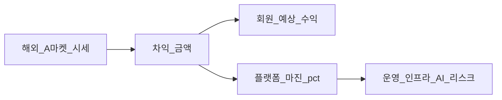

# AI Profit OS — UI & UX (v7.22.27)

> 분리 플랜 — Index: `ai_profit_os_00_index_a1b2c3d4.plan.md` · ARCHIVE: `ai_profit_os_launch_54c1261e.plan.md` · 착수전: `docs/CONSTITUTION_BOOTSTRAP.md`  
> **단일 편집본:** 워크스페이스 `.cursor/plans` 해시 파일만

> **제로 목표:** 오류0 · 결함0 · 오차0 · 중복0  
> **todo 순서:** 카피/거버넌스/Lux → 온보딩·인증·랜딩 → 홈·마진·잔액·실행실·퍼뜩 → 5탭/설정/토스트/KYC/신뢰/초대/멤버십/루프/반응형/spot-check (File-Serial)  

> **v7.22.20:** §48.3a `assetImageUrl` · `시세 불러오는 중...` · 필터 `가방`  
> **v7.22.21:** §5.3a 잔액 인식 홈 · 사진 PNG 목업 **레포 0**  
> **v7.22.22:** §5.9.1a 친구초대 **20~70 설명** · 초대횟수∞ 카피 · Money §51.5 pointer  
> **v7.22.23:** §48.6 **매칭 성공 조절** · 난수 성공률 **0** · Engine §48.13.3  
> **v7.22.24:** §5.9.2c·§51.18a **멤버십 등급·AI 해금 설명·참고율·고액 희소** · Engine §0.0.7  
> **v7.22.25:** §50.1n **알림 prefs 가입 기본 전부 ON** · §5.9.4 쪽지함 · §5.9.2c **등급 배지=Brand Kit 벡터** (사진목업 0)  
> **v7.22.26:** **§5.3b** 기회스캔 홈·`arbitrageTypeKo` · Index §20.1 · Engine §4.2a  
> **v7.22.27:** 자본참여자 · Index §20.2 · Engine §4.2b · 유저 trader 용어 **0**
> **v7.22.28:** 유저 CTA **`수익 벌기`** · domain=`participate` · `expectedSellDays` 유저0 · CTA후≈1분 · 상세=`이 기회로 수익 벌기` · `이 상품으로…` 금지  
> **v7.22.29:** Soft60/Hard90 · REQUEUE·`MATCH_TIMEOUT` 유저 카피 **3줄** · Index §20.2 · Audit A4  
> **v7.22.30:** **§48.3b** 매칭 긴장감(과정 Fact) · Soft/Hard **전 등급 동일** · 등급≠대기특권 · Index §20.2 · Audit A6  
> **v7.22.31:** 시장 카피 **동적 LabelKo** · Day-1 listing Owns=Engine §0.0.1a (ebay멀티\|admin)  
> **v7.22.32:** `yahoo_jp` **영구 배제** · 유저 「야후」·Yahoo 문자열 **0** · LabelKo만 · listing=ebay멀티\|admin only  

> **Consumer + AI 이름:** **퍼뜩** (동일) · Engine §47 P/G/S · 5탭 고정  
> **KR 유저 SSOT:** §38.9 toneBand · §50.1 fontScale 3단 · §38.8 테더준비 가이드 · **성별 UI 분기 금지**(중성 존댓말)  
> **Loop/Preflight:** **§51.24** (Admin/Engine/CATALOG pointer 대상 · 유령 절 금지)  

> **마진 공식:** Engine §0.0.4 Owns · UI=화면/카피만  
> **모델:** copy/거버넌스=`grok-4.5` · 화면 슬라이스=`composer-2.5`

## 0.1 Trust 잠금 정책 (v7.3)

| 구분 | v7.3 |
|------|------|
| LivePayoutTicker [A] | **`ticker_mode`:** off / live / demo / hybrid (§35 G4) |
| 오늘 지급 합계 [F] | **`counter_mode`:** off / ledger / demo / blended (§35 G4) |
| CountUp (거래·정산 UI) | **`settlement.completed`만** (ledger truth) |
| FOMO Coral | engine staleAt/잔여한도 · G4 ON 시 Admin boost |
| 앱 카드 "수익 확정" | **금지** · "예상 수익" SSOT |
| Product Identity 미주장 | **헌법 잠금 유지** (§1) · G1~G2 copy surface 예외 |
| fake JSON-LD 별점 | **금지** · real reviews only |
| 카지노 sfx / 슬롯 metaphor | **금지** · Lux chime only |

### §35 Growth Conversion (G1~G4 — Admin ON)

| # | 영역 | Admin | 해지/기능 |
|---|------|-------|-----------|
| G1 | **가짜 연혁·공지** | `/admin/growth/content` | `published_at` 소급 · 5년 narrative · synthetic changelog |
| G2 | **입금 유도 FOMO** | `/admin/growth/deposit` | 랜딩·공지·온보딩 과장 copy · social proof |
| G3 | **고액 입금·웨일** | `/admin/growth/whale` | **≥100,000 USDT** VIP Desk · tier ladder · OTC/고액 AML · Ultra 시계 기회 우선 노출 |
| G4 | **실시간 ticker·counter** | `/admin/growth/ticker` | fake/demo ticker · counter blend · demo queue CRUD |

**Ledger 분리 (오차0):** UI demo/blend ≠ ledger SSOT · reconciliation은 **ledger만** · audit log 필수

**유지 (기술·금융 무결성):** double-entry ledger, reconciliation, circuit breaker, KYC/AML, WebAuthn, API 보안.

---

## 5. 사용자 IA — 메뉴 SSOT (변경 금지)

### 5.1 하단 네비 (모바일) — **정확히 5개, 절대 증가 금지**

| 순서 | 아이콘 | 라벨 | route |
|------|--------|------|-------|
| 1 | 🏠 | 홈 | `/` |
| 2 | 🔥 | 수익 | `/profits` |
| 3 | 💼 | 내거래 | `/trades` |
| 4 | 💰 | 지갑 | `/wallet` |
| 5 | 👤 | 내정보 | `/me` |

### 5.2 PC 레이아웃
- **좌측 사이드바:** 동일 5메뉴 (순서·라벨·route 동일)
- **우측 메인:** 카드 3~4열 그리드, 홈=추천+피드+지급현황

### 5.3 홈 `/` — Lux 레이아웃 (5탭·IA 불변)

```
🏠 홈 (Lux Dark)  — §5.3b 기회스캔 인지 필수
 ├─ [A] LivePayoutTicker     `ticker_mode` §35 G4 (off/live/demo/hybrid) · **DayPulse와 슬롯 분리** (§51.24)
 ├─ [A2] DayPulse (live only)  오늘 실측 요약 · G4 demo 수치 merge **금지** (§51.24)
 ├─ [B] 내 USDT 잔액 (대형) + ≈원화  · 표시 우선은 prefs (아래)
 ├─ [C] 🔥 오늘 벌 수 있는 기회 Hero  · 부제: AI가 지금 시장을 스캔했어요 (engine staleAt · G4 boost)
 ├─ [D] 💰 오늘 가능한 수익 합계
 ├─ [E] 🤖 AI 추천 / 퍼뜩 한 줄 제안 (§47.12 Fact)
 ├─ [F] 🎉 오늘 지급 합계    `counter_mode` §35 G4 (ledger/demo/blended)
 └─ [G] Sticky MotionCTA      ko SSOT **"수익 벌기"** (모바일 only · 기회 바인딩 시 §48 Primary와 동일 action)
```

**Sticky CTA:** `position: sticky; bottom: calc(5tab + safe-area)` — 5탭 가리지 않음 · **PC 전폭 sticky 하단 CTA 금지** (Hero/카드 Primary만)  
**기회 Primary 정식 라벨:** `수익 벌기` (§7.3 · §48 · Index §20.2) · sticky=`수익 벌기` · 상세=`이 기회로 수익 벌기`  

**금액 표시:** 기본 KR 런칭=`≈₩` 크게 + USDT 보조 · `depositPref`는 **입금 탭**만 · 원장 SoT=USDT (Money pointer)  
**PriceCompareMargin:** 홈/상세/확인/영수증 4면 · **공식·필드=Engine §0.0.4** · UI는 컴포넌트·ko 라벨만 (재계산 금지) · **FX도 동일 컴포넌트**

### 5.3a 잔액 인식 홈·수익 피드 (표시 Owns · 삭제 금지)

> **분류·suggest = Engine §0.0.5.1** · **principal = Money §49.2a** · 본 절 = 슬롯·카피·CTA만 · **스캔 위계=§5.3b**.

| 슬롯 | 잠금 (ko) |
|------|-----------|
| Hero [C] | `affordable` 1건 우선 · `assetImageUrl` 실사진 (§48.3a) · **§5.3b 카드3단** |
| 섹션 `지금 수익 가능` | `affordable` 리스트 · Primary **`수익 벌기`** |
| 섹션 요약 줄 | `내 자본으로 가능한 기회 {n}개` (Fact) |
| 섹션 `조금 더 넣으면` | `nearMiss` · Secondary/대체 Primary **`+{suggest} USDT 넣고 열기`** → Money 딥링크 |
| 접힘 `더 큰 기회` | `lockedHigh` · 펼치기 전 미리보기 1줄 |
| 퍼뜩 한 줄 [E] | Fact: `지금 잔액으로 {N}건 · +{S}면 {M}건 더` (G레인 금지) |
| 카드 잠금 뱃지 | nearMiss=`입금하면 가능` · lockedHigh=`자본 부족` · 협박/타이머 **금지** |

**카피 SSOT** (`packages/ui/copy/ko/feed.ts`):
```typescript
T.feed = {
  homeTitle: '오늘 벌 수 있는 기회',
  homeScanSub: 'AI가 지금 시장을 스캔했어요',
  sectionAffordable: '지금 참여 가능',
  sectionAffordableCount: '내 자본으로 가능한 기회 {n}개',
  sectionNearMiss: '조금 더 넣으면',
  sectionLockedHigh: '더 큰 기회',
  ctaDepositSuggest: '+{n} USDT 넣고 열기',
  badgeNearMiss: '입금하면 가능',
  badgeLocked: '자본 부족',
  peotteokLine: '지금 잔액으로 {n}건 · +{s}USDT면 {m}건 더',
  chipTimeSensitive: '마감 임박', // P1 · tag time_sensitive · 미노출 시 키만 유지
} as const;
```

**검증:** `verify:balance-aware-feed` · `verify:opportunity-scan-surface` · `verify:no-it-jargon`

### 5.3b 기회스캔 홈·카드 표현 (v7.22.26 + §20.2 v7.22.27 · 삭제 금지 · 중복0)

> **중복0 Owns:** **레이아웃·위계·카피·금지 CTA = 본 절** · **역할/레이어 = Index §20.2** · **타입·내부필드 = Engine §4.2a·§4.2b**  
> **3초 테스트:** “이 기회에 얼마 넣고 예상 결과는?” 에 답할 수 없으면 **표현 결함**.  
> **유저 역할:** capital provider · **거래자 UX 금지**.

#### 인식 잠금

| 해야 함 | 하면 안 됨 |
|---------|------------|
| AI가 발견한 **참여 가능 수익 기회** | 상품 카탈로그·“롤렉스 사고팔기” 앱 |
| `AI 매칭 가능` + `arbitrageTypeKo` + 회랑(저가측→고가측) | category만 Hero · 구매/판매 CTA |
| 수익·실행가능성 정렬 (§0.0.5.1) | 트레이더 터미널·호가창·마켓 선택 |

#### Opportunity 카드 위계 (오차0 · price·fx 동일 · §20.2)

```
┌─ 🔥 AI 매칭 가능
├─ {buyMarketLabelKo} → {sellMarketLabelKo}  {arbitrageTypeKo} 기회
├─ assetLabel (작게·보조 · “상품 쇼핑”처럼 키우지 않음)
├─ 필요 자본     {requiredCapitalUsdt}          ← 투입
├─ 예상 수익     +{expectedProfitUsdt}  (강조·실금액) ← 결과
├─ AI 매칭 적합도 {aiConfidenceScore}%
├─ (접힘/상세) 기회 근거 PriceCompareMargin · 과거 유사 매칭+window+asOf
├─ 배지: 직접 사지 않아요 · 직접 팔지 않아요
├─ 면책: 예상 결과는 시장 상황에 따라 달라질 수 있습니다
└─ Primary [ 수익 벌기 ]
```
> `expectedSellDays` **유저 카드 노출 0** · 목표 처리≈1분은 진행실/내역(초) · Index §20.2

**FX:** 동일 위계·동일 컴포넌트 · FX 전용 카드 **금지**.  
**executionPlatforms:** 유저 카드/상세 **미노출**.

#### 필터 칩 (홈·`/profits` 공통 키)

기존: `전체 | 즉시 | 고수익 | 초보 | AI추천 | 즐겨찾기`  
**P1 추가 검토:** `마감 임박` ← `tags`∋`time_sensitive` · Day-1 칩 OFF 허용  
자본·category 칩: Engine §0.0.5 — **1급 탐색 트리 아님**

#### CTA · 유저 여정 (불변 · §20.2)

| 허용 | 금지 (CI · `verify:user-trader-jargon-0`) |
|------|------------------------------------------|
| **수익 벌기** → 투입 확인 → AI 자동 매칭 → 처리 → 수익 확정 → 정산·실금액 지급 (CTA후≈1분) | `구매하기` · `판매하기` · `마켓 둘러보기` · `거래하기` · `이 상품으로 수익 벌기` · 유저메인 `매칭 참여` |
| sticky=`수익 벌기` · 상세=`이 기회로 수익 벌기` | 호가창 · 외부 마켓 선택 · “내가 판매 중” |

**검증:** `verify:opportunity-scan-surface` · `verify:arbitrage-type-label` · `verify:cta-earn-profit` · `verify:user-trader-jargon-0` · `verify:margin-compare-surface`

### 5.4 수익 `/profits` — Market Radar (선택 뷰)

```
🔥 수익
 ├─ 필터: 🟢 전체 | ⚡ 즉시 | 💎 고수익 | 😊 초보 | 🤖 AI추천 | ❤️ 즐겨찾기 | (P1) ⏰ 마감 임박
 ├─ [Radar Mode] opportunity.created → green ping (S/A only)
 └─ VirtualOpportunityList   ← §5.3b 카드 위계 동일
```

`/profits?view=radar` — S/A: ping animation · B: static list only

**저장 전략 필터 (내정보 하위 `/me/strategies`):**
- 💰 소액 고회전 (10~50만원, 당일)
- 🚀 고수익 (100만원+)
- ⚡ 30초 완료
- 🛡️ 안정형
- 🤖 AI 자동 추천

→ 알림: "당신 전략에 맞는 기회 3건"

### 5.5 내거래 `/trades` — Lux Receipt

```
💼 내거래
 ├─ 상단: 오늘 +USDT / 이번달 +USDT (CountUp on load, tier-aware)
 ├─ ReceiptCard: 종이 출력 모션 (S/A) / instant (B) + TronScan 도장
 ├─ 진행 중 · 완료 · 거래 내역 · 월별 수익
```

### 5.6 지갑 `/wallet` — **§49 버킷 표시 SSOT**

```
💰 지갑
 ├─ 🪙 USDT 총액 (크게) + ≈ ₩
 ├─ 분리 표시 (오차0 · 숨김 금지):
 │    · 근무 중 원금 (principal)     ← 참여에 사용
 │    · 출금 가능 수익 (profit)      ← 기본 출금 대상
 │    · 진행 중 잠금 (locked)        ← 거래 중
 │    · 연습 잔액 (practice)         ← 출금·참여 불가 (있으면)
 ├─ 한 줄: "원금은 다음 수익에 쓰이고, 수익만 가져갈 수 있어요"
 ├─ 💵 원화 (동등 노출)
 ├─ ➕ 입금하기 → /wallet/deposit
 ├─ ➖ 출금하기 → /wallet/withdraw  (?mode=profit 기본)
 └─ 📜 입출금·수익 내역 (버킷별 필터)
```

### 5.7 입금 `/wallet/deposit` — **USDT · 원화 둘 다 · USDT 추천 ⭐**

**탭:** `🪙 테더(USDT) ⭐ 추천` | `💵 원화`

**기본 진입:** `?tab=usdt` (deeplink·푸시·온보딩)

#### USDT 탭 — **§41 유저 전용 주소 · 자동 확인**

```
┌─ 🪙 테더(USDT) 입금 ⭐ 추천 ─────────────────┐
│ [QR]  [내 전용 주소 복사]  ← user별 TRC20 §41 │
│ ⚡ 입금 감지→19확정 후 잔액 반영 (§43)         │
│ 🐋 10만 USDT+ 고액 입금 가능 (웨일 지원)       │
│ ── 💡 왜 USDT가 편할까요? (탭하면 펼침) ──      │
│ ① 빠름 — 온체인 확인 후 바로 거래 (원화는 검수) │
│ ② 한 흐름 — 입금→수익→출금이 USDT로 이어짐     │
│ ③ 글로벌 정산 — 해외 시세 OS와 같은 방식       │
│ ── 원화 vs USDT (쉬운 비교) ──                 │
│  원화: 국내 계좌 이체 · 검수 대기 · 통장 기록   │
│  USDT: 내 전용 주소 · **자동 확인** · 빠른 출금 │
│ ── ⚠️ 세금 안내 (면책, 고정 문구) ──            │
│  수익·세금은 개인마다 달라요.                   │
│  원화 입출금은 국내 금융 기록과 연결될 수 있어요.│
│  궁금하면 세무 전문가와 상담하세요.             │
│ [자세히 보기 → /me/guide/usdt]                 │
└────────────────────────────────────────────────┘
```

- **QR · 주소** — `GET /api/v1/wallet/my-deposit-address` · **유저마다 전용 TRC20** (§41)
- **자동 반영** — chain-watchers → ledger → SSE → `DEPOSIT_DETECTED` toast 🎉
- **WhyUsdtCard** — `packages/ui/components/trust/WhyUsdtCard.tsx` · copy `T.trust.usdt.*`
- **금지:** PG·결제모듈 · 공유 단일 입금주소(유저 surface) · "수동 확인 대기"(USDT)

#### 원화 탭 — **§41 PG-free · 운영자 승인/거절 (v7.22.12)**

```
┌─ 💵 원화 입금 (서류·PG 없음) ──────────────────┐
│ ① 입금액 입력  [________] 원                   │
│ ② 입금자명     [________] (통장 표시 이름)      │
│ ③ [입금 신청하기]                              │
│ ── 송금 안내 (Admin 대표계좌 §37) ──           │
│  국민은행 123-456-789012  예금주 ○○○           │
│  💳 입금 요청 금액  **{payableAmountKrw}원**   │
│  ⚠️ 위 금액 **그대로** 송금 (끝자리 가산 포함) │
│ ── 상태 ──                                     │
│  ⏳ 확인 중 / ✅ 반영 완료 / ❌ 거절됨          │
│ [더 빠른 USDT 입금 보기 →]                     │
└────────────────────────────────────────────────┘
```

- **PG 모듈 0** — 신청 → 송금 → **Admin [승인]/[거절]** (§41.3·§43.3) · CSV 안내 문구 **0**
- 은행명 · 계좌 · 예금주 — §37 Admin · SSE 즉시 반영
- **카피 잠금:** 「신청액과 동일」단독 문구 **금지** · 반드시 `payableAmountKrw` 숫자 노출 (§51.8)
- **짧은 안내:** "표시된 금액으로 보내 주시면, 확인 후 잔액에 반영돼요 (보통 영업시간 내)"
- **토스트/푸시 (Money owns 이벤트 · copy 여기):**
  - 토스트 본문 SSOT = **§8.2** (`KRW_DEPOSIT_SUBMITTED|APPROVED|REJECTED|EXPIRED`) — 여기 문구 재정의 금지
  - 지갑·입금 내역에 `pending|approved|rejected|expired` **항상 표시**

**Admin 변경 → 유저:** `wallet.deposit_config.updated` SSE

### 5.8 출금 `/wallet/withdraw` — **§49 수익 기본 · 원금 항상 가능 · §42 KYC 1회**

**탭 (동등):** `🪙 USDT 출금` | `💵 원화 출금`

| 탭 | route | guard |
|----|-------|-------|
| USDT | `/wallet/withdraw/usdt` | **§42 KYC** · WebAuthn · **§49 mode+bucket** · tier cap |
| 원화 | `/wallet/withdraw/krw` | **§42 KYC** · WebAuthn · **Admin 승인** · **§49 mode+bucket** · tier cap |

**출금 모드 (§49 · 기본값 잠금):**

| mode | 기본 | 차감 버킷 | UX |
|------|------|-----------|-----|
| `profit` | **✅ 기본 진입** | `profit` only | 카드 강조 · 상한=출금가능수익 |
| `principal` | 접힘/고급 | `principal` | **확인 시트 필수** (기회비용 비교) |
| `combined` | 접힘 | profit 우선 후 principal | 확인 시트 필수 · 명세 분리 |

**금지:** 원금 출금 메뉴 숨김 · 고객센터-only 원금출금 · 원금출금 시 수익 몰수  
**고정 카피:** `원금은 언제든 출금할 수 있어요. 보통은 수익만 가져가요.`

**§42 KYC 게이트 (출금만 · 1회):**
```
유저 [출금하기] 클릭
  → kycStatus !== 'approved'
  → toast: "🔐 출금하려면 본인 확인이 필요해요! 1번만 하면 돼요 😊"
  → 800ms 후 router.push('/me/kyc?return=/wallet/withdraw?mode=profit')
  → /me/kyc 에서 신청 → Admin 승인 → 이후 출금 **재요청 없음**
```

- USDT: TRC20 주소 입력 · TronScan 추적
- 원화: 등록 계좌 · 출금액 · 승인 대기 toast
- **거래(participate)는 KYC 불필요** — **principal(+명시 merge)** · circuit · pricingVersion
- 상세 SSOT → **§49**

### 5.9 내정보 `/me`

```
 👤 내정보
 ├─ 💬 퍼뜩에게 묻기          ← /me/peotteok · Canon peotteok-chat · Engine §47.12~14 P칩+G대화+S거절
 ├─ 🏅 내 등급                ← /me/membership (§5.9.2c · Engine §0.0.7)
 ├─ ✉️ 알림·쪽지              ← /me/inbox (§5.9.4 · Admin §9.8.8d)
 ├─ 👥 친구 초대              ← /me/invite (§51.5)
 ├─ 🎁 이벤트·공지            ← /me/events (notice|campaign · Growth OFF면 campaign 빈 안내)
 ├─ 🔔 알림 설정              ← §50.1n (설정과 동일 prefs)
 ├─ 💾 내 전략                ← /me/strategies
 ├─ 📞 고객센터              ← §51.6 `/me/support` 티켓·FAQ·분쟁
 ├─ 📖 이용안내
 │   ├─ /me/guide/usdt        ← 왜 테더로 충전하나요?
 │   ├─ /me/guide/get-usdt    ← 테더 준비·보내기 (§38.8 · 선택 가이드)
 │   ├─ /me/guide/revenue     ← 플랫폼은 어떻게 운영되나요?
 │   ├─ /me/guide/faq         ← 자주 묻는 질문
 │   └─ /me/guide/principal   ← 원금과 수익 출금
 ├─ 🪪 본인 확인             ← §42 (출금 1회)
 ├─ 👤 프로필 완성            ← /auth/complete-profile (Stage B · Infra §51.9.1 · 미완 시 노출)
 └─ ⚙️ 설정                  ← **§50.1 전수**
```

**금지:** 5탭에 퍼뜩 탭 추가 · 퍼뜩이 출금/지급 버튼 실행  

#### 5.9.1 친구 초대 `/me/invite` (§51.5 Viral Ladder)

```
👥 친구 초대
 ├─ [Explain] §5.9.1a 초보자 설명 (접기 기본 펼침 1회 / toneBand)
 ├─ 3단 진행: ①친구 가입 → ②친구 첫 충전 → ③친구 첫 수익 (쉬운말 · L1/L2/L3 영문 노출 0)
 ├─ 내 코드 · 공유 링크 (공유하기 / 카카오 / 복사) · **초대 인원 제한 없음** 명시
 ├─ 공유 안내: 하루 공유 보내기 한도는 **스팸 방지용** (친구 몇 명까지 ≠)
 ├─ 초대 현황: 가입 N · **혜택 진행(첫충전+) N** · 확인 중 N · 받은 보너스(수익)
 ├─ 티어: 씨앗/불꽃/로켓/고래메이커 · 시즌 순위(이름 가림)
 ├─ 공유 카드 미리보기 4종 · [자랑하기]
 ├─ 안내: 가입 직후=연습(꺼내기 불가) · 친구 충전·수익 후=내 **수익**에 보너스 · 부정 이용 시 회수
 └─ toast: 보류/회수/보너스준비중 — §8.2 REFERRAL_* · Pool대기=초대실패 카피 금지
```

**딥링크:** `/r/{code}` · 설치 후 sticky 90d · 수동 코드 입력 1회  
**성공 영수증 Secondary:** 「친구에게 자랑하고 보너스」→ share (Primary=출금/지갑 유지)  
**규칙·금액 SSOT:** Money §51.5 · 화면 숫자=서버 config 표시만 (하드코딩 금지)

#### 5.9.1a 친구 초대 설명 — KR 20~70 이해 SSOT (삭제 금지)

> **Owns:** 본 절 · toneBand=§38.9 · fontScale=§50.1 · 금액 공식=Money §51.5  
> **목표:** 20~70대 한국인이 **한 화면**에서 “뭐 하면 / 언제 돈 / 제한이 뭔지” 이해 후 공유 가능  
> **금지:** 다단계·피라미드·보장수익·IT용어(L1/edge/promo pool 영문) · 성별 분기 · “N명까지만”

**필수 블록 (Canon `invite-home`):**

| 블록 id | 쉬운말 (기본 mid · 잠금 의미) |
|---------|------------------------------|
| `title` | **친구 초대** |
| `oneLiner` | 친구를 **몇 명이든** 부를 수 있어요. 혜택은 친구가 **충전·수익**을 하면 생겨요. |
| `steps3` | ① 친구가 내 링크로 가입 ② 친구가 첫 충전 ③ 친구가 첫 수익 — 그때마다 진행 표시 |
| `whenMoney` | **지금 바로 큰돈이 들어오지 않아요.** 친구 충전·수익이 확인된 뒤, 내 **수익**으로 들어와요. |
| `practiceNote` | 가입 직후 보이는 연습 금액은 **꺼낼 수 없어요.** 연습용이에요. |
| `noCap` | **부를 수 있는 친구 수 제한은 없어요.** |
| `shareLimitNote` | 하루 공유 보내기 한도는 **너무 많은 자동 발송 방지**용이에요. |
| `holdNote` | 확인 중이거나 보너스가 잠시 멈춘 때는 **부정 이용 방지**예요. 초대가 취소된 건 아니에요. |
| `poolWaitNote` | 「보너스 준비 중」= 지급 대기 · **초대 실패 아님** |
| `abuseNote` | 같은 사람이 여러 계정으로 돌리거나 충전 직후 바로 빼면 보너스가 **회수**될 수 있어요. |
| `ctaShare` | **친구에게 링크 보내기** (Primary) |
| `ctaCode` | 코드 복사 · 직접 입력 안내 |

**toneBand 변형 (문자열만 · 의미 동일):**
- **young:** 짧은 bullet 3줄 · 이모지≤2  
- **mid:** 위 표 문장 + 작은 FAQ 3문항  
- **senior:** 한 문장씩 · 글자 크게(fontScale) · 「다음」으로 단계 읽기 허용 · 전문용어 0  

**FAQ 3 (mid/senior):**
1. Q. 가입만 하면 돈이 들어오나요? → A. 아니요. 친구가 **충전**해야 혜택이 시작돼요.  
2. Q. 몇 명까지 초대할 수 있나요? → A. **제한 없어요.**  
3. Q. 보너스는 어디서 보나요? → A. **지갑 → 수익**에 들어와요. 원금이랑 섞지 않아요.

**카피 파일:** `packages/ui/copy/ko/invite.ts` = `T.invite.*` · JSX 하드코딩 금지  
**Canon:** `packages/ui/canon/surfaces/invite-home.wire.json`  
**검증:** `verify:invite-explain-surfaces` · `verify:age-tone-surfaces` · `verify:no-it-jargon` · 월간초대캡 카피 0

#### 5.9.2 이벤트·공지 `/me/events` (§51.5b)

```
🎁 이벤트·공지
 ├─ 탭 A 공지(notice): 운영 사실만 · 보상/확정수익 문구 0 · 읽음 표시
 ├─ 탭 B 이벤트(campaign): Growth ON + live만 · 예산/기간/CTA allowlist
 ├─ Growth OFF 또는 campaign 0: "진행 중인 이벤트가 없어요" (fake 카드 금지)
 ├─ 홈 배너: notice|campaign 각 1 · dismiss persist · G4 ticker와 슬롯 분리
 └─ claim 실패: 종료/예산마감/중복 → CAMPAIGN_* toast (서버 권위)
```

**금지:** G1 FOMO seed를 notice 본문에 합치기 · campaign을 notice로 위장 · demo 금액을 이벤트 보상으로 표시

#### 5.9.2b Brand Kit Surface (중복0 · ADR-011 · ADR-013 · visual_kit_v1)

> **SSOT 경로:** `packages/ui/brand/` · `brand.manifest.json` · 소비자/AI 표기 **퍼뜩** · 코드명 AI Profit OS  
> **Visual Kit v1 (잠금):** Deep Obsidian + mint`#3DDC97` + principal`#7AA2FF` · **플래시 통찰 마크** · 한글 워드마크 · AI=추상 아바타(성별·인간형 0)  
> **ready 에셋:** `assets/icons/app-icon-1024.png` · `maskable-source-1024.png` · `wordmark/wordmark-dark.png` · `ai/avatar-512.png` · `og/og-default.png`  
> **삭제됨:** metal-hex·사진 목업 PNG — 재추가 금지 (ADR-013 · Brand ready 5종만)  
> **파이프라인:** Brand assets → (apps/web 존재 시) `public/icons/*` 리사이즈 export → `verify:brand-assets` · `verify:brand-logo-single`  
> **후속 export(앱 골격 후):** icon-192/512 · maskable-512 · apple-touch-180 · favicon · share-card×4  
> **금지:** 런타임 AI 아이콘 · 미등록 CDN · 타사 로고 · 사진목업 로고 복제 · 화면마다 다른 마크 · 코인/카지노 톤 마크

#### 5.9.2c 멤버십 등급 `/me/membership` (삭제 금지 · v7.22.24)

> **중복0 Owns:** **카피·등급표·참고율 라벨·Canon = 본 절** · **enum·승급·일일캡·해금 플래그 = Engine §0.0.7** · **Admin 강제/조회 = Admin §9.8.10**  
> **≠** 초대 티어(seed…whale_maker) · **≠** `userTier` vip_desk

```
🏅 내 등급
 ├─ 현재 등급 배지 (새싹→VIP) + 다음 등급까지 (입금/성공 조건 1줄)
 ├─ 「요즘 조건이 맞은 비율」 = fulfillRate7d (참고 · 당첨% 아님)
 ├─ AI·기능 해금 목록 (등급별 · 엔진 플래그 투영만)
 ├─ 안내 고정:
 │   · 등급이 높아도 매칭 100% 아님
 │   · 고액·VIP는 건당 수익↑ · 하루 횟수↓ (희소)
 └─ [등급별 혜택 표] 펼침 · toneBand mid/senior FAQ
```

| copyKey | 잠금 (ko) |
|---------|-----------|
| `T.membership.title` | 내 등급 |
| `T.membership.fulfillRateLabel` | 요즘 조건이 맞은 비율 |
| `T.membership.notGuaranteed` | 등급이 높아도 매번 맞는 건 아니에요 |
| `T.membership.highScarce` | 고액·VIP는 기회가 적고, 맞으면 수익이 커요 |
| `T.membership.aiUnlock*` | 등급별 해금 한 줄 (Engine aiPerkFlags) |

**Canon:** `membership-home` · route `/me/membership`  
**금지:** 성공률% 슬라이더 · “당첨” · 100% 보장 · IT등급명 노출 · 초대 티어와 동일 배지 · **등급별 Soft/Hard·대기특권·성공 구매 암시** (Index §20.2 · §48.3b)  
**등급 차별 허용(대기 외):** 일일캡·기회 노출·AI 해금·지위 카피 only (Engine §0.0.7)  
**CI:** `verify:membership-surfaces` · `verify:no-fulfill-rate-as-rule` (UI 입력 0) · `verify:match-tension-surface`

##### 등급 배지 시각 SSOT (v7.22.25 · 아이디어 잠금)

> **판정:** 사진 목업 PNG로 등급 이모지를 “맞춰 찍기” = **금지** (ADR-013).  
> **채택 = B안 Brand Kit 벡터 배지** (아래 비교 후 잠금).

| 안 | 내용 | 판정 |
|----|------|------|
| A | 유니코드 이모지 단독 (🌱➡️👑) | 보조 라벨만 허용 · OS별 글리프 달라 **주 배지 불가** |
| **B** | `packages/ui/brand/assets/membership/{sprout,entry,core,high,vip}.svg`(+png 2x) · Lux mint/principal 톤 · 플래시 마크 DNA | **✅ Day-1 SSOT** |
| C | AI/사진으로 실사 배지 목업 제작 | ❌ `docs/mockups`·사진목업 재도입 · 픽셀 QA 금지 |

**구현 규칙:**
- manifest `brand.manifest.json` → `membershipBadges.status=ready` 후 consume  
- 컴포넌트 `MembershipBadge` — SVG 우선 · emoji fallback은 a11y `aria-label`용 텍스트만  
- Admin 목록·유저 `/me/membership`·홈 칩 **동일 5에셋** (화면마다 다른 그림 0)  
- **CI:** `verify:membership-badge-assets` · `verify:brand-logo-single` 확장

#### 5.9.3 내 전략 `/me/strategies`

```
💾 내 전략
 ├─ CRUD: 소액고회전 / 고수익 / 30초 / 안정 / AI추천 (필터 프리셋)
 ├─ 알림 토글 → push `strategy_match`
 └─ [이 전략으로 수익 보기] → /profits?strategy=
```

#### 5.9.4 알림·쪽지함 `/me/inbox` (삭제 금지 · v7.22.25)

> **Owns:** 목록·읽음·카피 = 본 절 · **1인 발송 = Admin §9.8.8d** · **플랫폼 fanout = PWA §23.5a** · prefs = §50.1n

```
✉️ 알림·쪽지
 ├─ 필터: 전체 | 운영 쪽지 | 공지 | 이벤트 | 수익 기회 | 충전·출금
 ├─ 행: 아이콘 · 제목 · 미리보기 · 상대시간 · 미읽음 점
 ├─ 탭 → 딥링크(href) 또는 본문 시트
 └─ 숨기기(하드삭제 0)
```

**토스트 (차단):** `MATCH_BLOCKED` · `WITHDRAW_APPLY_BLOCKED` — 쉬운 한글 · “고객센터” CTA 선택  
**CI:** `verify:ops-inbox`

### 5.10 설정 `/me/settings` — **§50.1 SSOT (v1)**

```
⚙️ 설정
 ├─ 계정 · 보안
 │   ├─ 내 프로필
 │   ├─ 로그인 보안 (지문·얼굴·비밀번호)
 │   ├─ 본인 확인 상태
 │   ├─ 로그아웃
 │   └─ 회원 탈퇴 (깊은 곳 · 확인 2회)
 ├─ 알림                          ← §50.1n 전수
 │   ├─ 앱 알림(마스터)
 │   ├─ 수익 기회 알림
 │   ├─ 충전·출금 알림
 │   ├─ 공지 알림
 │   ├─ 이벤트 알림
 │   └─ 운영 쪽지 알림
 ├─ 보기
 │   ├─ 글자 크기: 보통 / 크게 / 더크게
 │   ├─ 화면 스타일: 어두운 화면(고정)
 │   └─ (선택) 움직임 줄이기 안내
 ├─ 내 돈 관련
 │   ├─ 기본 출금: 수익만 (§49 고정 권장)
 │   ├─ 기본 충전 탭: 테더 / 원화
 │   └─ 출금 주소·계좌 관리
 ├─ 약관과 정보 (§50.3 대본)
 │   ├─ 이용약관
 │   ├─ 개인정보 처리방침
 │   ├─ 오픈소스 고지
 │   └─ 라이선스·저작권
 └─ 앱 정보: 버전 · 고객센터
```

#### 50.1n 알림 환경설정 · 가입 기본값 (삭제 금지 · v7.22.25)

```typescript
// schemas/user-notification-prefs.v1.json — 가입 시 전부 true
interface UserNotificationPrefs {
  master: boolean;          // false면 하위 Push 전부 스킵 (인박스 저장은 유지)
  opportunity: boolean;     // 매칭/기회 공개·전략매치
  wallet: boolean;          // 충전·출금
  notice: boolean;          // 공지
  campaign: boolean;        // 이벤트
  opsMessage: boolean;      // 운영 1인 쪽지 Push
  strategyMatch: boolean;   // 내 전략 매치
}
```

| 잠금 | 내용 |
|------|------|
| **가입 기본** | **모든 채널 `true`** (마스터 포함) |
| OFF 효과 | 해당 채널 **Web Push 0** · 인박스 row는 **저장**(마스터 OFF도 동일) |
| OS 권한 | 브라우저/iOS 거부 ≠ prefs OFF · prefs ON이어도 OS 거부면 Push 실패·인박스만 |
| 금지 | 가입 시 일부 채널 기본 OFF · 끄기 UI 숨김 · prefs 무시 강제 Push |
| CI | `verify:notification-prefs-default-on` |

---

## 6. 화면별 UI/UX SSOT

### 6.1 시선 순서 (모든 카드·상세 공통 · v7.22.27 · §20.2)

1. 🔥 **AI 매칭 가능** (+ optional 마감 임박)
2. 🏷️ **기회** — 회랑 + `arbitrageTypeKo` (시세차익/환율차익)
3. 💵 **필요 자본** (`requiredCapitalUsdt`) — 투입
4. 💰 **예상 수익** (가장 크게, `--profit-emerald`)
5. 🤖 **AI 매칭 적합도** (`aiConfidenceScore` — 「판매 성공률」·당첨률 혼용 금지)
6. 🟢 **수익 벌기** (Primary · §7.3/§48) · 면책 1줄
7. ~~expectedSellDays~~ **유저 0**
8. 📦 **assetLabel** (작게·보조)
9. 📐 **기회 근거** PriceCompareMargin (저가/고가 시세 · §0.0.4) — 접힘 가능
10. 📎 footnote (§38) · 상세 **과거 유사 매칭** + window/asOf (§51.3)

### 6.2 Lux-Fintech 색상 · 타이포 · 반응형 SSOT

> **테마:** User App = **Lux Dark default** · Admin = **Ops Light default** (가독성)  
> **SSOT:** `packages/ui/tokens/lux-fintech.ts` + `CONSTITUTION/28`

| 역할 | token | hex | 용도 |
|------|-------|-----|------|
| 배경 | `--bg-obsidian` | `#090A10` | Deep Obsidian (pure #000 ❌) |
| 표면 | `--surface-elevated` | `#12131A` | 카드·시트 |
| 수익 | `--profit-emerald` | `#00FF87` | Neon Profit Emerald |
| FOMO/긴급 | `--flash-coral` | `#FF2E63` | **실제** 마감·잔여한도만 |
| 프리미엄 | `--amber-gold` | `#F59E0B` | 명품·고수익 태그 |
| USDT | `--mint-teal` | `#00D294` | 지갑·테더 |
| Primary CTA | `--action-neon` | `#1A56FF` | Pulse glow base |
| AI | `--ai-violet` | `#8B5CF6` | AI 매칭 적합도 |
| 본문 | `--text-body` | clamp | fluid §29 |
| 수익 숫자 | `--text-profit` | clamp | CountUp target |

**금지:** 카지노 레드/골드 팔ETTE 별도 · pure black `#000` · 수익=빨강

**상세 모션:** §33 · **성능 tier:** §29 (중복 정의 ❌)

### 6.3 UI 카피 (헌법 준수)
- 영어·IT 전문용어 화면 노출 ❌ (§25)
- **수익 확정 금지** — "예상 수익" + 리스크 tooltip (§35 G2는 **공지·랜딩·온보딩**만 예외)
- 차트/호가 등 UX 금지 (§22 레이아웃 유지)

### 6.4 온보딩 — 체험형 (SSOT · ≤15초 · §19 게이트 동일) — v7.22.11

> **중복0:** Auth 필드=Infra §51.9 · 랜딩 3초 예산=Infra §31.2b · KYC 서류/상태=Money §42 · Canon wires=`packages/ui/canon/surfaces/onboarding-*.wire.json`  
> **목표:** “읽고 넘기기”가 아니라 **한 번 눌러 체험** 후 홈 진입 · 가입 전·후 동일 톤

```
0 (≤2초·필수) toneBand 선택 또는 시드
   · UI: [짧게 볼게요] young · [비교로 볼게요] mid · [한 줄씩 볼게요] senior
   · 시드: attribution.landingVariant → §38.9 표 (Infra §31.2 pointer) · 유저 재선택 승
   · fontScale: senior 선택 시 기본=크게 (§50.1) · mid/young=보통
1 IDENTITY (Canon: onboarding-identity) ≤3초
   · 브랜드 히어로=퍼뜩 · 한 줄 정체성 · PriceCompareMargin 미니 · 면책 1줄
   · 금지: 통계 스트립·보장 CTA·성별 분기
2 DEMO TAP (Canon: onboarding-demo-card) ≤5초
   · 데모 기회 카드 1장 · 탭 → practice-only 참여 미리보기(원장 기록 0 또는 practice만)
   · 배너: "연습·미리보기 · 출금 아님" (§51.7 pointer)
3 USDT (기존 step2) 🪙 toneBand variant + [왜 USDT?] · [테더 없어요→§38.8]
4 ACTION (기존 step3) 💰 CTA 라벨 SSOT=[수익 벌기]
5 PAYOUT+GO (기존 4+5) 🎉 지갑 지급 · [시작하기] → depositPref (§50.1) 또는 `/`
```

**가입 후 상태머신 (pointer · Auth=§51.9):**  
`signed_up` → `onboarding_incomplete` → (step0~5) → `ready` · 중도이탈=재진입 resume · skip 허용 스텝=3(USDT)만(면책/정체성/데모 **필수**)

**온보딩 §38 톤 (중복0 · SSOT=§38.9):** young=짧은 bullet · mid=비교표 · senior=큰 글씨+한 줄씩+다음 버튼형  
**금지:** 성별(남/여) 온보딩 분기 · 성별 전용 카피/테마 · 데모에서 실출금 유도

**CI:** `verify:onboarding-experiential` · `verify:canon-surfaces` (onboarding-identity · onboarding-demo-card 필수)

### 6.4b 로그인·가입 surface (UI owns · 필드 SSOT=Infra §51.9)

| Canon | route | Primary | 비고 |
|-------|-------|---------|------|
| `auth-login` | `/auth/login` | Kakao | Google·Passkey secondary · Email tertiary |
| `auth-signup` | `/auth/signup` | Kakao | Stage A 즉시 가입 · Stage B 프로필=§51.9.1 |
| `auth-complete-profile` | `/auth/complete-profile` | 저장하고 계속 | Stage B · 출금/KYC 전 필수 · displayName·phone·birthDate·email* |

**금지:** 히어로 통계·수익보장·주민번호 입력·성별 필드 · IT 용어

**CI:** `verify:auth-surfaces`

### 6.4e 퍼뜩 채팅 surface (UI owns wire · Runtime SSOT=Engine §47.12~47.14)

| Canon | route | Primary |
|-------|-------|---------|
| `peotteok-chat` | `/me/peotteok` | (없음 · 칩 + 자유입력) |

블록: 브랜드 · 대화 로그(stream partial) · **P레인 Fact 칩**(입금/미션/출금안내/가이드) · 입력창 · (선택) lane 배지 비노출(유저 IT용어 0)  
**동작:** 칩→P · 자유입력→Intent P|G|S · S면 “출금은 지갑에서 직접” 템플릿+deep-link · G stream · P는 숫자 Fact tools  
**면책 1줄(고정):** “앱 숫자·상태는 원장 기준이에요. 일상 답은 참고용이에요.”  
**degrade:** G 쿼터/장애 시 채팅에 busy 템플릿 + toast `PEOTTEOK_LLM_BUSY` (§8.2) · P칩/Fact 안내는 유지  
**금지:** 자율 출금 CTA · Twin 잔액 · 실체결 암시 · 성별 멘트 · “모든 질문 완벽” 카피  
**CI:** `verify:ai-coach-fact-only`(P) · `verify:ai-general-no-money-tools`(G UI path) · `verify:ai-coach-no-autonomy` · `verify:llm-quota-degrade`

### 6.4c 랜딩 첫화면 3초 예산 (UI owns wire · route SSOT=Infra §31.2)

Canon `landing-3s` · `firstViewportMaxBlocks=5`: 브랜드 · 정체성 1줄 · 면책 1줄 · Primary CTA 1 · 신뢰 1줄  
**금지:** 카드 다발·스케줄·stat strip·보장 수익 · 사진 픽셀 복제  
**CI:** `verify:landing-3s`

### 6.4d KYC surface (UI owns wire · 규칙 SSOT=Money §42)

Canon: `kyc-guide` → `kyc-doc-capture` → `kyc-confirm` · Lux 금융 톤 · **주민번호 타이핑 0**  
**CI:** `verify:kyc-surfaces`

---

## 7. 버튼 구성 SSOT (전수)

### 7.1 Global

| 버튼 | 위치 | action | guard |
|------|------|--------|-------|
| 시작하기 | 온보딩 | → `/` | 1회 |
| 시작하기 | 홈 Hero | → `/profits/{id}` | — |

### 7.2 홈

| 버튼 | action |
|------|--------|
| 시작하기 (Hero) | opportunity detail |
| 카드 탭 | `/profits/{id}` |

### 7.3 수익 · 상세

| 버튼 | label | action | guard |
|------|-------|--------|-------|
| Primary | **수익 벌기** | POST `/opportunities/{id}/participate` → `/trades/{id}/execute` (§48) | balance, circuit, **pricingVersion+minProfitUsdt (§43)**, staleAt≤policy, rate limit (**KYC ❌ §42**) |
| Secondary | ❤️ 즐겨찾기 | toggle favorite | auth |
| Tertiary | 📋 실행 경로 보기 | expand platforms | — |

**필수 배지(Primary 인근):** `직접 사지 않아요` · `직접 입찰·판매 안 함` (§48.2)  
**잔액 부족 시 Primary 대체:** `잔액 충전 후 참여` → `/wallet/deposit?tab=usdt`

### 7.4 거래 진행 `/trades/{id}/execute` — **§48 SSOT (Canon 3면 · ADR-013)**

> 구 `AI 거래중...` 한 줄 UI **폐기**. 아래 3화면으로 **100% 대체**.

| 상태 | 화면 (§48) | Primary | Secondary |
|------|------------|---------|-----------|
| `running` / `requeue` | **AI 진행실** | (없음·자동) | `그만두기` (orchestrate cancel) |
| `success` | **수익 들어옴 영수증** | `확인 · 지갑 보기` → `/wallet` | `다른 상품 보기` → `/profits` |
| `safe_stop` (시세변동·미달 등) | **안전하게 멈춤** | `비슷한 상품 보기` | `홈으로` |
| `failed` (시스템) | 안전중단 변형 또는 toast | `고객센터` / `홈으로` | — |

### 7.5 지갑 · 입출금

| 버튼 | action |
|------|--------|
| ➕ 입금하기 | `/wallet/deposit` (USDT·원화 탭) |
| 🪙 USDT 입금 | `/wallet/deposit?tab=usdt` |
| 💵 원화 입금 | `/wallet/deposit?tab=krw` |
| ➖ 출금하기 | `/wallet/withdraw` |
| 🪙 USDT 출금 | `/wallet/withdraw/usdt` |
| 💵 원화 출금 | `/wallet/withdraw/krw` |
| 📋 주소/계좌 복사 | clipboard + toast |

### 7.6 내정보

| 버튼 | action |
|------|--------|
| 친구 초대 | share link + referral code |
| 알림 설정 | toggle matrix |
| 전략 저장 | CRUD saved-strategies |

### 7.7 버튼 whitelist 원칙
- Primary 1개/화면 (한 화면 = 한 행동)
- Destructive = Confirm modal 필수
- Disabled 시 toast로 이유 (침묵 실패 금지)

---

## 8. 토스트 · 알림 SSOT (중복0)

### 8.1 3축 분리 (혼용 금지)

| Surface | Resolver | Tone | visibleToasts |
|---------|----------|------|---------------|
| User error | `resolveToastDetail` | **쉬운 한글 + 이모지 1~2 필수** (§50.2) | 1 |
| User success (금융) | `toastSurfaceMessage` | 쉬운 한글 + 이모지 1~2 + 금액 합성 | 1 |
| Admin | `resolveAdminToastDetail` | **왕초보 한글 평문** · 이모지 ≤1 · IT용어 0 | 2 |

**금지:** `CODE_MESSAGES`를 cute로 rewrite · ErrorState에 toast resolver 연결 · 유저 토스트에 영문 코드·HTTP·스택 · 어드민 토스트에 DLQ/API/Error 등

### 8.2 User Toast Catalog (필수)

| code | toast (KO) | trigger |
|------|------------|---------|
| `INSUFFICIENT_BALANCE` | 😅 USDT가 부족해요. 입금 후 다시 시도해 주세요 | participate |
| `KYC_WITHDRAW_REQUIRED` | 🔐 출금하려면 본인 확인이 필요해요! 1번만 하면 돼요 😊 | withdraw tap · **→ /me/kyc auto** |
| `KYC_PENDING` | ⏳ 본인 확인을 검토 중이에요. 잠시만 기다려 주세요 🙏 | kyc submitted |
| `KYC_REJECTED` | 😔 본인 확인이 반려됐어요. 다시 신청해 주세요 | kyc rejected |
| `KYC_APPROVED` | ✅ 본인 확인 완료! 이제 출금할 수 있어요 🎉 | admin approve |
| `CIRCUIT_OPEN` | ⏸️ 잠시 거래를 멈췄어요. 곧 다시 열릴게요 | any money |
| `RATE_LIMITED` | 🐢 잠깐만요! 너무 빠르게 눌렀어요 | click spam |
| `OPPORTUNITY_EXPIRED` | ⏰ 이 기회는 방금 마감됐어요 | stale participate |
| `EXEC_SAFE_STOP_PRICE` | 🛡️ 가격이 움직여서 이번엔 안전하게 멈췄어요 | execute PRICE_MOVED |
| `EXEC_SAFE_STOP_MIN` | 🛡️ 예상보다 적어져서 진행하지 않았어요 (잔액 그대로) | execute BELOW_MIN_PROFIT |
| `EXEC_SUCCESS` | 🎉 수익이 들어왔어요 | settlement.completed |
| `EXEC_CANCELLED` | 중단했어요. 잔액은 그대로예요 | user cancel |
| `WITHDRAW_PROFIT_OK` | 🎉 수익 출금을 신청했어요 | profit withdraw |
| `WITHDRAW_PRINCIPAL_WARN` | 원금을 빼면 다음 기회 참여가 줄어들 수 있어요 | principal confirm |
| `INSUFFICIENT_PROFIT` | 출금 가능한 수익이 부족해요 | profit mode |
| `INSUFFICIENT_PRINCIPAL` | 근무 중 원금이 부족해요. 충전 후 참여해 주세요 | participate |
| `PRACTICE_NOT_WITHDRAWABLE` | 연습 잔액은 출금할 수 없어요 | practice |
| `MERGE_PROFIT_OK` | 수익을 원금에 합쳤어요. 다음 기회에 바로 쓸 수 있어요 | merge |
| `DEPOSIT_DETECTED` | 👀 USDT {amount} 입금 감지! 확정까지 잠시만요 | §43 1 confirmation (잔액 미반영) |
| `DEPOSIT_CONFIRMED` | 🎉 USDT {amount} 입금 확정! 바로 거래할 수 있어요 | §43 19 confirmations + ledger |
| `KRW_DEPOSIT_SUBMITTED` | 📝 원화 입금 신청 접수! 송금 후 확인해 드릴게요 | krw request |
| `KRW_DEPOSIT_APPROVED` | ✅ 원화 입금이 확인됐어요. 잔액에 반영됐어요 🎉 | admin approve (§5.7 동일) |
| `KRW_DEPOSIT_REJECTED` | 😔 원화 입금을 확인할 수 없어요. 내역에서 이유를 확인해 주세요 | admin reject (§5.7 동일) |
| `KRW_DEPOSIT_EXPIRED` | ⏰ 입금 신청이 만료됐어요. 다시 신청해 주세요 | TTL expire |
| `WITHDRAW_SUBMITTED` | 📤 출금 요청을 받았어요 | withdraw |
| `TRADE_COMPLETE` | 🎉 +{amount} USDT 지급 완료! | settlement |
| `NETWORK_ERROR` | 📡 연결이 불안정해요. 다시 시도해 주세요 | fetch fail |
| `SESSION_EXPIRED` | 🔐 다시 로그인해 주세요 | 401 |
| `ACCOUNT_FROZEN` | ⏸️ 계정이 일시 정지됐어요. 고객센터에 문의해 주세요 | admin freeze |
| `ACCOUNT_BANNED` | 🚫 이용이 제한된 계정이에요 | admin ban |
| `WITHDRAW_BLOCKED` | 📤 출금이 일시 중지됐어요 | admin restrict |
| `BALANCE_ADJUSTED` | 💰 잔액이 조정됐어요 | admin ledger adjust |
| `DEPOSIT_CONFIG_UPDATED` | 🔄 입금 정보가 업데이트됐어요 | SSE (optional toast) |
| `MIN_HOLDING` | ⏳ 원금은 충전 후 {hours}시간이 지나야 출금할 수 있어요 | §11.2 principal/combined |
| `WITHDRAW_FEE_HINT` | 💸 이체 수수료 {fee} USDT가 빠져요 | withdraw confirm |
| `REFERRAL_BOUND` | 🤝 초대가 연결됐어요! | code bind L1 |
| `REFERRAL_L2_PENDING` | ⏳ 친구 첫충전 보너스를 확인 중이에요 | L2 hold window |
| `REFERRAL_L2_RELEASED` | 🎉 초대 보너스가 수익에 들어왔어요 | L2 release |
| `REFERRAL_CLAWBACK` | ↩️ 어뷰징으로 초대 보너스가 회수됐어요 | wash/clawback |
| `REFERRAL_HELD` | ⏸️ 초대 보너스가 잠시 보류됐어요 | risk hold |
| `REFERRAL_CAP` | 📊 오늘 공유 보내기 한도에 도달했어요 | share API/day · **초대 인원캡 아님** |
| `REFERRAL_POOL_WAIT` | ⏳ 보너스를 준비 중이에요. 초대는 유지돼요 | queued_pool |
| `REFERRAL_SHARE_LIMIT` | 🐢 공유는 하루 {n}번까지예요 | share rate |
| `CAMPAIGN_CLAIM_OK` | 🎁 이벤트 보너스를 받았어요 | campaign claim |
| `CAMPAIGN_ENDED` | ⏰ 이 이벤트는 종료됐어요 | claim after end |
| `CAMPAIGN_BUDGET` | 📭 이벤트 예산이 마감됐어요 | budget_exhausted |
| `CAMPAIGN_DUP` | ✋ 이미 받은 보너스예요 | idempotent claim |
| `NOTICE_PUSH` | 📢 새 공지가 있어요 | notice live+push |
| `PEOTTEOK_LLM_BUSY` | 🤖 퍼뜩이 잠시 바빠요. 조금 뒤 다시 물어봐 주세요 | Engine §47.13 G레인 쿼터/429/degrade |

### 8.3 Push / In-app Notification

| category | title 예 | href |
|----------|----------|------|
| `ai_pick` | 🤖 AI 추천 — +18.5 USDT | `/profits/{id}` |
| `strategy_match` | 💾 내 전략에 맞는 기회 3건 | `/profits?strategy=` |
| `deposit` | 🎉 입금 확인 | `/wallet` |
| `withdraw` | 📤 출금 처리 중/완료 | `/wallet/history` |
| `promo` | 🎁 이벤트 (campaign live · Growth ON) | `/me/events?tab=campaign` |
| `notice` | 📢 공지 | `/me/events?tab=notice` |
| `referral` | 🤝 초대 보너스 / 보류 안내 | `/me/invite` |

### 8.4 중복0 기술

- DB: `UNIQUE (user_id, source_event_id) WHERE source_event_id IS NOT NULL`
- Insert 23505 → re-select existing (race defense)
- Sonner: user `visibleToasts={1}` id single-flight
- Push + In-app + Toast 동시: **1 source_event → 1 toast OR 1 in-app** (정책 테이블)

---

## 33. Lux-Fintech Design · Motion · FOMO (v7 신규)

> **SSOT:** `CONSTITUTION/28_LUX_FINTECH_DESIGN_AND_MOTION.md`  
> **토큰:** `packages/ui/tokens/lux-fintech.ts` + `tailwind.preset.lux.ts`  
> **성능 tier 수치:** §29/26 SSOT (여기서 재정의 ❌)

### 33.0 피드백 검토 — 동의 vs 수정 (오차0)

| 피드백 | 판정 | 플랜 반영 |
|--------|------|-----------|
| Deep Obsidian `#090A10` 배경 | ✅ 동의 | `--bg-obsidian` default |
| Neon Profit Emerald `#00FF87` | ✅ 동의 | `--profit-emerald` |
| Flash Coral FOMO red | ✅ **조건부** | **실제 staleAt/한도**만 |
| Amber Gold 프리미엄 | ✅ 동의 | `--amber-gold` tags |
| Mint Teal USDT | ✅ 동의 | `--mint-teal` wallet |
| Count-Up 0.3s | ✅ 동의 | `CountUpNumber` tier-aware |
| Pulse CTA 1.5s glow | ✅ 동의 | `MotionCTA` + reduced-motion off |
| S/A/B blur·particle 분기 | ✅ 동의 | §33.3 = §29 tier 연동 |
| Sticky 대형 CTA | ✅ 동의 | §5.3 [G] |
| Market Radar ping | ✅ 동의 | `/profits?view=radar` |
| Receipt print + TronScan | ✅ 동의 | `ReceiptCard` |
| **Live 익명 지급 ticker** | ✅ **G4 Admin** | `ticker_mode`: off / live / demo / hybrid |
| **카지노 칩 사운드** | ❌ **금지** | **Lux chime** (§23.7) |
| **카지노 슬롯 Count-Up 톤** | ⚠️ **수정** | fintech count-up · slot metaphor ❌ |
| **폭죽 Confetti 3중** | ⚠️ **수정** | tier S/A: light burst · B: flash only · reduced-motion: none |
| **"3초 차익 수령" CTA** | ❌ **금지** | ko SSOT **"수익 벌기"** (sticky **"수익 벌기"**) |
| **고급 카지노 심리 연출** | ❌ **금지** | **명품관 Lux-Fintech** reframe |
| **CONSTITUTION 23** | ❌ **충돌** | **`28`** (23=PWA) |
| DopamineButton name | ⚠️ **rename** | **`MotionCTA`** (카지노 연상 ↓) |

### 33.1 Visual Identity Lock (중복0)

```typescript
// packages/ui/tokens/lux-fintech.ts — SSOT
export const luxFintech = {
  bgObsidian: '#090A10',
  surfaceElevated: '#12131A',
  profitEmerald: '#00FF87',
  flashCoral: '#FF2E63',
  amberGold: '#F59E0B',
  mintTeal: '#00D294',
  actionNeon: '#1A56FF',
  aiViolet: '#8B5CF6',
} as const;
```

**테마 적용:**
- `apps/web` → `class="theme-lux-dark"` on `<html>`
- `apps/admin` → `theme-ops-light` (운영 가독성, §9)

### 33.2 도파민 · FOMO 4대 모션 (G4 Admin-configurable)

| # | 장치 | 컴포넌트 | 데이터 소스 (mode) |
|---|------|----------|-------------------|
| 1 | **Count-Up** | `CountUpNumber` | **ledger only** (settlement.completed) |
| 2 | **Live Ticker** | `LivePayoutTicker` | live=SSE · demo=Admin queue · hybrid=blend |
| 3 | **Pulse CTA** | `MotionCTA` | CSS `@keyframes pulse-glow` |
| 4 | **Tri-Sensation** | `MotionCTA` + `feedback.ts` | vibrate + lux chime + tier particle |

**LivePayoutTicker ko 예:**
> live: "방금 ○○○님이 +420,000원 정산" (`settlement_id`)  
> demo: Admin 템플릿 · hybrid: live+demo interleave

**홈 [F] counter:** `counter_mode` ledger / demo / blended — Admin `/admin/growth/ticker`

**FOMO Coral:** engine `urgency` · G4 ON 시 Admin intensity boost

### 33.3 Tier × Motion Matrix (§29 연동, 재표기 최소)

| 연출 | S | A | B |
|------|---|---|---|
| Card bg | backdrop-blur-xl | rgba surface | opaque surface |
| Settlement particle | canvas light burst | CSS spark | opacity flash only |
| Count-Up duration | 300ms | 400ms | 150ms (minimal) |
| Pulse CTA | ON | ON | static border (no glow) |
| Radar ping | ON | fade ping | OFF |
| Price tick anim | spring 100ms | fade 500ms | number swap 1s |
| Haptics+sound | full | full | visual only |

**`prefers-reduced-motion: reduce`** → **전 tier: motion OFF** (법칙 최우선)

### 33.4 핵심 컴포넌트 SSOT

```
packages/ui/components/lux/
├── CountUpNumber.tsx       # requestAnimationFrame, tier duration
├── LivePayoutTicker.tsx    # Virtual scroll · ticker_mode §35 G4
├── MotionCTA.tsx           # Pulse + onSuccess feedback hook
├── LuxHeroCard.tsx         # 3D tilt S/A only (pointer-fine)
├── MarketRadarPing.tsx     # SSE opportunity.created
├── ReceiptCard.tsx         # print slide + TronScan badge
└── index.ts
```

**Props contract:**
```typescript
interface LivePayoutTickerProps {
  mode: 'off' | 'live' | 'demo' | 'hybrid';
  events?: SettlementTickerEvent[];
  demoQueue?: DemoTickerEvent[];  // Admin CRUD §35 G4
  maxItems: 50;
}
interface HomePayoutCounterProps {
  mode: 'off' | 'ledger' | 'demo' | 'blended';
  ledgerTotal?: Decimal;
  demoSeed?: { base: Decimal; hourlyBoost?: Decimal };
}
```

### 33.5 Tailwind / Animation Tokens

```typescript
// tailwind.preset.lux.ts
extend: {
  colors: { obsidian: '#090A10', profit: '#00FF87', ... },
  keyframes: {
    'pulse-glow': { '0%,100%': { boxShadow: '0 0 0 0 rgba(0,255,135,0.4)' }, '50%': { boxShadow: '0 0 24px 4px rgba(0,255,135,0.6)' } },
    'count-roll': { /* opacity only on B */ },
  },
  animation: {
    'pulse-glow': 'pulse-glow 1.5s ease-in-out infinite',
  },
}
```

### 33.6 Lux UX Abuse · 오류

| # | 시나리오 | 방어 |
|---|----------|------|
| D1 | Unbounded demo ticker spam | Admin rate cap + max queue size |
| D2 | Count-Up on expected not settled | CountUp only on `settlement.completed` |
| D3 | FOMO red always on | server `urgency` or G4 flag |
| D4 | B-tier GPU spike | tier class + CI perf budget |
| D5 | Motion when reduced-motion | CSS media query hard off |
| D6 | Demo mode without audit | `ticker_mode≠live` → audit log required |

### 33.7 CI Gates (§34)

- `verify:lux-tokens` — no hardcoded hex outside lux-fintech.ts
- `verify:ticker-mode-audit` — demo/hybrid modes emit audit events
- `verify:motion-tier` — B-tier screenshot: no backdrop-filter
- `verify:cta-copy` — no "차익 수령"/"수익 확정" in **앱 카드·진행 중** (성공 화면 `확정 지급` 배지만 §48 허용)
- `verify:mockup-governance` — ADR-013 · 사진목업 픽셀기준 0 · Canon checklist만
- `verify:canon-surfaces` — Canon wire JSON ↔ 구현 surface 필드/위계 일치
- `verify:brand-logo-single` — Brand Kit wordmark/icon 단일 해시

### 33.8 Mockup Governance SSOT (v7.22.4 · ADR-013 · 오류0)

> **헌법:** 사진/PNG 목업은 로고·톤·여백이 **서로 다름**. 픽셀 SSOT로 쓰면 화면이 깨지거나 화면마다 다른 앱이 된다.  
> **잠금:** 구현·에이전트는 **시각 복제 금지**. 구조·플로우 의도만 허용.

#### 33.8.1 권위 사다리 (오차0 · 상위 승)

| 순위 | SSOT | 용도 |
|------|------|------|
| 1 | `packages/ui/tokens` · Lux · Brand Kit | 색·타입·로고·아이콘·간격 토큰 |
| 2 | `packages/ui` 컴포넌트 · 5탭 IA · §8 toast · copy/ko | 재사용 UI·카피 |
| 3 | 본 플랜 절(§5/§7/§48…) + Canon wire | 화면 위계·필수 블록·CTA |
| — | ~~사진 PNG 목업~~ | **레포 삭제됨** · 재추가 금지 · 인덱싱 제외 |

**충돌 시:** 1>2>3만. 외부 사진·기억 속 목업과 다르면 **무시**.

#### 33.8.2 사진 목업 — 강제 무시 목록 (결함0)

에이전트/구현이 사진에서 **절대 가져오면 안 되는 것:**

- 로고·워드마크·파비콘·스플래시 (→ Brand Kit만)
- 색 헥스·그라데이션·그림자·블러 (→ Lux tokens)
- 폰트 패밀리·크기 px (→ fluid type tokens)
- 여백·카드 radius·아이콘 세트 (→ spacing/radius/icon SSOT)
- 잘못된 하단 탭·영문 헤더·타사 마크·난수 성공률 UI
- “목업이랑 픽셀 동일” QA 기준

**허용 (구조 의도만):** 블록 순서 · Primary 1개 · 정보 위계(제목>금액>CTA) · 화면 목적(진행/성공/중단)

#### 33.8.3 Canon Surfaces (진짜 시각 SSOT)

```
packages/ui/canon/
  manifest.json                 # surface id → route · checklist
  surfaces/
    execution-running.wire.json
    execution-success.wire.json
    execution-safe-stop.wire.json
    admin-execution-policy.wire.json
    # … 홈/지갑/초대 등 추가 시 동일 패턴
.cursor/rules/mockup-governance.mdc  # alwaysApply · 사진목업 경로 0
```

**Canon wire 필수 필드:** `route` · `blocks[]`(id, role, copyKey) · `primaryCta` · `forbidden[]` · `brandRef=packages/ui/brand`  
**승격 규칙:** 새 화면은 Canon wire 작성 **후** 구현. 사진만 주고 “똑같이” 구현 **금지**.  
**스크린샷:** 필요 시 구현 후 Canon+Brand로 **앱 실화면**만 촬영 · `docs/mockups` 재생성 **금지**.

#### 33.8.4 어뷰징·오류 매트릭스 (MUP*)

| # | 실패 모드 | 방어 |
|---|-----------|------|
| MUP1 | 화면마다 다른 로고 | Brand Kit 단일 · `verify:brand-logo-single` |
| MUP2 | 목업 색/여백 복제로 깨짐 | 토큰 only · hex hardcode Fail |
| MUP3 | 탭/IA가 목업따라 drift | 5탭 불변 · `verify:ia-tabs` |
| MUP4 | §48를 사진 픽셀 QA | Canon checklist · 픽셀 diff 금지 |
| MUP5 | archive PNG를 SSOT 경로로 import | `_archive` import Fail CI |
| MUP6 | 에이전트가 목업 첨부 복제 | rule alwaysApply · ADR-013 |
| MUP7 | Canon 없이 화면 추가 | `verify:canon-surfaces` Fail |
| MUP8 | 성공률/영문 헤더 목업 잔재 | §48.0 + copy CI |

#### 33.8.5 에이전트 운영 규칙 (중복0)

1. UI 작업 시 **사진 목업을 열지 않음** (기본). 열어도 구조 의도만.  
2. 구현 전 Canon wire + Brand + Lux 확인.  
3. “목업이랑 똑같이” 요청 → **Canon/토큰 기준으로 재해석** 후 구현 (픽셀 맞추기 거부).  
4. 리뷰 지적에 사진-픽셀 불일치 = **비결함** (ADR-013). Canon/플랜 불일치만 결함.

---

## 34. Lux-Fintech 출시 게이트

- [ ] User app Lux Dark theme applied
- [ ] CountUp fires only on real settlement E2E
- [ ] `ticker_mode=live`: LivePayoutTicker = ledger only
- [ ] `ticker_mode=demo`: Admin queue renders · audit logged
- [ ] `counter_mode=blended`: ledger+demo sum · admin preview matches user
- [ ] MotionCTA opportunity Primary = ko SSOT **"수익 벌기"** (sticky **"수익 벌기"** · PC 전폭 sticky 금지)
- [ ] B-tier: no blur, no particle, 45fps+ scroll
- [ ] reduced-motion: all lux motion OFF
- [ ] 320px sticky CTA clears 5-tab nav
- [ ] **ADR-013:** 사진목업 시각복제 0 · Canon 4면+Brand 단일 로고 · `verify:mockup-governance` PASS

---

## 38. 신뢰 교육 — USDT 납득 · 플랫폼 수익 투명 (v7.5)

> **SSOT:** `CONSTITUTION/38_TRUST_EDUCATION_AND_REVENUE_TRANSPARENCY.md` · §5.7 · §6.4 · `/me/guide/*`  
> **대상:** 한국 유저 **20~70대** · 초등어휘~존댓말 · **면책 문구 CI 잠금**

### 38.1 설계 원칙

| 원칙 | 설명 |
|------|------|
| **USDT 추천, 원화 선택** | USDT default · 원화 강제 금지 |
| **납득 > 설득** | "왜 이 플랫폼 구조인지" 설명 · 과장 FOMO 분리(§35) |
| **세금=면책** | "세금 0" **금지** · "개인·상황별" + 세무사 상담 권장 **고정** |
| **운영 수익=투명** | 플랫폼이 **어디서** 버는지 숫자·도식 공개 |
| **연령 톤** | **§38.9 toneBand** — young/mid/senior (아래 SSOT) |
| **성별** | **중성 존댓말만** · 남/여 UI·카피·테마 분기 **영구 금지** |

### 38.2 왜 USDT로 충전하나? — ko SSOT (`T.trust.usdt`)

**핵심 메시지 (3줄 — 모든 surface 공통):**
1. **이 플랫폼은 해외 시세 차익 OS** → 정산 통화가 **USDT(테더)** 로 맞춰져 있어요.
2. **USDT 입금 = 입금 확인 후 바로 거래** · 원화는 **은행 검수** 후 반영돼요.
3. **원화 입출금**은 국내 **통장 기록**과 연결될 수 있어요 · USDT는 **플랫폼 지갑 정산** 흐름이에요.

**비교표 (입금 페이지 · /me/guide/usdt):**

| | 🪙 USDT ⭐ | 💵 원화 |
|---|-----------|---------|
| 속도 | 자동 확인 · 빠름 | 검수 · 느림 |
| 거래 연결 | 입금→거래→출금 **한 통장(지갑)** | USDT 환산 후 거래 |
| 기록 | 플랫폼 정산 · TronScan 추적 | **국내 은행 계좌 이체** |
| 추천 | **대부분 회원 선택** | 익숙한 분만 |

**세금·소득 관련 (면책 블록 — CI 잠금, Admin 편집 불가):**
> 수익 발생 시 **세금·신고 의무는 개인 상황**마다 달라질 수 있습니다.  
> 원화로 입·출금하면 **국내 금융 기록**과 연결될 수 있습니다.  
> USDT 정산은 **플랫폼 글로벌 정산 방식**이며, **세금이 없다고 보장하지 않습니다.**  
> 궁금하시면 **세무 전문가**와 상담해 주세요.

**금지 표현:** 탈세 · 무조건 신고 안 됨 · 세금 0 · 불법 아님 보장

**비유 copy (60~70대):**
- "해외 쇼핑몰에서 받는 **달러 정산**처럼, 여기서는 **테더(USDT)** 로 맞춰요."
- "통장 대신 **앱 지갑**에 쌓였다가, 필요할 때 꺼내 쓰는 구조예요."

### 38.3 플랫폼은 어떻게 돈을 버나? — 투명 수익 모델

> **화면:** `/me/guide/revenue` · 거래 상세 하단 · 온보딩 optional  
> **원칙:** "회원 돈을 가져간다" ❌ → **"시세 차이에서 플랫폼 마진"** ✅



**유저에게 보이는 설명 (ko):**

| 질문 | 답 (plain ko) |
|------|----------------|
| **플랫폼 수입은?** | 글로벌 **시세 차이(스프레드)** 에서 **플랫폼 마진 %** (§9.5.2 · §36) |
| **회원 수익은?** | 차익에서 마진·수수료 뺀 **예상 순수익** (카드 1순위 숫자) |
| **입금금을 가져가?** | **아니요** — 입금은 **내 지갑(ledger)** · 플랫폼은 **거래마다 마진** |
| **마진율은?** | Admin 설정 · **카드/상세에 "포함 수수료"** footnote (투명) |
| **0% 이벤트?** | Growth ON 시 **프로모 풀** — 평소 마진과 **분리** 표시 |

**OpportunityCard footnote (작게):**
> "예상 수익에는 플랫폼 운영 수수료(마진)가 반영된 금액이에요."

**Admin:** `/admin/growth/content` 또는 `/admin/content/trust` — **비교·수익 설명** copy 편집 · **면책 블록만 잠금**

### 38.4 UI 컴포넌트 · 라우트

```
packages/ui/components/trust/
├── WhyUsdtCard.tsx              # 입금·온보딩
├── UsdtVsKrwCompareTable.tsx
├── PlatformRevenueExplainer.tsx # /me/guide/revenue
├── TrustFAQAccordion.tsx        # /me/guide/faq
└── TaxDisclaimerBlock.tsx       # CI locked — Admin override ❌

apps/web/app/
├── wallet/deposit/page.tsx      # WhyUsdtCard + NetworkPlainWarning + tabs
├── me/guide/usdt/page.tsx
├── me/guide/get-usdt/page.tsx   # §38.8
├── me/guide/revenue/page.tsx
└── me/guide/faq/page.tsx
```

### 38.5 Copy 파일 (`packages/ui/copy/ko/trust.ts`)

```typescript
export const trust = {
  usdt: {
    recommendBadge: '⭐ 추천',
    headline: '왜 테더(USDT)로 충전하나요?',
    reason1: '해외 시세 OS — 정산이 USDT로 맞춰져 있어요',
    reason2: '입금 확인 후 바로 거래할 수 있어요',
    reason3: '입금→수익→출금이 한 지갑에서 이어져요',
    krwNote: '원화는 익숙하지만 검수 대기가 있어요',
  },
  revenue: {
    headline: '플랫폼은 어떻게 수익을 내나요?',
    body: '시세 차이에서 플랫폼 마진을 받아요. 회원 입금금을 가져가지 않아요.',
    marginLabel: '포함된 운영 수수료',
  },
  disclaimer: { /* CI locked — see CONSTITUTION/38 appendix */ },
};
```

### 38.6 CI · 출시

- `verify:trust-copy` — 금지어 scan: 탈세 · 세금0 · 무조건 · 100% 안전
- `verify:tax-disclaimer` — 입금·guide·온보딩에 면책 블록 **필수 존재**
- `verify:age-tone-surfaces` — toneBand별 온보딩·Trust·퍼뜩(AI) variant 키 존재 · 성별 분기 문자열 0
- `verify:deposit-network-plain-ko` — 입금 USDT 탭에 네트워크 한글 경고 100% · `TRC20` 렌더 0
- `verify:font-scale-three` — 설정 글자 3단 + senior 기본≥크게
- [ ] **§38.6b spot-check:** **20대 · 40대 · 60~70대** 각 **3명**(남녀 혼합·중성 과제 · 성별 UI 분기 0) — "USDT 왜?" · fontScale 읽기 · 입금 네트워크 한글 경고 · senior/xl 밝은 실내 가독성
- [ ] `/me/guide/revenue` — 마진 footnote ↔ Admin `platform_margin_pct` 일치
- [ ] `verify:objection4` — 4반박 답변 surface(온보딩·입금게이트·FAQ·상세) 100%

### 38.7 광고유입 4대 반박 — Objection UX (v7.14) SSOT

광고·부업 키워드로 들어온 유저의 **이탈 질문 4개**.  
답은 마케팅 문구가 아니라 **제품 구조 + 화면 증거**로 한다.

#### Q1. “유저에게 수익 많이 주면 회사는 뭘로 벌어요?”

| 레이어 | 설계 |
|--------|------|
| 한 줄 | “회사는 **시세 차이 안의 운영 마진**으로 벌어요. 회원 지갑 돈을 가져가지 않아요.” |
| 증거 UI | `PriceCompareMargin`에서 **유저 마진 / 플랫폼 마진** 두 줄 분리 표시 |
| 도식 | A시장 매수가 → B시장 매도가 → **차이 100** 중 회원 85 · 플랫폼 15 (예시 %, Admin 실제값 연동) |
| 금지 | “회원 수익을 깎아서” 톤 · “영원히 공짜” |

#### Q2. “왜 내가 입금해야 돼요?”

| 레이어 | 설계 |
|--------|------|
| 비유 | “부동산 앱이 집을 대신 사 주지 않듯, **기회에 넣을 내 자본**이 필요해요.” |
| 구조 | 입금 = **내 지갑 잔액(ledger)** · 거래 담보 · 출금 가능 자산 |
| 증거 UI | 입금 전: 기회 카드는 보이되 CTA=`잔액 충전 후 참여` · 입금 후: 같은 카드로 즉시 참여 |
| 소액 | “**10 USDT부터** 가능한 소액 기회” 칩으로 Q2 완화 (§0.0.5 micro) |

#### Q3. “회사에서 돈 주고 그걸로 하면 안 돼요?”

| 레이어 | 설계 |
|--------|------|
| 한 줄 | “회사 돈으로 대신 넣어 주면 **내 수익이 아니라 회사 투자**가 돼요. 여기는 **내 자본으로 기회에 참여**하는 구조예요.” |
| 보조 | 데모/연습: **모의 잔액 1회** 가능하되 **실출금 0** · “연습과 실제는 분리” 배지 |
| 금지 | 가입 보너스 실USDT를 ‘회사 대납 원금’처럼 포장 · 원금보장 |
| 대안 | 첫 참여 수수료 할인(프로모 풀)은 OK · **원금 대납은 금지** |

#### Q4. “부업인데 왜 돈을 넣어요?”

| 레이어 | 설계 |
|--------|------|
| 재정의 | “알바형 부업(시간→시급)이 아니라 **시세차익형 부업(자본→마진)** 이에요.” |
| 비교표 | `시간형 부업` vs `이 앱(자본형)` 2열 — 입금 이유·수익 원천·리스크를 plain ko로 |
| 안심 | 소액 밴드·출금 경로·비교 근거 숫자 · “원하면 언제든 출금 신청” |
| 금지 | “돈 안 넣어도 수익” · “클릭만 하면 월급” |

#### 배치 (언제 보여 줄까)

```
광고 랜딩 히어로 하단: Objection 2줄 요약 + [자세히]
온보딩 step: "회사는 마진으로 / 나는 내 자본으로" 1장
첫 입금 게이트 모달: Q2+Q4 필수 확인 체크 1개 후 입금 폼
/me/guide/faq: Q1~Q4 아코디언 (항상)
기회 상세 하단: Q1 미니 (플랫폼 마진 한 줄) + [수익 구조 보기]
```

#### 컴포넌트 추가

```
packages/ui/components/trust/
├── ObjectionFourAccordion.tsx   # Q1~Q4
├── CapitalVsWageCompare.tsx     # Q4 부업 유형 비교
├── DepositWhyGate.tsx           # 첫 입금 전 납득 모달
└── DemoWalletBanner.tsx         # 모의 연습 (실출금 0)
```

#### Copy SSOT (`packages/ui/copy/ko/objections.ts`)

```typescript
export const objections = {
  q1: {
    q: '유저 수익을 주면 회사는 뭘로 벌어요?',
    a: '두 시장 가격 차이 중 일부를 운영 마진으로 받아요. 내 지갑 잔액은 회사 수입이 아니에요.',
  },
  q2: {
    q: '왜 내가 입금해야 돼요?',
    a: '기회에 참여할 내 자본이에요. 입금은 내 지갑에 보관되고, 거래 후 남은 돈은 출금할 수 있어요.',
  },
  q3: {
    q: '회사가 돈을 줘서 시작하면 안 돼요?',
    a: '회사 돈으로 하면 내 부업이 아니에요. 연습은 모의로, 실제 수익·출금은 내 입금으로만 가능해요.',
  },
  q4: {
    q: '부업인데 왜 돈을 넣어요?',
    a: '시간 팔아 시급 받는 알바와 달라요. 시세 차이로 마진을 노리는 자본형 부업이라 소액부터 내 돈이 필요해요.',
  },
};
```

### 38.8 테더 준비·보내기 가이드 (`/me/guide/get-usdt`) — v7.22.10

> **owns:** 본 절 · Money §41 네트워크 경고는 **pointer**  
> **목적:** USDT가 없는 유저(특히 mid/senior)가 **원화 대안** 또는 **테더 준비→보내기**를 쉬운 말로 이해  
> **금지:** 특정 거래소 필수 추천·수익 보장·탈세 암시 · 화면 `TRC20`/`ERC20`/`BEP20` 문자열

**화면 블록 (순서 고정):**
1. **먼저 선택:** [원화로 충전] → `/wallet/deposit?tab=krw` · [테더로 충전] → 아래 2~4  
2. **테더(USDT)란?** 한 줄 · WhyUsdt 링크  
3. **준비:** “거래소·지갑 앱에서 테더(USDT)를 준비한 뒤, **아래 네트워크 이름과 같은지** 확인해요” (외부 브랜드 필수 표기 금지 · 일반명만)  
4. **보내기 주의 (입금 화면과 동일 문장):** Money §41.6 `T.wallet.networkWarning`  
5. **잘못 보냈어요:** `/me/support` + §51.11 wrong-chain 안내 링크  
6. **세금 면책:** TaxDisclaimerBlock (Admin 편집 불가)

**컴포넌트:** `GetUsdtGuide.tsx` · `NetworkPlainWarning.tsx` (입금 USDT 탭 상단 고정)  
**CI:** `verify:deposit-network-plain-ko` · guide route 존재

### 38.9 toneBand · 연령 톤 배선 (중복0 · v7.22.10)

> **enum SSOT:** `schemas/user-ux-prefs.v1.json` → `toneBand: 'young'|'mid'|'senior'`  
> **카피:** `T.*.{young|mid|senior}` 또는 shared + `senior` override · JSX 하드코딩 금지  
> **성별:** 분기 **0** (중성 존댓말만)

| toneBand | 기본 매핑 | 카피 형태 | fontScale 기본 |
|----------|-----------|-----------|----------------|
| `young` | 랜딩 tt / 선택 “짧게” | 짧은 bullet · 이모지 허용 | `md`(보통) |
| `mid` | 랜딩 meta / “비교로” | 비교표·2열 | `md` |
| `senior` | 랜딩 google / “한 줄씩” | 한 문장+다음 · 단계 번호 | `lg`(크게) 이상 |

**시드 규칙 (오차0):**
1. `UserAttribution.firstTouch.landingVariant` ∈ {`tt`→young, `meta`→mid, `google`→senior} (Infra §31.2)  
2. 온보딩 step0에서 **유저 재선택 승**  
3. `fontScale=xl`(더 크게)로 바꾸면 toneBand를 senior로 **강제하지 않음**(독립) · 다만 온보딩 최초 senior 선택 시 fontScale≥lg  
4. Twin/ prefs에 저장 · 퍼뜩(AI) Fact로 제공 (Engine §47.12)

**다크 고정 보완 (Light 테마 금지 유지):** senior·xl에서 `--text-contrast`·줄간격↑ · spot-check에 “밝은 실내” 조건 포함 (§38.6b)

**CI:** `verify:age-tone-surfaces` · `verify:font-scale-three`

---

## 29. Performance · Responsive · Device-Tier (v5)

| 피드백 | 판정 | 플랜 반영 |
|--------|------|-----------|
| 320px~4K 반응형 | ✅ 동의 | breakpoint + container SSOT |
| clamp() fluid typography | ✅ 동의 | `--text-*` tokens |
| @container 카드/버튼 | ✅ 동의 | OpportunityCard, TouchButton |
| min-height 48px 터치 | ✅ 동의 | `--touch-min: 48px` |
| flex-shrink:0 on controls | ✅ 동의 | 버튼·탭·CTA |
| TanStack Virtual | ✅ 동의 | 수익 피드·지급 ticker·어드민 큐 |
| Device S/A/B tier | ✅ 동의 | `packages/sdk/device-tier.ts` |
| B-tier blur/무거운 motion OFF | ✅ 동의 | tier class `data-tier=b` |
| B-tier WS batch 1s | ✅ 동의 | realtime-service contract |
| Admin TOP5 | ✅ 동의 | §9.5 위젯 (route 중복 없음) |
| TronScan 어드민 링크 | ✅ 동의 | wallet review rows |
| **1px 오차 0** | ⚠️ **수정** | **visual regression + container query** — 절대 1px 보장 ❌ |
| **60fps 무력 보장** | ⚠️ **수정** | **60fps 목표 + tier degrade + perf budget CI** |
| CONSTITUTION **21**번 | ❌ **충돌** | **`26`** (21=GROWTH) |
| **px font 전면 금지** | ⚠️ **수정** | **font-size는 rem/clamp** · 1px border/hairline 허용 |
| **모든 버튼 nowrap** | ⚠️ **수정** | Primary CTA nowrap+ellipsis · 좁은 container에서 clamp 축소 |
| deviceMemory만으로 tier | ⚠️ **수정** | **복합 시그널** (아래 §29.3) |
| Auto-Fit Text JS | ⚠️ **보조** | CSS clamp 1순위 · JS는 `@container` 초과 시만 |
| CPU 5% 미만 | ⚠️ **목표치** | Lighthouse TBT + Long Task monitor |
| Framer Motion S/A 풀가동 | ⚠️ **수정** | **`prefers-reduced-motion` 항상 최우선** |
| "무인 제어" 완전 자동 | ⚠️ **수정** | **원클릭 보조** — 고액·출금 human Confirm |

### 29.1 반응형 4대 법칙 (코드 SSOT)

#### 법칙 1 — Fluid Typography & Container Queries

```css
/* packages/ui/responsive/fluid-type.css */
:root {
  --text-body: clamp(0.875rem, 0.5rem + 1.2vw, 1.125rem);
  --text-profit: clamp(1.5rem, 1rem + 3vw, 2.75rem);
  --text-caption: clamp(0.75rem, 0.65rem + 0.4vw, 0.875rem);
}
.opportunity-card { container-type: inline-size; }
@container (max-width: 280px) {
  .profit-amount { font-size: clamp(1.25rem, 8cqi, 1.75rem); }
}
```

**MUST:** `font-size` 신규 = clamp 또는 `var(--text-*)`  
**ALLOW:** `1px` border / divider  
**NEVER:** `font-size: 14px` 단독 hardcode

#### 법칙 2 — Touch Target Guard

```css
/* packages/ui/responsive/touch-target.css */
.touch-target {
  min-height: var(--touch-min, 48px);
  min-width: var(--touch-min, 48px);
  flex-shrink: 0;
  padding-inline: clamp(0.75rem, 2cqi, 1.25rem);
}
.touch-target__label {
  white-space: nowrap;
  overflow: hidden;
  text-overflow: ellipsis;
  max-width: 100%;
}
@container (max-width: 320px) {
  .touch-target__label { font-size: clamp(0.75rem, 4cqi, 0.875rem); }
}
```

**5탭 하단 네비:** 아이콘+짧은 ko 라벨, 320px에서 ellipsis  
**JS Auto-Fit:** `FitText` optional — clamp로 해결 안 될 때만

#### 법칙 3 — Device Tiering (S / A / B)

```typescript
// packages/sdk/device-tier.ts
export type DeviceTier = 'S' | 'A' | 'B';

export function detectDeviceTier(): DeviceTier {
  const cores = navigator.hardwareConcurrency ?? 2;
  const memory = (navigator as any).deviceMemory; // undefined on iOS
  const reduced = window.matchMedia('(prefers-reduced-motion: reduce)').matches;
  const saveData = (navigator as any).connection?.saveData;
  if (reduced || saveData) return 'B';
  if (memory != null && memory <= 2) return 'B';
  if (cores <= 4) return 'B';
  if (memory != null && memory >= 8 && cores >= 8) return 'S';
  return 'A';
}
```

| Tier | 조건(요약) | UX |
|------|------------|-----|
| **B** | reduced-motion / saveData / RAM≤2GB / cores≤4 | blur OFF, particle OFF, motion minimal, WS **3s** batch |
| **A** | default | standard motion, WS **1s** |
| **S** | RAM≥8 + cores≥8 | full motion, haptics, WS **0.5s**, optional 120Hz |

**HTML:** `<html data-tier="b">` — CSS `[data-tier=b] .glass { backdrop-filter: none }`

**iOS deviceMemory 미지원:** cores + `prefers-reduced-motion` + measured FPS fallback

#### 법칙 4 — DOM Virtualization

| 리스트 | 컴포넌트 | threshold |
|--------|----------|-----------|
| `/profits` feed | `<VirtualOpportunityList>` | >20 items |
| 홈 지급 ticker | `<VirtualTicker>` | >50 rows |
| 어드민 검수함 | `<VirtualReviewQueue>` | >30 rows |

**패키지:** `@tanstack/react-virtual`  
**MUST:** overscan 3 · estimateSize from card height token · skeleton same height (layout shift 0)

### 29.2 Breakpoint SSOT (viewport + container)

| 이름 | width | 테스트 필수 |
|------|-------|-------------|
| **xs** | 320px | Galaxy Fold narrow, old Android |
| **sm** | 390px | iPhone standard |
| **md** | 768px | tablet portrait |
| **lg** | 1280px | laptop |
| **xl** | 1920px | FHD desktop |
| **2xl** | 3840px | 4K — max-width container, no stretch |

**4K:** `max-width: 1440px` content rail + `margin: 0 auto` — 카드 무한 늘어남 방지

### 29.3 Performance Budget (60fps **목표**)

| Metric | S/A target | B target | CI |
|--------|------------|----------|-----|
| LCP | <2.0s | <2.5s | Lighthouse |
| INP | <100ms | <200ms | Lighthouse |
| CLS | <0.05 | <0.05 | Lighthouse |
| FPS (scroll) | ≥55 avg | ≥45 avg | perf e2e |
| Long Task | <50ms | <100ms | OTel RUM |
| JS bundle (web) | <180KB gzip | <150KB gzip | size limit |

**NEVER:** `will-change` 남용 · main thread particle · tier B blur

### 29.4 packages/ui 컴포넌트 (공통 SSOT)

```
packages/ui/
├── responsive/
│   ├── fluid-type.css
│   ├── touch-target.css
│   └── container.css
├── components/
│   ├── TouchButton.tsx       # min 48px + ellipsis
│   ├── FluidCard.tsx         # @container + OpportunityCard
│   ├── VirtualList.tsx       # TanStack wrapper
│   ├── BottomNav5.tsx        # 5탭 잠금
│   └── AdminTop5Widgets.tsx  # §9.5
├── copy/ko/
└── tokens.css
```

### 29.5 Admin ↔ Performance 연동

| TOP5 | tier 영향 |
|------|-----------|
| 돈줄 전광판 | B=3s refresh, S=1s |
| 검수함 Virtual | >30건 virtualize |
| 긴급 정지 | tier 무관 **100ms** |

### 29.6 Realtime Batch Contract (중복0)

```typescript
// services/realtime-service subscribe policy
interface StreamPolicy {
  tier: DeviceTier;
  opportunityFeedMs: 500 | 1000 | 3000;
  payoutTickerMs: 1000 | 3000 | 5000;
}
```

Client tier → query param or first WS message · server respects

### 29.7 CI Gates (§30)

- `verify:responsive` — 320/390/768/1280/1920/3840 screenshot diff
- `verify:touch-target` — all interactive ≥48px
- `verify:no-px-fonts` — ast scan apps/web, apps/admin
- `verify:virtual-list` — feeds >20 use VirtualList
- Lighthouse perf ≥85 (mobile), ≥90 (desktop)

---

## 30. Performance · Responsive 출시 게이트

- [ ] 320px E2E — 5탭·Hero CTA·거래버튼 **클립/overflow 0**
- [ ] 3840px — content rail centered, no ultra-wide stretch
- [ ] `data-tier=b` — backdrop-filter computed none
- [ ] Virtual list 10k items — heap stable, no tab crash
- [ ] Admin TOP5 — TronScan link, circuit <100ms drill
- [ ] `prefers-reduced-motion` — motion OFF
- [ ] visual regression PASS all breakpoints

---

## 27. Korean-First UX (v5/v7) — 쉬운 한글 SSOT


> **SSOT:** `CONSTITUTION/25_KOREAN_FIRST_UX_POLICY.md`  
> **코드 SSOT:** `packages/ui/copy/ko/*` + `schemas/ui-copy-glossary.v1.json`

### 27.0 피드백 검토 — 동의 vs 수정 (오차0)

| 피드백 | 판정 | 플랜 반영 |
|--------|------|-----------|
| 유저·어드민 UI 영어 0% | ✅ **동의** (범위 명확화) | **화면 노출 0%** — 코드/API/로그는 영어 OK |
| 초등학생·70대·초보 운영자 톤 | ✅ 동의 | copy 가이드 + lint |
| Spread→차익금액, Wallet→내 지갑 등 | ✅ 동의 | glossary SSOT |
| 어드민 Adapter→해외 시세 수집기 | ✅ 동의 | admin 12모듈 ko 라벨 |
| ko.ts 상수 강제, 하드코딩 금지 | ✅ 동의 | ESLint + useCopy |
| CONSTITUTION **20**번 | ❌ **번호 충돌** | **`25_KOREAN_FIRST`** (20=SECURITY) |
| 영어 **한 글자도** 무예외 | ⚠️ **수정** | **예외 화이트리스트** §27.4 (브랜드·USDT·AI) |
| 22와 금지어 중복 | ⚠️ **분리** | 22=레이아웃 · 25=모든 문자열 |
| packages/ui/constants/ko.ts 단일 파일 | ⚠️ **구조화** | `copy/ko/user.ts` + `admin.ts` + `toast.ts` |
| "수익 확정!" 카피 | ⚠️ **수정** | **"예상 수익"** — 헌법 00 Identity와 충돌 방지 |
| i18n en.ts v1 | ⚠️ **보류** | v1 ko-only, **폴더 구조만 en 확장 준비** |

### 27.1 3-Layer 언어 분리 (중복0)

| Layer | 언어 | 예 |
|-------|------|-----|
| **L1 화면 (User+Admin)** | **한국어만** | `T.user.wallet.title` → "내 지갑" |
| **L2 코드·API·DB** | 영어 | `SettlementLedger`, `/api/v1/wallet` |
| **L3 약관·헌법·ADR** | 한국어+법률용어 | 투자 아님 명시 |

**NEVER:** L2 문자열을 L1에 직접 렌더 (`{error.code}`, `{status}`)

### 27.2 Copy 패키지 구조

```
packages/ui/copy/
├── ko/
│   ├── user.ts          # T.user.* — 5탭, 카드, 지갑, 온보딩
│   ├── admin.ts         # T.admin.* — 12모듈, 버튼, 테이블 헤더
│   ├── toast.ts         # T.toast.* — schemas/toast-codes mirror
│   ├── push.ts          # T.push.* — 알림 title/body
│   ├── trust.ts         # T.trust.* — §38 USDT·수익·면책
│   ├── settings.ts      # T.settings.* — §50.1
│   ├── legal.ts         # T.legal.* — §50.3 약관4종 대본
│   ├── operator.ts      # T.operator.* · T.legal.operator — §50.9 DET 푸터
│   ├── principal-profit.ts
│   ├── execution.ts
│   └── glossary.ts      # G.status.* G.adminJob.* — enum→한글
├── use-copy.ts          # useCopy('user.wallet.title')
└── index.ts
```

**사용 패턴 (MUST):**
```tsx
// ✅
<h1>{T.user.home.greeting}</h1>
// ❌ FAIL
<h1>Hello</h1>
<h1>Wallet</h1>
```

**동적 데이터:** `assetLabel`(Rolex Submariner) = **시장 데이터** → glossary 거치지 않음 (§27.4)

### 27.3 유저 화면 — 금지어 → 표시어 (전수 SSOT)

| 금지 (화면 노출) | 표시 (ko) |
|------------------|-----------|
| Spread | 차익 금액 / 예상 순수익 |
| Opportunity | 수익 기회 |
| Wallet | 내 지갑 |
| Asset | 내 자산 |
| Deposit | 충전하기 |
| Withdraw | 출금하기 |
| Pending | 지급 대기 중 |
| Settlement | 정산 완료 |
| Network Fee / Gas | 이체 수수료 |
| Margin | (유저 UI **금지**) → "예상 수익" |
| Arbitrage, ROI, PnL | **전부 금지** |
| KYC | 본인 확인 |
| TRC20 / Blockchain / Token | **숨김** → "테더(USDT)" / "입금 주소" |
| Execute / Confirm / Submit | 수익 벌기 / 투입 확인 / 신청하기 |
| Matching / Orchestrate / Pipeline | 진행 중 / AI가 진행 중 |
| Principal / Profit bucket | 근무 중 원금 / 출금 가능 수익 |
| Idempotency / Webhook / SSE | **화면 금지** |
| Staging / QA / Debug / Testnet | **화면 금지** |
| Mock / PoC / MVP / Beta | **화면 금지** (유저·어드민) |
| API / JSON / Schema / Endpoint | **화면 금지** |
| Ledger / Double-entry | 장부 / 받을돈·줄돈 기록 |
| Hot wallet / Sweep / Gas | 회사 금고 / 모으기 / 이체 수수료 |

**5탭 라벨 (잠금):** 홈 · 수익 · 내거래 · 지갑 · 내정보

**카피 톤 (유저 · 쉬운말 · 20~70대 · 남녀 공통):**
- ❌ "지금 누르면 45,000원 **수익 확정**!" / 한자·영어·법률체 남발
- ❌ 성별 호칭·성별 전용 테마/일러스트 강제 (남/여 분기 **금지**)
- ✅ "예상 수익 **+45,000원**" + "실제 금액은 달라질 수 있어요"
- ✅ 문장 짧게 · **중성 존댓말** · 초등~중학생도 이해 가능한 단어
- ✅ 토스트·푸시: **한글 + 이모지 1~2개** (§50.2)
- ✅ 연령 표현 차이 = **toneBand만** (§38.9) · 성별 아님

### 27.4 화면 노출 예외 화이트리스트 (오차0)

| 예외 | 이유 | 규칙 |
|------|------|------|
| **USDT** | 국제 표준 + 사용자 요청 | "12.45 USDT" + ≈원화 병기 |
| **AI** | 국내 보편 약어 | "AI 추천" OK · "Artificial Intelligence" ❌ |
| **브랜드·모델명** | 시장 데이터 | Rolex, iPhone 등 (카드 하단 작게) · 금지 adapter 브랜드를 **시세 출처**로 표기 ❌ |
| **₩ / 원** | 원화 | "₩17,200" · "약 1만 7천원" |
| **숫자·%** | universal | "+12.45", "91%" |

**NOT 예외 (여전히 금지):** KRW 라벨, BTC, ETH, TRC20, Pending, Failed, Test, Debug, Staging, Mock, API, JSON, Error 500, null, undefined

**브랜드 예외 추가 잠금:** Chrono24 등 **금지 시세출처 브랜드를 ‘시세 출처’로 표시 금지** (상품명 시장데이터와 별개 · §0.0.2)

### 27.5 어드민 — 왕초보 운영자용 한글만 (IT·개발·테스트 용어 화면 0)

> **헌법:** 프로그래밍 지식 0인 운영자도 **한눈에** 이해.  
> **어드민 화면에 영어 IT/개발/테스트/문서 용어 절대 노출 금지** (§50.4 확장 금지어).

| 내부 (코드/로그 · 비노출) | 어드민 화면 표시 (오직 이것) |
|---------------------------|-------------------------------|
| Market Adapters | 해외 시세 수집기 |
| Settlement Ledger | 입출금·정산 장부 |
| Double-Entry Journal | 받을돈·줄돈 기록 (쌍으로) |
| Risk / Anomaly | 사기·이상 거래 방지 |
| DLQ | 다시 해야 할 실패 목록 |
| NATS / JetStream / Kafka | **화면 금지** → 필요 시 `실시간 알림 줄` |
| Temporal / Workflow | 자동 처리 대기줄 |
| Feature Store | 시세·회원 자료함 |
| Circuit Breaker | 긴급 정지 |
| Reconciliation | 장부 맞춤 검사 |
| Shadow Replay | 어제 숫자 다시 맞춰보기 |
| KYC / AML | 본인 확인 / 이상한 돈 흐름 감시 |
| WebAuthn | 지문·얼굴로 확인 |
| Idempotency | 같은 요청 두 번 막기 (화면 설명문만) |
| Webhook / SSE / gRPC | **화면 금지** |
| Staging / QA / Testnet | **화면 금지** |
| successRatePercent | **화면 금지** |

**어드민 상세:** 기본 한글만.  
내부번호(기회번호 등)가 필요하면 라벨을 **`관리 번호`** 로만 · **"개발자 보기" 영문 토글 금지** → 필요 시 RBAC `기술지원` 역할에 **`자세한 관리 번호 보기`**(한글) default OFF.

### 27.6 API 오류 · 상태 → 한글 (결함0)

```
problem.code (영어, 내부) → glossary.ts → toast/inline (한글)
```

| code | 유저 표시 |
|------|-----------|
| INSUFFICIENT_BALANCE | USDT가 부족해요 |
| CIRCUIT_OPEN | 잠시 거래를 멈췄어요 |
| OPPORTUNITY_EXPIRED | 이 기회는 방금 마감됐어요 |

**금지:** `{error.message}`, `{problem.code}`, HTTP 503 등 **raw 노출**

### 27.7 CI · ESLint 강제 (오류0)

| Gate | 명령 | Fail 조건 |
|------|------|-----------|
| Hardcoded UI | ESLint `no-hardcoded-ui-text` | JSX string literal in apps/web, apps/admin |
| English leak | `verify:korean-ui.mjs` | `[A-Za-z]{3,}` in rendered copy keys (whitelist 제외) |
| Glossary coverage | `verify:glossary-coverage` | 모든 ProblemCode·TradeStatus enum에 ko mapping |
| Admin plain | `verify:admin-plain-language` | IT·개발·테스트 금지어 in admin.ts values |
| No jargon | `verify:no-it-jargon` | 유저·어드민 렌더 트리 금지어 (§50.4) |
| Toast emoji | `verify:toast-emoji` | 유저 toast 이모지 1~2 · 어드민 ≤1 |
| Legal plain | `verify:legal-plain-ko` | 약관4종 어려운말/영문IT 스캔 |
| Operator footer | `verify:operator-footer` | schema ↔ footer ↔ legal operator block 일치 |
| check:light | CI | 위 전부 GREEN |

**스캔 제외:** `route`, `className`, `data-testid`, import path, 주석, **L2 코드파일**(화면 번들 문자열만 검사)

### 27.8 PWA · Push · Install 한글 (카피 Owns=UI · 구현=PWA §23)

| surface | ko SSOT |
|---------|---------|
| manifest `name` / apple-title | 퍼뜩 |
| Install prompt iOS | "홈 화면에 추가하면 앱처럼 쓸 수 있어요" |
| Install Android | "1초 만에 앱 설치" |
| Offline banner | "📡 연결 확인 후 다시 시도" + 새로고침 |
| SW update | "새 버전으로 새로고침" |
| Push title | `T.push.*` · §8.3 — 예: "🤖 AI 추천 — +18.5 USDT" |

manifest `lang: ko-KR` · `description` 한국어 only · **theme/bg 색=Lux·PWA §23.1** (카피 절에서 hex 재정의 금지)  
**Canon:** `install-ios` · `install-android` · `offline-banner` (PWA 구현 todo)
### 27.9 Korean UX 어뷰징 · 오류

| # | 시나리오 | 방어 |
|---|----------|------|
| K1 | API detail 영어 그대로 toast | resolveToastDetail + glossary 필수 |
| K2 | Admin raw enum on screen | admin.ts + plain-language lint |
| K3 | Dynamic adapter name leak | adapter.displayNameKo 필수 필드 |
| K4 | Copy drift (22 vs 25) | 22는 25 pointer only |
| K5 | Hardcoded "Wallet" in new PR | ESLint fail |

---

## 28. Korean-First 출시 게이트

- [ ] `verify:korean-ui` PASS
- [ ] `verify:glossary-coverage` 100%
- [ ] `verify:admin-plain-language` PASS
- [ ] `verify:no-it-jargon` PASS (유저+어드민)
- [ ] `verify:toast-emoji` PASS
- [ ] `verify:legal-plain-ko` PASS (§50 약관4종)
- [ ] `verify:operator-footer` PASS (§50.9 DET 1135431 · PRE-OWNED WATCHES L.L.C)
- [ ] 설정: 다크/밝은/시스템 토글 **없음** · 글자 크기 있음 (§50.1)
- [ ] 유저 5탭·어드민 12메뉴 **라벨 = admin.ts/user.ts 일치**
- [ ] 스크린샷 회귀 — 영어 pixel 0 (브랜드·USDT·AI 예외만)
- [ ] problem.code raw 노출 E2E 0건
- [ ] 왕초보 운영자 워킹: 입출금 검수·긴급정지·회원찾기 **가이드 없이 완료**

---

## 48. AI 진행실 · 성공/안전중단 · Admin 진행정책 (v7.18) — Canon 4면 SSOT

> **ADR-013:** 사진 PNG 목업 **레포 삭제됨** · 재추가 금지 · **픽셀 SSOT 아님**.  
> **시각·구조 SSOT:** `packages/ui/canon/surfaces/execution-*.wire.json` + Lux + Brand Kit only  
> **헌법:** `CONSTITUTION/48_AI_EXECUTION_ROOM_AND_POLICY.md`  
> **카피:** `packages/ui/copy/ko/execution.ts` = `T.execution.*`  
> **스키마:** `schemas/execution-policy.v1.json` · `schemas/trade-execution-state.v1.json`  
> **검증:** `verify:execution-surfaces` + `verify:canon-surfaces` — Canon 체크리스트·카피·금지어 100% (**사진 픽셀 diff 금지**)

### 48.0 사진목업 drift 교정 (플랜·Canon 승 · 오차0 · ADR-013)

| 사진목업에 보이는 현상 | 구현 잠금 (사진 무시) |
|-----------|-----------|
| 화면마다 로고·톤 다름 | **Brand Kit + Lux만** · 사진 로고/색 복제 금지 |
| 성공 화면 하단 탭이 분석/상품/알림 등으로 보임 | **5탭 불변:** 홈·수익·내거래·지갑·내정보 · 성공 후 **지갑 탭 하이라이트**만 |
| 안전중단 영문 `MATCH FAILURE` | 유저 노출 **`매칭 중단`** (ko) · 블록 위계는 Canon wire |
| 추천 카드 `AI 매칭 성공률 92%` | 필드는 **`aiConfidenceScore`** · 라벨 **`AI 매칭 적합도 92%`** (난수 당첨·판매성공률 아님) |
| Admin 사이드바 단순화 | 톱레벨 **12모듈 유지** + **2b 진행 정책** 자식 링크 |
| 성공 카드 `이베이 판매 완료` | **시스템 상태 문구** (유저가 판 것 아님) · 배지 `직접 사지 않아요`·`직접 팔지 않아요` 병기 |
| 여백·카드·아이콘이 장마다 다름 | spacing/radius/icon **토큰 단일** · 장별 미세조정 금지 |

### 48.1 유저 플로우 (행동 최소)

```
상세/홈 Primary [수익 벌기] · 상세 대안 [이 기회로 수익 벌기]
  + 배지: 직접 사지 않아요 · 직접 팔지 않아요
  → 투입 금액 확인 시트
  → POST /opportunities/:id/participate  (잔액·circuit·pricingVersion·minProfit·stale)
  → /trades/:id/execute
       ├─ running/requeue → AI 매칭·처리 진행실 (§48.3)  ← 대기 Fact optional
       ├─ success         → 수익 영수증 (§48.4)  ← settlement.completed 후에만
       └─ safe_stop       → 안전하게 멈춤 (§48.5) ← 잔액 불변
```

**금지:** 진행 중 입찰/구매/판매 CTA · 호가창 · “경매 참여하기” · 외부 마켓 이동  
**허용 유저 행동:** `그만두기`(진행 중) · 성공/중단 후 확인·다른 기회·비슷한 기회·홈

### 48.2 결과 enum (엔진·API·UI 단일)

```typescript
type ExecutionResultCode =
  | 'MATCH_SUCCESS'       // → ledger settlement → success UI
  | 'REQUEUE'             // → 진행실 유지 · "재매칭" 단계 루프
  | 'PRICE_MOVED'         // → safe_stop
  | 'BELOW_MIN_PROFIT'    // → safe_stop (Admin minProfitUsdt)
  | 'CANCELLED_BY_USER'   // → 잔액 불변 · toast EXEC_CANCELLED
  | 'CIRCUIT_OPEN'        // → CIRCUIT_OPEN toast
  | 'SYSTEM_FAILED';       // → 안전중단 변형 + 고객센터
```

**절대금지:** `Math.random()` / `successRatePercent` 로 `MATCH_SUCCESS` 결정 · 연출 타이머 만료 = 자동 입금 · Soft/Hard를 성공 보장으로 카피

#### Soft / Hard · 유저 카피 3줄 (v7.22.29 · Index §20.2 Owns)

| # | 키 | 문장 (고정) | 언제 |
|---|-----|-------------|------|
| ① | `T.execution.slaSoftHint` | **보통 1분 안에 결과가 나와요** | 진행실 footnote (보장 톤 금지) |
| ② | `T.execution.requeueHint` | **조건을 다시 맞추는 중이에요 · 손댈 것 없음** | `status=requeue` |
| ③ | `T.execution.matchTimeout` | **시간이 지나 안전하게 멈췄어요 · 잔액은 그대로예요** | `MATCH_TIMEOUT` safe_stop |

Soft=목표 60s · Hard=wall 90s · **전 등급 동일** · presentation 8~15s≠SLA · 입금 체인 합산 0 · 영문 timeout/SLA **유저 0**.

### 48.3b 매칭 긴장감 UX (v7.22.30 · Owns 본 절 · 원칙=Index §20.2)

> **중복0:** Soft/Hard/REQUEUE/카피3줄 = §20.2·위 표 · Rule 성공 = Engine §48.13 · 멤버십 enum/캡 = Engine §0.0.7 · 본 절 = **진행실 긴장 연출·카피 박자만**.  
> **불변:** 연출·박자·표시 수렴이 `MATCH_SUCCESS`/ledger/credit를 **바꾸지 않음**. CountUp = `settlement.completed` only.

#### 등급 × 대기

| 항목 | 잠금 |
|------|------|
| Soft60 / Hard90 | **전 등급 동일** |
| presentation `durationSecMin~Max` | 기본 **8~15** · high/VIP만 하한 **6** 허용(연출 only) |
| 금지 | 등급별 Hard 단축 · “빠른 매칭권” · 대기로 성공 구매 암시 |

#### 긴장감 소스 (허용 · Fact only)

| # | 요소 | 잠금 |
|---|------|------|
| 1 | 스텝·로그 박자 | 서버 `trade.execution.step` 메시지 전환마다 호흡 · 예: 시세 불러오는 중→스프레드 확인→조건 맞추는 중→(REQUEUE) 다시 맞추는 중 |
| 2 | 적합도 표시 수렴 | `aiConfidenceScore` **서버값** · UI는 좁은 밴드→확정 %로 **표시만** 수렴 · 당첨/보장 게이지 **금지** |
| 3 | 시세·스프레드 숨쉬기 | pricing 캐시·SSE Fact 범위 안 미소 갱신 · **난수 틱 금지** · 소스 없으면 슬롯 숨김 |
| 4 | Soft 중반 피크 | T0+**45~55s** 1회: `T.execution.slaAlmost` = **거의 다 됐어요 · 마지막 조건 확인 중** |
| 5 | Hard 임박 | T0+**80s~** : 불안 과장 금지 · 안전 정지 예고 톤 → timeout 카피(③)로 연결 |
| 6 | 성공 직전 정적 | `MATCH_SUCCESS` 수신 후 영수증 전 **0.5~1.0s** 고요 → CountUp(ledger) · 카지노 confetti 금지 |
| 7 | 아깝게 실패 | safe_stop 사유 분기: `T.execution.priceNearMiss` = **시세가 살짝 어긋났어요** · Primary **비슷한 기회 / 다시 수익 벌기** · (피드 `nearMiss` 입금제안과 **키 분리**) |

#### 금지 (결함)

- 가짜 `matchWaitersCount` · G4 demo 수치 merge  
- `Math.random`/타이머로 성공·실패·대기 연장  
- Soft/Hard를 “1분 보장·무조건 성공”으로 카피  
- 연출 끝 = 지급 암시  
- IT: timeout/SLA/hard/queue 유저 노출  

**Canon:** `execution-running` blocks에 `tensionBeats`·`slaAlmost`·적합도 슬롯(옵션)  
**CI:** `verify:match-tension-surface` · `verify:execution-surfaces` · `verify:no-success-rate-percent`

### 48.3 화면 A — AI 진행실 (`running`) — Canon wire 100%

**Route:** `/trades/[id]/execute` · `status=running|requeue`  
**테마:** Lux Dark (`#090A10`) · accent mint/emerald

| 영역 | 잠금 (ko) |
|------|-----------|
| 상품 행 | **§48.3a** `assetImageUrl` 썸네일 + `assetLabel` + ref · 배지 **`직접 입찰·판매 안 함`** · footnote `시세 참고용` |
| 헤드 | **`AI가 자동으로 진행 중`** · 보조 **`· 손댈 것 없음`** |
| Soft 힌트 | **`보통 1분 안에 결과가 나와요`** (`slaSoftHint`) |
| REQUEUE 힌트 | **`조건을 다시 맞추는 중이에요 · 손댈 것 없음`** (`requeueHint`) |
| Soft 중반 | T0+45~55s · **`거의 다 됐어요 · 마지막 조건 확인 중`** (`slaAlmost` · §48.3b) |
| 적합도 | 서버 `aiConfidenceScore` 표시 수렴 (§48.3b · 당첨 게이지 금지) |
| 스텝 1 | done ✓ `상품 확인 완료` · active ● `상품 확인 중...` |
| 스텝 2 | done ✓ `두 시장 시세 대조 완료` · **active ● `시세 불러오는 중...`** (시장명 하드코딩 금지 · LabelKo 동적 · v7.22.31) |
| 스텝 3 | done ✓ `매칭 완료` · active ● `매칭 시도 중...` (active glow · S/A) |
| 스텝 4 | done ✓ `정산 준비` · active ● `정산 준비 중...` |
| 스텝 5 | done ✓ `내 잔액으로 송금` · active ● `내 잔액으로 송금 중...` |
| 진행바 | 0~100% · Admin `presentation.durationSecMin~Max` 구간에 매핑 (연출 only) |
| 로그 | `HH:mm:ss` + 서버 step message 예: `시세 불러오는 중...` · `수수료 차감 계산 중` |
| Secondary | **`그만두기`** → cancel orchestrate · 잔액 불변 |

**컴포넌트:** `packages/ui/components/execution/AiProgressRoom.tsx`  
**실시간:** SSE/WS `trade.execution.step` · B-tier는 1s 배치 (§29)

### 48.3a 카테고리 상품 썸네일 (표시 Owns · 삭제 금지)

> **중복0:** URL·hydrate·공개 가드 = **Engine §0.0.6** · 본 절 = 화면 슬롯·fallback·카피만.

| 규칙 | 잠금 |
|------|------|
| 데이터 | `OpportunityCard.assetImageUrl` · `assetImageAltKo` · `category` · **SKU 1:1** (Engine §0.0.6) |
| 노출면 | 홈 카드 · 상세 · 확인 · **진행실** · **성공** · 안전중단 추천카드 — **동일 실물 이미지** |
| 카테고리 | `watch`→**해당 레퍼런스** 시계 사진 · `trading_card`→**해당** 포켓몬/유희왕 카드 사진 · `luxury_bag`→**해당** 가방 사진 |
| 필터 칩 | `전체` `시계` `카드` `가방` (Engine §0.0.5 pointer) |
| 로드 실패 | Lux 플레이스홀더 + `assetIcon`(⌚/🃏/👜) · 깨진 URL 빈칸 **금지** |
| 금지 | 사진 목업 픽셀 복제 · 교차 카테고리 이미지 · “판매 완료/내가 팜” 암시 · 성별 분기 |
| 캡션 | 이미지 근처 작게 **`시세 참고용`** (`T.execution.imageRightsNote`) |

**Canon:** `execution-running` · `execution-success` blocks에 `productThumb` 필수  
**검증:** `verify:asset-image-surface` · `verify:execution-surfaces`

### 48.4 화면 B — 성공 영수증 (`success`) — Canon wire 100%

**진입 조건:** `settlement.completed` + `ExecutionResultCode=MATCH_SUCCESS` only  
**CountUp:** ledger 확정액만 (§0.1 · §33)

| 영역 | 잠금 (ko) |
|------|-----------|
| 상단 칩 | `AI 분석 완료` |
| 헤드 | **`수익이 들어왔어요`** |
| 상품 | **§48.3a** `assetImageUrl` 썸네일 + assetLabel · 시스템 상태 예: `두 시장 시세 반영 완료` (목업 `이베이 판매 완료` 교정 · 야후/Yahoo 문자열 0 · v7.22.32) · `시세 참고용` |
| 금액 | `+{settledUsdt} USDT` · 배지 **`확정 지급`** · `≈ ₩…` |
| 로그 | `{buyMarketLabelKo} → {sellMarketLabelKo} 차이 반영` · `수수료 차감 완료` |
| 잔액바 | **`내 잔액에 반영됐어요`** · `지금 바로 확인해보세요` |
| Primary 행 (§49) | **`수익만 출금`** → `/wallet/withdraw?mode=profit` · **`원금에 합치기`** (merge) · **`나중에`** |
| Secondary | **`확인 · 지갑 보기`** → `/wallet` · **`다른 상품 보기`** → `/profits` |
| 하단탭 | 5탭 SSOT · **지갑** active |

**모션:** tier S/A light spark · B flash · reduced-motion OFF · 카지노 confetti 금지 · **성공 직전 0.5~1s 정적(§48.3b) 후** CountUp  
**컴포넌트:** `ExecutionSuccessReceipt.tsx` (ReceiptCard 계열) · 성공 직후 §49 습관 CTA 필수

### 48.5 화면 C — 안전 중단 (`safe_stop`) — Canon wire 100%

**진입:** `PRICE_MOVED` | `BELOW_MIN_PROFIT` | `MATCH_TIMEOUT` | (선택) `SYSTEM_FAILED`  
**장부:** 잔액 변동 **0** · 예상액 지급 **0**

| 영역 | 잠금 (ko) |
|------|-----------|
| 칩 | **`매칭 중단`** |
| 헤드 | **`이번엔 안전하게 멈췄어요`** (`MATCH_TIMEOUT`은 카피③ 우선) |
| 본문 | **`가격이 움직여서 매칭하지 않았어요. 손해 나지 않게 AI가 중단했습니다.`** · 분기:`priceNearMiss` **시세가 살짝 어긋났어요** (§48.3b) |
| 강조박스 | **`잔액은 그대로예요`** (민트 글로우) |
| 사유 칩 | `시세 변동 · 수익 미달 방지 · 시간 초과` (코드별 분기 · IT코드 유저0) |
| 예상 미지급 | `예상이었던 +{expected} USDT` · **`(지급 안 됨)`** |
| Primary | **`비슷한 기회 보기`** → `/profits?similar={assetId}` · 또는 **`수익 벌기`** 재진입 |
| Secondary | **`홈으로`** → `/` |
| 하단 추천 | `AI 추천 기회` 카드 1장 · `+N USDT 예상` · 배지 `매칭 안정` · **`AI 매칭 적합도 {aiConfidenceScore}%`** |

**컴포넌트:** `ExecutionSafeStop.tsx`

### 48.6 화면 D — Admin 진행 정책 — Canon wire 100%

**Route:** `/admin/execution-policy` · Ops Light  
**헤더:** breadcrumb `홈 / admin / 진행 정책` · **`저장`**  
**경고 배너 (고정):** `장부(실돈)와 연출은 분리됨`  
**운영자 성공 조절 Owns:** 본 절 UI · 맵·Rule = Engine **§48.13.3**

#### 상단 — 매칭 성공 조절 (필수 · v7.22.23)

| 컨트롤 | 잠금 (ko) |
|--------|-----------|
| 제목 | **매칭 성공 조절** |
| 도움말 | 성공이 잘 나오게/적게 나오게 **엄격도**로 조절해요. **주사위·난수 당첨률이 아니에요.** |
| 세그먼트 | `여유` · `표준` · `타이트` · `희소` · `직접 설정` → `lenient\|standard\|tight\|scarce\|custom` |
| 적용 | 선택 즉시 좌측 실조건 필드에 Engine 맵 값 **채움** (저장 전 미리보기) |
| 격자(선택) | 멤버십×자본대 오버레이 ON/OFF · 셀 클릭 시 프리셋 |
| 관측 | **오늘 실제 성공 %** (KPI 읽기전용) · “목표 %로 자동 맞춤” 버튼 **Day-1 금지** |

#### 좌 컬럼 — 실조건 (정산·성공/실패에 영향)

| 필드 | 기본(standard) | 범위 | 효과 |
|------|----------------|------|------|
| `matchStrictness` | **standard** | enum+custom | §48.13.3 프리셋 |
| `minProfitUsdt` | **5** | 0~50 | 미달 → `BELOW_MIN_PROFIT` |
| `staleAllowanceSec` | **3** | 0~30 | stale → `PRICE_MOVED` |
| `maxRematchCount` | **2** | 0~10 | `REQUEUE` 상한 |
| `retryWaitSec` | **4** | 1~20 | 재매칭 대기 |
| `slippageBoundBps` | **50** | 5~200 | 슬리피지 초과 → 실패 계열 |
| `dailyUserMatchCap` | **5** | 1~50 | 유저·일 참여 상한 |
| `dailyOppSlotsDefault` | **12** | 1~100 | 상품 일일 슬롯 기본 |
| `autoCancelOnShortfall` | **ON** | bool | 미달 시 자동 취소 |
| `circuitStatus` | read-only chip | — | §9.5 TOP5 |

**미리보기 박스:** `이 엄격도면 성공이 잘/덜 나는 편 · 오늘 관측 성공 {n}%` (관측=실적 · 입력 아님)

#### 우 컬럼 — 화면 연출만 (잔액 지급 금지)

| 필드 | 기본 | 규칙 |
|------|------|------|
| `durationSecMin` / `durationSecMax` | **8** / **15** (VIP 연출 하한6 허용) | 진행바 연출 only · Soft/Hard **불변** · §48.3b |
| step 문구 preview | 상품확인→시세→매칭… | `T.execution.steps` |
| 경고 | `연출이 잔액 지급·성공/실패를 바꾸지 않음` | 고정 |

#### 금지 카드 (항상 disabled 노출)

- 타이틀: **`금지: 난수 성공률`**
- 게이지 0% disabled · 라벨 `successRatePercent` **없음**
- 푸터: `성공 조절은 엄격도(실조건)로만 · 잔액 지급용 난수 성공률 금지`
- 스키마에 `successRatePercent` **존재 금지** (CI fail)

#### 하단 KPI — 오늘 결과 (관측 성공률)

| KPI | 집계 소스 |
|-----|-----------|
| **성공 N건 (%)** | `MATCH_SUCCESS` ← 운영자가 보는 “성공률” |
| 시세 변동 N건 (%) | `PRICE_MOVED` |
| 수익 미달 N건 (%) | `BELOW_MIN_PROFIT` |
| 재매칭 N건 (평균 회/건) | `REQUEUE` |

**audit footer:** 마지막 변경 · `matchStrictness` · before/after 실조건 · `admin.execution_policy.updated`

### 48.7 스키마 잠금

```typescript
// schemas/execution-policy.v1.json
interface ExecutionPolicy {
  matchStrictness: 'lenient'|'standard'|'tight'|'scarce'|'custom';
  minProfitUsdt: string;
  staleAllowanceSec: number;
  maxRematchCount: number;
  retryWaitSec: number;
  slippageBoundBps: number;
  dailyUserMatchCap: number;
  dailyOppSlotsDefault: number;
  autoCancelOnShortfall: boolean;
  membershipBandOverlayEnabled?: boolean;
  // overlay keys optional — Engine §48.13.3
  presentation: {
    durationSecMin: number;
    durationSecMax: number;
    steps: Array<'product_check'|'price_compare'|'matching'|'settle_prep'|'credit'>;
  };
  // ❌ successRatePercent — FORBIDDEN key
  updatedAt: string;
  updatedByAdminId: string;
}

// schemas/trade-execution-state.v1.json
interface TradeExecutionState {
  tradeId: string;
  opportunityId: string;
  pricingVersion: number;
  status: 'running'|'requeue'|'success'|'safe_stop'|'cancelled'|'failed';
  resultCode?: ExecutionResultCode;
  stepIndex: 0|1|2|3|4;
  progressPct: number;            // presentation only until terminal
  logLine?: string;
  expectedProfitUsdt: string;
  settledProfitUsdt?: string;     // only success
  asset: { id: string; label: string; iconUrl?: string; ref?: string };
}
```

### 48.8 API · 이벤트

| Method | Path | 역할 |
|--------|------|------|
| GET | `/admin/api/v1/execution-policy` | 정책 조회 |
| PUT | `/admin/api/v1/execution-policy` | 저장 + audit |
| GET | `/admin/api/v1/execution-policy/stats/today` | KPI 4종 |
| POST | `/api/v1/opportunities/:id/participate` | 기존 + policy 가드 |
| GET/SSE | `/api/v1/trades/:id/execution` | TradeExecutionState 스트림 |
| POST | `/api/v1/trades/:id/cancel` | 그만두기 |

**Events:** `trade.execution.step` · `trade.execution.terminal` · `admin.execution_policy.updated`  
**RBAC:** execution-policy 쓰기 = `ops`+`finance` 이상 (§40)

### 48.9 카피 SSOT (`T.execution`)

```typescript
// packages/ui/copy/ko/execution.ts + opportunity.ts — 하드코딩 JSX 금지
export const T = {
  execution: {
    ctaEarn: '수익 벌기',
    ctaDetail: '이 기회로 수익 벌기',
    ctaDepositEarn: '입금하고 수익 벌기',
    ctaStickyShort: '수익 벌기',
    disclaimerResult: '예상 결과는 시장 상황에 따라 달라질 수 있습니다.',
    badgeNoBuy: '직접 사지 않아요',
    badgeNoSell: '직접 팔지 않아요',
    badgeNoBid: '직접 입찰·판매 안 함',
    progressTitle: 'AI가 기회를 찾는 중',
    progressHandsFree: '손댈 것 없음',
    progressWaiters: '현재 대기자 {n}명',      // Fact only · 없으면 숨김
    progressMatchable: '매칭 가능 기회 {n}개', // Fact only · 없으면 숨김
    imageRightsNote: '시세 참고용 · 기회 근거',
    steps: [
      { key: 'confirm', active: '투입 금액 확인 중...', done: '투입 금액 확인' },
      { key: 'quote', active: '시세·조건 확인 중...', done: '시세·조건 확인' },
      { key: 'match', active: 'AI 매칭 중...', done: '매칭 완료' },
      { key: 'settle', active: '처리·정산 중...', done: '정산 준비' },
      { key: 'credit', active: '지갑으로 지급 중...', done: '지갑 지급' },
    ],
    cancel: '그만두기',
    successTitle: '수익이 들어왔어요',
    successBadge: '확정 지급',
    successAiDone: 'AI 처리 완료',
    successBalance: '내 잔액에 반영됐어요',
    successBalanceSub: '지금 바로 확인해보세요',
    successPrimary: '확인 · 지갑 보기',
    successSecondary: '다른 기회 보기',
    safeTitle: '이번엔 안전하게 멈췄어요',
    safeBody: '조건이 맞지 않아 매칭하지 않았어요. 손해 나지 않게 AI가 중단했습니다.',
    safeBalance: '잔액은 그대로예요',
    safeChip: '시세 변동 · 수익 미달 방지',
    safeExpectedNotPaid: '지급 안 됨',
    safePrimary: '비슷한 기회 보기',
    safeSecondary: '홈으로',
    safeRecommend: 'AI 추천 기회',
    adminTitle: 'AI 진행 정책',
    adminLedgerSplit: '장부(실돈)와 연출은 분리됨',
    adminRealCol: '실조건',
    adminPresentCol: '화면 연출만',
    adminForbidRng: '금지: 난수 성공률',
    adminForbidRngHelp: '잔액 지급과 무관한 난수 성공률 사용 금지',
    adminPresentWarn: '연출이 ledger 입금 성공률을 바꾸지 않음',
  },
  // arbitrageTypeKo = Engine §4.2a 투영 · UI 하드코딩 맵 금지
  opportunity: {
    badgeMatchable: 'AI 매칭 가능',
    historicalMatchHint: '과거 유사 매칭',
    historicalWindow: '최근 {n}일 기준',
    historicalAsOf: '업데이트 {relative}',
    labelRequiredCapital: '필요 자본',
    labelExpectedProfit: '예상 수익',
    labelExpectedTurn: '예상 처리기간',
    labelAiConfidence: 'AI 매칭 적합도',
    corridor: '{buy} → {sell} {type} 기회',
  },
} as const;
```

### 48.10 컴포넌트 · 파일 트리

```
packages/ui/components/execution/
├── AiProgressRoom.tsx
├── ExecutionSuccessReceipt.tsx
├── ExecutionSafeStop.tsx
├── ExecutionStepList.tsx          # steps[].active|done
├── ProductThumb.tsx               # §48.3a assetImageUrl + fallback icon
└── index.ts
packages/ui/components/opportunity/
├── OpportunityCard.tsx            # §5.3b 3단·arbitrageTypeKo · §48.3a 썸네일
├── CategoryFilterChips.tsx        # 전체|시계|카드|가방 (보조 · 탐색트리 아님)
└── OpportunityScanBadge.tsx       # arbitrageTypeKo · time_sensitive
packages/ui/copy/ko/execution.ts
packages/ui/copy/ko/opportunity.ts
packages/ui/copy/ko/feed.ts        # §5.3a/b homeTitle·scanSub
packages/sdk/execution-stream/useTradeExecution.ts
apps/web/app/trades/[id]/execute/page.tsx
apps/admin/app/admin/execution-policy/page.tsx
schemas/execution-policy.v1.json
schemas/trade-execution-state.v1.json
schemas/opportunity-card.v1.json   # assetImageUrl · Engine §0.0.6
schemas/asset-master.v1.json
CONSTITUTION/48_AI_EXECUTION_ROOM_AND_POLICY.md
CONSTITUTION/46b_ASSET_IMAGE_SSOT.md
```

### 48.11 CI · 출시 게이트 (§19 pointer)

- `verify:execution-surfaces` — 4 surface 체크리스트 + `productThumb` + steps active/done PASS  
- `verify:asset-image-surface` — available 카드·진행·성공에 `assetImageUrl` 슬롯 · `시세 불러오는 중...` 카피 키 · 교차카테고리 0  
- `verify:no-success-rate-percent` — schema/API/UI에 `successRatePercent`·난수 성공률 컨트롤 **0**  
- `verify:match-strictness` — Admin 「매칭 성공 조절」프리셋·맵 필드 · 관측 KPI write 0 · Engine §48.13.3  
- `verify:presentation-cannot-credit` — duration만 변경한 테스트에서 settlement 결과 불변  
- E2E: 벌기 → 진행실(카테고리 썸네일+시세 스텝) → (성공|안전중단) · 성공 시 잔액+ · 중단 시 잔액0변화  
- 금지어 스캔: 유저 CTA/본문에 `입찰`/`경매 참여`/`판매하기`/`구매하기`/`마켓 둘러보기`/`이 상품으로 수익 벌기`/`판매 성공률`/유저메인`매칭 참여` **0** · 상세 `이 기회로 수익 벌기` **허용**
- `verify:cta-earn-profit` — Primary=`수익 벌기` · sticky=`수익 벌기` · 상세=`이 기회로 수익 벌기` · 면책+배지
- `verify:user-trader-jargon-0` — 유저 surface trader 용어·executionPlatforms 노출 0
- `verify:opportunity-scan-surface` — 홈/카드 §5.3b 위계·`arbitrageTypeKo`

### 48.12 §36 / §43 / §7 교차 (중복0)

| 주제 | SSOT |
|------|------|
| 가격·pricingVersion | §36 · §43 |
| minProfit / stale | **§48.6 정책값**이 §43 기본을 **오버라이드** (단일 읽기: execution-policy) |
| Primary 버튼 라벨 | §7.3 = §48.9 `ctaEarn` |
| execute 3면 | §7.4 → **본 절** |
| CountUp | settlement.completed only (§33) |
| Admin 긴급정지 | §9.5 TOP5 = circuitStatus 표시 |
| 성공 후 출금 CTA | **§49** 수익만/합치기/나중에 |

> **§48.13 MATCH_SUCCESS Rule Engine** → `ai_profit_os_02_engine_b2c3d4e5.plan.md` (§48.13.1 participate · §48.13.2 golden)

## 50. 설정 · 약관 대본 · 운영사 DET · 쉬운 한글 · 토스트 이모지 (v7.21)

> **SSOT:** `CONSTITUTION/50_SETTINGS_LEGAL_AND_PLAIN_KOREAN.md`  
> **카피:** `packages/ui/copy/ko/settings.ts` · `legal.ts` · `operator.ts` · `toast.ts` · `admin.ts`  
> **운영사 schema:** `schemas/operator-entity.v1.json`  
> **검증:** `verify:no-it-jargon` · `verify:toast-emoji` · `verify:legal-plain-ko` · `verify:operator-footer` · `verify:korean-ui`  
> **중복0:** 레이아웃=§22 · 문자열=§27+본 절 · 약관 본문=본 절만 · 운영사=§50.9 schema 단일

### 50.1 설정 `/me/settings` (잠금)

| 구역 | v1 | 비고 |
|------|----|------|
| 글자 크기 **보통/크게/더 크게** | ✅ | `fontScale: md\|lg\|xl` · fluid 토큰 · **3단 필수** (§38.9) |
| 화면 다크/밝은/시스템 | ❌ | **Lux 어두운 화면 고정** · 토글 UI 없음 · 가독성은 contrast/줄간격/글자크기 |
| 읽기 톤 (toneBand) | ✅ | 짧게/비교로/한 줄씩 · §38.9 · 설정에서 변경 가능 |
| 충전 화면 기본 탭 | ✅ | `depositPref: usdt\|krw` **표시 기본만** · 엔진·추천 USDT 정책 불변 |
| 알림 세분화 | ✅ | 기회·충전출금·공지 |
| 기본 출금=수익만 | ✅ | §49 · 토글로 원금기본 바꾸기 **비권장**(숨김 가능) |
| 약관 4종 링크 | ✅ | §50.3 |
| 언어 영어 전환 | ❌ | ko only |
| 성별·테마 퍼스널 | ❌ | **남/여 UI 분기 금지** |

**토큰 잠금:**
| fontScale | 배율(기준 md=1) | 줄간격 |
|-----------|-----------------|--------|
| `md` 보통 | 1.00 | 기본 |
| `lg` 크게 | ≥1.15 | +0.05 |
| `xl` 더 크게 | ≥1.30 | +0.10 |

**결함:** 설정에 `Theme`/`System`/`Dark Mode` 영문 노출 · 미완성 Light 테마 · 글자 2단만 제공 · 성별 토글

### 50.1b 본인 진행 확인 카피 (공유 기기 · 중복0)

> **owns:** 카피만 본 절 · 출금/원금 시트 배치=Money §49.4 pointer

출금 폼·PrincipalConfirmSheet·고액 참여 확인 직전 **고정 1줄** (`T.security.selfOnly`):  
`본인만 진행해 주세요. 다른 분 폰·계정에서는 출금하지 마세요.`  
선택 Secondary: [로그아웃] → `/auth/logout`  
**금지:** 새 하단 탭 · 성별/가족 관계 수집 UI

### 50.2 유저 알림·토스트 (한글 친화 + 이모지)

**규칙 (오류0):**
1. 유저 toast/push/in-app **본문은 쉬운 한글만**  
2. **이모지 1~2개** 필수 (과다 금지 · 카지노 슬롯 이모지 금지)  
3. 문장 끝 부드러운 존댓말 (`해요`/`예요`)  
4. **절대 금지:** problem.code, HTTP, null, Failed, Pending, API…  
5. 어드민 toast: 이모지 ≤1 · **웃긴 톤 금지** · 평문 한글 (“입금 3건 검수 대기”)

**문장 SSOT:** `schemas/toast-codes.v1.json` + §8.2 코드표 = **유일한 본문**. 아래는 tone 예시일 뿐 · §8.2와 불일치 시 **§8.2 승** (중복0).

**카탈로그 보강 예 (전부 `T.toast.*` · §8.2 mirror):**

| 상황 | 유저 토스트 |
|------|-------------|
| 충전 감지 | 🎉 충전이 확인됐어요! 곧 잔액에 반영돼요 |
| 수익 지급 | ✨ 수익이 들어왔어요! 내 지갑을 확인해 보세요 |
| 안전 중단 | 🛡️ 이번엔 안전하게 멈췄어요. 잔액은 그대로예요 |
| 수익 출금 신청 | 💸 수익 출금을 신청했어요 |
| 원금 출금 확인 | 💡 원금을 빼면 다음 기회 참여가 줄어들 수 있어요 |
| 잔액 부족 | 😅 충전 금액이 부족해요. 충전 후 다시 시도해 주세요 |
| 네트워크 | 📡 연결이 불안정해요. 잠시 후 다시 시도해 주세요 |
| 긴급 정지 | ⏸️ 잠시 거래를 멈췄어요. 곧 다시 열릴게요 |
| 본인 확인 | 🔐 출금하려면 본인 확인이 필요해요! 1번만 하면 돼요 😊 |
| 글자 크기 변경 | 🔤 글자 크기를 바꿨어요 |

### 50.3 약관·개인정보·오픈소스·라이선스 — **쉬운말 대본 SSOT**

> 법률 확정본은 변호사 검수 필수. 아래는 **제품 톤·구조 SSOT**(유저가 읽는 화면 문구).  
> 어려운 법률 한자어는 괄호 쉬운말로 병기. **영문 IT 용어 본문 금지**(USDT·AI 예외만).

#### A) 이용약관 — 화면 제목: `이용약관`  
경로: `/me/legal/terms` · `T.legal.terms.*`

**한 줄 소개**  
이 앱은 전 세계 가격 차이를 찾아 드리며, 버튼을 누르면 AI가 진행을 도와주는 **부수입·시세 기회 앱**입니다.

**쉬운 조항 대본 (요약 카드 + 전문 스크롤):**

1. **이 앱이 하는 일**  
   해외 **두 시장** 시세를 비교해 **예상 수익 기회**를 보여 줍니다. 직접 경매장에 들어가 입찰하실 필요가 없습니다. AI가 진행을 돕고, 조건이 안 맞으면 안전하게 멈출 수 있습니다.

2. **회원과 계정**  
   정확한 정보로 가입해 주세요. 계정 빌려주기·여러 계정으로 이벤트만 받아 가기 등은 제한될 수 있습니다.

3. **충전(입금)과 잔액**  
   테더(USDT) 또는 원화로 충전할 수 있습니다. 충전된 돈은 **근무 중 원금**과 **출금 가능 수익** 등으로 나뉘어 보입니다. 연습으로 받은 숫자는 출금할 수 없습니다.

4. **수익 기회 참여**  
   [수익 벌기]를 누르면 참여가 시작됩니다. 예상 수익은 말 그대로 **예상**이며, 시세가 움직이면 진행이 취소되고 잔액은 그대로일 수 있습니다.

5. **출금**  
   기본은 **수익만 출금**입니다. 원금도 언제든 출금할 수 있으나, 원금을 빼면 다음 기회 참여가 어려워질 수 있습니다. 출금 전에는 **본인 확인을 한 번** 해 주세요. 테더 출금 시 **이체 수수료**가 빠질 수 있으며 화면에 표시합니다.

5-1. **진행 방식 (orchestrate 진실)**  
   **직접 사지 않아요.** AI가 두 시장 시세 조건이 맞을 때만 수익을 정산해요. 외부 경매장에 들어가 입찰·구매하지 않습니다. (`T.execution.orchestrateTruth` · Engine §48.13와 동일 문장)

6. **수수료·플랫폼 몫**  
   두 곳 가격 차이 중 일부는 운영 비용·플랫폼 몫으로 빠질 수 있습니다. 상품 상세에서 확인할 수 있게 합니다.

7. **금지 행위**  
   해킹, 시세 조작 시도, 타인 명의 도용, 불법 자금, 시스템을 속이는 행위는 이용 제한·수사 협조 대상이 될 수 있습니다.

8. **서비스 중단**  
   점검·긴급 상황에서는 거래를 잠시 멈출 수 있습니다. 멈춘 동안 안내를 드립니다.

9. **책임 범위**  
   시세 변동·통신 장애·외부 시장 사정으로 예상과 다른 결과가 날 수 있습니다. 법령이 허용하는 범위에서 책임을 정합니다.

10. **문의**  
    내정보 → 고객센터로 연락해 주세요.

11. **운영 주체 (사업자 정보)** — `T.legal.operator.*` · §50.9  
    본 서비스는 **PRE-OWNED WATCHES L.L.C**(두바이, UAE)가 운영합니다.  
    두바이 경제관광부(DET) 상업 면허 **1135431** · 허가 업종: 시계·명품 중고 매매, 트레이딩 카드·수집품 거래, 해외 시세 비교·국제 중개, 온라인 전자상거래·앱 운영, AI 시세 기회 안내·거래 지원.

**하단 고정 면책 (모든 약관·입금·온보딩 공통 톤)**  
수익과 세금은 사람마다 달라요. 필요하면 세무 전문가와 상담하세요.

#### B) 개인정보 처리방침 — `개인정보 처리방침`  
`/me/legal/privacy` · `T.legal.privacy.*`

**한 줄**  
회원가입·충전·출금·본인 확인에 필요한 정보만 최소한으로 모으고, 안내한 목적 외로 쓰지 않습니다.

**쉬운 대본 블록:**
- **모으는 정보:** 연락처, 로그인 정보, 기기 알림 토큰, 입출금에 필요한 주소·계좌, 본인 확인 자료, 서비스 이용 기록  
- **쓰는 이유:** 회원 확인, 충전·출금 처리, 부정 이용 방지, 고객 지원, 법령 의무  
- **보관:** 목적 달성 또는 법령 기간까지 · 이후 안전하게 삭제·분리  
- **맡기는 경우:** 문자·이메일·클라우드·본인 확인 대행 등 **필요한 업체만** · 계약으로 보호  
- **해외 이전:** 있는 경우 화면에 알기 쉽게 고지  
- **내 권리:** 열람·정정·삭제·처리 정지 요청 가능 (법령 예외 있음)  
- **문의:** 개인정보 보호 담당 · 고객센터  
- **운영 주체:** PRE-OWNED WATCHES L.L.C · DET 면허 1135431 · 허가 업종 §50.9.A-1

**금지 문구:** 개인정보를 “마케팅에 무제한 활용” 같은 포괄 동의 숨김.

#### C) 오픈소스 고지 — `오픈소스 고지`  
`/me/legal/oss` · `T.legal.oss.*`

**한 줄**  
이 앱은 여러 오픈소스 프로그램을 안전하게 사용해 만들어졌습니다.

**쉬운 대본:**
- 화면에는 **이름 · 라이선스 종류 · 고마운 마음 한 줄**만 보여 줍니다.  
- 어려운 영문 전문은 **「자세히」**를 눌렀을 때만 (가능하면 한글 요약 먼저).  
- “오픈소스 = 우리 돈을 공개한다”가 아니라, **이미 공개된 도구를 규칙을 지켜 사용한다**는 뜻입니다.  
- 목록은 빌드 시 자동 생성 (`NOTICE` / 고지 목록) · 누락 0.

#### D) 라이선스·저작권 — `라이선스·저작권`  
`/me/legal/license` · `T.legal.license.*`

**한 줄**  
앱 이름, 화면 디자인, 글, AI 안내 문구, 로고는 플랫폼과 정당한 권리자에게 있습니다.

**쉬운 대본:**
- 무단 복제·재판매·서비스 미러링 금지  
- 상품 사진·브랜드명(롤렉스 등)은 각 권리·시장 관행을 존중하며, **시세 참고용**으로만 표시  
- 유저가 올린 문의 내용 등은 지원 목적 범위에서만 사용  
- 문의: 고객센터

### 50.4 화면 금지어 확장 (유저+어드민 · 결함0)

**카테고리별 절대 금지 (렌더 문자열):**

| 종류 | 예시 (일부) |
|------|-------------|
| 테스트 | test, Testnet, QA, staging, sandbox, mock, dummy, fixture |
| 개발 | debug, TODO, WIP, refactor, stack, traceback, console, localhost |
| IT/인프라 | API, JSON, webhook, SSE, gRPC, NATS, Kafka, Redis, Postgres, Docker, K8s, DLQ, CDN, SSR |
| 문서/ titling | RFC, ADR, SSOT, schema, enum, payload, idempotency(영문 그대로) |
| 금융영문 | Ledger, PnL, ROI, Arbitrage, Margin(단독), Settlement(영문) |
| 크립토영문 | TRC20, on-chain, gas, hot wallet, mnemonic |

**허용 화이트리스트:** §27.4 (USDT, AI, ₩, 브랜드·모델명, 숫자/%)  
**어드민도 동일 금지** + 왕초보 한글 대체표 §27.5

### 50.5 어드민 UX 원칙 (왕초보)

1. 메뉴·버튼·표 헤더·토스트·빈 화면 안내 = **쉬운 한글만**  
2. 한 화면 한 일 · 큰 버튼 · 빨간/초록 의미 고정 (정지=위험, 승인=진행)  
3. 설명은 `?` 아이콘으로 한 줄: “이 버튼을 누르면 회원 잔액에 돈이 반영돼요”  
4. 실패 시: “다시 시도” + “고객센터로 남기기” · 영문 로그 화면 금지  
5. TOP5 유지: 검수함·시세·사기방지·돈줄·긴급정지

### 50.6 파일 · 라우트

```
apps/web/app/me/settings/page.tsx
apps/web/app/me/legal/terms/page.tsx
apps/web/app/me/legal/privacy/page.tsx
apps/web/app/me/legal/oss/page.tsx
apps/web/app/me/legal/license/page.tsx
packages/ui/components/SiteFooter.tsx
packages/ui/copy/ko/settings.ts
packages/ui/copy/ko/legal.ts
packages/ui/copy/ko/operator.ts
packages/ui/copy/ko/toast.ts          # 이모지 포함 문장만
schemas/operator-entity.v1.json
CONSTITUTION/50_SETTINGS_LEGAL_AND_PLAIN_KOREAN.md
scripts/verify-no-it-jargon.mjs
scripts/verify-toast-emoji.mjs
scripts/verify-legal-plain-ko.mjs
scripts/verify-operator-footer.mjs
```

### 50.7 어뷰징·결함 방어 (본 절)

| # | 위험 | 방어 |
|---|------|------|
| L1 | 약관에 확정수익·원금보장 | legal CI + Identity §1 |
| L2 | 유저 화면에 API 에러 영문 | glossary + toast resolver |
| L3 | 어드민에 DLQ/NATS 노출 | verify:no-it-jargon |
| L4 | 토스트 이모지 과다/없음 | verify:toast-emoji |
| L5 | 설정에 미완성 Light 테마 | 토글 코드경로 v1 삭제 |
| L6 | 약관 영문 템플릿 복붙 | legal.ts ko only |
| L7 | OSS 목록 누락 | NOTICE 생성 CI |
| L8 | 운영사 면허번호·법인명 drift | operator-entity.v1 + verify:operator-footer |

### 50.9 운영사 · DET 면허 · 푸터 (KYB SSOT)

> **목적:** AI Profit OS 앱·랜딩·약관·SEO에 **동일한 사업자 정보** 노출.  
> **내부 KYB 참고:** `COMPANY_REGISTRATION_SUMMARY.md` (플랜 §50.9가 SSOT · 문서는 pointer만)  
> **외부 사이트(preownedwatches.ae):** WordPress 푸터는 `FOOTER_LICENSE_COPY.md` (EN) — **앱 SSOT와 번호·법인명 일치 필수**

#### A) 운영 주체 (잠금 · owner-provided · DET PDF로 최종 확인)

| Field | Value |
|-------|-------|
| **Legal Name** | PRE-OWNED WATCHES L.L.C |
| **Legal Form** | Limited Liability Company (LLC) |
| **License Number** | **1135431** |
| **Issuing Authority** | Department of Economy and Tourism (DET), Dubai, UAE |
| **License Type** | Commercial License |
| **Status** | Active *(owner-stated; verify via DET portal before launch)* |
| **Primary Activity (EN)** | Watches & Clocks & Spare Parts Retailing *(DET 등록 · PDF 확인)* |
| **Primary Activity (KO)** | 시계 및 예비 부품 소매업 *(DET 등록 · PDF 확인)* |
| **Platform-Aligned Activities** | §50.9.A 표 — AI Profit OS 운영 범위와 정렬 *(DET PDF·추가 등록 확인)* |

#### A-1) 허가 업종 — 플랫폼 컨셉 정렬 (DET PDF 최종 확인)

| # | 허가 업종 (KO) | Activity (EN) | Likely DET Code | 플랫폼 매핑 |
|---|----------------|---------------|-----------------|-------------|
| 1 | 시계·시계 부품 소매·무역 | Watches & clocks & spare parts retail/trading | 4773.03 · 4773.13 | §0.0 watch vertical |
| 2 | 중고 명품 시계·시계류 매매 | Pre-owned luxury watches trading | 4774.02 · 4774.94 | preownedwatches.ae · 시계 기회 |
| 3 | 트레이딩 카드·수집품 소매·무역 | Trading cards & collectibles retail/trading | 4778.99 · 4690.01 | §0.0 trading_card vertical |
| 3b | 명품 가방·가죽제품 소매·무역 *(DET 추가 확인)* | Luxury handbags & leather goods retail/trading | 4771.* *(PDF 확인)* | §0.0 `luxury_bag` · §0.0.6 이미지 |
| 4 | 해외 시세 비교·국제 상품 중개 | Cross-border price comparison & trade brokerage | 4690.01 | 글로벌 시세 차익·기회 카드 |
| 5 | 온라인 전자상거래·모바일 앱 운영 | E-commerce & mobile app operation | 4791.01 | **퍼뜩** PWA · 5탭 앱 |
| 6 | AI 시세·수익 기회 안내·거래 지원 | AI-assisted market opportunity & execution support | 6201.01 *(면허 추가 시)* | §48 AI 진행실 · participate flow |

> **오차0:** 위 코드는 **내부 KYB 참고용 추정** — 유저 화면·푸터·약관·JSON-LD에는 `operator-entity.verifiedAt`이 채워진 뒤 **PDF에 실제 등록된 값만** 노출. 추정 코드·미검증 업종 문자열 **렌더 경로 0** (`verify:operator-footer`). 미등록 업종은 PRO를 통해 DET **activity amendment** 후 schema 갱신.

| **Likely Activity Code (registered)** | 4773.03 / 4773.13 *(confirm on official Trade License PDF)* |
| **Trading Brand** | Pre-Owned Watches / Pre-Owned Watches UAE |
| **Related Website** | https://preownedwatches.ae *(별도 WordPress · 앱 도메인과 분리)* |

**주소 (웹사이트 공개 · Ejari/면허 PDF와 교차확인):**
- Kia Flagship Office G05, Sheikh Zayed Road, Al Quoz 1, Dubai
- Office 322, Blue Bay Tower, Al Abraj Street, Business Bay, Dubai

**공식 확인 링크:**
- [Invest in Dubai — Business Directory](https://www.investindubai.gov.ae/en/dubai-business-directory-search)
- [DET License Lookup](https://eservices.dubaided.gov.ae/Pages/Anon/CompLookup.aspx)

**금지:** 정부 발급 면허증 **위조·합성 이미지** · 면허 PDF에 없는 활동코드·법인명 **임의 표기**

#### B) Schema SSOT — `schemas/operator-entity.v1.json`

```typescript
interface OperatorEntityV1 {
  legalName: "PRE-OWNED WATCHES L.L.C";
  legalForm: "LLC";
  licenseNumber: "1135431";
  issuingAuthority: "Dubai Department of Economy and Tourism";
  jurisdiction: "AE-DU"; // Dubai Mainland
  licenseStatus: "active" | "pending_verification";
  primaryActivityEn: "Watches & Clocks & Spare Parts Retailing";
  primaryActivityKo: "시계 및 예비 부품 소매업";
  licensedActivities: {
    activityKo: string;
    activityEn: string;
    likelyDetCode?: string;
    platformScope: "watch" | "trading_card" | "luxury_bag" | "platform" | "ecommerce" | "ai_service";
  }[];
  tradingBrand?: string;
  relatedWebsite?: string; // preownedwatches.ae — optional cross-link
  addresses: { label: string; lines: string[]; city: string; country: "AE" }[];
  verificationUrls: { label: string; url: string }[];
  verifiedAt?: ISO8601; // set after DET PDF on file
}
```

**소비처 (단일 import):** `SiteFooter` · `T.legal.operator.*` · `generateMetadata` · JSON-LD `@graph` · Admin audit footer *(ops only, not user SEO)*

#### C) 유저 앱 푸터 — `packages/ui/components/SiteFooter.tsx`

**노출 surface (MUST):**
- `apps/web` 5탭 레이아웃 — BottomNav **위** 고정 1줄 (320px ellipsis OK)
- `/me/legal/*` 4면 하단
- `(landing)/l/*` 랜딩 최하단 (ko)
- **숨김:** Admin · ops · in-app modal · toast

**카피 (ko · `T.operator.footer.line`):**
```
두바이 경제관광부(DET) 면허 | 사업자등록번호 1135431 | PRE-OWNED WATCHES L.L.C
```

**선택 링크:** DET → Invest in Dubai (새 탭 · `rel=noopener`)

**스타일:** `text-xs` · muted · Lux 다크 토큰 · 5탭·sticky CTA 가리지 않음 (§5.3)

**외부 WordPress (preownedwatches.ae · EN · pointer):**
```
Licensed by the Dubai Department of Economy and Tourism (DET) | Trade License No. 1135431 | PRE-OWNED WATCHES L.L.C
```
→ 구현 SSOT는 앱 repo 밖 · **번호·법인명은 schema와 100% 일치**

#### D) 카피 키 — `packages/ui/copy/ko/operator.ts`

```typescript
export const T = {
  operator: {
    footer: {
      line: "두바이 경제관광부(DET) 면허 | 사업자등록번호 1135431 | PRE-OWNED WATCHES L.L.C",
      detLinkLabel: "두바이 경제관광부",
    },
    legal: {
      sectionTitle: "운영 주체",
      body: "본 서비스는 PRE-OWNED WATCHES L.L.C(두바이, UAE)가 운영합니다.",
      licenseLine: "두바이 경제관광부(DET) 상업 면허 번호 1135431",
      activityLine:
        "허가 업종: 시계·명품 중고 매매, 트레이딩 카드·수집품 거래, 해외 시세 비교·국제 중개, 온라인 전자상거래·앱 운영, AI 시세 기회 안내·거래 지원",
    },
  },
};
```

`T.legal.operator.*` = `operator.ts` re-export (중복 문자열 금지)

#### E) 출시 전 KYB 체크리스트

- [ ] DET Trade License PDF (1135431) 보관 · `verifiedAt` 기록
- [ ] Invest in Dubai / DET 포털에서 면허 상태·만료일 확인
- [ ] VAT TRN(해당 시) · §50.9.A-1 플랫폼 정렬 업종이 DET PDF에 포함 확인
- [ ] `verify:operator-footer` PASS — schema ↔ footer ↔ legal 약관 3곳 일치
- [ ] preownedwatches.ae 푸터(선택) 번호·법인명 동기화

#### F) 어뷰징·결함 방어

| # | 위험 | 방어 |
|---|------|------|
| O1 | 가짜 DET 면허번호 표기 | schema 단일 + launch gate DET PDF |
| O2 | 앱·랜딩·약관 footer drift | verify:operator-footer |
| O3 | JSON-LD fake rating/review | §31.5 honest Organization only |
| O4 | UK dissolved entity 혼동 | UI=UAE LLC only · CH #05458999 **미표기** |
| O5 | 면허 만료 후 미갱신 | Admin `licenseStatus` + 분기 재검수 알림 |

### 50.8 교차 참조

> **배치:** §50.9(운영사 본문) 다음 appendix pointer — ADR-004 허용 · 재번호 금지.

| 주제 | SSOT |
|------|------|
| 금지어·glossary | §27 + 본 절 50.4 |
| 토스트 코드 | **§8.2 = 본문 SSOT** · 본 절 50.2 = tone/이모지 규칙만 |
| 설정 IA | §5.10 + 본 절 50.1 |
| 면책·USDT | §38 |
| 원금·수익 | §49 |
| 어드민 모듈명 | §9.1 |
| 운영사·DET·푸터 | **본 절 50.9** · `operator-entity.v1.json` |
| SEO Organization | §31.5 |
| 외부 WP 푸터(EN) | `FOOTER_LICENSE_COPY.md` → schema pointer |

---

### 51.14 USDT Confirmation Intermediate UX

| conf | 유저 상태 | ledger | participate |
|------|-----------|--------|-------------|
| 0 | — | — | — |
| **1** | `DEPOSIT_DETECTED` toast · "거의 다 됐어요" | **0** | **locked principal 불가** (unconfirmed) |
| 1~18 | progress chip `/wallet` | 0 | 불가 |
| **19** | `DEPOSIT_CONFIRMED` · usable | credit principal | 가능 |

**카피 SSOT:** `T.wallet.depositConfirming` · `T.wallet.depositAlmostDone`

### 51.16 Proof-at-Participate

```typescript
// schemas/participate-proof.v1.json
interface ParticipateProof {
  tradeId: string;
  pricingVersion: number;
  buyPriceUsdt: Decimal;
  sellPriceUsdt: Decimal;
  expectedProfitUsdt: Decimal;
  fxSnapshotId: string;
  proofHash: string;           // SHA256 canonical JSON
  capturedAt: ISO8601;
}
```

**UI:** success/safe_stop 화면 · "참여할 때 본 조건" collapsible · hash truncated + [복사]  
**CI:** `verify:participate-proof` — every participate stores proof · success UI shows match

### 51.17 Safe Stop Trust Metric

- **유저:** `/me` 또는 `/wallet` · `"AI가 손해 없이 멈춘 횟수"` · ledger `safe_stop` count (demo ❌)  
- **카피:** `T.trust.safeStopCount` — FOMO 대신 **신뢰 역전** (§38 납득 톤)  
- **금지:** safe_stop = 실패 framing · "당첨 실패" metaphor

### 51.18 Capital Band Journey

| Unlock | 조건 | 효과 |
|--------|------|------|
| micro | default | catalog access |
| small | **2× MATCH_SUCCESS** settlements OR deposit ≥100 | filter chip 해금 |
| mid | 5× success OR deposit ≥1k | mid band sort boost |
| high/whale | deposit threshold OR Admin whale tier | §0.0.5 catalog |

**금지:** deposit-only paywall without micro path · **진행 = settlement 횟수 + 잔액** (§0.0.5 공존)

#### 51.18a 멤버십 여정 설명 (UI Owns · v7.22.24)

> capitalBand(§51.18)와 **병행** · 멤버십 enum SSOT=Engine §0.0.7 · 화면=`/me/membership` §5.9.2c

| 유저에게 보여 줄 것 | 잠금 |
|---------------------|------|
| 등급 사다리 | 새싹→입문→본격→고액→VIP (ko만) |
| AI가 등급에 따라 좋아짐 | 해금 목록 · **환각 금지** (플래그만) |
| 매칭 100% 아님 | `T.membership.notGuaranteed` 고정 |
| 고액·VIP | 좋은 조건·큰 수익 · **하루 횟수 적음** (`highScarce`) |
| 참고율 | 「요즘 조건이 맞은 비율」=관측 · Rule 입력 금지 |

**홈 칩(선택):** 현재 등급 배지 1개 · 클릭→`/me/membership` · 초대 티어 배지와 슬롯 분리

### 51.19 Adapter Health — User Surface

**컴포넌트:** `AdapterHealthChip.tsx` on OpportunityCard footer  
**표시:** `시세 갱신 {relativeKo}` · `출처 {n}` · stale → `비교 준비중` + CTA lock reason (§0.0.4)  
**데이터:** `staleAt` · `pricing.lastAdapterSyncAt` · **Admin health SSE**

### 51.21 Personal AI — First Deposit 60s Consult

- **Gate:** `DepositWhyGate` (§38.7) + §47 **Template path Q2/Q4 우선**  
- **Flow:** 첫 `/wallet/deposit` · Objection accordion 60s · [이해했어요] → deposit form  
- **Fact Card:** balance=0 · opportunities preview · `toneBand` · `fontScale` · `depositPref` · **이 surface는 P레인** — LLM 문장화만 · money tools 강제 (§47.4 · §47.12~14)  
- **senior:** 한 문장 + [다음] · get-usdt/원화 탭 CTA 우선  
- **CI:** `verify:deposit-ai-template-path` — Q2/Q4 = template not raw LLM

### 51.24 Loop Psychology · DayPulse · PreCTA (v7.22.15 · Owns=UI · 유령 금지)

> **SSOT:** 본 절 · `CONSTITUTION/51` Loop 절 pointer · `schemas/day-opportunity-pulse.v1.json`  
> **참조자:** Engine §48.13.1 P0 · Admin §35 경계 · CATALOG `loop-psychology` / `day-pulse-live-only` / `preflight-may-stop`  
> **중복0:** G4 ticker/counter = Admin §35 · **DayPulse/PreCTA 수치·문구는 Growth 스위치와 무관**

#### 51.24.1 DayPulse (홈 [A2])

| 잠금 | 내용 |
|------|------|
| 소스 | ledger + settlement **live 집계만** (engine day-pulse API) |
| 표시 예 | 오늘 안전중단 N · 오늘 정산 완료 N · (실측 0이면 행 숨김 또는 `아직 없어요`) |
| **금지** | Admin 수동 숫자 편집 · G4 `demo`/`hybrid`/`blended` 수치 merge · 가짜 “오늘 N명 수익” seed |
| CI | `verify:day-pulse-live-only` |

#### 51.24.2 PreCTA / Preflight (participate 직전)

| 잠금 | 내용 |
|------|------|
| 화면 | 상세/확인 시트 · `mayStop` 안내 1줄 (“시세가 움직이면 안전하게 멈출 수 있어요”) |
| 완료 토큰 | Nest가 검증 · 없으면 **`412 PREFLIGHT_REQUIRED`** (Engine §48.13.1 P0) |
| **금지** | PreCTA 스킵 딥링크 · “무조건 성공” 문구 · 연출 타이머=지급 |
| CI | `verify:preflight-may-stop` |

#### 51.24.3 Presence

| 잠금 | 내용 |
|------|------|
| 기본 | **OFF** — “보는 중 N명” 미표시 |
| ON 조건 | feature flag `presence_live` + **실측 세션 수**만 |
| **금지** | 랜덤/시드 presence · FOMO용 가짜 대기열 |

#### 51.24.4 platformSafeStopToday

| 잠금 | 내용 |
|------|------|
| 소스 | ledger `safe_stop` count (오늘 · 전 유저 또는 본인 — 제품 설정 키 1개) |
| 용도 | §51.17 신뢰 메트릭 · DayPulse 한 줄 |
| **금지** | Growth/G4 편집 · “실패/낙첨” 프레이밍 |

#### 51.24.9 어뷰징 방어 L1~L24 (요약 잠금 · 전수 CI)

| ID | 공격 | 방어 |
|----|------|------|
| L1 | DayPulse 위조 숫자 | live API only · Admin 필드 0 |
| L2 | G4 demo→DayPulse merge | 코드경로 0 · verify |
| L3 | 가짜 “지금 N명 보는 중” | presence 기본 OFF |
| L4 | 가짜 대기열/줄서기 | UI 컴포넌트 금지 |
| L5 | presence 시드 | flag+실측만 |
| L6 | presence와 ticker 슬롯 합치기 | 슬롯 분리 |
| L7 | PreCTA 스킵 | 412 PREFLIGHT_REQUIRED |
| L8 | mayStop 문구 삭제 A/B | copy key 필수 |
| L9 | “무조건 수익” PreCTA | 금지어 CI |
| L10 | 연출 duration=지급 | §48 · presentation-cannot-credit |
| L11 | safe_stop=낙첨 카피 | §51.17 |
| L12 | FOMO Coral이 비교블록 가림 | §0.0.4 |
| L13 | sticky CTA가 5탭 가림 | §5.3 |
| L14 | 카지노 슬롯 이모지/SFX | §33·§50 |
| L15 | notice에 G2 FOMO 합침 | §5.9.2 |
| L16 | G4↔DayPulse merge | **본 절 핵심** |
| L17 | counter_mode blended를 DayPulse에 표시 | 금지 |
| L18 | Admin DayPulse 수동 편집 UI | route/필드 0 |
| L19 | 딥링크로 preflight bypass | Nest 검증 |
| L20 | 홈에 보장수익 배지 | trust CI |
| L21 | “이베이에서 팔림” 진행 카피 | orchestrateTruth |
| L22 | IT jargon in pulse | no-it-jargon |
| L23 | 성별 FOMO 카피 | 성별 분기 0 |
| L24 | Pulse/PreCTA 영문 코드 노출 | toast/problem 코드 비노출 |

**CI:** `verify:loop-psychology` — L1~L24 스캔 + DayPulse/PreCTA/presence 규칙  
**Admin:** DayPulse **편집 UI 금지** (§35 ticker 탭과 분리 · pointer)
