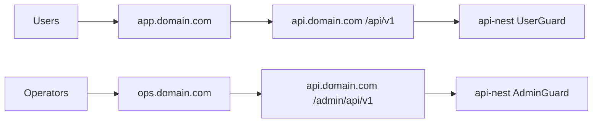

# AI Profit OS — Admin & Ops (v7.22.27)

> 분리 플랜 — Index: `ai_profit_os_00_index_a1b2c3d4.plan.md` · ARCHIVE: `ai_profit_os_launch_54c1261e.plan.md` · 착수전: `docs/CONSTITUTION_BOOTSTRAP.md`

> **제로 목표:** 오류0 · 결함0 · 오차0 · 중복0  
> **todo 순서:** ops 분리배포 → 12모듈 셸 → 가격동기 → 유저360 → 진행정책 → override/멤버십/차단·쪽지 → 남용·CS·Analytics (Index §18 M4)  
> **KRW Day-1:** TOP1 = Admin **승인/거절** · CSV Auto-Recon 라벨 **금지**(L2+)  
> **v7.22.21:** §9.8.9 유저별 기회 매치·수익/마진 override · 피드 merge=Engine §0.0.5.1 · **ledger 직접 변경 금지**  
> **v7.22.22:** referral 탭 — `rewardsEnabled` · Pool top-up · **초대 인원캡 UI 0** · Money §51.5  
> **v7.22.23:** `/admin/execution-policy` **매칭 성공 조절**(엄격도) · 난수 성공률 컨트롤 **0** · UI §48.6 · Engine §48.13.3  
> **v7.22.24:** §9.8.10 **멤버십·성향메모·밴·로그인비번·출금PIN·프로필전수·유저별 엄격도** · Engine §0.0.7 · Money §43.6a  
> **v7.22.25:** §9.8.4a **유저별 매칭·출금신청 차단** · §9.8.8d **1인 쪽지/알림** · 공지·이벤트·매칭등록 **자동 Push** (prefs·PWA)  
> **v7.22.26:** Index §20.1 기회스캔 **pointer** · Admin Owns **변경 0**  
> **v7.22.28:** Index §20.2 · 유저 CTA `수익 벌기` **pointer** · domain=`participate` · Admin Owns **변경 0** · `executionPlatforms` Admin only

## 9. Admin — IA 및 구성 SSOT

### 9.1 Admin 사이드바 (12모듈) — **화면 라벨 = 한국어 SSOT**

| # | 화면 라벨 (ko) | route (코드, 비노출) | 내부 서비스 | 역할 |
|---|----------------|----------------------|-------------|------|
| 1 | 📊 한눈에 보기 | `/admin` | dashboard | 오늘 정산·활성 기회·긴급 상태 |
| 2 | 🔥 수익 기회 관리 | `/admin/opportunities` | opportunities | **§36 가격·마진·수익** · 등록·일시정지 |
| 2b | ⚙️ 진행 정책 | `/admin/execution-policy` | execution-policy | **§48.6** **매칭 성공 조절**(엄격도) · 실조건≠연출 · 관측 성공% · **난수성공률 UI 금지** · audit |
| 3 | 🔌 해외 시세 수집기 | `/admin/adapters` | adapters | 수집기 연결·상태 |
| 4 | 💰 입출금 관리 | `/admin/wallet` | wallet | **§37 입금설정** · 검수 · 출금승인 |
| 5 | 📒 입출금·정산 장부 | `/admin/ledger` | ledger | **§39** 전역·유저별 원장 · reconciliation |
| 6 | 👤 회원 관리 | `/admin/users` | users | **§37·§39** · 편집·잔액·차단·**금융전수** |
| 7 | 🛡️ 사기·이상 거래 방지 | `/admin/risk` | risk | 이상 징후·제재 |
| 8 | ⚖️ 법적 확인·제재 | `/admin/compliance` | compliance | 제재국가·감시 |
| 9 | 🚨 긴급 정지 | `/admin/system-control` | circuit | 전체·부분 정지 · **Web Push `pushEnabled` kill** + audit (PWA §23.5 · 톱레벨 13 금지) |
| 10 | 🤖 AI 분석 기록 | `/admin/ai-logs` | ai-logs | AI 판단·수정 이력 · `?tab=coach`=퍼뜩 P/G/S Eval(Engine §47.12~14) |
| 11 | 📣 이벤트·프로모션 | `/admin/growth` | growth | **기본 OFF** · §35 G1~G4 탭 |
| 12 | 📋 운영 기록 | `/admin/audit` | audit | 관리자 행동 로그 |

**IA 잠금 (중복0):** 톱레벨 모듈 수는 **12 유지**. `2b 진행 정책`은 모듈2 **하위·사이드바 자식 링크**(목업의 독립 활성 항목과 동일 시각). route만 `/admin/execution-policy`로 고정 — **13번째 톱레벨 금지**.

**금지 (어드민 화면 노출):** 영어 IT·개발·테스트·문서 용어 **전부** (Market Adapters, DLQ, NATS, Temporal, Feature Store, Execute Rerun, Webhook, Staging, QA, Mock, API, JSON, Stack trace, successRatePercent, 당첨확률 등). 표시는 **쉬운 한글 라벨만** (§27.5 · §50.4).

**어드민 액션 버튼 ko 예:**
- Execute Rerun → **오류 건 다시 시도하기**
- Approve Withdraw → **출금 승인하기**
- Pause Opportunity → **이 기회 잠시 멈추기**
- Open Circuit → **긴급 정지 켜기**

### 9.2 Admin ↔ User 대응 (오차0)

| User 화면 | Admin 관리 |
|-----------|------------|
| 홈/수익 카드 **예상수익** | `/admin/opportunities` §36 pricing |
| 홈/수익 카드 (목록) | opportunities + adapters |
| 수익 벌기 → AI 매칭·처리 진행실/성공/안전중단 | **§48** · UI §5.3b · Index §20.2 · execution-policy + participate + settlement |
| 지갑 입출금 | wallet + **§37 deposit-config** + ledger + compliance |
| 입금 QR/원화계좌 | `/admin/wallet?tab=deposit-settings` · `krw-pending` |
| USDT 전용주소 | 코드 자동발급 §41 · Admin 조회 `/admin/users/:id` |
| 회원 프로필·잔액·차단 | `/admin/users/:id` §37 |
| **유저 입금·출금·시세차익·순유입** | `/admin/users/:id/finance` §39 · §9.8.7 |
| **유저 360 (추천·유입·CS·등급·prefs)** | `/admin/users/:id` §9.8.8 |
| 오늘 지급 ticker | `ticker_mode` + `counter_mode` §35 G4 |
| AI 추천도 | ai-logs + feature-platform |
| Circuit toast | system-control |

### 9.3 Admin 버튼 (핵심)

| 버튼 | Confirm | audit event |
|------|---------|-------------|
| 기회 일시정지 | reason≥10 | `admin.opportunity.paused` |
| **가격 적용** | preview 확인 | `admin.opportunity.pricing.updated` |
| **일괄 가격 적용** | Confirm + N건 | `admin.opportunity.pricing.bulk` |
| 출금 승인/거절 | ✅ | `admin.withdraw.decided` |
| **원화 입금 승인/거절** | ✅ · 거절 reason≥10 | `admin.krw_deposit.approved` / `rejected` |
| 유저 동결 | reason≥10 | `admin.user.frozen` |
| 긴급 정지 ON | reason≥10 | `admin.circuit.opened` |
| Growth 스위치 ON | simulation pass + budget | `admin.growth.enabled` |
| Adapter onboarding | schema validate | `admin.adapter.registered` |

### 9.4 Admin 토스트 (ops tone)

- 성공: `✅ 저장했습니다`
- 실패: `{operation} 실패 — {plain_reason}` (enum 금지)
- 긴급: `⚠️ 긴급 정지가 켜졌습니다. 사용자 거래가 차단됩니다`

### 9.5 왕초보 운영 — 원클릭 TOP 5 (무인 **보조** 대시보드)

> **SSOT 화면:** `/admin` (📊 한눈에 보기) **상단 5위젯** — 12모듈 route **추가 없음** (중복0)  
> **전역 검색바 (§39):** user_id · 휴대폰 · tx_hash · 입금자명 → `/admin/users/:id/finance`  
> **주의:** "무인" = AI·규칙 **자동 분류 + 원클릭 승인**. 고액·원화·출금은 **사람 Confirm 필수** (compliance).

| # | TOP5 (ko) | 위젯 | 연결 route | 원클릭 액션 |
|---|-----------|------|------------|-------------|
| 1 | **입출금 검수함** | 대기 N건 카드 | `/admin/wallet?tab=review` | 승인하기 / 거절하기 + TronScan 링크 |
| 2 | **시세·마진 조절판** | 🟢/🔴 수집기 + **전역 마진 %** | `/admin/adapters` | 마진 저장 → **§36 전 상품 재계산** |
| 3 | **사기·매크로 방지망** | 임시동결 카드 큐 | `/admin/risk?tab=queue` | 동결 해제 / 영구 제재 |
| 4 | **돈줄 전광판** | 순수익·지급·광고 | `counter_mode` §35 + attribution |
| 5 | **긴급 정지** | 🚨 마스터 스위치 | `/admin/system-control` | 긴급 정지 켜기 (reason≥10) |

#### 9.5.1 TOP1 — 입출금 검수함 (상세)

```
┌─ 입출금 검수함 ──────────────── 3건 대기 ─┐
│ 🪙 USDT 자동완료     12건  (오늘) §41      │
│ 💵 원화 입금 대기     1건  [승인] [거절] §41│
│ 📤 고액 출금 대기     2건  [승인] [거절]   │
│ 🔗 TronScan 확인     (각 행 링크)          │
└──────────────────────────────────────────┘
```

- USDT 온체인: chain-watchers **이벤트스트림 → 19conf ledger** → 어드민은 **예외·분쟁·집금 모니터링만**
- 원화 **Day-1 (v7.22.12):** 유저 **입금신청** → 운영자가 **은행 통장에서 실입금 확인** → 대기목록 **[승인]=USDT 잔액 반영** / **[거절]=유저 알림·내역** · **PG 0** · **CSV 업로드 Day-1 필수 아님**(L2+)
- TronScan: `wallet.withdraw.tx_hash` → 마스킹 + 원클릭
- 승인/거절 버튼: Confirm + (거절 시 reason≥10) · audit `admin.krw_deposit.approved|rejected` · Money §41.3

#### 9.5.2 TOP2 — 시세 수집기 · 마진 조절판

| UI | 데이터 |
|----|--------|
| 🟢 정상 / 🔴 멈춤 | adapter.last_success_at vs TTL |
| 마진율 입력 | platform_margin_pct → engine **bulk recalc** §36 |
| 0% 이벤트 토글 | growth.zero_margin (budget+circuit) |
| 개별 상품 override | `/admin/opportunities` adminMarginPct 우선 |

**버튼:** [마진 저장] → 전 상품 예상수익 재계산 + SSE push · [0% 이벤트 ON/OFF]

#### 9.5.3 TOP3 — 사기 방지망

| 자동 탐지 | 카드 표시 |
|-----------|-----------|
| 동일 IP 다계정 | "같은 Wi-Fi에서 N계정" |
| 매크로 연타 | "1분에 N번 거래 시도" |
| 비정상 패턴 | AI L2 score + rule id (화면=한글) |

**액션:** [임시 동결] [풀어주기] [영구 제재] — reason≥10

#### 9.5.4 TOP4 — 돈줄 전광판

| 지표 | 소스 (오차0) |
|------|--------------|
| 오늘 플랫폼 순수익 | ledger 또는 demo blend (§35 G4) |
| 오늘 유저 지급 총액 | ledger 또는 demo blend |
| 갱신 | SSE · tier batch |

#### 9.5.5 TOP5 — 긴급 정지 (0.1초 목표)

- 트리거 UI: `/admin` 고정 🚨 + `/admin/system-control` 상세
- 목표 latency: **100ms** (risk-service circuit, 기존 §10.3)
- 도메인별: participate / withdraw / deposit / all
- 켜진 후: 유저 toast `CIRCUIT_OPEN` + admin audit

#### 9.5.6 TOP6 — 광고 성과 (돈줄 위젯 확장, sidebar 변경 없음)

| 지표 | 소스 |
|------|------|
| 캠페인별 USDT 입금 | `user_attribution` + ledger first_deposit |
| ROAS | ad spend import (manual/API) / attributed deposit |
| CAPI 전송 성공률 | marketing-capi-dispatcher logs |

**화면:** `/admin` 돈줄 전광판 하단 "광고에서 온 입금" — **12모듈 sidebar 변경 없음**

### 9.6 Admin 가격·수익 실시간 연동 (§36)

> **SSOT:** §4.3 · `CONSTITUTION/36_ADMIN_PRICE_AND_PROFIT_SYNC.md`  
> **화면:** `/admin/opportunities` (모듈 2) · TOP2 전역 마진과 **연동**

```
┌─ 수익 기회 관리 ─────────────────────────────┐
│ [전역 마진 1.5%]  [선택 3건]  [가격 일괄 적용] │
├──────────────────────────────────────────────┤
│ 상품          │매입│판매│마진%│예상수익│≈원화│액션│
│ Rolex Sub...  │ editable ──→ live preview ──→│적용│
│ USD/JPY       │ ...                          │적용│
└──────────────────────────────────────────────┘
```

| 기능 | 설명 |
|------|------|
| **인라인 편집** | 매입·판매·마진 % 셀 편집 → 우측 **예상수익 즉시 preview** |
| **상품 이미지** | `assetImageUrl` URL/R2 · 미리보기 · `image_missing` 필터 (Engine §0.0.6) · category=`watch\|trading_card\|luxury_bag` |
| **가격 적용** | engine recalc → `pricingVersion++` → SSE push |
| **일괄 적용** | 선택 N건 동일 delta/margin · Confirm modal |
| **시세 다시 받기** | adapter refresh → admin override 유지 옵션 · 이미지 hydrate 재시도 |
| **전역 마진 연동** | TOP2 저장 시 개별 override 없는 상품만 bulk update |
| **감사** | before/after JSON · admin id · `audit.events` |

**유저 동기화 SLA:** Admin [적용] → 유저 카드 숫자 변경 **≤500ms** (S/A) · B-tier WS batch **≤3s** (§29 tier SSOT)

**오류 UX:** `PRICE_STALE` · "가격이 바뀌었어요 — 새로고침할게요" + auto patch

### 9.7 Admin 입금 설정 · 원화 대표계좌 (§37) + USDT 온체인 (§41)

> **화면:** `/admin/wallet?tab=deposit-settings` · `/admin/wallet?tab=krw-pending`  
> **SSOT:** `schemas/deposit-config.v1.json` · `CONSTITUTION/37` + `41`

```
┌─ 입금 설정 ───────────────────────────────────┐
│ [원화 대표계좌]  [USDT 온체인]  [원화 대기목록] │
├─ 원화 대표계좌 (§37 — PG 없음) ───────────────┤
│ 은행명             [국민은행        ]           │
│ 계좌번호           [123-456-789012 ]           │
│ 예금주             [주식회사 ○○○   ]           │
│ 입금 안내 문구     [편집]                       │
├─ USDT 온체인 (§41+§43 — 유저별 주소 · event stream) ─┤
│ TronGrid API key   [________] (optional free)  │
│ Hot wallet xpub    [secrets — UI 마스킹]       │
│ UI conf / Ledger   [1] / [19]                  │
│ watcher mode       [event_stream] 폴링 금지    │
│ sweeper / energy   [ON] Treasury TRX stake     │
│ chain-watcher      🟢 stream / 🔴 stopped      │
└─ [저장] ──────────────────────────────────────┘

┌─ 💵 원화 입금 대기 · 승인/거절 (§41.3·§43.3 · v7.22.12) ─ N건 ─┐
│ 유저 │ 송금액(가산) │ 코드 │ TTL │ [승인] / [거절] │
└──────────────────────────────────────────────────────────────┘
```


| 필드 | Admin | 유저 surface |
|------|-------|--------------|
| `krwBankName` · `krwAccountNumber` · `krwAccountHolder` | text | 원화 탭 송금 안내 |
| `tronGridApiKey` | secret | — (backend only) |
| `usdtUiConfirmations` | number default **1** | UI 감지 알림만 |
| `usdtLedgerConfirmations` | number default **19** | ledger `DEPOSIT_CONFIRMED` |
| `chainWatcherMode` | `event_stream` only | **per-address poll 금지** |
| `priceStaleMaxSec` | number default **3** | 엔진 진입 차단 |
| `krwUniqueAmountTtlMin` | number default **120** | 원화 임시코드 유효 |
| **유저 TRC20 주소** | 조회 only `/admin/users/:id` | `/wallet/deposit?tab=usdt` **전용 QR** |

**USDT:** Admin이 **공유 입금주소 설정 ❌** → 코드가 **유저별 TRC20 발급** (§41)  
**원화:** Admin **대표계좌 1개** + 유저 **입금신청** → 대기목록 **[승인]/[거절]** · CSV=L2+

**실시간 반영 (원화 대표계좌만 SSE):**
```
Admin [저장] krw fields
→ Phase0 in-process emit (Phase1+ NATS) wallet.deposit_config.updated
→ useDepositConfig() → 원화 탭 계좌 **즉시 교체** (≤300ms)
```
**USDT 전용주소:** 유저 가입/첫 입금页 visit 시 **코드 발급** · Admin SSE 변경 **해당 없음**

### 9.8 Admin 회원 전체 운영 (§37)

> **화면:** `/admin/users` · `/admin/users/:id`  
> **원칙:** 가입정보 **전 필드 Admin 편집** · 금융 조작 = **ledger 분개만**

#### 9.8.1 회원 목록 · 검색

| 필터 | 컬럼 |
|------|------|
| 상태 · KYC · **멤버십** · 가입일 · IP · **총입금·총출금** | 이름 · 연락처 · **멤버십** · USDT잔액 · ≈원화 · **순시세차익** · 최근입금일 · 최근접속IP · 상태 |

**행 클릭:** `/admin/users/:id/finance` (기본) · 프로필 탭 전환 가능  
**전역 검색 (대시보드 상단):** user_id · 휴대폰 · tx_hash · TronScan · 입금자명 → finance jump

#### 9.8.2 회원 상세 — 편집 가능 필드 (전수)

| 구분 | 필드 | Admin 액션 |
|------|------|------------|
| **가입정보** | 이름 · 휴대폰 · 이메일 · 생년월일 · 추천코드 | [저장] audit |
| **프로필 완성** | Stage A/B (Infra §51.9.1 pointer) · `profileComplete` | 읽기 · 미완이면 출금/KYC 게이트 표시 |
| **본인확인** | KYC tier · 서류 상태 · 메모 | 승인/거절/재요청 |
| **계정** | 가입일(표시) · OAuth 연동 · Passkey | 연동 해제 · 재설정 |
| **지갑** | USDT 잔액(표시) · ≈원화 · 버킷4 (Money §49 pointer) | **§9.8.3 잔액 조정** |
| **출금계좌** | 유저 등록 원화 계좌 | 편집/초기화 |
| **등급·한도** | `userTier` (default/vip_desk) · withdraw cap override(optional) | whale≥100k 배지 · cap 변경은 재무|최고 · audit |
| **멤버십** | `membership` sprout→vip (Engine §0.0.7) · adminForce · 일일캡·fulfillRate 읽기 | **§9.8.10** 표시/강제 · ≠ vip_desk · ≠ 초대티어 |
| **성향 메모** | `tendencyMemos[]` (운영 전용 · 유저 비노출) | **§9.8.10** CRUD · tags |
| **UX prefs** | `toneBand` · `fontScale` · `depositPref` (UI §38.9·§50.1 pointer) | **읽기 기본** · 변경 시 audit (유저 재선택 승 원칙 유지) |
| **유입** | firstTouch UTM · `landingVariant` (Infra §31 pointer) | 읽기 · ROAS 링크 |
| **상태** | active/flagged/restricted/frozen/banned | §9.8.4 차단 |
| **접속** | 최근 IP · IP 이력 · device · User-Agent | §9.8.5 |
| **거래·금융 §39** | 입금·출금·순유입·시세차익·마진 **전수** | `/admin/users/:id/finance` |
| **CS·분쟁** | open ticket N · dispute N | §9.8.8 링크 |
| **메모** | 운영자 내부 메모 | CRUD |
| **운영 알림** | 유저 1인 푸시/인앱 알림 | §9.8.8d · 템플릿만 · audit |

**금지:** 성별 필드 · RRN 표시 · 유저 surface IT용어 · sidebar 13번째 톱레벨

#### 9.8.3 잔액 조정 (ledger — `user.balance +=` **금지**)

```
┌─ 잔액 조정 ─────────────────────────────────┐
│ 현재 USDT: 125.40  (≈ ₩171,000)              │
│ 조정 유형:  [+] 지급  [-] 차감  [↔] 정정      │
│ 금액 USDT:  [________]                       │
│ 사유(≥10):  [________________________]       │
│ [미리보기 분개]  [적용 — Confirm 2단]        │
└──────────────────────────────────────────────┘
```

| 유형 | 분개 | audit |
|------|------|-------|
| 지급 | Debit Ops Pool / Credit User | `admin.user.balance.credit` |
| 차감 | Debit User / Credit Ops Pool | `admin.user.balance.debit` |
| 정정 | reversal + new entry | `admin.user.balance.correct` |

**Guard:** 고액(**>1000 USDT**) · **2인 Confirm 필수** (승인자 ≠ 신청자 · 재무|최고만) · circuit 연동 · 유저 push/toast `BALANCE_ADJUSTED`

#### 9.8.4 유저 차단 · 제재 (전체)

| 액션 | UX 영향 | 버튼 |
|------|---------|------|
| **임시 동결** | 거래·출금 block | [동결] reason≥10 |
| **출금만 차단** | withdraw only | [출금 정지] |
| **거래만 차단** | participate only | [거래 정지] |
| **로그인 차단** | banned · 세션 revoke | [영구 차단] Confirm×2 |
| **동결 해제** | 복구 | [풀어주기] |
| **IP 차단** | 해당 IP 신규/기존 세션 | [IP 차단] |

**유저 toast:** `ACCOUNT_FROZEN` · `ACCOUNT_BANNED` · `WITHDRAW_BLOCKED` · `MATCH_BLOCKED` · `WITHDRAW_APPLY_BLOCKED`

##### 9.8.4a 유저별 매칭 · 출금신청 개별 차단 (삭제 금지 · v7.22.25)

> **목적:** 운영자가 **유저 1명**에 대해 매칭(participate) / 출금 **신청**을 **독립 토글**로 막는다 (전역 circuit와 별개).  
> **Owns:** Admin UI·플래그·audit = 본 절 · **participate 가드 = Engine** · **withdraw create 가드 = Money §49** · 유저 카피 = UI toast

```typescript
// schemas/user-capability-flags.v1.json — users row 또는 prefs 확장
interface UserCapabilityFlags {
  matchBlocked: boolean;           // true → participate 403
  withdrawApplyBlocked: boolean;   // true → withdraw intent create 403 (잔액 불변)
  reason?: string;                 // ≥10 when enabling
  updatedByAdminId?: string;
  updatedAt?: ISO8601;
}
```

| 기능 (ko) | 잠금 |
|-----------|------|
| **매칭 막기** | [매칭 정지] · `matchBlocked=true` · 홈 CTA 잠금 · Engine `PARTICIPATE_USER_BLOCKED` |
| **출금신청 막기** | [출금 신청 정지] · `withdrawApplyBlocked=true` · Money create 거부 · **잔액·버킷 불변** |
| **독립성** | 둘 다 ON/OFF 가능 · frozen/banned는 상위(둘 다 강제 ON 효과) |
| **목록 배지** | `매칭정지` · `출금정지` 컬럼/칩 |
| **해제** | 동일 버튼 토글 · reason optional · audit |
| **금지** | 숨김 차단(유저가 원인 모를 무한 스피너) · ledger로 차단 흉내 |

**API:** `PATCH /admin/api/v1/users/:id/capability-flags`  
**audit:** `admin.user.capability.match_blocked` · `admin.user.capability.withdraw_apply_blocked`  
**CI:** `verify:admin-user-capability-block` — 플래그 ON → participate/withdraw create 실패 · OFF 복구

#### 9.8.5 접속 IP · 세션

| 데이터 | 소스 | Admin |
|--------|------|-------|
| `lastLoginIp` | api-nest auth middleware | 상세 헤더 |
| `loginHistory[]` | audit.events | IP · 시간 · device · geo(optional) |
| `activeSessions[]` | session store | [세션 전부 끊기] |
| IP allow/deny list | risk-service | [IP 화이트/블랙] |

#### 9.8.6 Admin 버튼 추가 (§37)

| 버튼 | Confirm | audit event |
|------|---------|-------------|
| 입금 설정 저장 | ✅ | `admin.wallet.deposit_config.updated` |
| 회원 정보 저장 | ✅ | `admin.user.profile.updated` |
| 멤버십 강제 | ✅ · reason≥10 | `admin.user.membership.force` |
| 성향 메모 저장 | — | `admin.user.tendency_memo.*` |
| 로그인 비밀번호 재설정 | ✅×2 | `admin.user.login_password.reset` |
| 출금 PIN 초기화 | ✅ | `admin.user.withdraw_pin.reset` |
| 패스키 해제 | ✅ | `admin.user.webauthn.revoke` |
| 유저별 매칭 조절 | ✅ · reason≥10 | `admin.user.match_policy.updated` |
| 잔액 조정 적용 | ✅×2 (고액) | `admin.user.balance.*` |
| 유저 동결/차단 | reason≥10 | `admin.user.status.*` |
| 매칭/출금신청 개별 정지 | reason≥10 | `admin.user.capability.*` |
| 운영 쪽지 보내기 | ✅ | `admin.user.notify.sent` |
| 세션 끊기 | ✅ | `admin.user.sessions.revoked` |
| IP 차단 | reason≥10 | `admin.user.ip.blocked` |
| 금융 CSV 내보내기 | — | `admin.user.finance.exported` |

#### 9.8.7 유저별 금융 원장 (§39 — **필수**)

> **화면:** `/admin/users/:id/finance` · 상세 탭 **💰 금융 원장**  
> **SSOT:** ledger + wallet + settlement · `schemas/user-financial-summary.v1.json`

**요약 KPI (상단 고정 · 오차0 공식):**

| KPI (ko) | 공식 / 소스 | 표시 |
|----------|-------------|------|
| **총 입금** | Σ deposit confirmed (USDT credit) | USDT + ≈₩ |
| **총 출금** | Σ withdraw completed (USDT debit+fee) | USDT + ≈₩ |
| **순유입** | `총입금 − 총출금` | USDT + ≈₩ · **필수 1줄** |
| **시세차익 순수익** | Σ settlement 유저 몫 (profit 버킷 적립) | USDT + ≈₩ · **순유입과 라벨 혼용 금지** |
| **플랫폼 마진 기여** | Σ platformFee | USDT + ≈₩ |
| **현재 잔액** | bucket sum (§49) | USDT + ≈₩ · 버킷 브레이크다운 |
| **거래 횟수** · **거래 성공 비율** · **최근 입금/출금** | execution/settlement | — |

**「거래 성공 비율」정의 (오차0 · `sellSuccessRate`와 혼용 금지):**  
`MATCH_SUCCESS ÷ (MATCH_SUCCESS + PRICE_MOVED + BELOW_MIN_PROFIT)` · 해당 user · ledger/execution 집계만  
화면 라벨 ko: **거래 성공 비율** · footnote `과거 유사 조건 %`(**Opportunity.sellSuccessRate**)와 **별 필드**  
**금지:** 난수·demo·G4 수치를 승률에 합산 · 순유입을 “수익”으로 표기

| 탭 | 표시 (ko) | 데이터 |
|----|-----------|--------|
| **입금 내역** | 일시·USDT/원화·금액·≈원화·상태·tx/입금자·승인자 | wallet.deposit |
| **출금 내역** | 일시·금액·수수료·상태·목적지·TronScan·승인자 · mode(수익/원금) | wallet.withdraw |
| **시세차익** | 일시·상품·예상·실지급·spread·platformFee·settlement_id | settlement |
| **버킷** | principal/profit/locked/practice | Money §49 · `?tab=buckets` |
| **장부 분개** | debit/credit·계정·USDT·memo·admin조정 | ledger entries |
| **플랫폼 마진** | 거래별 수수료·누적·margin_pct 스냅샷 | engine + ledger |
| **추천 보상** | L2/L3 accrual·hold·clawback (읽기) | Money §51.5 pointer · `?tab=referral` |

```typescript
// schemas/user-financial-summary.v1.json — 필수 필드
interface UserFinancialSummaryV1 {
  totalDepositUsdt: string;
  totalWithdrawUsdt: string;
  netInflowUsdt: string; // = deposit - withdraw
  spreadProfitUsdt: string;
  platformMarginUsdt: string;
  balanceUsdt: string;
  buckets: { principal, profit, locked, practice };
  tradeCount: number;
  tradeSuccessRate: number; // 정의 위
}
GET /admin/api/v1/users/:id/finance/summary
GET /admin/api/v1/users/:id/finance/deposits?from&to&page
GET /admin/api/v1/users/:id/finance/withdrawals?from&to&page
GET /admin/api/v1/users/:id/finance/spread-profits?from&to&page
GET /admin/api/v1/users/:id/finance/ledger-entries?page
GET /admin/api/v1/users/:id/finance/export.csv?type=all|deposits|withdrawals|profits
```

**전역:** `/admin/ledger?userId=` · `/admin/reports/financial` (일/월 합산)  
**검색:** tx_hash · TronScan · 입금자명 · user_id → 해당 유저 finance로 jump  
**CI:** `verify:admin-user-360` — summary에 `netInflowUsdt` 필수 · finance 탭 7종 route 존재

#### 9.8.8 유저 360 허브 (메이저 Ops · 중복0 · v7.22.13)

> **화면:** `/admin/users/:id` 탭 IA · **새 sidebar 톱레벨 금지**  
> **규칙:** 도메인 규칙 SSOT는 Money/UI/Infra/CS에 두고, Admin은 **조회·링크·운영 액션**만

| 탭 (ko) | 내용 | Owns / pointer |
|---------|------|----------------|
| **요약** | 잔액·순유입·상태·KYC·Stage B·**멤버십**·vip_desk 배지 · 최근 이벤트 5 | §9.8.2 + §9.8.7 KPI · §9.8.10 |
| **금융** | → `/finance` (§9.8.7) | §39 |
| **추천** | 초대코드 · 상위 추천인 · 피초대 목록 · L2/L3 보상·보류·clawback 요약 | Money §51.5 · Growth referral 큐 딥링크 |
| **유입** | first/last touch UTM · landingVariant · firstDepositAt · CAPI 동의 | Infra §31 |
| **문의·분쟁** | 티켓 목록(상태·SLA) · dispute(오입금/wrong-chain) | §51.6 · §51.11 · `/admin/support?userId=` · `wallet?tab=disputes&userId=` |
| **퍼뜩·prefs** | toneBand · fontScale · depositPref · coach trace(`lane` P/G/S) | UI §38.9 · Engine §47.12~14 · `ai-logs?tab=coach&userId=` |
| **기회·매치** | 유저별 노출/핀/마진·예상수익 (§9.8.9) · **유저별 엄격도** (§9.8.10) | Engine §0.0.5.1 · §0.0.7 |
| **보안** | IP·세션 · **로그인 비번 재설정** · **출금 PIN 초기화** (§9.8.10) | §9.8.5 · Money §43.6a |
| **메모·알림** | 내부 메모 · **성향 메모** · 운영 알림 (§9.8.8d · §9.8.10) | 본 절 |

##### 9.8.8d 운영 → 유저 1인 알림 · 쪽지 (삭제 금지 · v7.22.13 · v7.22.25 강화)

> **제품 말:** 운영 **쪽지/알림** · 별도 SNS DM 엔진 **금지** (인박스 1곳=`/me/inbox`)  
> **중복0:** 발송 UI·RBAC·audit = Admin 본 절 · **인박스·카피 = UI §5.9.4** · **Web Push 전송 = PWA §23.5** · prefs 필터 = UI §50.1n

| 잠금 | 내용 |
|------|------|
| 채널 | **인앱 쪽지 필수** + Web Push(유저 `opsMessage` pref ON·구독 있을 때) · SMS Day-1 비필수 |
| 입력 | 템플릿 enum (`OPS_NOTICE` · `OPS_KYC` · `OPS_DEPOSIT` · `OPS_WITHDRAW` · `OPS_CUSTOM`) + 본문 ko ≤500 · 이모지≤2 · 제목 ≤40 |
| 대상 | **유저 1인** (상세 메모·알림 탭) · 다수 발송=공지/캠페인 fanout(§35 · §23.5a)과 **분리** |
| 금지 | 수익 확정·보장 · IT용어 · 마케팅 동의 없는 광고성 CAPI · 성향메모를 유저에게 전송 |
| Guard | CS|재무|최고 · Confirm · rate ≤10/user/day · audit `admin.user.notify.sent` |
| 유저 | `/me/inbox` + toast · 읽음/숨김 · **삭제=하드삭제 0**(숨김) |
| prefs | `notificationPrefs.opsMessage===false` → Push 스킵 · **인박스는 저장**(나중에 켤 때 열람 가능) |

**API:** `POST /admin/api/v1/users/:id/ops-messages` · `GET .../ops-messages`  
**CI:** `verify:admin-user-360` · `verify:ops-inbox` — 1인 발송→인박스 row + prefs OFF면 Push 0

##### 9.8.8e 플랫폼 공지·이벤트·매칭등록 → 자동 알림 (pointer · v7.22.25)

| 트리거 | Owns 발행 | Push fanout |
|--------|-----------|-------------|
| 공지 `live` | Admin growth `notices` | PWA §23.5a · channel=`notice` |
| 이벤트/캠페인 `live` | Admin growth `campaigns` | channel=`campaign` · Growth OFF면 0 |
| 매칭(기회) `available` 공개 | Admin opportunities / Engine publish | channel=`opportunity` · hot/ai_pick |

**공통:** `source_event_id` dedup · 유저 prefs 채널 OFF면 스킵 · `pushEnabled` kill 존중 · 상세=§23.5a

#### 9.8.9 유저별 수익·상품 매치 조정 (삭제 금지 · v7.22.21)

> **목적:** 운영자가 **특정 유저**에게 보일 기회·순서·표시 수익/마진을 조정한다.  
> **Owns:** Admin UI·API·audit = 본 절 · **카드 merge 규칙 = Engine §0.0.5.1** · **원장/잔액 = Money §49 only**  
> **route:** `/admin/users/:id?tab=opportunities` (톱레벨 sidebar **추가 금지**)

```typescript
// schemas/user-opportunity-override.v1.json
interface UserOpportunityOverride {
  userId: string;
  opportunityId: string;
  hidden?: boolean;                      // 피드 제외
  forceShow?: boolean;                   // 숨김 해제·nearMiss 재분류 후보 (compareReady false→true 위조 금지)
  pinOrder?: number;                     // 작을수록 상단 · 동일 user 내 유일
  marginPctOverride?: Decimal;           // 유저 세션 마진 · 전역 §36보다 우선
  expectedProfitUsdtOverride?: Decimal;  // 표시·participate 가드용 · ledger credit 아님
  capitalBandForce?: 'micro'|'small'|'mid'|'high'|'whale'; // 필터 톤 only · requiredCapital 불변
  reason: string;                        // ≥10자
  updatedByAdminId: string;
  updatedAt: ISO8601;
}
```

| 기능 (ko) | 잠금 |
|-----------|------|
| **목록** | 전역 기회 + 이 유저 override 배지(`숨김`/`고정`/`마진조정`/`수익조정`) |
| **숨김/표시** | hidden 토글 · forceShow는 hidden과 상호배타 |
| **홈 고정** | pinOrder 드래그 · 최대 Day-1 **10**건/유저 |
| **마진 %** | marginPctOverride → Engine 유저 세션 recalc |
| **예상 수익** | expectedProfitUsdtOverride · minProfitUsdt 미만이면 participate 잠금 유지 |
| **미리보기** | 유저 홈 카드와 동일 `assetImageUrl`+숫자 (SSE 불필요 · 저장 시 invalidate) |
| **감사** | `admin.user.opportunity_override.upsert` · before/after JSON · reason≥10 |
| **금지** | 잔액 직접 변경 · 난수 성공률 · compareReady false→true · SKU 이미지 교차 |

**RBAC:** 재무 · 최고관리자 = 쓰기 · 고객지원 = **조회만** · 마케팅 = ❌  
**API:**
```
GET    /admin/api/v1/users/:id/opportunity-overrides
PUT    /admin/api/v1/users/:id/opportunity-overrides/:opportunityId
DELETE /admin/api/v1/users/:id/opportunity-overrides/:opportunityId
```
**CI:** `verify:admin-user-opportunity-override` — schema · RBAC · audit · merge 숨김/핀 · ledger 불변 fixture

#### 9.8.10 멤버십 · 성향 메모 · 자격증명 · 유저별 엄격도 (삭제 금지 · v7.22.24)

> **목적:** 운영자가 **유저 1명**에 대해 등급·성향·밴·로그인비번·출금PIN·회원정보 전수·매칭 체감(%)을 **엔진/원장과 모순 없이** 처리한다.  
> **Owns:** Admin UI·API·audit = 본 절 · **membership 규칙 = Engine §0.0.7** · **출금 PIN/WebAuthn 정책 = Money §43.6a** · **로그인 해시 = Nest JWT Auth (Infra §51.9)**  
> **route:** `/admin/users/:id` 탭 (요약·보안·메모·기회·매치) · sidebar 톱레벨 **추가 금지**  
> **「% 조절」의미 (오차0):** 유저별 **`matchStrictnessOverride`** (또는 프리셋) · **≠** `successRatePercent` 난수 · KPI `fulfillRate`는 **읽기전용**

##### A. 멤버십 표시 · 강제

| 기능 (ko) | 잠금 |
|-----------|------|
| **목록·상세 배지** | sprout/entry/core/high/vip 한글 · 자동 vs `adminForce` 구분 |
| **강제 승급/강등** | Confirm · reason≥10 · audit `admin.user.membership.force` · 자동 강등 경로 0 (Engine) |
| **관측** | fulfillRate7d · dailyMatchesUsed/Cap · maxCapitalBand (읽기) |
| **금지** | 등급만으로 MATCH_SUCCESS 100% · 초대 티어와 동일 필드 |

##### B. 성향 메모 (유저 비노출)

```typescript
// schemas/user-tendency-memo.v1.json
interface UserTendencyMemo {
  id: string;
  userId: string;
  bodyKo: string;                 // ≤500 · IT용어 0
  tags: Array<'risk'|'vip_care'|'churn'|'deposit_hesitant'|'high_volume'|'other'>;
  createdByAdminId: string;
  createdAt: ISO8601;
  updatedAt?: ISO8601;
}
```
- CRUD · 유저 surface·푸시·퍼뜩 Fact **절대 노출 0**  
- 기존 「운영자 내부 메모」와 **슬롯 분리** (일반 메모 ≠ 성향 태그)  
- audit `admin.user.tendency_memo.*`

##### C. 밴 · 제재 (§9.8.4 강화 · 중복0)

| 잠금 | 내용 |
|------|------|
| 액션 | §9.8.4 전수 유지 · 상세 **보안 탭**에 동일 버튼 |
| banned | Nest 로그인 **즉시 거부** · 전 세션 revoke · refresh 무효 |
| 복구 | [풀어주기] · reason · audit |
| CI | `verify:admin-user-ban` — banned→login 401/403 · participate/withdraw 0 |

##### D. 로그인 비밀번호 관리자 변경

| 잠금 | 내용 |
|------|------|
| UI | [로그인 비밀번호 재설정] · 임시비번 생성 **또는** 운영자 입력 · Confirm×2 |
| 서버 | Nest만 · bcrypt/argon verifier 교체 · **평문 저장 0** · Supabase Auth **금지** |
| 후속 | 전 세션 revoke · 유저 toast `PASSWORD_RESET_BY_OPS` · (선택) 강제 재설정 플래그 |
| RBAC | 최고 · 고객지원(리드) · 재무 ❌(기본) |
| audit | `admin.user.login_password.reset` · before hash fingerprint only |

##### E. 출금 비밀번호(PIN) · WebAuthn 관리자 처리

| 잠금 | 내용 |
|------|------|
| UI | [출금 비밀번호 초기화] · [패스키 등록 해제] |
| 서버 | Money §43.6a — PIN verifier wipe/re-set · WebAuthn credential revoke · OTP 경로 유지 |
| 금지 | Admin이 유저 PIN 평문 조회 · ledger 잔액 변경과 묶기 |
| RBAC | 최고 · 재무 · CS는 **초기화만**(새 PIN 직접설정 ❌ 기본) |
| audit | `admin.user.withdraw_pin.reset` · `admin.user.webauthn.revoke` |
| 유저 | toast `WITHDRAW_PIN_RESET` · 다음 출금 시 PIN 재등록 유도 |

##### F. 회원정보 전수 변경

| 잠금 | 내용 |
|------|------|
| 범위 | §9.8.2 편집 가능 필드 **전수** (이름·휴대폰·이메일·생년·추천코드·출금계좌·KYC메모·prefs·상태…) |
| Guard | 휴대폰/이메일 유니크 · KYC 승인 상태와 모순 시 Confirm+reason |
| 금지 | RRN 저장/표시 · 성별 필드 · 잔액 직접 UPDATE |
| audit | `admin.user.profile.updated` (기존) · field-level before/after |

##### G. 유저별 % 조절 (= 매칭 엄격도 override)

```typescript
// schemas/user-match-policy-override.v1.json
interface UserMatchPolicyOverride {
  userId: string;
  matchStrictnessOverride?: 'lenient'|'standard'|'tight'|'scarce'|'custom';
  // custom일 때만 부분 필드 (global policy와 동일 키)
  minProfitUsdt?: Decimal;
  staleAllowanceSec?: number;
  maxRematchCount?: number;
  dailyUserMatchCap?: number;
  reason: string; // ≥10
  updatedByAdminId: string;
  updatedAt: ISO8601;
}
```

| 기능 (ko) | 잠금 |
|-----------|------|
| UI 라벨 | **「이 유저 매칭 조절」** · 세그먼트=전역 §48.6와 동일 프리셋 |
| 병합 | Engine §0.0.7 순서 3번 · global·membership 오버레이 **이후** |
| KPI | fulfillRate·거래성공비율 **읽기전용** · 목표% 자동맞춤 Day-1 **0** |
| 금지 | `successRatePercent` · 난수→MATCH_SUCCESS · ledger 직접 credit |
| 미리보기 | effectivePolicy 요약 1카드 (minProfit/stale/cap) |
| audit | `admin.user.match_policy.updated` |

**API (추가):**
```
GET/PUT  /admin/api/v1/users/:id/membership
GET/POST /admin/api/v1/users/:id/tendency-memos
PATCH    /admin/api/v1/users/:id/tendency-memos/:memoId
DELETE   /admin/api/v1/users/:id/tendency-memos/:memoId
POST     /admin/api/v1/users/:id/login-password/reset
POST     /admin/api/v1/users/:id/withdraw-pin/reset
POST     /admin/api/v1/users/:id/webauthn/revoke
GET/PUT  /admin/api/v1/users/:id/match-policy-override
```

**CI:** `verify:admin-user-credentials` · `verify:admin-user-ban` · `verify:admin-user-match-override` · (확장) `verify:admin-user-360` 탭에 멤버십·성향·자격증명 슬롯

### 9.9 Admin RBAC · 운영자 계정 (§40)

| 역할 (ko) | 권한 |
|-----------|------|
| **최고관리자** | 전 모듈 · Growth · circuit · RBAC 편집 · **§9.8.9·§9.8.10 쓰기** |
| **재무** | wallet · ledger · §39 export · 출금승인 · 잔액조정 · **§9.8.9 쓰기** · **§9.8.10** 멤버십·엄격도·출금PIN · 로그인비번 ❌ |
| **고객지원** | users 조회 · 프로필편집 · 메모·성향메모 · KYC · **운영 알림** · CS티켓 · **로그인비번 재설정** · 출금PIN **초기화만** · **§9.8.9·엄격도 조회만** (차단=리드만 · 잔액조정 ❌) |
| **리스크** | risk · compliance · freeze/ban · IP |
| **마케팅** | growth · attribution · content (금융 ❌ · 잔액조정 ❌ · §9.8.9 ❌ · §9.8.10 ❌) |

- Admin 로그인: **별도** `admin_users` · MFA 필수 · 세션 15m
- API: `/admin/api/v1/*` — `AdminGuard` + role matrix
- 모든 액션 → `audit.events` (operator id · before/after)

### 9.10 Admin 기능 전수 — 메이저 Ops 체크리스트

> **§40 분리 배포** · betting-grade ops 기준 · **플랜 누락 0**

| 영역 | 기능 | route / 위치 |
|------|------|--------------|
| **대시보드** | 오늘 입금·출금·순유입·활성유저·온라인 | `/admin` TOP5+KPI |
| **유저 검색** | 이름·휴대폰·이메일·user_id·tx_hash·지갑주소 | `/admin/users` |
| **유저 금융 §39** | 총입금·총출금·**순유입**·시세차익·마진·버킷 | `/admin/users/:id/finance` |
| **유저 360** | 추천·유입·CS/분쟁·prefs·등급·운영알림 | `/admin/users/:id` §9.8.8 |
| **유저별 기회·수익** | 숨김/핀/마진·예상수익 override | `/admin/users/:id?tab=opportunities` §9.8.9 |
| **멤버십·자격증명·엄격도** | 등급·성향메모·밴·로그인비번·출금PIN·유저별 매칭조절 | `/admin/users/:id` §9.8.10 |
| **입금** | USDT §41 자동 · 원화 §41 Admin승인/거절 · TronScan | `/admin/wallet` |
| **출금** | 대기열 · 승인/거절 · **>1000 USDT 2인 Confirm 필수** (§9.8.3 동일 규칙) | `/admin/wallet?tab=review` |
| **장부** | double-entry · reconciliation · shadow replay | `/admin/ledger` |
| **거래/수익** | 기회 가격 §36 · participate·settlement 이력 | opportunities + user finance |
| **리스크** | 동일IP·매크로·Sybil · freeze queue | `/admin/risk` |
| **컴플라이언스** | **§42** KYC 출금1회 · AML · 제재국가 | `/admin/compliance` |
| **긴급** | circuit breaker · domain별 정지 · **`pushEnabled` kill**(PWA §23.5 pointer) | `/admin/system-control` |
| **Growth** | G1~G4 · ticker · 공지 · whale | `/admin/growth` |
| **마케팅** | ROAS · UTM · CAPI | TOP6 widget |
| **리포트** | 일/월 입출금·수익·마진 · CSV export | `/admin/reports` |
| **알림** | 고액 입출금 · circuit · reconciliation fail | `/admin` bell |
| **감사** | 운영자 행동 · 유저 상태 변경 · 잔액조정 | `/admin/audit` |
| **설정** | deposit-config · platform_margin · RBAC | wallet/adapters/settings |

---

## 10. 어뷰징 · 악성유저 · 오류 대응 (전수)

### 10.1 어뷰징 시나리오 → 방어

| # | 공격 | 방어 | 서비스 |
|---|------|------|--------|
| A1 | 다계정 referral farming | device graph + **§42 withdraw KYC** + **§51.5** L2/L3 only + clawback + cap/day | risk + compliance + growth |
| A2 | 입금 후 즉시 출금 wash | **§11.2** `minHoldingHours`(기본24) · **profit-only 제외** + AML | compliance + ledger |
| A3 | 기회 participate spam | rate limit 5/min/user + idempotency key | api-nest + risk |
| A4 | Stale 기회 arbitrage (UI lag) | staleAt + **pricingVersion** enforce | engine + api |
| A5 | API scrape 기회 feed | WAF + auth + pagination cap + bot score | Cloudflare + risk |
| A6 | Fake deposit (wrong chain) | chain watcher confirm N blocks | wallet |
| A7 | Withdraw to sanctioned addr | sanctions screen pre-broadcast | compliance |
| A8 | Sybil on promo/growth | promo pool separate ledger + per-user cap | ledger + growth |
| A9 | Admin credential steal | MFA + IP allowlist + admin session 15m | api-nest |
| A10 | Click farm on payout ticker/counter | rate limit SSE + `ticker_mode` audit log | risk + realtime |
| A11 | Participate on stale price | pricingVersion guard + PRICE_STALE toast | api-nest + engine |
| A12 | Admin price typo (margin drain) | simulation floor + preview Confirm | engine + admin |
| A13 | Manipulate AI PICK | AI score from feature-platform only, L3 no money | ai-platform |
| A14 | Chargeback social eng. | **§51.11** support ticket + freeze path, no manual balance | admin + ledger |
| M1 | Fake OG share spam | rate limit share + referral cap + 서버 OG only | risk + marketing |
| N1 | notice에 보상·확정수익 문구 | `verify:notice-no-reward-copy` Fail | growth |
| N2 | campaign을 notice로 위장 | 스키마·탭 분리 · claim 경로 notice에 0 | growth |
| N3 | 종료/예산 후 claim 러시 | status gate + budget circuit | growth + ledger |
| N4 | Growth OFF인데 campaign 노출 | API 빈 목록 · UI empty | growth |
| N5 | 딥링크 open redirect | ctaRoute allowlist | growth + web |
| R\* | Viral Ladder 어뷰징 | **Money §51.5.2 R1~R12 · RE1~RE6** | risk + growth |
| B1 | 미등록 brand 에셋 | `verify:brand-assets` Fail | ui + ci |
| B2 | 런타임 AI 아이콘 | 금지 · manifest만 | web |
| B3 | 타사/Chrono24 로고 | CI 금지어·에셋 스캔 | ci |
| B4 | wordmark drift (퍼뜩≠코드) | ADR-002 + brand manifest | marketing |
| B5 | splash/manifest 색 불일치 | lux tokens + `#090A10` | pwa |
| M2 | UTM injection / steal | signed attribution cookie + server validate | marketing-attribution |
| M3 | Fake JSON-LD ratings | verify:seo-schema — no aggregateRating without source |
| M4 | Consent-less CAPI | consent log required before dispatch | marketing + compliance |
| M5 | Landing policy bait-and-switch | landing variant audit + 27 compliance gate | marketing |
| **P\*** | **§49 원금/수익 버킷 어뷰징** | **§49.9 전수 (P1~P24)** | risk + ledger + wallet |
| **L\*** | **Loop Psychology FOMO/도파민/실패가시 어뷰징** | **UI §51.24.9 L1~L24** (DayPulse 위조·가짜 대기·PreCTA 스킵·G4혼입·카피침투 등) | risk + ui + realtime + ci |

### 10.2 악성유저 상태 머신

```
active → flagged → restricted → frozen → banned
```

| 상태 | UX | Admin |
|------|-----|-------|
| flagged | 정상 (monitor) | risk queue |
| restricted | participate cap | manual review |
| frozen | 출금/거래 block + toast | user card |
| banned | login block | compliance |

### 10.3 Circuit Breaker (100ms급)

| trigger | action | user toast |
|---------|--------|------------|
| TRON gas spike | pause withdraw | CIRCUIT_OPEN |
| USDT/KRW fx >±3%/5m | pause new participate | CIRCUIT_OPEN |
| ledger mismatch | freeze all money ops | CIRCUIT_OPEN |
| adapter stale >TTL | hide opportunities | (no card) |
| shadow replay fail | block settlement | admin alert |

### 10.4 오류 대응 매트릭스 (100% 커버)

| Layer | Error | User | Admin | Log |
|-------|-------|------|-------|-----|
| Network | timeout | NETWORK_ERROR toast | — | OTel |
| API | 400 validation | toast + inline | — | audit |
| API | 401 | SESSION_EXPIRED | — | security |
| API | 403 KYC_WITHDRAW_REQUIRED | 🔐 toast → /me/kyc | compliance KYC queue | audit |
| API | 409 idempotency | silent success (dup) | — | fin event |
| API | 429 | RATE_LIMITED | — | risk |
| API | 503 circuit | CIRCUIT_OPEN | system-control | risk |
| Wallet | deposit fail | support link | wallet queue | fin |
| Wallet | withdraw fail | toast + retry | admin approve | fin |
| Wallet | §49 INSUFFICIENT_PROFIT | 출금가능 수익 부족 toast · 원금모드 안내 | — | fin |
| Wallet | §49 INSUFFICIENT_PRINCIPAL | 근무 원금 부족 · 입금 CTA | — | fin |
| Wallet | §49 PRACTICE_NOT_WITHDRAWABLE | 연습잔액 출금 불가 안내 | — | fin |
| Wallet | §49 BUCKET_INVARIANT_FAIL | CIRCUIT money ops | P0 pager | fin+audit |
| Engine | stale opportunity | OPPORTUNITY_EXPIRED | adapter alert | domain |
| Ledger | reconciliation fail | CIRCUIT_OPEN | P0 pager | fin+audit |
| Ledger | §49 bucket drift | CIRCUIT money · 출금/참여 halt | P0 | fin+audit |
| Realtime | WS disconnect | auto reconnect | — | OTel |

**침묵 실패 금지:** 모든 error path → toast OR inline OR redirect.  
**§49 전수:** §49.9 E1~E12 · P1~P24

---

## 14. Growth (스위치 OFF default)

| 기능 | UX 표현 | Guard |
|------|---------|-------|
| Flash Zero-Margin | "수수료 면제 이벤트" | budget cap, circuit |
| Mystery Box | "보너스 이벤트" | promo pool only, 확률 공시 |
| Loyalty Boost | "참여 보너스" | 이자/스테이킹 금지 |

---

## 35. Growth Conversion Presentation (G1~G4)

> **Admin route:** `/admin/growth/content` · `deposit` · `whale` · **`ticker`** (모듈 11)  
> **Default:** 전부 OFF · ON 시 audit + Growth budget/circuit  
> **§51.24 경계 (모순0):** DayPulse·PreCTA mayStop·platformSafeStopToday = **Growth 스위치와 무관 · live only · Admin 수동 편집 필드 0** · G4 demo/hybrid 수치를 DayPulse에 merge **금지** (L16) · Presence “보는 중 N” = 기본 OFF · flag `presence_live`+실측만 (L5/L6)

### 35.1 G1 — 가짜 연혁·공지 (`/admin/growth/content`)

| 기능 | 설명 |
|------|------|
| 공지 CRUD | `published_at` **소급** · 본문 자유 |
| 연혁 타임라인 | synthetic milestone ("2021 글로벌 런칭" 등) |
| 누적 실적 **문구** | "5년 운영" · "누적 지급 X억" |

### 35.2 G2 — 입금 유도 FOMO (`/admin/growth/deposit`)

| Surface | 허용 (Admin ON) |
|---------|-----------------|
| 랜딩 `/l/*` | 과장 social proof · urgency 배너 |
| 공지·온보딩 | "오늘 N명 첫 입금" seed copy |
| `/me` 이용안내 | platform stats 블록 |

### 35.3 G3 — 고액 입금 심리전 (`/admin/growth/whale`)

| 루트 | UX | Guard |
|------|-----|-------|
| **VIP Desk** | **≥100,000 USDT** 웨일 전담 · `/wallet/deposit?tier=whale` | KYC enhanced · §0.0.5 whale |
| **Tier Ladder** | 무제한 입금 · 출금 tier cap | §11 ledger · AML |
| **OTC / Desk** | 대량 입금 manual confirm | Temporal + admin approve |

**NOT 허용:** balance 직접 가감 · fake settlement · AML bypass

### 35.4 G4 — 실시간 ticker·counter (`/admin/growth/ticker`)

| 설정 | 값 | UX |
|------|-----|-----|
| **`ticker_mode`** | off / live / demo / hybrid | 홈 [A] LivePayoutTicker |
| **`counter_mode`** | off / ledger / demo / blended | 홈 [F] · Admin TOP4 전광판 |
| **demo_queue** | CRUD rows | displayName · amount · intervalSec |
| **blended_ratio** | 0~100% demo | hybrid ticker · blended counter |
| **hourly_boost** | +N USDT/h | demo counter ramp (optional) |

```typescript
interface DemoTickerEvent {
  id: string;
  displayNameMasked: string;  // "김*수"
  amountUsdt: Decimal;
  amountKrwProjection?: Decimal;
  templateKo: string;         // "방금 {name}님이 +{krw}원"
}

interface TickerCounterSettings {
  tickerMode: 'off' | 'live' | 'demo' | 'hybrid';
  counterMode: 'off' | 'ledger' | 'demo' | 'blended';
  demoQueue: DemoTickerEvent[];
  blendedDemoPct: number;     // 0~100
  demoCounterBase: Decimal;
  demoCounterHourlyBoost?: Decimal;
  enabled: boolean;
}
```

**운영 규칙:**
- `live` = settlement SSE only (default 출시)
- `demo`/`hybrid` ON → `audit.events` `admin.growth.ticker.enabled` · reason≥10
- **ledger reconciliation** = ledger only (UI blend ≠ 장부)
- empty demo queue + demo mode → hide ticker or show Admin placeholder

### 35.5 Admin Growth 스키마 (통합)

```typescript
interface GrowthConversionSettings {
  g1_platformHistory: { enabled: boolean; backdateNotices: boolean };
  g2_depositFomo: { enabled: boolean; landingVariantIds: string[]; seededStats: Record<string, number> };
  g3_whaleRoutes: { enabled: boolean; minWhaleUsdt: Decimal; vipDeskUrl?: string };
  g4_tickerCounter: TickerCounterSettings;
  referral: ReferralProgramConfig;          // Money §51.5
  accrualHalted: boolean;                   // 긴급 적립 정지
}
```

**Audit:** 모든 ON/OFF → `audit.events` · reason≥10 · Growth budget+circuit 연동

### 35.6 Growth 자식 탭 (sidebar 12 잠금 · 13번째 ❌)

> **Route:** `/admin/growth` · **tabs only** (새 sidebar 모듈 금지)

| tab | 역할 | 핵심 액션 |
|-----|------|-----------|
| `content` | G1 FOMO · synthetic 연혁 | ON/OFF · seed · **notice와 분리** |
| `notices` | **운영 공지 CRUD** (§51.5b) | draft→schedule→live · push · 금지어 CI |
| `campaigns` | **이벤트/캠페인 마법사** | budget · reward kind · allowlist CTA · kill |
| `deposit` | G2 FOMO | landing variants |
| `whale` | G3 | VIP desk |
| `ticker` | G4 | demo/hybrid · audit · **DayPulse 편집 UI 금지**(§51.24) |
| `referral` | Viral Ladder · 시즌 · 티어 | **rewardsEnabled** · %/캡 · Pool top-up · **보류·queued_pool 큐** · clawback · accrual halt · **월간초대캡 필드 0** |
| `share` | OG/공유 카드 템플릿 | 4종 미리보기 · sharePerUserPerDay · 워터마크 · safeStopToday 개인화 **0** |

**TOP widgets (기존 TOP 영역 하위 링크 · 모듈 추가 금지):**  
- 초대 보류 N · queued_pool N · 캠페인 예산 % · Promo Pool 잔액 · notice 예약 N

**보류 큐 (referral hold):**  
`held_risk` · `queued_pool` edges · 1-click release/clawback · reason≥10 · RBAC=risk|finance  
**금지 UI:** “유저당 월 N명 초대 제한” 입력칸 · 인원 쿼터로 지급 거절  
**상태×기능:** flagged→모니터링 · restricted→share↓ · frozen/banned→적립·claim·share **0**

**Admin toast (평문):** 「초대 보너스를 보류했어요」·「보너스 지급을 잠시 멈췄어요」·「캠페인 예산을 멈췄어요」·「공지를 올렸어요」

**CI:** `verify:admin-growth-tabs` · `verify:notice-campaign-split` · `verify:referral-hold-queue` · `verify:referral-unlimited-invites`

---

## 36. Admin 가격·수익 실시간 연동 (v7.3 신규)

> **SSOT:** `CONSTITUTION/36_ADMIN_PRICE_AND_PROFIT_SYNC.md` · §4.3 · §9.6  
> **핵심:** **모든 상품** = Admin 가격 편집 ↔ 유저 **예상수익 즉시 동기화**

### 36.1 API Contract

```typescript
// PATCH /admin/opportunities/:id/pricing
interface UpdateOpportunityPricingRequest {
  adminBuyUsdt?: Decimal;
  adminSellUsdt?: Decimal;
  adminMarginPct?: Decimal;
  useAdminOverride: boolean;
  expectedPricingVersion: number;  // optimistic lock
}

// Response = full OpportunityCard (pricingVersion incremented)
// NATS: opportunity.price.updated { id, pricingVersion, patch: Partial<OpportunityCard> }
```

### 36.2 유저 클라이언트 (`packages/sdk/opportunity-stream`)

```typescript
// apps/web — all profit surfaces subscribe
useOpportunityFeed('home' | 'profits' | 'ai_pick');
useOpportunityDetail(id);

// on patch: merge cache → ProfitAmount CountUp re-animate
// on participate: send pricingVersion; handle PRICE_STALE
```

### 36.3 반영 surface 체크리스트 (전수)

- [ ] 홈 [C] Hero `expectedProfitUsdt`
- [ ] 홈 [D] "오늘 가능한 수익" 합계
- [ ] 홈 [E] AI 추천 카드
- [ ] `/profits` VirtualOpportunityList 전 카드
- [ ] `/profits/[id]` 상세 + sticky CTA
- [ ] participate modal / `/trades/{id}/execute` 진행 중
- [ ] saved-strategy 매칭 알림 ("맞는 기회 N건")
- [ ] `/profits/[slug]` SEO — `revalidateTag(opportunity:{id})`

### 36.4 CI · 출시

- `verify:pricing-sync` — Admin PATCH fixture → SSE → web card DOM/profit text change ≤500ms
- `verify:pricing-version` — version mismatch라도 recomputed ≥ minProfitUsdt → **200** · 미만만 PRICE_STALE (§43)

---

## 37. 입금 설정 · 회원 Admin 운영 (v7.4 신규)

> **SSOT:** `CONSTITUTION/37_WALLET_AND_USER_ADMIN_OPS.md` · §5.7~5.8 · §9.7~9.8  
> **핵심:** USDT·원화 **입출금 동등** · Admin 설정 **즉시 유저 반영** · 회원 **전기능** 운영

### 37.1 Deposit Config Schema

```typescript
// schemas/deposit-config.v1.json — platform singleton (원화 대표계좌 + 온체인 설정)
interface DepositConfig {
  configVersion: number;
  krw: {
    bankName: string;
    accountNumber: string;
    accountHolder: string;
    noticeKo: string;
  };
  usdtOnchain: {                    // §41+§43 — NOT a shared user deposit address
    network: 'TRC20';
    tronGridBaseUrl: 'https://api.trongrid.io';
    tronGridApiKey?: string;         // optional free-tier key (NOT required paid RPC)
    chainWatcherMode: 'event_stream'; // per-address polling FORBIDDEN
    usdtUiConfirmations: 1;          // toast DEPOSIT_DETECTED only
    usdtLedgerConfirmations: 19;     // DEPOSIT_CONFIRMED + double-entry
    usdtContract: 'TR7NHqjeKQxGTCi8q8ZY4pL8otSzgjLj6t';
    hotWalletXpubRef: string;
    treasuryHotAddressRef: string;
    energyDelegateEnabled: boolean;  // §43 sweeper
  };
  pricingGuards: {
    priceStaleMaxSec: 3;             // §43
    requireMinProfitUsdt: true;
  };
  updatedAt: ISO8601;
  updatedByAdminId: string;
}

// schemas/user-deposit-address.v1.json — per user §41
interface UserDepositAddress {
  userId: string;
  trc20Address: string;
  derivationIndex: number;
  qrPayload: string;
  createdAt: ISO8601;
  lastSeenTxAt?: ISO8601;
}

// schemas/krw-deposit-request.v1.json — §41+§43 PG-free unique-amount
interface KrwDepositRequest {
  id: string;
  userId: string;
  requestedAmountKrw: number;        // 유저 신청액
  payableAmountKrw: number;          // 난수 가산금 포함 송금액 (UNIQUE active)
  uniqueSuffixKrw: number;           // e.g. 37 → 100037
  depositCode: string;               // 2h TTL 임시코드
  depositorName: string;
  status: 'pending' | 'matched' | 'approved' | 'expired' | 'rejected' | 'manual_review';
  expiresAt: ISO8601;                // default now+120m
  adminNote?: string;
  ledgerEntryId?: string;
  idempotencyKey: string;
  createdAt: ISO8601;
  decidedAt?: ISO8601;
  decidedByAdminId?: string;
}

// GET  /api/v1/wallet/my-deposit-address — auth · lazy-create TRC20
// POST /api/v1/wallet/krw-deposit-requests
// GET  /admin/wallet/krw-deposit-requests?status=pending
// POST /admin/wallet/krw-deposit-requests/:id/approve|reject
// PATCH /admin/wallet/deposit-config (krw + usdtOnchain settings)
// NATS: wallet.deposit_config.updated · wallet.deposit.confirmed · wallet.krw_deposit.*
```

### 37.2 User Client

```typescript
// packages/sdk/wallet-config/
// useDepositConfig() — KRW rep account SSE patch
// useMyDepositAddress() — GET /api/v1/wallet/my-deposit-address · QR render §41
// useKrwDepositRequest() — POST submit + status poll
// useWithdrawKycGate() — §42 intercept + toast + redirect /me/kyc
```

**Routes:**
- `apps/web/app/wallet/deposit/page.tsx` — USDT|KRW tabs
- `apps/web/app/wallet/withdraw/` — usdt + krw + **§42 kyc gate**
- `apps/web/app/me/kyc/page.tsx` — §42 본인 확인
- `apps/admin/app/wallet/deposit-settings/` — §9.7
- `apps/admin/app/wallet/krw-pending/` — §41 대기목록

### 37.3 User Admin API (회원 전체)

```typescript
// PATCH /admin/users/:id/profile — name, phone, email, ...
// POST  /admin/users/:id/balance-adjust — ledger entry (§9.8.3)
// POST  /admin/users/:id/status — freeze|ban|restrict|active
// POST  /admin/users/:id/sessions/revoke
// POST  /admin/users/:id/ip-block
// GET   /admin/users/:id/login-history
// GET   /admin/users/:id/sessions
```

### 37.4 Admin 기능 체크리스트 (전수)

**입금 설정 (/admin/wallet):**
- [ ] 원화 대표계좌 저장 → 유저 원화 탭 **≤300ms** SSE
- [ ] TronGrid · chain-watcher 설정 · watcher health
- [ ] **유저별 TRC20** 조회 (발급은 코드 자동 · Admin 수동편집 ❌)
- [ ] **원화 입금 대기목록** · [승인]/[거절] · ledger trace
- [ ] configVersion · audit log

**회원 관리 (/admin/users):**
- [ ] 가입정보 전 필드 편집
- [ ] **§42 KYC** 승인/거절/재요청 · 출금 게이트 연동
- [ ] 잔액 조정 (ledger 분개 · reason · Confirm)
- [ ] 임시동결 · 출금정지 · 거래정지 · 영구차단 · 해제
- [ ] 접속 IP 목록 · IP 차단 · 세션 전부 끊기
- [ ] OAuth/Passkey 연동 해제
- [ ] 운영자 내부 메모

### 37.5 출시 게이트

- [ ] Admin 원화 계좌 변경 → 유저 원화 탭 **≤300ms** E2E
- [ ] **§41:** 신규 유저 → 전용 TRC20 발급 · QR 표시
- [ ] **§43:** 1conf → `DEPOSIT_DETECTED` (ledger 0) · 19conf → `DEPOSIT_CONFIRMED`
- [ ] **§43:** KRW unique-amount auto-match · manual_review fallback
- [ ] **§42/§43:** 미인증 출금 → KYC · WebAuthn 실패 시 Email OTP/PIN fallback

- [ ] Admin 잔액 +10 USDT → ledger + user balance display 일치
- [ ] banned 유저 login block 100%
- [ ] frozen 유저 participate/withdraw block + toast
- [ ] §39 finance summary ↔ ledger/wallet/settlement 집계 일치 (see §39.7)

---

## 39. 유저별 금융 원장 — 입금·출금·시세차익 전수 (v7.6)

> **SSOT:** `CONSTITUTION/39_USER_FINANCIAL_LEDGER.md` · §9.8.7 · `schemas/user-financial-summary.v1.json`  
> **원칙:** Admin에서 **모든 유저**의 입금·출금·시세차익(스프레드 순수익)·플랫폼 마진 기여를 **개인 단위로 100% 조회** · ledger truth only

### 39.1 운영 요구 (메이저 베팅사급)

| 요구 | 구현 |
|------|------|
| **개인별 총 입금** | wallet.deposit confirmed 합산 · USDT + ≈원화(fx_snapshot) |
| **개인별 총 출금** | wallet.withdraw completed 합산 · 수수료 별도 |
| **개인별 시세차익** | settlement.completed · `userNetProfitUsdt` · 거래별 spread |
| **플랫폼 마진 기여** | settlement `platformFeeUsdt` · 누적 · margin_pct 스냅샷 |
| **Admin 잔액 조정** | ledger entries 탭 · §9.8.3 분개 trace |
| **전역 검색 jump** | tx_hash · TronScan · 입금자명 · user_id → finance |
| **CSV export** | deposits / withdrawals / profits / all · audit log |
| **리포트** | `/admin/reports/financial` 일/월 합산 · user drill-down |

### 39.2 화면 IA

```
/admin/users/:id
├── [프로필]     §37 가입정보·KYC·차단
├── [💰 금융]    §39 — KPI + 5탭 (기본 landing)
└── [메모]       운영자 메모

/admin/users/:id/finance
├── KPI: 총입금 | 총출금 | 시세차익순수익 | 마진기여 | 현재잔액
├── [입금] [출금] [시세차익] [장부] [마진]
└── [CSV 내보내기] [기간 필터] [TronScan 링크]
```

**회원 목록 컬럼 추가:** 총입금 · 총출금 · 순시세차익 · 최근입금일 (sortable)

### 39.3 Schema (`schemas/user-financial-summary.v1.json`)

```typescript
interface UserFinancialSummary {
  userId: string;
  asOf: ISO8601;
  totals: {
    depositUsdt: Decimal;
    depositKrwApprox: number;
    withdrawUsdt: Decimal;
    withdrawFeeUsdt: Decimal;
    spreadProfitUsdt: Decimal;      // 시세차익 순수익
    platformMarginUsdt: Decimal;    // 플랫폼 마진 기여
    netPnlUsdt: Decimal;            // spread - fees (표시용)
    currentBalanceUsdt: Decimal;
  };
  counts: { deposits: number; withdrawals: number; settlements: number };
  lastDepositAt?: ISO8601;
  lastWithdrawAt?: ISO8601;
  fxSnapshotId: string;
}
```

**집계 규칙:**
- 입금 = `wallet.deposit.status === 'confirmed'`
- 출금 = `wallet.withdraw.status === 'completed'`
- 시세차익 = `settlement.status === 'completed'` · `userNetProfitUsdt`
- 마진 = 동 settlement · `platformFeeUsdt`
- **G4 demo/blended UI ≠ finance 집계** (ledger/settlement only)

### 39.4 API (`/admin/api/v1/users/:id/finance/*`)

| Method | Path | RBAC |
|--------|------|------|
| GET | `/summary` | 재무·최고·CS(조회) |
| GET | `/deposits` | + pagination · date filter |
| GET | `/withdrawals` | + fee breakdown |
| GET | `/spread-profits` | + opportunity_id · settlement_id |
| GET | `/ledger-entries` | admin adjustment 포함 |
| GET | `/export.csv` | 재무·최고 only · audit |

**성능:** summary cache 30s · tab lazy-load · index `(user_id, created_at)` on wallet/settlement

### 39.5 Admin 컴포넌트

```
packages/ui/components/admin/finance/
├── UserFinanceKpiBar.tsx
├── UserDepositTable.tsx
├── UserWithdrawTable.tsx
├── UserSpreadProfitTable.tsx
├── UserLedgerEntriesTable.tsx
├── UserMarginBreakdown.tsx
└── FinanceCsvExportButton.tsx

apps/admin/app/admin/users/[id]/finance/page.tsx
apps/admin/app/admin/reports/financial/page.tsx
```

### 39.6 이벤트 · audit

| event | trigger |
|-------|---------|
| `admin.user.finance.viewed` | finance 탭 open (optional sampling) |
| `admin.user.finance.exported` | CSV download |
| `admin.reports.financial.generated` | 일/월 리포트 |

### 39.7 CI · 출시

- `verify:user-finance-aggregate` — sample user: summary = sum(tabs) ±0
- [ ] 유저 A: 입금 3 · 출금 1 · settlement 5 → KPI·탭·ledger **일치**
- [ ] tx_hash 검색 → finance jump E2E
- [ ] CSV export ↔ DB row count 일치
- [ ] CS 역할: 조회 ✅ · export ❌ · 잔액조정 ❌

---

## 40. Admin Ops 분리 배포 — 메이저 베팅사급 (v7.6)

> **SSOT:** `CONSTITUTION/40_ADMIN_ISOLATED_OPS_PLATFORM.md` · §15 · §9.9~9.10  
> **원칙:** 유저 PWA와 Admin Ops **완전 분리** — 도메인·배포·인증·WAF·코드베이스 route 모두 독립

### 40.1 왜 분리?

| 메이저 베팅/거래 Ops 관행 | 본 플랜 |
|---------------------------|---------|
| 유저 사이트 ≠ 운영 백오피스 URL | `app.*` vs **`ops.*`** |
| 별도 로그인·MFA·RBAC | `admin_users` + MFA + 역할 matrix |
| IP/VPN 제한 | CF WAF allowlist + Access(optional) |
| 검색엔진·크롤러 차단 | `robots.txt` Disallow · noindex |
| 유저앱에 admin route 없음 | `apps/web` **/admin 0** |

### 40.2 배포 토폴로지



| 레이어 | 유저 | Admin Ops |
|--------|------|-----------|
| CF Pages project | `ai-profit-web` | **`ai-profit-ops`** |
| Next.js app | `apps/web` | `apps/admin` |
| Base path | `/` | `/admin` (internal) |
| Env | `NEXT_PUBLIC_API=/api/v1` | `NEXT_PUBLIC_ADMIN_API=/admin/api/v1` |
| CORS origin | `app.*` only | `ops.*` only |

### 40.3 보안 (필수)

| 항목 | 설정 |
|------|------|
| **Admin JWT** | 별도 issuer · 15m TTL · refresh rotation |
| **MFA** | TOTP 필수 (최고·재무) · optional CS |
| **IP allowlist** | `infra/ops/access-policy.json` · WAF rule |
| **Session** | idle 15m · concurrent session cap |
| **Rate limit** | `/admin/api/*` stricter than user API |
| **Audit** | 모든 mutating action → `audit.events` |
| **Secret** | Admin JWT secret ≠ user JWT secret |

**금지:**
- `apps/web`에 `/admin` symlink/route
- 동일 도메인 path-based admin (`app.com/admin`)
- 유저앱 footer/SEO/sitemap에 ops URL
- Admin static bundle을 user CDN과 공유 (cache poisoning 방지)

### 40.4 Monorepo · CI

```
apps/
├── web/          # deploy → ai-profit-web
└── admin/        # deploy → ai-profit-ops  (별도 build·preview·prod)

infra/
├── web/pages.toml
└── ops/
    ├── pages.toml
    ├── access-policy.json
    └── robots.txt              # Disallow: /
```

**CI gates:**
- `verify:no-admin-in-web` — `apps/web`에 `/admin` route 0
- `verify:admin-rbac-matrix` — role × endpoint coverage
- `verify:ops-robots-noindex` — ops 배포 artifact 검사

### 40.5 로컬 dev

```
pnpm dev:web    → localhost:3000  (유저)
pnpm dev:admin  → localhost:3001  (ops)
pnpm dev:api    → localhost:4000  (/api/v1 + /admin/api/v1)
```

Hosts optional: `app.local` · `ops.local` — cookie domain 분리 테스트

### 40.6 Admin-only 기능 (§39 포함 전수)

§9.10 체크리스트 전부 **`apps/admin` + `/admin/api/v1` only**:
- 유저 금융 원장 §39
- Growth G1~G4
- circuit breaker
- wallet deposit-config
- RBAC 편집
- financial reports export

### 40.7 CI · 출시

- [ ] `ops.domain.com` — 유저 JWT로 admin API **403**
- [ ] `app.domain.com/admin` — **404** (route 없음)
- [ ] IP allowlist 밖 → ops **403** (또는 CF Access challenge)
- [ ] MFA 없는 admin login **block**
- [ ] 재무 역할 — wallet/ledger/finance ✅ · growth ❌
- [ ] ops `robots.txt` + `X-Robots-Tag: noindex`

---

### 51.6 Customer Support · Dispute Ops

```
/me/support                    # 유저: FAQ + [문의하기] + 티켓 목록
/me/support/[ticketId]         # 대화 스레드 (ko only)
/admin/support?tab=queue       # Admin: 미처리 N건 · TOP5 하위 링크 (sidebar 13 금지)
```

```typescript
// schemas/support-ticket.v1.json
interface SupportTicket {
  id: string;
  userId: string;
  category: 'deposit' | 'withdraw' | 'trade' | 'account' | 'other';
  subjectKo: string;
  bodyKo: string;
  status: 'open' | 'pending_user' | 'resolved' | 'escalated';
  linkedTradeId?: string;
  linkedTxHash?: string;
  slaDueAt: ISO8601;                    // default created+24h
}
```

**트리거:** §48 `SYSTEM_FAILED` · §10 wallet fail · 유저 `/me/support`  
**Admin RBAC:** CS=조회+reply · finance=escalated · **잔액 조정은 ticket에서 직접 불가** (§9.8.3)  
**CI:** `verify:support-surfaces` · SYSTEM_FAILED → CS link 100%

### 51.10 Product Analytics (OTel + Admin)

| Metric | Source | Admin surface |
|--------|--------|---------------|
| D1/D7 retention | `user.events` | `/admin` retention widget (TOP6 하위) |
| first_deposit → 2nd participate | ledger + trades | funnel % |
| safe_stop rate | §48 KPI | trust dashboard |
| adapter match failure | §51.15 | `/admin/adapters` |

**금지:** analytics → CAPI PII raw send · fingerprint ads (§31)
