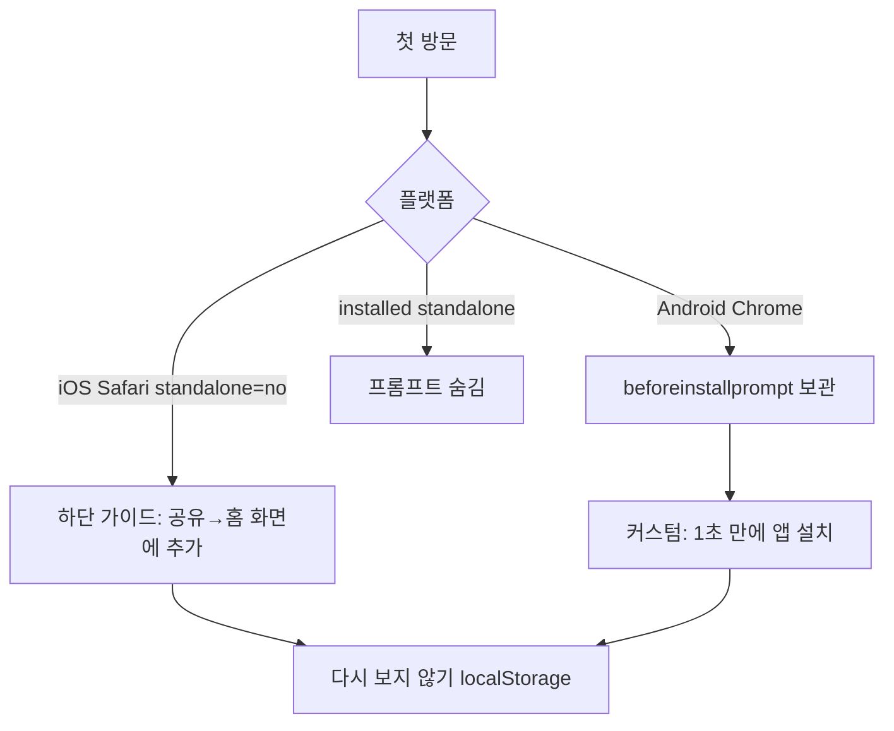

# AI Profit OS — PWA & Native (v7.22.33 pointer · Owns 본문 유지)

> 분리 플랜 — Index: `ai_profit_os_00_index_a1b2c3d4.plan.md` · ARCHIVE: `ai_profit_os_launch_54c1261e.plan.md` · 착수전: `docs/CONSTITUTION_BOOTSTRAP.md`
> **단일 편집본:** 워크스페이스 `.cursor/plans` 해시 파일만

> **제로 목표:** 오류0 · 결함0 · 오차0 · 중복0  
> **todo 순서:** App Shell/manifest → Push/Badge → §23.5a 자동 fanout → WebAuthn UX → Store Bridge(v2·Day-1 제외)  
> **v7.22.25:** §23.5a 공지·이벤트·매칭·쪽지 **자동 Push** · UI prefs 필터 · 가입 기본 ON  
> **v7.22.26:** Index §20.1 기회스캔 표현 **pointer only** · PWA Owns **변경 0**  
> **v7.22.28:** Index §20.2 · opp Push 카피=`수익 벌기`/자본참여자 톤 (UI §5.3b) · PWA Owns **변경 0**  


> **manifest name/short_name:** **퍼뜩** · retired `오늘수익`·`바로번다` **0**  
> **스택:** **next@16** · Serwist · CF Pages · Phase0 Push=**in-process** (NATS=Phase1+)  
> **색:** Lux `packages/ui/tokens` only · `#1A56FF` 폐기  
> **모델:** 전 todo `[composer-2.5|200K]` · WebAuthn **정책**=Money(grok 슬라이스 가능)

## Owns / Pointer (중복0)

| 주제 | Owns | Pointer |
|------|------|---------|
| manifest·SW·Install·Push client·Badge·standalone CSS | **본 플랜 §23** | — |
| WebAuthn **정책·챌린지·Email OTP/PIN/recovery** | **Money §43.6** | 본 절 §23.6 = 브라우저/RP/UX only |
| Push kill · circuit | **Admin** `/admin/system-control` | 본 절 §23.5 |
| Hosting·DB·Phase bus·Compose | **Infra §15/Phase** | §24.0 pointer |
| Install/Push **한글 카피** | **UI §27.8** · toast §8.2/§8.3 | payload title/body keys |
| Brand icons | **`packages/ui/brand`** | → `public/icons/*` |

### Day-1 vs Non-goal (과장0)

| Day-1 (출시 게이트 §26) | Day-1 **아님** (v2 / Store) |
|-------------------------|-----------------------------|
| manifest · Serwist · Install · OfflineBanner · SW update UX | FCM |
| VAPID Web Push · Badge degrade · iOS installed-only | TWA `.aab` · Capacitor · APNs |
| WebAuthn **UX** + Money §43 fallback | Background Sync 필수화 |
| HTTPS `APP_HOST` installable | 오프라인 participate/withdraw 큐 |
| Canon install/offline wires | Vercel |

---

## 23. PWA & Native Experience — Native-feel SSOT

> **목표:** 스토어 **v1 미등록**에서도 standalone 앱감.  
> **SSOT 파일(생성 예정):** `CONSTITUTION/23_PWA_AND_NATIVE_EXPERIENCE.md` + `apps/web/public/manifest.webmanifest`

### 23.0 피드백 검토 — 동의 vs 수정 흡수 (오차0)

| 피드백 | 판정 | 플랜 반영 |
|--------|------|-----------|
| `display: standalone` | ✅ 동의 | manifest SSOT |
| theme/background = 스플래시 | ✅ 동의 | **Lux 토큰만** · ADR-011/013 icons=`packages/ui/brand` → `public/icons/*` · 사진목업 아이콘 복제 금지 |
| 전역 `user-select: none` | ⚠️ **부분 반대** | 금액·버튼·카드=none · **입금주소·TX·고객센터=selectable** |
| `touch-action`로 새로고침 차단 | ⚠️ **부분 반대** | `overscroll-behavior-y: contain` · iOS 100% 불가 시 degrade |
| `-webkit-touch-callout: none` | ✅ 동의 | 주소 필드 제외 |
| iOS 설치 가이드 | ✅ 동의 | 3초 튜토리얼 · Canon `install-ios` |
| Android `beforeinstallprompt` | ✅ 동의 | 커스텀 [앱 설치] · 카지노 톤 ❌ |
| Web Push + VAPID | ✅ 동의 | CF Worker + web-push · **버스=§23.5** |
| FCM 무제한 무료 | ⚠️ **수정** | PWA Day-1=VAPID only · FCM=v2 native |
| App Badge | ✅ 동의 | Android/desktop 우선 · iOS degrade |
| WebAuthn | ✅ 동의 | **UX=본 절 · 정책=Money §43** |
| Vibration / Web Audio | ✅ 동의 | iOS vibrate no-op → 시각+사운드 · **reduced-motion 시 sfx/vibrate OFF** |
| next-pwa | ⚠️ **업그레이드** | **Serwist** `@serwist/next` · App Router |
| Next.js | ✅ **ADR-015 잠금** | **`next@16` only** · next@15 문구 **폐기** |
| Supabase PG | ✅ | DB SoT · Auth=Nest JWT only |
| Vercel | ❌ | CF Pages SSOT (Infra) |
| TWA / Capacitor | ✅ v2 | Day-1 게이트 **제외** · §24.3 |

### 23.1 Manifest SSOT (`apps/web/public/manifest.webmanifest`)

> **색 SSOT:** `background_color` = Lux `color.bg` (`#090A10`) · `theme_color` = Lux `color.principal` (`#7AA2FF`) · **하드코딩 임의 hex(`#1A56FF`) 금지** · 구현 시 토큰에서 생성/검증(`verify:pwa-manifest`).

```json
{
  "name": "퍼뜩",
  "short_name": "퍼뜩",
  "id": "/",
  "description": "AI가 찾아주는 수익 기회",
  "start_url": "/?source=pwa",
  "scope": "/",
  "display": "standalone",
  "display_override": ["standalone", "minimal-ui"],
  "orientation": "portrait-primary",
  "theme_color": "#7AA2FF",
  "background_color": "#090A10",
  "lang": "ko-KR",
  "dir": "ltr",
  "categories": ["finance", "productivity"],
  "icons": [
    { "src": "/icons/icon-192.png", "sizes": "192x192", "type": "image/png", "purpose": "any" },
    { "src": "/icons/icon-512.png", "sizes": "512x512", "type": "image/png", "purpose": "any" },
    { "src": "/icons/maskable-512.png", "sizes": "512x512", "type": "image/png", "purpose": "maskable" }
  ],
  "screenshots": [
    { "src": "/screenshots/home-narrow.png", "sizes": "390x844", "type": "image/png", "form_factor": "narrow" }
  ],
  "shortcuts": [
    { "name": "수익", "url": "/profits", "icons": [{ "src": "/icons/shortcut-profits.png", "sizes": "96x96" }] },
    { "name": "지갑", "url": "/wallet", "icons": [{ "src": "/icons/shortcut-wallet.png", "sizes": "96x96" }] }
  ],
  "prefer_related_applications": false
}
```

**HTML head (필수):**
```html
<link rel="manifest" href="/manifest.webmanifest" />
<meta name="theme-color" content="#7AA2FF" />
<meta name="apple-mobile-web-app-capable" content="yes" />
<meta name="apple-mobile-web-app-title" content="퍼뜩" />
<meta name="apple-mobile-web-app-status-bar-style" content="black-translucent" />
<link rel="apple-touch-icon" href="/icons/apple-touch-180.png" />
<meta name="viewport" content="width=device-width, initial-scale=1, viewport-fit=cover" />
```

**Installability:** HTTPS + `APP_HOST` (Infra §31) only · localhost는 개발 예외.

### 23.2 Native Shell CSS (`packages/ui/pwa-shell.css`)

```css
@media (display-mode: standalone) {
  html, body {
    overscroll-behavior-y: contain;
    -webkit-tap-highlight-color: transparent;
  }
  .pwa-chrome {
    user-select: none;
    -webkit-touch-callout: none;
  }
  .pwa-copyable, input, textarea, [data-copy] {
    user-select: text;
    -webkit-touch-callout: default;
  }
  .pwa-safe-top { padding-top: env(safe-area-inset-top); }
  .pwa-safe-bottom { padding-bottom: env(safe-area-inset-bottom); }
}
```

**금지:** body 전역 `user-select:none` · `touch-action` 전역 제한

### 23.3 Service Worker — Serwist (`@serwist/next` · **next@16**)

| Cache | Strategy | 대상 |
|-------|----------|------|
| App Shell | CacheFirst | `/`, layout, fonts, icons, `pwa-shell.css` |
| API | NetworkFirst (3s timeout) | `/api/v1/opportunities`, `/api/v1/wallet/balance` |
| Static assets | StaleWhileRevalidate | `/_next/static/*`, images |
| Push | SW push handler | background notification |

**오프라인 UX (결함0):**
- Shell + API fail → OfflineBanner + [새로고침] (침묵 빈 화면 금지)
- Money ops (participate/withdraw/deposit confirm) → **오프라인 queue 금지** → `NETWORK_ERROR` toast (UI §8.2)

**SW 업데이트 UX (필수):**
- `waiting` worker 감지 → 인앱 1버튼 “새 버전으로 새로고침” → `skipWaiting` + clients.claim  
- 자동 무한 reload 루프 금지

**파일:**
```
apps/web/
├── app/sw.ts
├── public/manifest.webmanifest
├── public/icons/*          # Brand Kit only
└── components/pwa/
    ├── InstallPrompt.tsx
    ├── StandaloneGate.tsx
    ├── OfflineBanner.tsx
    └── SwUpdateToast.tsx
```

**Canon wires (UI mockup-governance):** `install-ios` · `install-android` · `offline-banner` · (선택) `sw-update`

### 23.4 3초 원터치 Install Prompt



| 플랫폼 | UI | copy SSOT |
|--------|-----|-----------|
| iOS | 하단 슬라이드 | UI §27.8 |
| Android | 풀폭 Primary | UI §27.8 |
| Desktop | 주소창/QR | UI §27.8 |

**노출 규칙:**
- 첫 세션 5초 후 1회 · 거절 시 7일 cooldown
- `display-mode: standalone` → **절대 노출 0**
- `/wallet/deposit` 성공 후 → 재노출 1회

**구현:** `packages/sdk/install-prompt/` — UA + `display-mode` + `beforeinstallprompt`

### 23.5 Web Push + App Badge

**버스 (Phase 잠금 · ADR-016):**

| Phase | 경로 |
|-------|------|
| **0** | `api-nest` **in-process emit** → `workers/push-dispatcher` (HTTP/queue) → SW push → Badge |
| **1+** | `api-nest` → **NATS** `opportunity.hot` / `ai_pick` → 동일 dispatcher |

```
api-nest → (Phase0 in-process | Phase1+ NATS)
         → push-dispatcher (CF Worker, web-push + VAPID)
         → SW push event → OS notification
         → App Badge API (navigator.setAppBadge)
```

| 항목 | SSOT |
|------|------|
| VAPID keys | CF Workers Secrets (rotate 90d) · GitHub 0 |
| Subscription | `push_subscriptions` · schema `push-subscription.v1` |
| Payload | `{ titleKey, bodyKey|body, href, badgeCount, source_event_id }` · 본문=UI §8.3 / `T.push.*` |
| Dedup | `source_event_id` UNIQUE → 중복 push 0 |

**플랫폼 매트릭스 (과장 금지):**

| 기능 | Android Chrome PWA | iOS Safari PWA (16.4+, **installed**) | Desktop |
|------|-------------------|----------------------------------------|---------|
| Web Push | ✅ | ✅ 홈화면 추가 **필수** | ✅ |
| App Badge | ✅ | ⚠️ 제한적 | ⚠️ |
| Background sync | Day-1 비필수 | ❌ | 비필수 |
| Vibration in SW | ❌ | ❌ | ❌ |

**잠금:**
- iOS **미설치** → Push permission 요청 **금지** · In-app + SSE + `/me` 배지
- iOS **installed** 후에만 Push opt-in
- Badge count = **server unread only** (client inflate 0)

**Admin (Owns=Admin · pointer):** `/admin/system-control` → **`pushEnabled` kill switch** + audit  
(circuit와 동일 surface · 별도 13번째 모듈 금지)

#### 23.5a 공지·이벤트·매칭등록 자동 Push (삭제 금지 · v7.22.25)

> **중복0:** 발행 UI = Admin growth/opportunities · **전송 파이프 = 본 절** · **채널 prefs = UI §50.1n** · 1인 쪽지 = Admin §9.8.8d (fanout 아님)

| 이벤트 | channel (prefs 키) | href 예 | source_event_id |
|--------|-------------------|---------|-----------------|
| notice → `live` | `notice` | `/me/events?tab=notice&id=` | `notice:{id}:{publishedAt}` |
| campaign → `live` | `campaign` | `/me/events?tab=campaign&id=` | `campaign:{id}:{liveAt}` |
| opportunity → `available` (신규/재공개) | `opportunity` | `/profits/{id}` | `opp:{id}:{availableAt}` |
| ops 1인 쪽지 | `opsMessage` | `/me/inbox?id=` | `ops:{messageId}` |

**필터 순서 (오차0):**
```
pushEnabled(kill) → user.master → user[channel] → push_subscriptions 존재 → dispatcher
```
- 통과 실패해도 **인박스/알림함 row는 Nest가 먼저 persist** (UI §5.9.4)  
- Growth OFF → campaign fanout **0**  
- 매칭 fanout Day-1: `available` 전환 시만 (가격 tick마다 Push **금지** · SSE는 별개)

**CI:** `verify:push-channel-prefs` · `verify:push-dedup`

### 23.6 WebAuthn UX — 브라우저/RP (정책 Owns=Money §43.6)

> **Owns 분리:** 출금 step-up **우선순위·Email OTP·PIN·recovery·Resend** = **Money §43.6**.  
> 본 절 = `@simplewebauthn/browser` · RP ID=`APP_HOST` · standalone UX · toast 키만.

| action | UX (본 절) | 정책 |
|--------|------------|------|
| USDT/원화 출금 | Passkey 시트 | Money §43 필수 step-up |
| 고액 participate (>500 USDT) | Passkey 시트 | Money §43 |
| 로그인 | passkey 우선 UI | Auth/Infra §51.9 + Money fallback |

**패키지:** `@simplewebauthn/browser` + server(api-nest)  
**금지:** 유료 biometric SDK · PWA 플랜에 OTP 정책 재정의

**오류 UX:**
- `NotAllowedError` → toast (UI 카피) · 재시도
- authenticator 없음 → **Money §43 순서대로** Email OTP → PIN (PWA가 PIN-only로 단축 금지)

**스키마:** `webauthn-challenge.v1` 등 → Money/schemas pointer

### 23.7 Haptics & Sound (`packages/sdk/feedback.ts`)

```typescript
export function profitTapFeedback() {
  if (prefersReducedMotion()) return; // Lux · §26
  if ('vibrate' in navigator) navigator.vibrate([30, 50, 30]);
  playSfx('profit-tap');
}
```

| 이벤트 | 진동 | 사운드 |
|--------|------|--------|
| 수익 벌기 탭 | short | soft tap |
| 거래 완료 | pattern | bright chime (카지노 ❌) |
| 출금 승인 | single | confirm tone |

**헌법:** 사운드 default ON · `/me/settings` OFF · **`prefers-reduced-motion: reduce` → vibrate+sfx 강제 OFF**

### 23.8 PWA 어뷰징 · 오류

| # | 시나리오 | 방어 |
|---|----------|------|
| P1 | Push subscription spam | user_id당 max 5 endpoint + rate limit |
| P2 | Fake SW injection | scope `/` · skipWaiting controlled · update UX |
| P3 | Install annoyance | cooldown + standalone hide |
| P4 | Offline stale balance | NetworkFirst + “마지막 업데이트” · 머니 큐 0 |
| P5 | WebAuthn relay | origin allowlist + challenge TTL 60s (Money) |
| P6 | Badge inflation | server unread only |
| P7 | Push before iOS install | permission prompt 0 |

---

## 24. Store Bridge (Owns=PWA) · Infra pointer

> **헌법 파일(생성 예정):** `CONSTITUTION/24_FREE_TIER_AND_STORE_BRIDGE.md` — **Store/PWA bridge만**.  
> **호스팅·DB·Redis·Phase·Compose·EKS = Infra Owns** — 본 절에 스택 표 재정의 **금지**.

### 24.0 Infra pointer (중복0)

| 항목 | SSOT |
|------|------|
| CF Pages / Workers / Vercel 금지 | Infra |
| Supabase PG · Upstash · Phase0 in-process | Infra · ADR-016 |
| Docker Compose | **옵션** · 8GB 기본 OFF (Infra) |
| `APP_HOST` / HTTPS | Infra §31 |

PWA Day-1이 의존하는 것: **CF Pages에 `apps/web` 배포** · **push-dispatcher Worker** · VAPID secrets — 구현 위치는 Infra 트리, 계약은 본 절 §23.5.

### 24.1 PWA 관련 $0 계약 (pointer 요약 · Owns 아님)

- Push: web-push + VAPID = $0  
- Biometrics API = $0 (정책=Money)  
- 상세 free-tier 표 = Infra Bootstrap

### 24.2 Production Scale

Infra Phase A→C pointer only.  
**폐기 문구:** “Phase A = Compose local 필수” — Docker-less 기본과 충돌.

### 24.3 Store Bridge — v2 (UI 재작성 0 · Day-1 게이트 제외)

#### Google Play — TWA

| Step | 작업 |
|------|------|
| 1 | `/.well-known/assetlinks.json` |
| 2 | PWABuilder → `.aab` |
| 3 | Digital Asset Links |
| 4 | Play Console |

#### Apple — Capacitor Shell

```
packages/sdk/native-bridge|push|haptics|install-prompt
apps/web          # UI SSOT
apps/mobile-shell # Capacitor only (v2)
```

| 항목 | 진실 |
|------|------|
| UI | `apps/web` 100% 재사용 |
| iOS Push | APNs + plugin (Web Push 한계 우회) = v2 |
| FCM | v2 native bridge only |

### 24.4 Store Milestone

| MS | 내용 |
|----|------|
| M8a | TWA `.aab` + internal track |
| M8b | Capacitor iOS TestFlight |
| M8c | Store listing + 정책 문서 |

---

## 25. PWA 구현 파일 트리 · Day-1 순서

**착수 순서 (오류0):**
1. Brand icons → `public/icons/*` + apple-touch  
2. manifest + layout meta (Lux 색 · 퍼뜩 · apple-title)  
3. Serwist + OfflineBanner + SwUpdateToast · 머니 큐 0  
4. InstallPrompt + Canon wires  
5. VAPID + push_subscriptions + Worker + dedup  
6. Badge server unread  
7. WebAuthn UX → Money §43 API  
8. haptics/audio + settings + reduced-motion  
9. (v2) TWA/Capacitor — §24.3

```
apps/web/
├── public/
│   ├── manifest.webmanifest
│   ├── icons/
│   └── sfx/
├── app/
│   ├── layout.tsx
│   └── sw.ts
├── components/pwa/
│   ├── InstallPrompt.tsx
│   ├── StandaloneGate.tsx
│   ├── OfflineBanner.tsx
│   └── SwUpdateToast.tsx
└── lib/pwa/
    ├── display-mode.ts
    └── push-subscribe.ts

packages/sdk/
├── install-prompt/
├── push/
├── haptics/
├── audio/
└── native-bridge/          # v2 stub

packages/ui/canon/surfaces/
├── install-ios.wire.json
├── install-android.wire.json
└── offline-banner.wire.json

workers/push-dispatcher/
schemas/push-subscription.v1.json
```

**next.config:** `@serwist/next` · **next@16** · SW → `public/sw.js` (1곳)

---

## 26. PWA 출시 게이트 + verify:*

### 오류0 · 결함0
- [ ] Lighthouse PWA ≥ 90 (CI) · 로컬 8GB는 stub OK
- [ ] standalone 주소창 미노출 (Android + iOS installed)
- [ ] 입금주소 long-press 복사
- [ ] OfflineBanner + SW update 1버튼
- [ ] Install iOS/Android E2E
- [ ] theme/background = Lux 토큰 일치

### 오차0
- [ ] Push `source_event_id` dedup 100%
- [ ] Badge = server unread
- [ ] WebAuthn 출금 E2E + Money §43 fallback
- [ ] Phase0 Push 경로에 NATS import **0**

### 중복0
- [ ] manifest 1곳 · SW 1곳 · push-dispatcher 1곳
- [ ] WebAuthn 정책 문구 Money §43만 · PWA 재정의 0
- [ ] 호스팅/Compose 표 Infra만

### 플랫폼 degrade
- [ ] iOS no-vibrate → sound+visual
- [ ] iOS 미설치 → Push 요청 0 · in-app만
- [ ] Desktop push opt-in
- [ ] reduced-motion → sfx/vibrate OFF

### CI / verify (CATALOG)
| id | 검사 |
|----|------|
| `verify:pwa-manifest` | name=퍼뜩 · Lux theme/bg · id/start_url · retired 브랜드 0 |
| `verify:pwa-serwist-single` | SW 진입 1곳 · next@16 peer |
| `verify:pwa-brand-icons` | icons ∈ Brand Kit 파이프라인 |
| `verify:push-dedup` | source_event_id UNIQUE 경로 |
| `verify:pwa-phase0-bus` | Push emit 경로 NATS Day-1 **0** |
| `verify:webauthn-fallback-pointer` | PWA가 OTP 정책 Owns 주장 0 · Money §43 |
| lighthouse-pwa | CI ≥ 90 (local stub) |

---
