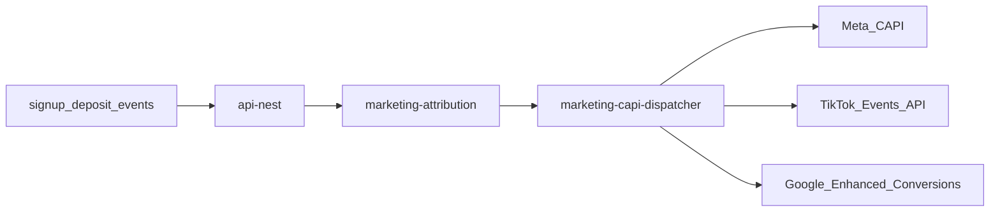

# AI Profit OS — Infra & Marketing (v7.22.27)

> 분리 플랜 — Index: `ai_profit_os_00_index_a1b2c3d4.plan.md` · ARCHIVE: `ai_profit_os_launch_54c1261e.plan.md` · 착수전: `docs/CONSTITUTION_BOOTSTRAP.md`  
> **Owns 범위:** §15~16·§31~32·§51.9/13 · Auth/Ads/호스팅 · **Money/KRW 운영 스토리 재정의 금지**(pointer only)

> **제로 목표:** 오류0 · 결함0 · 오차0 · 중복0  
> **에이전트 SSOT:** **ADR-014** · §15.0b · Cursor=플랜 집행기  
> **툴체인 SSOT:** **ADR-015** · `TOOLCHAIN.md` · next@16 · TW4 · pnpm10 · Node22  
> **자동화:** **ADR-016** Docker-less 기본 · Vercel 금지  
> **결제:** **PG사(결제대행) 0** · USDT TRC20 + 원화 **Admin 승인/거절 Day-1** (Money §41.3 · CSV=L2+) · **PostgreSQL**=ADR-001  
> **SEO name:** Consumer=**퍼뜩** · retired `오늘수익`·`바로번다` **0**  
> **v7.22.11 본문 잠금:** `/ads`·랜딩3초·Stage A/B — 이후 개정은 Index changelog + 본 절 pointer  
> **v7.22.28:** Index §20.2 자본참여자 **pointer only** · Infra Owns **변경 0** · 랜딩 CTA 톤=UI `수익 벌기`  
> **todo 순서:** stack-lock(완료) → Auth → Marketing/CAPI → Phase0 Bootstrap/관측
## 15. Infrastructure

### 15.0b Cursor Agent · Stack Lock (ADR-014/015 · monorepo **전** 필수)

> **원칙:** Cursor는 **플랜의 집행기**다. 스택 변경은 **ADR만**. “세계 최고로 교체” 재제안 금지.

#### 잠금 스택 (ADR-015)

| 층 | SSOT | 금지 |
|----|------|------|
| Runtime | Node **22** · **pnpm@10.14.0** (`packageManager`) | npm/yarn/bun install SSOT |
| Frontend | **`next@16`** App Router · Lux · Serwist · **Tailwind v4** | next@15·TW3 신규 · Vercel 병행 · next@17 무단 |
| API | NestJS `api-nest` JWT + OAuth/Passkey | Supabase Auth 병행 |
| Engine | Rust `engine-rust` (`rust-toolchain.toml`) | JS로 원장/정산 핵심 대체 |
| DB | PostgreSQL **단일** · **Supabase Seoul 기본** (Compose 옵션·8GB OFF) | 두 번째 Postgres SoT · Docker 필수화 |
| Hot | **Upstash Redis** 기본 · Compose Redis 옵션 | Twin/잔액 Redis-only SoT |
| Edge | Cloudflare Pages + Workers + DO (+ OpenNext) | Vercel+CF 이중 호스트 · Vercel 연동 |
| Agent | **ADR-016** rules·hooks·Husky·`verify:gate`·cleanup | always 규칙 과다 · `--no-verify` |
| Events | Phase0 **in-process** → Phase1 NATS → Phase2 Temporal | Day-1 NATS/Temporal 필수화 |
| 결제 | **PG사(결제대행) 0** · USDT TRC20 + KRW **Admin 승인/거절 Day-1** (CSV=L2+) | Toss/Nice/Inicis/PortOne · Day-1 Auto-Recon 필수화 |

#### 필수 아티팩트

| 경로 | 역할 |
|------|------|
| `TOOLCHAIN.md` | 설치·검증 SSOT |
| `.cursor/rules/stack-lock.mdc` | alwaysApply — ADR-015 핀 |
| `.cursor/rules/phase-activation.mdc` | Phase0/1/2/3 |
| `.cursor/rules/mockup-governance.mdc` | ADR-013 |
| `AGENTS.md` | 읽기 순서 |
| `docker-compose.dev.yml` | PG17 + Redis7 |
| `pnpm verify:stack-lock` | 작업 전 PASS |

#### 에이전트 읽기 순서 (중복0)

1. `TOOLCHAIN.md` + `AGENTS.md` + ADR-014/015  
2. ACTIVE `ai_profit_os_00_index_*`  
3. 해당 도메인 `01~06`  
4. launch 통합본 = **ARCHIVE**  
5. Canon wire · Brand Kit (UI 작업 시)

#### MCP / 도구 경계

| 도구 | 허용 | 금지 |
|------|------|------|
| Supabase MCP | **PostgreSQL** 스키마·쿼리 | Supabase Auth를 User Auth SoT로 사용 |
| Cloudflare | Pages/Workers/R2/DO | Vercel을 두 번째 호스트 SSOT로 추가 |

**CI:** `verify:stack-lock` — Node22·pnpm10·next@16 핀·rules·Compose·Rust · Phase0 NATS 의존 0  
**선행:** `monorepo-skeleton` **전에** `pnpm verify:stack-lock` PASS

### 유저앱 vs Admin Ops **분리 배포 (§40 — 필수)**

| | **유저 PWA** | **Admin Ops** |
|---|-------------|---------------|
| App | `apps/web` | `apps/admin` |
| Domain | `app.{ROOT_DOMAIN}` | **`ops.{ROOT_DOMAIN}`** |
| CF Pages | project `ai-profit-web` | project **`ai-profit-ops`** |
| Auth | user JWT / Passkey | **admin JWT** · MFA · RBAC |
| Route | 5탭 only | 12모듈 · **/admin/** |
| Public link | 마케팅·SEO | **비공개** · 검색엔진 차단 |
| WAF | bot score | **IP allowlist** + CF Access(optional) |

#### 15.0 ROOT_DOMAIN 잠금 (출시 전 필수 · ADR-010)

| env | 예 | 용도 |
|-----|-----|------|
| `ROOT_DOMAIN` | owner-provided (예: `oneulprofit.com`) | 쿠키·CORS·SEO canonical 루트 |
| `APP_HOST` | `app.{ROOT_DOMAIN}` | 유저 PWA |
| `OPS_HOST` | `ops.{ROOT_DOMAIN}` | Admin |
| `API_HOST` | `api.{ROOT_DOMAIN}` | Nest |
| `GO_HOST` | `go.{ROOT_DOMAIN}` optional | 광고 랜딩 |

**규칙:** `ROOT_DOMAIN` 미설정 시 **prod deploy Fail** · local은 `localhost`만. 플랜 본문의 `domain.com` = placeholder 의미.  
**CI:** `verify:root-domain-env` — prod artifact에 미치환 `{domain}` 문자열 0

**금지:** `apps/web`에 `/admin` route · 동일 도메인에 admin mount · 유저앱에서 ops URL 노출

```
infra/
├── web/          # wrangler/pages — APP_HOST
├── ops/          # wrangler/pages — OPS_HOST  ← §40
│   ├── pages.toml
│   └── access-policy.json   # IP allowlist / Zero Trust
└── api/          # API_HOST
```

### Bootstrap ($0) — **Phase 0 우선 (§51.13)**

| Phase | 이벤트 버스 | 스택 | Milestone |
|-------|-------------|------|-----------|
| **0** | **in-process** (Nest 내부 emit · NATS **0**) | CF Pages + Nest + **PostgreSQL** + Redis + engine-rust · **PG사 0** | M1 deposit→participate→settlement |
| **1** | **NATS JetStream** | + adapters · realtime-service · chain-watchers | M2 |
| **2** | NATS + Temporal | + shadow-replay · sweeper 고도화 | M4 |
| **3** | 동일 | EKS + full OTel | M7 |

```
Cloudflare Pages: ai-profit-web → apps/web · ai-profit-ops → apps/admin
Workers: push-dispatcher (Phase0=Nest **in-process**→Worker · Phase1+=NATS · PWA §23.5), marketing-capi-dispatcher (M1+) · chain-watchers (Phase1+)
Email: Resend free (§43.6)
Upstash Redis · R2 kyc-docs
→ local Docker Compose (web:3000 · ops:3001 · api:4000)
```

**오차0:** 아키텍처 mermaid의 NATS = **Phase1+ 목표 토폴로지**. Phase0에서 NATS 필수화 = 결함.
### Production
```
Docker Compose → Compose+Tilt → Stage(ECS/small K8s) → Prod(EKS)
```

Observability: User click → SW → API → Engine → Ledger → Wallet (OTel full trace)

---

## 16. Monorepo (최종)

**런타임 pin (오차0 · ADR-015):** `apps/web` · `apps/admin` → **`next@16`** (App Router) · root `packageManager=pnpm@10.14.0` · Node22 · **Tailwind v4** · major **17** 강제 업 **금지**(별도 ADR).  
**CI:** `verify:next-major-pin` — next major ≠ **16** Fail · `verify:stack-lock`

```
AI_PROFIT_OS
├── apps/
│   ├── web/                 # 5탭 PWA SSOT
│   └── admin/               # 12모듈 SSOT
├── services/
│   ├── marketing-attribution/   # UTM, ROAS, CAPI orchestration
│   └── ...
├── workers/
│   ├── marketing-capi-dispatcher/
│   ├── ebay-adapter/            # §0.0 · §3 workers SSOT (rolex-adapter · yahoo-jp-adapter 금지)
│   ├── pokemontcg-adapter/
│   ├── ygoprodeck-adapter/
│   ├── coingecko-adapter/
│   ├── frankfurter-adapter/
│   ├── chain-watchers/
│   ├── chain-sweeper/
│   ├── push-dispatcher/
│   └── temporal-workers/
├── packages/
│   ├── ui/
│   ├── types/
│   └── sdk/                     # marketing, device-tier, push, native-bridge
├── schemas/
│   ├── user-attribution.v1.json
│   ├── opportunity-card.v1.json
│   ├── opportunity-pricing.v1.json   # §36
│   ├── deposit-config.v1.json      # §37
│   ├── admin-user-ops.v1.json      # §37 balance/status/ip
│   ├── user-financial-summary.v1.json  # §39 KPI·집계
│   ├── user-deposit-address.v1.json    # §41 유저별 TRC20
│   ├── krw-deposit-request.v1.json   # §41 원화 입금신청
│   ├── kyc-status.v1.json            # §42 출금 게이트
│   ├── admin-rbac.v1.json        # §40 역할×권한 matrix
│   ├── toast-codes.v1.json
│   ├── admin-actions.v1.json
│   ├── execution-policy.v1.json      # §48 실조건·연출 (successRate 금지)
│   ├── trade-execution-state.v1.json # §48 진행 상태
│   ├── wallet-buckets.v1.json        # §49 principal/profit/locked/practice
│   ├── withdraw-intent.v1.json       # §49 mode profit|principal|combined
│   └── ui-copy-glossary.v1.json   # enum→한글 표시 SSOT
├── data-contracts/
├── migrations/
├── infra/
│   ├── web/                 # CF Pages — app
│   ├── ops/                 # CF Pages — admin §40
│   └── api/
├── docs/
│   └── ux/
├── CONSTITUTION/            # 00~28 + 35~51
└── research/
```

---

## 31. Marketing Funnel · CAPI · SEO (v6 신규)

> **SSOT:** `CONSTITUTION/27_MARKETING_AND_SEO_ENGINE.md`  
> **코드:** `packages/sdk/marketing/` + `apps/web/app/(landing)/` + `workers/marketing-capi-dispatcher`

### 31.0 피드백 검토 — 동의 vs 수정 (오차0)

| 피드백 | 판정 | 플랜 반영 |
|--------|------|-----------|
| 매체별 맞춤 랜딩 (TikTok/Meta/Google) | ✅ 동의 | Ad Funnel Matrix §31.2 |
| Server-side CAPI (Meta/TikTok/Google) | ✅ 동의 | CF Worker dispatcher |
| UTM/gclid 영구 귀속 → 입금 ROAS | ✅ 동의 | `user_attribution` + ledger |
| 1초 Passkey/Social 가입 | ✅ 동의 | 기존 §23 WebAuthn + OAuth |
| sitemap.ts + robots.ts | ✅ 동의 | Next.js App Router |
| IndexNow ping on opportunity update | ✅ 동의 | **크롤 요청** (순위 보장 ❌) |
| Dynamic OG share + referral | ✅ 동의 | opengraph-image.tsx |
| JSON-LD Rich Snippets | ⚠️ **수정** | **WebApplication + Dataset** — honest metadata |
| Dynamic metadata per opportunity | ✅ 동의 | `/profits/[slug]` generateMetadata |
| **애드블록 우회** | ❌ **금지** | client pixel 최소화 + **consent-first CAPI** |
| **iOS 프라이버시 우회** | ❌ **금지** | **ATT 준수** + SKAdNetwork(optional) + server CAPI |
| **카지노 터치 사운드** (TikTok) | ❌ **금지** | 돈 버는 앱 톤 · §25/22 |
| **게임형 리워드 명목 심사 통과** | ❌ **금지** | **정책 준수 가이드** — 회피·미끼 ❌ |
| **★4.9 fake snippet** | ❌ **금지** | real reviews only or no rating |
| CAPI **유실률 0%** | ⚠️ **수정** | **consent+match quality 목표** — 100% 과장 ❌ |
| CONSTITUTION **22** | ❌ **충돌** | **`27_MARKETING`** (22=UX) |
| 광고비 유출 **0** | ⚠️ **정의** | **ROAS 가시화 + wasted spend cut** (부정 클릭≠0 자동) |

### 31.1 "광고비 유출 0" 정의 (오차0)

| 유출 유형 | 방어 |
|-----------|------|
| Attribution blind spot | UTM→user_id→first_deposit chain |
| Client pixel blocked | Server CAPI (consent 후) |
| Wrong campaign credit | last-touch + first-touch both stored |
| Bot click burn | risk bot score + ad platform exclude API |
| Bait-and-switch landing | variant locked to ad disclosure copy |

**NOT 약속:** 클릭 부정 0% · organic #1 보장 · 심사 100% pass

### 31.2 Ad Funnel Matrix (Compliance-First)

| 매체 | route | `landingVariant` | 타겟 | 랜딩 ko 톤 | 온보딩 toneBand 시드 (UI §38.9) | **금지** |
|------|-------|------------------|------|------------|----------------------------------|----------|
| TikTok | `/l/tt` | `tt` | 2030 | 숏폼 세로 · "AI 수익 기회 알림" · 1탭 가입 | `young` | 카지노음·게임 위장 · **성별 타깃 카피** |
| Meta | `/l/meta` | `meta` | 3050 | 카드뉴스 · "글로벌 시세 모니터링 OS" | `mid` | 수익 확정·투자 암시 (§35 G2 ON 시 랜딩만 예외) · 성별 분기 |
| Google | `/l/google` | `google` | 4070 | 큰 글씨 · "예상 수익 데이터" · 신뢰 배지(실측) | `senior` (+ fontScale≥lg 시드) | 재테크 보장 카피 · 성별 분기 |

**공통:** CTA → Passkey/OAuth(**Kakao**/Google) **1초 가입** → 온보딩(§6.4) 또는 `/` · cookie `attr_id` 90d  
**내부 전환:** 랜딩 copy ≠ 앱 copy drift 금지 — **25 ko SSOT** 파생  
**시드:** `landingVariant` → 온보딩 toneBand **초기값만** · 유저 재선택 승 (UI §6.4 · §38.9)

**서브도메인 (optional):** `go.domain.com` → same `(landing)` routes · CORS SSOT

### 31.2a `/ads` 라우트 alias (중복0 · v7.22.11)

| Public path | 동작 |
|-------------|------|
| `/ads` | → `/l/meta` 기본 (또는 last UTM 매체) · **동일 surface** |
| `/ads/tt` · `/ads/meta` · `/ads/google` | → `/l/tt` · `/l/meta` · `/l/google` **rewrite/alias** |
| `/l/*` | **canonical** route (sitemap·CAPI 기준) |

**금지:** `/ads` 전용 별도 카피/픽셀 페이지 이중 유지 · 랜딩↔앱 CTA 라벨 drift

### 31.2b 첫 viewport 3초 예산 (route SSOT 여기 · wire=UI Canon `landing-3s`)

| # | 요소 | 필수 |
|---|------|------|
| 1 | 퍼뜩 brand mark | ✅ |
| 2 | 정체성 1줄 (매체별 tone만 다름 · 의미 동일) | ✅ |
| 3 | 예상≠보장 면책 1줄 | ✅ |
| 4 | Primary CTA 1개 (Kakao 우선) | ✅ |
| 5 | 신뢰 1줄 (운영사/DET pointer §50.9 · 과장 0) | ✅ |

**금지 (3초 프레임):** stat strip · 스케줄 · 멀티카드 · 보장수익 · 성별 타깃 카피 · 카지노 SFX  
**CI:** `verify:landing-3s` (UI) · `verify:marketing-compliance` (이 절 alias 포함)

### 31.3 Attribution Schema (단일 SSOT)

```typescript
// schemas/user-attribution.v1.json
interface UserAttribution {
  userId: string;
  firstTouch: {
    utmSource, utmMedium, utmCampaign, utmContent, utmTerm,
    gclid?, fbclid?, ttclid?,
    landingVariant: 'tt' | 'meta' | 'google' | string; // → toneBand seed (UI §38.9)
  };
  lastTouch: { ... };
  consentMarketing: boolean;
  consentAt: ISO8601;
  firstDepositAt?: ISO8601;
  firstDepositUsdt?: Decimal;
  capiSentEvents: string[];  // dedup
}
```

**귀속 시점:** 첫 visit → cookie/localStorage → signup merge → **ledger first_deposit** link  
**Admin ROAS:** §9.5.6

### 31.4 Server-Side CAPI Architecture



| Event | Trigger | Consent |
|-------|---------|---------|
| CompleteRegistration | signup | required |
| Lead | landing CTA | required |
| Purchase | first USDT deposit | required |
| ViewContent | opportunity view | optional tier |

**MUST:** consent log before send · event_id dedup · PII hashed (SHA256) per platform spec  
**NEVER:** send before consent · bypass ATT · fingerprint for ads

**Package:** `packages/sdk/marketing/`
```
capi-dispatch.ts      # server-only import
utm-capture.ts        # client first-touch
consent.ts            # CMP banner ko
attribution-store.ts  # cookie + API persist
```

### 31.5 SEO · IndexNow · OG Viral

#### Dynamic Metadata
```typescript
// apps/web/app/profits/[slug]/page.tsx
export async function generateMetadata({ params }) {
  const opp = await getOpportunity(params.slug);
  return {
    title: `예상 +${opp.profitKrw}원 · ${opp.assetLabel}`,
    description: `AI 추천 ${opp.aiScore}% · ${T.seo.disclaimer}`, // ko SSOT
    alternates: { canonical: `https://.../profits/${params.slug}` },
  };
}
```

#### JSON-LD (honest)
```json
{
  "@context": "https://schema.org",
  "@graph": [
    {
      "@type": "WebApplication",
      "name": "퍼뜩",
      "applicationCategory": "FinanceApplication",
      "offers": { "@type": "Offer", "price": "0", "priceCurrency": "KRW" }
    },
    {
      "@type": "Organization",
      "name": "PRE-OWNED WATCHES L.L.C",
      "identifier": {
        "@type": "PropertyValue",
        "propertyID": "DET Trade License",
        "value": "1135431"
      },
      "address": {
        "@type": "PostalAddress",
        "addressLocality": "Dubai",
        "addressCountry": "AE"
      },
      "url": "https://preownedwatches.ae"
    }
  ]
}
```

**SSOT:** `schemas/operator-entity.v1.json` → `@graph` Organization 노드 생성 (§50.9)  
**브랜드 (§51.1 ADR-002):** JSON-LD `name`=**퍼뜩**(consumer) · repo/platform=AI Profit OS · drift **금지**  
**금지:** fake `aggregateRating` · `FinancialProduct` with guaranteed returns · UK dissolved entity 표기

#### sitemap.ts + robots.ts
- `/profits/*` opportunities · `/l/*` landings (noindex optional for pure ad URLs)
- `priority` by opp score · `lastModified` from engine

#### IndexNow
- Trigger: `opportunity.created|updated` → NATS → worker ping (Google/Bing/Naver endpoints)
- **효과:** crawl notify only — **ranking ≠ guaranteed**

#### OG Dynamic Share · Referral Deep Link (v7.22.3)

```
apps/web/app/r/[code]/page.tsx              # sticky bind · 설치/로그인 후 §51.5
apps/web/app/share/[receiptId]/opengraph-image.tsx
apps/web/app/share/card/[type]/opengraph-image.tsx   # success|compare|trust|invite
→ referral code embedded · brand manifest assets · ko only · APP_HOST watermark
go.{ROOT_DOMAIN}/r/{code} → 302 APP_HOST/r/{code}
```
- Share targets: 카카오 · X · native Web Share API  
- Rate limit: `sharePerUserPerDay` (§51.5 · M1)  
- **금지:** 클라이언트 임의 OG HTML · 미등록 brand 에셋 · open redirect  
- CAPI events (consent 후): `ReferralBound` · `ReferralL2` · `ReferralL3` · `ShareCard` + `referral_edge_id`

#### Brand Assets CI (ADR-011)

- SSOT: `packages/ui/brand/manifest.json` + 필수 파일 전수  
- `verify:brand-assets` — checksum · sizes · no Chrono24 · splash=`#090A10`

### 31.6 Landing 파일 트리

```
apps/web/app/
├── (landing)/
│   ├── layout.tsx           # minimal chrome, no 5-tab
│   ├── tt/page.tsx          # TikTok variant
│   ├── meta/page.tsx
│   └── google/page.tsx
├── r/[code]/page.tsx        # referral deep link
├── profits/[slug]/page.tsx  # SEO public pages
├── sitemap.ts
├── robots.ts
├── share/[id]/opengraph-image.tsx
└── share/card/[type]/opengraph-image.tsx

packages/ui/brand/           # ADR-011 Brand Kit
packages/sdk/marketing/
workers/marketing-capi-dispatcher/
services/marketing-attribution/
```

### 31.7 CI Gates (§32)

- `verify:marketing-compliance` — no banned words in landing copy (§35 G2 OFF default)
- `verify:seo-schema` — JSON-LD validator, no aggregateRating without source · Organization license=1135431 matches §50.9
- `verify:attribution-chain` — UTM fixture → signup → deposit → admin ROAS
- `verify:capi-consent` — event without consent = test fail
- `verify:operator-footer` — schema ↔ SiteFooter ↔ T.legal.operator 3-way match
- `verify:referral-deeplink` — `/r/{code}` · go.* 302 · sticky 90d
- `verify:share-copy` — share 카드 금지어 0 · Primary CTA 가림 0
- `verify:brand-assets` — Brand Kit manifest 전수

---

## 32. Marketing · SEO 출시 게이트

- [ ] 3 landing variants live + ko-only
- [ ] Consent banner → CAPI send order E2E
- [ ] UTM persist 90d → first_deposit linked
- [ ] sitemap valid · IndexNow ping on opp create
- [ ] OG share generates referral URL · 4 share card types
- [ ] `/r/{code}` bind + CAPI ReferralBound/L2/L3 (consent)
- [ ] Brand Kit manifest PASS (`verify:brand-assets`)
- [ ] No fake structured data (manual QA)
- [ ] JSON-LD Organization = PRE-OWNED WATCHES L.L.C · license 1135431 (§50.9)
- [ ] SiteFooter + landing footer = operator schema (verify:operator-footer PASS)
- [ ] Ad policy checklist signed (27 appendix)

---

### 51.9 Auth Flow SSOT

> **ADR-006 (잠금):** User Auth SoT = **api-nest** (`/auth/*` · user JWT) + OAuth/Passkey/Email magic link. Supabase Auth **사용 금지**(DB managed만 허용). Admin JWT와 issuer **분리** (§40).  
> **Email:** magic link + OTP = **Resend free** (§43.6) · from 도메인=`ROOT_DOMAIN` 검증.  
> **UI surface:** Canon `auth-login` / `auth-signup` (UI §6.4b) · **필드·게이트 SSOT=본 절**.

```
(/l|/ads landing) → OAuth(Kakao primary / Google) | Passkey | Email magic link (Resend)
  → Stage A: POST /auth/signup · merge attribution · issue user JWT · onboarding_incomplete
  → Stage B: PATCH /auth/profile (출금·KYC 전 필수 필드) · UI §6.4 resume
  → optional: lazy TRC20 on first /wallet/deposit visit (§41)
/me/settings → 로그인 보안 · Passkey add · logout
/me/settings/delete-account → confirm×2 → ledger balance=0 guard → anonymize
```

| Flow | Guard |
|------|-------|
| Signup Stage A | 필수 약관 동의 · marketing optional (§31) · referral_code optional |
| Signup Stage B | §51.9.1 완료 전 **출금·KYC submit 차단** (입금·연습·participate 허용) |
| Session | JWT refresh · device revoke Admin (§9.8) |
| Withdraw | Stage B + §42 KYC + WebAuthn · Email OTP(Resend)/PIN fallback (§43) |
| 탈퇴 | locked=0 · pending withdraw=0 · KYC R2 archive retention (§42.2.1) |

### 51.9.1 가입·프로필 필드 SSOT (중복0 · v7.22.11)

| 단계 | 필드 | 필수 | 규칙 |
|------|------|------|------|
| A (즉시) | OAuth provider identity / Passkey / email | ✅ | Kakao·Google·Passkey·Email magic |
| A | `termsAcceptedAt` · `privacyAcceptedAt` | ✅ | 약관4종 링크 §50 |
| A | `marketingConsent` | ❌ | CAPI 전 필수 (§31) |
| A | `referralCode` | ❌ | §51.5 |
| B (출금前) | `displayName` | ✅ | 2~40자 · 존댓말 표시명 |
| B | `phoneE164` | ✅ | KR `+82` · OTP 검증 |
| B | `email` | ✅* | OAuth에 없으면 수집 · magic 경로는 A에서 확보 |
| B | `birthDate` | ✅ | **만 19세+** · 성별 필드 **0** |
| B→KYC | legalName · idDoc · selfie? | §42 | Money owns · UI Canon kyc-* |

**금지 필드 (유저 폼):** 주민등록번호 타이핑 · 성별 · 주소 Day-1 필수 · 타 브랜드/클라이 문자열

**schema pointer:** `schemas/user-profile.v1.json` · `schemas/auth-session.v1.json` (Index schemas todo)

**CI:** `verify:auth-flows` · `verify:email-provider-resend` · `verify:auth-surfaces` (UI) · 1초 Kakao/Passkey signup E2E (§31)

### 51.13 Bootstrap Phase 0 ($0 minimal path)

| Phase | Stack | Milestone |
|-------|-------|-----------|
| **Phase 0** | CF Pages + **Nest + PostgreSQL + Redis** + engine-rust | **M1** E2E deposit→participate→settlement |
| Phase 1 | + NATS + workers adapters | M2 |
| Phase 2 | + Temporal + shadow-replay | M4 |
| Phase 3 | EKS (§15 Production) | M7 |

**오차0:** Phase 0에서도 double-entry · §48.13 Rule · **NATS 없이** in-process events OK (migration playbook 필수)
