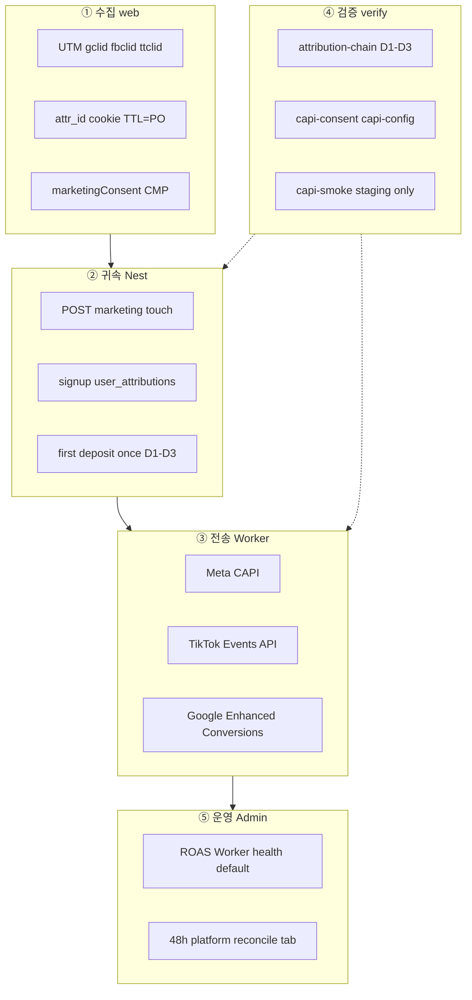
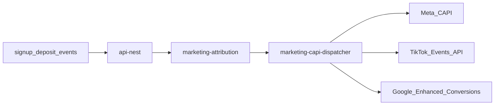

> **PHASE 2 PLAN AUTHORITY (2026-08-18)**
>
> ```text
> classification = INFRA_GROWTH_REFERENCE
> CURRENT_RUNTIME_REVALIDATION_REQUIRED
> AUTO_EXECUTION = DISABLED
> CONSUMER_PRESENTATION_AUTHORITY = NO
> ```
>
> History preserved. `status` not rewritten. Not current Consumer presentation authority.
> SSOT: `docs/reference/founder-intent/PLAN_AUTHORITY_MATRIX.md`
# AI Profit OS — Infra & Marketing (v7.23.0 · Redesign R7/R8)

> 분리 플랜 — Index: `ai_profit_os_00_index_a1b2c3d4.plan.md` · ARCHIVE: `ai_profit_os_launch_54c1261e.plan.md` · 착수전: `docs/CONSTITUTION_BOOTSTRAP.md`  
> **Owns 범위:** §15~16·§31~32·§51.9/13 · Auth/Ads/호스팅 · **Money/KRW 운영 스토리 재정의 금지**(pointer only)  
> **실행 큐 이동 (v7.22.34):** `auth-ssot` · `phase0-bootstrap-hosts` = **Index** pending · 본 파일 todo = Marketing/CAPI + 후반 관측만 · Owns 본문(§51.9/§51.13)은 여기 유지

> **제로 목표:** 오류0 · 결함0 · 오차0 · 중복0  
> **에이전트 SSOT:** **ADR-014** · §15.0b · Cursor=플랜 집행기  
> **툴체인 SSOT:** **ADR-015** · `TOOLCHAIN.md` · next@16 · TW4 · pnpm10 · Node22  
> **자동화:** **ADR-016** Docker-less 기본 · Vercel 금지  
> **결제:** **PG사(결제대행) 0** · USDT TRC20 + 원화 **Admin 승인/거절 Day-1** (Money §41.3 · CSV=L2+) · **PostgreSQL**=ADR-001  
> **SEO name:** Consumer=**퍼뜩** · retired `오늘수익`·`바로번다` **0**  
> **v7.22.11 본문 잠금:** `/ads`·랜딩3초·Stage A/B — 이후 개정은 Index changelog + 본 절 pointer  
> **v7.24.7 (최종 자동운영 출시 판정 분리 · 플랜+rule only · 구현0):** 06 마지막 APPEND `ads-autonomous-ops-release-certification` · R8 Core Infra 의미/완료조건 **불변** · R8 PASS·4개 가산 todo completed ≠ 「퍼뜩의 최종 자동운영 출시 준비 완료」 · 그 판정=본 certification만 · R8 이동/삭제/재작성 0 · 07 0  
> **v7.24.6 (Cursor Ops / Ads Orchestrator / Standing Authorization · 플랜+rule only · 구현0):** R8 **이후 APPEND** 4 todo=`ads-provider-onboarding`→`ads-budget-standing-authorization`→`ads-campaign-orchestrator`→`cursor-autonomous-ops-enablement` · Marketing 7 순서 불변 · CAPI≠Orchestrator · Budget Guardrail=deterministic · production `workflow_dispatch` HUMAN 유지 · Skill/Agent/Automation/Cloud/Bugbot/MCP/live token **지금 enable 0** · completed 재오픈 0  
> **v7.24.5 (Ads Additive Patch · 플랜+rule only · 구현0):** Marketing 7+R8 todo 인수조건 HARDEN — CAPI 파이프라인(outbox·stable event_id·provider delivery state·GoogleConversionAdapter)·SEO crawlable+noindex·marketing-compliance L1+L2+L3+consistency·cloaking 0·Admin 진단 필드 · 기존 설계/todo ID 교체 0 · programmatic SEO 0 · `/ads` Admin 변경 0  
> **v7.23.0-P0 (§31 Ads contract delta · 플랜만 · 구현0):** D1 `DEFAULT_DENY`+EXPLICIT_ALLOWLIST egress · D2 consent fail-closed 재확인(client/server 전면) · D4 authoritative event→ads projection · D5 browser/server `event_id` · D10 attr TTL=`CURRENT_DESIGN_CANDIDATE`+`PO_PRIVACY_DECISION_REQUIRED` · marketing pipeline **IMPLEMENTATION_NOT_STARTED** 불변 · P1/P2 미착수  
> **v7.22.56 (§31.2d 광고소재 SSOT · 오류0):** Meta/TikTok/Google **각 10훅** · 금지 자막/음성/썸네일 목록 · CTA=`실시간 시세 맵 열기` 고정 · **20~70 중성 존댓말**(성별 타깃·남녀 분기 카피 **0**) · 소재=시세맵 UI 80% · Human Review 업로드 전 체크리스트 · UI §6.4c.1 A 금지어 1:1  
> **v7.22.55 (UI §6.4c.1 5결정문 동기 · 오류0):** §31.2 매체 톤=`시세·가격 비교`(괴리율 **폐기**) · 금지어 1:1=UI A) · §31.2c 톤 허용 시점 pointer=UI F) · §31.3c consent 실행계약=UI G) · §31.4.0 landing sanitizer 금지어 동기 · `verify:marketing-compliance` 검사목록 동기 · Guest onboarding/auth=utility(앱 `수익 벌기`=capital only)  
> **v7.22.54 (듀얼레이어 Compliance · 오류0):** §31.2c utility funnel · §31.3c client pixel **manual-only** on `/l/*` · §31.4 **payload bucket isolation**(landing≠ledger) · UI §6.4c.1 pointer · `verify:marketing-compliance` landing 금지어+auto pixel 0 · `verify:operator-footer` + `supportEmail`  
> **v7.22.51 (Marketing CAPI 5층 흡수 · 오류0):** `marketing-seo-engine` **분해 7 todo** · File-Serial=**소급 불가 리스크 우선**(fixture D1~D3→sdk→hooks DB계약→metrics-spec→capi-wire→admin health→SEO) · OAuth **state=CSRF only** · verify **capi-config(always)/capi-smoke(staging)** · Admin **Worker default·48h 대조 분리** · `platform_match_rate` 통합명 **폐기**  
> **v7.22.28 (pointer 정정 v7.22.54/55):** 랜딩 CTA=UI **`실시간 시세 맵 열기`**(§31.2c·§6.4c.1) · 앱 Primary=`수익 벌기`(§20.2 · **capital surface only**)  
> **todo 순서:** stack-lock(완료) → Marketing 7 → Kakao Auth → Runtime P1 adapter host → R7 certification → R8 observability → R8 final certification → **v7.24.6 APPEND** Provider Onboarding → Standing Authorization → Orchestrator → Cursor Autonomous Ops → **v7.24.7** `ads-autonomous-ops-release-certification`

## v7.23.0 Redesign R7/R8 실행 계약

> **선행:** 05 PWA pending 0. 기존 Marketing 7개, Kakao runtime, adapter host binding을 삭제·축약하지 않는다.

### 순서

1. Marketing File-Serial 7개: fixture → SDK → hooks → metrics → dispatcher → Admin health → SEO.
2. Kakao OAuth runtime.
3. Runtime P1 adapter ingest host binding.
4. R7 Backend/Data certification.
5. R8 Infra/Observability 구현 (v7.24.6: Unified OpsEvent schema HARDEN).
6. R8 final release certification (Ads/Cursor runtime 미구현 ≠ R8 defect · R8 PASS ≠ 최종 자동운영 출시 판정).
7. **v7.24.6 APPEND (기존 1~6 순서 불변):** `ads-provider-onboarding` → `ads-budget-standing-authorization` → `ads-campaign-orchestrator` → `cursor-autonomous-ops-enablement`.
8. **v7.24.7 APPEND:** `ads-autonomous-ops-release-certification` — 「퍼뜩의 최종 자동운영 출시 준비 완료」 유일 판정. R8 재실행 0.

### Hosting

- Web/Ops는 `@opennextjs/cloudflare` **Workers only**다.
- origin SSOT=`infra/domain.manifest.json openNext.web|ops.workersDev`.
- `wrangler pages deploy`, `pages_build_output_dir`, `.open-next/cloudflare` deploy root, `pages.dev` origin을 금지한다.
- 기존 `cf:deploy:*` 스크립트 이름은 호환용이며 내부 동작은 OpenNext Workers deploy여야 한다.

### R7/R8 경계

- R7은 UI에서 발견한 semantic gap을 adapter로 숨기지 않는다. owner plan에 가산 todo와 Contract version bump를 등록하고 재인증한다.
- R8은 Runtime P3를 자동 활성화하지 않는다. 현재 규모에서 Workers/R2/최소 관측으로 충족되면 EKS/OTel full을 deferred intent로 유지한다.
- 최종 Release는 known P0/P1/P2/P3 defect 0, route-contract matrix 100%, T2 green, rollback/known-good artifact를 요구한다.
## 15. Infrastructure

### 15.0b Cursor Agent · Stack Lock (ADR-014/015 · monorepo **전** 필수)

> **원칙:** Cursor는 **플랜의 집행기**다. 스택 변경은 **ADR만**. “세계 최고로 교체” 재제안 금지.

#### 잠금 스택 (ADR-015)

| 층 | SSOT | 금지 |
|----|------|------|
| Runtime | Node **22** · **pnpm@10.14.0** (`packageManager`) | npm/yarn/bun install SSOT |
| Frontend | **`next@16`** App Router · Lux · Serwist · **Tailwind v4** | next@15·TW3 신규 · Vercel 병행 · next@17 무단 |
| API | NestJS `api-nest` JWT + OAuth/Passkey | Supabase Auth 병행 |
| Engine | Rust `engine-rust` (`rust-toolchain.toml`) | JS로 원장/정산 핵심 대체 |
| DB | PostgreSQL **단일** · **Supabase Seoul 기본** (Compose 옵션·8GB OFF) | 두 번째 Postgres SoT · Docker 필수화 |
| Hot | **Upstash Redis** 기본 · Compose Redis 옵션 | Twin/잔액 Redis-only SoT |
| Edge | OpenNext Cloudflare Workers + DO | Pages deploy/pages.dev origin · Vercel 병행 |
| Agent | **ADR-016** rules·hooks·Husky·`verify:gate`·cleanup | always 규칙 과다 · `--no-verify` |
| Events | Runtime P0 **in-process** → Runtime P1 NATS → Runtime P2 Temporal | Day-1 NATS/Temporal 필수화 |
| 결제 | **PG사(결제대행) 0** · USDT TRC20 + KRW **Admin 승인/거절 Day-1** (CSV=L2+) | Toss/Nice/Inicis/PortOne · Day-1 Auto-Recon 필수화 |

#### 필수 아티팩트

| 경로 | 역할 |
|------|------|
| `TOOLCHAIN.md` | 설치·검증 SSOT |
| `.cursor/rules/stack-lock.mdc` | alwaysApply — ADR-015 핀 |
| `.cursor/rules/phase-activation.mdc` | Runtime P0/P1/P2/P3 |
| `.cursor/rules/mockup-governance.mdc` | ADR-013 |
| `AGENTS.md` | 읽기 순서 |
| `docker-compose.dev.yml` | PG17 + Redis7 |
| `pnpm verify:stack-lock` | 작업 전 PASS |

#### 에이전트 읽기 순서 (중복0)

1. `TOOLCHAIN.md` + `AGENTS.md` + ADR-014/015  
2. ACTIVE `ai_profit_os_00_index_*`  
3. 해당 도메인 `01~06`  
4. launch 통합본 = **ARCHIVE**  
5. Canon wire · Brand Kit (UI 작업 시)

#### MCP / 도구 경계

| 도구 | 허용 | 금지 |
|------|------|------|
| Supabase MCP | **PostgreSQL** 스키마·쿼리 | Supabase Auth를 User Auth SoT로 사용 |
| Cloudflare | Workers/R2/DO | Pages/Vercel을 두 번째 origin SSOT로 추가 |

**CI:** `verify:stack-lock` — Node22·pnpm10·next@16 핀·rules·Compose·Rust · Runtime P0 NATS 의존 0
**선행:** `monorepo-skeleton` **전에** `pnpm verify:stack-lock` PASS

### 유저앱 vs Admin Ops **분리 배포 (§40 — 필수)**

| | **유저 PWA** | **Admin Ops** |
|---|-------------|---------------|
| App | `apps/web` | `apps/admin` |
| Domain | `app.{ROOT_DOMAIN}` | **`ops.{ROOT_DOMAIN}`** |
| OpenNext Worker | `ai-profit-web` | **`ai-profit-ops`** |
| Auth | user JWT / Passkey | **admin JWT** · MFA · RBAC |
| Route | 5탭 only | 12모듈 · **/admin/** |
| Public link | 마케팅·SEO | **비공개** · 검색엔진 차단 |
| WAF | bot score | **IP allowlist** + CF Access(optional) |

#### 15.0 ROOT_DOMAIN 잠금 (출시 전 필수 · ADR-010)

| env | 예 | 용도 |
|-----|-----|------|
| `ROOT_DOMAIN` | owner-provided (예: `hiptk.app`) | 쿠키·CORS·SEO canonical 루트 |
| `APP_HOST` | `app.{ROOT_DOMAIN}` | 유저 PWA |
| `OPS_HOST` | `ops.{ROOT_DOMAIN}` | Admin |
| `API_HOST` | `api.{ROOT_DOMAIN}` | Nest |
| `GO_HOST` | `go.{ROOT_DOMAIN}` optional | 광고 랜딩 |

**규칙:** `ROOT_DOMAIN` 미설정 시 **prod deploy Fail** · local은 `localhost`만. 플랜 본문의 `domain.com` = placeholder 의미.  
**CI:** `verify:root-domain-env` — prod artifact에 미치환 `{domain}` 문자열 0

#### 15.0a Store Bridge hosting pointer (v7.22.49 · 중복0)

| 항목 | Infra Owns | Pointer (재정의 금지) |
|------|------------|----------------------|
| `https://{APP_HOST}/.well-known/assetlinks.json` **서빙** | OpenNext Web Worker assets / `apps/web/public` | **내용·package·SHA-256·TWA 계약 = PWA §24.3** |
| Uptodown / Play Console 절차 · APK/AAB 산출 | **Owns 아님** | PWA §24 · todos `store-bridge-*` |

**금지:** Infra에 Uptodown listing 장문 · Play Financial 선언 본문 · `apps/web`에 `/admin` route · 동일 도메인에 admin mount · 유저앱에서 ops URL 노출

```
infra/
├── web/          # OpenNext Worker — APP_HOST
├── ops/          # OpenNext Worker — OPS_HOST  ← §40
│   ├── wrangler.toml
│   └── access-policy.json   # IP allowlist / Zero Trust
└── api/          # API_HOST
```

### Bootstrap ($0) — **Runtime P0 우선 (§51.13)**

| Phase | 이벤트 버스 | 스택 | Milestone |
|-------|-------------|------|-----------|
| **Runtime P0** | **in-process** (Nest 내부 emit · NATS **0**) | OpenNext Workers + Nest + **PostgreSQL** + Redis + engine-rust · **PG사 0** | M1 deposit→participate→settlement |
| **Runtime P1** | **NATS JetStream** | + adapters · realtime-service · chain-watchers | M2 |
| **Runtime P2** | NATS + Temporal | + shadow-replay · sweeper 고도화 | M4 |
| **Runtime P3** | 동일 | EKS + full OTel | M7 |

```
OpenNext Workers: ai-profit-web → apps/web · ai-profit-ops → apps/admin
Workers: push-dispatcher (Runtime P0=Nest **in-process**→Worker · Runtime P1+=NATS · PWA §23.5), marketing-capi-dispatcher (M1+) · chain-watchers (Runtime P1+)
Email: Resend free (§43.6)
Upstash Redis · R2 kyc-docs
→ local Docker Compose (web:3000 · ops:3001 · api:4000)
```

**오차0:** 아키텍처 mermaid의 NATS = **Runtime P1+ 목표 토폴로지**. Runtime P0에서 NATS 필수화 = 결함.
### Production
```
Docker Compose → Compose+Tilt → Stage(ECS/small K8s) → Prod(EKS)
```

Observability: User click → SW → API → Engine → Ledger → Wallet (OTel full trace)

---

## 16. Monorepo (최종)

**런타임 pin (오차0 · ADR-015):** `apps/web` · `apps/admin` → **`next@16`** (App Router) · root `packageManager=pnpm@10.14.0` · Node22 · **Tailwind v4** · major **17** 강제 업 **금지**(별도 ADR).  
**CI:** `verify:next-major-pin` — next major ≠ **16** Fail · `verify:stack-lock`

```
AI_PROFIT_OS
├── apps/
│   ├── web/                 # 5탭 PWA SSOT
│   └── admin/               # 12모듈 SSOT
├── services/
│   ├── marketing-attribution/   # UTM, ROAS, CAPI orchestration
│   └── ...
├── workers/
│   ├── marketing-capi-dispatcher/
│   ├── ebay-adapter/            # §0.0 · §3 workers SSOT (rolex-adapter · yahoo-jp-adapter 금지)
│   ├── pokemontcg-adapter/
│   ├── ygoprodeck-adapter/
│   ├── coingecko-adapter/
│   ├── frankfurter-adapter/
│   ├── chain-watchers/
│   ├── chain-sweeper/
│   ├── push-dispatcher/
│   └── temporal-workers/
├── packages/
│   ├── ui/
│   ├── types/
│   └── sdk/                     # marketing, device-tier, push, native-bridge
├── schemas/
│   ├── user-attribution.v1.json
│   ├── marketing-event.v1.json       # §31.4 CAPI outbox/dedup (todo wire)
│   ├── opportunity-card.v1.json
│   ├── opportunity-pricing.v1.json   # §36
│   ├── deposit-config.v1.json      # §37
│   ├── admin-user-ops.v1.json      # §37 balance/status/ip
│   ├── user-financial-summary.v1.json  # §39 KPI·집계
│   ├── user-deposit-address.v1.json    # §41 유저별 TRC20
│   ├── krw-deposit-request.v1.json   # §41 원화 입금신청
│   ├── kyc-status.v1.json            # §42 출금 게이트
│   ├── admin-rbac.v1.json        # §40 역할×권한 matrix
│   ├── toast-codes.v1.json
│   ├── admin-actions.v1.json
│   ├── execution-policy.v1.json      # §48 실조건·연출 (successRate 금지)
│   ├── trade-execution-state.v1.json # §48 진행 상태
│   ├── wallet-buckets.v1.json        # §49 principal/profit/locked/practice
│   ├── withdraw-intent.v1.json       # §49 mode profit|principal|combined
│   └── ui-copy-glossary.v1.json   # enum→한글 표시 SSOT
├── data-contracts/
├── migrations/
├── infra/
│   ├── web/                 # OpenNext Worker — app
│   ├── ops/                 # OpenNext Worker — admin §40
│   └── api/
├── docs/
│   └── ux/
├── CONSTITUTION/            # 00~28 + 35~51
└── research/
```

---

## 31. Marketing Funnel · CAPI · SEO (v6 신규 · v7.22.51 5층)

> **SSOT:** `CONSTITUTION/27_MARKETING_AND_SEO_ENGINE.md`  
> **코드:** `packages/sdk/marketing/` + `apps/web/app/(landing)/` + `workers/marketing-capi-dispatcher`  
> **File-Serial:** §31.8 (소급 불가 리스크 우선 · `marketing-seo-engine` **분해**)

### 31.0a 5층 아키텍처 (수집→귀속→전송→검증→운영)



**MUST:** consent≠true → advertising vendor calls **0** (client+server · §31.3c.1) · event_id=§31.3b.1 · egress=§31.4.0 `DEFAULT_DENY` · OAuth **state=CSRF only** · attr TTL=§31.3a.1

### 31.0 피드백 검토 — 동의 vs 수정 (오차0)

| 피드백 | 판정 | 플랜 반영 |
|--------|------|-----------|
| 매체별 맞춤 랜딩 (TikTok/Meta/Google) | ✅ 동의 | Ad Funnel Matrix §31.2 |
| Server-side CAPI (Meta/TikTok/Google) | ✅ 동의 | CF Worker dispatcher |
| UTM/gclid 영구 귀속 → 입금 ROAS | ✅ 동의 | `user_attribution` + ledger |
| 1초 Passkey/Social 가입 | ✅ 동의 | 기존 §23 WebAuthn + OAuth |
| sitemap.ts + robots.ts | ✅ 동의 | Next.js App Router |
| IndexNow ping on opportunity update | ✅ 동의 | **크롤 요청** (순위 보장 ❌) |
| Dynamic OG share + referral | ✅ 동의 | opengraph-image.tsx |
| JSON-LD Rich Snippets | ⚠️ **수정** | **WebApplication + Dataset** — honest metadata |
| Dynamic metadata per opportunity | ✅ 동의 | `/profits/[slug]` generateMetadata |
| **애드블록 우회** | ❌ **금지** | client pixel 최소화 + **consent-first CAPI** |
| **iOS 프라이버시 우회** | ❌ **금지** | **ATT 준수** + SKAdNetwork(optional) + server CAPI |
| **카지노 터치 사운드** (TikTok) | ❌ **금지** | 돈 버는 앱 톤 · §25/22 |
| **게임형 리워드 명목 심사 통과** | ❌ **금지** | **정책 준수 가이드** — 회피·미끼 ❌ |
| **★4.9 fake snippet** | ❌ **금지** | real reviews only or no rating |
| CAPI **유실률 0%** | ⚠️ **수정** | **consent+match quality 목표** — 100% 과장 ❌ |
| CONSTITUTION **22** | ❌ **충돌** | **`27_MARKETING`** (22=UX) |
| 광고비 유출 **0** | ⚠️ **정의** | **ROAS 가시화 + wasted spend cut** (부정 클릭≠0 자동) |
| **todo=구현 난이도순** | ❌ **폐기** | **§31.8 File-Serial=소급 불가 리스크 우선** (v7.22.51) |
| **OAuth state에 attr_id** | ❌ **금지** | **state=CSRF nonce only** · touch= cookie/server (§31.3a) |
| **platform_match_rate 통합** | ❌ **금지** | **플랫폼별 지표+분모 SSOT** (§31.4a) |
| **Admin Worker vs 플랫폼 리포트 동급** | ❌ **금지** | **Worker default · 48h 대조=접힌/별도 탭** (§31.4b) |

### 31.1 "광고비 유출 0" 정의 (오차0)

| 유출 유형 | 방어 |
|-----------|------|
| Attribution blind spot | UTM→user_id→first_deposit chain |
| Client pixel blocked | Server CAPI (consent 후) |
| Wrong campaign credit | last-touch + first-touch both stored |
| Bot click burn | risk bot score + ad platform exclude API |
| Bait-and-switch landing | variant locked to ad disclosure copy |

**NOT 약속:** 클릭 부정 0% · organic #1 보장 · 심사 100% pass

### 31.2 Ad Funnel Matrix (Compliance-First · **듀얼레이어=§31.2c**)

| 매체 | route | `landingVariant` | 타겟 | 랜딩 ko 톤 (**utility-only**) | 온보딩 toneBand 시드 (UI §38.9) | **금지** |
|------|-------|------------------|------|--------------------------------|----------------------------------|----------|
| TikTok | `/l/tt` | `tt` | 2030 | 숏폼 · "글로벌 시세·가격 비교" · 1탭 | `young` | 수익·투자·USDT·테더·보장·차익·**괴리율**·재테크·알바 · 카지노음·게임 위장 · **성별 타깃 카피** |
| Meta | `/l/meta` | `meta` | 3050 | 카드뉴스 · "글로벌 시세 모니터링·비교 툴" | `mid` | 동일 금지어 · 성별 분기 |
| Google | `/l/google` | `google` | 4070 | 큰 글씨 · "실시간 시세·가격 비교 데이터" · 신뢰 배지(실측) | `senior` (+ fontScale≥lg 시드) | 동일 금지어 · 성별 분기 |

**공통:** Primary CTA → **`실시간 시세 맵 열기`** → `/onboarding` 또는 `/auth/login` (UI §6.4c.1) · **`attr_id` httpOnly cookie** TTL=§31.3a (`CURRENT_DESIGN_CANDIDATE` · 최종=`PO_PRIVACY_DECISION_REQUIRED`)  
**내부 전환(§6.4c.1 F):** Guest `/onboarding`·`/auth/*`=**utility** · 앱 capital surface Primary=`수익 벌기`(§20.2) · Disclosure=전환 고지(capital 허가 **≠**)  
**시드:** `landingVariant` → 온보딩 toneBand **초기값만** · 유저 재선택 승 (UI §6.4 · §38.9)

**서브도메인 (optional):** `go.domain.com` → same `(landing)` routes · CORS SSOT

### 31.2a `/ads` 라우트 alias (중복0 · v7.22.11)

| Public path | 동작 |
|-------------|------|
| `/ads` | → `/l/meta` 기본 (또는 last UTM 매체) · **동일 surface** |
| `/ads/tt` · `/ads/meta` · `/ads/google` | → `/l/tt` · `/l/meta` · `/l/google` **rewrite/alias** |
| `/l/*` | **canonical** route (sitemap·CAPI 기준) |

**금지:** `/ads` 전용 별도 카피/픽셀 페이지 이중 유지 · 랜딩↔앱 CTA 라벨 drift

### 31.2b 첫 viewport 3초 예산 (route SSOT 여기 · wire=UI Canon `landing-3s` · **§6.4c.1**)

| # | 요소 | 필수 |
|---|------|------|
| 1 | 퍼뜩 brand mark | ✅ |
| 2 | 정체성 1줄 (**utility** · 시세·가격 비교 · §6.4c.1 A 금지어 **0**) | ✅ |
| 3 | **utilityDisclaimer** 1줄 (데이터 툴·비권유·비보장) | ✅ |
| 4 | Primary CTA 1개 — **`실시간 시세 맵 열기`** → onboarding/login | ✅ |
| 5 | Tier-A `MarketPartnerTrustStrip` (§38.10) | ✅ |
| 6 | scroll: **`LandingOperatorFooter`** (legalName·DET·supportEmail·`/me/legal`) | ✅ (firstViewport 밖) |

**금지 (3초 프레임):** stat strip · 스케줄 · 멀티카드 · 보장수익 · **expectedNotGuaranteed(수익)** · 성별 타깃 · Kakao 직행 CTA on landing  
**CI:** `verify:landing-3s` (UI) · `verify:marketing-compliance` · `verify:operator-footer`

### 31.2c Dual-Layer Utility Funnel (v7.22.54 · **v7.22.55 톤시점** · UI §6.4c.1 pointer)

| Layer | Route | Copy · UX | CAPI bucket |
|-------|-------|-----------|-------------|
| **광고 (외부)** | `/l/*` · `/ads/*` | utility-only · GuestChrome · footer+disclaimer 2중 · 시세·가격 비교 | **landing** — Lead·ViewContent·CompleteRegistration |
| **Bridge (Guest)** | `/onboarding` · `/auth/*` | **utility 유지** · `transitionDisclosure` 1줄(전환 고지) · 「수익 벌기」**0** | **landing** (ViewContent optional) |
| **앱 (내부)** | `/` · `/profits` … | capital-provider · 5탭 · `수익 벌기` | **app** — Purchase(deposit) server-only |

**MUST:** Human Review 3신호 = footer 정체성 · utility disclaimer · copy 금지어 0(=UI §6.4c.1 A)  
**NEVER:** bait-and-switch(랜딩 utility → 광고 소재 investment) · ledger 필드 in landing pixel/CAPI · Bridge에서 capital CTA

### 31.2d 광고 소재 SSOT — 20~70 중성 · Utility only (v7.22.56 · Human Review)

> **Owns:** 유료 소재 카피·자막·음성·썸네일 문구 = **본 절** · 랜딩 wire/카피 = UI §6.4c.1 · 픽셀/CAPI = §31.3c/§31.4  
> **목표:** 승인 최대 · 클릭 후 “시세 맵 보고 싶다” 욕구 최대 · **부업/수익 약속 0** (약속≠호기심)  
> **연령:** 20~70 공통 · toneBand는 **매체 시드만**(tt=young·meta=mid·google=senior) · **성별 타깃·남/여 카피 분기 영구 금지**  
> **시각 비율:** 소재 화면의 **≥80% = 실제 시세 맵/가격 비교 UI** · 연예인·머니총·라이프스타일 플렉스 **0**

#### 31.2d.0 업로드 전 금지어 · 금지 연출 (자막+음성+썸네일+본문 **3중 스캔**)

| 급 | 목록 | 적용 |
|----|------|------|
| **HARD 금지어** (=UI §6.4c.1 A) | `수익` · `투자` · `USDT` · `테더` · `보장` · `차익` · `괴리율` · `재테크` · `알바` · `부업` · `돈벌` · `대박` · `확정` · `배당` · `코인` · `선물` · `레버리지` | 1회라도 있으면 **업로드 금지** |
| **HARD EN** | `profit` · `invest` · `arbitrage` · `USDT` · `guaranteed` · `passive income` · `make money` · `side hustle` | 동일 |
| **금지 연출** | 금액 Count-Up · 통장 스크린샷 · “하루 ○○원” · 카지노 BGM · 슬롯/룰렛 · 성별(남/여) 호칭·모델 분기 · before/after 수익 | 동일 |
| **허용 훅 축** | 호기심(왜 다르지?) · 시각(맵) · 신선함(지금 시세) · 쉬움(한 번 탭) · 신뢰(협력사 로고 잠깐) · 열린고리(지금 열려 있는 차이=**가격** 차이) | — |

**CTA 라벨 고정 (전 매체):** `실시간 시세 맵 열기` · 보조 허용=`지금 비교해 보기` · `시세 맵 보기`  
**CTA 금지:** `수익 벌기` · `가입하고 돈 벌기` · `지금 시작(모호+머니암시)` · Kakao 직행

**심리 공식 (승인 안전):**  
`궁금증 → 눈으로 확인 → 맵 열고 싶다`  
**금지 공식:** `부업 기대 → 랜딩이 툴 → 배신감`

#### 31.2d.1 Meta (3050 · mid · 카드뉴스/릴스) — 훅 10

| # | 1초 훅 (화면 큰글) | 이어서 (2~8초) | Primary 문구 | 비고 |
|---|-------------------|----------------|--------------|------|
| M1 | 같은 시계, 나라마다 가격이 달라요 | 손가락이 맵에서 두 가격을 가리킴 | 실시간 시세 맵 열기 | 히어로 |
| M2 | 왜 저기는 더 비싸고, 여기는 더 쌀까요? | 가격 두 칸이 나란히 커짐 | 지금 비교해 보기 | 호기심 |
| M3 | 해외 가격, 한눈에 모아 봤어요 | 시세 맵 줌인 | 시세 맵 보기 | 툴 증거 |
| M4 | “가격이 왜 다르지?” 한 번만 확인해 보세요 | 탭 → 비교 화면 | 실시간 시세 맵 열기 | 중성 존댓말 |
| M5 | 지금 열려 있는 **가격 차이**가 있어요 | 차이 %가 ‘가격 차이’ 라벨로만 | 지금 비교해 보기 | %는 가격차이 only |
| M6 | 협력사 시세를 나란히 봐요 | Market Partner 로고 1초 → 맵 | 시세 맵 보기 | 신뢰 |
| M7 | 스크롤 말고, 맵으로 보세요 | 세로 스크롤 X · 맵 팬 | 실시간 시세 맵 열기 | 패턴 차단 |
| M8 | 오늘 시세, 방금 갱신됐어요 | ‘갱신’ 뱃지 점멸(과도한 FOMO 0) | 지금 비교해 보기 | 신선함 |
| M9 | 궁금하면 열어 보세요. 보는 건 무료 감각이에요 | 맵 풀스크린 | 시세 맵 보기 | 부담↓ · “무료수익” 금지 |
| M10 | 가격을 비교하는 습관, 여기서 시작해요 | 브랜드 퍼뜩 → CTA | 실시간 시세 맵 열기 | 정체성 |

**Meta 본문(1차 텍스트) 예시:**  
`해외 마켓 가격이 서로 다를 때가 있어요. 퍼뜩 시세 맵에서 나란히 비교해 보세요.`  
**금지 본문:** 부업·수익·USDT·“누구나 돈” 류

#### 31.2d.2 TikTok (2030 · young · 숏폼) — 훅 10

| # | 0~1초 소리/자막 | 1~5초 | 끝 CTA 자막 |
|---|-----------------|-------|-------------|
| T1 | (톡) 어? 가격이 둘이야 | 화면 분할 A/B 가격 | 시세 맵 열기 ↓ |
| T2 | 같은 가방인데 숫자가 다름 | 줌 인 숫자 | 지금 비교해 보기 |
| T3 | 지도 말고 **시세 맵** | 맵 드래그 ASMR(도박음 X) | 실시간 시세 맵 열기 |
| T4 | 3초만. 가격 차이 보이죠? | 차이 하이라이트(가격) | 시세 맵 보기 |
| T5 | 스크롤 멈추고 이거 봐요 | 손가락 탭 유도 | 지금 비교해 보기 |
| T6 | “왜 다르지?” → 바로 답 | 비교 카드 팝 | 시세 맵 열기 ↓ |
| T7 | 방금 갱신된 시세 | 갱신 점 1회 | 실시간 시세 맵 열기 |
| T8 | 한 손·한 탭 | 모바일 UI만 | 지금 비교해 보기 |
| T9 | 친구한테 “이거 봐” 하고 싶은 화면 | 공유 제스처(수익멘트 0) | 시세 맵 보기 |
| T10 | 퍼뜩 · 시세가 한눈에 | 로고+맵 | 실시간 시세 맵 열기 |

**TikTok 음성 가이드:** 또박또박 중성 · 과한 속어·성별 호칭 0 · BGM=라이트 앰비언트(카지노·슬롯 0)

#### 31.2d.3 Google (4070 · senior · 검색·PMax) — 훅 10

| # | 헤드라인 (짧게) | 설명 | 비고 |
|---|----------------|------|------|
| G1 | 해외 시세·가격 비교 | 글로벌 마켓 가격을 큰 글씨로 나란히 보여 드려요 | 검색 메인 |
| G2 | 실시간 시세 맵 | 지금 시세를 맵에서 바로 확인해 보세요 | CTA 정합 |
| G3 | 나라마다 다른 가격 | 같은 상품도 시장마다 가격이 다를 수 있어요 | 호기심 |
| G4 | 가격 비교, 한눈에 | 스크롤 없이 비교 화면으로 정리했어요 | 쉬움 |
| G5 | 퍼뜩 시세 비교 | 공식 협력사 시세를 참고해 비교해요 | 브랜드+신뢰 |
| G6 | 시세 갱신 확인 | 방금 갱신된 가격을 확인해 보세요 | 신선함 |
| G7 | 큰 글씨 가격 비교 | 글자를 크게, 한 줄씩 읽어 보세요 | senior |
| G8 | 해외 마켓 가격 보기 | 두 시장 가격을 나란히 펼쳐 드려요 | 시각 |
| G9 | 지금 시세 열어보기 | 가입 전에 시세 맵부터 볼 수 있어요 | 부담↓ · **v7.24.5 HARDEN: 출시 금지**(CTA 목적지=`/onboarding` · 가입 전 공개 맵 라우트 0 · Unavailable offer / AD_LANDING_MISMATCH) |
| G10 | 가격 차이 확인하기 | ‘가격 차이’만 표시 · 약속 문구 없음 | 라벨 잠금 |

**Google 키워드 허용:** `해외 시세 비교` · `명품 가격 비교` · `글로벌 마켓 시세` · `시세 맵` · `해외 가격 비교`  
**Google 키워드 금지:** `부업` · `돈버는법` · `재테크 추천` · `USDT 수익` · `투자 추천` · `알바`  
**PMax:** 자산 그룹 **utility 전용** · 수익/머니 이미지·문구 자산 **0**

#### 31.2d.4 연령대별 “끌림” 포인트 (카피 분기≠ · **강조만** 다름)

| 대역 | 시드 | 강조 (같은 utility 문장 안에서) | 피함 |
|------|------|--------------------------------|------|
| 20~30 | young/tt | 속도·한 탭·“어? 다르네” | 속어 과다·도박톤 |
| 30~50 | mid/meta | 비교·정리·협력사 신뢰 | 과장 숫자 |
| 50~70 | senior/google | 큰 글씨·한 줄·천천히 | 작은 자막·빠른 컷 |

**남녀노소:** 호칭=`여러분`/`님` 없이 중성 문장 · 모델·보이스·관심사 타깃에 **성별 옵션 사용 금지**

#### 31.2d.5 Human Review 체크리스트 (업로드 직전)

- [ ] 자막·음성·썸네일·본문 4면에 HARD 금지어 **0**
- [ ] CTA = `실시간 시세 맵 열기`(또는 허용 보조 2개 중 1)
- [ ] 화면 ≥80% 시세맵/비교 UI
- [ ] 랜딩 URL = `/l/{tt|meta|google}` (또는 `/ads` alias) · OG/타이틀도 utility
- [ ] 성별 타깃 OFF · 성별 카피 0
- [ ] 금액 Count-Up·통장·“하루 ○○” 0
- [ ] 소재 약속 ⊆ 랜딩 약속 (bait 0)

**CI pointer:** `verify:marketing-compliance` (랜딩·금지어 · **v7.24.5=L1+L2+L3+ad↔landing consistency**) · 소재 자체는 Human Review(본 체크리스트) — 자동 소재 OCR은 후속 승인 기능 · **§31.2d 훅 표는 creative fixture로 편입**(G9=FAIL fixture) · 승인 보장 주장 0

### 31.3 Attribution Schema (단일 SSOT)

```typescript
// schemas/user-attribution.v1.json
interface UserAttribution {
  userId: string;
  firstTouch: {
    utmSource, utmMedium, utmCampaign, utmContent, utmTerm,
    gclid?, fbclid?, ttclid?,
    landingVariant: 'tt' | 'meta' | 'google' | string; // → toneBand seed (UI §38.9)
  };
  lastTouch: { ... };
  consentMarketing: boolean;
  consentAt: ISO8601;
  firstDepositAt?: ISO8601;
  firstDepositUsdt?: Decimal;
  capiSentEvents: string[];  // dedup
}
```

**귀속 시점:** 첫 visit → `POST /marketing/touch` + cookie → signup merge → **ledger first_deposit** link (1회 · §31.3b)  
**Admin ROAS:** §9.5.6 · **health 지표 SSOT=§31.4b**

### 31.3a OAuth · Touch 바인딩 (v7.22.51 · CSRF vs attr 분리 · **v7.23.0-P0 D10 TTL**)

| 항목 | 규칙 |
|------|------|
| OAuth `state` | **CSRF nonce only** · touch JSON / attr_id **인코딩 금지** |
| `attr_id` | httpOnly cookie · 또는 server `marketing_touch_sessions` · **TTL=아래 D10** |
| Kakao/Google callback | cookie/session 키로 touch merge · state는 CSRF 검증만 |
| Platform cookies | `_fbc`/`_fbp`(Meta) · `_ttp`(TikTok) · consent 후 읽기 |

**금지:** state 길이 제한 회피용 attr 페이로드 · CSRF와 attr 파싱 한 필드 혼합 · attribution을 OAuth `state`에 이동

#### 31.3a.1 Attribution persistence TTL (v7.23.0-P0 · D10)

| 값 | 권위 |
|----|------|
| **90d** | **`CURRENT_DESIGN_CANDIDATE` only** · 플랜 후보 수치 · **FINAL PRIVACY AUTHORITY 아님** |
| **최종 TTL** | **`PO_PRIVACY_DECISION_REQUIRED`** — PO/privacy 권위가 명시 승인하기 전까지 구현은 90d를 **불변 권위로 취급 금지** |

**MUST:** 구현·출시 게이트는 PO 승인 TTL을 기다림 · 후보 90d 삭제 금지(이력)·승인 전 hard-code를 “정책 확정”으로 오해 금지  
**NEVER:** OAuth `state`에 attr/TTL 인코딩

### 31.3b First deposit dedup · fixture D1~D3 (소급 불가 · hooks=DB 쌍 · **v7.23.0-P0 D5 event_id**)

| ID | 시나리오 | 기대 |
|----|----------|------|
| **D1** | 동일 `deposit_event_id` / tx_hash 웹훅 2회 | `first_deposit_*` 1회 · CAPI Purchase `event_id` 1회 |
| **D2** | 동일 유저·동일 idempotency key 재시도 | 2번째 no-op · CAPI enqueue 0 |
| **D3** | 동시 first_deposit 경쟁 (2 요청) | **승 1건** · DB txn + **partial unique index** 또는 **`SELECT … FOR UPDATE`** |

**MUST:** hooks todo 본문에 DB 계약 명시 · fixture만으로 D3 불가 → 구현과 **한 쌍**  
**NEVER:** 실 트래픽 태우기 전 D1~D3 미통과 · consent=false CAPI enqueue

**CI:** `verify:attribution-chain` — fixture D1~D3 + UTM→signup→deposit→ROAS 필드

#### 31.3b.1 Event-ID authority (v7.23.0-P0 · D5 · 구현 방식 비강제)

| Class | 규칙 |
|-------|------|
| **A. browser ephemeral interaction** | **unique `event_id`** (브라우저 상호작용마다 새 논리 id · 클라이언트 생성 후보) |
| **B. authoritative replayable server lifecycle** | **deterministic stable `event_id`** — authoritative PEOTTEOK lifecycle identity + stable subject identity에서 유도 (재시도·재처리에 동일) |
| **C. Pixel + Server CAPI/Events 동일 논리 전환** | vendor dedup이 요구하면 **동일 logical `event_id` 재사용** (Client Pixel ↔ Server CAPI) |
| **D. retries / replays** | transport 재시도만으로 **의미상 새 conversion 생성 금지** · 동일 논리 전환=동일 id |

**V1 dedup 전략 (GOOD_AS_IS):** D1~D3 · `capiSentEvents` · logical `event_id` reuse · deterministic stable server ids  
**Dedicated ads-only durable dedup table:** **`NOT_REQUIRED_V1`** · 대칭성만으로 도입 금지 · **`EVIDENCE_GATED_LATER`** — 나중에 재검토는 구체 생산 증거(확정 duplicate vendor conversion · retry/replay 모호 · 측정 가능한 abuse/cost · vendor dedup 한계)가 있을 때만 · 도입 시 **별도 scoped architecture decision** 필수 · **`PERMANENTLY_FORBIDDEN` 아님**  
**v7.24.5 HARDEN (교체 아님):** Domain Transaction과 Canonical Event outbox insert는 **가능하면 동일 TX boundary** · `event_id`는 canonical 발생 시 **1회 생성/영속** · dispatcher 전송 순간의 timestamp로 새 id **금지** · retry/reconciliation도 동일 id  
**NEVER:** CLIME event_id/구현 복사 · vendor가 id 권위를 소유

### 31.3c Client Pixel — Manual-Only on Landing (v7.22.54 · **v7.22.55 consent 실행계약** · **v7.23.0-P0 D2 재확인**)

> **리스크:** Server CAPI sanitizer만으로 부족 — Meta/TikTok SDK **Automatic Advanced Matching**이 URL·DOM·page title에서 금지 컨텍스트를 **클라이언트 direct 전송**할 수 있음.

| Route | Pixel load | Events |
|-------|------------|--------|
| `/l/*` · `/ads/*` | **`landing-pixel-publisher.ts` manual only** · auto capture **OFF** | `Lead` · `ViewContent` · `CompleteRegistration` 화이트리스트 |
| Guest Bridge | 동일 manual-only · consent 게이트 | ViewContent optional |
| 앱 내부 | consent 후 full SDK (후속 승인) · **ledger custom_data 0** | app bucket §31.4 |

#### 31.3c.1 Consent FAIL_CLOSED (v7.23.0-P0 · D2 · **GOOD_AS_IS 재확인 · CMP/카테고리 재설계 0**)

| `consentMarketing` | advertising vendor calls |
|--------------------|--------------------------|
| **`=== true`** | 승인된 adapter만 emit 가능 (아래 MUST) |
| **`false`** | **0** |
| **unknown / undefined** | **0** |
| **implementation missing (sdk 미실장)** | **0** |

**적용 범위 (전부 FAIL_CLOSED):** client pixels · browser tags (`fbq`/`ttq`/`gtag` 등) · server CAPI / Events API · advertising conversion emissions  
**실행 계약 (UI §6.4c.1 G · 재설계 0):** Consent UI Owns=`packages/sdk/marketing/consent.ts` · UI=Lead/ViewContent **trigger emit만** · `consentMarketing===true`일 때만 emit  
**MUST:** `consentMarketing!==true` → script inject **0** · vendor advertising calls **0** · `landingVariant` cookie 유지 through onboarding (SPA redirect 누수 방지)  
**NEVER:** `/l/*` layout에 raw `fbq`/`ttq` auto init · Purchase on landing attribution · consent 없이 Lead emit · P0에서 necessary/analytics/advertising **카테고리 분할 도입**(=P2) · CMP 벤더 선정  
**v7.24.5 HARDEN cloaking 0:** User-Agent / IP / AdsBot / reviewer용 **다른 히어로·카피·destination 금지** · dual-layer = Public Ad Product Surface vs Authenticated Product Core · **Reviewer vs Real User 분리가 아님** · 심사 후 자동 다른 서비스 전환 · hidden redirect · bridge로 실제 destination 숨김 **금지**  
**Egress pointer:** 전송 필드는 **§31.4.0 ADVERTISING EGRESS POLICY** (`DEFAULT_DENY`+allowlist) 준수

**Package:** `packages/sdk/marketing/landing-pixel-publisher.ts`  
**CI:** `verify:marketing-compliance` — static scan `/l/*` auto pixel import 0 + landing 금지어(§6.4c.1 A)

### 31.4 Server-Side CAPI Architecture

> **v7.23.0-P0 D4 — Ownership invariant (플랜 계약 · marketing IMPLEMENTATION_NOT_STARTED 불변)**

```
authoritative PEOTTEOK lifecycle event
        ↓
advertising projection
        ↓
consent gate (§31.3c.1 FAIL_CLOSED)
        ↓
privacy / payload allowlist (§31.4.0 DEFAULT_DENY)
        ↓
vendor adapter (Google / Meta / TikTok)
```

**v7.24.5 HARDEN (기존 설계 교체 0 · 인수조건만):**

```text
Domain Fact (signup_completed / first_deposit / participate_completed …)
  → Canonical Event
  → Transactional Durable Outbox (가능하면 domain TX와 동일 boundary)
  → Stable event_id (§31.3b.1 · 1회 영속)
  → Consent (§31.3c.1 FAIL_CLOSED)
  → Attribution
  → Channel Mapping
  → Provider Adapter (Meta / TikTok / GoogleConversionAdapter)
  → Provider별 Delivery State
  → Retry / Diagnostics
```

Provider별 상태(기존 naming에 맞출 것): `PENDING` · `PROCESSING` · `DELIVERED` · `RETRYABLE_FAILED` · `PERMANENT_FAILED` · `SUPPRESSED`  
Adapter 내부: timeout · exponential backoff · jitter · retry classification · max attempts · 429 · retryable 5xx · permanent 4xx · config error · response normalization  
**GoogleConversionAdapter:** 구현 시점의 **공식** Google conversion ingestion API를 따른다(2026-06-15 이후 Data Manager API 이전 공지 포함). **임의 HTTPS endpoint 플랜 영구 하드코딩 금지.** 아래 mermaid의 `Google_Enhanced_Conversions`는 역사적 라벨이며 adapter 구현을 그 이름에 고정하지 않는다.  
Delivery log 기본: `canonical_event_id` · provider · mapping version · attempt · requested_at · result · provider reference · latency · normalized error · retry decision · final status · **PII payload debug 저장 0**  
**NEVER:** Meta `Purchase` / TikTok event / Google conversion action을 domain fact와 직접 동일시

**Advertising vendors = projection targets only.** Google / Meta / TikTok은 **product truth · financial truth의 SoT가 될 수 없다.**

| 금지 (vendor callback → …) | 판정 |
|----------------------------|------|
| wallet mutation | **NEVER** |
| settlement mutation | **NEVER** |
| opportunity / execution truth | **NEVER** |
| KYC state | **NEVER** |
| AI Coach / Twin / Memory state | **NEVER** |
| money movement | **NEVER** |
| reward / profit truth | **NEVER** |

**MUST:** 기존 PEOTTEOK lifecycle/ledger/auth 권위 유지 · 광고 경로는 **후행 projection만**  
**NEVER:** CLIME event name/코드 복사 · vendor webhook이 제품·머니 권위 획득



| Event | Trigger | Consent | **Bucket** |
|-------|---------|---------|------------|
| CompleteRegistration | signup | required | landing **or** app |
| Lead | landing CTA click | required | **landing only** |
| ViewContent | 시세맵·onboarding step | required | **landing** (optional tier) |
| Purchase | first USDT deposit | required | **app only** · landing attribution **enqueue 0** |

#### 31.4.0 Payload bucket isolation · sanitizer (v7.22.54 · **v7.22.55 금지어 1:1** · **v7.23.0-P0 D1 DEFAULT_DENY** · MUST)

##### ADVERTISING EGRESS POLICY (v7.23.0-P0 · D1)

**`DEFAULT_DENY` + `EXPLICIT_ALLOWLIST`**

광고 vendor(Google / Meta / TikTok · client pixel · server CAPI/Events)로 **나가는 모든 필드**는 기본 거부.  
§31 allowlist에 **개별 승인된 필드만** 전송 가능.

다음 이유만으로는 **전송 허가 아님:**

- 내부 상태/attribution에 존재함
- 최적화에 유용함
- **해시됨** — **Hashing alone ≠ permission**

**DEFAULT_DENY (예시·비자수 · 미등재 필드 전부 포함):**

- wallet balances · ledger rows · USDT holdings
- **`firstDepositUsdt` as vendor `custom_data`** (내부 attribution 저장 ≠ egress 허가)
- exact profit amounts · exact settlement amounts/details
- withdrawal / cashout data · bank / crypto address data
- KYC information · government identity data
- AI Coach conversation content · Twin / Memory state
- private execution state · raw user-profile PII
- **any unlisted field**

| Bucket | 허용 events | custom_data (**EXPLICIT_ALLOWLIST only**) |
|--------|-------------|-------------------------------------------|
| **landing** | Lead · ViewContent · CompleteRegistration | allowlist: `content_category=market_data` · `landing_variant` · (match용 hashed PII는 **allowlist 등재+PO/privacy 승인 시에만** · 해시만으로 자동 허가 **0**) · **DOM/title/payload 금지어=UI §6.4c.1 A 1:1** (`수익`·`투자`·`USDT`·`테더`·`보장`·`차익`·`괴리율`·`재테크`·`알바` + EN `profit`·`arbitrage`·`investment`·`deposit`·`USDT`) |
| **app** | Purchase · (optional app ViewContent) | **금지 in ad params:** `USDT` · `profit` · `arbitrage` · `deposit` · `investment` · ledger amounts as ad params · 위 DEFAULT_DENY 전항 |

**Worker:** `marketing-capi-dispatcher` — pre-send keyword scan · **allowlist 외 필드 drop/block** · block+audit log on violation  
**동기:** UI `copy/ko/landing` 갱신 시 본 표·`verify:marketing-compliance` **같은 패치** (UI만 변경=결함)  
**NEVER:** ledger `firstDepositUsdt` in Meta/TikTok/Google custom_data · Purchase on `/l/*` attribution path · landing payload에 괴리율/차익 · DEFAULT_DENY 약화

**MUST:** consent log before send (§31.3c.1) · **`event_id` = §31.3b.1** (Pixel+CAPI 동일 논리 id · retry≠새 conversion) · allowlist 등재 필드만 egress · (등재된 match PII만) SHA256 per platform spec  
**NEVER:** send before consent · bypass ATT · fingerprint for ads · unlisted/hashed-only 자동 송신

**Package:** `packages/sdk/marketing/`
```
capi-dispatch.ts      # server-only import
utm-capture.ts        # client first-touch
consent.ts            # CMP banner ko
attribution-store.ts  # cookie + API persist
platform-cookies.ts   # _fbc/_fbp/_ttp
```

**Env (`.env.example` placeholder · prod=Wrangler/GitHub secrets):**
```
META_PIXEL_ID=
META_CAPI_ACCESS_TOKEN=
TIKTOK_PIXEL_CODE=
TIKTOK_EVENTS_ACCESS_TOKEN=
GOOGLE_ADS_CUSTOMER_ID=
GOOGLE_ADS_CONVERSION_ACTION_ID=
```

### 31.4a CAPI Metrics SSOT (`services/marketing-attribution/METRICS.md` · todo `marketing-capi-metrics-spec`)

> **금지:** `platform_match_rate` 등 **플랫폼 통합 단일 지표** — API 응답 형식 상이 · 착각만 유발

#### Worker 실시간 (Admin **기본 노출** · 분모=아래 표)

| 지표 | 분모 | 분자 | 출처 |
|------|------|------|------|
| `meta_events_accepted_rate` | Meta CAPI 전송 batch/event | API `events_received` (또는 200 non-dedup-error) | Graph API response field (METRICS.md에 필드명 고정) |
| `meta_parameter_minimum_met_rate` | CompleteRegistration+Purchase 전송 | **minimum** 충족 (아래 baseline) | Worker self-check · **minimum과 score 분리** |
| `meta_parameter_score_p50` | 동일 | recommended 가산 필드 score 0~100 | Worker self-check · **운영 KPI 아님·품질 참고** |
| `tiktok_events_accepted_rate` | TikTok Events API 전송 | success response | Events API 2.0 response field |
| `tiktok_parameter_minimum_met_rate` | 동일 | platform minimum (METRICS.md) | Worker self-check |
| `google_conversions_uploaded_rate` | Enhanced Conversions upload 시도 | `partialFailureError` 없음 | Google Ads API response field |
| `click_id_present_rate` | touch 또는 signup merge 시도 | gclid **or** fbclid **or** ttclid 존재 | **내부 DB** (cross-platform 비교 가능) |
| `consent_marketing_rate` | signup Stage A | `consent_marketing=true` | **내부 DB** |

#### Meta parameter coverage baseline (SSOT · 팀 해석 drift 금지)

| tier | CompleteRegistration / Purchase | 판정 |
|------|----------------------------------|------|
| **minimum (충족)** | `event_id` + `event_time` + (**`em` SHA256** **OR** **`fbc`/`fbp` pair**) | `*_minimum_met_rate` 분자 |
| **recommended (가산)** | `em` + `ph` + `fbc` + `client_ip` + `client_user_agent` | `*_parameter_score_p50` only |

TikTok/Google **minimum / recommended** 목록 = METRICS.md에 API doc 링크·필드명까지 고정 (구현 전 todo `marketing-capi-metrics-spec` deliverable).

#### Verify 2계층 (ADR-016)

| verify | when | 검증 |
|--------|------|------|
| `verify:capi-config` | **always** (PR CI) | env key 이름 · wrangler binding · placeholder 패턴 금지 · `.env.example` 동기 |
| `verify:capi-smoke` | **staging/deploy** · `CAPI_SMOKE=1` | 실 access_token Test Events 1건 · **PR daily 3사 호출 금지** (flaky/quota) |

**NOT verify:gate default:** 광고 계정 미개설·placeholder secret → code PASS 가능 · **ops 1% checklist** + staging smoke

### 31.4b Admin §9.5.6 Health · ROAS (pointer · todo `marketing-admin-roas-health`)

| 블록 | 노출 | 내용 |
|------|------|------|
| **기본 (매일)** | `/admin` 돈줄 하단 · 펼침 default | Worker 실시간 §31.4a · dedup 건수 · `click_id_present_rate` · `consent_marketing_rate` · 캠페인별 attributed USDT 입금 |
| **48h 대조** | **접힌 섹션 또는 별도 탭** | Events Manager / Ads UI / TikTok 리포트 · **Worker와 동급 나란히 금지** |
| ROAS | 기본 블록 | attributed deposit / ad spend import (manual/API) |
| **v7.24.5 진단** | 기본 블록(secret 0) | provider별 retry backlog · permanent failures · last delivery · test/prod mode · consent/attribution/click-id rate(기존 지표와 중복0) |

**금지:** Worker accepted_rate와 플랫폼 지연 리포트 **같은 카드 2열** — “왜 다르지” 습관 → **둘 다 안 봄** · **consumer `/ads`를 Admin으로 변경** · token/secret 표시

### 31.5 SEO · IndexNow · OG Viral

#### Dynamic Metadata
```typescript
// apps/web/app/profits/[slug]/page.tsx
export async function generateMetadata({ params }) {
  const opp = await getOpportunity(params.slug);
  return {
    title: `예상 +${opp.profitKrw}원 · ${opp.assetLabel}`,
    description: `AI 추천 ${opp.aiScore}% · ${T.seo.disclaimer}`, // ko SSOT
    alternates: { canonical: `https://.../profits/${params.slug}` },
  };
}
```

#### JSON-LD (honest)
```json
{
  "@context": "https://schema.org",
  "@graph": [
    {
      "@type": "WebApplication",
      "name": "퍼뜩",
      "applicationCategory": "FinanceApplication",
      "offers": { "@type": "Offer", "price": "0", "priceCurrency": "KRW" }
    },
    {
      "@type": "Organization",
      "name": "PRE-OWNED WATCHES L.L.C",
      "identifier": {
        "@type": "PropertyValue",
        "propertyID": "DET Trade License",
        "value": "1135431"
      },
      "address": {
        "@type": "PostalAddress",
        "addressLocality": "Dubai",
        "addressCountry": "AE"
      },
      "url": "https://hiptk.app"
    }
  ]
}
```

**SSOT:** `schemas/operator-entity.v1.json` → `@graph` Organization 노드 생성 (§50.9)  
**브랜드 (§51.1 ADR-002):** JSON-LD `name`=**퍼뜩**(consumer) · repo/platform=AI Profit OS · drift **금지**  
**금지:** fake `aggregateRating` · `FinancialProduct` with guaranteed returns · UK dissolved entity 표기

#### sitemap.ts + robots.ts
- `/profits/*` opportunities · `/l/*` landings (noindex optional for pure ad URLs)
- `priority` by opp score · `lastModified` from engine
- **v7.24.5 HARDEN:** `/ads` · `/l/*` 는 검색노출 방지 시 **crawl 가능 + noindex** · robots `Disallow`로 AdsBot이 noindex를 못 읽는 구조 **금지** · programmatic SEO(`/p/[slug]` · `/insights` · glossary · backlink automation) = **POST_LAUNCH_ONLY · 본 todo 범위 0** · metadata/canonical/OG/JSON-LD(Organization+WebSite) · not-found · index/noindex policy · seo/metadata/canonical/sitemap regression = `verify:seo-schema`

#### IndexNow
- Trigger: `opportunity.created|updated` → NATS → worker ping (Google/Bing/Naver endpoints)
- **효과:** crawl notify only — **ranking ≠ guaranteed**

#### OG Dynamic Share · Referral Deep Link (v7.22.3)

```
apps/web/app/r/[code]/page.tsx              # sticky bind · 설치/로그인 후 §51.5
apps/web/app/share/[receiptId]/opengraph-image.tsx
apps/web/app/share/card/[type]/opengraph-image.tsx   # success|compare|trust|invite
→ referral code embedded · brand manifest assets · ko only · APP_HOST watermark
go.{ROOT_DOMAIN}/r/{code} → 302 APP_HOST/r/{code}
```
- Share targets: 카카오 · X · native Web Share API  
- Rate limit: `sharePerUserPerDay` (§51.5 · M1)  
- **금지:** 클라이언트 임의 OG HTML · 미등록 brand 에셋 · open redirect  
- CAPI events (consent 후): `ReferralBound` · `ReferralL2` · `ReferralL3` · `ShareCard` + `referral_edge_id`

#### Brand Assets CI (ADR-011)

- SSOT: `packages/ui/brand/manifest.json` + 필수 파일 전수  
- `verify:brand-assets` — checksum · sizes · no Chrono24 · splash=`#F6F4FC` · theme=`#6B3CFF`

### 31.6 Landing 파일 트리

```
apps/web/app/
├── (landing)/
│   ├── layout.tsx           # minimal chrome, no 5-tab
│   ├── tt/page.tsx          # TikTok variant
│   ├── meta/page.tsx
│   └── google/page.tsx
├── r/[code]/page.tsx        # referral deep link
├── profits/[slug]/page.tsx  # SEO public pages
├── sitemap.ts
├── robots.ts
├── share/[id]/opengraph-image.tsx
└── share/card/[type]/opengraph-image.tsx

packages/ui/brand/           # ADR-011 Brand Kit
packages/sdk/marketing/
workers/marketing-capi-dispatcher/
services/marketing-attribution/
```

### 31.7 CI Gates (§32 · v7.22.51)

| verify | Owner todo | when |
|--------|------------|------|
| `verify:attribution-chain` | `marketing-attribution-chain-fixture` + hooks | **always** · D1~D3 필수 |
| `verify:capi-consent` | `marketing-capi-dispatcher-wire` | always |
| `verify:capi-config` | `marketing-capi-metrics-spec` | **always** · placeholder/키 drift |
| `verify:capi-smoke` | `marketing-capi-dispatcher-wire` | staging · `CAPI_SMOKE=1` only |
| `verify:marketing-compliance` | `marketing-seo-sitemap-jsonld` + `marketing-sdk-attribution` | always · landing variant **금지어=UI §6.4c.1 A 1:1(괴리율 포함)** · `/l/*` **auto pixel import 0** · UI PART2c 완료 게이트(pointer) · **v7.24.5 HARDEN(기존 유지+층 추가):** L1 `INTERNAL_HIGH_RISK_AD_COPY_LEXICON`(§6.4c.1 A + §31.2d HARD · **공식 금지어 주장 0** · legal/core 스캔 **0**) → L2 claim-pattern(`TIME+MONEY+RESULT` · `MINIMAL_EFFORT+FINANCIAL_OUTCOME` · `ABSOLUTE+ECONOMIC_RESULT` · `UNREALISTIC_GAIN` · `FALSE_SCARCITY`) → L3 semantic fixture(동의어 paraphrase 포함) → ad↔landing consistency(headline/body/CTA/hero/feature) → Human Review §31.2d · surface=`/ads` `/l/*` · landing/guest copy · §31.2d creative fixture · 광고 OG |
| `verify:seo-schema` | `marketing-seo-sitemap-jsonld` | always · no fake aggregateRating · **v7.24.5:** metadata/canonical/sitemap/noindex regression · `/ads` `/l/*` crawlable+noindex |
| `verify:operator-footer` | `marketing-seo-sitemap-jsonld` + UI PART2c-pre | always · schema↔footer↔**supportEmail**↔LandingOperatorFooter |
| `verify:landing-3s` | UI `landing-3s-ui` pointer | UI owns |
| `verify:referral-deeplink` | Money/Infra pointer | existing |
| `verify:share-copy` | Infra §31.5 pointer | existing |
| `verify:brand-assets` | Brand Kit | existing |

**금지:** `verify:gate` default에 실토큰 3사 smoke · **capi-smoke=staging gate only**

### 31.8 Marketing File-Serial (v7.22.51 · 소급 불가 우선 · 한 채팅=한 todo)

```
① marketing-attribution-chain-fixture   verify:attribution-chain D1~D3 (TDD·얇은 fixture 금지)
② marketing-sdk-attribution             touch+cookie · state=CSRF only
③ marketing-signup-deposit-hooks        DB dedup 계약 · D1~D3 PASS 필수
④ marketing-capi-metrics-spec           METRICS.md + verify:capi-config
⑤ marketing-capi-dispatcher-wire        3사 CAPI · verify:capi-consent · staging capi-smoke
⑥ marketing-admin-roas-health           Worker default · 48h 대조 분리
⑦ marketing-seo-sitemap-jsonld          SEO · compliance · operator-footer
```

**선행 pointer (다른 플랜):** UI `landing-3s-ui` · Auth `marketingConsent` · Money first_deposit ledger hook  
**흡수:** 구 todo `marketing-seo-engine` **폐기** → 위 7 todo로 **분해 0 중복**  
**v7.24.6:** 위 7개 순서 **변경 0**. Ads/Cursor 가산은 §31.9~§31.11 · R8 **이후** File-Serial.

---

### 31.9 Ads Campaign Orchestrator · Standing Authorization (v7.24.6 · 설계잠금 · 구현0)

> **Owns:** 본 절 = 계약 SSOT · runtime = R8 이후 가산 todo (`ads-provider-onboarding` → `ads-budget-standing-authorization` → `ads-campaign-orchestrator`).  
> **표시 UX:** 04 `admin-ops` §9.5.8 (File-Serial 04가 06보다 앞 · 04는 UX/빈상태만 · live provider mutation 0).  
> **금지:** CAPI dispatcher에 campaign mutation 삽입 · 07 Master Plan · Marketing 7 재정렬 · completed 재오픈 · 지금 OAuth/MCP/campaign/budget 실행.

#### 31.9.0 CAPI와 분리 (합치기 금지)

| 층 | 역할 | Owner todo |
|----|------|------------|
| **CAPI / Attribution** | 광고 **성과 측정** | 기존 Marketing 7 (`marketing-capi-dispatcher-wire` · `marketing-admin-roas-health` 등) |
| **Ads Campaign Orchestrator** | 광고 **생성 / 집행 / 최적화** | `ads-campaign-orchestrator` |

Orchestrator는 CAPI **health를 읽을 수 있다**. CAPI schema·outbox·event_id·delivery state를 소유·변경하지 않는다.

```text
Cursor Agent
  → "Campaign B +10% 추천"
  → Internal Ads Orchestrator API
  → Standing Authorization
  → Budget Guardrail
  → Compliance / Health
  → ALLOW
  → Provider Adapter
```

Agent가 Meta/TikTok/Google production token을 직접 들고 임의 mutation하는 구조 **금지**.

#### 31.9.1 Standing Authorization Contract

> Founder가 사전에 정해진 자동 광고 운영 범위를 **한 번** 승인하면, 그 범위 안에서는 시스템이 매 캠페인마다 다시 승인받지 않고 자동 운영할 수 있는 **deterministic authorization contract**.  
> AI의 자유재량 권한이 아니다. Agent가 한도를 높일 수 없다.

설정 가능 최소 필드 (repository naming convention 우선 · 예시 필드명):

| 필드 | 의미 |
|------|------|
| `enabled` | 계약 활성 |
| `allowed_channels` | 허용 채널 |
| `allowed_ad_accounts` | 허용 광고 계정 |
| `allowed_landing_variants` | 이미 승인된 랜딩만 |
| `allowed_message_axes` | 이미 승인된 메시지 축만 |
| `approved_creative_pool_ids` | Human-Reviewed 승인 풀만 |
| `daily_total_budget_cap` | 일 총 광고비 상한 |
| `monthly_total_budget_cap` | 월 총 광고비 상한 |
| `channel_daily_cap` | 채널 일 상한 |
| `campaign_daily_cap` | 캠페인 일 상한 |
| `max_daily_change_pct` | 일 변경 최대 % |
| `max_new_campaigns_per_day` | 일 신규 캠페인 수 |
| `max_new_creatives_per_day` | 일 신규 소재 수 |
| `minimum_sample_size` | 최적화 최소 표본 |
| `optimization_cooldown` | 최적화 쿨다운 |
| `auto_pause_allowed` | 자동 일시중지 허용 |
| `auto_resume_allowed` | 자동 재개 허용 |
| `auto_create_campaign_allowed` | 자동 생성 허용 |
| `auto_activate_campaign_allowed` | 자동 ACTIVE 허용 |
| `expires_at` | 만료 |
| `approved_by` / `approved_at` | 승인자·시각 |
| `version` | 계약 버전 (audit 필수) |

값은 Founder/Admin이 **명시적으로 승인한 값**만. 변경 = HIGH + HUMAN + 3-mode (`redesign-r6-admin-three-mode-ops`).  
Admin 표시/승인 폼 Owns = 04 `admin-ops`. **enforce Owns = 본 절 + `ads-budget-standing-authorization`**.

#### 31.9.2 자동 ACTIVE — 전부 AND (하나라도 FAIL = 0)

```text
Standing Authorization valid
AND channel allowed
AND ad account allowed
AND landing already approved
AND message axis already approved
AND creative ∈ Human-Reviewed approved pool
AND marketing-compliance PASS
AND ad ↔ landing consistency PASS
AND tracking healthy
AND attribution healthy
AND CAPI healthy
AND landing health PASS
AND budget guardrail PASS
AND daily/monthly cap not exceeded
AND provider account READY
```

#### 31.9.3 HIGH / HUMAN (Standing Authorization 밖 · 기존 정책 약화 0)

- 최초 광고 계정 연결 · OAuth / 계정 재인증 · 새로운 ad account · 새로운 channel
- 새로운 landing · 새로운 message axis · Human Review 미통과 신규 creative
- 월 총 광고비 한도 증가 · Standing Authorization 자체 변경 · 허용된 자동 증액 범위 확대
- production secret 변경 · legal SSOT 변경 · dual-layer 변경 · production deployment
- 기존 Money / KRW / high-withdraw Human Confirm
- 외부 플랫폼이 직접 사람 verification을 요구하는 경우
- **모든 광고 긴급 정지** (HIGH/HUMAN)

#### 31.9.4 Auto Campaign Lifecycle

```text
Campaign Candidate
  → Compliance
  → Landing Consistency
  → Creative Pool Verification
  → Budget Guardrail
  → Provider Capability Check
  → Create as PAUSED/DRAFT when provider requires
  → Provider Validation
  → Standing Authorization Gate
  → ACTIVE
  → Performance Monitoring
  → Allowed Optimization
```

Provider capability 차이는 **adapter 내부**에서 처리. Meta/TikTok/Google raw 상태를 core에 노출하지 않는다.

#### 31.9.5 Budget Guardrail = deterministic code contract

Cursor Rule / Agent prompt에만 예산을 두지 않는다. runtime은 deterministic service/gate가 enforcement한다.

```text
Agent Recommendation → Budget Guardrail Service → ALLOW / DENY → Provider Mutation
```

`budget +50%` 요청이 허용 한도 `+10%`이면 **서버가 거부**한다.

#### 31.9.6 허용 최적화 action (Standing Authorization 내부)

`HOLD` · `PAUSE` · `SCALE_UP_WITHIN_LIMIT` · `SCALE_DOWN_WITHIN_LIMIT` · `ROTATE_APPROVED_CREATIVE` · `CREATE_FROM_APPROVED_TEMPLATE` · `ACTIVATE_WITHIN_STANDING_AUTHORIZATION`

새로운 message axis 생성 **금지**.

#### 31.9.7 Fail-closed (자동 SCALE_UP · 신규 ACTIVE 즉시 차단)

CAPI unhealthy · attribution unhealthy · consent pipeline unhealthy · landing unavailable · ad↔landing mismatch · marketing compliance failure · provider authentication issue · provider API instability · insufficient sample size · campaign too new · deployment incident · budget cap near/exceeded · critical OpsEvent active · tracking discrepancy · conversion diagnostics unhealthy.

필요하면 자동 `PAUSE` 허용. **자동 증액보다 자동 중지가 우선**.

#### 31.9.8 Provider Capability Matrix (공식 역할 잠금)

| 채널 | write SoT | Agent facade |
|------|-----------|--------------|
| **Meta** | official Marketing API | official Ads MCP / CLI는 **실제 지원 범위 내에서만** · create 시 paused 지원하면 PAUSED 우선 · ACTIVE=Standing Authorization Gate |
| **TikTok** | official Business / Marketing API | 공식 tool capability가 **실제 확인된 것만** · tool 목록 미확인 항목 추측 0 |
| **Google** | official Google Ads API | official MCP current release가 read-only이면 **조회/분석만** · MCP mutation 0 · Cursor Skills=개발/구현 가이드 only |

production live Ads account 연결 = **HUMAN + File-Serial 06 `ads-provider-onboarding`**. Kakao user OAuth(`auth-kakao-oauth-runtime`)와 **혼동 금지**.

#### 31.9.9 Mutation Audit Trail

Ads campaign mutation과 Cursor autonomous action은 모두 audit를 남긴다.

최소: `actor` · `agent_run_id` · `operation` · `before` · `after` · `reason` · `evidence` · `policy/guardrail version` · `standing_authorization_version` · `approval state` · `provider result` · `timestamp`.

Founder 화면 = 요약. Advanced = raw technical evidence.  
**별도 todo 없음** — emit = Orchestrator / Cursor ops · schema 흡수 = `infra-observability-late` OpsEvent (`financial_impact` 등).

#### 31.9.10 Global Emergency Stop (광고비 지출만)

Founder Dashboard `[모든 광고 긴급 정지]` → deterministic:

- Meta / TikTok / Google **active campaigns pause**
- new campaign activation **block**
- optimization mutation **block**

CAPI / analytics / diagnostics **자체는 중단하지 않는다**. HIGH/HUMAN.  
기존 TOP5 거래 회로(`/admin/system-control` participate/withdraw/deposit)와 **합치지 않는다**.

#### 31.9.11 File-Serial · todo 판정 (중복 신규 금지)

| 후보 | 판정 | ID |
|------|------|-----|
| Ads Campaign Orchestrator | **ADD** — CAPI owner에 넣으면 측정 vs mutation 혼선 | `ads-campaign-orchestrator` |
| Ads Provider Onboarding | **ADD** — Kakao OAuth·CAPI와 혼동 · Orchestrator에 넣으면 계정연결과 캠페인 mutation 혼선 | `ads-provider-onboarding` |
| Ads Budget Guardrail / Standing Authorization | **ADD** — Admin에 넣으면 표시 vs enforce 혼선 · Orchestrator에 넣으면 AI가 자기 한도를 소유 | `ads-budget-standing-authorization` |
| Ads Mutation Audit | **ABSORB** — Orchestrator emit + `infra-observability-late` OpsEvent | (신규 todo 0) |
| Cursor Autonomous Operations | **ADD** — observability에 넣으면 관측 vs Cursor enablement 혼선 | `cursor-autonomous-ops-enablement` |
| Founder Dashboard | **ABSORB** — 04 `admin-ops` | (06 todo 0) |
| OpsEvent | **ABSORB** — `infra-observability-late` | (신규 todo 0) |
| 최종 자동운영/Ads 출시 판정 | **ADD (v7.24.7)** — R8에 넣으면 Core Infra 완료조건이 팽창 · enablement todo에 넣으면 구현=인증 혼선 | `ads-autonomous-ops-release-certification` |

실행 순서 (R8 **이후 APPEND** · 기존 Marketing 7 / Kakao / adapter / R7 / R8 **상대 순서 불변**):

```text
… redesign-r8-infra-release-certification
⑧ ads-provider-onboarding
⑨ ads-budget-standing-authorization
⑩ ads-campaign-orchestrator
⑪ cursor-autonomous-ops-enablement
⑫ ads-autonomous-ops-release-certification
```

#### 31.9.12 실행 시 완료 정의 (File-Serial 도달 후 · 지금 구현 0)

- `verify:ads-provider-capability` · `verify:ads-standing-authorization` · `verify:ads-budget-guardrail` · `verify:ads-orchestrator-boundary` 신설+CATALOG (각 owner todo)
- fixture: AND-gate 1개 FAIL → ACTIVE 0 · Guardrail `+50%` vs cap `+10%` → DENY · Agent token 직접 mutation 경로 0
- Emergency stop이 CAPI dispatcher를 멈추지 않음
- `/admin/growth?tab=campaigns`(프로모)와 `/admin/growth?tab=paid-ads` 혼동 0

#### 31.9.13 실행 시 기본 경로 (지금 패키지 생성 0 · File-Serial 도달 후)

> repository naming convention이 아래보다 우선. 충돌 시 기존 `services/` · `/admin/api/v1` 패턴을 따른다.

| 후보 경로 | 역할 |
|-----------|------|
| `services/ads-budget-guardrail/` | Standing Authorization persist + deterministic Budget Guardrail |
| `services/ads-orchestrator/` | lifecycle · AND-gate · Internal API |
| `workers/ads-provider-adapters/` | Meta/TikTok/Google write adapter (raw status 정규화) |
| `schemas/ads-standing-authorization.v1.json` | 계약 필드 |
| `schemas/ops-event.v1.json` | Unified OpsEvent (`infra-observability-late` Owns) |

Internal API (Admin JWT · Agent는 이 API만 · provider token 0):

- `GET /admin/api/v1/ads/standing-authorization`
- `PUT /admin/api/v1/ads/standing-authorization` — HIGH/HUMAN/3-mode · Agent 한도상향 0
- `POST /admin/api/v1/ads/orchestrator/recommend` — 추천만 · mutation 0
- `POST /admin/api/v1/ads/orchestrator/mutate` — Guardrail 통과 후에만 provider write
- `POST /admin/api/v1/ads/emergency-stop` — HIGH/HUMAN · CAPI 중단 0
- `GET /admin/api/v1/ads/health` — CAPI/attribution/tracking **read** (schema Owns≠여기)

DB: Standing Authorization은 versioned 단일 활성 계약 + 변경 audit. Agent role은 cap 컬럼 UPDATE **금지**(서비스가 DENY).

---

### 31.10 Cursor Autonomous Operations Layer (v7.24.6 · 설계잠금 · enable 0)

> **Owns (실행):** `cursor-autonomous-ops-enablement` · **지금** `.cursor/skills/**` · `.cursor/agents/**` · Automations · Cloud Agents · Bugbot · CLI key · Service Account · Meta/TikTok/Google MCP **생성·enable 0**.  
> **OpsEvent schema:** `infra-observability-late` (§31.11).  
> **Founder 언어 표시:** 04 `admin-ops`.

#### 31.10.1 흐름

```text
OpsEvent / GitHub / cron / webhook
  → Cursor Automation
  → Cloud Agent
  → Parent Agent
  → readonly specialist Subagents
  → External outage?
       ├ YES → 코드 수정 0 + 상태 보고
       └ NO  → code/config issue → fix → tests → PR → Bugbot → CI → staging
               → existing production approval
```

Production deployment 자동화는 **확대하지 않는다**.  
기존 `.github/workflows/deploy-cloudflare.yml` `on.workflow_dispatch` + Human 승인 유지.

#### 31.10.2 Skills (실행 todo 도달 시 후보)

`seo-public-route-audit` · `marketing-compliance-review` · `capi-diagnostics` · `add-canonical-event` · `add-public-route` · `ci-gate-triage` · `post-deploy-health` · `incident-triage` · `ads-provider-readiness`

Ads Orchestrator runtime **이후만** 검토 (본 todo는 File-Serial상 Orchestrator 다음이므로 그때 검토 가능):  
`ads-campaign-diagnostics` · `ads-budget-guardrail-review` · `ads-performance-review`.  
runtime package 생기기 전 prematurely 생성 금지.

#### 31.10.3 Subagents (readonly)

`seo-auditor` · `ads-compliance-auditor` · `capi-attribution-auditor` · `ci-deploy-auditor` · `security-auditor`  
Orchestrator 이후 후보: `ads-performance-auditor`.

Subagent는 File-Serial todo `status` 변경 **금지**. Parent만 실행권.

#### 31.10.4 권한 경계

Agent에게 주지 않음: production ad secret · unrestricted provider spend · production deploy token · legal mutation · unrestricted database mutation.

#### 31.10.5 Founder-normalization (표시 pointer)

| Internal | Founder |
|----------|---------|
| `Agent FINISHED / PR #142 / CI pending` | `광고 API 문제 수정안을 만들었습니다. 자동 검사를 진행 중입니다.` |
| `Agent ERROR` | `자동 수정에 실패했습니다. 원인을 다시 확인하고 있습니다.` |
| 사람 필요 | `직접 확인이 필요합니다.` |

---

### 31.11 Unified OpsEvent (v7.24.6 · `infra-observability-late` HARDEN)

Founder UI가 provider / API / Cursor에 **직접 의존하지 않게** 한다.

최소 필드: `event_id` · `source` · `category` · `severity` · `status` · `human_action_required` · `human_title` · `human_message` · `technical_reference` · `automation_run_id` · `started_at` · `resolved_at` · `action_taken` · `reason_summary` · `financial_impact` · `policy_reference`.

`financial_impact` = 광고 budget mutation 등에 사용.  
Cursor / Ads는 **emit only**. schema Owns = `infra-observability-late`. Automation enable ≠ 본 todo.

---

### 31.12 최종 Autonomous Operations / Ads Release Certification (v7.24.7)

> **Owns:** todo `ads-autonomous-ops-release-certification` · **R8과 별개.**  
> **판정:** 본 todo PASS 전에 「퍼뜩의 최종 자동운영 출시 준비 완료」라고 쓰지 않는다.  
> **R8:** Core Infra / CAPI / SEO / host / rollback 인증 **그대로**. 완료조건 추가 0. 이동·삭제·재작성 0.  
> **선행:** `ads-provider-onboarding` · `ads-budget-standing-authorization` · `ads-campaign-orchestrator` · `cursor-autonomous-ops-enablement` 전부 `completed`.  
> **04 pointer:** Founder Dashboard UX contract = `admin-ops` / §9.5.8. **실데이터 출시 판정은 본 todo.** R6 Admin certification PASS ≠ 본 판정.  
> **지금:** verify 스크립트·runtime enable 0. 실행 시 `verify:ads-autonomous-ops-release` 신설+CATALOG.

| # | 검증 | FAIL이면 |
|---|------|----------|
| 1 | Ads Provider onboarding READY | 출시 판정 0 |
| 2 | Standing Authorization persist/enforce PASS | 출시 판정 0 |
| 3 | Budget Guardrail deterministic DENY/PASS fixture | 출시 판정 0 |
| 4 | 허용범위 내 auto ACTIVE PASS | 출시 판정 0 |
| 5 | 허용범위 밖 auto ACTIVE 0 | 출시 판정 0 |
| 6 | Emergency Stop 3사 pause/block PASS (CAPI 중단 0) | 출시 판정 0 |
| 7 | Ads Campaign Orchestrator lifecycle PASS | 출시 판정 0 |
| 8 | CAPI와 Ads Orchestrator ownership 분리 PASS | 출시 판정 0 |
| 9 | provider mutation audit trail PASS | 출시 판정 0 |
| 10 | Founder Dashboard 실데이터 상태 PASS | 출시 판정 0 |
| 11 | Founder 「무엇/왜/얼마/내 할 일」 표시 PASS | 출시 판정 0 |
| 12 | Human Required Queue PASS | 출시 판정 0 |
| 13 | secret/token client exposure 0 | 출시 판정 0 |
| 14 | Cursor Skills/Subagents 준비 PASS | 출시 판정 0 |
| 15 | Cursor Automations/Cloud Agent 동작 PASS | 출시 판정 0 |
| 16 | Bugbot/CI/PR self-healing loop PASS | 출시 판정 0 |
| 17 | Agent production secret 직접 보유 0 | 출시 판정 0 |
| 18 | production deploy = 기존 HUMAN `workflow_dispatch` 유지 | 출시 판정 0 |
| 19 | SEO / CAPI / attribution / landing health PASS | 출시 판정 0 |

known P0~P3 defect 0 · T0/T1/T2. R8를 재실행하거나 완료조건을 소급 확장하지 않는다.

---

## 32. Marketing · SEO 출시 게이트

- [ ] **File-Serial §31.8** 7 todo 순서 준수 · D1~D3 PASS 후 hooks live traffic
- [ ] 3 landing variants live + ko-only (UI pointer)
- [ ] Consent banner → CAPI send order E2E · **consent≠true → advertising vendor calls 0** (client+server · §31.3c.1)
- [ ] UTM/attr persist TTL = **PO-approved** (§31.3a.1 · 90d=`CURRENT_DESIGN_CANDIDATE` only) → first_deposit linked (1회 dedup)
- [ ] `verify:capi-config` PASS · staging `verify:capi-smoke` PASS (실 secret)
- [ ] METRICS.md baseline 고정 · Admin Worker health default · 48h 대조 분리
- [ ] sitemap valid · IndexNow ping on opp create
- [ ] OG share generates referral URL · 4 share card types
- [ ] `/r/{code}` bind + CAPI ReferralBound/L2/L3 (consent)
- [ ] Brand Kit manifest PASS (`verify:brand-assets`)
- [ ] No fake structured data (manual QA)
- [ ] JSON-LD Organization = PRE-OWNED WATCHES L.L.C · license 1135431 (§50.9)
- [ ] SiteFooter + **LandingOperatorFooter** = operator schema + **supportEmail** (verify:operator-footer PASS)
- [ ] `/l/*` manual pixel only · landing CAPI bucket isolated (verify:marketing-compliance PASS)
- [ ] **v7.24.5:** `verify:marketing-compliance` L1+L2+L3+ad↔landing consistency PASS · legal/core를 금지어 scanner로 삭제하지 않음
- [ ] **v7.24.5:** `/ads` `/l/*` crawlable+noindex · robots Disallow로 심사봇 차단 0
- [ ] **v7.24.5:** CAPI provider별 delivery state + stable event_id + GoogleConversionAdapter(공식 API) · capi-smoke=staging only
- [ ] Ad policy checklist signed (27 appendix)
- [ ] **Ops 1%:** Google/Meta/TikTok Business 계정·pixel·conversion action 수동 개설 (code 100% 대체 불가)
- [ ] **v7.24.6:** CAPI≠Orchestrator 경계 유지 · R8 범위에 Ads runtime 강제 0
- [ ] **v7.24.6 (R8 이후 todo):** Standing Authorization AND-gate · deterministic Budget Guardrail · Emergency stop이 CAPI를 중단하지 않음 · production deploy=`workflow_dispatch` HUMAN
- [ ] **v7.24.6 (지금 체크=문서만):** Skill/Agent/Automation/Cloud/Bugbot/MCP/live ads token enable **0**
- [ ] **v7.24.7:** 「퍼뜩의 최종 자동운영 출시 준비 완료」= `ads-autonomous-ops-release-certification` PASS만 · R8 PASS로 대체 금지

---

### 51.9 Auth Flow SSOT

> **ADR-006 (잠금):** User Auth SoT = **api-nest** (`/auth/*` · user JWT) + OAuth/Passkey/Email magic link. Supabase Auth **사용 금지**(DB managed만 허용). Admin JWT와 issuer **분리** (§40).  
> **Email:** magic link + OTP = **Resend free** (§43.6) · from 도메인=`ROOT_DOMAIN` 검증.  
> **UI surface:** Canon `auth-login` / `auth-signup` (UI §6.4b) · **필드·게이트 SSOT=본 절**.

```
(/l|/ads landing) → POST /marketing/touch · attr_id cookie
  → OAuth(Kakao primary / Google) | Passkey | Email magic link (Resend)
  → OAuth state=CSRF only · callback merge touch via cookie/server (§31.3a)
  → Stage A: POST /auth/signup · merge user_attributions · issue user JWT · onboarding_incomplete
  → Stage B: PATCH /auth/profile (출금·KYC 전 필수 필드) · UI §6.4 resume
  → optional: lazy TRC20 on first /wallet/deposit visit (§41)
  → first USDT deposit → first_deposit_* once (§31.3b) → CAPI Purchase if consent
/me/settings → 로그인 보안 · Passkey add · logout
/me/settings/delete-account → confirm×2 → ledger balance=0 guard → anonymize
```

| Flow | Guard |
|------|-------|
| Signup Stage A | 필수 약관 동의 · marketing optional (§31) · referral_code optional |
| Signup Stage B | §51.9.1 완료 전 **출금·KYC submit 차단** (입금·연습·participate 허용) |
| Session | JWT refresh · device revoke Admin (§9.8) |
| Withdraw | Stage B + §42 KYC + WebAuthn · Email OTP(Resend)/PIN fallback (§43) |
| 탈퇴 | locked=0 · pending withdraw=0 · KYC R2 archive retention (§42.2.1) |

### 51.9.1 가입·프로필 필드 SSOT (중복0 · v7.22.11)

| 단계 | 필드 | 필수 | 규칙 |
|------|------|------|------|
| A (즉시) | OAuth provider identity / Passkey / email | ✅ | Kakao·Google·Passkey·Email magic |
| A | `termsAcceptedAt` · `privacyAcceptedAt` | ✅ | 약관4종 링크 §50 |
| A | `marketingConsent` | ❌ | CAPI 전 필수 (§31) |
| A | `referralCode` | ❌ | §51.5 |
| B (출금前) | `displayName` | ✅ | 2~40자 · 존댓말 표시명 |
| B | `phoneE164` | ✅ | KR `+82` · OTP 검증 |
| B | `email` | ✅* | OAuth에 없으면 수집 · magic 경로는 A에서 확보 |
| B | `birthDate` | ✅ | **만 19세+** · 성별 필드 **0** |
| B→KYC | legalName · idDoc · selfie? | §42 | Money owns · UI Canon kyc-* |

**금지 필드 (유저 폼):** 주민등록번호 타이핑 · 성별 · 주소 Day-1 필수 · 타 브랜드/클라이 문자열

**schema pointer:** `schemas/user-profile.v1.json` · `schemas/auth-session.v1.json` (Index schemas todo)

**CI:** `verify:auth-flows` · `verify:email-provider-resend` · `verify:auth-surfaces` (UI) · 1초 Kakao/Passkey signup E2E (§31)

### 51.13 Bootstrap Runtime P0 ($0 minimal path)

| Phase | Stack | Milestone |
|-------|-------|-----------|
| **Runtime P0** | OpenNext Workers + **Nest + PostgreSQL + Redis** + engine-rust | **M1** E2E deposit→participate→settlement |
| Runtime P1 | + NATS + workers adapters | M2 |
| Runtime P2 | + Temporal + shadow-replay | M4 |
| Runtime P3 | EKS (§15 Production) | M7 |

**오차0:** Runtime P0에서도 double-entry · §48.13 Rule · **NATS 없이** in-process events OK (migration playbook 필수)

#### 51.13.1 Founder env · adapter ingest (v7.22.45 pointer · Index completed **변경 0**)

> **founder `.env`만 선행 완료** · 런타임/호스트 바인딩 = todo `phase1-adapter-ingest-host-binding` · Kakao callback = `auth-kakao-oauth-runtime`.

| ENV / secret | 역할 | 상태 |
|--------------|------|------|
| `EBAY_CLIENT_ID` / `EBAY_CLIENT_SECRET` | Production PRD Browse OAuth | founder `.env` ✅ · Worker secret ✅ |
| `EBAY_MARKETPLACE_BUY`=`EBAY_US` · `SELL`=`EBAY_GB` | Day-1 leg | `.env.example` mirror |
| `ADAPTER_INGEST_TOKEN` | Nest `x-adapter-token` guard | founder `.env` ✅ · wrangler secret ✅ |
| `NEST_ADAPTER_INGEST_URL` | Worker→Nest ingest POST | **dev**=cloudflared 임시 URL · **prod**=`API_HOST` (pending todo) |
| `OAUTH_KAKAO_CLIENT_ID` / `OAUTH_KAKAO_CLIENT_SECRET` | Kakao Login (Business Auth secret **≠**) | founder `.env` ✅ · callback 구현=pending |
| Kakao redirect | `http://localhost:4000/api/v1/auth/oauth/kakao/callback` | Kakao console 등록 ✅ |

**로더 SSOT:** `tooling/deploy/lib/env.cjs` repo root `../../..` (deploy·`dev:api` 공통).
