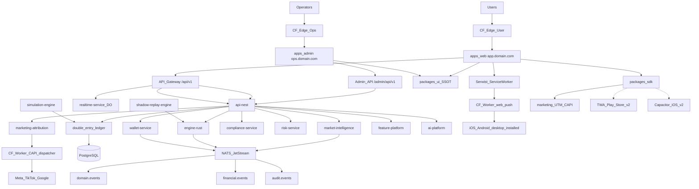
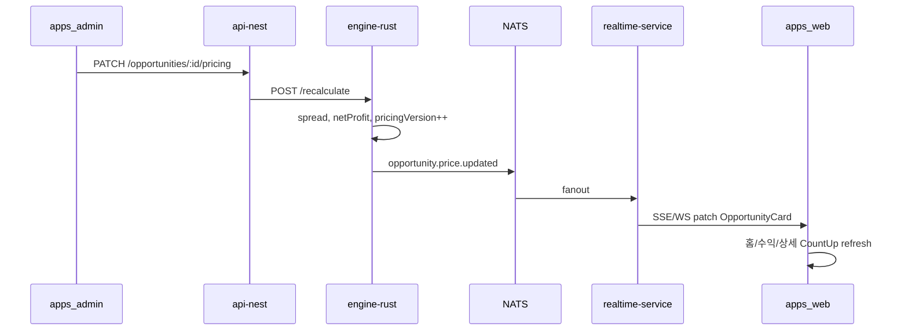
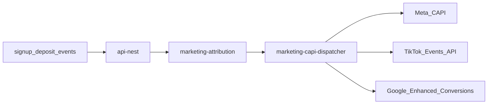
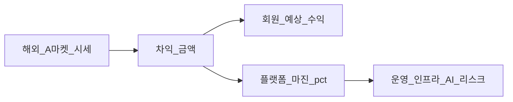
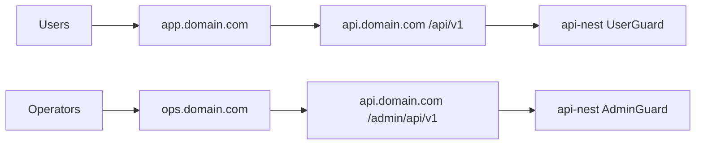
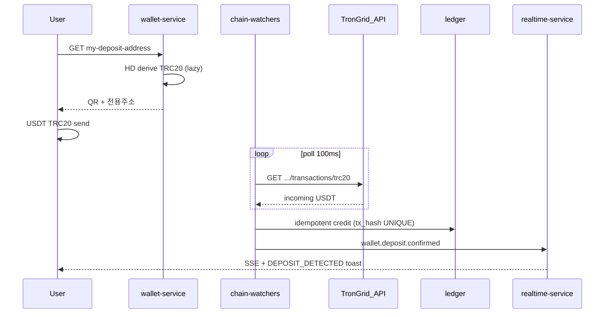
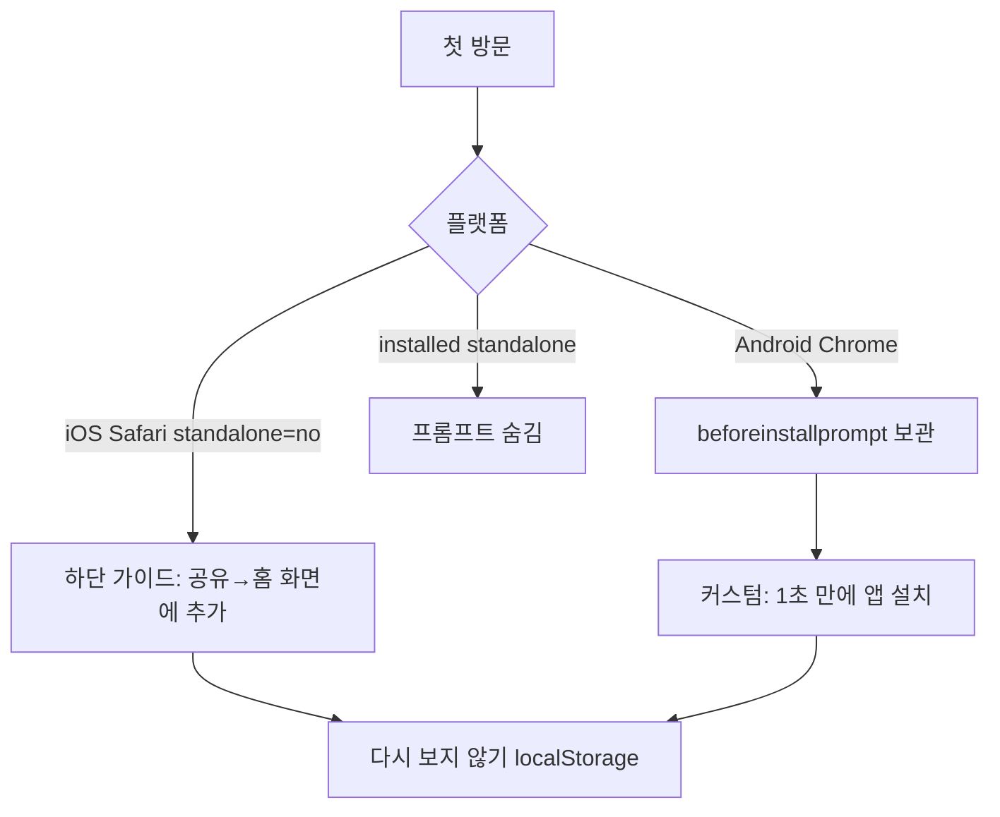

# AI Profit OS — 통합 플랜 (v7.7 · On-Chain + KYC Gate)

> **제로 목표:** 오류0 · 결함0 · 오차0 · 중복0  
> **유저앱:** `apps/web` → `app.domain.com` (PWA)  
> **어드민:** `apps/admin` → **`ops.domain.com` 별도 배포** (§40) · 메이저 베팅사급  
> **USDT 입금:** §41 — **유저별 TRC20 주소** · TronGrid 무료 API · chain-watchers **≤0.1s** 자동 반영  
> **원화 입금:** §41 — **PG 0** · 입금신청 → 대표계좌 송금 → Admin [승인]  
> **KYC:** §42 — **출금 1회만** · ko 이모지 toast → `/me/kyc` 자동 이동

---

## 0.1 Trust 잠금 정책 (v7.3)

| 구분 | v7.3 |
|------|------|
| LivePayoutTicker [A] | **`ticker_mode`:** off / live / demo / hybrid (§35 G4) |
| 오늘 지급 합계 [F] | **`counter_mode`:** off / ledger / demo / blended (§35 G4) |
| CountUp (거래·정산 UI) | **`settlement.completed`만** (ledger truth) |
| FOMO Coral | engine staleAt/잔여한도 · G4 ON 시 Admin boost |
| 앱 카드 "수익 확정" | **금지** · "예상 수익" SSOT |
| Product Identity 미주장 | **헌법 잠금 유지** (§1) · G1~G2 copy surface 예외 |
| fake JSON-LD 별점 | **금지** · real reviews only |
| 카지노 sfx / 슬롯 metaphor | **금지** · Lux chime only |

### §35 Growth Conversion (G1~G4 — Admin ON)

| # | 영역 | Admin | 해지/기능 |
|---|------|-------|-----------|
| G1 | **가짜 연혁·공지** | `/admin/growth/content` | `published_at` 소급 · 5년 narrative · synthetic changelog |
| G2 | **입금 유도 FOMO** | `/admin/growth/deposit` | 랜딩·공지·온보딩 과장 copy · social proof |
| G3 | **고액 입금 심리전** | `/admin/growth/whale` | 1억+ VIP Desk · tier ladder · OTC (AML 필수) |
| G4 | **실시간 ticker·counter** | `/admin/growth/ticker` | fake/demo ticker · counter blend · demo queue CRUD |

**Ledger 분리 (오차0):** UI demo/blend ≠ ledger SSOT · reconciliation은 **ledger만** · audit log 필수

**유지 (기술·금융 무결성):** double-entry ledger, reconciliation, circuit breaker, KYC/AML, WebAuthn, API 보안.

---

## 0. 총평 및 아키텍트 판정

### 이번 개정에서 흡수한 것 (전부)

| 영역 | 흡수 내용 |
|------|-----------|
| 제품 UX | 수익-first UI, 5탭 고정, USDT+≈원화, 거래 15초형 플로우, 전략 필터 |
| IA | 홈/수익/내거래/지갑/내정보 — 모바일·PC 동일 |
| 기회 모델 | Agnostic Opportunity Card (모든 vertical 동일 카드) |
| 실행 점수 | 판매기간·성공률·자본·위험·AI신뢰도 = moat |
| 어드민 | 12모듈 + **TOP5 원클릭 대시보드** (§9.5) |
| 토스트 | user cute / admin ops / financial surface 3축 SSOT |
| 방어 | 어뷰징·악성유저·오류 대응 매트릭스 100% |
| PWA | standalone·SW·Push·Badge·WebAuthn·햅틱·3초 설치 |
| Store Bridge | TWA(Play) + Capacitor(iOS) — v1 코드 재작성 0 |
| 무료 Bootstrap | Cloudflare Pages/Workers + Upstash — $0 착수 |
| **한글 UI** | 유저·어드민 화면 영어 노출 0% + ko copy SSOT |
| **반응형·성능** | 320px~4K fluid CSS + Device S/A/B tier + 60fps **목표** |
| **어드민 TOP5** | 원클릭 검수·마진·사기방지·돈줄·긴급정지 |
| **마케팅·SEO** | 매체별 랜딩·Server CAPI·UTM→입금·IndexNow |
| **Lux-Fintech** | Deep Obsidian · Tier Motion · G4 ticker/counter |
| **신뢰 교육** | **§38** — USDT 입금 납득 · 원화 비교 · **플랫폼 수익 투명** · 20~70대 ko |
| **어드민 Ops** | **§40** 분리 배포 · RBAC · **§39** 유저별 금융 전수 |
| **USDT 온체인** | **§41** TronGrid · 유저별 TRC20 · chain-watchers ≤0.1s · **PG 모듈 0** |
| **원화 입금** | **§41** 입금신청 → 대표계좌 → Admin 승인 · **PG 심사 우회** |
| **KYC** | **§42** 출금 시 **1회** · toast+이모지 → `/me/kyc` 자동 이동 |
| 품질 | 오류0·결함0·오차0·중복0 게이트 |

### 점수판 (목표)

| 영역 | 목표 |
|------|------|
| Domain 분리 | 9.7 |
| Money/Ledger | 10 (Double-Entry) |
| UX 일관성 | 9.5 (5탭·카드·버튼 SSOT) |
| Admin Ops | 9.3 |
| Toast/Notification | 9.5 (중복0) |
| Abuse Defense | 9.0 |
| PWA Native Feel | 9.0 (플랫폼 한계 내 max) |
| Store Bridge Readiness | 9.0 |
| Korean-First UI | 9.5 |
| Performance / Responsive | 9.0 (tier degrade 포함) |
| Admin 원클릭 TOP5 | 9.3 |
| Marketing Attribution | 9.0 (consent-first CAPI) |
| SEO / Organic | 8.5 |
| Lux-Fintech Motion | 9.0 (tier + reduced-motion) |
| 초기 실행 가능성 | 8.5+ ($0 bootstrap) |
| 규제/금융 리스크 | 8.5+ |

### 최종 원칙
- **10년 경계는 지금 잠근다.** 처음부터 모든 서비스·카테고리·Growth 스위치를 켜지 않는다.
- **메뉴는 5개만.** 하단/사이드바 추가 탭 금지 (이벤트·친구초대는 내정보 하위).
- **모든 화면 시선 순서 고정:** 예상수익 → 완료시간 → AI신뢰도 → 난이도 → 버튼 → 상품(작게).
- **화면 노출 텍스트 = 한국어만.** 코드·로그·API는 영어 가능, **유저·어드민 UI는 ko copy SSOT만** (§27).

---

## 1. Product Identity (이중 레이어 잠금)

### 1.1 대외·헌법 Identity (변경 없음, 강화)
- **정식:** AI 기반 글로벌 가격 발견 및 거래 기회 Data + Settlement OS
- **제공:** 검증된 시장 기회 + 실행 경로 + 정산 인프라
- **미제공/미주장:** AI가 돈을 벌어준다 / 원금·수익 보장 / 투자상품 확정
- **§35 예외:** G1~G4 **표현 surface** — ledger 정산·reconciliation **불변**

### 1.2 앱 UX Identity (신규 잠금)
- **앱 포지션:** "돈 버는 AI 차익 앱" — 사용자는 **얼마 벌 수 있는지**만 본다
- **슬로건 (앱):** "버튼 한 번으로 수익 시작!" (약관에 "예상·리스크" 병기)
- **한글 UI:** 화면 노출 = `packages/ui/copy/ko/*` SSOT만 — **§27 + CONSTITUTION/25**
- **금지 UI 노출:** Spread, Wallet, Deposit, Pending, Ledger, Opportunity 등 **영어·IT·크립토 전문용어 전부**
- **허용 UI 노출:** 예상수익, 거래하기, 충전하기, 출금하기, AI추천, 지급 대기 중

> **22 vs 25 분리 (중복0):** `22` = 레이아웃·5탭·버튼·색상 · `25` = **모든 표시 문자열·번역·금지어·CI**

### 1.3 표현 매핑 (앱 — G4 Admin override)

| UX 표면 | 기본 (live) | G4 Admin |
|---------|-------------|----------|
| 카드/홈 수익 | 예상 +12.45 USDT + ≈원화 | copy §35 G2 |
| 거래 완료 CountUp | settlement amount | ledger only |
| AI 점수 | AI 추천도 | label editable |
| 오늘 지급 [F] | ledger aggregate | `counter_mode` demo/blended |
| LiveTicker [A] | ledger SSE | `ticker_mode` demo/hybrid |

### 1.4 헌법 확장 (22~28)
- `22` — 레이아웃·5탭·시선 순서
- `25` — ko copy·금지어
- `26` — performance·device tier 수치
- `27` — marketing·SEO
- `28` — Lux-Fintech visual·motion (**G4 ticker/counter · §35**)

---

## 2. 전체 아키텍처



---

## 3. 서비스 경계 (최종)

### Domain / Money
- `services/api-nest` — auth, users, opportunity API, settlement, saved-strategies, admin API, **attribution ingest**
- `services/marketing-attribution` — UTM/gclid/fbclid/ttclid 귀속, CAPI orchestration, ROAS projection, consent log
- `services/engine-rust` — spread, ranking, execution-score, HOT/AI_PICK, anomaly
- `services/wallet-service` — **§41** 유저별 TRC20 주소 발급 · TronGrid ingest · KRW 입금신청 · withdraw · ledger credit
- `services/risk-service` — abuse score, rate limit, circuit breaker, device fingerprint hook
- `services/compliance-service` — **§42** KYC 출금 1회 게이트 · AML · sanctions · jurisdiction

### Data / AI
- `services/market-intelligence` — Asset, Listing, PriceObservation, HistoricalSpread
- `services/feature-platform` — user/market/opportunity features
- `services/ai-platform` — L1/L2 only, AI PICK score, AI_LOG
- `services/realtime-service` — WS/SSE, ticker, **opportunity.price.updated feed** §36
- `services/simulation-engine` — M0.5 gate
- `services/shadow-replay-engine` — 24h replay, 오차 0.000% gate

### Apps (분리 배포 §40)
- `apps/web` — 유저 PWA · **`app.{domain}`** · 5탭 only · **admin route 0**
- `apps/admin` — 운영 Ops · **`ops.{domain}`** · 12모듈 · **유저 UI 0**

### Workers (Agnostic Market Adapter + Marketing)
```
workers/
├── marketing-capi-dispatcher   # Meta/TikTok/Google CAPI (CF Worker)
├── rolex-adapter
├── chrono24-adapter
├── exchange-rate-adapter
├── electronics-adapter
├── giftcard-adapter
├── resale-adapter
├── chain-watchers          # §41 TronGrid TRC20 poll · ≤0.1s ledger credit
└── temporal-workers
```

---

## 4. Opportunity Card — 단일 SSOT (중복0)

모든 vertical(명품·환율·상품권·중고)은 **동일 스키마·동일 UI 카드**.

### 4.1 스키마 (`schemas/opportunity-card.v1.json`)

```typescript
interface OpportunityCard {
  id: string;
  pricingVersion: number;           // §36 — Admin 저장마다 +1 · participate guard
  pricedAt: ISO8601;
  // 수익-first (UI 1순위) — engine가 §36 pricing에서 계산
  expectedProfitUsdt: Decimal;      // 표시: +12.45 USDT
  expectedProfitKrwApprox: number;    // fx_snapshot_id 기반 ≈ ₩
  fxSnapshotId: string;
  estimatedDurationSec: number;       // 15, 30, 86400...
  aiConfidenceScore: number;          // 0-100 → UI ★ 또는 99%
  difficulty: 'beginner' | 'normal' | 'premium' | 'hot';
  tags: ('instant' | 'high_profit' | 'ai_pick' | 'beginner')[];
  requiredCapitalUsdt: Decimal;
  // §36 가격 (상세·어드민 미리보기)
  pricing?: OpportunityPricing;
  // 실행 가능성 (상세 moat)
  expectedSellDays?: number;
  sellSuccessRate?: number;           // 0-1 → 91%
  riskScore?: number;                 // 1-5 stars
  executionMode: 'info' | 'orchestrate' | 'full';  // v1: info+orchestrate만
  executionPlatforms?: string[];      // 크림, Chrono24...
  // 상품 (보조, 작게)
  assetLabel: string;                 // "Rolex Submariner"
  assetIcon?: string;
  arbitrageType: 'price' | 'fx' | 'benefit' | 'limited' | 'resale';
  staleAt: ISO8601;
  status: 'available' | 'paused' | 'expired' | 'circuit_open';
}

interface OpportunityPricing {
  marketBuyUsdt: Decimal;             // adapter 수집 매입 시세
  marketSellUsdt: Decimal;            // adapter 수집 판매 시세
  adminBuyUsdt?: Decimal;             // Admin override 매입가
  adminSellUsdt?: Decimal;            // Admin override 판매가
  adminMarginPct?: Decimal;           // 개별 마진 % (platform default override)
  useAdminOverride: boolean;          // true = admin 필드 SSOT
  spreadUsdt: Decimal;                // engine computed
  platformFeeUsdt: Decimal;
  netProfitUsdt: Decimal;             // = expectedProfitUsdt
  pricingSource: 'adapter' | 'admin' | 'blended';
  lastAdapterSyncAt?: ISO8601;
  lastAdminEditBy?: string;           // admin user id (audit)
}
```

### 4.2 arbitrageType (확장 단위 = 돈 버는 방식)

| Type | v1 | 예 |
|------|-----|-----|
| price | ✅ | Rolex, iPhone, LEGO |
| fx | ✅ | USD/JPY/EUR |
| benefit | v2 | 카드·상품권·쿠폰 |
| limited | v1 partial | Nike 한정판 |
| resale | v2 | 당근·번개 비교 |

**v1 홈/수익 피드:** `status=available` + adapter live + executionMode≠info-only-blocked 만 노출.

### 4.3 Admin 가격·수익 연동 (§36 SSOT)

**원칙:** 모든 상품(기회) = **Admin 편집 가능 가격** + **유저 UI 즉시 동기화** (홈·수익·상세·거래).

#### 가격 우선순위 (오차0)

```
1) adapter market (자동 수집)
2) admin override (개별 상품) — useAdminOverride=true
3) platform_margin_pct (전역, §9.5.2) — 개별 adminMarginPct 없을 때
→ engine-rust spread/netProfit 재계산 → OpportunityCard.projection
```

#### Admin UI (`/admin/opportunities`)

| 컬럼 (ko) | 편집 | 유저 반영 |
|-----------|------|-----------|
| 상품명 | read | assetLabel |
| 매입가 (USDT) | ✅ | requiredCapital 근사 |
| 판매가 (USDT) | ✅ | — |
| 마진 % | ✅ | platformFee |
| **예상 수익** | preview (engine) | 카드 1순위 숫자 |
| ≈원화 | auto fx | expectedProfitKrwApprox |
| 수집기 시세 | read + [시세 다시 받기] | marketBuy/Sell |
| 상태 | pause/resume | 피드 노출 |

**원클릭:** [가격 적용] · [선택 N건 일괄 적용] · [전역 마진 % 연동] (§9.5.2)

#### 실시간 유저 반영 (<500ms 목표, tier batch §29)



**구독 채널:** `opportunity:{id}` · `feed:home` · `feed:profits` · `feed:ai_pick`

**유저 surface (전부 동일 payload):**
- 홈 [C] Hero · [D] 오늘 가능 수익 합계 · [E] AI 추천
- `/profits` VirtualList 카드 · Radar ping on profit↑
- `/profits/[id]` 상세 · participate modal
- 진행 중 `/trades/{id}/execute` — pricingVersion mismatch → toast 갱신

**Participate guard:** `POST /participate` body에 `pricingVersion` — 서버 불일치 시 `PRICE_STALE` toast

#### 스키마·서비스

- `schemas/opportunity-pricing.v1.json` — pricing 필드 SSOT
- `services/api-nest` — admin pricing API + audit
- `services/engine-rust` — `/recalculate` · `/recalculate/bulk`
- `packages/sdk/opportunity-stream/` — `useOpportunityPatch()` SSE client
- `packages/ui/components/ProfitAmount.tsx` — pricingVersion key → CountUp re-animate

---

## 5. 사용자 IA — 메뉴 SSOT (변경 금지)

### 5.1 하단 네비 (모바일) — **정확히 5개, 절대 증가 금지**

| 순서 | 아이콘 | 라벨 | route |
|------|--------|------|-------|
| 1 | 🏠 | 홈 | `/` |
| 2 | 🔥 | 수익 | `/profits` |
| 3 | 💼 | 내거래 | `/trades` |
| 4 | 💰 | 지갑 | `/wallet` |
| 5 | 👤 | 내정보 | `/me` |

### 5.2 PC 레이아웃
- **좌측 사이드바:** 동일 5메뉴 (순서·라벨·route 동일)
- **우측 메인:** 카드 3~4열 그리드, 홈=추천+피드+지급현황

### 5.3 홈 `/` — Lux 레이아웃 (5탭·IA 불변)

```
🏠 홈 (Lux Dark)
 ├─ [A] LivePayoutTicker     `ticker_mode` §35 G4 (off/live/demo/hybrid)
 ├─ [B] 내 USDT 잔액 (대형) + ≈원화
 ├─ [C] 🔥 오늘 추천 Hero     카운트다운 (engine staleAt · G4 boost)
 ├─ [D] 💰 오늘 가능한 수익
 ├─ [E] 🤖 AI 추천
 ├─ [F] 🎉 오늘 지급 합계    `counter_mode` §35 G4 (ledger/demo/blended)
 └─ [G] Sticky MotionCTA      ko SSOT "거래 시작"
```

**Sticky CTA:** `position: sticky; bottom: calc(5tab + safe-area)` — 5탭 가리지 않음

### 5.4 수익 `/profits` — Market Radar (선택 뷰)

```
🔥 수익
 ├─ 필터: 🟢 전체 | ⚡ 즉시 | 💎 고수익 | 😊 초보 | 🤖 AI추천 | ❤️ 즐겨찾기
 ├─ [Radar Mode] opportunity.created → green ping (S/A only)
 └─ VirtualOpportunityList
```

`/profits?view=radar` — S/A: ping animation · B: static list only

**저장 전략 필터 (내정보 하위 `/me/strategies`):**
- 💰 소액 고회전 (10~50만원, 당일)
- 🚀 고수익 (100만원+)
- ⚡ 30초 완료
- 🛡️ 안정형
- 🤖 AI 자동 추천

→ 알림: "당신 전략에 맞는 기회 3건"

### 5.5 내거래 `/trades` — Lux Receipt

```
💼 내거래
 ├─ 상단: 오늘 +USDT / 이번달 +USDT (CountUp on load, tier-aware)
 ├─ ReceiptCard: 종이 출력 모션 (S/A) / instant (B) + TronScan 도장
 ├─ 진행 중 · 완료 · 거래 내역 · 월별 수익
```

### 5.6 지갑 `/wallet`

```
💰 지갑
 ├─ 🪙 USDT (메인, 크게) + ≈ ₩
 ├─ 💵 원화 (동등 노출)
 ├─ ➕ 입금하기 → /wallet/deposit
 ├─ ➖ 출금하기 → /wallet/withdraw
 └─ 📜 입출금·수익 내역
```

### 5.7 입금 `/wallet/deposit` — **USDT · 원화 둘 다 · USDT 추천 ⭐**

**탭:** `🪙 테더(USDT) ⭐ 추천` | `💵 원화`

**기본 진입:** `?tab=usdt` (deeplink·푸시·온보딩)

#### USDT 탭 — **§41 유저 전용 주소 · 자동 확인**

```
┌─ 🪙 테더(USDT) 입금 ⭐ 추천 ─────────────────┐
│ [QR]  [내 전용 주소 복사]  ← user별 TRC20 §41 │
│ ⚡ 입금 즉시 자동 확인 (보통 0.1초 이내)        │
│ ── 💡 왜 USDT가 편할까요? (탭하면 펼침) ──      │
│ ① 빠름 — 온체인 확인 후 바로 거래 (원화는 검수) │
│ ② 한 흐름 — 입금→수익→출금이 USDT로 이어짐     │
│ ③ 글로벌 정산 — 해외 시세 OS와 같은 방식       │
│ ── 원화 vs USDT (쉬운 비교) ──                 │
│  원화: 국내 계좌 이체 · 검수 대기 · 통장 기록   │
│  USDT: 내 전용 주소 · **자동 확인** · 빠른 출금 │
│ ── ⚠️ 세금 안내 (면책, 고정 문구) ──            │
│  수익·세금은 개인마다 달라요.                   │
│  원화 입출금은 국내 금융 기록과 연결될 수 있어요.│
│  궁금하면 세무 전문가와 상담하세요.             │
│ [자세히 보기 → /me/guide/usdt]                 │
└────────────────────────────────────────────────┘
```

- **QR · 주소** — `GET /api/v1/wallet/my-deposit-address` · **유저마다 전용 TRC20** (§41)
- **자동 반영** — chain-watchers → ledger → SSE → `DEPOSIT_DETECTED` toast 🎉
- **WhyUsdtCard** — `packages/ui/components/trust/WhyUsdtCard.tsx` · copy `T.trust.usdt.*`
- **금지:** PG·결제모듈 · 공유 단일 입금주소(유저 surface) · "수동 확인 대기"(USDT)

#### 원화 탭 — **§41 PG-free 입금신청 워크플로**

```
┌─ 💵 원화 입금 (서류·PG 없음) ──────────────────┐
│ ① 입금액 입력  [________] 원                   │
│ ② 입금자명     [________] (통장 표시 이름)      │
│ ③ [입금 신청하기]                              │
│ ── 송금 안내 (Admin 대표계좌 §37) ──           │
│  국민은행 123-456-789012  예금주 ○○○           │
│  ⚠️ 신청 금액과 **동일하게** 송금해 주세요      │
│ ── 상태 ──                                     │
│  ⏳ 검수 대기 / ✅ 반영 완료 / ❌ 거절          │
│ [더 빠른 USDT 입금 보기 →]                     │
└────────────────────────────────────────────────┘
```

- **PG 모듈 0** — 유저 송금 → Admin **입금 대기목록** → [승인] → ledger
- 은행명 · 계좌 · 예금주 — §37 Admin · SSE 즉시 반영
- **짧은 안내:** "계좌 이체 후 운영자 확인 (통상 10분~24시간)"

**Admin 변경 → 유저:** `wallet.deposit_config.updated` SSE

### 5.8 출금 `/wallet/withdraw` — **USDT · 원화 · §42 KYC 1회**

**탭 (동등):** `🪙 USDT 출금` | `💵 원화 출금`

| 탭 | route | guard |
|----|-------|-------|
| USDT | `/wallet/withdraw/usdt` | **§42 KYC approved** · WebAuthn · 잔액 · tier cap |
| 원화 | `/wallet/withdraw/krw` | **§42 KYC approved** · WebAuthn · **Admin 승인** · tier cap |

**§42 KYC 게이트 (출금만 · 1회):**
```
유저 [출금하기] 클릭
  → kycStatus !== 'approved'
  → toast: "🔐 출금하려면 본인 확인이 필요해요! 1번만 하면 돼요 😊"
  → 800ms 후 router.push('/me/kyc?return=/wallet/withdraw')
  → /me/kyc 에서 신청 → Admin 승인 → 이후 출금 **재요청 없음**
```

- USDT: TRC20 주소 입력 · TronScan 추적
- 원화: 등록 계좌 · 출금액 · 승인 대기 toast
- **거래(participate)는 KYC 불필요** — 잔액·circuit·pricingVersion만

### 5.9 내정보 `/me`

```
 👤 내정보
 ├─ 👥 친구 초대
 ├─ 🎁 이벤트
 ├─ 🔔 알림 설정
 ├─ 💾 내 전략 (saved filters)
 ├─ 📞 고객센터
 ├─ 📖 이용안내
 │   ├─ /me/guide/usdt        ← §38 왜 USDT?
 │   ├─ /me/guide/revenue     ← §38 플랫폼 수익 구조
 │   └─ /me/guide/faq         ← 세금·출금·수수료 FAQ
 ├─ 🪪 본인 확인             ← §42 /me/kyc (출금 1회)
 └─ ⚙️ 설정
```

---

## 6. 화면별 UI/UX SSOT

### 6.1 시선 순서 (모든 카드·상세 공통)

1. 💰 **예상수익** (가장 크게, `--profit-emerald`)
2. ⏱️ **완료 예상 시간**
3. 🤖 **AI 추천도** (보라)
4. 😊 **난이도/태그**
5. 🟢 **거래 시작** (파랑, Primary)
6. 📦 **상품명** (작게, 하단)
7. 📎 **마진 footnote** (§38 — "포함 운영 수수료", 작게)

### 6.2 Lux-Fintech 색상 · 타이포 · 반응형 SSOT

> **테마:** User App = **Lux Dark default** · Admin = **Ops Light default** (가독성)  
> **SSOT:** `packages/ui/tokens/lux-fintech.ts` + `CONSTITUTION/28`

| 역할 | token | hex | 용도 |
|------|-------|-----|------|
| 배경 | `--bg-obsidian` | `#090A10` | Deep Obsidian (pure #000 ❌) |
| 표면 | `--surface-elevated` | `#12131A` | 카드·시트 |
| 수익 | `--profit-emerald` | `#00FF87` | Neon Profit Emerald |
| FOMO/긴급 | `--flash-coral` | `#FF2E63` | **실제** 마감·잔여한도만 |
| 프리미엄 | `--amber-gold` | `#F59E0B` | 명품·고수익 태그 |
| USDT | `--mint-teal` | `#00D294` | 지갑·테더 |
| Primary CTA | `--action-neon` | `#1A56FF` | Pulse glow base |
| AI | `--ai-violet` | `#8B5CF6` | AI 추천도 |
| 본문 | `--text-body` | clamp | fluid §29 |
| 수익 숫자 | `--text-profit` | clamp | CountUp target |

**금지:** 카지노 레드/골드 팔ETTE 별도 · pure black `#000` · 수익=빨강

**상세 모션:** §33 · **성능 tier:** §29 (중복 정의 ❌)

### 6.3 UI 카피 (헌법 준수)
- 영어·IT 전문용어 화면 노출 ❌ (§25)
- **수익 확정 금지** — "예상 수익" + 리스크 tooltip (§35 G2는 **공지·랜딩·온보딩**만 예외)
- 차트/호가 등 UX 금지 (§22 레이아웃 유지)

### 6.4 온보딩 (5 step, 15초)

```
1 😊 "AI가 전 세계 시세 차이에서 수익 기회를 찾아드려요"
2 🪙 "충전은 테더(USDT)가 가장 빨라요 — 입금→거래→출금 한 번에"
   [왜 USDT? 10초 설명] → §38 미니카드 (skip 가능)
3 💰 "원하는 거래를 고르고 [거래 시작]만 누르세요"
4 🎉 "수익은 내 지갑(USDT)으로 지급돼요"
5 [ 시작하기 ] → /wallet/deposit?tab=usdt (또는 홈)
```

**온보딩 §38 톤:** 20대=짧은 bullet · 40~50대=비교표 · 60~70대=큰 글씨+한 줄씩 (`--text-body` fluid)

---

## 7. 버튼 구성 SSOT (전수)

### 7.1 Global

| 버튼 | 위치 | action | guard |
|------|------|--------|-------|
| 시작하기 | 온보딩 | → `/` | 1회 |
| 시작하기 | 홈 Hero | → `/profits/{id}` | — |

### 7.2 홈

| 버튼 | action |
|------|--------|
| 시작하기 (Hero) | opportunity detail |
| 카드 탭 | `/profits/{id}` |

### 7.3 수익 · 상세

| 버튼 | label | action | guard |
|------|-------|--------|-------|
| Primary | 🟢 거래 시작 | POST `/opportunities/{id}/participate` | balance, circuit, **pricingVersion**, rate limit (**KYC ❌ §42**) |
| Secondary | ❤️ 즐겨찾기 | toggle favorite | auth |
| Tertiary | 📋 실행 경로 보기 | expand platforms | — |

### 7.4 거래 진행 `/trades/{id}/execute`

| 상태 | UI | 버튼 |
|------|-----|------|
| pending | ⏳ AI 거래중... progress bar | 취소 (orchestrate only) |
| success | 🎉 +X USDT | 💰 확인 → `/wallet` |
| failed | 😔 | 다시 시도 / 고객센터 |

### 7.5 지갑 · 입출금

| 버튼 | action |
|------|--------|
| ➕ 입금하기 | `/wallet/deposit` (USDT·원화 탭) |
| 🪙 USDT 입금 | `/wallet/deposit?tab=usdt` |
| 💵 원화 입금 | `/wallet/deposit?tab=krw` |
| ➖ 출금하기 | `/wallet/withdraw` |
| 🪙 USDT 출금 | `/wallet/withdraw/usdt` |
| 💵 원화 출금 | `/wallet/withdraw/krw` |
| 📋 주소/계좌 복사 | clipboard + toast |

### 7.6 내정보

| 버튼 | action |
|------|--------|
| 친구 초대 | share link + referral code |
| 알림 설정 | toggle matrix |
| 전략 저장 | CRUD saved-strategies |

### 7.7 버튼 whitelist 원칙
- Primary 1개/화면 (한 화면 = 한 행동)
- Destructive = Confirm modal 필수
- Disabled 시 toast로 이유 (침묵 실패 금지)

---

## 8. 토스트 · 알림 SSOT (중복0)

### 8.1 3축 분리 (혼용 금지)

| Surface | Resolver | Tone | visibleToasts |
|---------|----------|------|---------------|
| User error | `resolveToastDetail` | 귀여운 한국어, 이모지 1~2 | 1 |
| User success (금융) | `toastSurfaceMessage` | 금액 합성 SSOT | 1 |
| Admin | `resolveAdminToastDetail` | 운영 평문, 이모지 ≤1 | 2 |

**금지:** `CODE_MESSAGES`를 cute로 rewrite · ErrorState에 toast resolver 연결

### 8.2 User Toast Catalog (필수)

| code | toast (KO) | trigger |
|------|------------|---------|
| `INSUFFICIENT_BALANCE` | 😅 USDT가 부족해요. 입금 후 다시 시도해 주세요 | participate |
| `KYC_WITHDRAW_REQUIRED` | 🔐 출금하려면 본인 확인이 필요해요! 1번만 하면 돼요 😊 | withdraw tap · **→ /me/kyc auto** |
| `KYC_PENDING` | ⏳ 본인 확인을 검토 중이에요. 잠시만 기다려 주세요 🙏 | kyc submitted |
| `KYC_REJECTED` | 😔 본인 확인이 반려됐어요. 다시 신청해 주세요 | kyc rejected |
| `KYC_APPROVED` | ✅ 본인 확인 완료! 이제 출금할 수 있어요 🎉 | admin approve |
| `CIRCUIT_OPEN` | ⏸️ 잠시 거래를 멈췄어요. 곧 다시 열릴게요 | any money |
| `RATE_LIMITED` | 🐢 잠깐만요! 너무 빠르게 눌렀어요 | click spam |
| `OPPORTUNITY_EXPIRED` | ⏰ 이 기회는 방금 마감됐어요 | stale participate |
| `DEPOSIT_DETECTED` | 🎉 USDT {amount} 입금 확인! 바로 거래할 수 있어요 | §41 chain watcher |
| `KRW_DEPOSIT_SUBMITTED` | 📝 원화 입금 신청 접수! 송금 후 확인해 드릴게요 | krw request |
| `KRW_DEPOSIT_APPROVED` | ✅ 원화 입금이 반영됐어요! | admin approve |
| `WITHDRAW_SUBMITTED` | 📤 출금 요청을 받았어요 | withdraw |
| `TRADE_COMPLETE` | 🎉 +{amount} USDT 지급 완료! | settlement |
| `NETWORK_ERROR` | 📡 연결이 불안정해요. 다시 시도해 주세요 | fetch fail |
| `SESSION_EXPIRED` | 🔐 다시 로그인해 주세요 | 401 |
| `ACCOUNT_FROZEN` | ⏸️ 계정이 일시 정지됐어요. 고객센터에 문의해 주세요 | admin freeze |
| `ACCOUNT_BANNED` | 🚫 이용이 제한된 계정이에요 | admin ban |
| `WITHDRAW_BLOCKED` | 📤 출금이 일시 중지됐어요 | admin restrict |
| `BALANCE_ADJUSTED` | 💰 잔액이 조정됐어요 | admin ledger adjust |
| `DEPOSIT_CONFIG_UPDATED` | 🔄 입금 정보가 업데이트됐어요 | SSE (optional toast) |

### 8.3 Push / In-app Notification

| category | title 예 | href |
|----------|----------|------|
| `ai_pick` | 🤖 AI 추천 — +18.5 USDT | `/profits/{id}` |
| `strategy_match` | 💾 내 전략에 맞는 기회 3건 | `/profits?strategy=` |
| `deposit` | 🎉 입금 확인 | `/wallet` |
| `withdraw` | 📤 출금 처리 중/완료 | `/wallet/history` |
| `promo` | 🎁 수수료 면제 이벤트 (Growth ON 시) | `/me/events` |

### 8.4 중복0 기술

- DB: `UNIQUE (user_id, source_event_id) WHERE source_event_id IS NOT NULL`
- Insert 23505 → re-select existing (race defense)
- Sonner: user `visibleToasts={1}` id single-flight
- Push + In-app + Toast 동시: **1 source_event → 1 toast OR 1 in-app** (정책 테이블)

---

## 9. Admin — IA 및 구성 SSOT

### 9.1 Admin 사이드바 (12모듈) — **화면 라벨 = 한국어 SSOT**

| # | 화면 라벨 (ko) | route (코드, 비노출) | 내부 서비스 | 역할 |
|---|----------------|----------------------|-------------|------|
| 1 | 📊 한눈에 보기 | `/admin` | dashboard | 오늘 정산·활성 기회·긴급 상태 |
| 2 | 🔥 수익 기회 관리 | `/admin/opportunities` | opportunities | **§36 가격·마진·수익** · 등록·일시정지 |
| 3 | 🔌 해외 시세 수집기 | `/admin/adapters` | adapters | 수집기 연결·상태 |
| 4 | 💰 입출금 관리 | `/admin/wallet` | wallet | **§37 입금설정** · 검수 · 출금승인 |
| 5 | 📒 입출금·정산 장부 | `/admin/ledger` | ledger | **§39** 전역·유저별 원장 · reconciliation |
| 6 | 👤 회원 관리 | `/admin/users` | users | **§37·§39** · 편집·잔액·차단·**금융전수** |
| 7 | 🛡️ 사기·이상 거래 방지 | `/admin/risk` | risk | 이상 징후·제재 |
| 8 | ⚖️ 법적 확인·제재 | `/admin/compliance` | compliance | 제재국가·감시 |
| 9 | 🚨 긴급 정지 | `/admin/system-control` | circuit | 전체·부분 정지 |
| 10 | 🤖 AI 분석 기록 | `/admin/ai-logs` | ai-logs | AI 판단·수정 이력 |
| 11 | 📣 이벤트·프로모션 | `/admin/growth` | growth | **기본 OFF** · §35 G1~G4 탭 |
| 12 | 📋 운영 기록 | `/admin/audit` | audit | 관리자 행동 로그 |

**금지 (어드민 화면 노출):** Market Adapters, Settlement Ledger, DLQ, NATS, Temporal, Feature Store, Execute Rerun 등 **영어/IT 용어 그대로 노출**

**어드민 액션 버튼 ko 예:**
- Execute Rerun → **오류 건 다시 시도하기**
- Approve Withdraw → **출금 승인하기**
- Pause Opportunity → **이 기회 잠시 멈추기**
- Open Circuit → **긴급 정지 켜기**

### 9.2 Admin ↔ User 대응 (오차0)

| User 화면 | Admin 관리 |
|-----------|------------|
| 홈/수익 카드 **예상수익** | `/admin/opportunities` §36 pricing |
| 홈/수익 카드 (목록) | opportunities + adapters |
| 거래 시작 (가격 스냅샷) | pricingVersion guard + settlement |
| 지갑 입출금 | wallet + **§37 deposit-config** + ledger + compliance |
| 입금 QR/원화계좌 | `/admin/wallet?tab=deposit-settings` · `krw-pending` |
| USDT 전용주소 | 코드 자동발급 §41 · Admin 조회 `/admin/users/:id` |
| 회원 프로필·잔액·차단 | `/admin/users/:id` §37 |
| **유저 입금·출금·시세차익** | `/admin/users/:id/finance` §39 |
| 오늘 지급 ticker | `ticker_mode` + `counter_mode` §35 G4 |
| AI 추천도 | ai-logs + feature-platform |
| Circuit toast | system-control |

### 9.3 Admin 버튼 (핵심)

| 버튼 | Confirm | audit event |
|------|---------|-------------|
| 기회 일시정지 | reason≥10 | `admin.opportunity.paused` |
| **가격 적용** | preview 확인 | `admin.opportunity.pricing.updated` |
| **일괄 가격 적용** | Confirm + N건 | `admin.opportunity.pricing.bulk` |
| 출금 승인/거절 | ✅ | `admin.withdraw.decided` |
| 유저 동결 | reason≥10 | `admin.user.frozen` |
| 긴급 정지 ON | reason≥10 | `admin.circuit.opened` |
| Growth 스위치 ON | simulation pass + budget | `admin.growth.enabled` |
| Adapter onboarding | schema validate | `admin.adapter.registered` |

### 9.4 Admin 토스트 (ops tone)

- 성공: `✅ 저장했습니다`
- 실패: `{operation} 실패 — {plain_reason}` (enum 금지)
- 긴급: `⚠️ 긴급 정지가 켜졌습니다. 사용자 거래가 차단됩니다`

### 9.5 왕초보 운영 — 원클릭 TOP 5 (무인 **보조** 대시보드)

> **SSOT 화면:** `/admin` (📊 한눈에 보기) **상단 5위젯** — 12모듈 route **추가 없음** (중복0)  
> **전역 검색바 (§39):** user_id · 휴대폰 · tx_hash · 입금자명 → `/admin/users/:id/finance`  
> **주의:** "무인" = AI·규칙 **자동 분류 + 원클릭 승인**. 고액·원화·출금은 **사람 Confirm 필수** (compliance).

| # | TOP5 (ko) | 위젯 | 연결 route | 원클릭 액션 |
|---|-----------|------|------------|-------------|
| 1 | **입출금 검수함** | 대기 N건 카드 | `/admin/wallet?tab=review` | 승인하기 / 거절하기 + TronScan 링크 |
| 2 | **시세·마진 조절판** | 🟢/🔴 수집기 + **전역 마진 %** | `/admin/adapters` | 마진 저장 → **§36 전 상품 재계산** |
| 3 | **사기·매크로 방지망** | 임시동결 카드 큐 | `/admin/risk?tab=queue` | 동결 해제 / 영구 제재 |
| 4 | **돈줄 전광판** | 순수익·지급·광고 | `counter_mode` §35 + attribution |
| 5 | **긴급 정지** | 🚨 마스터 스위치 | `/admin/system-control` | 긴급 정지 켜기 (reason≥10) |

#### 9.5.1 TOP1 — 입출금 검수함 (상세)

```
┌─ 입출금 검수함 ──────────────── 3건 대기 ─┐
│ 🪙 USDT 자동완료     12건  (오늘) §41      │
│ 💵 원화 입금 대기     1건  [승인] [거절] §41│
│ 📤 고액 출금 대기     2건  [승인] [거절]   │
│ 🔗 TronScan 확인     (각 행 링크)          │
└──────────────────────────────────────────┘
```

- USDT 온체인: chain-watchers **자동 확인 ≤0.1s** → 어드민은 **예외·분쟁만** 검수
- 원화: 유저 **입금신청** → 대표계좌 송금 → **대기목록** → 초보 운영자 [승인] · **PG 0**
- TronScan: `wallet.withdraw.tx_hash` → 마스킹 + 원클릭

#### 9.5.2 TOP2 — 시세 수집기 · 마진 조절판

| UI | 데이터 |
|----|--------|
| 🟢 정상 / 🔴 멈춤 | adapter.last_success_at vs TTL |
| 마진율 입력 | platform_margin_pct → engine **bulk recalc** §36 |
| 0% 이벤트 토글 | growth.zero_margin (budget+circuit) |
| 개별 상품 override | `/admin/opportunities` adminMarginPct 우선 |

**버튼:** [마진 저장] → 전 상품 예상수익 재계산 + SSE push · [0% 이벤트 ON/OFF]

#### 9.5.3 TOP3 — 사기 방지망

| 자동 탐지 | 카드 표시 |
|-----------|-----------|
| 동일 IP 다계정 | "같은 Wi-Fi에서 N계정" |
| 매크로 연타 | "1분에 N번 거래 시도" |
| 비정상 패턴 | AI L2 score + rule id (화면=한글) |

**액션:** [임시 동결] [풀어주기] [영구 제재] — reason≥10

#### 9.5.4 TOP4 — 돈줄 전광판

| 지표 | 소스 (오차0) |
|------|--------------|
| 오늘 플랫폼 순수익 | ledger 또는 demo blend (§35 G4) |
| 오늘 유저 지급 총액 | ledger 또는 demo blend |
| 갱신 | SSE · tier batch |

#### 9.5.5 TOP5 — 긴급 정지 (0.1초 목표)

- 트리거 UI: `/admin` 고정 🚨 + `/admin/system-control` 상세
- 목표 latency: **100ms** (risk-service circuit, 기존 §10.3)
- 도메인별: participate / withdraw / deposit / all
- 켜진 후: 유저 toast `CIRCUIT_OPEN` + admin audit

#### 9.5.6 TOP6 — 광고 성과 (돈줄 위젯 확장, sidebar 변경 없음)

| 지표 | 소스 |
|------|------|
| 캠페인별 USDT 입금 | `user_attribution` + ledger first_deposit |
| ROAS | ad spend import (manual/API) / attributed deposit |
| CAPI 전송 성공률 | marketing-capi-dispatcher logs |

**화면:** `/admin` 돈줄 전광판 하단 "광고에서 온 입금" — **12모듈 sidebar 변경 없음**

### 9.6 Admin 가격·수익 실시간 연동 (§36)

> **SSOT:** §4.3 · `CONSTITUTION/36_ADMIN_PRICE_AND_PROFIT_SYNC.md`  
> **화면:** `/admin/opportunities` (모듈 2) · TOP2 전역 마진과 **연동**

```
┌─ 수익 기회 관리 ─────────────────────────────┐
│ [전역 마진 1.5%]  [선택 3건]  [가격 일괄 적용] │
├──────────────────────────────────────────────┤
│ 상품          │매입│판매│마진%│예상수익│≈원화│액션│
│ Rolex Sub...  │ editable ──→ live preview ──→│적용│
│ USD/JPY       │ ...                          │적용│
└──────────────────────────────────────────────┘
```

| 기능 | 설명 |
|------|------|
| **인라인 편집** | 매입·판매·마진 % 셀 편집 → 우측 **예상수익 즉시 preview** |
| **가격 적용** | engine recalc → `pricingVersion++` → SSE push |
| **일괄 적용** | 선택 N건 동일 delta/margin · Confirm modal |
| **시세 다시 받기** | adapter refresh → admin override 유지 옵션 |
| **전역 마진 연동** | TOP2 저장 시 개별 override 없는 상품만 bulk update |
| **감사** | before/after JSON · admin id · `audit.events` |

**유저 동기화 SLA:** Admin [적용] → 유저 카드 숫자 변경 **≤500ms** (S/A) · B-tier WS batch ≤1s

**오류 UX:** `PRICE_STALE` · "가격이 바뀌었어요 — 새로고침할게요" + auto patch

### 9.7 Admin 입금 설정 · 원화 대표계좌 (§37) + USDT 온체인 (§41)

> **화면:** `/admin/wallet?tab=deposit-settings` · `/admin/wallet?tab=krw-pending`  
> **SSOT:** `schemas/deposit-config.v1.json` · `CONSTITUTION/37` + `41`

```
┌─ 입금 설정 ───────────────────────────────────┐
│ [원화 대표계좌]  [USDT 온체인]  [원화 대기목록] │
├─ 원화 대표계좌 (§37 — PG 없음) ───────────────┤
│ 은행명             [국민은행        ]           │
│ 계좌번호           [123-456-789012 ]           │
│ 예금주             [주식회사 ○○○   ]           │
│ 입금 안내 문구     [편집]                       │
├─ USDT 온체인 (§41 — 유저별 주소 자동발급) ─────┤
│ TronGrid API       [________] (무료 tier)      │
│ Hot wallet xpub    [secrets — UI 마스킹]       │
│ min confirmations  [1]                         │
│ poll interval ms   [100]  ← 0.1s 목표           │
│ chain-watcher      🟢 running / 🔴 stopped     │
└─ [저장] ──────────────────────────────────────┘

┌─ 💵 원화 입금 대기목록 (§41) ─── N건 ─────────┐
│ 유저 │ 신청액 │ 입금자명 │ 신청시각 │ [승인][거절] │
└───────────────────────────────────────────────┘
```

| 필드 | Admin | 유저 surface |
|------|-------|--------------|
| `krwBankName` · `krwAccountNumber` · `krwAccountHolder` | text | 원화 탭 송금 안내 |
| `tronGridApiKey` | secret | — (backend only) |
| `usdtMinConfirmations` | number | — |
| `chainWatcherPollMs` | number default 100 | — |
| **유저 TRC20 주소** | 조회 only `/admin/users/:id` | `/wallet/deposit?tab=usdt` **전용 QR** |

**USDT:** Admin이 **공유 입금주소 설정 ❌** → 코드가 **유저별 TRC20 발급** (§41)  
**원화:** Admin **대표계좌 1개** + 유저 **입금신청** → 대기목록 [승인]

**실시간 반영 (원화 대표계좌만 SSE):**
```
Admin [저장] krw fields → NATS wallet.deposit_config.updated
→ useDepositConfig() → 원화 탭 계좌 **즉시 교체** (≤300ms)
```
**USDT 전용주소:** 유저 가입/첫 입금页 visit 시 **코드 발급** · Admin SSE 변경 **해당 없음**

### 9.8 Admin 회원 전체 운영 (§37)

> **화면:** `/admin/users` · `/admin/users/:id`  
> **원칙:** 가입정보 **전 필드 Admin 편집** · 금융 조작 = **ledger 분개만**

#### 9.8.1 회원 목록 · 검색

| 필터 | 컬럼 |
|------|------|
| 상태 · KYC · 가입일 · IP · **총입금·총출금** | 이름 · 연락처 · USDT잔액 · ≈원화 · **순시세차익** · 최근입금일 · 최근접속IP · 상태 |

**행 클릭:** `/admin/users/:id/finance` (기본) · 프로필 탭 전환 가능  
**전역 검색 (대시보드 상단):** user_id · 휴대폰 · tx_hash · TronScan · 입금자명 → finance jump

#### 9.8.2 회원 상세 — 편집 가능 필드 (전수)

| 구분 | 필드 | Admin 액션 |
|------|------|------------|
| **가입정보** | 이름 · 휴대폰 · 이메일 · 생년월일 · 추천코드 | [저장] audit |
| **본인확인** | KYC tier · 서류 상태 · 메모 | 승인/거절/재요청 |
| **계정** | 가입일(표시) · OAuth 연동 · Passkey | 연동 해제 · 재설정 |
| **지갑** | USDT 잔액(표시) · ≈원화 | **§9.8.3 잔액 조정** |
| **출금계좌** | 유저 등록 원화 계좌 | 편집/초기화 |
| **상태** | active/flagged/restricted/frozen/banned | §9.8.4 차단 |
| **접속** | 최근 IP · IP 이력 · device · User-Agent | §9.8.5 |
| **거래·금융 §39** | 입금·출금·시세차익·마진 **전수** | `/admin/users/:id/finance` |
| **메모** | 운영자 내부 메모 | CRUD |

#### 9.8.3 잔액 조정 (ledger — `user.balance +=` **금지**)

```
┌─ 잔액 조정 ─────────────────────────────────┐
│ 현재 USDT: 125.40  (≈ ₩171,000)              │
│ 조정 유형:  [+] 지급  [-] 차감  [↔] 정정      │
│ 금액 USDT:  [________]                       │
│ 사유(≥10):  [________________________]       │
│ [미리보기 분개]  [적용 — Confirm 2단]        │
└──────────────────────────────────────────────┘
```

| 유형 | 분개 | audit |
|------|------|-------|
| 지급 | Debit Ops Pool / Credit User | `admin.user.balance.credit` |
| 차감 | Debit User / Credit Ops Pool | `admin.user.balance.debit` |
| 정정 | reversal + new entry | `admin.user.balance.correct` |

**Guard:** 고액(>1000 USDT) · 2인 Confirm optional · circuit 연동 · 유저 push/toast `BALANCE_ADJUSTED`

#### 9.8.4 유저 차단 · 제재 (전체)

| 액션 | UX 영향 | 버튼 |
|------|---------|------|
| **임시 동결** | 거래·출금 block | [동결] reason≥10 |
| **출금만 차단** | withdraw only | [출금 정지] |
| **거래만 차단** | participate only | [거래 정지] |
| **로그인 차단** | banned · 세션 revoke | [영구 차단] Confirm×2 |
| **동결 해제** | 복구 | [풀어주기] |
| **IP 차단** | 해당 IP 신규/기존 세션 | [IP 차단] |

**유저 toast:** `ACCOUNT_FROZEN` · `ACCOUNT_BANNED` · `WITHDRAW_BLOCKED`

#### 9.8.5 접속 IP · 세션

| 데이터 | 소스 | Admin |
|--------|------|-------|
| `lastLoginIp` | api-nest auth middleware | 상세 헤더 |
| `loginHistory[]` | audit.events | IP · 시간 · device · geo(optional) |
| `activeSessions[]` | session store | [세션 전부 끊기] |
| IP allow/deny list | risk-service | [IP 화이트/블랙] |

#### 9.8.6 Admin 버튼 추가 (§37)

| 버튼 | Confirm | audit event |
|------|---------|-------------|
| 입금 설정 저장 | ✅ | `admin.wallet.deposit_config.updated` |
| 회원 정보 저장 | ✅ | `admin.user.profile.updated` |
| 잔액 조정 적용 | ✅×2 (고액) | `admin.user.balance.*` |
| 유저 동결/차단 | reason≥10 | `admin.user.status.*` |
| 세션 끊기 | ✅ | `admin.user.sessions.revoked` |
| IP 차단 | reason≥10 | `admin.user.ip.blocked` |
| 금융 CSV 내보내기 | — | `admin.user.finance.exported` |

#### 9.8.7 유저별 금융 원장 (§39 — **필수**)

> **화면:** `/admin/users/:id/finance` · 상세 탭 **💰 금융 원장**  
> **SSOT:** ledger + wallet + settlement · `schemas/user-financial-summary.v1.json`

**요약 KPI (상단 고정):**
- **총 입금** / **총 출금** / **시세차익 순수익** / **플랫폼 마진 기여** (USDT + ≈원화)
- **현재 잔액** · **거래 횟수** · **승률** · **최근 입금/출금**

| 탭 | 표시 (ko) | 데이터 |
|----|-----------|--------|
| **입금 내역** | 일시·USDT/원화·금액·≈원화·상태·tx/입금자·승인자 | wallet.deposit |
| **출금 내역** | 일시·금액·수수료·상태·목적지·TronScan·승인자 | wallet.withdraw |
| **시세차익** | 일시·상품·예상·실지급·spread·platformFee·settlement_id | settlement |
| **장부 분개** | debit/credit·계정·USDT·memo·admin조정 | ledger entries |
| **플랫폼 마진** | 거래별 수수료·누적·margin_pct 스냅샷 | engine + ledger |

```typescript
GET /admin/api/v1/users/:id/finance/summary
GET /admin/api/v1/users/:id/finance/deposits?from&to&page
GET /admin/api/v1/users/:id/finance/withdrawals?from&to&page
GET /admin/api/v1/users/:id/finance/spread-profits?from&to&page
GET /admin/api/v1/users/:id/finance/ledger-entries?page
GET /admin/api/v1/users/:id/finance/export.csv?type=all|deposits|withdrawals|profits
```

**전역:** `/admin/ledger?userId=` · `/admin/reports/financial` (일/월 합산)  
**검색:** tx_hash · TronScan · 입금자명 · user_id → 해당 유저 finance로 jump

### 9.9 Admin RBAC · 운영자 계정 (§40)

| 역할 (ko) | 권한 |
|-----------|------|
| **최고관리자** | 전 모듈 · Growth · circuit · RBAC 편집 |
| **재무** | wallet · ledger · §39 export · 출금승인 · 잔액조정 |
| **고객지원** | users 조회 · 프로필편집 · 메모 · KYC (차단 ❌) |
| **리스크** | risk · compliance · freeze/ban · IP |
| **마케팅** | growth · attribution · content (금융 ❌) |

- Admin 로그인: **별도** `admin_users` · MFA 필수 · 세션 15m
- API: `/admin/api/v1/*` — `AdminGuard` + role matrix
- 모든 액션 → `audit.events` (operator id · before/after)

### 9.10 Admin 기능 전수 — 메이저 Ops 체크리스트

> **§40 분리 배포** · betting-grade ops 기준 · **플랜 누락 0**

| 영역 | 기능 | route / 위치 |
|------|------|--------------|
| **대시보드** | 오늘 입금·출금·순유입·활성유저·온라인 | `/admin` TOP5+KPI |
| **유저 검색** | 이름·휴대폰·이메일·user_id·tx_hash·지갑주소 | `/admin/users` |
| **유저 금융 §39** | 개인 입금·출금·시세차익·마진·순손익 | `/admin/users/:id/finance` |
| **입금** | USDT §41 자동 · 원화 §41 대기목록 · TronScan | `/admin/wallet` |
| **출금** | 대기열 · 승인/거절 · 고액 2인 Confirm | `/admin/wallet?tab=review` |
| **장부** | double-entry · reconciliation · shadow replay | `/admin/ledger` |
| **거래/수익** | 기회 가격 §36 · participate·settlement 이력 | opportunities + user finance |
| **리스크** | 동일IP·매크로·Sybil · freeze queue | `/admin/risk` |
| **컴플라이언스** | **§42** KYC 출금1회 · AML · 제재국가 | `/admin/compliance` |
| **긴급** | circuit breaker · domain별 정지 | `/admin/system-control` |
| **Growth** | G1~G4 · ticker · 공지 · whale | `/admin/growth` |
| **마케팅** | ROAS · UTM · CAPI | TOP6 widget |
| **리포트** | 일/월 입출금·수익·마진 · CSV export | `/admin/reports` |
| **알림** | 고액 입출금 · circuit · reconciliation fail | `/admin` bell |
| **감사** | 운영자 행동 · 유저 상태 변경 · 잔액조정 | `/admin/audit` |
| **설정** | deposit-config · platform_margin · RBAC | wallet/adapters/settings |

---

## 10. 어뷰징 · 악성유저 · 오류 대응 (전수)

### 10.1 어뷰징 시나리오 → 방어

| # | 공격 | 방어 | 서비스 |
|---|------|------|--------|
| A1 | 다계정 referral farming | device graph + **§42 withdraw KYC** + referral cap/day | risk + compliance |
| A2 | 입금 후 즉시 출금 wash | min holding 24h (설정 가능) + AML rule | compliance + ledger |
| A3 | 기회 participate spam | rate limit 5/min/user + idempotency key | api-nest + risk |
| A4 | Stale 기회 arbitrage (UI lag) | staleAt + **pricingVersion** enforce | engine + api |
| A5 | API scrape 기회 feed | WAF + auth + pagination cap + bot score | Cloudflare + risk |
| A6 | Fake deposit (wrong chain) | chain watcher confirm N blocks | wallet |
| A7 | Withdraw to sanctioned addr | sanctions screen pre-broadcast | compliance |
| A8 | Sybil on promo/growth | promo pool separate ledger + per-user cap | ledger + growth |
| A9 | Admin credential steal | MFA + IP allowlist + admin session 15m | api-nest |
| A10 | Click farm on payout ticker/counter | rate limit SSE + `ticker_mode` audit log | risk + realtime |
| A11 | Participate on stale price | pricingVersion guard + PRICE_STALE toast | api-nest + engine |
| A12 | Admin price typo (margin drain) | simulation floor + preview Confirm | engine + admin |
| A13 | Manipulate AI PICK | AI score from feature-platform only, L3 no money | ai-platform |
| A14 | Chargeback social eng. | support ticket + freeze path, no manual balance | admin + ledger |
| M1 | Fake OG share spam | rate limit share + referral cap | risk + marketing |
| M2 | UTM injection / steal | signed attribution cookie + server validate | marketing-attribution |
| M3 | Fake JSON-LD ratings | verify:seo-schema — no aggregateRating without source |
| M4 | Consent-less CAPI | consent log required before dispatch | marketing + compliance |
| M5 | Landing policy bait-and-switch | landing variant audit + 27 compliance gate | marketing |

### 10.2 악성유저 상태 머신

```
active → flagged → restricted → frozen → banned
```

| 상태 | UX | Admin |
|------|-----|-------|
| flagged | 정상 (monitor) | risk queue |
| restricted | participate cap | manual review |
| frozen | 출금/거래 block + toast | user card |
| banned | login block | compliance |

### 10.3 Circuit Breaker (100ms급)

| trigger | action | user toast |
|---------|--------|------------|
| TRON gas spike | pause withdraw | CIRCUIT_OPEN |
| USDT/KRW fx >±3%/5m | pause new participate | CIRCUIT_OPEN |
| ledger mismatch | freeze all money ops | CIRCUIT_OPEN |
| adapter stale >TTL | hide opportunities | (no card) |
| shadow replay fail | block settlement | admin alert |

### 10.4 오류 대응 매트릭스 (100% 커버)

| Layer | Error | User | Admin | Log |
|-------|-------|------|-------|-----|
| Network | timeout | NETWORK_ERROR toast | — | OTel |
| API | 400 validation | toast + inline | — | audit |
| API | 401 | SESSION_EXPIRED | — | security |
| API | 403 KYC_WITHDRAW_REQUIRED | 🔐 toast → /me/kyc | compliance KYC queue | audit |
| API | 409 idempotency | silent success (dup) | — | fin event |
| API | 429 | RATE_LIMITED | — | risk |
| API | 503 circuit | CIRCUIT_OPEN | system-control | risk |
| Wallet | deposit fail | support link | wallet queue | fin |
| Wallet | withdraw fail | toast + retry | admin approve | fin |
| Engine | stale opportunity | OPPORTUNITY_EXPIRED | adapter alert | domain |
| Ledger | reconciliation fail | CIRCUIT_OPEN | P0 pager | fin+audit |
| Realtime | WS disconnect | auto reconnect | — | OTel |

**침묵 실패 금지:** 모든 error path → toast OR inline OR redirect.

---

## 11. Money / Double-Entry (금융급, 오차0)

### 절대 금지
- `user.balance += 100` (DB column 직접 UPDATE)

### Admin 잔액 조정 (§37 — 허용)
- **반드시** double-entry ledger 분개 + `ledger_entry_id` trace
- Ops Pool ↔ User · audit + reason≥10

### USDT + KRW 표시
- **Ledger truth:** USDT only
- **KRW:** `fx_snapshot_id` projection for display (오차0: snapshot at render time)
- 모든 UI 금액은 `ledger_entry_id` 또는 `opportunity_id`로 trace 가능

### 분개 (동일)
- Participate: Debit User USDT / Credit Opportunity Pool Liability
- Payout: Debit Pool / Credit User Reward
- Promo: Debit Promo Pool / Credit User (Growth only)
- **Admin adjust:** Debit/Credit Ops Adjustment Pool ↔ User (§37)

---

## 12. Event Architecture (3 NS, 중복0)

```
domain.events    — opportunity.*, opportunity.price.updated, market.*, ai.analysis.*
financial.events — ledger.*, wallet.*, wallet.deposit_config.updated, settlement.*
audit.events     — admin.user.*, admin.wallet.deposit_config.*, admin.opportunity.pricing.*, policy.changed
```

스키마 단일 소스: `schemas/` → `packages/types` → `data-contracts/` (복사 금지)

---

## 13. AI Layer (L1/L2, 자금집행 금지)

| Level | UI 노출 | 금지 |
|-------|---------|------|
| L1 | 설명, FAQ, 검색 | money |
| L2 | AI PICK score, ranking | auto approve |
| L3 | simulation only | auto payout |

**Sensitive Decision = Rule Engine + Compliance only**

---

## 14. Growth (스위치 OFF default)

| 기능 | UX 표현 | Guard |
|------|---------|-------|
| Flash Zero-Margin | "수수료 면제 이벤트" | budget cap, circuit |
| Mystery Box | "보너스 이벤트" | promo pool only, 확률 공시 |
| Loyalty Boost | "참여 보너스" | 이자/스테이킹 금지 |

---

## 15. Infrastructure

### 유저앱 vs Admin Ops **분리 배포 (§40 — 필수)**

| | **유저 PWA** | **Admin Ops** |
|---|-------------|---------------|
| App | `apps/web` | `apps/admin` |
| Domain | `app.{domain}` | **`ops.{domain}`** |
| CF Pages | project `ai-profit-web` | project **`ai-profit-ops`** |
| Auth | user JWT / Passkey | **admin JWT** · MFA · RBAC |
| Route | 5탭 only | 12모듈 · **/admin/** |
| Public link | 마케팅·SEO | **비공개** · 검색엔진 차단 |
| WAF | bot score | **IP allowlist** + CF Access(optional) |

**금지:** `apps/web`에 `/admin` route · 동일 도메인에 admin mount · 유저앱에서 ops URL 노출

```
infra/
├── web/          # wrangler/pages — app.domain.com
├── ops/          # wrangler/pages — ops.domain.com  ← §40
│   ├── pages.toml
│   └── access-policy.json   # IP allowlist / Zero Trust
└── api/          # api.domain.com (shared backend)
```

### Bootstrap ($0)
```
Cloudflare Pages:
  ai-profit-web  → apps/web
  ai-profit-ops  → apps/admin   ← 별도 프로젝트
Workers: push-dispatcher, marketing-capi-dispatcher
Upstash Redis
→ local Docker Compose dev (web:3000 · ops:3001 · api:4000)
```

### Production
```
Docker Compose → Compose+Tilt → Stage(ECS/small K8s) → Prod(EKS)
```

Observability: User click → SW → API → Engine → Ledger → Wallet (OTel full trace)

---

## 16. Monorepo (최종)

```
AI_PROFIT_OS
├── apps/
│   ├── web/                 # 5탭 PWA SSOT
│   └── admin/               # 12모듈 SSOT
├── services/
│   ├── marketing-attribution/   # UTM, ROAS, CAPI orchestration
│   └── ...
├── workers/
│   ├── marketing-capi-dispatcher/
│   ├── rolex-adapter, ...
│   └── push-dispatcher/
├── packages/
│   ├── ui/
│   ├── types/
│   └── sdk/                     # marketing, device-tier, push, native-bridge
├── schemas/
│   ├── user-attribution.v1.json
│   ├── opportunity-card.v1.json
│   ├── opportunity-pricing.v1.json   # §36
│   ├── deposit-config.v1.json      # §37
│   ├── admin-user-ops.v1.json      # §37 balance/status/ip
│   ├── user-financial-summary.v1.json  # §39 KPI·집계
│   ├── user-deposit-address.v1.json    # §41 유저별 TRC20
│   ├── krw-deposit-request.v1.json   # §41 원화 입금신청
│   ├── kyc-status.v1.json            # §42 출금 게이트
│   ├── admin-rbac.v1.json        # §40 역할×권한 matrix
│   ├── toast-codes.v1.json
│   ├── admin-actions.v1.json
│   └── ui-copy-glossary.v1.json   # enum→한글 표시 SSOT
├── data-contracts/
├── migrations/
├── infra/
│   ├── web/                 # CF Pages — app
│   ├── ops/                 # CF Pages — admin §40
│   └── api/
├── docs/
│   └── ux/
├── CONSTITUTION/            # 00~28
└── research/
```

---

## 17. Constitution (28개 + §35~§42)

```
...
27_MARKETING_AND_SEO_ENGINE.md
28_LUX_FINTECH_DESIGN_AND_MOTION.md  ← palette, motion, G4 ticker/counter
35_GROWTH_CONVERSION_PRESENTATION.md ← G1~G4 (§35)
36_ADMIN_PRICE_AND_PROFIT_SYNC.md   ← Admin 가격·유저 실시간 수익 (§36)
37_WALLET_AND_USER_ADMIN_OPS.md    ← 입금설정·회원운영 (§37)
38_TRUST_EDUCATION_AND_REVENUE_TRANSPARENCY.md ← USDT납득·수익투명 (§38)
39_USER_FINANCIAL_LEDGER.md        ← 유저별 입금·출금·시세차익 전수 (§39)
40_ADMIN_ISOLATED_OPS_PLATFORM.md  ← ops 분리배포·RBAC·보안 (§40)
41_ONCHAIN_USDT_AND_KRW_DEPOSIT.md ← TronGrid·유저별 TRC20·원화 PG-free (§41)
42_KYC_WITHDRAW_ONE_TIME_GATE.md   ← 출금 1회 KYC·toast·/me/kyc (§42)
```

---

## 18. 로드맵 (UX 통합)

### 선행 순서
1. CONSTITUTION 28 + ADR
2. schemas + manifest + **lux-fintech tokens**
3. packages/ui (**lux components** + responsive + copy/ko)
4. packages/ui/copy/ko + useCopy + ESLint
5. M0.5 simulation
6. Money Core
7. User 5탭 + Install Prompt + Push + WebAuthn + **device tier**
8. Admin 12모듈 + **TOP5** + **§36 가격** + **§39 금융** + **§40 ops 분리배포**
9. **Marketing landing + CAPI + SEO** (M6)
10. Store Bridge scaffold

### Milestone

| MS | 내용 |
|----|------|
| M0 | Constitution 28 + Lux tokens + monorepo |
| M0.5 | Simulation pass |
| M1 | Ledger + wallet + **§41 TronGrid·유저별 TRC20·원화 대기승인** + withdraw |
| M2 | Engine + adapters + **§36 pricing** + 홈/수익 실시간 피드 |
| M3 | 거래 flow + **CountUp/MotionCTA** + toast + Serwist + TronScan |
| M3.5 | **Web Push + Badge + WebAuthn 출금** + haptics/audio |
| M4 | Admin TOP5 + 12모듈 + **§37·§39 회원·금융** + **§40 ops CF Pages** + shadow replay |
| M5 | AI PICK + saved strategies |
| M6 | Growth switches + **Marketing Funnel + CAPI + SEO** |
| M7 | Stage→Prod + PWA Lighthouse + **320px~4K visual regression** |
| M8 | Expansion adapters |
| M8a/b/c | **TWA Play + Capacitor TestFlight + Store** (optional) |

---

## 19. 출시 게이트 (Zero-Defect)

### 오류0 · 결함0
- [ ] 5탭 route drift 0 (mobile=PC)
- [ ] 버튼 inventory 100% 구현
- [ ] error path → toast/inline 100%
- [ ] Admin↔User 필드 mismatch 0

### 오차0
- [ ] ledger reconciliation pass
- [ ] shadow replay 0.000% gate
- [ ] USDT/KRW fx_snapshot trace 100%
- [ ] ledger mode: "오늘 지급" = ledger aggregate 일치
- [ ] demo/blended mode: Admin seed + audit log (ledger reconciliation **별도**)

### 중복0
- [ ] notification UNIQUE constraint live
- [ ] toast single-flight verified
- [ ] schema 단일 SSOT (no copy drift)

### UX · Trust
- [ ] 온보딩 10초 완료 E2E
- [ ] TRC20 deposit→participate→payout→withdraw E2E
- [ ] Circuit breaker drill pass
- [ ] Compliance min flow pass
- [ ] AI autonomous money 0
- [ ] Growth OFF unless budget+sim pass
- [ ] **§36:** Admin 가격 변경 → 유저 홈/수익/상세 **≤500ms** E2E
- [ ] **§37:** Admin 원화 계좌 → user 원화 탭 **≤300ms** SSE E2E
- [ ] **§37:** Admin 잔액 조정 ledger trace + user display 일치
- [ ] **§38:** verify:trust-copy PASS · 면책 블록 입금/온보딩/guide 전 surface
- [ ] **§39:** 유저 finance summary = deposit+withdraw+settlement 집계 일치
- [ ] **§39:** CSV export row count = DB · audit `admin.user.finance.exported`
- [ ] **§39:** tx_hash / user_id 검색 → `/admin/users/:id/finance` jump E2E
- [ ] **§40:** `ops.*` 배포 · `app.*/admin` route **0** · verify:no-admin-in-web PASS
- [ ] **§40:** Admin JWT ≠ User JWT · IP allowlist · MFA · RBAC matrix E2E
- [ ] **§40:** ops robots/noindex · 유저앱 ops URL 노출 **0**
- [ ] **§41:** TronGrid → chain-watchers → ledger **≤100ms** · tx_hash idempotent
- [ ] **§41:** 유저별 TRC20 unique · PG import wallet path **0**
- [ ] **§41:** KRW 입금신청 → Admin 승인 → ledger E2E
- [ ] **§42:** 출금 KYC toast → `/me/kyc` auto · 승인 후 재요청 **0**
- [ ] **§42:** participate without KYC **200**
- [ ] **§37:** freeze/ban → login·거래·출금 block E2E
- [ ] pricingVersion mismatch → PRICE_STALE toast + auto patch
- [ ] 전역 마진 저장 → bulk recalc + SSE fanout
- [ ] **verify:lux-tokens + verify:ticker-mode-audit PASS**
- [ ] verify:marketing-compliance PASS
- [ ] **UTM→first_deposit attribution E2E**
- [ ] **CAPI consent-before-send 100%**
- [ ] **verify:seo-schema (no fake ratings)**
- [ ] verify:responsive PASS
- [ ] **Device tier B degrade E2E (blur OFF, WS batch)**
- [ ] verify:korean-ui PASS
- [ ] **API problem.code → ko toast 100% (raw enum 노출 0)**
- [ ] 금지 UI 용어 scan pass
- [ ] **Lighthouse PWA ≥ 90**
- [ ] **Install E2E iOS guide + Android A2HS**
- [ ] **Push dedup + WebAuthn withdraw E2E**
- [ ] **assetlinks.json valid (TWA ready)**

---

## 20. v1 Scope Lock (확장 vs 출시)

### v1 사용자에게 보이는 것
- arbitrageType: `price` + `fx` (+ limited partial)
- executionMode: `orchestrate` (명품·환율), `info` (중고 비교 — "실행 경로 보기" only)
- 5탭, Hero, 필터 6개, 지갑 USDT-first
- **Admin Ops:** `ops.{domain}` only — **유저앱 admin UI/route 0** (§40)

### v1 숨김 (adapter ready 후 ON)
- benefit (카드·상품권)
- AI 부업 vertical
- Growth 3종 (Admin switch)

---

## 21. 유지 / 추가 / 폐기

### 유지
Rust Engine, NestJS, NATS, PostgreSQL Ledger, Temporal, AI L1/L2, Cloudflare, OTel, 단계 활성화

### 추가 (v3 PWA)
- Serwist SW + App Shell offline
- manifest.webmanifest SSOT
- Install Prompt (iOS/Android 분기)
- Web Push VAPID + CF Worker
- App Badge (server-driven)
- WebAuthn 출금
- packages/sdk feedback (haptics+audio)
- TWA + Capacitor scaffold
- CONSTITUTION 23/24
- Bootstrap $0 path (CF Pages)
- **CONSTITUTION 25 + ko copy**
- **CONSTITUTION 26 + fluid CSS + device tier + TanStack Virtual**
- **Admin TOP5 + TOP6 광고 성과 위젯**
- **CONSTITUTION 28 + Lux components + tier motion**

### 폐기/금지
- 6번째 하단 탭
- **잔액 column 직접 UPDATE** (ledger bypass) — §37 ledger 조정만 허용
- AI 자금 자율 집행
- Spread/Arbitrage/ROI UI 노출
- toast 중복 stack
- Admin enum toast
- **카지노 UI 톤** (설치 버튼·사운드 — "돈 버는 앱" 톤만)
- **전역 user-select:none** (입금주소·거래ID 복사 불가 = 결함)
- **Vercel+Cloudflare 이중 호스팅 SSOT** (호스트 1곳만)
- **Supabase를 Ledger SSOT로 사용** (PostgreSQL double-entry와 중복 금지)
- **JSX/TSX UI 문자열 하드코딩** (ko copy SSOT 위반)
- **어드민 화면에 DLQ/NATS/Temporal 등 IT 용어 노출**
- **API error code·stack trace 유저/어드민 노출**
- **전역 white-space:nowrap** (320px 버튼 깨짐 유발)
- **px 고정 font-size만 사용** (fluid clamp 필수)
- **B-tier에서 Virtual List 생략** (10k feed = OOM)
- **애드블록·iOS ATT 우회** (불법/정책 위반)
- **매체 심사 회피·미끼 랜딩** (bait-and-switch)
- **카지노 사운드·게임형 위장** (헌법 22/25 톤 충돌)
- **가짜 JSON-LD 별점** (aggregateRating without real reviews)
- **FinancialProduct 허위 스키마** (투자상품 오인 유발)
- **IndexNow = 상위노출 보장** 주장 (크롤 알림만)
- **"3초 차익 수령" / 수익 확정 CTA** (앱 카드·정산 UI)
- **User App white background default** (Lux Dark SSOT)

**§35 Admin (기본 OFF):** G1~G4 — fake ticker · demo counter · 연혁 · 입금 FOMO · whale

---

## 31. Marketing Funnel · CAPI · SEO (v6 신규)

> **SSOT:** `CONSTITUTION/27_MARKETING_AND_SEO_ENGINE.md`  
> **코드:** `packages/sdk/marketing/` + `apps/web/app/(landing)/` + `workers/marketing-capi-dispatcher`

### 31.0 피드백 검토 — 동의 vs 수정 (오차0)

| 피드백 | 판정 | 플랜 반영 |
|--------|------|-----------|
| 매체별 맞춤 랜딩 (TikTok/Meta/Google) | ✅ 동의 | Ad Funnel Matrix §31.2 |
| Server-side CAPI (Meta/TikTok/Google) | ✅ 동의 | CF Worker dispatcher |
| UTM/gclid 영구 귀속 → 입금 ROAS | ✅ 동의 | `user_attribution` + ledger |
| 1초 Passkey/Social 가입 | ✅ 동의 | 기존 §23 WebAuthn + OAuth |
| sitemap.ts + robots.ts | ✅ 동의 | Next.js App Router |
| IndexNow ping on opportunity update | ✅ 동의 | **크롤 요청** (순위 보장 ❌) |
| Dynamic OG share + referral | ✅ 동의 | opengraph-image.tsx |
| JSON-LD Rich Snippets | ⚠️ **수정** | **WebApplication + Dataset** — honest metadata |
| Dynamic metadata per opportunity | ✅ 동의 | `/profits/[slug]` generateMetadata |
| **애드블록 우회** | ❌ **금지** | client pixel 최소화 + **consent-first CAPI** |
| **iOS 프라이버시 우회** | ❌ **금지** | **ATT 준수** + SKAdNetwork(optional) + server CAPI |
| **카지노 터치 사운드** (TikTok) | ❌ **금지** | 돈 버는 앱 톤 · §25/22 |
| **게임형 리워드 명목 심사 통과** | ❌ **금지** | **정책 준수 가이드** — 회피·미끼 ❌ |
| **★4.9 fake snippet** | ❌ **금지** | real reviews only or no rating |
| CAPI **유실률 0%** | ⚠️ **수정** | **consent+match quality 목표** — 100% 과장 ❌ |
| CONSTITUTION **22** | ❌ **충돌** | **`27_MARKETING`** (22=UX) |
| 광고비 유출 **0** | ⚠️ **정의** | **ROAS 가시화 + wasted spend cut** (부정 클릭≠0 자동) |

### 31.1 "광고비 유출 0" 정의 (오차0)

| 유출 유형 | 방어 |
|-----------|------|
| Attribution blind spot | UTM→user_id→first_deposit chain |
| Client pixel blocked | Server CAPI (consent 후) |
| Wrong campaign credit | last-touch + first-touch both stored |
| Bot click burn | risk bot score + ad platform exclude API |
| Bait-and-switch landing | variant locked to ad disclosure copy |

**NOT 약속:** 클릭 부정 0% · organic #1 보장 · 심사 100% pass

### 31.2 Ad Funnel Matrix (Compliance-First)

| 매체 | route | 타겟 | 랜딩 ko 톤 | **금지** |
|------|-------|------|------------|----------|
| TikTok | `/l/tt` | 2030 | 숏폼 세로 UI · "AI 수익 기회 알림" · 1탭 가입 | 카지노음·게임 위장 |
| Meta | `/l/meta` | 3050 | 카드뉴스 피드 · "글로벌 시세 모니터링 OS" | 수익 확정·투자 암시 (§35 G2 ON 시 랜딩만 예외) |
| Google | `/l/google` | 4070 | 큰 글씨 · "예상 수익 데이터" · 신뢰 배지(실측) | 재테크 보장 카피 |

**공통:** CTA → Passkey/OAuth **1초 가입** → `/` (5탭) · cookie `attr_id` 90d  
**내부 전환:** 랜딩 copy ≠ 앱 copy drift 금지 — **25 ko SSOT** 파생

**서브도메인 (optional):** `go.domain.com` → same `(landing)` routes · CORS SSOT

### 31.3 Attribution Schema (단일 SSOT)

```typescript
// schemas/user-attribution.v1.json
interface UserAttribution {
  userId: string;
  firstTouch: { utmSource, utmMedium, utmCampaign, utmContent, utmTerm, gclid?, fbclid?, ttclid?, landingVariant };
  lastTouch: { ... };
  consentMarketing: boolean;
  consentAt: ISO8601;
  firstDepositAt?: ISO8601;
  firstDepositUsdt?: Decimal;
  capiSentEvents: string[];  // dedup
}
```

**귀속 시점:** 첫 visit → cookie/localStorage → signup merge → **ledger first_deposit** link  
**Admin ROAS:** §9.5.6

### 31.4 Server-Side CAPI Architecture



| Event | Trigger | Consent |
|-------|---------|---------|
| CompleteRegistration | signup | required |
| Lead | landing CTA | required |
| Purchase | first USDT deposit | required |
| ViewContent | opportunity view | optional tier |

**MUST:** consent log before send · event_id dedup · PII hashed (SHA256) per platform spec  
**NEVER:** send before consent · bypass ATT · fingerprint for ads

**Package:** `packages/sdk/marketing/`
```
capi-dispatch.ts      # server-only import
utm-capture.ts        # client first-touch
consent.ts            # CMP banner ko
attribution-store.ts  # cookie + API persist
```

### 31.5 SEO · IndexNow · OG Viral

#### Dynamic Metadata
```typescript
// apps/web/app/profits/[slug]/page.tsx
export async function generateMetadata({ params }) {
  const opp = await getOpportunity(params.slug);
  return {
    title: `예상 +${opp.profitKrw}원 · ${opp.assetLabel}`,
    description: `AI 추천 ${opp.aiScore}% · ${T.seo.disclaimer}`, // ko SSOT
    alternates: { canonical: `https://.../profits/${params.slug}` },
  };
}
```

#### JSON-LD (honest)
```json
{
  "@type": "WebApplication",
  "name": "오늘수익",
  "applicationCategory": "FinanceApplication",
  "offers": { "@type": "Offer", "price": "0", "priceCurrency": "KRW" }
}
```

**금지:** fake `aggregateRating` · `FinancialProduct` with guaranteed returns

#### sitemap.ts + robots.ts
- `/profits/*` opportunities · `/l/*` landings (noindex optional for pure ad URLs)
- `priority` by opp score · `lastModified` from engine

#### IndexNow
- Trigger: `opportunity.created|updated` → NATS → worker ping (Google/Bing/Naver endpoints)
- **효과:** crawl notify only — **ranking ≠ guaranteed**

#### OG Dynamic Share
```
apps/web/app/share/[receiptId]/opengraph-image.tsx
→ referral code embedded · +X USDT image · ko only
```
- Share targets: 카카오 · X · native Web Share API
- Rate limit: 10/user/day (M1 abuse)

### 31.6 Landing 파일 트리

```
apps/web/app/
├── (landing)/
│   ├── layout.tsx           # minimal chrome, no 5-tab
│   ├── tt/page.tsx          # TikTok variant
│   ├── meta/page.tsx
│   └── google/page.tsx
├── profits/[slug]/page.tsx  # SEO public pages
├── sitemap.ts
├── robots.ts
└── share/[id]/opengraph-image.tsx

packages/sdk/marketing/
workers/marketing-capi-dispatcher/
services/marketing-attribution/
```

### 31.7 CI Gates (§32)

- `verify:marketing-compliance` — no banned words in landing copy (§35 G2 OFF default)
- `verify:seo-schema` — JSON-LD validator, no aggregateRating without source
- `verify:attribution-chain` — UTM fixture → signup → deposit → admin ROAS
- `verify:capi-consent` — event without consent = test fail

---

## 32. Marketing · SEO 출시 게이트

- [ ] 3 landing variants live + ko-only
- [ ] Consent banner → CAPI send order E2E
- [ ] UTM persist 90d → first_deposit linked
- [ ] sitemap valid · IndexNow ping on opp create
- [ ] OG share generates referral URL
- [ ] No fake structured data (manual QA)
- [ ] Ad policy checklist signed (27 appendix)

---

## 33. Lux-Fintech Design · Motion · FOMO (v7 신규)

> **SSOT:** `CONSTITUTION/28_LUX_FINTECH_DESIGN_AND_MOTION.md`  
> **토큰:** `packages/ui/tokens/lux-fintech.ts` + `tailwind.preset.lux.ts`  
> **성능 tier 수치:** §29/26 SSOT (여기서 재정의 ❌)

### 33.0 피드백 검토 — 동의 vs 수정 (오차0)

| 피드백 | 판정 | 플랜 반영 |
|--------|------|-----------|
| Deep Obsidian `#090A10` 배경 | ✅ 동의 | `--bg-obsidian` default |
| Neon Profit Emerald `#00FF87` | ✅ 동의 | `--profit-emerald` |
| Flash Coral FOMO red | ✅ **조건부** | **실제 staleAt/한도**만 |
| Amber Gold 프리미엄 | ✅ 동의 | `--amber-gold` tags |
| Mint Teal USDT | ✅ 동의 | `--mint-teal` wallet |
| Count-Up 0.3s | ✅ 동의 | `CountUpNumber` tier-aware |
| Pulse CTA 1.5s glow | ✅ 동의 | `MotionCTA` + reduced-motion off |
| S/A/B blur·particle 분기 | ✅ 동의 | §33.3 = §29 tier 연동 |
| Sticky 대형 CTA | ✅ 동의 | §5.3 [G] |
| Market Radar ping | ✅ 동의 | `/profits?view=radar` |
| Receipt print + TronScan | ✅ 동의 | `ReceiptCard` |
| **Live 익명 지급 ticker** | ✅ **G4 Admin** | `ticker_mode`: off / live / demo / hybrid |
| **카지노 칩 사운드** | ❌ **금지** | **Lux chime** (§23.7) |
| **카지노 슬롯 Count-Up 톤** | ⚠️ **수정** | fintech count-up · slot metaphor ❌ |
| **폭죽 Confetti 3중** | ⚠️ **수정** | tier S/A: light burst · B: flash only · reduced-motion: none |
| **"3초 차익 수령" CTA** | ❌ **금지** | ko SSOT **"거래 시작"** |
| **고급 카지노 심리 연출** | ❌ **금지** | **명품관 Lux-Fintech** reframe |
| **CONSTITUTION 23** | ❌ **충돌** | **`28`** (23=PWA) |
| DopamineButton name | ⚠️ **rename** | **`MotionCTA`** (카지노 연상 ↓) |

### 33.1 Visual Identity Lock (중복0)

```typescript
// packages/ui/tokens/lux-fintech.ts — SSOT
export const luxFintech = {
  bgObsidian: '#090A10',
  surfaceElevated: '#12131A',
  profitEmerald: '#00FF87',
  flashCoral: '#FF2E63',
  amberGold: '#F59E0B',
  mintTeal: '#00D294',
  actionNeon: '#1A56FF',
  aiViolet: '#8B5CF6',
} as const;
```

**테마 적용:**
- `apps/web` → `class="theme-lux-dark"` on `<html>`
- `apps/admin` → `theme-ops-light` (운영 가독성, §9)

### 33.2 도파민 · FOMO 4대 모션 (G4 Admin-configurable)

| # | 장치 | 컴포넌트 | 데이터 소스 (mode) |
|---|------|----------|-------------------|
| 1 | **Count-Up** | `CountUpNumber` | **ledger only** (settlement.completed) |
| 2 | **Live Ticker** | `LivePayoutTicker` | live=SSE · demo=Admin queue · hybrid=blend |
| 3 | **Pulse CTA** | `MotionCTA` | CSS `@keyframes pulse-glow` |
| 4 | **Tri-Sensation** | `MotionCTA` + `feedback.ts` | vibrate + lux chime + tier particle |

**LivePayoutTicker ko 예:**
> live: "방금 ○○○님이 +420,000원 정산" (`settlement_id`)  
> demo: Admin 템플릿 · hybrid: live+demo interleave

**홈 [F] counter:** `counter_mode` ledger / demo / blended — Admin `/admin/growth/ticker`

**FOMO Coral:** engine `urgency` · G4 ON 시 Admin intensity boost

### 33.3 Tier × Motion Matrix (§29 연동, 재표기 최소)

| 연출 | S | A | B |
|------|---|---|---|
| Card bg | backdrop-blur-xl | rgba surface | opaque surface |
| Settlement particle | canvas light burst | CSS spark | opacity flash only |
| Count-Up duration | 300ms | 400ms | 150ms (minimal) |
| Pulse CTA | ON | ON | static border (no glow) |
| Radar ping | ON | fade ping | OFF |
| Price tick anim | spring 100ms | fade 500ms | number swap 1s |
| Haptics+sound | full | full | visual only |

**`prefers-reduced-motion: reduce`** → **전 tier: motion OFF** (법칙 최우선)

### 33.4 핵심 컴포넌트 SSOT

```
packages/ui/components/lux/
├── CountUpNumber.tsx       # requestAnimationFrame, tier duration
├── LivePayoutTicker.tsx    # Virtual scroll · ticker_mode §35 G4
├── MotionCTA.tsx           # Pulse + onSuccess feedback hook
├── LuxHeroCard.tsx         # 3D tilt S/A only (pointer-fine)
├── MarketRadarPing.tsx     # SSE opportunity.created
├── ReceiptCard.tsx         # print slide + TronScan badge
└── index.ts
```

**Props contract:**
```typescript
interface LivePayoutTickerProps {
  mode: 'off' | 'live' | 'demo' | 'hybrid';
  events?: SettlementTickerEvent[];
  demoQueue?: DemoTickerEvent[];  // Admin CRUD §35 G4
  maxItems: 50;
}
interface HomePayoutCounterProps {
  mode: 'off' | 'ledger' | 'demo' | 'blended';
  ledgerTotal?: Decimal;
  demoSeed?: { base: Decimal; hourlyBoost?: Decimal };
}
```

### 33.5 Tailwind / Animation Tokens

```typescript
// tailwind.preset.lux.ts
extend: {
  colors: { obsidian: '#090A10', profit: '#00FF87', ... },
  keyframes: {
    'pulse-glow': { '0%,100%': { boxShadow: '0 0 0 0 rgba(0,255,135,0.4)' }, '50%': { boxShadow: '0 0 24px 4px rgba(0,255,135,0.6)' } },
    'count-roll': { /* opacity only on B */ },
  },
  animation: {
    'pulse-glow': 'pulse-glow 1.5s ease-in-out infinite',
  },
}
```

### 33.6 Lux UX Abuse · 오류

| # | 시나리오 | 방어 |
|---|----------|------|
| D1 | Unbounded demo ticker spam | Admin rate cap + max queue size |
| D2 | Count-Up on expected not settled | CountUp only on `settlement.completed` |
| D3 | FOMO red always on | server `urgency` or G4 flag |
| D4 | B-tier GPU spike | tier class + CI perf budget |
| D5 | Motion when reduced-motion | CSS media query hard off |
| D6 | Demo mode without audit | `ticker_mode≠live` → audit log required |

### 33.7 CI Gates (§34)

- `verify:lux-tokens` — no hardcoded hex outside lux-fintech.ts
- `verify:ticker-mode-audit` — demo/hybrid modes emit audit events
- `verify:motion-tier` — B-tier screenshot: no backdrop-filter
- `verify:cta-copy` — no "차익 수령"/"확정" in ko copy (앱 카드)

---

## 34. Lux-Fintech 출시 게이트

- [ ] User app Lux Dark theme applied
- [ ] CountUp fires only on real settlement E2E
- [ ] `ticker_mode=live`: LivePayoutTicker = ledger only
- [ ] `ticker_mode=demo`: Admin queue renders · audit logged
- [ ] `counter_mode=blended`: ledger+demo sum · admin preview matches user
- [ ] MotionCTA label = ko SSOT "거래 시작"
- [ ] B-tier: no blur, no particle, 45fps+ scroll
- [ ] reduced-motion: all lux motion OFF
- [ ] 320px sticky CTA clears 5-tab nav

---

## 35. Growth Conversion Presentation (G1~G4)

> **Admin route:** `/admin/growth/content` · `deposit` · `whale` · **`ticker`** (모듈 11)  
> **Default:** 전부 OFF · ON 시 audit + Growth budget/circuit

### 35.1 G1 — 가짜 연혁·공지 (`/admin/growth/content`)

| 기능 | 설명 |
|------|------|
| 공지 CRUD | `published_at` **소급** · 본문 자유 |
| 연혁 타임라인 | synthetic milestone ("2021 글로벌 런칭" 등) |
| 누적 실적 **문구** | "5년 운영" · "누적 지급 X억" |

### 35.2 G2 — 입금 유도 FOMO (`/admin/growth/deposit`)

| Surface | 허용 (Admin ON) |
|---------|-----------------|
| 랜딩 `/l/*` | 과장 social proof · urgency 배너 |
| 공지·온보딩 | "오늘 N명 첫 입금" seed copy |
| `/me` 이용안내 | platform stats 블록 |

### 35.3 G3 — 고액 입금 심리전 (`/admin/growth/whale`)

| 루트 | UX | Guard |
|------|-----|-------|
| **VIP Desk** | 1억+ 전담 · `/wallet/deposit?tier=whale` | KYC enhanced |
| **Tier Ladder** | 무제한 입금 · 출금 tier cap | §11 ledger · AML |
| **OTC / Desk** | 대량 입금 manual confirm | Temporal + admin approve |

**NOT 허용:** balance 직접 가감 · fake settlement · AML bypass

### 35.4 G4 — 실시간 ticker·counter (`/admin/growth/ticker`)

| 설정 | 값 | UX |
|------|-----|-----|
| **`ticker_mode`** | off / live / demo / hybrid | 홈 [A] LivePayoutTicker |
| **`counter_mode`** | off / ledger / demo / blended | 홈 [F] · Admin TOP4 전광판 |
| **demo_queue** | CRUD rows | displayName · amount · intervalSec |
| **blended_ratio** | 0~100% demo | hybrid ticker · blended counter |
| **hourly_boost** | +N USDT/h | demo counter ramp (optional) |

```typescript
interface DemoTickerEvent {
  id: string;
  displayNameMasked: string;  // "김*수"
  amountUsdt: Decimal;
  amountKrwProjection?: Decimal;
  templateKo: string;         // "방금 {name}님이 +{krw}원"
}

interface TickerCounterSettings {
  tickerMode: 'off' | 'live' | 'demo' | 'hybrid';
  counterMode: 'off' | 'ledger' | 'demo' | 'blended';
  demoQueue: DemoTickerEvent[];
  blendedDemoPct: number;     // 0~100
  demoCounterBase: Decimal;
  demoCounterHourlyBoost?: Decimal;
  enabled: boolean;
}
```

**운영 규칙:**
- `live` = settlement SSE only (default 출시)
- `demo`/`hybrid` ON → `audit.events` `admin.growth.ticker.enabled` · reason≥10
- **ledger reconciliation** = ledger only (UI blend ≠ 장부)
- empty demo queue + demo mode → hide ticker or show Admin placeholder

### 35.5 Admin Growth 스키마 (통합)

```typescript
interface GrowthConversionSettings {
  g1_platformHistory: { enabled: boolean; backdateNotices: boolean };
  g2_depositFomo: { enabled: boolean; landingVariantIds: string[]; seededStats: Record<string, number> };
  g3_whaleRoutes: { enabled: boolean; minWhaleUsdt: Decimal; vipDeskUrl?: string };
  g4_tickerCounter: TickerCounterSettings;
}
```

**Audit:** 모든 ON/OFF → `audit.events` · reason≥10 · Growth budget+circuit 연동

---

## 36. Admin 가격·수익 실시간 연동 (v7.3 신규)

> **SSOT:** `CONSTITUTION/36_ADMIN_PRICE_AND_PROFIT_SYNC.md` · §4.3 · §9.6  
> **핵심:** **모든 상품** = Admin 가격 편집 ↔ 유저 **예상수익 즉시 동기화**

### 36.1 API Contract

```typescript
// PATCH /admin/opportunities/:id/pricing
interface UpdateOpportunityPricingRequest {
  adminBuyUsdt?: Decimal;
  adminSellUsdt?: Decimal;
  adminMarginPct?: Decimal;
  useAdminOverride: boolean;
  expectedPricingVersion: number;  // optimistic lock
}

// Response = full OpportunityCard (pricingVersion incremented)
// NATS: opportunity.price.updated { id, pricingVersion, patch: Partial<OpportunityCard> }
```

### 36.2 유저 클라이언트 (`packages/sdk/opportunity-stream`)

```typescript
// apps/web — all profit surfaces subscribe
useOpportunityFeed('home' | 'profits' | 'ai_pick');
useOpportunityDetail(id);

// on patch: merge cache → ProfitAmount CountUp re-animate
// on participate: send pricingVersion; handle PRICE_STALE
```

### 36.3 반영 surface 체크리스트 (전수)

- [ ] 홈 [C] Hero `expectedProfitUsdt`
- [ ] 홈 [D] "오늘 가능한 수익" 합계
- [ ] 홈 [E] AI 추천 카드
- [ ] `/profits` VirtualOpportunityList 전 카드
- [ ] `/profits/[id]` 상세 + sticky CTA
- [ ] participate modal / `/trades/{id}/execute` 진행 중
- [ ] saved-strategy 매칭 알림 ("맞는 기회 N건")
- [ ] `/profits/[slug]` SEO — `revalidateTag(opportunity:{id})`

### 36.4 CI · 출시

- `verify:pricing-sync` — Admin PATCH fixture → SSE → web card DOM/profit text change ≤500ms
- `verify:pricing-version` — participate with stale version → PRICE_STALE 100%

---

## 37. 입금 설정 · 회원 Admin 운영 (v7.4 신규)

> **SSOT:** `CONSTITUTION/37_WALLET_AND_USER_ADMIN_OPS.md` · §5.7~5.8 · §9.7~9.8  
> **핵심:** USDT·원화 **입출금 동등** · Admin 설정 **즉시 유저 반영** · 회원 **전기능** 운영

### 37.1 Deposit Config Schema

```typescript
// schemas/deposit-config.v1.json — platform singleton (원화 대표계좌 + 온체인 설정)
interface DepositConfig {
  configVersion: number;
  krw: {
    bankName: string;
    accountNumber: string;
    accountHolder: string;
    noticeKo: string;
  };
  usdtOnchain: {                    // §41 — NOT a shared user deposit address
    network: 'TRC20';
    tronGridBaseUrl: 'https://api.trongrid.io';
    tronGridApiKey?: string;         // optional · free tier
    minConfirmations: number;        // default 1
    chainWatcherPollMs: number;      // default 100 (0.1s)
    hotWalletXpubRef: string;        // secrets store pointer
  };
  updatedAt: ISO8601;
  updatedByAdminId: string;
}

// schemas/user-deposit-address.v1.json — per user §41
interface UserDepositAddress {
  userId: string;
  trc20Address: string;
  derivationIndex: number;
  qrPayload: string;
  createdAt: ISO8601;
  lastSeenTxAt?: ISO8601;
}

// schemas/krw-deposit-request.v1.json — §41 PG-free
interface KrwDepositRequest {
  id: string;
  userId: string;
  amountKrw: number;
  depositorName: string;             // 입금자명 (통장 표시)
  status: 'pending' | 'approved' | 'rejected';
  adminNote?: string;
  ledgerEntryId?: string;
  createdAt: ISO8601;
  decidedAt?: ISO8601;
  decidedByAdminId?: string;
}

// GET  /api/v1/wallet/my-deposit-address — auth · lazy-create TRC20
// POST /api/v1/wallet/krw-deposit-requests
// GET  /admin/wallet/krw-deposit-requests?status=pending
// POST /admin/wallet/krw-deposit-requests/:id/approve|reject
// PATCH /admin/wallet/deposit-config (krw + usdtOnchain settings)
// NATS: wallet.deposit_config.updated · wallet.deposit.confirmed · wallet.krw_deposit.*
```

### 37.2 User Client

```typescript
// packages/sdk/wallet-config/
// useDepositConfig() — KRW rep account SSE patch
// useMyDepositAddress() — GET /api/v1/wallet/my-deposit-address · QR render §41
// useKrwDepositRequest() — POST submit + status poll
// useWithdrawKycGate() — §42 intercept + toast + redirect /me/kyc
```

**Routes:**
- `apps/web/app/wallet/deposit/page.tsx` — USDT|KRW tabs
- `apps/web/app/wallet/withdraw/` — usdt + krw + **§42 kyc gate**
- `apps/web/app/me/kyc/page.tsx` — §42 본인 확인
- `apps/admin/app/wallet/deposit-settings/` — §9.7
- `apps/admin/app/wallet/krw-pending/` — §41 대기목록

### 37.3 User Admin API (회원 전체)

```typescript
// PATCH /admin/users/:id/profile — name, phone, email, ...
// POST  /admin/users/:id/balance-adjust — ledger entry (§9.8.3)
// POST  /admin/users/:id/status — freeze|ban|restrict|active
// POST  /admin/users/:id/sessions/revoke
// POST  /admin/users/:id/ip-block
// GET   /admin/users/:id/login-history
// GET   /admin/users/:id/sessions
```

### 37.4 Admin 기능 체크리스트 (전수)

**입금 설정 (/admin/wallet):**
- [ ] 원화 대표계좌 저장 → 유저 원화 탭 **≤300ms** SSE
- [ ] TronGrid · chain-watcher 설정 · watcher health
- [ ] **유저별 TRC20** 조회 (발급은 코드 자동 · Admin 수동편집 ❌)
- [ ] **원화 입금 대기목록** · [승인]/[거절] · ledger trace
- [ ] configVersion · audit log

**회원 관리 (/admin/users):**
- [ ] 가입정보 전 필드 편집
- [ ] **§42 KYC** 승인/거절/재요청 · 출금 게이트 연동
- [ ] 잔액 조정 (ledger 분개 · reason · Confirm)
- [ ] 임시동결 · 출금정지 · 거래정지 · 영구차단 · 해제
- [ ] 접속 IP 목록 · IP 차단 · 세션 전부 끊기
- [ ] OAuth/Passkey 연동 해제
- [ ] 운영자 내부 메모

### 37.5 출시 게이트

- [ ] Admin 원화 계좌 변경 → 유저 원화 탭 **≤300ms** E2E
- [ ] **§41:** 신규 유저 → 전용 TRC20 발급 · QR 표시
- [ ] **§41:** TRC20 test tx → chain-watchers → ledger **≤100ms** + `DEPOSIT_DETECTED`
- [ ] **§41:** 원화 입금신청 → Admin [승인] → ledger 일치
- [ ] **§42:** 미인증 유저 출금 → toast → `/me/kyc` auto · 승인 후 출금 OK
- [ ] Admin 잔액 +10 USDT → ledger + user balance display 일치
- [ ] banned 유저 login block 100%
- [ ] frozen 유저 participate/withdraw block + toast
- [ ] §39 finance summary ↔ ledger/wallet/settlement 집계 일치 (see §39.7)

---

## 38. 신뢰 교육 — USDT 납득 · 플랫폼 수익 투명 (v7.5)

> **SSOT:** `CONSTITUTION/38_TRUST_EDUCATION_AND_REVENUE_TRANSPARENCY.md` · §5.7 · §6.4 · `/me/guide/*`  
> **대상:** 한국 유저 **20~70대** · 초등어휘~존댓말 · **면책 문구 CI 잠금**

### 38.1 설계 원칙

| 원칙 | 설명 |
|------|------|
| **USDT 추천, 원화 선택** | USDT default · 원화 강제 금지 |
| **납득 > 설득** | "왜 이 플랫폼 구조인지" 설명 · 과장 FOMO 분리(§35) |
| **세금=면책** | "세금 0" **금지** · "개인·상황별" + 세무사 상담 권장 **고정** |
| **운영 수익=투명** | 플랫폼이 **어디서** 버는지 숫자·도식 공개 |
| **연령 톤** | 20대 짧게 · 40~50 비교표 · 60~70 큰글씨+단계 |

### 38.2 왜 USDT로 충전하나? — ko SSOT (`T.trust.usdt`)

**핵심 메시지 (3줄 — 모든 surface 공통):**
1. **이 플랫폼은 해외 시세 차익 OS** → 정산 통화가 **USDT(테더)** 로 맞춰져 있어요.
2. **USDT 입금 = 입금 확인 후 바로 거래** · 원화는 **은행 검수** 후 반영돼요.
3. **원화 입출금**은 국내 **통장 기록**과 연결될 수 있어요 · USDT는 **플랫폼 지갑 정산** 흐름이에요.

**비교표 (입금 페이지 · /me/guide/usdt):**

| | 🪙 USDT ⭐ | 💵 원화 |
|---|-----------|---------|
| 속도 | 자동 확인 · 빠름 | 검수 · 느림 |
| 거래 연결 | 입금→거래→출금 **한 통장(지갑)** | USDT 환산 후 거래 |
| 기록 | 플랫폼 정산 · TronScan 추적 | **국내 은행 계좌 이체** |
| 추천 | **대부분 회원 선택** | 익숙한 분만 |

**세금·소득 관련 (면책 블록 — CI 잠금, Admin 편집 불가):**
> 수익 발생 시 **세금·신고 의무는 개인 상황**마다 달라질 수 있습니다.  
> 원화로 입·출금하면 **국내 금융 기록**과 연결될 수 있습니다.  
> USDT 정산은 **플랫폼 글로벌 정산 방식**이며, **세금이 없다고 보장하지 않습니다.**  
> 궁금하시면 **세무 전문가**와 상담해 주세요.

**금지 표현:** 탈세 · 무조건 신고 안 됨 · 세금 0 · 불법 아님 보장

**비유 copy (60~70대):**
- "해외 쇼핑몰에서 받는 **달러 정산**처럼, 여기서는 **테더(USDT)** 로 맞춰요."
- "통장 대신 **앱 지갑**에 쌓였다가, 필요할 때 꺼내 쓰는 구조예요."

### 38.3 플랫폼은 어떻게 돈을 버나? — 투명 수익 모델

> **화면:** `/me/guide/revenue` · 거래 상세 하단 · 온보딩 optional  
> **원칙:** "회원 돈을 가져간다" ❌ → **"시세 차이에서 플랫폼 마진"** ✅



**유저에게 보이는 설명 (ko):**

| 질문 | 답 (plain ko) |
|------|----------------|
| **플랫폼 수입은?** | 글로벌 **시세 차이(스프레드)** 에서 **플랫폼 마진 %** (§9.5.2 · §36) |
| **회원 수익은?** | 차익에서 마진·수수료 뺀 **예상 순수익** (카드 1순위 숫자) |
| **입금금을 가져가?** | **아니요** — 입금은 **내 지갑(ledger)** · 플랫폼은 **거래마다 마진** |
| **마진율은?** | Admin 설정 · **카드/상세에 "포함 수수료"** footnote (투명) |
| **0% 이벤트?** | Growth ON 시 **프로모 풀** — 평소 마진과 **분리** 표시 |

**OpportunityCard footnote (작게):**
> "예상 수익에는 플랫폼 운영 수수료(마진)가 반영된 금액이에요."

**Admin:** `/admin/growth/content` 또는 `/admin/content/trust` — **비교·수익 설명** copy 편집 · **면책 블록만 잠금**

### 38.4 UI 컴포넌트 · 라우트

```
packages/ui/components/trust/
├── WhyUsdtCard.tsx              # 입금·온보딩
├── UsdtVsKrwCompareTable.tsx
├── PlatformRevenueExplainer.tsx # /me/guide/revenue
├── TrustFAQAccordion.tsx        # /me/guide/faq
└── TaxDisclaimerBlock.tsx       # CI locked — Admin override ❌

apps/web/app/
├── wallet/deposit/page.tsx      # WhyUsdtCard + tabs
├── me/guide/usdt/page.tsx
├── me/guide/revenue/page.tsx
└── me/guide/faq/page.tsx
```

### 38.5 Copy 파일 (`packages/ui/copy/ko/trust.ts`)

```typescript
export const trust = {
  usdt: {
    recommendBadge: '⭐ 추천',
    headline: '왜 테더(USDT)로 충전하나요?',
    reason1: '해외 시세 OS — 정산이 USDT로 맞춰져 있어요',
    reason2: '입금 확인 후 바로 거래할 수 있어요',
    reason3: '입금→수익→출금이 한 지갑에서 이어져요',
    krwNote: '원화는 익숙하지만 검수 대기가 있어요',
  },
  revenue: {
    headline: '플랫폼은 어떻게 수익을 내나요?',
    body: '시세 차이에서 플랫폼 마진을 받아요. 회원 입금금을 가져가지 않아요.',
    marginLabel: '포함된 운영 수수료',
  },
  disclaimer: { /* CI locked — see CONSTITUTION/38 appendix */ },
};
```

### 38.6 CI · 출시

- `verify:trust-copy` — 금지어 scan: 탈세 · 세금0 · 무조건 · 100% 안전
- `verify:tax-disclaimer` — 입금·guide·온보딩에 면책 블록 **필수 존재**
- [ ] 20·40·60대 usability spot-check (각 3명) — "USDT 왜?" 이해율
- [ ] `/me/guide/revenue` — 마진 footnote ↔ Admin `platform_margin_pct` 일치

---

## 39. 유저별 금융 원장 — 입금·출금·시세차익 전수 (v7.6)

> **SSOT:** `CONSTITUTION/39_USER_FINANCIAL_LEDGER.md` · §9.8.7 · `schemas/user-financial-summary.v1.json`  
> **원칙:** Admin에서 **모든 유저**의 입금·출금·시세차익(스프레드 순수익)·플랫폼 마진 기여를 **개인 단위로 100% 조회** · ledger truth only

### 39.1 운영 요구 (메이저 베팅사급)

| 요구 | 구현 |
|------|------|
| **개인별 총 입금** | wallet.deposit confirmed 합산 · USDT + ≈원화(fx_snapshot) |
| **개인별 총 출금** | wallet.withdraw completed 합산 · 수수료 별도 |
| **개인별 시세차익** | settlement.completed · `userNetProfitUsdt` · 거래별 spread |
| **플랫폼 마진 기여** | settlement `platformFeeUsdt` · 누적 · margin_pct 스냅샷 |
| **Admin 잔액 조정** | ledger entries 탭 · §9.8.3 분개 trace |
| **전역 검색 jump** | tx_hash · TronScan · 입금자명 · user_id → finance |
| **CSV export** | deposits / withdrawals / profits / all · audit log |
| **리포트** | `/admin/reports/financial` 일/월 합산 · user drill-down |

### 39.2 화면 IA

```
/admin/users/:id
├── [프로필]     §37 가입정보·KYC·차단
├── [💰 금융]    §39 — KPI + 5탭 (기본 landing)
└── [메모]       운영자 메모

/admin/users/:id/finance
├── KPI: 총입금 | 총출금 | 시세차익순수익 | 마진기여 | 현재잔액
├── [입금] [출금] [시세차익] [장부] [마진]
└── [CSV 내보내기] [기간 필터] [TronScan 링크]
```

**회원 목록 컬럼 추가:** 총입금 · 총출금 · 순시세차익 · 최근입금일 (sortable)

### 39.3 Schema (`schemas/user-financial-summary.v1.json`)

```typescript
interface UserFinancialSummary {
  userId: string;
  asOf: ISO8601;
  totals: {
    depositUsdt: Decimal;
    depositKrwApprox: number;
    withdrawUsdt: Decimal;
    withdrawFeeUsdt: Decimal;
    spreadProfitUsdt: Decimal;      // 시세차익 순수익
    platformMarginUsdt: Decimal;    // 플랫폼 마진 기여
    netPnlUsdt: Decimal;            // spread - fees (표시용)
    currentBalanceUsdt: Decimal;
  };
  counts: { deposits: number; withdrawals: number; settlements: number };
  lastDepositAt?: ISO8601;
  lastWithdrawAt?: ISO8601;
  fxSnapshotId: string;
}
```

**집계 규칙:**
- 입금 = `wallet.deposit.status === 'confirmed'`
- 출금 = `wallet.withdraw.status === 'completed'`
- 시세차익 = `settlement.status === 'completed'` · `userNetProfitUsdt`
- 마진 = 동 settlement · `platformFeeUsdt`
- **G4 demo/blended UI ≠ finance 집계** (ledger/settlement only)

### 39.4 API (`/admin/api/v1/users/:id/finance/*`)

| Method | Path | RBAC |
|--------|------|------|
| GET | `/summary` | 재무·최고·CS(조회) |
| GET | `/deposits` | + pagination · date filter |
| GET | `/withdrawals` | + fee breakdown |
| GET | `/spread-profits` | + opportunity_id · settlement_id |
| GET | `/ledger-entries` | admin adjustment 포함 |
| GET | `/export.csv` | 재무·최고 only · audit |

**성능:** summary cache 30s · tab lazy-load · index `(user_id, created_at)` on wallet/settlement

### 39.5 Admin 컴포넌트

```
packages/ui/components/admin/finance/
├── UserFinanceKpiBar.tsx
├── UserDepositTable.tsx
├── UserWithdrawTable.tsx
├── UserSpreadProfitTable.tsx
├── UserLedgerEntriesTable.tsx
├── UserMarginBreakdown.tsx
└── FinanceCsvExportButton.tsx

apps/admin/app/admin/users/[id]/finance/page.tsx
apps/admin/app/admin/reports/financial/page.tsx
```

### 39.6 이벤트 · audit

| event | trigger |
|-------|---------|
| `admin.user.finance.viewed` | finance 탭 open (optional sampling) |
| `admin.user.finance.exported` | CSV download |
| `admin.reports.financial.generated` | 일/월 리포트 |

### 39.7 CI · 출시

- `verify:user-finance-aggregate` — sample user: summary = sum(tabs) ±0
- [ ] 유저 A: 입금 3 · 출금 1 · settlement 5 → KPI·탭·ledger **일치**
- [ ] tx_hash 검색 → finance jump E2E
- [ ] CSV export ↔ DB row count 일치
- [ ] CS 역할: 조회 ✅ · export ❌ · 잔액조정 ❌

---

## 40. Admin Ops 분리 배포 — 메이저 베팅사급 (v7.6)

> **SSOT:** `CONSTITUTION/40_ADMIN_ISOLATED_OPS_PLATFORM.md` · §15 · §9.9~9.10  
> **원칙:** 유저 PWA와 Admin Ops **완전 분리** — 도메인·배포·인증·WAF·코드베이스 route 모두 독립

### 40.1 왜 분리?

| 메이저 베팅/거래 Ops 관행 | 본 플랜 |
|---------------------------|---------|
| 유저 사이트 ≠ 운영 백오피스 URL | `app.*` vs **`ops.*`** |
| 별도 로그인·MFA·RBAC | `admin_users` + MFA + 역할 matrix |
| IP/VPN 제한 | CF WAF allowlist + Access(optional) |
| 검색엔진·크롤러 차단 | `robots.txt` Disallow · noindex |
| 유저앱에 admin route 없음 | `apps/web` **/admin 0** |

### 40.2 배포 토폴로지



| 레이어 | 유저 | Admin Ops |
|--------|------|-----------|
| CF Pages project | `ai-profit-web` | **`ai-profit-ops`** |
| Next.js app | `apps/web` | `apps/admin` |
| Base path | `/` | `/admin` (internal) |
| Env | `NEXT_PUBLIC_API=/api/v1` | `NEXT_PUBLIC_ADMIN_API=/admin/api/v1` |
| CORS origin | `app.*` only | `ops.*` only |

### 40.3 보안 (필수)

| 항목 | 설정 |
|------|------|
| **Admin JWT** | 별도 issuer · 15m TTL · refresh rotation |
| **MFA** | TOTP 필수 (최고·재무) · optional CS |
| **IP allowlist** | `infra/ops/access-policy.json` · WAF rule |
| **Session** | idle 15m · concurrent session cap |
| **Rate limit** | `/admin/api/*` stricter than user API |
| **Audit** | 모든 mutating action → `audit.events` |
| **Secret** | Admin JWT secret ≠ user JWT secret |

**금지:**
- `apps/web`에 `/admin` symlink/route
- 동일 도메인 path-based admin (`app.com/admin`)
- 유저앱 footer/SEO/sitemap에 ops URL
- Admin static bundle을 user CDN과 공유 (cache poisoning 방지)

### 40.4 Monorepo · CI

```
apps/
├── web/          # deploy → ai-profit-web
└── admin/        # deploy → ai-profit-ops  (별도 build·preview·prod)

infra/
├── web/pages.toml
└── ops/
    ├── pages.toml
    ├── access-policy.json
    └── robots.txt              # Disallow: /
```

**CI gates:**
- `verify:no-admin-in-web` — `apps/web`에 `/admin` route 0
- `verify:admin-rbac-matrix` — role × endpoint coverage
- `verify:ops-robots-noindex` — ops 배포 artifact 검사

### 40.5 로컬 dev

```
pnpm dev:web    → localhost:3000  (유저)
pnpm dev:admin  → localhost:3001  (ops)
pnpm dev:api    → localhost:4000  (/api/v1 + /admin/api/v1)
```

Hosts optional: `app.local` · `ops.local` — cookie domain 분리 테스트

### 40.6 Admin-only 기능 (§39 포함 전수)

§9.10 체크리스트 전부 **`apps/admin` + `/admin/api/v1` only**:
- 유저 금융 원장 §39
- Growth G1~G4
- circuit breaker
- wallet deposit-config
- RBAC 편집
- financial reports export

### 40.7 CI · 출시

- [ ] `ops.domain.com` — 유저 JWT로 admin API **403**
- [ ] `app.domain.com/admin` — **404** (route 없음)
- [ ] IP allowlist 밖 → ops **403** (또는 CF Access challenge)
- [ ] MFA 없는 admin login **block**
- [ ] 재무 역할 — wallet/ledger/finance ✅ · growth ❌
- [ ] ops `robots.txt` + `X-Robots-Tag: noindex`

---

## 41. USDT 온체인 자동입금 + 원화 PG-free 워크플로 (v7.7)

> **SSOT:** `CONSTITUTION/41_ONCHAIN_USDT_AND_KRW_DEPOSIT.md` · §5.7 · §9.7 · `workers/chain-watchers`  
> **원칙:** **100% 코드** · **PG/결제모듈 0** · TronGrid **무료 공개 API** · 유저별 TRC20 · **≤0.1s** ledger

### 41.1 아키텍처 (PG 대체)



| vs PG | 본 플랜 §41 |
|-------|-------------|
| 결제모듈·심사 | **TronGrid + chain-watchers** |
| 공유 입금주소 | **유저별 TRC20** (HD derive) |
| 수동 확인 | **온체인 자동 ≤0.1s** |
| 원화 PG | **입금신청 + Admin [승인]** |

### 41.2 유저별 TRC20 주소 발급 (코드)

```typescript
// services/wallet-service/deposit-address.service.ts
// Path: m/44'/195'/0'/0/{derivationIndex}  (TRON BIP44)
// Secrets: HOT_WALLET_XPRV in CF Secrets / Vault — **never client**

async ensureUserDepositAddress(userId: string): Promise<UserDepositAddress> {
  // 1) SELECT ... FOR UPDATE by userId
  // 2) if missing: next index, derive, persist, return QR payload
}
```

**Guard:**
- 주소 **유저당 1개** · 재발급 Admin only (audit · 구주소 24h sweep)
- `tx_hash` **UNIQUE** — double credit **0**
- min amount dust filter (config)

### 41.3 chain-watchers (`workers/chain-watchers`)

```typescript
// workers/chain-watchers/src/tron-trc20-poller.ts
const TRONGRID = 'https://api.trongrid.io';
// GET /v1/accounts/{address}/transactions/trc20?only_to=true&contract_address=TR7NHq...

while (true) {
  for (const addr of activeDepositAddresses) {
    const txs = await fetchTrc20Incoming(addr, sinceBlock);
    for (const tx of txs) {
      await walletService.confirmUsdtDeposit({
        userId: addr.userId,
        txHash: tx.transaction_id,
        amountUsdt: tx.value,
        confirmations: tx.confirmations,
      }); // → ledger + NATS wallet.deposit.confirmed
    }
  }
  await sleep(pollMs); // default 100ms
}
```

| 설정 | default | Admin |
|------|---------|-------|
| poll interval | **100ms** | `chainWatcherPollMs` |
| min confirmations | 1 | `usdtMinConfirmations` |
| TronGrid | free tier | optional API key (rate limit) |
| SLA | credit **≤100ms** from chain seen | metrics `deposit.detect.latency_ms` |

**장애:** TronGrid down → exponential backoff · admin alert · **수동 confirm fallback** (ops only)

### 41.4 원화 PG-free 입금 워크플로

```
[유저] 원화 탭 → 금액+입금자명 → [입금 신청하기]
  → status: pending · toast KRW_DEPOSIT_SUBMITTED
  → 화면: Admin 대표계좌 표시 + "송금 후 대기"

[유저] 실제 은행 이체 (PG 없음)

[Admin] /admin/wallet?tab=krw-pending
  → 행: 유저 · 신청액 · 입금자명 · 시각
  → 통장 확인 후 [승인] → ledger credit · toast KRW_DEPOSIT_APPROVED
  → [거절] → reason · 유저 알림
```

**초보 운영자 UX:** 금액·입금자명 **일치 확인** 체크박스 → [승인] (Confirm 1회)  
**PG 심사 우회:** 결제모듈·서류 업로드·PG webhook **전부 없음**

### 41.5 Ledger 분개 (오차0)

| 이벤트 | 분개 |
|--------|------|
| USDT on-chain | Debit Treasury On-chain / Credit User |
| KRW approved | Debit Ops KRW Pool / Credit User (USDT projection) |
| Admin reject | — (no ledger) |

### 41.6 CI · 출시

- `verify:per-user-trc20` — N users → N unique addresses
- `verify:tron-deposit-idempotent` — same tx_hash 2x → 1 credit
- `verify:deposit-latency` — testnet fixture → ledger **≤100ms** p99
- [ ] TronGrid mock → chain-watchers → user balance + toast E2E
- [ ] KRW pending → approve → ledger + §39 finance tab
- [ ] **PG module import scan = 0** in wallet path

---

## 42. 출금 KYC 1회 게이트 — ko 친화 + 자동 이동 (v7.7)

> **SSOT:** `CONSTITUTION/42_KYC_WITHDRAW_ONE_TIME_GATE.md` · §5.8 · §8.2 · `/me/kyc`  
> **원칙:** **출금할 때만** 1회 · 거래/입금 **KYC 불필요** · toast 이모지 → **자동 /me/kyc**

### 42.1 상태 머신

```typescript
type KycStatus = 'none' | 'pending' | 'approved' | 'rejected';

// compliance-service
function assertWithdrawKyc(user: User) {
  if (user.kycStatus !== 'approved') throw problem('KYC_WITHDRAW_REQUIRED');
}
// participate — NO kyc check
```

| 액션 | KYC 필요 |
|------|----------|
| 입금 (USDT/원화) | ❌ |
| 거래 participate | ❌ |
| **출금 (USDT/원화)** | ✅ **1회 approved** |

### 42.2 유저 UX 플로우

```
/wallet/withdraw/* 진입 또는 [출금하기] 탭
  → kycStatus === 'none' | 'rejected'
      toast(KYC_WITHDRAW_REQUIRED)  // 🔐 ... 1번만 ... 😊
      setTimeout(() => router.push('/me/kyc?return=/wallet/withdraw'), 800)
  → kycStatus === 'pending'
      toast(KYC_PENDING) + inline "검토 중" (출금 폼 hide)
  → kycStatus === 'approved'
      출금 폼 정상 · **다시 KYC 요청 없음**
```

**`/me/kyc` 화면 (ko · 이모지):**
```
🪪 본인 확인 (출금할 때 1번만!)
├─ 이름 · 휴대폰 (가입정보 prefill)
├─ 신분증 업로드 (jpg/png)
├─ 셀카 확인 (optional tier-2)
├─ [인증 신청하기] → pending
└─ ⏳ 승인되면 알림 드릴게요!
```

### 42.3 Admin (`/admin/compliance?tab=kyc`)

| 컬럼 | 액션 |
|------|------|
| 유저 · 신청일 · 서류 썸네일 | [승인] [거절] reason≥10 |
| 승인 | `kycStatus=approved` · push `KYC_APPROVED` · audit |
| 거절 | `rejected` · 유저 재신청 가능 |

### 42.4 Copy (`packages/ui/copy/ko/kyc.ts`)

```typescript
export const kyc = {
  withdrawRequired: '🔐 출금하려면 본인 확인이 필요해요! 1번만 하면 돼요 😊',
  pending: '⏳ 본인 확인을 검토 중이에요. 잠시만 기다려 주세요 🙏',
  approved: '✅ 본인 확인 완료! 이제 출금할 수 있어요 🎉',
  rejected: '😔 확인이 어려워요. 다시 신청해 주세요',
  pageTitle: '🪪 본인 확인',
  pageSubtitle: '출금할 때 한 번만 하면 돼요',
};
```

### 42.5 API

```typescript
GET  /api/v1/compliance/kyc/status
POST /api/v1/compliance/kyc/submit        // multipart
POST /admin/compliance/kyc/:userId/approve
POST /admin/compliance/kyc/:userId/reject
```

### 42.6 CI · 출시

- `verify:kyc-withdraw-only` — participate **without** kyc 200 · withdraw **403** KYC_WITHDRAW_REQUIRED
- `verify:kyc-redirect` — withdraw tap → toast → `/me/kyc` within 1s
- [ ] approved user — second withdraw **no kyc prompt**
- [ ] rejected — resubmit flow E2E

---

## 29. Performance · Responsive · Device-Tier (v5)

| 피드백 | 판정 | 플랜 반영 |
|--------|------|-----------|
| 320px~4K 반응형 | ✅ 동의 | breakpoint + container SSOT |
| clamp() fluid typography | ✅ 동의 | `--text-*` tokens |
| @container 카드/버튼 | ✅ 동의 | OpportunityCard, TouchButton |
| min-height 48px 터치 | ✅ 동의 | `--touch-min: 48px` |
| flex-shrink:0 on controls | ✅ 동의 | 버튼·탭·CTA |
| TanStack Virtual | ✅ 동의 | 수익 피드·지급 ticker·어드민 큐 |
| Device S/A/B tier | ✅ 동의 | `packages/sdk/device-tier.ts` |
| B-tier blur/무거운 motion OFF | ✅ 동의 | tier class `data-tier=b` |
| B-tier WS batch 1s | ✅ 동의 | realtime-service contract |
| Admin TOP5 | ✅ 동의 | §9.5 위젯 (route 중복 없음) |
| TronScan 어드민 링크 | ✅ 동의 | wallet review rows |
| **1px 오차 0** | ⚠️ **수정** | **visual regression + container query** — 절대 1px 보장 ❌ |
| **60fps 무력 보장** | ⚠️ **수정** | **60fps 목표 + tier degrade + perf budget CI** |
| CONSTITUTION **21**번 | ❌ **충돌** | **`26`** (21=GROWTH) |
| **px font 전면 금지** | ⚠️ **수정** | **font-size는 rem/clamp** · 1px border/hairline 허용 |
| **모든 버튼 nowrap** | ⚠️ **수정** | Primary CTA nowrap+ellipsis · 좁은 container에서 clamp 축소 |
| deviceMemory만으로 tier | ⚠️ **수정** | **복합 시그널** (아래 §29.3) |
| Auto-Fit Text JS | ⚠️ **보조** | CSS clamp 1순위 · JS는 `@container` 초과 시만 |
| CPU 5% 미만 | ⚠️ **목표치** | Lighthouse TBT + Long Task monitor |
| Framer Motion S/A 풀가동 | ⚠️ **수정** | **`prefers-reduced-motion` 항상 최우선** |
| "무인 제어" 완전 자동 | ⚠️ **수정** | **원클릭 보조** — 고액·출금 human Confirm |

### 29.1 반응형 4대 법칙 (코드 SSOT)

#### 법칙 1 — Fluid Typography & Container Queries

```css
/* packages/ui/responsive/fluid-type.css */
:root {
  --text-body: clamp(0.875rem, 0.5rem + 1.2vw, 1.125rem);
  --text-profit: clamp(1.5rem, 1rem + 3vw, 2.75rem);
  --text-caption: clamp(0.75rem, 0.65rem + 0.4vw, 0.875rem);
}
.opportunity-card { container-type: inline-size; }
@container (max-width: 280px) {
  .profit-amount { font-size: clamp(1.25rem, 8cqi, 1.75rem); }
}
```

**MUST:** `font-size` 신규 = clamp 또는 `var(--text-*)`  
**ALLOW:** `1px` border / divider  
**NEVER:** `font-size: 14px` 단독 hardcode

#### 법칙 2 — Touch Target Guard

```css
/* packages/ui/responsive/touch-target.css */
.touch-target {
  min-height: var(--touch-min, 48px);
  min-width: var(--touch-min, 48px);
  flex-shrink: 0;
  padding-inline: clamp(0.75rem, 2cqi, 1.25rem);
}
.touch-target__label {
  white-space: nowrap;
  overflow: hidden;
  text-overflow: ellipsis;
  max-width: 100%;
}
@container (max-width: 320px) {
  .touch-target__label { font-size: clamp(0.75rem, 4cqi, 0.875rem); }
}
```

**5탭 하단 네비:** 아이콘+짧은 ko 라벨, 320px에서 ellipsis  
**JS Auto-Fit:** `FitText` optional — clamp로 해결 안 될 때만

#### 법칙 3 — Device Tiering (S / A / B)

```typescript
// packages/sdk/device-tier.ts
export type DeviceTier = 'S' | 'A' | 'B';

export function detectDeviceTier(): DeviceTier {
  const cores = navigator.hardwareConcurrency ?? 2;
  const memory = (navigator as any).deviceMemory; // undefined on iOS
  const reduced = window.matchMedia('(prefers-reduced-motion: reduce)').matches;
  const saveData = (navigator as any).connection?.saveData;
  if (reduced || saveData) return 'B';
  if (memory != null && memory <= 2) return 'B';
  if (cores <= 4) return 'A';
  if (memory != null && memory >= 8 && cores >= 8) return 'S';
  return 'A';
}
```

| Tier | 조건(요약) | UX |
|------|------------|-----|
| **B** | reduced-motion / saveData / RAM≤2GB / cores≤4 | blur OFF, particle OFF, motion minimal, WS **3s** batch |
| **A** | default | standard motion, WS **1s** |
| **S** | RAM≥8 + cores≥8 | full motion, haptics, WS **0.5s**, optional 120Hz |

**HTML:** `<html data-tier="b">` — CSS `[data-tier=b] .glass { backdrop-filter: none }`

**iOS deviceMemory 미지원:** cores + `prefers-reduced-motion` + measured FPS fallback

#### 법칙 4 — DOM Virtualization

| 리스트 | 컴포넌트 | threshold |
|--------|----------|-----------|
| `/profits` feed | `<VirtualOpportunityList>` | >20 items |
| 홈 지급 ticker | `<VirtualTicker>` | >50 rows |
| 어드민 검수함 | `<VirtualReviewQueue>` | >30 rows |

**패키지:** `@tanstack/react-virtual`  
**MUST:** overscan 3 · estimateSize from card height token · skeleton same height (layout shift 0)

### 29.2 Breakpoint SSOT (viewport + container)

| 이름 | width | 테스트 필수 |
|------|-------|-------------|
| **xs** | 320px | Galaxy Fold narrow, old Android |
| **sm** | 390px | iPhone standard |
| **md** | 768px | tablet portrait |
| **lg** | 1280px | laptop |
| **xl** | 1920px | FHD desktop |
| **2xl** | 3840px | 4K — max-width container, no stretch |

**4K:** `max-width: 1440px` content rail + `margin: 0 auto` — 카드 무한 늘어남 방지

### 29.3 Performance Budget (60fps **목표**)

| Metric | S/A target | B target | CI |
|--------|------------|----------|-----|
| LCP | <2.0s | <2.5s | Lighthouse |
| INP | <100ms | <200ms | Lighthouse |
| CLS | <0.05 | <0.05 | Lighthouse |
| FPS (scroll) | ≥55 avg | ≥45 avg | perf e2e |
| Long Task | <50ms | <100ms | OTel RUM |
| JS bundle (web) | <180KB gzip | <150KB gzip | size limit |

**NEVER:** `will-change` 남용 · main thread particle · tier B blur

### 29.4 packages/ui 컴포넌트 (공통 SSOT)

```
packages/ui/
├── responsive/
│   ├── fluid-type.css
│   ├── touch-target.css
│   └── container.css
├── components/
│   ├── TouchButton.tsx       # min 48px + ellipsis
│   ├── FluidCard.tsx         # @container + OpportunityCard
│   ├── VirtualList.tsx       # TanStack wrapper
│   ├── BottomNav5.tsx        # 5탭 잠금
│   └── AdminTop5Widgets.tsx  # §9.5
├── copy/ko/
└── tokens.css
```

### 29.5 Admin ↔ Performance 연동

| TOP5 | tier 영향 |
|------|-----------|
| 돈줄 전광판 | B=3s refresh, S=1s |
| 검수함 Virtual | >30건 virtualize |
| 긴급 정지 | tier 무관 **100ms** |

### 29.6 Realtime Batch Contract (중복0)

```typescript
// services/realtime-service subscribe policy
interface StreamPolicy {
  tier: DeviceTier;
  opportunityFeedMs: 500 | 1000 | 3000;
  payoutTickerMs: 1000 | 3000 | 5000;
}
```

Client tier → query param or first WS message · server respects

### 29.7 CI Gates (§30)

- `verify:responsive` — 320/390/768/1280/1920/3840 screenshot diff
- `verify:touch-target` — all interactive ≥48px
- `verify:no-px-fonts` — ast scan apps/web, apps/admin
- `verify:virtual-list` — feeds >20 use VirtualList
- Lighthouse perf ≥85 (mobile), ≥90 (desktop)

---

## 30. Performance · Responsive 출시 게이트

- [ ] 320px E2E — 5탭·Hero CTA·거래버튼 **클립/overflow 0**
- [ ] 3840px — content rail centered, no ultra-wide stretch
- [ ] `data-tier=b` — backdrop-filter computed none
- [ ] Virtual list 10k items — heap stable, no tab crash
- [ ] Admin TOP5 — TronScan link, circuit <100ms drill
- [ ] `prefers-reduced-motion` — motion OFF
- [ ] visual regression PASS all breakpoints

---

> **SSOT:** `CONSTITUTION/25_KOREAN_FIRST_UX_POLICY.md`  
> **코드 SSOT:** `packages/ui/copy/ko/*` + `schemas/ui-copy-glossary.v1.json`

### 27.0 피드백 검토 — 동의 vs 수정 (오차0)

| 피드백 | 판정 | 플랜 반영 |
|--------|------|-----------|
| 유저·어드민 UI 영어 0% | ✅ **동의** (범위 명확화) | **화면 노출 0%** — 코드/API/로그는 영어 OK |
| 초등학생·70대·초보 운영자 톤 | ✅ 동의 | copy 가이드 + lint |
| Spread→차익금액, Wallet→내 지갑 등 | ✅ 동의 | glossary SSOT |
| 어드민 Adapter→해외 시세 수집기 | ✅ 동의 | admin 12모듈 ko 라벨 |
| ko.ts 상수 강제, 하드코딩 금지 | ✅ 동의 | ESLint + useCopy |
| CONSTITUTION **20**번 | ❌ **번호 충돌** | **`25_KOREAN_FIRST`** (20=SECURITY) |
| 영어 **한 글자도** 무예외 | ⚠️ **수정** | **예외 화이트리스트** §27.4 (브랜드·USDT·AI) |
| 22와 금지어 중복 | ⚠️ **분리** | 22=레이아웃 · 25=모든 문자열 |
| packages/ui/constants/ko.ts 단일 파일 | ⚠️ **구조화** | `copy/ko/user.ts` + `admin.ts` + `toast.ts` |
| "수익 확정!" 카피 | ⚠️ **수정** | **"예상 수익"** — 헌법 00 Identity와 충돌 방지 |
| i18n en.ts v1 | ⚠️ **보류** | v1 ko-only, **폴더 구조만 en 확장 준비** |

### 27.1 3-Layer 언어 분리 (중복0)

| Layer | 언어 | 예 |
|-------|------|-----|
| **L1 화면 (User+Admin)** | **한국어만** | `T.user.wallet.title` → "내 지갑" |
| **L2 코드·API·DB** | 영어 | `SettlementLedger`, `/api/v1/wallet` |
| **L3 약관·헌법·ADR** | 한국어+법률용어 | 투자 아님 명시 |

**NEVER:** L2 문자열을 L1에 직접 렌더 (`{error.code}`, `{status}`)

### 27.2 Copy 패키지 구조

```
packages/ui/copy/
├── ko/
│   ├── user.ts          # T.user.* — 5탭, 카드, 지갑, 온보딩
│   ├── admin.ts         # T.admin.* — 12모듈, 버튼, 테이블 헤더
│   ├── toast.ts         # T.toast.* — schemas/toast-codes mirror
│   ├── push.ts          # T.push.* — 알림 title/body
│   ├── trust.ts         # T.trust.* — §38 USDT·수익·면책
│   └── glossary.ts      # G.status.* G.adminJob.* — enum→한글
├── use-copy.ts          # useCopy('user.wallet.title')
└── index.ts
```

**사용 패턴 (MUST):**
```tsx
// ✅
<h1>{T.user.home.greeting}</h1>
// ❌ FAIL
<h1>Hello</h1>
<h1>Wallet</h1>
```

**동적 데이터:** `assetLabel`(Rolex Submariner) = **시장 데이터** → glossary 거치지 않음 (§27.4)

### 27.3 유저 화면 — 금지어 → 표시어 (전수 SSOT)

| 금지 (화면 노출) | 표시 (ko) |
|------------------|-----------|
| Spread | 차익 금액 / 예상 순수익 |
| Opportunity | 수익 기회 |
| Wallet | 내 지갑 |
| Asset | 내 자산 |
| Deposit | 충전하기 |
| Withdraw | 출금하기 |
| Pending | 지급 대기 중 |
| Settlement | 정산 완료 |
| Network Fee / Gas | 이체 수수료 |
| Margin | (유저 UI **금지**) → "예상 수익" |
| Arbitrage, ROI, PnL | **전부 금지** |
| KYC | 본인 확인 |
| TRC20 / Blockchain / Token | **숨김** → "테더(USDT)" / "입금 주소" |
| Execute / Confirm / Submit | 거래 시작 / 확인 / 신청하기 |

**5탭 라벨 (잠금):** 홈 · 수익 · 내거래 · 지갑 · 내정보

**카피 톤:**
- ❌ "지금 누르면 45,000원 **수익 확정**!"
- ✅ "예상 수익 **+45,000원**" + tooltip "실제 금액은 달라질 수 있어요"

### 27.4 화면 노출 예외 화이트리스트 (오차0)

| 예외 | 이유 | 규칙 |
|------|------|------|
| **USDT** | 국제 표준 + 사용자 요청 | "12.45 USDT" + ≈원화 병기 |
| **AI** | 국내 보편 약어 | "AI 추천" OK · "Artificial Intelligence" ❌ |
| **브랜드·모델명** | 시장 데이터 | Rolex, iPhone, Chrono24 (카드 하단 작게) |
| **₩ / 원** | 원화 | "₩17,200" · "약 1만 7천원" |
| **숫자·%** | universal | "+12.45", "91%" |

**NOT 예외 (여전히 금지):** KRW 라벨, BTC, ETH, TRC20, Pending, Failed

### 27.5 어드민 — IT 용어 → 운영 한글 (전수)

| 내부 (코드/로그) | 어드민 화면 표시 |
|------------------|------------------|
| Market Adapters | 해외 시세 수집기 |
| Settlement Ledger | 입출금·정산 장부 |
| Double-Entry Journal | 받을돈/줄돈 기록 (쌍으로) |
| Risk Service / Anomaly | 사기·이상 거래 방지 |
| DLQ | 실패한 작업 보관함 |
| NATS JetStream | 실시간 메시지 줄 (상세 접기) |
| Temporal Workflow | 자동 처리 대기열 |
| AI Gateway / Model Router | AI 분석 엔진 |
| Feature Store / Feature Platform | 시세·회원 데이터 보관소 |
| Circuit Breaker | 긴급 정지 |
| Reconciliation | 장부 맞춤 검사 |
| Shadow Replay | 어제 거래 다시 계산 검사 |
| KYC / AML | 본인 확인 / 자금세탁 방지 |
| WebAuthn | 지문·얼굴 확인 |

**어드민 상세 패널:** 기본 = 한글만 · **"개발자 보기"** 토글 시에만 internal id (opportunity_id 등) — default OFF

### 27.6 API 오류 · 상태 → 한글 (결함0)

```
problem.code (영어, 내부) → glossary.ts → toast/inline (한글)
```

| code | 유저 표시 |
|------|-----------|
| INSUFFICIENT_BALANCE | USDT가 부족해요 |
| CIRCUIT_OPEN | 잠시 거래를 멈췄어요 |
| OPPORTUNITY_EXPIRED | 이 기회는 방금 마감됐어요 |

**금지:** `{error.message}`, `{problem.code}`, HTTP 503 등 **raw 노출**

### 27.7 CI · ESLint 강제 (오류0)

| Gate | 명령 | Fail 조건 |
|------|------|-----------|
| Hardcoded UI | ESLint `no-hardcoded-ui-text` | JSX string literal in apps/web, apps/admin |
| English leak | `verify:korean-ui.mjs` | `[A-Za-z]{3,}` in rendered copy keys (whitelist 제외) |
| Glossary coverage | `verify:glossary-coverage` | 모든 ProblemCode·TradeStatus enum에 ko mapping |
| Admin plain | `verify:admin-plain-language` | IT 용어 in admin.ts values |
| check:light | CI | 위 전부 GREEN |

**스캔 제외:** `route`, `className`, `data-testid`, import path, 주석

### 27.8 PWA · Push · Install 한글

| surface | ko SSOT |
|---------|---------|
| manifest `name` | 오늘수익 |
| Install prompt iOS | "홈 화면에 추가하면 앱처럼 쓸 수 있어요" |
| Install Android | "1초 만에 앱 설치" |
| Push title | `T.push.ai_pick.title` — "🤖 AI 추천 — +18.5 USDT" |

manifest `lang: ko-KR` · `description` 한국어 only

### 27.9 Korean UX 어뷰징 · 오류

| # | 시나리오 | 방어 |
|---|----------|------|
| K1 | API detail 영어 그대로 toast | resolveToastDetail + glossary 필수 |
| K2 | Admin raw enum on screen | admin.ts + plain-language lint |
| K3 | Dynamic adapter name leak | adapter.displayNameKo 필수 필드 |
| K4 | Copy drift (22 vs 25) | 22는 25 pointer only |
| K5 | Hardcoded "Wallet" in new PR | ESLint fail |

---

## 28. Korean-First 출시 게이트

- [ ] `verify:korean-ui` PASS
- [ ] `verify:glossary-coverage` 100%
- [ ] `verify:admin-plain-language` PASS
- [ ] 유저 5탭·어드민 12메뉴 **라벨 = admin.ts/user.ts 일치**
- [ ] 스크린샷 회귀 — 영어 pixel 0 (브랜드·USDT·AI 예외만)
- [ ] problem.code raw 노출 E2E 0건

---

> **목표:** 앱스토어·플레이스토어 **v1 미등록** 상태에서도 유저가 "네이티브 앱인데?" 수준.  
> **SSOT:** `CONSTITUTION/23_PWA_AND_NATIVE_EXPERIENCE.md` + `apps/web/public/manifest.webmanifest`

### 23.0 피드백 검토 — 동의 vs 수정 흡수 (오차0)

| 피드백 | 판정 | 플랜 반영 |
|--------|------|-----------|
| `display: standalone` | ✅ 동의 | manifest SSOT |
| theme/background = 스플래시 | ✅ 동의 | brand color lock |
| 전역 `user-select: none` | ⚠️ **부분 반대** | **선택적 적용** — 금액·버튼·카드=none, **입금주소·TX·고객센터=selectable** |
| `touch-action: pan-x pan-y`로 새로고침 차단 | ⚠️ **부분 반대** | **`overscroll-behavior-y: contain`** + standalone 시 pull-to-refresh off (iOS는 100% 불가 시 degrade) |
| `-webkit-touch-callout: none` | ✅ 동의 | 이미지/카드 long-press 차단 (주소 필드 제외) |
| iOS Safari 설치 가이드 레이어 | ✅ 동의 | 3초 원터치 튜토리얼 |
| Android `beforeinstallprompt` 가로채기 | ✅ 동의 | 커스텀 [앱 설치] (카지노 톤 ❌ → **돈 버는 앱** 톤) |
| Web Push + VAPID | ✅ 동의 | CF Worker + web-push |
| FCM "무제한 무료" | ⚠️ **수정** | **PWA v1 = VAPID Web Push SSOT**. FCM은 **TWA/Capacitor v2** native bridge에서만 |
| App Badge API | ✅ 동의 (한계 명시) | Android/desktop 우선, iOS는 installed PWA + OS 버전별 degrade |
| WebAuthn / Passkeys | ✅ 동의 | 출금·고액 거래 필수 |
| Vibration API | ✅ 동의 (한계 명시) | Android 강함, **iOS Safari = no-op → 시각+사운드 fallback** |
| Web Audio 즉시 재생 | ✅ 동의 | SW precache sfx, 금융 톤 (카지노 슬롯음 ❌) |
| @ducanh2912/next-pwa | ⚠️ **업그레이드** | **Serwist** (`@serwist/next`) = next-pwa 후속, App Router SSOT |
| Next.js 16 | ⚠️ **수정** | **Next.js App Router 15+** (버전 pin은 repo lock) |
| Supabase Auth+DB 무료 | ⚠️ **부분** | **Bootstrap Auth optional** — **Ledger/Money SSOT = PostgreSQL(api-nest)** 단일, Supabase DB 이중 금지 |
| Vercel 무료 호스팅 | ⚠️ **택1** | **Cloudflare Pages SSOT** (Edge·DO·WAF와 동일 벤더, 중복0) |
| PWABuilder TWA | ✅ 동의 | Play Store v2, `.aab` |
| Capacitor iOS | ✅ 동의 (한계 명시) | **shell+push cert+review** 필요, "코드 0줄" ❌ → **UI 코드 0줄, 설정만** |
| 30% 스토어 수수료 우회 | ✅ v1 전략 | PWA 직접 설치 = IAP 없음 = 해당 없음 |

### 23.1 Manifest SSOT (`apps/web/public/manifest.webmanifest`)

```json
{
  "name": "오늘수익",
  "short_name": "오늘수익",
  "description": "AI가 찾아주는 수익 기회",
  "start_url": "/?source=pwa",
  "scope": "/",
  "display": "standalone",
  "display_override": ["standalone", "minimal-ui"],
  "orientation": "portrait-primary",
  "theme_color": "#1A56FF",
  "background_color": "#FFFFFF",
  "lang": "ko-KR",
  "dir": "ltr",
  "categories": ["finance", "productivity"],
  "icons": [
    { "src": "/icons/icon-192.png", "sizes": "192x192", "type": "image/png", "purpose": "any" },
    { "src": "/icons/icon-512.png", "sizes": "512x512", "type": "image/png", "purpose": "any" },
    { "src": "/icons/maskable-512.png", "sizes": "512x512", "type": "image/png", "purpose": "maskable" }
  ],
  "screenshots": [
    { "src": "/screenshots/home-narrow.png", "sizes": "390x844", "type": "image/png", "form_factor": "narrow" }
  ],
  "shortcuts": [
    { "name": "수익", "url": "/profits", "icons": [{ "src": "/icons/shortcut-profits.png", "sizes": "96x96" }] },
    { "name": "지갑", "url": "/wallet", "icons": [{ "src": "/icons/shortcut-wallet.png", "sizes": "96x96" }] }
  ],
  "prefer_related_applications": false
}
```

**HTML head (필수):**
```html
<link rel="manifest" href="/manifest.webmanifest" />
<meta name="theme-color" content="#1A56FF" />
<meta name="apple-mobile-web-app-capable" content="yes" />
<meta name="apple-mobile-web-app-status-bar-style" content="black-translucent" />
<link rel="apple-touch-icon" href="/icons/apple-touch-180.png" />
<meta name="viewport" content="width=device-width, initial-scale=1, viewport-fit=cover" />
```

### 23.2 Native Shell CSS (`packages/ui/pwa-shell.css`)

```css
/* standalone only — media query */
@media (display-mode: standalone) {
  html, body {
    overscroll-behavior-y: contain;       /* pull-to-refresh 완화 */
    -webkit-tap-highlight-color: transparent;
  }
  .pwa-chrome {
    user-select: none;
    -webkit-touch-callout: none;
  }
  .pwa-copyable, input, textarea, [data-copy] {
    user-select: text;                    /* 입금주소·TX 복사 허용 */
    -webkit-touch-callout: default;
  }
  .pwa-safe-top { padding-top: env(safe-area-inset-top); }
  .pwa-safe-bottom { padding-bottom: env(safe-area-inset-bottom); }
}
```

**금지:** body 전역 `user-select:none` · `touch-action` 전역 제한 (스크롤/accessibility 결함)

### 23.3 Service Worker — Serwist (`@serwist/next`)

| Cache | Strategy | 대상 |
|-------|----------|------|
| App Shell | CacheFirst | `/`, layout, fonts, icons, `pwa-shell.css` |
| API | NetworkFirst (3s timeout) | `/api/v1/opportunities`, `/api/v1/wallet/balance` |
| Static assets | StaleWhileRevalidate | `/_next/static/*`, images |
| Push | SW push handler | background notification |

**오프라인 UX (결함0):**
- Shell 로드됨 + API fail → "📡 연결 확인 후 다시 시도" + [새로고침] (침묵 빈 화면 금지)
- Money ops (participate/withdraw) → **오프라인 queue 금지** (즉시 NETWORK_ERROR toast)

**파일:**
```
apps/web/
├── app/sw.ts                    # Serwist SW source
├── public/manifest.webmanifest
├── public/icons/*
└── components/pwa/
    ├── InstallPrompt.tsx        # iOS/Android 분기
    ├── StandaloneGate.tsx       # display-mode detect
    └── OfflineBanner.tsx
```

### 23.4 3초 원터치 Install Prompt



| 플랫폼 | UI | copy (카지노 ❌) |
|--------|-----|------------------|
| iOS | 하단 슬라이드 + 손가락 Lottie | "홈 화면에 추가하면 앱처럼 쓸 수 있어요" |
| Android | 풀폭 Primary | "1초 만에 앱 설치" |
| Desktop | 주소창 옆 설치 또는 QR | "바탕화면에 고정" |

**노출 규칙:**
- 첫 세션 5초 후 1회, 거절 시 7일 cooldown
- `display-mode: standalone` → **절대 노출 안 함**
- `/wallet/deposit` 성공 후 → 재노출 1회 (전환율)

**구현:** `packages/sdk/install-prompt.ts` — UA + `display-mode` + `beforeinstallprompt` SSOT

### 23.5 Web Push + App Badge

**아키텍처:**
```
api-nest → NATS opportunity.hot / ai_pick
         → push-dispatcher (CF Worker, web-push + VAPID)
         → SW push event → OS notification
         → App Badge API (navigator.setAppBadge)
```

| 항목 | SSOT |
|------|------|
| VAPID keys | CF Workers Secrets (rotate 90d) |
| Subscription | `push_subscriptions` table (endpoint, p256dh, auth, user_id, platform) |
| Payload | `{ title, body, href, badgeCount, source_event_id }` |
| Dedup | `source_event_id` UNIQUE → 중복 push 0 |

**플랫폼 매트릭스 (오차0 — 과장 금지):**

| 기능 | Android Chrome PWA | iOS Safari PWA (16.4+, installed) | Desktop |
|------|-------------------|-------------------------------------|---------|
| Web Push | ✅ | ✅ (홈화면 추가 필수) | ✅ |
| App Badge | ✅ | ⚠️ 제한적 | ⚠️ |
| Background sync | ⚠️ | ❌ | ⚠️ |
| Vibration in SW | ❌ | ❌ | ❌ |

**iOS 미설치 유저:** In-app 알림 + SSE fallback (push 대신 `/me` 배지)

**Admin:** `/admin/system-control` → push kill switch

### 23.6 WebAuthn (Passkeys) — 출금·고액 거래

| action | WebAuthn |
|--------|----------|
| USDT 출금 | **필수** (등록된 passkey) |
| 원화 출금 | **필수** |
| 고액 participate (>500 USDT) | **필수** |
| 로그인 | passkey 우선, fallback OTP |

**패키지:** `@simplewebauthn/browser` + `@simplewebauthn/server` (api-nest)  
**금지:** 서드파티 유료 biometric SDK

**오류 대응:**
- `NotAllowedError` → toast "😊 Face ID를 다시 시도해 주세요"
- no platform authenticator → PIN fallback (compliance 허용 시)

### 23.7 Haptics & Sound (`packages/sdk/feedback.ts`)

```typescript
// capability-aware — iOS no-op safe
export function profitTapFeedback() {
  if ('vibrate' in navigator) navigator.vibrate([30, 50, 30]);
  playSfx('profit-tap');  // Web Audio, SW precached
}
export function settlementSuccessFeedback() {
  if ('vibrate' in navigator) navigator.vibrate([50, 30, 50, 30, 80]);
  playSfx('settlement-success');
}
```

| 이벤트 | 진동 | 사운드 |
|--------|------|--------|
| 거래 시작 탭 | short | soft tap |
| 거래 완료 | pattern | bright chime (카지노 ❌) |
| 출금 승인 | single | confirm tone |

**헌법:** 사운드 default ON, `/me/settings`에서 OFF 가능

### 23.8 PWA 어뷰징 · 오류 (추가)

| # | 시나리오 | 방어 |
|---|----------|------|
| P1 | Push subscription spam | user_id당 max 5 endpoint + rate limit |
| P2 | Fake SW injection | SW scope `/` only, `skipWaiting` controlled, SRI on SW |
| P3 | Install prompt annoyance | cooldown + standalone hide |
| P4 | Offline stale balance | NetworkFirst + "마지막 업데이트" timestamp |
| P5 | WebAuthn relay attack | origin allowlist + challenge TTL 60s |
| P6 | Badge inflation | badgeCount = server unread count only |

---

## 24. Free Tier Bootstrap & Store Bridge

> **SSOT:** `CONSTITUTION/24_FREE_TIER_AND_STORE_BRIDGE.md`

### 24.1 $0 Bootstrap Stack (v1 착수)

| 영역 | SSOT | Free Tier | 역할 |
|------|------|-----------|------|
| Hosting | **Cloudflare Pages** | 500 builds/mo, bandwidth generous | Next.js static+SSR export |
| Edge/API | **Cloudflare Workers** | 100k req/day | push-dispatcher, fx snapshot edge |
| Hot cache | **Upstash Redis** | 10k cmd/day | opportunity HOT ranking cache |
| Auth (optional bootstrap) | Supabase Auth **또는** api-nest JWT | 50k MAU | **Money DB는 PostgreSQL 단일** |
| Push | web-push + VAPID | $0 | 브라우저 push |
| Biometrics | WebAuthn | $0 | 표준 API |
| Realtime | Cloudflare DO | free tier | SSE/WS (기존 realtime-service) |

**제1조 (무료 인프라):** Bootstrap 단계 유료 SaaS 초과 모듈 **금지**.  
**제2조 (DB 중복0):** Ledger·Journal·Wallet = **PostgreSQL(api-nest) only**. Supabase는 Auth-only 또는 **미사용** 택1 (ADR 잠금).  
**제3조 (호스팅 중복0):** Vercel **병행 금지** — Cloudflare Pages SSOT.

### 24.2 Production Scale Path (Bootstrap → EKS)

```
Phase A ($0): CF Pages + Workers + Compose local dev
Phase B ($): Stage ECS/small K8s + managed PG
Phase C ($$): EKS + full OTel (기존 §15)
```

**오차0:** Bootstrap→Prod **데이터 migration playbook** 필수 (ADR-0xx)

### 24.3 Store Bridge — Future-Proof (UI 코드 재작성 0)

#### Google Play — TWA (Trusted Web Activity)

| Step | 작업 |
|------|------|
| 1 | `/.well-known/assetlinks.json` (package fingerprint) |
| 2 | PWABuilder → `.aab` 생성 |
| 3 | Digital Asset Links 검증 |
| 4 | Play Console 제출 |

**장점:** 웹 배포 = 앱 즉시 업데이트 (TWA는 live URL 로드)  
**주의:** Play **Real-Money / Financial** 카테고리 정책 별도 검토 (본 플랜 scope)

#### Apple App Store — Capacitor Shell

```
packages/
├── sdk/
│   ├── native-bridge/       # Capacitor plugin abstraction
│   ├── push/                # Web Push | FCM(iOS native) adapter
│   ├── haptics/             # Vibration | UIImpactFeedback
│   └── install-prompt/      # PWA | store redirect
apps/
├── web/                     # 동일 Next.js UI (SSOT)
└── mobile-shell/            # Capacitor wrapper only
    ├── ios/
    └── android/             # optional duplicate of TWA
```

| 항목 | 진실 (과장 수정) |
|------|------------------|
| UI 코드 | ✅ 100% 재사용 (`apps/web`) |
| 설정 | ⚠️ capacitor.config, icons, splash, push cert, privacy manifest |
| iOS Push | ⚠️ APNs cert + Capacitor Push plugin (Web Push 한계 우회) |
| 심사 | ⚠️ Apple review 필수, 30% IAP 해당 시 별도 |

**제3조 (App Shell 겹리):** `packages/sdk/native-bridge` — gyro/camera/native IAP **미구현 stub**, v2 확장만.

### 24.4 Store 전환 Milestone

| MS | 내용 |
|----|------|
| M8a | TWA `.aab` + internal testing track |
| M8b | Capacitor iOS TestFlight |
| M8c | Store listing + 정책 문서 (Data OS identity) |

---

## 25. PWA 구현 파일 트리 (즉시 착수)

```
apps/web/
├── public/
│   ├── manifest.webmanifest      # §23.1 SSOT
│   ├── icons/                    # 192, 512, maskable, apple-touch
│   └── sfx/                      # profit-tap.mp3, settlement-success.mp3
├── app/
│   ├── layout.tsx                # manifest link, theme-color, apple meta
│   └── sw.ts                     # Serwist
├── components/pwa/
│   ├── InstallPrompt.tsx
│   ├── StandaloneGate.tsx
│   └── OfflineBanner.tsx
└── lib/pwa/
    ├── display-mode.ts
    └── push-subscribe.ts

packages/sdk/
├── install-prompt/
├── push/                         # subscribe, badge sync
├── haptics/
├── audio/
└── native-bridge/                # Capacitor/TWA adapters (v2)

workers/push-dispatcher/          # CF Worker, VAPID, web-push
```

**next.config.ts:**
```typescript
// @serwist/next wrapper — SW dest public/sw.js
```

---

## 26. PWA 출시 게이트 (Zero-Defect 추가)

### 오류0 · 결함0
- [ ] Lighthouse PWA audit ≥ 90 (installable, SW, manifest)
- [ ] standalone에서 주소창 미노출 (Android + iOS installed)
- [ ] 입금주소 long-press 복사 가능
- [ ] 오프라인 App Shell + 명확한 offline banner
- [ ] Install prompt iOS/Android 분기 E2E

### 오차0
- [ ] Push payload `source_event_id` dedup 100%
- [ ] App Badge count = server unread (client inflate 0)
- [ ] WebAuthn 출금 E2E (Android + iOS + fallback)

### 중복0
- [ ] manifest 1곳 (`public/manifest.webmanifest`)
- [ ] SW 1곳 (Serwist)
- [ ] Push dispatcher 1곳 (CF Worker)

### 플랫폼 degrade (결함0)
- [ ] iOS no-vibrate → sound+visual 확인
- [ ] iOS no-push (미설치) → in-app 알림 확인
- [ ] Desktop push opt-in flow

---

## 22. SSOT 교차 참조 (중복0)

| 문서 | owns |
|------|------|
| `22_UX_AND_COPY_SSOT.md` | 5탭, 카드, 버튼, 색상 (copy→25) |
| `28_LUX_FINTECH_DESIGN_AND_MOTION.md` | palette, motion, G4 ticker/counter |
| `35_GROWTH_CONVERSION_PRESENTATION.md` | G1~G4 · ticker_mode · counter_mode (§35) |
| `36_ADMIN_PRICE_AND_PROFIT_SYNC.md` | Admin 가격 · 유저 실시간 수익 (§36) |
| `37_WALLET_AND_USER_ADMIN_OPS.md` | 입금설정 · 회원운영 · 잔액·차단·IP (§37) |
| `38_TRUST_EDUCATION_AND_REVENUE_TRANSPARENCY.md` | USDT 납득 · 플랫폼 수익 투명 · 면책 (§38) |
| `39_USER_FINANCIAL_LEDGER.md` | **유저별 입금·출금·시세차익·마진** 전수 (§39) |
| `40_ADMIN_ISOLATED_OPS_PLATFORM.md` | **ops 분리배포** · RBAC · IP · MFA (§40) |
| `41_ONCHAIN_USDT_AND_KRW_DEPOSIT.md` | TronGrid · 유저별 TRC20 · chain-watchers · KRW PG-free (§41) |
| `42_KYC_WITHDRAW_ONE_TIME_GATE.md` | 출금 1회 KYC · toast · /me/kyc (§42) |
| `workers/chain-watchers/` | TronGrid TRC20 poller · ≤0.1s credit |
| `schemas/user-deposit-address.v1.json` | §41 per-user TRC20 |
| `schemas/krw-deposit-request.v1.json` | §41 원화 입금신청 |
| `schemas/kyc-status.v1.json` | §42 kycStatus enum |
| `packages/ui/copy/ko/kyc.ts` | T.kyc.* toast + page copy |
| `apps/web/app/me/kyc/page.tsx` | §42 본인 확인 |
| `schemas/user-financial-summary.v1.json` | §39 KPI·집계 contract |
| `schemas/admin-rbac.v1.json` | §40 역할×endpoint matrix |
| `packages/ui/components/admin/finance/` | UserFinanceKpi · tables · CSV |
| `apps/admin/app/admin/users/[id]/finance/` | §39 화면 |
| `apps/admin/app/admin/reports/financial/` | 일/월 금융 리포트 |
| `infra/ops/` | CF Pages ops · access-policy · robots |
| `verify:no-admin-in-web` | §40 apps/web admin route 0 |
| `packages/ui/copy/ko/trust.ts` | T.trust.* SSOT |
| `packages/ui/components/trust/` | WhyUsdt · RevenueExplainer · FAQ |
| `schemas/deposit-config.v1.json` | 원화 대표계좌 + TronGrid/onchain 설정 (§37·§41) |
| `packages/sdk/wallet-config/` | useDepositConfig SSE |
| `packages/ui/tokens/lux-fintech.ts` | color SSOT |
| `packages/ui/components/lux/` | CountUp, Ticker, MotionCTA, Receipt |
| `27_MARKETING_AND_SEO_ENGINE.md` | Ad Funnel, CAPI, UTM, SEO |
| `packages/sdk/marketing/` | utm, consent, capi client hooks |
| `workers/marketing-capi-dispatcher/` | Meta/TikTok/Google server events |
| `services/marketing-attribution/` | user_attribution, ROAS |
| `schemas/user-attribution.v1.json` | attribution contract |
| `apps/web/app/(landing)/` | tt/meta/google landings |
| `26_PERFORMANCE_AND_RESPONSIVE_UX.md` | fluid, tier, virtual, perf budget |
| `packages/ui/responsive/` | fluid-type, touch-target, container |
| `packages/sdk/device-tier.ts` | S/A/B detection |
| `packages/ui/components/AdminTop5Widgets.tsx` | §9.5 |
| `25_KOREAN_FIRST_UX_POLICY.md` | **모든 화면 문자열·금지어·CI** |
| `packages/ui/copy/ko/` | user/admin/toast/glossary |
| `schemas/ui-copy-glossary.v1.json` | enum→한글 API contract |
| `23_PWA_AND_NATIVE_EXPERIENCE.md` | manifest, SW, install, push, WebAuthn |
| `24_FREE_TIER_AND_STORE_BRIDGE.md` | $0 bootstrap, TWA, Capacitor |
| `apps/web/public/manifest.webmanifest` | PWA manifest only |
| `packages/sdk/` | install, push, haptics, native-bridge |
| `workers/push-dispatcher/` | VAPID push |
| `schemas/opportunity-card.v1.json` | Opportunity 필드 + pricingVersion |
| `schemas/opportunity-pricing.v1.json` | **§36 Admin 가격 SSOT** |
| `CONSTITUTION/36_ADMIN_PRICE_AND_PROFIT_SYNC.md` | Admin↔유저 실시간 수익 |
| `packages/sdk/opportunity-stream/` | SSE patch · useOpportunityFeed |
| `packages/ui/components/ProfitAmount.tsx` | pricingVersion CountUp |
| `schemas/toast-codes.v1.json` | toast code catalog |
| `packages/ui` | tokens, components |
| `apps/web/routes.ts` | user routes lock |
| `apps/admin/routes.ts` | admin 12 routes lock |
| `CONSTITUTION/14_EVENT_CONTRACTS.md` | events |
| `CONSTITUTION/17_FINANCIAL_LEDGER_STANDARD.md` | money |
| `CONSTITUTION/20_SECURITY_THREAT_MODEL.md` | abuse A1~A12 |

**규칙:** 동일 정의 2곳 작성 시 **Fail**. 반드시 SSOT 1곳 + pointer만.
