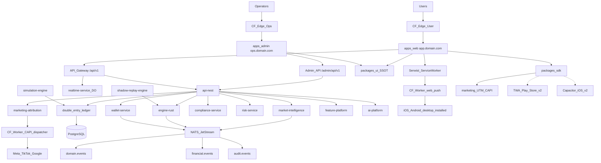
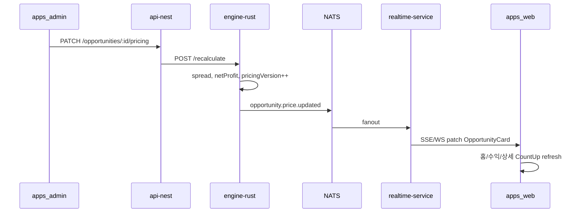
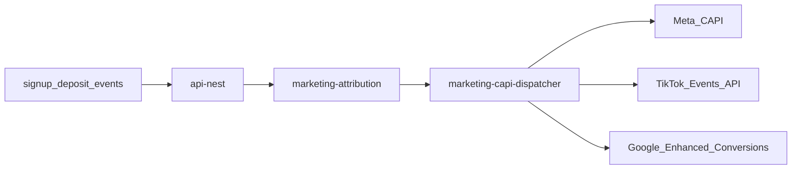
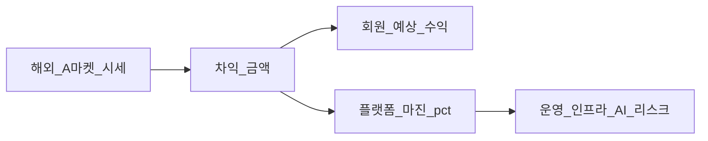
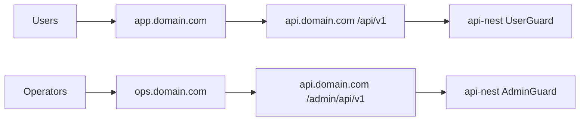
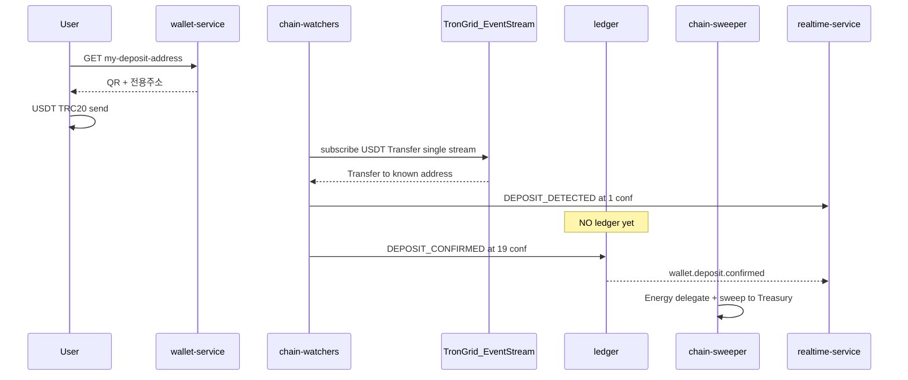
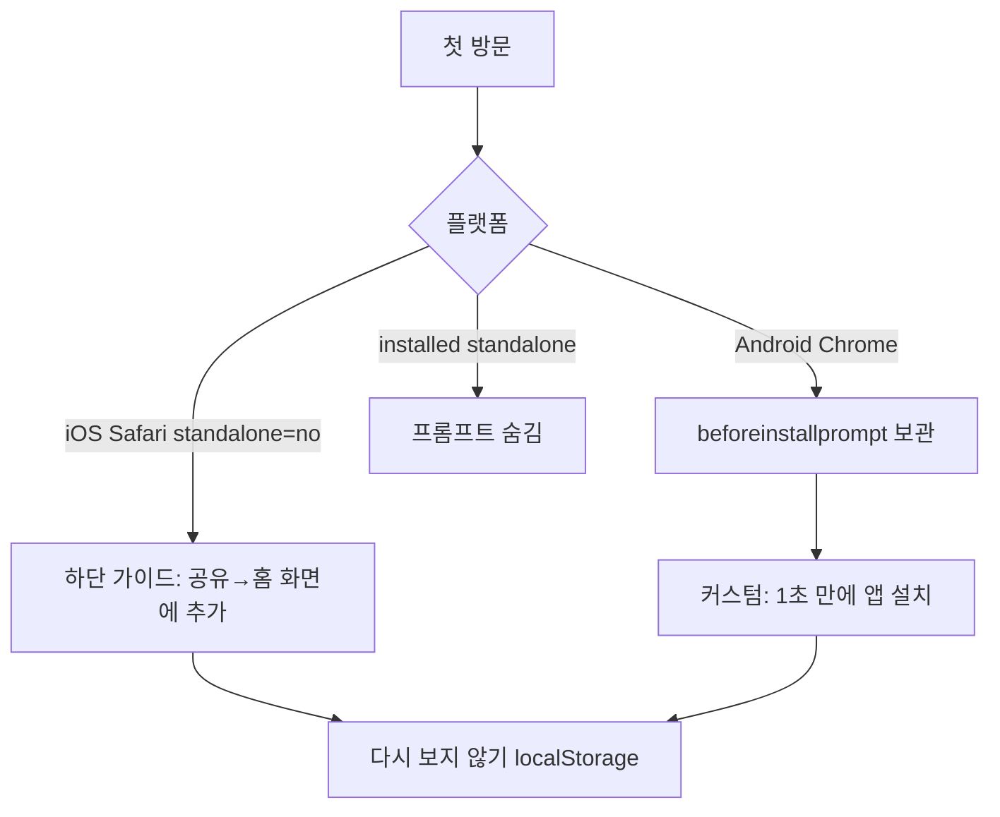

<!-- REL-017-AUTHORITY-STAMP -->
```text
EXECUTION_AUTHORITY = NO
CONTENT_AUTHORITY = NO
HISTORICAL_REFERENCE_ONLY = YES
DO_NOT_EXECUTE = YES
SUPERSEDED_BY = PUTDUK_RELEASE_MASTER.plan.md
```
<!-- /REL-017-AUTHORITY-STAMP -->


# AI Profit OS — 통합 아카이브 (v7.22.25 ARCHIVE pointer)

> ⚠️ **ARCHIVE.** 일상 작업·구현·todo 실행은 ACTIVE `00`~`06` 해시 플랜만.
> **착수 전:** `docs/CONSTITUTION_BOOTSTRAP.md` · **ACTIVE Index:** `ai_profit_os_00_index_a1b2c3d4.plan.md`
> **브랜드:** Consumer+AI=**퍼뜩** · retired=`오늘수익`·`바로번다` · §47.12~14 P/G/S
> **결제 SSOT (ACTIVE 승):** PG사0 · KRW=**Admin 승인/거절 Day-1** · CSV Auto-Recon=L2+ only (본 ARCHIVE 구 Auto-Recon 문구 **무시**)
> **CTA SSOT (ACTIVE v7.22.28 승 · 본문 구문구 무시):** 유저 Primary=`수익 벌기` · domain=`participate` · `이 상품으로 수익 벌기` **금지** · `이 기회로 수익 벌기`=상세 허용 · 유저메인 `매칭 참여` **금지** · `expectedSellDays` 유저0 · CTA후≈1분  
> **Listing SSOT (ACTIVE v7.22.32 승 · 본문 ebay+yahoo Day1 문구 무시):** listing=`ebay` 멀티 marketplace\|admin only · `yahoo_jp`=**영구 FORBIDDEN** · 「야후」카피 0
> **스택:** next@16 · TW4 · pnpm10 · Node22 · Phase0 in-process · CF only
> **수직:** watch + trading_card + **luxury_bag**
> **본문:** 역사 mirror · **편집·동기화 금지** · 충돌 시 ACTIVE 분리 플랜 승
> todo 모델=`[grok-4.5|256K]` / `[composer-2.5|200K]`
>
> | 플랜 | 파일 |
> |------|------|
> | Index | `ai_profit_os_00_index_a1b2c3d4.plan.md` |
> | Money & Chain | `ai_profit_os_01_money_c3d4e5f6.plan.md` |
> | Engine | `ai_profit_os_02_engine_b2c3d4e5.plan.md` |
> | UI & UX | `ai_profit_os_03_ui_ux_d4e5f6a7.plan.md` |
> | Admin & Ops | `ai_profit_os_04_admin_e5f6a7b8.plan.md` |
> | PWA & Native | `ai_profit_os_05_pwa_f6a7b8c9.plan.md` |
> | Infra & Marketing | `ai_profit_os_06_infra_a7b8c9d0.plan.md` |


---

# AI Profit OS — 통합 플랜 (v7.22.25 ARCHIVE pointer · ACTIVE 분리 플랜 우선)

> **제로 목표:** 오류0 · 결함0 · 오차0 · 중복0  
> **편집 충돌 시:** ACTIVE 분리 플랜이 승 · 본 ARCHIVE는 mirror  

> **시세 SSOT:** §0.0 Signup-Ready 6 adapters만  
> **인지 UX SSOT:** §0.0.4 가격비교→마진 · §0.0.5 소액~웨일 · §38.7 Objection4  
> **정산 SSOT:** **§48.13 + §51.2** MATCH_SUCCESS Rule Engine (난수·연출타이머 금지)  
> **잔액·출금 SSOT:** **§49** 원금 유지 · 수익 출금 기본 · 버킷 원장  
> **화면 언어 SSOT:** **§50 + §27** — 유저·어드민 **쉬운 한글만** · 테스트/개발/IT/문서 용어 **화면 노출 0** · 유저 토스트 **한글+이모지**  
> **설정·약관 SSOT:** **§50** PUTDUK다크 고정 · 글자크기 · 약관/개인정보/오픈소스/라이선스 대본  
> **운영사·사업자 SSOT:** **§50.9** PRE-OWNED WATCHES L.L.C · DET **1135431** · 푸터·약관·JSON-LD 단일 schema  
> **브랜드 3층 SSOT:** **§51.1 ADR-002** Platform=AI Profit OS · Consumer app=**퍼뜩** · AI=**퍼뜩** · Legal=§50.9 · retired=`오늘수익`·`바로번다`  
> **DB SSOT:** **§51.1 ADR-001** PostgreSQL **단일 인스턴스**(Supabase-managed 권장) · 이중 Postgres SoT **금지**  
> **결제 SSOT:** **PG사(결제대행) 0** — USDT TRC20 + 원화 **Admin 승인/거절 Day-1**(ACTIVE Money §41.3) · CSV=L2+ · Toss/Nice/PortOne 등 **영구 배제** · (아래 본문 Auto-Recon 구문=역사·무시)  
> **용어 잠금:** **PostgreSQL(ADR-001)** ≠ **PG사/결제대행(§41 PG 0)**  
> **에이전트 SSOT:** **ADR-014** Cursor=플랜 집행기 · 스택 재설계 금지 · Infra §15.0b  
> **Personal AI SSOT:** **§47 + §47.12~14** P/G/S · Adapter=`gemini_free` Day-1 · GitHub=코드만  
> **수직:** 하이엔드 시계 + 트레이딩 카드 + **luxury_bag** · KR 마켓 0

---

## 0.0 시세 소스 잠금 (v7.13) — Signup-Ready + Margin UX + Capital Tiers

**선별 기준 (전부 충족해야 Active):**
1. 공식/문서화된 HTTP API 또는 공개 bulk JSON  
2. **가입만 하면** 또는 **가입 없이** 즉시 키/호출 가능  
3. 신규 키 발급이 막혀 있지 않음  
4. 무료 티어가 **상업 플랫폼 표시를 명시 금지**하지 않음  
5. 한국 마켓플레이스가 아님  

### 0.0.1 ACTIVE — v1 수집 허용 (이 목록만 구현)

| adapter_id | 가입 | 역할 | 수직 | 문서/엔드포인트 | 한도·캐시 규칙 |
|------------|------|------|------|-----------------|----------------|
| `ebay` | developer.ebay.com 무료 | **실호가 Listing** (buy/sell leg) | watch + trading_card | Browse API `item_summary/search` | ~5k calls/day · Redis cache · 유저요청 시 외부호출 금지 |
| `yahoo_jp` | developer.yahoo.co.jp AppID | **실호가 Listing** (JP) | watch + trading_card | Auction Web API search | 일일 한도 준수 · backoff |
| `pokemontcg` | dev.pokemontcg.io 무료 키 | 포켓몬 **카탈로그+참고가** | trading_card (pokemon) | `api.pokemontcg.io/v2` | 키 시 ~20k/day · 메타 캐시 24h · 가격 캐시 ≥1h |
| `ygoprodeck` | **가입 불필요** | 유희왕 **카탈로그+참고가** | trading_card (yugioh) | `db.ygoprodeck.com/api/v7` | IP rate limit · bulk/local cache 권장 |
| `coingecko` | Demo 키 권장(무료) | USDT↔KRW/USD | fx | `api.coingecko.com/api/v3/simple/price` | Demo 월 한도 · **최소 60s~5m 캐시** |
| `frankfurter` | **가입 불필요** | 법정화폐 FX | fx | `api.frankfurter.dev` | 일 단위 고시 · 1h 캐시 |

**역할 분리 (중복0·오차0):**
- **Listing leg (스프레드 계산 입력):** `ebay` + `yahoo_jp` **만**  
- **Card catalog / reference price hint:** `pokemontcg` + `ygoprodeck` **만** (자동 Opportunity 단독 근거 금지 — listing과 매칭될 때만 보조)  
- **FX:** `coingecko` + `frankfurter` **만**  
- 동일 필드를 두 adapter가 쓰지 않음. `PriceObservation.source` enum = 위 `adapter_id` 6개뿐.

### 0.0.2 FORBIDDEN — v1 코드경로 0 (중복·결함 방지)

| 소스 | 제외 이유 |
|------|-----------|
| 번개/중고나라/당근/크림/필웨이 등 KR | 정책 제외 |
| **TCGPlayer API** | 공식 문서: **신규 API 키 발급 중단** |
| **JustTCG Free** | Terms: free = **non-commercial** |
| **PriceCharting API** | 3자 공개/재배포 제한 안내 |
| **Chrono24** | 공식 무료 개발자 API 없음 |
| **Cardmarket 3rd-party** | commercial + 심사 필요 → Day-1 제외 |
| **Scryfall** | Fan Policy: 페이월·단순 재배포 제한 → 유료 Money OS와 충돌 위험 |
| **PSA** | 시세 없음(cert 검증만) → 시세 adapter 아님 (출시 후 옵션) |
| HTML 전수 스크래핑 Day-1 | 안정·약관·쿼터 결함 |

### 0.0.3 파이프라인 (오류0)

```
Asset Master (수동 시드)
  → pokemontcg / ygoprodeck 로 메타 hydrate (카드만)
  → ebay + yahoo_jp 로 Listing/PriceObservation
  → frankfurter + coingecko 로 FX snapshot
  → engine-rust spread (listing×listing or listing×admin_override)
  → Opportunity (출처 수·staleAt·adapter_id 표시)
  → Redis → DO/SSE → 유저 UI
```

**가드:**
- 유저 클릭 경로에서 외부 API 호출 **금지** (캐시 miss 시 stale 표시 또는 백그라운드 refresh 큐)  
- Opportunity 자동 공개: **listing 소스 ≥1** (권장 2: ebay+yahoo) + fresh + 이상치 필터  
- `pokemontcg`/`ygoprodeck` 가격만으로 자동 공개 **금지** (참고가 ≠ 체결 가능 호가)  
- Admin override는 listing 부재 시에도 가능 (출처=`admin`)

### 0.0.4 가격비교 → 마진=내수익 인지 UX (삭제 금지 · SSOT)

**헌법:** 유저는 반드시 **「시장 A 가격 vs 시장 B 가격 → 차이(마진) = 내 예상 수익」** 을 한눈에 이해해야 한다.  
숫자만 크게 보여 주고 비교 근거를 숨기는 UI는 **결함**이다.

#### 필수 비교 블록 `PriceCompareMargin` (모든 Opportunity 표면)

홈 카드·상세·거래확인·완료영수증에 **동일 공식·동일 라벨** (중복 정의 금지, 컴포넌트 1개):

```
┌─ 시세 비교 ─────────────────────────────┐
│ 🛒 매수 시장  eBay US     12,400 USDT   │
│ 🏷️ 매도 시장  Yahoo JP    12,980 USDT   │
│ ─────────────────────────────────────── │
│ 차이(스프레드)              +580 USDT   │
│ 수수료·버퍼 차감             −80 USDT   │
│ ✅ 예상 내 수익(마진)       +500 USDT   │
│ ≈ ₩○○○  · 갱신 방금 전 · 출처 2        │
└─────────────────────────────────────────┘
한줄 카피: "두 시장 가격 차이가 곧 당신의 수익이에요"
```

| 규칙 | 잠금 |
|------|------|
| 매수/매도 시장명 | `adapter_id` → ko 라벨 (eBay, Yahoo 경매 등) **필수 표시** |
| 매수/매도 가격 | listing 실호가 (USDT 환산) · Admin override 시 배지 `운영자 기준가` |
| 마진 | `netProfitUsdt` = sell − buy − fees − riskBuffer − platformMargin |
| 플랫폼 몫 | 상세에만 `플랫폼 수수료/마진` 한 줄 투명 표시 (§38과 충돌 0) |
| 예상 vs 확정 | 참여 전=`예상 내 수익` / 참여 후=`확정 지급` **혼용 금지** |
| 비교 불가 시 | 카드 **자동 공개 금지** 또는 `비교 준비중` + 거래 버튼 비활성 |
| 소스 1개뿐 | 반대 레그는 Admin override 또는 비공개 · 가짜 반대가 생성 **금지** |
| FOMO/티커 | 비교 블록을 가리거나 대체 **금지** |

**스키마 필수 필드** (`OpportunityCard` / `OpportunityPricing`):
- `buyMarketId`, `buyMarketLabelKo`, `buyPriceUsdt`
- `sellMarketId`, `sellMarketLabelKo`, `sellPriceUsdt`
- `grossSpreadUsdt`, `costBufferUsdt`, `platformMarginUsdt`, `expectedProfitUsdt` (유저 마진)
- `compareReady: boolean` — false면 CTA 잠금

**카피 SSOT:** `packages/ui/copy/ko/margin-compare.ts`  
**검증:** `verify:margin-compare-surface` — 홈/상세/확인/영수증 4면 비교블록 100%

#### 0.0.4.1 수수료·버퍼·플랫폼마진 산출 (오차0 · Engine SSOT)

```
grossSpreadUsdt     = sellPriceUsdt − buyPriceUsdt
buyLegFeeUsdt       = buyPriceUsdt  × feePct(buyMarketId)     // default 표
sellLegFeeUsdt      = sellPriceUsdt × feePct(sellMarketId)
feesUsdt            = buyLegFeeUsdt + sellLegFeeUsdt
riskBufferUsdt      = max(grossSpreadUsdt × riskBufferPct, minRiskBufferUsdt)
costBufferUsdt      = feesUsdt + riskBufferUsdt               // UI "수수료·버퍼 차감"
platformMarginUsdt  = max(0, (grossSpreadUsdt − costBufferUsdt) × effectiveMarginPct)
expectedProfitUsdt  = grossSpreadUsdt − costBufferUsdt − platformMarginUsdt
```

| 파라미터 | Day-1 기본 | 편집 |
|----------|------------|------|
| `feePct.ebay` | **0.135** | Admin `/admin/adapters` · fee 표 |
| `feePct.yahoo_jp` | **0.10** | 동일 |
| `feePct.admin` | **0** | override 레그 |
| `riskBufferPct` | **0.05** | Admin |
| `minRiskBufferUsdt` | **1** | Admin |
| `effectiveMarginPct` | 개별 `adminMarginPct` **우선**, 없으면 전역 `platform_margin_pct` | §36 · TOP2 |

**금지:** UI에 하드코딩 수수료 · adapter별 공식 분기 복제(엔진 함수 1곳) · expectedProfit < 0 인 기회 자동 공개  
**CI:** `verify:pricing-formula` — fixture listing → 위 식 ±0.000001 USDT

#### 0.0.4.2 FX Snapshot 합성 (오차0)

| 목적 | Primary | Fallback |
|------|---------|----------|
| USDT→KRW 표시 | CoinGecko `tether`/`krw` | CoinGecko USDT/USD × Frankfurter USD/KRW |
| 법정화폐 교차 | Frankfurter | — |
| USDT/USD | CoinGecko | — |

**규칙:** 매 snapshot에 `fx_snapshot_id` · `sources[]` · `formulaId`(`cg_usdt_krw` \| `cg_usdt_usd__frank_usd_krw`) 저장.  
표시 ≈원화는 **항상 동일 snapshot**. 혼합 시점 환율 금지.  
**CI:** `verify:fx-snapshot-formula`

#### 0.0.4.3 platform_reserve (시뮬 S2 입력)

| 필드 | SSOT |
|------|------|
| 계정 | ledger `ops.platform_reserve_usdt` (USDT) |
| Admin | `/admin/system-control?tab=reserve` · 목표 잔액 설정 · audit |
| Day-1 | **미설정 시 Growth ON 차단** · 시뮬 S2 Fail |
| S2 | `worstCasePlatformDrain ≤ platform_reserve × 0.10` |

### 0.0.5 자본대(소액~웨일) 상품·카테고리 구성

**헌법:** 웨일(≥100k USDT)과 **소액 부업 유저**를 동시에 받는다.  
초고가 시계만 있으면 소액 유저 유입 실패 = 제품 결함.

#### capitalBand (기회·필터·시드 공통 enum)

| capitalBand | 필요 자본 (USDT) | 타깃 | v1 주력 상품 |
|-------------|------------------|------|----------------|
| `micro` | **10 ~ 99** | 첫 입금·연습 | 저가 TCG 싱글, 소액 카드 묶음급 SKU |
| `small` | **100 ~ 999** | 소액 부업 | 중급 포켓몬/유희왕, 소형 Omega 등 저~중가 시계(시드 제한) |
| `mid` | **1,000 ~ 9,999** | 본격 참여 | Rolex 엔트리·중가 레퍼런스, 고등급 카드 |
| `high` | **10,000 ~ 99,999** | 고액 | Rolex/Cartier 핵심, 일부 AP |
| `whale` | **≥ 100,000** | 초고액 | Patek/AP Ultra, 초고가 레퍼런스 |

#### 카탈로그 시드 비율 (v1 잠금 · 오차0)

| 밴드 | 전체 Opportunity 시드 비중 | 비고 |
|------|---------------------------|------|
| micro + small | **≥ 40%** | 소액 유저 필수 물량 |
| mid | **≥ 25%** | |
| high + whale | **≤ 35%** | 하이엔드·웨일 유지하되 독식 금지 |

#### 마켓 UI

필터 칩 (한글):
`전체` `시계` `카드` · `소액(10~)` `입문(100~)` `중급(1천~)` `고액(1만~)` `웨일(10만~)` · `초고가`

홈 기본 정렬:
1. `compareReady=true`
2. 유저 잔액 밴드에 맞는 기회 우선 (잔액 없으면 micro/small 우선)
3. 예상 마진율 / AI pick

입금 UX:
- 소액 퀵버튼: `10` `50` `100` `500` USDT  
- 웨일 퀵버튼: `1만` `5만` `10만` `25만` `50만` USDT  
- 두 그룹 모두 노출 (소액 유저 배제 금지)

온보딩 한 줄:
`시세가 다른 두 시장의 차이만큼 수익이 나요. 소액부터 시작할 수 있어요.`

### 시계 브랜드 (v1 watch)

| tier | 브랜드 | v1 |
|------|--------|-----|
| Ultra | Patek Philippe, Audemars Piguet, Richard Mille(선택) | ✅ |
| Core | Rolex, Cartier, Vacheron(선택) | ✅ |
| Strong | Omega, Tudor(선택) | ✅ partial |

시드 40~80 refs · 호가 소스 = **ebay + yahoo_jp만**

### 카테고리 / Asset Master

| category | 시드 | 메타 | 호가 |
|----------|------|------|------|
| `watch` | 40~80 | 수동 시드 | ebay, yahoo_jp |
| `trading_card` | 20~40 | pokemontcg(포켓몬), ygoprodeck(유희왕), 기타 게임은 수동+ebay | ebay, yahoo_jp |

**카드 매칭:** set+number+lang+finish(+grade) · 퍼지 단독 자동공개 금지.  
**등급/PSA (§51.12):** PSA=시세 adapter 아님 · listing title/caption에서 grade 추출 · **등급 불일치 → compareReady=false** · Admin `/admin/opportunities`에 `gradeMismatch` 배지 · 매칭 실패율 KPI → §51.15

### 웨일 / 초고액 입금 (≥100,000 USDT)

| 항목 | 잠금 |
|------|------|
| 입금 | 저액 강제 캡 금지 · 퀵버튼 1만~50만 USDT |
| tier | standard / premium / **whale** |
| 컴플라이언스 | 출금 KYC + whale 강화 AML |
| Ultra 기회 | requiredCapitalUsdt ≥ 100000 노출 가능 |

**유저 UI 필터:** §0.0.5 자본대 칩 + `전체|시계|카드`

**헌법 파일:**
- `CONSTITUTION/44_SIGNUP_READY_MARKET_SOURCES.md`
- `CONSTITUTION/45_PRICE_COMPARE_MARGIN_UX.md` (= §0.0.4)
- `CONSTITUTION/46_CAPITAL_TIER_CATALOG.md` (= §0.0.5)

---

## 0.1 Trust 잠금 정책 (v7.3)

| 구분 | v7.3 |
|------|------|
| LivePayoutTicker [A] | **`ticker_mode`:** off / live / demo / hybrid (§35 G4) |
| 오늘 지급 합계 [F] | **`counter_mode`:** off / ledger / demo / blended (§35 G4) |
| CountUp (거래·정산 UI) | **`settlement.completed`만** (ledger truth) |
| FOMO Coral | engine staleAt/잔여한도 · G4 ON 시 Admin boost |
| 앱 카드 "수익 확정" | **금지** · "예상 수익" SSOT |
| Product Identity 미주장 | **헌법 잠금 유지** (§1) · G1~G2 copy surface 예외 |
| fake JSON-LD 별점 | **금지** · real reviews only |
| 카지노 sfx / 슬롯 metaphor | **금지** · PUTDUK chime only |

### §35 Growth Conversion (G1~G4 — Admin ON)

| # | 영역 | Admin | 해지/기능 |
|---|------|-------|-----------|
| G1 | **가짜 연혁·공지** | `/admin/growth/content` | `published_at` 소급 · 5년 narrative · synthetic changelog |
| G2 | **입금 유도 FOMO** | `/admin/growth/deposit` | 랜딩·공지·온보딩 과장 copy · social proof |
| G3 | **고액 입금·웨일** | `/admin/growth/whale` | **≥100,000 USDT** VIP Desk · tier ladder · OTC/고액 AML · Ultra 시계 기회 우선 노출 |
| G4 | **실시간 ticker·counter** | `/admin/growth/ticker` | fake/demo ticker · counter blend · demo queue CRUD |

**Ledger 분리 (오차0):** UI demo/blend ≠ ledger SSOT · reconciliation은 **ledger만** · audit log 필수

**유지 (기술·금융 무결성):** double-entry ledger, reconciliation, circuit breaker, KYC/AML, WebAuthn, API 보안.

---

## 0. 총평 및 아키텍트 판정

### 이번 개정에서 흡수한 것 (전부)

| 영역 | 흡수 내용 |
|------|-----------|
| 제품 UX | 수익-first UI, 5탭 고정, USDT+≈원화, 거래 15초형 플로우, 전략 필터 |
| IA | 홈/수익/내거래/지갑/내정보 — 모바일·PC 동일 |
| 기회 모델 | Agnostic Opportunity Card (모든 vertical 동일 카드) |
| 실행 점수 | 판매기간·성공률·자본·위험·AI신뢰도 = moat |
| 어드민 | 12모듈 + **TOP5 원클릭 대시보드** (§9.5) |
| 토스트 | user cute / admin ops / financial surface 3축 SSOT |
| 방어 | 어뷰징·악성유저·오류 대응 매트릭스 100% |
| PWA | standalone·SW·Push·Badge·WebAuthn·햅틱·3초 설치 |
| Store Bridge | TWA(Play) + Capacitor(iOS) — v1 코드 재작성 0 |
| 무료 Bootstrap | Cloudflare Pages/Workers + Upstash — $0 착수 |
| **한글 UI** | 유저·어드민 화면 영어 노출 0% + ko copy SSOT |
| **반응형·성능** | 320px~4K fluid CSS + Device S/A/B tier + 60fps **목표** |
| **어드민 TOP5** | 원클릭 검수·마진·사기방지·돈줄·긴급정지 |
| **마케팅·SEO** | 매체별 랜딩·Server CAPI·UTM→입금·IndexNow |
| **PUTDUK-Fintech** | Deep Obsidian · Tier Motion · G4 ticker/counter |
| **신뢰 교육** | **§38** — USDT 입금 납득 · 원화 비교 · **플랫폼 수익 투명** · 20~70대 ko |
| **어드민 Ops** | **§40** 분리 배포 · RBAC · **§39** 유저별 금융 전수 |
| **USDT 온체인** | **§41+§43** 유저별 TRC20 · **이벤트 스트림** · 1conf UI/19conf ledger · sweeper · **폴링 폐지** |
| **원화 입금** | **§41+§43** 난수 가산금 Auto-Recon · 예외만 Admin · **PG 0** |
| **KYC/출금인증** | **§42** 출금 1회 + **§43** WebAuthn·Email OTP·PIN fallback |
| **가격/원장** | **§43** minProfitUsdt + staleAt≤3s · FOR UPDATE ASC · idempotency_key |
| **시세 소스** | **§0.0 v7.13** Signup-Ready 6 · **가격비교→마진 UX** · **소액~웨일 capitalBand** |
| **마진 인지** | `PriceCompareMargin` 홈/상세/확인/영수증 4면 필수 · compareReady 가드 |
| **Personal AI** | **§47.9** 단일PG SoT · Redis hot · pgvector→Qdrant later · 학습OFF+Eval · GH코드만 |
| **AI 진행 UX** | **§48** 진행실·성공영수증·안전중단 + Admin 진행정책 — **Canon 4면** (사진목업≠픽셀SSOT · ADR-013) |
| **원금·수익 출금** | **§49** 버킷(원금/수익/잠금/연습) · 기본 수익출금 · 원금확인시트 · P/E 전수방어 |
| **설정·약관·쉬운한글·운영사** | **§50+§50.9** 설정IA · 약관4종 · DET 푸터 · 토스트이모지 · 어드민 왕초보 한글 · IT용어0 |
| **v7.22 완성도** | **§51** MATCH_SUCCESS Rule · M0.5 Simulation · Referral · CS/Dispute · Auth · Analytics · Trust Surfaces · Phase0 Bootstrap |
| **v7.22.1 drift 흡수** | **ADR-006/007** — 원화 `payableAmountKrw` · PRICE_STALE=§43 soft match · CTA · 온보딩≤15초 · tier/WS · manifest · Auth · orchestrate≠실체결 |
| **v7.22.2 스펙 완성 흡수** | **ADR-008~010** — 수수료·FX·platform_reserve · v1 orchestrate-only · ROOT_DOMAIN · 출금수수료·minHolding · Resend·R2 KYC · TRX stake · KRW CSV Day-1 · 승률정의 · 내정보3면 · Phase0 in-process · next@15 · DET verifiedAt-only · 2인Confirm필수 · §21 라벨교정 |
| **v7.22.3 성장·공지·브랜드 흡수** | **ADR-011/012** — notice≠campaign · Viral Ladder L1/L2/L3 · clawback·시즌·공유카드 · Brand Kit `packages/ui/brand` · Admin growth 자식탭(보류큐) · R*/N*/B* 전수 · toast REFERRAL_*/CAMPAIGN_* · deep link/CAPI · verify:* 전수 |
| **v7.22.4 목업 거버넌스 흡수** | **ADR-013** — 사진목업=intent archive only · 시각복제 금지 · Canon=PUTDUK+Brand+컴포넌트+구조와이어 · 충돌시 코드/토큰>플랜>Canon>사진 · `verify:mockup-governance` · Cursor rule alwaysApply |
| **v7.22.5 Cursor·PG사0 흡수** | **ADR-014** — Cursor=집행기·스택 재설계 금지 · Phase0=NATS0 · next@15/Nest/Rust/단일Postgres/CF only · **PG사(결제대행)0 확정** · 용어 Postgres≠PG사 · `stack-lock.mdc`+`AGENTS.md` · `verify:pg-module-scan`·`verify:stack-lock` |
| **v7.22.6 그린필드 툴체인 흡수** | **ADR-015** — next@16 · Tailwind v4 · pnpm@10.14 · Node22 · rust-toolchain · Compose/원격 DB · `TOOLCHAIN.md` · `verify:stack-lock` |
| **v7.22.7 소비자 브랜드 개정** | **ADR-002** Consumer=**퍼뜩** (구 `오늘수익`·`바로번다` 폐기) · Platform=AI Profit OS · Legal=§50.9 불변 · Brand Kit SSOT |
| **v7.22.8 에이전트 자동화 흡수** | **ADR-016** — rules·hooks·Husky·`verify:gate`·GH Actions·Docker-less Supabase·cleanup · Vercel 금지 · 8GB Phase0 |

### 점수판 (목표)

| 영역 | 목표 |
|------|------|
| Domain 분리 | 9.7 |
| Money/Ledger | 10 (Double-Entry) |
| UX 일관성 | 9.5 (5탭·카드·버튼 SSOT) |
| Admin Ops | 9.3 |
| Toast/Notification | 9.5 (중복0) |
| Abuse Defense | 9.0 |
| PWA Native Feel | 9.0 (플랫폼 한계 내 max) |
| Store Bridge Readiness | 9.0 |
| Korean-First UI | 9.5 |
| Performance / Responsive | 9.0 (tier degrade 포함) |
| Admin 원클릭 TOP5 | 9.3 |
| Marketing Attribution | 9.0 (consent-first CAPI) |
| SEO / Organic | 8.5 |
| PUTDUK-Fintech Motion | 9.0 (tier + reduced-motion) |
| 초기 실행 가능성 | 8.5+ ($0 bootstrap) |
| 규제/금융 리스크 | 8.5+ |

### 최종 원칙
- **10년 경계는 지금 잠근다.** 처음부터 모든 서비스·카테고리·Growth 스위치를 켜지 않는다.
- **메뉴는 5개만.** 하단/사이드바 추가 탭 금지 (이벤트·친구초대는 내정보 하위).
- **모든 화면 시선 순서 고정:** 예상수익 → 완료시간 → AI신뢰도 → 난이도 → 버튼 → 상품(작게).
- **화면 노출 텍스트 = 쉬운 한국어만.** 코드·로그·API는 영어 가능, **유저·어드민 UI는 ko copy SSOT만** (§27·§50). 테스트/개발/IT/문서 용어 **화면 0**.

---

## 1. Product Identity (이중 레이어 잠금)

### 1.1 대외·헌법 Identity (변경 없음, 강화)
- **정식:** AI 기반 글로벌 가격 발견 및 거래 기회 Data + Settlement OS
- **제공:** 검증된 시장 기회 + 실행 경로 + 정산 인프라
- **미제공/미주장:** AI가 돈을 벌어준다 / 원금·수익 보장 / 투자상품 확정
- **§35 예외:** G1~G4 **표현 surface** — ledger 정산·reconciliation **불변**

### 1.2 앱 UX Identity (신규 잠금)
- **앱 포지션:** "돈 버는 AI 차익 앱" — 사용자는 **얼마 벌 수 있는지**만 본다
- **슬로건 (앱):** "버튼 한 번으로 수익 시작!" (약관에 "예상·리스크" 병기)
- **한글 UI:** 화면 노출 = `packages/ui/copy/ko/*` SSOT만 — **§27 + CONSTITUTION/25**
- **금지 UI 노출:** Spread, Wallet, Deposit, Pending, Ledger, Opportunity 등 **영어·IT·크립토 전문용어 전부**
- **허용 UI 노출:** 예상수익, 거래하기, 충전하기, 출금하기, AI추천, 지급 대기 중

> **22 vs 25 분리 (중복0):** `22` = 레이아웃·5탭·버튼·색상 · `25` = **모든 표시 문자열·번역·금지어·CI**

### 1.3 표현 매핑 (앱 — G4 Admin override)

| UX 표면 | 기본 (live) | G4 Admin |
|---------|-------------|----------|
| 카드/홈 수익 | 예상 +12.45 USDT + ≈원화 | copy §35 G2 |
| 거래 완료 CountUp | settlement amount | ledger only |
| AI 점수 | AI 추천도 | label editable |
| 오늘 지급 [F] | ledger aggregate | `counter_mode` demo/blended |
| LiveTicker [A] | ledger SSE | `ticker_mode` demo/hybrid |

### 1.4 헌법 확장 (22~28)
- `22` — 레이아웃·5탭·시선 순서
- `25` — ko copy·금지어
- `26` — performance·device tier 수치
- `27` — marketing·SEO
- `28` — PUTDUK-Fintech visual·motion (**G4 ticker/counter · §35**)

---

## 2. 전체 아키텍처



---

## 3. 서비스 경계 (최종)

### Domain / Money
- `services/api-nest` — auth, users, opportunity API, settlement, saved-strategies, admin API, **attribution ingest**
- `services/marketing-attribution` — UTM/gclid/fbclid/ttclid 귀속, CAPI orchestration, ROAS projection, consent log
- `services/engine-rust` — spread, ranking, execution-score, HOT/AI_PICK, anomaly, **§48.13 settlement_rule**
- `services/wallet-service` — **§41** 유저별 TRC20 주소 발급 · TronGrid ingest · KRW 입금신청 · withdraw · ledger credit
- `services/risk-service` — abuse score, rate limit, circuit breaker, device fingerprint hook
- `services/compliance-service` — **§42** KYC 출금 1회 게이트 · AML · sanctions · jurisdiction

### Data / AI
- `services/market-intelligence` — Asset, Listing, PriceObservation, HistoricalSpread
- `services/feature-platform` — user/market/opportunity features
- `services/ai-platform` — L1/L2 only, AI PICK score, AI_LOG
- `services/realtime-service` — WS/SSE, ticker, **opportunity.price.updated feed** §36
- `services/simulation-engine` — **§51.4** M0.5 gate · payoutFeasibility · weekly briefing
- `services/shadow-replay-engine` — 24h replay, 오차 0.000% gate

### Apps (분리 배포 §40)
- `apps/web` — 유저 PWA · **`app.{domain}`** · 5탭 only · **admin route 0**
- `apps/admin` — 운영 Ops · **`ops.{domain}`** · 12모듈 · **유저 UI 0**

### Workers (Agnostic Market Adapter + Marketing)
```
workers/
├── marketing-capi-dispatcher   # Meta/TikTok/Google CAPI (CF Worker)
├── ebay-adapter            # §0.0 ACTIVE · Browse API · watch|trading_card
├── yahoo-jp-adapter        # §0.0 ACTIVE · Auction search
├── pokemontcg-adapter      # §0.0 ACTIVE · catalog+ref price (pokemon only)
├── ygoprodeck-adapter      # §0.0 ACTIVE · catalog+ref price (yugioh only)
├── coingecko-adapter       # §0.0 ACTIVE · USDT FX
├── frankfurter-adapter     # §0.0 ACTIVE · fiat FX
├── chain-watchers          # §43 USDT Transfer stream
├── chain-sweeper           # §43 Energy delegate + Treasury sweep
# ❌ KR marketplaces · tcgplayer · justtcg-free · pricecharting-publish · chrono24 · scryfall-paywall · cardmarket-3rd — FORBIDDEN v1
└── temporal-workers
```

---

## 4. Opportunity Card — 단일 SSOT (중복0)

모든 vertical(명품·환율·상품권·중고)은 **동일 스키마·동일 UI 카드**.

### 4.1 스키마 (`schemas/opportunity-card.v1.json`)

```typescript
interface OpportunityCard {
  id: string;
  pricingVersion: number;           // §36 — Admin 저장마다 +1 · participate guard
  pricedAt: ISO8601;
  // 수익-first (UI 1순위) — engine가 §36 pricing에서 계산
  expectedProfitUsdt: Decimal;      // 표시: +12.45 USDT
  expectedProfitKrwApprox: number;    // fx_snapshot_id 기반 ≈ ₩
  fxSnapshotId: string;
  estimatedDurationSec: number;       // 15, 30, 86400...
  aiConfidenceScore: number;          // 0-100 → UI ★ 또는 99%
  difficulty: 'beginner' | 'normal' | 'premium' | 'hot';
  tags: ('instant' | 'high_profit' | 'ai_pick' | 'beginner')[];
  requiredCapitalUsdt: Decimal;
  // §36 가격 (상세·어드민 미리보기)
  pricing?: OpportunityPricing;
  // 실행 가능성 (상세 moat)
  expectedSellDays?: number;
  sellSuccessRate?: number;           // §51.3 — HistoricalSpread 30d **표시 전용** · §48 실행 입력 **금지**
  riskScore?: number;                 // 1-5 stars
  executionMode: 'info' | 'orchestrate' | 'full';  // v1: info+orchestrate만
  executionPlatforms?: string[];      // v1: ebay | yahoo_jp only · Chrono24/KR marketplace FORBIDDEN (§0.0.2)
  // orchestrate SSOT (오차0): 유저 외부 입찰/구매 없음 · §48.13 Rule이 MATCH_SUCCESS면 ledger 정산
  // = listing 신선도·compareReady·policy·simulation 기반 **가격조건 정산** (marketplace fill/재고 체결 확인 ≠ 성공조건)
  // full = later · 실마켓 체결 오케스트레이션 (v1 숨김)
  // 상품 (보조, 작게)
  category: 'watch' | 'trading_card';  // v1 수직 · 마켓 탭 필터
  assetId: string;                    // Asset Master FK
  assetLabel: string;                 // "Rolex Submariner" | "PSA10 Charizard Base #4"
  assetIcon?: string;                 // ⌚ / 🃏
  arbitrageType: 'price' | 'fx' | 'benefit' | 'limited' | 'resale';
  staleAt: ISO8601;
  status: 'available' | 'paused' | 'expired' | 'circuit_open';
}

interface OpportunityPricing {
  // §0.0.4 PriceCompareMargin SSOT (유저 인지 — 삭제 금지)
  buyMarketId: 'ebay' | 'yahoo_jp' | 'admin';
  buyMarketLabelKo: string;           // "이베이" 등
  buyPriceUsdt: Decimal;              // 매수 시장가
  sellMarketId: 'ebay' | 'yahoo_jp' | 'admin';
  sellMarketLabelKo: string;
  sellPriceUsdt: Decimal;             // 매도 시장가
  grossSpreadUsdt: Decimal;           // sell − buy
  costBufferUsdt: Decimal;
  platformMarginUsdt: Decimal;        // 플랫폼 몫 (상세 투명 표시)
  expectedProfitUsdt: Decimal;        // 유저 마진 = 내 수익
  compareReady: boolean;              // false → CTA lock
  capitalBand: 'micro' | 'small' | 'mid' | 'high' | 'whale';
  // Admin / engine
  adminBuyUsdt?: Decimal;
  adminSellUsdt?: Decimal;
  adminMarginPct?: Decimal;
  useAdminOverride: boolean;
  pricingSource: 'adapter' | 'admin' | 'blended';
  lastAdapterSyncAt?: ISO8601;
  lastAdminEditBy?: string;
  // legacy aliases — 코드에서 buyPriceUsdt/sellPriceUsdt/expectedProfitUsdt만 사용 (중복 기입 금지)
}
```

### 4.2 arbitrageType (확장 단위 = 돈 버는 방식)

| Type | v1 | 예 |
|------|-----|-----|
| price | ✅ | Patek/AP/Rolex 등 하이엔드 시계, PSA·TCG 카드 · iPhone/LEGO = **v2+** |
| fx | ✅ | USD/JPY/EUR |
| benefit | v2 | 카드·상품권·쿠폰 |
| limited | ❌ v1 | Nike 등 — **v2+** (adapter 준비 전 코드경로 0) |
| resale | ❌ KR 제외 | 한국 C2C 비교 **영구 제외** · 해외 리세일만 별도 type로 재정의 시 ADR 필요 |

**v1 홈/수익 피드:** `status=available` + adapter live + executionMode≠info-only-blocked 만 노출.

**sellSuccessRate (§51.3):** HistoricalSpread 30d **표시 전용** · 상세 `"과거 유사 조건"` footnote · §48 Rule·AI PICK 입력 **금지** · `verify:no-success-rate-as-rule`

### 4.3 Admin 가격·수익 연동 (§36 SSOT)

**원칙:** 모든 상품(기회) = **Admin 편집 가능 가격** + **유저 UI 즉시 동기화** (홈·수익·상세·거래).

#### 가격 우선순위 (오차0)

```
1) adapter market (자동 수집)
2) admin override (개별 상품) — useAdminOverride=true
3) platform_margin_pct (전역, §9.5.2) — 개별 adminMarginPct 없을 때
→ engine-rust spread/netProfit 재계산 → OpportunityCard.projection
```

#### Admin UI (`/admin/opportunities`)

| 컬럼 (ko) | 편집 | 유저 반영 |
|-----------|------|-----------|
| 상품명 | read | assetLabel |
| 매입가 (USDT) | ✅ | requiredCapital 근사 |
| 판매가 (USDT) | ✅ | — |
| 마진 % | ✅ | platformFee |
| **예상 수익** | preview (engine) | 카드 1순위 숫자 |
| ≈원화 | auto fx | expectedProfitKrwApprox |
| 수집기 시세 | read + [시세 다시 받기] | marketBuy/Sell |
| 상태 | pause/resume | 피드 노출 |

**원클릭:** [가격 적용] · [선택 N건 일괄 적용] · [전역 마진 % 연동] (§9.5.2)

#### 실시간 유저 반영 (<500ms 목표, tier batch §29)



**구독 채널:** `opportunity:{id}` · `feed:home` · `feed:profits` · `feed:ai_pick`

**유저 surface (전부 동일 payload):**
- 홈 [C] Hero · [D] 오늘 가능 수익 합계 · [E] AI 추천
- `/profits` VirtualList 카드 · Radar ping on profit↑
- `/profits/[id]` 상세 · participate modal
- 진행 중 `/trades/{id}/execute` — pricingVersion mismatch → toast 갱신

**Participate guard (§43):** `POST /participate` body에 `pricingVersion` + `minProfitUsdt` — 버전 불일치여도 **예상수익 ≥ minProfitUsdt**면 성공; 미만만 `PRICE_STALE`. `staleAt > 3s` 시세는 엔진 진입 차단.

#### 스키마·서비스

- `schemas/opportunity-pricing.v1.json` — pricing 필드 SSOT
- `services/api-nest` — admin pricing API + audit
- `services/engine-rust` — `/recalculate` · `/recalculate/bulk`
- `packages/sdk/opportunity-stream/` — `useOpportunityPatch()` SSE client
- `packages/ui/components/ProfitAmount.tsx` — pricingVersion key → CountUp re-animate

---

## 5. 사용자 IA — 메뉴 SSOT (변경 금지)

### 5.1 하단 네비 (모바일) — **정확히 5개, 절대 증가 금지**

| 순서 | 아이콘 | 라벨 | route |
|------|--------|------|-------|
| 1 | 🏠 | 홈 | `/` |
| 2 | 🔥 | 수익 | `/profits` |
| 3 | 💼 | 내거래 | `/trades` |
| 4 | 💰 | 지갑 | `/wallet` |
| 5 | 👤 | 내정보 | `/me` |

### 5.2 PC 레이아웃
- **좌측 사이드바:** 동일 5메뉴 (순서·라벨·route 동일)
- **우측 메인:** 카드 3~4열 그리드, 홈=추천+피드+지급현황

### 5.3 홈 `/` — PUTDUK 레이아웃 (5탭·IA 불변)

```
🏠 홈 (PUTDUK Dark)
 ├─ [A] LivePayoutTicker     `ticker_mode` §35 G4 (off/live/demo/hybrid)
 ├─ [B] 내 USDT 잔액 (대형) + ≈원화
 ├─ [C] 🔥 오늘 추천 Hero     카운트다운 (engine staleAt · G4 boost)
 ├─ [D] 💰 오늘 가능한 수익
 ├─ [E] 🤖 AI 추천
 ├─ [F] 🎉 오늘 지급 합계    `counter_mode` §35 G4 (ledger/demo/blended)
 └─ [G] Sticky MotionCTA      ko SSOT **"수익 벌기"** (모바일 only · 기회 바인딩 시 §48 Primary와 동일 action)
```

**Sticky CTA:** `position: sticky; bottom: calc(5tab + safe-area)` — 5탭 가리지 않음 · **PC 전폭 sticky 하단 CTA 금지** (Hero/카드 Primary만)  
**기회 Primary 정식 라벨:** `이 상품으로 수익 벌기` (§7.3 · §48)

### 5.4 수익 `/profits` — Market Radar (선택 뷰)

```
🔥 수익
 ├─ 필터: 🟢 전체 | ⚡ 즉시 | 💎 고수익 | 😊 초보 | 🤖 AI추천 | ❤️ 즐겨찾기
 ├─ [Radar Mode] opportunity.created → green ping (S/A only)
 └─ VirtualOpportunityList
```

`/profits?view=radar` — S/A: ping animation · B: static list only

**저장 전략 필터 (내정보 하위 `/me/strategies`):**
- 💰 소액 고회전 (10~50만원, 당일)
- 🚀 고수익 (100만원+)
- ⚡ 30초 완료
- 🛡️ 안정형
- 🤖 AI 자동 추천

→ 알림: "당신 전략에 맞는 기회 3건"

### 5.5 내거래 `/trades` — PUTDUK Receipt

```
💼 내거래
 ├─ 상단: 오늘 +USDT / 이번달 +USDT (CountUp on load, tier-aware)
 ├─ ReceiptCard: 종이 출력 모션 (S/A) / instant (B) + TronScan 도장
 ├─ 진행 중 · 완료 · 거래 내역 · 월별 수익
```

### 5.6 지갑 `/wallet` — **§49 버킷 표시 SSOT**

```
💰 지갑
 ├─ 🪙 USDT 총액 (크게) + ≈ ₩
 ├─ 분리 표시 (오차0 · 숨김 금지):
 │    · 근무 중 원금 (principal)     ← 참여에 사용
 │    · 출금 가능 수익 (profit)      ← 기본 출금 대상
 │    · 진행 중 잠금 (locked)        ← 거래 중
 │    · 연습 잔액 (practice)         ← 출금·참여 불가 (있으면)
 ├─ 한 줄: "원금은 다음 수익에 쓰이고, 수익만 가져갈 수 있어요"
 ├─ 💵 원화 (동등 노출)
 ├─ ➕ 입금하기 → /wallet/deposit
 ├─ ➖ 출금하기 → /wallet/withdraw  (?mode=profit 기본)
 └─ 📜 입출금·수익 내역 (버킷별 필터)
```

### 5.7 입금 `/wallet/deposit` — **USDT · 원화 둘 다 · USDT 추천 ⭐**

**탭:** `🪙 테더(USDT) ⭐ 추천` | `💵 원화`

**기본 진입:** `?tab=usdt` (deeplink·푸시·온보딩)

#### USDT 탭 — **§41 유저 전용 주소 · 자동 확인**

```
┌─ 🪙 테더(USDT) 입금 ⭐ 추천 ─────────────────┐
│ [QR]  [내 전용 주소 복사]  ← user별 TRC20 §41 │
│ ⚡ 입금 감지→19확정 후 잔액 반영 (§43)         │
│ 🐋 10만 USDT+ 고액 입금 가능 (웨일 지원)       │
│ ── 💡 왜 USDT가 편할까요? (탭하면 펼침) ──      │
│ ① 빠름 — 온체인 확인 후 바로 거래 (원화는 검수) │
│ ② 한 흐름 — 입금→수익→출금이 USDT로 이어짐     │
│ ③ 글로벌 정산 — 해외 시세 OS와 같은 방식       │
│ ── 원화 vs USDT (쉬운 비교) ──                 │
│  원화: 국내 계좌 이체 · 검수 대기 · 통장 기록   │
│  USDT: 내 전용 주소 · **자동 확인** · 빠른 출금 │
│ ── ⚠️ 세금 안내 (면책, 고정 문구) ──            │
│  수익·세금은 개인마다 달라요.                   │
│  원화 입출금은 국내 금융 기록과 연결될 수 있어요.│
│  궁금하면 세무 전문가와 상담하세요.             │
│ [자세히 보기 → /me/guide/usdt]                 │
└────────────────────────────────────────────────┘
```

- **QR · 주소** — `GET /api/v1/wallet/my-deposit-address` · **유저마다 전용 TRC20** (§41)
- **자동 반영** — chain-watchers → ledger → SSE → `DEPOSIT_DETECTED` toast 🎉
- **WhyUsdtCard** — `packages/ui/components/trust/WhyUsdtCard.tsx` · copy `T.trust.usdt.*`
- **금지:** PG·결제모듈 · 공유 단일 입금주소(유저 surface) · "수동 확인 대기"(USDT)

#### 원화 탭 — **§41 PG-free 입금신청 워크플로**

```
┌─ 💵 원화 입금 (서류·PG 없음) ──────────────────┐
│ ① 입금액 입력  [________] 원                   │
│ ② 입금자명     [________] (통장 표시 이름)      │
│ ③ [입금 신청하기]                              │
│ ── 송금 안내 (Admin 대표계좌 §37) ──           │
│  국민은행 123-456-789012  예금주 ○○○           │
│  💳 입금 요청 금액  **{payableAmountKrw}원**   │
│  ⚠️ 위 금액 **그대로** 송금 (끝자리 가산 포함) │
│ ── 상태 ──                                     │
│  ⏳ 검수 대기 / ✅ 반영 완료 / ❌ 거절          │
│ [더 빠른 USDT 입금 보기 →]                     │
└────────────────────────────────────────────────┘
```

- **PG 모듈 0** — 신청 → `payableAmountKrw`(난수 가산) 표시 → 유저 송금 → Auto-Recon/예외만 Admin (§41·§43)
- 은행명 · 계좌 · 예금주 — §37 Admin · SSE 즉시 반영
- **카피 잠금:** 「신청액과 동일」단독 문구 **금지** · 반드시 `payableAmountKrw` 숫자 노출 (§51.8)
- **짧은 안내:** "표시된 입금 요청 금액으로 이체 후 자동/운영자 확인 (통상 10분~24시간)"

**Admin 변경 → 유저:** `wallet.deposit_config.updated` SSE

### 5.8 출금 `/wallet/withdraw` — **§49 수익 기본 · 원금 항상 가능 · §42 KYC 1회**

**탭 (동등):** `🪙 USDT 출금` | `💵 원화 출금`

| 탭 | route | guard |
|----|-------|-------|
| USDT | `/wallet/withdraw/usdt` | **§42 KYC** · WebAuthn · **§49 mode+bucket** · tier cap |
| 원화 | `/wallet/withdraw/krw` | **§42 KYC** · WebAuthn · **Admin 승인** · **§49 mode+bucket** · tier cap |

**출금 모드 (§49 · 기본값 잠금):**

| mode | 기본 | 차감 버킷 | UX |
|------|------|-----------|-----|
| `profit` | **✅ 기본 진입** | `profit` only | 카드 강조 · 상한=출금가능수익 |
| `principal` | 접힘/고급 | `principal` | **확인 시트 필수** (기회비용 비교) |
| `combined` | 접힘 | profit 우선 후 principal | 확인 시트 필수 · 명세 분리 |

**금지:** 원금 출금 메뉴 숨김 · 고객센터-only 원금출금 · 원금출금 시 수익 몰수  
**고정 카피:** `원금은 언제든 출금할 수 있어요. 보통은 수익만 가져가요.`

**§42 KYC 게이트 (출금만 · 1회):**
```
유저 [출금하기] 클릭
  → kycStatus !== 'approved'
  → toast: "🔐 출금하려면 본인 확인이 필요해요! 1번만 하면 돼요 😊"
  → 800ms 후 router.push('/me/kyc?return=/wallet/withdraw?mode=profit')
  → /me/kyc 에서 신청 → Admin 승인 → 이후 출금 **재요청 없음**
```

- USDT: TRC20 주소 입력 · TronScan 추적
- 원화: 등록 계좌 · 출금액 · 승인 대기 toast
- **거래(participate)는 KYC 불필요** — **principal(+명시 merge)** · circuit · pricingVersion
- 상세 SSOT → **§49**

### 5.9 내정보 `/me`

```
 👤 내정보
 ├─ 👥 친구 초대              ← /me/invite (§51.5 Viral Ladder)
 ├─ 🎁 이벤트·공지            ← /me/events (notice|campaign · Growth OFF면 campaign 빈 안내)
 ├─ 🔔 알림 설정
 ├─ 💾 내 전략                ← /me/strategies
 ├─ 📞 고객센터              ← §51.6 `/me/support` 티켓·FAQ·분쟁
 ├─ 📖 이용안내
 │   ├─ /me/guide/usdt        ← 왜 테더로 충전하나요?
 │   ├─ /me/guide/revenue     ← 플랫폼은 어떻게 운영되나요?
 │   ├─ /me/guide/faq         ← 자주 묻는 질문
 │   └─ /me/guide/principal   ← 원금과 수익 출금
 ├─ 🪪 본인 확인             ← §42 (출금 1회)
 └─ ⚙️ 설정                  ← **§50.1 전수**
```

#### 5.9.1 친구 초대 `/me/invite` (§51.5 Viral Ladder)

```
👥 친구 초대
 ├─ Viral Ladder 진행: L1 가입 → L2 첫충전 → L3 첫수익 (한국어 3단)
 ├─ 내 코드 · 공유 링크 (Web Share / 카카오 / 복사) · 일 공유 한도 표시
 ├─ 초대 현황: 가입 N · **유효(L2+) N** · 보류 N · 보너스 합계(프로모→profit)
 ├─ 티어: 씨앗/불꽃/로켓/고래메이커 · 시즌 리더보드(마스킹)
 ├─ 공유 카드 미리보기 4종 · [자랑하기]
 ├─ 안내: 친구 L1 보너스=**연습** · 내 L2/L3=**수익 버킷(프로모)** · 어뷰징 시 회수
 └─ 상태 toast: 보류/회수/한도 — §8.2 REFERRAL_*
```

**딥링크:** `/r/{code}` · 설치 후 sticky 90d · 수동 코드 입력 1회  
**성공 영수증 Secondary:** 「친구에게 자랑하고 보너스」→ share (Primary=출금/지갑 유지)

#### 5.9.2 이벤트·공지 `/me/events` (§51.5b)

```
🎁 이벤트·공지
 ├─ 탭 A 공지(notice): 운영 사실만 · 보상/확정수익 문구 0 · 읽음 표시
 ├─ 탭 B 이벤트(campaign): Growth ON + live만 · 예산/기간/CTA allowlist
 ├─ Growth OFF 또는 campaign 0: "진행 중인 이벤트가 없어요" (fake 카드 금지)
 ├─ 홈 배너: notice|campaign 각 1 · dismiss persist · G4 ticker와 슬롯 분리
 └─ claim 실패: 종료/예산마감/중복 → CAMPAIGN_* toast (서버 권위)
```

**금지:** G1 FOMO seed를 notice 본문에 합치기 · campaign을 notice로 위장 · demo 금액을 이벤트 보상으로 표시

#### 5.9.2b Brand Kit Surface (중복0 · ADR-011)

> **SSOT 경로:** `packages/ui/brand/` · 소비자 표기 **퍼뜩** · 코드명 AI Profit OS  
> **필수 에셋:** app-icon-512 · maskable · splash · og-default · share-card×4 · favicon · wordmark light/dark  
> **생성 파이프라인:** AI/디자인 산출 → 리뷰 → `packages/ui/brand/manifest.json` 등록 → `verify:brand-assets`  
> **금지:** 런타임 AI 생성 아이콘 · 미등록 에셋 CDN · Chrono24/타사 로고


#### 5.9.3 내 전략 `/me/strategies`

```
💾 내 전략
 ├─ CRUD: 소액고회전 / 고수익 / 30초 / 안정 / AI추천 (필터 프리셋)
 ├─ 알림 토글 → push `strategy_match`
 └─ [이 전략으로 수익 보기] → /profits?strategy=
```
### 5.10 설정 `/me/settings` — **§50.1 SSOT (v1)**

```
⚙️ 설정
 ├─ 계정 · 보안
 │   ├─ 내 프로필
 │   ├─ 로그인 보안 (지문·얼굴·비밀번호)
 │   ├─ 본인 확인 상태
 │   ├─ 로그아웃
 │   └─ 회원 탈퇴 (깊은 곳 · 확인 2회)
 ├─ 알림
 │   ├─ 앱 알림 켜기/끄기
 │   ├─ 수익 기회 알림
 │   ├─ 충전·출금 알림
 │   └─ 공지 알림
 ├─ 보기
 │   ├─ 글자 크기: 보통 / 크게     ← v1 핵심
 │   ├─ 화면 스타일: 어두운 화면(고정)  ← 다크/밝은/시스템 토글 **v1 금지**
 │   └─ (선택) 움직임 줄이기 안내 — 휴대폰 설정 연동
 ├─ 내 돈 관련
 │   ├─ 기본 출금: 수익만 (§49 고정 권장)
 │   ├─ 기본 충전 탭: 테더 / 원화
 │   └─ 출금 주소·계좌 관리
 ├─ 약관과 정보 (§50.3 대본)
 │   ├─ 이용약관
 │   ├─ 개인정보 처리방침
 │   ├─ 오픈소스 고지
 │   └─ 라이선스·저작권
 └─ 앱 정보: 버전 · 고객센터
```

---

## 6. 화면별 UI/UX SSOT

### 6.1 시선 순서 (모든 카드·상세 공통)

1. 💰 **예상수익** (가장 크게, `--profit-emerald`)
2. ⏱️ **완료 예상 시간**
3. 🤖 **AI 추천도** (보라)
4. 😊 **난이도/태그**
5. 🟢 **이 상품으로 수익 벌기** (파랑, Primary · §7.3/§48)
6. 📦 **상품명** (작게, 하단)
7. 📎 **마진 footnote** (§38 — "포함 운영 수수료", 작게)

### 6.2 PUTDUK-Fintech 색상 · 타이포 · 반응형 SSOT

> **테마:** User App = **PUTDUK Dark default** · Admin = **Ops Light default** (가독성)  
> **SSOT:** `packages/ui/tokens/putduk.ts` + `CONSTITUTION/28`

| 역할 | token | hex | 용도 |
|------|-------|-----|------|
| 배경 | `--bg-obsidian` | `#090A10` | Deep Obsidian (pure #000 ❌) |
| 표면 | `--surface-elevated` | `#12131A` | 카드·시트 |
| 수익 | `--profit-emerald` | `#00FF87` | Neon Profit Emerald |
| FOMO/긴급 | `--flash-coral` | `#FF2E63` | **실제** 마감·잔여한도만 |
| 프리미엄 | `--amber-gold` | `#F59E0B` | 명품·고수익 태그 |
| USDT | `--mint-teal` | `#00D294` | 지갑·테더 |
| Primary CTA | `--action-neon` | `#1A56FF` | Pulse glow base |
| AI | `--ai-violet` | `#8B5CF6` | AI 추천도 |
| 본문 | `--text-body` | clamp | fluid §29 |
| 수익 숫자 | `--text-profit` | clamp | CountUp target |

**금지:** 카지노 레드/골드 팔ETTE 별도 · pure black `#000` · 수익=빨강

**상세 모션:** §33 · **성능 tier:** §29 (중복 정의 ❌)

### 6.3 UI 카피 (헌법 준수)
- 영어·IT 전문용어 화면 노출 ❌ (§25)
- **수익 확정 금지** — "예상 수익" + 리스크 tooltip (§35 G2는 **공지·랜딩·온보딩**만 예외)
- 차트/호가 등 UX 금지 (§22 레이아웃 유지)

### 6.4 온보딩 (5 step, ≤15초 · §19 게이트 동일)

```
1 😊 "AI가 전 세계 시세 차이에서 수익 기회를 찾아드려요"
2 🪙 "충전은 테더(USDT)가 가장 빨라요 — 입금→거래→출금 한 번에"
   [왜 USDT? 10초 설명] → §38 미니카드 (skip 가능)
3 💰 "원하는 거래를 고르고 [이 상품으로 수익 벌기]만 누르세요"
4 🎉 "수익은 내 지갑(USDT)으로 지급돼요"
5 [ 시작하기 ] → /wallet/deposit?tab=usdt (또는 홈)
```

**온보딩 §38 톤:** 20대=짧은 bullet · 40~50대=비교표 · 60~70대=큰 글씨+한 줄씩 (`--text-body` fluid)

---

## 7. 버튼 구성 SSOT (전수)

### 7.1 Global

| 버튼 | 위치 | action | guard |
|------|------|--------|-------|
| 시작하기 | 온보딩 | → `/` | 1회 |
| 시작하기 | 홈 Hero | → `/profits/{id}` | — |

### 7.2 홈

| 버튼 | action |
|------|--------|
| 시작하기 (Hero) | opportunity detail |
| 카드 탭 | `/profits/{id}` |

### 7.3 수익 · 상세

| 버튼 | label | action | guard |
|------|-------|--------|-------|
| Primary | **이 상품으로 수익 벌기** | POST `/opportunities/{id}/participate` → `/trades/{id}/execute` (§48) | balance, circuit, **pricingVersion+minProfitUsdt (§43)**, staleAt≤policy, rate limit (**KYC ❌ §42**) |
| Secondary | ❤️ 즐겨찾기 | toggle favorite | auth |
| Tertiary | 📋 실행 경로 보기 | expand platforms | — |

**필수 배지(Primary 인근):** `직접 사지 않아요` · `직접 입찰·판매 안 함` (§48.2)  
**잔액 부족 시 Primary 대체:** `잔액 충전 후 참여` → `/wallet/deposit?tab=usdt`

### 7.4 거래 진행 `/trades/{id}/execute` — **§48 SSOT (목업 3면)**

> 구 `AI 거래중...` 한 줄 UI **폐기**. 아래 3화면으로 **100% 대체**.

| 상태 | 화면 (§48) | Primary | Secondary |
|------|------------|---------|-----------|
| `running` / `requeue` | **AI 진행실** | (없음·자동) | `그만두기` (orchestrate cancel) |
| `success` | **수익 들어옴 영수증** | `확인 · 지갑 보기` → `/wallet` | `다른 상품 보기` → `/profits` |
| `safe_stop` (시세변동·미달 등) | **안전하게 멈춤** | `비슷한 상품 보기` | `홈으로` |
| `failed` (시스템) | 안전중단 변형 또는 toast | `고객센터` / `홈으로` | — |

### 7.5 지갑 · 입출금

| 버튼 | action |
|------|--------|
| ➕ 입금하기 | `/wallet/deposit` (USDT·원화 탭) |
| 🪙 USDT 입금 | `/wallet/deposit?tab=usdt` |
| 💵 원화 입금 | `/wallet/deposit?tab=krw` |
| ➖ 출금하기 | `/wallet/withdraw` |
| 🪙 USDT 출금 | `/wallet/withdraw/usdt` |
| 💵 원화 출금 | `/wallet/withdraw/krw` |
| 📋 주소/계좌 복사 | clipboard + toast |

### 7.6 내정보

| 버튼 | action |
|------|--------|
| 친구 초대 | share link + referral code |
| 알림 설정 | toggle matrix |
| 전략 저장 | CRUD saved-strategies |

### 7.7 버튼 whitelist 원칙
- Primary 1개/화면 (한 화면 = 한 행동)
- Destructive = Confirm modal 필수
- Disabled 시 toast로 이유 (침묵 실패 금지)

---

## 8. 토스트 · 알림 SSOT (중복0)

### 8.1 3축 분리 (혼용 금지)

| Surface | Resolver | Tone | visibleToasts |
|---------|----------|------|---------------|
| User error | `resolveToastDetail` | **쉬운 한글 + 이모지 1~2 필수** (§50.2) | 1 |
| User success (금융) | `toastSurfaceMessage` | 쉬운 한글 + 이모지 1~2 + 금액 합성 | 1 |
| Admin | `resolveAdminToastDetail` | **왕초보 한글 평문** · 이모지 ≤1 · IT용어 0 | 2 |

**금지:** `CODE_MESSAGES`를 cute로 rewrite · ErrorState에 toast resolver 연결 · 유저 토스트에 영문 코드·HTTP·스택 · 어드민 토스트에 DLQ/API/Error 등

### 8.2 User Toast Catalog (필수)

| code | toast (KO) | trigger |
|------|------------|---------|
| `INSUFFICIENT_BALANCE` | 😅 USDT가 부족해요. 입금 후 다시 시도해 주세요 | participate |
| `KYC_WITHDRAW_REQUIRED` | 🔐 출금하려면 본인 확인이 필요해요! 1번만 하면 돼요 😊 | withdraw tap · **→ /me/kyc auto** |
| `KYC_PENDING` | ⏳ 본인 확인을 검토 중이에요. 잠시만 기다려 주세요 🙏 | kyc submitted |
| `KYC_REJECTED` | 😔 본인 확인이 반려됐어요. 다시 신청해 주세요 | kyc rejected |
| `KYC_APPROVED` | ✅ 본인 확인 완료! 이제 출금할 수 있어요 🎉 | admin approve |
| `CIRCUIT_OPEN` | ⏸️ 잠시 거래를 멈췄어요. 곧 다시 열릴게요 | any money |
| `RATE_LIMITED` | 🐢 잠깐만요! 너무 빠르게 눌렀어요 | click spam |
| `OPPORTUNITY_EXPIRED` | ⏰ 이 기회는 방금 마감됐어요 | stale participate |
| `EXEC_SAFE_STOP_PRICE` | 🛡️ 가격이 움직여서 이번엔 안전하게 멈췄어요 | execute PRICE_MOVED |
| `EXEC_SAFE_STOP_MIN` | 🛡️ 예상보다 적어져서 진행하지 않았어요 (잔액 그대로) | execute BELOW_MIN_PROFIT |
| `EXEC_SUCCESS` | 🎉 수익이 들어왔어요 | settlement.completed |
| `EXEC_CANCELLED` | 중단했어요. 잔액은 그대로예요 | user cancel |
| `WITHDRAW_PROFIT_OK` | 🎉 수익 출금을 신청했어요 | profit withdraw |
| `WITHDRAW_PRINCIPAL_WARN` | 원금을 빼면 다음 기회 참여가 줄어들 수 있어요 | principal confirm |
| `INSUFFICIENT_PROFIT` | 출금 가능한 수익이 부족해요 | profit mode |
| `INSUFFICIENT_PRINCIPAL` | 근무 중 원금이 부족해요. 충전 후 참여해 주세요 | participate |
| `PRACTICE_NOT_WITHDRAWABLE` | 연습 잔액은 출금할 수 없어요 | practice |
| `MERGE_PROFIT_OK` | 수익을 원금에 합쳤어요. 다음 기회에 바로 쓸 수 있어요 | merge |
| `DEPOSIT_DETECTED` | 👀 USDT {amount} 입금 감지! 확정까지 잠시만요 | §43 1 confirmation (잔액 미반영) |
| `DEPOSIT_CONFIRMED` | 🎉 USDT {amount} 입금 확정! 바로 거래할 수 있어요 | §43 19 confirmations + ledger |
| `KRW_DEPOSIT_SUBMITTED` | 📝 원화 입금 신청 접수! 송금 후 확인해 드릴게요 | krw request |
| `KRW_DEPOSIT_APPROVED` | ✅ 원화 입금이 반영됐어요! | admin approve |
| `WITHDRAW_SUBMITTED` | 📤 출금 요청을 받았어요 | withdraw |
| `TRADE_COMPLETE` | 🎉 +{amount} USDT 지급 완료! | settlement |
| `NETWORK_ERROR` | 📡 연결이 불안정해요. 다시 시도해 주세요 | fetch fail |
| `SESSION_EXPIRED` | 🔐 다시 로그인해 주세요 | 401 |
| `ACCOUNT_FROZEN` | ⏸️ 계정이 일시 정지됐어요. 고객센터에 문의해 주세요 | admin freeze |
| `ACCOUNT_BANNED` | 🚫 이용이 제한된 계정이에요 | admin ban |
| `WITHDRAW_BLOCKED` | 📤 출금이 일시 중지됐어요 | admin restrict |
| `BALANCE_ADJUSTED` | 💰 잔액이 조정됐어요 | admin ledger adjust |
| `DEPOSIT_CONFIG_UPDATED` | 🔄 입금 정보가 업데이트됐어요 | SSE (optional toast) |
| `MIN_HOLDING` | ⏳ 원금은 충전 후 {hours}시간이 지나야 출금할 수 있어요 | §11.2 principal/combined |
| `WITHDRAW_FEE_HINT` | 💸 이체 수수료 {fee} USDT가 빠져요 | withdraw confirm |
| `REFERRAL_BOUND` | 🤝 초대가 연결됐어요! | code bind L1 |
| `REFERRAL_L2_PENDING` | ⏳ 친구 첫충전 보너스를 확인 중이에요 | L2 hold window |
| `REFERRAL_L2_RELEASED` | 🎉 초대 보너스가 수익에 들어왔어요 | L2 release |
| `REFERRAL_CLAWBACK` | ↩️ 어뷰징으로 초대 보너스가 회수됐어요 | wash/clawback |
| `REFERRAL_HELD` | ⏸️ 초대 보너스가 잠시 보류됐어요 | risk hold |
| `REFERRAL_CAP` | 📊 오늘 초대 한도에 도달했어요 | cap/day |
| `REFERRAL_SHARE_LIMIT` | 🐢 공유는 하루 {n}번까지예요 | share rate |
| `CAMPAIGN_CLAIM_OK` | 🎁 이벤트 보너스를 받았어요 | campaign claim |
| `CAMPAIGN_ENDED` | ⏰ 이 이벤트는 종료됐어요 | claim after end |
| `CAMPAIGN_BUDGET` | 📭 이벤트 예산이 마감됐어요 | budget_exhausted |
| `CAMPAIGN_DUP` | ✋ 이미 받은 보너스예요 | idempotent claim |
| `NOTICE_PUSH` | 📢 새 공지가 있어요 | notice live+push |

### 8.3 Push / In-app Notification

| category | title 예 | href |
|----------|----------|------|
| `ai_pick` | 🤖 AI 추천 — +18.5 USDT | `/profits/{id}` |
| `strategy_match` | 💾 내 전략에 맞는 기회 3건 | `/profits?strategy=` |
| `deposit` | 🎉 입금 확인 | `/wallet` |
| `withdraw` | 📤 출금 처리 중/완료 | `/wallet/history` |
| `promo` | 🎁 이벤트 (campaign live · Growth ON) | `/me/events?tab=campaign` |
| `notice` | 📢 공지 | `/me/events?tab=notice` |
| `referral` | 🤝 초대 보너스 / 보류 안내 | `/me/invite` |

### 8.4 중복0 기술

- DB: `UNIQUE (user_id, source_event_id) WHERE source_event_id IS NOT NULL`
- Insert 23505 → re-select existing (race defense)
- Sonner: user `visibleToasts={1}` id single-flight
- Push + In-app + Toast 동시: **1 source_event → 1 toast OR 1 in-app** (정책 테이블)

---

## 9. Admin — IA 및 구성 SSOT

### 9.1 Admin 사이드바 (12모듈) — **화면 라벨 = 한국어 SSOT**

| # | 화면 라벨 (ko) | route (코드, 비노출) | 내부 서비스 | 역할 |
|---|----------------|----------------------|-------------|------|
| 1 | 📊 한눈에 보기 | `/admin` | dashboard | 오늘 정산·활성 기회·긴급 상태 |
| 2 | 🔥 수익 기회 관리 | `/admin/opportunities` | opportunities | **§36 가격·마진·수익** · 등록·일시정지 |
| 2b | ⚙️ 진행 정책 | `/admin/execution-policy` | execution-policy | **§48** 실조건≠연출 · 오늘 결과 KPI · **난수성공률 UI 금지** · audit |
| 3 | 🔌 해외 시세 수집기 | `/admin/adapters` | adapters | 수집기 연결·상태 |
| 4 | 💰 입출금 관리 | `/admin/wallet` | wallet | **§37 입금설정** · 검수 · 출금승인 |
| 5 | 📒 입출금·정산 장부 | `/admin/ledger` | ledger | **§39** 전역·유저별 원장 · reconciliation |
| 6 | 👤 회원 관리 | `/admin/users` | users | **§37·§39** · 편집·잔액·차단·**금융전수** |
| 7 | 🛡️ 사기·이상 거래 방지 | `/admin/risk` | risk | 이상 징후·제재 |
| 8 | ⚖️ 법적 확인·제재 | `/admin/compliance` | compliance | 제재국가·감시 |
| 9 | 🚨 긴급 정지 | `/admin/system-control` | circuit | 전체·부분 정지 |
| 10 | 🤖 AI 분석 기록 | `/admin/ai-logs` | ai-logs | AI 판단·수정 이력 |
| 11 | 📣 이벤트·프로모션 | `/admin/growth` | growth | **기본 OFF** · §35 G1~G4 탭 |
| 12 | 📋 운영 기록 | `/admin/audit` | audit | 관리자 행동 로그 |

**IA 잠금 (중복0):** 톱레벨 모듈 수는 **12 유지**. `2b 진행 정책`은 모듈2 **하위·사이드바 자식 링크**(목업의 독립 활성 항목과 동일 시각). route만 `/admin/execution-policy`로 고정 — **13번째 톱레벨 금지**.

**금지 (어드민 화면 노출):** 영어 IT·개발·테스트·문서 용어 **전부** (Market Adapters, DLQ, NATS, Temporal, Feature Store, Execute Rerun, Webhook, Staging, QA, Mock, API, JSON, Stack trace, successRatePercent, 당첨확률 등). 표시는 **쉬운 한글 라벨만** (§27.5 · §50.4).

**어드민 액션 버튼 ko 예:**
- Execute Rerun → **오류 건 다시 시도하기**
- Approve Withdraw → **출금 승인하기**
- Pause Opportunity → **이 기회 잠시 멈추기**
- Open Circuit → **긴급 정지 켜기**

### 9.2 Admin ↔ User 대응 (오차0)

| User 화면 | Admin 관리 |
|-----------|------------|
| 홈/수익 카드 **예상수익** | `/admin/opportunities` §36 pricing |
| 홈/수익 카드 (목록) | opportunities + adapters |
| 이 상품으로 수익 벌기 → AI 진행실/성공/안전중단 | **§48** execution-policy + participate + settlement |
| 지갑 입출금 | wallet + **§37 deposit-config** + ledger + compliance |
| 입금 QR/원화계좌 | `/admin/wallet?tab=deposit-settings` · `krw-pending` |
| USDT 전용주소 | 코드 자동발급 §41 · Admin 조회 `/admin/users/:id` |
| 회원 프로필·잔액·차단 | `/admin/users/:id` §37 |
| **유저 입금·출금·시세차익** | `/admin/users/:id/finance` §39 |
| 오늘 지급 ticker | `ticker_mode` + `counter_mode` §35 G4 |
| AI 추천도 | ai-logs + feature-platform |
| Circuit toast | system-control |

### 9.3 Admin 버튼 (핵심)

| 버튼 | Confirm | audit event |
|------|---------|-------------|
| 기회 일시정지 | reason≥10 | `admin.opportunity.paused` |
| **가격 적용** | preview 확인 | `admin.opportunity.pricing.updated` |
| **일괄 가격 적용** | Confirm + N건 | `admin.opportunity.pricing.bulk` |
| 출금 승인/거절 | ✅ | `admin.withdraw.decided` |
| 유저 동결 | reason≥10 | `admin.user.frozen` |
| 긴급 정지 ON | reason≥10 | `admin.circuit.opened` |
| Growth 스위치 ON | simulation pass + budget | `admin.growth.enabled` |
| Adapter onboarding | schema validate | `admin.adapter.registered` |

### 9.4 Admin 토스트 (ops tone)

- 성공: `✅ 저장했습니다`
- 실패: `{operation} 실패 — {plain_reason}` (enum 금지)
- 긴급: `⚠️ 긴급 정지가 켜졌습니다. 사용자 거래가 차단됩니다`

### 9.5 왕초보 운영 — 원클릭 TOP 5 (무인 **보조** 대시보드)

> **SSOT 화면:** `/admin` (📊 한눈에 보기) **상단 5위젯** — 12모듈 route **추가 없음** (중복0)  
> **전역 검색바 (§39):** user_id · 휴대폰 · tx_hash · 입금자명 → `/admin/users/:id/finance`  
> **주의:** "무인" = AI·규칙 **자동 분류 + 원클릭 승인**. 고액·원화·출금은 **사람 Confirm 필수** (compliance).

| # | TOP5 (ko) | 위젯 | 연결 route | 원클릭 액션 |
|---|-----------|------|------------|-------------|
| 1 | **입출금 검수함** | 대기 N건 카드 | `/admin/wallet?tab=review` | 승인하기 / 거절하기 + TronScan 링크 |
| 2 | **시세·마진 조절판** | 🟢/🔴 수집기 + **전역 마진 %** | `/admin/adapters` | 마진 저장 → **§36 전 상품 재계산** |
| 3 | **사기·매크로 방지망** | 임시동결 카드 큐 | `/admin/risk?tab=queue` | 동결 해제 / 영구 제재 |
| 4 | **돈줄 전광판** | 순수익·지급·광고 | `counter_mode` §35 + attribution |
| 5 | **긴급 정지** | 🚨 마스터 스위치 | `/admin/system-control` | 긴급 정지 켜기 (reason≥10) |

#### 9.5.1 TOP1 — 입출금 검수함 (상세)

```
┌─ 입출금 검수함 ──────────────── 3건 대기 ─┐
│ 🪙 USDT 자동완료     12건  (오늘) §41      │
│ 💵 원화 입금 대기     1건  [승인] [거절] §41│
│ 📤 고액 출금 대기     2건  [승인] [거절]   │
│ 🔗 TronScan 확인     (각 행 링크)          │
└──────────────────────────────────────────┘
```

- USDT 온체인: chain-watchers **이벤트스트림 → 19conf ledger** → 어드민은 **예외·분쟁·집금 모니터링만**
- 원화: 유저 **입금신청** → 대표계좌 송금 → **대기목록** → 초보 운영자 [승인] · **PG 0**
- TronScan: `wallet.withdraw.tx_hash` → 마스킹 + 원클릭

#### 9.5.2 TOP2 — 시세 수집기 · 마진 조절판

| UI | 데이터 |
|----|--------|
| 🟢 정상 / 🔴 멈춤 | adapter.last_success_at vs TTL |
| 마진율 입력 | platform_margin_pct → engine **bulk recalc** §36 |
| 0% 이벤트 토글 | growth.zero_margin (budget+circuit) |
| 개별 상품 override | `/admin/opportunities` adminMarginPct 우선 |

**버튼:** [마진 저장] → 전 상품 예상수익 재계산 + SSE push · [0% 이벤트 ON/OFF]

#### 9.5.3 TOP3 — 사기 방지망

| 자동 탐지 | 카드 표시 |
|-----------|-----------|
| 동일 IP 다계정 | "같은 Wi-Fi에서 N계정" |
| 매크로 연타 | "1분에 N번 거래 시도" |
| 비정상 패턴 | AI L2 score + rule id (화면=한글) |

**액션:** [임시 동결] [풀어주기] [영구 제재] — reason≥10

#### 9.5.4 TOP4 — 돈줄 전광판

| 지표 | 소스 (오차0) |
|------|--------------|
| 오늘 플랫폼 순수익 | ledger 또는 demo blend (§35 G4) |
| 오늘 유저 지급 총액 | ledger 또는 demo blend |
| 갱신 | SSE · tier batch |

#### 9.5.5 TOP5 — 긴급 정지 (0.1초 목표)

- 트리거 UI: `/admin` 고정 🚨 + `/admin/system-control` 상세
- 목표 latency: **100ms** (risk-service circuit, 기존 §10.3)
- 도메인별: participate / withdraw / deposit / all
- 켜진 후: 유저 toast `CIRCUIT_OPEN` + admin audit

#### 9.5.6 TOP6 — 광고 성과 (돈줄 위젯 확장, sidebar 변경 없음)

| 지표 | 소스 |
|------|------|
| 캠페인별 USDT 입금 | `user_attribution` + ledger first_deposit |
| ROAS | ad spend import (manual/API) / attributed deposit |
| CAPI 전송 성공률 | marketing-capi-dispatcher logs |

**화면:** `/admin` 돈줄 전광판 하단 "광고에서 온 입금" — **12모듈 sidebar 변경 없음**

### 9.6 Admin 가격·수익 실시간 연동 (§36)

> **SSOT:** §4.3 · `CONSTITUTION/36_ADMIN_PRICE_AND_PROFIT_SYNC.md`  
> **화면:** `/admin/opportunities` (모듈 2) · TOP2 전역 마진과 **연동**

```
┌─ 수익 기회 관리 ─────────────────────────────┐
│ [전역 마진 1.5%]  [선택 3건]  [가격 일괄 적용] │
├──────────────────────────────────────────────┤
│ 상품          │매입│판매│마진%│예상수익│≈원화│액션│
│ Rolex Sub...  │ editable ──→ live preview ──→│적용│
│ USD/JPY       │ ...                          │적용│
└──────────────────────────────────────────────┘
```

| 기능 | 설명 |
|------|------|
| **인라인 편집** | 매입·판매·마진 % 셀 편집 → 우측 **예상수익 즉시 preview** |
| **가격 적용** | engine recalc → `pricingVersion++` → SSE push |
| **일괄 적용** | 선택 N건 동일 delta/margin · Confirm modal |
| **시세 다시 받기** | adapter refresh → admin override 유지 옵션 |
| **전역 마진 연동** | TOP2 저장 시 개별 override 없는 상품만 bulk update |
| **감사** | before/after JSON · admin id · `audit.events` |

**유저 동기화 SLA:** Admin [적용] → 유저 카드 숫자 변경 **≤500ms** (S/A) · B-tier WS batch **≤3s** (§29 tier SSOT)

**오류 UX:** `PRICE_STALE` · "가격이 바뀌었어요 — 새로고침할게요" + auto patch

### 9.7 Admin 입금 설정 · 원화 대표계좌 (§37) + USDT 온체인 (§41)

> **화면:** `/admin/wallet?tab=deposit-settings` · `/admin/wallet?tab=krw-pending`  
> **SSOT:** `schemas/deposit-config.v1.json` · `CONSTITUTION/37` + `41`

```
┌─ 입금 설정 ───────────────────────────────────┐
│ [원화 대표계좌]  [USDT 온체인]  [원화 대기목록] │
├─ 원화 대표계좌 (§37 — PG 없음) ───────────────┤
│ 은행명             [국민은행        ]           │
│ 계좌번호           [123-456-789012 ]           │
│ 예금주             [주식회사 ○○○   ]           │
│ 입금 안내 문구     [편집]                       │
├─ USDT 온체인 (§41+§43 — 유저별 주소 · event stream) ─┤
│ TronGrid API key   [________] (optional free)  │
│ Hot wallet xpub    [secrets — UI 마스킹]       │
│ UI conf / Ledger   [1] / [19]                  │
│ watcher mode       [event_stream] 폴링 금지    │
│ sweeper / energy   [ON] Treasury TRX stake     │
│ chain-watcher      🟢 stream / 🔴 stopped      │
└─ [저장] ──────────────────────────────────────┘

┌─ 💵 원화 Auto-Recon / 예외큐 (§43) ─ N건 ─────┐
│ 유저 │ 송금액(가산) │ 코드 │ TTL │ matched/manual │
└───────────────────────────────────────────────┘
```


| 필드 | Admin | 유저 surface |
|------|-------|--------------|
| `krwBankName` · `krwAccountNumber` · `krwAccountHolder` | text | 원화 탭 송금 안내 |
| `tronGridApiKey` | secret | — (backend only) |
| `usdtUiConfirmations` | number default **1** | UI 감지 알림만 |
| `usdtLedgerConfirmations` | number default **19** | ledger `DEPOSIT_CONFIRMED` |
| `chainWatcherMode` | `event_stream` only | **per-address poll 금지** |
| `priceStaleMaxSec` | number default **3** | 엔진 진입 차단 |
| `krwUniqueAmountTtlMin` | number default **120** | 원화 임시코드 유효 |
| **유저 TRC20 주소** | 조회 only `/admin/users/:id` | `/wallet/deposit?tab=usdt` **전용 QR** |

**USDT:** Admin이 **공유 입금주소 설정 ❌** → 코드가 **유저별 TRC20 발급** (§41)  
**원화:** Admin **대표계좌 1개** + 유저 **입금신청** → 대기목록 [승인]

**실시간 반영 (원화 대표계좌만 SSE):**
```
Admin [저장] krw fields → NATS wallet.deposit_config.updated
→ useDepositConfig() → 원화 탭 계좌 **즉시 교체** (≤300ms)
```
**USDT 전용주소:** 유저 가입/첫 입금页 visit 시 **코드 발급** · Admin SSE 변경 **해당 없음**

### 9.8 Admin 회원 전체 운영 (§37)

> **화면:** `/admin/users` · `/admin/users/:id`  
> **원칙:** 가입정보 **전 필드 Admin 편집** · 금융 조작 = **ledger 분개만**

#### 9.8.1 회원 목록 · 검색

| 필터 | 컬럼 |
|------|------|
| 상태 · KYC · 가입일 · IP · **총입금·총출금** | 이름 · 연락처 · USDT잔액 · ≈원화 · **순시세차익** · 최근입금일 · 최근접속IP · 상태 |

**행 클릭:** `/admin/users/:id/finance` (기본) · 프로필 탭 전환 가능  
**전역 검색 (대시보드 상단):** user_id · 휴대폰 · tx_hash · TronScan · 입금자명 → finance jump

#### 9.8.2 회원 상세 — 편집 가능 필드 (전수)

| 구분 | 필드 | Admin 액션 |
|------|------|------------|
| **가입정보** | 이름 · 휴대폰 · 이메일 · 생년월일 · 추천코드 | [저장] audit |
| **본인확인** | KYC tier · 서류 상태 · 메모 | 승인/거절/재요청 |
| **계정** | 가입일(표시) · OAuth 연동 · Passkey | 연동 해제 · 재설정 |
| **지갑** | USDT 잔액(표시) · ≈원화 | **§9.8.3 잔액 조정** |
| **출금계좌** | 유저 등록 원화 계좌 | 편집/초기화 |
| **상태** | active/flagged/restricted/frozen/banned | §9.8.4 차단 |
| **접속** | 최근 IP · IP 이력 · device · User-Agent | §9.8.5 |
| **거래·금융 §39** | 입금·출금·시세차익·마진 **전수** | `/admin/users/:id/finance` |
| **메모** | 운영자 내부 메모 | CRUD |

#### 9.8.3 잔액 조정 (ledger — `user.balance +=` **금지**)

```
┌─ 잔액 조정 ─────────────────────────────────┐
│ 현재 USDT: 125.40  (≈ ₩171,000)              │
│ 조정 유형:  [+] 지급  [-] 차감  [↔] 정정      │
│ 금액 USDT:  [________]                       │
│ 사유(≥10):  [________________________]       │
│ [미리보기 분개]  [적용 — Confirm 2단]        │
└──────────────────────────────────────────────┘
```

| 유형 | 분개 | audit |
|------|------|-------|
| 지급 | Debit Ops Pool / Credit User | `admin.user.balance.credit` |
| 차감 | Debit User / Credit Ops Pool | `admin.user.balance.debit` |
| 정정 | reversal + new entry | `admin.user.balance.correct` |

**Guard:** 고액(**>1000 USDT**) · **2인 Confirm 필수** (승인자 ≠ 신청자 · 재무|최고만) · circuit 연동 · 유저 push/toast `BALANCE_ADJUSTED`

#### 9.8.4 유저 차단 · 제재 (전체)

| 액션 | UX 영향 | 버튼 |
|------|---------|------|
| **임시 동결** | 거래·출금 block | [동결] reason≥10 |
| **출금만 차단** | withdraw only | [출금 정지] |
| **거래만 차단** | participate only | [거래 정지] |
| **로그인 차단** | banned · 세션 revoke | [영구 차단] Confirm×2 |
| **동결 해제** | 복구 | [풀어주기] |
| **IP 차단** | 해당 IP 신규/기존 세션 | [IP 차단] |

**유저 toast:** `ACCOUNT_FROZEN` · `ACCOUNT_BANNED` · `WITHDRAW_BLOCKED`

#### 9.8.5 접속 IP · 세션

| 데이터 | 소스 | Admin |
|--------|------|-------|
| `lastLoginIp` | api-nest auth middleware | 상세 헤더 |
| `loginHistory[]` | audit.events | IP · 시간 · device · geo(optional) |
| `activeSessions[]` | session store | [세션 전부 끊기] |
| IP allow/deny list | risk-service | [IP 화이트/블랙] |

#### 9.8.6 Admin 버튼 추가 (§37)

| 버튼 | Confirm | audit event |
|------|---------|-------------|
| 입금 설정 저장 | ✅ | `admin.wallet.deposit_config.updated` |
| 회원 정보 저장 | ✅ | `admin.user.profile.updated` |
| 잔액 조정 적용 | ✅×2 (고액) | `admin.user.balance.*` |
| 유저 동결/차단 | reason≥10 | `admin.user.status.*` |
| 세션 끊기 | ✅ | `admin.user.sessions.revoked` |
| IP 차단 | reason≥10 | `admin.user.ip.blocked` |
| 금융 CSV 내보내기 | — | `admin.user.finance.exported` |

#### 9.8.7 유저별 금융 원장 (§39 — **필수**)

> **화면:** `/admin/users/:id/finance` · 상세 탭 **💰 금융 원장**  
> **SSOT:** ledger + wallet + settlement · `schemas/user-financial-summary.v1.json`

**요약 KPI (상단 고정):**
- **총 입금** / **총 출금** / **시세차익 순수익** / **플랫폼 마진 기여** (USDT + ≈원화)
- **현재 잔액** · **거래 횟수** · **거래 성공 비율** · **최근 입금/출금**

**「거래 성공 비율」정의 (오차0 · `sellSuccessRate`와 혼용 금지):**  
`MATCH_SUCCESS ÷ (MATCH_SUCCESS + PRICE_MOVED + BELOW_MIN_PROFIT)` · 해당 user · ledger/execution 집계만  
화면 라벨 ko: **거래 성공 비율** · footnote `과거 유사 조건 %`(**Opportunity.sellSuccessRate**)와 **별 필드**  
**금지:** 난수·demo·G4 수치를 승률에 합산

| 탭 | 표시 (ko) | 데이터 |
|----|-----------|--------|
| **입금 내역** | 일시·USDT/원화·금액·≈원화·상태·tx/입금자·승인자 | wallet.deposit |
| **출금 내역** | 일시·금액·수수료·상태·목적지·TronScan·승인자 | wallet.withdraw |
| **시세차익** | 일시·상품·예상·실지급·spread·platformFee·settlement_id | settlement |
| **장부 분개** | debit/credit·계정·USDT·memo·admin조정 | ledger entries |
| **플랫폼 마진** | 거래별 수수료·누적·margin_pct 스냅샷 | engine + ledger |

```typescript
GET /admin/api/v1/users/:id/finance/summary
GET /admin/api/v1/users/:id/finance/deposits?from&to&page
GET /admin/api/v1/users/:id/finance/withdrawals?from&to&page
GET /admin/api/v1/users/:id/finance/spread-profits?from&to&page
GET /admin/api/v1/users/:id/finance/ledger-entries?page
GET /admin/api/v1/users/:id/finance/export.csv?type=all|deposits|withdrawals|profits
```

**전역:** `/admin/ledger?userId=` · `/admin/reports/financial` (일/월 합산)  
**검색:** tx_hash · TronScan · 입금자명 · user_id → 해당 유저 finance로 jump

### 9.9 Admin RBAC · 운영자 계정 (§40)

| 역할 (ko) | 권한 |
|-----------|------|
| **최고관리자** | 전 모듈 · Growth · circuit · RBAC 편집 |
| **재무** | wallet · ledger · §39 export · 출금승인 · 잔액조정 |
| **고객지원** | users 조회 · 프로필편집 · 메모 · KYC (차단 ❌) |
| **리스크** | risk · compliance · freeze/ban · IP |
| **마케팅** | growth · attribution · content (금융 ❌) |

- Admin 로그인: **별도** `admin_users` · MFA 필수 · 세션 15m
- API: `/admin/api/v1/*` — `AdminGuard` + role matrix
- 모든 액션 → `audit.events` (operator id · before/after)

### 9.10 Admin 기능 전수 — 메이저 Ops 체크리스트

> **§40 분리 배포** · betting-grade ops 기준 · **플랜 누락 0**

| 영역 | 기능 | route / 위치 |
|------|------|--------------|
| **대시보드** | 오늘 입금·출금·순유입·활성유저·온라인 | `/admin` TOP5+KPI |
| **유저 검색** | 이름·휴대폰·이메일·user_id·tx_hash·지갑주소 | `/admin/users` |
| **유저 금융 §39** | 개인 입금·출금·시세차익·마진·순손익 | `/admin/users/:id/finance` |
| **입금** | USDT §41 자동 · 원화 §41 대기목록 · TronScan | `/admin/wallet` |
| **출금** | 대기열 · 승인/거절 · **>1000 USDT 2인 Confirm 필수** (§9.8.3 동일 규칙) | `/admin/wallet?tab=review` |
| **장부** | double-entry · reconciliation · shadow replay | `/admin/ledger` |
| **거래/수익** | 기회 가격 §36 · participate·settlement 이력 | opportunities + user finance |
| **리스크** | 동일IP·매크로·Sybil · freeze queue | `/admin/risk` |
| **컴플라이언스** | **§42** KYC 출금1회 · AML · 제재국가 | `/admin/compliance` |
| **긴급** | circuit breaker · domain별 정지 | `/admin/system-control` |
| **Growth** | G1~G4 · ticker · 공지 · whale | `/admin/growth` |
| **마케팅** | ROAS · UTM · CAPI | TOP6 widget |
| **리포트** | 일/월 입출금·수익·마진 · CSV export | `/admin/reports` |
| **알림** | 고액 입출금 · circuit · reconciliation fail | `/admin` bell |
| **감사** | 운영자 행동 · 유저 상태 변경 · 잔액조정 | `/admin/audit` |
| **설정** | deposit-config · platform_margin · RBAC | wallet/adapters/settings |

---

## 10. 어뷰징 · 악성유저 · 오류 대응 (전수)

### 10.1 어뷰징 시나리오 → 방어

| # | 공격 | 방어 | 서비스 |
|---|------|------|--------|
| A1 | 다계정 referral farming | device graph + **§42 withdraw KYC** + **§51.5** referral cap/day | risk + compliance |
| A2 | 입금 후 즉시 출금 wash | min holding 24h (설정 가능) + AML rule | compliance + ledger |
| A3 | 기회 participate spam | rate limit 5/min/user + idempotency key | api-nest + risk |
| A4 | Stale 기회 arbitrage (UI lag) | staleAt + **pricingVersion** enforce | engine + api |
| A5 | API scrape 기회 feed | WAF + auth + pagination cap + bot score | Cloudflare + risk |
| A6 | Fake deposit (wrong chain) | chain watcher confirm N blocks | wallet |
| A7 | Withdraw to sanctioned addr | sanctions screen pre-broadcast | compliance |
| A8 | Sybil on promo/growth | promo pool separate ledger + per-user cap | ledger + growth |
| A9 | Admin credential steal | MFA + IP allowlist + admin session 15m | api-nest |
| A10 | Click farm on payout ticker/counter | rate limit SSE + `ticker_mode` audit log | risk + realtime |
| A11 | Participate on stale price | pricingVersion guard + PRICE_STALE toast | api-nest + engine |
| A12 | Admin price typo (margin drain) | simulation floor + preview Confirm | engine + admin |
| A13 | Manipulate AI PICK | AI score from feature-platform only, L3 no money | ai-platform |
| A14 | Chargeback social eng. | **§51.11** support ticket + freeze path, no manual balance | admin + ledger |
| M1 | Fake OG share spam | rate limit share + referral cap + 서버 OG only | risk + marketing |
| N1 | notice에 보상·확정수익 문구 | `verify:notice-no-reward-copy` Fail | growth |
| N2 | campaign을 notice로 위장 | 스키마·탭 분리 · claim 경로 notice에 0 | growth |
| N3 | 종료/예산 후 claim 러시 | status gate + budget circuit | growth + ledger |
| N4 | Growth OFF인데 campaign 노출 | API 빈 목록 · UI empty | growth |
| N5 | 딥링크 open redirect | ctaRoute allowlist | growth + web |
| R\* | Viral Ladder 어뷰징 | **Money §51.5.2 R1~R12 · RE1~RE6** | risk + growth |
| B1 | 미등록 brand 에셋 | `verify:brand-assets` Fail | ui + ci |
| B2 | 런타임 AI 아이콘 | 금지 · manifest만 | web |
| B3 | 타사/Chrono24 로고 | CI 금지어·에셋 스캔 | ci |
| B4 | wordmark drift (퍼뜩≠코드) | ADR-002 + brand manifest | marketing |
| B5 | splash/manifest 색 불일치 | pd tokens + `#090A10` | pwa |
| M2 | UTM injection / steal | signed attribution cookie + server validate | marketing-attribution |
| M3 | Fake JSON-LD ratings | verify:seo-schema — no aggregateRating without source |
| M4 | Consent-less CAPI | consent log required before dispatch | marketing + compliance |
| M5 | Landing policy bait-and-switch | landing variant audit + 27 compliance gate | marketing |
| **P\*** | **§49 원금/수익 버킷 어뷰징** | **§49.9 전수 (P1~P24)** | risk + ledger + wallet |

### 10.2 악성유저 상태 머신

```
active → flagged → restricted → frozen → banned
```

| 상태 | UX | Admin |
|------|-----|-------|
| flagged | 정상 (monitor) | risk queue |
| restricted | participate cap | manual review |
| frozen | 출금/거래 block + toast | user card |
| banned | login block | compliance |

### 10.3 Circuit Breaker (100ms급)

| trigger | action | user toast |
|---------|--------|------------|
| TRON gas spike | pause withdraw | CIRCUIT_OPEN |
| USDT/KRW fx >±3%/5m | pause new participate | CIRCUIT_OPEN |
| ledger mismatch | freeze all money ops | CIRCUIT_OPEN |
| adapter stale >TTL | hide opportunities | (no card) |
| shadow replay fail | block settlement | admin alert |

### 10.4 오류 대응 매트릭스 (100% 커버)

| Layer | Error | User | Admin | Log |
|-------|-------|------|-------|-----|
| Network | timeout | NETWORK_ERROR toast | — | OTel |
| API | 400 validation | toast + inline | — | audit |
| API | 401 | SESSION_EXPIRED | — | security |
| API | 403 KYC_WITHDRAW_REQUIRED | 🔐 toast → /me/kyc | compliance KYC queue | audit |
| API | 409 idempotency | silent success (dup) | — | fin event |
| API | 429 | RATE_LIMITED | — | risk |
| API | 503 circuit | CIRCUIT_OPEN | system-control | risk |
| Wallet | deposit fail | support link | wallet queue | fin |
| Wallet | withdraw fail | toast + retry | admin approve | fin |
| Wallet | §49 INSUFFICIENT_PROFIT | 출금가능 수익 부족 toast · 원금모드 안내 | — | fin |
| Wallet | §49 INSUFFICIENT_PRINCIPAL | 근무 원금 부족 · 입금 CTA | — | fin |
| Wallet | §49 PRACTICE_NOT_WITHDRAWABLE | 연습잔액 출금 불가 안내 | — | fin |
| Wallet | §49 BUCKET_INVARIANT_FAIL | CIRCUIT money ops | P0 pager | fin+audit |
| Engine | stale opportunity | OPPORTUNITY_EXPIRED | adapter alert | domain |
| Ledger | reconciliation fail | CIRCUIT_OPEN | P0 pager | fin+audit |
| Ledger | §49 bucket drift | CIRCUIT money · 출금/참여 halt | P0 | fin+audit |
| Realtime | WS disconnect | auto reconnect | — | OTel |

**침묵 실패 금지:** 모든 error path → toast OR inline OR redirect.  
**§49 전수:** §49.9 E1~E12 · P1~P24

---

## 11. Money / Double-Entry (금융급, 오차0)

### 절대 금지
- `user.balance += 100` (DB column 직접 UPDATE)

### Admin 잔액 조정 (§37 — 허용)
- **반드시** double-entry ledger 분개 + `ledger_entry_id` trace
- Ops Pool ↔ User · audit + reason≥10

### USDT + KRW 표시
- **Ledger truth:** USDT only
- **KRW:** `fx_snapshot_id` projection for display (오차0: snapshot at render time)
- 모든 UI 금액은 `ledger_entry_id` 또는 `opportunity_id`로 trace 가능

### 분개 (동일)
- Participate: Debit User USDT / Credit Opportunity Pool Liability
- Payout: Debit Pool / Credit User Reward
- Promo: Debit Promo Pool / Credit User (Growth only)
- **Admin adjust:** Debit/Credit Ops Adjustment Pool ↔ User (§37)

### 버킷 분개 (§49 — 오차0 · 중복 정의 금지)

| 이벤트 | principal | profit | locked | practice |
|--------|-----------|--------|--------|----------|
| 입금 confirmed | **+** | — | — | — |
| participate lock | **−** | — | **+** | — |
| safe_stop / cancel unlock | **+** | — | **−** | — |
| settlement.completed (유저 몫) | — | **+** | **−**(원금복귀+) | — |
| 수익 출금 | — | **−** | — | — |
| 원금 출금 | **−** | — | — | — |
| 수익→원금 merge | **+** | **−** | — | — |
| 체험 지급 | — | — | — | **+** |
| 연습 출금/참여 | **금지** | **금지** | — | 소멸/만료만 |

**불변식 (CI `verify:bucket-invariant`):**  
`principal + profit + locked + practice = user_usdt_liability`  
`profit ≤ Σsettlement_user − Σprofit_withdraw − Σmerge_to_principal`  
`practice`는 withdraw/participate 경로 **진입 금지**

**settlement 시 원금:** locked에서 `requiredCapital`은 principal로 복귀, 유저 마진만 profit 증가 (플랫폼 마진은 Ops 수익 계정 — 유저 profit 금지)

### 11.1 USDT 출금 네트워크 수수료 (오차0)

| 항목 | 잠금 |
|------|------|
| 설정 키 | `deposit-config.usdtWithdrawNetworkFeeUsdt` (Admin §37) |
| Day-1 기본 | **1 USDT** (고정 견적 · 실가스 변동은 Ops가 흡수하거나 Admin 갱신) |
| 차감 버킷 | 출금 `mode`와 동일 (profit → profit, principal → principal, combined → 명세 분리) |
| 분개 | Debit User (해당 버킷) / Credit `ops.network_fee_usdt` · `withdrawFeeUsdt` 필드 |
| UX | 출금 확인 전 **「이체 수수료 {n} USDT」** 필수 표시 · 숨김 금지 |
| 원화 출금 | 별도 `krwWithdrawFeeKrw` (기본 0) · Admin 설정 |

**CI:** `verify:withdraw-fee-ledger` — fee 미표시·미분개 Fail

### 11.2 min holding (A2 wash · 오차0)

| 항목 | 잠금 |
|------|------|
| 설정 키 | `compliance.minHoldingHours` · Day-1 **24** · Admin 변경+audit |
| 적용 | **원금**이 포함된 출금 (`principal` \| `combined`의 principal 분) |
| 기산 | 해당 principal을 만든 **입금 confirmedAt** 기준 (FIFO) |
| **미적용** | `mode=profit` 순수 수익 출금 · merge |
| UX | 미충족 시 toast `MIN_HOLDING` · 남은 시간 ko · 원금 출금만 차단 |

**CI:** `verify:min-holding-scope` — profit-only 출금은 24h 내에도 200

---

---

## 12. Event Architecture (3 NS, 중복0)

```
domain.events    — opportunity.*, opportunity.price.updated, market.*, ai.analysis.*
financial.events — ledger.*, wallet.*, wallet.deposit_config.updated, settlement.*, wallet.bucket.*, wallet.withdraw_intent.*, wallet.profit_merged
audit.events     — admin.user.*, admin.wallet.deposit_config.*, admin.opportunity.pricing.*, policy.changed, admin.bucket.adjust.*
```

스키마 단일 소스: `schemas/` → `packages/types` → `data-contracts/` (복사 금지)

---

## 13. AI Layer (L1/L2, 자금집행 금지)

| Level | UI 노출 | 금지 |
|-------|---------|------|
| L1 | 설명, FAQ, 검색 | money |
| L2 | AI PICK score, ranking | auto approve |
| L3 | simulation only | auto payout |

**Sensitive Decision = Rule Engine + Compliance only**

---

## 14. Growth (스위치 OFF default)

| 기능 | UX 표현 | Guard |
|------|---------|-------|
| Flash Zero-Margin | "수수료 면제 이벤트" | budget cap, circuit |
| Mystery Box | "보너스 이벤트" | promo pool only, 확률 공시 |
| Loyalty Boost | "참여 보너스" | 이자/스테이킹 금지 |

---

## 15. Infrastructure

### 유저앱 vs Admin Ops **분리 배포 (§40 — 필수)**

| | **유저 PWA** | **Admin Ops** |
|---|-------------|---------------|
| App | `apps/web` | `apps/admin` |
| Domain | `app.{ROOT_DOMAIN}` | **`ops.{ROOT_DOMAIN}`** |
| CF Pages | project `ai-profit-web` | project **`ai-profit-ops`** |
| Auth | user JWT / Passkey | **admin JWT** · MFA · RBAC |
| Route | 5탭 only | 12모듈 · **/admin/** |
| Public link | 마케팅·SEO | **비공개** · 검색엔진 차단 |
| WAF | bot score | **IP allowlist** + CF Access(optional) |

#### 15.0 ROOT_DOMAIN 잠금 (출시 전 필수 · ADR-010)

| env | 예 | 용도 |
|-----|-----|------|
| `ROOT_DOMAIN` | owner-provided (예: `oneulprofit.com`) | 쿠키·CORS·SEO canonical 루트 |
| `APP_HOST` | `app.{ROOT_DOMAIN}` | 유저 PWA |
| `OPS_HOST` | `ops.{ROOT_DOMAIN}` | Admin |
| `API_HOST` | `api.{ROOT_DOMAIN}` | Nest |
| `GO_HOST` | `go.{ROOT_DOMAIN}` optional | 광고 랜딩 |

**규칙:** `ROOT_DOMAIN` 미설정 시 **prod deploy Fail** · local은 `localhost`만. 플랜 본문의 `domain.com` = placeholder 의미.  
**CI:** `verify:root-domain-env` — prod artifact에 미치환 `{domain}` 문자열 0

**금지:** `apps/web`에 `/admin` route · 동일 도메인에 admin mount · 유저앱에서 ops URL 노출

```
infra/
├── web/          # wrangler/pages — APP_HOST
├── ops/          # wrangler/pages — OPS_HOST  ← §40
│   ├── pages.toml
│   └── access-policy.json   # IP allowlist / Zero Trust
└── api/          # API_HOST
```

### Bootstrap ($0) — **Phase 0 우선 (§51.13)**

| Phase | 이벤트 버스 | 스택 | Milestone |
|-------|-------------|------|-----------|
| **0** | **in-process** (Nest 내부 emit · NATS **0**) | CF Pages + Nest + PG + Redis + engine-rust | M1 deposit→participate→settlement |
| **1** | **NATS JetStream** | + adapters · realtime-service · chain-watchers | M2 |
| **2** | NATS + Temporal | + shadow-replay · sweeper 고도화 | M4 |
| **3** | 동일 | EKS + full OTel | M7 |

```
Cloudflare Pages: ai-profit-web → apps/web · ai-profit-ops → apps/admin
Workers: push-dispatcher, marketing-capi-dispatcher (M1+) · chain-watchers (Phase1+)
Email: Resend free (§43.6)
Upstash Redis · R2 kyc-docs
→ local Docker Compose (web:3000 · ops:3001 · api:4000)
```

**오차0:** 아키텍처 mermaid의 NATS = **Phase1+ 목표 토폴로지**. Phase0에서 NATS 필수화 = 결함.### Production
```
Docker Compose → Compose+Tilt → Stage(ECS/small K8s) → Prod(EKS)
```

Observability: User click → SW → API → Engine → Ledger → Wallet (OTel full trace)

---

## 16. Monorepo (최종)

**런타임 pin (오차0):** `apps/web` · `apps/admin` → **`next@15`** (App Router) · `package.json` engines 고정 · major 16 강제 업 **금지**(별도 ADR).
**CI:** `verify:next-major-pin` — next major ≠ 15 Fail

```
AI_PROFIT_OS
├── apps/
│   ├── web/                 # 5탭 PWA SSOT
│   └── admin/               # 12모듈 SSOT
├── services/
│   ├── marketing-attribution/   # UTM, ROAS, CAPI orchestration
│   └── ...
├── workers/
│   ├── marketing-capi-dispatcher/
│   ├── ebay-adapter/            # §0.0 · §3 workers SSOT (rolex-adapter drift 금지)
│   ├── yahoo-jp-adapter/
│   ├── pokemontcg-adapter/
│   ├── ygoprodeck-adapter/
│   ├── coingecko-adapter/
│   ├── frankfurter-adapter/
│   ├── chain-watchers/
│   ├── chain-sweeper/
│   ├── push-dispatcher/
│   └── temporal-workers/
├── packages/
│   ├── ui/
│   ├── types/
│   └── sdk/                     # marketing, device-tier, push, native-bridge
├── schemas/
│   ├── user-attribution.v1.json
│   ├── opportunity-card.v1.json
│   ├── opportunity-pricing.v1.json   # §36
│   ├── deposit-config.v1.json      # §37
│   ├── admin-user-ops.v1.json      # §37 balance/status/ip
│   ├── user-financial-summary.v1.json  # §39 KPI·집계
│   ├── user-deposit-address.v1.json    # §41 유저별 TRC20
│   ├── krw-deposit-request.v1.json   # §41 원화 입금신청
│   ├── kyc-status.v1.json            # §42 출금 게이트
│   ├── admin-rbac.v1.json        # §40 역할×권한 matrix
│   ├── toast-codes.v1.json
│   ├── admin-actions.v1.json
│   ├── execution-policy.v1.json      # §48 실조건·연출 (successRate 금지)
│   ├── trade-execution-state.v1.json # §48 진행 상태
│   ├── wallet-buckets.v1.json        # §49 principal/profit/locked/practice
│   ├── withdraw-intent.v1.json       # §49 mode profit|principal|combined
│   └── ui-copy-glossary.v1.json   # enum→한글 표시 SSOT
├── data-contracts/
├── migrations/
├── infra/
│   ├── web/                 # CF Pages — app
│   ├── ops/                 # CF Pages — admin §40
│   └── api/
├── docs/
│   └── ux/
├── CONSTITUTION/            # 00~28 + 35~51
└── research/
```

---

## 17. Constitution (28개 + §35~§50)

```
...
27_MARKETING_AND_SEO_ENGINE.md
28_LUX_FINTECH_DESIGN_AND_MOTION.md  ← palette, motion, G4 ticker/counter
35_GROWTH_CONVERSION_PRESENTATION.md ← G1~G4 (§35)
36_ADMIN_PRICE_AND_PROFIT_SYNC.md   ← Admin 가격·유저 실시간 수익 (§36)
37_WALLET_AND_USER_ADMIN_OPS.md    ← 입금설정·회원운영 (§37)
38_TRUST_EDUCATION_AND_REVENUE_TRANSPARENCY.md ← USDT납득·수익투명 (§38)
39_USER_FINANCIAL_LEDGER.md        ← 유저별 입금·출금·시세차익 전수 (§39)
40_ADMIN_ISOLATED_OPS_PLATFORM.md  ← ops 분리배포·RBAC·보안 (§40)
41_ONCHAIN_USDT_AND_KRW_DEPOSIT.md ← TronGrid·유저별 TRC20·원화 PG-free (§41)
42_KYC_WITHDRAW_ONE_TIME_GATE.md   ← 출금 1회 KYC·toast·/me/kyc (§42)
47_PERSONAL_AI_USER_TWIN.md        ← Personal AI (§47)
48_AI_EXECUTION_ROOM_AND_POLICY.md ← AI 진행실·성공·안전중단·Admin 진행정책 (§48)
49_PRINCIPAL_RETENTION_AND_PROFIT_WITHDRAW.md ← 원금유지·수익출금·버킷·P/E방어 (§49)
50_SETTINGS_LEGAL_AND_PLAIN_KOREAN.md ← 설정·약관대본·운영사DET·쉬운한글·토스트이모지 (§50+§50.9)
51_PLATFORM_COMPLETENESS_AND_RULE_ENGINE.md ← Rule Engine·Simulation·Referral·CS·Trust (§51)
```

---

## 18. 로드맵 (UX 통합)

### 선행 순서
1. CONSTITUTION 28 + ADR
2. schemas + manifest + **pd-fintech tokens**
3. packages/ui (**pd components** + responsive + copy/ko)
4. packages/ui/copy/ko + useCopy + ESLint
5. M0.5 simulation (**§51.4** — Growth ON 전 필수)
6. Money Core
7. User 5탭 + **§51.9 Auth** + Install Prompt + Push + WebAuthn + device tier
8. Admin 12모듈 + TOP5 + §36 + §39 + §40 + **§51.6 CS 큐**
9. **§48.13 MATCH_SUCCESS Rule Engine** + shadow-replay golden traces
10. **Marketing landing + CAPI + SEO** (M6)
11. Store Bridge scaffold

### Milestone

| MS | 내용 |
|----|------|
| M0 | Constitution 28 + PUTDUK tokens + monorepo |
| M0.5 | Simulation pass |
| M1 | Ledger + wallet + **§41 TronGrid·유저별 TRC20·원화 대기승인** + withdraw |
| M2 | Engine + adapters + **§36 pricing** + 홈/수익 실시간 피드 |
| M3 | 거래 flow **§48 진행실·성공·안전중단** + Admin 진행정책 + CountUp/MotionCTA + toast + Serwist + TronScan |
| M3.5 | **Web Push + Badge + WebAuthn 출금** + haptics/audio |
| M4 | Admin TOP5 + 12모듈 + **§37·§39 회원·금융** + **§40 ops CF Pages** + shadow replay |
| M5 | AI PICK + saved strategies |
| M6 | Growth switches + **Marketing Funnel + CAPI + SEO** |
| M7 | Stage→Prod + PWA Lighthouse + **320px~4K visual regression** |
| M8 | Expansion adapters |
| M8a/b/c | **TWA Play + Capacitor TestFlight + Store** (optional) |

---

## 19. 출시 게이트 (Zero-Defect)

### 오류0 · 결함0
- [ ] 5탭 route drift 0 (mobile=PC)
- [ ] 버튼 inventory 100% 구현
- [ ] error path → toast/inline 100%
- [ ] Admin↔User 필드 mismatch 0

### 오차0
- [ ] ledger reconciliation pass
- [ ] shadow replay 0.000% gate
- [ ] USDT/KRW fx_snapshot trace 100%
- [ ] ledger mode: "오늘 지급" = ledger aggregate 일치
- [ ] demo/blended mode: Admin seed + audit log (ledger reconciliation **별도**)

### 중복0
- [ ] notification UNIQUE constraint live
- [ ] toast single-flight verified
- [ ] schema 단일 SSOT (no copy drift)

### UX · Trust
- [ ] 온보딩 ≤15초 완료 E2E (§6.4)
- [ ] TRC20 deposit→participate→payout→withdraw E2E
- [ ] Circuit breaker drill pass
- [ ] Compliance min flow pass
- [ ] AI autonomous money 0
- [ ] Growth OFF unless budget+sim pass
- [ ] **§36:** Admin 가격 변경 → 유저 홈/수익/상세 **≤500ms** E2E
- [ ] **§37:** Admin 원화 계좌 → user 원화 탭 **≤300ms** SSE E2E
- [ ] **§37:** Admin 잔액 조정 ledger trace + user display 일치
- [ ] **§38:** verify:trust-copy PASS · 면책 블록 입금/온보딩/guide 전 surface
- [ ] **§39:** 유저 finance summary = deposit+withdraw+settlement 집계 일치
- [ ] **§39:** CSV export row count = DB · audit `admin.user.finance.exported`
- [ ] **§39:** tx_hash / user_id 검색 → `/admin/users/:id/finance` jump E2E
- [ ] **§40:** `ops.*` 배포 · `app.*/admin` route **0** · verify:no-admin-in-web PASS
- [ ] **§40:** Admin JWT ≠ User JWT · IP allowlist · MFA · RBAC matrix E2E
- [ ] **§40:** ops robots/noindex · 유저앱 ops URL 노출 **0**
- [ ] **§41/§43:** event_stream watcher · **per-address poll 0** · rate-limit budgeter
- [ ] **§43:** 1conf → DEPOSIT_DETECTED only (ledger 0) · 19conf → DEPOSIT_CONFIRMED
- [ ] **§43:** chain-sweeper Energy delegate + Treasury sweep E2E (testnet)
- [ ] **§41/§43:** KRW unique-amount auto-match · expiry · manual_review fallback
- [ ] **§43:** participate with stale pricingVersion but minProfitUsdt OK → **200**
- [ ] **§43:** staleAt>3s → engine reject · minProfit 미달 → PRICE_STALE
- [ ] **§43:** ledger FOR UPDATE account_id ASC · idempotency_key UNIQUE · deadlock drill
- [ ] **§43:** WebAuthn fail → Email OTP/PIN fallback withdraw E2E
- [ ] **§41:** 유저별 TRC20 unique · PG import wallet path **0**
- [ ] **§42:** 출금 KYC toast → `/me/kyc` auto · 승인 후 재요청 **0**
- [ ] **§42:** participate without KYC **200**
- [ ] **§37:** freeze/ban → login·거래·출금 block E2E
- [ ] 전역 마진 저장 → bulk recalc + SSE fanout
- [ ] **verify:pd-tokens + verify:ticker-mode-audit PASS**
- [ ] verify:marketing-compliance PASS
- [ ] **UTM→first_deposit attribution E2E**
- [ ] **CAPI consent-before-send 100%**
- [ ] **verify:seo-schema (no fake ratings)**
- [ ] verify:responsive PASS
- [ ] **Device tier B degrade E2E (blur OFF, WS batch)**
- [ ] verify:korean-ui PASS
- [ ] **API problem.code → ko toast 100% (raw enum 노출 0)**
- [ ] 금지 UI 용어 scan pass
- [ ] **Lighthouse PWA ≥ 90**
- [ ] **Install E2E iOS guide + Android A2HS**
- [ ] **Push dedup + WebAuthn withdraw E2E**
- [ ] **assetlinks.json valid (TWA ready)**
- [ ] **§48:** AI 진행실 5단계 + progress% + 로그라인 E2E (손댈 것 없음)
- [ ] **§48:** success → CountUp only after settlement.completed · `확정 지급` 배지
- [ ] **§48:** safe_stop → 잔액 불변 · `(지급 안 됨)` · 추천 카드 E2E
- [ ] **§48:** Admin 실조건 저장 → participate/execute 가드 반영 · audit
- [ ] **§48:** 연출 duration이 ledger credit 성공/실패를 **변경 0** (CI)
- [ ] **§48:** `successRatePercent` / 난수 성공률 컨트롤 UI·API **0**
- [ ] **§48:** verify:execution-surfaces PASS (진행/성공/안전중단/Admin정책 = 목업 SSOT)
- [ ] **§48:** Primary CTA `이 상품으로 수익 벌기` + 배지 `직접 사지 않아요` 전 opportunity surface
- [ ] **§49:** 지갑 4버킷 표시 100% · `principal+profit+locked+practice=liability` recon PASS
- [ ] **§49:** 출금 기본 mode=profit E2E · principal/combined는 확인 시트 없이 제출 **0**
- [ ] **§49:** 원금 출금 메뉴 숨김/제거 scan PASS (항상 도달 가능)
- [ ] **§49:** practice 버킷 withdraw/participate **403** 100%
- [ ] **§49:** settlement → profit만 + · requiredCapital → principal 복귀 오차0
- [ ] **§49:** merge profit→principal atomic · idempotency
- [ ] **§49:** verify:bucket-invariant + verify:withdraw-mode-default PASS
- [ ] **§49:** P1~P24 abuse rules wired · E1~E12 toast/inline 100%
- [ ] **§49:** 성공 영수증 3CTA (수익만 출금 / 원금에 합치기 / 나중에) E2E
- [ ] **§50:** `/me/settings` IA 100% · 테마 3단 토글 **0**
- [ ] **§50:** 약관·개인정보·오픈소스·라이선스 4면 `T.legal.*` 대본 노출
- [ ] **§50.9:** SiteFooter + legal 운영주체 + operator-entity.v1 · DET **1135431** 일치
- [ ] **§50.9:** DET Trade License PDF on file · Invest in Dubai 수동 확인 기록
- [ ] **§50:** verify:no-it-jargon · verify:toast-emoji · verify:legal-plain-ko · verify:operator-footer PASS
- [ ] **§50.9:** verify:operator-footer PASS · DET 1135431 3면 일치
- [ ] **§51.2/§48.13:** `verify:match-success-rule` — golden trace 100% · random/timer 경로 **0**
- [ ] **§51.4:** M0.5 simulation PASS · Growth ON blocked until pass
- [ ] **§51.5:** referral ledger 분개 · cap/day · A1 defense E2E
- [ ] **§51.6:** support ticket create→Admin queue→resolve E2E · SYSTEM_FAILED → CS link
- [ ] **§51.7:** practice 1회 지급 · participate/withdraw **403** · 만료 E2E
- [ ] **§51.9:** OAuth/Passkey signup→session→logout→탈퇴 E2E
- [ ] **§51.10:** D1/D7 cohort dashboard · first_deposit→2nd participate funnel
- [ ] **§51.11:** wrong-chain·오입금·duplicate deposit dispute playbook wired
- [ ] **§51.13:** Phase0 bootstrap (Nest+PG+Redis) M1 E2E before NATS/Temporal
- [ ] **§51.14:** USDT 1conf→19conf 중간 상태 카피·toast·participate guard E2E
- [ ] **§51.15:** adapter SKU match failure rate Admin alert · compareReady=false audit
- [ ] **§51.16:** participate-proof hash stored · success/safe_stop 대조 UI
- [ ] **§51.17:** SafeStop trust metric (ledger 집계) 유저 표면
- [ ] **§51.18:** capitalBand journey unlock after N settlements (not deposit-only)
- [ ] **§51.19:** AdapterHealthChip on cards · stale CTA lock reason ko
- [ ] **§51.20:** weekly market briefing from simulation (투자권유 금지 copy CI)
- [ ] **§51.21:** DepositWhyGate + §47 template path first deposit E2E
- [ ] **§5.7:** KRW payableAmount 가산 copy ↔ §37 schema 일치 scan PASS

---

## 20. v1 Scope Lock (확장 vs 출시)

### v1 사용자에게 보이는 것
- arbitrageType: **`price` + `fx` only** · `limited`/`benefit`/`resale` = v2+ 또는 영구제외
- executionMode: **`orchestrate` only** (watch · trading_card · fx) · `info`/`full` = **v2+ 숨김** · KR 중고/resale **영구 제외**
- 5탭, Hero, 필터 6개, 지갑 USDT-first
- **§48 AI 진행실 · 성공 영수증 · 안전 중단** (목업 3면) + Admin **진행 정책**
- Primary CTA: **이 상품으로 수익 벌기**
- **§49** 지갑 버킷 · 출금 기본 **수익만** · 원금 출금 항상 가능 · 성공 후 3CTA
- **§50** 설정(글자크기·다크고정) · 약관4종 · **§50.9 운영사 DET 푸터** · 전면 쉬운한글 · 토스트 이모지
- **§51** Proof-at-Participate · SafeStop Trust · Adapter Health · Capital Journey · CS 티켓 · Referral
- **Admin Ops:** `ops.{domain}` only — **유저앱 admin UI/route 0** · **화면=왕초보 한글만**

### v1 숨김 (adapter ready 후 ON)
- benefit (카드·상품권)
- limited (Nike 등) · executionMode `info`/`full`
- AI 부업 vertical
- Growth 3종 (Admin switch)

---

## 21. 유지 / 추가 / 폐기

### 유지
Rust Engine, NestJS, NATS, PostgreSQL Ledger, Temporal, AI L1/L2, Cloudflare, OTel, 단계 활성화

### 추가 (히스토리 — **이미 v1 SSOT에 흡수**, 별도 v3 대기열 아님)
- Serwist SW + App Shell offline
- manifest.webmanifest SSOT
- Install Prompt (iOS/Android 분기)
- Web Push VAPID + CF Worker
- App Badge (server-driven)
- WebAuthn 출금
- packages/sdk feedback (haptics+audio)
- TWA + Capacitor scaffold
- CONSTITUTION 23/24
- Bootstrap $0 path (CF Pages)
- **CONSTITUTION 25 + ko copy**
- **CONSTITUTION 26 + fluid CSS + device tier + TanStack Virtual**
- **Admin TOP5 + TOP6 광고 성과 위젯**
- **CONSTITUTION 28 + PUTDUK components + tier motion**
- **CONSTITUTION 48 + AI 진행실/성공/안전중단/Admin 진행정책 (§48)**
- **CONSTITUTION 49 + 원금유지·수익출금·버킷원장·P/E방어 (§49)**
- **CONSTITUTION 50 + 설정·약관대본·쉬운한글·토스트이모지 (§50)**

### 폐기/금지
- 6번째 하단 탭
- **잔액 column 직접 UPDATE** (ledger bypass) — §37 ledger 조정만 허용
- AI 자금 자율 집행
- Spread/Arbitrage/ROI UI 노출
- toast 중복 stack
- Admin enum toast
- **카지노 UI 톤** (설치 버튼·사운드 — "돈 버는 앱" 톤만)
- **난수 successRatePercent로 실잔액 지급/실패 분기** (§48 절대금지)
- **구 execute UI** (`AI 거래중...` 한 줄만) — §48 3면으로 대체
- 유저 화면 **직접 입찰/판매/경매 참여 CTA**
- **원금 출금 숨김·불가·고객센터-only** (§49 결함=치명)
- **연습/연출/demo 잔액을 profit·출금 가능으로 승격**
- **단일 balance 필드만으로 출금 분기** (버킷 무시)
- **원금 출금 시 수익 몰수**
- 유저·어드민 화면 **테스트/개발/IT/문서 용어** (API, Staging, DLQ, JSON, Mock, Beta…)
- v1 **다크/밝은/시스템 테마 토글** (PUTDUK 다크 고정 · §50.1)
- 유저 토스트 **이모지 0개** 또는 **3개 이상** / 영어 문장
- 약관·안내에 **투자 원금 보장·확정 수익** 허위 문구
- **전역 user-select:none** (입금주소·거래ID 복사 불가 = 결함)
- **Vercel+Cloudflare 이중 호스팅 SSOT** (호스트 1곳만)
- **두 번째 Postgres/Supabase 인스턴스를 Ledger SoT로 추가** (§47.9·§51.1 ADR-001 — **단일 PG**만 허용)
- **JSX/TSX UI 문자열 하드코딩** (ko copy SSOT 위반)
- **어드민 화면에 DLQ/NATS/Temporal 등 IT 용어 노출**
- **API error code·stack trace 유저/어드민 노출**
- **전역 white-space:nowrap** (320px 버튼 깨짐 유발)
- **px 고정 font-size만 사용** (fluid clamp 필수)
- **B-tier에서 Virtual List 생략** (10k feed = OOM)
- **애드블록·iOS ATT 우회** (불법/정책 위반)
- **매체 심사 회피·미끼 랜딩** (bait-and-switch)
- **카지노 사운드·게임형 위장** (헌법 22/25 톤 충돌)
- **가짜 JSON-LD 별점** (aggregateRating without real reviews)
- **FinancialProduct 허위 스키마** (투자상품 오인 유발)
- **IndexNow = 상위노출 보장** 주장 (크롤 알림만)
- **"3초 차익 수령" / 수익 확정 CTA** (앱 카드·정산 UI)
- **User App white background default** (PUTDUK Dark SSOT)
- **규제·법무 추가 절·Legal Sign-off·KR 규제 전용 절·Growth 법무 2단·Whale AML EDD 전용 스펙을 제품 플랜 잔여과제로 재도입** (§51 ADR-005 — 영구 배제 · 에이전트 언급 금지)

**§35 Admin (기본 OFF):** G1~G4 — fake ticker · demo counter · 연혁 · 입금 FOMO · whale

---

## 31. Marketing Funnel · CAPI · SEO (v6 신규)

> **SSOT:** `CONSTITUTION/27_MARKETING_AND_SEO_ENGINE.md`  
> **코드:** `packages/sdk/marketing/` + `apps/web/app/(landing)/` + `workers/marketing-capi-dispatcher`

### 31.0 피드백 검토 — 동의 vs 수정 (오차0)

| 피드백 | 판정 | 플랜 반영 |
|--------|------|-----------|
| 매체별 맞춤 랜딩 (TikTok/Meta/Google) | ✅ 동의 | Ad Funnel Matrix §31.2 |
| Server-side CAPI (Meta/TikTok/Google) | ✅ 동의 | CF Worker dispatcher |
| UTM/gclid 영구 귀속 → 입금 ROAS | ✅ 동의 | `user_attribution` + ledger |
| 1초 Passkey/Social 가입 | ✅ 동의 | 기존 §23 WebAuthn + OAuth |
| sitemap.ts + robots.ts | ✅ 동의 | Next.js App Router |
| IndexNow ping on opportunity update | ✅ 동의 | **크롤 요청** (순위 보장 ❌) |
| Dynamic OG share + referral | ✅ 동의 | opengraph-image.tsx |
| JSON-LD Rich Snippets | ⚠️ **수정** | **WebApplication + Dataset** — honest metadata |
| Dynamic metadata per opportunity | ✅ 동의 | `/profits/[slug]` generateMetadata |
| **애드블록 우회** | ❌ **금지** | client pixel 최소화 + **consent-first CAPI** |
| **iOS 프라이버시 우회** | ❌ **금지** | **ATT 준수** + SKAdNetwork(optional) + server CAPI |
| **카지노 터치 사운드** (TikTok) | ❌ **금지** | 돈 버는 앱 톤 · §25/22 |
| **게임형 리워드 명목 심사 통과** | ❌ **금지** | **정책 준수 가이드** — 회피·미끼 ❌ |
| **★4.9 fake snippet** | ❌ **금지** | real reviews only or no rating |
| CAPI **유실률 0%** | ⚠️ **수정** | **consent+match quality 목표** — 100% 과장 ❌ |
| CONSTITUTION **22** | ❌ **충돌** | **`27_MARKETING`** (22=UX) |
| 광고비 유출 **0** | ⚠️ **정의** | **ROAS 가시화 + wasted spend cut** (부정 클릭≠0 자동) |

### 31.1 "광고비 유출 0" 정의 (오차0)

| 유출 유형 | 방어 |
|-----------|------|
| Attribution blind spot | UTM→user_id→first_deposit chain |
| Client pixel blocked | Server CAPI (consent 후) |
| Wrong campaign credit | last-touch + first-touch both stored |
| Bot click burn | risk bot score + ad platform exclude API |
| Bait-and-switch landing | variant locked to ad disclosure copy |

**NOT 약속:** 클릭 부정 0% · organic #1 보장 · 심사 100% pass

### 31.2 Ad Funnel Matrix (Compliance-First)

| 매체 | route | 타겟 | 랜딩 ko 톤 | **금지** |
|------|-------|------|------------|----------|
| TikTok | `/l/tt` | 2030 | 숏폼 세로 UI · "AI 수익 기회 알림" · 1탭 가입 | 카지노음·게임 위장 |
| Meta | `/l/meta` | 3050 | 카드뉴스 피드 · "글로벌 시세 모니터링 OS" | 수익 확정·투자 암시 (§35 G2 ON 시 랜딩만 예외) |
| Google | `/l/google` | 4070 | 큰 글씨 · "예상 수익 데이터" · 신뢰 배지(실측) | 재테크 보장 카피 |

**공통:** CTA → Passkey/OAuth **1초 가입** → `/` (5탭) · cookie `attr_id` 90d  
**내부 전환:** 랜딩 copy ≠ 앱 copy drift 금지 — **25 ko SSOT** 파생

**서브도메인 (optional):** `go.domain.com` → same `(landing)` routes · CORS SSOT

### 31.3 Attribution Schema (단일 SSOT)

```typescript
// schemas/user-attribution.v1.json
interface UserAttribution {
  userId: string;
  firstTouch: { utmSource, utmMedium, utmCampaign, utmContent, utmTerm, gclid?, fbclid?, ttclid?, landingVariant };
  lastTouch: { ... };
  consentMarketing: boolean;
  consentAt: ISO8601;
  firstDepositAt?: ISO8601;
  firstDepositUsdt?: Decimal;
  capiSentEvents: string[];  // dedup
}
```

**귀속 시점:** 첫 visit → cookie/localStorage → signup merge → **ledger first_deposit** link  
**Admin ROAS:** §9.5.6

### 31.4 Server-Side CAPI Architecture



| Event | Trigger | Consent |
|-------|---------|---------|
| CompleteRegistration | signup | required |
| Lead | landing CTA | required |
| Purchase | first USDT deposit | required |
| ViewContent | opportunity view | optional tier |

**MUST:** consent log before send · event_id dedup · PII hashed (SHA256) per platform spec  
**NEVER:** send before consent · bypass ATT · fingerprint for ads

**Package:** `packages/sdk/marketing/`
```
capi-dispatch.ts      # server-only import
utm-capture.ts        # client first-touch
consent.ts            # CMP banner ko
attribution-store.ts  # cookie + API persist
```

### 31.5 SEO · IndexNow · OG Viral

#### Dynamic Metadata
```typescript
// apps/web/app/profits/[slug]/page.tsx
export async function generateMetadata({ params }) {
  const opp = await getOpportunity(params.slug);
  return {
    title: `예상 +${opp.profitKrw}원 · ${opp.assetLabel}`,
    description: `AI 추천 ${opp.aiScore}% · ${T.seo.disclaimer}`, // ko SSOT
    alternates: { canonical: `https://.../profits/${params.slug}` },
  };
}
```

#### JSON-LD (honest)
```json
{
  "@context": "https://schema.org",
  "@graph": [
    {
      "@type": "WebApplication",
      "name": "퍼뜩",
      "applicationCategory": "FinanceApplication",
      "offers": { "@type": "Offer", "price": "0", "priceCurrency": "KRW" }
    },
    {
      "@type": "Organization",
      "name": "PRE-OWNED WATCHES L.L.C",
      "identifier": {
        "@type": "PropertyValue",
        "propertyID": "DET Trade License",
        "value": "1135431"
      },
      "address": {
        "@type": "PostalAddress",
        "addressLocality": "Dubai",
        "addressCountry": "AE"
      },
      "url": "https://preownedwatches.ae"
    }
  ]
}
```

**SSOT:** `schemas/operator-entity.v1.json` → `@graph` Organization 노드 생성 (§50.9)  
**브랜드 (§51.1 ADR-002):** JSON-LD `name`=**퍼뜩**(consumer) · repo/platform=AI Profit OS · drift **금지**  
**금지:** fake `aggregateRating` · `FinancialProduct` with guaranteed returns · UK dissolved entity 표기

#### sitemap.ts + robots.ts
- `/profits/*` opportunities · `/l/*` landings (noindex optional for pure ad URLs)
- `priority` by opp score · `lastModified` from engine

#### IndexNow
- Trigger: `opportunity.created|updated` → NATS → worker ping (Google/Bing/Naver endpoints)
- **효과:** crawl notify only — **ranking ≠ guaranteed**

#### OG Dynamic Share · Referral Deep Link (v7.22.3)

```
apps/web/app/r/[code]/page.tsx              # sticky bind · 설치/로그인 후 §51.5
apps/web/app/share/[receiptId]/opengraph-image.tsx
apps/web/app/share/card/[type]/opengraph-image.tsx   # success|compare|trust|invite
→ referral code embedded · brand manifest assets · ko only · APP_HOST watermark
go.{ROOT_DOMAIN}/r/{code} → 302 APP_HOST/r/{code}
```
- Share targets: 카카오 · X · native Web Share API  
- Rate limit: `sharePerUserPerDay` (§51.5 · M1)  
- **금지:** 클라이언트 임의 OG HTML · 미등록 brand 에셋 · open redirect  
- CAPI events (consent 후): `ReferralBound` · `ReferralL2` · `ReferralL3` · `ShareCard` + `referral_edge_id`

#### Brand Assets CI (ADR-011)

- SSOT: `packages/ui/brand/manifest.json` + 필수 파일 전수  
- `verify:brand-assets` — checksum · sizes · no Chrono24 · splash=`#090A10`


### 31.6 Landing 파일 트리

```
apps/web/app/
├── (landing)/
│   ├── layout.tsx           # minimal chrome, no 5-tab
│   ├── tt/page.tsx          # TikTok variant
│   ├── meta/page.tsx
│   └── google/page.tsx
├── profits/[slug]/page.tsx  # SEO public pages
├── sitemap.ts
├── robots.ts
└── share/[id]/opengraph-image.tsx

packages/sdk/marketing/
workers/marketing-capi-dispatcher/
services/marketing-attribution/
```

### 31.7 CI Gates (§32)

- `verify:marketing-compliance` — no banned words in landing copy (§35 G2 OFF default)
- `verify:seo-schema` — JSON-LD validator, no aggregateRating without source · Organization license=1135431 matches §50.9
- `verify:attribution-chain` — UTM fixture → signup → deposit → admin ROAS
- `verify:capi-consent` — event without consent = test fail
- `verify:operator-footer` — schema ↔ SiteFooter ↔ T.legal.operator 3-way match

---

## 32. Marketing · SEO 출시 게이트

- [ ] 3 landing variants live + ko-only
- [ ] Consent banner → CAPI send order E2E
- [ ] UTM persist 90d → first_deposit linked
- [ ] sitemap valid · IndexNow ping on opp create
- [ ] OG share generates referral URL
- [ ] No fake structured data (manual QA)
- [ ] JSON-LD Organization = PRE-OWNED WATCHES L.L.C · license 1135431 (§50.9)
- [ ] SiteFooter + landing footer = operator schema (verify:operator-footer PASS)
- [ ] Ad policy checklist signed (27 appendix)

---

## 33. PUTDUK-Fintech Design · Motion · FOMO (v7 신규)

> **SSOT:** `CONSTITUTION/28_LUX_FINTECH_DESIGN_AND_MOTION.md`  
> **토큰:** `packages/ui/tokens/putduk.ts` + `tailwind.preset.pd.ts`  
> **성능 tier 수치:** §29/26 SSOT (여기서 재정의 ❌)

### 33.0 피드백 검토 — 동의 vs 수정 (오차0)

| 피드백 | 판정 | 플랜 반영 |
|--------|------|-----------|
| Deep Obsidian `#090A10` 배경 | ✅ 동의 | `--bg-obsidian` default |
| Neon Profit Emerald `#00FF87` | ✅ 동의 | `--profit-emerald` |
| Flash Coral FOMO red | ✅ **조건부** | **실제 staleAt/한도**만 |
| Amber Gold 프리미엄 | ✅ 동의 | `--amber-gold` tags |
| Mint Teal USDT | ✅ 동의 | `--mint-teal` wallet |
| Count-Up 0.3s | ✅ 동의 | `CountUpNumber` tier-aware |
| Pulse CTA 1.5s glow | ✅ 동의 | `MotionCTA` + reduced-motion off |
| S/A/B blur·particle 분기 | ✅ 동의 | §33.3 = §29 tier 연동 |
| Sticky 대형 CTA | ✅ 동의 | §5.3 [G] |
| Market Radar ping | ✅ 동의 | `/profits?view=radar` |
| Receipt print + TronScan | ✅ 동의 | `ReceiptCard` |
| **Live 익명 지급 ticker** | ✅ **G4 Admin** | `ticker_mode`: off / live / demo / hybrid |
| **카지노 칩 사운드** | ❌ **금지** | **PUTDUK chime** (§23.7) |
| **카지노 슬롯 Count-Up 톤** | ⚠️ **수정** | fintech count-up · slot metaphor ❌ |
| **폭죽 Confetti 3중** | ⚠️ **수정** | tier S/A: light burst · B: flash only · reduced-motion: none |
| **"3초 차익 수령" CTA** | ❌ **금지** | ko SSOT **"이 상품으로 수익 벌기"** (sticky 단축 **"수익 벌기"**) |
| **고급 카지노 심리 연출** | ❌ **금지** | **명품관 PUTDUK-Fintech** reframe |
| **CONSTITUTION 23** | ❌ **충돌** | **`28`** (23=PWA) |
| DopamineButton name | ⚠️ **rename** | **`MotionCTA`** (카지노 연상 ↓) |

### 33.1 Visual Identity Lock (중복0)

```typescript
// packages/ui/tokens/putduk.ts — SSOT
export const putdukTokens = {
  bgObsidian: '#090A10',
  surfaceElevated: '#12131A',
  profitEmerald: '#00FF87',
  flashCoral: '#FF2E63',
  amberGold: '#F59E0B',
  mintTeal: '#00D294',
  actionNeon: '#1A56FF',
  aiViolet: '#8B5CF6',
} as const;
```

**테마 적용:**
- `apps/web` → `class="theme-pd-dark"` on `<html>`
- `apps/admin` → `theme-ops-light` (운영 가독성, §9)

### 33.2 도파민 · FOMO 4대 모션 (G4 Admin-configurable)

| # | 장치 | 컴포넌트 | 데이터 소스 (mode) |
|---|------|----------|-------------------|
| 1 | **Count-Up** | `CountUpNumber` | **ledger only** (settlement.completed) |
| 2 | **Live Ticker** | `LivePayoutTicker` | live=SSE · demo=Admin queue · hybrid=blend |
| 3 | **Pulse CTA** | `MotionCTA` | CSS `@keyframes pulse-glow` |
| 4 | **Tri-Sensation** | `MotionCTA` + `feedback.ts` | vibrate + pd chime + tier particle |

**LivePayoutTicker ko 예:**
> live: "방금 ○○○님이 +420,000원 정산" (`settlement_id`)  
> demo: Admin 템플릿 · hybrid: live+demo interleave

**홈 [F] counter:** `counter_mode` ledger / demo / blended — Admin `/admin/growth/ticker`

**FOMO Coral:** engine `urgency` · G4 ON 시 Admin intensity boost

### 33.3 Tier × Motion Matrix (§29 연동, 재표기 최소)

| 연출 | S | A | B |
|------|---|---|---|
| Card bg | backdrop-blur-xl | rgba surface | opaque surface |
| Settlement particle | canvas light burst | CSS spark | opacity flash only |
| Count-Up duration | 300ms | 400ms | 150ms (minimal) |
| Pulse CTA | ON | ON | static border (no glow) |
| Radar ping | ON | fade ping | OFF |
| Price tick anim | spring 100ms | fade 500ms | number swap 1s |
| Haptics+sound | full | full | visual only |

**`prefers-reduced-motion: reduce`** → **전 tier: motion OFF** (법칙 최우선)

### 33.4 핵심 컴포넌트 SSOT

```
packages/ui/components/pd/
├── CountUpNumber.tsx       # requestAnimationFrame, tier duration
├── LivePayoutTicker.tsx    # Virtual scroll · ticker_mode §35 G4
├── MotionCTA.tsx           # Pulse + onSuccess feedback hook
├── LuxHeroCard.tsx         # 3D tilt S/A only (pointer-fine)
├── MarketRadarPing.tsx     # SSE opportunity.created
├── ReceiptCard.tsx         # print slide + TronScan badge
└── index.ts
```

**Props contract:**
```typescript
interface LivePayoutTickerProps {
  mode: 'off' | 'live' | 'demo' | 'hybrid';
  events?: SettlementTickerEvent[];
  demoQueue?: DemoTickerEvent[];  // Admin CRUD §35 G4
  maxItems: 50;
}
interface HomePayoutCounterProps {
  mode: 'off' | 'ledger' | 'demo' | 'blended';
  ledgerTotal?: Decimal;
  demoSeed?: { base: Decimal; hourlyBoost?: Decimal };
}
```

### 33.5 Tailwind / Animation Tokens

```typescript
// tailwind.preset.pd.ts
extend: {
  colors: { obsidian: '#090A10', profit: '#00FF87', ... },
  keyframes: {
    'pulse-glow': { '0%,100%': { boxShadow: '0 0 0 0 rgba(0,255,135,0.4)' }, '50%': { boxShadow: '0 0 24px 4px rgba(0,255,135,0.6)' } },
    'count-roll': { /* opacity only on B */ },
  },
  animation: {
    'pulse-glow': 'pulse-glow 1.5s ease-in-out infinite',
  },
}
```

### 33.6 PUTDUK UX Abuse · 오류

| # | 시나리오 | 방어 |
|---|----------|------|
| D1 | Unbounded demo ticker spam | Admin rate cap + max queue size |
| D2 | Count-Up on expected not settled | CountUp only on `settlement.completed` |
| D3 | FOMO red always on | server `urgency` or G4 flag |
| D4 | B-tier GPU spike | tier class + CI perf budget |
| D5 | Motion when reduced-motion | CSS media query hard off |
| D6 | Demo mode without audit | `ticker_mode≠live` → audit log required |

### 33.7 CI Gates (§34)

- `verify:pd-tokens` — no hardcoded hex outside pd-fintech.ts
- `verify:ticker-mode-audit` — demo/hybrid modes emit audit events
- `verify:motion-tier` — B-tier screenshot: no backdrop-filter
- `verify:cta-copy` — no "차익 수령"/"수익 확정" in **앱 카드·진행 중** (성공 화면 `확정 지급` 배지만 §48 허용)

---

### 33.8 Mockup Governance SSOT (v7.22.4 · ADR-013 · 오류0)

> **헌법:** 사진/PNG 목업은 로고·톤·여백이 **서로 다름**. 픽셀 SSOT로 쓰면 화면이 깨지거나 화면마다 다른 앱이 된다.  
> **잠금:** 구현·에이전트는 **시각 복제 금지**. 구조·플로우 의도만 허용.

#### 33.8.1 권위 사다리 (오차0 · 상위 승)

| 순위 | SSOT | 용도 |
|------|------|------|
| 1 | `packages/ui/tokens` · PUTDUK · Brand Kit | 색·타입·로고·아이콘·간격 토큰 |
| 2 | `packages/ui` 컴포넌트 · 5탭 IA · §8 toast · copy/ko | 재사용 UI·카피 |
| 3 | 본 플랜 절(§5/§7/§48…) + Canon wire | 화면 위계·필수 블록·CTA |
| 4 | `docs/mockups/_archive/**` 사진 목업 | **intent only** · 시각 무시 |

**충돌 시:** 1>2>3>4. 사진목업이 1~3과 다르면 **사진이 틀린 것** (구현을 맞추지 않음).

#### 33.8.2 사진 목업 — 강제 무시 목록 (결함0)

에이전트/구현이 사진에서 **절대 가져오면 안 되는 것:**

- 로고·워드마크·파비콘·스플래시 (→ Brand Kit만)
- 색 헥스·그라데이션·그림자·블러 (→ PUTDUK tokens)
- 폰트 패밀리·크기 px (→ fluid type tokens)
- 여백·카드 radius·아이콘 세트 (→ spacing/radius/icon SSOT)
- 잘못된 하단 탭·영문 헤더·타사 마크·난수 성공률 UI
- “목업이랑 픽셀 동일” QA 기준

**허용 (구조 의도만):** 블록 순서 · Primary 1개 · 정보 위계(제목>금액>CTA) · 화면 목적(진행/성공/중단)

#### 33.8.3 Canon Surfaces (진짜 시각 SSOT)

```
packages/ui/canon/
  manifest.json                 # surface id → route · checklist
  surfaces/
    execution-running.wire.json
    execution-success.wire.json
    execution-safe-stop.wire.json
    admin-execution-policy.wire.json
    # … 홈/지갑/초대 등 추가 시 동일 패턴
docs/mockups/_archive/          # 기존 PNG — README: INTENT ONLY · DO NOT PIXEL-MATCH
.cursor/rules/mockup-governance.mdc  # alwaysApply
```

**Canon wire 필수 필드:** `route` · `blocks[]`(id, role, copyKey) · `primaryCta` · `forbidden[]` · `brandRef=packages/ui/brand`  
**승격 규칙:** 새 화면은 Canon wire 작성 **후** 구현. 사진만 주고 “똑같이” 구현 **금지**.  
**재생성(옵션):** 시각 레퍼런스가 필요하면 Canon+Brand로 **새** 스크린샷을 찍고 archive를 교체 — 구 사진 재사용 금지.

#### 33.8.4 어뷰징·오류 매트릭스 (MUP*)

| # | 실패 모드 | 방어 |
|---|-----------|------|
| MUP1 | 화면마다 다른 로고 | Brand Kit 단일 · `verify:brand-logo-single` |
| MUP2 | 목업 색/여백 복제로 깨짐 | 토큰 only · hex hardcode Fail |
| MUP3 | 탭/IA가 목업따라 drift | 5탭 불변 · `verify:ia-tabs` |
| MUP4 | §48를 사진 픽셀 QA | Canon checklist · 픽셀 diff 금지 |
| MUP5 | archive PNG를 SSOT 경로로 import | `_archive` import Fail CI |
| MUP6 | 에이전트가 목업 첨부 복제 | rule alwaysApply · ADR-013 |
| MUP7 | Canon 없이 화면 추가 | `verify:canon-surfaces` Fail |
| MUP8 | 성공률/영문 헤더 목업 잔재 | §48.0 + copy CI |

#### 33.8.5 에이전트 운영 규칙 (중복0)

1. UI 작업 시 **사진 목업을 열지 않음** (기본). 열어도 구조 의도만.  
2. 구현 전 Canon wire + Brand + PUTDUK 확인.  
3. “목업이랑 똑같이” 요청 → **Canon/토큰 기준으로 재해석** 후 구현 (픽셀 맞추기 거부).  
4. 리뷰 지적에 사진-픽셀 불일치 = **비결함** (ADR-013). Canon/플랜 불일치만 결함.

---

---

## 34. PUTDUK-Fintech 출시 게이트

- [ ] User app PUTDUK Dark theme applied
- [ ] CountUp fires only on real settlement E2E
- [ ] `ticker_mode=live`: LivePayoutTicker = ledger only
- [ ] `ticker_mode=demo`: Admin queue renders · audit logged
- [ ] `counter_mode=blended`: ledger+demo sum · admin preview matches user
- [ ] MotionCTA opportunity Primary = ko SSOT **"이 상품으로 수익 벌기"** (sticky 단축 **"수익 벌기"** · PC 전폭 sticky 금지)
- [ ] B-tier: no blur, no particle, 45fps+ scroll
- [ ] reduced-motion: all pd motion OFF
- [ ] 320px sticky CTA clears 5-tab nav

---

## 35. Growth Conversion Presentation (G1~G4)

> **Admin route:** `/admin/growth/content` · `deposit` · `whale` · **`ticker`** (모듈 11)  
> **Default:** 전부 OFF · ON 시 audit + Growth budget/circuit

### 35.1 G1 — 가짜 연혁·공지 (`/admin/growth/content`)

| 기능 | 설명 |
|------|------|
| 공지 CRUD | `published_at` **소급** · 본문 자유 |
| 연혁 타임라인 | synthetic milestone ("2021 글로벌 런칭" 등) |
| 누적 실적 **문구** | "5년 운영" · "누적 지급 X억" |

### 35.2 G2 — 입금 유도 FOMO (`/admin/growth/deposit`)

| Surface | 허용 (Admin ON) |
|---------|-----------------|
| 랜딩 `/l/*` | 과장 social proof · urgency 배너 |
| 공지·온보딩 | "오늘 N명 첫 입금" seed copy |
| `/me` 이용안내 | platform stats 블록 |

### 35.3 G3 — 고액 입금 심리전 (`/admin/growth/whale`)

| 루트 | UX | Guard |
|------|-----|-------|
| **VIP Desk** | **≥100,000 USDT** 웨일 전담 · `/wallet/deposit?tier=whale` | KYC enhanced · §0.0.5 whale |
| **Tier Ladder** | 무제한 입금 · 출금 tier cap | §11 ledger · AML |
| **OTC / Desk** | 대량 입금 manual confirm | Temporal + admin approve |

**NOT 허용:** balance 직접 가감 · fake settlement · AML bypass

### 35.4 G4 — 실시간 ticker·counter (`/admin/growth/ticker`)

| 설정 | 값 | UX |
|------|-----|-----|
| **`ticker_mode`** | off / live / demo / hybrid | 홈 [A] LivePayoutTicker |
| **`counter_mode`** | off / ledger / demo / blended | 홈 [F] · Admin TOP4 전광판 |
| **demo_queue** | CRUD rows | displayName · amount · intervalSec |
| **blended_ratio** | 0~100% demo | hybrid ticker · blended counter |
| **hourly_boost** | +N USDT/h | demo counter ramp (optional) |

```typescript
interface DemoTickerEvent {
  id: string;
  displayNameMasked: string;  // "김*수"
  amountUsdt: Decimal;
  amountKrwProjection?: Decimal;
  templateKo: string;         // "방금 {name}님이 +{krw}원"
}

interface TickerCounterSettings {
  tickerMode: 'off' | 'live' | 'demo' | 'hybrid';
  counterMode: 'off' | 'ledger' | 'demo' | 'blended';
  demoQueue: DemoTickerEvent[];
  blendedDemoPct: number;     // 0~100
  demoCounterBase: Decimal;
  demoCounterHourlyBoost?: Decimal;
  enabled: boolean;
}
```

**운영 규칙:**
- `live` = settlement SSE only (default 출시)
- `demo`/`hybrid` ON → `audit.events` `admin.growth.ticker.enabled` · reason≥10
- **ledger reconciliation** = ledger only (UI blend ≠ 장부)
- empty demo queue + demo mode → hide ticker or show Admin placeholder

### 35.5 Admin Growth 스키마 (통합)

```typescript
interface GrowthConversionSettings {
  g1_platformHistory: { enabled: boolean; backdateNotices: boolean };
  g2_depositFomo: { enabled: boolean; landingVariantIds: string[]; seededStats: Record<string, number> };
  g3_whaleRoutes: { enabled: boolean; minWhaleUsdt: Decimal; vipDeskUrl?: string };
  g4_tickerCounter: TickerCounterSettings;
  referral: ReferralProgramConfig;          // Money §51.5
  accrualHalted: boolean;                   // 긴급 적립 정지
}
```

**Audit:** 모든 ON/OFF → `audit.events` · reason≥10 · Growth budget+circuit 연동

### 35.6 Growth 자식 탭 (sidebar 12 잠금 · 13번째 ❌)

> **Route:** `/admin/growth` · **tabs only** (새 sidebar 모듈 금지)

| tab | 역할 | 핵심 액션 |
|-----|------|-----------|
| `content` | G1 FOMO · synthetic 연혁 | ON/OFF · seed · **notice와 분리** |
| `notices` | **운영 공지 CRUD** (§51.5b) | draft→schedule→live · push · 금지어 CI |
| `campaigns` | **이벤트/캠페인 마법사** | budget · reward kind · allowlist CTA · kill |
| `deposit` | G2 FOMO | landing variants |
| `whale` | G3 | VIP desk |
| `ticker` | G4 | demo/hybrid · audit |
| `referral` | Viral Ladder · 시즌 · 티어 | config · season · **보류 큐** · clawback · accrual halt |
| `share` | OG/공유 카드 템플릿 | 4종 미리보기 · rate · 워터마크 |

**TOP widgets (기존 TOP 영역 하위 링크 · 모듈 추가 금지):**  
- 초대 보류 N · 캠페인 예산 % · Promo Pool 잔액 · notice 예약 N

**보류 큐 (referral hold):**  
`held_risk` edges · 1-click release/clawback · reason≥10 · RBAC=risk|finance  
**상태×기능:** flagged→모니터링 · restricted→share↓ · frozen/banned→적립·claim·share **0**

**Admin toast (평문):** 「초대 보너스를 보류했어요」·「캠페인 예산을 멈췄어요」·「공지를 올렸어요」

**CI:** `verify:admin-growth-tabs` · `verify:notice-campaign-split` · `verify:referral-hold-queue`

---


## 36. Admin 가격·수익 실시간 연동 (v7.3 신규)

> **SSOT:** `CONSTITUTION/36_ADMIN_PRICE_AND_PROFIT_SYNC.md` · §4.3 · §9.6  
> **핵심:** **모든 상품** = Admin 가격 편집 ↔ 유저 **예상수익 즉시 동기화**

### 36.1 API Contract

```typescript
// PATCH /admin/opportunities/:id/pricing
interface UpdateOpportunityPricingRequest {
  adminBuyUsdt?: Decimal;
  adminSellUsdt?: Decimal;
  adminMarginPct?: Decimal;
  useAdminOverride: boolean;
  expectedPricingVersion: number;  // optimistic lock
}

// Response = full OpportunityCard (pricingVersion incremented)
// NATS: opportunity.price.updated { id, pricingVersion, patch: Partial<OpportunityCard> }
```

### 36.2 유저 클라이언트 (`packages/sdk/opportunity-stream`)

```typescript
// apps/web — all profit surfaces subscribe
useOpportunityFeed('home' | 'profits' | 'ai_pick');
useOpportunityDetail(id);

// on patch: merge cache → ProfitAmount CountUp re-animate
// on participate: send pricingVersion; handle PRICE_STALE
```

### 36.3 반영 surface 체크리스트 (전수)

- [ ] 홈 [C] Hero `expectedProfitUsdt`
- [ ] 홈 [D] "오늘 가능한 수익" 합계
- [ ] 홈 [E] AI 추천 카드
- [ ] `/profits` VirtualOpportunityList 전 카드
- [ ] `/profits/[id]` 상세 + sticky CTA
- [ ] participate modal / `/trades/{id}/execute` 진행 중
- [ ] saved-strategy 매칭 알림 ("맞는 기회 N건")
- [ ] `/profits/[slug]` SEO — `revalidateTag(opportunity:{id})`

### 36.4 CI · 출시

- `verify:pricing-sync` — Admin PATCH fixture → SSE → web card DOM/profit text change ≤500ms
- `verify:pricing-version` — version mismatch라도 recomputed ≥ minProfitUsdt → **200** · 미만만 PRICE_STALE (§43)

---

## 37. 입금 설정 · 회원 Admin 운영 (v7.4 신규)

> **SSOT:** `CONSTITUTION/37_WALLET_AND_USER_ADMIN_OPS.md` · §5.7~5.8 · §9.7~9.8  
> **핵심:** USDT·원화 **입출금 동등** · Admin 설정 **즉시 유저 반영** · 회원 **전기능** 운영

### 37.1 Deposit Config Schema

```typescript
// schemas/deposit-config.v1.json — platform singleton (원화 대표계좌 + 온체인 설정)
interface DepositConfig {
  configVersion: number;
  krw: {
    bankName: string;
    accountNumber: string;
    accountHolder: string;
    noticeKo: string;
  };
  usdtOnchain: {                    // §41+§43 — NOT a shared user deposit address
    network: 'TRC20';
    tronGridBaseUrl: 'https://api.trongrid.io';
    tronGridApiKey?: string;         // optional free-tier key (NOT required paid RPC)
    chainWatcherMode: 'event_stream'; // per-address polling FORBIDDEN
    usdtUiConfirmations: 1;          // toast DEPOSIT_DETECTED only
    usdtLedgerConfirmations: 19;     // DEPOSIT_CONFIRMED + double-entry
    usdtContract: 'TR7NHqjeKQxGTCi8q8ZY4pL8otSzgjLj6t';
    hotWalletXpubRef: string;
    treasuryHotAddressRef: string;
    energyDelegateEnabled: boolean;  // §43 sweeper
  };
  pricingGuards: {
    priceStaleMaxSec: 3;             // §43
    requireMinProfitUsdt: true;
  };
  updatedAt: ISO8601;
  updatedByAdminId: string;
}

// schemas/user-deposit-address.v1.json — per user §41
interface UserDepositAddress {
  userId: string;
  trc20Address: string;
  derivationIndex: number;
  qrPayload: string;
  createdAt: ISO8601;
  lastSeenTxAt?: ISO8601;
}

// schemas/krw-deposit-request.v1.json — §41+§43 PG-free unique-amount
interface KrwDepositRequest {
  id: string;
  userId: string;
  requestedAmountKrw: number;        // 유저 신청액
  payableAmountKrw: number;          // 난수 가산금 포함 송금액 (UNIQUE active)
  uniqueSuffixKrw: number;           // e.g. 37 → 100037
  depositCode: string;               // 2h TTL 임시코드
  depositorName: string;
  status: 'pending' | 'matched' | 'approved' | 'expired' | 'rejected' | 'manual_review';
  expiresAt: ISO8601;                // default now+120m
  adminNote?: string;
  ledgerEntryId?: string;
  idempotencyKey: string;
  createdAt: ISO8601;
  decidedAt?: ISO8601;
  decidedByAdminId?: string;
}

// GET  /api/v1/wallet/my-deposit-address — auth · lazy-create TRC20
// POST /api/v1/wallet/krw-deposit-requests
// GET  /admin/wallet/krw-deposit-requests?status=pending
// POST /admin/wallet/krw-deposit-requests/:id/approve|reject
// PATCH /admin/wallet/deposit-config (krw + usdtOnchain settings)
// NATS: wallet.deposit_config.updated · wallet.deposit.confirmed · wallet.krw_deposit.*
```

### 37.2 User Client

```typescript
// packages/sdk/wallet-config/
// useDepositConfig() — KRW rep account SSE patch
// useMyDepositAddress() — GET /api/v1/wallet/my-deposit-address · QR render §41
// useKrwDepositRequest() — POST submit + status poll
// useWithdrawKycGate() — §42 intercept + toast + redirect /me/kyc
```

**Routes:**
- `apps/web/app/wallet/deposit/page.tsx` — USDT|KRW tabs
- `apps/web/app/wallet/withdraw/` — usdt + krw + **§42 kyc gate**
- `apps/web/app/me/kyc/page.tsx` — §42 본인 확인
- `apps/admin/app/wallet/deposit-settings/` — §9.7
- `apps/admin/app/wallet/krw-pending/` — §41 대기목록

### 37.3 User Admin API (회원 전체)

```typescript
// PATCH /admin/users/:id/profile — name, phone, email, ...
// POST  /admin/users/:id/balance-adjust — ledger entry (§9.8.3)
// POST  /admin/users/:id/status — freeze|ban|restrict|active
// POST  /admin/users/:id/sessions/revoke
// POST  /admin/users/:id/ip-block
// GET   /admin/users/:id/login-history
// GET   /admin/users/:id/sessions
```

### 37.4 Admin 기능 체크리스트 (전수)

**입금 설정 (/admin/wallet):**
- [ ] 원화 대표계좌 저장 → 유저 원화 탭 **≤300ms** SSE
- [ ] TronGrid · chain-watcher 설정 · watcher health
- [ ] **유저별 TRC20** 조회 (발급은 코드 자동 · Admin 수동편집 ❌)
- [ ] **원화 입금 대기목록** · [승인]/[거절] · ledger trace
- [ ] configVersion · audit log

**회원 관리 (/admin/users):**
- [ ] 가입정보 전 필드 편집
- [ ] **§42 KYC** 승인/거절/재요청 · 출금 게이트 연동
- [ ] 잔액 조정 (ledger 분개 · reason · Confirm)
- [ ] 임시동결 · 출금정지 · 거래정지 · 영구차단 · 해제
- [ ] 접속 IP 목록 · IP 차단 · 세션 전부 끊기
- [ ] OAuth/Passkey 연동 해제
- [ ] 운영자 내부 메모

### 37.5 출시 게이트

- [ ] Admin 원화 계좌 변경 → 유저 원화 탭 **≤300ms** E2E
- [ ] **§41:** 신규 유저 → 전용 TRC20 발급 · QR 표시
- [ ] **§43:** 1conf → `DEPOSIT_DETECTED` (ledger 0) · 19conf → `DEPOSIT_CONFIRMED`
- [ ] **§43:** KRW unique-amount auto-match · manual_review fallback
- [ ] **§42/§43:** 미인증 출금 → KYC · WebAuthn 실패 시 Email OTP/PIN fallback

- [ ] Admin 잔액 +10 USDT → ledger + user balance display 일치
- [ ] banned 유저 login block 100%
- [ ] frozen 유저 participate/withdraw block + toast
- [ ] §39 finance summary ↔ ledger/wallet/settlement 집계 일치 (see §39.7)

---

## 38. 신뢰 교육 — USDT 납득 · 플랫폼 수익 투명 (v7.5)

> **SSOT:** `CONSTITUTION/38_TRUST_EDUCATION_AND_REVENUE_TRANSPARENCY.md` · §5.7 · §6.4 · `/me/guide/*`  
> **대상:** 한국 유저 **20~70대** · 초등어휘~존댓말 · **면책 문구 CI 잠금**

### 38.1 설계 원칙

| 원칙 | 설명 |
|------|------|
| **USDT 추천, 원화 선택** | USDT default · 원화 강제 금지 |
| **납득 > 설득** | "왜 이 플랫폼 구조인지" 설명 · 과장 FOMO 분리(§35) |
| **세금=면책** | "세금 0" **금지** · "개인·상황별" + 세무사 상담 권장 **고정** |
| **운영 수익=투명** | 플랫폼이 **어디서** 버는지 숫자·도식 공개 |
| **연령 톤** | 20대 짧게 · 40~50 비교표 · 60~70 큰글씨+단계 |

### 38.2 왜 USDT로 충전하나? — ko SSOT (`T.trust.usdt`)

**핵심 메시지 (3줄 — 모든 surface 공통):**
1. **이 플랫폼은 해외 시세 차익 OS** → 정산 통화가 **USDT(테더)** 로 맞춰져 있어요.
2. **USDT 입금 = 입금 확인 후 바로 거래** · 원화는 **은행 검수** 후 반영돼요.
3. **원화 입출금**은 국내 **통장 기록**과 연결될 수 있어요 · USDT는 **플랫폼 지갑 정산** 흐름이에요.

**비교표 (입금 페이지 · /me/guide/usdt):**

| | 🪙 USDT ⭐ | 💵 원화 |
|---|-----------|---------|
| 속도 | 자동 확인 · 빠름 | 검수 · 느림 |
| 거래 연결 | 입금→거래→출금 **한 통장(지갑)** | USDT 환산 후 거래 |
| 기록 | 플랫폼 정산 · TronScan 추적 | **국내 은행 계좌 이체** |
| 추천 | **대부분 회원 선택** | 익숙한 분만 |

**세금·소득 관련 (면책 블록 — CI 잠금, Admin 편집 불가):**
> 수익 발생 시 **세금·신고 의무는 개인 상황**마다 달라질 수 있습니다.  
> 원화로 입·출금하면 **국내 금융 기록**과 연결될 수 있습니다.  
> USDT 정산은 **플랫폼 글로벌 정산 방식**이며, **세금이 없다고 보장하지 않습니다.**  
> 궁금하시면 **세무 전문가**와 상담해 주세요.

**금지 표현:** 탈세 · 무조건 신고 안 됨 · 세금 0 · 불법 아님 보장

**비유 copy (60~70대):**
- "해외 쇼핑몰에서 받는 **달러 정산**처럼, 여기서는 **테더(USDT)** 로 맞춰요."
- "통장 대신 **앱 지갑**에 쌓였다가, 필요할 때 꺼내 쓰는 구조예요."

### 38.3 플랫폼은 어떻게 돈을 버나? — 투명 수익 모델

> **화면:** `/me/guide/revenue` · 거래 상세 하단 · 온보딩 optional  
> **원칙:** "회원 돈을 가져간다" ❌ → **"시세 차이에서 플랫폼 마진"** ✅



**유저에게 보이는 설명 (ko):**

| 질문 | 답 (plain ko) |
|------|----------------|
| **플랫폼 수입은?** | 글로벌 **시세 차이(스프레드)** 에서 **플랫폼 마진 %** (§9.5.2 · §36) |
| **회원 수익은?** | 차익에서 마진·수수료 뺀 **예상 순수익** (카드 1순위 숫자) |
| **입금금을 가져가?** | **아니요** — 입금은 **내 지갑(ledger)** · 플랫폼은 **거래마다 마진** |
| **마진율은?** | Admin 설정 · **카드/상세에 "포함 수수료"** footnote (투명) |
| **0% 이벤트?** | Growth ON 시 **프로모 풀** — 평소 마진과 **분리** 표시 |

**OpportunityCard footnote (작게):**
> "예상 수익에는 플랫폼 운영 수수료(마진)가 반영된 금액이에요."

**Admin:** `/admin/growth/content` 또는 `/admin/content/trust` — **비교·수익 설명** copy 편집 · **면책 블록만 잠금**

### 38.4 UI 컴포넌트 · 라우트

```
packages/ui/components/trust/
├── WhyUsdtCard.tsx              # 입금·온보딩
├── UsdtVsKrwCompareTable.tsx
├── PlatformRevenueExplainer.tsx # /me/guide/revenue
├── TrustFAQAccordion.tsx        # /me/guide/faq
└── TaxDisclaimerBlock.tsx       # CI locked — Admin override ❌

apps/web/app/
├── wallet/deposit/page.tsx      # WhyUsdtCard + tabs
├── me/guide/usdt/page.tsx
├── me/guide/revenue/page.tsx
└── me/guide/faq/page.tsx
```

### 38.5 Copy 파일 (`packages/ui/copy/ko/trust.ts`)

```typescript
export const trust = {
  usdt: {
    recommendBadge: '⭐ 추천',
    headline: '왜 테더(USDT)로 충전하나요?',
    reason1: '해외 시세 OS — 정산이 USDT로 맞춰져 있어요',
    reason2: '입금 확인 후 바로 거래할 수 있어요',
    reason3: '입금→수익→출금이 한 지갑에서 이어져요',
    krwNote: '원화는 익숙하지만 검수 대기가 있어요',
  },
  revenue: {
    headline: '플랫폼은 어떻게 수익을 내나요?',
    body: '시세 차이에서 플랫폼 마진을 받아요. 회원 입금금을 가져가지 않아요.',
    marginLabel: '포함된 운영 수수료',
  },
  disclaimer: { /* CI locked — see CONSTITUTION/38 appendix */ },
};
```

### 38.6 CI · 출시

- `verify:trust-copy` — 금지어 scan: 탈세 · 세금0 · 무조건 · 100% 안전
- `verify:tax-disclaimer` — 입금·guide·온보딩에 면책 블록 **필수 존재**
- [ ] 20·40·60대 usability spot-check (각 3명) — "USDT 왜?" 이해율
- [ ] `/me/guide/revenue` — 마진 footnote ↔ Admin `platform_margin_pct` 일치
- [ ] `verify:objection4` — 4반박 답변 surface(온보딩·입금게이트·FAQ·상세) 100%

### 38.7 광고유입 4대 반박 — Objection UX (v7.14) SSOT

광고·부업 키워드로 들어온 유저의 **이탈 질문 4개**.  
답은 마케팅 문구가 아니라 **제품 구조 + 화면 증거**로 한다.

#### Q1. “유저에게 수익 많이 주면 회사는 뭘로 벌어요?”

| 레이어 | 설계 |
|--------|------|
| 한 줄 | “회사는 **시세 차이 안의 운영 마진**으로 벌어요. 회원 지갑 돈을 가져가지 않아요.” |
| 증거 UI | `PriceCompareMargin`에서 **유저 마진 / 플랫폼 마진** 두 줄 분리 표시 |
| 도식 | A시장 매수가 → B시장 매도가 → **차이 100** 중 회원 85 · 플랫폼 15 (예시 %, Admin 실제값 연동) |
| 금지 | “회원 수익을 깎아서” 톤 · “영원히 공짜” |

#### Q2. “왜 내가 입금해야 돼요?”

| 레이어 | 설계 |
|--------|------|
| 비유 | “부동산 앱이 집을 대신 사 주지 않듯, **기회에 넣을 내 자본**이 필요해요.” |
| 구조 | 입금 = **내 지갑 잔액(ledger)** · 거래 담보 · 출금 가능 자산 |
| 증거 UI | 입금 전: 기회 카드는 보이되 CTA=`잔액 충전 후 참여` · 입금 후: 같은 카드로 즉시 참여 |
| 소액 | “**10 USDT부터** 가능한 소액 기회” 칩으로 Q2 완화 (§0.0.5 micro) |

#### Q3. “회사에서 돈 주고 그걸로 하면 안 돼요?”

| 레이어 | 설계 |
|--------|------|
| 한 줄 | “회사 돈으로 대신 넣어 주면 **내 수익이 아니라 회사 투자**가 돼요. 여기는 **내 자본으로 기회에 참여**하는 구조예요.” |
| 보조 | 데모/연습: **모의 잔액 1회** 가능하되 **실출금 0** · “연습과 실제는 분리” 배지 |
| 금지 | 가입 보너스 실USDT를 ‘회사 대납 원금’처럼 포장 · 원금보장 |
| 대안 | 첫 참여 수수료 할인(프로모 풀)은 OK · **원금 대납은 금지** |

#### Q4. “부업인데 왜 돈을 넣어요?”

| 레이어 | 설계 |
|--------|------|
| 재정의 | “알바형 부업(시간→시급)이 아니라 **시세차익형 부업(자본→마진)** 이에요.” |
| 비교표 | `시간형 부업` vs `이 앱(자본형)` 2열 — 입금 이유·수익 원천·리스크를 plain ko로 |
| 안심 | 소액 밴드·출금 경로·비교 근거 숫자 · “원하면 언제든 출금 신청” |
| 금지 | “돈 안 넣어도 수익” · “클릭만 하면 월급” |

#### 배치 (언제 보여 줄까)

```
광고 랜딩 히어로 하단: Objection 2줄 요약 + [자세히]
온보딩 step: "회사는 마진으로 / 나는 내 자본으로" 1장
첫 입금 게이트 모달: Q2+Q4 필수 확인 체크 1개 후 입금 폼
/me/guide/faq: Q1~Q4 아코디언 (항상)
기회 상세 하단: Q1 미니 (플랫폼 마진 한 줄) + [수익 구조 보기]
```

#### 컴포넌트 추가

```
packages/ui/components/trust/
├── ObjectionFourAccordion.tsx   # Q1~Q4
├── CapitalVsWageCompare.tsx     # Q4 부업 유형 비교
├── DepositWhyGate.tsx           # 첫 입금 전 납득 모달
└── DemoWalletBanner.tsx         # 모의 연습 (실출금 0)
```

#### Copy SSOT (`packages/ui/copy/ko/objections.ts`)

```typescript
export const objections = {
  q1: {
    q: '유저 수익을 주면 회사는 뭘로 벌어요?',
    a: '두 시장 가격 차이 중 일부를 운영 마진으로 받아요. 내 지갑 잔액은 회사 수입이 아니에요.',
  },
  q2: {
    q: '왜 내가 입금해야 돼요?',
    a: '기회에 참여할 내 자본이에요. 입금은 내 지갑에 보관되고, 거래 후 남은 돈은 출금할 수 있어요.',
  },
  q3: {
    q: '회사가 돈을 줘서 시작하면 안 돼요?',
    a: '회사 돈으로 하면 내 부업이 아니에요. 연습은 모의로, 실제 수익·출금은 내 입금으로만 가능해요.',
  },
  q4: {
    q: '부업인데 왜 돈을 넣어요?',
    a: '시간 팔아 시급 받는 알바와 달라요. 시세 차이로 마진을 노리는 자본형 부업이라 소액부터 내 돈이 필요해요.',
  },
};
```

---

## 39. 유저별 금융 원장 — 입금·출금·시세차익 전수 (v7.6)

> **SSOT:** `CONSTITUTION/39_USER_FINANCIAL_LEDGER.md` · §9.8.7 · `schemas/user-financial-summary.v1.json`  
> **원칙:** Admin에서 **모든 유저**의 입금·출금·시세차익(스프레드 순수익)·플랫폼 마진 기여를 **개인 단위로 100% 조회** · ledger truth only

### 39.1 운영 요구 (메이저 베팅사급)

| 요구 | 구현 |
|------|------|
| **개인별 총 입금** | wallet.deposit confirmed 합산 · USDT + ≈원화(fx_snapshot) |
| **개인별 총 출금** | wallet.withdraw completed 합산 · 수수료 별도 |
| **개인별 시세차익** | settlement.completed · `userNetProfitUsdt` · 거래별 spread |
| **플랫폼 마진 기여** | settlement `platformFeeUsdt` · 누적 · margin_pct 스냅샷 |
| **Admin 잔액 조정** | ledger entries 탭 · §9.8.3 분개 trace |
| **전역 검색 jump** | tx_hash · TronScan · 입금자명 · user_id → finance |
| **CSV export** | deposits / withdrawals / profits / all · audit log |
| **리포트** | `/admin/reports/financial` 일/월 합산 · user drill-down |

### 39.2 화면 IA

```
/admin/users/:id
├── [프로필]     §37 가입정보·KYC·차단
├── [💰 금융]    §39 — KPI + 5탭 (기본 landing)
└── [메모]       운영자 메모

/admin/users/:id/finance
├── KPI: 총입금 | 총출금 | 시세차익순수익 | 마진기여 | 현재잔액
├── [입금] [출금] [시세차익] [장부] [마진]
└── [CSV 내보내기] [기간 필터] [TronScan 링크]
```

**회원 목록 컬럼 추가:** 총입금 · 총출금 · 순시세차익 · 최근입금일 (sortable)

### 39.3 Schema (`schemas/user-financial-summary.v1.json`)

```typescript
interface UserFinancialSummary {
  userId: string;
  asOf: ISO8601;
  totals: {
    depositUsdt: Decimal;
    depositKrwApprox: number;
    withdrawUsdt: Decimal;
    withdrawFeeUsdt: Decimal;
    spreadProfitUsdt: Decimal;      // 시세차익 순수익
    platformMarginUsdt: Decimal;    // 플랫폼 마진 기여
    netPnlUsdt: Decimal;            // spread - fees (표시용)
    currentBalanceUsdt: Decimal;
  };
  counts: { deposits: number; withdrawals: number; settlements: number };
  lastDepositAt?: ISO8601;
  lastWithdrawAt?: ISO8601;
  fxSnapshotId: string;
}
```

**집계 규칙:**
- 입금 = `wallet.deposit.status === 'confirmed'`
- 출금 = `wallet.withdraw.status === 'completed'`
- 시세차익 = `settlement.status === 'completed'` · `userNetProfitUsdt`
- 마진 = 동 settlement · `platformFeeUsdt`
- **G4 demo/blended UI ≠ finance 집계** (ledger/settlement only)

### 39.4 API (`/admin/api/v1/users/:id/finance/*`)

| Method | Path | RBAC |
|--------|------|------|
| GET | `/summary` | 재무·최고·CS(조회) |
| GET | `/deposits` | + pagination · date filter |
| GET | `/withdrawals` | + fee breakdown |
| GET | `/spread-profits` | + opportunity_id · settlement_id |
| GET | `/ledger-entries` | admin adjustment 포함 |
| GET | `/export.csv` | 재무·최고 only · audit |

**성능:** summary cache 30s · tab lazy-load · index `(user_id, created_at)` on wallet/settlement

### 39.5 Admin 컴포넌트

```
packages/ui/components/admin/finance/
├── UserFinanceKpiBar.tsx
├── UserDepositTable.tsx
├── UserWithdrawTable.tsx
├── UserSpreadProfitTable.tsx
├── UserLedgerEntriesTable.tsx
├── UserMarginBreakdown.tsx
└── FinanceCsvExportButton.tsx

apps/admin/app/admin/users/[id]/finance/page.tsx
apps/admin/app/admin/reports/financial/page.tsx
```

### 39.6 이벤트 · audit

| event | trigger |
|-------|---------|
| `admin.user.finance.viewed` | finance 탭 open (optional sampling) |
| `admin.user.finance.exported` | CSV download |
| `admin.reports.financial.generated` | 일/월 리포트 |

### 39.7 CI · 출시

- `verify:user-finance-aggregate` — sample user: summary = sum(tabs) ±0
- [ ] 유저 A: 입금 3 · 출금 1 · settlement 5 → KPI·탭·ledger **일치**
- [ ] tx_hash 검색 → finance jump E2E
- [ ] CSV export ↔ DB row count 일치
- [ ] CS 역할: 조회 ✅ · export ❌ · 잔액조정 ❌

---

## 40. Admin Ops 분리 배포 — 메이저 베팅사급 (v7.6)

> **SSOT:** `CONSTITUTION/40_ADMIN_ISOLATED_OPS_PLATFORM.md` · §15 · §9.9~9.10  
> **원칙:** 유저 PWA와 Admin Ops **완전 분리** — 도메인·배포·인증·WAF·코드베이스 route 모두 독립

### 40.1 왜 분리?

| 메이저 베팅/거래 Ops 관행 | 본 플랜 |
|---------------------------|---------|
| 유저 사이트 ≠ 운영 백오피스 URL | `app.*` vs **`ops.*`** |
| 별도 로그인·MFA·RBAC | `admin_users` + MFA + 역할 matrix |
| IP/VPN 제한 | CF WAF allowlist + Access(optional) |
| 검색엔진·크롤러 차단 | `robots.txt` Disallow · noindex |
| 유저앱에 admin route 없음 | `apps/web` **/admin 0** |

### 40.2 배포 토폴로지



| 레이어 | 유저 | Admin Ops |
|--------|------|-----------|
| CF Pages project | `ai-profit-web` | **`ai-profit-ops`** |
| Next.js app | `apps/web` | `apps/admin` |
| Base path | `/` | `/admin` (internal) |
| Env | `NEXT_PUBLIC_API=/api/v1` | `NEXT_PUBLIC_ADMIN_API=/admin/api/v1` |
| CORS origin | `app.*` only | `ops.*` only |

### 40.3 보안 (필수)

| 항목 | 설정 |
|------|------|
| **Admin JWT** | 별도 issuer · 15m TTL · refresh rotation |
| **MFA** | TOTP 필수 (최고·재무) · optional CS |
| **IP allowlist** | `infra/ops/access-policy.json` · WAF rule |
| **Session** | idle 15m · concurrent session cap |
| **Rate limit** | `/admin/api/*` stricter than user API |
| **Audit** | 모든 mutating action → `audit.events` |
| **Secret** | Admin JWT secret ≠ user JWT secret |

**금지:**
- `apps/web`에 `/admin` symlink/route
- 동일 도메인 path-based admin (`app.com/admin`)
- 유저앱 footer/SEO/sitemap에 ops URL
- Admin static bundle을 user CDN과 공유 (cache poisoning 방지)

### 40.4 Monorepo · CI

```
apps/
├── web/          # deploy → ai-profit-web
└── admin/        # deploy → ai-profit-ops  (별도 build·preview·prod)

infra/
├── web/pages.toml
└── ops/
    ├── pages.toml
    ├── access-policy.json
    └── robots.txt              # Disallow: /
```

**CI gates:**
- `verify:no-admin-in-web` — `apps/web`에 `/admin` route 0
- `verify:admin-rbac-matrix` — role × endpoint coverage
- `verify:ops-robots-noindex` — ops 배포 artifact 검사

### 40.5 로컬 dev

```
pnpm dev:web    → localhost:3000  (유저)
pnpm dev:admin  → localhost:3001  (ops)
pnpm dev:api    → localhost:4000  (/api/v1 + /admin/api/v1)
```

Hosts optional: `app.local` · `ops.local` — cookie domain 분리 테스트

### 40.6 Admin-only 기능 (§39 포함 전수)

§9.10 체크리스트 전부 **`apps/admin` + `/admin/api/v1` only**:
- 유저 금융 원장 §39
- Growth G1~G4
- circuit breaker
- wallet deposit-config
- RBAC 편집
- financial reports export

### 40.7 CI · 출시

- [ ] `ops.domain.com` — 유저 JWT로 admin API **403**
- [ ] `app.domain.com/admin` — **404** (route 없음)
- [ ] IP allowlist 밖 → ops **403** (또는 CF Access challenge)
- [ ] MFA 없는 admin login **block**
- [ ] 재무 역할 — wallet/ledger/finance ✅ · growth ❌
- [ ] ops `robots.txt` + `X-Robots-Tag: noindex`

---

## 41. USDT 온체인 자동입금 + 원화 PG-free (v7.8 · §43 결함 수정 반영)

> **SSOT:** `CONSTITUTION/41_ONCHAIN_USDT_AND_KRW_DEPOSIT.md` + `43_CHAIN_SETTLEMENT_HARDENING.md`  
> **원칙:** PG 0 · 유저별 TRC20 · **이벤트 스트림** · **1conf UI / 19conf ledger** · **per-address 폴링 금지**

### 41.1 아키텍처 (v7.8)



| 금지 (v7.7 결함) | 필수 (v7.8) |
|------------------|------------|
| 주소별 100ms 폴링 | USDT 컨트랙트 Transfer **단일 스트림** + 로컬 address Set 매칭 |
| 1conf 즉시 ledger | **1conf = UI만**, **19conf = Double-Entry** |
| 집금 미설계 | `workers/chain-sweeper` Energy delegation |
| 원화 수동 전량 | 난수 가산금 **Auto-Recon** (예외만 수동) |

상세 규격·무료 범위·반대의견 → **§43**

### 41.2 유저별 TRC20 주소 발급

- HD path `m/44'/195'/0'/0/{index}` · xprv secrets only
- 유저당 1주소 · `tx_hash` UNIQUE · dust filter
- 재발급 Admin + audit · 구주소 grace sweep

### 41.3 원화 PG-free + Auto-Recon (§43)

```
신청 100,000원 → payable 100,037원 + depositCode(2h)
 → 유저 송금 → matcher가 payableAmount UNIQUE로 자동 matched
 → ledger approve (또는 은행피드/CSV ingest)
 → 불일치/동명이인 → manual_review 큐만 Admin
```

### 41.4 Ledger 분개 (오차0)

| 이벤트 | 분개 |
|--------|------|
| USDT `DEPOSIT_CONFIRMED` (19conf) | Debit Treasury On-chain / Credit User |
| USDT `DEPOSIT_DETECTED` (1conf) | **분개 없음** (pending observation only) |
| KRW auto/manual approved | Debit Ops KRW Pool / Credit User |
| Sweep to Treasury | internal treasury move (user credit 불변) |

### 41.5 CI

- `verify:no-per-address-poll` — poller 코드경로 0
- `verify:deposit-confirm-stages` — 1conf no ledger / 19conf credit
- `verify:tron-deposit-idempotent` — tx_hash 2x → 1 credit
- `verify:krw-unique-amount` — collision 0 + expiry
- `verify:pg-module-scan` — wallet path PG import 0

---

## 42. 출금 KYC 1회 게이트 — ko 친화 + 자동 이동 (v7.7)

> **SSOT:** `CONSTITUTION/42_KYC_WITHDRAW_ONE_TIME_GATE.md` · §5.8 · §8.2 · `/me/kyc`  
> **원칙:** **출금할 때만** 1회 · 거래/입금 **KYC 불필요** · toast 이모지 → **자동 /me/kyc**

### 42.1 상태 머신

```typescript
type KycStatus = 'none' | 'pending' | 'approved' | 'rejected';

// compliance-service
function assertWithdrawKyc(user: User) {
  if (user.kycStatus !== 'approved') throw problem('KYC_WITHDRAW_REQUIRED');
}
// participate — NO kyc check
```

| 액션 | KYC 필요 |
|------|----------|
| 입금 (USDT/원화) | ❌ |
| 거래 participate | ❌ |
| **출금 (USDT/원화)** | ✅ **1회 approved** |

### 42.2 유저 UX 플로우

```
/wallet/withdraw/* 진입 또는 [출금하기] 탭
  → kycStatus === 'none' | 'rejected'
      toast(KYC_WITHDRAW_REQUIRED)  // 🔐 ... 1번만 ... 😊
      setTimeout(() => router.push('/me/kyc?return=/wallet/withdraw'), 800)
  → kycStatus === 'pending'
      toast(KYC_PENDING) + inline "검토 중" (출금 폼 hide)
  → kycStatus === 'approved'
      출금 폼 정상 · **다시 KYC 요청 없음**
```

**`/me/kyc` 화면 (ko · 이모지):**
```
🪪 본인 확인 (출금할 때 1번만!)
├─ 이름 · 휴대폰 (가입정보 prefill)
├─ 신분증 업로드 (jpg/png)
├─ 셀카 확인 (optional tier-2)
├─ [인증 신청하기] → pending
└─ ⏳ 승인되면 알림 드릴게요!
```

### 42.2.1 KYC 서류 저장 SoT (결함0)

| 항목 | 잠금 |
|------|------|
| 스토리지 | **Cloudflare R2** 버킷 `kyc-docs` (서버 사이드만 · 유저 직접 URL 0) |
| 객체 키 | `kyc/{userId}/{submissionId}/{hash}.enc` · at-rest encryption |
| 메타 | PG `kyc_submissions` (status · r2_key · created_at) — 바이너리 PG 금지 |
| 열람 | Admin **준법(compliance)·최고** RBAC only · signed URL TTL ≤5m |
| 보존 | 계정 활성 중 + 탈퇴 후 **법정 최소(기본 5년 설정 키)** · 만료 cron+audit |
| 금지 | 로컬 디스크 영구 저장 · Git · 공개 버킷 · CS 역할 원본 다운로드 |

**CI:** `verify:kyc-r2-only` — apps/web에 R2 public URL 하드코딩 0

### 42.3 Admin (`/admin/compliance?tab=kyc`)

| 컬럼 | 액션 |
|------|------|
| 유저 · 신청일 · 서류 썸네일 | [승인] [거절] reason≥10 |
| 승인 | `kycStatus=approved` · push `KYC_APPROVED` · audit |
| 거절 | `rejected` · 유저 재신청 가능 |

### 42.4 Copy (`packages/ui/copy/ko/kyc.ts`)

```typescript
export const kyc = {
  withdrawRequired: '🔐 출금하려면 본인 확인이 필요해요! 1번만 하면 돼요 😊',
  pending: '⏳ 본인 확인을 검토 중이에요. 잠시만 기다려 주세요 🙏',
  approved: '✅ 본인 확인 완료! 이제 출금할 수 있어요 🎉',
  rejected: '😔 확인이 어려워요. 다시 신청해 주세요',
  pageTitle: '🪪 본인 확인',
  pageSubtitle: '출금할 때 한 번만 하면 돼요',
};
```

### 42.5 API

```typescript
GET  /api/v1/compliance/kyc/status
POST /api/v1/compliance/kyc/submit        // multipart
POST /admin/compliance/kyc/:userId/approve
POST /admin/compliance/kyc/:userId/reject
```

### 42.6 CI · 출시

- `verify:kyc-withdraw-only` — participate **without** kyc 200 · withdraw **403** KYC_WITHDRAW_REQUIRED
- `verify:kyc-redirect` — withdraw tap → toast → `/me/kyc` within 1s
- [ ] approved user — second withdraw **no kyc prompt**
- [ ] rejected — resubmit flow E2E

---

## 29. Performance · Responsive · Device-Tier (v5)

| 피드백 | 판정 | 플랜 반영 |
|--------|------|-----------|
| 320px~4K 반응형 | ✅ 동의 | breakpoint + container SSOT |
| clamp() fluid typography | ✅ 동의 | `--text-*` tokens |
| @container 카드/버튼 | ✅ 동의 | OpportunityCard, TouchButton |
| min-height 48px 터치 | ✅ 동의 | `--touch-min: 48px` |
| flex-shrink:0 on controls | ✅ 동의 | 버튼·탭·CTA |
| TanStack Virtual | ✅ 동의 | 수익 피드·지급 ticker·어드민 큐 |
| Device S/A/B tier | ✅ 동의 | `packages/sdk/device-tier.ts` |
| B-tier blur/무거운 motion OFF | ✅ 동의 | tier class `data-tier=b` |
| B-tier WS batch 1s | ✅ 동의 | realtime-service contract |
| Admin TOP5 | ✅ 동의 | §9.5 위젯 (route 중복 없음) |
| TronScan 어드민 링크 | ✅ 동의 | wallet review rows |
| **1px 오차 0** | ⚠️ **수정** | **visual regression + container query** — 절대 1px 보장 ❌ |
| **60fps 무력 보장** | ⚠️ **수정** | **60fps 목표 + tier degrade + perf budget CI** |
| CONSTITUTION **21**번 | ❌ **충돌** | **`26`** (21=GROWTH) |
| **px font 전면 금지** | ⚠️ **수정** | **font-size는 rem/clamp** · 1px border/hairline 허용 |
| **모든 버튼 nowrap** | ⚠️ **수정** | Primary CTA nowrap+ellipsis · 좁은 container에서 clamp 축소 |
| deviceMemory만으로 tier | ⚠️ **수정** | **복합 시그널** (아래 §29.3) |
| Auto-Fit Text JS | ⚠️ **보조** | CSS clamp 1순위 · JS는 `@container` 초과 시만 |
| CPU 5% 미만 | ⚠️ **목표치** | Lighthouse TBT + Long Task monitor |
| Framer Motion S/A 풀가동 | ⚠️ **수정** | **`prefers-reduced-motion` 항상 최우선** |
| "무인 제어" 완전 자동 | ⚠️ **수정** | **원클릭 보조** — 고액·출금 human Confirm |

### 29.1 반응형 4대 법칙 (코드 SSOT)

#### 법칙 1 — Fluid Typography & Container Queries

```css
/* packages/ui/responsive/fluid-type.css */
:root {
  --text-body: clamp(0.875rem, 0.5rem + 1.2vw, 1.125rem);
  --text-profit: clamp(1.5rem, 1rem + 3vw, 2.75rem);
  --text-caption: clamp(0.75rem, 0.65rem + 0.4vw, 0.875rem);
}
.opportunity-card { container-type: inline-size; }
@container (max-width: 280px) {
  .profit-amount { font-size: clamp(1.25rem, 8cqi, 1.75rem); }
}
```

**MUST:** `font-size` 신규 = clamp 또는 `var(--text-*)`  
**ALLOW:** `1px` border / divider  
**NEVER:** `font-size: 14px` 단독 hardcode

#### 법칙 2 — Touch Target Guard

```css
/* packages/ui/responsive/touch-target.css */
.touch-target {
  min-height: var(--touch-min, 48px);
  min-width: var(--touch-min, 48px);
  flex-shrink: 0;
  padding-inline: clamp(0.75rem, 2cqi, 1.25rem);
}
.touch-target__label {
  white-space: nowrap;
  overflow: hidden;
  text-overflow: ellipsis;
  max-width: 100%;
}
@container (max-width: 320px) {
  .touch-target__label { font-size: clamp(0.75rem, 4cqi, 0.875rem); }
}
```

**5탭 하단 네비:** 아이콘+짧은 ko 라벨, 320px에서 ellipsis  
**JS Auto-Fit:** `FitText` optional — clamp로 해결 안 될 때만

#### 법칙 3 — Device Tiering (S / A / B)

```typescript
// packages/sdk/device-tier.ts
export type DeviceTier = 'S' | 'A' | 'B';

export function detectDeviceTier(): DeviceTier {
  const cores = navigator.hardwareConcurrency ?? 2;
  const memory = (navigator as any).deviceMemory; // undefined on iOS
  const reduced = window.matchMedia('(prefers-reduced-motion: reduce)').matches;
  const saveData = (navigator as any).connection?.saveData;
  if (reduced || saveData) return 'B';
  if (memory != null && memory <= 2) return 'B';
  if (cores <= 4) return 'B';
  if (memory != null && memory >= 8 && cores >= 8) return 'S';
  return 'A';
}
```

| Tier | 조건(요약) | UX |
|------|------------|-----|
| **B** | reduced-motion / saveData / RAM≤2GB / cores≤4 | blur OFF, particle OFF, motion minimal, WS **3s** batch |
| **A** | default | standard motion, WS **1s** |
| **S** | RAM≥8 + cores≥8 | full motion, haptics, WS **0.5s**, optional 120Hz |

**HTML:** `<html data-tier="b">` — CSS `[data-tier=b] .glass { backdrop-filter: none }`

**iOS deviceMemory 미지원:** cores + `prefers-reduced-motion` + measured FPS fallback

#### 법칙 4 — DOM Virtualization

| 리스트 | 컴포넌트 | threshold |
|--------|----------|-----------|
| `/profits` feed | `<VirtualOpportunityList>` | >20 items |
| 홈 지급 ticker | `<VirtualTicker>` | >50 rows |
| 어드민 검수함 | `<VirtualReviewQueue>` | >30 rows |

**패키지:** `@tanstack/react-virtual`  
**MUST:** overscan 3 · estimateSize from card height token · skeleton same height (layout shift 0)

### 29.2 Breakpoint SSOT (viewport + container)

| 이름 | width | 테스트 필수 |
|------|-------|-------------|
| **xs** | 320px | Galaxy Fold narrow, old Android |
| **sm** | 390px | iPhone standard |
| **md** | 768px | tablet portrait |
| **lg** | 1280px | laptop |
| **xl** | 1920px | FHD desktop |
| **2xl** | 3840px | 4K — max-width container, no stretch |

**4K:** `max-width: 1440px` content rail + `margin: 0 auto` — 카드 무한 늘어남 방지

### 29.3 Performance Budget (60fps **목표**)

| Metric | S/A target | B target | CI |
|--------|------------|----------|-----|
| LCP | <2.0s | <2.5s | Lighthouse |
| INP | <100ms | <200ms | Lighthouse |
| CLS | <0.05 | <0.05 | Lighthouse |
| FPS (scroll) | ≥55 avg | ≥45 avg | perf e2e |
| Long Task | <50ms | <100ms | OTel RUM |
| JS bundle (web) | <180KB gzip | <150KB gzip | size limit |

**NEVER:** `will-change` 남용 · main thread particle · tier B blur

### 29.4 packages/ui 컴포넌트 (공통 SSOT)

```
packages/ui/
├── responsive/
│   ├── fluid-type.css
│   ├── touch-target.css
│   └── container.css
├── components/
│   ├── TouchButton.tsx       # min 48px + ellipsis
│   ├── FluidCard.tsx         # @container + OpportunityCard
│   ├── VirtualList.tsx       # TanStack wrapper
│   ├── BottomNav5.tsx        # 5탭 잠금
│   └── AdminTop5Widgets.tsx  # §9.5
├── copy/ko/
└── tokens.css
```

### 29.5 Admin ↔ Performance 연동

| TOP5 | tier 영향 |
|------|-----------|
| 돈줄 전광판 | B=3s refresh, S=1s |
| 검수함 Virtual | >30건 virtualize |
| 긴급 정지 | tier 무관 **100ms** |

### 29.6 Realtime Batch Contract (중복0)

```typescript
// services/realtime-service subscribe policy
interface StreamPolicy {
  tier: DeviceTier;
  opportunityFeedMs: 500 | 1000 | 3000;
  payoutTickerMs: 1000 | 3000 | 5000;
}
```

Client tier → query param or first WS message · server respects

### 29.7 CI Gates (§30)

- `verify:responsive` — 320/390/768/1280/1920/3840 screenshot diff
- `verify:touch-target` — all interactive ≥48px
- `verify:no-px-fonts` — ast scan apps/web, apps/admin
- `verify:virtual-list` — feeds >20 use VirtualList
- Lighthouse perf ≥85 (mobile), ≥90 (desktop)

---

## 30. Performance · Responsive 출시 게이트

- [ ] 320px E2E — 5탭·Hero CTA·거래버튼 **클립/overflow 0**
- [ ] 3840px — content rail centered, no ultra-wide stretch
- [ ] `data-tier=b` — backdrop-filter computed none
- [ ] Virtual list 10k items — heap stable, no tab crash
- [ ] Admin TOP5 — TronScan link, circuit <100ms drill
- [ ] `prefers-reduced-motion` — motion OFF
- [ ] visual regression PASS all breakpoints

---

> **SSOT:** `CONSTITUTION/25_KOREAN_FIRST_UX_POLICY.md`  
> **코드 SSOT:** `packages/ui/copy/ko/*` + `schemas/ui-copy-glossary.v1.json`

### 27.0 피드백 검토 — 동의 vs 수정 (오차0)

| 피드백 | 판정 | 플랜 반영 |
|--------|------|-----------|
| 유저·어드민 UI 영어 0% | ✅ **동의** (범위 명확화) | **화면 노출 0%** — 코드/API/로그는 영어 OK |
| 초등학생·70대·초보 운영자 톤 | ✅ 동의 | copy 가이드 + lint |
| Spread→차익금액, Wallet→내 지갑 등 | ✅ 동의 | glossary SSOT |
| 어드민 Adapter→해외 시세 수집기 | ✅ 동의 | admin 12모듈 ko 라벨 |
| ko.ts 상수 강제, 하드코딩 금지 | ✅ 동의 | ESLint + useCopy |
| CONSTITUTION **20**번 | ❌ **번호 충돌** | **`25_KOREAN_FIRST`** (20=SECURITY) |
| 영어 **한 글자도** 무예외 | ⚠️ **수정** | **예외 화이트리스트** §27.4 (브랜드·USDT·AI) |
| 22와 금지어 중복 | ⚠️ **분리** | 22=레이아웃 · 25=모든 문자열 |
| packages/ui/constants/ko.ts 단일 파일 | ⚠️ **구조화** | `copy/ko/user.ts` + `admin.ts` + `toast.ts` |
| "수익 확정!" 카피 | ⚠️ **수정** | **"예상 수익"** — 헌법 00 Identity와 충돌 방지 |
| i18n en.ts v1 | ⚠️ **보류** | v1 ko-only, **폴더 구조만 en 확장 준비** |

### 27.1 3-Layer 언어 분리 (중복0)

| Layer | 언어 | 예 |
|-------|------|-----|
| **L1 화면 (User+Admin)** | **한국어만** | `T.user.wallet.title` → "내 지갑" |
| **L2 코드·API·DB** | 영어 | `SettlementLedger`, `/api/v1/wallet` |
| **L3 약관·헌법·ADR** | 한국어+법률용어 | 투자 아님 명시 |

**NEVER:** L2 문자열을 L1에 직접 렌더 (`{error.code}`, `{status}`)

### 27.2 Copy 패키지 구조

```
packages/ui/copy/
├── ko/
│   ├── user.ts          # T.user.* — 5탭, 카드, 지갑, 온보딩
│   ├── admin.ts         # T.admin.* — 12모듈, 버튼, 테이블 헤더
│   ├── toast.ts         # T.toast.* — schemas/toast-codes mirror
│   ├── push.ts          # T.push.* — 알림 title/body
│   ├── trust.ts         # T.trust.* — §38 USDT·수익·면책
│   ├── settings.ts      # T.settings.* — §50.1
│   ├── legal.ts         # T.legal.* — §50.3 약관4종 대본
│   ├── operator.ts      # T.operator.* · T.legal.operator — §50.9 DET 푸터
│   ├── principal-profit.ts
│   ├── execution.ts
│   └── glossary.ts      # G.status.* G.adminJob.* — enum→한글
├── use-copy.ts          # useCopy('user.wallet.title')
└── index.ts
```

**사용 패턴 (MUST):**
```tsx
// ✅
<h1>{T.user.home.greeting}</h1>
// ❌ FAIL
<h1>Hello</h1>
<h1>Wallet</h1>
```

**동적 데이터:** `assetLabel`(Rolex Submariner) = **시장 데이터** → glossary 거치지 않음 (§27.4)

### 27.3 유저 화면 — 금지어 → 표시어 (전수 SSOT)

| 금지 (화면 노출) | 표시 (ko) |
|------------------|-----------|
| Spread | 차익 금액 / 예상 순수익 |
| Opportunity | 수익 기회 |
| Wallet | 내 지갑 |
| Asset | 내 자산 |
| Deposit | 충전하기 |
| Withdraw | 출금하기 |
| Pending | 지급 대기 중 |
| Settlement | 정산 완료 |
| Network Fee / Gas | 이체 수수료 |
| Margin | (유저 UI **금지**) → "예상 수익" |
| Arbitrage, ROI, PnL | **전부 금지** |
| KYC | 본인 확인 |
| TRC20 / Blockchain / Token | **숨김** → "테더(USDT)" / "입금 주소" |
| Execute / Confirm / Submit | 이 상품으로 수익 벌기 / 확인 / 신청하기 |
| Matching / Orchestrate / Pipeline | 진행 중 / AI가 진행 중 |
| Principal / Profit bucket | 근무 중 원금 / 출금 가능 수익 |
| Idempotency / Webhook / SSE | **화면 금지** |
| Staging / QA / Debug / Testnet | **화면 금지** |
| Mock / PoC / MVP / Beta | **화면 금지** (유저·어드민) |
| API / JSON / Schema / Endpoint | **화면 금지** |
| Ledger / Double-entry | 장부 / 받을돈·줄돈 기록 |
| Hot wallet / Sweep / Gas | 회사 금고 / 모으기 / 이체 수수료 |

**5탭 라벨 (잠금):** 홈 · 수익 · 내거래 · 지갑 · 내정보

**카피 톤 (유저 · 쉬운말 · 20~70대):**
- ❌ "지금 누르면 45,000원 **수익 확정**!" / 한자·영어·법률체 남발
- ✅ "예상 수익 **+45,000원**" + "실제 금액은 달라질 수 있어요"
- ✅ 문장 짧게 · 존댓말 · 초등~중학생도 이해 가능한 단어
- ✅ 토스트·푸시: **한글 + 이모지 1~2개** (§50.2)

### 27.4 화면 노출 예외 화이트리스트 (오차0)

| 예외 | 이유 | 규칙 |
|------|------|------|
| **USDT** | 국제 표준 + 사용자 요청 | "12.45 USDT" + ≈원화 병기 |
| **AI** | 국내 보편 약어 | "AI 추천" OK · "Artificial Intelligence" ❌ |
| **브랜드·모델명** | 시장 데이터 | Rolex, iPhone 등 (카드 하단 작게) · 금지 adapter 브랜드를 **시세 출처**로 표기 ❌ |
| **₩ / 원** | 원화 | "₩17,200" · "약 1만 7천원" |
| **숫자·%** | universal | "+12.45", "91%" |

**NOT 예외 (여전히 금지):** KRW 라벨, BTC, ETH, TRC20, Pending, Failed, Test, Debug, Staging, Mock, API, JSON, Error 500, null, undefined

**브랜드 예외 추가 잠금:** Chrono24 등 **금지 시세출처 브랜드를 ‘시세 출처’로 표시 금지** (상품명 시장데이터와 별개 · §0.0.2)

### 27.5 어드민 — 왕초보 운영자용 한글만 (IT·개발·테스트 용어 화면 0)

> **헌법:** 프로그래밍 지식 0인 운영자도 **한눈에** 이해.  
> **어드민 화면에 영어 IT/개발/테스트/문서 용어 절대 노출 금지** (§50.4 확장 금지어).

| 내부 (코드/로그 · 비노출) | 어드민 화면 표시 (오직 이것) |
|---------------------------|-------------------------------|
| Market Adapters | 해외 시세 수집기 |
| Settlement Ledger | 입출금·정산 장부 |
| Double-Entry Journal | 받을돈·줄돈 기록 (쌍으로) |
| Risk / Anomaly | 사기·이상 거래 방지 |
| DLQ | 다시 해야 할 실패 목록 |
| NATS / JetStream / Kafka | **화면 금지** → 필요 시 `실시간 알림 줄` |
| Temporal / Workflow | 자동 처리 대기줄 |
| Feature Store | 시세·회원 자료함 |
| Circuit Breaker | 긴급 정지 |
| Reconciliation | 장부 맞춤 검사 |
| Shadow Replay | 어제 숫자 다시 맞춰보기 |
| KYC / AML | 본인 확인 / 이상한 돈 흐름 감시 |
| WebAuthn | 지문·얼굴로 확인 |
| Idempotency | 같은 요청 두 번 막기 (화면 설명문만) |
| Webhook / SSE / gRPC | **화면 금지** |
| Staging / QA / Testnet | **화면 금지** |
| successRatePercent | **화면 금지** |

**어드민 상세:** 기본 한글만.  
내부번호(기회번호 등)가 필요하면 라벨을 **`관리 번호`** 로만 · **"개발자 보기" 영문 토글 금지** → 필요 시 RBAC `기술지원` 역할에 **`자세한 관리 번호 보기`**(한글) default OFF.

### 27.6 API 오류 · 상태 → 한글 (결함0)

```
problem.code (영어, 내부) → glossary.ts → toast/inline (한글)
```

| code | 유저 표시 |
|------|-----------|
| INSUFFICIENT_BALANCE | USDT가 부족해요 |
| CIRCUIT_OPEN | 잠시 거래를 멈췄어요 |
| OPPORTUNITY_EXPIRED | 이 기회는 방금 마감됐어요 |

**금지:** `{error.message}`, `{problem.code}`, HTTP 503 등 **raw 노출**

### 27.7 CI · ESLint 강제 (오류0)

| Gate | 명령 | Fail 조건 |
|------|------|-----------|
| Hardcoded UI | ESLint `no-hardcoded-ui-text` | JSX string literal in apps/web, apps/admin |
| English leak | `verify:korean-ui.mjs` | `[A-Za-z]{3,}` in rendered copy keys (whitelist 제외) |
| Glossary coverage | `verify:glossary-coverage` | 모든 ProblemCode·TradeStatus enum에 ko mapping |
| Admin plain | `verify:admin-plain-language` | IT·개발·테스트 금지어 in admin.ts values |
| No jargon | `verify:no-it-jargon` | 유저·어드민 렌더 트리 금지어 (§50.4) |
| Toast emoji | `verify:toast-emoji` | 유저 toast 이모지 1~2 · 어드민 ≤1 |
| Legal plain | `verify:legal-plain-ko` | 약관4종 어려운말/영문IT 스캔 |
| Operator footer | `verify:operator-footer` | schema ↔ footer ↔ legal operator block 일치 |
| check:light | CI | 위 전부 GREEN |

**스캔 제외:** `route`, `className`, `data-testid`, import path, 주석, **L2 코드파일**(화면 번들 문자열만 검사)

### 27.8 PWA · Push · Install 한글

| surface | ko SSOT |
|---------|---------|
| manifest `name` | 퍼뜩 |
| Install prompt iOS | "홈 화면에 추가하면 앱처럼 쓸 수 있어요" |
| Install Android | "1초 만에 앱 설치" |
| Push title | `T.push.ai_pick.title` — "🤖 AI 추천 — +18.5 USDT" |

manifest `lang: ko-KR` · `description` 한국어 only

### 27.9 Korean UX 어뷰징 · 오류

| # | 시나리오 | 방어 |
|---|----------|------|
| K1 | API detail 영어 그대로 toast | resolveToastDetail + glossary 필수 |
| K2 | Admin raw enum on screen | admin.ts + plain-language lint |
| K3 | Dynamic adapter name leak | adapter.displayNameKo 필수 필드 |
| K4 | Copy drift (22 vs 25) | 22는 25 pointer only |
| K5 | Hardcoded "Wallet" in new PR | ESLint fail |

---

## 28. Korean-First 출시 게이트

- [ ] `verify:korean-ui` PASS
- [ ] `verify:glossary-coverage` 100%
- [ ] `verify:admin-plain-language` PASS
- [ ] `verify:no-it-jargon` PASS (유저+어드민)
- [ ] `verify:toast-emoji` PASS
- [ ] `verify:legal-plain-ko` PASS (§50 약관4종)
- [ ] `verify:operator-footer` PASS (§50.9 DET 1135431 · PRE-OWNED WATCHES L.L.C)
- [ ] 설정: 다크/밝은/시스템 토글 **없음** · 글자 크기 있음 (§50.1)
- [ ] 유저 5탭·어드민 12메뉴 **라벨 = admin.ts/user.ts 일치**
- [ ] 스크린샷 회귀 — 영어 pixel 0 (브랜드·USDT·AI 예외만)
- [ ] problem.code raw 노출 E2E 0건
- [ ] 왕초보 운영자 워킹: 입출금 검수·긴급정지·회원찾기 **가이드 없이 완료**

---

> **목표:** 앱스토어·플레이스토어 **v1 미등록** 상태에서도 유저가 "네이티브 앱인데?" 수준.  
> **SSOT:** `CONSTITUTION/23_PWA_AND_NATIVE_EXPERIENCE.md` + `apps/web/public/manifest.webmanifest`

### 23.0 피드백 검토 — 동의 vs 수정 흡수 (오차0)

| 피드백 | 판정 | 플랜 반영 |
|--------|------|-----------|
| `display: standalone` | ✅ 동의 | manifest SSOT |
| theme/background = 스플래시 | ✅ 동의 | brand color lock |
| 전역 `user-select: none` | ⚠️ **부분 반대** | **선택적 적용** — 금액·버튼·카드=none, **입금주소·TX·고객센터=selectable** |
| `touch-action: pan-x pan-y`로 새로고침 차단 | ⚠️ **부분 반대** | **`overscroll-behavior-y: contain`** + standalone 시 pull-to-refresh off (iOS는 100% 불가 시 degrade) |
| `-webkit-touch-callout: none` | ✅ 동의 | 이미지/카드 long-press 차단 (주소 필드 제외) |
| iOS Safari 설치 가이드 레이어 | ✅ 동의 | 3초 원터치 튜토리얼 |
| Android `beforeinstallprompt` 가로채기 | ✅ 동의 | 커스텀 [앱 설치] (카지노 톤 ❌ → **돈 버는 앱** 톤) |
| Web Push + VAPID | ✅ 동의 | CF Worker + web-push |
| FCM "무제한 무료" | ⚠️ **수정** | **PWA v1 = VAPID Web Push SSOT**. FCM은 **TWA/Capacitor v2** native bridge에서만 |
| App Badge API | ✅ 동의 (한계 명시) | Android/desktop 우선, iOS는 installed PWA + OS 버전별 degrade |
| WebAuthn / Passkeys | ✅ 동의 | 출금·고액 거래 필수 |
| Vibration API | ✅ 동의 (한계 명시) | Android 강함, **iOS Safari = no-op → 시각+사운드 fallback** |
| Web Audio 즉시 재생 | ✅ 동의 | SW precache sfx, 금융 톤 (카지노 슬롯음 ❌) |
| @ducanh2912/next-pwa | ⚠️ **업그레이드** | **Serwist** (`@serwist/next`) = next-pwa 후속, App Router SSOT |
| Next.js 16 | ⚠️ **수정** | **Next.js App Router 15+** (버전 pin은 repo lock) |
| Supabase-managed PostgreSQL | ✅ **권장** | Ledger+AI **단일 PG** (§47.9·ADR-001) · **User Auth = api-nest JWT** (ADR-006) · Supabase Auth **병행 금지** |
| Vercel 무료 호스팅 | ⚠️ **택1** | **Cloudflare Pages SSOT** (Edge·DO·WAF와 동일 벤더, 중복0) |
| PWABuilder TWA | ✅ 동의 | Play Store v2, `.aab` |
| Capacitor iOS | ✅ 동의 (한계 명시) | **shell+push cert+review** 필요, "코드 0줄" ❌ → **UI 코드 0줄, 설정만** |
| 30% 스토어 수수료 우회 | ✅ v1 전략 | PWA 직접 설치 = IAP 없음 = 해당 없음 |

### 23.1 Manifest SSOT (`apps/web/public/manifest.webmanifest`)

```json
{
  "name": "퍼뜩",
  "short_name": "퍼뜩",
  "description": "AI가 찾아주는 수익 기회",
  "start_url": "/?source=pwa",
  "scope": "/",
  "display": "standalone",
  "display_override": ["standalone", "minimal-ui"],
  "orientation": "portrait-primary",
  "theme_color": "#1A56FF",
  "background_color": "#090A10",
  "lang": "ko-KR",
  "dir": "ltr",
  "categories": ["finance", "productivity"],
  "icons": [
    { "src": "/icons/icon-192.png", "sizes": "192x192", "type": "image/png", "purpose": "any" },
    { "src": "/icons/icon-512.png", "sizes": "512x512", "type": "image/png", "purpose": "any" },
    { "src": "/icons/maskable-512.png", "sizes": "512x512", "type": "image/png", "purpose": "maskable" }
  ],
  "screenshots": [
    { "src": "/screenshots/home-narrow.png", "sizes": "390x844", "type": "image/png", "form_factor": "narrow" }
  ],
  "shortcuts": [
    { "name": "수익", "url": "/profits", "icons": [{ "src": "/icons/shortcut-profits.png", "sizes": "96x96" }] },
    { "name": "지갑", "url": "/wallet", "icons": [{ "src": "/icons/shortcut-wallet.png", "sizes": "96x96" }] }
  ],
  "prefer_related_applications": false
}
```

**HTML head (필수):**
```html
<link rel="manifest" href="/manifest.webmanifest" />
<meta name="theme-color" content="#1A56FF" />
<meta name="apple-mobile-web-app-capable" content="yes" />
<meta name="apple-mobile-web-app-status-bar-style" content="black-translucent" />
<link rel="apple-touch-icon" href="/icons/apple-touch-180.png" />
<meta name="viewport" content="width=device-width, initial-scale=1, viewport-fit=cover" />
```

### 23.2 Native Shell CSS (`packages/ui/pwa-shell.css`)

```css
/* standalone only — media query */
@media (display-mode: standalone) {
  html, body {
    overscroll-behavior-y: contain;       /* pull-to-refresh 완화 */
    -webkit-tap-highlight-color: transparent;
  }
  .pwa-chrome {
    user-select: none;
    -webkit-touch-callout: none;
  }
  .pwa-copyable, input, textarea, [data-copy] {
    user-select: text;                    /* 입금주소·TX 복사 허용 */
    -webkit-touch-callout: default;
  }
  .pwa-safe-top { padding-top: env(safe-area-inset-top); }
  .pwa-safe-bottom { padding-bottom: env(safe-area-inset-bottom); }
}
```

**금지:** body 전역 `user-select:none` · `touch-action` 전역 제한 (스크롤/accessibility 결함)

### 23.3 Service Worker — Serwist (`@serwist/next`)

| Cache | Strategy | 대상 |
|-------|----------|------|
| App Shell | CacheFirst | `/`, layout, fonts, icons, `pwa-shell.css` |
| API | NetworkFirst (3s timeout) | `/api/v1/opportunities`, `/api/v1/wallet/balance` |
| Static assets | StaleWhileRevalidate | `/_next/static/*`, images |
| Push | SW push handler | background notification |

**오프라인 UX (결함0):**
- Shell 로드됨 + API fail → "📡 연결 확인 후 다시 시도" + [새로고침] (침묵 빈 화면 금지)
- Money ops (participate/withdraw) → **오프라인 queue 금지** (즉시 NETWORK_ERROR toast)

**파일:**
```
apps/web/
├── app/sw.ts                    # Serwist SW source
├── public/manifest.webmanifest
├── public/icons/*
└── components/pwa/
    ├── InstallPrompt.tsx        # iOS/Android 분기
    ├── StandaloneGate.tsx       # display-mode detect
    └── OfflineBanner.tsx
```

### 23.4 3초 원터치 Install Prompt



| 플랫폼 | UI | copy (카지노 ❌) |
|--------|-----|------------------|
| iOS | 하단 슬라이드 + 손가락 Lottie | "홈 화면에 추가하면 앱처럼 쓸 수 있어요" |
| Android | 풀폭 Primary | "1초 만에 앱 설치" |
| Desktop | 주소창 옆 설치 또는 QR | "바탕화면에 고정" |

**노출 규칙:**
- 첫 세션 5초 후 1회, 거절 시 7일 cooldown
- `display-mode: standalone` → **절대 노출 안 함**
- `/wallet/deposit` 성공 후 → 재노출 1회 (전환율)

**구현:** `packages/sdk/install-prompt.ts` — UA + `display-mode` + `beforeinstallprompt` SSOT

### 23.5 Web Push + App Badge

**아키텍처:**
```
api-nest → NATS opportunity.hot / ai_pick
         → push-dispatcher (CF Worker, web-push + VAPID)
         → SW push event → OS notification
         → App Badge API (navigator.setAppBadge)
```

| 항목 | SSOT |
|------|------|
| VAPID keys | CF Workers Secrets (rotate 90d) |
| Subscription | `push_subscriptions` table (endpoint, p256dh, auth, user_id, platform) |
| Payload | `{ title, body, href, badgeCount, source_event_id }` |
| Dedup | `source_event_id` UNIQUE → 중복 push 0 |

**플랫폼 매트릭스 (오차0 — 과장 금지):**

| 기능 | Android Chrome PWA | iOS Safari PWA (16.4+, installed) | Desktop |
|------|-------------------|-------------------------------------|---------|
| Web Push | ✅ | ✅ (홈화면 추가 필수) | ✅ |
| App Badge | ✅ | ⚠️ 제한적 | ⚠️ |
| Background sync | ⚠️ | ❌ | ⚠️ |
| Vibration in SW | ❌ | ❌ | ❌ |

**iOS 미설치 유저:** In-app 알림 + SSE fallback (push 대신 `/me` 배지)

**Admin:** `/admin/system-control` → push kill switch

### 23.6 WebAuthn (Passkeys) — 출금·고액 거래

| action | WebAuthn |
|--------|----------|
| USDT 출금 | **필수** (등록된 passkey) |
| 원화 출금 | **필수** |
| 고액 participate (>500 USDT) | **필수** |
| 로그인 | passkey 우선, fallback OTP |

**패키지:** `@simplewebauthn/browser` + `@simplewebauthn/server` (api-nest)  
**금지:** 서드파티 유료 biometric SDK

**오류 대응:**
- `NotAllowedError` → toast "😊 Face ID를 다시 시도해 주세요"
- no platform authenticator → PIN fallback (compliance 허용 시)

### 23.7 Haptics & Sound (`packages/sdk/feedback.ts`)

```typescript
// capability-aware — iOS no-op safe
export function profitTapFeedback() {
  if ('vibrate' in navigator) navigator.vibrate([30, 50, 30]);
  playSfx('profit-tap');  // Web Audio, SW precached
}
export function settlementSuccessFeedback() {
  if ('vibrate' in navigator) navigator.vibrate([50, 30, 50, 30, 80]);
  playSfx('settlement-success');
}
```

| 이벤트 | 진동 | 사운드 |
|--------|------|--------|
| 이 상품으로 수익 벌기 탭 | short | soft tap |
| 거래 완료 | pattern | bright chime (카지노 ❌) |
| 출금 승인 | single | confirm tone |

**헌법:** 사운드 default ON, `/me/settings`에서 OFF 가능

### 23.8 PWA 어뷰징 · 오류 (추가)

| # | 시나리오 | 방어 |
|---|----------|------|
| P1 | Push subscription spam | user_id당 max 5 endpoint + rate limit |
| P2 | Fake SW injection | SW scope `/` only, `skipWaiting` controlled, SRI on SW |
| P3 | Install prompt annoyance | cooldown + standalone hide |
| P4 | Offline stale balance | NetworkFirst + "마지막 업데이트" timestamp |
| P5 | WebAuthn relay attack | origin allowlist + challenge TTL 60s |
| P6 | Badge inflation | badgeCount = server unread count only |

---

## 24. Free Tier Bootstrap & Store Bridge

> **SSOT:** `CONSTITUTION/24_FREE_TIER_AND_STORE_BRIDGE.md`

### 24.1 $0 Bootstrap Stack (v1 착수)

| 영역 | SSOT | Free Tier | 역할 |
|------|------|-----------|------|
| Hosting | **Cloudflare Pages** | 500 builds/mo, bandwidth generous | Next.js static+SSR export |
| Edge/API | **Cloudflare Workers** | 100k req/day | push-dispatcher, fx snapshot edge |
| Hot cache | **Upstash Redis** | 10k cmd/day | opportunity HOT ranking cache |
| Auth | **api-nest JWT** (ADR-006) + OAuth/Passkey | Nest free | Supabase Auth **병행 금지** · Money DB=단일 PG |
| Push | web-push + VAPID | $0 | 브라우저 push |
| Biometrics | WebAuthn | $0 | 표준 API |
| Realtime | Cloudflare DO | free tier | SSE/WS (기존 realtime-service) |

**제1조 (무료 인프라):** Bootstrap 단계 유료 SaaS 초과 모듈 **금지**.  
**제2조 (DB 중복0):** Ledger·Journal·Wallet·AI ops = **PostgreSQL 단일 인스턴스**(Supabase-managed 권장). api-nest가 동일 PG 접속. **두 개의 Postgres/Supabase 이중 SoT 금지** (§47.9).  
**제3조 (호스팅 중복0):** Vercel **병행 금지** — Cloudflare Pages SSOT.

### 24.2 Production Scale Path (Bootstrap → EKS)

```
Phase A ($0): CF Pages + Workers + Compose local dev
Phase B ($): Stage ECS/small K8s + managed PG
Phase C ($$): EKS + full OTel (기존 §15)
```

**오차0:** Bootstrap→Prod **데이터 migration playbook** 필수 (ADR-0xx)

### 24.3 Store Bridge — Future-Proof (UI 코드 재작성 0)

#### Google Play — TWA (Trusted Web Activity)

| Step | 작업 |
|------|------|
| 1 | `/.well-known/assetlinks.json` (package fingerprint) |
| 2 | PWABuilder → `.aab` 생성 |
| 3 | Digital Asset Links 검증 |
| 4 | Play Console 제출 |

**장점:** 웹 배포 = 앱 즉시 업데이트 (TWA는 live URL 로드)  
**주의:** Play **Real-Money / Financial** 카테고리 정책 별도 검토 (본 플랜 scope)

#### Apple App Store — Capacitor Shell

```
packages/
├── sdk/
│   ├── native-bridge/       # Capacitor plugin abstraction
│   ├── push/                # Web Push | FCM(iOS native) adapter
│   ├── haptics/             # Vibration | UIImpactFeedback
│   └── install-prompt/      # PWA | store redirect
apps/
├── web/                     # 동일 Next.js UI (SSOT)
└── mobile-shell/            # Capacitor wrapper only
    ├── ios/
    └── android/             # optional duplicate of TWA
```

| 항목 | 진실 (과장 수정) |
|------|------------------|
| UI 코드 | ✅ 100% 재사용 (`apps/web`) |
| 설정 | ⚠️ capacitor.config, icons, splash, push cert, privacy manifest |
| iOS Push | ⚠️ APNs cert + Capacitor Push plugin (Web Push 한계 우회) |
| 심사 | ⚠️ Apple review 필수, 30% IAP 해당 시 별도 |

**제3조 (App Shell 겹리):** `packages/sdk/native-bridge` — gyro/camera/native IAP **미구현 stub**, v2 확장만.

### 24.4 Store 전환 Milestone

| MS | 내용 |
|----|------|
| M8a | TWA `.aab` + internal testing track |
| M8b | Capacitor iOS TestFlight |
| M8c | Store listing + 정책 문서 (Data OS identity) |

---

## 25. PWA 구현 파일 트리 (즉시 착수)

```
apps/web/
├── public/
│   ├── manifest.webmanifest      # §23.1 SSOT
│   ├── icons/                    # 192, 512, maskable, apple-touch
│   └── sfx/                      # profit-tap.mp3, settlement-success.mp3
├── app/
│   ├── layout.tsx                # manifest link, theme-color, apple meta
│   └── sw.ts                     # Serwist
├── components/pwa/
│   ├── InstallPrompt.tsx
│   ├── StandaloneGate.tsx
│   └── OfflineBanner.tsx
└── lib/pwa/
    ├── display-mode.ts
    └── push-subscribe.ts

packages/sdk/
├── install-prompt/
├── push/                         # subscribe, badge sync
├── haptics/
├── audio/
└── native-bridge/                # Capacitor/TWA adapters (v2)

workers/push-dispatcher/          # CF Worker, VAPID, web-push
```

**next.config.ts:**
```typescript
// @serwist/next wrapper — SW dest public/sw.js
```

---

## 26. PWA 출시 게이트 (Zero-Defect 추가)

### 오류0 · 결함0
- [ ] Lighthouse PWA audit ≥ 90 (installable, SW, manifest)
- [ ] standalone에서 주소창 미노출 (Android + iOS installed)
- [ ] 입금주소 long-press 복사 가능
- [ ] 오프라인 App Shell + 명확한 offline banner
- [ ] Install prompt iOS/Android 분기 E2E

### 오차0
- [ ] Push payload `source_event_id` dedup 100%
- [ ] App Badge count = server unread (client inflate 0)
- [ ] WebAuthn 출금 E2E (Android + iOS + fallback)

### 중복0
- [ ] manifest 1곳 (`public/manifest.webmanifest`)
- [ ] SW 1곳 (Serwist)
- [ ] Push dispatcher 1곳 (CF Worker)

### 플랫폼 degrade (결함0)
- [ ] iOS no-vibrate → sound+visual 확인
- [ ] iOS no-push (미설치) → in-app 알림 확인
- [ ] Desktop push opt-in flow

---

## 22. SSOT 교차 참조 (중복0)

| 문서 | owns |
|------|------|
| `22_UX_AND_COPY_SSOT.md` | 5탭, 카드, 버튼, 색상 (copy→25) |
| `28_LUX_FINTECH_DESIGN_AND_MOTION.md` | palette, motion, G4 ticker/counter |
| `35_GROWTH_CONVERSION_PRESENTATION.md` | G1~G4 · ticker_mode · counter_mode (§35) |
| `36_ADMIN_PRICE_AND_PROFIT_SYNC.md` | Admin 가격 · 유저 실시간 수익 (§36) |
| `37_WALLET_AND_USER_ADMIN_OPS.md` | 입금설정 · 회원운영 · 잔액·차단·IP (§37) |
| `38_TRUST_EDUCATION_AND_REVENUE_TRANSPARENCY.md` | USDT 납득 · 플랫폼 수익 투명 · 면책 (§38) |
| `39_USER_FINANCIAL_LEDGER.md` | **유저별 입금·출금·시세차익·마진** 전수 (§39) |
| `40_ADMIN_ISOLATED_OPS_PLATFORM.md` | **ops 분리배포** · RBAC · IP · MFA (§40) |
| `41_ONCHAIN_USDT_AND_KRW_DEPOSIT.md` | TronGrid · 유저별 TRC20 · chain-watchers · KRW PG-free (§41) |
| `42_KYC_WITHDRAW_ONE_TIME_GATE.md` | 출금 1회 KYC · toast · /me/kyc (§42) |
| `workers/chain-watchers/` | §43 USDT Transfer event stream · 1/19 conf |
| `workers/chain-sweeper/` | §43 Energy delegate + Treasury sweep |
| `schemas/user-deposit-address.v1.json` | §41 per-user TRC20 |
| `schemas/krw-deposit-request.v1.json` | §41 원화 입금신청 |
| `schemas/kyc-status.v1.json` | §42 kycStatus enum |
| `packages/ui/copy/ko/kyc.ts` | T.kyc.* toast + page copy |
| `apps/web/app/me/kyc/page.tsx` | §42 본인 확인 |
| `schemas/user-financial-summary.v1.json` | §39 KPI·집계 contract |
| `schemas/admin-rbac.v1.json` | §40 역할×endpoint matrix |
| `packages/ui/components/admin/finance/` | UserFinanceKpi · tables · CSV |
| `apps/admin/app/admin/users/[id]/finance/` | §39 화면 |
| `apps/admin/app/admin/reports/financial/` | 일/월 금융 리포트 |
| `infra/ops/` | CF Pages ops · access-policy · robots |
| `verify:no-admin-in-web` | §40 apps/web admin route 0 |
| `packages/ui/copy/ko/trust.ts` | T.trust.* SSOT |
| `packages/ui/components/trust/` | WhyUsdt · RevenueExplainer · FAQ |
| `schemas/deposit-config.v1.json` | 원화 대표계좌 + TronGrid/onchain 설정 (§37·§41) |
| `packages/sdk/wallet-config/` | useDepositConfig SSE |
| `packages/ui/tokens/putduk.ts` | color SSOT |
| `packages/ui/components/pd/` | CountUp, Ticker, MotionCTA, Receipt |
| `27_MARKETING_AND_SEO_ENGINE.md` | Ad Funnel, CAPI, UTM, SEO |
| `packages/sdk/marketing/` | utm, consent, capi client hooks |
| `workers/marketing-capi-dispatcher/` | Meta/TikTok/Google server events |
| `services/marketing-attribution/` | user_attribution, ROAS |
| `schemas/user-attribution.v1.json` | attribution contract |
| `apps/web/app/(landing)/` | tt/meta/google landings |
| `26_PERFORMANCE_AND_RESPONSIVE_UX.md` | fluid, tier, virtual, perf budget |
| `packages/ui/responsive/` | fluid-type, touch-target, container |
| `packages/sdk/device-tier.ts` | S/A/B detection |
| `packages/ui/components/AdminTop5Widgets.tsx` | §9.5 |
| `25_KOREAN_FIRST_UX_POLICY.md` | **모든 화면 문자열·금지어·CI** |
| `packages/ui/copy/ko/` | user/admin/toast/glossary |
| `schemas/ui-copy-glossary.v1.json` | enum→한글 API contract |
| `23_PWA_AND_NATIVE_EXPERIENCE.md` | manifest, SW, install, push, WebAuthn |
| `24_FREE_TIER_AND_STORE_BRIDGE.md` | $0 bootstrap, TWA, Capacitor |
| `apps/web/public/manifest.webmanifest` | PWA manifest only |
| `packages/sdk/` | install, push, haptics, native-bridge |
| `workers/push-dispatcher/` | VAPID push |
| `schemas/opportunity-card.v1.json` | Opportunity 필드 + pricingVersion |
| `schemas/opportunity-pricing.v1.json` | **§36 Admin 가격 SSOT** |
| `CONSTITUTION/36_ADMIN_PRICE_AND_PROFIT_SYNC.md` | Admin↔유저 실시간 수익 |
| `packages/sdk/opportunity-stream/` | SSE patch · useOpportunityFeed |
| `packages/ui/components/ProfitAmount.tsx` | pricingVersion CountUp |
| `schemas/toast-codes.v1.json` | toast code catalog |
| `packages/ui` | tokens, components |
| `apps/web/routes.ts` | user routes lock |
| `apps/admin/routes.ts` | admin 12 modules + 2b execution-policy route lock |
| `CONSTITUTION/48_AI_EXECUTION_ROOM_AND_POLICY.md` | **§48** AI 진행실·성공·안전중단·Admin 진행정책 |
| `schemas/execution-policy.v1.json` | §48 실조건·연출 (successRate 필드 **금지**) |
| `schemas/trade-execution-state.v1.json` | §48 step/result enum |
| `packages/ui/copy/ko/execution.ts` | T.execution.* 목업 카피 SSOT |
| `packages/ui/components/execution/` | AiProgressRoom · SuccessReceipt · SafeStop |
| `apps/admin/app/admin/execution-policy/` | §48 Admin 진행 정책 화면 |
| `apps/web/app/trades/[id]/execute/` | §48 유저 3면 |
| `verify:execution-surfaces` | 목업4장 surface 100% |
| `CONSTITUTION/49_PRINCIPAL_RETENTION_AND_PROFIT_WITHDRAW.md` | **§49** 원금유지·수익출금·버킷·방어 |
| `schemas/wallet-buckets.v1.json` | principal/profit/locked/practice |
| `schemas/withdraw-intent.v1.json` | mode profit\|principal\|combined |
| `packages/ui/copy/ko/principal-profit.ts` | T.walletBuckets.* · T.withdrawMode.* |
| `packages/ui/components/wallet/` | BucketBreakdown · ProfitWithdrawDefault · PrincipalConfirmSheet |
| `verify:bucket-invariant` | 버킷 합=부채 · practice 출금0 |
| `verify:withdraw-mode-default` | 기본 mode=profit · 원금숨김0 |
| `CONSTITUTION/50_SETTINGS_LEGAL_AND_PLAIN_KOREAN.md` | **§50+§50.9** 설정·약관·운영사DET·쉬운한글·토스트이모지 |
| `schemas/operator-entity.v1.json` | §50.9 PRE-OWNED WATCHES L.L.C · DET 1135431 |
| `packages/ui/copy/ko/operator.ts` | T.operator.* · T.legal.operator |
| `packages/ui/components/SiteFooter.tsx` | §50.9 유저앱·랜딩 푸터 |
| `packages/ui/copy/ko/settings.ts` · `legal.ts` | §50 설정·약관4종 |
| `apps/web/app/me/settings/` · `me/legal/` | §50 라우트 |
| `verify:no-it-jargon` · `verify:toast-emoji` · `verify:legal-plain-ko` · `verify:operator-footer` | §50 CI |
| `CONSTITUTION/14_EVENT_CONTRACTS.md` | events |
| `CONSTITUTION/17_FINANCIAL_LEDGER_STANDARD.md` | money |
| `CONSTITUTION/20_SECURITY_THREAT_MODEL.md` | abuse A1~A12 |
| `CONSTITUTION/43_CHAIN_SETTLEMENT_HARDENING.md` | §43 온체인·원화·슬리피지·원장락·Auth fallback |
| `workers/chain-watchers/` | event stream (poll 금지) |
| `workers/chain-sweeper/` | Energy delegate + sweep |
| `schemas/participate-request.v1.json` | pricingVersion + minProfitUsdt |
| `schemas/krw-deposit-request.v1.json` | unique payableAmount + TTL |
| `CONSTITUTION/51_PLATFORM_COMPLETENESS_AND_RULE_ENGINE.md` | **§51** Rule·Simulation·Referral·CS·Trust |
| `services/engine-rust/settlement_rule.rs` | §48.13 MATCH_SUCCESS |
| `schemas/simulation-report.v1.json` | §51.4 M0.5 |
| `schemas/participate-proof.v1.json` | §51.16 |
| `schemas/referral-program.v1.json` | §51.5 |
| `schemas/support-ticket.v1.json` | §51.6 |
| `verify:match-success-rule` · `verify:simulation-gate` | §51 CI |

**규칙:** 동일 정의 2곳 작성 시 **Fail**. 반드시 SSOT 1곳 + pointer만.

---

## 43. Chain / Settlement / Auth Hardening (v7.8) — 무료 범위 우선

> **SSOT:** `CONSTITUTION/43_CHAIN_SETTLEMENT_HARDENING.md`  
> **목표:** v7.7의 온체인·원화·가격·원장·WebAuthn 결함을 **무료 구현 가능 범위**에서 제거  
> **유료 RPC(Chainstack/QuickNode)는 Optional Upgrade** — Day-1 필수 아님

### 43.0 아키텍트 의견 (동의 / 반대 / 보강)

| 피드백 | 판정 | 메모 |
|--------|------|------|
| TronGrid 15QPS + 주소별 100ms 폴링 마비 | **전면 동의** | 기존 플랜의 `chainWatcherPollMs=100`은 **폐기**. 치명적 결함 |
| gRPC/WS 단일 Transfer 스트림 / Block Indexer | **동의 (무료 경로)** | Day-1 = TronGrid **USDT 컨트랙트 이벤트 스트림** + 로컬 address Set 매칭 + rate-limit budgeter |
| Chainstack/QuickNode 필수화 | **반대 (무료 범위)** | L2 paid upgrade로만 문서화. 무료 티어로도 단일 스트림이면 수백~수천 주소 가능 |
| 1conf UI / 19conf ledger | **전면 동의** | “≤0.1s ledger credit” SLA **폐기**. UI 알림은 빠를 수 있으나 원장은 ~1분 확정 |
| Energy Delegation sweeper | **동의** | SaaS 비용 0으로 구현 가능. 단 **Treasury에 스테이킹용 TRX 자본** 필요(수수료 SaaS≠0원 자본). “가스비 완전 무료” 과장 금지 |
| 원화 난수 가산금 Auto-Recon | **동의** | 은행 API 없이 가능. **충돌/오기입 manual_review 큐** 필수. CSV/SMS 파싱은 후순위 |
| minProfitUsdt + version soft match | **동의** | 추가로 **platform maxSlippageUsdt** 가드(유저·플랫폼 양방향) |
| staleAt > 3s 차단 | **동의** | Admin configurable, default 3s |
| FOR UPDATE account_id ASC | **전면 동의** | 전 분개 경로 강제 |
| idempotency_key UNIQUE | **전면 동의** | participate/settle/deposit/withdraw 전 경로 |
| WebAuthn only 락아웃 | **동의** | **무료 fallback = Email OTP + encrypted PIN + recovery codes**. SMS는 유료라 Day-1 비필수 |

### 43.1 온체인 입금 — Event Stream (무료)

**금지:** `for (addr of users) poll every 100ms`

**필수 구현 (Free):**
```
workers/chain-watchers
  ├── usdt-trc20-event-stream.ts   # TronGrid WS/gRPC or events API on USDT contract
  ├── address-index.ts             # Redis/Postgres Set: depositAddress → userId
  ├── confirmation-tracker.ts      # 1 → DETECTED, 19 → CONFIRMED
  └── rate-limit-budgeter.ts       # QPS/일일 쿼터 보호 · backoff · circuit
```

**확정 단계:**
1. `DEPOSIT_DETECTED` (1 conf) — pending observation · **ledger 분개 없음** · UI toast만
2. `DEPOSIT_CONFIRMED` (19 conf ≈ 19*3s) — Double-Entry credit · spendable balance
3. Re-org로 DETECTED 무효화 가능 · CONFIRMED만 출금/거래 가능 잔액

**Optional L2 (유료, 나중에):** Chainstack/QuickNode 전용 indexer · multi-region failover

### 43.2 chain-sweeper + Energy Delegation (무료 API + TRX 자본)

```
workers/chain-sweeper
  1) CONFIRMED deposit after grace
  2) Treasury DelegateResource(Energy) → userDepositAddress
  3) USDT Transfer → treasuryHotWallet
  4) Undelegate / recycle energy
  5) NATS financial: wallet.sweep.completed (user balance unchanged)
```

**가드:** DETECTED 단계 sweep 금지 · min sweep amount · sweeper keys HSM/secrets · Admin pause

#### 43.2.1 Treasury TRX stake 모니터링 (오류0)

| 항목 | 잠금 |
|------|------|
| 설정 | `usdtOnchain.minTrxStakeForSweeper` · Day-1 기본 **5000 TRX** |
| 헬스 | sweeper cron이 Treasury TRX 잔액 조회 · `< min` → **sweeper PAUSE** + Admin 🔴 알림 |
| 유저 | 입금 credit(19conf)는 **유지** · 집금만 지연 (잔액 사용 가능) |
| 복구 | TRX 충전 후 Admin [집금 재개] · audit |
| 과장 금지 | “가스비 완전 무료” UI/카피 **0** |

**CI:** `verify:sweeper-trx-guard` — min 미달 시 sweep 호출 0

### 43.3 원화 Auto-Reconciliation (무료) — **Day-1 운영 스토리 잠금**

1. 신청 시 `payableAmountKrw = requested + uniqueSuffix(1..99 or broader)` **active UNIQUE**
2. `depositCode` TTL **120분** → expire
3. **Day-1 입력:** Admin `/admin/wallet?tab=krw-csv` **은행 입금 CSV 업로드** (스크래핑·은행 OpenAPI **비필수**)
4. matcher가 `payableAmount` UNIQUE 매칭 → **auto ledger credit**
5. mismatch / 동명이인 / 금액 불일치 → `manual_review` 큐만 사람 처리
6. 동시 신청 충돌 시 suffix 재발급 루프

**오차0:** “전량 수동 승인 폐지” = **매칭 성공 건은 자동**. 예외 큐·CSV 업로드는 Day-1 정상 경로(결함 아님).

### 43.4 Pricing / Slippage (§36 개정)

```typescript
// POST /participate
{
  opportunityId,
  pricingVersion,
  minProfitUsdt,          // 유저 허용 최소 수익
  amountUsdt
}
```

규칙:
- `now - quote.staleAt > priceStaleMaxSec(3)` → reject `PRICE_STALE_DATA`
- version mismatch여도 **recomputed netProfit ≥ minProfitUsdt** 이고 **≤ maxSlippage bound**면 **성공**
- 그 외만 `PRICE_STALE` + 클라이언트 auto-patch

### 43.5 PostgreSQL Ledger Concurrency

모든 분개 트랜잭션:
1. 관련 `account_id` 목록 수집
2. `ORDER BY account_id ASC` 후 `SELECT ... FOR UPDATE`
3. journal insert (immutable)
4. projection update
5. 요청 헤더/바디 `idempotency_key` **UNIQUE** — 재시도 시 동일 결과 반환 (dup silent success)

Deadlock drill CI: 교차 참여/정산 동시 부하 → `40P01` **0**

### 43.6 WebAuthn Fallback (무료)

출금 step-up 인증 우선순위:
1. WebAuthn / Passkey (primary)
2. Email OTP — **Day-1 SMTP SSOT = Resend free tier** (`RESEND_API_KEY` · CF/Nest secrets) · from 도메인 검증 필수
3. Encrypted PIN (서버는 verifier만, rate-limited)
4. Recovery codes (1회용)

**가입 magic link:** 동일 Resend 경로 (`/auth/magic-link`) · ADR-006  
**SMS OTP:** 유료 → Optional L2. Day-1 필수 아님.  
기기 분실: Email+PIN+recovery로 락아웃 해제 · KYC 재확인 옵션  
**CI:** `verify:email-provider-resend` — 대체 SMTP 하드코딩 병행 0

### 43.7 헌법 / 이벤트 추가

`CONSTITUTION/43_CHAIN_SETTLEMENT_HARDENING.md` 잠금 조항:
1. Per-address high-frequency polling **금지**
2. Ledger credit before N confirmations **금지**
3. Sweep before CONFIRMED **금지**
4. Participate must accept `minProfitUsdt`
5. All money TX require `idempotency_key` + ordered locks
6. Withdraw step-up must have non-WebAuthn fallback
7. Paid RPC는 upgrade이지 dependency 아님

Financial events 추가:
- `wallet.deposit.detected`
- `wallet.deposit.confirmed`
- `wallet.deposit.reorg_voided`
- `wallet.sweep.completed`
- `wallet.krw_deposit.matched`
- `wallet.krw_deposit.manual_review`

### 43.8 무료 범위 요약

| 항목 | $0 구현 | 필요 자본/옵션 |
|------|---------|----------------|
| Event stream watcher | ✅ TronGrid free | optional API key |
| 19conf ledger | ✅ | — |
| Sweeper + Energy delegate | ✅ 코드 | Treasury **TRX stake** |
| KRW unique amount | ✅ | 은행 CSV 수동 업로드 가능 |
| minProfit / staleAt | ✅ | — |
| Lock order + idempotency | ✅ | — |
| Email OTP + PIN fallback | ✅ | SMTP/free mail |
| Chainstack/QuickNode | ❌ Day-1 제외 | L2 paid |
| SMS OTP | ❌ Day-1 제외 | L2 paid |

---

## 47. Personal AI Layer (v7.17) — 기존 플랜 비파괴 부착 · 저장/학습 확정

> **성격:** 머니·시세·원장·상품 엔진을 **수정·대체하지 않음**. Personal AI 레이어만 **이 구조로 확장**.  
> **SSOT:** `CONSTITUTION/47_PERSONAL_AI_USER_TWIN.md`  
> **확정 정의:**  
> Personal AI는 데이터를 스스로 무작정 학습하는 AI가 아니라, **단일 PostgreSQL을 SoT**로 사용하고 **Redis에서 최신 User Twin**을 읽으며, **검증된 Fact와 Memory**로 답변하고, 축적된 **AI_LOG는 별도 Learning Plane에서 Eval Gate를 거친 후에만** 모델 개선에 쓰는 구조.  
> **한 줄:** Twin + Memory + Fact 범위 안 답변 · **저장 ≠ 학습** · 모델은 Adapter로 교체.

### 47.1 핵심 원칙 (유지)

- AI가 자유롭게 판단하지 않는다.
- **플랫폼 사실을 먼저 확보**하고, 그 사실 안에서만 자연어로 대화한다.
- Sensitive(출금·지급·한도)는 기존처럼 **Rule Engine only** — AI 자율 집행 금지.
- OpenAI / 자체모델 / Local LLM은 **Answer Brain의 교체 가능 Adapter**일 뿐 (Provider Independent).

### 47.2 파이프라인 (고정 순서)

```
User
 ↓
Intent
 ↓
User Twin          ← 성향·행동·이력 (느린 사실)
 ↓
Memory             ← 대화·요약 기억
 ↓
Fact Card          ← 현재 숫자·상태 (빠른 사실, Twin과 분리)
 ↓
Answer Router
 ├─ SSOT Template  ← Objection4 / FAQ (광고 유입 기본)
 ├─ Fact Answer    ← 잔액·기회·마진 숫자
 └─ LLM            ← 위 범위 안 자연어만
 ↓
Answer Guard       ← 금지어 + freshness + 사실검증
 ↓
User
```

### 47.3 User Twin ≠ Fact Card (분리 필수)

| | User Twin | Fact Card |
|--|-----------|-----------|
| 정의 | 유저에 대한 사실·행동·성향 | **현재 시점** 실제 숫자·상태 |
| 예 | capitalBand 선호, Q2 반복, 카드 관심, 톤 | balance, compareReady 기회 호가, KYC, staleAt |
| 갱신 | 행동 이벤트 누적 | 답변 직전·만료 시 **재조회** |
| 위험 | Twin만으로 잔액/기회 말하면 **오답** | Twin 없이 숫자만 말하면 **개인화 실패** |

**금지:** Twin 캐시로 `balanceUsdt` / `expectedProfitUsdt` / 기회 가격을 답변에 사용.

### 47.4 Fact Card freshness (Answer Guard)

모든 Fact:

```
Fact
├─ source          # ledger | opportunity | kyc | fx | ...
├─ captured_at
├─ expires_at
└─ confidence      # 0~1
```

Guard 규칙:
1. `now > expires_at` 또는 `confidence < threshold` → **답변 전 자동 재조회**
2. 재조회 실패/여전히 stale → “시세 갱신 중” 템플릿 · **추정 숫자 금지**
3. 가격·기회·잔액은 opportunity/ledger SSOT만 허용

### 47.5 Explainability trace (답변마다 저장)

```
AI_ANSWER_TRACE
├─ intent
├─ twin_snapshot_id
├─ memory_ids[]
├─ facts_used[]          # source, captured_at, expires_at, confidence
├─ answer_path           # template | fact | llm
└─ guard_result          # pass | refresh | block + reason
```

Admin: “왜 이 유저에게 이 답변?” 1클릭 추적.  
기존 `AI_LOG`와 스키마 정렬 · 중복 테이블 금지(확장 필드 또는 1:1 trace).

### 47.6 모듈 (부착)

```
services/
├── user-twin-service      # Twin 실시간 patch (Redis hot + PG)
├── memory-service         # 세션/장기 요약 (+ pgvector 검색)
└── (ai-platform 내부)
    ├── assistant-router   # Intent + Template/Fact/LLM
    ├── fact-card-loader   # freshness-aware · ledger/opportunity 재조회
    └── answer-guard       # 금지어 + freshness + policy
```

### 47.7 기존 플랜과의 관계 (중복0)

| 기존 | Personal AI |
|------|-------------|
| §38.7 Objection4 copy | Router `SSOT Template` 경로의 뼈대 |
| §0.0.4 PriceCompareMargin | Fact Card의 기회 비교 숫자 출처 |
| §0.0.5 capitalBand | Twin 필드 + 추천 톤 |
| ai-platform L1/L2 | Answer Brain 위치 · L3 자금집행 여전히 금지 |
| Provider Independent | LLM Adapter만 교체 |
| Ledger SSOT = 단일 PostgreSQL | **AI 테이블도 같은 PG** (DB 이중화 금지) |

### 47.8 CI

- `verify:twin-fact-separation` — Twin 필드로 balance/price 응답 경로 0
- `verify:fact-freshness` — expired Fact로 답변 나가면 Fail
- `verify:answer-trace` — 모든 assistant 응답에 trace 100%
- `verify:objection-template-path` — Q1~Q4는 template path 우선
- `verify:no-ai-data-in-git` — 대화/PII/학습셋 GitHub 경로 0
- `verify:single-postgres` — ledger + AI ops 스키마 동일 PG connection

### 47.9 저장/학습 아키텍처 확정 (머니·시세 비파괴)

**잠금 결정 3개 (오류0):**
1. **PostgreSQL 하나 = SoT** — `ledger_*` + `ai_*` 동일 인스턴스(Supabase-managed). AI용/Ledger용 DB 이중화 **금지**.
2. **pgvector → Qdrant는 나중 교체** — Day-1 = Postgres + pgvector만. 규모/성능 필요 시 Qdrant로 이전. **동시 이중 운영 금지**.
3. **자동 학습 OFF + Eval Gate** — 대화 유입만으로 Production 모델이 학습·배포되지 않음. PASS만 Registry→Prod.

**런타임 (확정):**

```
GitHub = Code / Prompt / Rule 만
        ↓ (배포)
USER → AI Runtime → Redis (hot twin/session/recent_memory/hot_intents)
                         ↓
                   Single PostgreSQL (Supabase)
                   ├─ ledger_*
                   ├─ ai_user_profile
                   ├─ ai_memory
                   ├─ ai_events
                   ├─ ai_logs            # + answer trace
                   ├─ ai_feedback
                   └─ memory_embeddings  # pgvector L1
                         ↓
                   Hot Context → Answer Engine → USER
```

| 저장소 | 역할 | 금지 |
|--------|------|------|
| **Single PG (Supabase)** | Ledger + AI ops SoT | 두 번째 Postgres/Supabase를 SoT로 추가 |
| **Redis** | 최신 Twin/세션 Hot Context | Twin에 balance/호가 Fact 대체 캐시 |
| **pgvector (L1)** | 기억 Embedding 검색 | Day-1 Qdrant 병행 |
| **Qdrant (L2 later)** | pgvector 대체 이전 | 이전 완료 전 이중 쓰기 |
| **GitHub** | 코드·prompts·rules | PII·대화원문·AI_LOG·학습셋 **0** |
| **Object Storage + Model Registry** | Dataset·모델 artifact·Prod 버전 | 핫패스에서 학습파일 직접 조회 |

**User Auth (ADR-006 잠금):** api-nest JWT + OAuth/Passkey/Email magic link **만**. Supabase Auth **병행 금지** (저장 SoT와 무관 · PG는 Supabase-managed 가능).

### 47.10 AI Learning Plane — 저장 ≠ 학습 · Eval Gate 필수

**원칙:** 운영 DB 적재 ≠ 모델 학습. Day-1 **자동 학습/자동 Prod 배포 OFF**.

```
Single PG (ai_logs / ai_events / ai_feedback)
        ↓
Clean / Label / PII scrub / consent filter
        ↓
Training Dataset → Object Storage
        ↓
Model Training
        ↓
Evaluation Gate
   ├─ PASS → Model Registry → Production Model
   └─ FAIL → 폐기 (Prod 미반영)
```

| 데이터 계층 | AI 계층 |
|-------------|---------|
| PG + Redis + (pgvector) 고정 | 자체 ML 또는 OpenAI 등 — **Provider Adapter만 교체** |

**가드:**
- 학습 후보 ≠ 즉시 Train · 정제/라벨 후만 Dataset
- Eval FAIL 모델은 Registry/Prod 경로 **진입 금지**
- 학습셋에 출금키·과도 PII 금지(스크럽)
- “데이터가 쌓이면 알아서 똑똑” 유저향 카피 **금지**

### 47.11 Bootstrap (중복0)

```
Day-1:  Single PG(Supabase) + Redis + pgvector  → Personal AI 운영
Later:  Learning Plane (Clean→Dataset→Train→Eval→Registry→Prod)
Scale:  pgvector → Qdrant 교체 (병행 0)
Model:  자체 ML 및/또는 LLM Adapter — 데이터 계층 불변
```

---

## 48. AI 진행실 · 성공/안전중단 · Admin 진행정책 (v7.18) — Canon 4면 SSOT

> **ADR-013:** 아래 PNG는 **intent archive**일 뿐 · **픽셀 SSOT 아님 · 시각 복제 금지**.  
> Archive (참고 의도만 · `docs/mockups/_archive/`로 이전 권장):  
> 1. Admin: `assets/ai-profit-os-admin-execution-policy.png`  
> 2. User 진행: `assets/ai-profit-os-mobile-ai-progress.png`  
> 3. User 성공: `assets/ai-profit-os-mobile-success.png`  
> 4. User 안전중단: `assets/ai-profit-os-mobile-match-fail.png`  
> **시각·구조 SSOT:** `packages/ui/canon/surfaces/execution-*.wire.json` + PUTDUK + Brand Kit  
> **헌법:** `CONSTITUTION/48_AI_EXECUTION_ROOM_AND_POLICY.md`  
> **카피:** `packages/ui/copy/ko/execution.ts` = `T.execution.*`  
> **스키마:** `schemas/execution-policy.v1.json` · `schemas/trade-execution-state.v1.json`  
> **검증:** `verify:execution-surfaces` + `verify:canon-surfaces` — Canon 체크리스트·카피·금지어 100% (**사진 픽셀 diff 금지**)

### 48.0 사진목업 drift 교정 (플랜·Canon 승 · 오차0 · ADR-013)

| 사진목업에 보이는 현상 | 구현 잠금 (사진 무시) |
|-----------|-----------|
| 화면마다 로고·톤 다름 | **Brand Kit + PUTDUK만** · 사진 로고/색 복제 금지 |
| 성공 화면 하단 탭이 분석/상품/알림 등으로 보임 | **5탭 불변:** 홈·수익·내거래·지갑·내정보 · 성공 후 **지갑 탭 하이라이트**만 |
| 안전중단 영문 `MATCH FAILURE` | 유저 노출 **`매칭 중단`** (ko) · 블록 위계는 Canon wire |
| 추천 카드 `AI 매칭 성공률 92%` | 필드는 **`aiConfidenceScore`** · 라벨 **`AI 추천도 92%`** (난수 당첨률 아님) |
| Admin 사이드바 단순화 | 톱레벨 **12모듈 유지** + **2b 진행 정책** 자식 링크 |
| 성공 카드 `이베이 판매 완료` | **시스템 상태 문구** (유저가 판매한 것 아님) · 배지 `직접 입찰·판매 안 함`과 병기 필수 |
| 여백·카드·아이콘이 장마다 다름 | spacing/radius/icon **토큰 단일** · 장별 미세조정 금지 |


### 48.1 유저 플로우 (행동 최소)

```
상세/홈 Primary [이 상품으로 수익 벌기]
  + 배지: 직접 사지 않아요 · 직접 입찰·판매 안 함
  → POST /opportunities/:id/participate  (잔액·circuit·pricingVersion·minProfit·stale)
  → /trades/:id/execute
       ├─ running/requeue → AI 진행실 (§48.3)
       ├─ success         → 수익 영수증 (§48.4)  ← settlement.completed 후에만
       └─ safe_stop       → 안전하게 멈춤 (§48.5) ← 잔액 불변
```

**금지:** 진행 중 입찰/구매/판매 CTA · 호가창 · “경매 참여하기”  
**허용 유저 행동:** `그만두기`(진행 중) · 성공/중단 후 확인·다른상품·비슷한상품·홈

### 48.2 결과 enum (엔진·API·UI 단일)

```typescript
type ExecutionResultCode =
  | 'MATCH_SUCCESS'       // → ledger settlement → success UI
  | 'REQUEUE'             // → 진행실 유지 · "재매칭" 단계 루프
  | 'PRICE_MOVED'         // → safe_stop
  | 'BELOW_MIN_PROFIT'    // → safe_stop (Admin minProfitUsdt)
  | 'CANCELLED_BY_USER'   // → 잔액 불변 · toast EXEC_CANCELLED
  | 'CIRCUIT_OPEN'        // → CIRCUIT_OPEN toast
  | 'SYSTEM_FAILED';       // → 안전중단 변형 + 고객센터
```

**절대금지:** `Math.random()` / `successRatePercent` 로 `MATCH_SUCCESS` 결정 · 연출 타이머 만료 = 자동 입금

### 48.3 화면 A — AI 진행실 (`running`) — Canon wire 100%

**Route:** `/trades/[id]/execute` · `status=running|requeue`  
**테마:** PUTDUK Dark (`#090A10`) · accent mint/emerald

| 영역 | 잠금 (ko) |
|------|-----------|
| 상품 행 | 썸네일 + `assetLabel` + ref · 배지 **`직접 입찰·판매 안 함`** |
| 헤드 | **`AI가 자동으로 진행 중`** · 보조 **`· 손댈 것 없음`** |
| 스텝 1 | ✓ `상품 확인 완료` |
| 스텝 2 | ✓ `이베이·야후 시세 대조 완료` |
| 스텝 3 | ● `매칭 시도 중...` (active glow · S/A) |
| 스텝 4 | ○ `정산 준비` |
| 스텝 5 | ○ `내 잔액으로 송금` |
| 진행바 | 0~100% · Admin `presentation.durationSecMin~Max` 구간에 매핑 (연출 only) |
| 로그 | `HH:mm:ss` + 서버 step message 예: `수수료 차감 계산 중` |
| Secondary | **`그만두기`** → cancel orchestrate · 잔액 불변 |

**컴포넌트:** `packages/ui/components/execution/AiProgressRoom.tsx`  
**실시간:** SSE/WS `trade.execution.step` · B-tier는 1s 배치 (§29)

### 48.4 화면 B — 성공 영수증 (`success`) — Canon wire 100%

**진입 조건:** `settlement.completed` + `ExecutionResultCode=MATCH_SUCCESS` only  
**CountUp:** ledger 확정액만 (§0.1 · §33)

| 영역 | 잠금 (ko) |
|------|-----------|
| 상단 칩 | `AI 분석 완료` |
| 헤드 | **`수익이 들어왔어요`** |
| 상품 | 썸네일 + assetLabel · 시스템 상태 예: `이베이·야후 시세 반영 완료` (목업 `이베이 판매 완료`와 동일 슬롯 · §48.0 교정) |
| 금액 | `+{settledUsdt} USDT` · 배지 **`확정 지급`** · `≈ ₩…` |
| 로그 | `이베이 기준 → 야후 기준 차이 반영` · `수수료 차감 완료` |
| 잔액바 | **`내 잔액에 반영됐어요`** · `지금 바로 확인해보세요` |
| Primary 행 (§49) | **`수익만 출금`** → `/wallet/withdraw?mode=profit` · **`원금에 합치기`** (merge) · **`나중에`** |
| Secondary | **`확인 · 지갑 보기`** → `/wallet` · **`다른 상품 보기`** → `/profits` |
| 하단탭 | 5탭 SSOT · **지갑** active |

**모션:** tier S/A light spark · B flash · reduced-motion OFF · 카지노 confetti 금지  
**컴포넌트:** `ExecutionSuccessReceipt.tsx` (ReceiptCard 계열) · 성공 직후 §49 습관 CTA 필수

### 48.5 화면 C — 안전 중단 (`safe_stop`) — Canon wire 100%

**진입:** `PRICE_MOVED` | `BELOW_MIN_PROFIT` | (선택) `SYSTEM_FAILED`  
**장부:** 잔액 변동 **0** · 예상액 지급 **0**

| 영역 | 잠금 (ko) |
|------|-----------|
| 칩 | **`매칭 중단`** |
| 헤드 | **`이번엔 안전하게 멈췄어요`** |
| 본문 | **`가격이 움직여서 매칭하지 않았어요. 손해 나지 않게 AI가 중단했습니다.`** |
| 강조박스 | **`잔액은 그대로예요`** (민트 글로우) |
| 사유 칩 | `시세 변동 · 수익 미달 방지` (코드별 분기 카피 허용) |
| 예상 미지급 | `예상이었던 +{expected} USDT` · **`(지급 안 됨)`** |
| Primary | **`비슷한 상품 보기`** → `/profits?similar={assetId}` |
| Secondary | **`홈으로`** → `/` |
| 하단 추천 | `AI 추천 상품` 카드 1장 · `+N USDT 예상` · 배지 `매칭 안정` · **`AI 추천도 {aiConfidenceScore}%`** |

**컴포넌트:** `ExecutionSafeStop.tsx`

### 48.6 화면 D — Admin 진행 정책 — Canon wire 100%

**Route:** `/admin/execution-policy` · Ops Light  
**헤더:** breadcrumb `홈 / admin / 진행 정책` · **`저장`**  
**경고 배너 (고정):** `장부(실돈)와 연출은 분리됨`

#### 좌 컬럼 — 실조건 (정산·성공/실패에 영향)

| 필드 | 기본(목업) | 범위 | 효과 |
|------|------------|------|------|
| `minProfitUsdt` | **5** | 0~50 | participate/execute 미달 → `BELOW_MIN_PROFIT` |
| `staleAllowanceSec` | **3** | 0~30 | stale 초과 → 엔진 거부/`PRICE_MOVED` |
| `maxRematchCount` | **2** | 0~10 | `REQUEUE` 상한 |
| `retryWaitSec` | **4** | 1~20 | 재매칭 대기 |
| `autoCancelOnShortfall` | **ON** | bool | 미달 시 자동 취소 |
| `circuitStatus` | read-only chip | — | §9.5 TOP5 긴급정지와 동일 소스 |

**미리보기 박스:** `현재 설정이면 이 기회 → 성공 가능 / 미달 시 취소` (선택 opportunity 컨텍스트)

#### 우 컬럼 — 화면 연출만 (잔액 지급 금지)

| 필드 | 기본 | 규칙 |
|------|------|------|
| `durationSecMin` / `durationSecMax` | **8** / **15** | 진행바 연출 구간 only |
| step 문구 preview | 상품확인→시세대조→매칭→정산준비 | 유저 스텝 라벨과 sync (`T.execution.steps`) |
| 경고 | `연출이 ledger 입금 성공률을 바꾸지 않음` | 하드코딩 고정 |

#### 금지 카드 (항상 disabled 노출)

- 타이틀: **`금지: 난수 성공률`**
- 게이지 0% disabled
- 푸터: `잔액 지급과 무관한 난수 성공률 사용 금지`
- API/`execution-policy` 스키마에 `successRatePercent` 필드 **존재 금지** (CI fail)

#### 하단 KPI — 오늘 결과

| KPI | 집계 소스 |
|-----|-----------|
| 성공 N건 (%) | `MATCH_SUCCESS` |
| 시세 변동 N건 (%) | `PRICE_MOVED` |
| 수익 미달 N건 (%) | `BELOW_MIN_PROFIT` |
| 재매칭 N건 (평균 회/건) | `REQUEUE` 횟수 |

**audit footer:** 마지막 변경 운영자 · timestamp · `admin.execution_policy.updated`

### 48.7 스키마 잠금

```typescript
// schemas/execution-policy.v1.json
interface ExecutionPolicy {
  minProfitUsdt: string;          // Decimal
  staleAllowanceSec: number;      // default 3
  maxRematchCount: number;        // default 2
  retryWaitSec: number;           // default 4
  autoCancelOnShortfall: boolean; // default true
  presentation: {
    durationSecMin: number;       // default 8
    durationSecMax: number;       // default 15
    steps: Array<'product_check'|'price_compare'|'matching'|'settle_prep'|'credit'>;
  };
  // ❌ successRatePercent — FORBIDDEN key
  updatedAt: string;
  updatedByAdminId: string;
}

// schemas/trade-execution-state.v1.json
interface TradeExecutionState {
  tradeId: string;
  opportunityId: string;
  pricingVersion: number;
  status: 'running'|'requeue'|'success'|'safe_stop'|'cancelled'|'failed';
  resultCode?: ExecutionResultCode;
  stepIndex: 0|1|2|3|4;
  progressPct: number;            // presentation only until terminal
  logLine?: string;
  expectedProfitUsdt: string;
  settledProfitUsdt?: string;     // only success
  asset: { id: string; label: string; iconUrl?: string; ref?: string };
}
```

### 48.8 API · 이벤트

| Method | Path | 역할 |
|--------|------|------|
| GET | `/admin/api/v1/execution-policy` | 정책 조회 |
| PUT | `/admin/api/v1/execution-policy` | 저장 + audit |
| GET | `/admin/api/v1/execution-policy/stats/today` | KPI 4종 |
| POST | `/api/v1/opportunities/:id/participate` | 기존 + policy 가드 |
| GET/SSE | `/api/v1/trades/:id/execution` | TradeExecutionState 스트림 |
| POST | `/api/v1/trades/:id/cancel` | 그만두기 |

**Events:** `trade.execution.step` · `trade.execution.terminal` · `admin.execution_policy.updated`  
**RBAC:** execution-policy 쓰기 = `ops`+`finance` 이상 (§40)

### 48.9 카피 SSOT (`T.execution`)

```typescript
// packages/ui/copy/ko/execution.ts — 하드코딩 JSX 금지
export const T = {
  execution: {
    ctaEarn: '이 상품으로 수익 벌기',
    ctaStickyShort: '수익 벌기',
    badgeNoBuy: '직접 사지 않아요',
    badgeNoBid: '직접 입찰·판매 안 함',
    progressTitle: 'AI가 자동으로 진행 중',
    progressHandsFree: '손댈 것 없음',
    steps: [
      '상품 확인 완료',
      '이베이·야후 시세 대조 완료',
      '매칭 시도 중...',
      '정산 준비',
      '내 잔액으로 송금',
    ],
    cancel: '그만두기',
    successTitle: '수익이 들어왔어요',
    successBadge: '확정 지급',
    successAiDone: 'AI 분석 완료',
    successBalance: '내 잔액에 반영됐어요',
    successBalanceSub: '지금 바로 확인해보세요',
    successPrimary: '확인 · 지갑 보기',
    successSecondary: '다른 상품 보기',
    safeTitle: '이번엔 안전하게 멈췄어요',
    safeBody: '가격이 움직여서 매칭하지 않았어요. 손해 나지 않게 AI가 중단했습니다.',
    safeBalance: '잔액은 그대로예요',
    safeChip: '시세 변동 · 수익 미달 방지',
    safeExpectedNotPaid: '지급 안 됨',
    safePrimary: '비슷한 상품 보기',
    safeSecondary: '홈으로',
    safeRecommend: 'AI 추천 상품',
    adminTitle: 'AI 진행 정책',
    adminLedgerSplit: '장부(실돈)와 연출은 분리됨',
    adminRealCol: '실조건',
    adminPresentCol: '화면 연출만',
    adminForbidRng: '금지: 난수 성공률',
    adminForbidRngHelp: '잔액 지급과 무관한 난수 성공률 사용 금지',
    adminPresentWarn: '연출이 ledger 입금 성공률을 바꾸지 않음',
  },
} as const;
```

### 48.10 컴포넌트 · 파일 트리

```
packages/ui/components/execution/
├── AiProgressRoom.tsx
├── ExecutionSuccessReceipt.tsx
├── ExecutionSafeStop.tsx
├── ExecutionStepList.tsx
└── index.ts
packages/ui/copy/ko/execution.ts
packages/sdk/execution-stream/useTradeExecution.ts
apps/web/app/trades/[id]/execute/page.tsx
apps/admin/app/admin/execution-policy/page.tsx
schemas/execution-policy.v1.json
schemas/trade-execution-state.v1.json
CONSTITUTION/48_AI_EXECUTION_ROOM_AND_POLICY.md
```

### 48.11 CI · 출시 게이트 (§19 pointer)

- `verify:execution-surfaces` — 4목업 surface 체크리스트 PASS  
- `verify:no-success-rate-percent` — schema/API/UI에 난수 성공률 **0**  
- `verify:presentation-cannot-credit` — duration만 변경한 테스트에서 settlement 결과 불변  
- E2E: 벌기 → 진행실 → (성공|안전중단) · 성공 시 잔액+ · 중단 시 잔액0변화  
- 금지어 스캔: 유저 CTA에 `입찰`/`경매 참여`/`판매하기` **0**

### 48.12 §36 / §43 / §7 교차 (중복0)

| 주제 | SSOT |
|------|------|
| 가격·pricingVersion | §36 · §43 |
| minProfit / stale | **§48.6 정책값**이 §43 기본을 **오버라이드** (단일 읽기: execution-policy) |
| Primary 버튼 라벨 | §7.3 = §48.9 `ctaEarn` |
| execute 3면 | §7.4 → **본 절** |
| CountUp | settlement.completed only (§33) |
| Admin 긴급정지 | §9.5 TOP5 = circuitStatus 표시 |
| 성공 후 출금 CTA | **§49** 수익만/합치기/나중에 |

### 48.13 MATCH_SUCCESS Rule Engine (v7.22 · deterministic · SSOT)

> **성격:** §48.2 enum의 `MATCH_SUCCESS`를 **난수·연출·sellSuccessRate 없이** 결정하는 단일 Rule Engine.  
> **SSOT:** `services/engine-rust/settlement_rule.rs` · `CONSTITUTION/51` §51.2 · shadow-replay golden traces  
> **금지:** `Math.random()` · `successRatePercent` · `presentation.duration` 만료 = 입금 · `sellSuccessRate` 입력

#### 평가 순서 (고정 · 단일 함수)

```
evaluateExecution(trade, opportunity, policy, user, sim) → ExecutionResultCode
```

| # | 조건 (전부 AND) | 실패 시 코드 |
|---|-----------------|-------------|
| R1 | `circuit.status === 'closed'` | `CIRCUIT_OPEN` |
| R2 | `user.status ∉ {frozen, banned}` | `SYSTEM_FAILED` → CS |
| R3 | `opportunity.status === 'available'` | `PRICE_MOVED` |
| R4 | `pricing.compareReady === true` | participate 차단 (진입 전) |
| R5 | `age(now, pricing.staleAt) ≤ policy.staleAllowanceSec` | `PRICE_MOVED` |
| R6 | `pricing.expectedProfitUsdt ≥ policy.minProfitUsdt` | `BELOW_MIN_PROFIT` |
| R7 | `trade.pricingVersion === opportunity.pricingVersion` **OR** (§43) `expectedProfit ≥ minProfitUsdt` at participate | `PRICE_MOVED` |
| R8 | `simulation.payoutFeasible(opportunityId) === true` (§51.4) | `BELOW_MIN_PROFIT` |
| R9 | listing leg fresh: compareReady sources within adapter TTL (§0.0) | `PRICE_MOVED` |
| R10 | `trade.rematchCount ≤ policy.maxRematchCount` | `BELOW_MIN_PROFIT` (상한) |

**성공 경로:** R1~R10 **전부 true** → `MATCH_SUCCESS` → **즉시** `settlement.completed` ledger 분개 (연출 progress% **무관**)  
**재매칭:** R1~R9 true · rematch < max · terminal 아님 → `REQUEUE` (policy.retryWaitSec 후 R1~R10 재평가)  
**연출:** `presentation.durationSecMin~Max`는 **UI progress만** · settlement 시점 **변경 0**  
**orchestrate 경계 (오차0·결함0):** v1 성공 = **Rule Engine 가격조건 충족**이지 eBay/Yahoo **호가 실체결·재고 확보 확인이 아님**. 유저 CTA에 외부 입찰/구매 **0**. `executionMode=full`에서만 실마켓 fill 경로 확장(v1 숨김).

**유저·약관 고정 문장 (UI/UX §50.3·`T.execution.orchestrateTruth` 동일 · 중복0):**  
> "직접 사지 않아요. AI가 두 시장 시세 조건이 맞을 때만 수익을 정산해요. 외부 경매장에 들어가 입찰·구매하지 않습니다."  
성공 화면 시스템 상태 문구는 **「시세 반영 완료」** 계열만 · **「이베이 판매 완료」= 유저가 판매함 오해** 유발 시 결함(§48.0 교정 유지).


```typescript
// services/engine-rust — settlement_rule (pseudo)
function evaluateMatchSuccess(ctx: RuleContext): ExecutionResultCode {
  if (ctx.circuitOpen) return 'CIRCUIT_OPEN';
  if (ctx.userFrozen || ctx.userBanned) return 'SYSTEM_FAILED';
  if (!ctx.compareReady) throw ParticipateGuardError; // pre-trade
  if (ctx.staleSec > ctx.policy.staleAllowanceSec) return 'PRICE_MOVED';
  if (ctx.expectedProfitUsdt.lt(ctx.policy.minProfitUsdt)) return 'BELOW_MIN_PROFIT';
  if (!ctx.simulationPayoutFeasible) return 'BELOW_MIN_PROFIT';
  if (!ctx.listingLegsFresh) return 'PRICE_MOVED';
  if (ctx.rematchCount > ctx.policy.maxRematchCount) return 'BELOW_MIN_PROFIT';
  return 'MATCH_SUCCESS'; // → settlement service (idempotency_key)
}
```

**CI:** `verify:match-success-rule` · `verify:presentation-cannot-credit` (기존 §48.11) · shadow-replay **24h golden traces 0.000% drift**

---

## 49. 원금 유지 · 수익 출금 · 버킷 원장 (v7.19) — 오류0·오차0·결함0

> **SSOT:** `CONSTITUTION/49_PRINCIPAL_RETENTION_AND_PROFIT_WITHDRAW.md`  
> **목표:** 유저가 **원금은 플랫폼에 두고 수익만 출금해도 괜찮다**고 납득 · 운영 유동성 유지  
> **헌법:** 원금 출금 **항상 가능**(숨김=치명 결함) · 유도는 혜택·기회비용 · 강압·몰수 금지  
> **원장:** §11 버킷 분개 + 본 절 · `user.balance +=` 금지 유지

### 49.1 제품 원칙 (잠금)

1. **출금 기본값 = 수익만** (`mode=profit`)  
2. **원금 = 근무 중 자본** (participate 재원) · UI 라벨 `근무 중 원금`  
3. **원금 출금은 언제든** — 접힘/확인 시트 OK · 경로 삭제 금지  
4. **연습·연출·G4 demo ≠ 출금 가능 수익**  
5. **남겨두면 이득** = 다음 기회·필요자본·우선권 비교 (횟수 갈증 협박 금지)  
6. **운영 이익 ≠ 유저 원금 보관** · 유저 수익은 settlement 유저몫만 profit 버킷

### 49.2 버킷 모델 (오차0)

```typescript
// schemas/wallet-buckets.v1.json
interface WalletBuckets {
  userId: string;
  principalUsdt: Decimal;   // 근무 중 원금
  profitUsdt: Decimal;      // 출금 가능 수익
  lockedUsdt: Decimal;      // 진행 중 잠금
  practiceUsdt: Decimal;    // 출금·참여 불가
  // invariant: sum == liabilityUsdt
  liabilityUsdt: Decimal;
  asOfLedgerEntryId: string;
}
```

**참여 재원 규칙:** `requiredCapital`은 **principal만** (부족 시 입금 CTA).  
profit으로 참여하려면 유저가 **`원금에 합치기`(merge)** 명시 실행 후에만.

### 49.3 출금 Intent (중복0)

```typescript
// schemas/withdraw-intent.v1.json
interface WithdrawIntent {
  mode: 'profit' | 'principal' | 'combined';
  amountUsdt: Decimal;
  asset: 'USDT' | 'KRW';
  // server computes:
  debitProfitUsdt: Decimal;
  debitPrincipalUsdt: Decimal;
  requirePrincipalConfirm: boolean; // principal|combined => true
  idempotencyKey: string;
}
```

**서버 가드 (순서 고정):**
1. KYC approved (§42)  
2. WebAuthn/OTP/PIN (§43)  
3. circuit not open  
4. bucket lock `SELECT … FOR UPDATE` account_id ASC  
5. mode별 상한 검증 (profit 초과·practice 포함·locked 포함 → reject)  
6. principal|combined → `principalConfirmToken` (클라이언트 확인 시트 완료 JWT/nonce) 필수  
7. ledger 분개 + withdraw request  
8. audit `wallet.withdraw_intent.created`

### 49.4 UX SSOT (유저 납득)

#### 지갑 홈
- 총액 + 4버킷 브레이크다운 (practice=0이면 행 숨김 허용)  
- 카피: `원금은 다음 수익에 쓰이고, 수익만 가져갈 수 있어요`  
- 신뢰: `원금은 언제든 출금할 수 있어요`

#### 출금 화면
- 진입 `?mode=profit`  
- 세그먼트/카드: **수익만(기본)** | 원금 포함(고급)  
- 수익만: 상한=profit · Primary `수익 출금하기`  
- 원금 포함: PrincipalConfirmSheet 필수

#### PrincipalConfirmSheet (원금/combined)
```
원금을 빼면
 · 참여 가능 상품이 줄어들 수 있어요
 · 지금 잔액으로 못 여는 기회: N건 (있으면)
[수익만 출금] [그래도 원금 출금]
```
협박·몰수·타이머 압박 금지.

#### 성공 영수증 (§48.4 연동)
- `수익만 출금` · `원금에 합치기` · `나중에`  
- 기본 시각 강조: **수익만 출금** 또는 **원금에 합치기**(A/B는 Admin Growth 아님 · UX flag `success_cta_emphasis`: profit_withdraw | merge · default profit_withdraw)

#### 가이드
- `/me/guide/principal` + FAQ 항목 §38.7 톤으로 “왜 원금을 두나요?”

### 49.5 유지 유도 레버 (허용 / 금지)

| 허용 | 금지 |
|------|------|
| 기본 출금=수익 · 원금 확인 시트 | 원금 출금 숨김·불가 |
| merge로 수익→원금 | 자동으로 수익을 원금 강제 잠금 |
| 잔액 부족 시 잠금 상품 안내 | “하루 일을 사세요” 횟수 협박 |
| 실비 네트워크 수수료 투명 | 원금 출금 위약금·수익 몰수 |
| 유지 N일 수수료↓ (실측·audit) | 출금 막고 보너스만 |

### 49.6 Admin

| 화면 | 내용 |
|------|------|
| `/admin/users/:id/finance` | 버킷 4종 + 출금 mode 이력 |
| 잔액 조정 | **버킷 지정 필수** (principal/profit/practice) + reason≥10 + audit |
| risk | §49.9 룰 큐 · bucket drift alert |
| reports | 수익출금율 · 원금잔류율 · merge율 (ledger only) |

**금지:** Admin UI에 난수·demo로 profit 버킷 증가 (G4 ticker ≠ profit)

### 49.7 API

| Method | Path | |
|--------|------|--|
| GET | `/api/v1/wallet/buckets` | WalletBuckets |
| POST | `/api/v1/wallet/profit/merge` | profit→principal |
| POST | `/api/v1/wallet/withdraw` | body WithdrawIntent |
| GET | `/admin/api/v1/users/:id/buckets` | ops |

### 49.8 카피 SSOT (`T.walletBuckets` / `T.withdrawMode`)

`packages/ui/copy/ko/principal-profit.ts` — JSX 하드코딩 금지  
필수 키: `workingPrincipal`, `withdrawableProfit`, `locked`, `practice`, `defaultProfitHint`, `principalAlways`, `confirmTitle`, `confirmBody`, `ctaProfitOnly`, `ctaStillPrincipal`, `ctaMerge`, `ctaLater`

### 49.9 어뷰징 · 악성유저 · 오류 · 결함 — 전수 방어

#### A. 어뷰징 / 악성 (P1~P24)

| # | 공격·악용 | 방어 | 감지/대응 |
|---|-----------|------|-----------|
| P1 | practice→profit 승격 시도 | practice 출금/merge/participate **코드경로 0** · CI | 403 PRACTICE_NOT_WITHDRAWABLE |
| P2 | G4 demo/ticker 금액을 profit로 인출 | demo≠ledger · CountUp/profit credit는 settlement only | recon + audit |
| P3 | 연출 완료만으로 profit + | §48 presentation 타이머≠credit | verify:presentation-cannot-credit |
| P4 | profit 상한 초과 출금 | 서버 bucket FOR UPDATE 상한 | INSUFFICIENT_PROFIT |
| P5 | locked 포함 출금 | locked 제외 가용만 | reject |
| P6 | 확인 시트 우회 principal 출금 | `principalConfirmToken` 필수 | 403 |
| P7 | 원금 출금 후 즉시 고액 기회 슬롯 점유 | participate는 **현재 principal** 기준 | 기회 잠금 |
| P8 | 입금→즉시 전액 원금출금 wash | 기존 A2 min holding + AML · 수익출금과 분리 한도 | risk |
| P9 | 수익출금 스팸 | rate limit + idempotency_key | 429 |
| P10 | 다계정 유지보너스 파밍 | device graph · 보너스 per-KYC | §42+risk |
| P11 | 추천인 연습잔액 현금화 | practice non-withdrawable | P1 |
| P12 | Admin 조정으로 버킷 조작 은닉 | 버킷 지정+reason+RBAC+audit | §37 |
| P13 | 이중 출금 레이스 | idempotency UNIQUE + row lock | 409 silent dup |
| P14 | settlement와 출금 레이스 | 동일 계정 ASC FOR UPDATE · 순서 settle→withdraw | ledger |
| P15 | merge와 출금 레이스 | 동일 락 · merge idempotency | ledger |
| P16 | 환율로 KRW 수익 부풀려 출금 | USDT ledger truth · KRW는 snapshot | §11 |
| P17 | 원화 입금 미확정 상태 profit 취급 | credit after confirm only | §41 |
| P18 | chargeback 후 수익만 빼기 | KRW 출금 Admin · freeze path · USDT risk score | A14 |
| P19 | 제재 주소로 수익 출금 | sanctions screen | A7 |
| P20 | UI만 버킷 조작 (클라 변조) | 서버 재계산 · 클라 금액 trust 0 | api |
| P21 | “원금 잠금” 사칭 고객센터 유도 | 인앱 원금출금 경로 E2E 게이트 | verify |
| P22 | 수익 몰수 위협 카피 | copy CI 금지어 | verify:korean-ui |
| P23 | Sybil로 소액 수익 반복 출금 | KYC·velocity·device | risk |
| P24 | bucket drift 고의 유발 | recon job · mismatch=CIRCUIT | P0 |

#### B. 오류 / 결함 (E1~E12)

| # | 결함·오류 | 유저 | 시스템 |
|---|-----------|------|--------|
| E1 | 버킷 합 ≠ liability | money ops halt toast | CIRCUIT + P0 |
| E2 | 출금 기본이 principal로 열림 | — | verify:withdraw-mode-default **FAIL build** |
| E3 | 원금 출금 CTA 없음/숨김 | — | verify:principal-withdraw-reachable FAIL |
| E4 | 성공 화면 3CTA 누락 | — | verify:execution-surfaces FAIL |
| E5 | settlement가 principal에 유저수익 기입 | 오표시 | recon fail · shadow |
| E6 | safe_stop 후 locked 미해제 | 잔액 묶임 | auto unlock job + alert |
| E7 | merge 부분 실패 | toast 재시도 | 트랜잭션 atomic |
| E8 | 출금 중 앱 종료 | 상태 pending 복구 | intent status machine |
| E9 | FX 표시 오차 | ≈표기+snapshot | 출금 계산 USDT only |
| E10 | 토스트 중복 | single-flight | UNIQUE source_event |
| E11 | 오프라인 출금 큐잉 | NETWORK_ERROR · 큐 금지 | §23 money ops |
| E12 | Admin 버킷 미지정 조정 | — | API 400 · UI block |

#### C. 악성유저 상태 연동

| 상태 | §49 효과 |
|------|----------|
| flagged | 정상 · velocity 모니터 |
| restricted | 원금 출금·고액 출금 일일 캡↓ · 수익 출금은 소액 허용(정책) |
| frozen | 전 출금·participate·merge block |
| banned | login block |

### 49.10 상태 머신 — WithdrawIntent

```
draft → confirmed(mode) → auth_ok → ledger_posted → broadcasting/queued
                      ↘ rejected
ledger_posted → completed | failed_refund_buckets
```

실패 시 버킷 **반드시 롤백** (오차0).

### 49.11 CI · 출시 게이트

- `verify:bucket-invariant`  
- `verify:withdraw-mode-default`  
- `verify:principal-withdraw-reachable`  
- `verify:practice-non-withdrawable`  
- `verify:settlement-profit-only`  
- E2E: 입금→participate→success→profit withdraw / merge / principal confirm  
- E2E: practice 유저 출금 403  
- Abuse drill: P4·P6·P13·P14  
- copy: 몰수·원금잠금영구 금지어 0  

### 49.12 파일 트리

```
CONSTITUTION/49_PRINCIPAL_RETENTION_AND_PROFIT_WITHDRAW.md
schemas/wallet-buckets.v1.json
schemas/withdraw-intent.v1.json
packages/ui/copy/ko/principal-profit.ts
packages/ui/components/wallet/BucketBreakdown.tsx
packages/ui/components/wallet/PrincipalConfirmSheet.tsx
packages/ui/components/wallet/WithdrawModeCards.tsx
apps/web/app/wallet/page.tsx          # 버킷
apps/web/app/wallet/withdraw/         # mode=profit default
apps/web/app/me/guide/principal/
services/wallet-service/              # bucket ledger ops
services/risk-service/rules/p49_*.ts
```

### 49.13 교차 참조 (중복0)

| 주제 | SSOT |
|------|------|
| 더블엔트리·락 | §11 · §43 |
| 출금 KYC/WebAuthn | §42 · §43 |
| 성공 화면 CTA | §48.4 → 본 절 |
| 지갑 IA | §5.6 · §5.8 |
| 어뷰징 표 | §10.1 P\* → **본 절 49.9** |
| Objection “왜 입금” | §38.7 + `/me/guide/principal` |
| 설정·약관·쉬운한글 | **§50** |
| 운영사·DET·푸터 | **§50.9** |

---

## 50. 설정 · 약관 대본 · 운영사 DET · 쉬운 한글 · 토스트 이모지 (v7.21)

> **SSOT:** `CONSTITUTION/50_SETTINGS_LEGAL_AND_PLAIN_KOREAN.md`  
> **카피:** `packages/ui/copy/ko/settings.ts` · `legal.ts` · `operator.ts` · `toast.ts` · `admin.ts`  
> **운영사 schema:** `schemas/operator-entity.v1.json`  
> **검증:** `verify:no-it-jargon` · `verify:toast-emoji` · `verify:legal-plain-ko` · `verify:operator-footer` · `verify:korean-ui`  
> **중복0:** 레이아웃=§22 · 문자열=§27+본 절 · 약관 본문=본 절만 · 운영사=§50.9 schema 단일

### 50.1 설정 `/me/settings` (잠금)

| 구역 | v1 | 비고 |
|------|----|------|
| 글자 크기 보통/크게 | ✅ | fluid 스케일 토큰 연동 |
| 화면 다크/밝은/시스템 | ❌ | **PUTDUK 어두운 화면 고정** · 토글 UI 없음 |
| 알림 세분화 | ✅ | 기회·충전출금·공지 |
| 기본 출금=수익만 | ✅ | §49 · 토글로 원금기본 바꾸기 **비권장**(숨김 가능) |
| 약관 4종 링크 | ✅ | §50.3 |
| 언어 영어 전환 | ❌ | ko only |

**결함:** 설정에 `Theme`/`System`/`Dark Mode` 영문 노출 · 미완성 Light 테마 제공

### 50.2 유저 알림·토스트 (한글 친화 + 이모지)

**규칙 (오류0):**
1. 유저 toast/push/in-app **본문은 쉬운 한글만**  
2. **이모지 1~2개** 필수 (과다 금지 · 카지노 슬롯 이모지 금지)  
3. 문장 끝 부드러운 존댓말 (`해요`/`예요`)  
4. **절대 금지:** problem.code, HTTP, null, Failed, Pending, API…  
5. 어드민 toast: 이모지 ≤1 · **웃긴 톤 금지** · 평문 한글 (“입금 3건 검수 대기”)

**문장 SSOT:** `schemas/toast-codes.v1.json` + §8.2 코드표 = **유일한 본문**. 아래는 tone 예시일 뿐 · §8.2와 불일치 시 **§8.2 승** (중복0).

**카탈로그 보강 예 (전부 `T.toast.*` · §8.2 mirror):**

| 상황 | 유저 토스트 |
|------|-------------|
| 충전 감지 | 🎉 충전이 확인됐어요! 곧 잔액에 반영돼요 |
| 수익 지급 | ✨ 수익이 들어왔어요! 내 지갑을 확인해 보세요 |
| 안전 중단 | 🛡️ 이번엔 안전하게 멈췄어요. 잔액은 그대로예요 |
| 수익 출금 신청 | 💸 수익 출금을 신청했어요 |
| 원금 출금 확인 | 💡 원금을 빼면 다음 기회 참여가 줄어들 수 있어요 |
| 잔액 부족 | 😅 충전 금액이 부족해요. 충전 후 다시 시도해 주세요 |
| 네트워크 | 📡 연결이 불안정해요. 잠시 후 다시 시도해 주세요 |
| 긴급 정지 | ⏸️ 잠시 거래를 멈췄어요. 곧 다시 열릴게요 |
| 본인 확인 | 🔐 출금하려면 본인 확인이 필요해요! 1번만 하면 돼요 😊 |
| 글자 크기 변경 | 🔤 글자 크기를 바꿨어요 |

### 50.3 약관·개인정보·오픈소스·라이선스 — **쉬운말 대본 SSOT**

> 법률 확정본은 변호사 검수 필수. 아래는 **제품 톤·구조 SSOT**(유저가 읽는 화면 문구).  
> 어려운 법률 한자어는 괄호 쉬운말로 병기. **영문 IT 용어 본문 금지**(USDT·AI 예외만).

#### A) 이용약관 — 화면 제목: `이용약관`  
경로: `/me/legal/terms` · `T.legal.terms.*`

**한 줄 소개**  
이 앱은 전 세계 가격 차이를 찾아 드리며, 버튼을 누르면 AI가 진행을 도와주는 **부수입·시세 기회 앱**입니다.

**쉬운 조항 대본 (요약 카드 + 전문 스크롤):**

1. **이 앱이 하는 일**  
   해외 시세(예: 이베이·야후 쪽 가격)를 비교해 **예상 수익 기회**를 보여 줍니다. 직접 경매장에 들어가 입찰하실 필요가 없습니다. AI가 진행을 돕고, 조건이 안 맞으면 안전하게 멈출 수 있습니다.

2. **회원과 계정**  
   정확한 정보로 가입해 주세요. 계정 빌려주기·여러 계정으로 이벤트만 받아 가기 등은 제한될 수 있습니다.

3. **충전(입금)과 잔액**  
   테더(USDT) 또는 원화로 충전할 수 있습니다. 충전된 돈은 **근무 중 원금**과 **출금 가능 수익** 등으로 나뉘어 보입니다. 연습으로 받은 숫자는 출금할 수 없습니다.

4. **수익 기회 참여**  
   [이 상품으로 수익 벌기]를 누르면 참여가 시작됩니다. 예상 수익은 말 그대로 **예상**이며, 시세가 움직이면 진행이 취소되고 잔액은 그대로일 수 있습니다.

5. **출금**  
   기본은 **수익만 출금**입니다. 원금도 언제든 출금할 수 있으나, 원금을 빼면 다음 기회 참여가 어려워질 수 있습니다. 출금 전에는 **본인 확인을 한 번** 해 주세요. 테더 출금 시 **이체 수수료**가 빠질 수 있으며 화면에 표시합니다.

5-1. **진행 방식 (orchestrate 진실)**  
   **직접 사지 않아요.** AI가 두 시장 시세 조건이 맞을 때만 수익을 정산해요. 외부 경매장에 들어가 입찰·구매하지 않습니다. (`T.execution.orchestrateTruth` · Engine §48.13와 동일 문장)

6. **수수료·플랫폼 몫**  
   두 곳 가격 차이 중 일부는 운영 비용·플랫폼 몫으로 빠질 수 있습니다. 상품 상세에서 확인할 수 있게 합니다.

7. **금지 행위**  
   해킹, 시세 조작 시도, 타인 명의 도용, 불법 자금, 시스템을 속이는 행위는 이용 제한·수사 협조 대상이 될 수 있습니다.

8. **서비스 중단**  
   점검·긴급 상황에서는 거래를 잠시 멈출 수 있습니다. 멈춘 동안 안내를 드립니다.

9. **책임 범위**  
   시세 변동·통신 장애·외부 시장 사정으로 예상과 다른 결과가 날 수 있습니다. 법령이 허용하는 범위에서 책임을 정합니다.

10. **문의**  
    내정보 → 고객센터로 연락해 주세요.

11. **운영 주체 (사업자 정보)** — `T.legal.operator.*` · §50.9  
    본 서비스는 **PRE-OWNED WATCHES L.L.C**(두바이, UAE)가 운영합니다.  
    두바이 경제관광부(DET) 상업 면허 **1135431** · 허가 업종: 시계·명품 중고 매매, 트레이딩 카드·수집품 거래, 해외 시세 비교·국제 중개, 온라인 전자상거래·앱 운영, AI 시세 기회 안내·거래 지원.

**하단 고정 면책 (모든 약관·입금·온보딩 공통 톤)**  
수익과 세금은 사람마다 달라요. 필요하면 세무 전문가와 상담하세요.

#### B) 개인정보 처리방침 — `개인정보 처리방침`  
`/me/legal/privacy` · `T.legal.privacy.*`

**한 줄**  
회원가입·충전·출금·본인 확인에 필요한 정보만 최소한으로 모으고, 안내한 목적 외로 쓰지 않습니다.

**쉬운 대본 블록:**
- **모으는 정보:** 연락처, 로그인 정보, 기기 알림 토큰, 입출금에 필요한 주소·계좌, 본인 확인 자료, 서비스 이용 기록  
- **쓰는 이유:** 회원 확인, 충전·출금 처리, 부정 이용 방지, 고객 지원, 법령 의무  
- **보관:** 목적 달성 또는 법령 기간까지 · 이후 안전하게 삭제·분리  
- **맡기는 경우:** 문자·이메일·클라우드·본인 확인 대행 등 **필요한 업체만** · 계약으로 보호  
- **해외 이전:** 있는 경우 화면에 알기 쉽게 고지  
- **내 권리:** 열람·정정·삭제·처리 정지 요청 가능 (법령 예외 있음)  
- **문의:** 개인정보 보호 담당 · 고객센터  
- **운영 주체:** PRE-OWNED WATCHES L.L.C · DET 면허 1135431 · 허가 업종 §50.9.A-1

**금지 문구:** 개인정보를 “마케팅에 무제한 활용” 같은 포괄 동의 숨김.

#### C) 오픈소스 고지 — `오픈소스 고지`  
`/me/legal/oss` · `T.legal.oss.*`

**한 줄**  
이 앱은 여러 오픈소스 프로그램을 안전하게 사용해 만들어졌습니다.

**쉬운 대본:**
- 화면에는 **이름 · 라이선스 종류 · 고마운 마음 한 줄**만 보여 줍니다.  
- 어려운 영문 전문은 **「자세히」**를 눌렀을 때만 (가능하면 한글 요약 먼저).  
- “오픈소스 = 우리 돈을 공개한다”가 아니라, **이미 공개된 도구를 규칙을 지켜 사용한다**는 뜻입니다.  
- 목록은 빌드 시 자동 생성 (`NOTICE` / 고지 목록) · 누락 0.

#### D) 라이선스·저작권 — `라이선스·저작권`  
`/me/legal/license` · `T.legal.license.*`

**한 줄**  
앱 이름, 화면 디자인, 글, AI 안내 문구, 로고는 플랫폼과 정당한 권리자에게 있습니다.

**쉬운 대본:**
- 무단 복제·재판매·서비스 미러링 금지  
- 상품 사진·브랜드명(롤렉스 등)은 각 권리·시장 관행을 존중하며, **시세 참고용**으로만 표시  
- 유저가 올린 문의 내용 등은 지원 목적 범위에서만 사용  
- 문의: 고객센터

### 50.4 화면 금지어 확장 (유저+어드민 · 결함0)

**카테고리별 절대 금지 (렌더 문자열):**

| 종류 | 예시 (일부) |
|------|-------------|
| 테스트 | test, Testnet, QA, staging, sandbox, mock, dummy, fixture |
| 개발 | debug, TODO, WIP, refactor, stack, traceback, console, localhost |
| IT/인프라 | API, JSON, webhook, SSE, gRPC, NATS, Kafka, Redis, Postgres, Docker, K8s, DLQ, CDN, SSR |
| 문서/ titling | RFC, ADR, SSOT, schema, enum, payload, idempotency(영문 그대로) |
| 금융영문 | Ledger, PnL, ROI, Arbitrage, Margin(단독), Settlement(영문) |
| 크립토영문 | TRC20, on-chain, gas, hot wallet, mnemonic |

**허용 화이트리스트:** §27.4 (USDT, AI, ₩, 브랜드·모델명, 숫자/%)  
**어드민도 동일 금지** + 왕초보 한글 대체표 §27.5

### 50.5 어드민 UX 원칙 (왕초보)

1. 메뉴·버튼·표 헤더·토스트·빈 화면 안내 = **쉬운 한글만**  
2. 한 화면 한 일 · 큰 버튼 · 빨간/초록 의미 고정 (정지=위험, 승인=진행)  
3. 설명은 `?` 아이콘으로 한 줄: “이 버튼을 누르면 회원 잔액에 돈이 반영돼요”  
4. 실패 시: “다시 시도” + “고객센터로 남기기” · 영문 로그 화면 금지  
5. TOP5 유지: 검수함·시세·사기방지·돈줄·긴급정지

### 50.6 파일 · 라우트

```
apps/web/app/me/settings/page.tsx
apps/web/app/me/legal/terms/page.tsx
apps/web/app/me/legal/privacy/page.tsx
apps/web/app/me/legal/oss/page.tsx
apps/web/app/me/legal/license/page.tsx
packages/ui/components/SiteFooter.tsx
packages/ui/copy/ko/settings.ts
packages/ui/copy/ko/legal.ts
packages/ui/copy/ko/operator.ts
packages/ui/copy/ko/toast.ts          # 이모지 포함 문장만
schemas/operator-entity.v1.json
CONSTITUTION/50_SETTINGS_LEGAL_AND_PLAIN_KOREAN.md
scripts/verify-no-it-jargon.mjs
scripts/verify-toast-emoji.mjs
scripts/verify-legal-plain-ko.mjs
scripts/verify-operator-footer.mjs
```

### 50.7 어뷰징·결함 방어 (본 절)

| # | 위험 | 방어 |
|---|------|------|
| L1 | 약관에 확정수익·원금보장 | legal CI + Identity §1 |
| L2 | 유저 화면에 API 에러 영문 | glossary + toast resolver |
| L3 | 어드민에 DLQ/NATS 노출 | verify:no-it-jargon |
| L4 | 토스트 이모지 과다/없음 | verify:toast-emoji |
| L5 | 설정에 미완성 Light 테마 | 토글 코드경로 v1 삭제 |
| L6 | 약관 영문 템플릿 복붙 | legal.ts ko only |
| L7 | OSS 목록 누락 | NOTICE 생성 CI |
| L8 | 운영사 면허번호·법인명 drift | operator-entity.v1 + verify:operator-footer |

### 50.9 운영사 · DET 면허 · 푸터 (KYB SSOT)

> **목적:** AI Profit OS 앱·랜딩·약관·SEO에 **동일한 사업자 정보** 노출.  
> **내부 KYB 참고:** `COMPANY_REGISTRATION_SUMMARY.md` (플랜 §50.9가 SSOT · 문서는 pointer만)  
> **외부 사이트(preownedwatches.ae):** WordPress 푸터는 `FOOTER_LICENSE_COPY.md` (EN) — **앱 SSOT와 번호·법인명 일치 필수**

#### A) 운영 주체 (잠금 · owner-provided · DET PDF로 최종 확인)

| Field | Value |
|-------|-------|
| **Legal Name** | PRE-OWNED WATCHES L.L.C |
| **Legal Form** | Limited Liability Company (LLC) |
| **License Number** | **1135431** |
| **Issuing Authority** | Department of Economy and Tourism (DET), Dubai, UAE |
| **License Type** | Commercial License |
| **Status** | Active *(owner-stated; verify via DET portal before launch)* |
| **Primary Activity (EN)** | Watches & Clocks & Spare Parts Retailing *(DET 등록 · PDF 확인)* |
| **Primary Activity (KO)** | 시계 및 예비 부품 소매업 *(DET 등록 · PDF 확인)* |
| **Platform-Aligned Activities** | §50.9.A 표 — AI Profit OS 운영 범위와 정렬 *(DET PDF·추가 등록 확인)* |

#### A-1) 허가 업종 — 플랫폼 컨셉 정렬 (DET PDF 최종 확인)

| # | 허가 업종 (KO) | Activity (EN) | Likely DET Code | 플랫폼 매핑 |
|---|----------------|---------------|-----------------|-------------|
| 1 | 시계·시계 부품 소매·무역 | Watches & clocks & spare parts retail/trading | 4773.03 · 4773.13 | §0.0 watch vertical |
| 2 | 중고 명품 시계·시계류 매매 | Pre-owned luxury watches trading | 4774.02 · 4774.94 | preownedwatches.ae · 시계 기회 |
| 3 | 트레이딩 카드·수집품 소매·무역 | Trading cards & collectibles retail/trading | 4778.99 · 4690.01 | §0.0 trading_card vertical |
| 4 | 해외 시세 비교·국제 상품 중개 | Cross-border price comparison & trade brokerage | 4690.01 | 글로벌 시세 차익·기회 카드 |
| 5 | 온라인 전자상거래·모바일 앱 운영 | E-commerce & mobile app operation | 4791.01 | **퍼뜩** PWA · 5탭 앱 |
| 6 | AI 시세·수익 기회 안내·거래 지원 | AI-assisted market opportunity & execution support | 6201.01 *(면허 추가 시)* | §48 AI 진행실 · participate flow |

> **오차0:** 위 코드는 **내부 KYB 참고용 추정** — 유저 화면·푸터·약관·JSON-LD에는 `operator-entity.verifiedAt`이 채워진 뒤 **PDF에 실제 등록된 값만** 노출. 추정 코드·미검증 업종 문자열 **렌더 경로 0** (`verify:operator-footer`). 미등록 업종은 PRO를 통해 DET **activity amendment** 후 schema 갱신.

| **Likely Activity Code (registered)** | 4773.03 / 4773.13 *(confirm on official Trade License PDF)* |
| **Trading Brand** | Pre-Owned Watches / Pre-Owned Watches UAE |
| **Related Website** | https://preownedwatches.ae *(별도 WordPress · 앱 도메인과 분리)* |

**주소 (웹사이트 공개 · Ejari/면허 PDF와 교차확인):**
- Kia Flagship Office G05, Sheikh Zayed Road, Al Quoz 1, Dubai
- Office 322, Blue Bay Tower, Al Abraj Street, Business Bay, Dubai

**공식 확인 링크:**
- [Invest in Dubai — Business Directory](https://www.investindubai.gov.ae/en/dubai-business-directory-search)
- [DET License Lookup](https://eservices.dubaided.gov.ae/Pages/Anon/CompLookup.aspx)


#### B) Schema SSOT — `schemas/operator-entity.v1.json`

```typescript
interface OperatorEntityV1 {
  legalName: "PRE-OWNED WATCHES L.L.C";
  legalForm: "LLC";
  licenseNumber: "1135431";
  issuingAuthority: "Dubai Department of Economy and Tourism";
  jurisdiction: "AE-DU"; // Dubai Mainland
  licenseStatus: "active" | "pending_verification";
  primaryActivityEn: "Watches & Clocks & Spare Parts Retailing";
  primaryActivityKo: "시계 및 예비 부품 소매업";
  licensedActivities: {
    activityKo: string;
    activityEn: string;
    likelyDetCode?: string;
    platformScope: "watch" | "trading_card" | "platform" | "ecommerce" | "ai_service";
  }[];
  tradingBrand?: string;
  relatedWebsite?: string; // preownedwatches.ae — optional cross-link
  addresses: { label: string; lines: string[]; city: string; country: "AE" }[];
  verificationUrls: { label: string; url: string }[];
  verifiedAt?: ISO8601; // set after DET PDF on file
}
```

**소비처 (단일 import):** `SiteFooter` · `T.legal.operator.*` · `generateMetadata` · JSON-LD `@graph` · Admin audit footer *(ops only, not user SEO)*

#### C) 유저 앱 푸터 — `packages/ui/components/SiteFooter.tsx`

**노출 surface (MUST):**
- `apps/web` 5탭 레이아웃 — BottomNav **위** 고정 1줄 (320px ellipsis OK)
- `/me/legal/*` 4면 하단
- `(landing)/l/*` 랜딩 최하단 (ko)
- **숨김:** Admin · ops · in-app modal · toast

**카피 (ko · `T.operator.footer.line`):**
```
두바이 경제관광부(DET) 면허 | 사업자등록번호 1135431 | PRE-OWNED WATCHES L.L.C
```

**선택 링크:** DET → Invest in Dubai (새 탭 · `rel=noopener`)

**스타일:** `text-xs` · muted · PUTDUK 다크 토큰 · 5탭·sticky CTA 가리지 않음 (§5.3)

**외부 WordPress (preownedwatches.ae · EN · pointer):**
```
Licensed by the Dubai Department of Economy and Tourism (DET) | Trade License No. 1135431 | PRE-OWNED WATCHES L.L.C
```
→ 구현 SSOT는 앱 repo 밖 · **번호·법인명은 schema와 100% 일치**

#### D) 카피 키 — `packages/ui/copy/ko/operator.ts`

```typescript
export const T = {
  operator: {
    footer: {
      line: "두바이 경제관광부(DET) 면허 | 사업자등록번호 1135431 | PRE-OWNED WATCHES L.L.C",
      detLinkLabel: "두바이 경제관광부",
    },
    legal: {
      sectionTitle: "운영 주체",
      body: "본 서비스는 PRE-OWNED WATCHES L.L.C(두바이, UAE)가 운영합니다.",
      licenseLine: "두바이 경제관광부(DET) 상업 면허 번호 1135431",
      activityLine:
        "허가 업종: 시계·명품 중고 매매, 트레이딩 카드·수집품 거래, 해외 시세 비교·국제 중개, 온라인 전자상거래·앱 운영, AI 시세 기회 안내·거래 지원",
    },
  },
};
```

`T.legal.operator.*` = `operator.ts` re-export (중복 문자열 금지)

#### E) 출시 전 KYB 체크리스트

- [ ] DET Trade License PDF (1135431) 보관 · `verifiedAt` 기록
- [ ] Invest in Dubai / DET 포털에서 면허 상태·만료일 확인
- [ ] VAT TRN(해당 시) · §50.9.A-1 플랫폼 정렬 업종이 DET PDF에 포함 확인
- [ ] `verify:operator-footer` PASS — schema ↔ footer ↔ legal 약관 3곳 일치
- [ ] preownedwatches.ae 푸터(선택) 번호·법인명 동기화

#### F) 어뷰징·결함 방어

| # | 위험 | 방어 |
|---|------|------|
| O2 | 앱·랜딩·약관 footer drift | verify:operator-footer |
| O3 | JSON-LD fake rating/review | §31.5 honest Organization only |
| O4 | UK dissolved entity 혼동 | UI=UAE LLC only · CH #05458999 **미표기** |
| O5 | 면허 만료 후 미갱신 | Admin `licenseStatus` + 분기 재검수 알림 |

### 50.8 교차 참조

> **배치:** §50.9(운영사 본문) 다음 appendix pointer — ADR-004 허용 · 재번호 금지.

| 주제 | SSOT |
|------|------|
| 금지어·glossary | §27 + 본 절 50.4 |
| 토스트 코드 | **§8.2 = 본문 SSOT** · 본 절 50.2 = tone/이모지 규칙만 |
| 설정 IA | §5.10 + 본 절 50.1 |
| 면책·USDT | §38 |
| 원금·수익 | §49 |
| 어드민 모듈명 | §9.1 |
| 운영사·DET·푸터 | **본 절 50.9** · `operator-entity.v1.json` |
| SEO Organization | §31.5 |
| 외부 WP 푸터(EN) | `FOOTER_LICENSE_COPY.md` → schema pointer |

---

## 51. Platform Completeness · Rule Engine · Ops SSOT (v7.22)

> **SSOT:** `CONSTITUTION/51_PLATFORM_COMPLETENESS_AND_RULE_ENGINE.md`  
> **흡수 범위:** v7.21 검토 보완안 **전부** 흡수 완료 (§51 = 제품·엔진·Ops 완성도 SSOT).  
> **영구 배제 (잔여과제 0 · 에이전트 언급·제안·게이트 추가 금지):** 규제·법무 추가 절 / Legal Sign-off / KR 규제 전용 절 / Growth 법무 2단 검토 / Whale AML EDD 전용 스펙 — 제품 플랜·로드맵·§19·리뷰에 **미등재·미논의**.  
> **중복0:** 정산 규칙=§48.13 · 시뮬=§51.4 · referral ledger=§51.5 · CS=§51.6 · Auth=§51.9

### 51.1 ADR · 문서 drift 교정 (오차0)

| ADR | 결정 | 금지 |
|-----|------|------|
| **ADR-001 Single PG** | Ledger+AI = **PostgreSQL 단일 인스턴스**(Supabase-managed 권장) · §47.9 | **두 번째** Postgres/Supabase SoT |
| **ADR-002 Brand 3-layer** | Platform/code=**AI Profit OS** · Consumer PWA/SEO=**퍼뜩** (구 `오늘수익`·`바로번다` 폐기) · Legal=§50.9 · Brand Kit | retired 표기 유저 surface 재등장 · 코드명 유저노출 |
| **ADR-003 Workers** | §3 adapter 6종 = §16 monorepo **동일 명칭** | `rolex-adapter` 등 drift |
| **ADR-004 Section order** | 본문 21→31 비순차 = appendix 의도 · 교차=§22 | 전면 재번호 v1 금지 |
| **ADR-005 Legal out of plan** | 규제·법무 추가 절·게이트·보완안 = **영구 배제** · 잔여과제 취급 금지 | 에이전트가 “법무 보완” 등으로 **재제안·리뷰 지적 금지** |
| **ADR-006 User Auth** | User Auth = **api-nest JWT + OAuth(Google/Kakao) + Passkey** · Money/Admin과 동일 Nest 경계 | **Supabase Auth 병행 금지** (PG는 Supabase-managed 가능 · Auth SoT≠Supabase Auth) |
| **ADR-007 Drift lock** | CTA=`이 상품으로 수익 벌기` · 온보딩/게이트 ≤15초 · B-tier WS=3s · cores≤4→tier B · manifest bg=`#090A10` · toast 본문=§8.2 · KRW=`payableAmountKrw` · whale=≥100k USDT · orchestrate≠실체결 | 구 문구(거래 시작/동일 송금/PRICE_STALE 100%/1억+/§47.17/이중 m05 todo) **재등장 금지** |
| **ADR-008 Pricing+FX** | Engine §0.0.4.1~4.3 수수료·버퍼·마진·FX·platform_reserve | 하드코딩 수수료 · snapshot 없는 ≈원화 |
| **ADR-009 v1 modes** | `executionMode=orchestrate` only · info/full/limited v1 경로 0 | 중고 info · Nike limited partial |
| **ADR-010 Domain+Pin** | `ROOT_DOMAIN` 필수 · hosts app/ops/api · `next@15` pin · Phase0=in-process | prod `{domain}` 잔존 · Phase0 NATS 필수화 |
| **ADR-011 Brand Kit** | 에셋 SSOT=`packages/ui/brand` + manifest · AI 산출은 리뷰 후 등록만 · `verify:brand-assets` | 런타임 AI 아이콘 · 미등록 CDN · 타사 로고 |
| **ADR-012 Notice≠Campaign** | notice=운영사실(보상문구0) · campaign=예산 프로모 · G1 FOMO와 스키마/탭 분리 · Viral Ladder=Money §51.5 | notice에 reward · L1만 티어 가산 · sidebar 13번째 |
| **ADR-013 Mockup Governance** | 사진/PNG 목업 = **intent archive only** · 구현 시각 SSOT = PUTDUK tokens + Brand Kit + `packages/ui` + Canon wire · 충돌 시 **코드/토큰 > 플랜 > Canon > 사진목업** · UI §33.8 | 사진 픽셀 복제 · 목업별 로고/색/탭 drift · “목업이랑 똑같이” 픽셀 QA |
| **ADR-014 Cursor Stack Lock** | Cursor=**플랜 집행기** · Nest+Rust+단일 PG+CF · **PG사0** · rules · `AGENTS.md` · Infra §15.0b · 버전핀=ADR-015 | 스택 재제안 · Vercel+CF · Supabase Auth · PG사 SDK |
| **ADR-015 Greenfield Toolchain** | Node22 · pnpm@10.14 · **next@16** · Tailwind v4 · Rust · OpenNext/CF · `TOOLCHAIN.md` | next@15·TW3 · npm/bun SSOT |
| **ADR-016 Agent Automation** | Rules+hooks+Husky+`verify:gate`+GH Actions · Docker-less=Supabase+Upstash · Vercel 금지 · 8GB Phase0 · `docs/ADR-016-AGENT-AUTOMATION.md` | `--no-verify` · Vercel · Docker 필수화 · Husky/CI 생략 |

### 51.2 MATCH_SUCCESS (pointer)

**전문:** §48.13 · `settlement_rule.rs` · golden traces · `verify:match-success-rule`

### 51.3 sellSuccessRate — Historical Display Only (오차0)

| 필드 | 소스 | UI | 금지 |
|------|------|-----|------|
| `sellSuccessRate` | `HistoricalSpread` 30d rolling · engine feature | 상세 보조 `"과거 유사 조건"` % · **작게** | §48 Rule 입력 · 난수 성공률 연상 카피 |

**라벨 SSOT:** `T.opportunity.historicalMatchHint` — **"AI 추천도"와 혼용 금지** (§48.0)

### 51.4 M0.5 simulation-engine (전체 스펙)

> **서비스:** `services/simulation-engine` · **Gate:** Growth ON · Admin bulk margin · global 0% event  
> **스키마:** `schemas/simulation-report.v1.json`

```typescript
interface SimulationReport {
  runId: string;
  asOf: ISO8601;
  horizonHours: 24;
  opportunityPublishRate: number;       // published / candidate
  spreadDistribution: { p50: Decimal; p10: Decimal; p90: Decimal };
  payoutFeasibilityScore: number;       // 0~1 · Rule R8 입력
  worstCasePlatformDrainUsdt: Decimal;  // margin typo · 0% event stress
  uxDisplayAccuracy: Array<{ field: string; sample: number; mismatch: number }>;
  adapterMatchFailureRate: number;      // §51.15
}

interface SimulationFeasibility {
  opportunityId: string;
  payoutFeasible: boolean;              // R8 per-opportunity
  reasonKo?: string;
}
```

**Pass/Fail (M0.5 milestone):**

| # | 기준 | Fail 시 |
|---|------|---------|
| S1 | `uxDisplayAccuracy` mismatch = **0** | block publish |
| S2 | `worstCasePlatformDrain ≤ platform_reserve × 10%` | Admin alert |
| S3 | published opp `payoutFeasibilityScore ≥ 0.85` | hide feed |
| S4 | `adapterMatchFailureRate ≤ 15%` (v1 seed) | adapter alert |

**API:** `POST /admin/simulation/run` · `GET /admin/simulation/latest` · NATS `simulation.completed`  
**CI:** `verify:simulation-gate` · Growth `admin.growth.enabled` requires latest PASS ≤24h

### 51.5 Referral · Viral Ladder SSOT (v7.22.3 · 성장 엔진)

> **IA:** `/me/invite` · 딥링크 `/r/{code}` · `go.{ROOT_DOMAIN}/r/{code}` · Admin `/admin/growth?tab=referral` (sidebar 12 유지)  
> **헌법:** 바이럴은 **L2/L3에만 실보상** · L1 파밍 무력화 · Promo Pool ≠ principal · practice 현금화 0

#### 51.5.1 Viral Ladder (오차0)

| Level | 트리거 | 초대자 (referrer) | 피초대 (referee) | 티어/리더보드 가산 |
|-------|--------|-------------------|------------------|-------------------|
| **L1** | 가입 + code 바인딩 | 0 또는 **극소 practice** (선택) | welcome **practice** (§51.7) | **❌ 비가산** |
| **L2** | 피초대 **첫 USDT `DEPOSIT_CONFIRMED`** | Promo→**profit** (실출금 가능) · clawback window | 소액 promo/쿠폰 또는 practice | **✅ 유효 초대** |
| **L3** | 피초대 첫 **`MATCH_SUCCESS`** | 추가 Promo→profit + 티어 점수 | 수수료 할인 1회(프로모) | **✅** |

**상태머신 (edge):**  
`bound → l1_done → l2_pending_hold → l2_released|clawed_back → l3_done` · 위험 시 `held_risk`

```typescript
// schemas/referral-program.v1.json
interface ReferralProgramConfig {
  enabled: boolean;
  l1RefereePracticeUsdt: Decimal;       // default welcome path
  l2ReferrerBonusUsdt: Decimal;         // Promo Pool → profit
  l2RefereeBonusUsdt: Decimal;          // practice or tiny promo (Admin)
  l3ReferrerBonusUsdt: Decimal;
  clawbackHoursL2: number;              // default 72 · wash 방어
  capPerDayUsdt: Decimal;
  capPerReferrerMonth: number;
  minRefereeDepositUsdt: Decimal;
  sharePerUserPerDay: number;           // default 10
  tiers: { id: 'seed'|'flame'|'rocket'|'whale_maker'; minValidInvites: number; perks: string[] }[];
}

// schemas/referral-edge.v1.json
interface ReferralEdge {
  id: string;
  referrerUserId: string;
  refereeUserId: string;
  code: string;
  boundAt: ISO8601;                     // 소급 바인딩 금지 (Admin+audit만 예외)
  levelsAchieved: ('L1'|'L2'|'L3')[];
  status: 'bound'|'l1_done'|'l2_pending_hold'|'l2_released'|'l3_done'|'held_risk'|'clawed_back';
  idempotencyKeys: string[];            // referral:{edgeId}:{level}
}
```

**Ledger (중복0):**  
- L2/L3 초대자: `Debit Promo Pool / Credit User profit`  
- 피초대 L1: practice only  
- clawback: 역분개 + audit `referral.clawback`  
- **금지:** principal 적립 · practice→profit 승격 · demo/G4 금액 적립

**Attribution:** signup merge `referral_code` · cookie/localStorage 90d · `user_attribution.utmSource=referral` · CAPI에 `referral_edge_id`  
**KYC:** 초대자 **profit 출금** 전 §42 · 피초대 L2 확정은 입금 19conf

#### 51.5.2 어뷰징·악성·오류 (R1~R12 · RE1~RE6) — 전수

| # | 시나리오 | 방어 | Admin |
|---|---------|------|-------|
| R1 | 다계정 셀프초대 | device graph · IP/ASN · install id | 보류 큐 |
| R2 | L1만 반복 파밍 | 티어/시즌 = **유효 L2/L3만** | velocity 알림 |
| R3 | 입금 후 즉시 출금 wash | clawbackHoursL2 + §11.2 principal holding | 자동 held → 회수 |
| R4 | practice 현금화 | §49 403 | — |
| R5 | 보너스→principal 위장 | profit only + CI | recon Fail |
| R6 | 코드 탈취/재바인딩 | bound 1회 잠금 | Admin 예외+audit |
| R7 | OG/공유 스팸 | sharePerUserPerDay | 429 · restrict |
| R8 | 가짜 영수증 사기 | 서버 OG only · APP_HOST 워터마크 | 신고→freeze |
| R9 | 리더보드 봇 | 유효 초대+KYC 초대자만 | 시즌 제외 |
| R10 | Promo Pool 고갈 러시 | pool circuit · accrual halt | 긴급 정지 |
| R11 | 협박·강요 카피 | copy CI 금지어 | 배포 Fail |
| R12 | 주소/계좌 그래프 돌리기 | withdraw/KRW graph | 보류 |
| RE1 | 더블 적립 | idempotency UNIQUE | — |
| RE2 | 소급 코드 | 기본 금지 | Admin only |
| RE3 | 딥링크 유실 | 90d sticky + 수동 코드 1회 | — |
| RE4 | 시즌 종료 후 claim | seasonId 스냅샷 | 403 |
| RE5 | CTA 가림 | 성공화면 초대=Secondary | verify UI |
| RE6 | OG 깨짐 | 템플릿 CI | — |

**악성 상태 연동:** frozen/banned → 적립·공유·claim **0** · restricted → share↓ · L2/L3 기본 보류

#### 51.5.3 시즌 · 공유 무기

- `schemas/referral-season.v1.json` — 주간 시즌 · Promo 상금 · 리더보드(마스킹) · on/off  
- 공유 카드 4종 (서버 렌더): 성공영수증 · 시세비교 · 안전중단신뢰 · 초대도전장  
- 성공 영수증 Secondary: **「친구에게 자랑하고 보너스」** → share · Primary 출금/지갑 원칙 유지(§7.7)

**CI:** `verify:referral-ledger` · `verify:referral-ladder` · `verify:referral-idempotency` · `verify:share-copy` · promo ≠ principal

### 51.5b Notice · Campaign Ops SSOT (공지≠이벤트 · 중복0)

> **분리 헌법:** `notice` = 운영 사실(보상 문구 금지) · `campaign` = 예산 있는 프로모. G1 FOMO와 **스키마·탭·카피 분리**.

```typescript
// schemas/notice.v1.json
interface Notice {
  id: string;
  titleKo: string;
  bodyKo: string;
  status: 'draft'|'scheduled'|'live'|'archived';
  publishAt?: ISO8601;
  audience: 'all'|'tier'|string;
  pushEnabled: boolean;
  // ❌ rewardUsdt · CTA 수익 확정 문구 FORBIDDEN
}

// schemas/campaign.v1.json
interface Campaign {
  id: string;
  titleKo: string;
  bodyKo: string;
  status: 'draft'|'scheduled'|'live'|'ended'|'budget_exhausted';
  startsAt: ISO8601;
  endsAt: ISO8601;
  reward: { kind: 'practice'|'promo_profit'|'fee_coupon'; amountUsdt: Decimal };
  budgetUsdt: Decimal;
  capPerUser: number;
  ctaRoute: string;                     // allowlist app routes only
  growthRequired: boolean;              // default true
}
```

**Claim:** `UNIQUE(user_id, campaign_id, reward_key)` · Promo/practice만 · ended/budget_exhausted → 403  
**어뷰징 N1~N5 / 오류 NE1~NE4:** notice에 보상 금지어 CI · 종료 후 claim 거부 · Growth OFF면 campaign API 빈 목록 · 딥링크 allowlist · 읽음 `notice_reads` 서버 카운트  
**유저 toast:** 종료/예산마감/보류/회수 — §8.2 코드 `CAMPAIGN_*` · `REFERRAL_*`  
**CI:** `verify:notice-no-reward-copy` · `verify:campaign-claim-idempotent`


### 51.6 Customer Support · Dispute Ops

```
/me/support                    # 유저: FAQ + [문의하기] + 티켓 목록
/me/support/[ticketId]         # 대화 스레드 (ko only)
/admin/support?tab=queue       # Admin: 미처리 N건 · TOP5 하위 링크 (sidebar 13 금지)
```

```typescript
// schemas/support-ticket.v1.json
interface SupportTicket {
  id: string;
  userId: string;
  category: 'deposit' | 'withdraw' | 'trade' | 'account' | 'other';
  subjectKo: string;
  bodyKo: string;
  status: 'open' | 'pending_user' | 'resolved' | 'escalated';
  linkedTradeId?: string;
  linkedTxHash?: string;
  slaDueAt: ISO8601;                    // default created+24h
}
```

**트리거:** §48 `SYSTEM_FAILED` · §10 wallet fail · 유저 `/me/support`  
**Admin RBAC:** CS=조회+reply · finance=escalated · **잔액 조정은 ticket에서 직접 불가** (§9.8.3)  
**CI:** `verify:support-surfaces` · SYSTEM_FAILED → CS link 100%

### 51.7 Practice Bucket Onboarding

| 이벤트 | practice | 규칙 |
|--------|----------|------|
| 가입 welcome | +10 USDT **1회** | `practice_grant_welcome` · expire 7d |
| Referee bonus | §51.5 refereeBonus | practice only |
| Demo onboarding | §38.7 DemoWalletBanner | "연습" 배지 · 실출금 0 |
| 만료 | 소멸 | cron · toast `연습 잔액이 만료됐어요` |
| participate/withdraw | **403** | §49 · `PRACTICE_NOT_WITHDRAWABLE` |

**금지:** practice → profit 승격 · practice로 real settlement

### 51.8 원화 입금 copy (pointer · 오차0)

**SSOT:** UI/UX §5.7 + §41/§43  
- 신청 후 화면 필수: **`payableAmountKrw` 숫자** (requested + uniqueSuffix)  
- 카피: 「위 금액 그대로 송금 (끝자리 가산 포함)」  
- **금지:** 「신청액과 동일」단독 · payable 미표시  
- CI: `verify:krw-payable-copy`

### 51.9 Auth Flow SSOT

> **ADR-006 (잠금):** User Auth SoT = **api-nest** (`/auth/*` · user JWT) + OAuth/Passkey/Email magic link. Supabase Auth **사용 금지**(DB managed만 허용). Admin JWT와 issuer **분리** (§40).  
> **Email:** magic link + OTP = **Resend free** (§43.6) · from 도메인=`ROOT_DOMAIN` 검증.

```
(l landing) → OAuth(Google/Kakao) | Passkey | Email magic link (Resend)
  → POST /auth/signup · merge attribution · issue user JWT
  → optional: lazy TRC20 on first /wallet/deposit visit (§41)
/me/settings → 로그인 보안 · Passkey add · logout
/me/settings/delete-account → confirm×2 → ledger balance=0 guard → anonymize
```

| Flow | Guard |
|------|-------|
| Signup | consent marketing (§31) · referral_code optional |
| Session | JWT refresh · device revoke Admin (§9.8) |
| Withdraw | WebAuthn primary · Email OTP(Resend)/PIN fallback (§43) |
| 탈퇴 | locked=0 · pending withdraw=0 · KYC R2 archive retention (§42.2.1) |

**CI:** `verify:auth-flows` · `verify:email-provider-resend` · 1초 Passkey signup E2E (§31)
### 51.13 Bootstrap Phase 0 ($0 minimal path)

| Phase | Stack | Milestone |
|-------|-------|-----------|
| **Phase 0** | CF Pages + **Nest + PostgreSQL + Redis** + engine-rust | **M1** E2E deposit→participate→settlement |
| Phase 1 | + NATS + workers adapters | M2 |
| Phase 2 | + Temporal + shadow-replay | M4 |
| Phase 3 | EKS (§15 Production) | M7 |

**오차0:** Phase 0에서도 double-entry · §48.13 Rule · **NATS 없이** in-process events OK (migration playbook 필수)

### 51.14 USDT Confirmation Intermediate UX

| conf | 유저 상태 | ledger | participate |
|------|-----------|--------|-------------|
| 0 | — | — | — |
| **1** | `DEPOSIT_DETECTED` toast · "거의 다 됐어요" | **0** | **locked principal 불가** (unconfirmed) |
| 1~18 | progress chip `/wallet` | 0 | 불가 |
| **19** | `DEPOSIT_CONFIRMED` · usable | credit principal | 가능 |

**카피 SSOT:** `T.wallet.depositConfirming` · `T.wallet.depositAlmostDone`

### 51.15 Adapter Matching Failure KPI

| KPI | Threshold | Action |
|-----|-----------|--------|
| SKU match fail rate | >15% / 24h | Admin adapter alert · reduce auto-publish |
| compareReady=false ratio | >40% catalog | seed review queue |
| stale listing >TTL | any adapter 🔴 | TOP2 🔴 · hide stale opps |

**Admin:** `/admin/adapters` KPI row · SSE `adapter.health.changed`

### 51.16 Proof-at-Participate

```typescript
// schemas/participate-proof.v1.json
interface ParticipateProof {
  tradeId: string;
  pricingVersion: number;
  buyPriceUsdt: Decimal;
  sellPriceUsdt: Decimal;
  expectedProfitUsdt: Decimal;
  fxSnapshotId: string;
  proofHash: string;           // SHA256 canonical JSON
  capturedAt: ISO8601;
}
```

**UI:** success/safe_stop 화면 · "참여할 때 본 조건" collapsible · hash truncated + [복사]  
**CI:** `verify:participate-proof` — every participate stores proof · success UI shows match

### 51.17 Safe Stop Trust Metric

- **유저:** `/me` 또는 `/wallet` · `"AI가 손해 없이 멈춘 횟수"` · ledger `safe_stop` count (demo ❌)  
- **카피:** `T.trust.safeStopCount` — FOMO 대신 **신뢰 역전** (§38 납득 톤)  
- **금지:** safe_stop = 실패 framing · "당첨 실패" metaphor

### 51.18 Capital Band Journey

| Unlock | 조건 | 효과 |
|--------|------|------|
| micro | default | catalog access |
| small | **2× MATCH_SUCCESS** settlements OR deposit ≥100 | filter chip 해금 |
| mid | 5× success OR deposit ≥1k | mid band sort boost |
| high/whale | deposit threshold OR Admin whale tier | §0.0.5 catalog |

**금지:** deposit-only paywall without micro path · **진행 = settlement 횟수 + 잔액** (§0.0.5 공존)

### 51.19 Adapter Health — User Surface

**컴포넌트:** `AdapterHealthChip.tsx` on OpportunityCard footer  
**표시:** `시세 갱신 {relativeKo}` · `출처 {n}` · stale → `비교 준비중` + CTA lock reason (§0.0.4)  
**데이터:** `staleAt` · `pricing.lastAdapterSyncAt` · **Admin health SSE**

### 51.20 Weekly Market Briefing (Simulation Output)

- **주 1회 push/in-app:** M0.5 `spreadDistribution` → **교육용** "이번 주 시세 차이 분포" (투자 권유 **금지** · §38 CI)  
- **Route:** `/me/guide/market-weekly` · opt-out in `/me/settings` 알림  
- **CI:** `verify:market-briefing-no-investment-advice`

### 51.21 Personal AI — First Deposit 60s Consult

- **Gate:** `DepositWhyGate` (§38.7) + §47 **Template path Q2/Q4 우선**  
- **Flow:** 첫 `/wallet/deposit` · Objection accordion 60s · [이해했어요] → deposit form  
- **Fact Card:** balance=0 · opportunities preview · **LLM은 Fact 범위만** (§47.4)  
- **CI:** `verify:deposit-ai-template-path` — Q2/Q4 = template not raw LLM

### 51.22 CI · 출시 게이트 (pointer §19)

- `verify:match-success-rule` · `verify:simulation-gate` · `verify:referral-ledger`  
- `verify:support-surfaces` · `verify:participate-proof` · `verify:deposit-ai-template-path`  
- `verify:market-briefing-no-investment-advice` · `verify:krw-payable-copy`  
- `verify:referral-ladder` · `verify:referral-idempotency` · `verify:referral-deeplink` · `verify:share-copy`  
- `verify:notice-no-reward-copy` · `verify:campaign-claim-idempotent` · `verify:notice-campaign-split`  
- `verify:admin-growth-tabs` · `verify:referral-hold-queue` · `verify:brand-assets`  
- `verify:mockup-governance` · `verify:canon-surfaces` · `verify:brand-logo-single`  
- `verify:pg-module-scan` · `verify:stack-lock`

### 51.23 교차 참조 (중복0)

| 주제 | SSOT |
|------|------|
| MATCH_SUCCESS | §48.13 · 본 절 §51.2 |
| Simulation | 본 절 §51.4 · M0.5 · Growth §9.3 |
| Referral · Viral | Money §51.5 · UI `/me/invite` · Admin growth/referral · Marketing `/r/{code}` |
| Notice · Campaign | Money §51.5b · UI `/me/events` · Admin notices/campaigns · ADR-012 |
| Brand Kit | UI §5.9.2b · Marketing brand CI · ADR-011 · PWA icons pointer |
| Mockup · Canon | UI §33.8 · §48 Canon 4면 · ADR-013 · `.cursor/rules/mockup-governance.mdc` |
| CS/Dispute | 본 절 §51.6 · §51.11 · A14 §10.1 |
| Practice | 본 절 §51.7 · §49 · §38.7 |
| Auth | 본 절 §51.9 · §42 · §43 |
| Trust surfaces | §51.16~21 · §38 · §47 |
| Bootstrap | §51.13 · §15 · §24 |
| KRW copy | §51.8 · §5.7 · §37 |
| Brand | §51.1 ADR-002 · ADR-011 · §31 JSON-LD · manifest |
| DB | §51.1 ADR-001 · §47.9 · §21 폐기 목록 |
