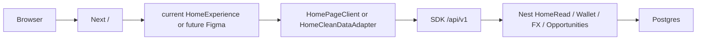

# CURRENT PROJECT AUDIT

> READ-ONLY. 2026-08-18. 구현·삭제·리팩터·Figma 착수 없음.
> 판단 근거 = 실제 import / 호출 / route / API / service / DB. 파일명·README만으로 단정하지 않음.
> Working tree는 dirty이며 그 상태 그대로 분석했다.

---

## 1. Executive Summary

이 저장소는 **pnpm monorepo**다. Consumer 앱은 `apps/web`(Next 16 · React 19 · OpenNext/Cloudflare), API는 `services/api-nest`(Nest JWT), 정산 규칙은 `services/engine-rust`, DB는 Supabase-managed PostgreSQL, 클라이언트 계약은 `packages/sdk` + `packages/ui`다.

**Production Home은 `/` → `HomePageClient` → `HomeExperience`다.** `HomeClean`은 production 홈이 아니다. `/dev/home-clean-v1`는 `NODE_ENV === "production"`이면 `notFound()`다. Home UI feature flag는 없다.

도메인 엔진(Ledger 복식부기, Wallet buckets, KRW/USDT 입출금, FX snapshot, Opportunity feed, Participate, Settlement rule, Auth JWT)은 Nest에 **실제로 구현되어 있고 컨트롤러가 마운트되어 있다.** 그러나 **web UI가 participate/preflight를 호출하는 코드는 없다.** 기회 CTA는 `/profits/:id` 이동이고, 상세 CTA는 `/trades/:id/execute`로 이동한다. execute 페이지는 `getAccessToken: () => null`이며 취소/수익합치기 핸들러는 빈 주석이다.

`/trades`는 하드코딩 `0`이다. `/wallet/history`는 통합 read API가 없어 `unavailable`이다. `/auth/oauth/kakao` Next page는 없다. `HomeCategoryCard`는 잠금 시 `/opportunities`로 가는데 해당 page는 없다.

Figma clean-room은 **가능**하다. 조건은 Home 프레젠테이션만 교체하고 SDK/Nest/Ledger/FX/Participate를 유지하는 것이다. 차단 요인은 시각 LOCK 부재, production/preview 분기, participate UI 미연결, dirty working tree다.

---

## 2. Git / Repository Baseline

| 항목 | 값 |
|---|---|
| Branch | `verify/homeclean-v1-hc6-09-current-tree` |
| HEAD | `2d4a720d931d5f9523f9ffd6d63c6b7b2d082bcb` |
| HEAD message | `fix(web): add HomeClean withdraw copy to verification closure` |
| WORKTREE CLEAN | **NO** |
| Package manager | `pnpm@10.14.0` (`package.json` `packageManager`) |
| Node | `>=22.14.0 <23` |
| Monorepo | YES — `pnpm-workspace.yaml`: `apps/*`, `packages/*`, `services/*`, `workers/*`, `tooling/*` |
| Consumer framework | Next `16.3.0` · React `19.2.0` · Tailwind v4 · OpenNext Cloudflare |
| API | Nest (`services/api-nest`) |
| Engine | Rust `services/engine-rust` → Nest가 `settlement_rule.cjs` require |
| DB | Supabase PostgreSQL (`supabase/migrations/*`, Nest `PostgresService`) |
| Auth | Nest JWT + httpOnly cookie `aipo_session` · Supabase Auth 없음 |
| Tests | `pnpm verify:*` 게이트 + 소수 unit + Playwright |
| Playwright | YES — `tooling/verify/responsive` + HomeClean/H7/wallet **dev** 스크립트 |
| Figma 코드 | Figma SDK/구현 없음. 문서·주석·wallet copy에 Figma 프레임명만 존재 |

### Working tree (분석 시점, 미변경)

수정 다수: Home(`HomePageClient`, `home-clean/*`, `packages/ui/components/home*`, `home-clean-v1`), wallet pages, SDK `current-fx`/`wallet`, Nest wallet/FX, canon contracts, rules/plans.

Untracked 예: `/dev/h7-home-preview`, `/dev/home-visual-rebuild`, `/dev/wallet-visual`, HomeClean Playwright, `packages/ui/canon/evidence/`, `services/api-nest/src/current-fx/`, `schemas/current-fx-*.json`, `supabase/migrations/20260818010000_krw_deposit_fx_facts.sql`, `_tmp_*`, `H7_CODE_HANDOFF.zip`.

이 변경은 **분석만** 했고 stage/commit/clean 하지 않았다.

### Apps / packages

| 경로 | 역할 | Production 사용 |
|---|---|---|
| `apps/web` | Consumer PWA | YES |
| `apps/admin` | Founder/ops UI (`/admin/*`) | 별 앱. web에 `/admin` 금지 |
| `packages/sdk` | HTTP 클라이언트 | YES (web import) |
| `packages/ui` | 컴포넌트·copy·tokens·canon | YES |
| `packages/schemas` | JSON schema 패키지 | 빌드/검증. UI 런타임 직접 사용은 제한적 |
| `services/api-nest` | Public/Admin API | YES (web rewrite `/api/v1` → `API_HOST`) |
| `services/engine-rust` | MATCH_SUCCESS / participate guard | Nest가 CJS로 호출 |
| `services/ai-platform` 등 | AI/feature/simulation | Nest AI 모듈이 참조. Home 직접 호출 0 |
| `workers/*` | chain-watchers, adapters, proxies | Infra. web Home 직접 import 0 |
| `supabase/migrations` | PG 스키마 | API persistence |

---

## 3. Architecture Map

### A. Application / Route

- 경로: `apps/web/app/**/page.tsx` (51 production+dev page), `apps/web/routes.ts`, `apps/web/app/layout.tsx`
- 책임: Next App Router. Root layout이 `AppShellRoot` + `ToastHost` + `DeviceTierApply`.
- 호출: `page.tsx` → client page 또는 RSC wrapper → `@aipo/sdk` / `@aipo/ui`.
- Production: `/` 및 5탭·nested routes. `/dev/*`는 production에서 `notFound()` (확인된 4개).
- Legacy 가능: `/dev/*`, `home-visual-rebuild`, H7 preview.

`apps/web/next.config.ts` rewrite: `/ads` → `/l/meta`, `/ads/:variant` → `/l/:variant`, `/api/v1/:path*` → `API_HOST` (default `http://localhost:4000`). Middleware 파일은 **없다**.

### B. UI Components

- 경로: `packages/ui/components/{home,home-clean-v1,opportunity,wallet,shell,lux,auth,execution,peotteok,trust,...}`
- Production Home 실사용: `HomeExperience`와 children (`HomeGreeting`, `HomeAiSummary`, `HomeOpportunityDiscovery`, `HomeRightRail`, `HomeUpdateTrustCompact`, `BalanceAwareHome`, `HomePrincipalRail`, `HomeSessionBanner`).
- 미사용/미리보기: `HomeClean*` (dev only), `HomeVisualRebuild`, H7 fixture surface, `OpportunityConfirm` (export만, page import 0).

### C. Feature Components

Opportunity (`OpportunityCard`, `VirtualOpportunityList`, `CategoryFilterChips`, `BalanceAwareHome`), Wallet flow + `WithdrawLiveForm`, Execution 3면, growth/trust/benefits/inbox/kyc/invite/membership.

### D. Design System

Tokens: `packages/ui/tokens/lux-fintech.ts`, `lux-theme.css`, `component.css` (Home CSS 대량), `breakpoints.ts`, `font-scale.ts`. Brand: `packages/ui/brand/**`. Copy SSOT: `packages/ui/copy/ko/*`. `ppe-ladder.ts`는 Home feature flag가 아님.

### E–F. Hooks / State

`useHomeMobileSurface` (`matchMedia max-width 767`), `useHomeChrome`, `useTradeExecution`, `usePeotteokChat`, `useWithdrawKycGate`. 전역 Redux/Zustand **없음**. 세션 SoT는 httpOnly cookie `aipo_session`.

### G. API Client (`packages/sdk`)

| 모듈 | Endpoint | Production 호출자 |
|---|---|---|
| `home-read-model` | GET `/api/v1/me/home-read` | `HomePageClient`, HomeClean live |
| `user-feed` | GET `/api/v1/opportunities`, `/:id`, `/me/day-pulse` | Home, `/profits`, `/profits/[id]`, HomeClean live |
| `growth` | GET `/api/v1/growth/public-surface` | Home (guest 포함) |
| `wallet` | buckets / withdraw / KRW deposit | `/wallet/*` |
| `current-fx` | POST `/api/v1/me/current-fx/approx` | wallet, HomeClean live. **production Home 0** |
| `home-money-read` | GET home-money-read | HomePageClient 미사용 (Nest HomeRead 내부 합성) |
| `execution-stream` | POST `/api/v1/trades/:id/execute-tick` | `/trades/[id]/execute` |
| `peotteok` | coach chat | `/me/peotteok` (`getAccessToken: () => null`) |

### H. Server API

Next Route Handler는 Home/wallet SoT가 아니다. API는 Nest. Next는 rewrite proxy. `app.module.ts` 실import: Auth, Ledger, Wallet, Growth, HomeRead, CurrentFx, Opportunities, Trades, Compliance, Risk, Referral, Mission, Membership, Inbox, Loop, Adapters, ExecutionPolicy, Simulation, AI, Events, Common.

### I. Authentication / Session

Cookie `aipo_session`. Nest `JwtAuthGuard` + `/api/v1/auth/*`. Web: Kakao만 env 게이트. Google/Passkey/Email `disabled`. Kakao href `/auth/oauth/kakao` — **Next page 없음**. Nest는 `POST /api/v1/auth/oauth/:provider/start`. `AuthCompleteProfile`은 Nest `PATCH /profile` 미호출, 로컬 후 `/onboarding`. Guest는 `GuestChrome` overlay.

### J–S. Domain locations

- DB: Nest `PostgresService` (`pg`). ORM 없음. `supabase/migrations/*.sql`. 잔액 UPDATE는 `LedgerPostingService`만.
- Money: `ledger.money.ts`. UI `format-money.ts` / `format-usdt.ts`는 표시 포맷만.
- Wallet: `WalletController` + SDK. history user API 없음.
- FX: `FxSnapshotService` (immutable insert) + `CurrentFxApproxService` (write 0). Production Home 미호출.
- Matching: `ParticipateService` + Rust `guardParticipate`. **web POST 0**.
- Opportunity: `OpportunitiesUserService` + `balance-aware-feed.ts`. mapper `opportunity-card-map.ts` 재계산 0.
- Settlement: Rust `evaluate_execution` + Nest execute-tick + journal `settlement:${trade.id}`. `/trades`는 `0`.
- Ledger: `postJournal` 복식, idempotency fingerprint 409. buckets principal/profit/locked/practice/liability.
- Notification: inbox + prefs 실호출. `/notifications` `/notices` page 없음.
- AI: Nest coach. Home `HomeAiSummary`는 LLM 호출 0.

---

## 4. Production Route Map

Layout: 기본 `AppShellRoot` (sidebar 240 / header 64 / BottomNav5 mobile). Guest 경로만 `GuestChrome` overlay. `/dev/home-clean-v1`만 `SHELL_BARE_PATHS`로 셸 제거.

반응형: 별도 mobile route **없음**. `md:` Tailwind + `useHomeMobileSurface()` (`BREAKPOINTS.md - 1` = 767).

| Route | Entry | Screen | Data | Auth | 비고 |
|---|---|---|---|---|---|
| `/` | `app/page.tsx` → `HomePageClient` | `HomeExperience` | home-read + feed + day-pulse + growth | cookie 없으면 auth fetch skip | **Production Home** |
| `/profits` | `ProfitsPageClient` | list + chips | `fetchOpportunityFeed` | session 없으면 login 링크 | Opportunity list |
| `/profits/[id]` | `profits/[id]/page.tsx` | `OpportunityDetail` | `fetchOpportunityDetail` | 401 → login | CTA → `/trades/:id/execute` |
| `/trades` | `trades/page.tsx` | 셸 + CountUp | **하드코딩 `value={0}`** | 없음 | Earnings **STUB** |
| `/trades/[id]/execute` | `execute/page.tsx` | execution 3면 | `useTradeExecution` + preview fallback | token `null` | cancel/merge **빈 핸들러** |
| `/wallet` | `wallet/page.tsx` | WalletFlow overview | buckets + current-fx | 401 → login | REAL read |
| `/wallet/deposit` | `deposit/page.tsx` | USDT/KRW flow | address GET, KRW POST | credentials | KRW submit REAL |
| `/wallet/withdraw` | `withdraw/page.tsx` | method select | KYC gate | KYC | → usdt/krw |
| `/wallet/withdraw/usdt` | `usdt/page.tsx` | `WithdrawLiveForm` | buckets + FX + POST withdraw | KYC + session | REAL |
| `/wallet/withdraw/krw` | `krw/page.tsx` | 동일 폼 | 동일 | 동일 | REAL |
| `/wallet/history` | `history/page.tsx` | EmptyState unavailable | **API 없음** | — | 필터 UI only |
| `/me` | `me/page.tsx` | 링크 허브 | **하드코딩 0** | 없음 | 네비 |
| `/me/settings` | `SettingsPanel` | notify prefs GET/PUT | prefs만 | tone/depositPref 로컬 |
| `/me/legal/*` | legal pages | copy | 없음 | 읽기 |
| `/me/kyc` | `KycFlow` | POST `/api/v1/compliance/kyc/submit` | session | REAL |
| `/me/peotteok` | `PeotteokChat` | SDK chat, token null | 약함 | send |
| `/me/membership` | `MembershipHome` | GET `/api/v1/me/membership` | fail → sprout | 읽기 |
| `/me/inbox` | `OpsInbox` | `/api/v1/me/inbox` | fail → [] | read/hide REAL |
| `/me/invite` | `InviteHome` | **빈 props** | 없음 | share 로컬, referral API 0 |
| `/me/events` | 제목+빈 카피 | 없음 | — | UI ONLY |
| `/me/strategies` | 동일 | 없음 | — | UI ONLY |
| `/me/support` | CS | wrong_chain만 POST disputes | 해당 시 | 일반은 문구만 |
| `/me/benefits` | `BenefitHub` | `/api/v1/me/benefits*` | fail → empty | 읽기 |
| `/me/guide/*` | trust/copy | 정적 | 없음 | 링크 |
| `/auth/login` | `AuthLogin` | 없음 | guest | Kakao env, 나머지 disabled |
| `/auth/signup` | `AuthSignup` | 없음 | guest | Nest signup 미호출 |
| `/auth/complete-profile` | `AuthCompleteProfile` | 없음 | — | 로컬 → `/onboarding` |
| `/onboarding` | `OnboardingFlow` | localStorage | guest | API 0 |
| `/l/[variant]` | `Landing3s` | 정적 | guest | CTA onboarding/login |
| `/ads`, `/ads/[variant]` | rewrite → `/l/*` | 동일 | guest | |

### Dev-only (production `notFound()`)

| Route | 내용 |
|---|---|
| `/dev/home-clean-v1` | `HomeCleanDataAdapter` fixture\|live |
| `/dev/h7-home-preview` | `HomeExperience` + visual fixture |
| `/dev/home-visual-rebuild` | 별도 rebuild UI |
| `/dev/wallet-visual` | wallet visual preview |

### 요청 화면 매핑

| 요청 화면 | 결과 |
|---|---|
| Home | `/` (`HomeExperience`) |
| Opportunity list | `/profits` |
| Opportunity detail | `/profits/[id]` |
| Matching / participation | API는 있음. **전용 참여 화면 없음.** CTA가 execute로 점프 |
| Matching progress | `/trades/[id]/execute` (live 약함 + preview fallback) |
| Settlement | 유저 전용 page **NOT FOUND**. 엔진은 Nest+Rust |
| Earnings | `/trades` — **STUB (0)** |
| Wallet / Deposit / Withdrawal | `/wallet`, `/wallet/deposit`, `/wallet/withdraw*` |
| Transaction history | `/wallet/history` — **unavailable** |
| My / Account | `/me` |
| Benefits | `/me/benefits` |
| Referral | `/me/invite` — **UI, API 미연결** |
| Notifications | `/me/inbox` (`/notifications` **NOT FOUND**) |
| Notices | **NOT FOUND** (Admin `growth?tab=notices`만) |
| Settings | `/me/settings` |
| Customer support | `/me/support` |
| AI | `/me/peotteok` |

---

## 5. Home Deep Dive

### 5.1 Production Home

`/` = 유일한 production Home. mobile/desktop **같은 entry**.

```
apps/web/app/page.tsx          (RSC, cookies → hasSession)
  → HomePageClient             (client, useEffect fetch)
    → HomeExperience
      → HomeGreeting
      → HomeSessionBanner
      → HomeAiSummary
      → HomePrincipalRail
      → HomeOpportunityDiscovery
      → BalanceAwareHome → carousel / category grid / OpportunityCard
      → HomeUpdateTrustCompact
      → HomeRightRail
```

Shell: `AppHeader` + `BottomNav5`(mobile bottom / desktop sidebar) + `SiteFooter`.

### 5.2 Dev preview

| Route | UI | Data | Production |
|---|---|---|---|
| `/dev/home-clean-v1` | `HomeCleanView` | fixture 기본, `?mode=live`면 SDK | `notFound()` |
| `/dev/h7-home-preview` | `HomeExperience` | `H7_VISUAL_MASTER_FIXTURE` | `notFound()` |
| `/dev/home-visual-rebuild` | `HomeVisualRebuild` | 로컬 rebuild | `notFound()` |

### 5.3 Guest / authenticated

`page.tsx`는 cookie presence만. JWT 검증은 API.

- guest: `viewState=unauthorized`, growth만, banner guest
- expired: auth 401 → banner expired
- authenticated: home-read + feed + pulse + growth

`HomePageClient`는 `displayName`·`principalKrwApprox`를 **미전달**. FX는 production Home에 없음.

### 5.4 Feature flag / fixture / RSC

Home UI 토글 **없음**. `feature-platform`은 AI pick용. Production `/` fixture import **0**. HomeClean fixture는 production throw. RSC는 cookie만, fetch는 client.

### 5.5 Dependency chain (존재하는 단계만)

```
Route `/`
→ Loader: HomePageClient.useEffect
→ Adapter: 없음 (인라인 매핑)
→ ViewModel: HomePageTruth
→ View: HomeExperience
→ Action: Link / OpportunityCard onEarn
→ API: SDK
→ Domain: Nest HomeRead / Opportunities / Growth / Loop
→ DB: Postgres
```

HomeClean (dev only):

```
/dev/home-clean-v1
→ HomeCleanDataAdapter
→ mapHomeReadModelToCleanViewModel
→ HomeCleanView
(+ live: wallet buckets + current-fx)
```

Home-read 합성 (UI 밖):

```
GET /api/v1/me/home-read
→ HomeReadService
→ HomeMoneyReadService + OpportunitiesUserService.listFeed + GrowthPublicService
→ Postgres + settlement_rule.isPriceFresh
```

CSS: `globals.css` → `lux-theme.css`. Home 레이아웃은 `packages/ui/tokens/component.css` (`.home-shell`, `[data-home-avm="v3"]`). HomeClean은 별도 module CSS.

---

## 6. UI Inventory

UI와 Domain을 섞지 않는다.

### KEEP

| 파일/영역 | 이유 |
|---|---|
| `services/api-nest/**` | 실제 도메인/HTTP SoT |
| `services/engine-rust/**` + `settlement_rule.cjs` | MATCH_SUCCESS / participate guard |
| `packages/sdk/**` | UI가 붙을 계약 |
| `supabase/migrations/**` | persistence |
| `apps/web/lib/session-cookie.ts` | 세션 presence |
| `apps/web/lib/opportunity-card-map.ts` | feed → card, 재계산 0 |
| `apps/web/lib/use-withdraw-kyc-gate.ts` | withdraw KYC |
| `apps/web/next.config.ts` rewrites | API proxy |
| `packages/ui/copy/ko/**` | 카피 SSOT |
| `packages/ui/canon/surfaces/*.wire.json` | functional canon |
| Ledger/Wallet/FX/Participate/Auth 의미 | HARD INVARIANT |

### ADAPT

| 파일 | 이유 |
|---|---|
| SDK fetch 함수 | 새 Home이 동일 endpoint 호출 가능 |
| `mapHomeReadModelToCleanViewModel.ts` | VM 패턴. 새 Figma VM에 이식 후보 |
| `HomeCleanDataAdapter.tsx` | live 오케스트레이션 참고. `/`와 중복 |
| `format-money.ts`, `format-usdt.ts` | 표시 포맷. 계산 아님 |
| `OpportunityCard` / mapper | 시각은 버려도 필드 계약 유지 가능 |
| Wallet SDK + `WithdrawLiveForm` | action 유지 |
| `USER_TABS` | 5탭 href 계약. 시각은 교체 가능 |

### LEGACY-UI (지금 삭제 금지)

| 파일 | 이유 |
|---|---|
| `packages/ui/components/home/HomeExperience.tsx` 및 동 디렉터리 | 현재 production Home 시각 |
| `apps/web/app/HomePageClient.tsx` | 현재 Home 오케스트레이션 |
| `packages/ui/tokens/component.css` Home 블록 | 현재 Home CSS. 오염 위험 |
| `packages/ui/components/home-clean-v1/**` | 별도 clean-room. Figma와 다르면 폐기 |
| `/dev/h7-home-preview`, `/dev/home-visual-rebuild`, `/dev/home-clean-v1` | preview |
| `packages/ui/canon/evidence/h7-home-v2`, `h7-home-v3` | 이전 증거 |
| `HomeHero.tsx` / `HomeHeroIllustration.tsx` | git status `D`. 런타임 0 |

### UNKNOWN

Wallet flow가 Home 교체 범위인지, `BottomNav5`/`AppHeader`를 전역 Figma로 바꿀지, lux ticker 유지 여부, `home-v3` vs `home-clean` 자산 중 어느 것이 다음 Master인지 — 코드만으로 불가. Admin은 consumer Figma 대상 아님.

---

## 7. Backend / Engine Inventory

판정 기준: Nest 모듈 등록 + 컨트롤러 + (가능하면) web 호출.

### AUTH

Entry `auth.controller.ts`. Public: signup, session, logout, refresh, oauth, passkey, magic-link, delete-account. UI는 Nest signup/oauth start를 **직접 안 부름**. API는 Figma 재사용 가능. **갭:** Kakao → `/auth/oauth/kakao` page 0.

### WALLET / BALANCE / DEPOSIT / WITHDRAW

| 기능 | Entry | UI 호출 | 재사용 |
|---|---|---|---|
| BALANCE | GET `wallet/buckets` | `/wallet` REAL | YES |
| DEPOSIT USDT | GET `my-deposit-address` | deposit REAL | YES |
| DEPOSIT KRW | POST `krw-deposit-requests` + Admin decide | deposit REAL | YES |
| WITHDRAW | POST `wallet/withdraw` + step-up | `WithdrawLiveForm` REAL | YES |

Idempotency: KRW `kd_*`, withdraw `newWithdrawIdempotencyKey`. KYC는 withdraw-only.

### FX

`FxSnapshotService` immutable insert. Display `POST /api/v1/me/current-fx/approx` (write 0, 클라 곱셈 0). UI: wallet + HomeClean live. **production Home 0**. 재사용 YES.

### OPPORTUNITY / QUOTE / ELIGIBILITY

`OpportunitiesUserController` — Home/profits 실호출. Eligibility는 서버 `balance-aware-feed.ts`. 재사용 YES.

### MATCHING

POST `opportunities/:id/participate` + preflight. Guard: Rust + Risk + membership. Ledger `participate_lock` + idempotency fingerprint. **web UI 호출 0**. API는 재사용, UI는 새로 연결.

### SETTLEMENT / LEDGER / TRANSACTION

Settlement: `trades.execution.service` + `settlement_rule.cjs` ← Rust. Ledger: `LedgerPostingService.postJournal` 유일 mutate. User history API **없음**. `/trades`는 엔진 값을 안 읽고 `0`.

### NOTIFICATION

Inbox + prefs 실호출. 공지 유저 route 없음.

---

## 8. Button / Action Contract Inventory

### SCREEN: `/` Home

| ACTION | COMPONENT | HANDLER | ROUTE/API | REALITY |
|---|---|---|---|---|
| 탐색 CTA | `HomeOpportunityDiscovery` | `Link` | `#home-opportunity` | **UI ONLY** (앵커) |
| 입금 | `HomePrincipalRail` | `Link` | `/wallet/deposit` | REAL nav. guest disabled |
| 출금 | 동일 | `Link` | `/wallet/withdraw` | REAL nav. guest disabled |
| 수익 벌기 | `OpportunityCard` | `/profits/:id` | participate 미호출 | **NAV ONLY** |
| 입금 제안 | nearMiss 카드 | `Link` | `/wallet/deposit?tab=usdt&suggest=` | REAL nav |
| 카테고리 카드 | `HomeCategoryCard` | `Link` | 없으면 `/opportunities` | **DEAD HREF** |
| 캐러셀 더보기 | `HomeFeaturedCarousel` | `Link` | `/profits` | REAL nav |
| 인사이트 | `HomeInsightTeaser` | `Link` | `/me/guide/market-weekly` | REAL nav |
| 로그인 배너 | `HomeSessionBanner` | `Link` | `/auth/login` | REAL nav |
| 5탭 / 헤더 알림 / 고객센터 | shell | `Link` | tabs / inbox / support | REAL nav |

### SCREEN: `/profits` · `/profits/[id]`

카테고리 칩 = local filter. 카드/상세 CTA → execute. **participate 0**. `OpportunityConfirm` / PreCTA는 **어느 page도 import하지 않음**.

### SCREEN: `/trades/[id]/execute`

| ACTION | HANDLER | REALITY |
|---|---|---|
| 진행 폴링 | `useTradeExecution` | token null. 실패 시 **previewState `12.50` 발명** |
| 취소 / 수익 합치기 | 빈 함수 | **UI ONLY** |
| 나중에 | `location=/` | NAV |

### SCREEN: `/wallet*`

buckets / FX / KRW 신청 / 출금 / step-up = REAL. 내역 필터 = UI ONLY.

### SCREEN: Auth / Me

Kakao page 없음. Google/Passkey/Email disabled. Signup Nest POST 미호출. Complete profile 로컬. Inbox/KYC/Benefits/notify prefs REAL. Invite/Events/Strategies UI ONLY. Support wrong_chain REAL.

---

## 9. Fixture / Mock Inventory

| 항목 | 위치 | 구분 | Production 유입 |
|---|---|---|---|
| H7 visual fixture | `h7-home-v3/visual-master.fixture` | preview | `/dev/h7-home-preview` + `notFound()` |
| HomeClean fixture VM | `HomeCleanFixture.ts` | dev | fixture 모드 + production throw |
| execute `previewState` | `trades/[id]/execute/page.tsx` | **production fallback** | **YES — 가짜 숫자** |
| `/trades` CountUp `0` | `trades/page.tsx` | hardcoded | YES |
| `/me` journey `0` | `me/page.tsx` | hardcoded | YES |
| Invite 빈 code | `InviteHome` defaults | placeholder | YES |
| HomeClean/H7/wallet PW | `dev/*`, canon/evidence | test/dev | 0 |
| canon-structure fixtures | `tooling/verify/responsive` file:// | test | 0 |
| Growth ticker `demo` | Admin config | API 필드 | 서버가 demo면 Home ticker demo |
| `_tmp_mockup_preview/*.png` | untracked | 참고 | 앱 import 0 |

**Production Home(`/`) fixture 사용: NO.**

**Production execute preview fallback: YES — 위험.**

---

## 10. Design System / Governance

실제 제약: Constitution + Money/Engine/Auth; Visual Master/Contract (locks `[]`); Canon wire는 file:// fixture block order (production `/` 브라우저 검증 아님); mockup PNG 금지; 현재 Home 구현은 권위 아님; copy SSOT; CTA `수익 벌기`.

### DOCUMENT / IMPLEMENTATION MISMATCH

| 문서/계약 | 코드 |
|---|---|
| Participate가 Home/상세 CTA 도메인 | web participate POST **0** |
| Kakao thin route | `/auth/oauth/kakao` page **없음** |
| Opportunity list `/profits` | `HomeCategoryCard` fallback `/opportunities` **없음** |
| Home KRW approx 슬롯 | production Home FX/KRW props **미전달** |
| Canon/H7 evidence | production Home ≠ HomeClean ≠ H7 fixture |
| `visual-locks` LOCK | `locks: []` |
| Invite Money pointer | referral API 미호출 |
| `/trades` settlement totals | UI `0` 고정 |
| Auth complete-profile PATCH | 로컬 redirect만 |

---

## 11. Testing / Playwright

| 종류 | 위치 | Production UX? |
|---|---|---|
| Verify 게이트 | `tooling/verify/*.cjs` | 코드/카피/경로. 브라우저 UX 아님 |
| Unit | home-clean, current-fx, krw-deposit | 모듈 |
| Playwright canon-structure | `tooling/verify/responsive` | **file:// fixture**. production route 0 |
| HomeClean PW | `playwright-home-clean-*.mjs` | **`/dev/home-clean-v1`** |
| H7 / wallet visual PW | canon/evidence, `dev/wallet-visual` | **dev preview** |
| E2E authenticated production | **NOT FOUND** | |
| Visual regression LOCK | `locks: []` | 공식 픽셀 회귀 **없음** |

Viewport 목록은 있음. **인증 세션으로 production `/`를 도는 공식 E2E는 없음.**

---

## 12. UI ↔ Domain Coupling Risks

production Home은 Money/FX/matching **진리를 계산하지 않는다.** 위험은 가짜 fallback과 죽은 href다.

표시 포맷만: `format-usdt.ts`, `format-money.ts`, `home-clean-money.ts`, `HomePageClient` 표시 게이트, `opportunity-card-map.ts`.

| 파일 | 로직 | 위험 |
|---|---|---|
| `apps/web/app/trades/page.tsx` | `CountUpNumber value={0}` | 가짜 0 |
| `trades/[id]/execute/page.tsx` | `previewState` `12.50` USDT | **production 금액 발명** |
| 동일 | cancel/merge 빈 핸들러, `getAccessToken: () => null` | 금융 CTA UI ONLY |
| `HomeCategoryCard.tsx` | `/opportunities` | 죽은 라우트 |
| `kakao-ready.ts` | `/auth/oauth/kakao` | 죽은 라우트 |
| `me/page.tsx` | `matchSuccessCount: 0` | 가짜 Fact |
| `HomePageClient` vs HomeClean adapter | 동일 SDK 이중 오케스트레이션 | 중복 |

서버에 있는 것: bucket/eligibility, FX apply, participate guard, settlement evaluate.

---

## 13. Figma Clean-room Migration Readiness

**가능: YES, Home 프레젠테이션에 한정하면.**

| 분류 | 내용 |
|---|---|
| SAFE TO PRESERVE | Nest, Rust, migrations, SDK, session cookie, copy/ko, canon wires(기능) |
| SAFE TO REUSE WITH ADAPTER | home-read + feed + day-pulse + growth (+ wallet + current-fx). mapper 패턴 |
| MUST REBUILD FOR FIGMA | `HomeExperience` 트리, Home CSS, (채택 시) HomeClean 시각 |
| LEGACY REMOVE AFTER CUTOVER | 구 Home JSX/CSS, `/dev` preview, H7 evidence, 중복 adapter |
| RISKY | participate 미연결; execute preview; `/trades` 0; Kakao route; dirty tree; 어느 Visual Master인지 |

권장: 새 Figma JSX를 빈 라우트에 두고 SDK만 연결. 기존 `component.css` Home 규칙 import 금지.

```mermaid
flowchart LR
  Opportunity["Opportunity feed"] --> Quote["Pricing + fx_snapshot_id"]
  Quote --> Eligibility["balance-aware-feed"]
  Eligibility --> Funding["principal bucket"]
  Funding --> FX["fx_snapshots / current-fx approx"]
  FX --> Matching["ParticipateService + guardParticipate"]
  Matching --> Ledger["participate_lock journal"]
  Ledger --> Settlement["execute-tick + settlement_rule"]
  Settlement --> Wallet["buckets / profit"]
```





두 번째 그림은 **엔진에 존재**. UI→Matching 화살표는 **현재 web에 없음**.

---

## 14. Recommended Target Architecture

구현하지 않음.

```
Figma Home (새 프레젠테이션)
  → Thin route loader (RSC session flag)
  → Single adapter (SDK only)
  → Display ViewModel (계산 0)
  → Figma View
  → Actions → 기존 SDK
       GET home-read / opportunities / day-pulse / growth
       POST current-fx/approx
       GET wallet/buckets
       POST preflight + participate
       POST execute-tick (token 연결)
```

---

## 15. Proposed Migration Order

코드 변경 없음.

0. Phase 0 Audit — 본 문서. dirty tree 보존.
1. Phase 1 Figma Home clean-room — 새 폴더/dev route. 기존 CSS import 0.
2. Phase 2 Visual convergence — viewport 캡처. LOCK은 Founder 승인 후.
3. Phase 3 Data integration — SDK adapter 1개.
4. Phase 4 Actions — participate/preflight 최초 연결. execute token. `/trades` 실데이터. Kakao 실제 start.
5. Phase 5 Production cutover — `/`를 새 View로.
6. Phase 6 Legacy deletion — 구 Home JSX/CSS, 중복 adapter.

병렬로 고치면 안 되는 것: Ledger, FX apply, participate 서버, Auth cookie 의미.

---

## 16. DO NOT DELETE YET

- `services/api-nest/**`, `services/engine-rust/**`
- `packages/sdk/**`
- `supabase/migrations/**`
- `apps/web/app/page.tsx`, `HomePageClient.tsx`
- `packages/ui/components/home/**`
- `packages/ui/components/home-clean-v1/**`
- `apps/web/app/home-clean/**`
- Wallet live pages + `WithdrawLiveForm`
- `packages/ui/copy/ko/**`
- Canon wires / contracts
- `USER_TABS` / `USER_NESTED_ROUTES`
- 현재 dirty working tree의 미커밋 Home/FX/wallet 작업

---

## 17. SAFE LEGACY DELETE CANDIDATES

**cutover + Founder 승인 후에만.** 지금 삭제 금지.

- `HomeExperience` 및 전용 children (새 Home이 `/`를 완전히 대체한 뒤)
- `component.css` Home 전용 블록
- `/dev/h7-home-preview`, `/dev/home-visual-rebuild`
- HomeClean 시각 (Figma가 다른 SSOT일 때)
- `_tmp_mockup_preview`, `H7_CODE_HANDOFF.zip`

---

## 18. Open Questions / Unknowns

1. 다음 Visual Master는 H7 v3인가, HomeClean인가, 아직 안 온 Figma인가?
2. `NEXT_PUBLIC_OAUTH_KAKAO_ENABLED` 런타임 값 — 레포에 없음.
3. Production `API_HOST` / cookie 도메인 운영 값.
4. participate UI 미연결이 의도적 보류인지 누락인지.
5. User wallet history API 계획.
6. `/trades`용 수익 합 endpoint — HomeRead `ledgerTotal`은 count.
7. Working tree current-fx / HomeClean이 main 의도인지 브랜치 실험인지.
8. Admin notices를 유저 공지로 내릴지.
9. `HomeCategoryCard` `/opportunities`가 옛 IA인지 오타인지.
10. execute `previewState`가 개발 편의인지 — production 번들에 포함됨.

---

## Audit checklist

- [x] production Home entry (`/`, `HomePageClient`, `HomeExperience`)
- [x] mobile Home entry (동일 route, `useHomeMobileSurface`)
- [x] 주요 route (`routes.ts` + page.tsx)
- [x] auth 흐름 (cookie + Nest + UI 갭)
- [x] wallet 흐름 (buckets, deposit, withdraw, history 공백)
- [x] FX 흐름 (snapshot + approx; Home 미사용)
- [x] matching 흐름 (ParticipateService 존재, UI 미호출)
- [x] ledger 흐름 (posting SoT)
- [x] settlement 흐름 (Rust + execute-tick)
- [x] fixture/mock
- [x] legacy UI 후보
- [x] design system / governance
- [x] Playwright
- [x] button/action inventory
- [x] UI-domain coupling
